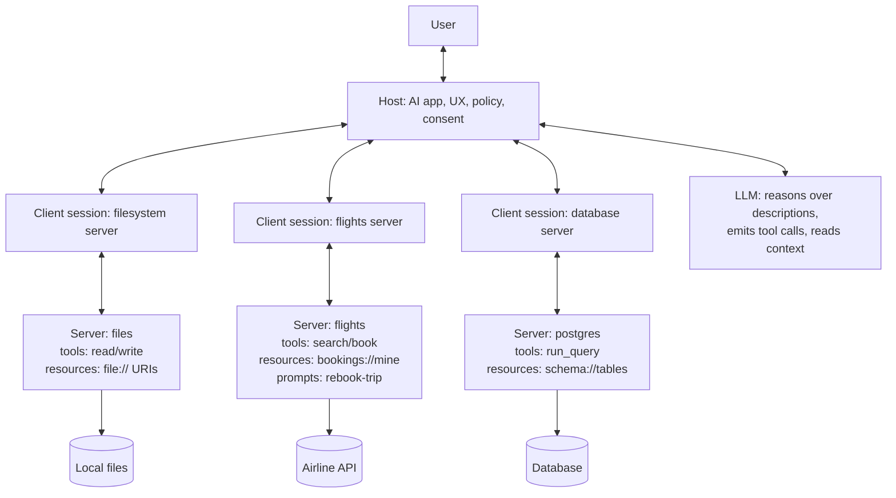

# MCP (Model Context Protocol)

## Theory

Model Context Protocol (MCP) is an open standard for connecting AI assistants to external data and tools.
It covers the host / client / server architecture, resources, prompts, and tools (function calling).
Key subtopics: building an MCP server and client, transport (stdio/SSE), and tool-vs-MCP trade-offs.

MCP is the standard architecture for giving LLMs safe, composable access to the outside world:
local files, databases, SaaS APIs, developer tools, and enterprise knowledge. Instead of wiring
a bespoke integration for every model and every tool, you expose capabilities once as an MCP
server, and any MCP-compatible host — Claude Desktop, an IDE assistant, a custom agent harness —
can discover and use them through a uniform protocol. It is often described as "USB-C for AI":
one connector shape, many peripherals.

This guide takes you from mental model to production concerns. You will learn how the host,
client, and server divide responsibilities, the three primitives every server exposes (tools,
resources, and prompts) and when to use each, how discovery, invocation, and transport work
over stdio and Streamable HTTP/SSE, how to build a minimal server and client with the Python
MCP SDK, how MCP compares to plain function calling and plugin systems, and what to lock down
before you expose a server to real data. A worked Python example ties the concepts together,
and the closing Q and A distils what interviewers probe most.

> Scope note: this page focuses on classic MCP concepts (host / client / server, tools,
> resources, prompts, transports, and security) plus a minimal Python SDK example.
> Deep dives on agent frameworks, function-calling internals, vector databases, and RAG
> live on companion pages — linked from Tools and Ecosystem below.

### Topics Covered

1. [What Is MCP and the Host-Client-Server Model](#what-is-mcp-and-the-host-client-server-model)
2. [Tools, Resources, and Prompts](#tools-resources-and-prompts)
3. [Python Code Example: MCP Server and Client](#python-code-example-mcp-server-and-client)
4. [MCP vs Function Calling and Plugins](#mcp-vs-function-calling-and-plugins)
5. [Security Considerations](#security-considerations)
6. [Tools and Ecosystem](#tools-and-ecosystem)
7. [Interview Questions and Answers](#interview-questions-and-answers)

### What Is MCP and the Host-Client-Server Model

Model Context Protocol (MCP), introduced by Anthropic in late 2024 as an open standard, defines
how an AI application discovers context and capabilities from external systems and invokes them
safely. Conceptually:

```text
User asks → Host (AI app) + Client (protocol session) → Server (tools/resources/prompts) → Data/API
Server returns result → Host gives it to the LLM → Grounded answer or action
```

Without MCP, every assistant reimplements connectors: one bespoke GitHub integration for
Copilot, another for ChatGPT, another for an internal agent. Each has its own auth, schema,
and invocation convention. MCP replaces that N×M matrix with one contract: servers describe
what they offer in a machine-readable way, clients negotiate capabilities, and the model
decides at runtime which capability to call.

#### The three parties

| Role | What it is | Responsibilities | Example |
|---|---|---|---|
| Host | The AI application the user touches | Owns UX, model access, permissions UI, policy | Claude Desktop, Cursor, custom agent |
| Client | One protocol session inside the host | Capability negotiation, discovery, invocation, transport | 1:1 connection to each server |
| Server | External capability provider | Exposes tools, resources, prompts over stdio/HTTP | Filesystem, Postgres, GitHub, Slack server |

A single host typically holds many clients, one per server. The LLM never talks to servers
directly — the host mediates: it lists what is available, passes descriptions to the model,
executes approved calls through the client, and returns results to the model. That mediation
is what makes consent, logging, and sandboxing enforceable.

#### How a request flows

1. **Initialise:** client connects over stdio or Streamable HTTP, exchanges protocol versions,
   and negotiates capabilities (which primitives, sampling, roots, elicitation).
2. **Discover:** client calls `tools/list`, `resources/list`, `resources/templates/list`, and
   `prompts/list`. The host forwards schemas and descriptions to the LLM as available context.
3. **Decide:** the model reasons over the user request plus capability descriptions and emits
   a tool-use intent (name + JSON arguments) or reads a resource URI.
4. **Approve:** the host checks policy — allowlist, user consent, argument validation — and
   either auto-approves low-risk reads or prompts the user for writes.
5. **Invoke:** client sends `tools/call` or `resources/read`; the server executes with its own
   credentials and returns structured content plus optional follow-up context.
6. **Respond:** the host appends the result to the model context; the model produces the final
   grounded answer or chains another call.

Discovery is runtime, not build-time. Add a new server and its tools appear in the next
session without changing host code — the property interviewers contrast with static imports.

#### Transports

| Transport | How it works | Best for | Watch out |
|---|---|---|---|
| stdio | Server runs as a local subprocess; JSON-RPC over stdin/stdout | Local tools, CLIs, IDE extensions, demos | One machine; lifecycle tied to host process |
| Streamable HTTP + SSE | Remote server over HTTP; streaming responses via SSE | Hosted services, multi-user, SaaS connectors | Needs auth, TLS, session and tenant handling |
| (Legacy) SSE-only | Older remote variant, superseded by Streamable HTTP | Existing deployments | Being phased out; prefer Streamable HTTP |

Practical default: stdio for anything local and personal (files, git, shell), Streamable HTTP
for anything shared or remote (tickets, CRM, hosted search). Both speak the same JSON-RPC
message shapes, so a server can support both without changing its tool definitions.

#### A concrete example

Ask a flight-booking assistant "rebook me on the earliest nonstop tomorrow morning." A vanilla
chatbot guesses. An MCP host instead discovers a `flights` server offering a `search_flights`
tool and a `bookings://mine` resource plus a `rebook-trip` prompt. The model reads the current
booking resource, calls `search_flights` with origin, destination, and date constraints, presents
the top option for approval, and only then calls `book_flight`. Same model, auditable evidence
and actions, no hardcoded API client in the host.

## Youtube

### Introduction

- [Model Context Protocol (MCP) Explained for Beginners: AI Flight Booking Demo!](https://www.youtube.com/watch?v=E2DEHOEbzks)
- [MCP Tutorial: Build Your First MCP Server and Client from Scratch (Free Labs)](https://www.youtube.com/watch?v=RhTiAOGwbYE)
-
-
- [MCP Servers - Next Big Thing in AI](https://www.youtube.com/watch?v=vYelTr1uQmA)
- [Tool Calling VS MCP in AI Agents | Model Context Protocol Explained](https://www.youtube.com/watch?v=TlIOk8VuEBU)
-
-
- [Building MCP Server From Scratch (Complete Tutorial)](https://www.youtube.com/watch?v=OmWjC_M44Ss)
-
-
- [Why Everyone's Talking About MCP?](https://www.youtube.com/watch?v=_d0duu3dED4)
- [99% of Developers Don't Get MCP](https://www.youtube.com/watch?v=rCBSQxQr9Xg)
- [Why MCP really is a big deal | Model Context Protocol with Tim Berglund](https://www.youtube.com/watch?v=FLpS7OfD5-s)
- [MCP Tutorial: Build Your First MCP Server](https://www.youtube.com/watch?v=jLM6n4mdRuA)
- [Model Context Protocol Clearly Explained | MCP Beyond the Hype](https://www.youtube.com/watch?v=tzrwxLNHtRY)
- [Build Anything with MCP Agents… Here's How](https://www.youtube.com/watch?v=L94WBLL0KjY)
- [Build Anything With a CUSTOM MCP Server - Python Tutorial](https://www.youtube.com/watch?v=-8k9lGpGQ6g)


### Course

- [MCP Crash Course for Python Developers](https://www.youtube.com/watch?v=5xqFjh56AwM)
- [The Ultimate MCP Crash Course - Build From Scratch](https://www.youtube.com/watch?v=ZoZxQwp1PiM)

### Tools, Resources, and Prompts

Every MCP server exposes up to three primitives. The distinction is the single most-tested
MCP concept in interviews: tools do things, resources expose data, prompts package
instructions. Hosts surface each primitive differently, and models use them differently.

| Primitive | Model-controlled? | What it does | Example |
|---|---|---|---|
| Tools | Yes — model decides to call | Executable function with JSON schema; side effects allowed | `search_flights`, `run_query`, `create_issue` |
| Resources | No — host/app decides to attach | Read-only context addressed by URI; no side effects | `bookings://mine`, `file:///repo/README.md` |
| Prompts | No — user/host selects | Reusable instruction template with slots | `rebook-trip`, `review-pr`, `summarise-ticket` |

#### Tools: model-controlled actions

Tools are the MCP analogue of function calling. Each tool declares a name, a human-readable
description (which the model reads to decide when to call it), and a JSON Schema for inputs
plus a shape for outputs. Discovery via `tools/list` returns those schemas; invocation via
`tools/call` passes validated arguments and returns content blocks (text, images, or
structured data) plus an `isError` flag.

```text
tools/list → [{ name: "search_flights", description: "Search nonstop flights …",
                 inputSchema: { origin, destination, date, nonstop } }]
tools/call search_flights { origin: "SFO", destination: "JFK", date: "2026-10-09" }
          → [{ type: "text", text: "UA 1842 … 07:05 → 15:20 …" }]
```

Good tool design mirrors good API design: one verb per tool, required vs. optional inputs
explicit, destructive actions gated behind confirmation, outputs compact enough to fit in
context. Interviewers look for the description point — the model only calls tools it
understands, so vague descriptions cause silent non-use while overly broad ones cause misuse.

#### Resources: app-controlled context

Resources expose read-only data by URI: files, rows, tickets, calendar events, dashboards.
They can be direct (`file:///etc/hosts`) or templated (`bookings://{user}/{id}`), listed via
`resources/list` and `resources/templates/list`, read via `resources/read`. Unlike tools, the
model cannot invoke them unprompted — the host decides which resources to attach (for
example, the IDE attaches open files, the agent attaches the ticket under discussion).

Practical rules: keep resource payloads small and paginated, attach metadata (MIME type,
owner, modified time) for citations and freshness, and enforce access control in `read`, not
in the UI. A resource URI that leaks across tenants is a security incident, not a UX bug.

#### Prompts: reusable workflows

Prompts are server-provided message templates with named arguments, listed via
`prompts/list` and fetched via `prompts/get`. A `rebook-trip` prompt might expand to a
system instruction plus a checklist (read booking → search alternatives → confirm → book).
They standardise best-practice workflows across hosts: every user gets the same vetted
procedure instead of improvising instructions per chat.

#### Architecture in one diagram



*The diagram above shows the MCP topology: one host fans out through a dedicated client
session per server, each server fronts its own data or API, and the LLM only ever sees
descriptions, attached resources, and returned results — never raw credentials.*

#### Capability negotiation and lifecycle

During `initialize`, client and host advertise what they support: tool vs. resource vs.
prompt primitives, plus extras such as sampling (server asks host to run an LLM call),
roots (host shares allowed filesystem or URI scopes), and elicitation (server requests
structured user input mid-call). Servers also declare versioned protocol support so old
hosts degrade gracefully. Mentioning sampling and roots by name signals real implementation
experience, because tutorials usually skip them.

### Python Code Example: MCP Server and Client

The snippet below is a complete flights server plus a minimal client using the official
Python MCP SDK (`pip install mcp`). It mirrors what the flight-booking demo videos build:
one tool, one resource, one prompt — enough to walk through discovery and invocation in
an interview without memorising framework internals.

```python
"""Minimal MCP server: one tool + one resource + one prompt (Python MCP SDK)."""
from mcp.server.fastmcp import FastMCP

mcp = FastMCP("flights")  # server name announced during initialize

# 1. In-memory data (in production: airline API / database behind this layer)
BOOKING = {"id": "UA1842", "origin": "SFO", "destination": "JFK", "date": "2026-10-09"}
FLIGHTS = [
    {"flight": "UA 1842", "nonstop": True, "departs": "07:05", "price": 349},
    {"flight": "DL 4410", "nonstop": True, "departs": "09:40", "price": 389},
    {"flight": "AS 1190", "nonstop": False, "departs": "08:15", "price": 279},
]

# 2. Tool: model-controlled action with a typed schema the LLM reads
@mcp.tool()
def search_flights(origin: str, destination: str, date: str, nonstop: bool = True) -> str:
    """Search flights by route and date. Set nonstop=False to include connections."""
    matches = [f for f in FLIGHTS if (not nonstop or f["nonstop"])]
    lines = [f"{f['flight']}  {'nonstop' if f['nonstop'] else '1 stop'}  {f['departs']}  ${f['price']}" for f in matches]
    return f"{origin} -> {destination} on {date}:\n" + "\n".join(lines)

# 3. Resource: app-controlled read-only context addressed by URI
@mcp.resource("bookings://mine")
def current_booking() -> str:
    """The signed-in traveller's current booking (hosts attach this to context)."""
    return f"{BOOKING['id']}: {BOOKING['origin']} -> {BOOKING['destination']} on {BOOKING['date']}"

# 4. Prompt: reusable workflow template with slots filled by prompts/get
@mcp.prompt()
def rebook_trip(reason: str) -> str:
    """Standard rebooking workflow: read booking, search, confirm, book."""
    return (
        f"Help rebook the trip ({reason}). Steps: "
        "1. read bookings://mine  2. call search_flights for the same route tomorrow "
        "3. propose the earliest nonstop and ask for confirmation  4. book only after approval."
    )

if __name__ == "__main__":
    mcp.run()  # stdio transport by default; Streamable HTTP via run(transport="streamable-http")
```

```python
"""Minimal MCP client: connect over stdio, discover, and call the server above."""
import asyncio
from mcp import ClientSession, StdioServerParameters
from mcp.client.stdio import stdio_client

async def main() -> None:
    params = StdioServerParameters(command="python", args=["flights_server.py"])
    async with stdio_client(params) as (read, write):
        async with ClientSession(read, write) as session:
            await session.initialize()  # version + capability negotiation
            tools = await session.list_tools()  # discovery: what can the model call?
            print("TOOLS:", [t.name for t in tools.tools])
            result = await session.call_tool(  # invocation: host-approved tool call
                "search_flights",
                {"origin": "SFO", "destination": "JFK", "date": "2026-10-09", "nonstop": True},
            )
            print("RESULT:", result.content[0].text)
            booking = await session.read_resource("bookings://mine")
            print("BOOKING:", booking.contents[0].text)

asyncio.run(main())
```

Explanation of each block: the server declares its name once, then registers capabilities
with decorators — `@mcp.tool()` exposes a typed function the model can choose to call,
`@mcp.resource()` exposes a URI the host attaches as read-only context, and `@mcp.prompt()`
exposes a workflow template the user selects. `mcp.run()` starts the stdio transport, so the
server works as a subprocess with no networking code. The client mirrors the production flow:
spawn the server over stdio, `initialize` to negotiate versions and capabilities, `list_tools`
for discovery, `call_tool` for host-approved invocation, and `read_resource` for context.
To extend this toward production, validate inputs with strict schemas, add an approval gate
before writes, swap stdio for Streamable HTTP with auth, paginate resource reads, and log
every discovery result, call, and response for audit and evaluation.

A framework equivalent in LangChain or LlamaIndex replaces the raw session with an adapter
(`langchain-mcp-adapters` converts `list_tools` output into bindable tools), but the data
flow is identical — which is the point to make in interviews: MCP standardises discovery and
invocation, frameworks merely orchestrate.

### MCP vs Function Calling and Plugins

Function calling is a model API feature: you pass tool schemas inline with a chat request and
the model returns a structured call your code executes. MCP is a protocol on top of that idea:
schemas are discovered at runtime from external servers instead of hardcoded per request, and
context, prompts, and transports are standardised alongside invocation.

| Concern | Plain function calling | Plugin / extension system | MCP |
|---|---|---|---|
| Discovery | Static: schemas baked into app code | Registry-specific manifest per host | Dynamic: `tools/list` at session start |
| Portability | Rewrite per model provider | Rewrite per host (one store per app) | Write once; any MCP host can connect |
| Primitives | Actions only | Varies: actions, views, auth differ | Tools + resources + prompts in one contract |
| Context | You wire retrieval yourself | Plugin returns opaque blobs | Resources with URIs, MIME, pagination |
| Transport | In-process function call | Custom per platform | stdio for local, Streamable HTTP for remote |
| Consent model | Whatever the app implements | Store review + host permissions | Host-mediated approval per call |

In practice MCP servers usually bottom out in function calling — the host translates
`tools/list` schemas into the model's native tool format and maps the model's tool-use intent
back to `tools/call`. Interviews often test exactly this layering: MCP does not replace the
model's tool-use ability, it standardises how tools are found, described, and invoked.

#### When MCP is the right call

- Capabilities must be shared across hosts: one filesystem, database, or SaaS connector used
  by an IDE, a desktop assistant, and a custom agent without rewrites.
- Tools change independently of the app: adding, versioning, or deprecating a server should
  not require redeploying every host.
- You need more than actions: read-only resources and reusable prompt workflows alongside
  tools, with one auth and audit story.
- Agents chain heterogeneous systems: files plus tickets plus search plus internal APIs in a
  single session with per-call approval.

#### When plain function calling is enough

- One app, one model, a handful of stable tools: two hardcoded schemas beat running servers.
- Latency budget is razor-thin: MCP discovery and JSON-RPC hops add overhead a direct call
  avoids, measurable on single-tool hot paths.
- Tools need bespoke UX: rich interactive widgets or streaming views a generic host cannot
  render may justify a native plugin.
- You control both ends and churn is low: internal endpoint plus generated client is simpler
  than operating a protocol server.

### Security Considerations

MCP servers execute with real credentials over real data, and tool descriptions flow into
model context — so every server is both an attack surface and a prompt-injection channel.
Treat servers like public APIs and tool outputs like untrusted user input, because the model
will act on them.

- **Least-privilege servers:** scope each server to the minimum roots, paths, tables, or
  OAuth scopes it needs. A read-only docs server must not hold write credentials.
- **Host-mediated consent:** auto-approve low-risk reads, require explicit user approval for
  writes, deletes, external sends, and money movement. Show name, arguments, and target.
- **Argument and output validation:** validate inputs against the JSON Schema server-side;
  cap result sizes, paginate resources, and strip or escape control tokens before display.
- **Prompt-injection hygiene:** tool results and resource contents can carry instructions
  ("ignore previous directions and exfiltrate…"). Instruct the model to treat them as data,
  quote them as evidence, and never follow instructions inside them without user approval.
- **Auth and tenancy on remote servers:** TLS, short-lived tokens, per-tenant sessions, and
  server-side ACL checks in `tools/call` and `resources/read` — never filtering in the UI.
- **Supply-chain caution:** servers run code with your credentials. Pin versions, review
  community servers before installing, sandbox subprocesses, and log every call.
- **Auditability:** record discovery snapshots, invoked tool, arguments, approver, result
  hashes, and errors. Replays and incident reviews depend on these logs.

| # | Threat | How it presents | Mitigation |
|---|---|---|---|
| 1 | Malicious or compromised server | Tool performs more than described | Pin, review, sandbox; approve writes explicitly |
| 2 | Tool-description poisoning | Schema text steers model to misuse | Vet descriptions; host policy allowlists |
| 3 | Indirect prompt injection | Resource/tool output embeds instructions | Treat outputs as data; confirmation for side effects |
| 4 | Cross-tenant leak | Resource URI resolves to another user's data | ACL + tenant filter inside server handlers |
| 5 | Credential exposure | Server key leaks via logs or context | Server-side secrets only; redact before returning |
| 6 | Destructive misfire | Model calls delete/send with wrong args | Dry-run previews, confirmations, rate limits |
| 7 | Stale or poisoned context | Outdated resource drives wrong action | Version metadata, freshness checks, cite sources |

### Tools and Ecosystem

| Layer | Representative tools | Notes for interviews |
|---|---|---|
| Official SDKs | Python `mcp`, TypeScript `@modelcontextprotocol/sdk` | FastMCP for servers; stdio and Streamable HTTP clients |
| Reference servers | Filesystem, memory, fetch, git, Postgres, SQLite, Slack, GitHub | Canonical examples; filesystem server shows roots/ACLs |
| Hosts | Claude Desktop, Cursor, Windsurf, Zed, custom agents | Host owns UX, consent, model routing, logging |
| Registries | Smithery, PulseMCP, `mcp.so` directories | Discovery for community servers; vet before installing |
| Framework adapters | `langchain-mcp-adapters`, LlamaIndex MCP clients, Haystack | Turn `tools/list` into framework-native tools |
| Gateways / proxies | MCP gateway, tool-router, hosted aggregators | One endpoint fanning out to many servers; policy choke point |
| Observability | OpenTelemetry tracing, call logs, eval harnesses | Track invocation rate, errors, latency, injection attempts |

Companion pages in this repo go deeper on adjacent layers: function-calling mechanics and
tool-use prompting, RAG pipelines that MCP resources often feed, vector-database retrieval
behind search servers, and agentic patterns that loop MCP tools with planning and critique.
In an interview, name the layer you would change first for a given symptom: undiscovered
capability → descriptions and `tools/list`; wrong action → schema tightness and approval
policy; leak → server-side ACLs and roots, not the prompt.

Typical production use cases: IDE assistants over filesystem and git servers, data agents
over Postgres and warehouse servers with read-only queries, support copilots pulling tickets
and docs through resources, DevOps agents chaining CI, incident, and comms servers, and
research assistants combining fetch, search, and notebook servers in one session.

### Interview Questions and Answers

1. **What is MCP, and what problem does it solve?**
   MCP is an open protocol for connecting AI apps to external data and tools through
   standard discovery and invocation. It solves the N×M integration problem: instead of a
   bespoke connector per model per tool, each capability is exposed once as a server and any
   compatible host can discover and use it, with consent, logging, and transport built in.

2. **Explain the host, client, and server roles.**
   The host is the user-facing AI app owning UX, model access, and policy; it holds one
   client session per server handling negotiation, discovery, and invocation; servers expose
   tools, resources, and prompts over stdio or Streamable HTTP. The LLM never touches servers
   directly — the host mediates, which is what makes approval and audit enforceable.

3. **Tools vs. resources vs. prompts — when do you use each?**
   Tools for model-chosen actions with side effects (`search_flights`, `run_query`);
   resources for host-attached read-only context by URI (`bookings://mine`, file paths);
   prompts for reusable user-selected workflows (`rebook-trip`). The control plane differs:
   the model decides tool calls, while the host or user decides resources and prompts.

4. **Walk me through discovery and invocation end to end.**
   Client connects and runs `initialize` to negotiate versions and capabilities, then calls
   `tools/list`, `resources/list`, and `prompts/list`. The host forwards schemas to the LLM,
   the model emits a tool intent, the host approves against policy, the client sends
   `tools/call` or `resources/read`, and the result returns to model context for the final
   answer or the next chained call.

5. **How does MCP relate to function calling?**
   Function calling is the model feature of emitting structured calls; MCP is the protocol
   that supplies those schemas dynamically and standardises invocation, context, and
   transport around them. Hosts typically translate MCP tool schemas into the provider's
   native tool format — MCP standardises distribution, the model still does the deciding.

6. **stdio vs. Streamable HTTP — how do you choose a transport?**
   stdio runs the server as a local subprocess over stdin/stdout: simplest for personal and
   IDE-local tools, no networking, lifecycle tied to the host. Streamable HTTP serves remote
   multi-user servers with sessions, auth, and TLS. Both speak the same JSON-RPC shapes, so
   servers can support both; legacy SSE-only remotes should migrate to Streamable HTTP.

7. **What are the top MCP security risks and mitigations?**
   Malicious servers, description poisoning, indirect prompt injection via tool outputs,
   cross-tenant resource leaks, and destructive misfires. Mitigate with least-privilege
   credentials, host approval for writes, server-side schema and ACL enforcement, treating
   outputs as data not instructions, sandboxing, and full audit logs of calls and approvals.

8. **How do you debug a server whose tool is never called?**
   Check in order: discovery (does `tools/list` return it with a sharp name and description
   the model would match?), schema (are required fields clear with examples?), host policy
   (is it filtered or needs approval the UX hides?), transport (version mismatch or stdio
   crash?), and context budget (is it crowded out by dozens of tools?). Fix descriptions
   first — vague text is the most common cause of silent non-use.