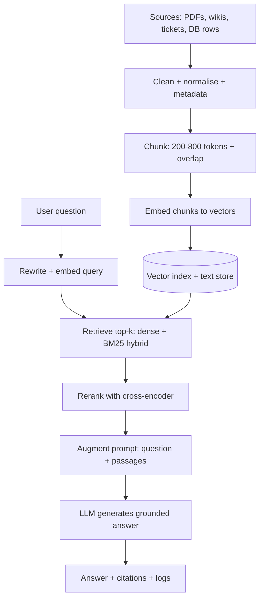
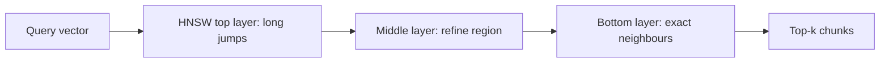

# Retrieval-Augmented Generation (RAG)

## Youtube

- [Complete RAG Crash Course With Langchain In 2 Hours](https://www.youtube.com/watch?v=o126p1QN_RI)
- [Learn RAG From Scratch - Python AI Tutorial from a LangChain Engineer](https://www.youtube.com/watch?v=sVcwVQRHIc8)
- [The End of Search Engines? RAG Explained (Full 8-Hour Course)](https://www.youtube.com/watch?v=9c48sMot1gA)

## Theory

Retrieval-Augmented Generation (RAG) grounds LLM answers in external knowledge by retrieving relevant documents at query time.
It covers chunking and indexing documents, generating embeddings, vector-database retrieval, and prompt augmentation.
Key subtopics: chunking strategies, reranking, hybrid search, retrieval-quality evaluation, and advanced/agentic RAG.

RAG is the standard architecture for building trustworthy LLM applications over private or fast-changing
knowledge: help-desk copilots, developer docs assistants, legal and medical research tools, enterprise search,
and any chatbot that must cite sources instead of guessing. Instead of baking every fact into model weights
through expensive fine-tuning, you keep knowledge in an external index, retrieve the few passages relevant to
each question, and let the LLM reason over them in context.

This guide takes you from mental model to production concerns. You will learn why naive prompting hallucinates
and how grounding fixes it, the full ingest-to-generate pipeline, how to chunk documents so answers stay
coherent, how embeddings and approximate nearest-neighbour search actually work, how to evaluate retrieval
quality and fix the most common failure modes, and which tools to reach for in an interview or on the job.
A worked Python example ties the concepts together, and the closing Q and A distils what interviewers probe most.

> Scope note: this page focuses on classic and production RAG (chunk, embed, retrieve, generate) plus
> reranking, hybrid search, and evaluation. Deep dives on embedding models, vector databases, orchestration
> frameworks, and agents live on companion pages — linked from Tools and Ecosystem below.

### Topics Covered

1. [What Is RAG and Why It Matters](#what-is-rag-and-why-it-matters)
2. [How RAG Works: End-to-End Architecture](#how-rag-works-end-to-end-architecture)
3. [Chunking Strategies](#chunking-strategies)
4. [Embeddings and Vector Search](#embeddings-and-vector-search)
5. [Python Code Example: Minimal RAG Pipeline](#python-code-example-minimal-rag-pipeline)
6. [Evaluation and Failure Modes](#evaluation-and-failure-modes)
7. [Tools and Ecosystem](#tools-and-ecosystem)
8. [Interview Questions and Answers](#interview-questions-and-answers)

### What Is RAG and Why It Matters

Retrieval-Augmented Generation pairs a retriever (search over your corpus) with a generator (an LLM that
writes the answer). The term comes from Lewis et al. (2020, Facebook AI Research): the model conditions its
output on both the question and a handful of retrieved passages, so knowledge can be updated without
retraining the model. Conceptually:

```text
User question → Retriever finds top-k passages → LLM reads question + passages → Grounded answer + citations
```

Without retrieval, an LLM answers purely from parametric memory — the facts compressed into weights during
training. That memory is lossy, frozen at a cutoff date, and silent about your private data. The result is
fluent hallucination: confident answers with invented dates, APIs, prices, or citations. RAG replaces much of
that guessing with explicit evidence the model can quote, refuse from, or reason over.

#### Why RAG beats fine-tuning for knowledge

| Concern | Fine-tuning alone | RAG |
|---|---|---|
| New / changing facts | Requires retraining or continual tuning | Update the index; effective immediately |
| Private corpus | Must be mixed into training data with care | Stays in your store; retrieved per query |
| Citations / auditability | Hard; model cannot point at sources | Natural; return the passages used |
| Cost for large corpora | Training cost grows with data | Indexing cost is largely one-time embedding |
| Reasoning vs. memorisation | Good for style, format, task behaviour | Good for factual grounding |

In practice teams combine both: fine-tune (or prompt-tune) for behaviour, tone, and domain language, and use
RAG for facts. Interviews often test exactly this judgement — when you would pick RAG, fine-tuning, or both.

#### When RAG is the right call

- Answers must reflect proprietary docs, tickets, wikis, PDFs, or database rows the base model never saw.
- Facts change faster than you can retrain: product docs, pricing, policies, incident runbooks, code.
- Users or auditors demand sources: support answers, legal summaries, medical information, financial advice.
- You need to control scope: "answer only from these manuals" is enforceable with retrieval + strict prompting.
- Hallucination cost is high: wrong API call, wrong dosage, wrong refund policy.

#### When RAG alone is not enough

- The task is skill, not knowledge: writing style, classification labels, exotic reasoning patterns. Fine-tuning
  or few-shot prompting fits better.
- The corpus is tiny and stable enough to fit in the prompt: a handful of pages can be pasted directly.
- Retrieval has nothing to find: commonsense, math, or creative writing need no external passages.
- Latency budget is razor-thin: retrieval adds 50–500 ms; a pure LLM call is faster but less grounded.
- You need guarantees, not best effort: RAG reduces hallucinations dramatically but cannot eliminate them —
  guardrails, human review, and evaluation remain essential.

#### A concrete example

Ask a vanilla chatbot "What is our refund window for annual plans purchased after March?" It may invent
"30 days" because that is common on the web. A RAG assistant instead retrieves Section 4.2 of the current
billing policy ("Annual plans purchased on or after 1 March 2026: 14-day refund window…"), feeds that
paragraph to the LLM with the question, and answers "14 days — per Billing Policy §4.2 (March 2026 revision)"
with a link. Same model, different evidence, trustworthy answer.

### How RAG Works: End-to-End Architecture

A production RAG system has two phases: offline indexing (ingest once) and online serving (retrieve + generate
per query). Keeping the two phases distinct is the key mental model interviewers expect.

#### Phase 1 — Ingest (offline)

1. **Load:** connectors pull PDFs, HTML, Markdown, tickets, wiki pages, database rows, or code files.
2. **Clean and normalise:** strip navigation, dedupe, fix encoding, extract metadata (title, URL, date, access
   level). Garbage in, garbage out — boilerplate removal matters more than most beginners expect.
3. **Chunk:** split long documents into retrievable units of 200–800 tokens with overlap (see next section).
4. **Embed:** encode each chunk into a dense vector with an embedding model (for example, 384–3072 dimensions).
5. **Index:** store vectors plus text and metadata in a vector database with an ANN index (HNSW is the default);
   optionally build a keyword (BM25) index alongside for hybrid search.

#### Phase 2 — Serve (online)

1. **Embed the query:** optionally rewrite or expand it first ("HyDE", multi-query, or a small LLM rewrite).
2. **Retrieve:** vector search returns top-k (typically 5–50) candidate chunks; hybrid search merges dense and
   keyword results with reciprocal-rank fusion.
3. **Rerank (optional but high-value):** a cross-encoder scores each query–passage pair precisely and keeps the
   top 3–8. This is the cheapest relevance win in most pipelines.
4. **Augment the prompt:** stuff the selected passages into the LLM context with titles, IDs, and a strict
   instruction ("Answer only from the context; say you do not know if absent; cite passage IDs").
5. **Generate:** the LLM writes the answer; the app returns it with citations and logs the evidence for review.



*The diagram above shows the two RAG phases: offline ingest on the left builds the index once, while each live query flows right-to-left through retrieve, rerank, and generate.*

#### Query-side tricks that move the needle

- **Query rewriting:** a small LLM turns "it" and "there" into explicit entities ("the refund window for annual
  plans") before embedding. Cheap, big recall win on follow-up questions.
- **Multi-query / HyDE:** generate two or three paraphrases (or a hypothetical answer) and retrieve with each,
  then merge. Helps when the question vocabulary differs from the docs.
- **Filters first:** restrict by metadata (product, version, date, permissions) before vector search so a v1 doc
  never outranks the v2 truth.
- **Parent-document retrieval:** retrieve small chunks for precision, then expand to the enclosing section for
  the LLM so context is coherent.
- **Access control:** enforce permissions at retrieval time (per-document ACLs), not just in the UI — otherwise
  snippets leak through answers.

#### Minimal prompt template

```text
System: You are a support assistant. Answer ONLY from the CONTEXT below.
If the answer is not in the context, say "I don't know based on the provided docs."
Cite sources as [1], [2] matching the passage numbers.

CONTEXT:
[1] (Billing Policy §4.2, Mar 2026) Annual plans purchased on or after 1 March 2026 ...
[2] (Billing FAQ) Refunds are issued to the original payment method within 5 days ...

User question: What is the refund window for annual plans bought in April 2026?
Answer:
```

Strict instructions plus numbered passages are what make citations auditable. Without them the model happily
blends memory and context.

### Chunking Strategies

Chunking decides what the retriever can return. Too large and the passage is diluted with irrelevant text;
too small and the meaning fragments across pieces. There is no universal size — there is only the tradeoff
between precision (small, focused hits) and context (large, self-contained evidence).

| Strategy | How it works | Best for | Watch out |
|---|---|---|---|
| Fixed-size with overlap | Every N tokens with M-token overlap (e.g., 500 / 50) | Baseline for prose, fastest to try | Splits sentences and tables mid-thought |
| Sentence / paragraph-aware | Split on sentence or paragraph boundaries up to a max size | Blogs, docs, tickets | Uneven chunk sizes; long paragraphs still split |
| Recursive / hierarchical | Split paragraphs → sentences → words only as needed | General default (LangChain recursive splitter) | Needs tuned separators per format |
| Markdown / structure-aware | Split on headings, keep header path as metadata | README, docs sites, runbooks | Poor on scanned PDFs without structure |
| Semantic chunking | Group sentences by embedding similarity breakpoints | Concept-dense essays, transcripts | Slower; breakpoints need threshold tuning |
| Table / code-aware | Keep tables whole; split code by function, not lines | Financial reports, API refs, repos | Requires custom parsers; never split a row |
| Sliding window + summary | Overlapping windows plus a one-line summary per chunk | Long narratives, books, call transcripts | Index bloat; summary quality varies |

Practical defaults that survive interviews: start with recursive splitting around 400–600 tokens and 10–15%
overlap for prose, smaller (200–350 tokens) for FAQ and support macros, larger (800–1200) for legal prose
where a clause needs its neighbours. Attach metadata to every chunk — document title, section path, URL or
page number, date, version, and language — because filters and citations depend on it.

Overlap exists so a sentence straddling a boundary appears whole in at least one chunk; 50–100 tokens is
typical. Measure with retrieval recall on real questions rather than guessing: if the gold passage rarely
appears in top-k, chunks are too big, too small, or missing metadata, not necessarily the embedding model.

Advanced variants worth naming: **parent-child (small-to-big)** indexes small chunks but serves the parent
section to the LLM; **proposition-level chunking** splits text into atomic facts for dense QA; **late
chunking** embeds the whole document first and pools token vectors per span so each chunk keeps global
context. Mention one of these to signal senior depth.

### Embeddings and Vector Search

Embeddings turn text into lists of numbers (vectors) positioned so that similar meanings sit close together.
A RAG pipeline embeds every chunk once, embeds each query at serve time, and retrieves the chunk vectors
nearest the query vector. Everything else — chunking, reranking, prompting — exists to make that nearest
neighbour lookup return the right evidence.

#### Cosine similarity in plain English

Similarity is almost always **cosine similarity**: the cosine of the angle between two vectors, ranging from
-1 (opposite) through 0 (unrelated) to 1 (same direction). In practice scores fall roughly between 0 and 1
for text. Two paraphrases ("refund window", "how long to get money back") get vectors pointing nearly the
same way, so their cosine is high even though they share no keywords — that is the whole advantage over
keyword search. Most embedding models output normalised vectors, in which case cosine similarity equals the
dot product, and Euclidean distance ranks identically.

```text
query  = embed("refund window for annual plans")      -> [0.12, -0.44, 0.91, ...]
chunk1 = embed("Annual plans ... 14-day refund ...")  -> cosine(query, chunk1) = 0.87  (retrieve)
chunk2 = embed("Quarterly roadmap planning ...")      -> cosine(query, chunk2) = 0.21  (ignore)
```

Choosing a model is a size-versus-quality tradeoff: compact models (384–768 dims) are fast and cheap to
serve; large ones (1024–3072 dims) capture nuance better. Match the model to your language mix and domain —
a general English model underperforms on multilingual or code-heavy corpora — and never compare vectors from
two different models against each other.

#### ANN and HNSW: searching millions of vectors fast

Exact nearest-neighbour search compares the query against every stored vector — O(n) per query, hopeless past
tens of thousands of chunks. Vector databases therefore build **Approximate Nearest Neighbour (ANN)** indexes
that trade a small recall loss for orders-of-magnitude speedups. The dominant algorithm is **HNSW**
(Hierarchical Navigable Small World).

Picture HNSW as a multi-layer highway map: the top layer has a few long-range express links between distant
regions of vector space, lower layers add denser local streets. Search starts at the top, greedily hops to
the closest neighbour, then descends layer by layer, refining at each step. Query time is roughly logarithmic,
and two knobs control the tradeoff: `M` (connections per node — higher means better recall, more memory) and
`efSearch` (candidates explored per query — higher means better recall, slower queries). Alternatives include
IVF (cluster vectors, search only nearby clusters), PQ (compress vectors for memory), and DiskANN (spill big
indexes to SSD).



*HNSW searches coarse-to-fine: each layer narrows the candidate region until the bottom layer returns the closest chunks.*

#### Dense vs. sparse vs. hybrid

- **Dense (embeddings):** captures paraphrase and semantics; weak on exact IDs, codes, rare names.
- **Sparse (BM25 keywords):** exact term matching; weak on synonyms and phrasing differences.
- **Hybrid:** run both, fuse rankings with Reciprocal Rank Fusion (RRF), then rerank. The production default
  whenever queries mix natural language with product names, error codes, or SKUs.
- **Reranking:** a cross-encoder reads the query and each candidate passage together (no longer independent
  vectors) and scores true relevance. Slower per pair, so it runs only on the top 20–50 — consistently the
  biggest quality-per-effort upgrade.

Filter before you search (tenant, version, date, ACL) and keep vectors normalised so cosine and dot product
agree. If interviewers ask for numbers: expect ~90–99% recall@10 from HNSW at millisecond latency on
million-scale indexes, with exact tuning depending on `M` and `efSearch`.

### Python Code Example: Minimal RAG Pipeline

The snippet below is a complete in-memory RAG loop in raw Python: chunk with overlap, embed with
sentence-transformers, retrieve with cosine similarity, and generate with an LLM call. It mirrors what
LangChain, LlamaIndex, and Haystack do internally, which is exactly why interviewers like walking through it.

```python
"""Minimal RAG: fixed-size chunking + embeddings + cosine retrieval + grounded prompt."""
import re
import numpy as np
from sentence_transformers import SentenceTransformer

# 1. Sample corpus (in production: load PDFs / wiki / tickets + metadata)
DOCS = [
    {
        "id": "billing-4.2",
        "title": "Billing Policy §4.2 (Mar 2026)",
        "text": (
            "Annual plans purchased on or after 1 March 2026 carry a 14-day refund window. "
            "Refunds are issued to the original payment method within 5 business days. "
            "Monthly plans carry a 7-day refund window."
        ),
    },
    {
        "id": "billing-faq",
        "title": "Billing FAQ",
        "text": (
            "To request a refund, open Settings > Billing > Request refund. "
            "Our team confirms eligibility before issuing the refund."
        ),
    },
    {
        "id": "roadmap-q1",
        "title": "Q1 Roadmap Notes",
        "text": (
            "Quarterly planning covers roadmap themes and hiring. "
            "It contains no billing or refund policy information."
        ),
    },
]

# 2. Chunking: word-based windows with overlap keep sentences whole in at least one chunk
def chunk_text(text: str, size: int = 60, overlap: int = 15) -> list[str]:
    words = re.findall(r"\S+", text)
    chunks, step = [], max(1, size - overlap)
    for i in range(0, len(words), step):
        window = words[i : i + size]
        if not window:
            break
        chunks.append(" ".join(window))
        if i + size >= len(words):
            break
    return chunks


# 3. Build the index once (offline phase)
model = SentenceTransformer("all-MiniLM-L6-v2")  # 384-dim, fast baseline
index: list[dict] = []
for doc in DOCS:
    for n, chunk in enumerate(chunk_text(doc["text"])):
        vec = model.encode(chunk, normalize_embeddings=True)  # normalised -> cosine = dot
        index.append({**doc, "chunk_no": n, "chunk": chunk, "vector": vec})
matrix = np.stack([row["vector"] for row in index])  # shape: (num_chunks, 384)

# 4. Serve a query (online phase): embed, cosine-rank, keep top-k
def retrieve(question: str, top_k: int = 2) -> list[dict]:
    q = model.encode(question, normalize_embeddings=True)
    scores = matrix @ q  # dot product == cosine for normalised vectors
    ranked = np.argsort(scores)[::-1][:top_k]
    return [{**index[i], "score": float(scores[i])} for i in ranked]

question = "What is the refund window for annual plans bought in April 2026?"
hits = retrieve(question)
for h in hits:
    print(f"{h['score']:.3f}  [{h['id']}] {h['chunk']}")

# 5. Augment: numbered passages + strict grounding instruction for the LLM
context = "\n".join(f"[{i+1}] ({h['title']}) {h['chunk']}" for i, h in enumerate(hits))
prompt = f"""Answer ONLY from the CONTEXT below. If absent, say you don't know. Cite as [1], [2].

CONTEXT:
{context}

Question: {question}
Answer:"""
print("---- PROMPT ----")
print(prompt)
# 6. Generate: send `prompt` to your LLM (OpenAI / Anthropic / local) and return answer + hit IDs.
```

Explanation of each block: the corpus stands in for loaded documents with IDs and titles; `chunk_text`
implements the fixed-size-with-overlap baseline from the chunking section; the index step embeds each chunk
once into normalised vectors so cosine similarity reduces to a dot product; `retrieve` embeds the question
the same way and ranks chunks by that score, returning metadata alongside for citations and filtering; the
prompt builder enforces grounding ("answer only from context, cite passages"); the final step — left as one
API call — hands that prompt to any chat model. To extend this toward production, swap the NumPy scan for a
vector database, add BM25 + RRF for hybrid search, insert a cross-encoder rerank between steps 4 and 5, and
log every prompt, hit list, and answer for evaluation.

A LangChain equivalent replaces steps 2–4 with `RecursiveCharacterTextSplitter`, `HuggingFaceEmbeddings`,
and `FAISS`/`Chroma` plus `RetrievalQA.from_chain_type(...)`, but the data flow is identical — which is the
point to make in interviews: frameworks orchestrate, they do not change the algorithm.

### Evaluation and Failure Modes

Teams that skip evaluation ship demos, not products. Measure retrieval and generation separately, because a
great LLM cannot rescue missing evidence and great retrieval is wasted by a sloppy prompt.

#### Retrieval metrics

- **Recall@k / Hit@k:** fraction of questions where a gold passage appears in the top-k. The headline health
  metric; aim 85%+ on a labelled golden set before tuning generation.
- **MRR / nDCG@k:** reward ranking the right passage first, not just somewhere in the list. Matters once
  reranking is in play.
- **Precision / context relevance:** share of retrieved chunks actually used in the answer. Low precision
  wastes context window and invites contradiction.
- **Latency and index freshness:** p50/p95 retrieval time and time-from-publish-to-searchable. Stale indexes
  are a silent correctness bug.

#### Generation metrics

- **Faithfulness / groundedness:** every claim in the answer must be entailed by the cited passages. Checked
  by human labels or an LLM judge with a strict rubric.
- **Answer relevance and correctness:** does the answer resolve the question, judged against reference answers
  or rubrics (EM/F1 for extractive QA, judge scores for open answers).
- **Citation precision/recall:** citations point to passages that support them, and every factual claim has one.
- **Refusal quality:** when evidence is absent the system must say so instead of hallucinating — score this on
  adversarial "unanswerable" questions.
- **Frameworks:** RAGAS (faithfulness, answer/context relevance), TruLens, DeepEval, and plain LLM-as-judge
  harnesses all work; pair any automatic score with sampled human review.

#### Seven failure modes and fixes

| # | Symptom | Root cause | Fix |
|---|---|---|---|
| 1 | Correct doc exists but never retrieved | Chunks too big/small, weak embeddings, vocabulary mismatch | Tune chunking, add hybrid BM25, query rewriting |
| 2 | Right passage retrieved, answer wrong | Overstuffed or contradictory context, weak prompt | Rerank to top 3–5, strict prompt, parent-chunk expansion |
| 3 | Hallucinated citations / facts | Model falls back to parametric memory | Grounding instruction + refusal rule + citation checks |
| 4 | Stale answers after doc updates | Re-embedding lag, no versioning | Incremental indexing, version metadata, freshness SLO |
| 5 | Cross-tenant or outdated-version leak | Filters applied after search or not at all | Metadata ACL + version filters inside retrieval |
| 6 | Latency spikes on long contexts | top-k too large, reranker over all hits | Cap passages, rerank only top 20–50, cache embeddings |
| 7 | Confident "I don't know" on easy queries | Over-strict prompt or recall collapse on paraphrase | Multi-query retrieval, HyDE, relax threshold, add FAQs |

Golden-set discipline makes all of this actionable: collect 100–300 real questions with known-good passage
IDs and reference answers, run them on every index or prompt change, and track recall@k plus faithfulness
over time. Add adversarial items — outdated versions, out-of-scope questions, permission-restricted docs —
because those are the cases that cause production incidents.

### Tools and Ecosystem

| Layer | Representative tools | Notes for interviews |
|---|---|---|
| Orchestration | LangChain, LlamaIndex, Haystack | Splitters, retrievers, QA chains; fastest path to a demo |
| Vector databases | Pinecone, Weaviate, Qdrant, Milvus, pgvector, Elasticsearch / OpenSearch | Managed vs. self-hosted; all ship HNSW + metadata filters |
| Embedding models | E5, BGE, Nomic, OpenAI `text-embedding-3`, Cohere Embed | Pick by language, domain, and dim/latency budget |
| Rerankers | Cohere Rerank, `bge-reranker`, `ms-marco` cross-encoders | Best quality-per-effort upgrade; runs on top 20–50 |
| Keyword / hybrid | BM25 (OpenSearch, Elasticsearch), RRF fusion | Covers exact codes and names dense search misses |
| Evaluation | RAGAS, TruLens, DeepEval, LLM-as-judge harnesses | Track recall@k, faithfulness, citation quality |
| Serving LLMs | OpenAI, Anthropic, open weights (Llama, Mistral) via vLLM / TGI | RAG is model-agnostic; swap generators freely |
| Advanced RAG | Corrective RAG, Self-RAG, agentic RAG (ReAct agents with search tools) | Retrieve → critique → re-retrieve loops for hard queries |

Companion pages in this repo go deeper on adjacent layers: embedding-model choice and training, vector
database internals, LangChain and LangGraph orchestration, and agentic patterns that wrap RAG in tool-using
loops. In an interview, name the layer you would change first for a given symptom: recall problem → chunking
and hybrid search; precision problem → reranking and prompt; staleness → indexing pipeline, not the model.

Typical production use cases: customer-support copilots grounded in help-centre articles, engineering assistants
over runbooks and API docs, legal discovery with clause-level citations, finance research over filings, and
codebase Q&A where retrieval spans pull requests, issues, and source files.

### Interview Questions and Answers

1. **What is RAG, and what problem does it solve?**
   RAG grounds LLM answers in retrieved passages: a retriever finds relevant chunks from an external index
   and the generator conditions on the question plus those chunks. It solves hallucination over unknown,
   private, or fast-changing facts, adds citations and auditability, and lets knowledge update without
   retraining.

2. **RAG vs. fine-tuning — when would you pick each?**
   Pick RAG when facts change, live in private corpora, or need citations; pick fine-tuning for behaviour,
   tone, format, or domain reasoning style. Most production systems combine both: fine-tune the behaviour,
   retrieve the facts. If the corpus fits in the prompt and never changes, plain long-context prompting can
   win on simplicity.

3. **Walk me through the end-to-end RAG pipeline.**
   Offline: load, clean, chunk, embed, and index documents with metadata. Online: rewrite and embed the
   query, retrieve top-k (dense + BM25 hybrid), rerank to the best few, stuff them into a strict grounded
   prompt, generate, and return the answer with citations and logs. Mention ACL filtering and evaluation
   harnesses to show production awareness.

4. **How do you choose chunk size and overlap?**
   Balance precision against context: 400–600 tokens with 10–15% overlap is the prose default; smaller for
   FAQ, larger for legal clauses; never split tables or functions. Judge by recall@k on real questions, and
   mention parent-child retrieval or semantic chunking as senior-level options.

5. **How does vector search work — cosine similarity and HNSW?**
   Embeddings place similar meanings near each other; cosine similarity (angle between vectors, dot product
   when normalised) ranks relevance. Exact search is O(n), so indexes use ANN — usually HNSW, a layered graph
   searched coarse-to-fine in roughly logarithmic time, tuned via `M` and `efSearch` for the recall/latency
   tradeoff.

6. **What is hybrid search and reranking, and why do they matter?**
   Hybrid runs dense (semantic) plus sparse BM25 (exact-term) retrieval and fuses rankings with RRF, covering
   both paraphrases and exact codes or names. Reranking scores each query–passage pair with a cross-encoder
   and keeps the top few — the cheapest relevance upgrade because it reads query and passage jointly instead
   of comparing independent vectors.

7. **How do you evaluate a RAG system?**
   Separately: retrieval (recall@k, MRR/nDCG, precision, latency, freshness) and generation (faithfulness,
   answer relevance, citation precision/recall, refusal quality on unanswerables). Use a golden set of
   labelled questions plus RAGAS or LLM-judge scoring, backed by sampled human review.

8. **The system retrieves the right doc but answers wrongly. How do you debug it?**
   Suspect context assembly, not retrieval: too many or contradictory passages, missing rerank, or a loose
   prompt letting parametric memory intrude. Fix by reranking to top 3–5, expanding child hits to parent
   sections, tightening the grounding instruction, and checking citation faithfulness before touching the
   embedding model.

9. **How do you handle stale documents, versions, and access control?**
   Re-index incrementally with version and date metadata, filter by version and tenant inside retrieval (not
   after), enforce per-document ACLs at search time so snippets cannot leak, and track publish-to-searchable
   latency as an SLO. Test with adversarial queries against old versions and restricted docs.

10. **What is agentic or corrective RAG, and when is it worth the complexity?**
    Standard RAG retrieves once and generates; agentic variants loop — retrieve, critique relevance, rewrite
    the query, re-retrieve, or call search tools via a ReAct agent until evidence suffices. Worth it for
    multi-hop questions spanning several docs; overkill for single-fact lookup where a tuned retrieve-rerank
    pipeline is faster, cheaper, and easier to evaluate.

