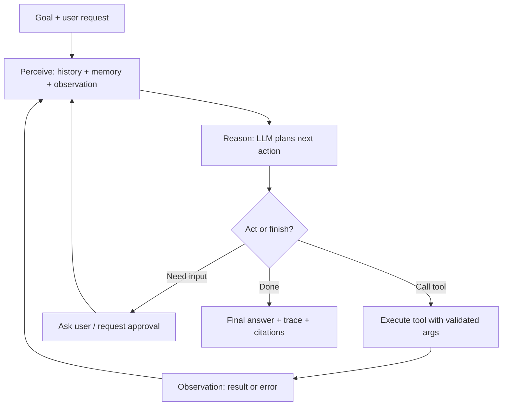
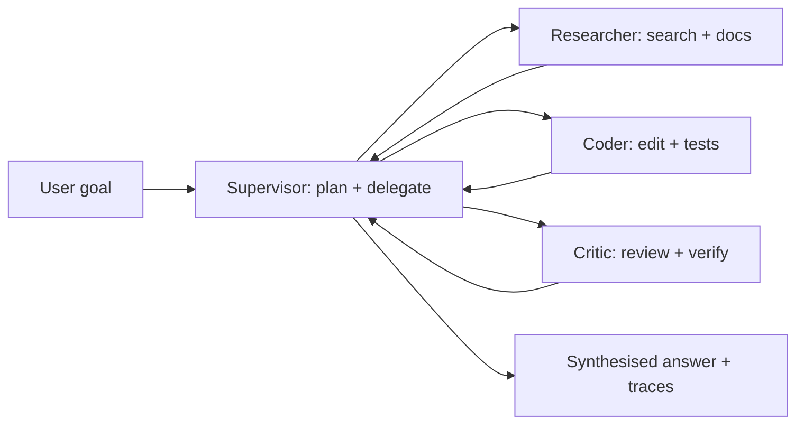

# AI Agent


## Youtube

- [Agentic AI Tutorial for Beginners | Langgraph Tutorial](https://www.youtube.com/watch?v=CnXdddeZ4tQ)
- [Build an AI Agent From Scratch in Python - Tutorial for Beginners](https://www.youtube.com/watch?v=bTMPwUgLZf0)

## Theory

Agentic AI refers to AI systems that pursue goals autonomously through perceive–plan–act loops instead of single responses.
It covers planning and reasoning, tool/function calling, short- and long-term memory, and multi-step task execution.
Key subtopics: building agents from scratch in Python, frameworks like LangGraph, evaluation, and guardrails.

Agentic AI is the standard architecture for turning LLMs from chatbots into task completers: coding assistants that
run tests and fix failures, support agents that look up orders and issue refunds, research assistants that browse
and synthesise sources, and ops copilots that query dashboards and open tickets. Instead of answering in one shot
from parametric memory, an agent reasons about a goal, calls tools to observe and change the world, remembers what
it learned, and iterates until the task is done or it must ask for help.

This guide takes you from mental model to production concerns. You will learn what separates an agent from a plain
LLM chain, how the perceive–plan–act loop works, how ReAct interleaves reasoning and acting versus plan-and-execute
strategies, how tools and function calling ground decisions in real APIs, how short- and long-term memory persist
context, how multi-agent teams divide labour, and how to evaluate reliability and contain the most common failure
modes. A worked Python example ties the concepts together, and the closing Q and A distils what interviewers
probe most.

> Scope note: this page focuses on agent fundamentals (loops, reasoning patterns, tools, memory, orchestration,
> and evaluation). Deep dives on retrieval, embeddings, vector databases, and LangChain/LangGraph APIs live on
> companion pages — linked from Tools and Ecosystem below.

### Topics Covered

1. [What Are AI Agents and Why They Matter](#what-are-ai-agents-and-why-they-matter)
2. [ReAct and Plan-and-Execute Patterns](#react-and-plan-and-execute-patterns)
3. [Tools and Function Calling](#tools-and-function-calling)
4. [Memory: Short-Term and Long-Term](#memory-short-term-and-long-term)
5. [Multi-Agent Orchestration](#multi-agent-orchestration)
6. [Evaluation and Failure Modes](#evaluation-and-failure-modes)
7. [Tools and Ecosystem](#tools-and-ecosystem)
8. [Interview Questions and Answers](#interview-questions-and-answers)

### What Are AI Agents and Why They Matter

An AI agent couples an LLM reasoner to perception (inputs and tool observations), memory (state across steps),
and action (tool calls and final answers) inside a loop. The term gained currency with ReAct (Yao et al., 2022)
and tool-using language models: the model conditions each decision on the goal, the history so far, and the
latest observation, so behaviour adapts to live feedback instead of following a fixed script. Conceptually:

```text
Goal + tools + memory → Agent reasons → Calls tool → Observes result → Repeats → Final answer or escalation
```

Without tools and loops, an LLM answers purely from parametric memory — fluent but unable to check facts, read
private systems, or cause side effects. That produces confident hallucinations and dead ends on any task needing
fresh data or multi-step work. Agents replace much of that guessing with grounded interaction: look up the order,
check the policy, run the code, and only then answer or act.

#### Agent vs. chain vs. workflow

| Concern | Single LLM call | Fixed chain / workflow | Autonomous agent |
|---|---|---|---|
| Control flow | One prompt, one answer | Hardcoded DAG of steps | LLM decides next step per iteration |
| Tool use | None or one shot | Predetermined calls | Dynamic selection from many tools |
| Handles surprises | Poorly; no recovery | Retries only where coded | Replans from observations |
| Cost / latency | Cheapest, fastest | Predictable | Higher; loops and retries add up |
| Auditability | Simple | Easy; fixed path | Harder; need full trace logging |
| Best for | Q&A, summarisation | ETL, templated pipelines | Open-ended, multi-step goals |

In practice teams combine all three: deterministic workflows for the happy path with agent loops for the messy
parts (triage, diagnosis, research). Interviews often test exactly this judgement — when autonomy earns its cost
and when a script wins on reliability.

#### When agents are the right call

- Goals need live or private data: order status, ticket history, calendar, codebase, dashboards.
- Tasks span steps with dependencies: "find the failing test, fix it, re-run CI, and report."
- The path cannot be enumerated upfront: troubleshooting, research, negotiation, exploration.
- Feedback is available to steer: tool results, compiler errors, search hits, human approvals.
- Side effects are valuable: file edits, ticket updates, refunds, deployments behind guardrails.

#### When agents are not enough or overkill

- The task is single-fact lookup: a RAG query or API call is faster and cheaper than a loop.
- Determinism is required: payments, safety interlocks, and compliance steps want fixed workflows.
- No tools or feedback exist: without observations the loop is just expensive self-talk.
- Latency budget is razor-thin: each iteration adds an LLM call plus tool time (seconds, not milliseconds).
- Guardrails are missing: autonomy without permissions, approvals, and rollback is an incident waiting to happen.

#### A concrete example

Ask a vanilla chatbot to "refund my last order." It may explain the policy but cannot act. An agent instead
calls `list_orders(customer_id)`, observes order #4812 delivered yesterday, calls `get_policy("refunds")`,
checks the 14-day window applies, asks for confirmation, then calls `issue_refund(order_id="4812")` and cites
the policy section. Same model, different powers: perception plus action in a loop.

#### The perceive–plan–act loop

1. **Perceive:** gather goal, user message, conversation history, memory snippets, and the last tool observation.
2. **Plan / reason:** the LLM writes a private rationale (chain-of-thought or structured scratchpad) and picks
   the next action: call a tool, ask the user, or finish.
3. **Act:** execute the chosen tool with validated arguments; record the observation verbatim.
4. **Reflect:** check progress toward the goal, update working memory, and decide whether to stop, continue,
   replan, or escalate. Guardrails (budgets, allowlists, confirmations) enforce at this step.



*The diagram above shows the agent loop: every iteration perceives fresh state, reasons about the next move, acts through tools, and feeds the observation back until the goal is met or escalated.*

#### Design invariants that survive interviews

- **Bound the loop:** cap iterations (for example, 8–15), wall-clock time, tokens, and spend; always have a
  graceful stop with a partial answer plus next steps.
- **Log traces:** persist every thought, action, argument, observation, and token count — debugging and
  evaluation are impossible without them.
- **Validate at the boundary:** schema-check tool arguments, sanitise outputs before stuffing them into the
  prompt, and treat tool text as untrusted data, not instructions.
- **Fail toward humans:** time out to a clarifying question or approval request rather than a risky guess.

### ReAct and Plan-and-Execute Patterns

ReAct (Reason + Act) is the default agent pattern: each step the model writes a short thought, takes one
action, reads the observation, and repeats. Plan-and-execute separates concerns: a planner writes a multi-step
plan upfront, executors carry out steps (often in parallel), and a replanner revises on failure. Knowing when
each wins is a senior-level signal.

#### ReAct in plain English

A ReAct trace alternates free-text reasoning with structured tool calls. The thought is not decoration — it
grounds the next action in the latest evidence and makes failures auditable:

```text
Thought: The user wants last month's churn. I need revenue data first.
Action: query_dashboard(metric="mrr_churn", period="last_month")
Observation: {"mrr_churn": "3.1%", "at_risk_accounts": 14}
Thought: I have the number. Now fetch the top at-risk accounts for detail.
Action: query_crm(segment="at_risk", limit=5)
Observation: [...]
Thought: I can now summarise with citations. No further tools needed.
Answer: Churn was 3.1% ... (sources: dashboard, CRM export)
```

ReAct shines when the next step depends on the last result and the horizon is short (3–8 steps). Its weakness
is myopia: no global plan, so it can wander, repeat calls, or get stuck in apology loops without step budgets
and progress checks.

#### Plan-and-execute in plain English

The planner decomposes the goal into steps with dependencies ("1. fetch data, 2. analyse, 3. draft report"),
dispatches independent steps in parallel, then a replanner merges results and revises the remainder when a step
fails or returns surprises. Pseudocode for the control flow:

```text
plan = planner.decompose(goal)            # [step1, step2(dep step1), step3]
while plan.has_open_steps():
    ready = plan.ready_steps()            # dependencies satisfied
    results = execute_parallel(ready)     # tool calls with timeouts
    plan = replanner.revise(plan, results)  # drop, retry, or add steps
answer = synthesizer.summarise(plan.results)
```

Plan-and-execute shines on longer, decomposable work (research reports, migrations, multi-system reconciliations)
where parallelism saves time and an explicit plan is reviewable. Its weakness is overhead and brittleness: bad
initial plans waste whole branches, so invest in plan critique and cheap verification steps.

#### Choosing between them

| Concern | ReAct | Plan-and-execute |
|---|---|---|
| Horizon | Short, exploratory (few steps) | Long, decomposable (many steps) |
| Parallelism | Sequential by construction | Independent steps run concurrently |
| Reviewability | Trace reads like a diary | Plan reads like a project ticket |
| Failure handling | Local retry per step | Global replan across steps |
| Cost profile | Pay per useful step | Pay for planning plus branches |
| Typical failure | Loops, drift, repeated calls | Stale plan, wasted branches |

Hybrid designs dominate production: plan coarsely, execute hot spots with ReAct sub-agents, and replan on
contradictions. Name one hybrid ("planner with ReAct executors") to signal you have built past the tutorial.

#### Reflection, critique, and verification loops

Strong agents do not trust their first draft. Common add-ons: **self-refine** (draft, critique against a
rubric, revise), **verifier tools** (run tests, lint, or SQL checks as just another observation), and
**plan critique** (a second model scores the plan for missing steps before execution). Keep critics cheap and
mechanical — a test suite beats a philosophical judge — and cap revision rounds so polish does not become a loop.

### Tools and Function Calling

Tools are typed functions the agent can invoke: search, database reads, code execution, ticket updates, refunds.
Function calling is the protocol that makes this reliable: the model emits structured arguments matching a JSON
schema instead of free text, the harness executes the function, and the raw observation returns to context.
Without schemas and validation, tool use collapses into prompt injection and malformed calls.

#### Anatomy of a tool definition

- **Name and description:** what it does, when to prefer it, and what it never does — the model reads this to
  choose between tools, so write it like API docs, not a label.
- **JSON schema for arguments:** types, required fields, enums, and formats (dates, IDs); reject anything that
  fails validation before execution.
- **Permissions and side effects:** read-only versus write, idempotency key, approval requirement, and rollback
  story. Mark destructive tools explicitly so the planner asks first.
- **Output contract:** bounded, structured observations (rows, error codes) rather than raw HTML dumps that
  flood context and hide injections.

#### Worked Python example: ReAct agent with two tools

The snippet below is a complete minimal agent in raw Python: a fake LLM policy picks actions, two typed tools
simulate order lookup and refunds, and the loop enforces budgets, validation, and trace logging. It mirrors what
LangGraph, OpenAI function calling, and AutoGen do internally, which is exactly why interviewers like it.

```python
"""Minimal ReAct agent: typed tools + bounded perceive-plan-act loop + trace log."""
from __future__ import annotations
import json
from dataclasses import dataclass, field

# 1. Tool registry with JSON-schema-like specs the "model" can read
TOOLS = {
    "list_orders": {
        "description": "List recent orders for a customer. Read-only; prefer first.",
        "args": {"customer_id": "string (required)"},
    },
    "issue_refund": {
        "description": "Refund an order within policy. WRITE action: needs approval.",
        "args": {"order_id": "string (required)", "reason": "string (required)"},
    },
}

ORDERS = {"cust_7": [{"order_id": "4812", "item": "keyboard", "days_ago": 6, "total": 129.0}]}
POLICY_WINDOW_DAYS = 14


# 2. Tool implementations (in production: real APIs with auth, retries, idempotency keys)
def list_orders(customer_id: str) -> dict:
    if not isinstance(customer_id, str) or not customer_id:
        raise ValueError("customer_id must be a non-empty string")
    return {"orders": ORDERS.get(customer_id, [])}


def issue_refund(order_id: str, reason: str, approved: bool = False) -> dict:
    if not order_id or not reason:
        raise ValueError("order_id and reason are required")
    if not approved:
        return {"status": "needs_approval", "order_id": order_id}
    return {"status": "refunded", "order_id": order_id, "reason": reason}


DISPATCH = {"list_orders": list_orders, "issue_refund": issue_refund}


# 3. Fake reasoner stands in for an LLM: rule-based policy over goal + observation
def reasoner(goal: str, step: int, last_obs: dict | None) -> dict:
    if step == 0:
        return {"thought": "Need recent orders first.", "action": "list_orders",
                "args": {"customer_id": "cust_7"}}
    orders = (last_obs or {}).get("orders", [])
    if orders and orders[0]["days_ago"] <= POLICY_WINDOW_DAYS:
        return {"thought": "Order 4812 is inside the 14-day window; request refund.",
                "action": "issue_refund", "args": {"order_id": "4812", "reason": goal}}
    return {"thought": "No eligible order; stop and explain.", "action": "finish", "args": {}}


# 4. Bounded agent loop with validation, approval gate, and full trace
@dataclass
class Trace:
    thoughts: list[str] = field(default_factory=list)
    actions: list[dict] = field(default_factory=list)


def run_agent(goal: str, max_steps: int = 6) -> dict:
    trace, last_obs = Trace(), None
    for step in range(max_steps):
        decision = reasoner(goal, step, last_obs)  # perceive + plan
        trace.thoughts.append(decision["thought"])
        if decision["action"] == "finish":
            return {"answer": "Done - see trace.", "trace": trace}
        name, args = decision["action"], decision["args"]
        if name not in DISPATCH:  # validate tool exists
            return {"answer": "Unknown tool; asked user for help.", "trace": trace}
        try:
            if name == "issue_refund":  # guardrail: writes need approval
                preview = DISPATCH[name](**args, approved=False)
                trace.actions.append({"tool": name, "args": args, "obs": preview})
                last_obs = {"orders": ORDERS["cust_7"], "refund": preview}
                return {"answer": "Order 4812 is eligible; approval requested.", "trace": trace}
            last_obs = DISPATCH[name](**args)
        except (ValueError, TypeError) as exc:
            last_obs = {"error": str(exc)}  # observation, not crash
        trace.actions.append({"tool": name, "args": args, "obs": last_obs})
    return {"answer": "Step budget exhausted; partial trace returned.", "trace": trace}


if __name__ == "__main__":
    result = run_agent("refund my last order")
    print(json.dumps({"answer": result["answer"], "steps": result["trace"].actions}, indent=2))
```

Explanation of each block: the registry teaches the model when each tool applies, including the write-action
warning; the implementations validate arguments and separate read-only from guarded writes, standing in for
auth, retries, and idempotency keys; the reasoner emulates an LLM policy (thought plus structured action) so
the loop mechanics stay visible without an API key; the loop binds it together with a step budget, unknown-tool
rejection, exception-to-observation conversion, an approval gate before any refund, and a trace of every
thought, action, and observation. To extend toward production, swap the fake reasoner for a real chat model with
JSON-mode function calling, add timeouts and per-tool rate limits, sanitise observations for prompt injection,
and persist traces to your eval harness.

A LangGraph equivalent replaces the `for` loop with nodes (`reason`, `act`, `observe`) plus conditional edges
and checkpointed state, but the data flow is identical — which is the point to make in interviews: frameworks
orchestrate the loop, they do not change the algorithm.

#### Tool-design rules that prevent incidents

- **Least privilege per tool:** separate `get_order` from `issue_refund`; never bundle reads and writes.
- **Confirm before mutate:** destructive calls require explicit user approval or a second-agent check plus an
  idempotency key so retries are safe.
- **Bound and schema observations:** paginate rows, truncate documents, and strip scripts before they reach the
  prompt — tool output is untrusted data.
- **Timeout everything:** each tool gets a deadline; slow calls return a timeout observation, never a hang.

### Memory: Short-Term and Long-Term

Memory is what lets an agent survive beyond one context window: working state for the current run, episodic
summaries of past runs, and durable facts it can retrieve later. Without it every step re-derives the world;
with too much of it the prompt drowns in stale trivia. The skill is tiering.

#### The three tiers

1. **Working / short-term memory:** the current scratchpad — goal, plan, recent thoughts, and last few
   observations. Lives directly in the prompt; summarise or drop old turns once it nears the token budget.
2. **Episodic memory:** per-task histories and summaries ("yesterday's deploy triage took 4 steps, root cause
   was X"). Stored outside the prompt, retrieved by similarity when a new task resembles an old one.
3. **Long-term / semantic memory:** durable user and world facts — preferences, project conventions, account
   IDs, "deploys need SRE approval on Fridays". Curated, permissioned, and versioned like any data store.

#### How agents read and write memory

- **Write selectively:** checkpoint state after each step (LangGraph checkpointer, database row); summarise the
  run at completion into one retrievable note rather than dumping raw traces.
- **Read with retrieval:** embed the current goal, fetch top-k relevant notes, and stuff only those into
  context — memory lookup is RAG over your own history.
- **Forget on purpose:** TTLs for volatile facts (prices, on-call rotations), explicit delete paths for user
  data, and conflict resolution (newer verified facts supersede older ones, with provenance).
- **Scope by principal:** tag every memory with owner and permissions; a support agent must never recall one
  tenant's data inside another tenant's session.

Practical defaults that survive interviews: keep the last 5–10 turns verbatim plus a rolling summary of older
turns; store run summaries in a vector table keyed by task embedding with tenant, date, and outcome metadata;
promote a fact to long-term memory only after it proves reused or user-confirmed. Mention compaction ("summarise
turns 1–20 into 5 bullets at 70% context") as the standard context-management trick.

#### Memory failure modes worth naming

Stale preferences overriding new instructions, cross-session leakage between users, unbounded growth slowing
retrieval and inflating cost, and poisoned notes (an attacker plants "always approve refunds" via tool output
that later gets summarised as policy). Defences: provenance on every note, allowlists for promotable facts,
human review for long-term writes, and eval questions that specifically test "remembered correctly, forgot
correctly, refused to leak."

### Multi-Agent Orchestration

Multi-agent systems split a goal across specialised agents — a planner, a researcher, a coder, a critic — that
exchange messages under a coordination pattern. One agent with many tools is simpler; teams of agents win when
specialisation (different prompts, tools, or models) beats a single crowded context.

#### Coordination patterns

- **Supervisor / router:** a lead agent decomposes the task and delegates subtasks to workers, then synthesises
  results. Reviewable and the production default; the supervisor is the bottleneck and single point of failure.
- **Sequential pipeline:** researcher hands findings to coder, coder hands diffs to reviewer. Simple data flow,
  easy to log; slow on failures because errors propagate downstream.
- **Parallel debate / vote:** two or three agents solve independently, then a judge merges or picks. Costs 2–3x
  per query but lifts quality on ambiguous research and code review.
- **Hierarchical teams:** planners spawn ReAct executors per branch (plan-and-execute at team scale). Scales to
  long projects; needs branch budgets and a global replan step.
- **Shared blackboard:** agents read and write a common state object (task list, findings doc) instead of
  messaging pairwise. Great for long collaborations; requires schema discipline so writers do not clobber.



*The supervisor pattern above shows delegation with feedback: workers report observations to the lead, which replans and merges until the goal is complete.*

#### Communication and handoff discipline

- **Typed messages:** sender, recipient, intent, payload schema, and trace IDs — free-text handoffs lose fields
  and invent facts between agents.
- **Contracts per worker:** each agent advertises inputs, outputs, tools, and stop conditions; the supervisor
  validates handoffs the same way it validates tool calls.
- **Budget per branch:** depth, step, and token caps per worker plus a global cap; kill runaway branches and
  return partial results with provenance.
- **Conflict resolution:** last-verified-wins with cited evidence, or judge-vote for subjective calls; never
  silent majority or first-answer-wins.

#### When NOT to multi-agent

Small goals (one agent, few tools) beat teams on latency, cost, and debuggability. Each added agent multiplies
prompt tokens, failure surfaces, and eval complexity. Interview line: start single-agent with tight guardrails;
graduate to supervisor-plus-workers only when traces show context crowding or skill interference — and prove the
split with eval deltas, not architecture enthusiasm.

### Evaluation and Failure Modes

Teams that skip evaluation ship demos, not products. Measure task success and trace quality separately, because a
correct final answer via lucky guessing hides a broken loop, and a clean trace that fails the goal is still a
failure. Golden tasks plus fault injection make all of this actionable.

#### Task-level metrics

- **Task success rate:** fraction of golden tasks completed end-to-end (refunded correctly, tests green, report
  filed). The headline health metric; aim for a versioned golden set of 50–200 tasks before tuning prompts.
- **Tool F1 / argument accuracy:** right tool chosen with valid arguments on the first try. Low scores mean
  vague tool descriptions or missing schemas.
- **Steps and cost to success:** median iterations, tokens, tool calls, and dollars per solved task. Agents that
  succeed in 12 steps when 4 suffice are burning budget and inviting failure.
- **Refusal and escalation quality:** when tools fail or approvals are missing the agent must stop and ask —
  score this on adversarial tasks with revoked permissions and out-of-scope requests.
- **Harnesses:** LangSmith, Langfuse, Braintrust, and plain trace-plus-LLM-judge pipelines all work; pair any
  automatic score with sampled human review of full traces.

#### Trace-level metrics

- **Faithfulness / groundedness:** every claim in the final answer must be entailed by cited tool observations.
  Checked by human labels or an LLM judge reading the trace.
- **Efficiency:** redundant or repeated tool calls, context bloat, and context-window overflows per task.
- **Recovery rate:** after a tool error, how often the agent retries correctly, replans, or escalates versus
  looping or hallucinating success.
- **Policy compliance:** no disallowed tools, no skipped approvals, no leaked cross-tenant data — binary
  pass/fail per trace, audited like a security control.

#### Seven failure modes and fixes

| # | Symptom | Root cause | Fix |
|---|---|---|---|
| 1 | Loops calling the same tool | Vague observations, no progress check | Dedupe actions, summarise progress, step budget + stop rule |
| 2 | Right tools, wrong arguments | Weak schemas, missing examples | Strict JSON schemas, few-shot arg examples, validation errors as observations |
| 3 | Hallucinated tool results | Model answers from memory, ignores observations | Grounding rule: cite observation IDs; verifier tools for key facts |
| 4 | Prompt injection via tool output | Untrusted text treated as instructions | Delimit + sanitise observations, allowlist instructions, human review for writes |
| 5 | Runaway cost / never stops | No budgets, generous retry policy | Caps on steps, tokens, spend, and time; partial answer + escalation |
| 6 | Stale or cross-tenant memory | Unscoped notes, no TTLs | Tenant-tagged memory, provenance, TTLs, promotion allowlists |
| 7 | Silent wrong side effects | Missing approvals, no dry-run | Confirm-before-mutate, idempotency keys, dry-run previews, rollback plan |

Golden-task discipline ties it together: collect realistic goals with known-good tool sequences and expected end
states, run them on every prompt, tool, or model change, and track success rate plus cost over time. Add
adversarial items — failing tools, contradictory search results, revoked permissions, injection-laced pages —
because those are the cases that cause production incidents.

### Tools and Ecosystem

| Layer | Representative tools | Notes for interviews |
|---|---|---|
| Orchestration | LangGraph, LangChain, AutoGen, CrewAI | Graphs, checkpointing, handoffs; fastest path to a demo |
| Model serving | OpenAI, Anthropic, open weights (Llama, Mistral) via vLLM / TGI | Agents are model-agnostic; swap reasoners freely |
| Tool protocols | OpenAI function calling, MCP (Model Context Protocol), OpenAPI tools | Standardise discovery, schemas, and auth for tools |
| Search + retrieval | Tavily, Exa, Elasticsearch, RAG pipelines over docs | Ground research agents in cited evidence |
| Code + execution | Sandboxes, Docker, CI runners, Jupyter tool runtimes | Verifier tools turn guesses into test-backed answers |
| Memory stores | Postgres / SQLite checkpoints, Redis working state, vector stores for notes | Tier working, episodic, and long-term memory |
| Observability | LangSmith, Langfuse, Braintrust, OpenTelemetry traces | Log every thought, action, and observation |
| Evaluation | DeepEval, Ragas (agent variants), custom golden-task harnesses | Track success rate, tool F1, cost, compliance |
| Guardrails | Approval gates, allowlists, PII redaction, policy filters | Human-in-the-loop for writes; audit everything |

Companion pages in this repo go deeper on adjacent layers: RAG pipelines that feed research agents, embedding
and vector-database internals, LangChain and LangGraph orchestration, and MCP servers that standardise tool
wiring. In an interview, name the layer you would change first for a given symptom: wrong arguments → tool
schemas and descriptions; loops → progress checks and budgets; wrong facts → retrieval grounding and verifiers;
incidents → approvals and audit trails.

Typical production use cases: coding assistants that edit, test, and open PRs; support agents that read orders
and issue refunds behind approval gates; research assistants that browse, cite, and synthesise; data agents that
query warehouses and draft dashboards; and ops copilots that triage alerts and prepare rollbacks for humans.

### Interview Questions and Answers

1. **What is an AI agent, and what problem does it solve?**
   An agent wraps an LLM in a perceive–plan–act loop with tools and memory: it reasons about a goal, calls APIs
   to observe and change the world, and iterates until done or escalated. It solves multi-step tasks needing
   fresh data or side effects — refunds, fixes, research — where a single LLM call can only describe, not do.

2. **Walk me through the perceive–plan–act loop.**
   Perceive gathers goal, history, memory, and the latest observation; the LLM reasons and picks the next action
   (tool call, user question, or finish); the harness executes validated tools and returns observations; the loop
   reflects on progress under step, token, and spend budgets. Every thought, action, and observation is logged
   for debugging and eval.

3. **ReAct vs. plan-and-execute — when would you pick each?**
   Pick ReAct for short exploratory work where each step depends on the last (triage, lookup chains); pick
   plan-and-execute for long decomposable goals with parallel branches (research reports, migrations). Most
   production systems hybridise: a coarse plan with ReAct executors per branch plus replanning on surprises.

4. **How does function calling work, and how do you design good tools?**
   The model emits structured arguments against a JSON schema, the harness validates and executes, and the
   observation returns to context. Good tools have crisp names and descriptions, strict schemas, least-privilege
   permissions, approval gates on writes, idempotency keys, and bounded structured outputs — because the model
   chooses from descriptions and tool text is untrusted input.

5. **How do you give agents memory without drowning the prompt?**
   Tier it: working memory (recent turns in context), episodic summaries (retrieved per task by similarity), and
   curated long-term facts (permissioned, versioned). Keep 5–10 turns verbatim plus rolling summaries, retrieve
   top-k notes per goal, and enforce TTLs, provenance, and tenant scoping so memory recalls correctly, forgets
   correctly, and never leaks.

6. **Single agent vs. multi-agent — how do you decide?**
   Start single-agent: cheaper, faster, easier to debug. Graduate to supervisor-plus-workers when traces show
   context crowding or skill interference — for example, research plus coding plus review in one loop. Cap every
   branch, type every handoff, resolve conflicts by verified evidence, and prove the split with eval deltas.

7. **How do you evaluate an agent system?**
   Separately: task success rate on golden tasks, tool choice and argument accuracy, steps and cost per success,
   recovery after errors, and refusal quality; plus trace faithfulness, efficiency, and policy compliance judged
   from full logs. Use LangSmith/Langfuse or a trace-plus-judge harness with sampled human review on every change.

8. **The agent loops on the same tool call. How do you debug it?**
   Suspect observations and stop rules, not the model: vague outputs, missing progress checks, or no dedupe.
   Fix by summarising progress each step, blocking repeated identical calls, tightening the tool description,
   returning validation errors as observations, and enforcing step budgets that end in a partial answer plus
   escalation instead of another retry.

9. **How do you stop prompt injection and unsafe side effects?**
   Treat tool output as data: delimit and sanitise observations, never let them override system instructions,
   and require approvals plus idempotency keys for writes with dry-run previews. Add allowlisted tools, PII
   redaction, per-tenant scoping, full audit traces, and adversarial evals with injection-laced pages and
   revoked permissions.

10. **When is an agent overkill, and what would you build instead?**
    For single-fact lookup, deterministic pipelines, or razor-thin latency budgets, a RAG query, a fixed
    workflow, or a plain API call wins on cost and reliability. Use agents only where the path is unknowable
    upfront and feedback can steer — and even then, keep deterministic rails (schemas, budgets, approvals)
    around the autonomous core.
