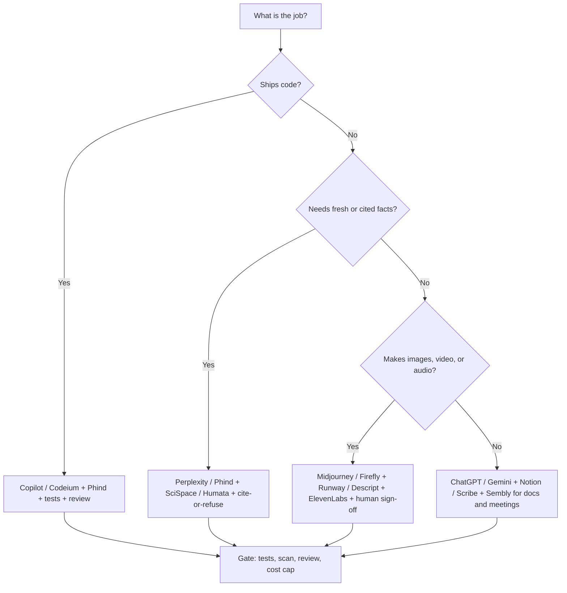

# AI Tools

## Theory

This page is a curated directory of AI tools organized by use case (chat, code, image, video, audio, writing, design, research, productivity).
Use it to discover and compare tools for a given task; entries link out to the tool with a one-line description.
Key subtopics: code assistants, image/video/audio generation, writing and research helpers, and website/3D builders.

### YouTube 

- [Top 2024 Web Design Trends](https://www.youtube.com/watch?v=qthkkHPNAYQ)
- [23 AI Tools You Won't Believe are Free](https://www.youtube.com/watch?v=ZYUt4WE4Mrw)
- [28 AI Tools You'll Be Shocked Are Free](https://www.youtube.com/watch?v=mzbuYus8bH4)
- [7 AI Tools Will Transform Your App Idea to REALITY](https://www.youtube.com/watch?v=H6rgeEdgpTA)
- [How to Use AI Art and ChatGPT to Create Insane Web Designs](https://www.youtube.com/watch?v=8I3NTE4cn5s)
- [I Tested HUNDREDS of AI Design Tools... These Are the BEST!](https://www.youtube.com/watch?v=HkJjXYO2_YY)
- [How to Get a $1000 Logo Design for FREE Using AI?](https://www.youtube.com/watch?v=275L653HXS0)
- [I Tried 108 Free AI Tools. These Are the Best](https://www.youtube.com/watch?v=cYOXNI4Gr70)
- [Top 6 Tools to Transform Your App Idea to Reality | Low Code, AI, Design to Code, and More](https://www.youtube.com/watch?v=BL3qA-UmNug)


### Tools

---

#### AI Chatbots & Search Engines

- [ChatGPT](https://chatgpt.com/) — OpenAI's conversational AI for writing, coding, analysis, and general assistance
- [Google Gemini](https://gemini.google.com/) — Google's multimodal AI assistant (formerly Bard)
- [Perplexity](https://www.perplexity.ai/) — AI-powered search engine with cited, real-time answers
- [Phind](https://www.phind.com/) — AI search engine optimized for developers and technical queries
- [ChatSonic](https://writesonic.com/chat) — AI chatbot by Writesonic with real-time web access
- [Google Labs](https://labs.google/) — Google's experimental AI features and research tools

#### AI Code Assistants

- [GitHub Copilot](https://github.com/features/copilot) — AI pair programmer integrated into VS Code, JetBrains, and more
- [Amazon Q Developer](https://aws.amazon.com/q/developer/) — AWS AI coding assistant with code generation and security scanning (formerly CodeWhisperer)
- [Codeium](https://www.codeium.com/) — Free AI code completion and chat for 70+ languages
- [Caktus AI](https://caktus.ai/) — AI-powered study and coding helper for students and developers

#### AI Image Generation

- [Midjourney](https://www.midjourney.com/) — Leading AI image generation via Discord with highly artistic outputs
- [DALL-E 3 (Bing Image Creator)](https://www.bing.com/images/create) — Microsoft's AI image generator powered by OpenAI's DALL-E 3
- [Adobe Firefly](https://www.adobe.com/products/firefly.html) — Adobe's generative AI for creating and editing images
- [Stable Diffusion](https://stablediffusionweb.com/) — Open-source text-to-image generation model
- [Ideogram](https://ideogram.ai/) — AI image generation with strong text rendering capabilities
- [Canva AI Image Generator](https://www.canva.com/ai-image-generator/) — AI image generation built into Canva's design platform
- [Playground AI](https://playgroundai.com/) — Free AI image generation and editing platform
- [Lexica](https://lexica.art/) — Stable Diffusion image search engine and generation tool
- [Flair AI](https://flair.ai/) — AI product photography and branded content generator
- [Scribble Diffusion](https://scribblediffusion.com/) — Turn hand-drawn sketches into refined AI images
- [Illusion Diffusion](https://huggingface.co/spaces/AP123/IllusionDiffusion) — AI optical illusion and pattern art generator
- [NVIDIA Canvas](https://www.nvidia.com/en-us/studio/canvas/) — AI painting tool that turns brushstrokes into realistic landscapes

#### AI Image Editing & Enhancement

- [Magic Eraser](https://magicstudio.com/magiceraser) — AI-powered object removal from photos
- [Upscayl](https://upscayl.org/) — Free open-source AI image upscaler for enhancing resolution
- [Replicate](https://replicate.com/) — Platform to run open-source AI models via API (image, video, audio)

#### AI Video Generation & Editing

- [Sora](https://openai.com/index/sora/) — OpenAI's text-to-video generation model
- [Runway ML](https://runwayml.com/) — AI-powered video generation, editing, and visual effects suite
- [Pika](https://pika.art/) — AI video generation and editing from text and images
- [Luma Labs](https://lumalabs.ai/) — AI 3D capture, video generation, and Dream Machine model
- [Synthesia](https://www.synthesia.io/) — AI video creation with realistic avatar presenters
- [D-ID](https://www.d-id.com/) — AI-powered talking head videos from text and photos
- [CapCut](https://www.capcut.com/) — AI-powered video editing tool by ByteDance
- [Descript](https://www.descript.com/) — AI video and podcast editing with transcription-based workflow
- [InVideo AI](https://invideo.io/) — AI video creation from text prompts with stock footage
- [Vidyo AI](https://vidyo.ai/) — AI-powered video content repurposing for short-form clips
- [Lumen5](https://lumen5.com/) — AI tool to convert articles and text into engaging videos
- [Kaiber](https://www.kaiber.ai/) — AI video generation and music visualization tool

#### AI Music & Audio

- [Suno](https://suno.com/) — AI music generation from text prompts with vocals and instruments
- [ElevenLabs](https://elevenlabs.io/) — AI voice synthesis, cloning, and text-to-speech platform
- [MusicGen](https://huggingface.co/spaces/facebook/MusicGen) — Meta's open-source text-to-music generation model
- [Soundraw](https://soundraw.io/) — AI music composition tool for creators and content producers
- [Murf AI](https://murf.ai/) — AI text-to-speech platform for realistic voiceovers
- [Mubert](https://mubert.com/) — AI-generated royalty-free music for content creators
- [Beatoven.ai](https://www.beatoven.ai/) — AI music generation tailored to video mood and genre
- [LALAL.AI](https://www.lalal.ai/) — AI audio stem splitter for separating vocals, drums, and instruments
- [Adobe Podcast Enhance](https://podcast.adobe.com/enhance) — AI-powered audio quality enhancement for speech recordings

#### AI Writing & Content

- [Notion AI](https://www.notion.com/product/ai) — AI assistant integrated into Notion for writing, summarizing, and brainstorming
- [Jasper](https://jasper.ai/) — AI content generation platform for marketing and copywriting
- [Copy.ai](https://www.copy.ai/) — AI copywriting tool for generating marketing content
- [QuillBot](https://quillbot.com/) — AI paraphrasing, grammar checking, and summarization tool
- [TextFX](https://textfx.withgoogle.com/) — Google's AI creative writing tool for wordplay and text effects
- [SuperMeme AI](https://www.supermeme.ai/) — AI-powered meme generator from text descriptions

#### AI Design & UI/UX

- [Figma](https://www.figma.com/) — Collaborative design tool with AI-powered features for UI/UX
- [Uizard](https://uizard.io/) — AI-powered UI/UX design tool that converts text and sketches to mockups
- [Locofy](https://www.locofy.ai/) — AI-powered design-to-code conversion from Figma/Adobe XD
- [Looka](https://looka.com/) — AI logo design and brand identity generator
- [Eraser.io](https://www.eraser.io/) — AI-powered technical diagramming and documentation tool
- [Excalidraw](https://excalidraw.com/) — Open-source virtual whiteboard for hand-drawn style diagrams
- [Spline AI](https://spline.design/) — AI-powered 3D design tool for the web
- [AutoDraw](https://www.autodraw.com/) — Google's AI that turns rough sketches into polished drawings

#### AI Document & Research

- [SciSpace](https://scispace.com/) — AI research paper reader, summarizer, and citation assistant (formerly Typeset.io)
- [Humata AI](https://www.humata.ai/) — AI tool for querying and summarizing documents instantly
- [PDF GPT](https://pdfgpt.io/) — AI-powered chat interface for querying PDF documents
- [Eightify](https://eightify.app/) — AI-powered YouTube video summarizer
- [Summarize.tech](https://www.summarize.tech/) — AI tool for summarizing long YouTube videos

#### AI Productivity & Communication

- [Scribe](https://www.scribehow.com/) — AI-powered process documentation and step-by-step guide generator
- [Poised](https://www.poised.com/) — AI communication coach for meetings and presentations
- [Sembly AI](https://www.sembly.ai/) — AI meeting assistant for notes, summaries, and action items
- [Tidio](https://www.tidio.com/) — AI chatbot platform for customer support and engagement
- [NVIDIA Broadcast](https://www.nvidia.com/en-us/geforce/broadcasting/broadcast-app/) — AI-powered noise removal, background effects, and auto-framing for streaming

#### AI Website Builders

- [Durable](https://durable.com/) — AI website builder that generates a full site in seconds
- [10Web](https://10web.io/) — AI-powered WordPress website builder and hosting platform
- [Mixo](https://mixo.io/) — AI landing page and website builder from a text description

#### AI 3D & Animation

- [Immersity AI](https://app.immersity.ai/) — AI 2D-to-3D image and depth conversion (formerly LeiaPix)
- [Animated Drawings](https://sketch.metademolab.com/) — Meta's AI tool that animates hand-drawn sketches
- [Google Earth Studio](https://earth.google.com/studio/) — Animation tool for 3D visuals using Google Earth imagery

#### AI Interior & Architecture Design

- [InteriorAI](https://interiorai.com/) — AI-powered interior design idea generator from room photos
- [Reimagine Home](https://www.reimaginehome.ai/) — AI interior design and home staging tool

#### AI Face & Identity

- [PimEyes](https://pimeyes.com/) — AI-powered reverse face search engine
- [Deep Nostalgia](https://www.myheritage.com/deep-nostalgia) — AI tool that animates old family photos

#### AI Tool Directories

- [Future Tools](https://www.futuretools.io/) — Curated directory of AI tools updated daily

#### Other AI Utilities

- [OnlyComs](https://onlycoms.com/) — AI-powered .com domain name generator
- [10015.io](https://10015.io/) — Collection of free online tools including AI-powered utilities

The directory above answers *which tool exists*; the rest of this guide answers *which tool to pick,
how to combine tools into a stack, and what to say about them in a system design interview*.
Think of AI tools in three layers: foundation models that generate, assistant surfaces where you meet
them (chat, IDE, Canvas, Notion), and orchestration glue that connects them to your data (APIs,
plugins, RAG indexes, automation). Most production work is not picking one magic tool — it is pairing
a generator with grounding, review, and cost controls.

This guide takes you from map to decision. You will learn how the directory categories fit together,
what code, creative, and knowledge-work tools actually do under the hood, how to choose a stack without
overpaying or leaking data, three worked tool workflows you can demo or cite, and how cost and governance
shape every real deployment. A decision flowchart and comparison tables make the tradeoffs concrete, and
the closing Q and A distils what interviewers probe most.

> Scope note: this page focuses on the applied tool landscape for builders and interviewees — what each
> category does, when to reach for it, how tools compose, and how to govern them.
> Model internals (tokens, transformers, training), RAG internals, embeddings, vector databases, and
> agentic loops live on companion pages — linked from the deep dives below.

### Topics Covered

1. [Categories Deep Dive: Code, DevOps, and Data](#categories-deep-dive-code-devops-and-data)
2. [Categories Deep Dive: Creative Media (Image, Video, Audio)](#categories-deep-dive-creative-media-image-video-audio)
3. [Categories Deep Dive: Knowledge Work (Writing, Research, Productivity)](#categories-deep-dive-knowledge-work-writing-research-productivity)
4. [Choosing Your AI Stack: Decision Flow](#choosing-your-ai-stack-decision-flow)
5. [Tool Spotlights: Three Worked Examples](#tool-spotlights-three-worked-examples)
6. [Cost, Privacy, and Governance](#cost-privacy-and-governance)
7. [Interview Questions and Answers](#interview-questions-and-answers)

### Categories Deep Dive: Code, DevOps, and Data

Code assistants are the most mature AI tool category because code is structured, testable, and abundant
in training data. A tool like GitHub Copilot, Amazon Q Developer, or Codeium reads the open file, nearby
files, and cursor position, then predicts the next lines, a whole function, a test, or a fix. Under the
hood this is next-token prediction constrained by syntax plus IDE plumbing: inline ghost text, chat
panels, slash commands, and increasingly agentic modes that run builds and iterate on failures.

```text
Cursor + open file + repo context → Retrieval of similar snippets → LLM completion → Inline diff → Accept / edit / test
```

Use them for three jobs. Boilerplate and scaffolding (CRUD endpoints, configs, regex, SQL) is the
highest-ROI starting point. Explanation and onboarding ("what does this legacy module do?") compresses
ramp-up from days to hours. And test plus review acceleration (generate edge-case tests, summarise a
diff, suggest a fix for a failing stack trace) pays off on every pull request. The failure mode to name
in interviews: plausible but subtly wrong APIs, invented flags, or insecure defaults — so every AI diff
still goes through tests, linters, and human review.

DevOps-adjacent helpers extend the same pattern to pipelines: Amazon Q Developer scans for security
issues, Scribe auto-generates runbooks from a screen recording, and chatbots like ChatGPT or Phind draft
Dockerfiles, GitHub Actions, and Terraform with an explanation attached. Data work follows too — Phind
and Perplexity answer version-sensitive questions ("Next.js 14 app router caching semantics") with cited
sources, which matters when APIs drift faster than model cutoffs.

| Tool | Best for | Input it needs | Watch out for |
|---|---|---|---|
| GitHub Copilot | Inline completion, chat, PR summaries | Open repo, IDE context | Confident wrong APIs; licence review on large verbatim blocks |
| Amazon Q Developer | AWS code plus security scans | AWS project, IAM scope | Best inside AWS; weaker on non-AWS idioms |
| Codeium | Free completion across 70+ languages | Editor context | Smaller community recipes than Copilot |
| Phind | Version-fresh dev answers with citations | Question plus stack versions | Still verify against official docs |
| Scribe | Runbooks and onboarding guides | Screen recording of the flow | Redact secrets before sharing |
| Durable / 10Web / Mixo | Landing page or MVP site in minutes | Prompt plus brand assets | Export limits; migrate off once you scale |

Practical rule: keep AI-generated code in the same guardrails as human code — branch, test, scan, review.
Treat website builders (Durable, 10Web, Mixo) and design-to-code tools (Locofy, Uizard) as prototyping
accelerants: generate the first 80 percent, hand-edit the last 20 percent, and own the resulting source.
Companion pages on LLMs, RAG over codebases, and agents cover the retrieval and tool-loop internals.

### Categories Deep Dive: Creative Media (Image, Video, Audio)

Image, video, and audio tools share one mental model: a diffusion or autoregressive generator conditioned
on your prompt plus controls (style preset, reference image, negative prompt, seed). Text prompts set the
subject; controls set composition. Tools differ less in raw model quality than in workflow: inpainting,
upscaling, brand kits, and export paths decide whether output ships or stays a demo.

For images, reach for Midjourney when art direction matters (stylised concept art, mood boards), DALL-E 3
via Bing Image Creator when prompt adherence and text-in-image matter, Adobe Firefly when commercial
safety and Photoshop integration matter, and Stable Diffusion (plus Replicate, Playground AI, Lexica)
when you need open weights, API batching, or self-hosting. The standard pipeline is generate many,
 shortlist few, then refine: inpaint flaws, upscale with Upscayl, erase strays with Magic Eraser, and
finish in Figma or Canva. Flair AI compresses product photography (packshot on brand background without
a shoot), Scribble Diffusion turns wireframe sketches into mockups, and NVIDIA Canvas turns landscape
brushstrokes into photoreal scenery for matte-painting starts.

```text
Prompt + style + reference → Generate 8-16 variants → Shortlist 2-3 → Inpaint + upscale → Export to editor
```

Video splits into generation and editing. Sora, Runway ML, Pika, Luma Labs, and Kaiber generate clips
from text or images — best for B-roll, loops, and previz, not final hero footage. Synthesia and D-ID
generate presenter-led explainers from a script (localisation without reshoots). Descript, CapCut,
InVideo AI, Vidyo AI, and Lumen5 edit and repurpose: transcribe, cut by editing text, auto-caption,
and slice long recordings into shorts. Google Earth Studio covers map-based 3D flyovers, and Meta's
Animated Drawings turns kids' sketches into animations for playful demos.

Audio splits three ways as well. Suno, MusicGen, Soundraw, Beatoven.ai, and Mubert compose background
music from mood or genre prompts — pick Beatoven.ai or Soundraw when the track must fit a video cut.
ElevenLabs and Murf AI synthesise voiceovers and clones — ElevenLabs leads on realism, Murf AI on
team voiceover workflow. LALAL.AI splits stems (vocals, drums, instruments) for remixes, and Adobe
Podcast Enhance rescues noisy speech recordings in one click.

| Creative job | First pick | Why | Limitation to state |
|---|---|---|---|
| Stylised key art | Midjourney | Best art direction | Discord workflow; commercial terms vary |
| Prompt-faithful illustration | DALL-E 3 / Bing | Follows instructions, renders text | Rate limits; queue at peak |
| Brand-safe marketing asset | Adobe Firefly | Trained commercially safe, Adobe suite | Less avant-garde range |
| Open/API batch generation | Stable Diffusion via Replicate | API, self-host, fine-tune | You own moderation and GPUs |
| Talking-head explainer | Synthesia / D-ID | Avatars from script | Uncanny valley on long takes |
| Podcast/short repurposing | Descript / Vidyo AI | Text-based edits, auto-clips | Review cuts before publishing |
| Voiceover at scale | ElevenLabs | Clone plus multilingual dub | Consent and disclosure required |

Interview line: creative tools compress iteration cycles from days to minutes, but provenance, likeness
rights, and brand review still gate what ships — name watermarking, usage rights, and human sign-off.

### Categories Deep Dive: Knowledge Work (Writing, Research, Productivity)

Knowledge-work tools wrap a chat model in a surface tuned to one job: drafting, citing, summarising, or
coordinating. Chatbots and search (ChatGPT, Gemini, Perplexity, Phind, ChatSonic, Google Labs) are the
general layer — drafting, brainstorming, analysis, and cited lookup. Perplexity and Phind add citations
by default, which is why they suit research and version-sensitive technical questions; ChatGPT and
Gemini suit open-ended drafting, reasoning, and multimodal (text plus image plus voice) work.

Writing tools specialise the loop. Notion AI drafts and summarises inside your docs, Jasper and Copy.ai
generate marketing copy from briefs and brand voice, QuillBot paraphrases and tightens, TextFX sparks
wordplay, and SuperMeme AI turns one-liners into shareable memes for launch posts. The pattern that
works: human outlines, AI drafts, human edits — never ship raw output on anything with your name on it.

Research tools ground answers in your sources. SciSpace explains papers and suggests citations, Humata AI
and PDF GPT let you chat with uploaded documents, and Eightify plus Summarize.tech compress long videos
into skimmable briefs. Pair them with a refusal rule ("answer only from the uploaded doc; say unknown
otherwise") and demand citations — that single habit eliminates most hallucinations interviewers ask
about. Design and spatial tools close the loop from idea to artefact: Figma plus Uizard for UI mockups,
Locofy for design-to-code handoff, Looka for logo and brand kits, Eraser.io and Excalidraw for
architecture diagrams, Spline AI for web 3D, AutoDraw for sketch cleanup, and InteriorAI plus Reimagine
Home for room staging.

Productivity and communication tools remove meeting and support toil: Scribe turns a click-through into
a shareable guide, Poised coaches live speaking, Sembly AI summarises meetings into decisions and action
items, Tidio answers tier-1 support, and NVIDIA Broadcast cleans audio and video on consumer GPUs.
Face, identity, and directory utilities round out the map: PimEyes for reverse face search (with consent
and policy caveats), Deep Nostalgia for animating archival photos, Future Tools as the discovery
directory, and OnlyComs plus 10015.io for naming and grab-bag utilities.

### Choosing Your AI Stack: Decision Flow

Start from the job, not the hype. A solo builder prototyping a landing page needs Durable or Mixo plus
Canva AI plus ChatGPT; a team shipping production code needs Copilot or Codeium plus Phind plus a cited
research loop; a content team needs Descript plus ElevenLabs plus Notion AI with a human review gate.
Two questions cut the directory down fast: does the answer need fresh or private facts (then you need
cited search or RAG, not raw chat), and does the output ship to users (then you need rights, review,
and evaluation, not just generation).



*Follow the chart left to right: job type picks the generator, freshness picks grounding, shipping picks
the gate. Every path ends at review and cost control — that is the line interviewers want to hear.*

| Stack | When it wins | Core combo | First gate |
|---|---|---|---|
| Ship code faster | Feature work, onboarding, migration | Copilot plus Phind plus Scribe runbooks | Tests plus security scan plus human review |
| Answer with sources | Support, research, policy bots | Perplexity plus Humata AI plus SciSpace | Citations plus refusal rule plus freshness date |
| Create media | Launch assets, explainers, shorts | Midjourney plus Descript plus ElevenLabs | Rights check plus brand review plus disclosure |
| Draft and coordinate | Docs, copy, meetings, support | Notion AI plus Jasper plus Sembly plus Tidio | Human edit plus PII redaction plus approval threshold |

Practical rule: one generator per job, one grounding source, one review gate. Teams fail when five
overlapping chat tools bill per seat while nobody owns accuracy. Pilot one stack for two weeks, measure
acceptance rate and rework time, then standardise.

### Tool Spotlights: Three Worked Examples

#### 1. GitHub Copilot: from ticket to tested diff

You open a ticket — "add rate limiting to POST /login" — in a Node repo with Copilot enabled. You write
the function signature and a comment describing the sliding-window rule, Copilot ghosts the
implementation, and you tab through alternatives. Then you ask chat to generate edge-case tests
(burst, boundary, multi-IP) and to explain the diff for the PR description.

```text
// Comment you write:
// sliding-window rate limiter: 5 attempts per IP per 60s, 429 with Retry-After
function checkLoginRateLimit(ip, now) { ... }   // Copilot completes body + tests
```

Why it works: the IDE gives the model open files plus recent edits, so suggestions match local idioms.
What to verify: run the tests, check the 429 headers and clock-skew handling, and scan for an
over-permissive default. Interview line: "Copilot drafts, tests decide, humans approve."

#### 2. Perplexity plus Humata AI: cited research brief

You need a brief on "React Server Components caching in Next.js 14" for a design doc. You ask Perplexity
with the stack version pinned, keep the three cited sources, upload the top two docs into Humata AI, and
ask for a table of behaviours with section citations plus an "unknown from sources" row. The output goes
into the doc with links, not pasted as fact.

```text
Ask: "Next.js 14 App Router: when is a Server Component cached vs dynamic? Cite docs."
Rule: "Answer ONLY from uploaded sources; list unknowns explicitly; include links."
```

Why it works: cited search handles freshness, document chat handles depth, and the refusal rule exposes
gaps. What to verify: open the cited pages once — versions drift and models paraphrase loosely.

#### 3. Descript plus ElevenLabs: long talk to captioned shorts

You record a 30-minute tech talk, import into Descript, edit by deleting filler from the transcript,
auto-caption, and export three 60-second vertical clips via Vidyo AI style repurposing. One clip needs a
re-recorded line, so you clone the speaker in ElevenLabs, regenerate just that sentence, and splice it in
with disclosure in the show notes.

Why it works: text-based editing makes video skimmable, and voice cloning fixes one line without a
reshoot. What to verify: listen to the splice, check captions for jargon, and confirm clone consent and
disclosure before publishing.

### Cost, Privacy, and Governance

Every tool bills differently: per-seat chat (ChatGPT, Notion AI, Jasper), per-minute or per-second media
(Synthesia, ElevenLabs, Runway ML), per-token API (Replicate, Stable Diffusion hosting), and free tiers
with queue or watermark tradeoffs (Bing Image Creator, Playground AI, CapCut). Prototype on free tiers,
then model the unit cost interviewers ask for: cost per merged PR, per resolved ticket, per published
minute of video. Cache frequent answers, pick smaller models for triage, and cap media renders — an
uncapped avatar or music job burns budget faster than any chat subscription.

| Risk | Where it bites | Control |
|---|---|---|
| Training on your data | Code, docs, meeting transcripts | Opt out of training; prefer zero-retention or team tiers |
| Secret leakage | Prompts with keys, customer PII | Redact before pasting; Scribe and Sembly redaction on |
| Wrong but fluent output | Medical, legal, versioned APIs | Cited search plus human review; never auto-send |
| Rights and likeness | Generated art, voices, faces | Firefly for commercial safety; clone consent; disclose AI use |
| Tool sprawl | Five chats, three video tools | One stack per job; quarterly licence and usage audit |

Governance minimum: an allowlist of approved tools, data tiers (public, internal, restricted) mapped to
each tool, human approval above a risk threshold (publish, charge, contact a customer), and logs of
prompt, evidence, and output for high-stakes answers. Name this stack in interviews — "grounded,
reviewed, logged, and cost-capped" beats listing ten more tools.

### Interview Questions and Answers

1. **How do you pick between GitHub Copilot, Amazon Q Developer, and Codeium?**
   Copilot for general IDE coverage and ecosystem, Amazon Q inside AWS shops for IAM-aware code plus
   security scanning, Codeium for free multilingual completion. All three still need tests, scans, and
   human review because completions optimise plausibility, not correctness.

2. **ChatGPT versus Perplexity versus Phind — when is each right?**
   ChatGPT or Gemini for open drafting and reasoning, Perplexity for cited current answers, Phind for
   version-sensitive developer questions. If freshness or citations matter, reach for the cited tools and
   verify against official docs; if creation matters, reach for chat with a tight brief.

3. **How do you build a trustworthy research workflow from these tools?**
   Search cited first (Perplexity or Phind), upload primary sources to Humata AI or SciSpace, prompt
   cite-or-refuse with an explicit unknown row, and carry links into the doc. Measure faithfulness — every
   claim entailed by a cited passage — and keep unanswerable probes so refusal quality is tested.

4. **What is your pipeline for AI images or video that actually ships?**
   Generate many variants (Midjourney for style, DALL-E 3 for adherence, Firefly for commercial safety),
   shortlist two or three, inpaint and upscale, finish in Figma or Canva, and gate on rights plus brand
   review. For video, generate or localise with Runway or Synthesia, edit text-first in Descript, and
   disclose synthetic presenters and cloned voices.

5. **How do you prevent AI code tools from shipping bugs or secrets?**
   Same guardrails as human code: branch, test, lint, security scan, and review every AI diff. Redact
   secrets before prompting, opt out of training on private repos, and track acceptance rate and rework
   time so the tool earns its seat. Quote the rule: AI drafts, tests decide, humans approve.

6. **How do you estimate and control cost across this tool landscape?**
   Model unit cost per outcome (merged PR, resolved ticket, published minute), prototype on free tiers,
   then cap the expensive legs: retrieval rerank to top few, smaller models for triage, cached answers,
   and render caps on media. Review per-seat versus usage billing quarterly and kill overlapping tools.

7. **What privacy and governance controls do you put around AI tools?**
   Tool allowlist, data tiers mapped to each surface, zero-retention or no-training tiers for internal
   data, PII redaction before prompts, consent and disclosure for faces and voices, human approval for
   irreversible actions, and logging of prompt, evidence, and output for audit.

8. **Design a support copilot using only tools from this directory — what do you choose?**
   Tidio for tier-1 chat, Perplexity-style cited answers over the help centre via Humata AI or PDF GPT
   grounding, Sembly AI summaries for escalations, and Scribe guides for the knowledge base. Gate with
   cite-or-refuse prompts, refusal scoring, human review for low-confidence answers, and cost logging per
   resolved ticket.
