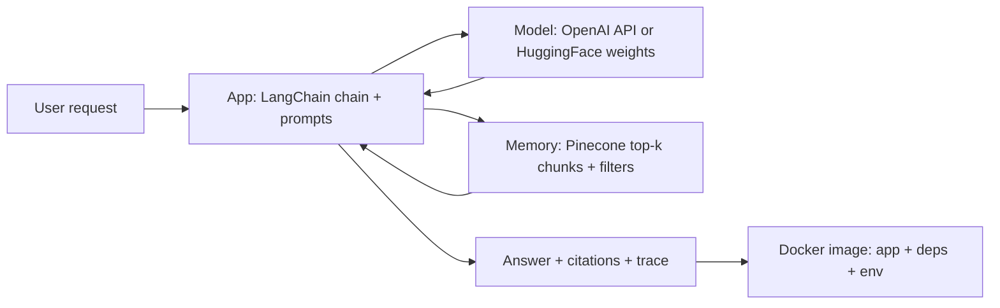
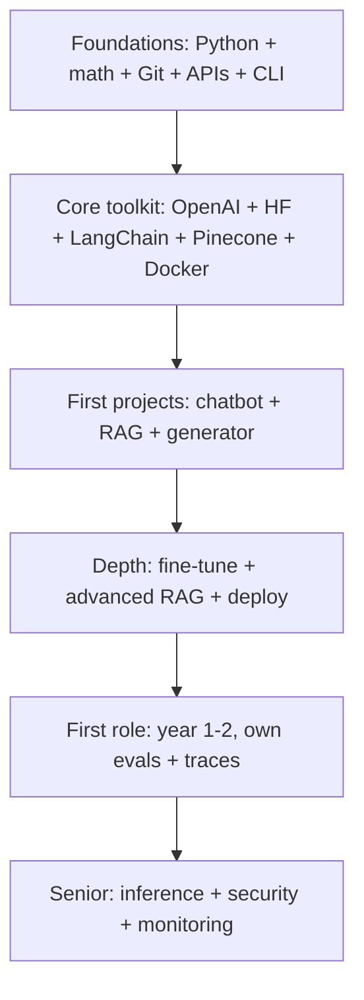

# AI


## Youtube

### Roadmap

- [7 Tools Every AI Engineer Should Learn](https://www.youtube.com/watch?v=aFkImxIcIoA)
- [How to Learn AI Engineering in 5 Minutes (NO PRIOR KNOWLEDGE)](https://www.youtube.com/watch?v=DtE5KogIj8k)
- [Fastest way to become an AI Engineer in 2026](https://www.youtube.com/watch?v=aPpvAYp0xDc)
- [I reviewed 20 AI engineering courses, here are my top 5](https://www.youtube.com/watch?v=HFmoNVx6vTA)

### Internal

- [How AI Works Technically (Must Watch As A Developer)](https://www.youtube.com/watch?v=CwTeSDZSUxM)
- [LLM Tokenizer Explained In Depth](https://www.youtube.com/watch?v=mRcf5qQSYws)

### Course

- [Learn AI with KodeKloud](https://www.youtube.com/playlist?list=PL2We04F3Y_43f3x3n9pawcEuAwru7bcMG)


## Theory

**Roadmap Summary:**
1. Learn production Python, basic math (stats, linear algebra), Git, APIs, and command line
2. Get familiar with the core toolkit:
- OpenAI API: gives you access to powerful pre-trained models without building anything from scratch
- HuggingFace: a library of open source models you can use and fine-tune for more control
- LangChain: lets you chain model calls together into actual multi-step applications
- Pinecone: a vector database that gives your AI the ability to store and retrieve information
- Docker: packages your app so it runs the same way in every environment
3. Build your first projects: a chatbot, a RAG app, and a content generator
4. Go deeper: fine-tuning, advanced RAG, proper deployment
5. Land your first role (most people do this around year 1-2)
6. Work towards senior level: inference optimization, security, monitoring at scale

This guide turns the roadmap above into an interview-ready playbook. You will learn
which Python and math skills actually get used, how the five core tools fit together,
what to build first and why, how fine-tuning, advanced RAG, and deployment deepen
your range, and what separates senior AI engineers on inference, security, and
monitoring. A worked Python starter ties the chatbot, retrieval, and generation
ideas together, and the closing Q and A distils what interviewers probe most.

> Scope note: this page focuses on the AI engineering roadmap — foundations, toolkit,
> first projects, depth, and senior concerns. Agent loops, planning patterns, tools,
> memory, and evaluation deep dives live on the companion Agentic AI page.

### Topics Covered

1. [Python and Math Foundations](#python-and-math-foundations)
2. [Core Toolkit Models and APIs](#core-toolkit-models-and-apis)
3. [Orchestration Retrieval and Packaging](#orchestration-retrieval-and-packaging)
4. [Learning Path from Zero to First Role](#learning-path-from-zero-to-first-role)
5. [First Projects Chatbot RAG and Generator](#first-projects-chatbot-rag-and-generator)
6. [Going Deeper Fine Tuning Advanced RAG and Deployment](#going-deeper-fine-tuning-advanced-rag-and-deployment)
7. [Senior Level Inference Security and Monitoring](#senior-level-inference-security-and-monitoring)
8. [Interview Questions and Answers](#interview-questions-and-answers)

### Python and Math Foundations

Production Python, basic statistics, linear algebra, Git, APIs, and the command line
are the floor for everything above. Interviews do not test academic depth here —
they test whether you can ship, debug, and reason about data and model behaviour.

#### Production Python you actually use

- **Functions, modules, and virtual environments:** clean imports, `venv` or `uv`,
  `requirements.txt`, environment variables for keys — no hardcoded secrets.
- **HTTP clients and JSON:** calling REST APIs, handling timeouts, retries, and
  pagination; parsing nested responses without crashing on missing keys.
- **Async basics:** `asyncio`, concurrent API calls, rate-limit backoff. You do not
  need advanced concurrency, just non-blocking fan-out for evals and ingestion.
- **Data handling:** lists, dicts, Pandas basics, CSV and JSONL I/O, logging with
  structured fields so traces are debuggable.
- **Testing and Git:** `pytest` for tool functions and parsers, branches, pull
  requests, code review — teams hire for this as much as for modelling.

#### Math you actually use

- **Statistics:** means, medians, distributions, sampling bias, precision, recall,
  and confidence. You need these to read evals and explain why a RAG change helped.
- **Linear algebra intuition:** vectors, dot products, cosine similarity, matrix
  shapes. Embeddings are vectors; retrieval is nearest-neighbour search over them.
- **Probability intuition:** softmax as normalised scores, temperature as randomness
  control, top-p and top-k as truncation. Enough to tune generation sensibly.
- **Experiment thinking:** baselines, ablations, golden sets. Change one variable,
  measure task success plus cost, keep the trace.

#### Command line, Git, and APIs

- Navigate, inspect logs, `curl` an endpoint, pipe through `jq`, manage processes.
- Clone, branch, commit, rebase lightly, open a PR, read a diff — the daily loop.
- Auth with bearer tokens, handle 429 and 500 codes, add timeouts and retries with
  exponential backoff and jitter rather than tight loops.

#### Foundations checklist that signals hireable

| Concern | Junior bar | Interview signal |
|---|---|---|
| Python | Scripts run reproducibly | `uv run pytest`, env-based config, typed functions |
| Data | Loads and cleans CSV or JSON | Handles nulls, logs row counts, shows a sample |
| APIs | Calls one API correctly | Timeouts, retries, backoff, error observations |
| Git | Commits and pushes | Small PRs, meaningful messages, reviewed diffs |
| Math | Defines precision and recall | Explains a cosine-similarity retrieval choice |

Name one habit per row in interviews: typed tool functions, golden-task evals, and
budgeted retries prove you write production code, not notebooks.

### Core Toolkit Models and APIs

The roadmap names five tools because together they cover the whole loop: models,
adaptation, orchestration, memory, and shipping. Learn them as a stack, not as
isolated demos.

#### OpenAI API: powerful models without training

- **What it gives you:** chat completions, structured outputs, function calling,
  embeddings, and audio or image endpoints behind one auth and billing story.
- **How to use it well:** system plus developer prompts, JSON mode or schemas for
  structured answers, temperature near 0 for extraction and higher for drafting.
- **Cost and latency control:** pick the smallest model that passes evals, cache
  repeated prompts, batch embedding calls, stream chatbot tokens for perceived speed.
- **Failure handling:** timeout every call, retry on 429 and 5xx with backoff, log
  tokens and latency per call so cost per task is visible.

#### HuggingFace: open models with control

- **What it gives you:** Transformers, Datasets, Tokenizers, PEFT, and the Hub —
  thousands of open models plus versioning and cards documenting limits.
- **When to prefer it:** data cannot leave your VPC, you need custom latency or
  cost, or you must fine-tune behaviour the API cannot express.
- **Core workflow:** `from_pretrained`, tokenizer alignment, padding and truncation
  discipline, device mapping, batched inference, then evaluate before quantising.
- **Interview line:** hosted APIs win for speed of iteration; open weights win for
  privacy, unit economics, and deep customisation — prove the choice with evals.

#### What good tool choice sounds like

- Small summariser over private tickets: open model in Docker for privacy and cost.
- Customer-facing assistant with citations: hosted frontier model plus RAG over docs.
- High-volume classifier: fine-tuned small model behind a fast inference server.
- Prototype in days: hosted API plus LangChain plus Pinecone; migrate only the hot
  path to self-hosted once usage and evals justify it.

In practice teams mix both: prototype on the API, distil or fine-tune a small open
model for the stable high-volume path, and keep the frontier model for hard cases
and judges. Saying when you would switch is a senior-level signal.

### Orchestration Retrieval and Packaging

LangChain chains calls into applications, Pinecone gives those applications memory,
and Docker makes the result runnable anywhere. Learn this slice as one deployable
unit rather than three tutorials.

#### LangChain: chains that become applications

- **What it solves:** multi-step flows — retrieve context, build a prompt, call the
  model, parse the output, repeat — without tangled imperative glue.
- **Core pieces:** prompt templates, chat models, output parsers, runnables and
  chains, retrievers, agents and toolkits, plus LangSmith tracing for debugging.
- **How to stay out of trouble:** prefer explicit runnables over magic chains, log
  every intermediate prompt and observation, pin versions, and keep business logic
  in plain tested functions the chain calls rather than inside prompt strings.
- **When to drop down a level:** hot paths and strict latency budgets often become
  raw API calls plus a small state machine; frameworks orchestrate, they do not
  change the algorithm — the same lesson the Agentic AI page teaches for loops.

#### Pinecone: memory your app can search

- **What it solves:** stores embedding vectors with metadata and returns the most
  similar chunks per query, so the model answers from your docs instead of memory.
- **Core workflow:** chunk documents, embed with one consistent model, upsert with
  tenant, source, and date metadata, query top-k with filters, stuff winners into
  the prompt with citations.
- **Design choices that matter:** chunk size and overlap, embedding model version,
  distance metric, namespace per tenant, and re-embed discipline when either model
  changes — stale mixed-version indexes silently degrade quality.
- **Alternatives and judgement:** Postgres with `pgvector`, Elasticsearch, and
  Qdrant cover many workloads; Pinecone wins on managed scale and filters. Name
  the tradeoff — operational cost versus control — rather than the brand.

#### Docker: identical environments everywhere

- **What it solves:** "works on my machine" for Python, CUDA, system libs, and env
  vars — one image runs on laptops, CI, and GPU hosts with the same behaviour.
- **Minimum viable practice:** slim base image, pinned dependencies, non-root user,
  `HEALTHCHECK`, env-based secrets, mounted volumes for data, tagged releases.
- **Compose for the stack:** app plus vector store plus cache plus eval runner in
  one `docker compose up`; GPU flags and volume mounts declared, not improvised.
- **Interview line:** if you cannot rebuild the image from scratch in CI and boot
  it with one command, it is not yet deployable.

#### How the five tools compose



*The diagram above shows the standard first-system shape: the chain orchestrates,
the model reasons, the vector store grounds, and Docker freezes the result.*

### Learning Path from Zero to First Role

The roadmap compresses to roughly one to two years because each phase funds the
next: foundations unlock toolkit fluency, the toolkit unlocks portfolio projects,
and projects unlock interviews.



*Each stage is gated by a demo plus an eval: scripts, then a chained app, then
retrieved answers with citations, then a deployed service with measured quality.*

#### Phase 0 to 1: foundations to toolkit (months 0–4)

- Ship weekly Python scripts: API clients with retries, CSV cleaners, small CLIs.
- Read model cards, call chat and embedding endpoints, compare two models on ten
  fixed prompts and log tokens, latency, and quality notes.
- Build one LangChain chain over static context, one Pinecone index over your own
  notes, and one Dockerfile that boots the chain end to end.

#### Phase 2: first projects (months 4–8)

- Chatbot with memory and streaming; RAG over docs with citations; generator with
  structured outputs and templates — each with a golden set of 20–50 checks.
- Write the traces down: prompts, retrieved chunks, token counts. Reviewers and
  interviewers trust logs over adjectives.
- Publish repos with READMEs that state scope, eval scores, cost per query, and
  known limits. That honesty reads as seniority.

#### Phase 3 to 4: depth to first role (months 8–18)

- Fine-tune a small open model with LoRA on your own task data; compare against
  prompt-only baselines on held-out tasks.
- Harden RAG with reranking, filters, and refusal paths; deploy behind an API with
  auth, rate limits, and dashboards.
- Interview with stories of the form: baseline, change, measurement, rollback plan.
  Teams hire engineers who measure, not just enthusiasts who prompt.

### First Projects Chatbot RAG and Generator

Build all three because each teaches a different production muscle: state, grounding,
and control. Keep them small, tested, and evaluated — one good trace beats ten
unchecked demos.

#### Project 1: chatbot with memory

- **Scope:** streaming replies, conversation memory with summarisation, graceful
  fallback to clarifying questions under uncertainty.
- **What it teaches:** prompt construction, context budgets, token accounting, and
  refusal discipline when tools or memory miss.
- **Eval:** multi-turn scripts — topic switches, corrections, long-context recall —
  scored for coherence, memory accuracy, and escalation quality.

#### Project 2: RAG app with citations

- **Scope:** ingest docs, chunk and embed, retrieve top-k with metadata filters,
  answer with quoted sources, refuse when evidence is missing.
- **What it teaches:** chunking tradeoffs, embedding consistency, precision versus
  recall in retrieval, and grounding the final answer in observations.
- **Eval:** questions with known supporting passages; score answer correctness,
  citation faithfulness, and refusal rate on unanswerable items.

#### Project 3: content generator with structure

- **Scope:** templated briefs to outlines to drafts with JSON schemas, style
  controls, and a human approval step before publish.
- **What it teaches:** controlled generation, schema validation, temperature and
  sampling settings per stage, and critique loops that stay cheap.
- **Eval:** rubric scoring — structure, factuality flags, style fit — plus a human
  pass on every tenth output to catch rubric blindness.

#### Worked Python starter: lookup plus grounded answer

The snippet below is a complete minimal starter in raw Python: an in-memory doc
store stands in for Pinecone, cosine similarity stands in for vector search, and a
fake generator stands in for the OpenAI or HuggingFace call. It mirrors the real
data flow — chunk, embed, retrieve, generate with citations — which is exactly why
interviewers like it.

```python
"""Minimal RAG starter: chunk + embed + retrieve + grounded answer + trace."""
from __future__ import annotations
import math
from dataclasses import dataclass, field

# 1. Tiny docs stand in for ingested pages; chunks carry source metadata
DOCS = [
    {"source": "refunds.md", "text": "Refunds are allowed within 14 days with receipt"},
    {"source": "shipping.md", "text": "Shipping takes 3 to 5 business days standard"},
    {"source": "pricing.md", "text": "Team plan costs 20 dollars per seat monthly"},
]

VOCAB = ["refund", "refundable", "shipping", "pricing", "team", "days", "receipt"]


# 2. Toy bag-of-words embedder stands in for an embedding API call
def embed(text: str) -> list[float]:
    lowered = text.lower()
    return [float(lowered.count(token)) for token in VOCAB]


def cosine(a: list[float], b: list[float]) -> float:
    denom = math.sqrt(sum(x * x for x in a)) * math.sqrt(sum(x * x for x in b))
    if denom == 0:
        return 0.0
    return sum(x * y for x, y in zip(a, b)) / denom


# 3. Retrieval with top-k and a score floor; empty means refuse, not invent
def retrieve(query: str, k: int = 2, floor: float = 0.1) -> list[dict]:
    scored = sorted(
        ({**doc, "score": cosine(embed(query), embed(doc["text"]))} for doc in DOCS),
        key=lambda row: row["score"],
        reverse=True,
    )
    return [row for row in scored[:k] if row["score"] >= floor]


# 4. Grounded generator: cites retrieved sources or refuses without evidence
@dataclass
class Trace:
    query: str = ""
    retrieved: list[dict] = field(default_factory=list)


def answer(query: str) -> dict:
    trace = Trace(query=query, retrieved=retrieve(query))
    if not trace.retrieved:
        return {"answer": "I do not have evidence for that.", "citations": [], "trace": trace}
    cites = sorted({row["source"] for row in trace.retrieved})
    joined = "; ".join(f'{row["text"]} [{row["source"]}]' for row in trace.retrieved)
    return {"answer": f"Based on our docs: {joined}.", "citations": cites, "trace": trace}


if __name__ == "__main__":
    for demo in ["How do refunds work?", "What is the team pricing?", "Do you sell shoes?"]:
        out = answer(demo)
        print(f"Q: {demo}\nA: {out['answer']}\n")
```

Explanation of each block: the doc list models chunked pages with source metadata
so citations stay attached; the toy embedder replaces an API call while keeping
the vector intuition visible; retrieval sorts by cosine similarity with a score
floor so weak matches become refusals instead of hallucinations; the generator
joins retrieved text with bracketed sources and returns the trace alongside the
answer. To extend toward production, swap the toy functions for real embedding and
chat calls, persist chunks in Pinecone with tenant namespaces, add reranking and
query rewriting, stream chatbot tokens, and log every trace to your eval harness.

### Going Deeper Fine Tuning Advanced RAG and Deployment

Depth is what moves you past demos: adapting model behaviour, hardening retrieval,
and running the result as a real service with measured quality.

#### Fine-tuning without mystique

- **When it helps:** stable task shape with plenty of examples — classifiers,
  extractors, style adapters — where prompts plateau and errors are systematic.
- **When it hurts:** factual knowledge injection (use RAG instead), tiny datasets
  that memorise noise, or shifting specs that invalidate training weekly.
- **Practical path:** collect prompt plus completion pairs from production traces,
  hold out a test split, start with LoRA or QLoRA on a small open model via
  HuggingFace PEFT, compare against the prompt-only baseline on task success.
- **What to report:** base versus tuned scores, training size, hyperparameters,
  regression checks on adjacent tasks — fine-tunes that fix one slice and break
  two others are net losses.

#### Advanced RAG that survives contact with users

- **Query side:** rewrite ambiguous queries, expand with synonyms, route between
  vector, keyword, and hybrid search per question type.
- **Retrieval side:** retrieve broader then rerank with a cross-encoder, apply
  tenant and freshness filters, deduplicate near-identical chunks.
- **Generation side:** stuff only winners with source tags, demand citations per
  claim, refuse explicitly when the shelf is empty.
- **Chunking discipline:** overlap windowed prose, respect document structure for
  manuals and code, never mix embedding versions in one index.

| Upgrade | Symptom it fixes | Cost |
|---|---|---|
| Reranking | Right docs retrieved but wrong one cited | Extra model call per query |
| Hybrid search | Exact IDs and keywords missed by vectors | Index plus query complexity |
| Filters + namespaces | Cross-tenant or stale chunks leak in | Metadata discipline |
| Refusal path | Confident answers with no evidence | Small success-rate dip, large trust gain |

#### Proper deployment for AI services

- **API surface:** FastAPI with auth, rate limits, request IDs, streaming for chat
  and JSON mode for structured tasks; validate inputs before they reach the model.
- **Configuration:** env-based keys, model and index versions pinned, feature flags
  for prompt and retrieval changes so rollbacks are instant.
- **Testing:** golden-task suite in CI — answer quality, citation faithfulness,
  refusal behaviour, latency and cost budgets — blocking deploys on regression.
- **Rollout:** shadow new prompts on live traffic, compare traces offline, canary
  to a slice, then promote with dashboards watching success, cost, and errors.

### Senior Level Inference Security and Monitoring

Senior AI engineers are measured by unit economics, incident avoidance, and
operational calm — not by demo fluency.

#### Inference optimisation that lowers bills

- **Model selection:** smallest model that passes evals per route; cascade from
  small to frontier only on low confidence or explicit complexity signals.
- **Serving stack:** batched inference, KV-cache reuse, quantisation (AWQ, GPTQ),
  and servers like vLLM or TGI for open weights behind autoscaled GPU pools.
- **Prompt efficiency:** shorter contexts via better retrieval, cached system
  prompts and few-shot blocks, parallel fan-out only where it changes answers.
- **What to measure:** time to first token, tokens per second, cost per solved
  task — report all three, because cheap but wrong is the most expensive option.

#### Security as a design constraint

- **Secrets and scope:** keys in vaults, per-tenant tool credentials, least
  privilege per tool — reads separated from writes, destructive calls gated.
- **Untrusted content:** treat retrieved docs and tool output as data, never as
  instructions; delimit, sanitise, and strip scripts before prompt insertion.
- **Injection defences:** allowlisted tools, approval gates on side effects,
  idempotency keys on writes, PII redaction in logs, output filters on sensitive
  patterns.
- **Reviews that matter:** threat-model each new tool (who can invoke it, what it
  can mutate, how to roll back), and add adversarial evals with injection-laced
  pages and revoked permissions.

#### Monitoring at scale

- **Golden signals per task:** success rate, citation faithfulness, refusal
  quality, latency percentiles, tokens and dollars per task, error and retry mix.
- **Trace everything:** prompts, retrieved chunk IDs, tool arguments, observations,
  model versions — without full traces, debugging and evals are guesswork.
- **Drift detection:** track query mix, retrieval hit rates, judge scores, and
  user corrections; alert when distributions shift after doc or model changes.
- **Incident posture:** runbooks for bad deploys (pin and roll back prompts,
  indexes, and weights independently), data retention and deletion paths, and
  sampled human review that never fully stops.

### Interview Questions and Answers

1. **How would you become an AI engineer from scratch?**
   Master production Python, basic stats and linear algebra, Git, APIs, and the
   CLI; then learn the core stack as one unit — OpenAI API for hosted models,
   HuggingFace for open weights, LangChain for orchestration, Pinecone for
   retrieval, Docker for shipping. Prove it with a chatbot, a cited RAG app, and
   a structured generator, each with golden-task evals and traces.

2. **OpenAI API versus HuggingFace — how do you choose?**
   Hosted APIs win for iteration speed and frontier quality; open weights win for
   privacy, latency control, and unit economics at volume. Prototype on the API,
   measure cost per solved task, and migrate the stable high-volume path to a
   fine-tuned small model behind vLLM or TGI when evals justify it — keeping
   the frontier model for hard cases and judging.

3. **What does LangChain actually buy you over raw API calls?**
   Structure for multi-step flows: prompt templates, runnables, retrievers, tool
   wiring, and LangSmith traces. It earns its place while exploration is fast;
   hot paths with strict budgets often collapse back to raw calls plus a small
   state machine. Frameworks orchestrate the loop, they do not change it.

4. **Walk me through your RAG pipeline end to end.**
   Chunk docs with structure awareness, embed with one pinned model, upsert to
   Pinecone with tenant, source, and date metadata, retrieve top-k with filters,
   rerank, stuff winners with source tags, generate with per-claim citations, and
   refuse when evidence is missing. Eval answer correctness, citation
   faithfulness, and refusal quality on golden tasks including unanswerables.

5. **Your chatbot hallucinates. How do you fix it?**
   First check retrieval, not the model: chunk sizes, embedding consistency,
   top-k and filters, reranking. Then enforce grounding — cite observation IDs,
   refuse without evidence, lower temperature for extraction. Measure faithfulness
   from traces before and after; most hallucinations are retrieval or prompt
   failures wearing a model costume.

6. **When is fine-tuning the right call versus better prompting or RAG?**
   Fine-tune for stable task shapes with systematic errors and ample examples;
   prompt when specs shift weekly; retrieve when facts live in docs. Always beat
   the prompt-only baseline on held-out tasks and check regressions on adjacent
   behaviour — a tune that fixes one slice and breaks two is a loss.

7. **How do you deploy an AI app so it survives production?**
   FastAPI with auth, rate limits, and request IDs in Docker; pinned models,
   prompts, and index versions behind flags; golden-task CI blocking regressions;
   shadow then canary rollouts with dashboards on success, faithfulness, latency,
   and cost per task. Roll back prompts, indexes, and weights independently.

8. **How do you control inference cost and latency at scale?**
   Route per query to the smallest passing model, cascade upward only on low
   confidence, batch and cache aggressively, quantise open models behind vLLM or
   TGI, and shorten contexts with better retrieval. Report time to first token,
   tokens per second, and cost per solved task together.

9. **How do you secure an AI system that calls tools?**
   Least privilege per tool, approvals plus idempotency keys on writes, tenant
   scoping throughout, sanitised tool output treated as data, PII redaction in
   logs, full audit traces, and adversarial evals with injections and revoked
   permissions. Threat-model every new tool before it ships.

10. **What do you monitor after launch, and what pages you?**
    Task success, faithfulness, refusal quality, latency percentiles, and cost per
    task with full traces attached. Pages: success drops after a prompt, model,
    or doc change; retrieval hit-rate collapses; injection or cross-tenant leak
    signals; cost spikes from runaway loops. Each alert maps to a rollback.