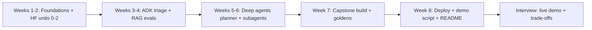

# Courses for AI


## Websites

- [AI Agents Course](https://huggingface.co/learn/agents-course/en/unit0/introduction)
- [ADK Crash Course - From Beginner To Expert](https://codelabs.developers.google.com/onramp/instructions#0)
- [Project: Deep Agents](https://academy.langchain.com/courses/deep-agents-with-langgraph)

## Theory

This page collects structured, project-oriented AI courses rather than one-off tutorials.
It covers autonomous agents (Hugging Face Agents Course), Google's Agent Development Kit (ADK), and deep agents with LangGraph.
Use these after the basics to build multi-step, tool-using agent systems end to end.

Project-based AI courses teach the way real systems get built: a goal, a repo, a demo, and a
trail of decisions you can defend. Instead of watching ten disconnected tutorials on prompts,
embeddings, and agents, you pick one course spine, build every milestone, and finish with a
capstone you can demo live. The skill shifts from collecting certificates to proving slices:
a retrieval pipeline that answers from your docs, an agent that calls tools in order, a deploy
that survives restart and reload. Employers and interviewers trust running checkpoints over
completed videos.

Think of each course as a tech lead in written form. Pre-recorded lessons supply the map,
starter repos supply the conventions, autograded checks or community reviews supply the tests,
and the capstone supplies the proof. Your job is the same loop as vibe coding: small slice,
visible diff, runnable check. Watch one module, build the milestone the same day, write down
what broke, and carry a green checkpoint into the next module. Courses that force you to push
code, paste traces, and explain trade-offs beat courses that let you nod along at 2x speed.

This guide takes you from picking to capstone. You will learn how to choose a project-based
course without overpaying or tutorial-hopping, which foundations actually pay off before agents,
how the agents and RAG track maps to the three linked courses, how the deploy track turns a
notebook into a service, which capstone patterns interviewers remember, how to study so each
week ends with a demo, and which questions to rehearse once the project is live. A mermaid
roadmap ties the tracks into one eight-week path.

> Scope note: this page focuses on project-based AI courses for system design interviews —
> how to pick a course, the foundations, agents plus RAG, deploy, and capstone patterns.
> Deep dives on LLM internals, tokens and context budgets, embedding choice, vector database
> internals, and LangChain plus LangGraph orchestration live on companion pages — build
> there, prove here.

### Topics Covered

1. [How to Choose a Project-Based AI Course](#how-to-choose-a-project-based-ai-course)
2. [Foundations Track: Python, APIs, and LLM Basics](#foundations-track-python-apis-and-llm-basics)
3. [Agents and RAG Track: The Three Linked Courses](#agents-and-rag-track-the-three-linked-courses)
4. [Deploy Track: From Notebook to Service](#deploy-track-from-notebook-to-service)
5. [Capstone Patterns and Roadmap](#capstone-patterns-and-roadmap)
6. [Interview Questions and Answers](#interview-questions-and-answers)

### How to Choose a Project-Based AI Course

Choosing well matters more than starting fast. A good project course ends with an artefact
you can run, break, fix, and explain — not a quiz score. Given the three links above, plus
any paid course you consider, judge the spine before the trailer: milestones, repo quality,
verification, and capstone freedom. Marketing promises breadth; interviews probe one deep
project you fully own.

```text
Goal + time box → Compare milestones → Inspect starter repo → Check verification → Pick one spine → Finish capstone
```

The name of the game is commitment. One finished capstone with tests, evals, and a deploy
beats four half-watched courses with identical week-one chatbots. Starter guides pull you in
with a working demo in an afternoon; the Hugging Face agents track earns trust with graded
tool-calling milestones; the LangGraph deep-agents project proves multi-step planning. All
three share the same test: does each module leave a commit you can demo?

#### What to compare before you enrol

| Criterion | What good looks like | Red flag | How to check in 10 minutes |
|---|---|---|---|
| Project spine | One system grown over weeks | Disconnected toy demos | Read syllabus; milestones compound? |
| Starter repo | Pinned deps, README, scripts | Paste-this-notebook only | Clone; README runs first try? |
| Verification | Tests, evals, or reviews per milestone | Auto-play next video | Look for checks, quizzes with code |
| Tool relevance | LangGraph, ADK, HF agents, RAG | Custom wrapper only | Stack matches job posts? |
| Capstone freedom | Your data, your tools, rubric | Fixed dataset, no deploy | Past capstones demoed live? |
| Time honesty | 5-8 hrs/week stated, 6-8 weeks | "Master AI in a weekend" | Reviews mention actual hours |
| Cost vs proof | Free spine plus paid review | Paywall before first build | Build week one free? |

None of this requires the perfect course. Pick the spine whose capstone you actually want to
demo — a support agent over your docs, an ADK multi-agent workflow, a deep-research agent —
and let motivation carry week four. Teams and interviewers treat course projects as take-home
proxies: they will click the demo, read the README, and ask why you chose each tool.

#### A concrete selection example

Say you have six weekends and know Python plus REST. A weak approach bookmarks all three
links plus two paid courses and finishes none. A project-based pick says: weeks 1-2 Hugging
Face units 0-2 for tool-calling basics, weeks 3-4 ADK crash course for multi-agent structure,
weeks 5-6 LangChain deep agents for planning plus subagents, weeks 7-8 capstone plus deploy.
One spine, three lenses, one demo. Small commitment plus explicit checkpoints is the whole
selection method in miniature.

#### Who each linked course helps most

Beginners who have shipped one CRUD app should start with the ADK crash course: guided,
opinionated, and fast to a running agent. Engineers comfortable with APIs and prompts should
start with the Hugging Face Agents Course: deeper on reasoning, tools, and open models.
Builders ready for a portfolio piece should reserve the Deep Agents with LangGraph project
for the capstone phase: planning, subagents, and long-horizon tasks. Interviewers care that
you can name why you picked your order and what each layer added.

### Foundations Track: Python, APIs, and LLM Basics

Agents amplify foundations; they do not replace them. Students who skip this track build
agents that sort of work and cannot say why retries, streaming, or JSON parsing fail. Strong
candidates spend two weeks here so the later tracks move fast: Python fluency, HTTP plus JSON
discipline, and LLM call mechanics. Below are the five checkpoints that cover most needs.

#### 1. Python and repo hygiene in one weekend

Ship a CLI plus tests before touching agents. Virtual envs, pinned requirements, env files,
logging, and a README with setup steps. Explicit run commands beat vibes when the grader or
interviewer clones your repo.

```text
Goal: CLI that summarises a markdown file via an LLM API.
Context: single repo, Python 3.11, pinned httpx + pytest.
Constraints: no framework; secrets only from env; README with setup.
Checks: pytest passes; --help works; log shows tokens + latency.
```

#### 2. API calls with retries, timeouts, streaming

Show you can call an LLM like a backend dependency: timeouts, retries with backoff, JSON
mode, and streaming to the terminal. One evening teaches the patterns the agent harness will
assume: idempotency keys, error classes, and cost logging. Keep the client under 200 lines;
readability is the review signal.

#### 3. Prompts as functions with a worked example

Concrete system prompts plus schemas beat adjectives like "smart". Give one happy path plus
one refusal case, then demand the model echo its tool plan before acting. A worked example
ties the method together.

```text
Summarise support tickets into JSON:
Input: ticket {id: 42, text: "Refund not received after 9 days..."}.
Behaviour: output {summary, sentiment, action}; action in [refund, escalate, reply];
empty text returns action reply with low confidence.
Log tokens and latency; retry once on invalid JSON with a narrower repair prompt.
```

Why this works: the schema pins output the parser can trust, the retry rule handles the
commonest LLM failure, logging builds cost awareness, and the refusal case proves you test
edges. When JSON parsing fails, the next fix is narrow: tighten the schema plus one repair
attempt, not a prompt rewrite.

#### 4. Embeddings and cosine search without a database

Build retrieval with NumPy before reaching for a vector store. Embed a dozen docs, compute
cosine similarity, return top-k with scores. This single habit plus printing scores removes
most RAG mystery. Pair it with a cutoff rule so "add Pinecone" is never the first fix.

#### 5. Evals and cost tracking from day one

Split hard claims: one script grades answers, a second logs cost and latency. Small goldens
beat one mega-benchmark on actionability. Add memory around the project — a short eval doc
with ten questions, expected keywords, and a pass threshold — so every later change starts
measured and stays comparable.

#### Anti-patterns to name in interviews

- **Tutorial hopping:** three week-ones, zero week-sixes. One spine to capstone.
- **Notebook only:** cells that run top-to-bottom once. Promote to scripts plus tests.
- **Key in code:** hardcoded secrets that leak on GitHub. Env files plus gitignore.
- **Unmeasured tweaks:** "better prompt" with no before-after scores. Goldens first.
- **Framework first:** LangGraph before requests plus retries. Basics compound.

### Agents and RAG Track: The Three Linked Courses

This is the heart of the page: three linked courses that together cover reasoning plus tools,
multi-agent structure, and long-horizon planning. Taken in order they form one progression —
call tools reliably, organise agents cleanly, then plan over many steps. Each maps to a
two-week project with its own demo, and together they supply every part of a capstone.

#### What actually to build per course

- **Hugging Face Agents Course — reasoning and tool use:** function-calling agents, ReAct
  loops, code agents, and open-model harnesses. Build a milestone per unit: a calculator
  agent, a retrieval agent over course notes, a multi-tool research agent with traces.
- **ADK Crash Course — multi-agent structure:** sessions, runners, sequential plus parallel
  agents, evaluators. Build a support triage flow: classifier routes to refund, technical,
  or escalation subagents with shared session state.
- **Deep Agents with LangGraph — planning and subagents:** plan-then-execute, supervisor
  graphs, memory plus checkpoints, human-in-the-loop. Build a deep-research agent that
  plans, spawns subagents, merges findings, and cites sources.

A six-week habit that scales: finish one unit, extend the running project the same day,
record a two-minute demo, then start the next unit from green. The HF track in the links
above shows tool-calling discipline with traces; the ADK crash course shows session wiring
on a real multi-agent flow; the deep-agents project turns both into a planner that survives
ten-step tasks. Same spine, rising horizon.

#### Retrieval ladder worth memorising

| Level | What to build | Example check |
|---|---|---|
| Chunk plus embed | Split docs, embed, top-k search | "recall@5 on 10 goldens above 0.8" |
| Rerank plus cite | Rerank top-20, answer with citations | "every claim has a doc id" |
| Eval harness | Goldens with keyword grading | "npm run eval prints pass rate" |
| Tool-routed RAG | Retriever as one agent tool | "trace shows search before answer" |
| Guardrails | Refuse when context is thin | "empty index returns I don't know" |

#### A worked agent milestone example

Say the HF unit asks for a tool-using agent:

```text
Window of trust: agent with 3 tools (search, calculator, docs) + 5 goldens
- Trace per question: thought → tool → observation → final, printed
- 4/5 goldens pass; failing one logged with tool output pasted
- Manual: ask off-scope question → clean refusal, no hallucinated tool call
= Commit message: "ReAct agent with traced tools and 4/5 goldens"
```

When the sum fails, apply the standard playbook in order: read the trace to find the wrong
tool call, tighten the tool description plus one example, re-run only the failing golden,
widen to the full set once green, and only then add the next tool. Each step trades a little
breadth for a lot of reliability saved.

#### Shipping discipline beyond the unit

Keep tool schemas strict — typed args, one purpose per tool — put destructive tools behind
confirmation, require cited answers for anything factual, and log traces plus latency plus
cost for every demo. Track tool-call accuracy — correct tool with correct args — as the
headline quality metric, and keep a do-not-ship list (uncited claims, silent tool failures,
unlogged costs) so standards are stated, not assumed.

### Deploy Track: From Notebook to Service

Deploy turns a course project into an interview asset: a URL that answers, restarts cleanly,
and shows its work. Interviewers test whether you can name the path, show what each layer
adds, and attach a failure story to each. The track below fits in two weekends and reuses
the same agent from the previous section.

| # | Deploy step | What it looks like | Fix when it breaks |
|---|---|---|---|
| 1 | API wrapper | FastAPI POST /ask with request ids | Timeouts set; stream long answers |
| 2 | Containerise | Dockerfile, pinned deps, env config | Slim image; no secrets baked in |
| 3 | Host simply | Render, Fly, or HF Spaces deploy | Free tier plus sleep behaviour noted |
| 4 | Persist state | SQLite or Postgres for sessions | Migrate script reviewed line by line |
| 5 | Observe | Logs with latency, cost, traces | Dashboard or JSONL tail per demo |
| 6 | Gate quality | Eval suite runs in CI on push | Red eval blocks deploy |
| 7 | Document | README with demo GIF plus trade-offs | Reviewer runs in under 5 minutes |

Defence in depth: constrain with request validation and rate limits, verify with evals plus
smoke tests after each deploy, and gate with human approval for data deletes and key
rotation. Track p95 latency and cost per query as the headline ops metrics, and keep a
rollback-first norm so a bad deploy reverts clean instead of stacking hotfixes on a live
service.

#### Limits worth stating plainly

Course deploys optimise for demo reliability, not scale — one replica, tiny eval sets, and
generous timeouts. Production adds what courses skip: auth and abuse controls, secret
rotation, autoscaling and cold starts, data retention policy, and incident playbooks. The
recent "demo versus production" discourse makes the same point from the hiring side: a live
URL with no evals, logs, or rollback story collapses the moment an interviewer goes
off-script. Name the boundary explicitly — "course-grade deploy, production-aware notes" —
because that is the stance interviewers want to hear.

#### When to step out of the course path

Hand-wire the auth seam, the billing counter, and the PII redactor; read the provider docs
when the SDK hedges; write the eval yourself when correctness is the spec. Courses accelerate
the standard middle — scaffolds, patterns, starter prompts — while trust-heavy edges stay
builder-led. If deploys fail three times on one step, the tutorial is not the problem: read
the logs, shrink the image, or simplify the architecture.

#### Picking your deploy stack: three setups

- **Fastest live URL:** Hugging Face Spaces or Streamlit for the clickable demo, then link
  from the README. The ADK crash path and the HF agents path both end here naturally: push
  the agent behind one endpoint, record the demo, then harden. Aim for one evening to live,
  one weekend to evals plus logs.
- **Portfolio service:** FastAPI plus Docker on Render or Fly with SQLite sessions. Health
  endpoint plus eval gate in CI; the README shows architecture, cost per query, and known
  limits. Commit per deploy so any bad release costs at most one rollback.
- **Team-realistic slice:** Postgres plus background workers plus trace logging, with
  human-in-the-loop approval for writes. The deep-agents project above shows this posture:
  checkpoints, subagent traces, and cited answers that make review the default rather than
  a mood. Same endpoint as the portfolio setup; the bars for evidence sit higher.

#### Cost and context habits from the LLM companion page

Serving burns money the way long contexts burn tokens: every query pays for system prompt
plus retrieved chunks plus tool calls plus output. Habits that transfer directly: cache
embeddings and reuse the index instead of re-embedding per query, cap top-k and max steps
instead of open-ended retrieval, summarise session history into a fresh context rather than
stacking turns, and reserve output budget for citations rather than filler. When latency or
cost climbs week over week, the context is full — compress, cache, re-brief.

#### Anti-patterns at the deploy level

- **Notebook link as deliverable:** a Colab that runs once is a draft, not a demo. Ship a URL.
- **Secrets in the image:** keys baked into Docker layers. Env-injected, scanned, rotated.
- **Deploys without gates:** push-to-prod with no eval. Wire at least one hard gate.
- **Logs nobody reads:** stdout only on crash. Latency plus cost plus traces every query.

### Capstone Patterns and Roadmap

Capstones are remembered by demo, not by syllabus. A strong capstone answers one user need
with tools, retrieval, and a deploy — and survives three follow-up questions. Interviews test
whether you can name the pattern, show what the system does under pressure, and attach a
trade-off to each choice. Pick one pattern below and build it to demo-grade, not four to
tutorial-grade.

| # | Capstone pattern | What you build | Why interviewers like it |
|---|---|---|---|
| 1 | Docs support agent | RAG plus tools over your docs, cited answers | Retrieval, evals, refusal logic visible |
| 2 | Multi-agent triage | ADK router plus subagents plus session memory | Orchestration and state boundaries |
| 3 | Deep-research agent | LangGraph planner plus subagents plus merge | Planning, parallelism, citations |
| 4 | Ops copilot | Read-only tools plus human approval for writes | Safety, gating, real-world judgement |

Defence in depth for any pattern: constrain with scoped tools and refusal rules, verify with
goldens plus a live demo script, and gate with evals in CI before deploy. Track demo
robustness — five scripted questions plus three adversarial ones, all passing — as the
headline readiness metric, and keep a known-limits slide so honesty reads as seniority.

#### Which pattern fits which background

- **Support agent:** best first capstone. Reuses the retrieval ladder directly, needs only
  one agent plus one index, and demos in minutes. The Hugging Face units above supply the
  tool loop; the deploy track supplies the URL. Aim for 20 docs, 15 goldens, cited answers.
- **Triage flow:** best for backend engineers. Shows routing, session state, and parallel
  subagents without long-horizon planning. The ADK crash course maps one to one: classifier,
  specialists, evaluator. Aim for three intents, shared state, one escalation path.
- **Research agent:** best portfolio peak. Plans, spawns, merges, cites — the full LangGraph
  deep-agents arc. Harder evals, stronger signal. Aim for a three-source synthesis with
  per-claim citations and a subagent trace view.
- **Ops copilot:** best for working engineers. Mirrors internal tools: read APIs freely,
  writes behind approval, every action logged. Aim for two read tools, one gated write, and
  an audit log the demo can show.

#### Eight-week roadmap



*The course spine left to right: foundations make tool calls reliable, ADK organises agents,
planning stretches the horizon, capstone week hardens one pattern, deploy week makes it
clickable. Each block ends with a demo; no block starts on red.*

```text
Per week: 1 unit watched → 1 milestone built → 1 demo recorded → 1 README paragraph
```

Keep the chain short enough to run every week. If one week slips, cut scope — fewer docs,
fewer tools, same gates — rather than skipping evals or the demo. Momentum comes from green
weeks compounding, not from heroic final weekends.

#### Study method that finishes

A typical study week touches four moves in order. Watch at 1.25x with the repo open and
pause to predict each code block. Build the milestone the same day without rewatching —
struggle first, rewind second. Verify with the unit checks plus your own goldens, and log
what broke in three lines. Demo weekly to a friend or rubber-duck camera: five minutes,
live URL, three questions taken. When a week is missing its demo the spine wobbles: no
proof means week eight inherits week three's confusion.

```text
Watch with repo open → Build same day → Verify with goldens → Demo weekly → Next unit
```

Study rules that survive deadline pressure: one spine at a time, phone away for 90-minute
blocks, no new course before the current capstone ships, and a Friday rule that unverified
code never rolls into next week. Track finished milestones — demos recorded, goldens green —
as the headline progress metric, and keep a parking lot for shiny side quests so focus is
stated, not assumed.

#### Anti-patterns at the capstone level

- **Four starters, zero finishers:** breadth without proof. One pattern to demo-grade.
- **Golden-free capstone:** "works on my questions" with no recorded set. Fifteen goldens minimum.
- **Demo script amnesia:** clicking around hoping. Five scripted plus three adversarial paths.
- **README as afterthought:** no setup, no trade-offs. Reviewer runs in five minutes.

### Interview Questions and Answers

1. **How do you pick a project-based AI course?**
   By spine, not trailer: compounding milestones, a runnable starter repo, per-module checks,
   a stack that matches real work, and a capstone with demo freedom. I timebox to 5-8 hours
   a week, verify week one builds free, and commit to one spine through a capstone with tests
   and a deploy rather than sampling four week-ones.

2. **What foundations do you need before agents?**
   Python plus repo hygiene, LLM calls with retries and streaming, prompts as typed functions,
   embeddings with cosine search before any vector DB, and evals plus cost logging from day
   one. Agents assume these: without timeouts, schemas, and goldens, every tool failure looks
   like model magic instead of a debuggable seam.

3. **Walk me through your agents and RAG project.**
   I built a traced ReAct agent from the Hugging Face units, organised triage subagents with
   ADK sessions, then added a LangGraph planner with subagents for research. Retrieval grew
   along the ladder: chunk plus embed, rerank plus citations, an eval harness, tool-routed
   search, and refusal on thin context. Traces and goldens gate every new tool.

4. **How do you evaluate a RAG or agent system?**
   Fifteen goldens with keyword grading, recall at 5 for retrieval, tool-call accuracy with
   correct args, citation coverage for factual answers, plus latency and cost per query. Evals
   run in CI and block deploy on red. Weekly I add the failures users actually hit so the set
   grows toward reality rather than staying a tutorial fixture.

5. **How did you turn the notebook into a service?**
   FastAPI wrapper with request ids, Docker with pinned deps and env-injected secrets, hosted
   on Render with SQLite sessions, JSONL logs for latency plus cost plus traces, and an eval
   gate in CI with rollback-first releases. The README carries setup, architecture, cost per
   query, and known limits so a reviewer runs it in five minutes.

6. **Which capstone pattern did you choose, and why?**
   I chose the pattern matching the story I want to tell: docs support agent for retrieval
   depth, ADK triage for orchestration, deep-research agent for planning signal, ops copilot
   for safety judgement. One pattern to demo-grade with scripted plus adversarial questions
   beats four starters. Mine ships with goldens, cited answers, and a limits slide.

7. **Where does your system fail, and what are its limits?**
   Thin retrieval that should refuse, multi-hop plans that drift past six steps, stale docs
   that outdate the index, and cost spikes on open-ended tool loops. I handle each with caps
   on top-k and max steps, refusal rules, re-index notes, and logged traces. I state the
   boundary as course-grade deploy with production-aware notes rather than claiming scale.

8. **How do you study so a course ends in a demo, not a certificate?**
   One spine, same-day builds, goldens before tweaks, and a weekly recorded demo with a live
   URL. Each week is watch plus build plus verify plus demo; unverified code never rolls over.
   I track finished milestones and keep a parking lot for distractions, so week eight inherits
   green checkpoints instead of stacked confusion.