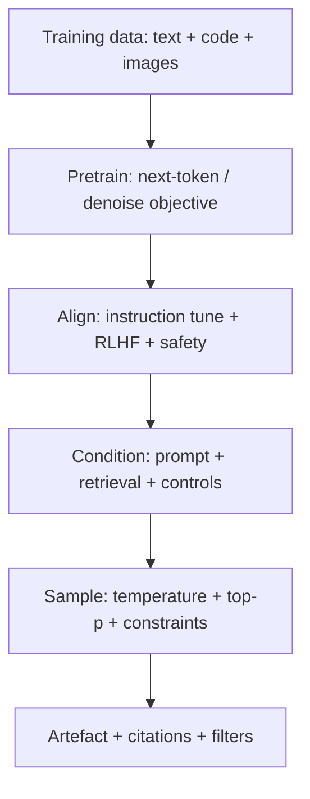
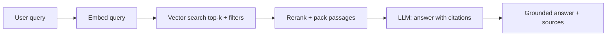

# Gen AI


## Youtube

### General

- [GenAI For Developers Roadmap 2025](https://www.youtube.com/watch?v=v1pj9XrJ_Lw)
- [Gen AI Course | Gen AI Tutorial For Beginners](https://www.youtube.com/watch?v=d4yCWBGFCEs)
- [GenAI Full Course](http://youtube.com/playlist?list=PLd7PleJR_EFfRYiLdagOsv4FczMl1Cxt_)
- [Generative AI using LangChain](https://www.youtube.com/playlist?list=PLKnIA16_RmvaTbihpo4MtzVm4XOQa0ER0)
- [The Only GenAI Roadmap You'll Ever Need | Map of Generative AI for Everyone | CampusX](https://www.youtube.com/watch?v=WzvURhaDZqI)


### freecodecamp

- [Generative AI for Developers - Comprehensive Course](https://www.youtube.com/watch?v=F0GQ0l2NfHA)
- [GenAI Essentials - Full Course for Beginners](https://www.youtube.com/watch?v=nJ25yl34Uqw)
- [Generative AI Full Course - Gemini Pro, OpenAI, Llama, Langchain, Pinecone, Vector Databases & More](https://www.youtube.com/watch?v=mEsleV16qdo)
- [Google Generative AI Leader Certification Course - Pass the Exam!](https://www.youtube.com/watch?v=30diF8dKpAY)

## Theory

Generative AI covers models that create new content — text, images, video, audio, and code.
It spans how large language models work, prompting techniques, RAG, vector databases, and model families (GPT, Gemini, Llama).
Key subtopics: GenAI roadmaps for developers, LangChain-based apps, and Google Generative AI Leader certification prep.

Generative AI is the foundation every modern AI interview now assumes: models that learn the
distribution of data and sample new artefacts from it — answers, essays, code, images, speech,
music, and video. The same core ideas power chatbots, copilots, image generators, and agents:
large neural networks trained on vast corpora, steered at inference time with prompts and
retrieval, and specialised afterward with fine-tuning, RLHF, and guardrails. If you understand
how pretraining builds capability, how transformers represent context, how prompting and RAG
ground behaviour, and how evaluation catches hallucinations, you can reason about any GenAI
system an interviewer sketches.

This guide takes you from mental model to shipping concerns. You will learn what separates
generative models from classifiers, how large language models differ from diffusion image
models, how transformers mix context in ten readable steps, how prompting, retrieval-augmented
generation, pretraining, and fine-tuning compare and combine, and how to evaluate quality and
contain misuse. A worked Python example ties text generation to retrieval and adaptation, and
the closing Q and A distils what interviewers probe most.

> Scope note: this page focuses on GenAI foundations (model families, transformers, prompting,
> RAG, pretraining versus fine-tuning, evaluation, and guardrails). Deep dives on embeddings,
> vector databases, LangChain and LangGraph APIs, and agent loops live on companion pages —
> linked from Tools and Ecosystem below.

### Topics Covered

1. [What Is Generative AI and Model Families](#what-is-generative-ai-and-model-families)
2. [Transformers in Ten Lines](#transformers-in-ten-lines)
3. [Prompting and Retrieval-Augmented Generation](#prompting-and-retrieval-augmented-generation)
4. [Pretraining Versus Fine-Tuning](#pretraining-versus-fine-tuning)
5. [Python Example with OpenAI and Hugging Face](#python-example-with-openai-and-hugging-face)
6. [Evaluation and Guardrails](#evaluation-and-guardrails)
7. [Tools and Ecosystem](#tools-and-ecosystem)
8. [Interview Questions and Answers](#interview-questions-and-answers)

### What Is Generative AI and Model Families

Generative AI names any model that learns `P(data)` and samples new data from it, rather than
predicting a label for existing data. A classifier answers "is this spam"; a generator answers
"write a follow-up email in this style." Training minimises next-token or denoising error over
billions of examples, which forces the network to absorb grammar, facts, reasoning patterns,
style, and even tool-use conventions into its weights. At inference time you condition that
prior with a prompt, retrieved documents, or control codes, then decode a completion token by
token (text) or denoise a canvas step by step (images).

```text
Data distribution → Train (predict / denoise) → Weights hold prior → Condition (prompt + retrieval) → Decode → New artefact
```

Discriminative versus generative framing settles many interviews: discriminative models learn
`P(label | input)` and are judged on accuracy; generative models learn `P(output | context)`
and are judged on usefulness, faithfulness, and safety. That is why GenAI evaluation needs
human and model judges, not just a test-set F1 — there are many acceptable outputs per input.

#### The two model families to know cold

- **Large language models (LLMs):** autoregressive transformers (GPT-4, Gemini, Llama, Mistral,
  Claude) trained to predict the next token. They generate text, code, and tool calls one token
  at a time, conditioning each step on everything before it. Strengths: reasoning, instruction
  following, few-shot adaptation, and composition. Limits: knowledge cutoffs, hallucinations
  when memory is thin, and context-window pressure on long inputs.
- **Diffusion models:** iterative denoisers (Stable Diffusion, DALL-E 3, Imagen, Sora-style
  video extensions) trained to reverse noise added to images or frames. They start from static
  and refine it over 20–50 steps guided by a text encoder. Strengths: high-fidelity images,
  style control, and editing modes (inpainting, upscaling). Limits: slow sampling, weak text
  rendering without extra help, and prompt sensitivity that demands negative prompts and seeds.

| Concern | LLMs (autoregressive) | Diffusion (denoising) |
|---|---|---|
| Training signal | Next-token prediction | Noise prediction at many timesteps |
| Generation | Left-to-right token decoding | Whole-canvas refinement over steps |
| Conditioning | Prompt, system message, retrieved docs | Text embedding, image mask, guidance scale |
| Controllability | Instructions, few-shot, JSON mode, tools | Prompt weighting, seeds, ControlNet, LoRA style |
| Typical failure | Hallucinated facts, drift, jailbreaks | Extra fingers, garbled text, style leakage |
| Evaluation | Faithfulness, win rate, task success | FID, CLIP score, human preference |
| Best for | Chat, code, RAG answers, agents | Images, thumbnails, storyboards, synthetic data |

In practice products pair them: an LLM writes the campaign copy and the image prompt, a
diffusion model renders the hero art, and the LLM critiques the result against brand rules.
Interviews reward exactly this composition thinking over single-model trivia.

#### How generation is controlled

1. **Pretraining builds the prior:** scale (parameters, tokens, compute) plus data mix decides
   what the model can plausibly emit. Memorised facts live here; everything downstream steers it.
2. **Conditioning narrows it:** system prompts set role and rules, user prompts set the task,
   retrieved passages add fresh evidence, and control tokens (language, style, JSON schema)
   shrink the output space to acceptable shapes.
3. **Decoding shapes sampling:** temperature, top-p, top-k, and penalties trade creativity for
   determinism. Low temperature plus constrained decoding wins for extraction and code; higher
   temperature wins for brainstorming and copy variants.
4. **Post-training aligns it:** instruction tuning, RLHF or DPO, and safety fine-tunes push the
   raw prior toward helpful, honest, refusal-correct behaviour without retraining from scratch.



*The diagram above shows the GenAI pipeline: pretraining builds capability, alignment shapes behaviour, conditioning grounds each request, and sampling plus filters decide the final artefact.*

#### Design invariants that survive interviews

- **Memory versus grounding:** weights hold stale parametric memory; prompts plus retrieval
  hold fresh contextual evidence. Cite the latter whenever facts matter.
- **Capability versus control:** bigger priors help, but schemas, verifiers, and human review
  decide production quality more than raw size.
- **Cost versus quality:** each quality lever (longer context, more samples, bigger judge)
  has a price — budget tokens, latency, and dollars per accepted output, not per call.

### Transformers in Ten Lines

The transformer is the engine inside virtually every GenAI model you will be asked about.
Forget deriving attention by hand; carry this ten-line story and expand whichever line the
interviewer pokes at. Tokens flow up through embeddings, gather context sideways through
attention, get transformed position-wise, and repeat across stacked layers until a head
predicts the next token or the next noise increment.

1. **Tokenise:** slice text into subword IDs the model knows (byte-pair or SentencePiece pieces).
2. **Embed:** look up each ID as a vector and add positional information so order survives.
3. **Query, key, value:** project every position into three roles — what I seek, what I offer,
   and what I carry — per attention head.
4. **Attend:** score each query against all keys, softmax into weights, and mix values so every
   token absorbs its relevant context in one hop.
5. **Multi-head:** run step 4 in parallel subspaces so one head tracks syntax, another tracks
   entities, and a third tracks long-range dependencies.
6. **Add and norm:** residual-connect plus layer-normalise so deep stacks train stably.
7. **Feed forward:** push each position through a two-layer MLP that stores factual associations
   and sharpens features attention only mixed.
8. **Stack:** repeat steps 3–7 for dozens of layers; early layers handle surface form, later
   layers handle semantics and task structure.
9. **Unembed:** project the final vector back to vocabulary size and softmax into probabilities.
10. **Sample:** pick the next token (greedy, temperature, top-p) or the next denoise step, append
    it to context, and loop until a stop token, length cap, or tool call.

Attention costs `O(n^2)` in sequence length, which is why context windows, KV-caches, sliding
windows, and retrieval exist: they all ration the quadratic term. Encoders (BERT) read both
directions for understanding; decoders (GPT, Llama) mask the future for generation; encoder–
decoders (T5) map sequences to sequences for translation-era tasks. Diffusion image models reuse
the same transformer blocks as text-conditioned denoisers — the loop changes, the mixer stays.

Practical defaults worth voicing: group-query attention plus KV-caching for serving throughput,
rotary positions for long contexts, mixed precision plus gradient checkpointing for training
memory, and flash attention for the constant-factor win interviewers expect seniors to name.
Mention one scaling law ("loss falls predictably with compute, then downstream ability jumps")
to signal you follow the field without reciting papers.

### Prompting and Retrieval-Augmented Generation

Prompting steers a frozen model; RAG grounds it in fresh documents. Prompting is free and instant
but limited by the context window and the model's memory; RAG adds an index lookup before
generation so answers cite live evidence instead of guessing. Production GenAI is almost always
prompting plus RAG plus guardrails — know how each layer earns its place.

#### Prompting patterns that actually work

- **Role and rules first:** a system message sets identity ("you are a support copilot"), output
  contract (JSON schema, citation style), and refusals. Specific rules beat vibes every time.
- **Few-shot examples:** 2–5 input/output pairs teach format and edge cases faster than paragraphs
  of instruction. Keep them diverse and short; trim the oldest when context fills.
- **Chain-of-thought, used carefully:** asking for step-by-step reasoning lifts math and logic
  scores, but exposes verbose traces. Prefer structured scratchpads ("Plan: ... Evidence: ...")
  and keep private reasoning out of user-facing answers.
- **Decomposition:** split "migrate this service" into "list endpoints, map deps, draft plan,
  generate diffs" — each sub-prompt gets its own context and verifier instead of one mega-task.
- **Self-critique:** follow a draft with "score this 1–5 on correctness, cite gaps, then revise."
  Cap revision rounds at one or two so polish does not become a cost loop.
- **Constrained decoding:** JSON mode, regex grammars, and function schemas force parseable
  output. Never parse free-text JSON with hope; enforce the grammar at decode time.

```text
System: You answer refunds questions with citations. Refuse anything outside policy docs.
User: Can I refund order 4812 from 6 days ago?
Retrieved: [policy §3.1: 14-day window] [order 4812: delivered 6 days ago, $129]
Assistant: Yes — order 4812 is inside the 14-day window (policy §3.1). ...
```

#### RAG in plain English

Retrieval-augmented generation wraps the model with memory it can quote: index your docs as
embeddings, fetch the top-k passages per query, stuff them into the prompt with IDs, and require
citations to those IDs. The model stops reciting stale weights and starts reading the passages
you gave it — which fixes knowledge cutoffs, private data, and many hallucinations at once.

1. **Ingest:** chunk documents (300–800 tokens with overlap), attach metadata (source, date,
   tenant, permissions), embed, and upsert into a vector index.
2. **Retrieve:** embed the query, fetch top-k by cosine similarity, then filter by permissions
   and recency before the prompt ever sees them.
3. **Rerank and pack:** score candidates with a cross-encoder or LLM reranker, keep the best 3–8,
   and order them so the strongest evidence comes first and last (models attend to edges).
4. **Generate with citations:** instruct "answer only from passages [1..k]; cite every claim as
   [i]; say 'not in docs' when nothing supports it." Refusals are a feature, not a bug.
5. **Verify and log:** record query, passage IDs, scores, and the final answer so evals can check
   faithfulness and operators can trace any complaint back to its sources.



*The diagram above shows the RAG loop: retrieval fetches citable evidence, then generation is constrained to quote it or abstain.*

#### When RAG beats fine-tuning (and vice versa)

- **Reach for RAG when** facts change fast (prices, policies, tickets), data is private or huge,
  provenance matters ("show me the paragraph"), or you need day-one grounding without training.
- **Reach for fine-tuning when** behaviour must change (tone, format, tool conventions, domain
  reasoning), latency forbids long contexts, or the same patterns repeat across thousands of
  calls and prompt tokens cost more than training did.
- **Combine them routinely:** fine-tune the style and skill, retrieve the facts. The tuned model
  reads better, cites cleaner, and needs fewer prompt hacks around the same passages.

#### RAG failure modes worth naming

Empty retrieval answered fluently anyway (fix: abstain rule plus citation checks), top-k full of
near-duplicates (fix: diversify and rerank), permission leakage through shared indexes (fix:
tenant filters at retrieval, not post-generation), stale chunks outranking fresh ones (fix:
recency boosts plus TTLs), and context stuffing that buries the question (fix: compress to
bullets, cap at 3–8 passages). Each maps to one interview-ready fix — name the pair.

### Pretraining Versus Fine-Tuning

Pretraining teaches the model the world; fine-tuning teaches it the job. Pretraining runs once
over trillions of tokens with a self-supervised objective; fine-tuning runs often over thousands
of curated examples with supervision, preferences, or rewards. Confusing the two — "we will
pretrain on our docs" when RAG or a small fine-tune suffices — is the classic junior answer.

| Concern | Pretraining | Fine-tuning (SFT + RLHF / DPO) |
|---|---|---|
| Goal | General next-token / denoise prior | Task behaviour: format, tone, policy, skill |
| Data | Trillions of tokens, web-scale mix | Hundreds to thousands of curated pairs |
| Compute | Thousands of GPUs, weeks, millions of dollars | One to few GPUs, hours, hundreds of dollars |
| Updates | All weights from scratch | Full, LoRA / QLoRA adapters, or prompt tuning |
| Knowledge | Adds broad world facts (stale at cutoff) | Adds style and narrow skill, not fresh facts |
| Grounding | None; hallucinates freely | Better instruction following, still needs RAG |
| Evaluation | Perplexity, benchmark suites | Task win rate, faithfulness, refusal quality |
| When | Foundation labs only | Every product team adapting an open or API model |

#### How fine-tuning works in practice

1. **Supervised fine-tuning (SFT):** train on prompt/response pairs demonstrating the desired
   behaviour — support tone, code style, JSON discipline. This is the highest-leverage step.
2. **Preference alignment:** collect chosen/rejected pairs and optimise with RLHF (reward model
   plus PPO) or DPO (direct contrastive update, simpler and now the default). This teaches
   helpfulness, honesty, and refusal boundaries.
3. **Parameter-efficient adapters:** LoRA freezes the base model and trains small low-rank
   matrices per layer; QLoRA quantises the base to fit on one GPU. Swap adapters per tenant or
   task instead of forking whole models.
4. **Keep training honest:** hold out eval prompts, watch for catastrophic forgetting (old skills
   regressing), and version datasets like code — bad pairs teach bad habits permanently.

#### Instruction tuning, RLHF, and DPO in one paragraph each

**Instruction tuning** converts a raw completer ("Valorant is...") into an assistant ("Summarise
Valorant for a beginner") by training on thousands of instruction/response pairs. It is why the
same base model feels dramatically more useful after SFT — the knowledge barely changed, the
obedience did. **RLHF** goes further: humans rank several answers, a reward model learns those
preferences, and PPO nudges the policy toward highly ranked behaviour while a KL penalty keeps
it near the SFT model. **DPO** skips the reward model and directly pushes probability from
rejected toward chosen responses — cheaper, stabler, and sufficient for most team-scale
alignment, which is why interviewers accept "SFT then DPO" as the modern default.

#### The decision tree to say out loud

"For fast-changing facts we retrieve, not retrain. For repeated behaviour — format, tone, tool
calls — we SFT with a few hundred gold pairs, then DPO on ranked outputs. We try prompting first
(one afternoon), RAG second (one sprint), fine-tuning third (needs evals and dataset hygiene),
and pretraining never — unless we are a foundation lab." That single paragraph signals senior
judgement about cost, latency, and staleness in one breath.

### Python Example with OpenAI and Hugging Face

The snippet below is a complete minimal GenAI loop in raw Python: a tiny TF-IDF retriever
stands in for a vector database, an OpenAI-compatible call (with an offline fallback) generates
a grounded answer, and a Hugging Face pipeline hook shows where local open-weights generation
plugs in. It mirrors what LangChain, LlamaIndex, and production RAG services do internally,
which is exactly why interviewers like walking through it.

```python
"""Minimal grounded generation: TF-IDF retrieval + OpenAI/HF generation + citations."""
from __future__ import annotations
import math
import os
import re
from collections import Counter

# 1. Tiny corpus stands in for an indexed knowledge base (docs + metadata)
DOCS = [
    {"id": "policy-3.1", "text": "Refunds are allowed within 14 days of delivery with receipt."},
    {"id": "order-4812", "text": "Order 4812 delivered 6 days ago, total $129, item keyboard."},
    {"id": "shipping-2.4", "text": "Shipping refunds apply only when the carrier loses the parcel."},
]

TOKEN = re.compile(r"[a-z0-9]+")


def tokenize(text: str) -> list[str]:
    return TOKEN.findall(text.lower())


# 2. TF-IDF retriever: embed-free stand-in for cosine search over embeddings
def retrieve(query: str, k: int = 2) -> list[dict]:
    docs_tokens = [tokenize(d["text"]) for d in DOCS]
    df = Counter(t for toks in docs_tokens for t in set(toks))
    n = len(DOCS)
    scored = []
    for doc, toks in zip(DOCS, docs_tokens):
        tf = Counter(toks)
        score = sum(tf[t] * math.log(n / (1 + df[t])) for t in tokenize(query) if t in tf)
        scored.append((score, doc))
    scored.sort(key=lambda pair: pair[0], reverse=True)
    return [doc for score, doc in scored[:k] if score > 0] or DOCS[:1]


# 3. Generator: OpenAI chat API when a key exists, else a citable offline fallback
def generate(prompt: str, passages: list[dict]) -> str:
    context = "\n".join(f"[{p['id']}] {p['text']}" for p in passages)
    system = "Answer only from the passages. Cite every claim as [id]. Say 'not in docs' otherwise."
    if os.getenv("OPENAI_API_KEY"):
        from openai import OpenAI  # pip install openai; lazy import keeps offline runs working
        client = OpenAI()
        resp = client.chat.completions.create(
            model="gpt-4o-mini",
            temperature=0.2,  # low for factual grounding; raise for brainstorming
            messages=[
                {"role": "system", "content": system},
                {"role": "user", "content": f"{prompt}\n\nPassages:\n{context}"},
            ],
        )
        return resp.choices[0].message.content or ""
    joined = "; ".join(f"{p['text']} [{p['id']}]" for p in passages)
    return f"Based on retrieved evidence: {joined}"


# 4. Hugging Face local alternative: swap generate() body for open-weights serving
def generate_local(prompt: str) -> str:
    from transformers import pipeline  # pip install transformers torch -- HF path, needs GPU for scale
    gen = pipeline("text-generation", model="TinyLlama/TinyLlama-1.1B-Chat-v1.0")
    out = gen(prompt, max_new_tokens=128, temperature=0.7, do_sample=True)
    return out[0]["generated_text"]


if __name__ == "__main__":
    question = "Can I refund order 4812?"
    hits = retrieve(question, k=2)
    print(generate(question, hits))
```

Explanation of each block: the corpus carries IDs plus text so every claim stays citable, the
same discipline production chunking adds metadata to; the retriever scores TF-IDF overlap as a
readable stand-in for embedding cosine search — swap `retrieve()` for Pinecone, pgvector, or a
sentence-transformer index without changing callers; the generator builds a system-plus-passages
prompt with a cite-or-abstain rule, calls OpenAI only when a key exists, and otherwise returns
the passages verbatim so the demo never hallucinates offline; the local hook shows the
fine-tune story (LoRA adapters on TinyLlama or Llama-3 via `peft`) for behaviour change without
retraining the base. To extend toward production, add reranking, tenant filters, token budgets,
eval logging of query plus passage IDs, and a moderation filter on the final text.

A LangChain equivalent replaces `retrieve()` with a vector-store retriever plus prompt template
and `generate()` with a chat-model chain, but the data flow is identical — which is the point to
make in interviews: frameworks orchestrate retrieve-then-generate, they do not change the idea.

#### Fine-tune versus pretrain in code terms

- **This example adapts without training:** new docs land by re-indexing, not by gradient steps.
  That is the RAG advantage — freshness without forgetting.
- **Fine-tuning would change `generate_local`:** SFT on support transcripts teaches tone and
  citation format; DPO on ranked answers teaches refusal boundaries. Weights change, docs stay.
- **Pretraining would change everything underneath:** new base model, new tokenizer behaviour,
  full re-evaluation. Never propose it for "our docs changed last week."

### Evaluation and Guardrails

Teams that skip evaluation ship demos, not products. Measure generation quality and safety
separately, because a fluent answer can be entirely ungrounded, and a safe refusal can still be
a task failure. Golden prompts plus adversarial probes make all of this actionable.

#### Generation-quality metrics

- **Faithfulness / groundedness:** every claim entailed by cited passages. Checked by human
  labels or an LLM judge reading query, passages, and answer together.
- **Answer relevance and completeness:** the response actually resolves the ask without padding.
  Pairwise win rate against a baseline on golden prompts is the pragmatic default.
- **Fluency and format validity:** grammar, JSON-schema conformance, and citation syntax —
  mechanical checks that catch decoding regressions cheaply.
- **Task success rate:** end-to-end completion (refund decided correctly, code tests green,
  summary accepted). The headline health metric over 50–200 golden tasks.
- **Cost to accepted answer:** tokens, latency, and dollars per answer a human keeps. Models that
  need three samples to land one keeper are pricier than their per-call price suggests.
- **Harnesses:** Ragas, DeepEval, LangSmith, and plain golden-set plus LLM-judge pipelines all
  work; pair any automatic score with sampled human review of full traces.

#### Seven failure modes and fixes

| # | Symptom | Root cause | Fix |
|---|---|---|---|
| 1 | Hallucinated facts | Answers from parametric memory, ignores passages | Cite-or-abstain prompt, faithfulness judge, RAG for fresh facts |
| 2 | Retrieval misses | Bad chunks, weak embeddings, no rerank | 300–800 token overlap chunks, reranker, metadata filters |
| 3 | Prompt injection via docs | Untrusted text treated as instructions | Delimit passages, sanitise HTML, allowlist instructions |
| 4 | Unsafe or biased output | No filters, raw prior leaks through | Moderation endpoint, PII redaction, refusal evals |
| 5 | Stale answers | Index older than the world | Recency boosts, TTLs, re-index SLAs per source |
| 6 | Runaway cost | Long contexts, many samples, no budgets | Token caps, top-k limits, cache, smaller model first |
| 7 | Fine-tune regressions | Narrow data overwrites general skill | Holdout evals, LoRA adapters per task, version datasets |

Golden-prompt discipline ties it together: collect realistic asks with known-good passages and
acceptable answers, run them on every prompt, retrieval, or model change, and track win rate
plus cost over time. Add adversarial items — contradictory docs, injection-laced pages, revoked
permissions, out-of-scope requests — because those are the cases that cause incidents.

#### Guardrails that belong in every design

- **Input rails:** PII redaction, prompt-injection screening, language and scope checks before
  retrieval ever runs.
- **Retrieval rails:** tenant and permission filters inside the query, recency weighting, and a
  minimum-score threshold that triggers "not in docs" instead of guessing.
- **Output rails:** moderation classifiers, citation validators, schema checks for JSON, and a
  human-approval gate before any side effect (refunds, deploys, sends).
- **Audit rails:** log prompt, passage IDs, scores, model version, and final text — debugging and
  compliance are impossible without them.

### Tools and Ecosystem

| Layer | Representative tools | Notes for interviews |
|---|---|---|
| Foundation models | GPT-4, Gemini, Claude, Llama, Mistral | APIs for speed; open weights for control and cost |
| Serving | OpenAI API, Vertex AI, Bedrock, vLLM / TGI | Swap reasoners freely; KV-cache and batching decide cost |
| Fine-tuning | Hugging Face TRL, PEFT / LoRA, OpenAI fine-tunes | SFT then DPO is the team-scale default |
| Retrieval | Pinecone, Weaviate, pgvector, Elasticsearch | Indexes that feed RAG with filters and rerankers |
| Orchestration | LangChain, LlamaIndex, LangGraph | Chains and graphs around retrieve-then-generate |
| Image generation | Stable Diffusion, DALL-E 3, Imagen, Midjourney | Diffusion plus LLM prompts for art and synthetic data |
| Evaluation | Ragas, DeepEval, LangSmith, Braintrust | Win rate, faithfulness, cost per accepted answer |
| Guardrails | Moderation APIs, Guardrails AI, PII redaction | Filters plus approvals plus audit logs |

Companion pages in this repo go deeper on adjacent layers: RAG pipelines with chunking and
ranking detail, embedding and vector-database internals, LangChain and LangGraph orchestration,
and agentic loops that wrap generation in perceive–plan–act tool use. In an interview, name the
layer you would change first for a given symptom: wrong facts → retrieval grounding and
reranking; wrong style → SFT plus constrained decoding; stale answers → index freshness and
TTLs; incidents → filters, approvals, and audit trails.

Typical production use cases: support copilots that answer with cited policy passages; coding
assistants that complete, explain, and test code; marketing studios where LLMs write briefs and
diffusion models render variants; meeting summarizers with action-item extraction; and
documentation search that refuses cleanly when evidence is missing.

### Interview Questions and Answers

1. **What is generative AI, and how does it differ from discriminative models?**
   Generative models learn `P(output | context)` and sample new artefacts — text, images, code —
   while discriminative models learn `P(label | input)` and classify. Generators are judged on
   usefulness, faithfulness, and safety rather than single-answer accuracy, which is why they need
   human and model judges plus guardrails, not just a test-set F1.

2. **LLMs versus diffusion models — when would you pick each?**
   Pick autoregressive LLMs for text, code, and tool calls where left-to-right reasoning and
   instruction following matter; pick diffusion denoisers for images and frames where iterative
   whole-canvas refinement wins. Most products compose them: the LLM writes and critiques the
   prompt while diffusion renders the visual, each evaluated on its own metrics.

3. **Explain the transformer in two minutes.**
   Tokenise and embed, project to queries, keys, and values, attend in parallel heads to mix
   context, add-norm plus feed-forward per position, and stack for depth before unembedding into
   next-token probabilities. Attention is quadratic in length, so context windows, KV-caches, and
   retrieval all exist to ration it — encoders read both ways, decoders mask the future.

4. **How do prompting and RAG work together?**
   Prompting steers a frozen model with roles, few-shot examples, and output contracts; RAG adds a
   retrieval step that fetches citable passages into the prompt so answers ground in fresh evidence.
   Instruct the model to cite passage IDs and abstain when nothing supports an answer, then log
   query, IDs, and scores so faithfulness is checkable after the fact.

5. **Pretraining versus fine-tuning — how do you decide?**
   Pretraining builds the general prior once at massive cost and is a foundation-lab concern.
   Fine-tuning adapts behaviour cheaply with SFT pairs plus DPO preferences — tone, format, tool
   conventions. For fast-changing facts choose RAG over either; the interview line is "prompting
   first, RAG second, fine-tuning third, pretraining never" unless you train base models.

6. **Walk me through your Python RAG example.**
   A TF-IDF retriever stands in for vector search and returns top-k passages with IDs; a generator
   builds a cite-or-abstain prompt and calls OpenAI when a key exists, else echoes evidence so it
   never hallucinates offline; a Hugging Face pipeline hook shows where local open-weights
   generation and LoRA adapters plug in. Production swaps in real indexes, rerankers, budgets, and
   eval logging without changing the retrieve-then-generate shape.

7. **How do you evaluate a GenAI system?**
   Separately for quality and safety: faithfulness of claims to citations, relevance and win rate on
   golden prompts, format validity, task success rate, and cost per accepted answer — judged by
   Ragas/DeepEval or a trace-plus-LLM-judge harness with sampled human review. Re-run goldens on
   every prompt, retrieval, or model change and track trends, not point scores.

8. **The model hallucinates despite RAG. How do you debug it?**
   Suspect grounding before the model: empty or duplicate retrieval, buried evidence, or a weak
   cite-or-abstain rule. Fix by improving chunks and reranking, packing 3–8 diverse passages with
   strong evidence at the edges, enforcing citation checks, and adding abstention plus faithfulness
   evals — then verify with adversarial prompts whose answers must be "not in docs."

9. **How do you keep GenAI safe in production?**
   Layer guardrails: redact PII and screen injection at input, enforce tenant filters and score
   thresholds at retrieval, run moderation plus citation and schema checks at output, and gate side
   effects behind human approval with idempotency keys. Log everything for audit and add red-team
   evals with injection-laced docs and out-of-scope requests on every release.