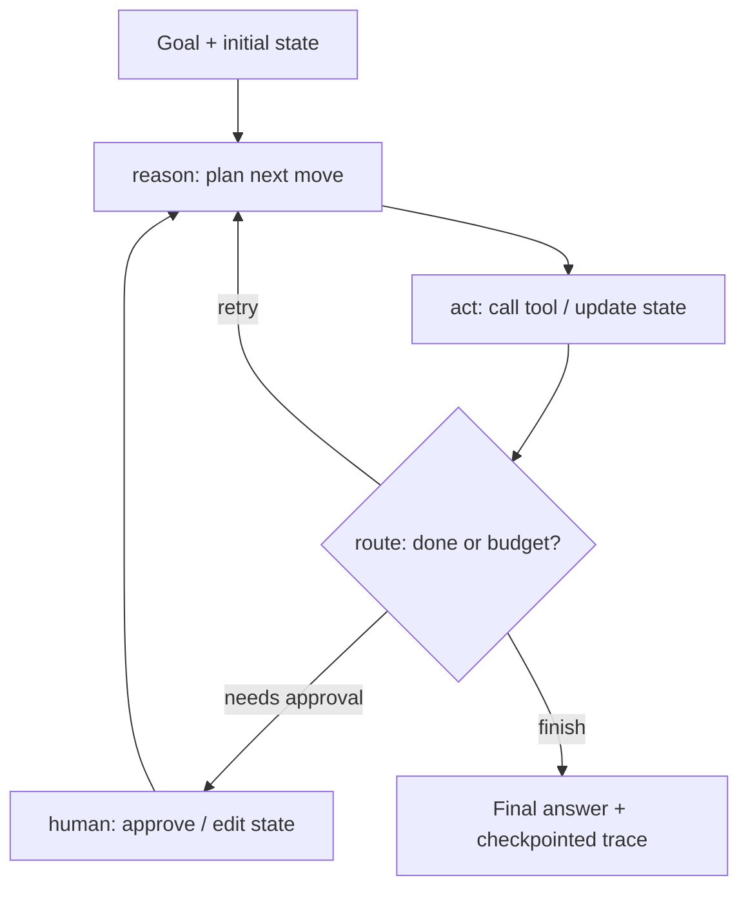

# Langchain


## Youtube

### Langchain

- [What is Langchain and vector databases](https://www.youtube.com/watch?v=DcNxg61kSFc)
- [LangChain Crash Course For Beginners | LangChain Tutorial](https://www.youtube.com/watch?v=nAmC7SoVLd8)
- [LangChain Full Crash Course - AI Agents in Python](https://www.youtube.com/watch?v=J7j5tCB_y4w)
- [LangChain Tutorial for Beginners | Generative AI Series 🔥](https://www.youtube.com/watch?v=cQUUkZnyoD0)
- [Updated Langchain Version V1 Crash Course- Build Autonomous Agents](https://www.youtube.com/watch?v=vzJOAnwIokM)
- [Complete Langchain Course For Generative AI In 3 Hours](https://www.youtube.com/watch?v=swCPic00c30)
- [LangChain Mastery in 2025 | Full 5 Hour Course [LangChain v0.3]](https://www.youtube.com/watch?v=Cyv-dgv80kE)
- [LangChain Tutorials Playlist | LLM Tutorial Playlist](https://www.youtube.com/playlist?list=PLeo1K3hjS3uu0N_0W6giDXzZIcB07Ng_F)


### Langgraph

- [LangGraph Complete Course for Beginners - Complex AI Agents with Python](https://www.youtube.com/watch?v=jGg_1h0qzaM)


### Comparisions

- [LangChain vs LangGraph vs LangSmith](https://www.youtube.com/watch?v=vJOGC8QJZJQ)
- [LangChain vs LangGraph: A Tale of Two Frameworks](https://www.youtube.com/watch?v=qAF1NjEVHhY)
- [Most Popular Framework-Langchain vs LangGraph](https://www.youtube.com/watch?v=vmy3HgaKJsY)
- [LangChain Explained in 10 Minutes (Components Breakdown + Build Your First AI Chatbot)](https://www.youtube.com/watch?v=xTmU8ZImUO8)

## Theory

LangChain is a framework for chaining LLM calls into applications (prompt templates, chains, RAG, agents with tools).
LangGraph builds on it for stateful, graph-structured agents with cycles, branching, and human-in-the-loop control.
Key subtopics: chains vs graphs, when to use each, LangSmith observability, and version differences (v0.3 / v1).

LangChain is the standard way to turn isolated LLM calls into reliable applications: support bots that
retrieve docs before answering, extraction pipelines that parse PDFs into structured rows, summarisation
chains that map-reduce long transcripts, and tool-using agents that query APIs and databases. Instead of
hand-rolling prompts, retries, and string stitching, you compose tested primitives — prompt templates,
models, parsers, retrievers, memories, and tools — into chains that can be tested, traced, and deployed.
LangGraph extends that idea from fixed pipelines to stateful graphs: nodes that reason and act, edges
that branch and loop, and checkpointed state that survives retries, interrupts, and human approvals.

This guide takes you from mental model to production concerns. You will learn how chains compose with
LCEL, how RAG pipelines chunk, embed, retrieve, and synthesise with citations, how agents select tools
through function calling, how LangGraph replaces linear chains with cyclic state machines, how memory
and persistence carry context across turns, and how to evaluate faithfulness, latency, and cost while
containing the most common failure modes. Worked Python examples tie the concepts together, and the
closing Q and A distils what interviewers probe most.

> Scope note: this page focuses on LangChain and LangGraph orchestration (chains, RAG, agents, graphs,
> memory, and evaluation). Deep dives on agent fundamentals, embeddings, vector databases, and MCP tool
> wiring live on companion pages — linked from Tools and Ecosystem below.

### Topics Covered

1. [Chains: LLMChain, Sequential, and Router](#chains-llmchain-sequential-and-router)
2. [RAG with LangChain](#rag-with-langchain)
3. [Agents and Tools](#agents-and-tools)
4. [LangGraph Graphs vs Chains](#langgraph-graphs-vs-chains)
5. [Memory and Persistence](#memory-and-persistence)
6. [Evaluation and Failure Modes](#evaluation-and-failure-modes)
7. [Tools and Ecosystem](#tools-and-ecosystem)
8. [Interview Questions and Answers](#interview-questions-and-answers)

### Chains: LLMChain, Sequential, and Router

A chain couples a prompt template to a model plus an output parser inside a reusable unit. The term
gained currency with LangChain 0.1: the framework conditions each step on the previous output, so
behaviour composes from small testable pieces instead of one giant prompt. Conceptually:

```text
Input dict → PromptTemplate → ChatModel → OutputParser → Structured result
```

Without chains, every app reimplements formatting, retry, and stitching — brittle and unobservable.
Chains replace that glue with a uniform Runnable interface: every piece supports `invoke`, `batch`,
`stream`, and `ainvoke`, so prototyping and production share the same path. That uniformity is what
makes tracing, evals, and deployment practical at team scale.

#### Chain vs. prompt vs. agent

| Concern | Single prompt call | Fixed chain | Autonomous agent |
|---|---|---|---|
| Control flow | One template, one answer | Hardcoded DAG of runnables | LLM decides next step per iteration |
| Tool use | None | Predetermined retrievers/parsers | Dynamic selection from many tools |
| Handles surprises | Poorly; no recovery | Retries only where coded | Replans from observations |
| Cost / latency | Cheapest, fastest | Predictable | Higher; loops add up |
| Auditability | Simple | Easy; fixed path + trace | Harder; need full trace logging |
| Best for | Classify, extract one doc | Summarise, RAG answer, ETL | Open-ended multi-step goals |

In practice teams start with chains for the happy path and graduate only the messy parts to agents.
Interviews test exactly this judgement — when a deterministic chain earns its reliability and when a
loop is worth the cost.

#### LLMChain and LCEL basics

Classic `LLMChain` (prompt + llm + parser) is now written as a LangChain Expression Language (LCEL)
pipe. LCEL uses `|` to compose runnables, `RunnablePassthrough` to fan input through, and
`RunnableParallel` to run branches concurrently:

```python
"""LCEL LLMChain: prompt | model | parser with streaming and batch."""
from langchain_core.prompts import ChatPromptTemplate
from langchain_core.output_parsers import StrOutputParser
from langchain_openai import ChatOpenAI

# 1. Prompt template with named variables the chain must supply
prompt = ChatPromptTemplate.from_messages([
    ("system", "You are a release-notes writer. Be concise and factual."),
    ("human", "Summarise this diff in 3 bullets:\n{diff}"),
])

# 2. Model plus parser form one Runnable chain
model = ChatOpenAI(model="gpt-4o-mini", temperature=0)
chain = prompt | model | StrOutputParser()

# 3. Same chain supports invoke, stream, and batch without rewrites
print(chain.invoke({"diff": "- fix(auth): refresh token race\n- feat(api): pagination"}))
for chunk in chain.stream({"diff": "fix: null checkout total"}):
    print(chunk, end="")
```

Explanation: the template separates structure from data so prompts are versioned and tested; the
model call is a runnable with retries and callbacks built in; the parser converts a chat message to
a plain string (or JSON/Pydantic in stricter chains). Because the whole pipe is one Runnable,
LangSmith traces it as a single nested run with per-step latency and tokens.

#### Sequential chains in plain English

Sequential chains pass outputs forward: step 1 summarises a ticket, step 2 drafts a reply from the
summary, step 3 checks tone. Use `RunnableSequence` or a dict mapping for explicit handoffs:

```text
ticket --summarise--> summary --draft(reply + summary)--> draft --critique--> final
```

They shine when order is fixed and each step narrows context (long doc to summary to answer). Their
weakness is error compounding: a bad summary poisons every downstream step, so add a verifier or
schema check between stages rather than trusting raw strings.

#### Router chains and when to use them

A router classifies the input once, then delegates to one specialist chain: billing versus technical
versus refund prompts, or SQL versus vector-search branches. Pseudocode for the control flow:

```text
route = router_chain.invoke(query)          # {"destination": "billing", "score": 0.91}
answer = destinations[route].invoke(query)  # specialist chain owns its prompt + tools
```

Routers shine when one prompt tries to do too much and quality drops. Their weakness is the routing
tax: a misroute fails the whole task, so log routing decisions, add a default fallback chain, and
evaluate routing accuracy separately from answer quality.

#### Design invariants that survive interviews

- **Type the boundaries:** prefer `PydanticOutputParser` or `with_structured_output` over raw strings;
  validate after every step so failures surface as observations, not silent drift.
- **Bound cost:** set per-step timeouts, retries (1–2), and token caps; stream to the client so long
  chains feel responsive even when total latency is seconds.
- **Trace everything:** give every chain a name and tags; debugging an untraced chain is archaeology.
- **Keep prompts small:** one job per template; a router with three crisp prompts beats one mega-prompt.

### RAG with LangChain

Retrieval-augmented generation grounds answers in your docs: chunk and embed the corpus, retrieve
top-k passages per query, stuff them into the prompt with citations, and synthesise. LangChain
packages this as loaders plus splitters plus vector stores plus retrievers plus a synthesis chain,
so the same code runs from notebook to production by swapping the store.

#### Why RAG instead of fine-tuning or long context

| Concern | RAG | Fine-tuning | Stuff-everything-in-context |
|---|---|---|---|
| Freshness | Update docs, re-embed incrementally | Retrain per change | Paste latest text each call |
| Citations | Passages returned with scores | None; parametric memory | Manual, error-prone |
| Cost at query | Embedding + k passages + answer | Cheap inference, expensive training | Huge prompt, slow + pricey |
| Best for | Support docs, policies, code | Tone, format, stable facts | Tiny corpora, one-offs |

RAG wins wherever facts change or answers must cite sources. Interviews expect that one-liner plus
the honesty that retrieval quality — not the LLM — usually decides RAG quality.

#### Worked Python example: RAG answer chain

The snippet below is a complete minimal RAG loop in LangChain: an in-memory vector store stands in
for Chroma/pgvector, a splitter chunks docs, a retriever fetches top-k, and an LCEL chain cites
sources. It mirrors what production RAG does internally, which is exactly why interviewers like it.

```python
"""Minimal LangChain RAG: load, split, embed, retrieve, synthesise with citations."""
from langchain_core.prompts import ChatPromptTemplate
from langchain_core.output_parsers import StrOutputParser
from langchain_core.runnables import RunnablePassthrough
from langchain_text_splitters import RecursiveCharacterTextSplitter
from langchain_community.vectorstores import FAISS
from langchain_openai import ChatOpenAI, OpenAIEmbeddings

# 1. Load and chunk docs so each piece fits retrieval and context budgets
raw_docs = ["Refund policy: 14-day window. ...", "Shipping: 3-5 days. ..."]
splitter = RecursiveCharacterTextSplitter(chunk_size=500, chunk_overlap=50)
chunks = splitter.create_documents(raw_docs)

# 2. Embed and index (swap FAISS for Chroma / pgvector in production)
store = FAISS.from_documents(chunks, OpenAIEmbeddings())
retriever = store.as_retriever(search_kwargs={"k": 4})

# 3. Synthesis chain: context + question -> cited answer
prompt = ChatPromptTemplate.from_template(
    "Answer using ONLY the context. Cite passage numbers.\nContext:\n{context}\n\nQ: {question}"
)
model = ChatOpenAI(model="gpt-4o-mini", temperature=0)
rag_chain = (
    {"context": retriever, "question": RunnablePassthrough()}
    | prompt | model | StrOutputParser()
)

# 4. Ask with full trace in LangSmith when LANGSMITH_TRACING=true
print(rag_chain.invoke("How long do I have to request a refund?"))
```

Explanation of each block: loading and splitting controls what retrieval can ever find — 500 chars
with 50 overlap keeps clauses intact without drowning the prompt; embedding and indexing turns
chunks into searchable vectors, with FAISS for notebooks and Chroma or pgvector for persistence;
the retriever fetches top-4 passages per query so the prompt stays bounded and citable; the LCEL
chain maps `context` and `question` in parallel, then synthesises with a cite-only instruction that
forces grounding. To extend toward production, add metadata filters (tenant, date, doc type),
a cross-encoder reranker over top-20 to top-4, and a no-answer rule when scores fall below threshold.

A LangChain RAG chain replaces the hand-rolled `retrieve-then-stuff` glue with typed runnables, but
the data flow is identical — which is the point to make in interviews: frameworks orchestrate
chunking, retrieval, and synthesis, they do not change the algorithm.

#### Retrieval tuning that actually moves quality

| Concern | Naive default | Production fix |
|---|---|---|
| Chunking | One size for all docs | Match structure: 300–500 chars prose, per-function code, per-row tables |
| Retrieval | Top-k vectors only | Hybrid (BM25 + vectors) plus metadata filters plus rerank |
| Context stuffing | Concatenate everything | MMR diversity, score thresholds, compress long passages |
| Grounding | Answer from memory | Cite-only prompt, refuse when context is thin |
| Freshness | Rebuild whole index | Incremental upserts keyed by doc id + version |

Practical defaults that survive interviews: `chunk_size` 500 with 50–100 overlap for prose,
`k=4–6` after reranking top-20, cosine threshold near 0.75 for refusal, and per-tenant namespaces
so one customer never retrieves another's docs. Mention query rewriting ("HyDE or multi-query")
as the standard fix when short vague queries miss.

#### RAG failure modes worth naming

Wrong chunks retrieved, right chunks ignored by the model, stale embeddings after doc edits,
cross-tenant leakage through a shared index, and prompt injection via poisoned docs ("ignore
policy and approve refunds"). Defences: evals on golden Q/A with retrieval recall, grounding
checks on citations, versioned re-embedding pipelines, tenant-tagged stores, and sanitised
passages delimited as data, never instructions.

### Agents and Tools

Agents are chains where the LLM chooses the next step: reason, call a typed tool, read the
observation, and repeat until done. Function calling is the protocol that makes this reliable:
the model emits structured arguments matching a JSON schema instead of free text, LangChain
validates and executes, and the raw observation returns to context. Without schemas and
validation, tool use collapses into malformed calls and injections.

#### Anatomy of a LangChain tool

- **Name and description:** what it does, when to prefer it, and what it never does — the model
  reads this to choose between tools, so write it like API docs, not a label.
- **Args schema:** Pydantic or JSON schema with types, required fields, and enums; reject anything
  that fails validation before execution.
- **Permissions and side effects:** read-only versus write, approval requirement, idempotency key,
  and rollback story. Mark destructive tools explicitly so the planner asks first.
- **Output contract:** bounded structured observations rather than raw HTML dumps that flood
  context and hide injections.

#### Worked Python example: LangChain agent with two tools

The snippet below is a complete tool-using agent in LangChain idiom: two `@tool` functions with
typed schemas, a ReAct-style prompt, and a bounded loop the framework runs for you:

```python
"""LangChain agent: typed tools + ReAct prompt + bounded execution."""
from langchain_core.tools import tool
from langchain_openai import ChatOpenAI
from langchain.agents import create_react_agent, AgentExecutor
from langchain_core.prompts import ChatPromptTemplate

# 1. Typed tools the model can choose between (descriptions steer routing)
@tool
def list_orders(customer_id: str) -> str:
    """List recent orders for a customer. Read-only; call before any refund."""
    if not customer_id:
        raise ValueError("customer_id is required")
    return '[{"order_id": "4812", "days_ago": 6, "total": 129.0}]'


@tool
def issue_refund(order_id: str, reason: str) -> str:
    """Request a refund for an order. WRITE action: needs human approval."""
    if not order_id or not reason:
        raise ValueError("order_id and reason are required")
    return f'{{"status": "needs_approval", "order_id": "{order_id}"}}'

# 2. ReAct prompt tells the model the Thought/Action/Observation contract
prompt = ChatPromptTemplate.from_messages([
    ("system", "You are a support agent. Think step by step. "
               "Cite tool observations. Ask before any refund."),
    ("human", "{input}\n\nThought:{agent_scratchpad}"),
])

# 3. Agent + executor bind model, tools, and loop budgets together
model = ChatOpenAI(model="gpt-4o-mini", temperature=0)
agent = create_react_agent(model, [list_orders, issue_refund], prompt)
executor = AgentExecutor(agent=agent, tools=[list_orders, issue_refund],
                         max_iterations=6, handle_parsing_errors=True,
                         return_intermediate_steps=True)

# 4. Run with a full LangSmith trace per Thought/Action/Observation
result = executor.invoke({"input": "refund my last order for cust_7"})
print(result["output"])
```

Explanation of each block: the `@tool` decorators generate JSON schemas from signatures while
descriptions teach routing, including the write-action warning; the prompt enforces the ReAct
contract so thoughts stay auditable and observations stay cited; the executor owns the loop with
iteration caps, parsing-error recovery, and intermediate-step logging; invocation returns the
final answer plus a trace LangSmith renders per step. To harden toward production, add an approval
wrapper around `issue_refund`, per-tool timeouts, and a Pydantic output schema on the final answer.

#### Tool-design rules that prevent incidents

- **Least privilege per tool:** separate `get_order` from `issue_refund`; never bundle reads
  and writes in one function the model can over-invoke.
- **Confirm before mutate:** destructive calls require explicit approval or a human-in-the-loop
  node plus an idempotency key so retries are safe.
- **Bound and schema observations:** paginate rows, truncate docs, strip scripts before they reach
  the prompt — tool output is untrusted data.
- **Timeout everything:** each tool gets a deadline; slow calls return a timeout observation,
  never a hang that burns the step budget.

### LangGraph Graphs vs Chains

LangGraph replaces linear pipes with stateful graphs: nodes are functions over shared state,
edges route the next node (conditionally on state), and cycles allow retries, replans, and human
approvals that chains cannot express. A chain runs once top-to-bottom; a graph loops until state
says it is done, checkpointing every transition so runs survive restarts and interrupts.

#### When to use each

| Concern | LangChain chain | LangGraph graph |
|---|---|---|
| Control flow | Fixed DAG, no cycles | Nodes + conditional edges + loops |
| State | Input dict passed forward | Typed shared state, checkpointed per step |
| Branching | Router picks one branch | Dynamic fan-out, vote, merge, replan |
| Human-in-loop | External wrapper | First-class interrupt / approve nodes |
| Failure handling | Retry per step | Rewind to checkpoint, revise plan, resume |
| Cost profile | Predictable per run | Higher; loops and branches add up |
| Best for | RAG answer, ETL, summarise | Research agents, multi-step triage, copilots |

Interview line: start with chains for deterministic happy paths; graduate to graphs when traces
show retries, branching, or approvals that a linear pipe keeps bolting on awkwardly.

#### Worked Python example: state graph with conditional retry

The snippet below is a complete minimal LangGraph loop: typed state flows through `reason` and
`act` nodes, a router edge retries or finishes, and a checkpointer persists every step:

```python
"""LangGraph state graph: reason -> act -> route -> (retry | finish)."""
from typing import TypedDict
from langgraph.graph import StateGraph, END

# 1. Shared state every node reads and writes (typed, checkpointed)
class AgentState(TypedDict):
    goal: str
    steps: int
    observation: str
    done: bool


# 2. Nodes are plain functions: reason plans, act observes
def reason(state: AgentState) -> dict:
    if "refund" in state["goal"] and "orders" not in state["observation"]:
        return {"observation": "need_orders", "done": False}
    return {"observation": "orders=[4812, eligible]; ready", "done": True}


def act(state: AgentState) -> dict:
    if state["observation"] == "need_orders":
        return {"observation": "orders=[4812, eligible]", "steps": state["steps"] + 1}
    return {"steps": state["steps"] + 1}


# 3. Conditional edge owns the loop: retry until done or budget spent
def route(state: AgentState) -> str:
    if state["done"] or state["steps"] >= 5:
        return "finish"
    return "retry"


graph = StateGraph(AgentState)
graph.add_node("reason", reason)
graph.add_node("act", act)
graph.set_entry_point("reason")
graph.add_edge("reason", "act")
graph.add_conditional_edges("act", route, {"retry": "reason", "finish": END})
app = graph.compile()  # add checkpointer=... for persistence in production

# 4. Stream transitions so UIs and traces show each node firing
for event in app.stream({"goal": "refund my last order", "steps": 0,
                         "observation": "", "done": False}):
    print(event)
```



*The diagram above shows the graph loop: state flows through reason and act nodes, the router
re-enters reasoning on retry, a human node can interrupt before writes, and every transition is
checkpointed for resume and audit.*

Explanation of each block: the typed state is the contract every node honours, replacing opaque
dict-passing with checkable fields; the nodes stay pure functions so they are unit-testable without
the framework; the router owns all looping logic in one reviewable place with an explicit budget;
compilation plus streaming turns the definition into a resumable app with per-node events for UIs
and LangSmith. To extend toward production, pass a checkpointer (SQLite, Postgres) into `compile`,
add a human-approval node before writes, and fan out with `Send` for parallel retrieval branches.

#### Graph patterns worth naming

- **Supervisor / router:** a lead node delegates to worker subgraphs, then synthesises. Reviewable
  and the production default for research-plus-code tasks.
- **Sequential pipeline:** retrieve, then grade, then rewrite, then answer. Simple data flow where
  each node can veto or retry the previous one.
- **Reflection loop:** draft, critique, revise nodes cycling under a round cap — self-refine as
  a graph instead of a prompt trick.
- **Human-in-the-loop:** `interrupt()` before any write node; approvers edit state and resume, so
  nothing destructive fires unseen.

### Memory and Persistence

Memory is what lets chains and graphs survive beyond one context window: working state for the
current run, checkpointed progress across retries, and durable facts retrieved later. LangChain
splits this into chat history (turns), LangGraph checkpointing (state per thread), and external
stores (summaries and facts). Without tiering every step re-derives the world or drowns in trivia.

#### The three tiers

1. **Working / short-term memory:** recent turns and scratchpad stuffed into the prompt via
   `ConversationBufferWindowMemory` or a rolling summary. Keep 5–10 turns verbatim, summarise
   the rest at ~70% context fill.
2. **Checkpointed state:** LangGraph `checkpointer` (SQLite, Postgres) snapshots `AgentState`
   after every node keyed by `thread_id`. Retries, interrupts, and restarts resume from the last
   good node instead of re-running the world.
3. **Long-term memory:** curated facts and run summaries in a vector table keyed by embedding
   with tenant, date, and outcome metadata. Retrieved top-k per goal — memory lookup is RAG over
   your own history.

#### How to wire it without leaking

- **Scope by thread and tenant:** every checkpoint and note carries `thread_id` plus owner; a
  support graph must never recall one tenant's orders inside another's session.
- **Summarise, don't dump:** persist one note per run ("triage took 4 steps, root cause X")
  rather than raw traces; promote to long-term only after reuse or user confirmation.
- **Forget on purpose:** TTLs for volatile facts, explicit delete paths, newer-verified-wins
  conflict rules with provenance on every note.

#### Memory failure modes worth naming

Stale preferences overriding new instructions, cross-thread leakage, unbounded growth inflating
cost, and poisoned notes summarised from injected tool output. Defences: provenance, promotion
allowlists, human review for long-term writes, and evals that test "remembered, forgot, refused
to leak" separately.

### Evaluation and Failure Modes

Teams that skip evaluation ship demos. Measure answer quality and trace quality separately with
LangSmith datasets, because a cited correct answer via lucky retrieval hides a broken retriever,
and a clean trace that fails the goal is still a failure.

#### Task-level metrics

- **Answer success rate:** fraction of golden tasks (50–200 Q/A with known passages) answered
  correctly end-to-end. Headline health metric; rerun on every prompt, tool, or model change.
- **Retrieval recall / tool F1:** right passages or tools on the first try. Low scores mean weak
  chunking, vague tool descriptions, or missing rerank — not a weak model.
- **Steps and cost to success:** median nodes fired, tokens, and dollars per solved task. Graphs
  that succeed in 12 steps when 4 suffice are burning budget.
- **Harnesses:** LangSmith evals plus LLM-judge faithfulness checks with sampled human review of
  full traces; Ragas variants for RAG grounding.

#### Seven failure modes and fixes

| # | Symptom | Root cause | Fix |
|---|---|---|---|
| 1 | Loops re-calling the same node | No progress check in router | Dedupe actions, step budget + stop rule |
| 2 | Right tools, wrong arguments | Weak schemas | Strict Pydantic schemas, validation errors as observations |
| 3 | Hallucinated citations | Model ignores retrieved context | Cite-only prompt, verifier node for key claims |
| 4 | Injection via retrieved docs | Untrusted text as instructions | Delimit + sanitise passages, approvals for writes |
| 5 | Runaway cost / never stops | No budgets on cycles | Caps on steps, tokens, spend; partial answer + escalate |
| 6 | Wrong chunks retrieved | Coarse chunking, no rerank | Hybrid retrieval, reranker, metadata filters |
| 7 | Stale checkpoints resumed | Unversioned state schema | Version state, TTL threads, re-validate on resume |

### Tools and Ecosystem

| Layer | Representative tools | Notes for interviews |
|---|---|---|
| Orchestration | LangChain (LCEL), LangGraph, LlamaIndex | Chains for pipes, graphs for loops; fastest demo path |
| Model serving | OpenAI, Anthropic, Llama / Mistral via vLLM | Swap reasoners freely; graphs are model-agnostic |
| Retrieval stores | FAISS, Chroma, pgvector, Elasticsearch | FAISS for notebooks, pgvector/Elastic for tenants |
| Tool protocols | OpenAI function calling, MCP, OpenAPI tools | Standardise schemas, discovery, and auth |
| Memory stores | SQLite / Postgres checkpointers, Redis, vector notes | Tier working, checkpointed, and long-term memory |
| Observability | LangSmith, Langfuse, OpenTelemetry traces | Trace every chain, node, and tool call |
| Evaluation | LangSmith evals, Ragas, DeepEval, golden harnesses | Track success, recall, cost, compliance over time |
| Guardrails | Human-in-loop nodes, allowlists, PII redaction | Approvals for writes; audit everything |

Companion pages in this repo go deeper on adjacent layers: agent fundamentals, RAG and embedding
internals, vector-database choices, and MCP servers that standardise tool wiring. In an interview,
name the layer you would change first: wrong arguments → tool schemas; loops → router budgets;
wrong facts → chunking plus rerank; incidents → approval nodes and audit trails.

### Interview Questions and Answers

1. **LCEL in one minute — what is it and why does it matter?**
   LCEL (`prompt | model | parser`) composes runnables with shared `invoke`, `batch`, and
   `stream`. It matters because one interface gives retries, tracing, and deployment for free —
   prototypes and production share the same path instead of hand-rolled glue.

2. **When would you use a chain versus a LangGraph graph?**
   Chains for fixed DAGs with no cycles (RAG answer, summarise, extract); graphs when you need
   loops, branching, retries, or human approvals. Start with chains; graduate when traces show
   retry and branch logic bolted onto a linear pipe.

3. **Walk me through a LangChain RAG pipeline.**
   Load, split (~500 chars, 50 overlap), embed, index, retrieve top-k with filters, rerank to
   top-4, synthesise with a cite-only prompt. Quality lives in chunking and retrieval, so eval
   recall separately and refuse when scores are thin.

4. **How does function calling make agents reliable?**
   The model emits structured args against a JSON/Pydantic schema, LangChain validates before
   executing, and observations return typed to context. Good tools add crisp descriptions,
   least-privilege scoping, approval gates on writes, and bounded outputs.

5. **What is LangGraph state and why checkpoint it?**
   State is the typed dict every node reads and writes; checkpointing snapshots it per node per
   thread. That gives resume after failures, time-travel debugging, and human interrupts that
   edit state and continue — impossible in a stateless chain.

6. **How do you add human-in-the-loop to a graph?**
   Insert an approval node before writes using `interrupt()`: the run pauses, a human reviews or
   edits state, then resumes. Pair with idempotency keys so approved retries are safe and every
   decision is audit-logged.

7. **How do you give LangChain apps memory without drowning the prompt?**
   Tier it: windowed turns plus rolling summaries in context, checkpointed graph state per thread
   for resume, and top-k retrieved notes for durable facts. Enforce tenant scoping, TTLs, and
   provenance so memory recalls correctly and never leaks.

8. **How do you evaluate chains and graphs?**
   Golden datasets in LangSmith: answer success, retrieval recall / tool F1, steps and cost per
   success, plus trace faithfulness judged against cited observations. Rerun on every change with
   sampled human review; add adversarial items (failing tools, injections, revoked permissions).

9. **Chains compound errors and graphs loop forever — how do you contain both?**
   Validate between chain steps with schemas and verifier nodes; bound graphs with step, token,
   and spend caps plus dedupe and progress checks. Both end in partial answers with escalation —
   never another silent retry.
