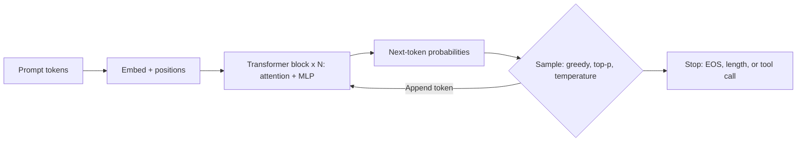

## LLM Wiki


## Blogs

- [LLM Wiki](https://gist.github.com/karpathy/442a6bf555914893e9891c11519de94f)
- [Andrej Karpathy’s LLM Wiki: Create your own knowledge base](https://medium.com/@urvvil08/andrej-karpathys-llm-wiki-create-your-own-knowledge-base-8779014accd5)
- [What Is Andrej Karpathy's LLM Wiki? How to Build a Personal Knowledge Base With Claude Code](https://www.mindstudio.ai/blog/andrej-karpathy-llm-wiki-knowledge-base-claude-code)
- [The LLM Wiki Pattern by Andrej Karpathy: A Step-by-Step Tutorial to Building a Compounding Knowledge Base](https://datasciencedojo.com/blog/llm-wiki-tutorial/)


## Youtube

- [This Changes How AI Understands Context - LLM Wiki](https://www.youtube.com/watch?v=2HHlAD6YSkY)
- [Karpathy's LLM Wiki - Full Beginner Setup Guide](https://www.youtube.com/watch?v=iXd0t60YmMw)
- [Why LLM Wiki? 🧠 Future Of Knowledge For Agentic AI & Humans](https://www.youtube.com/watch?v=n4EVksU_EOs)
- [Build your own AI Knowledge Base - LLM Wiki Explained](https://www.youtube.com/watch?v=it8v6GNxBDI)
- [Build a Personal Knowledge Base (Using Andrej Karpathy's LLM Wiki)](https://www.youtube.com/watch?v=PPr3BTSlMwY)
- [Andrej Karpathy Just 10x’d Everyone’s Claude Code](https://www.youtube.com/watch?v=sboNwYmH3AY)


## Medium

## Theory

The LLM Wiki pattern (popularized by Andrej Karpathy) is a personal, compounding Markdown knowledge base shared by a human and their coding agents.
It covers setting up the wiki, organizing durable notes and context, and letting agents read and update it across sessions.
Key subtopics: repo context files, long-term memory for agents, and workflows with tools like Claude Code.

Large language models (LLMs) are transformer networks trained to predict the next token over massive text corpora.
That simple objective, scaled to billions of parameters and trillions of tokens, produces fluent text, reasoning,
code generation, and tool use. This guide covers what interviewers expect: tokens and transformers, context and
cost, prompting, retrieval-augmented generation (RAG), fine-tuning, failure modes, and the tool ecosystem.

Think of an LLM as a lossy compressor of the web plus a reasoning engine over context. Pre-training bakes in
grammar, facts, and patterns; alignment (instruction tuning plus RLHF or DPO) teaches it to follow instructions
safely; inference turns prompts into completions one token at a time. Most production work is not training
models — it is feeding the right context, constraining outputs, evaluating quality, and controlling cost.

This guide takes you from mental model to system design. You will learn how tokenization, embeddings, attention,
and decoding fit together, how to budget context windows, which prompting patterns reliably help, when to choose
RAG versus fine-tuning versus prompting, how hallucinations happen and how to reduce them, and which tools to
name in an interview or reach for on the job. A worked token-budget example ties the concepts together, and the
closing Q and A distils what interviewers probe most.

> Scope note: this page focuses on LLM fundamentals for system design interviews — how LLMs work, context and
> token budgets, prompting, grounding with RAG, fine-tuning tradeoffs, failure modes, and ecosystem.
> Deep dives on RAG internals, embeddings, vector databases, and agents live on companion pages — linked from
> Tools and Ecosystem below.

### Topics Covered

1. [How LLMs Work: Tokens to Transformers to Next-Token Prediction](#how-llms-work-tokens-to-transformers-to-next-token-prediction)
2. [Context Windows, Tokenizers, and Token Budgets](#context-windows-tokenizers-and-token-budgets)
3. [Prompting Patterns That Actually Work](#prompting-patterns-that-actually-work)
4. [RAG and Fine-Tuning: When to Use Which](#rag-and-fine-tuning-when-to-use-which)
5. [Failure Modes and Hallucination](#failure-modes-and-hallucination)
6. [Tools and Ecosystem](#tools-and-ecosystem)
7. [Interview Questions and Answers](#interview-questions-and-answers)

### How LLMs Work: Tokens to Transformers to Next-Token Prediction

An LLM generates text one token at a time, conditioning each step on all previous tokens. Given a prompt like
"Design a URL shortener", it scores every vocabulary item for the next position, samples one, appends it, and
repeats until a stop condition. Fluency comes from the scale of this prediction: trained on trillions of tokens,
the model learns grammar, facts, code idioms, reasoning templates, and even when to hedge or refuse.

```text
Prompt tokens → Embed + position → Transformer blocks (attention + MLP) x N → Next-token logits → Sample → Repeat
```

Training has three stages. Pre-training predicts next tokens on web-scale data with cross-entropy loss — the
expensive step that builds general capabilities. Supervised fine-tuning (SFT) trains on instruction-response pairs
to teach format and obedience. Alignment with RLHF or DPO optimises for human preferences: helpful, honest, and
harmless. At inference time there is no learning, only forward passes over the prompt plus generated tokens.

#### From characters to tokens

Tokenizers (usually byte-pair encoding) chunk text into subword units the model vocabulary knows, typically
50K–200K entries. Common words get one token ("cache"), rare words split ("micro" + "services"), and code or
math uses more tokens per character. Rule of thumb: 1 token is about 0.75 English words, so 1,000 tokens is
about 750 words. Token count drives cost, latency, and context fit — which is why budgets get their own section.

```text
"Build a rate limiter" → ["Build", " a", " rate", " limit", "er"] → ids [18444, 261, 2456, 9172, 285]
```

Multilingual and code-heavy inputs tokenize less efficiently: the same meaning can cost 2–4x more tokens in some
languages or minified JavaScript. Never assume character length equals cost. Use a tokenizer tool to measure real
usage, and mention this fertility gap when interviewers ask why costs vary across regions or repositories.

#### Transformers in one mental picture

Each token becomes a vector (embedding) plus positional information. A stack of 20–100+ identical blocks refines
these vectors: self-attention lets every position gather context from relevant earlier positions, and a
feed-forward network transforms each position independently. Residual connections and layer norms keep deep stacks
stable. The final vectors project to vocabulary-sized logits; softmax turns them into probabilities.

Attention is the core idea: for each position the model computes queries, keys, and values, scores query-key
compatibility, and takes a weighted sum of values. Multi-head attention runs this in parallel subspaces so one
head can track syntax, another coreference, and another API structure. Causal masking ensures position i only
attends to positions up to i, preserving the autoregressive property interviewers love to ask about.

| Component | What it does | Why interviews probe it |
|---|---|---|
| Tokenizer plus embeddings | Maps text to vectors | Explains cost and multilingual gaps |
| Self-attention | Mixes context across positions | Quadratic cost in sequence length |
| MLP per position | Adds capacity and memorised facts | Most parameters live here |
| Residuals plus norms | Stabilise deep training | Why very deep models converge |
| LM head plus softmax | Scores next token | Temperature and sampling start here |

#### Decoding: from probabilities to text

Greedy decoding picks the top token every step; sampling draws from the distribution. Temperature scales
sharpness: near 0 is deterministic, 0.7–1.0 is the creative default, above 1.2 gets chaotic. Top-p (nucleus)
keeps only the smallest set covering probability p; top-k keeps the k best. Repetition and frequency penalties
discourage loops. For reasoning tasks, ask for structured outputs (JSON, bullets, citations) and a low
temperature; for brainstorming, raise temperature and sample multiple candidates.



*Tokens flow left to right: embeddings enter the transformer stack, logits score the vocabulary, sampling appends
one token and loops until a stop token, length limit, or tool call. Training learns the scores; decoding chooses
how boldly to follow them.*

#### Pre-training data and what the model actually learns

Pre-training mixes web crawls, books, code, papers, and licensed data, filtered and deduped. The model learns
three things at once: language competence (grammar, style, discourse), world knowledge (facts, APIs, idioms), and
latent skills (arithmetic templates, reasoning chains, tool-call formats). Data quality beats raw size past a
point — which is why newer models emphasise curated mixes over undisclosed scrape depth.

#### Inference efficiency in one paragraph

Inference caches keys and values (KV cache) so each new token reuses prior attention work instead of recomputing
it. That makes time-to-first-token depend on prompt length and tokens-per-second depend on model size and
hardware. Long prompts cost latency twice: once to prefill and again through attention on every decode step.
When an interviewer asks about scaling chat, answer with batching, KV-cache memory, quantization, and streaming.

#### Scale, emergent behaviour, and limits

Capabilities jump with parameters, data, and compute — more scale means better few-shot learning, step-by-step
reasoning, and tool use without architecture changes. But scaling does not fix grounding: a bigger model still
guesses when context lacks the answer. Fine-tuning changes behaviour efficiently; it rarely installs large new
fact sets. That is why systems pair a general model with retrieval, prompts, and guardrails rather than expecting
weights alone to stay current.

### Context Windows, Tokenizers, and Token Budgets

The context window is the model's working memory: system prompt plus conversation history plus retrieved passages
plus the answer being written must all fit. Common sizes range from 8K to 128K to 1M+ tokens, but bigger is not
free — cost and latency grow with length, and quality degrades when the answer drowns in irrelevant context.

#### What actually consumes the window

- **System prompt:** role, rules, output schema, safety policy. Keep it tight; every token repeats on each call.
- **Conversation history:** prior turns. Summarise or truncate with a running recap once threads grow long.
- **Retrieved evidence:** RAG passages, tool results, code snippets. The largest and most controllable block.
- **Scratch reasoning:** chain-of-thought, plan-then-act traces. Useful but burns output tokens fast.
- **Output headroom:** reserve 500–2,000 tokens for the answer itself or generation truncates mid-sentence.

A 128K window sounds infinite until a support copilot stuffs 40 pages of docs, 30 turns of chat, and three tool
dumps into one call. Production systems treat context as a budget, not a dumping ground.

#### Tokenizer maths worth memorising

| Input type | Rough rate | Example |
|---|---|---|
| Plain English prose | ~0.75 words per token | 750 words is about 1,000 tokens |
| Code (Python, JS) | ~3–5 chars per token | 400 lines can be 8K–15K tokens |
| Minified code or JSON | Worse than formatted | Whitespace removal barely helps |
| Non-English text | 1–4x English cost | Same meaning, more tokens |
| Images or audio | Model-specific blocks | e.g., one image equals 1K+ tokens |

Measure with the real tokenizer (`tiktoken`, provider dashboards, or playground counters), never by characters.
Interviewers accept the 4-chars-per-token English heuristic as long as you flag its limits on code and other
languages.

#### A worked budget example

Say you run a docs assistant on a 32K-window model with a 4K output reserve:

```text
Window:            32,000 tokens
- System prompt:     1,200 tokens (role + rules + JSON schema)
- History (10 turns): 3,500 tokens (summarised past 5, full last 5)
- RAG passages:      6,000 tokens (top-5 chunks x ~1,200 tokens)
- Tool output:       1,500 tokens (latest API response only)
- Output reserve:    4,000 tokens
= Headroom left:    15,800 tokens for growth, retries, and reasoning
```

When the sum overflows, apply the standard playbook in order: drop the oldest tool outputs, compress history to
a summary, retrieve fewer but better passages (rerank to top-3), and only then raise the window or model tier.
Each step trades a little recall for a lot of cost and latency saved.

#### Long context is not perfect recall

Needle-in-a-haystack tests show models retrieve a planted fact well at the start or end of long inputs but miss
it in the middle — the "lost in the middle" effect. Mitigations: put the most relevant passages first or last,
dedupe aggressively, ask for citations so misses are visible, and prefer 3 strong chunks over 20 weak ones.
Position bias also matters for few-shot examples: order them from most to least representative.

#### Cost and latency implications

Pricing is per thousand input and output tokens, with output typically 2–4x input price. Long prompts therefore
raise both legs: prefill time grows with input length, and decode time grows with reasoning plus answer length.
Caching (prompt caching, semantic caching of frequent questions) and smaller models for triage with escalation to
larger ones are the two cost moves interviewers want to hear.

### Prompting Patterns That Actually Work

Prompting is programming the model with words and structure. The same model can fail or shine depending on role
definition, examples, output constraints, and reasoning scaffolds. Below are the five patterns that cover most
interview questions.

#### 1. Role, task, constraints, format

State who the model is, what to do, what to avoid, and exactly how to respond. Explicit schemas beat prose when
downstream code parses the answer.

```text
System: You are a senior backend reviewer. Review ONLY the diff below.
Rules: list blocking issues first; no style nits; cite file:line; if clean, say "LGTM".
Return JSON: {"verdict": "approve|request-changes", "issues": [{"file": str, "line": int, "why": str}]}.
```

#### 2. Few-shot examples

Show 2–5 input-output pairs demonstrating edge cases, tone, and format. Few-shot teaches patterns weights never
saw: label taxonomies, house style, domain shorthand. Keep examples diverse and short; ten long examples waste
the window that retrieval or history needs.

#### 3. Chain-of-thought and structured reasoning

Adding "think step by step" or a scratchpad section (`Plan:`, `Checks:`, `Answer:`) improves math, logic, and
multi-hop QA measurably. For graded work, use self-consistency: sample 3–5 reasoning paths and take the majority
answer. For agents, ReAct interleaves `Thought → Action → Observation` so tool outputs steer the next step.

```text
Solve in sections:
Plan: restate the goal and constraints.
Steps: numbered reasoning, one fact per line.
Checks: verify units, edge cases, and citations.
Answer: final result with sources.
```

#### 4. Grounding and refusal rules

Unrestricted models blend memory with context. Pin them down: "Answer ONLY from CONTEXT; say you do not know if
absent; cite [1], [2]." This single instruction plus numbered passages eliminates most casual hallucinations.
Pair it with a refusal template so "I don't know based on the provided docs" is a scored, acceptable outcome.

#### 5. Decomposition and guardrails

Split hard tasks: one call extracts, a second reasons, a third formats. Small scoped prompts beat one mega-prompt
on reliability and debuggability. Add guardrails around the model — input validators, output schema checks,
regex or JSON repair, toxicity and PII filters, and human review above a risk threshold.

#### Anti-patterns to name in interviews

- **Mega-prompts:** 5,000 words of overlapping instructions the model cannot prioritise. Trim to rules that
  change behaviour.
- **Contradictory orders:** "be concise" plus "explain exhaustively". Resolve conflicts explicitly.
- **Example leakage:** few-shot answers that contain the test answer. Shuffle and sanitise.
- **Prompt injection blind spots:** treating retrieved web pages or tickets as trusted instructions. Delimit
  untrusted content and authorise tool actions separately.

### RAG and Fine-Tuning: When to Use Which

Most interview system-design questions reduce to this choice. Retrieval-augmented generation grounds answers in
external passages at query time; fine-tuning bakes behaviour into weights beforehand. Strong candidates use both
for different jobs: prompt and retrieve the facts, fine-tune the behaviour.

#### RAG in one paragraph

RAG retrieves top-k chunks from an index (dense embeddings plus BM25 hybrid, reranked), stuffs them into the
prompt with a strict grounding instruction, and generates a cited answer. Knowledge updates by re-indexing —
no retraining. See the companion RAG page for the full ingest-to-generate pipeline, chunking, hybrid search,
and evaluation; here remember the judgement: RAG fits private, changing, or citable knowledge.

#### Fine-tuning in one paragraph

Fine-tuning continues training on curated examples: supervised pairs for format and skill, preference data (RLHF
or DPO) for tone and safety, or parameter-efficient adapters (LoRA) that train a fraction of weights cheaply. It
excels at style, classification, tool-call format, and domain reasoning — not at memorising thousands of volatile
facts. Expect to discuss data curation, train-eval splits, overfitting, and regression testing on a golden set.

| Concern | Prompting alone | RAG | Fine-tuning |
|---|---|---|---|
| Changing or private facts | Fails unless pasted | Best: update the index | Poor: needs retraining |
| Citations and audit | None | Natural with passages | Hard from weights |
| Style, format, skill | Few-shot helps | Unchanged | Best: bakes behaviour in |
| Cost to change | Zero | Re-embed changed docs | Retrain and re-evaluate |
| Latency | Fastest | Adds 50–500 ms retrieval | Same as base model |

Decision rule: facts that change go in retrieval; behaviour that must be consistent goes in tuning; everything
else starts as prompting until measurement says otherwise. Name the hybrid explicitly — "fine-tuned assistant
over a RAG index" — because that is what production systems ship.

#### Pointers worth citing

- **When RAG wins:** support copilots, docs Q&A, policy bots, codebase assistants — anything needing sources or
  freshness.
- **When tuning wins:** classification, extraction schemas, brand voice, function-calling reliability, latency
  parity with the base model.
- **When both:** tune a small model for format plus retrieve facts, beating a giant model on cost with equal
  accuracy on narrow tasks.

### Failure Modes and Hallucination

Hallucination is confident text ungrounded in evidence: invented dates, APIs, citations, or prices. It happens
because next-token prediction rewards plausibility, not truth — the model completes patterns even when evidence
is absent. Interviews test whether you can taxonomy the failures and attach a fix to each.

| # | Failure mode | What it looks like | Fix |
|---|---|---|---|
| 1 | Ungrounded facts | Invented policy, paper, endpoint | RAG grounding plus refusal rule plus citations |
| 2 | Stale knowledge | Pre-cutoff answer stated as current | Retrieval over fresh index; date metadata |
| 3 | Context contradiction | Blends memory with passages | Strict prompt; rerank to top 3–5; quote-then-answer |
| 4 | Reasoning slips | Arithmetic or logic chain breaks | Chain-of-thought, self-consistency, code execution |
| 5 | Jailbreaks and injection | Retrieved page hijacks instructions | Delimit untrusted content; action allowlists; filters |
| 6 | Overconfident refusal gaps | Answers unanswerable questions | Score refusals on adversarial sets; calibrate |
| 7 | Repetition and drift | Loops or wanders off-topic | Penalties, stop sequences, sectioned output format |

Defence in depth: ground with retrieval, constrain with schemas, verify with judges and sampled human review,
and gate with guardrails (PII redaction, toxicity filters, human approval for irreversible actions). Track
faithfulness — every claim entailed by cited passages — as the headline generation metric, and keep a golden set
with unanswerable items so refusal quality is measured, not assumed.

### Tools and Ecosystem

| Layer | Representative tools | Notes for interviews |
|---|---|---|
| Model providers | OpenAI, Anthropic, Google, Mistral, Llama open weights | Swap generators; RAG and prompts transfer |
| Serving and inference | vLLM, TGI, Ollama, provider APIs | Batching, KV cache, quantization, streaming |
| Orchestration | LangChain, LlamaIndex, Haystack | Chains, routers, memory; fastest demo path |
| Vector search | Pinecone, Weaviate, Qdrant, Milvus, pgvector | HNSW plus filters; see RAG companion page |
| Fine-tuning | Hugging Face TRL, LoRA/QLoRA, provider tuning APIs | Adapters beat full trains on cost |
| Evaluation | RAGAS, TruLens, DeepEval, LLM-as-judge | Faithfulness, recall@k, refusal quality |
| Guardrails | Guardrails AI, Rebuff, NeMo Guardrails, moderation APIs | Injection, PII, toxicity, schema checks |
| Agents | LangGraph, AutoGen, CrewAI, function calling | ReAct loops with search and code tools |

Companion pages in this repo go deeper on adjacent layers: RAG internals and evaluation, embedding-model choice,
vector database internals, LangChain and LangGraph orchestration, and agentic patterns that wrap LLMs in
tool-using loops. Typical LLM use cases: support copilots, code review and migration assistants, summarisation
pipelines, extraction into schemas, tutoring, and research over private corpora.

### Interview Questions and Answers

1. **How does an LLM generate text?**
   It predicts the next token conditioned on all previous tokens: tokenize and embed the prompt, run the
   transformer stack (attention plus MLP), score the vocabulary, sample one token, and repeat until a stop
   token or limit. Temperature, top-p, and top-k control how boldly decoding follows the top scores.

2. **What is a token, and why does it matter?**
   A subword unit from byte-pair encoding, roughly 0.75 English words each. Token counts set cost, latency,
   and context fit; code and non-English text cost more per meaning. Measure with the real tokenizer and budget
   system prompt, history, retrieval, reasoning, and output headroom explicitly.

3. **Explain self-attention in one minute.**
   Each position builds a query, key, and value; attention scores query-key compatibility, weights values, and
   mixes context from relevant earlier positions. Multi-head variants learn parallel relations (syntax,
   coreference, structure) under a causal mask, at quadratic cost in sequence length — hence KV caching.

4. **How do you fit a long task into a limited context window?**
   Budget it: trim the system prompt, summarise old history, rerank retrieval to the top few chunks, drop stale
   tool outputs, and reserve output headroom. Place key evidence first or last to dodge lost-in-the-middle
   effects, and escalate window size only after compression stops working.

5. **Which prompting patterns do you reach for first?**
   Role-task-constraints-format headers, 2–5 few-shot examples, chain-of-thought or ReAct scaffolds with
   self-consistency for hard reasoning, grounding plus refusal rules for factuality, and decomposition into
   extract-reason-format calls wrapped in schema and safety guardrails.

6. **RAG versus fine-tuning — how do you decide?**
   RAG for changing, private, or citable facts (update the index, no retraining); fine-tuning for stable
   behaviour, style, format, and classification (bakes skills into weights, ideally via LoRA). Most systems
   combine both, and plain prompting wins when the corpus fits in context and never changes.

7. **What causes hallucinations, and how do you reduce them?**
   Next-token prediction optimises plausibility, so models guess when evidence is missing or stale. Reduce with
   RAG grounding and strict cite-or-refuse prompts, reranking to top passages, chain-of-thought plus
   self-consistency for reasoning, and faithfulness scoring with adversarial unanswerables in the golden set.

8. **How do you evaluate and ship an LLM feature safely?**
   Measure retrieval (recall@k, precision) and generation (faithfulness, relevance, citation quality, refusal
   rate) on a golden set plus LLM-judge and human review. Ship behind guardrails — PII redaction, moderation,
   schema validation, action allowlists — with logging of prompts, evidence, and answers, and human approval
   for irreversible actions.

