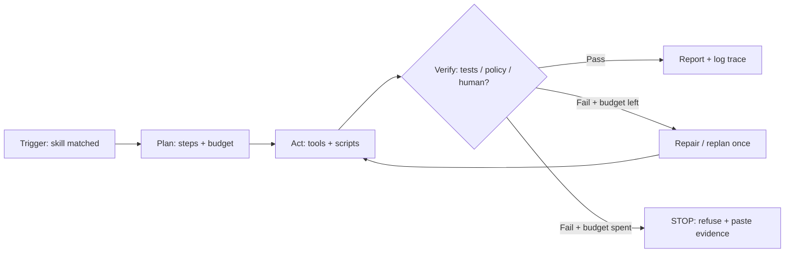
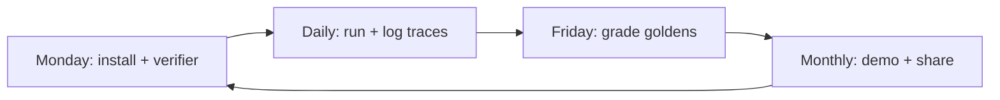

# How to use Skills


## Official website

- [The Open Agent Skills Ecosystem](https://www.skills.sh/)
- [Fastest browser for AI agents to run web automation](https://lite.ego.app/)


## Medium

- [10 Practical Techniques for Mastering Agent Skills in AI Coding Agents](https://shibuiyusuke.medium.com/10-practical-techniques-for-mastering-agent-skills-in-ai-coding-agents-6070e4038cf1)


## Github

- [NeuralNine/youtube-tutorials/blob/main/AgentsMD/AGENTS.md](https://github.com/NeuralNine/youtube-tutorials/blob/main/AgentsMD/AGENTS.md)


## Youtube

- [How To Use AI Skills Like A Senior Developer](https://www.youtube.com/watch?v=cxQLKsktiBA)
- [Claude Skills VS Agents Finally Solved](https://www.youtube.com/watch?v=mDja5eP-Mwk)
- [wtf is Loop Engineer & how to setup for real](https://www.youtube.com/watch?v=W6x-hb44C0c)
- [Forget Prompt Engineering. Loop Engineering Is the New AI Skill That Replaces It.](https://www.youtube.com/watch?v=J1FqwfcXh0Q)
- [Create Your First SKILL.md File (Make AI Agents Do Exactly What You Want) | #claude #antigravity](https://www.youtube.com/watch?v=Fh-aBKrG5CI)
- [Finally. Agent Loops Clearly Explained.](https://www.youtube.com/watch?v=EuzYhzB0vbI)
- [Karpathy's LLM Wiki - Full Beginner Setup Guide](https://www.youtube.com/watch?v=iXd0t60YmMw)

## Theory

Agent Skills (SKILL.md) are reusable, discoverable capabilities that extend AI coding agents beyond raw prompting.
This topic covers the skill format, when to use skills vs prompts vs subagents, and the agent-loop (loop engineering) mindset.
Key subtopics: writing SKILL.md files, the open agent-skills ecosystem, and senior-level daily workflows.

Senior developers stop re-typing the same careful prompt every session and start packaging
it as a skill: a named, versioned, testable capability the agent can discover and run.
Instead of pasting a code-review checklist, a commit-message convention, or a browser-automation
recipe into chat, you write it once as SKILL.md, store it where the agent looks, and invoke
it by name. The shift is from clever words to durable leverage: a review skill that checks
tests plus types plus security, a frontend skill that scaffolds plus screenshots, a loop that
retries until green. Interviews and teams trust installed skills over remembered prompts.

Think of each skill as a junior teammate with a runbook. The SKILL.md frontmatter supplies
the routing — name, description, triggers — the body supplies the procedure, scripts supply
the tools, and references supply the depth. Your job is the same loop as vibe coding: small
slice, visible diff, runnable check. Invoke the skill on a real task, watch the trace, fix
the step that drifted, and commit the improved skill. Skills that ship with an example input,
an expected output, and a failure rule beat skills that read like essays.

This guide takes you from concept to senior workflow. You will learn what skills are and when
they beat prompts, subagents, and MCP tools, what a good SKILL.md contains line by line with
a worked example, how loop engineering turns one-shot answers into reliable agent loops, how
to eval skills so improvements are measured, which ecosystem pieces the linked sites, posts,
and videos map to, and which questions to rehearse once your skills are installed. A mermaid
diagram ties the loop patterns into one mental model.

> Scope note: this page focuses on agent skills for system design interviews —
> SKILL.md anatomy, skills versus prompts versus subagents, and loop engineering.
> Deep dives on LLM internals, tokens and context budgets, embedding choice, vector database
> internals, and LangChain plus LangGraph orchestration live on companion pages — build
> there, prove here.

### Topics Covered

1. [What Skills Are: Skills vs Prompts vs Subagents](#what-skills-are-skills-vs-prompts-vs-subagents)
2. [Anatomy of SKILL.md: An Explained Example](#anatomy-of-skillmd-an-explained-example)
3. [Loop Patterns: Loop Engineering Mindset](#loop-patterns-loop-engineering-mindset)
4. [Evals: Proving Skills Work](#evals-proving-skills-work)
5. [Ecosystem and Senior Workflows](#ecosystem-and-senior-workflows)
6. [Interview Questions and Answers](#interview-questions-and-answers)

### What Skills Are: Skills vs Prompts vs Subagents

What matters is reuse with discovery. A prompt helps once; a skill helps every session
without pasting. Given the links above — the open skills ecosystem, the senior-developer
workflow video, the SKILL.md tutorial — judge every artefact by the same test: can the
agent find it, run it without you, and fail loudly when it should stop? Marketing promises
autonomy; interviews probe one installed skill you fully own.

```text
Goal + repeat task → Package as skill → Agent discovers → Runs loop → Verifies + logs → Improves skill
```

The name of the game is packaging. One finished skill with triggers, steps, scripts, and
evals beats ten clever prompts lost in chat history. Starter videos pull you in with a
first SKILL.md in an afternoon; the techniques post earns trust with ten repeatable habits;
the loop-engineering videos reframe the job from wording to wiring. All three share the
same test: does the agent do exactly what you want without you watching?

#### What each primitive is for

| Primitive | What good looks like | Use when | Avoid when |
|---|---|---|---|
| Prompt | One-off instruction with example | Exploring, one-shot answer | Task repeats weekly |
| Skill (SKILL.md) | Named, triggered, versioned procedure | Repeatable workflow with steps | Needs separate model + memory |
| Subagent | Delegated role with own context | Parallel or long-horizon split | Simple linear checklist suffices |
| Script / tool | Deterministic code the agent calls | Lint, test, scrape, migrate | Judgement call with no oracle |
| MCP server | Shared tool endpoint across agents | Org-wide tools with auth | Single repo, single user |
| AGENTS.md | Repo-level conventions always on | Style, commands, boundaries | Per-task specialised procedure |

None of this requires picking one primitive forever. Route by repeatability and blast
radius: prompt for drafts, skill for weekly workflows, subagent for parallel legs, script
for deterministic checks, human gate for destructive writes. Teams treat skills as code:
reviewed, tested, and rolled back when they regress.

#### A concrete comparison example

Say you enforce conventional commits. A weak approach pastes "write a good commit message"
every time and hopes. A skills approach says: save a `commit-message` skill with format,
types, examples, plus a `git diff --staged` check, then invoke it per commit. One spine,
three lenses, one demo. Small packaging plus explicit triggers is the whole method in
miniature.

```text
Weak: chat "make commit good" → varies by mood → no check → history drifts
Strong: /commit-message skill → reads staged diff → type(scope): subject → runs lint → amends on fail
= Commit message: "skill with trigger plus check beats adjective prompt"
```

When the output drifts, apply the standard playbook in order: read the trace to find the
skipped step, tighten the trigger description plus one negative example, re-run on the
failing case, widen to three past cases once green, and only then add the next capability.
Each step trades a little cleverness for a lot of reliability saved.

#### Who each linked resource helps most

Beginners who have pasted the same prompt three times should watch the first-SKILL.md
tutorial from the links above: opinionated, fast to a working file. Engineers comfortable
with agents should read the ten-techniques post: triggers, scripts, references, evals.
Builders ready for autonomy should study the loop-engineering videos: retries, verifiers,
and stop rules. Interviewers care that you can name why you chose a skill over a prompt
and what each layer added.

#### Anti-patterns to name in interviews

- **Prompt hoarding:** a notes file of 200 prompts, zero installs. Package the top three.
- **Skill as essay:** three pages of philosophy, no steps. Procedures plus checks.
- **Trigger vagueness:** "helps with code" matches everything. Name files plus intents.
- **Subagent sprawl:** five agents for one checklist. One skill first, split on evidence.
- **Magic expectations:** skill without verifier. Every skill names its done check.

### Anatomy of SKILL.md: An Explained Example

Skills amplify procedures; they do not replace judgement. Builders who skip this anatomy
write skills that sort of work and cannot say why discovery, args, or stop rules fail.
Strong candidates spend one evening here so the loop section moves fast: frontmatter
routing, body procedure, scripts plus references, and eval hooks. Below are the five
checkpoints that cover most needs.

#### 1. Frontmatter routing in one sitting

Ship discovery before depth. Name, one-line description with triggers, version, plus
allowed tools. Explicit trigger phrases beat vibes when the agent must choose among
twenty installed skills.

```text
Goal: code-review skill that triggers on PR diffs.
Context: single skill dir, SKILL.md + scripts/review.py.
Constraints: triggers name "review PR, check tests, security pass"; no auto-merge.
Checks: agent surfaces skill on "review this PR"; stays silent on "write poem".
```

#### 2. Body procedure with steps, args, and stop rules

Show you can write a procedure like a backend contract: numbered steps, inputs, outputs,
plus a stop rule. One page teaches the pattern the loop harness will assume: read context,
run checks, report findings, halt on red. Keep the body under 150 lines; scannability is
the review signal.

#### 3. Scripts plus references with a worked example

Concrete scripts plus linked references beat adjectives like "thorough". Give one happy
path plus one refusal case, then demand the skill cite its check output before claiming
done. A worked example ties the method together.

```markdown
---
name: code-review
description: Reviews PR diffs for tests, types, and security. Use when asked to review a PR, check tests, or audit a diff.
version: 1.2.0
allowed-tools: [read, diff, exec]
---

# Code Review

## When to use

- Trigger: user says "review this PR", "check my diff", "security pass".
- Do NOT trigger: on "write feature", "explain code", creative asks.

## Inputs

- `diff`: staged diff or PR number. Required.
- `scope`: full | tests-only | security-only. Default full.

## Steps

1. Read diff plus repo test command from AGENTS.md.
2. Run `scripts/review.py --diff <ref>`; capture failures.
3. Check tests, types, secrets, plus destructive migrations.
4. Report: Critical / Major / Nit with file:line each.
5. STOP when secrets found or migration drops data: refuse approval.

## References

- `references/checklist.md`: full 20-point list (loaded on demand).
- `references/examples.md`: two annotated good plus bad reviews.

## Checks

- Every Critical links a failing command or diff hunk.
- No approval when tests red; paste failing output instead.
```

Why this works: the description pins discovery the router can trust, the negative trigger
prevents misfires, scripts make checks deterministic, references keep context lean, and
the STOP rule proves you bound autonomy. When review quality slips, the next fix is
narrow: tighten one checklist row plus one example, not a full rewrite.

#### 4. Progressive disclosure without context bloat

Build lean loading before reaching for bigger windows. SKILL.md stays small; detail lives
in references the agent pulls only when needed. This single habit plus printing which
files loaded removes most context mystery. Pair it with a budget rule so "add more docs"
is never the first fix.

| Level | What loads | Example check |
|---|---|---|
| Frontmatter only | Name plus description scanned | "20 skills route in under 1k tokens" |
| SKILL.md body | Steps plus checks on trigger | "trace shows skill invoked by name" |
| Script on demand | Deterministic check runs | "review.py output pasted in trace" |
| Reference on demand | Checklist pulled for edge | "loaded references/checklist.md once" |
| Refusal | Stop rule fires on red | "secrets found returns no approval" |

#### 5. Skill storage and versioning from day one

Split hard claims: one folder per skill, a changelog line per edit, a golden run per
version. Small versioned skills beat one mega-skill on actionability. Add memory around
the skill — a short eval doc with five tasks, expected outputs, and a pass threshold —
so every later edit starts measured and stays comparable.

```text
skills/code-review/SKILL.md + scripts/ + references/ + evals/
v1.2.0: added secrets check → 5/5 goldens → commit "review skill: secrets gate"
```

#### Anti-patterns at the authoring level

- **God skill:** one SKILL.md for review plus deploy plus writing. Split by trigger.
- **Hidden magic:** steps the agent cannot observe. Scripts print; traces show.
- **No negative triggers:** fires on every message. List three do-NOT cases.
- **Unmeasured edits:** "improved wording" with no before-after. Goldens first.
- **Docs dump:** full wiki pasted into body. References on demand.

### Loop Patterns: Loop Engineering Mindset

This is the heart of the page: loop engineering replaces prompt engineering. Taken as one
progression the patterns cover retries that converge, verifiers that gate, and stop rules
that bound cost. Each maps to a runnable loop with its own trace, and together they supply
every reliable skill the senior-workflow video demos.

#### What actually to build per pattern

- **Generate-verify-retry loop — correctness on rails:** draft, run checker, repair once,
  re-check. Build a commit-message loop: generate, lint with commitlint, repair on fail.
- **Plan-then-execute loop — multi-step structure:** plan steps, run each with state,
  replan on failure. Build a triage flow: classifier routes to refund, technical, or
  escalation legs with shared state.
- **Parallel fan-out loop — coverage plus merge:** spawn subagents, collect, merge with
  citations. Build a research sweep: three searches in parallel, one merged brief.
- **Human-gated loop — safety for writes:** read freely, pause for approval on writes.
  Build an ops helper: two read tools, one gated migrate, audit log per run.

A weekend habit that scales: pick one loop, wire its verifier the same day, record a
two-minute trace walkthrough, then extend from green. The agent-loops video in the links
above shows retry discipline with traces; the loop-engineering talks show verifier wiring
on real flows; the Karpathy wiki turns both into calm setup habits. Same spine, rising
horizon.

#### Loop ladder worth memorising

| Level | What to build | Example check |
|---|---|---|
| Single retry | One repair attempt on fail | "lint fail → one fix → green" |
| Bounded loop | Max N steps plus timeout | "stops after 5 tries, logs cost" |
| Verifier gate | Tests or policy decide pass | "red tests block approval" |
| Replan branch | New plan on blocked step | "trace shows replan, not loop-spin" |
| Human gate | Approval before writes | "destructive op waits for yes" |

#### A worked loop milestone example

Say the skill must produce migration SQL:

```text
Window of trust: migrate skill + 3 goldens + dry-run verifier
- Trace per task: plan → draft → dry-run → repair → final, printed
- 3/3 goldens pass; failing dry-run logged with SQL pasted
- Manual: ask to skip dry-run → clean refusal, cites STOP rule
= Commit message: "migrate loop with dry-run gate and 3/3 goldens"
```

When the loop spins, apply the standard playbook in order: read the trace to find the
missing verifier, tighten the stop rule plus max steps, re-run only the failing golden,
widen to the full set once green, and only then add the next tool. Each step trades a
little autonomy for a lot of reliability saved.

#### Shipping discipline beyond the loop

Keep loop budgets strict — max steps, timeouts, cost caps — put destructive tools behind
confirmation, require cited checks for anything merged, and log traces plus latency plus
cost for every run. Track pass-on-retry — tasks green within budget — as the headline
quality metric, and keep a do-not-ship list (silent failures, unbounded retries, unlogged
runs) so standards are stated, not assumed.

#### Agent loop mental model



*The loop left to right: routing picks the skill, planning sets the budget, acting calls
tools, verifying gates progress, repair spends bounded retries. Each run ends logged;
no run ends on vibes.*

#### Anti-patterns at the loop level

- **Retry without verifier:** same draft twice, hoping. No checker means no convergence.
- **Unbounded while:** "keep trying until perfect" with no max steps. Budget first.
- **Silent repair:** fix applied but trace hides it. Print repair plus re-check.
- **Human gate theatre:** approval asked after the write. Gate before, log after.
- **Merged without citations:** fan-out summary with no sources. Every claim links a leg.

### Evals: Proving Skills Work

Unmeasured skills drift; evals keep them honest. A golden set plus trace metrics turns
"feels smarter" into "5/5 green, 2.1s median, one repair max". Given the links above —
the techniques post with its eval habits, the senior-workflow video with its live checks,
the SKILL.md tutorial with its before-after demo — judge every skill by the same test:
can you show a failing case going green after one edit? Interviews trust numbers over
adjectives, and teams merge skills only when goldens stay green.

```text
One skill → 5 goldens → Trace per run → Metrics logged → Edit improves score
```

The name of the game is proof before polish. One skill with five recorded tasks, expected
outputs, and a pass threshold beats ten shared prompts with screenshots. Starter skills
earn trust with three happy paths plus two refusals; senior skills add latency plus cost
plus repair counts. All share the same gate: no golden run, no commit.

#### Golden sets that earn trust

Build five tasks before the next tweak: three happy paths the skill must pass, one edge
it should handle with repair, one refusal it must cleanly decline. Each golden records
input, expected output, plus the checker that grades it — keyword match, script exit
code, or cited file:line. Store them beside the skill so every edit re-runs the same set.

```text
Goal: code-review skill stays green across edits.
Context: skills/code-review/evals/ with 5 cases + scripts/grade.py.
Constraints: 3 passes, 1 repair, 1 refusal; keyword plus exit-code grading.
Checks: v1.2.0 scores 5/5; failing run pastes trace plus diff hunk.
= Commit message: "review goldens: 5/5 with secrets refusal"
```

When a golden goes red, apply the standard playbook in order: re-run only that case with
the trace printed, fix one step plus one example, re-run the single golden to green,
widen to the full five once green, and only then add the next golden. Each step trades
a little scope for a lot of signal saved.

#### Trace metrics worth logging

Goldens say pass or fail; traces say why and at what cost. Log the same five fields
every run so weeks compare: outcome, steps taken, repairs spent, latency, plus cost or
tokens. Print the trace in the demo — plan, act, verify, repair — because a visible
loop beats a claimed loop.

| Metric | What it proves | Example check |
|---|---|---|
| Pass rate | Skill works today | "5/5 goldens green" |
| Pass-on-retry | Loop converges in budget | "2/2 reds green within 1 repair" |
| Steps + repairs | Budget respected | "median 4 steps, max 1 repair" |
| Refusal precision | Stop rule fires correctly | "secrets case refuses, cites rule" |
| Latency + cost | Ship is affordable | "median 2.1s, 3.4k tokens per run" |

None of this requires heavy infra. A JSONL line per run plus `scripts/grade.py` over the
goldens folder carries a solo builder to demo-grade. Teams add the same gate to CI: red
goldens block the skill bump, green goldens allow the version tag.

#### Eval harness that blocks regressions

Keep the harness strict — same goldens, same grader, same budget — version the skill with
its score, and log before-after on every edit. Track pass-on-retry as the headline loop
metric and refusal precision as the headline safety metric, and keep a do-not-ship list
(ungraded edits, trace-free demos, golden-free version bumps) so standards are stated,
not assumed.

```text
Edit skill → Run grade.py → 5/5 green → Bump version → Commit with score
Red grade → Paste trace → One fix → Single golden → Full set → Commit
```

#### Anti-patterns at the eval level

- **Vibe grading:** "looks better" with no goldens. Five cases before adjectives.
- **Happy-path only:** all passes, zero refusals. Two adversarial cases minimum.
- **Metric amnesia:** pass logged, cost ignored. Latency plus tokens every run.
- **Grader drift:** thresholds edited to pass. Fix the skill, not the test.
- **Unversioned bump:** skill edited, score unknown. Version tags carry scores.

### Ecosystem and Senior Workflows

Skills compound when the ecosystem feeds them: marketplace patterns to steal, repo
conventions to inherit, browser tools to borrow, and a weekly loop that turns one
installed skill into five trusted ones. Given the links above — skills.sh, the ego
browser, the techniques post, AGENTS.md, plus the senior and loop videos — the senior
move is curation with proof: install one pattern, wire its verifier, record its trace,
and only then share it.

```text
Discover pattern → Install one skill → Wire verifier → 5/5 goldens → Demo + share
```

The name of the game is curation with receipts. One installed skill with a green trace
beats ten bookmarked repos with READMEs. The marketplace supplies patterns, the repo
supplies conventions, the browser supplies actions, and your weekly loop supplies proof.
All four share the same bar: runnable by the agent without you narrating.

#### What each ecosystem piece gives you

| Source | What to steal | Example check |
|---|---|---|
| skills.sh | Named patterns plus trigger phrasing | "installed review skill routes on PR ask" |
| Ego browser | Web actions the agent can run | "scoped surfacing skill fills form, cites run" |
| Techniques post | Ten habits: triggers, scripts, evals | "negative triggers cut misfires to zero" |
| AGENTS.md | Repo conventions every skill inherits | "skill reads test command, never guesses" |
| Senior + loop videos | Retry discipline plus verifier wiring | "trace shows repair once, then green" |

None of this requires adopting the whole ecosystem at once. Route by need: marketplace
for the first install, AGENTS.md for repo truth, browser tools for web legs, videos for
loop discipline. Teams treat shared skills like shared libraries: pinned versions,
changelogs, and rollback when goldens redden.

#### Senior weekly workflow that compounds

A typical senior week touches four moves in order. Install or edit one skill with its
trigger plus verifier on Monday. Run it on real work daily and log traces plus cost.
Friday, grade the five goldens and fix the single weakest step. Demo monthly to the team:
five minutes, live trace, three adversarial asks taken. When a week ships no golden run
the shelf fills with unproven skills: no proof means next month inherits this month's
drift.

```text
Monday: one skill + verifier → Daily: run on real work → Friday: grade 5 goldens → Monthly: live demo
```



*The senior loop left to right: install sets the bet, daily runs collect evidence,
grading decides the fix, demos spread what survived. Each cycle ends versioned;
no cycle ends on screenshots.*

Study rules that survive deadline pressure: one skill at a time, phone away for
90-minute build blocks, no new install before the current skill scores 5/5, and a
Friday rule that ungraded edits never roll into next week. Track trusted skills —
green goldens, clean refusals, logged costs — as the headline progress metric, and keep
a parking lot for shiny marketplace finds so focus is stated, not assumed.

#### Anti-patterns at the ecosystem level

- **Marketplace hoarding:** twelve installs, zero verifiers. One skill to green first.
- **Convention bypass:** skill guesses commands AGENTS.md states. Read repo truth.
- **Browser overreach:** web skill with full write scope. Least privilege plus gates.
- **Demo amnesia:** shared skill with no trace. Ship trace plus goldens plus limits.
- **Fork drift:** copied skill, upstream fixes lost. Pin version, note delta.

### Interview Questions and Answers

1. **What is an agent skill, and when does it beat a prompt or subagent?**
   A skill is a named, triggered, versioned procedure the agent discovers and runs
   without pasting. I use prompts for one-offs, skills for weekly workflows with steps
   and checks, subagents for parallel or long-horizon splits. My commit-message skill
   with trigger phrases plus commitlint beats any adjective prompt because the check
   decides, not my mood.

2. **Walk me through a SKILL.md you wrote.**
   I wrote `code-review` v1.2.0: frontmatter with name, trigger-rich description, plus
   allowed tools; body with inputs, five numbered steps, and a STOP rule on secrets or
   destructive migrations; `scripts/review.py` for deterministic checks; references for
   the 20-point checklist and annotated examples. Discovery routes it, negative triggers
   prevent misfires, and every Critical cites a failing command or diff hunk.

3. **What is loop engineering, and which loop did you build?**
   Loop engineering replaces wording tweaks with wired retries, verifiers, and stop
   rules. I built a generate-verify-retry loop for migration SQL: draft, dry-run,
   repair once, re-check, with max steps plus cost caps. The trace prints plan, draft,
   dry-run, repair, final; red dry-runs block, spent budgets refuse with evidence pasted.
   Pass-on-retry within budget is my headline metric.

4. **How do you evaluate a skill?**
   Five goldens beside the skill — three passes, one repair, one refusal — graded by
   `scripts/grade.py` with keyword plus exit-code checks. I log pass rate, pass-on-retry,
   steps plus repairs, refusal precision, and latency plus tokens per run. Edits run the
   failing golden first, then the full five; version tags carry scores, and red blocks
   the bump. My review skill holds 5/5 with a secrets refusal.

5. **How do you keep skills lean on context?**
   Progressive disclosure: frontmatter scans for routing, the body loads on trigger,
   scripts run on demand, references pull once for edges. My body stays under 150 lines
   and the checklist lives in `references/` until needed. I verify with a budget rule —
   twenty skills route under 1k tokens — and print which files loaded so bloat is visible.

6. **How do you use the skills ecosystem in real work?**
   I steal patterns from skills.sh, inherit repo truth from AGENTS.md, borrow web actions
   from scoped browser tools, and apply trigger plus eval habits from the techniques post.
   Weekly: one install or edit Monday, daily runs with logged traces, Friday golden
   grading, monthly live demo. Shared skills ship pinned with changelog, goldens, trace,
   and limits — rollback on red.

7. **Where do skills fail, and what are their limits?**
   Vague triggers that misfire, god-skills spanning three jobs, retries without verifiers
   that spin, human gates asked after the write, and merged fan-outs with no citations.
   I handle each with negative triggers, one trigger per skill, checker-gated retries with
   max steps, gates before writes, and cited merges. I state the boundary as demo-grade
   autonomy with logged limits rather than claiming unsupervised safety.

8. **Demo a skill end to end in five minutes.**
   I run the review skill on a staged PR: trigger fires by name, steps read the diff plus
   repo test command, `review.py` runs, findings report Critical, Major, Nit with
   file:line each, and a planted secret triggers a clean refusal with the STOP rule cited.
   I show the trace, the 5/5 golden run, median latency plus tokens, and the versioned
   commit — then take three adversarial asks to prove the negatives hold.