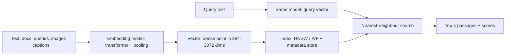
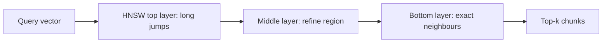

# Vector Empbeddings


## Youtube

- [What are Vector Embeddings? | Pinecone DB | ChatGPT](https://www.youtube.com/watch?v=1EookJWbvQM)

## Theory

Vector embeddings are dense numeric representations of text (or images) that capture semantic meaning.
They power similarity search: related items sit close together in vector space and are retrieved by nearest-neighbor lookup.
Key subtopics: how embeddings are produced, cosine similarity, vector databases like Pinecone, and their role in RAG.

Vector embeddings are the memory layer of modern AI search. Every semantic search box, recommendation
feed, duplicate detector, and Retrieval-Augmented Generation (RAG) pipeline depends on the same idea:
convert content into dense vectors once, convert each query into a vector the same way, and retrieve
the nearest neighbours. If the vectors are good, paraphrases match despite sharing no keywords; if they
are bad, the whole system degrades no matter how powerful the LLM on top.

This guide takes you from mental model to production concerns. You will learn what embeddings are and how
transformer models produce them, how cosine similarity turns geometry into relevance, how Approximate
Nearest Neighbour indexes such as HNSW search millions of vectors in milliseconds, how chunking and
hybrid search decide what gets retrieved, how to run embeddings end to end in Python, how to diagnose
the most common failure modes, and which vector databases and models to reach for in an interview or
on the job. A worked Python example ties the concepts together, and the closing Q and A distils what
interviewers probe most.

> Scope note: this page focuses on text embeddings for search and RAG (models, similarity, chunking,
> ANN/HNSW indexes, hybrid search, and evaluation). Deep dives on RAG orchestration, reranking pipelines,
> and agentic retrieval live on companion pages — linked from Tools and Ecosystem below.

### Topics Covered

1. [What Are Vector Embeddings and Why They Matter](#what-are-vector-embeddings-and-why-they-matter)
2. [Cosine Similarity, ANN, and HNSW](#cosine-similarity-ann-and-hnsw)
3. [Chunking and Hybrid Search](#chunking-and-hybrid-search)
4. [Python Code Example: Embeddings and Similarity Search](#python-code-example-embeddings-and-similarity-search)
5. [Evaluation and Failure Modes](#evaluation-and-failure-modes)
6. [Tools and Ecosystem](#tools-and-ecosystem)
7. [Interview Questions and Answers](#interview-questions-and-answers)

### What Are Vector Embeddings and Why They Matter

A vector embedding is a list of floating-point numbers — for example 384, 768, 1536, or 3072 numbers —
that represents a piece of content as a point in a high-dimensional space. Texts with similar meaning
are trained to land near each other in that space, while unrelated texts land far apart. Conceptually:

```text
Text ("refund window for annual plans") → Embedding model → Vector [0.12, -0.44, 0.91, ...] → Search by nearest neighbours
```

That mapping is learned, not hand-designed. A transformer reads the tokens of a sentence, builds
contextual representations for each token over many attention layers, and then pools them — usually by
mean-pooling or a special `[CLS]` token — into a single fixed-size vector that is normalised to unit
length. Training objectives such as contrastive learning pull paraphrases together and push unrelated
texts apart, so geometry becomes semantics: direction in vector space encodes meaning.

Dense embeddings contrast with sparse keyword vectors. A BM25 sparse vector has one dimension per
vocabulary word and is almost entirely zeros; it matches only exact terms. A dense vector has a few
hundred to a few thousand dimensions, every one nonzero, and it matches intent: "refund window", "how
long to get money back", and "politique de remboursement" can all land nearby even with zero lexical
overlap. That generalisation is why embeddings power semantic search, and also why they need hybrid
pairing with keywords for exact codes and names.



*The diagram above shows the core embeddings loop: content and queries are mapped by the same model
into one shared space, and search becomes a geometry lookup for the closest points.*

#### Why embeddings beat keywords for meaning

| Concern | Keyword (BM25) search | Embedding (dense) search |
|---|---|---|
| Paraphrases and synonyms | Misses unless terms overlap | Matches by semantic direction |
| Multilingual queries | Needs per-language analysers | One multilingual model covers many languages |
| Typos and phrasing shifts | Brittle without fuzziness | Robust when meaning is preserved |
| Exact IDs, SKUs, error codes | Excellent and precise | Weak; easily confused |
| Rare proper nouns | Exact and auditable | May blur similar-sounding entities |
| Ranking signal | Term frequency heuristics | Learned semantic similarity |

In practice teams use both: embeddings for recall over meaning, keywords for precision over exact
tokens, fused into hybrid search. Interviews often test exactly this judgement — when pure vectors
suffice, when keywords win, and when you must combine them.

#### Where embeddings show up

- Semantic search over docs, tickets, wikis, and product catalogues where users paraphrase freely.
- RAG grounding: chunks are embedded once, queries are embedded per request, top-k chunks feed the LLM.
- Recommendations and personalisation: embed users and items, retrieve neighbours as suggestions.
- Deduplication and clustering: near-duplicate tickets, reviews, or images collapse by cosine threshold.
- Classification and routing: a cheap logistic head over frozen embeddings triages intent or language.
- Multimodal retrieval: text and images share one space (CLIP-style), so a caption finds a photo.

#### A concrete example

The query "how long do I have to get my money back on a yearly plan?" shares almost no words with the
policy sentence "Annual plans purchased on or after 1 March 2026 carry a 14-day refund window." A
keyword index scores this near zero. An embedding model maps both to vectors pointing nearly the same
way — cosine around 0.85 — so the policy chunk ranks first. Same corpus, different representation,
found answer.

### Cosine Similarity, ANN, and HNSW

Similarity between embeddings is almost always **cosine similarity**: the cosine of the angle between
two vectors, ranging from -1 (opposite) through 0 (unrelated) to 1 (same direction). For text the
observed range is roughly 0 to 1. Two paraphrases get vectors pointing nearly the same way even with
no shared words — that angular closeness is the whole advantage over keyword overlap.

```text
query  = embed("refund window for annual plans")      -> [0.12, -0.44, 0.91, ...]
chunk1 = embed("Annual plans ... 14-day refund ...")  -> cosine(query, chunk1) = 0.87  (retrieve)
chunk2 = embed("Quarterly roadmap planning ...")      -> cosine(query, chunk2) = 0.21  (ignore)
```

Most embedding models output length-normalised vectors, in which case cosine similarity equals the dot
product, and Euclidean distance ranks identically. That is why code often computes `scores = matrix @ q`
instead of an explicit cosine: with normalised vectors the dot product *is* the cosine. Never compare
vectors from two different models against each other — each model defines its own space, and angles are
meaningless across spaces.

Choosing a model is a size-versus-quality tradeoff. Compact models (384–768 dims, e.g. MiniLM, E5-small,
BGE-small) are fast, cheap to serve, and strong baselines. Large models (1024–3072 dims, e.g. E5-large,
BGE-large, OpenAI `text-embedding-3-large`) capture nuance, multilingual, and code-heavy corpora better
at higher storage and latency cost. Match the model to language mix and domain, pin one version for the
whole index, and re-embed everything if you switch.

#### ANN and HNSW: searching millions of vectors fast

Exact nearest-neighbour search compares the query against every stored vector — O(n) per query, hopeless
past tens of thousands of chunks. Vector databases therefore build **Approximate Nearest Neighbour (ANN)**
indexes that trade a small recall loss for orders-of-magnitude speedups. The dominant algorithm is
**HNSW** (Hierarchical Navigable Small World).

Picture HNSW as a multi-layer highway map: the top layer has a few long-range express links between
distant regions of vector space, lower layers add denser local streets. Search starts at the top,
greedily hops to the closest neighbour, then descends layer by layer, refining at each step. Query time
is roughly logarithmic, and two knobs control the tradeoff: `M` (connections per node — higher means
better recall, more memory) and `efSearch` (candidates explored per query — higher means better recall,
slower queries). Alternatives include IVF (cluster vectors, search only nearby clusters), PQ (compress
vectors for memory), and DiskANN (spill big indexes to SSD).



*HNSW searches coarse-to-fine: each layer narrows the candidate region until the bottom layer returns
the closest chunks.*

Filter before you search (tenant, version, date, ACL) and keep vectors normalised so cosine and dot
product agree. If interviewers ask for numbers: expect ~90–99% recall@10 from HNSW at millisecond
latency on million-scale indexes, with exact tuning depending on `M` and `efSearch`.

### Chunking and Hybrid Search

Embeddings can only retrieve what chunking produced. A chunk is the unit you embed, index, and return:
too large and the vector averages away the key sentence into background noise; too small and meaning
fragments so no single vector carries enough context to match. Chunking plus retrieval strategy decides
whether the right evidence is even votable at query time.

| Strategy | How it works | Best for | Watch out |
|---|---|---|---|
| Fixed-size with overlap | Every N tokens with M-token overlap (e.g., 500 / 50) | Baseline for prose, fastest to try | Splits sentences and tables mid-thought |
| Sentence / paragraph-aware | Split on sentence or paragraph boundaries up to a max size | Blogs, docs, tickets | Uneven chunk sizes; long paragraphs still split |
| Recursive / hierarchical | Split paragraphs → sentences → words only as needed | General default (LangChain recursive splitter) | Needs tuned separators per format |
| Markdown / structure-aware | Split on headings, keep header path as metadata | README, docs sites, runbooks | Poor on scanned PDFs without structure |
| Semantic chunking | Group sentences by embedding similarity breakpoints | Concept-dense essays, transcripts | Slower; breakpoints need threshold tuning |
| Table / code-aware | Keep tables whole; split code by function, not lines | Financial reports, API refs, repos | Requires custom parsers; never split a row |
| Sliding window + summary | Overlapping windows plus a one-line summary per chunk | Long narratives, books, call transcripts | Index bloat; summary quality varies |

Practical defaults that survive interviews: start with recursive splitting around 400–600 tokens and
10–15% overlap for prose, smaller (200–350 tokens) for FAQ and support macros, larger (800–1200) for
legal prose where a clause needs its neighbours. Attach metadata to every chunk — document title,
section path, URL or page number, date, version, and language — because filtering and citations depend
on it. Embed each chunk with the same model and version; mixing models in one index silently corrupts
all similarity rankings.

Overlap exists so a sentence straddling a boundary appears whole in at least one chunk; 50–100 tokens
is typical. Measure with retrieval recall on real questions rather than guessing: if the gold passage
rarely appears in top-k, chunks are too big, too small, or missing metadata, not necessarily the
embedding model at fault. Advanced variants worth naming: **parent-child (small-to-big)** indexes small
chunks but serves the parent section to the LLM; **proposition-level chunking** splits text into atomic
facts for dense QA; **late chunking** embeds the whole document first and pools token vectors per span
so each chunk keeps global context.

#### Dense vs. sparse vs. hybrid

- **Dense (embeddings):** captures paraphrase and semantics; weak on exact IDs, codes, rare names.
- **Sparse (BM25 keywords):** exact term matching; weak on synonyms and phrasing differences.
- **Hybrid:** run both, fuse rankings with Reciprocal Rank Fusion (RRF), then rerank. The production
  default whenever queries mix natural language with product names, error codes, or SKUs.
- **Reranking:** a cross-encoder reads the query and each candidate passage together (no longer
  independent vectors) and scores true relevance. Slower per pair, so it runs only on the top 20–50 —
  consistently the biggest quality-per-effort upgrade in retrieval stacks.

#### Query-side tricks that move the needle

- **Query rewriting:** a small LLM expands "it" and "there" into explicit entities before embedding.
  Cheap, big recall win on follow-up questions.
- **Multi-query / HyDE:** generate two or three paraphrases (or a hypothetical answer) and retrieve
  with each, then merge. Helps when question vocabulary differs from the docs.
- **Filters first:** restrict by metadata (product, version, date, permissions) before vector search so
  a v1 doc never outranks the v2 truth.
- **Parent-document retrieval:** retrieve small chunks for precision, then expand to the enclosing
  section so the LLM sees coherent context.
- **Normalise everything:** lowercasing matters less for embeddings than for BM25, but consistent
  cleaning, dedupe, and boilerplate stripping lift both paths equally.

### Python Code Example: Embeddings and Similarity Search

The snippet below is a complete in-memory embeddings loop: chunk with overlap, embed once with
sentence-transformers, rank with cosine similarity in NumPy, and add a BM25-style keyword score for
hybrid fusion. It mirrors what Pinecone, Weaviate, and pgvector do internally at scale, which is
exactly why interviewers like walking through it.

```python
"""Embeddings + cosine search + keyword hybrid, all in memory."""
import re
from collections import Counter
import numpy as np
from sentence_transformers import SentenceTransformer

# 1. Sample corpus (in production: load docs + metadata)
DOCS = [
    {
        "id": "billing-4.2",
        "title": "Billing Policy 4.2 (Mar 2026)",
        "text": (
            "Annual plans purchased on or after 1 March 2026 carry a 14-day refund window. "
            "Refunds are issued to the original payment method within 5 business days. "
            "Monthly plans carry a 7-day refund window."
        ),
    },
    {
        "id": "billing-faq",
        "title": "Billing FAQ",
        "text": (
            "To request a refund, open Settings > Billing > Request refund. "
            "Our team confirms eligibility before issuing the refund."
        ),
    },
    {
        "id": "roadmap-q1",
        "title": "Q1 Roadmap Notes",
        "text": (
            "Quarterly planning covers roadmap themes and hiring. "
            "It contains no billing or refund policy information."
        ),
    },
]

# 2. Chunking: word-based windows with overlap keep sentences whole in one chunk
def chunk_text(text: str, size: int = 40, overlap: int = 10) -> list[str]:
    words = re.findall(r"\S+", text)
    chunks, step = [], max(1, size - overlap)
    for i in range(0, len(words), step):
        window = words[i : i + size]
        if not window:
            break
        chunks.append(" ".join(window))
        if i + size >= len(words):
            break
    return chunks


# 3. Embed once (offline phase) with a fast baseline model
model = SentenceTransformer("all-MiniLM-L6-v2")  # 384-dim, normalised output
index: list[dict] = []
for doc in DOCS:
    for n, chunk in enumerate(chunk_text(doc["text"])):
        vec = model.encode(chunk, normalize_embeddings=True)  # cosine == dot
        index.append({**doc, "chunk_no": n, "chunk": chunk, "vector": vec})
matrix = np.stack([row["vector"] for row in index])  # shape: (num_chunks, 384)

# 4. Dense retrieval: embed the query, cosine-rank all chunks
def dense_search(question: str, top_k: int = 3) -> list[dict]:
    q = model.encode(question, normalize_embeddings=True)
    scores = matrix @ q  # dot product == cosine for normalised vectors
    ranked = np.argsort(scores)[::-1][:top_k]
    return [{**index[i], "dense": float(scores[i])} for i in ranked]


# 5. Sparse bonus: simple keyword overlap stands in for BM25
def keyword_score(question: str, chunk: str) -> float:
    q_terms = Counter(re.findall(r"[a-z0-9]+", question.lower()))
    c_terms = Counter(re.findall(r"[a-z0-9]+", chunk.lower()))
    return float(sum(min(q_terms[t], c_terms[t]) for t in q_terms if t in c_terms))

question = "What is the refund window for annual plans bought in April 2026?"
dense_hits = dense_search(question)
for h in dense_hits:
    print(f"{h['dense']:.3f}  [{h['id']}] {h['chunk']}")

# 6. Hybrid fusion: dense cosine + normalised keyword overlap, then re-sort
for h in dense_hits:
    h["hybrid"] = 0.8 * h["dense"] + 0.2 * min(1.0, keyword_score(question, h["chunk"]) / 4.0)
hybrid_hits = sorted(dense_hits, key=lambda r: r["hybrid"], reverse=True)
print("---- HYBRID ----")
for h in hybrid_hits:
    print(f"{h['hybrid']:.3f}  [{h['id']}] {h['chunk']}")
```

Explanation of each block: the corpus stands in for loaded documents with IDs and titles;
`chunk_text` implements the fixed-size-with-overlap baseline from the chunking section; the index step
embeds each chunk once into normalised vectors so cosine similarity reduces to a dot product; the
`dense_search` function embeds the question the same way and ranks chunks by that score; the keyword
helper counts overlapping terms as a miniature BM25, and the hybrid step blends both signals the way
RRF blending does in production. To scale this toward a vector database, replace the NumPy scan with
a Pinecone, Weaviate, or pgvector HNSW index, add metadata filters before the search, insert a
cross-encoder rerank over the top 20–50, and log every query, hit list, and score for evaluation.

A pure-NumPy fallback (no model download) replaces `model.encode` with hashed bag-of-words vectors;
it preserves the code shape for the interview whiteboard but loses all paraphrase power — the perfect
contrast to cite when asked why learned embeddings matter.

### Evaluation and Failure Modes

Teams that skip evaluation ship demos, not products. Measure embeddings at the retrieval level, because
a brilliant LLM cannot rescue vectors that never surface the right passage.

#### Retrieval metrics

- **Recall@k / Hit@k:** fraction of questions where a gold passage appears in the top-k. The headline
  health metric; aim 85%+ on a labelled golden set before blaming the generator.
- **MRR / nDCG@k:** reward ranking the right chunk first, not just somewhere in the list. Matters once
  reranking or hybrid fusion is in play.
- **Precision / context relevance:** share of retrieved chunks actually used in the answer. Low precision
  wastes context window and invites contradiction.
- **Latency and freshness:** p50/p95 search time plus time-from-publish-to-searchable. Stale or slow
  indexes are silent correctness bugs.
- **Frameworks:** MTEB leaderboards for model choice, RAGAS and TruLens for pipeline faithfulness, plus
  plain cosine-threshold sweeps on duplicates for dedupe tasks.

#### Seven failure modes and fixes

| # | Symptom | Root cause | Fix |
|---|---|---|---|
| 1 | Paraphrase query misses obvious doc | Weak model, domain mismatch, no hybrid | Better multilingual/domain model, BM25 + RRF, query rewrite |
| 2 | Exact SKU or error code not found | Dense-only search blurs rare tokens | Hybrid keyword index, metadata filters, exact-match boost |
| 3 | Scores all high or all flat | Unnormalised vectors, wrong distance fn | Normalise, use cosine consistently, calibrate thresholds |
| 4 | Stale answers after doc updates | Re-embedding lag, no versioning | Incremental indexing, version metadata, freshness SLO |
| 5 | Cross-tenant or old-version leak | Filters applied after search | Metadata ACL + version filters inside retrieval |
| 6 | Latency spikes at scale | Flat scan, oversized dims, huge top-k | HNSW index, smaller dims or PQ, cap top-k, cache query vectors |
| 7 | Mixed-model garbage rankings | Query and docs embedded differently | Pin one model version; re-embed all on switch |

Golden-set discipline makes all of this actionable: collect 100–300 real questions with known-good
chunk IDs, run them on every model, chunking, or index change, and track recall@k over time. Add
adversarial items — paraphrases, typos, outdated versions, restricted docs — because those cause the
production incidents.

### Tools and Ecosystem

| Layer | Representative tools | Notes for interviews |
|---|---|---|
| Embedding models | E5, BGE, Nomic, OpenAI `text-embedding-3`, Cohere Embed | Pick by language, domain, and dim/latency budget |
| Vector databases | Pinecone, Weaviate, Qdrant, Milvus, pgvector, Elasticsearch / OpenSearch | Managed vs. self-hosted; all ship HNSW + metadata filters |
| Keyword / hybrid | BM25 (OpenSearch, Elasticsearch), RRF fusion | Covers exact codes and names dense search misses |
| Rerankers | Cohere Rerank, `bge-reranker`, `ms-marco` cross-encoders | Best quality-per-effort upgrade; runs on top 20–50 |
| Orchestration | LangChain, LlamaIndex, Haystack | Splitters, retrievers, QA chains; fastest path to a demo |
| Evaluation | MTEB, RAGAS, TruLens, DeepEval | Track recall@k, faithfulness, threshold precision |
| Serving | vLLM / TGI for self-hosted encoders; Pinecone / Weaviate Cloud managed | Embeddings are model-agnostic; swap stores freely |

Pinecone is the managed reference: serverless HNSW, namespaces for tenants, metadata filters, and
hybrid dense-sparse indexes. Weaviate is the open-source modular pick: HNSW plus BM25 built in, vectoriser
modules, and GraphQL/gRPC APIs suited to hybrid RAG. pgvector is the Postgres extension for teams that
want vectors beside relational data: `ivfflat`/`hnsw` indexes, cosine/dot/L2 operators, and transactions
at the cost of lower raw scale than dedicated stores.

Companion pages in this repo go deeper on adjacent layers: RAG orchestration and reranking pipelines,
LangChain and LangGraph patterns, and agentic retrieval that wraps embeddings in tool-using loops. In
an interview, name the layer you would change first for a symptom: recall problem → chunking, model,
and hybrid search; precision problem → reranking and filters; staleness → indexing pipeline, not the
model.

Typical production use cases: semantic search over help centres, product catalogues ranked by intent,
support-ticket dedupe by cosine threshold, RAG grounding over runbooks and API docs, recommendations
from user/item vectors, and multimodal search where captions and images share one space.

### Interview Questions and Answers

1. **What are vector embeddings, and why do they matter?**
   Embeddings map content to dense vectors where direction encodes meaning: paraphrases land nearby and
   cosine similarity retrieves them without keyword overlap. They matter because every semantic search,
   recommendation, dedupe, and RAG pipeline reduces to embed-once, embed-the-query, nearest-neighbour
   lookup in one shared space.

2. **How does cosine similarity work, and when does dot product or Euclidean distance apply?**
   Cosine is the cosine of the angle between vectors: 1 means same direction, 0 unrelated, -1 opposite.
   Most text models emit normalised vectors, so cosine equals the dot product and Euclidean distance
   ranks identically. Never mix models: angles are only comparable within one embedding space.

3. **How does HNSW (ANN search) find neighbours so fast?**
   Exact search is O(n) per query. HNSW builds a layered graph with long-range links up top and dense
   local links below, then searches coarse-to-fine in roughly logarithmic time. Tune `M` for recall vs.
   memory and `efSearch` for recall vs. latency; alternatives are IVF clustering, PQ compression, and
   DiskANN for SSD-scale indexes.

4. **How do you choose chunk size, overlap, and metadata?**
   Balance precision against context: 400–600 tokens with 10–15% overlap for prose, smaller for FAQ,
   larger for legal clauses; never split tables or functions. Attach title, section path, URL, date,
   and version to every chunk, and judge by recall@k on real questions. Mention parent-child retrieval
   or late chunking for senior depth.

5. **When do you need hybrid search, and how does it work?**
   Pure dense search misses exact SKUs, error codes, and rare names; pure BM25 misses paraphrases. Hybrid
   runs both, fuses rankings with RRF, then reranks the top 20–50 with a cross-encoder that reads query
   and passage jointly. It is the production default whenever queries mix language with exact tokens.

6. **Walk me through the Python example: embed, retrieve, fuse.**
   Chunk with overlap, embed each chunk once into normalised vectors, stack into a matrix, embed the
   question with the same model, rank by dot-product cosine, blend in a keyword-overlap score for hybrid
   fusion, and re-sort. Production swaps the NumPy scan for a Pinecone, Weaviate, or pgvector HNSW index
   with metadata filters and a reranker on top.

7. **Paraphrases miss and exact codes fail — how do you debug it?**
   Suspect model and retrieval mix first: domain or language mismatch, dense-only setup, or bad chunking
   hiding the evidence. Fix with a stronger or domain-tuned model, hybrid BM25, query rewriting, and
   chunk-size sweeps measured on a golden set — before touching the LLM or reranker.

8. **Pinecone vs. Weaviate vs. pgvector — which would you pick?**
   Pinecone for fully managed serverless scale with namespaces and hybrid indexes; Weaviate for
   open-source self-hosting with built-in BM25 hybrid and modular vectorisers; pgvector when vectors
   must live beside transactional Postgres data at moderate scale. All three serve HNSW with metadata
   filters — the choice is operational, not algorithmic.