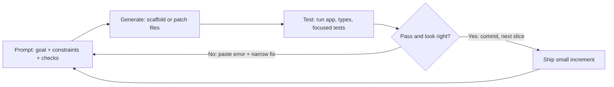

# Vibe coding

## Youtube

- [How to Vibe Code? - Most Practical Guide | Raw Talks](https://www.youtube.com/watch?v=Vd5ns3LUxQs)
- [How to Build an App With Claude Code - Full Tutorial for Beginners](https://www.youtube.com/watch?v=GUgxx6fMiR8)
- [ChatGPT Just Killed Vibe Coding Apps](https://www.youtube.com/watch?v=zg7Rkjo2TaA)
- [5 Claude Code skills I use every single day (Senior Engineer Tips)](https://www.youtube.com/watch?v=AG2BxDXt2po)

## Theory

Vibe coding is building software conversationally by directing AI coding assistants instead of hand-writing every line.
It covers describing apps in natural language, iterating on generated code, and reviewing/debugging AI output.
Key subtopics: Claude Code workflows, practical starter guides, productivity skills, and knowing the limits of AI-built code.

Vibe coding is a prompt-driven development loop where a human describes intent in natural language and an AI
agent turns it into running software. You state the goal, the model scaffolds files, writes functions, wires
dependencies, and explains what it changed — you react, correct, and steer. The skill shifts from syntax recall
to specification, decomposition, and verification: saying what to build precisely, splitting it into checkable
steps, and proving each step works before moving on.

Think of the developer as a tech lead and the model as a fast junior who never sleeps. Pre-training gives the
model grammar, frameworks, APIs, and idioms; instruction tuning teaches it to follow coding directions; agentic
harnesses let it read files, run commands, edit code, and run tests in a loop. Most vibe-coding work is not
typing characters — it is feeding the right context, constraining the change, running the app, pasting the
error back, and insisting on tests. Fluency comes from tight iterations, not from one perfect prompt.

This guide takes you from mindset to shipped app. You will learn what vibe coding is and is not, how the
prompt-generate-test-refine loop works, which prompting patterns produce compiling and reviewable code, how to
impose review and test discipline so AI output stays trustworthy, where the approach breaks down, and which
tools to name in an interview or reach for on a side project. A worked prompting example ties the ideas
together, and the closing Q and A distils what interviewers and teammates probe most.

> Scope note: this page focuses on vibe-coding fundamentals for system design interviews — conversational
> development loops, effective prompting for code, review plus test discipline, failure modes, and ecosystem.
> Deep dives on LLM internals, tokens and context budgets, RAG, fine-tuning, and agents live on companion
> pages — linked from Tools and Ecosystem below.

### Topics Covered

1. [What Vibe Coding Is: Prompt, Generate, Test, Refine](#what-vibe-coding-is-prompt-generate-test-refine)
2. [Effective Prompting for Code That Compiles](#effective-prompting-for-code-that-compiles)
3. [Review and Test Discipline](#review-and-test-discipline)
4. [Where Vibe Coding Fails](#where-vibe-coding-fails)
5. [Tools and Ecosystem](#tools-and-ecosystem)
6. [Interview Questions and Answers](#interview-questions-and-answers)

### What Vibe Coding Is: Prompt, Generate, Test, Refine

Vibe coding means describing the outcome you want — "a markdown notes app with tags and search" — and letting
the model produce the implementation while you direct, test, and correct. Given a prompt plus repo context, the
agent plans edits, writes or modifies files, runs the build or tests, reads the failures, and proposes the next
fix. Speed comes from the scale of its memorised patterns: trained on millions of repos, it recalls framework
scaffolds, auth flows, CRUD templates, and debugging recipes you would otherwise look up line by line.

```text
Intent in words → Agent plans edits → Files generated or patched → Tests and app run → Error or feedback → Refine
```

The name captures the experience: you hold the vibe — product intent, taste, and quality bar — while the model
handles boilerplate, lookups, and first drafts. A starter guide walks you through generating a landing page in
an afternoon; a Claude Code workflow shows the same loop on a real repo with lint, typecheck, and git diff as
guardrails; daily senior-engineer skills turn one-off tricks into habits like slash commands and project docs.
All three share the same spine: small prompt, visible diff, runnable check.

#### The loop in one mental picture

Each cycle has four moves. Prompt states the goal plus constraints plus how to verify. Generate produces a
small, reviewable diff — not a whole rewrite. Test means running the app, the typechecker, or a focused test
suite and reading real output. Refine feeds that output back with a narrower instruction. Loops compound:
good context plus small steps plus fast checks is what separates a demo that runs once from software that
keeps running.



*The vibe-coding loop left to right: a constrained prompt produces a small diff, real execution judges it,
failures steer the next prompt, and passes become committed increments. Prompt quality sets direction; test
output supplies truth; small slices keep both honest.*

#### What changes versus traditional coding

| Activity | Traditional coding | Vibe coding |
|---|---|---|
| Boilerplate and scaffolds | Typed by hand or copied | Generated from one sentence |
| API recall | Docs search plus memory | Model drafts, docs verify |
| Debugging first pass | Manual stack-trace reading | Paste error, ask for minimal fix |
| Tests | Written after or alongside | Prompted explicitly every slice |
| Review | Peer reads human code | Human reads mostly AI code |
| Core human skill | Syntax and framework depth | Spec clarity and verification rigour |

None of this removes engineering judgement. You still choose the data model, the auth boundary, the API shape,
and the definition of done. The model accelerates expression; you retain intent, architecture, and acceptance.
Teams that thrive treat prompts as lightweight specs and diffs as proposals — never auto-merged, always read.

#### A concrete slice example

Say you want user authentication on a side project. A weak approach prompts "add auth" and receives 400 lines
across six files that almost work. A vibe-coding slice prompts "add email plus password signup with hashed
passwords, sessions, and one passing happy-path test; touch only auth files; list manual test steps." The diff
stays readable, the test proves the path, and the next slice — "add logout and rate-limit login attempts" —
builds on green. Small scope plus explicit verification is the whole method in miniature.

#### Who it helps most

Beginners ship their first full app without drowning in config. Senior engineers prototype in hours and spend
saved time on interfaces and edge cases. Non-engineers on product teams turn mockups into clickable builds for
feedback. Interviewers care that you can name both sides: leverage for speed and exploration, discipline for
correctness and ownership. If you cannot explain the generated code in review, you did not vibe-code it — you
outsourced understanding, and that debt compounds fast.

### Effective Prompting for Code That Compiles

Prompting for code is specifying the change the way a tech lead writes a ticket: goal, context, constraints,
and acceptance. The same model can scaffold a clean feature or spray broken edits depending on scope control,
file pointers, output limits, and verification demands. Below are the five patterns that cover most
vibe-coding work.

#### 1. Goal, context, constraints, checks

State what to build, where to look, what to avoid, and how to prove it works. Explicit check steps beat
vibes when the model cannot run your judgement for you.

```text
Goal: Add tag filtering to the notes list.
Context: See src/notes/list.tsx and src/notes/store.ts; follow existing filter style.
Constraints: touch only those two files; no new dependencies; keep component under 150 lines.
Checks: run npm run typecheck and npm test notes; paste failing output if any; list manual steps.
```

#### 2. Small slices with file pointers

Show the model exactly which files matter and cap the blast radius. One slice teaches the pattern the repo
already uses: state shape, handler style, naming. Keep slices committable in minutes; ten-file rewrites waste
the review attention that correctness needs.

#### 3. Example-driven specs with a worked prompt

Concrete inputs and outputs beat adjectives like "nice" or "robust". Give one happy path plus one edge case,
then demand the model echo its plan before editing. A worked example ties the method together.

```text
Build a search box for the notes app:
Input: notes [{title: "LLM wiki", tags: ["ai"]}, {title: "Groceries", tags: ["home"]}].
Behaviour: typing "llm" matches title case-insensitively; typing "tag:ai" filters by tag;
empty query shows all; show "No matches" otherwise.
Plan first in 5 bullets, then edit only src/notes/search.tsx, then run npm test search.
```

Why this works: the query examples pin semantics the model would otherwise invent, the file pointer stops
drive-by refactors, "plan first" exposes misunderstandings before code exists, and the named test command
forces execution rather than a claim of correctness. When the run fails, the next prompt is narrow: paste the
error plus "fix only the failing assertion, explain root cause in two lines."

#### 4. Iterate with errors, not opinions

Unrestricted re-prompts blend hope with context. Pin the loop down: "Here is the failing output below; make
the minimal change that turns it green; do not reformat unrelated lines." This single habit plus pasting real
logs eliminates most spiralling rewrites. Pair it with a stop rule so "try again" is never the whole prompt.

#### 5. Decomposition and project memory

Split hard builds: one prompt scaffolds, a second wires data, a third adds tests and polish. Small scoped
prompts beat one mega-prompt on compilability and reviewability. Add memory around the model — a short
project doc with stack, scripts, conventions, and do-not-touch paths — so every session starts briefed and
stays consistent.

#### Anti-patterns to name in interviews

- **Mega-prompts:** five features in one paragraph the model cannot sequence. Slice to one shippable increment.
- **Contradictory orders:** "minimal change" plus "redesign the layout". Resolve scope explicitly.
- **Context dumping:** pasting the whole repo instead of two relevant files. Point, do not flood.
- **Unverified acceptance:** treating "done, it should work" as green. Demand command output and manual steps.
- **Prompt amnesia:** re-explaining the stack every session. Write it once in project docs and reference it.

### Review and Test Discipline

Generated code is a proposal until you verify it. Vibe-coding speed without review discipline produces apps
that demo well and break silently: leaked keys, missing auth checks, untested branches, plausible but wrong
library calls. Strong practitioners read every diff, run every slice, and keep a green suite as the price of
the next prompt.

#### What actually to review

- **Diff scope:** only expected files changed, no drive-by refactors or dependency swaps you did not ask for.
- **Security seams:** auth checks, input validation, secrets handling, SQL or prompt-injection surfaces.
- **Data handling:** migrations, deletes, overwrites — anything irreversible gets a second look plus backup.
- **Error paths:** loading, empty, failure, and permission-denied states, not just the happy path.
- **Understandability:** could you explain each hunk in review? If not, ask the model to simplify or comment.

A ten-minute review habit that scales: read the diff before running, run typecheck plus focused tests, click
through the manual steps, then commit with a message you wrote. Starter tutorials skip this because a landing
page forgives; the Claude Code workflow in the links above shows it on a real repo with lint and git status as
guardrails; daily senior skills turn it into aliases and checklists so it survives deadline pressure.

#### Testing ladder worth memorising

| Level | What to ask for | Example prompt fragment |
|---|---|---|
| Typecheck plus lint | Zero new errors | "run npm run typecheck and fix new errors" |
| Focused unit test | One passing path per slice | "add one happy-path test for tag filter" |
| Edge-case tests | Empty, invalid, denied | "cover empty query and unknown tag" |
| Manual smoke steps | Click path you verify | "list 5 manual steps with expected UI" |
| Regression gate | Full suite stays green | "run npm test; do not proceed on red" |

#### A worked verification example

Say the model adds search and claims success:

```text
Window of trust: search.tsx diff (40 lines) + 2 new tests
- npm run typecheck: clean, no new warnings
- npm test search: 2 passed, output pasted in chat
- Manual: typed "tag:ai" → 1 result; cleared → all notes; typed "zzz" → "No matches"
= Commit message: "Add notes search with tag: prefix and empty-state"
```

When the sum fails, apply the standard playbook in order: ask for the minimal fix with root cause in two
lines, re-run only the focused test, widen to the full suite once green, and only then prompt the next
feature. Each step trades a little speed for a lot of trust saved.

#### Shipping discipline beyond the loop

Keep secrets in env files the model never prints, put generated migrations behind review, require human
approval for deploys and data deletes, and log prompts plus diffs plus test output for anything shared. Track
review coverage — every AI line read by a human — as the headline quality metric, and keep a do-not-merge list
(unreviewed diffs, red suites, pasted secrets) so standards are stated, not assumed.

### Where Vibe Coding Fails

Vibe coding optimises for plausible first drafts, not truth — the model completes familiar patterns even when
requirements, APIs, or repo facts contradict them. Interviews test whether you can name the failure, show what
it looks like in a coding session, and attach a fix to each.

| # | Failure mode | What it looks like | Fix |
|---|---|---|---|
| 1 | Hallucinated APIs | Invented props, flags, endpoints that never existed | Pin versions; verify against docs; ask for minimal diff |
| 2 | Stale knowledge | Pre-cutoff framework answer stated as current | Paste current docs; constrain to installed version |
| 3 | Context contradiction | Blends repo conventions with generic tutorial style | Point to two exemplar files; forbid new patterns |
| 4 | Scope creep edits | One-line ask returns a six-file refactor | Cap files touched; demand plan before edits |
| 5 | Silent security gaps | Missing auth check, raw query, key in client bundle | Review seams checklist; prompt for validation explicitly |
| 6 | Test theatre | Claims green without pasting command output | Require pasted logs plus manual steps every slice |
| 7 | Compounding misunderstanding | Three fixes deep, original intent lost | Revert slice; restate goal narrower; shrink scope |

Defence in depth: constrain with file pointers and check steps, verify with typecheck plus tests plus clicks,
and gate with human review and approval for deploys, migrations, and deletes. Track slice size — lines changed
per prompt — as the headline risk metric, and keep a revert-first norm so a confused thread restarts clean
instead of stacking patches on a misunderstanding.

#### Limits worth stating plainly

Large or legacy codebases drown prompts in cross-file coupling the model cannot hold; novel architectures and
deep performance work need measurements, not completions; compliance, payments, and safety-critical paths need
proof beyond "it runs once." The recent "vibe coding apps are dead" discourse makes the same point from the
product side: wrappers with no data model, tests, or review collapse the moment users go off-script. Name the
boundary explicitly — "prototype by prompt, production by review" — because that is the stance interviewers
and senior teammates want to hear.

#### When to step out of the loop

Hand-write or pair-program the security seam, the migration, and the tricky algorithm; read the framework
source when the model hedges; write the test yourself when the behaviour is the spec. Vibe coding accelerates
the routine middle — CRUD, forms, glue, scaffolds — while judgement-heavy edges stay human-led. If errors
repeat three times on one slice, the prompt is not the problem: read the code, shrink the task, or change
the design.

### Tools and Ecosystem

| Layer | Representative tools | Notes for interviews |
|---|---|---|
| Agentic CLI harnesses | Claude Code, OpenAI Codex CLI, Gemini CLI | Terminal agents that read, edit, run, and test repos |
| AI IDEs and editors | Cursor, GitHub Copilot, Windsurf, Zed AI | Inline completions plus chat with repo context |
| App builders | v0, Lovable, Bolt, Replit Agent | Prompt-to-app for prototypes and landing pages |
| Project memory | CLAUDE.md, repo wiki, LLM Wiki pattern | Conventions plus scripts agents read each session |
| Verification | TypeScript, ESLint, Vitest, Playwright | Typecheck, lint, unit plus e2e gates per slice |
| Version control | Git, GitHub, diff review, CI checks | Every AI diff read before merge; red blocks ship |
| Guardrails | Env files, secret scanners, code review rules | No keys in prompts; human approves deploys |
| Learning sources | Raw Talks guide, Claude starter tutorial, senior skills video | Practical loop, first-app path, daily habits |

Companion pages in this repo go deeper on adjacent layers: LLM fundamentals and token budgets, RAG internals
and evaluation, embedding-model choice, vector database internals, LangChain and LangGraph orchestration, and
agentic patterns that wrap models in tool-using loops. Typical vibe-coding use cases: landing pages and MVPs,
internal dashboards, CRUD apps with auth, migration and refactor assistants, test scaffolding, and clickable
prototypes for product feedback.

#### How the layers fit in one session

A typical evening build touches four layers in order. Project memory briefs the agent: stack, scripts,
conventions, do-not-touch paths. The harness — CLI agent or AI IDE — reads the two pointed files and drafts
the slice. Verification judges it: typecheck, focused tests, a click through the running app. Version control
records the win: a small commit with a human-written message. When a layer is missing the loop wobbles:
no memory means repeated briefings, no verification means theatre-green claims, no version control means no
clean revert when a thread goes sideways.

```text
Memory briefs → Harness drafts → Verification judges → Version control records → Next slice
```

Keep the chain short enough to run every slice. If typecheck plus one focused test plus a two-minute click
takes longer than the generation itself, that is normal — verification is supposed to be the slow, careful
half of a fast loop. Speed comes from slices staying small, not from checks being skipped.

#### Picking your stack: three setups

- **First app from zero:** an app builder for the clickable draft, then export to a repo and continue in an
  AI IDE. The Raw Talks practical guide and the Claude starter tutorial in the links above both follow this
  arc: prompt to something visible, then tighten with real files, runs, and fixes. Aim for one evening to a
  running page, one weekend to auth plus data plus deploys.
- **Side project with a repo:** an AI IDE plus project memory plus typecheck and tests. Inline completions
  handle the small stuff while chat owns slices; the memory doc keeps conventions stable across sessions.
  Commit per slice so any bad thread costs at most one revert.
- **Production team repo:** an agentic CLI plus strict gates — lint, typecheck, focused and full tests, diff
  review, CI, human approval for migrations and deploys. The senior-skills video above shows this posture:
  aliases, slash commands, and checklists that make discipline the default rather than a mood. Same loop as
  the side project; the bars for evidence and approval sit higher.

#### Cost and context habits from the LLM companion page

Vibe-coding sessions burn context the way long chats do: system brief plus history plus retrieved files plus
generated diffs must all fit the window, and output tokens cost more than input ones. Habits that transfer
directly: brief once in a memory file instead of pasting context every prompt, point to two files instead of
dumping the repo, summarise a long thread into a fresh session rather than stacking fix on fix, and reserve
room for the diff plus test output rather than filling the window with background. When the agent starts
forgetting conventions or repeating questions, the window is full — compress, reset the thread, re-brief.

#### Anti-patterns at the ecosystem level

- **Tool hopping mid-slice:** switching harnesses halfway through a feature orphans context. Finish the
  slice, commit, then switch with a clean brief.
- **Builder lock-in without export:** a prototype that cannot leave its host is a demo, not an asset. Confirm
  code export and repo handoff before investing a weekend.
- **Gates without teeth:** CI that runs but never blocks, review that rubber-stamps. Wire at least one hard
  gate — red suite blocks merge — or the ecosystem is decoration.
- **Secrets in the loop:** keys pasted into prompts or printed in logs. Env files, scanners, and a standing
  rule that agents never echo credentials.

### Interview Questions and Answers

1. **What is vibe coding?**
   Building software conversationally: you describe intent in natural language and an AI agent scaffolds, edits,
   and explains code while you steer, test, and commit. The loop is prompt with constraints, generate a small
   diff, run checks and the app, then refine from real output. Humans keep intent, architecture, and acceptance.

2. **Walk me through your prompt-generate-test-refine loop.**
   Prompt states goal plus file pointers plus checks; the agent plans and patches a few files; I read the diff,
   run typecheck and focused tests, and click the manual path; failures go back as pasted logs with a narrow
   fix request, passes become a commit. Small slices keep diffs reviewable and errors attributable.

3. **What makes a code prompt effective? Give an example.**
   Goal, context, constraints, and checks in one block: "add tag filtering in these two files, no new deps,
   run typecheck and notes tests, list manual steps." One happy path plus one edge case pins semantics, file
   pointers stop refactors, and demanding pasted output forces execution. Plans before edits catch confusion
   early.

4. **How do you review AI-generated code?**
   Read the diff before running: scope, security seams, data handling, error paths, and whether I can explain
   each hunk. Then typecheck, focused tests, and manual smoke steps. Anything irreversible — migrations,
   deletes, deploys — gets a second look plus approval. Unreviewed diffs never merge, however clean they look.

5. **Where does vibe coding fail, and how do you handle it?**
   Hallucinated APIs, stale framework answers, scope-creep edits, silent auth or validation gaps, and test
   theatre where green is claimed but not shown. Handle with version pins, exemplar files, file caps, explicit
   security prompts, pasted logs, and revert-first restarts when a thread compounds confusion past three tries.

6. **How do you keep quality high while moving fast?**
   One slice at a time with a green suite as the price of the next prompt: typecheck plus lint, one happy-path
   test per slice, edge cases next, manual steps I actually click, full suite before moving on. Track slice size
   and review coverage; shrink scope the moment verification lags generation.

7. **Which tools would you choose for a side project versus a production repo?**
   Side project: an app builder or AI IDE for the fastest clickable build, then export to a real repo. Production
   repo: an agentic CLI like Claude Code plus project memory docs, with TypeScript, lint, tests, git review, and
   CI as gates. Same loop both places; the difference is how strict the verification and approval bars are.

8. **How do you ship vibe-coded work safely?**
   Secrets in env files never pasted to models, generated migrations reviewed line by line, human approval for
   deploys and data deletes, prompts plus diffs plus test logs recorded for shared work. Measure review coverage
   and refusal to merge on red, and keep a stated do-not-merge list so standards survive deadline pressure.
