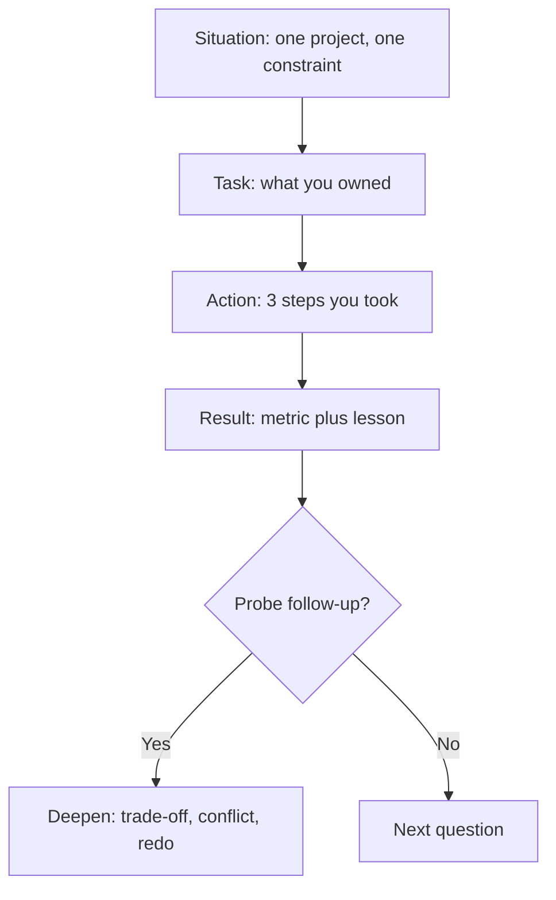

Star Method

# Be a senior developer

## Medium

- [Stories to Help You Grow as a Software Developer](https://medium.com/@MediumStaff/list/stories-to-help-you-grow-as-a-software-developer-b1d913188c20)
- [Leadership](https://eddiebarth.medium.com/list/leadership-0cc0d07e2706)
- [Top 10 best practices for code review](https://medium.com/beyond-the-code-by-typo/top-10-best-practices-for-code-review-a05a7d1ce480)
- [What I learned from the book Software Architecture: The Hard Parts](https://medium.com/@techworldwithmilan/what-i-learned-from-the-software-architecture-the-hard-parts-0498c9eae88e)
- [How to Accumulate Domain Knowledge Like a Senior Engineer](https://medium.com/career-paths/how-to-accumulate-domain-knowledge-like-a-senior-engineer-8dd3924e2c70)
- [Low-code for large projects. It's time.](https://blog.devgenius.io/low-code-for-large-projects-its-time-aecd1f2ac2a7)
- [Good Product Thinking](https://medium.com/@breanamjones/list/good-product-thinking-25dfb3a0bd21)
- [I Failed as a Lead Developer. What I've Learned?](https://blog.stackademic.com/i-failed-as-a-lead-developer-what-ive-learned-7bf66cb0d075)
- [Clean Code Cheat Sheet for Senior Developers in Daily PR Reviews](https://azeynalli1990.medium.com/clean-code-cheat-sheet-for-senior-developers-in-daily-pr-reviews-6b77ee413469)
- [12 Must-Have Books for Senior Software Engineers](https://azeynalli1990.medium.com/12-must-have-books-for-senior-software-engineers-e433d8ba77fa)
- [Best 30 Solution Architect Interview Questions and Answers (2024)](https://medium.com/@skillcombo/best-30-solution-architect-interview-questions-and-answers-2024-a8b91a076a77)
- [10 Lead Software Developer Principles](https://medium.com/mjukvare/10-lead-software-developer-principles-7e056d0e9c9c)
- [Good Developer / Great Developer / Exceptional Developer](https://medium.com/@mike.s.chambers/good-developer-great-developer-exceptional-developer-ec4213565938)
- [12 Microservices Design Patterns every Software Engineer needs to know](https://medium.com/@mrahmedkhan019/12-microservices-design-patterns-every-software-engineer-needs-to-know-f2daae212647)
- [7 Coding Patterns I Stole From Senior Engineers](https://medium.com/skillstuff/7-coding-patterns-i-stole-from-senior-engineers-c95f757e52a6)

## Theory

This page covers behavioural interviews and growing toward senior developer level.
It spans answering with the STAR method (Situation, Task, Action, Result), leadership and ownership stories, code-review habits, and accumulating domain knowledge.
Key subtopics: senior vs exceptional developer traits, product thinking, microservices awareness, and learning from lead-developer failures.

## Theory continues

This page turns the collections above into a complete operating manual for
behavioural interviews at mid to senior level. The links give you what to
believe about leadership, ownership, code review, and domain knowledge. What
remains is how to prove it under interview pressure: which stories to prepare,
how to tell each one in ninety seconds with the STAR method, which senior
signals interviewers actually score, which questions to ask back, and which
traps turn strong engineers into vague storytellers.

Think of behavioural interviews as decision throughput for hiring, the same way
the architect guide treats architecture as decision throughput for teams.
Coding rounds test what you can build, behavioural rounds test what teams get
when they hire you: judgment under ambiguity, ownership without authority,
conflict handled directly, failure owned publicly, and growth that compounds.
Seniors ship systems, exceptional developers multiply the people around them,
and every story below must show movement from the first altitude to the second.

### 1. Topics Covered

1. [STAR Method How to Answer in Four Beats](#2-star-method-how-to-answer-in-four-beats)
2. [Story Bank Six Stories That Cover Everything](#3-story-bank-six-stories-that-cover-everything)
3. [Senior Signals What Interviewers Score](#4-senior-signals-what-interviewers-score)
4. [Questions to Ask What Seniors Ask Back](#5-questions-to-ask-what-seniors-ask-back)
5. [Pitfalls How Good Engineers Fail Behaviourals](#6-pitfalls-how-good-engineers-fail-behaviourals)
6. [Interview Questions and Answers](#7-interview-questions-and-answers)

Each numbered item links to the matching section below. Headings use plain words so every anchor resolves on GitHub preview.

### 2. STAR Method How to Answer in Four Beats

STAR is Situation, Task, Action, Result. It works because interviewers score
recall under stress, and stress makes engineers either ramble for five minutes
or answer in abstractions with no scene. STAR forces a scene, a choice, and a
receipt. Situation and Task take twenty seconds together, Action takes fifty
seconds, Result takes twenty seconds. Ninety seconds total, then stop and let
the interviewer probe.

How a strong answer actually flows:

The flow above keeps every answer inside the same rails. Situation grounds the
story in a real team and date, Task names your ownership slice so credit is
clear, Action shows judgment in sequence rather than a list of technologies,
and Result closes with a number plus a changed habit. Probes then deepen one
beat instead of reopening the whole story.

- **Situation in two sentences:** name the team, the system, and the pressure.
  Good is serving checkout latency spiking to two seconds during Diwali sale
  with five engineers on call. Bad is we had some performance issues. One
  concrete scene beats three vague contexts because the interviewer can picture
  the stakes and test your choices against them.
- **Task in one sentence:** state what you personally owned, not what the team
  owned. I owned cutting p99 under eight hundred milliseconds without new
  infrastructure spend. Ownership language uses I for decisions and we for
  execution, never hiding behind a collective we for the hard call you made.
- **Action in three steps:** narrate decisions in order, each with a rejected
  alternative. Profiled traces before guessing, killed two N-plus-one queries
  instead of adding cache first, then added Redis for the hot seller path only.
  Three steps fit in fifty seconds and prove method: measure, fix the root
  cause, then optimize the remainder with a reversible lever.
- **Result with a number and a lesson:** close with p99 from two seconds to six
  hundred milliseconds for three weeks, zero extra hosts, plus the dashboard
  alert we left behind. Numbers prove impact, the leftover guardrail proves
  seniority. End with what you would repeat and what you would skip next time.

Worked example, full ninety-second shape:

> Situation: In late 2023 I was backend lead on a six-person marketplace team,
> and seller-page p99 hit two seconds the week before the festive sale.
> Task: I owned bringing p99 under eight hundred milliseconds with no new
> infrastructure budget. Action: First I traced one hundred slow requests and
> found two N-plus-one loads in the seller resolver, so I batched them and cut
> nine hundred milliseconds before touching any cache. Second I added Redis only
> for the top two hundred sellers with a five-minute TTL and a stale-while
> revalidate fallback instead of caching everything. Third I put the p99 panel
> on the team wall and gated deploys on it for sale week. Result: p99 settled at
> six hundred milliseconds through the sale, conversion on seller pages rose
> eleven percent week over week, and the trace-and-gate checklist became our
> default performance runbook.

Why this passes: twenty seconds of scene, one owned target, three ordered
actions with a named trade-off, and a result with two numbers plus a durable
habit. The interviewer can now probe caching invalidation, the batching query
shape, or the deploy gate, and every probe lands on ground you prepared.

STAR timing drills that follow:

- Write each story as four bullets with strict budgets: two lines, one line,
  three lines, two lines.
- Rehearse out loud with a timer: ninety seconds for the story, sixty for probes.
- Record one take and count I versus we: decisions need I, help needs names.
- End every story with a metric and a leftover: dashboard, runbook, template.

Practical rules that follow:

- Never start with Action; no scene means no score for judgment.
- Name one rejected option per story so trade-offs are visible.
- Stop at ninety seconds and invite the probe instead of filling silence.

### 3. Story Bank Six Stories That Cover Everything

Six stories cover ninety percent of behavioural prompts because prompts repeat
the same six judgments: ownership, conflict, failure, ambiguity, influence
without authority, and growth. Prepare one polished story per row, each with a
metric and a leftover habit, and you can remap any question in five seconds by
naming which story you are telling and why it fits.

| # | Story slot | Prompt it answers | One-line shape | Metric plus leftover |
|---|---|---|---|---|
| 1 | Ownership under pressure | Tell me about a time you owned something end to end | Seller p99 from two seconds to six hundred milliseconds before sale week | Eleven percent conversion lift, performance runbook adopted by team |
| 2 | Conflict and directness | Describe a disagreement with a teammate or manager | Pushed back on shipping without migration guardrail, wrote risk note same day | Zero data-loss incidents, risk-note template reused for later migrations |
| 3 | Failure owned publicly | Tell me about a mistake and what changed | Shipped a red merge that paged checkout at midnight, owned the retro | MTTR from forty to twelve minutes, daily-merge rule plus deploy gate |
| 4 | Ambiguity and product thinking | Tell me about vague requirements you clarified | Turned build a dashboard into three seller questions, cut half the scope | Shipped in two weeks not five, discovery-question checklist in wiki |
| 5 | Influence without authority | Tell me about unblocking someone outside your team | Convinced payments squad to version their webhook with traces not slides | Integration time from three weeks to four days, contract-testing guide |
| 6 | Growth and mentorship | Tell me about helping someone grow or growing yourself | Mentored an intern from first PR fear to owning notification retry | Intern converted to full time, code-review cheat sheet still in use |

Building each story without inventing experience:

- **Slot one, ownership:** pick the incident, migration, or launch where you
  were the name on the page. Write the date, the constraint such as no budget
  or frozen headcount, and the single number that moved. Ownership stories fail
  when the hero is the team; keep we for help received and I for the call that
  could have gone wrong. The leftover must be a file, a gate, or a checklist
  someone else still uses, because durable proof beats claimed impact.
- **Slot two, conflict:** choose a real disagreement about scope, estimate, or
  design, not a personality clash. Name what you said plainly, to whom, and the
  same day rather than in hallway chat. Show the written follow-up with owner
  and date, the short-term awkwardness, and the avoided slip or outage. Hiring
  managers score candor with care: hard news early, respect throughout, record
  after. Never pick a story where the other person looks foolish.
- **Slot three, failure:** choose a miss that cost real time or money, ideally
  the lead-developer failure the links above warn about. State what you owned,
  what you missed, the fix with a date, and the guardrail added such as daily
  merges, buffer rules, or review checklists. Own it without self-flagellation;
  accountability plus a systemic fix is the hire signal, excuses or a vague we
  is the fail. Rehearse this one most, because shame makes people ramble.
- **Slot four, ambiguity:** pick the ticket that said something useless like
  improve the dashboard or scale the service. Show the three questions you asked
  before coding: who waits on this, what breaks if it fails, what simpler path
  removes the need. Product thinking means deleting scope on purpose and saying
  which half you cut and why users never missed it. Domain knowledge compounds
  fastest here, at the edge where code meets money, so name the stakeholder you
  shadowed for an hour.
- **Slot five, influence:** find the week you needed something from a team that
  owed you nothing: an API version, a schema change, a review slot. Influence
  stories run on evidence and generosity, not escalation. Bring the trace, the
  reproduction, or the draft PR instead of a complaint, offer to do the boring
  half yourself, and write the guide afterward so the next team inherits a path.
  Exceptional-developer signal lives here: you multiplied another squad.
- **Slot six, growth:** pair one mentorship story with one learning story and
  keep the sharper of the two. Mentorship means a named person, a starting
  struggle, two specific interventions such as review walkthroughs and scoped
  starter tasks, and an outcome with a date. Learning means a named gap such as
  microservices patterns or review habits, the thin book or rotation that closed
  it, and the project where the new skill shipped. Growth stories prove the
  trajectory arrow points up.

Remapping drills that follow:

- Read ten prompts aloud and answer each with a slot number in under five seconds.
- Keep each story on one index card: scene, owned target, three actions, metric.
- Rotate the opener so no two answers in one loop start with the same slot.

Practical rules that follow:

- Six finished stories beat twenty half-remembered anecdotes every loop.
- Every story ends with a number and a leftover artifact with a location.
- Never reuse the same story twice in one interview day without saying so.

### 4. Senior Signals What Interviewers Score

Interviewers rarely score charisma; they score six signals that predict cheap
to manage and easy to trust. Junior answers describe tasks completed, senior
answers describe decisions made under constraint with people affected and
systems left better. Map every story to at least two signals before the loop,
because the panel compares notes on signals, not on stories.

- **Ownership without being asked:** seniors see the gap, name it, and take the
  pager for it before anyone assigns it. Signal phrases include I noticed the
  alert had no owner so I took it, I timeboxed two days and reported daily, I
  stayed through the boring ten percent of docs and monitors. Anti-signal is
  waiting for the ticket or leaving the last mile to someone else. Prove it with
  the incident you volunteered for and the maintenance months after launch.
- **Judgment with trade-offs stated:** seniors choose in the open and price the
  rejected path. Batching before caching because writes were the root cause,
  Postgres over a new queue because team fluency beat novelty, delaying a
  feature to pay down the flaky suite with a dated payback. Say what you gave up
  and what would flip the call. Engineers who list tools without rejected
  options read as mid-level regardless of years.
- **Direct conflict handled kindly:** seniors raise risk the same day in plain
  words, then write the agreed next step with an owner and date. They disagree
  about scope, estimates, and design, never about worth. The story shape is
  private candor first, shared record second, follow-through third. Hallway
  complaints, silent absorption of impossible dates, and surprise escalations
  are the three fails this signal screens for.
- **Accountability with systemic repair:** seniors own misses by name and change
  the system so the miss cannot recur on their watch. What I owned, what I
  missed, the fix with a date, the guardrail with a location. Retros, deploy
  gates, buffer rules, and review checklists are the receipts. Blame memos,
  lesson-free apologies, and fixes that live only in memory score against.
- **Multiplicative habits:** exceptional developers leave people and repos
  better: the intern who now owns a service, the review cheat sheet the team
  still links, the runbook that cut onboarding from weeks to days, the lunch
  and learn that spread one microservices pattern to three squads. Hiring bars
  for senior and above ask who got faster because of you. Bring names, dates,
  and artifacts, not adjectives about being a team player.
- **Domain and product gravity:** seniors accumulate context beyond tickets:
  seller economics, refund policy edge cases, on-call cost of a clever design.
  They shadow support for a shift, join one customer call a quarter, and can say
  which half of a vague ask they deleted and why revenue never noticed. This is
  the how-to-accumulate-domain-knowledge link made interview-legible: one
  rotation, one deleted scope, one stakeholder quoted by name.

What a scored answer looks like in notes:

| Signal | Strong note example | Weak note example |
|---|---|---|
| Ownership | Took unowned migration, timeboxed, shipped with gate | Did assigned tickets well |
| Judgment | Chose batching over cache, named cost of each | Used Redis because it is fast |
| Conflict | Raised risk same day, wrote owner plus date | Avoided discussion, absorbed slip |
| Accountability | Owned red deploy, added gate, MTTR down | Team had an outage, lessons learned |
| Multiplier | Intern converted, cheat sheet reused | Helped teammates sometimes |
| Product sense | Cut half scope after seller interviews | Built everything requested |

Practical rules that follow:

- Tag each story card with its two primary signals before the loop.
- State trade-offs and rejected options out loud; interviewers cannot score silence.
- Bring the artifact location: wiki link, dashboard name, template file path.

### 5. Questions to Ask What Seniors Ask Back

The last ten minutes test whether you audit teams the way seniors audit
systems. Juniors ask about perks and tech lists, seniors ask about on-call
load, review culture, promotion proof, and how conflict actually resolves.
Ask four questions total: one about the work, one about the people, one about
growth, and one about risk. Fewer, deeper questions beat a rapid-fire list.

- **What does on-call look like for this team this quarter:** pages per week,
  who carries the pager, what the last two incidents taught. Follow with how
  toil is budgeted against features, because the ratio reveals whether
  reliability is a value or a slogan. Strong answer names numbers and a recent
  fix; vague comfort about rarely getting paged is a warning light.
- **How do code reviews and design reviews actually run:** turnaround time,
  who must approve, what a recent rejected design looked like. Ask for the
  review cheat sheet or the principles list the team links in PRs, echoing the
  clean-code review link above. Teams with kind, fast, specific reviews grow
  people; teams with silent approvals or week-long queues do not.
- **What did the last two promotions from this level require:** concrete scope,
  artifacts, and time in seat, not just impact and visibility. Ask what the
  interviewer's own path to senior looked like and which story proved it.
  Promotion proof separates ladders from lotteries, and the question signals
  you plan to grow rather than coast.
- **How does disagreement resolve here, with an example:** ask for a recent
  scope or architecture dispute, who decided, and what the dissenter got in
  writing. Healthy teams describe a decision log with an owner and a revisit
  date; unhealthy teams describe hallway consensus or manager fiat. You are
  screening for the direct-conflict culture your stories assume.
- **What is the gnarliest ambiguity on the roadmap right now:** which
  requirement is vaguest, which stakeholder disagrees, what a thirty-day win
  looks like. The answer previews your first story slot and shows whether
  product thinking is welcome or merely tolerated. Bonus probe: which half of
  the scope would they delete first.
- **How is domain knowledge transferred, not just documented:** rotations,
  support shadows, customer-call invites, lunch and learns that actually run.
  Seniors grow through edges where code meets users, so ask where those edges
  are scheduled rather than improvised. A wiki nobody reads is not transfer.

Asking them well matters as much as asking them:

- Ask one, then listen and probe once before moving on; interrogation lists read as anxiety.
- Connect the answer to a story: that on-call ratio is why I built the deploy gate I mentioned.
- Write answers down after the loop; patterns across four interviewers reveal the truth.

Practical rules that follow:

- Never ask anything the careers page answers; spend the slot on lived reality.
- End with what would make you successful in ninety days, then stop on time.
- Send one thank-you note with a specific callback to something they said.

### 6. Pitfalls How Good Engineers Fail Behaviourals

Most behavioural failures are not character failures; they are storytelling
failures with the same six shapes. Each pitfall below reads as a scope
overload in the wisdom guide: the fix is subtraction, one habit removed and
one guardrail added before the next loop.

- **The five-minute ramble:** no scene, no target, a tour of every ticket
  touched that quarter. Fix with the ninety-second budget: twenty for scene
  plus task, fifty for three actions, twenty for metric plus lesson. Practice
  the hard stop: state the result, pause, and ask what they would like deeper.
  Interviewers forgive thin stories; they penalize stories with no edge.
- **The abstraction answer:** I improved scalability and collaboration with
  zero nouns. Fix by naming the service, the date, the constraint, and the
  number in the first three sentences. If a sentence works for any company, it
  scores for none. Concrete nouns are the cheapest senior signal available.
- **The we-only story:** every decision belongs to the team, so ownership is
  unscorable. Fix with I for calls and trade-offs, we plus names for help and
  execution. I chose batching over caching against Rahul's cache-first
  suggestion, and we shipped the gate together. Credit shared, judgment owned.
- **The hero-villain conflict:** the teammate looks foolish so you look wise.
  Fix by making the disagreement about scope or design, showing your own
  contribution to the confusion, and closing with respect intact. Panels
  imagine you telling this story about them next; generosity is the screen.
- **The lesson-free failure:** a mistake polished into a humblebrag with no
  cost and no guardrail. Fix with real money, real pages, or real weeks lost,
  then the dated fix and the artifact location. Shame rehearsed becomes
  composure; shame avoided becomes rambling the moment they probe.
- **The perk-only close:** final questions about free food and laptop models
  while promotion proof and on-call load go unasked. Fix with the four-question
  set above, asked slowly with one probe each. The close is a story too, and
  seniors end it on craft, people, and growth.

Pre-loop checklist that follows:

- Six story cards tagged with signals, metrics, and artifact locations.
- One failure story rehearsed twice, because it carries the most shame load.
- Four questions chosen and ordered; notebook open for answers.

### 7. Interview Questions and Answers

1. **Tell me about a time you owned a critical delivery end to end.**
   Use slot one. Set the seller-page scene in two sentences, name the owned
   target of p99 under eight hundred milliseconds with no new spend, then three
   actions: traced and batched the N-plus-one loads, cached only the hot seller
   path, gated deploys on the p99 panel. Close with six hundred milliseconds
   through sale week, eleven percent conversion lift, and the runbook the team
   still uses. Signal appetite plus method plus a leftover.
2. **Describe a disagreement with a teammate or manager. How did it resolve?**
   Use slot two. Pick the migration guardrail dispute: you asked for a
   backfill dry run, the lead wanted to ship Friday, you wrote the risk note
   the same afternoon with owner and date. Show the short-term friction, the
   Monday dry run catching two thousand orphan rows, and the template reused
   since. Emphasize candor with care: hard news early, respect throughout,
   record after, never a villain in the telling.
3. **Tell me about a mistake that cost the team real time or money.**
   Use slot three. Name the red merge shipped before leaving for dinner that
   paged checkout at midnight. State what you owned, what you missed in the
   review checklist, the twelve-minute rollback, and the next-day retro. Then
   the systemic repair: daily merges from main, deploy gate on p99, MTTR from
   forty to twelve minutes over the quarter. Accountability plus guardrail is
   the pass; excuses or a vague we is the fail.
4. **Tell me about ambiguous requirements you turned into a shipped scope.**
   Use slot four. Open with the build a seller dashboard ticket that meant
   everything and nothing. Ask the three questions: which sellers wait, what
   breaks without it, what half can be deleted. Describe shadowing one seller
   call, cutting exports and custom ranges, shipping three answered questions
   in two weeks instead of five. Close with the discovery checklist now in the
   wiki. Product gravity proven by deletion.
5. **Tell me about influencing a team you had no authority over.**
   Use slot five. The payments squad owned the webhook you depended on, with
   no versioning and silent field changes. Instead of escalating, bring traces
   of three silent breaks, a draft versioning PR, and an offer to write the
   contract tests yourself. Integration time fell from three weeks to four
   days, and the testing guide you left became their onboarding page.
   Evidence plus generosity is the exceptional-developer receipt.
6. **Tell me about helping someone grow or closing a gap in yourself.**
   Use slot six. Name the intern, the starting fear of first PRs, and two
   interventions: twice-weekly review walkthroughs using the clean-code cheat
   sheet, then scoped starter tasks ending in owning notification retry.
   Outcome with a date: converted to full time that half, cheat sheet still
   linked in reviews. Or pair with your own depth bet: one thin book on
   microservices patterns finished with pen and paper, applied in the next
   project. Trajectory arrow up, with names.
7. **How do you handle pressure, tight deadlines, and on-call pain?**
   Remap to slots one and three. Walk the sale-week rhythm: top three outcomes
   each morning, deep block defended, easiest tasks at day end for clean
   shutdown, buffer named inside every estimate. Tell how the first buffer burn
   was reported early instead of at the deadline, and how the retro turned pain
   into the deploy gate and the health SLO of sleep defended. Calm triage with
   visible trade-offs beats silent overload every time.
8. **Why should we hire you at senior level? What will be different in a year?**
   Close across all six signals. Summarize in thirty seconds: owns gaps before
   assignment, decides with priced trade-offs, raises conflict the same day
   with a written record, repairs misses systemically, multiplies one squad
   mate and one repo habit per half, and accumulates the domain that lets scope
   be deleted safely. Then name the ninety-day version: runbook for the
   noisiest alert, review turnaround under a day, one mentee with a scoped
   service slice. Loyalty with open eyes and a learning posture is the message.
