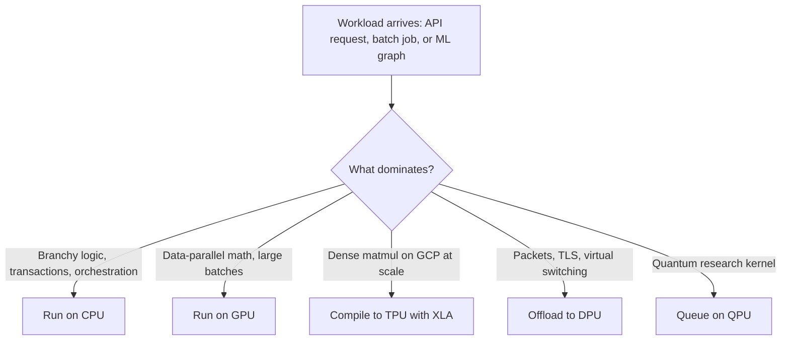
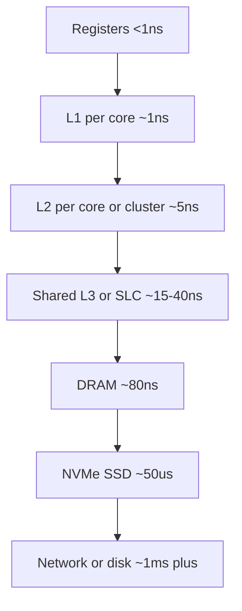
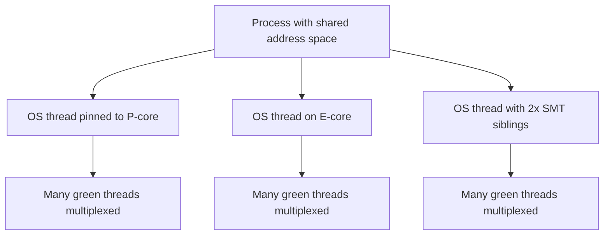

# Computers


## Youtube

- [Exploring How Computers Work](https://www.youtube.com/watch?v=QZwneRb-zqA)
- [How a CPU Works in 100 Seconds // Apple Silicon M1 vs Intel i9](https://www.youtube.com/watch?v=vqs_0W-MSB0)
- [CPU vs GPU vs TPU vs DPU vs QPU](https://www.youtube.com/watch?v=r5NQecwZs1A)
- [COMPUTER SCIENCE explained in 17 Minutes](https://www.youtube.com/watch?v=CxGSnA-RTsA)

## Theory

This page covers computer fundamentals: how computers work and what the CPU actually does each cycle.
It spans fetch–decode–execute, Apple Silicon vs Intel x86 designs, and how CPUs compare to GPUs, TPUs, DPUs, and QPUs.
Key subtopics: instruction sets, parallelism across chip types, and the broader computer-science picture.

This guide turns that scope note into a complete interview-ready reference for backend and system-design interviews.
You will learn what happens inside a single clock cycle, how modern chips extract parallelism through pipelining,
superscalar execution, and out-of-order scheduling, why Apple Silicon and Intel chips make different trade-offs,
when to reach for a GPU or TPU instead of a CPU, how caches decide real backend latency, and which operating-system
effects — context switches, cache locality, branch prediction, SIMD — actually move the needle in production services.
No prior hardware background is assumed; every abstraction is tied back to code you can measure.

Think of the CPU as the latency-optimized generalist in a team of specialists. It runs any logic, handles branches
and operating-system duties brilliantly, and minimizes time-to-finish for a single thread. Throughput specialists
(GPUs, TPUs), infrastructure specialists (DPUs), and experimental specialists (QPUs) beat it only on their home turf.
Backend interviews test whether you can pick the right specialist and whether you write CPU-friendly code: sequential
memory access, branch-predictable hot loops, lock-free or low-contention concurrency, and awareness of what a cache
miss or context switch costs relative to an L1 hit.

### 1. Topics Covered

1. [How a CPU Works](#2-how-a-cpu-works)
2. [Instruction Sets x86 vs ARM and Apple Silicon](#3-instruction-sets-x86-vs-arm-and-apple-silicon)
3. [CPU vs GPU vs TPU vs DPU vs QPU](#4-cpu-vs-gpu-vs-tpu-vs-dpu-vs-qpu)
4. [Caches and Memory Hierarchy](#5-caches-and-memory-hierarchy)
5. [Concurrency Cores Threads and SMT](#6-concurrency-cores-threads-and-smt)
6. [What Backend Developers Must Know](#7-what-backend-developers-must-know)
7. [Code Examples Measuring What Matters](#8-code-examples-measuring-what-matters)
8. [Tools and Ecosystem](#9-tools-and-ecosystem)
9. [Interview Questions and Answers](#10-interview-questions-and-answers)

Each numbered item links to the matching section below. Headings use plain words so every anchor resolves on GitHub preview.

### 2. How a CPU Works

A classic CPU runs the fetch-decode-execute cycle, often called the instruction cycle. The program counter (PC)
holds the address of the next instruction. The control unit fetches those bytes from memory into the instruction
register, the decoder figures out which operation and operands they encode, the execution units perform it, and the
result is written back to registers or memory. Then the PC advances and the loop repeats, billions of times per second.

Modern cores still honor that logical cycle but overlap hundreds of instructions at once:

- **Clock and datapath:** the clock synchronizes register transfers. Clock speed (GHz) times instructions-per-clock
  (IPC) determines throughput. A 3 GHz core ticks 3 billion times per second, but IPC matters more than GHz today.
- **Registers:** the fastest storage, typically 32 integer plus 32 vector registers on ARM64, with names like `x0-x30`
  on Apple Silicon and `rax, rbx` on x86-64. All computation happens here, not directly in RAM.
- **Control unit and ALU:** the control unit orchestrates data movement; the ALU does arithmetic and logic; the FPU
  and vector units handle floats and SIMD; the load-store unit talks to caches.
- **Pipelining:** like an assembly line, fetch of instruction N+3 overlaps execution of instruction N. A 14-19 stage
  pipeline keeps every stage busy. Pipeline bubbles happen on cache misses and mispredicted branches.
- **Superscalar and out-of-order:** a modern core decodes 4-8 instructions per cycle, renames registers to remove
  false dependencies, dispatches micro-ops to multiple execution ports, executes out of order when operands are ready,
  then retires in order. Apple M-series cores decode 8-wide; high-end Intel Performance-cores decode 6-8-wide.
- **Speculative execution and branch prediction:** the core guesses branch outcomes using pattern tables (TAGE, perceptron
  predictors), executes ahead, and rolls back on a mispredict. Correct predictions are free; mispredicts flush the
  pipeline at 10-20 cycles each.
- **Memory Management Unit (MMU):** translates virtual to physical addresses via the TLB and page tables, enforces
  protection, and raises page faults the OS handles.


The diagram above traces one logical instruction through a modern out-of-order pipeline. Fetch pulls bytes, decode
cracks them into micro-ops, rename and dispatch schedule them, execution runs them when ready, and retire commits
results in program order before looping.

Pipelining visualized over time looks like this:

```mermaid
gantt
    title Five stage pipeline overlap across four instructions
    dateFormat X
    axisFormat %s
    section Instruction 1
    Fetch 1    :0, 1
    Decode 1   :1, 2
    Execute 1  :2, 3
    Memory 1   :3, 4
    Writeback 1 :4, 5
    section Instruction 2
    Fetch 2    :1, 2
    Decode 2   :2, 3
    Execute 2  :3, 4
    Memory 2   :4, 5
    Writeback 2 :5, 6
    section Instruction 3
    Fetch 3    :2, 3
    Decode 3   :3, 4
    Execute 3  :4, 5
    Memory 3   :5, 6
    Writeback 3 :6, 7
```



The Gantt above shows why a pipeline sustains near one instruction per cycle once filled: each stage works on a
different instruction simultaneously, so five instructions are in flight at any moment.

Key performance vocabulary for interviews:

- **Latency vs throughput:** latency is time for one task; throughput is tasks per second. CPUs optimize latency,
  GPUs optimize throughput. Little's Law connects them: concurrency equals throughput times latency.
- **IPC vs clock:** doubling GHz doubles power roughly cubically, so vendors widen decode and execution (higher IPC)
  instead of pushing 6+ GHz. Apple Silicon bets on wide and efficient; Intel bets on wide plus high boost clocks.
- **RISC vs CISC (today):** both decode to RISC-like micro-ops internally. The ISA difference now shows up in
  code density, decoder complexity, and power, not in whether the backend is RISC.
- **Interrupts and exceptions:** timers, I/O completion, and syscalls trap into the kernel, save registers, run a
  handler, and restore. This is the mechanism behind preemption and async I/O.
- **System calls:** `read`, `write`, `epoll_wait`, and `futex` cross into the kernel. Each crossing costs hundreds
  of nanoseconds to microseconds, which is why batching syscalls and using io_uring or epoll matters.

### 3. Instruction Sets x86 vs ARM and Apple Silicon

The instruction set architecture (ISA) is the contract between software and hardware: which instructions exist,
how functions are called, and how memory is ordered. Two ISAs dominate servers and laptops: x86-64 (Intel, AMD)
and ARM64/AArch64 (Apple Silicon, AWS Graviton, Ampere). Interviews often ask why Apple moved to ARM and whether
ARM servers are worth it, so know the trade-offs rather than picking a winner.

- **x86-64 (CISC heritage):** variable-length instructions (1-15 bytes), dense code, complex decoder, strong
  memory ordering (TSO), huge legacy software base. Intel Raptor Lake and AMD Zen 5 push high boost clocks
  (5-6 GHz), wide vector extensions (AVX2, AVX-512 on select SKUs), and hybrid Performance plus Efficiency cores
  on client parts. Strength: single-thread peak and compatibility. Cost: decoder power and die area.
- **ARM64 (RISC heritage):** fixed 4-byte instructions, large register file (31 general-purpose registers),
  weaker memory ordering (application code uses acquire-release explicitly, handled by compilers), simpler decode
  that leaves power budget for wider execution. Apple M1/M2/M3/M4 and AWS Graviton 3/4 exploit this with very
  wide decode, giant reorder buffers, and system-on-chip integration (unified memory, media engines, Neural Engine).
- **Apple Silicon specifically:** an SoC, not just a CPU. CPU cores, GPU cores, Neural Engine, media encode/decode,
  Secure Enclave, and memory controllers share unified memory on one package. M-series chips pair 4-6 wide
  Performance cores with 4-6 Efficiency cores, per-core L1 caches, shared L2 per cluster, and a system-level cache.
  Rosetta 2 translates x86-64 binaries at install or first launch with near-native speed, which is why the
  transition worked: most apps never needed recompilation on day one.
- **What really differs in practice:** performance per watt (ARM SoCs win on laptops), vector and matrix extensions
  (x86 AVX-512 vs ARM SVE2 and Apple AMX), virtualization and confidential-compute features, and cloud pricing
  (Graviton instances are typically 10-20 percent cheaper per unit of throughput for web, Java, and database
  workloads). Beware blanket claims like ARM is always more efficient: implementation quality beats ISA.

| Dimension | Intel/AMD x86-64 | Apple Silicon / ARM64 servers |
|---|---|---|
| Instruction encoding | Variable length, dense | Fixed 4-byte, simpler decode |
| Registers | 16 GPRs (x86-64) | 31 GPRs (AArch64) |
| Memory model | Strong (TSO) | Weaker (acquire-release) |
| Peak clocks | Up to 6 GHz boost | 3.5-4.5 GHz, wider IPC |
| Power story | High peak, improving efficiency cores | Best perf-per-watt on client |
| Accelerators | AMX, AVX-512, Quick Sync | Neural Engine, AMX, media engines |
| Cloud examples | EC2 M/C/R Intel, Azure Dv5 | EC2 Graviton, Azure Cobalt |

Use this table to answer should we move to Graviton: profile first, check JNI and native images, then trial one
stateless tier. Most backend services port cleanly because the JVM, Go, Node, and Python runtimes already abstract
the ISA; pain concentrates in native dependencies, Docker base images pinned to amd64, and inline assembly.

### 4. CPU vs GPU vs TPU vs DPU vs QPU

Backend interviews love which chip for which workload. The one-line answer: CPUs minimize latency for arbitrary
logic, GPUs maximize throughput for data-parallel math, TPUs maximize throughput per watt for dense ML math, DPUs
offload infrastructure work, and QPUs accelerate narrow quantum algorithms that are not yet mainstream backend tools.

| Chip | Optimized for | Parallelism model | Memory | Backend use cases | Weakness |
|---|---|---|---|---|---|
| CPU | Single-thread latency, any branchy logic | 8-192 cores, ILP plus thread parallelism | Large DDR, deep caches, virtual memory | API servers, databases, business logic, orchestration | FLOPS per watt on dense math |
| GPU | Throughput on parallel math | Thousands of SIMT lanes in warps/warps of 32 | High-bandwidth HBM/GDDR, explicit copies | Training, inference, video, analytics, vector search | Branchy code, small-batch latency, PCIe transfers |
| TPU | Dense matrix ops per watt | Systolic array (MXU) for matmul and convolutions | HBM, XLA-compiled graphs | Large model training and serving on Google Cloud | General code, sparse or control-heavy graphs |
| DPU | Infrastructure offload | ARM cores plus NIC, crypto, and storage accelerators | Own DRAM, DMA to host | TLS, virtual switching, NVMe-oF, service-mesh offload | Not an app compute engine |
| QPU | Quantum interference/optimization | Qubits with superposition and entanglement | Cryogenic/isolated, classical host drives it | Research: optimization, chemistry, factoring demos | Noise, few qubits, no general backend role yet |

- **CPU vs GPU in depth:** a GPU groups 32 threads (NVIDIA warp, AMD wavefront) that execute the same instruction
  together. Coalesced sequential accesses fly; divergent branches serialize. A kernel launch plus PCIe transfer costs
  microseconds, so GPUs win when batches are large (thousands of rows, large matmuls) and lose on single-request
  latency. That is why inference servers batch: batch 32-128 turns GPU idle time into 10-50x throughput.
- **TPU in depth:** Google TPUs surround a systolic matrix-multiply unit with vector and scalar units and compile
  whole graphs with XLA. Pod slices connect thousands of chips with dedicated interconnect. Pick TPUs for dense
  transformer training and serving on GCP; pick GPUs for flexibility across clouds, sparse models, and custom CUDA.
- **DPU in depth:** NVIDIA BlueField, AMD Pensando, and Intel IPU sit on the NIC. They run the virtual switch,
  encryption, tunnel encapsulation, storage initiators, and eBPF or P4 pipelines so host cores serve requests
  instead of packets. Cloud providers use them to deliver bare-metal performance to VMs; platform teams use them
  to offload Envoy sidecars and observability agents.
- **QPU in depth:** superconducting, trapped-ion, and neutral-atom machines expose qubits through cloud queues
  (Braket, Azure Quantum). Coherence times and error rates still limit depth, so backends call them only for
  experiments and hybrid algorithms (VQE, QAOA). Never propose a QPU for CRUD, caching, or queues in an interview.



The flowchart above gives you an interview-safe routing rule: classify the bottleneck first, then assign the chip.
Say it aloud as I would put this on the cheapest generalist that meets the SLO and only promote to an accelerator
when profiling proves the bottleneck matches its strength.

### 5. Caches and Memory Hierarchy

The memory hierarchy exists because fast storage is small and large storage is slow. Registers answer in under a
nanosecond, L1 cache in about 1 ns, L2 in 3-10 ns, L3 in 10-40 ns, DRAM in 60-100 ns, NVMe SSD in 10-100 microseconds,
and network storage in milliseconds. Every backend latency story — p99 spikes, slow queries, GC pauses — is partly a
story about which level served the data.

Typical sizes per core on a modern laptop or server:

- **Registers:** ~1-2 KB of directly named storage. Zero cache miss concept; spills go to L1.
- **L1:** 48-192 KB instruction plus 32-64 KB data per core, split I-cache and D-cache, ~4-8 cycle latency,
  private to the core. Hot loops must fit here.
- **L2:** 1-2 MB per core (Apple Performance cores share 16-32 MB per cluster), ~12-20 cycles, private or cluster-shared.
- **L3 / system-level cache:** 16-128 MB shared across cores (AMD 3D V-Cache stacks up to 96+ MB), ~30-60 cycles.
  A shared L3 lets one core reuse another core's lines but creates contention and coherence traffic.
- **DRAM:** gigabytes, ~200-300 cycles. Sequential bandwidth 50-200 GB/s; random pointer-chasing latency dominates.
- **SSD and network:** page faults and remote reads cost 10,000x an L1 hit. One disk read wipes out millions of cached ops.

How caches work:

- **Lines and sets:** data moves in 64-byte cache lines. An address maps to a set; associativity (4-16 ways) decides
  how many lines compete per set. Sequential scans use every byte of each line; strided or random access wastes most of it.
- **Hit, miss, and the three Cs:** compulsory (first touch), capacity (working set exceeds cache), conflict (too many
  addresses share a set). Profilers report miss rate and MPKI (misses per kilo-instruction); rising MPKI with flat IPC
  means memory-bound.
- **Write policies:** write-through pushes every store to the next level (simple, slow); write-back marks lines dirty
  and flushes on eviction (fast, standard for L1/L2/L3). Write-allocate fetches the line on a store miss so later bytes hit.
- **Coherence (MESI):** each line is Modified, Exclusive, Shared, or Invalid across cores. A core writing a Shared line
  must invalidate every other copy, which costs interconnect traffic. This is why false sharing hurts: two threads writing
  different fields on the same 64-byte line ping-pong ownership.
- **Prefetching:** hardware stride prefetchers detect sequential patterns and pull lines early; software prefetch
  (`__builtin_prefetch`, `PREFETCH` hints) helps linked traversal only when the pattern is predictable.
- **TLB and huge pages:** every memory access first translates virtual to physical via the TLB (~1 ns on hit). Random
  access over gigabytes thrashes the TLB; 2 MB huge pages cut TLB pressure by 512x and are a standard database tuning knob.
- **NUMA:** on multi-socket servers each socket has local DRAM. Local access is fast; remote access crosses the
  interconnect at 1.3-2x latency. Pin latency-sensitive threads and allocate memory locally (`numactl`, first-touch policy).



The funnel above is the hierarchy every request walks on a miss: each level is larger and slower, so the goal of
cache-friendly code is to stop as high as possible. Quote the orders of magnitude in interviews: L1 hit 1 ns,
DRAM 100 ns, SSD 100 microseconds.

Practical rules that follow:

- Keep hot working sets under L2/L3 size. A hash table that fits in L3 beats a theoretically better tree that spills to DRAM.
- Favor sequential over random: arrays over pointer chains, column scans that match layout, batch allocations from arenas.
- Pad or shard contended counters to separate cache lines (`@Contended` in Java, 64-byte alignment in Go and Rust).
- Use huge pages for large heaps and read-mostly dictionaries; measure TLB misses with `perf stat -d`.

### 6. Concurrency Cores Threads and SMT

Three different things share the name parallelism: instruction-level parallelism inside one core (pipelining,
superscalar), thread-level parallelism across cores, and data-level parallelism across vector lanes. Interviews test
whether you map each to the right primitive: ILP is the compiler and core's job, thread parallelism is your
thread-pool and locking design, data parallelism is SIMD or GPU batches.

- **Cores:** independent execution engines with private L1/L2 and shared L3. More cores raise throughput for parallel
  work but do nothing for single-thread latency. Scaling stops at Amdahl's Law: if 10 percent of work is serial, even
  infinite cores cap speedup at 10x.
- **Hardware threads and SMT:** Simultaneous Multithreading (Intel Hyper-Threading, AMD SMT, IBM POWER) exposes two
  threads per core sharing execution units. When one thread stalls on a cache miss, the other issues. Typical gain is
  15-30 percent throughput on mixed server workloads, near zero on fully saturated vector code. Cloud vCPUs usually equal
  one hardware thread, so an 8-vCPU box may be 4 cores with SMT.
- **Performance vs Efficiency cores:** Apple M-series, Intel Core 12th-gen plus, and ARM server chips mix wide fast cores
  with narrow efficient cores. The OS scheduler parks background work on E-cores and bursts latency-sensitive work on
  P-cores. Backend relevance: tail latency depends on which core served the request, and noisy-neighbor effects grow when
  threads migrate between core types.
- **Processes vs threads vs green threads:** processes isolate memory (separate page tables, expensive fork); OS threads
  share memory with per-thread stacks and kernel scheduling (~microseconds to switch); green threads (goroutines, Java
  virtual threads, Tokio tasks) multiplex thousands onto few OS threads with user-space switching (~tens of nanoseconds).
  Modern backends run tens of thousands of virtual threads or goroutines over dozens of OS threads.
- **Affinity and pinning:** binding latency-critical threads to specific cores (`taskset`, `cpuset`, `isolcpus`) cuts
  migration misses and jitter. Databases and event loops commonly pin; stateless web tiers usually do not need to.
- **Coherence cost of sharing:** atomics and locks bounce the line between cores. An uncontended CAS costs ~10-20 ns;
  heavily contended it costs hundreds of nanoseconds plus pipeline stalls. Shard counters per core and combine on read.



The diagram above separates what the OS schedules from what the runtime schedules: a few OS threads occupy cores
and SMT slots while thousands of green threads take turns on top. If green threads block on I/O, the runtime parks
them; if OS threads block, the kernel pays a full context switch.

### 7. What Backend Developers Must Know

You rarely program the CPU directly, but its costs leak into every p99, every capacity plan, and every Why is this
slow after deploy thread. These five effects cover the majority of backend CPU questions.

- **Context switches: what they cost and when they bite.** A voluntary switch (blocking on I/O, lock, `await`) saves
  registers, swaps stacks, and traps into the scheduler; an involuntary switch (timeslice expiry, higher-priority wakeup)
  adds TLB pressure and cache pollution. Direct cost is 1-10 microseconds, but the indirect cost — cold L1/L2, migrated
  NUMA locality, woken cache lines — dominates. Symptoms: high `cs` in `vmstat`, high scheduler latency, throughput that
  collapses past a thread count. Fixes: size pools to cores not requests (one event-loop thread per core, bounded worker
  pools), use non-blocking I/O and virtual threads or goroutines so parking is cheap, batch syscalls, and stop oversubscribing
  vCPUs 20x on latency-sensitive tiers.
- **Cache locality: the cheapest optimization.** Sequential array scans run at memory bandwidth; pointer-chasing linked
  structures run at pointer latency, often 10-50x slower on the same data volume. Prefer flat arrays, struct-of-arrays,
  arena allocation, and batching. Keep per-request hot state small enough for L1/L2: a 200-byte request context stays hot,
  a 200 KB context does not. Columnar formats (Parquet, Arrow) exist precisely because analytics scans one column
  sequentially instead of hopping across rows. Compression helps twice: less I/O and smaller cache footprint.
- **Branch prediction and predictable hot paths.** Sorted or biased branches predict well; random branches mispredict and
  flush 10-20 cycles each. Real examples: checking `if (user == null)` on a path where it is almost never null is free;
  a hash-bucket chain with unpredictable comparisons is not. Prefer lookup tables, branchless selects (`Math.min`, masked
  moves), and separating hot from cold paths so the instruction cache holds the common case. Profile with `perf record`
  branch-miss rate before rewriting conditions by hand.
- **SIMD and vectorization: doing 4-16 values per instruction.** SSE, AVX2, AVX-512 (x86) and NEON, SVE2 (ARM) apply one
  op to a whole register: 8 floats with AVX2, 16 with AVX-512. Compilers auto-vectorize simple counted loops over
  contiguous arrays with no aliasing or early exits; they give up on pointer hops and data-dependent branches. Help them:
  use `for i in range(n)` over slices, `restrict`-style non-aliasing guarantees (separate arrays, typed memoryviews),
  and library kernels (NumPy, Arrow compute, Java Vector API, Go assembly kernels) instead of hand-rolled scalar loops.
  GPUs extend the same idea to thousands of lanes; SIMD is the on-CPU version you get for free.
- **Syscalls, user vs kernel, and I/O batching.** Every `read`, `send`, `fsync`, or `futex` crosses protection rings,
  validates buffers, and may block. High-QPS services win by crossing rarely: buffered writes, `readv/writev`, `sendfile`,
  epoll/kqueue/io_uring instead of one-thread-per-connection blocking reads, and connection pooling to avoid TLS handshake
  syscalls per request. `strace -c` showing 30 percent of time in `futex` means lock contention; showing millions of tiny
  `read` calls means missing buffering.
- **Memory model and safe publication.** x86 TSO makes most reorderings invisible, but ARM needs explicit acquire-release
  barriers, which the JVM, Go runtime, and C++ atomics insert for you. Rules: never roll your own double-checked locking
  with plain fields, publish shared state via `volatile`, `AtomicReference`, `sync.Mutex`, or channels, and keep mutable
  sharing narrow. The MESI traffic from one hot atomic counter can cap an entire service; shard it per core and aggregate.
- **GC, allocators, and CPU interplay.** Allocation is cheap (bump pointer in TLAB), but cache misses during marking and
  page faults from heap growth are not. Keep young-gen churn low (reuse buffers, stream instead of materializing lists),
  size heaps so working sets fit DRAM on the local NUMA node, and prefer off-heap or pooled direct buffers for I/O paths.

Latency numbers to memorize (approximate, modern server):

| Operation | Cost | Mental model |
|---|---|---|
| L1 hit | ~1 ns | Free in a hot loop |
| Branch mispredict | ~5-15 ns | 15 wasted cycles |
| L3 hit | ~15-40 ns | Cross-core share |
| DRAM random | ~80-100 ns | 300 stalled cycles |
| Uncontended CAS | ~10-20 ns | Line stays local |
| Contended CAS | ~100-500 ns | Line ping-pong |
| Context switch | ~1-10 us | 10,000 L1 hits lost |
| Syscall round trip | ~0.5-2 us | Batch them |
| SSD 4K read | ~50-100 us | 1M L1 hits lost |
| Cross-AZ RPC | ~0.5-2 ms | 10M L1 hits lost |

Quote the ratios, not just absolutes: a cache miss costs 100x an L1 hit, a context switch 10,000x, a disk read 100,000x.

### 8. Code Examples Measuring What Matters

Python will not show cycle-level truth (the interpreter hides vectorization and pinning), but it demonstrates the two
effects interviewers ask you to reason about: sequential locality beats strided access, and batching vector work beats
scalar loops. Both snippets use only the standard library plus NumPy, run anywhere, and print timings you can quote.

Row-major sequential scan versus strided column scan over the same matrix:

```python
import time
import numpy as np

# 4000x4000 float64 matrix: 128 MB, spills out of any L3.
# C-order (row-major) means a[i, :] is contiguous, a[:, j] strided.
a = np.random.rand(4000, 4000)

def row_sum(m: np.ndarray) -> float:
    total = 0.0
    # Sequential: each 64-byte line serves 8 doubles before the next miss.
    for i in range(m.shape[0]):
        total += float(np.sum(m[i, :]))
    return total

def col_sum(m: np.ndarray) -> float:
    total = 0.0
    # Strided: each access touches a new line, wasting 7/8 of every fetch.
    for j in range(m.shape[1]):
        total += float(np.sum(m[:, j]))
    return total

for name, fn in (("row-major", row_sum), ("column-strided", col_sum)):
    start = time.perf_counter()
    fn(a)
    elapsed = time.perf_counter() - start
    print(f"{name}: {elapsed:.2f}s")
```

This example allocates one large row-major matrix, then sums it both ways. The row pass streams contiguous lines and
lets the hardware prefetcher run ahead, while the column pass jumps 32 KB per element and thrashes sets and TLB entries.
Expect the strided version to run several times slower on identical FLOPs; that gap is pure memory hierarchy, and it is
why columnar stores transpose data before scanning.

Scalar Python loop versus batched NumPy (SIMD-backed) over the same vector:

```python
import time
import numpy as np

# One million floats: small enough for L3, large enough to matter.
x = np.random.rand(1_000_000)
y = np.random.rand(1_000_000)

def scalar_dot(xs: np.ndarray, ys: np.ndarray) -> float:
    total = 0.0
    # Pure-Python loop: one interpreter iteration per element, no vectorization.
    for i in range(len(xs)):
        total += float(xs[i]) * float(ys[i])
    return total

def vector_dot(xs: np.ndarray, ys: np.ndarray) -> float:
    # One call into a C kernel compiled with SIMD: 4-8 doubles per instruction.
    return float(np.dot(xs, ys))

# Warm up imports and caches, then time each path once.
vector_dot(x[:1000], y[:1000])
t0 = time.perf_counter(); scalar_dot(x, y); t1 = time.perf_counter()
vector_dot(x, y); t2 = time.perf_counter()
print(f"scalar loop: {(t1 - t0) * 1000:.1f}ms")
print(f"numpy dot:   {(t2 - t1) * 1000:.1f}ms")
```

This example contrasts interpreter overhead plus scalar execution against a single dispatched kernel that the BLAS and
SIMD units chew through at bandwidth speed. Expect 50-500x difference. The lesson transfers to every runtime: batch work
into contiguous kernels (NumPy, Arrow, Java Vector API, DB vectorized scans) instead of per-element callbacks, and keep
the hot loop free of branches the vectorizer cannot prove safe.

### 9. Tools and Ecosystem

- **Profilers:** `perf stat/record/report` (cycles, IPC, cache-misses, branch-misses), `perf top` for live hotspots,
  async-profiler and JFR for JVM (CPU plus allocation flames), `py-spy` and `cProfile` for Python, `pprof` for Go,
  Instruments (Time Profiler, Allocations) on Apple Silicon. Always profile optimized builds; debug builds hide inlining.
- **Flame graphs and traces:** Brendan Gregg flame graphs turn `perf` stacks into boxes you can read; `perf sched` and
  `bpftrace` expose run-queue latency and off-CPU time. If CPU is idle but latency is high, the answer is locks or I/O,
  not ALU.
- **Cache and topology inspection:** `lscpu`, `lstopo` (hwloc), `/sys/devices/system/cpu`, `numactl --hardware` for NUMA
  layout; `perf stat -d` for L1/LLC miss rates; `valgrind --tool=cachegrind` for simulated miss attribution on small inputs.
- **Benchmarking discipline:** `hyperfine` for CLI timing, JMH for Java, `pytest-benchmark` or `timeit` with repeats for
  Python, `taskset` plus `nice` to isolate cores. Pin frequency governors (`performance`), disable turbo during comparison
  only if you say so, warm up JITs and caches, and report medians with variance, never single runs.
- **Compilers and flags:** `-O2/-O3`, `-march=native`, link-time optimization, and profile-guided optimization decide
  whether loops vectorize. Check with `-fopt-info-vec` (GCC) or `-Rpass=loop-vectorize` (Clang); on JVM inspect with
  `-XX:+PrintCompilation` and the Vector API instead of JNI for kernels.
- **Accelerator stacks:** CUDA and cuDNN (NVIDIA GPU), ROCm (AMD), XLA and TPUs on GCP, Metal Performance Shaders and
  MLX on Apple Silicon, ONNX Runtime and TensorRT for portable inference. DPUs program via DOCA, P4, or eBPF offload SDKs.
- **Capacity planning:** track IPC, MPKI, and context-switch rate per service, not just CPU percent. A service at 40
  percent CPU with high MPKI is memory-bound and needs layout work; one at 90 percent with IPC near 2 is compute-bound
  and needs scale-out or vectorization.

### 10. Interview Questions and Answers

1. **What happens during fetch-decode-execute, and what do modern CPUs add?**
   Logically the PC fetches instruction bytes, the decoder cracks them, execution units compute, and results retire in
   order. Modern cores overlap hundreds of instructions with pipelining, decode 4-8 wide, rename registers, execute out
   of order across many ports, predict branches speculatively, and retire in order. Mention the rollback cost of a
   mispredict (10-20 cycles) to show you know speculation is not free.

2. **Why is Apple Silicon fast at low power — is it just the ARM ISA?**
   Mostly implementation, not ISA magic. Fixed-width decode saves power, but the wins come from very wide decode and
   retire, a huge reorder buffer, large shared L2/SLC, and SoC integration (unified memory, media and neural engines)
   that avoid copies. Rosetta 2 made migration painless. On servers the same logic applies to Graviton: evaluate
   perf-per-dollar on your workload, not the acronym.

3. **When would you choose a GPU over a CPU, and when would you refuse?**
   Choose GPU for large-batch data-parallel math (training, batched inference, analytics scans) where thousands of lanes
   amortize launch and transfer costs. Refuse for branchy low-batch latency-sensitive paths: single-request inference,
   transactional CRUD, and chatty RPC handlers where PCIe transfer plus kernel launch exceeds compute time. Answer with
   batching: GPUs need batch 32+ to saturate; CPUs win at batch 1.

4. **What is the difference between a TPU, GPU, and DPU?**
   GPUs are general data-parallel processors programmed with CUDA kernels; TPUs are systolic-array accelerators compiled
   wholesale with XLA for dense matmul on GCP; DPUs are NIC-resident computers that offload infrastructure (TLS, virtual
   switching, storage, sidecars) so host CPUs serve app logic. Place them: TPU for large dense models on GCP, GPU for
   flexible ML everywhere, DPU for platform and networking offload, never for business logic.

5. **Explain L1/L2/L3 and why cache locality decides backend speed.**
   L1 (~1 ns, per core) feeds the pipeline; L2 (~5 ns) backs it; shared L3 (~15-40 ns) shares across cores; DRAM costs
   ~100 ns and disk 100,000x an L1 hit. Data moves in 64-byte lines, so sequential scans use full lines while strided or
   pointer-chasing access wastes them. Conclude with an action: keep hot sets in L2/L3, prefer arrays over linked nodes,
   and shard hot counters to separate lines to avoid MESI ping-pong.

6. **What does a context switch cost, and how do you reduce them?**
   Direct cost 1-10 microseconds plus cold caches, TLB churn, and NUMA migration. Reduce by sizing pools to cores, using
   event loops plus bounded workers or virtual threads/goroutines, batching syscalls, avoiding oversubscription, and
   pinning latency-critical threads. Diagnose with `vmstat` context-switch rate and `perf sched` latency; collapsing
   throughput past a thread count is the classic symptom.

7. **Cores vs threads vs SMT: how do you size a thread pool?**
   Cores execute independently; SMT threads share one core's units for 15-30 percent extra throughput on mixed work;
   OS threads are kernel-scheduled while green threads multiplex in user space. Size CPU-bound pools to cores (or vCPUs
   with SMT discount), I/O-bound pools to concurrency from Little's Law, and event loops to one thread per core with
   blocking work hived off. Never size by request count.

8. **What is SIMD, and how do you write vectorizable code?**
   Single Instruction Multiple Data applies one op to 4-16 values per register (AVX2/AVX-512, NEON/SVE2). Compilers
   vectorize simple counted loops over contiguous non-aliasing arrays; they bail on pointer hops, aliasing, and
   data-dependent exits. Write counted index loops over slices, separate input/output arrays, hoist branches, and call
   library kernels (NumPy, Arrow compute, Java Vector API). Verify with vectorization remarks, not hope.

9. **Your service shows high CPU but low IPC. How do you debug it?**
   High CPU with low instructions-per-cycle means stalls, usually memory or branches. Run `perf stat -d` for miss rates
   and MPKI, flame-graph on-CPU stacks, then `perf record -b` for branch misses and `cachegrind` for line attribution.
   Check TLB pressure (huge pages), false sharing (contended atomics on one line), and NUMA remote access. Fix layout and
   sharing first; scale out only after IPC recovers, since more cores will not fix stalls.

10. **How do NUMA and huge pages affect a database or JVM backend?**
    On multi-socket hosts, memory local to the socket answers faster than remote memory at 1.3-2x latency, so pin threads
    and allocate on the local node (first-touch, `numactl`) to avoid cross-socket chatter. Huge pages (2 MB) shrink page
    tables 512x and cut TLB misses for multi-GB heaps, a standard Postgres, Redis, and JVM tuning knob. Verify with
    `numastat` imbalance and `perf stat` dTLB miss rates before and after.
