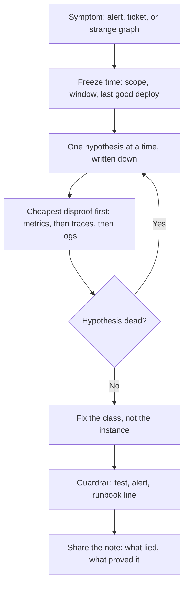

# Developer Experiences

## Youtube

- [7 Things I WISH I Knew Before Becoming a Backend Engineer](https://www.youtube.com/watch?v=KYCbhFyyWbA)

## Theory

This page collects hard-won career lessons from experienced backend engineers.
It covers what practitioners wish they had known earlier: technical depth, system thinking, communication, and career habits.
Key subtopics: backend engineering realities, avoiding common early-career mistakes, and growing with intent.

## Theory continues

This page turns the career lessons above into a complete field manual for
backend engineers who own production systems. The video gives you what to believe
about depth, system thinking, communication, and habits. What remains is how to
practice it under pressure: how to debug when logs lie, how to act when the site
is down, how to review code so defects never ship, how to survive on-call without
burning out, and how to turn all of it into stories that pass senior interviews.

Think of backend craft as decision throughput for production, the same way the
wisdom guide treats wisdom as decision throughput for a whole life. Juniors
optimize a function, mid-levels optimize a service, seniors optimize the failure
graph: which assumptions get checked first, which dashboards get read before logs,
which reviews catch the race condition, and which runbooks let a tired human act
safely at 3 a.m. Interviews test whether you can move between all three
altitudes: name a principle, show it in a shipped fix, and tell it as an honest
story about confusion and repair.

### 1. Topics Covered

1. [Debugging Stories Three War Stories That Teach Method](#2-debugging-stories-three-war-stories-that-teach-method)
2. [Incident Lessons What Outages Teach That Tests Cannot](#3-incident-lessons-what-outages-teach-that-tests-cannot)
3. [Review Craft How to Give and Get Useful Reviews](#4-review-craft-how-to-give-and-get-useful-reviews)
4. [On-Call Survival Staying Calm and Effective When Paged](#5-on-call-survival-staying-calm-and-effective-when-paged)
5. [Habits Small Practices That Compound Over Years](#6-habits-small-practices-that-compound-over-years)
6. [Interview Questions and Answers](#7-interview-questions-and-answers)

Each numbered item links to the matching section below. Headings use plain words so every anchor resolves on GitHub preview.

### 2. Debugging Stories Three War Stories That Teach Method

Debugging is where backend reputation is built. Anyone can write a handler that
passes on a quiet afternoon. The engineer who stays useful is the one who can
find the lie in a calm dashboard, a green build, and a confident assumption at
the same time. The three stories below are composites of real backend war rooms.
Each starts with a misleading symptom, follows a method instead of a hunch, and
ends with a guardrail that prevents the whole class of bug.

- **The cache that hid a deploy:** a checkout service started returning stale
  prices for ten percent of users an hour after a routine release. Dashboards were
  green, error rates flat, p99 latency actually improved. The first theory was a
  bad CDN rule, the second was a sticky session bug. Both were wrong because both
  trusted the fastest signal. The fix came from asking what changed in time rather
  than in space: the deploy had added a new price field but the cache key did not
  include schema version, so old app servers wrote and new app servers read the
  same key with different shapes. Rolling back the code kept the poisoned keys
  alive, which is why the rollback seemed to fail. The real repair was versioning
  the key, flushing the affected namespace in slices, and adding a deploy check
  that compares cache schema before marking instances healthy. Lesson: version
  every shared byte, and distrust any rollback that does not clear derived state.
- **The connection leak that looked like a traffic spike:** an API tier showed
  CPU climbing every evening, autoscaling added hosts, latency still grew, and the
  team nearly bought bigger instances. Logs showed timeouts to Postgres, so the
  database took the blame for a week. A midnight trace finally showed the pool
  exhausted while the database sat idle: a new reporting path opened transactions
  and returned early on one error branch without rollback or close, leaking one
  connection per bad request. Evenings had more bad requests, so evenings looked
  like load growth. The fix was three lines in a finally block plus a pool-exhaustion
  alert on waiting-thread count, a checkout timeout, and a test that asserts
  every transaction path closes. Lesson: measure the pool before blaming the
  database, and make resource cleanup syntactically unavoidable rather than
  morally expected.
- **The clock skew that broke exactly-once:** an order pipeline emitted duplicate
  charges for eleven minutes, only for merchants in one region, only on retries.
  Idempotency keys were present, dedupe tests passed, and replaying events locally
  showed no bug. The culprit was a five-second clock skew between two workers plus
  a dedupe window evaluated in local time: the second worker believed the first
  write had expired and re-inserted the same key. Local replay hid it because both
  branches shared one clock. The repair moved expiry comparison to the database
  clock, stored timestamps in UTC with monotonic sequence fallback, added skew
  monitoring with NTP offset alerts, and added a multi-clock chaos test that runs
  the dedupe path with skewed fakes. Lesson: never compare times across machines
  without a single source of truth, and test distributed invariants with more than
  one clock.

How a disciplined debug actually flows:

The flow above is the whole method. Freezing time stops the habit of debugging
the present instead of the change. One written hypothesis stops three engineers
chasing three theories in one thread. Cheapest disproof first protects the
production database from exploratory queries at midnight. Fixing the class means
the key gets versioned, the pool gets a finally block, the clock gets a single
owner. Sharing the note turns one late night into team immunity.

Practical rules that follow:

- Write the hypothesis and the disproof before running the next query.
- Check deploy, config, and derived state before blaming traffic or hardware.
- Close every debug with a test plus an alert plus one runbook sentence.

### 3. Incident Lessons What Outages Teach That Tests Cannot

Incidents are where method meets teamwork. Debugging finds the bug, incident
response protects users and trust while the bug is still alive. The habits that
matter are unglamorous: declare early, assign one commander, narrate in one
channel, mitigate before root-causing, and write the retro that prevents the
second occurrence. Teams that practice these look slower in the first ten minutes
and finish hours earlier.

| Incident | Misleading signal | Real cause | Lesson and guardrail |
|---|---|---|---|
| Deploy with poisoned cache | Green dashboards, better p99 after release | Unversioned cache key across schema change | Version cache keys, add schema check to health gate |
| Evening latency climb | Timeout logs pointing at Postgres | Leaked connection on one error branch | Finally-block cleanup, alert on pool waiters not just CPU |
| Regional duplicate charges | Passing dedupe tests, clean local replay | Clock skew across workers with local-time expiry | Single-clock expiry, UTC plus sequence, skew alerts |
| Retry storm after partial outage | Autoscaling healthy, downstream recovering | Clients retrying with no backoff or jitter | Exponential backoff with jitter, circuit breaker, budget |
| Config push blacks out region | Code diff empty, last deploy days ago | Unreviewed flag default flipping behavior | Config changes reviewed and canaried like code deploys |
| Slow burn disk fill | No error spike, gradual latency growth | Unrotated access logs plus missing retention alert | Disk and inode alerts at 70 percent, rotation tested |
| Flapping health check cascade | All services red at once | Health endpoint depending on downstream dependency | Liveness checks local only, readiness checks downstream |

Living the table looks ordinary. Arjun gets paged for checkout errors, opens the
incident channel, declares commander, and pins scope plus start time in the first
message. He resists the urge to root-cause in the thread and instead asks for
mitigation options: shed the reporting traffic, open the breaker, pin the flag to
last known good. Latency recovers in twelve minutes while the leak hunt continues
off the critical path. His status updates go out every fifteen minutes in two
sentences, users see a holding page with honest wording, and the retro the next
day adds the pool-waiter alert and the finally-block test that would have caught
it a release earlier. Nobody is blamed, everybody learns the same lesson at once.

Severity discipline keeps small fires small:

- **SEV1 full outage or data risk:** page immediately, commander plus comms lead,
  mitigate first, retro within forty-eight hours with owners and dates. Revenue or
  trust is burning; speed of mitigation beats elegance of diagnosis every time.
- **SEV2 degraded path or major feature broken:** work in the incident channel,
  timebox diagnosis to thirty minutes before forcing a mitigation such as rollback,
  flag flip, or traffic shift. Partial pain spreads fast when retries pile on.
- **SEV3 annoyance with workaround:** ticket it with scope, graph, and last good
  change attached, fix in working hours, still write the one-paragraph retro note.
  Today's annoyance is next quarter's SEV1 when traffic doubles.

A retro worth keeping answers five questions in one page: what users felt and for
how long, the timeline of detection plus mitigation plus resolution, the root cause
stated without names, the three contributing factors such as missing alert, risky
default, or untested branch, and the action items with one owner and one date each.
If an action lacks an owner it is a wish. If it lacks a date it is a rumor.

Practical rules that follow:

- Mitigate first, root-cause second; stop user pain before satisfying curiosity.
- One commander, one channel, one timeline; parallel threads create parallel truths.
- Every incident ends with a test, an alert, and a runbook line with an owner.

### 4. Review Craft How to Give and Get Useful Reviews

Code review is the cheapest incident prevention a backend team owns. A careful
twenty minutes catches the race, the leak, and the ambiguous flag that would cost
a midnight page. Good review culture reads as kindness with standards: fast
responses, specific comments, praise for the subtle fix, and refusal to wave
through code nobody understands. Reviews also teach system thinking faster than
any course because every diff is a small design proposal with real stakes.

What careful reviewers actually check:

- **Correctness before style:** read the logic path first, then the error paths,
  then the naming. A misplaced retry or an unchecked nil matters more than import
  order. Say what you verified, for example replayed the failure branch mentally
  or checked the caller count, so the author trusts the approval means something.
- **Concurrency and ordering assumptions:** ask what happens with two requests at
  once, a retry during a deploy, or messages arriving out of order. Race conditions
  hide behind tests that run serially. Request an execution trace or a stress note
  whenever shared state, counters, or dedupe keys appear in the diff.
- **Failure and rollback behavior:** ask how this fails and how it un-fails. Does
  it time out, back off, emit a metric, leave partial state. Can it be reverted
  without clearing caches or hand-editing rows. A diff without a rollback story is
  a deploy hope, not a deploy plan.
- **Observability and operability:** require a log line at the decision point, a
  metric on the new branch, and a dashboard or alert reference when behavior
  changes. Code that cannot be seen in production cannot be owned in production.
  The reviewer should be able to describe how on-call will notice this breaking.
- **Scope and reversibility:** push for small diffs that do one thing and can be
  reverted independently. A five-hundred-line diff mixing refactor plus behavior
  plus config cannot be reviewed honestly. Ask the author to split it, and offer
  to review the first slice immediately so smallness gets rewarded with speed.
- **Kindness with precision:** comment on the code, suggest the fix, explain the
  why with a link or example. Prefer questions for judgment calls and directives
  for safety violations. Approve with nits clearly marked so the author knows what
  blocks and what merely polishes.

Getting reviewed well is a skill of its own. Describe the why in the PR body in
three lines: problem, approach, risk and rollback. Keep diffs under three hundred
lines, separate refactor from behavior, and call out the parts you are unsure of
so reviewers spend attention where it matters. Respond to every thread, push back
with evidence when you disagree, and thank the reviewer who finds the bug you
missed. The engineer who receives review gracefully gets more of it, which is
exactly the compounding junior engineers need most.

Practical rules that follow:

- Review within one working day; stale reviews teach authors to merge without you.
- Never approve code you cannot explain back in two sentences.
- Every approval implies a rollback story plus a way to see it fail.

### 5. On-Call Survival Staying Calm and Effective When Paged

On-call is the backend rite of passage nobody passes in a classroom. The pager
goes off at 3 a.m., the dashboard is red in three places, the runbook is six
months stale, and the Slack thread already has four theories. Survival is not
heroism. It is a short checklist executed calmly: acknowledge, assess user impact,
mitigate, escalate early, and protect the timeline so the morning retro has facts
instead of folklore. Engineers who do this look boring during outages, which is
the highest compliment on-call offers.

What steady on-call looks like in practice:

- **Prepare before the rotation starts:** read the top five alerts, run the
  runbook commands in staging, save dashboard links and rollback steps where a
  half-asleep human can find them. Know who owns the database, the CDN, and the
  feature flags by name. Preparation done on Monday buys calm on Saturday night,
  and the new joiner who shadows one rotation with questions asked out loud
  becomes the reliable responder two rotations later.
- **Triage by user pain first:** ask how many users are affected, whether data is
  at risk, and whether the graph is still getting worse. A full checkout outage
  outranks a slow admin page even when the admin page pages louder. State the
  severity out loud in the first five minutes so five engineers do not run five
  different playbooks. Downgrade fast when the blast radius proves small.
- **Mitigate with the blunt tool, fix with the sharp one:** stop the bleeding
  with rollback, flag flip, traffic shift, or load shed before hunting the root
  cause. A restart that restores checkout in four minutes beats a perfect diagnosis
  delivered after forty minutes of downtime. Record what was mitigated and when,
  then move diagnosis off the urgent path so curiosity stops extending the outage.
- **Narrate in one place on a cadence:** keep the incident channel as the single
  source of truth, update every fifteen minutes with what changed and what is next,
  and pin the timeline message. Narration prevents duplicate work, calms managers
  who would otherwise call for status, and writes half the retro by itself. Quiet
  heroes who fix silently in direct messages leave the team blind and the timeline
  full of gaps.
- **Escalate early without guilt:** page the database owner, the senior, or the
  second responder the moment impact is unclear or mitigation stalls past fifteen
  minutes. Early escalation is competence, not failure. State what you know, what
  you tried, and what help you need in three lines so the fresh brain lands
  running instead of re-reading an hour of scroll.
- **Protect sleep and handoff like production:** keep the phone audible and the
  laptop charged, silence non-urgent channels during sleep hours, and hand off
  with a written note covering active risks, recent deploys, and watch items. A
  rotation that ruins two weeks of sleep produces the next incident by exhaustion.
  Trade shifts openly, log the hours honestly, and raise sustained overload as a
  staffing gap rather than absorbing it as dedication.

Meera's quiet night shows the posture. Paged for rising 5xx on payments, she
acknowledges in two minutes, checks the error budget burn and the last deploy,
and sees the new retry policy coinciding with downstream slowness. She flips the
flag to the old policy, errors fall, then she pages the service owner with the
graph and the flag name attached. Her channel updates are three lines each, her
handoff note names the suspect policy and the follow-up ticket, and she is back
asleep in thirty minutes. No heroics, no mystery, just a method run while tired.

Practical rules that follow:

- Acknowledge in minutes, state severity in five, mitigate before diagnosing.
- Never debug silently; narrate every mitigation in the incident channel.
- Hand off every shift in writing; tired memory is not a runbook.

### 6. Habits Small Practices That Compound Over Years

Careers are built from unremarkable days repeated with intent. The engineers from
the video who speak of depth, system thinking, communication, and habits are
describing the same loop: learn a little, ship a little, write it down, share it
once, rest honestly. None of these habits impresses in a week. Over five years
they separate the engineer who has one year of experience five times from the one
with five years of compounding judgment.

Habits that pay backend interest:

- **Write the note the future you needs:** keep a daily log of decisions, error
  messages that lied, commands that saved the night, and links that explained the
  subsystem. Five lines a day beats a heroic wiki weekend. The log becomes the
  retro evidence, the promotion packet, and the interview story bank without extra
  effort, because memory fades but the note keeps the timestamp.
- **Read production before reading opinions:** spend fifteen minutes weekly with
  real dashboards, slow-query logs, and support tickets for your own service. Know
  its top three endpoints by traffic, its p99 by hour, and its noisiest error this
  week. Engineers who watch their system develop smell for trouble that framework
  debates never teach, and their design proposals cite graphs instead of slogans.
- **Finish one depth bet per quarter:** pick networking, Postgres internals,
  concurrency, or distributed retries and study it past tutorial level with a thin
  book plus a small experiment on your own service. Depth bets stack: the quarter
  spent on TCP retransmits pays off in every future timeout debate, and the quarter
  spent on indexing pays off in every slow query review for years.
- **Teach once to learn twice:** give the lunch talk, write the runbook page,
  mentor the intern through their first incident shadow. Teaching exposes the gaps
  in your own model faster than any exam, and it builds the sponsorship network
  that carries promotions. The engineer who explains the breaker pattern clearly
  is the one trusted to add it to checkout next.
- **Guard energy like an SLO:** protect sleep, exercise, and real time off with
  the same seriousness as error budgets. Block the morning deep-work hour before
  meetings colonize it, end days on easy tasks so shutdown is clean, and take the
  full vacation so the quarter stays sustainable. Burnout does not produce senior
  judgment; rested repetition does.
- **Ask for feedback on a schedule:** request one specific critique per month,
  for example clarity of incident updates or rigor of estimates, from a reviewer,
  lead, or on-call buddy. Vague annual feedback arrives too late to act on.
  Monthly specifics compound into the communication and system-thinking growth the
  video veterans all name as the real unlock.

Practical rules that follow:

- Log five lines daily; review the week every Friday with coffee.
- One depth bet per quarter, one taught lesson per month, full rest every night.
- Measure habits by streaks kept, not intensity promised.

### 7. Interview Questions and Answers

1. **Tell me about the hardest production bug you debugged. How did you find it?**
   Pick the cache, pool, or clock story above and tell it in four beats: misleading
   symptom, written hypothesis, cheapest disproof that broke the theory, and the
   guardrail added. Name what lied and what proved it, such as pool-waiter metrics
   over CPU graphs. Close with the test plus alert plus runbook line left behind.
   Signal method over brilliance: calm sequencing that any tired teammate could follow.
2. **Walk me through an incident you handled. What did users feel and what did you do first?**
   Set severity and user impact in the first sentence, then describe mitigation
   before diagnosis: flag flip, rollback, or shed load with the time it took. Show
   the narration cadence and the escalation call made without guilt. End with the
   one-page retro and the owned action items. The passing signal is user-first
   ordering plus written follow-through, not solo heroics.
3. **How do you give a difficult code review without slowing the team down?**
   Describe reviewing within a day, leading with the safety issue, suggesting the
   fix with an example, and marking nits clearly. Give the concurrency or rollback
   question you asked that caught a real defect. Emphasize kindness with precision:
   questions for judgment, directives for safety, praise for the subtle correctness
   others would miss. Speed with standards is the message.
4. **Tell me about a time you were on-call and paged at night. What happened?**
   Narrate the acknowledge, triage, mitigate, escalate, handoff sequence from the
   Meera example with your own details. State the severity call, the blunt
   mitigation chosen, and the sleep-preserving handoff note. Show you can act
   safely while tired and leave the system plus the team better by morning.
5. **Describe a disagreement with a teammate about design or scope. How did you resolve it?**
   Choose a retry policy, schema change, or estimate dispute. Explain the direct
   conversation the same day, the data brought such as graphs or failure cases, and
   the written decision with owner and date. Show the short-term friction accepted
   to avoid the outage or slip. Candor with a record is the hire signal.
6. **How do you estimate backend work so dates hold? Give an example.**
   Walk through gut estimate plus named buffers for design, review, test data, and
   operational surprises, citing a three-day task quoted as five. Tell how the first
   buffer burn was reported early with a scope option attached. Transparency under
   uncertainty keeps trust even when the buffer gets spent, and early signal beats
   late precision.
7. **How have you grown technically in the last year? What did you study deeply?**
   Name one depth bet such as Postgres locking, retry budgets, or TCP behavior, the
   thin book finished, and the experiment run against your own service. Connect it
   to a shipped change such as an index, a breaker, or a timeout fix. Sustainable
   curiosity with applied proof reads senior; tutorial tourism does not.
8. **Why do you want this backend role, and what will you own in the first ninety days?**
   Connect their stack to your habits: dashboards read weekly, runbooks improved,
   reviews tightened, one depth bet aligned to their hardest problem. Propose
   listening first through tickets and on-call shadows, then owning one reliability
   win such as flaky alert cleanup or slow-query fix. Curiosity plus ownership with
   a concrete starter plan closes the loop on every lesson above.