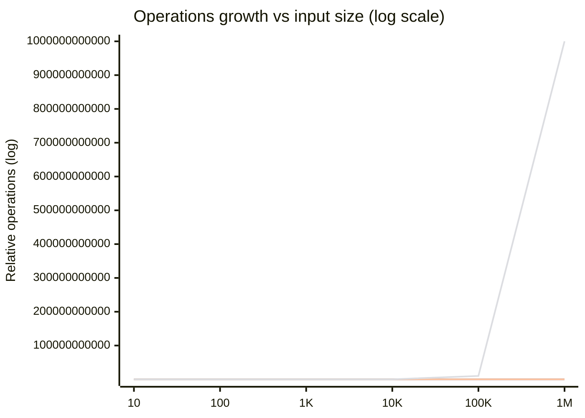
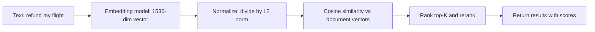

# Maths for Developers


## Youtube

- [Math Every Programmer ACTUALLY Needs](https://www.youtube.com/watch?v=mzw3P3np_pc)


## Theory

This page covers the math backend and AI developers actually use: arithmetic that shows up in
capacity planning, complexity analysis that decides whether a design survives production load,
statistics that make latency SLOs and experiments meaningful, and linear algebra intuition that
makes embeddings, rankings, and ML systems legible without a PhD.
It spans binary numbers, exponents, logarithms, factorials, modular arithmetic, mean and median,
randomness and entropy, and vectors — the nine stub topics — rebuilt as interview-ready tools.

This guide turns that stub into a complete reference for backend and system-design interviews.
You will learn to estimate cost with Big-O and back-of-the-envelope arithmetic, to read p50/p99
and distributions without fooling yourself with averages, to reason about vectors and matrices
as data transformations, to verify every claim with small NumPy programs, and to avoid the
classic numerical traps — overflow, float error, modulo bias, and stale percentile math — that
cause real outages and wrong experiment reads.
No advanced math background is assumed; every formula is tied back to code you can run.

Think of this math as the observability layer for engineering decisions. Complexity tells you
whether a design scales, statistics tells you whether a measurement means anything, and linear
algebra tells you what an ML model is doing geometrically. Backend interviews test whether you
can move between all three: size a cache with exponents, defend a p99 SLO with distributions,
and explain a cosine-similarity ranking with vectors.

### 1. Topics Covered

1. [Complexity and Big-O](#2-complexity-and-big-o)
2. [Statistics p50 p99 and Distributions](#3-statistics-p50-p99-and-distributions)
3. [Linear Algebra Intuition](#4-linear-algebra-intuition)
4. [Python Examples with NumPy](#5-python-examples-with-numpy)
5. [Gotchas and Numerical Pitfalls](#6-gotchas-and-numerical-pitfalls)
6. [Tools and Ecosystem](#7-tools-and-ecosystem)
7. [Interview Questions and Answers](#8-interview-questions-and-answers)

Each numbered item links to the matching section below. Headings use plain words so every anchor resolves on GitHub preview.

### 2. Complexity and Big-O

Big-O describes how cost grows with input size `n`, ignoring constants and lower-order terms.
It answers the only question that matters at scale: when `n` goes 10x, does cost go 2x, 10x,
100x, or explode. Backend work lives in this question — list scans, index lookups, joins,
caches, queues, and retries all have a growth curve, and picking the wrong curve is how a
service that flies in staging falls over on launch day.

Start with arithmetic intuition because complexity is just counting with exponents and logarithms:

- **Binary numbers:** every bit doubles the range. `k` bits represent `2^k` values. That is why
  a 32-bit unsigned int tops out at about 4.29 billion, why 64 IDs feel infinite until you do
  birthday-math, and why flags, bitmasks, Bloom filters, and CIDR prefixes all speak powers of two.
  Shifting left by one is multiply by two; shifting right is floor-divide by two.
- **Exponents:** repeated multiplication. `2^10 = 1024`, `2^20 ~ 1M`, `2^30 ~ 1B`, `10^9` is the
  scale where O(n^2) dies. Doubling growth eats hardware fast: 30 doublings turn 1 into a billion.
  Retries with exponential backoff, SSTable fan-out, and viral queue growth all follow this curve.
- **Logarithms:** the inverse of exponents. `log2(n)` asks how many times you can halve `n` before
  reaching 1. `log2(1M) ~ 20`, `log2(1B) ~ 30`. Every balanced tree, binary search, and LSM level
  is logarithmic because each step discards a fraction of the problem. Log scale is also how you
  read latency graphs without panicking over noise.
- **Factorials and combinatorics:** `n!` grows faster than exponential and counts orderings. Five
  services have 120 call orders; ten have 3.6 million. Permutations (`nPk`) and combinations
  (`nCk`) bound brute-force search, test matrices, and feature-flag interactions. When someone
  proposes trying all orderings, factorial math is your veto.
- **Floor division and modular arithmetic:** `//` and `%` partition work. Sharding (`hash % N`),
  ring hashes, round-robin, pagination (`offset // page_size`), and even-odd checks all rest on
  modular structure. Key facts: `(a + b) % m` composes cleanly, division needs a modular inverse
  that only exists when coprime, and negative modulo differs by language — Python returns
  non-negative, Java and Go can return negative, which breaks naive sharding.
- **Back-of-the-envelope arithmetic:** combine the above into Fermi estimates. `86,400` seconds
  per day, `~30M` seconds per year, `1 KB ~ 10^3`, `1 MB ~ 10^6`, `1 GB ~ 10^9`. A service at
  1,000 RPS with 1 KB responses serves ~86 GB per day. At 10 ms per query, one core handles ~100
  QPS, so 5,000 QPS needs ~50 cores before replication. Interviews reward this fluency more than
  exact answers.

Formal Big-O in one pass:

- **Definition:** `f(n)` is `O(g(n))` if beyond some `n0`, `f(n) <= c * g(n)` for a constant `c`.
  It is an upper bound on growth, not an exact timer. `O(1)` means bounded regardless of `n`;
  `O(log n)` means halving progress; `O(n)` scans; `O(n log n)` sorts and builds indexes;
  `O(n^2)` nests loops; `O(2^n)` and `O(n!)` exhaustively search.
- **Best, average, worst:** hash lookup is `O(1)` average but `O(n)` worst when every key collides.
  Quicksort is `O(n log n)` average, `O(n^2)` adversarial. SLOs care about worst and tail, so quote
  worst-case for capacity and average-case for cost, and name the adversary that triggers the worst.
- **Amortized:** an operation that is occasionally expensive but cheap on average, like dynamic-array
  append (`O(1)` amortized despite `O(n)` resizes) or LSM compaction. GC pauses and vector growth
  follow the same logic: rare spikes inside a cheap average, which is exactly what p99 exposes.
- **Space complexity:** time gets attention, memory decides feasibility. A hash index is `O(n)` space
  for `O(1)` lookup; an `n x n` similarity matrix is `O(n^2)` space and dies at 1M rows. Streaming,
  sketching (HyperLogLog, Count-Min), and pagination trade accuracy or passes for sublinear memory.
- **Hidden constants:** Big-O drops constants that dominate at small `n`. An `O(n)` scan over a
  contiguous array beats an `O(log n)` tree with pointer hops until `n` is large, because cache
  lines and branch costs live in the constant. Always ask what `n` actually is before optimizing.

| Complexity | Growth when n 10x | Example in backend work | Scales to 1B? |
|---|---|---|---|
| O(1) | Same cost | Hash lookup, cache hit, flag check | Yes |
| O(log n) | Adds ~3 steps | B-tree index, binary search, balanced set | Yes |
| O(n) | 10x cost | Full scan, ETL pass, log replay | Yes with streaming |
| O(n log n) | ~13x cost | Sort, index build, merge join | Yes with batching |
| O(n^2) | 100x cost | Nested-loop join, all-pairs compare | No beyond ~100K |
| O(2^n) | Astronomically worse | Subset search, exact TSP | No beyond ~40 |
| O(n!) | Worse than exponential | Permutation brute force | No beyond ~12 |

Use this table to answer can this query survive growth: name the `n`, name the curve, multiply by
10, and check the third column. A nested-loop join over 1M rows is 1T comparisons — dead on arrival —
while a B-tree lookup over 1B rows is ~30 hops and boring. That contrast is the whole interview answer.

Complexity visualized as growth curves looks like this:



The chart above plots constant, logarithmic, linear, and quadratic curves on shared axes. Constant
stays flat, logarithmic climbs in stairs, linear tracks `n`, and quadratic explodes off the chart
by `100K` — which is why reviewers ask is there a nested loop hiding here.

Practical rules that follow:

- Index the lookup path so hot reads are `O(log n)` or `O(1)`; leave scans for offline jobs.
- Bound fan-out: one request spawning `n` sub-requests turns an `O(n)` endpoint into `O(n^2)` load.
- Page, stream, and cursor through large sets; never materialize `O(n)` rows into one response.
- Cache the repeated subproblem (memoize, materialize, precompute) when the same `O(n)` work recurs.
- Load-test at 10x current `n` and compare against the predicted curve; divergence means a hidden
  quadratic such as retry storms or lock contention.

### 3. Statistics p50 p99 and Distributions

Averages lie about production. A service with 50 ms average latency can still breach its SLO if
1 percent of requests take 5 seconds, because users remember the slow ones and retries amplify
them. Statistics for backend work is therefore tail-first: summarize the whole distribution,
defend percentiles in SLOs, and know which distribution shape you are looking at before you
average anything.

Mean, median, and mode answer different questions:

- **Mean (average):** sum divided by count. Sensitive to every outlier, which makes it the right
  measure for totals (total cost equals mean cost times count) and the wrong measure for typical
  experience. One 10-second timeout among a hundred 50 ms requests drags the mean to ~150 ms even
  though 99 percent of users saw 50 ms. Report means for capacity math, never alone for latency.
- **Median (p50):** the middle value when sorted — half of samples are faster, half slower. Robust
  to outliers, so it describes the typical request well. But typical is not the SLO: a great p50
  with a terrible p99 means half your users are happy and enough are furious to page you.
- **Mode:** the most common value. Useful for discrete outcomes (most common status code, most
  common shard key) and for spotting bimodal behavior where mean and median both sit in a valley
  nobody actually experiences.
- **Variance and standard deviation:** variance is mean squared deviation from the mean; standard
  deviation is its square root, back in original units. A 100 ms mean with 10 ms stddev is stable;
  the same mean with 200 ms stddev is a coin flip. Track stddev over rolling windows to catch
  regressions the mean hides, and use coefficient of variation (stddev divided by mean) to compare
  jitter across endpoints with different baselines.

Percentiles are the SLO vocabulary:

- **Definitions:** p50 is the median; p90, p95, p99 mean 90, 95, 99 percent of samples fall at or
  below the value. p99.9 (often written p999) and p99.99 matter for multi-hop paths because tails
  compound: ten sequential hops each with 99 percent success yield ~90.4 percent end-to-end success.
- **How they are computed:** sort samples, pick the rank. Nearest-rank takes `ceil(p/100 * n)`;
  linear interpolation blends adjacent ranks for smoother values. Small samples make high
  percentiles meaningless — p99 over 50 requests is just the max with a fancy name. Rule of thumb:
  you need at least ~100x samples for a stable percentile (1,000 requests for p99, 100,000 for p999).
- **Tail math at scale:** 1 percent sounds small until multiplied. At 1,000 RPS, p99 violations hit
  10 users per second, 864,000 per day. At 1M daily active users, a p99.9 bug still hits 1,000 users
  daily. That is why SLOs pair a percentile with a window: 99.9 percent of requests under 300 ms
  over 30 days, with error budgets and burn-rate alerts attached.
- **Histograms over single numbers:** Prometheus histograms, HDRHistogram, and DDSketch record the
  shape, not just one percentile, so you can recompute any quantile later and see bimodality. Emit
  histogram buckets at the source; averaging pre-aggregated percentiles across hosts is invalid math
  because percentiles do not compose by averaging.

Distributions tell you which tool applies:

| Distribution | Shape and signature | Where it appears | What to do |
|---|---|---|---|
| Normal (Gaussian) | Symmetric bell around mean | Measurement noise, benchmark repeats | Mean plus stddev summarizes well |
| Log-normal / long-tail | Bulk fast, tail stretches right | RPC latency, response sizes, job durations | Quote p50/p99, plot log scale |
| Exponential | Memoryless gaps between events | Inter-arrival times, failure gaps | Model with rates, expect bursts |
| Poisson | Counts of events per interval | Requests per second, errors per minute | Size queues and rate limits |
| Zipf / power-law | Few hot keys, long cold tail | Key popularity, follower counts, word freq | Cache top-K, shard hot keys |
| Uniform | Every value equally likely | Hash outputs, jitter, sampling | Use for spreading and dedup checks |
| Bimodal | Two humps, valley in middle | Cache hit vs miss, cold vs warm start | Split by path, never average together |

- **Latency is log-normal, not normal:** most requests cluster near the fast path while GC pauses,
  cold starts, cross-AZ hops, and disk reads stretch a long right tail. Plotting latency on a linear
  axis hides this; plot log-scale axes or CDF curves so the tail is visible. Alert on p99 movement,
  investigate with trace exemplars from the slow bucket.
- **Arrivals are Poisson-ish:** independent users produce roughly Poisson arrivals — bursty at short
  windows, smooth over long ones. Provision for bursts (token buckets, bounded queues, autoscale on
  queue depth), not just the minute-average RPS. Queueing theory then bites: utilization above ~70
  percent turns small arrival variance into large wait variance.
- **Popularity is Zipfian:** the top 1 percent of keys often serve 50+ percent of traffic. That skew
  is why a small LRU wins big, why one hot shard melts, and why consistent hashing plus hot-key
  replication (read replicas, request coalescing, negative-result caching) beats uniform sharding.
- **Randomness and entropy:** `random()` in most languages is a deterministic PRNG — fine for jitter,
  sampling, and tests with a fixed seed, but predictable. Tokens, session IDs, password resets, and
  anything adversarial need a CSPRNG (`secrets` in Python, `crypto/rand` in Go, `SecureRandom` in
  Java). Entropy matters numerically too: 64 random bits make collisions negligible until ~5B IDs
  by birthday math (`sqrt(2^64) ~ 4.3B`), while 32 random bits collide after ~77K IDs. Never take
  `% n` over a small PRNG range for sharding without checking modulo bias; prefer library `choice`
  or rejection sampling.
- **Experiment intuition:** an A/B read needs a null hypothesis, a minimum detectable effect, and a
  fixed sample size computed up front. Peeking daily and stopping at the first green p-value inflates
  false positives dramatically. Report conversion with Wilson or bootstrap confidence intervals, not
  point estimates, and segment by the randomization unit. Watch for Simpson's paradox (a variant wins
  in every segment but loses overall because segments are imbalanced) and novelty or seasonality effects.

Practical rules that follow:

- SLO on percentiles (p95/p99 latency, p99.9 availability), capacity-plan on means and totals.
- Keep histograms at the edge; never average percentiles across instances — aggregate histograms first.
- Size buffers and timeouts from the tail (p99 plus headroom), not from the median.
- Distrust any average over a bimodal or Zipfian mix; split by path or key first.
- Fix experiment sample size before launch; call no winner before it is reached.

### 4. Linear Algebra Intuition

Linear algebra is the geometry of ML-backed backends: search relevance, recommendations, fraud
scoring, and LLM features all reduce to vectors moving through matrices. You rarely hand-derive
proofs on the job, but interviews expect geometric intuition — what a vector means, what a matrix
does, and why cosine similarity ranks results — plus awareness of cost, because every extra
dimension multiplies storage and compute.

Vectors as data with direction and size:

- **What a vector is:** an ordered list of numbers, written `[0.2, -1.1, 3.0]`, that you can read
  two ways. Algebraically it is a row in a table (user age, purchase count, session minutes).
  Geometrically it is an arrow from the origin to a point, with a direction (which way it points)
  and a magnitude (how long it is). Embeddings use the second reading: `text-embedding-3-small`
  maps the sentence refund my flight to a 1,536-dimensional point, and nearby points mean similar.
- **Norms measure length:** L2 (Euclidean) norm is `sqrt(sum(x_i^2))` — the straight-line distance
  from the origin. L1 (Manhattan) norm is `sum(|x_i|)` — the grid-street distance. Normalizing a
  vector (dividing by its norm) projects it onto the unit sphere so only direction matters, which is
  exactly what cosine ranking wants. Regularization in training is norm pressure: L2 shrinks weights
  smoothly, L1 pushes them to zero and sparsifies.
- **Dot product measures alignment:** `a . b = sum(a_i * b_i) = |a| |b| cos(theta)`. Large positive
  means pointing the same way, near zero means orthogonal (unrelated), negative means opposite.
  That single number powers scoring: query vector dotted with each document vector ranks matches.
- **Cosine similarity normalizes alignment:** `cos(theta) = (a . b) / (|a| |b|)`, ranging from -1
  to 1 (0 to 1 for non-negative embeddings). Two long reviews and two short ones about the same
  topic score alike because length cancels out. This is the default ranking for embedding search,
  dedup detection, and candidate retrieval before a heavier reranker runs.
- **Euclidean distance measures gap:** `sqrt(sum((a_i - b_i)^2))`. Good for clustering and
  nearest-neighbor when magnitude matters (geo coordinates, usage profiles). For text embeddings,
  cosine usually beats Euclidean because verbosity should not equal relevance — normalize first and
  the two orderings often agree.

Matrices as transformations in bulk:

- **What a matrix is:** a rectangle of numbers that transforms vectors. A `3 x 1536` matrix turns a
  1,536-dimensional embedding into 3 class scores; a `768 x 768` attention projection rotates and
  rescales hidden states. Rows are output features, columns are input features, and each entry is
  how much one input moves one output.
- **Matrix-vector product is a weighted vote:** each output is a dot product of one matrix row with
  the input vector. A fully connected layer is just that vote plus a bias and a nonlinearity. Batch
  many inputs into a matrix-matrix product and GPUs/TPUs parallelize the votes — the reason inference
  servers batch requests instead of scoring one by one.
- **Transpose, identity, and inverse:** transpose flips rows and columns (`A^T`), turning row-layout
  into column-layout for the next multiply. Identity (`I`) is the do-nothing matrix with ones on the
  diagonal. Inverse (`A^-1`) undoes a transformation but rarely exists exactly in ML; least-squares
  and pseudoinverses solve the closest feasible undo, which is what regression and calibration do.
- **Rank and dimensionality:** rank is the number of independent directions a matrix preserves. A
  low-rank matrix compresses: 1M users times 100K items never materializes as a dense matrix because
  factorization keeps two thin matrices (users-by-64 and items-by-64) whose product approximates it.
  PCA, SVD, and embedding projections all trade a little accuracy for 100x less storage and compute.
- **Curse of dimensionality:** in high dimensions, random vectors are all nearly orthogonal and
  distances concentrate, so brute-force neighbor lists degrade. Mitigations are the standard stack:
  normalize, reduce dimensions, and index with ANN structures (HNSW, IVF) that trade recall for
  sublinear lookup — O(log n) graph hops instead of an O(n) scan over every embedding.



The flow above is the canonical embedding-search path. Raw text becomes a point in vector space,
normalization strips length so angle decides, a dot-product scan (or ANN index) scores candidates,
and only the top-K pay for expensive reranking or LLM grading. Quote it whenever an interview asks
how semantic search works end to end.

| Operation | Geometric meaning | Backend and AI use |
|---|---|---|
| L2 norm | Vector length | Normalize before cosine rank |
| Dot product | Alignment score | Retrieval and logit scoring |
| Cosine similarity | Angle between vectors | Semantic search, dedup |
| Euclidean distance | Straight-line gap | Clustering, geo features |
| Matrix multiply | Transform and mix features | Layers, projections, batching |
| Transpose | Swap rows and columns | Layout prep, attention scores |
| Low-rank factorization | Compress directions | Recsys, PCA, ANN prep |

Practical rules that follow:

- Normalize embeddings before cosine comparison; store them normalized to skip repeat work.
- Keep dimensions as small as accuracy allows — 256 dims at 4 bytes is 1 KB per vector, so 10M
  vectors need ~10 GB before index overhead; halving dims halves RAM and scan cost.
- Retrieve with ANN top-K, then rerank narrowly; never run an LLM grader over the full corpus.
- Log similarity score distributions, not just top-1 hits, so relevance regressions show up as
  distribution shifts instead of anecdotes.

### 5. Python Examples with NumPy

Every claim above is checkable in a few lines. The two programs below use only the standard
library plus NumPy, run anywhere, and print numbers you can quote. The first contrasts mean
versus percentiles on skewed latency; the second implements cosine ranking over toy embeddings
so the geometry from the previous section becomes concrete code.

Skewed latency: why the mean hides the tail:

```python
import numpy as np

# Simulate 10,000 RPC latencies in ms: fast path plus a slow 1 percent tail.
# Most requests cluster near 40-60 ms; GC pauses and cross-AZ hops stretch the rest.
rng = np.random.default_rng(42)
fast = rng.lognormal(mean=np.log(50), sigma=0.25, size=9900)
slow = rng.lognormal(mean=np.log(2000), sigma=0.4, size=100)
latency = np.concatenate([fast, slow])

mean = float(np.mean(latency))
p50, p95, p99 = (float(np.percentile(latency, q)) for q in (50, 95, 99))
print(f"samples: {len(latency)}  mean: {mean:.1f}ms  p50: {p50:.1f}ms  p95: {p95:.1f}ms  p99: {p99:.1f}ms")

# Capacity math uses the mean (total time = mean x count); SLOs use the tail.
total_s = float(np.sum(latency)) / 1000
print(f"total server time: {total_s:.1f}s for {len(latency)} requests")
print(f"requests slower than 1s: {int(np.sum(latency > 1000))} ({np.mean(latency > 1000) * 100:.1f}%)")

# At 1,000 RPS, that 1 percent tail is 10 slow users per second, 864,000 per day.
tail_fraction = float(np.mean(latency > 1000))
print(f"projected slow users per day at 1000 RPS: {tail_fraction * 1000 * 86400:,.0f}")
```

This example builds a log-normal mix with a 1 percent slow tail, then prints mean against p50,
p95, and p99. Expect the mean near 70 ms while p99 sits above a second: the mean averages the tail
away, the percentile names it. The closing projection multiplies the tail fraction by daily volume,
which is the one-line SLO argument that mean-only dashboards cannot make.

Cosine ranking over toy document embeddings:

```python
import numpy as np

# Toy 3-dim embeddings standing in for real 768-dim model output.
# Rows are documents; the query asks about flight refunds.
docs = np.array([
    [0.9, 0.1, 0.2],   # refund policy page
    [0.8, 0.3, 0.1],   # flight cancellation help
    [0.1, 0.9, 0.2],   # in-flight meal menu
    [0.2, 0.1, 0.9],   # baggage allowance
])
query = np.array([1.0, 0.2, 0.1])

def cosine(a: np.ndarray, b: np.ndarray) -> float:
    # Cosine similarity: dot product divided by both lengths, range -1..1.
    # Dividing out magnitudes means a long and short page on one topic score alike.
    return float(np.dot(a, b) / (np.linalg.norm(a) * np.linalg.norm(b)))

scores = np.array([cosine(query, d) for d in docs])
ranking = np.argsort(scores)[::-1]  # O(n log n) sort over n documents.
for rank, i in enumerate(ranking, start=1):
    print(f"{rank}. doc {i} score {scores[i]:.3f}")

# Batch form of the same math: normalize once, then one matrix-vector product.
normed = docs / np.linalg.norm(docs, axis=1, keepdims=True)
q = query / np.linalg.norm(query)
batch = normed @ q  # Each output is a row-dot-query vote, parallelized by BLAS.
print("batch scores:", np.round(batch, 3))
```

This example scores four documents against one query twice: once with an explicit per-document
loop that shows the formula, once with a single normalized matrix-vector product that shows the
production shape. Both print the same ordering with the refund pages on top. The loop is `O(n * d)`
plus an `O(n log n)` sort; the batch form keeps the same complexity with a far smaller constant
because one BLAS call replaces `n` Python iterations — the vectorization lesson from the CPU guide
applied to ranking.

### 6. Gotchas and Numerical Pitfalls

Math bugs rarely throw exceptions; they silently skew capacity plans, SLOs, and rankings. These
six cover the majority of production incidents rooted in arithmetic rather than logic.

- **Integer overflow and ID exhaustion.** 32-bit counters top out at ~4.29B unsigned and ~2.15B
  signed; millisecond timestamps exceed 32 bits; auto-increment PKs and inode counters run out
  faster than growth models assume. Symptoms: negative IDs, duplicate keys after wraparound, auth
  failures at the boundary. Fixes: 64-bit IDs and counters everywhere, UUIDv7 or Snowflake-style
  time-ordered IDs for distributed issuance, and an exhaustion forecast (current rate times headroom)
  reviewed like disk capacity. Test the boundary: insert `2^31 - 1` and watch what breaks.
- **Float precision and money math.** IEEE-754 doubles hold ~15-16 decimal digits; `0.1 + 0.2`
  prints `0.30000000000000004` because neither decimal is exact in binary. Equality checks on floats
  flake, accumulations drift, and float money rounds against the ledger. Fixes: integers for money
  (cents, micros), `Decimal` for tax and FX with explicit rounding modes, epsilon comparisons
  (`abs(a - b) < 1e-9`) for geometry, and compensated summation for long accumulations. Never store
  currency in `float` or `double`, even temporarily.
- **Percentile and average traps.** Averaging p99 across hosts is invalid — percentiles compose via
  histograms, not means. p99 over tiny windows is the max wearing a costume; require ~100x samples
  per percentile digit. Bimodal mixes (cache hit plus miss, warm plus cold start) average into a
  value nobody experiences — split by path first. And SLO compliance needs a window and a budget:
  99.9 percent without over 30 days is a slogan, not a target.
- **Sampling and modulo bias.** `rand() % n` favors low remainders whenever the generator range is
  not a multiple of `n`, skewing shards and A/B buckets. `Math.random` or `random.random` is
  deterministic and seed-guessable — fine for jitter and tests, fatal for tokens. Under-sampled
  tail metrics miss the very spikes they should catch. Fixes: library `choice`/`randrange` with
  rejection sampling, CSPRNG (`secrets`, `crypto/rand`) for anything adversarial, hashed sharding
  (`sha256(key) % N`) for stability across restarts, and jittered exponential backoff (`sleep =
  min(cap, base * 2^attempt) + uniform(0, base)`) so retries decorrelate instead of stampeding.
- **Stale statistics and skewed keys.** Averages computed once and cached go stale as traffic shifts;
  cardinality estimates from yesterday mis-size today's HyperLogLog; a Zipfian hot key melts the
  shard that uniform hashing assumed was safe. Fixes: rolling or decayed aggregates (exponential
  moving averages with published half-lives), periodic re-estimation of cardinality and key
  distributions, hot-key detection with per-key counters plus replication or request coalescing, and
  dashboards that plot the distribution (heatmap, CDF) instead of one line.
- **Complexity ambushes in innocent code.** An `O(n^2)` nested loop hides inside ORM N+1 queries,
  JSON serialization of deep graphs, string concatenation in a loop (`s +=` is quadratic in some
  runtimes — use join or builders), unbounded `IN` clauses, and retry storms where each failure
  spawns `n` more requests. Fixes: join or batch (`select_related`, `WHERE IN` with chunked bounds,
  DataLoader), paginate and cursor, bound fan-out and retry budgets (deadlines, circuit breakers,
  hedged requests with overall caps), and a load test at 10x asserting the predicted curve.

### 7. Tools and Ecosystem

- **NumPy and SciPy:** `numpy` for vectors, percentiles, and histograms (`mean`, `percentile`,
  `histogram`, `linalg.norm`); `scipy.stats` for distributions, confidence intervals, and
  hypothesis tests (`ttest_ind`, `kstest`, `wilson`). Reach for pandas only when labeled joins and
  group-bys earn the overhead; stay in NumPy for tight numeric loops.
- **Experiment and SLO tooling:** Statsig, GrowthBook, and Eppo for randomized experiments with
  fixed horizons and guardrails; Prometheus histograms plus Grafana heatmaps for tail-latency
  visibility; HDRHistogram and DDSketch client libraries for mergeable quantile sketches that make
  cross-host p99 math valid.
- **Embedding and vector search:** `sentence-transformers` and provider embedding APIs to produce
  vectors; FAISS, ScaNN, and pgvector (HNSW/IVF) for sublinear ANN retrieval; rerankers (cross-
  encoders, Cohere Rerank) for the narrow top-K pass. Track recall-vs-latency curves per index, not
  vibes, before choosing parameters.
- **Estimation and capacity:** `hey`, `k6`, and `ghz` for load generation to verify Big-O predictions
  against measured curves; Jupyter or Marimo notebooks for back-of-the-envelope models checked into
  the design doc; cloud pricing calculators to convert RPS times bytes into dollars per month.
- **Correctness guards:** property tests (Hypothesis) asserting sharding uniformity and percentile
  monotonicity; `Decimal` and integer-cents lint rules for money paths; chaos and boundary tests at
  `2^31 - 1`, empty inputs, and single-sample percentiles so edge math fails loudly in CI.

### 8. Interview Questions and Answers

1. **How do you estimate whether a design survives 10x growth?**
   Name `n`, name the dominant curve, and multiply. A B-tree lookup over 1B rows costs ~30 hops
   (logarithmic), a full scan costs 1B reads (linear), and a nested-loop join over 1M rows costs
   1T comparisons (quadratic, dead on arrival). Then convert to hardware: at 10 ms per query one
   core handles ~100 QPS, so 5,000 QPS needs ~50 cores before replicas. Finish with the check you
   would run: load-test at 10x and confirm measured cost tracks the predicted curve.

2. **Why do SLOs use p99 instead of the average?**
   The mean averages the tail away while users experience it directly: 1 percent slow at 1,000 RPS
   is 10 bad experiences per second. Percentiles name the tail — p99 says 99 percent of requests
   beat the bound — and multi-hop paths compound them, since ten 99 percent hops yield ~90 percent
   end-to-end. Add the validity rules: histogram at the source, never average percentiles across
   hosts, and require ~1,000 samples before quoting p99.

3. **Explain mean vs median vs mode with a latency example.**
   One hundred requests at 50 ms plus one 10-second timeout give a median of 50 ms (typical user),
   a mean near 150 ms (dragged by the outlier, correct for total server time), and a mode of 50 ms
   (most common bucket). Report the median for typical experience, the mean times count for capacity
   cost, and both plus p99 for the SLO story. If the distribution is bimodal — cache hits at 5 ms,
   misses at 300 ms — split by path because every aggregate lands in an uninhabited valley.

4. **What distribution shapes should a backend engineer recognize?**
   Latency is log-normal (fast bulk, long right tail — plot log scale, SLO the tail); arrivals are
   Poisson-ish (bursty short windows, provision for bursts with queues and autoscale); popularity is
   Zipfian (top keys dominate — cache top-K, replicate hot shards). Normal suits benchmark noise,
   uniform suits hashing and jitter, and bimodal means two mechanisms are mixed and must be split
   before any averaging.

5. **How do you read an A/B test without fooling yourself?**
   Fix the hypothesis, metric, minimum detectable effect, and sample size before launch; never peek
   and stop early. Randomize by the right unit (user, not request, for user-level effects), report
   Wilson or bootstrap confidence intervals instead of point lifts, and segment by platform or cohort
   to catch Simpson's paradox. No winner is declared before the planned sample size, and novelty plus
   seasonality get a full-cycle read.

6. **What are vectors and cosine similarity in embedding search?**
   An embedding is a point in vector space where direction encodes meaning; cosine similarity is the
   cosine of the angle between two vectors, `(a . b) / (|a| |b|)`, from -1 (opposite) to 1 (aligned).
   Normalizing strips length so a long and short page on one topic score alike. The pipeline is
   embed, normalize, ANN top-K by dot product, then rerank narrowly — cosine retrieval for recall,
   a heavier grader for precision.

7. **Why does dimensionality control vector-search cost?**
   Storage and scan cost scale with dimensions: 256 float32 dims are 1 KB per vector, so 10M vectors
   need ~10 GB before HNSW graph overhead. Higher dims also dilute distance contrast (curse of
   dimensionality), forcing larger indexes for equal recall. The standard answer is smallest dims
   that hold accuracy, normalized stored vectors, ANN (HNSW/IVF) for sublinear lookup, and a recall-
   vs-latency curve measured per workload rather than a default `efSearch` copied from docs.

8. **How do overflow, float error, and modulo bias bite in production?**
   32-bit IDs wrap past ~2.1B signed, turning keys negative or duplicated — use 64-bit and forecast
   exhaustion. Floats cannot represent `0.1` exactly, so money in float drifts — use integer cents or
   `Decimal`. `rand() % n` favors low remainders when the range is not a multiple of `n`, skewing
   shards — use library `choice` or rejection sampling, and a CSPRNG for anything adversarial. Each
   gets a CI boundary test so the math fails loudly before it bills quietly.

9. **Your p99 doubled but p50 is flat. How do you debug it?**
   Flat p50 with doubled p99 means the fast path is fine and a rare path regressed — treat it as a
   tail hunt, not a capacity event. Split the histogram by route, AZ, host, and cold-vs-warm to find
   the slow bucket, pull trace exemplars from it (GC pauses, cross-AZ hops, downstream timeouts,
   lock contention), and check deploy correlation plus retry amplification. Fix the slow path or shed
   it (timeouts, hedging, caching) rather than scaling the whole fleet for 1 percent of traffic.

