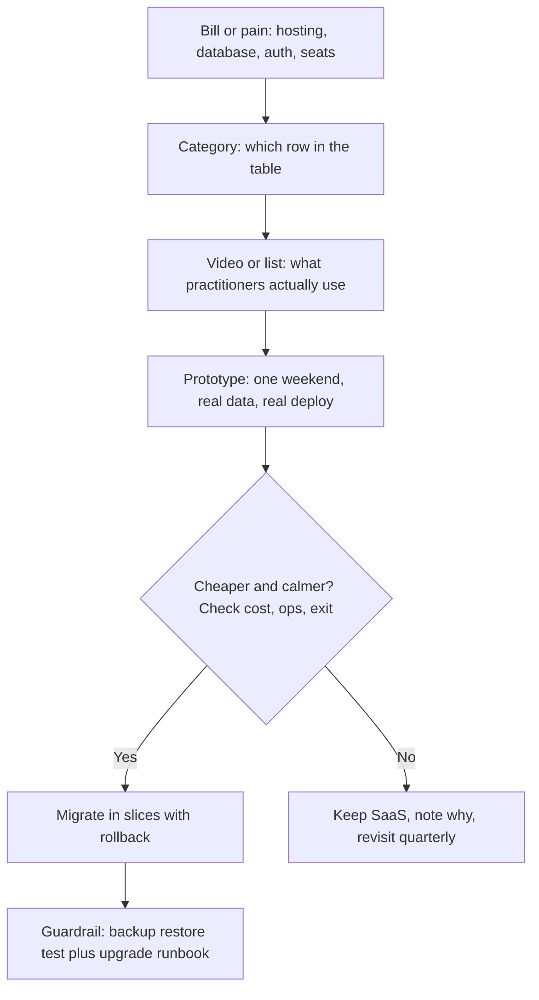

# Some open source tool

## Cloud Computing

- [linode](https://www.linode.com/)
- [aiven](https://aiven.io/)

## SaaS platform

- [pocketbase](https://pocketbase.io/)

## Youtube

- [Paying for software is stupid… 10 free and open-source SaaS replacements](https://www.youtube.com/watch?v=e5dhaQm_J6U)
- [How To Make AWS Not Suck](https://www.youtube.com/watch?v=gJmz31JywM0)
- [I tried 5 Firebase alternatives](https://www.youtube.com/watch?v=SXmYUalHyYk)

## Medium channels

- [Let's Code Future](https://medium.com/@letscodefuture)

## Medium blogs

- [Automated architecture diagrams](https://medium.com/thefork/automated-architecture-diagrams-53f538f615b7)
- [9 Best-In-Class New Tools for Software Developers](https://alex-omeyer.medium.com/9-best-in-class-new-tools-for-software-developers-c9a9bf0153b0)
- [9 Best-In-Class AI Tools Software Developers Need to Know for 2024](https://alex-omeyer.medium.com/9-best-in-class-ai-tools-software-developers-need-to-know-for-2024-d341e4840e34)
- [7 AI Tools Every Software Developer Needs to Know](https://alex-omeyer.medium.com/7-ai-tools-every-software-developer-needs-to-know-2023-361929746ec4)
- [Software Engineers: 8 Best AI Tools To Do Less Busy-Work in 2024](https://alex-omeyer.medium.com/software-engineers-8-best-ai-tools-to-do-less-busy-work-in-2023-746c42afa64b)
- [Engineering leads: 7 AI productivity tools for your devs to master in 2024](https://alex-omeyer.medium.com/engineering-leads-7-ai-productivity-tools-for-your-devs-to-master-in-2023-ccf980913c3e)
- [8 Best-In-Class Tools for Project Managers to Try in 2024](https://alex-omeyer.medium.com/8-best-in-class-tools-for-project-managers-to-try-in-2024-d0c11313e045)
- [6 AI Tools and Software Product Managers Should Know](https://alex-omeyer.medium.com/6-ai-tools-and-software-product-managers-should-know-4a273decda15)
- [100+ FREE Resources Every Web Developer Must Try](https://blog.stackademic.com/100-free-resources-every-web-developer-must-try-2fa9fa499ef5)
- [15 Time-Saving Websites Every Developer Needs](https://javascript.plainenglish.io/15-time-saving-websites-every-developer-needs-cf76ea19e430)

### Common

- [Top 30 Coding Tools Every Developer Should Have in Their Toolbox](https://medium.com/the-pythonworld/top-30-coding-tools-every-developer-should-have-in-their-toolbox-b6f72ce2793e)

### Frontend

- [Top 7 Crazy Frontend Resources I Wish I Knew Sooner](https://medium.com/lets-code-future/top-7-crazy-frontend-resources-i-wish-i-knew-sooner-11069d3e64ce)

### Open-Source Projects

- [Top 7 Powerful Open-Source Projects You've Never Heard Of (2025)](https://medium.com/lets-code-future/top-7-powerful-open-source-projects-youve-never-heard-of-2025-3ad55fbe8ed2)
- [5 Open Source Projects That'll Make You a Better Developer in 2025 — Developers, Don't Miss These](https://medium.com/lets-code-future/5-open-source-projects-that-will-shape-2025-developers-dont-miss-these-19c4234cf26c)

### AI 

- [7 AI Tools Every Developer Should Know in 2025!](https://levelup.gitconnected.com/7-ai-tools-every-developer-should-know-in-2025-f33b375e93ca)

## Theory

This page catalogs open-source tools and free alternatives to paid SaaS for developers.
It spans cloud and hosting options, backend-as-a-service tools like PocketBase, Firebase alternatives, and everyday dev utilities.
Key subtopics: evaluating open-source replacements, frontend resources, notable 2025 projects, and AI-assisted tooling.

## Theory continues

This page turns the catalog above into a complete field guide for choosing
and running open-source replacements for paid SaaS. The lists give you where
to look: hosting on Linode and Aiven, backends on PocketBase, Firebase
alternatives on YouTube, and curated reading on Medium. What remains is how
to decide: which category actually saves money, which self-hosted tool survives
contact with production, how to evaluate maturity before migrating, how to
contribute back without stalling your roadmap, and how to talk about all of it
in a system design interview.

Think of open-source tooling as build-versus-buy throughput, the same way the
developer-experiences guide treats debugging as decision throughput for
production. Juniors collect tools, mid-levels collect opinions, seniors collect
total-cost stories: which hosted bill dropped by eighty percent, which single
binary replaced three services, which community fixed a CVE before the vendor
woke up, and which migration was rolled back because backups were never tested.
Interviews test whether you can move between all three altitudes: name the
alternative, show it running under load, and defend the tradeoff honestly.

### 1. Topics Covered

1. [Categories Where Open Source Replaces SaaS](#2-categories-where-open-source-replaces-saas)
2. [Self-Host Spotlight PocketBase and Firebase Alternatives](#3-self-host-spotlight-pocketbase-and-firebase-alternatives)
3. [Self-Host Spotlight Cloud Hosting Without the Big Bill](#4-self-host-spotlight-cloud-hosting-without-the-big-bill)
4. [Choosing How to Evaluate Any Replacement](#5-choosing-how-to-evaluate-any-replacement)
5. [Contributing How to Give Back Without Stalling Work](#6-contributing-how-to-give-back-without-stalling-work)
6. [Interview Questions and Answers](#7-interview-questions-and-answers)

Each numbered item links to the matching section below. Headings use plain words so every anchor resolves on GitHub preview.

### 2. Categories Where Open Source Replaces SaaS

Every link at the top of this page belongs somewhere in the replacement map.
Before reaching for a new tool, locate the bill you are trying to kill. Most
teams overpay in the same five places: compute that idles, managed databases
that barely scale, backend-as-a-service tiers that charge per row, dev utilities
bought per seat, and AI helpers expensed without review. The table below maps
the existing catalog to those bills so the rest of the guide has a shared map.

| Category | What it replaces | Links from this page | Good first pick |
|---|---|---|---|
| Cloud and hosting | AWS, GCP, Heroku dynos | linode, aiven, How To Make AWS Not Suck | linode for VMs and managed Postgres |
| Managed data | Confluent Cloud, hosted Kafka, hosted Redis | aiven | aiven for Kafka, Postgres, Redis without running brokers |
| Backend as a service | Firebase Auth, Firestore, Supabase hosted | pocketbase, I tried 5 Firebase alternatives | pocketbase for single-binary side projects |
| Architecture clarity | Lucidchart, Miro, paid diagram SaaS | Automated architecture diagrams | diagrams as code checked into the repo |
| Frontend velocity | Paid templates, component SaaS | Top 7 Crazy Frontend Resources, Top 30 Coding Tools | Top 30 Coding Tools as the broad sweep first |
| Project discovery | Vendor newsletters, Gartner lists | Top 7 Powerful Open-Source Projects, 5 Open Source Projects Thatll Make You Better | Top 7 Powerful Projects for 2025 signal |
| AI-assisted coding | Copilot seat fees, scattered extensions | 9 Best-In-Class AI Tools, 7 AI Tools Every Developer Needs, 7 AI Tools Every Developer Should Know in 2025 | 9 Best-In-Class AI Tools for the 2024 baseline |
| Productivity and management | Notion AI, Jira add-ons, reporting SaaS | 8 Best-In-Class Tools for Project Managers, 6 AI Tools Product Managers Should Know | 8 Best-In-Class Tools for Project Managers |
| Learning streams | Paid courses, bootcamp clips | Paying for software is stupid 10 replacements, Lets Code Future channel | Paying for software is stupid as the mindset reset |
| General utilities | Tiny paid helpers, bookmark chaos | 100+ FREE Resources, 15 Time-Saving Websites | 100+ FREE Resources as the weekend browse |

Reading the table like a senior looks ordinary. Priya inherits a side project
paying forty dollars a month for auth plus database plus hosting. She does not
start with the coolest repo. She starts with the bill: Firebase usage plus one
Vercel tier plus one AI seat. She watches the Firebase alternatives video at
1.5x, skims the PocketBase docs for auth plus storage limits, prices the same
shape on Linode with a five-dollar instance plus backups, and checks Aiven only
for the Kafka piece she does not yet need. Her decision note is one paragraph
with numbers, not a star count. That note becomes section 5 below.

How the categories connect:

The flow above is the whole method. Bills point to categories, categories point
to two or three candidates, candidates earn production only after a timed
prototype with restore tested. Keeping SaaS is a valid outcome when the
guardrail costs more than the bill. The guide below follows the flow twice in
depth, once for backends and once for clouds, then turns it into reusable rules.

Practical rules that follow:

- Map the bill to a table row before cloning any repo.
- Timebox every alternative to one weekend with real data loaded.
- A replacement without a tested restore is a hobby, not a migration.

### 3. Self-Host Spotlight PocketBase and Firebase Alternatives

Backend-as-a-service is the fastest bill to cut and the easiest system to break.
Firebase, Supabase hosted tiers, Auth0 seats, and storage egress charge for
convenience: auth, database, file storage, and admin UI in one dashboard. The
open-source answer is a single binary or a small compose stack you own. The
video on five Firebase alternatives plus the PocketBase link above are the entry
point. This section goes one level deeper so the choice survives interviews and
midnight pages.

What the spotlight tools actually give you:

- **PocketBase in one paragraph:** a single Go binary with embedded SQLite,
  realtime subscriptions, file storage, auth with OAuth, and an admin dashboard.
  You run it on a five-dollar VPS, back up one data directory, and upgrade by
  swapping the binary. It fits MVPs, internal tools, hackathon winners that need
  a second month, and side projects with thousands rather than millions of rows.
  Its limits are honest: SQLite writes serialize, horizontal scaling means
  read replicas or LiteFS tricks, and heavy analytics queries belong elsewhere.
- **The Firebase-alternative field around it:** Appwrite for a Docker stack with
  separate services and a friendlier permissions model, Supabase self-hosted for
  Postgres lovers who want row-level security, Nhost and Hasura shapes for
  GraphQL-first teams, plus auth specialists like Keycloak, Authentik, and
  Zitadel when login alone is the bill. Watch the five-alternatives video with a
  scorecard open: deploy shape, data ownership, auth depth, realtime story, and
  backup story. No video picks for you; all five force the tradeoff into view.
- **Where Aiven-style managed data still wins:** the moment the workload needs
  Kafka streams, multi-node Postgres failover, or compliance paperwork your team
  cannot staff. Self-hosting a message bus for one weekend project is the classic
  false economy. Seniors keep the boring binary self-hosted and rent the
  genuinely hard distributed state until revenue justifies hiring for it.

Arjun's weekend shows the posture. He needs auth plus a products table plus
image uploads for a marketplace demo. Saturday morning he ships PocketBase on
Linode: binary running under systemd, Caddy terminating TLS, nightly cron
snapshotting the data directory to object storage. Saturday afternoon he loads
ten thousand seeded rows, tests OAuth login, breaks the admin password flow on
purpose, and restores the snapshot to a second instance to prove the backup is
real. Sunday he writes the decision note: good to fifty thousand rows and one
node, migrate to managed Postgres plus dedicated auth when writes exceed
SQLite comfort or when a second region appears. Total bill under ten dollars,
total pages zero, total interview story priceless.

PocketBase versus managed backend at a glance:

| Question | PocketBase self-hosted | Firebase or hosted equivalent |
|---|---|---|
| Deploy shape | One binary plus Caddy on any VPS | Zero deploy, dashboard plus SDK |
| Data ownership | Files on your disk, SQLite you can copy | Export pipelines, egress fees, retention rules |
| Auth depth | Email plus OAuth plus admin roles | Passkeys, phone, enterprise SSO, anomaly detection |
| Realtime | Subscriptions per collection, single node | Global fan-out, presence, offline sync |
| Scaling ceiling | Vertical first, then read replicas | Automatic sharding and multi-region |
| Ops burden | Backups, TLS, upgrades are yours | Paging, patching, compliance are theirs |
| Cost curve | Flat VPS plus storage | Free tier then per-row and per-GB growth |

Practical rules that follow:

- Seed real row counts before judging any backend alternative fast enough.
- Prove restore to a second machine before pointing DNS at the new backend.
- Write the exit trigger down: row count, region count, or compliance need.

### 4. Self-Host Spotlight Cloud Hosting Without the Big Bill

Cloud bills grow by default and shrink only by decision. The AWS video above
earns its title: idle NAT gateways, forgotten EBS volumes, cross-AZ chatter,
and one managed service per tutorial add up to a four-figure surprise. The
open-source-flavored answer is not to rack servers in a closet. It is to rent
dumber compute from Linode-style clouds, rent only the hard state from
Aiven-style managed data, and automate the diagram so the next engineer sees
the spend shape. This section makes that concrete.

What the spotlight pair actually gives you:

- **Linode in one paragraph:** flat-priced VMs, managed Kubernetes, object
  storage, and managed Postgres plus MySQL without per-API-call billing anxiety.
  You get predictable invoices, a firewall plus private networking plus backups
  that take minutes to enable, and enough regions for most side projects and
  small SaaS. What you do not get is two hundred managed services: no Step
  Functions clone, no SageMaker, no fourteen ways to run a queue. That absence is
  the savings. Fewer services means fewer surprise meters and a diagram a new
  hire can hold in their head.
- **Aiven in one paragraph:** managed Kafka, Postgres, Redis, OpenSearch, and
  ClickHouse on the cloud of your choice with VPC peering, backups, and upgrades
  handled. You pay more than raw VMs and far less than staffing a streaming team.
  It fits the team whose product needs one serious data service without hiring
  for it: event pipelines, search, or analytics that must survive upgrades. Its
  discipline is saying no to the second and third service until one pays rent.
- **The automated diagram habit:** the architecture-diagrams article above is the
  cheapest cost control in this guide. Diagrams generated from Terraform, Pulumi,
  or a nightly infra crawl stay honest while whiteboard exports rot. Pin the
  generated PNG next to the invoice each month. When the diagram and the bill
  disagree, believe the bill and redraw from the provider API.

Meera's migration shows the posture. Her staging bill on a big cloud hits three
hundred a month for two services that sleep all night. She inventories with the
provider cost explorer, tags every resource with owner and environment, deletes
the orphaned volumes and the always-on NAT in dev, then moves staging to one
Linode instance plus managed Postgres with daily backups. Terraform generates
the new diagram, the backup restore gets tested to a scratch instance, and the
Kafka-shaped idea stays a document until traffic justifies Aiven. New bill
under sixty, new diagram one page, new on-call surface three runbook lines.

| Waste | Symptom | Open-source-flavored fix |
|---|---|---|
| Idle NAT and load balancers | Flat fee while traffic sleeps | Single VPS plus Caddy, add balancer only with second node |
| Orphaned volumes and snapshots | Storage grows with no owner | Monthly orphan hunt, Terraform-owned disks, expiry tags |
| Cross-AZ chatter | Data transfer dwarfs compute | Keep chatty tiers in one zone for staging, measure before spreading |
| One managed service per tutorial | Fifteen consoles, one app | Linode primitives plus one Aiven service, delete the rest |
| Stale diagrams | Nobody knows what runs where | Generated diagram from infra code, reviewed with the bill monthly |
| No backup test | Backups exist, restores unproven | Quarterly restore drill to scratch, timed and written down |
| Seat sprawl | AI and dashboard seats per intern | Shared self-hosted helpers, seat audit with the invoice |

Practical rules that follow:

- Tag every resource with owner and environment before moving anything.
- Delete before migrating; half of most bills is forgotten, not required.
- Every migration ends with a generated diagram plus a timed restore.

### 5. Choosing How to Evaluate Any Replacement

Enthusiasm picks tools, checklists keep them. Every list above, from the Top 30
Coding Tools sweep to the AI roundups to the 2025 project discoveries, rewards
skimming. Production rewards the opposite: one candidate judged on license,
health, security, operations, cost, and exit before it touches user data. The
scorecard below fits on one page and answers the only question that matters:
will this tool be cheaper and calmer than the SaaS in twelve months.

What steady evaluation looks like in practice:

- **License first, not last:** confirm the license allows your use, including
  hosted or embedded distribution. MIT and Apache 2.0 are permissive, GPL and
  AGPL impose sharing duties, and some projects mix open core with paid gates.
  Read the license file plus the pricing page together. A tool that is free to
  run but paid to audit, back up, or SSO is not free for a team.
- **Community health over star count:** check release cadence in the last six
  months, median time to close issues, number of active maintainers, and whether
  security advisories get published. A project with two maintainers and a yearly
  release can still serve a side project. It cannot own checkout auth without a
  fork plan and a named owner on your side.
- **Security posture with evidence:** look for signed releases, a SECURITY file,
  published CVEs with fixes, dependency update automation, and container images
  you can pin by digest. Search the tracker for the words CVE, RCE, and data
  loss to see how bad days were handled. Silence there is a louder warning than
  any missing feature.
- **Operations reality on your hardware:** install the exact version on a clean
  VM, load production-shaped data, measure p50 plus p99 plus memory at rest,
  break it by killing the process mid-write, and restore the backup to a second
  host while timing every step. If any of that takes more than the weekend, the
  SaaS keeps winning until staffing changes.
- **Total cost with your salary inside it:** add hosting plus storage plus egress
  plus backup retention plus on-call hours valued honestly. A twenty-dollar VPS
  that pages twice a month costs more than a ninety-dollar managed tier for a
  team of two. Write the crossover point down, for example when rows pass one
  million or when regions pass one, so growth triggers review instead of denial.
- **Exit and reversibility before entry:** confirm export formats, migration
  scripts others have run, and how the rollback works at 2 a.m. Prefer tools
  that store state in Postgres, SQLite, or S3-compatible files you can read
  without the tool. If leaving requires a rewrite, price the entry as a marriage,
  not a trial.

A one-page decision note worth keeping answers six lines: the bill being killed
with current monthly cost, the two candidates judged, the license plus health
verdict, the restore time measured, the twelve-month total with on-call hours,
and the exit trigger with owner and date. If any line is blank the evaluation
is not done. If the note exceeds one page nobody will re-read it when traffic
doubles.

Practical rules that follow:

- No production migration without a license read plus a restore timed on camera.
- Score at most three candidates; the fourth is procrastination in a trench coat.
- Every adoption names its exit trigger, owner, and review date in writing.

### 6. Contributing How to Give Back Without Stalling Work

Using open source without contributing back is renting with extra steps. Teams
that file good issues, land small fixes, and sponsor the projects they depend on
get faster answers when production breaks. The trick is contributing inside the
workday instead of beside it: fix what blocked you, document what confused you,
and pause before the rewrite. The 2025 project lists above are full of young
repos where one careful pull request still gets a maintainer reply in days.

Habits that pay open-source interest:

- **Report the bug the maintainer can replay:** include version, exact commands,
  minimal config, expected versus actual behavior, and logs trimmed to the
  failing window. A five-line reproduction beats a five-paragraph complaint. File
  it from the branch where you confirmed the failure so the details stay exact.
- **Fix the paper cut first:** start with docs, error messages, default configs,
  or flaky tests rather than architecture. Small merges build trust and teach the
  contribution flow: fork, branch, test, changelog line, polite diff description.
  The engineer who fixes the misleading flag description is the one trusted with
  the retry logic next quarter.
- **Sponsor what you cannot staff:** when the tool owns auth, backups, or money
  paths, pay the sponsorship tier or the managed add-on even while self-hosting
  the core. Ten dollars a month buys attention on your next issue and funds the
  release that patches your CVE. Frame it to management as insurance with a
  receipt, which is exactly what it is.
- **Vendor carefully, upgrade deliberately:** pin versions, record the commit,
  and keep the upgrade runbook next to the deploy: changelog read, staging
  deploy, seeded load, backup, production swap, rollback command. Dependabot
  noise without a runbook is how weekend upgrades become Monday incidents.
- **Teach once per adoption:** write the internal page covering why this tool,
  how it is deployed, how it is backed up, and who owns the next upgrade. Link
  it from the service README. Teaching turns one engineer's weekend experiment
  into a team asset that survives their vacation.
- **Know when to walk away kindly:** if the project stalls, the license shifts,
  or the ops burden outgrows the savings, migrate back without resentment. Close
  your open issues with notes, upstream any export tooling you built, and thank
  the maintainers. Graceful exits keep reputations intact for the next adoption.

Practical rules that follow:

- Every adoption files at least one upstream issue or fix within a quarter.
- Sponsor the projects on your money path; free-riding there is unpriced risk.
- Log upgrades like deploys: version, window, rollback, and owner.

### 7. Interview Questions and Answers

1. **Tell me about a time you replaced a paid SaaS with open source. What happened?**
   Pick the PocketBase or Linode story above and tell it in four beats: the bill
   with monthly cost, the weekend prototype with real data, the restore proved on
   a second host, and the twelve-month total with the exit trigger named. Name
   what the SaaS did better, such as SSO depth or multi-region failover. Close
   with the guardrail left behind: backup cron plus restore drill plus owner.
   Signal total-cost thinking over sticker-price thinking.
2. **How do you evaluate an open-source project before trusting it in production?**
   Walk the scorecard: license read including hosted use, release cadence plus
   maintainer count, CVE history plus SECURITY file, deploy on a clean VM with
   seeded load, kill-mid-write plus timed restore, and twelve-month cost with
   on-call hours priced in. Give the line that disqualified a real candidate,
   such as AGPL duties or unpinned images. Method with evidence is the hire signal.
3. **When would you NOT self-host and keep paying for SaaS?**
   Name two cases: money-path state needing compliance the team cannot staff, and
   bursty global workloads where managed scaling beats paging. Cite the Aiven
   example: rent Kafka or multi-node Postgres until revenue funds the team. Show
   the crossover math and the review date set. Judgment to keep SaaS reads senior;
   reflex to self-host everything reads expensive.
4. **Walk me through migrating off Firebase to a self-hosted backend safely.**
   Describe slices: export users plus data, stand up PocketBase behind Caddy with
   TLS, dual-write or import with idempotency keys, migrate auth sessions without
   forcing logout, shift one route cohort at a time, and keep the Firebase rollback
   live for two weeks. State the restore tested before DNS moved and the exit
   trigger if rows or regions outgrow one node. Safety in slices is the message.
5. **How did you cut a cloud bill without hurting reliability?**
   Narrate the Meera sequence: tag owners, delete orphans, drop idle NAT in dev,
   move staging to flat-priced VMs, generate the diagram from Terraform, and time
   the restore to scratch. Quote the before and after numbers with the same
   traffic. End with the monthly review habit: diagram plus invoice side by side.
   Deletion before migration shows discipline.
6. **How do you handle backups and upgrades for a self-hosted tool?**
   Explain the cron snapshot to object storage, the quarterly restore drill timed
   to scratch, the upgrade runbook with changelog plus staging plus rollback
   command, and the pinned version recorded. Tell the story of the restore that
   caught a silent corruption or missing env var. Unproven backups are wishes;
   timed ones are engineering.
7. **Describe a contribution you made to an open-source project you use.**
   Choose the docs fix, error message, or flaky test from the habits above. Show
   the reproduction filed, the minimal diff with tests, and the maintainer reply.
   Connect it to production: the fix that unblocked your deploy or the sponsorship
   that bought attention on your CVE. Giving back inside the workday signals a
   teammate who leaves dependencies healthier than found.
8. **Which AI-assisted dev tools are worth paying for, and which can stay free?**
   Reference the AI roundups above: keep the shared free helpers for autocomplete
   and snippets, pay only where measured throughput rises such as review-time
   drops or ticket cycle gains. Describe the seat audit run with the invoice and
   the policy guarding code: no secrets pasted, licenses checked on suggestions,
   diffs reviewed like human code. Cost with governance closes the loop on every
   section above.