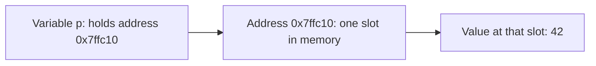

# Pointers


## Youtube

- [you will never ask about pointers again after watching this video](https://www.youtube.com/watch?v=2ybLD6_2gKM)
- [why do void* pointers even exist?](https://www.youtube.com/watch?v=t7CUti_7d7c)
- [you will never ask about pointer arithmetic after watching this video](https://www.youtube.com/watch?v=q24-QTbKQS8)
- [what even is a "reference"?](https://www.youtube.com/watch?v=wro8Bb6JnwU)
- [are "smart pointers" actually smart?](https://www.youtube.com/watch?v=tSIBKys2eBQ)


- [The C Iceberg](https://www.youtube.com/watch?v=63zGtiv89bA)

## Theory

This page covers pointers and memory in C/C++: addresses, dereferencing, and manual memory reasoning.
It spans pointer arithmetic, why `void*` exists, references vs pointers, and whether smart pointers live up to the name.
Key subtopics: memory layout intuition, common pointer pitfalls, and deeper C idioms.

This guide turns that scope note into a complete interview-ready reference for backend and systems interviews.
You will learn what a pointer really is, how arithmetic scales by type, why arrays decay, when `malloc` and `free`
must pair, where leaks and use-after-free come from, how C++ smart pointers automate ownership, and how Go and Rust
keep the power with fewer footguns.
No prior systems background is assumed; every idea is tied back to memory you can draw and bugs you can name.

Think of a pointer as a street address, not the house. The variable holds an address, the address selects a byte
in memory, and dereferencing visits that house. Backend interviews test whether you can reason about that
indirection under pressure: who owns the memory, how long does it live, who frees it, and what happens when
two pointers disagree about the answer.

### Topics Covered

1. [Theory and Scope](#theory)
2. [What Pointers Are](#1-what-pointers-are)
3. [Arithmetic and Arrays](#2-arithmetic-and-arrays)
4. [Malloc Free and Leaks](#3-malloc-free-and-leaks)
5. [Smart Pointers](#4-smart-pointers)
6. [Go and Rust in 10 Lines](#5-go-and-rust-in-10-lines)
7. [Bug Table](#6-bug-table)
8. [Interview Q and A](#7-interview-q-and-a)

Each numbered item links to the matching section below. Headings use plain words so every anchor resolves on GitHub preview.

### 1. What Pointers Are

A pointer is a variable that stores a memory address. That address points to a typed object somewhere in the
address space: a stack slot, a heap allocation, a global, or a memory-mapped region. The type matters because
it tells the compiler how many bytes to read on dereference and how far to step on increment.

Three operators do almost everything:

- `&x` takes the address of `x`. It answers where is this stored.
- `*p` dereferences `p`. It answers what value lives at that address.
- `p->field` is shorthand for `(*p).field`. It follows the pointer then selects a member.

A pointer itself has an address too. That is why double pointers (`char **argv`, `int **out`) exist: a function
that must change the callers pointer takes a pointer to that pointer.



The diagram above is the whole mental model. The variable `p` stores bits that happen to be an address. The
address names a slot. Dereferencing reads or writes the value in that slot. If the address is invalid, there
is no slot and the program faults.

`void*` is the generic address without a type. It can carry any object pointer, which is why `malloc`,
thread arguments, and C callbacks use it. You cannot dereference or do arithmetic on `void*` directly because
the compiler does not know the element size. Cast it back to the real type first.

References in C++ look like pointers that cannot be reseated. A reference `int &r = x` is an alias for `x`,
never null when used correctly, with no extra dereference syntax. Under the hood compilers usually implement
references as pointers, but the contract differs: a pointer can be null, repointed, and incremented, while a
reference is bound once and always denotes one object.

Null, wild, and dangling pointers explain most crashes:

- **Null** points to address zero by convention. Dereferencing it faults immediately, which is loud and debuggable.
- **Wild** was never initialized. It points anywhere, so behavior is nondeterministic.
- **Dangling** used to be valid but the owner freed or returned. The slot may now hold unrelated data.

Interview rule to say aloud: every pointer needs an owner, a lifetime, and a single free. If you cannot name
all three, do not dereference it.

### 2. Arithmetic and Arrays

Pointer arithmetic moves by elements, not bytes. Adding one to `int *p` advances by `sizeof(int)`, typically
four bytes. Adding one to `char *c` advances by one byte. The compiler scales the offset so loops read like
indexing while compiling to fast address math.

Arrays and pointers are close cousins but not identical. In most expressions an array decays to a pointer to
its first element, so `a[i]` is defined as `*(a + i)`. The difference shows in `sizeof` and assignment: an
array has fixed storage and `sizeof(a)` is the whole array, while a pointer is one address and `sizeof(p)`
is eight bytes on 64-bit. You cannot reassign an array name.

```c
#include <stdio.h>

int main(void) {
    int a[] = {10, 20, 30, 40};
    int *p = a;              // decay: p points at a[0]
    printf("%d %d\n", *(p + 2), p[2]);  // both print 30
    p++;                     // now points at a[1]
    printf("%d\n", *p);      // prints 20
    return 0;
}
```

This example packs the whole section into eight statements. `int *p = a` stores the address of the first
element. `*(p + 2)` adds two elements (eight bytes on most platforms) then dereferences, yielding `30`.
`p[2]` is identical sugar for the same load. `p++` advances one element to `a[1]`, so the final load prints
`20`. Note there is no bounds check: reading `*(p + 10)` compiles but reads out of bounds.

Three facts to memorize for interviews:

- `a[i]` equals `*(a + i)` equals `*(i + a)` equals `i[a]`. The last form is legal C trivia, never use it.
- A string literal like `"hi"` is a `char[3]` in static storage that decays to `char*`. Writing through it is undefined.
- Pointer subtraction yields element distance, not byte distance. `&a[3] - &a[0]` is `3`, and the result type is `ptrdiff_t`.

### 3. Malloc Free and Leaks

Stack memory is automatic: locals live until the function returns, then the frame is gone. Heap memory is manual:
`malloc` reserves bytes that stay alive until you call `free`. That control is the point of C, and the source of
every leak, double free, and use-after-free you will be asked about.

`malloc(n)` returns a `void*` to `n` uninitialized bytes, or `NULL` when out of memory. `calloc(n, size)` is the
zeroing cousin that also checks overflow in the multiply. `realloc(p, n)` resizes, possibly moving the block and
copying contents. `free(p)` releases the block back to the allocator. After `free`, the pointer value is
indeterminate: set it to `NULL` so a second free is a safe no-op.

Heap blocks carry hidden metadata and alignment. The allocator rounds sizes up to 8 or 16 bytes, tracks free lists
or size classes, and splits and coalesces neighbors. That is why small `malloc` calls cost more than they look and
why fragmentation grows when lifetimes interleave randomly. Arenas and pools beat raw `malloc` in hot paths by
allocating one slab and bumping through it.

```c
#include <stdio.h>
#include <stdlib.h>
#include <string.h>

int main(void) {
    size_t n = 4;
    int *p = malloc(n * sizeof *p);  // uninitialized heap array
    if (!p) return 1;                // allocation can fail
    memcpy(p, (int[]){10, 20, 30, 40}, n * sizeof *p);
    printf("%d %d\n", p[0], *(p + 3));
    free(p);                         // single owner frees once
    p = NULL;                        // dangling becomes null
    return 0;
}
```

This example is the canonical heap lifecycle in miniature. `malloc(n * sizeof *p)` asks for four integers without
a type attached, hence the `void*` return. The `NULL` check handles exhaustion instead of crashing on dereference.
`memcpy` fills the block because `malloc` leaves garbage. Both prints read through the heap pointer exactly like an
array. `free(p)` hands the block back once, and `p = NULL` converts a future accidental use into a loud null fault
instead of silent heap corruption.

Ownership discipline that prevents leaks:

- **One malloc, one free, one owner.** Decide at allocation time which function or struct owns the block and
  documents when it frees. Shared ownership without counting is a leak or double free waiting to happen.
- **Free on every exit path.** Early returns, `break`, and error labels must all release. The `goto cleanup`
  idiom in C exists for exactly this reason.
- **Match the allocator.** Memory from `malloc` frees with `free`, `mmap` with `munmap`, and platform APIs with
  their own release. Mixing them corrupts the heap.
- **Size with `sizeof *p`, not a literal.** `malloc(n * sizeof *p)` stays correct when the type changes, while
  `malloc(n * 4)` silently breaks on a new platform or type.
- **Treat warnings as leaks-in-waiting.** Unchecked `malloc`, `strlen` without `+1` for the terminator, and
  `realloc` assigned directly over the old pointer (losing the block on failure) are classic interview red flags.
- **Confirm with tools.** `valgrind --leak-check=full`, AddressSanitizer (`-fsanitize=address`), and
  `-fsanitize=undefined` turn silent corruption into a stack trace. Quote them by name in interviews.

A leak is a `malloc` with no reachable `free`: the process RSS grows until the OOM killer intervenes. A double
free corrupts the allocator free list and is often exploitable. Use-after-free reads recycled bytes that may now
belong to another object, which is why it tops exploit lists. All three share one fix: explicit lifetimes.

### 4. Smart Pointers

C++ keeps raw pointers and manual `new` and `delete`, then layers smart pointers that tie lifetime to scope.
A smart pointer is an object that holds a raw pointer and frees it in its destructor. Because destructors run
deterministically at scope exit, even on exceptions, ownership becomes automatic. Interviews test whether you can
pick the right wrapper and explain its cost.

- **`unique_ptr<T>` is sole ownership.** Exactly one owner, moves but never copies, zero overhead over a raw
  pointer. Return it from factories, store it in owning structs, pass `T*` or `T&` for non-owning views.
- **`shared_ptr<T>` is shared ownership with a control block.** Each copy bumps an atomic refcount; the last
  owner destroys the object. Cost is two allocations (object plus control block, fused by `make_shared`) and
  atomic increments on every copy. Cycles between `shared_ptr` nodes leak, which is why `weak_ptr` exists.
- **`weak_ptr<T>` is a non-owning observer.** It points at a `shared_ptr` target without keeping it alive.
  Call `lock()` to get a temporary `shared_ptr` when you need access, and check expiry for caches, parents,
  and observer lists.
- **Never mix raw `new` with two smart pointers.** Construct with `make_unique` and `make_shared` so one
  allocation feeds exactly one control block. Two `shared_ptr` objects built from the same raw pointer each
  think they are the last owner and double free.

```cpp
#include <memory>
#include <iostream>

int main() {
    auto u = std::make_unique<int>(42);  // sole owner, auto-frees
    std::cout << *u << "\n";             // dereference like a raw pointer
    auto s1 = std::make_shared<int>(99); // refcount equals 1
    auto s2 = s1;                        // refcount equals 2, shared owner
    std::weak_ptr<int> w = s1;           // observes, does not extend life
    s1.reset(); s2.reset();              // last free destroys, w expires
    return 0;
}
```

This example compresses modern C++ ownership into ten statements. `make_unique` allocates one integer with a
single owner; leaving scope destroys it with no `delete` written. `make_shared` allocates object plus control
block together for one cache-friendly chunk. Copying to `s2` shares ownership instead of copying the integer.
`weak_ptr w` watches without voting on lifetime. Resetting both shared owners drops the count to zero, destroys
the integer, and leaves `w` expired rather than dangling.

Rules to say aloud in interviews:

- Default to `unique_ptr`. Promote to `shared_ptr` only when profiling or the design proves shared lifetime.
- Pass `const T&` or `T*` for borrowed access; pass `unique_ptr` by value only to transfer ownership.
- Break parent-child and cache cycles with `weak_ptr`, never with a raw back-pointer you must remember to clear.
- Smart pointers fix ownership, not logic: dereferencing a moved-from `unique_ptr` or an expired `weak_ptr`
  without checking is still undefined.

### 5. Go and Rust in 10 Lines

Go keeps pointers but removes arithmetic. You can take addresses, dereference, and allocate with `new` and
`make`, yet the compiler and garbage collector own freeing, so leaks mean retained reachability rather than a
missing `free`. Slices bundle pointer plus length plus capacity, which is why they feel safe while still sharing
backing arrays. Rust splits the idea in two: borrowed references with compile-time lifetimes for temporary views,
and smart-pointer types like `Box`, `Rc`, and `Arc` for owned data. The borrow checker rejects dangling and
data races before the program runs. Interview takeaway: C asks who frees, Go asks who still references, and Rust
answers both at compile time.

### 6. Bug Table

Every pointer bug is a lifetime or bounds error. Learn this table cold: interviewers describe a symptom and expect
you to name the bug, the root cause, and the one-line fix. All six rows reduce to the same mantra of owner,
lifetime, and single free from section 1.

| Bug | Symptom | Cause | Fix |
|---|---|---|---|
| Null dereference | Immediate segfault at `*p` | Missing allocation or unchecked return | Check for `NULL` before use, assert invariants |
| Use-after-free | Crash or corrupted data long after `free` | Dangling pointer reused after owner freed | Set pointer to `NULL` after `free`, use-after-scope lint |
| Double free | Heap corruption, abort in `free` | Two owners free the same block | Single owner, `NULL` after `free`, prefer `unique_ptr` |
| Buffer overflow | Smashed stack, hijacked control flow | Index or `strcpy` past allocation end | Bounds check, `snprintf`, `memcpy` with explicit `n` |
| Memory leak | RSS grows, OOM killer fires | `malloc` with no reachable `free` path | `goto cleanup`, arenas, LeakSanitizer in CI |
| Return of stack address | Works in tests, corrupts in production | Returning `&local` from a function | Return by value, take an out-param, or heap allocate |

- **Null dereference is the kind crash.** The pointer holds zero, the MMU has no page zero mapped, and the load
  faults loudly. It is the easiest bug because the failure lands exactly on the mistake. Still check every
  `malloc`, `fopen`, and out-param before dereferencing, since production faults from a missing check look careless.
- **Use-after-free is the exploitable crash.** The slot was recycled, so the read returns attacker-controlled bytes
  or the write corrupts an unrelated object. Browsers and servers treat it as a security boundary. Mitigations are
  `p = NULL` after free, scope-narrowed lifetimes, and AddressSanitizer, which quarantines freed chunks to catch
  the reuse.
- **Double free is the allocator corruption.** The first `free` links the chunk into the free list; the second links
  it twice, so two future `malloc` calls return the same bytes. Later writes alias silently. The fix is structural:
  exactly one owner calls `free`, and C++ code moves that duty into `unique_ptr` so it cannot be forgotten twice.
- **Buffer overflow is the bounds failure.** Pointer arithmetic compiles without range checks, so `p[10]` on a
  four-element allocation reads neighbor memory. Off-by-one on `strcpy` drops a terminator over the saved frame
  pointer. Defenses are counted functions (`strncpy`, `snprintf`, `memcpy` with `n`), explicit length parameters
  alongside every pointer, and `-fstack-protector` plus `-D_FORTIFY_SOURCE` as backstops.
- **Memory leak is the slow outage.** Each missed `free` is tiny, but servers loop forever, so leaked request buffers
  accumulate until latency spikes from swapping and the OOM killer picks the process. Long-lived services catch this
  with LeakSanitizer and RSS graphs per deploy, plus the discipline of freeing on every early-return path.
- **Return of stack address is the spooky bug.** The callee frame looks valid until the next call overwrites it, so
  unit tests pass and integration corrupts. Compilers warn with `-Wreturn-local-addr`: heed it. Either copy the value
  out, let the caller supply the buffer and length, or document a heap allocation the caller must free.

Read the table bottom-up when debugging: corruption that moves between runs suggests use-after-free or overflow,
steady growth suggests a leak, and an immediate fault on first use suggests null or an uninitialized wild pointer.
Run under sanitizers before reasoning further, since they convert nondeterminism into a precise line number.

How the bugs connect to the videos: the `void*` episode explains why typeless addresses need casts before they can
overflow correctly, the arithmetic episode shows how scaling errors become overflows, the reference episode shows how
aliases dodge null and reseat bugs, the smart-pointer episode automates the double-free and leak rows, and the C
iceberg episode collects the stack-return and undefined-behavior corners in one place.

### 7. Interview Q and A

1. **What is a pointer, and how is it different from a reference?**
   A pointer is a variable holding an address that can be null, reseated, incremented, and double-indirected for
   out-params. A C++ reference is a bound-once alias that is never null when valid and needs no dereference syntax.
   Compilers usually implement references as pointers, but the contract differs: use pointers for optional or moving
   views, references for guaranteed borrowed access. Mention `int **out` as the case references cannot replace.

2. **Why does `void*` exist if you cannot dereference it?**
   Because C needs a generic carrier for addresses without committing to a type. `malloc`, thread start routines,
   and callback `userdata` all pass `void*` and let the receiver cast back to the concrete type. The compiler blocks
   dereference and arithmetic on `void*` since element size is unknown. Cast first, then access, and keep the
   original type consistent or behavior is undefined.

3. **How does pointer arithmetic actually scale, and why does `a[i]` equal `i[a]`?**
   Arithmetic scales by `sizeof(*p)`: `p + 1` advances one element, not one byte. Array subscript is defined as
   `a[i]` equals `*(a + i)`, and addition commutes, so `*(i + a)` equals `i[a]`. It compiles but signals confusion,
   so never write it. Add that subtraction yields element distance of type `ptrdiff_t`, and that going out of bounds
   even without dereference is undefined except for the one-past-the-end pointer.

4. **What happens between `malloc` and `free`, and what is a leak?**
   `malloc` asks the allocator for `n` bytes, which rounds up for alignment, records metadata, and returns `void*`
   to uninitialized storage or `NULL` on failure. The block lives until exactly one `free` returns it, after which
   the pointer dangles and must be nulled. A leak is any path that drops the last pointer without freeing: missed
   early return, overwritten pointer, or unbounded cache growth. Detect with LeakSanitizer and fix with single-owner
   discipline and a `cleanup` label.

5. **What are use-after-free and double free, and how do you prevent them?**
   Use-after-free dereferences a dangling pointer whose bytes were recycled, causing corruption or code execution.
   Double free hands the same chunk to the allocator twice, aliasing two future allocations. Both come from unclear
   ownership. Prevent with one owner and one free, `NULL` after free, narrow scopes, `make_unique` in C++, and
   AddressSanitizer in tests. In an interview, draw the timeline of allocate, free, then illegal reuse.

6. **When do you use `unique_ptr` vs `shared_ptr` vs `weak_ptr`?**
   Default to `unique_ptr` for sole ownership with zero overhead and automatic destroy on scope exit. Promote to
   `shared_ptr` only when multiple owners truly share lifetime, accepting atomic refcount cost and a control block.
   Break cycles and build caches or observers with `weak_ptr`, locking to a temporary `shared_ptr` only while
   accessing. Construct via `make_unique` and `make_shared`, never wrap one raw `new` in two smart pointers.

7. **Are arrays and pointers the same thing in C?**
   No. Arrays decay to a pointer to the first element in most expressions, which is why `p = a` and `a[i]` work, but
   they differ in storage and `sizeof`: `sizeof(a)` is the whole array while `sizeof(p)` is one address. Arrays are
   not reassignable lvalues, and `&a` has type pointer-to-array with different arithmetic from `&a[0]`. String
   literals live in static storage and must never be written through. Interviewers accept decay plus `sizeof` as the
   complete answer.

8. **How do Go and Rust keep pointer power with fewer crashes?**
   Go keeps address-taking and dereference but removes arithmetic and adds a collector: the runtime frees
   unreachable memory, so the bug class shifts from missing `free` to accidentally retained references. Slices carry
   length and bounds-check, removing most overflows. Rust enforces lifetimes and exclusive mutation at compile time:
   borrows cannot outlive owners and mutable aliasing is rejected before running. `Box`, `Rc`, and `Arc` cover heap
   ownership explicitly. Result: C trusts the programmer, Go trusts the collector, Rust trusts the compiler.
