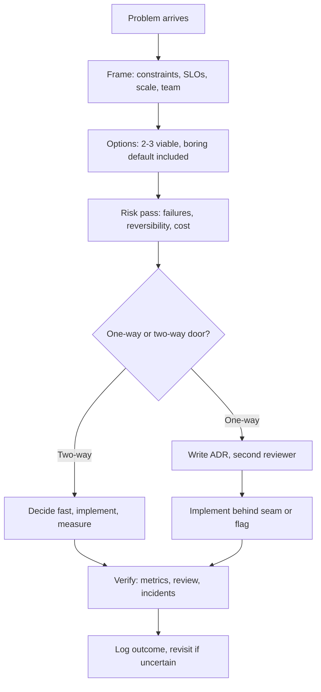

## Medium


- [The Truth About Code Optimization You Won't Hear From Your Senior Developer](https://blog.stackademic.com/the-truth-about-code-optimization-you-wont-hear-from-your-senior-developer-ee013295bcd3)


- [How Senior Engineers Think Differently: 10 Mental Models You Need](https://levelup.gitconnected.com/how-senior-engineers-think-differently-10-mental-models-you-need-cfb25eda4d7e)
- [7 Productivity Hacks I Learned from a Principal Software Engineer!](https://medium.com/the-pythonworld/7-productivity-hacks-i-learned-from-a-principal-software-engineer-cec0e93f472d)
- [8 Habits That Can Make You an Unstoppable Software Engineer](https://medium.com/the-pythonworld/8-habits-that-can-make-you-an-unstoppable-software-engineer-be97c5b37236)
- [10 Lessons I Learned from a Principal Engineer That Made Me a Better Developer](https://medium.com/the-pythonworld/10-lessons-i-learned-from-a-principal-engineer-that-made-me-a-better-developer-2d1337eb85b8)
- [How I Make Better Architectural Decisions as a Senior Developer](https://medium.com/@vndpal/how-i-make-better-architectural-decisions-as-a-senior-developer-09ab94e0715f)
- [How to Become a Strong Software Architect](https://azeynalli1990.medium.com/how-to-become-a-strong-software-architect-c36e144fe2fd)
- [23 Fundamental Principles for Software Architects](https://azeynalli1990.medium.com/23-fundamental-principles-for-software-architects-f42aaae7f740)


- [The Ultimate Toolkit to Get Promoted as a Software Engineer](https://medium.com/the-pythonworld/the-ultimate-toolkit-to-get-promoted-as-a-software-engineer-463eaa5bb92f)
- [9 Subjects I've Changed My Mind About as a Software Engineer](https://levelup.gitconnected.com/9-subjects-ive-changed-my-mind-about-as-a-software-engineer-04ddd37a7fc7)


- [Ultimate Guide to Clean Code with over 30 Java Refactoring Examples](https://azeynalli1990.medium.com/ultimate-guide-to-clean-code-with-over-30-java-refactoring-examples-46614cf8f818)


- [The Biggest Mistakes I Made as a Beginner Programmer (And How to Avoid Them!)](https://medium.com/the-pythonworld/the-biggest-mistakes-i-made-as-a-beginner-programmer-and-how-to-avoid-them-cff4156eb456)
- [5 Habits Killing Your Productivity — According to the Greatest Stoic Philosophers](https://medium.com/the-pythonworld/5-habits-killing-your-productivity-according-to-the-greatest-stoic-philosophers-fb8210357c25)


- [10 Must-Know Cloud Native Architecture Patterns](https://azeynalli1990.medium.com/10-must-know-cloud-native-architecture-patterns-49f9dadd1b2e)
- [8 Legendary Websites That Save 5 Hours Per Day](https://medium.com/lets-code-future/8-legendary-websites-that-save-5-hours-per-day-5e8d294fd497)


- [How to master at PR Reviews for Senior Devs](https://azeynalli1990.medium.com/how-to-master-at-pr-reviews-for-senior-devs-0bad342694a6)
- [Clean Code Cheat Sheet for Senior Developers in Daily PR Reviews](https://azeynalli1990.medium.com/clean-code-cheat-sheet-for-senior-developers-in-daily-pr-reviews-16638ae095e3)

## Theory

This page covers thinking and operating like a senior engineer or software architect.
It spans mental models for architectural decisions, code-optimization judgment, clean-code and PR-review habits, and cloud-native patterns.
Key subtopics: productivity habits, lessons from principal engineers, promotion toolkits, and avoiding beginner mistakes.

This guide turns that stub into a complete operating manual for the architect role.
You will learn what architects actually own, how they make decisions that survive
contact with production, how they write ADRs that future teams can trust, how they
review code and design with leverage, and how they reason about trade-offs without
hand-waving.
No title change is assumed; whether you are a senior engineer growing into scope or
an appointed architect, the habits here transfer directly to daily work.

Think of the architect as the decision-throughput layer for engineering teams.
Seniors optimize a service, staff engineers optimize a domain, architects optimize
the decision graph itself: which choices get made early, which get deferred, which
get written down, and which get revisited before they become expensive rewrites.
Interviews test whether you can move between all three altitudes: name a principle,
show it in a code review, and defend it as a recorded architectural bet.

### 1. Topics Covered

1. [What Architects Actually Do](#2-what-architects-actually-do)
2. [ADRs Architecture Decision Records](#3-adrs-architecture-decision-records)
3. [Review Habits and Culture](#4-review-habits-and-culture)
4. [Clean Code and PR Habits](#5-clean-code-and-pr-habits)
5. [Trade-off Thinking](#6-trade-off-thinking)
6. [Growing into the Role](#7-growing-into-the-role)
7. [Interview Questions and Answers](#8-interview-questions-and-answers)

Each numbered item links to the matching section below. Headings use plain words so every anchor resolves on GitHub preview.

### 2. What Architects Actually Do

Architects do not draw boxes and leave. They own the technical coherence of a system
over time: the constraints nobody wrote down, the defaults every team inherits, the
migration paths that keep options open, and the five decisions per year that are
expensive to reverse. Code is one output; alignment, context, and recorded judgment
are the larger outputs.

The difference between a senior engineer and an architect is scope of ambiguity:

- **Senior engineer:** owns a service end to end. Takes a well-framed problem, picks
  a sound implementation, ships it with tests, dashboards, and runbooks. Optimizes
  for correctness, clarity, and velocity inside agreed boundaries.
- **Staff or principal engineer:** owns a domain. Connects three to five services,
  kills duplicate abstractions, sets patterns others copy. Optimizes for leverage:
  one review comment or platform fix that saves ten teams a week each.
- **Architect:** owns decisions across domains. Names the constraints (latency SLO,
  compliance region, cost ceiling, team topology), frames options with consequences,
  drives the decision to closure, and records it so the next hire inherits reasoning
  instead of folklore. Optimizes for reversibility and coherence over time.

None of these roles means working alone or outranking everyone. The architect who
becomes a bottleneck or an ivory-tower approver has failed. Authority comes from
written reasoning, working prototypes, and reviews that teach, not from a gate.

Ten mental models senior engineers use differently:

- **Reversibility over correctness:** two-way doors get decided fast and iterated; one-way
  doors (data model, public API, region topology, identity scheme) get a record and a rollback plan.
- **Boring technology as default:** every novel component must pay for novelty with a named
  advantage no boring option provides, plus an exit plan attached.
- **Constraints before solutions:** list non-negotiables first — p99 budget, RPO targets, data
  residency, team size, on-call load, cost per million requests. Violations are out of scope.
- **Failure as the design input:** start from AZ loss, downstream timeout, hot key, bad deploy,
  and queue backup, then work backward to timeouts, retries, bulkheads, and degradation paths.
- **Total cost of ownership:** license cost is the smallest line. Count operations, upgrades,
  3 AM debuggability, hiring pool, and migration cost before calling anything free.
- **Conway awareness:** the system mirrors communication structure, so draw boundaries teams
  can actually own. Daily cross-boundary coordination means the boundary is wrong.
- **Evolution over perfection:** ship the smallest architecture meeting current constraints while
  keeping the next two evolutions cheap. Fitness functions and seams beat big rewrites.
- **Evidence over opinion:** replace I prefer with measured or cited. Prototype the risky path,
  load-test the claimed curve, read the dependency's incident history before adopting it.
- **Leverage thinking:** rank work by teams unblocked per hour. A golden-path template or one
  crisp RFC can outweigh a month of feature code. Spend time where the multiplier is highest.
- **Code-optimization judgment:** most hot paths are I/O bound, so profile before optimizing.
  Fix allocations and syscalls on the measured path, keep readability elsewhere, cite the benchmark.

How decisions actually flow:



The flow above keeps velocity high without gambling on irreversible bets. Framing
comes first so options are comparable, risk comes before commitment so failure modes
have owners, and verification closes the loop so decisions compound into knowledge
instead of repeating every reorg.

Practical rules that follow:

- Write the constraint list before the solution sketch in every design doc.
- Name the reversibility of each major choice in one sentence.
- Prototype the riskiest assumption before the review, not after approval.
- Keep a decision log even for small calls; search beats memory.
- Revisit one past decision per quarter and note what you would change.

### 3. ADRs Architecture Decision Records

An Architecture Decision Record is a short immutable note capturing one significant
choice: what was decided, why, what was rejected, and what follows. Without ADRs a
team re-litigates the same debate every six months, new hires inherit rules without
reasons, and migrations stall because nobody knows which constraints still hold.
With ADRs the reasoning is searchable, the dissent is preserved, and reversals are
deliberate instead of accidental.

Write an ADR when the decision is hard to reverse, crosses team boundaries, commits
money or compliance posture, or has already been debated twice. Skip ADRs for pure
implementation detail inside one service — that belongs in a code comment or PR
description. The test is simple: would someone in a year regret not knowing why.
If yes, write the ADR now while context is fresh.

Anatomy of a good ADR:

- **Title and number:** `ADR-014: Use Postgres instead of MongoDB for billing ledger`.
  Sequential numbers keep references stable; titles state the outcome.
- **Status:** proposed, accepted, deprecated, superseded. Never edit history — add a
  new ADR that supersedes the old one, so the timeline stays honest.
- **Context:** the forcing function in three to five sentences. Scale numbers, SLO
  pressure, incident that triggered the review, compliance demand, team constraint.
- **Options considered:** two to four real alternatives, each with one-line cost and
  one-line risk. Include the boring default explicitly, even when you reject it.
- **Decision:** one paragraph, active voice, naming the winner and the boundary it
  applies to. Say where it does not apply so future readers avoid overgeneralizing.
- **Consequences:** what gets better, what gets worse, what must be built or
  migrated. Name the operator burden, the migration owner, and the revisit trigger.
- **Links:** design doc, benchmark gist, incident postmortem, Slack thread, PR that
  implements the seam. Future readers follow links instead of guessing.

Explained example — rate limiting at the edge:

```markdown
# ADR-021: Token-bucket rate limiting at the API gateway

Status: Accepted (2026-03-14) — Revisit if edge p99 exceeds 15 ms.

## Context

Public API hit 4,000 RPS with burst 3x during launches. Abuse incidents in
Jan and Feb traced to per-key retry storms; origin fleet scaled 40 percent
to absorb traffic that should never have arrived. p99 budget is 300 ms and
edge affords ~5 ms for policy checks.

## Options considered

1. Gateway token bucket per API key (Redis-backed, local cache 1s).
   Cost: one Redis cluster plus gateway plugin. Risk: burst tuning needed.
2. Per-service middleware limiters. Cost: no new infra.
   Risk: N services each allow full quota — no global bound, retry storms pass.
3. Managed WAF rate rules. Cost: per-request fee, ~$9K/month at current RPS.
   Risk: coarse windows, weak per-key burst control, vendor lock on policy.

## Decision

Adopt option 1 for all public REST and GraphQL ingress. Gateway enforces
per-key token bucket (100 RPS sustained, burst 200) with 429 plus
Retry-After headers; service mesh keeps coarse per-route guards only.

## Consequences

Good: origin RPS capped, abuse isolated per key, policy ships once for all
services. Bad: new Redis dependency on the hot path, burst constants need
tuning per endpoint. Follow-ups: owner SRE team, dashboard on 429 rate per
key, load test at 10x asserting gateway p99 under 5 ms, revisit 2026-09.
```

Why this ADR works: context carries numbers, every option has cost and risk, the
decision names its boundary, consequences admit the downside, and the revisit date
prevents calcification. A reviewer can disagree precisely — with the burst math, the
Redis risk, or the cost claim — instead of relitigating taste.

ADR habits that keep the log trustworthy:

- One decision per ADR; bundles become unreviewable.
- Keep it under one page; length signals an unfocused decision.
- Record rejected options with respect; the runner-up is next year's answer.
- Mark superseded ADRs visibly; dead guidance that looks alive causes incidents.
- Store ADRs beside code in `docs/adr/`, reviewed like code.

Practical rules that follow:

- Draft the ADR before the implementation PR, not after it merges.
- Require one reviewer outside the owning team for cross-cutting ADRs.
- Attach the benchmark or incident link; opinion-only ADRs rot fastest.
- Set a revisit date whenever confidence is below 70 percent.

### 4. Review Habits and Culture

Reviews are where architecture actually happens day to day. Design docs set intent,
but the review queue is where intent meets every edge case, shortcut, and hidden
coupling. Teams with strong review culture ship fewer incidents, onboard faster,
and spread senior judgment without meetings. Teams with weak review culture ship
faster for a quarter, then pay in reverts, outages, and silent knowledge silos.

What senior reviewers check, in order:

- **Correctness under failure:** timeouts, retries with budgets, idempotency keys,
  partial writes, clock skew, empty and oversized inputs. Happy-path-only code gets
  a request-changes with the missing failure case named.
- **Boundary respect:** does the change leak across its seam. New cross-service
  calls, shared-table reads, synchronous fan-out, or schema widening all demand a
  design note, not a silent import.
- **Reversibility:** feature flag, migration with rollback, expand-then-contract for
  schema moves, config kill-switch for new behavior. No flag for a one-way change
  means the blast radius statement is missing.
- **Operability:** logs with correlation IDs, metrics on the new path, dashboard or
  alert update, runbook line for the on-call reader. Unobservable code is unfinished.
- **Scale shape:** the `n` and the curve. A loop over query results, an unbounded
  `IN` clause, a fan-out per request — each gets the 10x question asked explicitly.

How to run reviews with leverage:

- **Review fast, in small batches:** first response within a day, PRs under 300
  lines. Large PRs get asked to split before deep review begins.
- **Separate blocking from advisory:** prefix `blocking:`, `nit:`, `question:`,
  `follow-up:` so authors know what gates merge. Two blocking comments beat twenty mixed ones.
- **Ask, do not command, below the bar of correctness:** suggest with reasoning and
  let the author choose. Dictated style trains compliance instead of judgment.
- **Approve with context:** state what you verified — tests, failure path, rollback —
  so the approval carries information.
- **Track review debt:** recurring comment themes become lint rules or templates. The
  same comment three times is a tooling ticket, not a habit.

Culture mechanics that sustain quality without burnout:

- Rotate reviewers so knowledge spreads; never let one person own all approvals.
- Protect maker time with twice-daily review windows instead of constant pings.
- Celebrate catches in retros; a prevented incident deserves feature-level storytelling.
- Measure review health: time to first review, blocking ratio, revert rate. Degrading
  numbers mean load or scope problems, not laziness.
- Keep design and code reviews distinct: design debates options, code verifies execution.

Practical rules that follow:

- No PR merges without a second reader on one-way-door changes.
- Every request-changes names the failure case or constraint violated.
- Turn repeated feedback into automation within the sprint.
- Thank the reviewer who blocks your bad deploy; mean it visibly.

### 5. Clean Code and PR Habits

Clean code is architecture at close range. Every naming choice, function boundary,
and error path either preserves the seams the design promised or quietly dissolves
them. Architects read diffs as system samples: if the small code is tangled, the
large structure will follow within a year.

Thirty-plus refactoring examples reduce to a short checklist senior reviewers apply
on every PR:

- **Names carry domain meaning:** `chargeIdempotencyKey` beats `key2`. A new hire
  should guess the bounded context from names alone. Rename when the name lies.
- **Functions do one thing at one level:** a handler validates, calls one use case,
  and maps the result. Extract until each function reads as a single intent.
- **Guard clauses before nesting:** return early for invalid and empty cases. Three
  levels of nesting is a refactor signal, four is a defect hiding spot.
- **Errors as values with context:** name what failed, with which input, and whether
  retry helps. Never swallow with empty catch blocks on payment paths.
- **Dependencies point inward:** domain logic takes interfaces, adapters implement
  them. A use case importing an HTTP client directly is a blockable violation.
- **Small pure cores, thin impure shells:** push branching into pure functions unit
  tests cover cheaply; keep I/O and clock in a thin shell. Testability is a readout.
- **No magic numbers:** timeouts and limits live in named constants with units
  (`CHECKOUT_TIMEOUT_MS`). A bare `30` in retry code is a future incident.
- **Idempotency by default:** write paths accept idempotency keys, deletes are soft
  or reversible. The PR states what happens on double-submit and partial failure.

PR habits that make reviews fast and safe:

- **Describe why plus blast radius:** one paragraph of intent, one line of risk,
  rollback steps, flag name. A behavior change without a rollback plan is not ready.
- **Keep diffs reviewable:** under ~300 lines, one concern per PR, refactor commits
  separated from behavior commits. Giant mixed diffs force skimming where bugs hide.
- **Show verification:** paste test output or benchmark delta. Optimization claims
  without measurements get challenged.
- **Migrate safely:** expand then contract — add the new field, dual-write, shift
  readers, remove the old path. Never rename a public field and consumers in one deploy.
- **Leave the campsite cleaner:** fix one nearby smell per PR — a lying name, a missing
  test, a stale comment. Proportion, not drive-by rewrites.

Practical rules that follow:

- Block PRs that cross bounded contexts without a design note.
- Require a test for every failure path the PR claims to handle.
- Prefer deleting code over abstracting early; duplication is cheaper than the
  wrong shared dependency.

### 6. Trade-off Thinking

Every architecture answer is it depends, made rigorous. Trade-off thinking turns
vague preference into a comparable table with numbers where possible and an explicit
winner per context — the shape interviews and design reviews both reward.

| Trade-off | Option A wins when | Option B wins when | Architect rule |
|---|---|---|---|
| Monolith vs microservices | One team, fast iteration, simple ops | Independent deploys, scaling, ownership | Start modular monolith, split on team pain |
| SQL vs NoSQL | Relations, transactions, ad-hoc query | Extreme write scale, flexible schema, TTL | Default SQL unless access pattern proves otherwise |
| Sync vs async | Immediate consistency, simple reasoning | Burst absorption, decoupling, resilience | Sync reads, async side effects and fan-out |
| Cache vs recompute | Hot reads, expensive compute, stable data | Strong consistency, low reuse, cheap compute | Cache top-K with explicit invalidation owner |
| Build vs buy | Core differentiator, lasting edge | Undifferentiated plumbing, speed matters | Buy plumbing, build what customers pay for |
| Strong vs eventual consistency | Money, inventory, seats, safety | Feeds, analytics, suggestions, presence | Strong at the ledger edge, eventual outward |
| Kubernetes vs serverless | Steady load, control, portability | Spiky traffic, tiny teams, pay-per-use | Serverless for spiky edges, K8s for steady cores |

Checkout inventory is the classic case: the ledger write stays synchronous inside one
transaction, while emails and analytics fan out through a queue with retries and
dead-letter handling. Hot product reads sit behind a short-TTL cache, and stock counts
carry version checks so oversell fails loudly. Each table row maps to a concrete seam.

Cloud-native patterns enter as instantiations of these rows: circuit breakers and
bulkheads implement the sync-vs-async survival story, saga or outbox patterns make
eventual consistency auditable, and autoscaling plus queue depth implement cost
against latency. Quote the pattern only after naming the trade-off it resolves.

Practical rules that follow:

- Put numbers on both sides: p99 delta, dollars per month, on-call hours per quarter.
- Name what you sacrifice explicitly; no option is free.
- Record the context with the choice so a changed context triggers revisit.
- Prefer the reversible option when numbers tie.

### 7. Growing into the Role

Nobody is promoted to architect for knowing more patterns. Promotion follows scope:
bigger ambiguity absorbed, more teams unblocked, harder decisions carried to done.
The toolkit is concrete and cumulative.

Habits that compound into promotion:

- **Write weekly:** one RFC, ADR, postmortem note, or review summary. Writing is
  the promotion surface — invisible good judgment does not compound.
- **Own an incident end to end:** drive the mitigation, write the blameless review,
  ship the fixes that prevent recurrence. Reliability ownership is trusted scope.
- **Kill a bad pattern:** find duplicated auth checks, scattered retries, or three
  queue wrappers, and replace them with one golden path. Leverage is visible.
- **Mentor through reviews:** leave comments that teach the principle, link the ADR,
  and follow up on the next PR. Review quality is leadership evidence.
- **Learn the business constraint:** attach every technical push to cost, SLO, or
  compliance language. Architects who speak only in frameworks stay advisors.
- **Study principal-engineer lessons:** copy productivity systems (deep-work blocks,
  template-first docs), and audit beginner mistakes — untested assumptions, premature
  abstraction, silent failures. Growth is subtracting those, not adding trivia.

Avoid the classic traps: optimizing code nobody profiles, introducing a platform
before two teams feel the pain, reviewing for style while missing the missing
timeout. Each is motion without leverage, and promotion committees notice.

A twelve-week growth loop that works: pick one weak area (for example ADRs), ship
two artifacts (two accepted ADRs with revisit dates), get one sponsor reviewer, and
present one retro on what changed. Repeat across reviews, trade-offs, and mentoring.

Practical rules that follow:

- Ask for scope in the form of decisions owned, not title granted.
- Keep a brag log of decisions, catches, and unblocks with dates.
- Request feedback from reviewers you blocked; calibration lives there.

### 8. Interview Questions and Answers

1. **What does a software architect actually own?**
   Coherence of decisions over time: constraints, defaults, seams, and the few
   irreversible choices per year. Deliverables are recorded decisions, working
   seams teams can build on, and reviews that raise the bar. Success reads as
   fewer rewrites, faster onboarding, and incidents that teach instead of repeat.
2. **How do you decide between two viable architectures?**
   Frame constraints first, list two to three options including the boring default,
   score each on latency, cost, operability, and reversibility with rough numbers,
   and pick the cheapest reversible option that meets constraints. Record the call
   in an ADR with rejected options and a revisit trigger.
3. **What goes into a good ADR? Show an example.**
   Number, title, status, context with numbers, options with cost and risk,
   decision with boundary, consequences with owners, and links. Cite the gateway
   token-bucket ADR: context of 4,000 RPS bursts, three options scored, per-key
   bucket decision, Redis cost admitted, revisit date set. One decision per page.
4. **How do you review a PR like a senior engineer?**
   Check failure handling, boundary respect, reversibility, observability, and
   scale shape in that order. Respond within a day, separate blocking from nits,
   ask rather than dictate on style, and state what was verified on approval.
   Turn repeat comments into lint rules or templates.
5. **What clean-code signals do you block on?**
   Misleading names, multi-level nested functions doing three things, swallowed
   errors, domain code importing infrastructure, magic timeouts, and write paths
   without idempotency. Each maps to a future incident or a dissolved boundary,
   so the block names the failure case it prevents.
6. **How do you reason about a trade-off such as SQL versus NoSQL?**
   Name the access pattern, consistency need, and scale first. SQL wins on
   relations and transactions, NoSQL on write scale and flexible shape. Default
   to SQL, switch only when the pattern proves it, and split by seam — ledger in
   SQL, feed or session tail in NoSQL — instead of one store for everything.
7. **How do you keep velocity high without gambling on big decisions?**
   Sort by reversibility using the decision flowchart: two-way doors decide fast
   and measure, one-way doors get an ADR plus a second reviewer and ship behind
   a flag or seam. Both paths verify with metrics and log a revisit date so speed
   and safety share one process.
8. **How did you grow someone toward architect scope?**
   Gave them a cross-team decision to own end to end — framing, ADR draft,
   reviewer round, implementation seam, and postmortem. Coached review comments
   toward principles, required writing as the surface, and measured unblocks and
   prevented incidents rather than lines shipped.
9. **Tell me about an architectural mistake and what changed.**
   Pick a real one — premature service split, cache without invalidation owner,
   async path without dead-letter handling. Name the constraint missed, the cost
   paid in incidents or rework, the ADR or guardrail added after, and the revisit
   habit adopted. Honest accounting with a systemic fix is the passing signal.