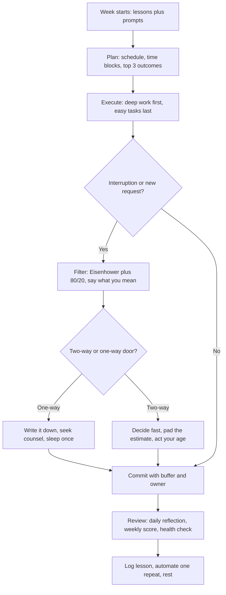

## Summary of "40 Life Lessons Learned at 43"

In the engaging video titled "40 Life Lessons Learned at 43," the creator shares a comprehensive collection of insights and experiences accumulated over the years. These lessons are thoughtfully categorized into seven key areas: Relationships, Finances, Career, Programming, Fitness, Lifestyle, and Time Management. Each lesson is designed to inspire viewers to reflect on their own lives and encourage personal growth. Below is a detailed breakdown of the key lessons discussed:

### Relationships
1. **Act Your Age**: Embrace the wisdom that comes with age instead of trying to fit in with younger colleagues. Recognize that your life experiences provide valuable perspectives that can contribute positively to your workplace and social interactions.
   
2. **Say What You Mean**: Cultivate the habit of direct and honest communication. This not only helps in avoiding misunderstandings but also builds trust in both personal and professional relationships.

3. **Stop Wasting Time**: Be intentional about how you spend your time. Focus on activities that create lasting memories and contribute to your personal goals rather than getting caught up in trivial pursuits.

### Finances
4. **Multiple Income Streams**: Consider establishing diverse sources of income, such as side gigs or investments. This strategy enhances financial security and reduces reliance on a single paycheck.

5. **Financial Literacy**: Take the time to educate yourself about budgeting, saving, and investing. Tools like YNAB (You Need A Budget) can assist you in managing your finances effectively and achieving your financial goals.

6. **Cautious 401(k) Contributions**: While it's important to save for retirement through a 401(k), ensure that you balance these contributions with other investment opportunities that may offer better returns or liquidity.

### Career
7. **Use Your Webcam**: In virtual meetings, turning on your webcam fosters engagement and connection with colleagues. It helps create a more interactive environment where everyone feels involved.

8. **Humanize Interviews**: Approach job interviews as conversations rather than formal interrogations. Remember that interviewers are humans too; building rapport can lead to a more relaxed atmosphere and better outcomes.

9. **Keep Options Open**: Regularly explore job opportunities even if you're currently satisfied in your role. This proactive approach can open doors to new career paths and prevent complacency.

10. **Be Direct at Work**: Foster an open work environment by communicating clearly and assertively with your colleagues and management. This transparency encourages collaboration and minimizes confusion.

11. **Follow Your Interests**: As your interests evolve over time, don't hesitate to shift roles within your organization or industry. Pursuing what you're passionate about leads to greater job satisfaction and productivity.

12. **Invest in Education**: Continuously seek opportunities for learning—whether through formal education or self-study—to stay relevant in your field and enhance your skill set.

13. **Network Actively**: Build and nurture professional relationships that can support you throughout your career journey. Networking can lead to mentorship opportunities, collaborations, and new job prospects.

14. **Develop Soft Skills**: While technical skills are essential, soft skills like communication, teamwork, and emotional intelligence are equally important for career advancement and workplace harmony.

15. **Be Accountable**: When mistakes happen, take ownership rather than deflecting blame. Accountability fosters trust among colleagues and encourages a culture of continuous improvement.

16. **Gain Domain Knowledge**: Strive to understand the broader context of your projects beyond just technical details. This knowledge enhances your ability to make informed decisions and contribute meaningfully to team discussions.

### Programming
17. **Learn Pseudocode**: Before writing actual code, outline your logic using pseudocode. This practice helps clarify your thoughts and ensures a smoother coding process by identifying potential issues early on.

18. **Merge Before Pushing**: Regularly integrate changes into the main codebase before pushing updates to avoid conflicts with other developers' work, promoting smoother collaboration within teams.

19. **Pad Time Estimates**: When estimating how long tasks will take, add extra time for unforeseen challenges or complications. This approach reduces stress and improves project management.

20. **Read "Grokking Algorithms"**: Familiarize yourself with fundamental programming concepts by reading resources like "Grokking Algorithms." Understanding algorithms is crucial for efficient coding and problem-solving.

21. **Problem Solving Focus**: Shift your mindset from merely writing code to solving real-world problems with technology; this perspective makes your work more impactful and fulfilling.

22. **Know Yourself as a Developer**: Embrace your unique strengths as a developer while recognizing areas for improvement. Learning from others is valuable, but avoid unhealthy comparisons that can hinder your growth.

23. **Take on Hard Tasks**: Challenge yourself by tackling difficult projects or problems; this not only enhances your skills but also builds resilience and confidence in your abilities.

24. **Complete Projects Independently**: Seek opportunities to finish substantial coding projects on your own; this hands-on experience deepens understanding and reinforces learning.

25. **Balance Coding with Hobbies**: Maintain interests outside of programming to prevent burnout; engaging in hobbies can refresh your mind, boost creativity, and improve overall well-being.

### Fitness
30. **Prioritize Health**: Make physical and mental health a top priority; consider regular check-ups, exercise routines, and mental health practices as essential components of a balanced life.

31. **Avoid Sedentary Lifestyles**: Combat the negative effects of prolonged sitting by investing in ergonomic solutions like standing desks or incorporating movement breaks throughout the day.

32. **Stay Hydrated**: Drinking adequate water is crucial for maintaining energy levels, focus, and overall health—make it a habit to keep water accessible throughout the day.

33. **Regular Exercise**: Commit to a consistent exercise routine several times a week; physical activity is vital for both mental clarity and physical fitness, contributing significantly to overall well-being.

### Lifestyle
35. **Travel More**: Make travel a priority whenever possible; exploring new cultures and environments enriches life experiences and broadens perspectives beyond everyday routines.

36. **Challenge Yourself Daily**: Set aside time each day to take on one difficult task; this practice promotes personal growth, resilience, and a sense of accomplishment over time.

37. **Save the easiest tasks for the end of the workday:** This allows you to leave on time.  Tackling simple tasks at the end of the day can help you wind down and feel productive.

38. **Maximize Paid Time Off (PTO)**: Don't hesitate to fully utilize vacation time; taking breaks is essential for recharging energy levels and maintaining long-term productivity in both work and life.

### Time Management
39. **Prioritize Relationships Over Tasks**: Recognize that relationships are more important than mere productivity metrics; investing time in people leads to deeper connections and greater fulfillment in life.

40. **Self-Reflection is Key**: Regularly assess your goals, progress, and overall satisfaction; self-reflection helps ensure that you remain aligned with your values while making necessary adjustments along the way.

The video encourages viewers not only to reflect on these lessons but also to share their own experiences in the comments section, fostering a supportive community focused on learning from one another.

🖥 10 Prompts to Transform You Into a Superhuman🧠 | by Umadevi R | Apr, 2025 | Medium 

1. Design the Ultimate Daily Schedule

Prompt: "Help me create the ultimate daily schedule that optimizes productivity and energy. Consider my waking hours from [specific start time] to [specific end time], including work tasks, breaks, meals, exercise, and personal development. Ensure the schedule is realistic, sustainable, and maximizes focus and efficiency."
2. Master Time-Blocking

Prompt: "Teach me how to implement time-blocking effectively in my daily routine. Show me how to prioritize my tasks into focused blocks, including specific examples for [type of tasks], and how to handle interruptions without losing momentum."

3. Eliminate Procrastination

Prompt: "Guide me through the process of eliminating procrastination. Include strategies for identifying my procrastination triggers, using tools like the Pomodoro technique, and creating a mindset that prioritizes action over delay for [specific tasks or goals]."

4. Build the Perfect Morning Routine

Prompt: "Help me craft a morning routine that sets the tone for a super-productive day. Include steps for waking up early, incorporating activities like exercise, journaling, and planning the day, and maintaining high energy levels throughout the morning."
5. Set and Achieve Goals

Prompt: "Guide me in setting SMART goals for [specific area] and breaking them into actionable steps. Include advice on tracking progress, staying motivated, and overcoming obstacles to ensure consistent progress and long-term success."
6. Master Deep Work

Prompt: "Show me how to integrate deep work sessions into my daily routine. Include strategies for minimizing distractions, creating an optimal workspace, and focusing intensely on high-priority tasks in [specific area of work]."
7. Develop Keystone Habits

Prompt: "Teach me how to identify and build keystone habits that will transform my productivity. Provide examples of habits in [specific area] that have a domino effect, such as regular exercise, daily planning, or consistent learning."
8. Automate Repetitive Tasks

Prompt: "Guide me in identifying and automating repetitive tasks in my personal and professional life. Include tools and systems for [specific tasks] that save time and allow me to focus on high-impact activities."
9. Master Priority Management

Prompt: "Show me how to prioritize tasks using methods like the Eisenhower Matrix or the 80/20 rule. Help me identify my most impactful tasks in [specific field] and create a system for focusing on what truly matters."
10. Implement a Continuous Improvement System

Prompt: "Teach me how to implement a system of continuous improvement for my productivity. Include strategies like daily reflections, weekly reviews, and tracking key productivity metrics to ensure consistent growth in [specific area]."

## Theory continues

This page turns the two collections above into a complete operating manual for
a long career in software. The lesson summaries give you what to believe about
relationships, money, health, and time. The ten prompts give you machines for
planning days, blocking time, and reviewing weeks. What remains is how to join
them under pressure: which engineering habits compound, which decision shortcuts
hold up when estimates slip, which career moves keep options open without job
hopping, and which stories prove all of it in interviews.

Think of wisdom as decision throughput for a whole life, the same way the
architect guide treats architecture as decision throughput for teams. Seniors
optimize a service, architects optimize the decision graph, wise engineers
optimize the life graph: which habits get automated, which choices get written
down, which relationships get time before tasks, and which health inputs keep
the rest possible. Interviews test whether you can move between all three
altitudes: name a principle, show it in a shipped project, and tell it as a
honest story about failure and repair.

### 1. Topics Covered

1. [Engineering Principles Ten Habits That Compound](#2-engineering-principles-ten-habits-that-compound)
2. [Decision Frameworks How to Choose Under Uncertainty](#3-decision-frameworks-how-to-choose-under-uncertainty)
3. [Career Wisdom How to Stay Employable and Likeable](#4-career-wisdom-how-to-stay-employable-and-likeable)
4. [Productivity and Deep Work Systems That Survive Busy Weeks](#5-productivity-and-deep-work-systems-that-survive-busy-weeks)
5. [Health Lifestyle and Balance Energy Is the Real Throughput](#6-health-lifestyle-and-balance-energy-is-the-real-throughput)
6. [Interview Questions and Answers](#7-interview-questions-and-answers)

Each numbered item links to the matching section below. Headings use plain words so every anchor resolves on GitHub preview.

### 2. Engineering Principles Ten Habits That Compound

Engineering principles are the programming and career lessons from above,
rewritten as daily defaults. None requires talent. Each pays off by removing a
recurring class of pain: lost logic, merge conflicts, slipped dates, shallow
knowledge, anonymous code, comfort-zone stagnation, unfinished learning, and
burnout that looks like laziness but is really depleted curiosity.

- **Clarify in pseudocode before coding:** outline inputs, outputs, branches,
  and failure cases in five to ten lines of plain language first. Pseudocode
  exposes a missing null check or a misunderstood requirement in two minutes
  instead of two hours of rewriting. Keep it beside the function as a comment
  until the shape settles, then delete what the code now says clearly.
- **Merge from main before pushing:** pull and integrate the latest mainline
  before your branch diverges for a day. Small frequent merges turn conflicts
  into five-line resolutions instead of five-file rewrites. Push only after
  tests pass locally on the merged tree, so the shared branch stays green for
  the next teammate.
- **Pad estimates with explicit buffers:** take your gut estimate, add design,
  review, test, and interruption buffers by name, then commit to the padded
  range. A three-day task becomes three days plus one for review churn plus one
  for operational surprises. Named buffers beat silent optimism because the
  team can see what was assumed and where slack actually went.
- **Learn fundamentals from one thin book at a time:** pick Grokking Algorithms
  or an equivalent and finish one chapter with pen and paper before chasing the
  next framework. Hash maps, queues, binary search, and Big-O reasoning solve
  more on-call puzzles than any new router. Depth in one small book compounds
  faster than breadth across ten half-read docs.
- **Solve the problem not the ticket:** restate every assignment as a user or
  operator outcome before choosing a tool. Who waits on this, what breaks if it
  fails, what simpler path removes the need entirely. Problem-first engineers
  delete tickets, automate follow-ups, and write the paragraph in the PR that
  explains why this change matters at all.
- **Know your developer shape and borrow deliberately:** name what you do well
  today, for example debugging, API design, or careful testing, and name one
  edge you are sharpening this quarter. Study others for technique, not rank.
  Keep a short list of reviewers whose strengths complement yours and request
  them on purpose instead of comparing commit counts.
- **Take the hard task on purpose:** volunteer quarterly for the migration, the
  flaky suite, the performance cliff, or the unclear integration nobody owns.
  Hard tasks carry mentorship, visibility, and proof of scope. Timebox the
  exposure, ask for a buddy reviewer up front, and write the retro note so the
  next person inherits a path instead of a warning.
- **Finish one solo project end to end:** carry a side project from idea through
  deploy, docs, and one real user. Solo finishes teach scoping, boring ops work,
  and the last ten percent that team projects hide. Ship small, write the README
  you wish you had found, and keep it running for three months so maintenance
  teaches what greenfield never does.
- **Protect curiosity with outside hobbies:** keep at least one demanding interest
  outside code, for example music, sport, cooking, or making things with your
  hands. Hobbies restore the attention that debugging spends, supply metaphors
  that unblock design, and prevent identity from collapsing into the current
  sprint. A rested mind reviews faster and argues kinder.
- **Be the accountable owner in public:** when a deploy, estimate, or review call
  goes wrong, say what you owned, what you missed, and what changes next. No
  blame memo, no vague we, one paragraph with a fix and a date. Accountability
  compounds into the trust that gets you the next hard task and the next honest
  review of your own work.

Practical rules that follow:

- Write pseudocode for anything with more than two branches before opening an editor.
- Merge from main at least daily on active branches; never push a red tree.
- State the buffer inside every estimate so the team can negotiate scope honestly.

### 3. Decision Frameworks How to Choose Under Uncertainty

Decisions are where lessons turn into leverage. The week brings the same five
choices repeatedly: what to work on, what to say yes to, what to automate, what
to escalate, and what to drop. Frameworks keep those calls consistent when you
are tired, flattered, or rushed, which is exactly when judgment matters most.

How a wise week actually flows:

The flow above joins both halves of this page. Planning and time-blocking set
the rails, deep work moves the heavy load, filters protect attention, the door
test sets decision speed, and the weekly review turns outcomes into the next
round of lessons. Speed lives on the two-way path, care lives on the one-way
path, and both paths end in writing something down.

| Decision | Fast default wins when | Slow deliberate path wins when | Wisdom rule |
|---|---|---|---|
| Task order | Day is routine, energy known | Stakes or dependencies unclear | Deep work first, easiest tasks at day end |
| Saying yes | Reversible, small, teaches skill | Crowds out top 3 or health | Keep options open but protect the calendar |
| Estimate | Familiar task, thick buffer fits | Novel work, hard deadline | Pad openly, name the buffer, report early |
| Automation | Third time doing it manually | One-off with setup cost above savings | Automate on the third repeat, not the first |
| Conflict | Facts shared, low emotion | Trust at stake, tone uncertain | Say what you mean directly and kindly |
| Job move | Growth blocked, values mismatch | Restlessness only, no evidence | Explore quietly while delivering fully |
| Money move | Small, reversible, diversified | Concentrated, illiquid, rushed | Multiple streams, literacy first, caution on lockups |

Living the table looks ordinary. Priya time-blocks two morning deep-work hours
for the migration, batches chat checks at noon, and ends the day on easy test
cleanups so she leaves on time. When a surprise escalation arrives she asks
whether it is urgent and important or merely loud, takes the truly urgent slice,
and renegotiates one prior commitment out loud instead of silently absorbing
both. Her estimate said four days plus one buffer day, so the slip lands inside
the promise instead of on trust.

Practical rules that follow:

- Put the top three outcomes on paper before opening any inbox each morning.
- Name the door type before deciding; two-way doors get hours, one-way doors get days.
- End every week with one automated repeat and one written lesson.

### 4. Career Wisdom How to Stay Employable and Likeable

Careers reward engineers who are easy to trust and cheap to manage. The lessons
on webcams, interviews, options, directness, interests, education, networking,
soft skills, accountability, and domain knowledge reduce to one posture: show up
visibly, speak plainly, keep learning in public, and own your outcomes so
managers can bet on you with confidence.

What employable looks like week to week:

- **Be visible on camera and in writing:** webcam on for small meetings, status
  updates in two sentences, design notes before big builds. Visibility is not
  performance; it is proof of engagement that remote teams otherwise guess at.
  The engineer whose face and reasoning show up gets the benefit of the doubt
  when estimates slip.
- **Interview as a conversation, employed or not:** treat every interview loop
  as a mutual audit of problems, people, and growth, and run one light loop per
  year even when happy. Humanizing interviews means asking about on-call load,
  review culture, and promotion proof instead of reciting trivia. Open options
  prevent golden-handcuff thinking and keep your market story current.
- **Speak directly and document the outcome:** raise the risk, the disagreement,
  or the delay in plain words the same day, then write the agreed next step with
  an owner and date. Directness without a record creates friction; directness
  with a record creates speed. Colleagues forgive hard news delivered early far
  faster than soft news discovered late.
- **Follow curiosity across team boundaries:** rotate through support shifts,
  customer calls, or a neighboring squad's planning once a quarter. Domain
  knowledge compounds fastest at the edges where code meets money and users.
  Each rotation adds one story you can tell in the next interview about impact
  beyond tickets closed.
- **Invest in education and people in parallel:** pair one technical depth bet
  per half, for example algorithms, networking, or data modeling, with one
  relationship bet such as mentoring an intern or hosting a lunch and learn.
  Networking done this way is teaching in public, which attracts sponsors
  without transactional coffee chats. Soft skills grow by use: facilitating a
  retro, writing the incident note, giving the demo when the lead is away.

Money and optionality deserve the same deliberate cadence. Multiple income
streams start as one small lever: a course, a template, a weekend consulting
lane, or index contributions beside the 401(k). Financial literacy means a
budget you actually reconcile monthly, an emergency fund sized in months, and
retirement contributions weighed against liquidity needs rather than set on
autopilot. Cautious 401(k) funding is not anti-saving; it is sequencing saving
so a job change or move never forces debt.

Practical rules that follow:

- Keep a living brag log of decisions, unblocks, and thank-yous with dates.
- Take one interview loop or informational chat per year while happily employed.
- Give one talk, mentor one person, and learn one adjacent domain every half.

### 5. Productivity and Deep Work Systems That Survive Busy Weeks

The ten prompts above fail exactly when they are needed most unless they sit
inside a weekly rhythm with slack built in. Busy weeks do not need a new
system; they need the same small system run with lower ambition and higher
fidelity. The goal is continuity: never miss the plan, the deep block, and the
review twice in a row.

A resilient weekly operating loop:

- **Design the day around energy, not hours:** place one ninety-minute deep-work
  block at peak alertness for the hardest problem, shallow admin at the energy
  trough, and exercise plus meals as fixed anchors. The ultimate daily schedule
  works because it is realistic: six focused hours beat ten fragmented ones.
  When the day collapses, protect the deep block first and let the easy tail
  absorb the delay so you still leave on time.
- **Time-block with visible buffers:** assign every commitment a block including
  email, chat, and transition time, then leave one empty thirty-minute buffer
  per half day. Interruptions land in the buffer instead of on deep work.
  Handle drive-bys with a capture line and a promised reply slot rather than an
  instant context switch that costs twenty minutes each way.
- **Kill procrastination at the trigger:** name the trigger honestly, whether
  dread, vagueness, or oversized scope, then shrink the next step to a
  five-minute start such as opening the file and writing the failing test name.
  Pomodoro sprints of twenty-five minutes work because starting is the whole
  battle; momentum finishes what willpower cannot. Log which trigger recurs and
  design it out with a template or an earlier pseudocode pass.
- **Run mornings and goals as a pair:** a short morning routine of light, water,
  movement, journaling, and top-three planning feeds directly into SMART goals
  broken into weekly demonstrable slices. Track progress in one place with done
  versus promised counts, not vibes. Quarterly goals survive because daily
  reflection and Friday reviews catch drift within days instead of months.
- **Build keystone habits and automate thirds:** pick one habit with domino
  effects, usually daily planning, regular exercise, or consistent reading, and
  protect it like a production SLO. Automate whatever you have done three times
  manually: snippet, script, template, or scheduled rule for the repetitive
  tail. Priority management then becomes maintenance: Eisenhower for urgency,
  80/20 for impact, continuous improvement reviews for compounding the gains.

When everything is on fire, run the minimum viable week: one deep block daily,
top three outcomes only, easiest tasks at day end, full PTO and sleep defended.
A week run at sixty percent of the system still beats a perfect system abandoned
by Wednesday, and the review note stays honest instead of aspirational.

Practical rules that follow:

- No day without a written top three; no week without a Friday review.
- Defend one deep-work block daily before accepting any new meeting.
- Automate the third occurrence of any repetitive task within the sprint.

### 6. Health Lifestyle and Balance Energy Is the Real Throughput

Throughput is energy per week, not hours per day. The fitness and lifestyle
lessons read as soft advice until the first burnout quarter, after which they
read as capacity planning. Health inputs are the base layer every framework
above assumes: sleep, movement, water, food, daylight, travel, challenge, rest,
and relationships that outlast any single project.

Operating the base layer without moralizing:

- **Treat health like an SLO with alerts:** schedule checkups, dental, and eye
  exams a year out, keep a recurring exercise commitment three times weekly,
  and track sleep and resting heart rate loosely for trend breaks. Standing
  breaks, walking meetings, and water within arm's reach beat heroic gym months
  followed by sedentary quarters. Miss the exercise SLO twice and treat it like
  a paging alert: cut scope elsewhere until green again.
- **Move, hydrate, and sleep before optimizing tools:** most focus problems are
  dehydration, stillness, or short sleep wearing a productivity costume. Eight
  glasses of water, hourly stand-ups, and a consistent wind-down outperform any
  new task app. Commit to the boring inputs for thirty days before buying gear
  or rearranging stacks.
- **Travel and daily challenge as maintenance:** one trip per year to somewhere
  unfamiliar plus one hard thing daily, for example a cold call, a difficult
  paragraph, a heavy set, keeps courage and curiosity calibrated. Easiest tasks
  saved for day end buy clean shutdowns; fully used PTO buys clean quarters.
  Time off is not a reward for finishing everything; it is the refuel that lets
  the next hard thing get finished at all.
- **Prioritize people over task counts:** relationships compound while task
  lists reset nightly. Weekly protected time for family and close friends,
  device-free meals, and self-reflection that checks alignment with values keep
  ambition from hollowing out. The weekly review asks two questions beside
  velocity: who did I invest in, and what would I change if this week repeated.

Warning lights worth heeding early: skipping meals for meetings two days
running, three nights of short sleep, no exercise for two weeks, irritability
in reviews, and hobbies untouched for a month. Each signals scope overload, not
character failure. The fix is subtraction: drop one commitment, renegotiate one
deadline, automate one chore, and take one real day off before adding anything.

Practical rules that follow:

- Book health appointments and PTO before the quarter fills; treat both as immovable.
- End workdays on easy tasks and protect sleep like a deployment freeze.
- Review relationships and energy alongside output every Friday.

### 7. Interview Questions and Answers

1. **Tell me about a time you took on a hard task nobody owned. What happened?**
   Pick the migration, flaky suite, or integration with no owner. Set the scene
   in two sentences, name why you volunteered and the timebox agreed, describe
   the pseudocode-first plan and the buddy reviewer recruited, then close with
   the shipped outcome plus the retro note left behind. Signal appetite plus
   method: courage to start, discipline to bound, generosity to document.
2. **Describe a disagreement where being direct helped the team.**
   Choose a scope, estimate, or design dispute. Explain what you said plainly,
   to whom, and the same day rather than in hallway chat. Show the written
   follow-up with owner and date, the short-term awkwardness, and the avoided
   slip or incident. Emphasize candor with care: hard news early, respect
   throughout, record after.
3. **How do you estimate work so dates hold? Give an example.**
   Walk through gut estimate plus named buffers for design, review, test, and
   interruption, citing a three-day task quoted as five with reasons. Tell how
   you reported the first buffer burn early instead of at the deadline. The
   passing signal is transparency under uncertainty: padding stated, risk
   priced, trust kept even when the buffer got spent.
4. **How do you stay current without burning out?**
   Name the system: one depth bet per half with a thin book finished in full,
   one adjacent-domain rotation, one hobby defended weekly, and PTO fully used.
   Cite Grokking Algorithms worked through with pen and paper, then the solo
   project that applied it. Balance reads as sustainable curiosity, not heroic
   cramming before interviews.
5. **Tell me about a mistake you owned publicly. What changed?**
   Choose a real miss: a slipped estimate, a merge conflict shipped red, a
   review call proven wrong. State what you owned, what you missed, the fix
   with a date, and the guardrail added such as daily merges or buffer rules.
   Own it without self-flagellation; accountability plus a systemic fix is the
   hire signal, excuses or vague we is the fail.
6. **How do you prioritize when everything claims to be urgent?**
   Explain the morning top three, Eisenhower sorting of loud versus important,
   80/20 focus on the highest-impact slice, and renegotiating one commitment
   out loud when the escalation lands. Give the example where you took the
   truly urgent slice and moved one prior promise with consent. Calm triage
   with visible trade-offs beats silent overload every time.
7. **Describe finishing a project solo end to end. What did it teach?**
   Outline idea, scope cut, deploy, docs, one real user, and three months of
   maintenance. Stress the last ten percent: README, monitoring, support
   replies, boring fixes. Solo finishes prove scoping honesty and ops stamina,
   exactly what teams need from engineers who otherwise only see greenfield.
8. **Why keep exploring roles while happy where you are?**
   Frame it as stewardship not disloyalty: one light loop yearly keeps skills
   legible, market calibration honest, and growth options visible. Explain how
   you deliver fully while staying curious, and how conversations about on-call
   load and promotion proof make you better at your current job too. Loyalty
   with open eyes and a learning posture is the message.

