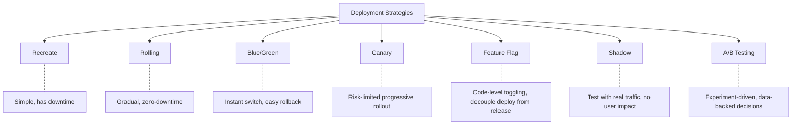
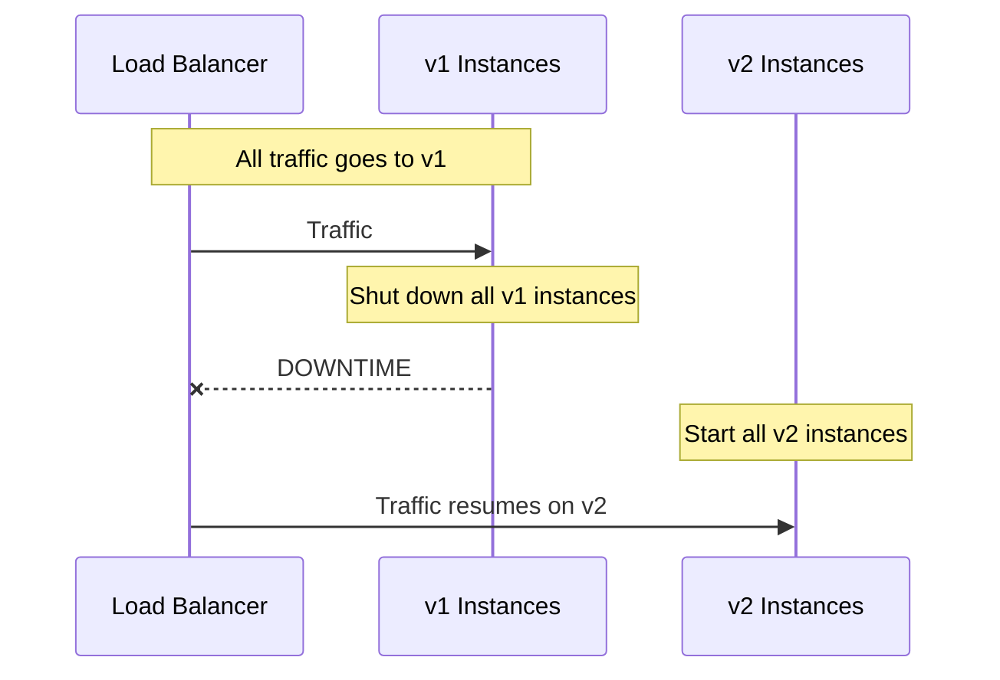
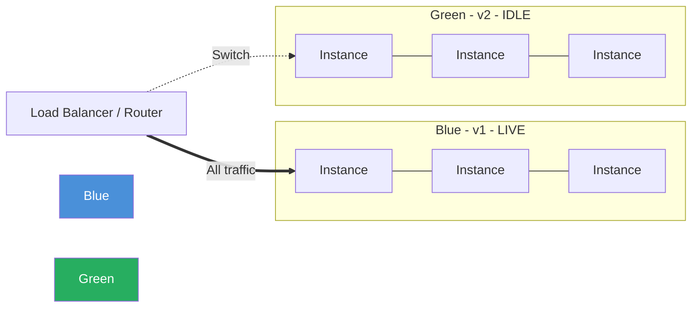
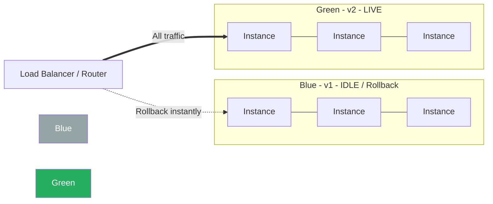
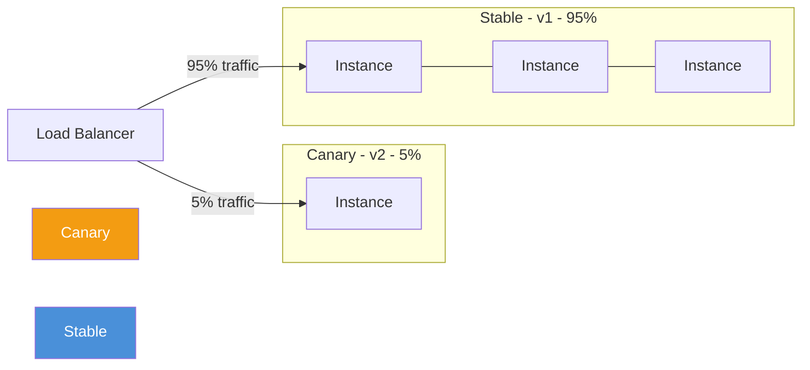
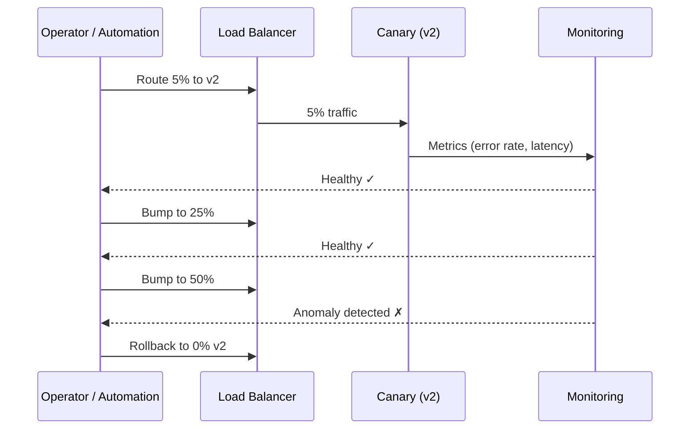
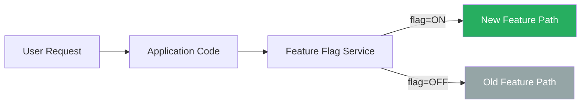
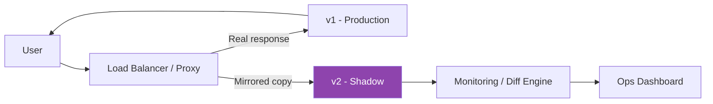
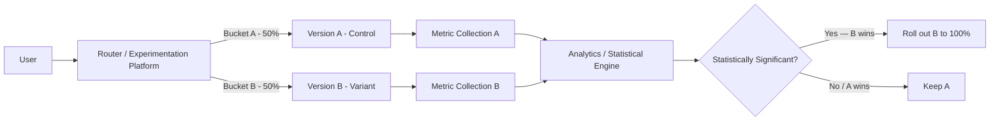

# Deployment Strategies


## Youtube

- [Deployment Strategies Explained: Blue-Green, Canary, Rolling & Shadow Deployments | DevOps Guide](https://www.youtube.com/watch?v=uIeUiAborZs)


## Theories

### Which Sort of Companies Can Afford Downtimes?

**Can afford planned downtimes:**

- Internal enterprise tools (HR portals, internal dashboards) — users are employees, outages during off-hours are acceptable
- B2B SaaS with scheduled maintenance windows (e.g., SAP, Oracle ERP) — contractual SLAs allow planned windows
- Gaming servers during off-peak hours (e.g., scheduled weekly maintenance in MMOs)
- Government/public-sector portals with published maintenance schedules
- Early-stage startups with small user bases and no strict SLAs

**Cannot afford any downtime (zero-downtime required):**

- Financial services / payment processors (Stripe, Visa, stock exchanges) — every second of downtime = lost revenue and regulatory risk
- E-commerce at scale (Amazon, Shopify) — downtime during peak hours costs millions
- Healthcare / life-critical systems (hospital monitoring, emergency services)
- Social media / messaging platforms (WhatsApp, Slack) — user trust erodes quickly
- Streaming platforms (Netflix, YouTube) — global audience across all time zones, no safe maintenance window
- Cloud infrastructure providers (AWS, GCP, Azure) — their downtime cascades into thousands of customers

> **Rule of thumb:** The more users you have, the more globally distributed they are, and the more revenue-critical your service is, the less downtime you can tolerate — and the more sophisticated your deployment strategy must be.

---

### Overview of Deployment Strategies



---

### 1. Recreate Deployment

**How it works:** Shut down all instances of the old version (v1), then start all instances of the new version (v2). There is a gap where nothing is running.



**Real-world use cases:**

- Internal tools and back-office systems
- Dev/staging environments
- Batch-processing systems with maintenance windows
- Legacy monoliths that cannot run two versions simultaneously (e.g., schema-breaking DB migrations)

**Advantages:**

- Simplest to implement and understand
- No version compatibility concerns — only one version runs at a time
- Clean state: no mixed traffic between versions
- Lowest infrastructure cost (no extra capacity needed)

**Disadvantages:**

- **Downtime is unavoidable** — service is completely unavailable during switch
- Rollback means repeating the entire process with the old version
- Not suitable for user-facing, high-availability services
- Deployment duration scales with instance count

---

### 2. Rolling Deployment

**How it works:** Gradually replace old instances with new ones, one (or a batch) at a time. At any point, a mix of v1 and v2 instances serve traffic.

```mermaid
flowchart LR
    subgraph Step 1
        A1[v1] --- A2[v1] --- A3[v1] --- A4[v1]
    end
    subgraph Step 2
        B1[v2] --- B2[v1] --- B3[v1] --- B4[v1]
    end
    subgraph Step 3
        C1[v2] --- C2[v2] --- C3[v1] --- C4[v1]
    end
    subgraph Step 4
        D1[v2] --- D2[v2] --- D3[v2] --- D4[v2]
    end

    Step 1 --> Step 2 --> Step 3 --> Step 4
```

**Real-world use cases:**

- Kubernetes default deployment strategy (`RollingUpdate`)
- AWS ECS rolling updates
- Most standard web application deployments
- Microservices with backward-compatible API changes

**Advantages:**

- Zero downtime
- Gradual rollout reduces blast radius
- No extra infrastructure needed (replaces in-place)
- Built-in to most orchestration platforms (K8s, ECS, Nomad)

**Disadvantages:**

- **Two versions run simultaneously** — requires backward compatibility (APIs, DB schema)
- Slower rollout and rollback compared to Blue/Green
- Harder to debug issues when both versions serve traffic
- No instant rollback (must roll forward or roll back incrementally)

---

### 3. Blue/Green Deployment

**How it works:** Maintain two identical environments — **Blue** (current live) and **Green** (new version). Deploy v2 to Green, test it, then switch all traffic from Blue to Green at once.



After switch:



**Real-world use cases:**

- Amazon (retail platform deployments)
- Netflix (service deployments with instant rollback needs)
- Financial trading platforms
- Any system where instant rollback is critical

**Advantages:**

- **Instant cutover** and **instant rollback** (just switch the router/LB)
- Green environment can be fully tested before any user sees it
- Zero downtime
- Clean separation — no mixed versions serving traffic simultaneously

**Disadvantages:**

- **Double the infrastructure** cost (two full environments)
- Database migrations must be backward-compatible for rollback to work
- Stateful services (long-lived connections, sessions) need careful draining
- More complex to manage for very large-scale infrastructure

---

### 4. Canary Deployment

**How it works:** Deploy the new version to a small subset of instances/users first. Monitor error rates, latency, and business metrics. If healthy, progressively shift more traffic. If not, roll back immediately.



Progressive rollout steps: `5% → 10% → 25% → 50% → 100%`



**Real-world use cases:**

- Google (all major services use canary + automated analysis)
- Facebook/Meta (progressive rollout to data center regions)
- Kubernetes with Istio / Flagger / Argo Rollouts
- Any company needing data-driven confidence before full rollout

**Advantages:**

- **Limits blast radius** — only a fraction of users affected if something is wrong
- Real production traffic validates the release
- Fast rollback by shifting traffic back
- Can be fully automated with metric-based promotion/rollback

**Disadvantages:**

- Requires robust monitoring and alerting infrastructure
- Two versions run simultaneously — backward compatibility needed
- Small canary percentage may not catch rare edge-case bugs
- More complex routing and traffic-splitting setup

---

### 5. Feature Flag (Feature Toggle) Deployment

**How it works:** Deploy the new code to all instances, but wrap new functionality behind a flag. The flag is toggled on/off via a configuration service, not a redeployment. This **decouples deployment from release**.



**Real-world use cases:**

- GitHub (feature flags for almost every new feature — ship dark, enable incrementally)
- LaunchDarkly, Unleash, Split.io customers
- Mobile apps where you cannot force-update users but can toggle server-side behavior
- Gradual feature rollouts by user segment (beta users, internal, % rollout)

**Advantages:**

- **Decouple deploy from release** — deploy anytime, release when ready
- Instant kill-switch: disable a broken feature without redeploying
- Target specific user segments (internal, beta, region, plan tier)
- Enables trunk-based development — merge to main early and often

**Disadvantages:**

- Code complexity: flag conditionals can accumulate ("flag debt")
- Stale flags must be cleaned up or the codebase becomes hard to maintain
- Testing permutations of flag combinations can become exponential
- Requires a reliable feature flag management system

---

### 6. Shadow (Dark Launch / Traffic Mirroring) Deployment

**How it works:** Route a copy of real production traffic to the new version (v2) in parallel. v1 still serves all real responses. v2 processes the requests but its responses are **discarded** — only observed for correctness and performance.



**Real-world use cases:**

- Financial systems validating a new pricing/risk engine against production traffic
- Netflix testing new recommendation models
- Payment processors verifying a rewritten service produces identical results
- Database migration validation (dual-write / shadow read)

**Advantages:**

- **Zero user impact** — users always get v1 responses
- Tests with real, not synthetic, traffic patterns
- Catches edge cases that unit/integration tests miss
- Ideal for validating rewrites, migrations, and ML model replacements

**Disadvantages:**

- **Double the compute/resource cost** for processing
- Side effects are dangerous: v2 must NOT write to production databases, send emails, charge cards, etc.
- Complex to set up traffic mirroring and response comparison
- Results comparison (diffing) can be non-trivial for non-deterministic responses

---

### 7. A/B Testing Deployment

**How it works:** Route different user segments to different versions — not primarily for risk mitigation, but to **measure which version performs better** on a business metric (CTR, conversion, revenue). It is experiment-driven.



**Real-world use cases:**

- Google (thousands of simultaneous A/B experiments on Search, Ads, etc.)
- Amazon (product page layout, pricing display, checkout flow)
- Booking.com (one of the most experiment-heavy companies — tests everything)
- Any product team optimizing conversion funnels, onboarding flows, or UI changes

**Advantages:**

- **Data-driven decisions** — statistical evidence, not opinions
- Directly measures business impact (revenue, engagement, retention)
- Can run many experiments simultaneously with proper bucketing
- Pairs well with feature flags for targeting

**Disadvantages:**

- Requires proper experimentation infrastructure and statistical rigor
- Results take time to reach statistical significance
- User experience inconsistency while experiment runs
- Can be misused (too many overlapping experiments causing interaction effects)

---

### Which Sort of Companies Use Which Deployment Strategy?

| Strategy | Typical Users | Why |
|---|---|---|
| **Recreate** | Small teams, internal tools, legacy monoliths, dev/staging environments | Simplicity; downtime is acceptable |
| **Rolling** | Most web companies, any K8s/ECS user, mid-size SaaS | Default in orchestrators; zero-downtime; no extra infra |
| **Blue/Green** | Banks, e-commerce, trading platforms (Amazon, Netflix) | Instant rollback; clean cutover |
| **Canary** | Google, Meta, large SaaS, any company with strong observability | Risk-limited progressive rollout; automated analysis |
| **Feature Flag** | GitHub, SaaS products, mobile-backend teams | Decouple deploy from release; instant kill-switch |
| **Shadow** | Financial services, ML platforms, payment processors | Validate rewrites with real traffic; zero user risk |
| **A/B Testing** | Google, Amazon, Booking.com, any product-led company | Measure business impact with statistical rigor |

> **In practice, mature companies combine multiple strategies.** For example:
>
> - **Canary + Feature Flags**: deploy canary to 5%, then use flags to enable new features for specific user segments
> - **Blue/Green + Canary**: Blue/Green for infrastructure switch, Canary for traffic ramp
> - **Feature Flags + A/B Testing**: flag controls who sees what, experimentation platform measures impact
> - **Shadow + Canary**: shadow first to validate correctness, then canary to validate under real user responses

---

### Quick Comparison

| Strategy | Downtime | Rollback Speed | Infra Cost | Complexity | Real Traffic Testing |
|---|---|---|---|---|---|
| Recreate | **Yes** | Slow (redeploy) | Low | Very Low | No |
| Rolling | No | Medium | Low | Low | Yes (gradual) |
| Blue/Green | No | **Instant** | **High (2x)** | Medium | Pre-switch only |
| Canary | No | Fast | Low-Medium | Medium-High | Yes (subset) |
| Feature Flag | No | **Instant** (toggle) | Low | Medium | Yes (targeted) |
| Shadow | No | N/A (not serving) | **High (2x)** | High | Yes (mirrored) |
| A/B Testing | No | Fast (revert bucket) | Medium | High | Yes (bucketed) |