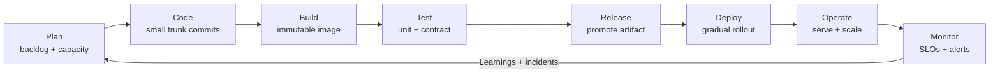
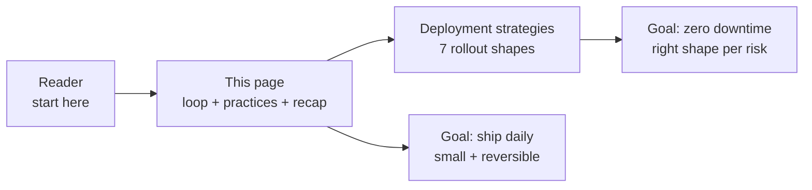

# DevOps

## Theory

DevOps is the practice of shipping software from commit to production quickly, safely, and repeatedly.
It matters because every system-design decision — from stateless services to managed queues to multi-AZ data
stores — succeeds or fails at deploy time. A clean architecture with a fragile release process still causes
outages, slow rollbacks, and fear of deploys. Key subtopics: continuous integration and delivery (build, test,
release), infrastructure as code (versioned, reviewable environments), containers and orchestration (Docker,
Kubernetes), deployment strategies (rolling, blue-green, canary, feature flags), and observability (metrics,
logs, traces, alerts).

DevOps for backend engineers is not a separate team you hand builds to. It is the set of guarantees your
service must hold while it changes underneath live traffic: every commit is built and tested the same way,
every environment is reproducible from code, every deploy is gradual and reversible, and every failure is
visible within minutes. Every pipeline you define, every image you publish, every flag you gate, and every
dashboard you watch is a promise about how fast you can move without breaking users. This landing page teaches
you how to reason about those promises before you dive into any single tool.

Think of this section as a loop wrapped around a platform. The loop is plan, code, build, test, release,
deploy, operate, and monitor, feeding back into plan on every iteration. The platform underneath the loop is
versioned infrastructure, immutable images, automated rollout controls, and telemetry that tells you whether
the new version is actually healthier than the old one. When one part breaks — a flaky test, a drifted
environment, a bad image, a blind rollout — the loop slows down or lies to you, and interviews probe exactly
where you would look first.

This guide takes you from mindset to map to mechanics. You will learn why elite teams treat deploys as routine
rather than events, how the CI/CD loop compresses lead time while containing blast radius, which page in this
section answers which question and in what order to read them, how continuous integration, infrastructure as
code, containers, and observability compose into one platform, how deployment strategies trade downtime against
risk and cost, and which habits interviewers expect every backend engineer to defend.

> Scope note: this page is the interview-ready overview for the whole DevOps section — mindset, vocabulary,
> delivery loop, reading map, core practices, deployment recap, and process habits. Deep mechanics live in the
> linked pages (strategy-by-strategy rollout diagrams, rollback drills, and trade-off tables). It assumes basic
> Git and HTTP plus one cloud provider at a high level and focuses on the decisions interviewers probe:
> pipelines, environments, images, rollouts, and telemetry.

### Topics Covered

1. [What DevOps Is and Why It Matters](#1-what-devops-is-and-why-it-matters)
2. [Map of This Section](#2-map-of-this-section)
3. [Continuous Integration and Delivery](#3-continuous-integration-and-delivery)
4. [Infrastructure as Code](#4-infrastructure-as-code)
5. [Containers and Orchestration](#5-containers-and-orchestration)
6. [Observability and Deployment Recap](#6-observability-and-deployment-recap)
7. [Interview Questions and Answers](#7-interview-questions-and-answers)

### 1. What DevOps Is and Why It Matters

DevOps joins development and operations into one feedback loop with shared ownership. Developers own code
through production behavior, operators codify infrastructure as software, and both sides optimize the same
metrics: lead time from commit to prod, deploy frequency, change failure rate, and mean time to recovery.
An interviewer hears seniority when you frame every tool choice through those four outcomes rather than
through tool names alone.

Four realities make DevOps inseparable from backend design. First, the backend is what gets deployed:
stateless APIs scale horizontally and roll cleanly, while sticky sessions, local disks, and unmigrated
schemas turn every rollout into a special case. Second, the backend defines deployability: health checks,
readiness probes, graceful shutdown, idempotent handlers, and backward-compatible contracts decide whether
old and new versions can coexist during a rollout. Third, the backend owns operational load: noisy logs,
missing metrics, and unalerted queues page humans at night. Fourth, the backend sets recovery speed:
migrations that roll back, flags that kill a path in seconds, and images that re-deploy deterministically
decide whether an incident lasts five minutes or five hours.

The cost curve is the business argument. A bug caught by a unit test costs a rebuild. Caught in code review
it costs a comment thread. Caught by a canary with automatic rollback it costs a few error-budget points.
Caught by users on a big-bang Friday deploy it costs status pages, refunds, and trust. Continuous integration,
small batches, trunk discipline, and progressive delivery exist to move discovery left and shrink batch size,
so failures are small, obvious, and reversible by construction.

What DevOps pipelines uniquely control, end to end:

- **Build once, promote everywhere.** One immutable artifact per commit — container image plus SBOM — flows
  from dev to staging to prod without rebuilds, so what you tested is what you ship.
- **Test in layers, fail fast.** Fast unit checks on every push, contract and integration suites on merge,
  smoke and load checks post-deploy, with flaky tests quarantined rather than tolerated.
- **Release small, roll forward or back fast.** Trunk-based work, short-lived branches, gated merges, and
  rollout controllers that pause or revert on error budget burn.
- **Environment parity by code.** No click-ops snowflakes; VPCs, clusters, queues, and IAM come from reviewed
  modules with drift detection and plan-on-PR.
- **Observe every rollout.** Version-tagged metrics, structured logs, and traces plus deployment markers, so
  any regression maps to the exact build and flag combination that caused it.



*The diagram above shows the CI/CD loop: every commit travels one direction from plan to monitor, and monitor feeds the next plan cycle.*

A thirty-second script shows how to open any interview answer. "We build one image per commit, gate merges on
fast tests, promote the same digest through staging to prod, roll out progressively with health-gated steps and
automatic rollback on SLO burn, and tag all telemetry by version so we know within minutes whether the new
build is healthier." That single paragraph demonstrates artifact discipline, test layering, promotion, rollout
safety, and observability — the full loop compressed.

### 2. Map of This Section

This section is organized from loop to platform to rollout so you always know where you are. This landing page
teaches the shared mindset: why DevOps owns delivery outcomes, how the CI/CD loop flows, and how the four core
practices fit together. The companion deep-dive page turns rollout theory into strategy-by-strategy mechanics
you can whiteboard. Read this page first for vocabulary and trade-offs, then go deep on deployment shapes
before any interview that asks "how would you ship this with zero downtime."

| Page | What it covers | When to read it |
|---|---|---|
| This page (DevOps overview) | Delivery loop, CI/CD, IaC, containers, observability, rollout recap, Q&A | First, for the end-to-end mental model and interview baseline |
| Deployment strategies | Downtime tolerance, recreate, rolling, blue-green, canary, feature flags, shadow, A/B testing | When asked "how do you release v2 without breaking v1" or "compare blue-green vs canary" |

Three reading paths cover the common interview shapes. The delivery path stays on this page and runs CI/CD to
containers to progressive rollouts: it answers every "take this service from commit to prod safely" arc from
build to health-gated release. The infrastructure path runs IaC essentials to environment promotion to drift
control: it answers every "keep staging and prod identical and reviewable" arc from modules to plan-on-PR.
The release-safety path moves from this page's recap table into the deployment-strategies page: it answers
every "pick a strategy under downtime, cost, and risk constraints" arc from recreate for internal tools to
canary plus flags for payment paths.



*The diagram above shows the recommended order: build the loop mental model here, then specialize in rollout mechanics on the companion page.*

Two cross-cutting notes apply to every page. First, each page follows the same cadence: theory with scope,
layered explanation, runnable snippets you can copy, a trade-off table, and Q&A — so once you learn one
page's rhythm you can skim the other fast. Second, practices compose across pages: a CI decision (image per
commit) pairs with an IaC decision (immutable environments) and a rollout decision (health-gated canary), and
interviewers award full marks when you name the trio instead of one control in isolation.

### 3. Continuous Integration and Delivery

Continuous integration means every commit is built and verified the same automated way within minutes. Small
trunk commits merge daily, each push triggers lint, typecheck, unit tests, and image build, and merges are
gated on green checks plus review. Long-lived branches, Friday mega-merges, and "works on my machine" images
are the smells CI removes. The senior habit is keeping main always releasable: if the suite is red, fixing it
outranks new work, and flaky tests are quarantined with an owner and a deadline rather than retried silently.

Continuous delivery promotes the same immutable artifact through environments without rebuilding. The commit
SHA becomes the image tag, staging runs the exact digest prod will run, and promotion is a pointer move gated
by smoke tests and manual approval only where regulation demands it. Continuous deployment goes one step
further and auto-promotes on green signals. Deciding between the two is a risk call: auto-deploy stateless
APIs with strong SLO rollback, gate payment or migration paths that need human judgment.

A minimal pipeline sketch shows the layering — fast checks first, slow suites after, promotion last:

```yaml
# .github/workflows/ci.yml: fast feedback on push, promotion only on main.
name: ci
on:
  push:
    branches: ["**"]
jobs:
  verify:
    runs-on: ubuntu-latest
    steps:
      - uses: actions/checkout@v4
      - run: npm ci && npm run lint && npm test -- --watchAll=false
      - run: docker build -t app:${{ github.sha }} .
  promote:
    needs: verify
    if: github.ref == 'refs/heads/main'
    runs-on: ubuntu-latest
    steps:
      - run: docker tag app:${{ github.sha }} registry/app:${{ github.sha }}
      - run: docker push registry/app:${{ github.sha }}
```

The sketch is explained stage by stage. The verify job runs on every branch so breakage is found while the
context is fresh, with lint before tests so style fails cheap. The image builds from the same SHA every time,
giving one digest to trace from log line back to commit. The promote job runs only on main after verify
passes, so feature branches never publish prod candidates. Missing any stage reopens its failure class: no
gate invites red main, no pinned digest invites untested prod bytes.

### 4. Infrastructure as Code

Infrastructure as code means environments are declared in versioned files, reviewed like app code, and applied
through automation instead of console clicks. VPCs, subnets, clusters, queues, buckets, IAM roles, and DNS
all live in modules with inputs, outputs, and pinned versions. Every change opens a pull request, renders a
plan diff, and applies only after approval, so `git log` answers "who changed prod networking last Tuesday"
as precisely as it answers who changed the API.

Four habits separate real IaC from scripts in a repo. First, declarative over imperative: state the desired
end state and let the tool converge, rather than scripting click order that drifts on retry. Second, remote
state with locking: one source of truth per environment so concurrent applies cannot corrupt the world view.
Third, module reuse with thin environment roots: shared networking and cluster modules, small per-env files
for names, sizes, and counts. Fourth, drift detection and policy gates: scheduled plan-only runs plus rules
that reject public buckets, open security groups, or unencrypted stores before apply.

```hcl
# environments/prod/main.tf: thin root over versioned modules.
module "network" {
  source   = "../../modules/network"
  version  = "1.4.0"
  env      = "prod"
  cidr     = "10.20.0.0/16"
  az_count = 3
}

module "cluster" {
  source        = "../../modules/eks"
  version       = "1.4.0"
  env           = "prod"
  vpc_id        = module.network.vpc_id
  instance_type = "m6i.large"
  min_nodes     = 3
}
```

The snippet is explained line by line. Each module is pinned to a version so upgrades are deliberate diffs,
not floating surprises. The network module owns CIDRs and AZ spread, the cluster module consumes its outputs
rather than hardcoding IDs, and the prod root carries only values that differ per environment. A plan-on-PR
run shows exactly which subnets or node groups would change, reviewers approve the diff, and apply becomes a
boring, repeatable event — the operational definition of done.

### 5. Containers and Orchestration

Containers package the app with its runtime, libraries, and config into one immutable image that runs
identically on a laptop, in staging, and in prod. Docker builds that image in layers, so rebuilds reuse
cache and registries store each digest once. The backend contract is simple: listen on a port, answer
health checks honestly, hold no local state that cannot be lost, and exit cleanly on signal. Images that
obey it roll cleanly; images that stash sessions on disk or ignore termination signals turn every deploy
into a drain-time gamble.

Orchestration runs those images at fleet scale. Kubernetes Deployments declare the desired state — image
digest, replica count, rollout strategy, probes — and the controller converges reality toward it one
health-gated step at a time. Services give stable discovery over shifting pods, ConfigMaps and Secrets
inject per-environment values without rebuilding, and Horizontal Pod Autoscalers grow replicas on CPU or
custom metrics. The interview baseline is the rollout: maxSurge and maxUnavailable bound disruption,
readiness gates keep bad pods out of the endpoint set, and `kubectl rollout undo` reverts to the last
known-good ReplicaSet in seconds.

```yaml
# deployment.yaml: health-gated rolling release of one pinned digest.
apiVersion: apps/v1
kind: Deployment
metadata:
  name: checkout-api
spec:
  replicas: 6
  strategy:
    type: RollingUpdate
    rollingUpdate:
      maxSurge: 1
      maxUnavailable: 0
  template:
    spec:
      containers:
        - name: api
          image: registry/checkout-api:a1b2c3d
          ports:
            - containerPort: 8080
          readinessProbe:
            httpGet: { path: /readyz, port: 8080 }
            periodSeconds: 5
          livenessProbe:
            httpGet: { path: /healthz, port: 8080 }
            periodSeconds: 15
```

The snippet is explained field by field. The pinned digest guarantees every replica runs the exact tested
bytes, never a floating tag. RollingUpdate with zero unavailable pods keeps capacity intact while one surge
pod proves itself. The readiness probe gates endpoint membership so new pods take traffic only when warm,
while liveness restarts genuinely wedged processes. Pair this with resource requests plus limits and
termination grace handling in app code, and the orchestrator can replace the whole fleet without dropping
a healthy request.

### 6. Observability and Deployment Recap

Observability answers the only rollout question that matters: is the new version healthier than the old one.
Metrics track rates, errors, durations, and saturation per version; structured logs carry trace and version
IDs so any error maps to its build and flag mix; traces show which hop regressed across services; alerts on
SLO burn page before users report. Every deploy stamps a marker — version, time, author, flags — onto all
four signals, and dashboards split old versus new side by side for the first hour. A rollout without that
split is flying blind: traffic moved but nobody can prove health moved with it.

Four habits make telemetry rollout-ready. First, tag everything by version and flag state at emit time, not
by joining later. Second, define service-level objectives for availability and latency with error budgets
that gate promotion and trigger automatic halt or revert. Third, keep golden signals per endpoint — traffic,
errors, latency, saturation — with checkout and login on their own burn-rate alerts. Fourth, log deploys as
events beside metrics so any spike resolves to "canary 5% at 14:02" in one glance.

| Strategy | Downtime | Risk | Cost | Reach for it when |
|---|---|---|---|---|
| Recreate | Yes | High | Low | Internal tools with agreed maintenance windows |
| Rolling | None | Medium | Low | Stateless APIs that tolerate mixed versions briefly |
| Blue-green | None | Low | High (2x envs) | Instant switch plus instant revert with full parity |
| Canary | None | Lowest | Medium | Risky payment or core paths needing metric-gated steps |
| Feature flag | None | Lowest | Medium | Decoupling deploy from release, per-user or percent rollout |
| Shadow | None | Low | High (dup traffic) | Validating new paths against real traffic without user impact |
| A/B testing | None | Low | Medium | Experiment-driven UI or ranking calls needing data-backed choice |

The table is the decision shortcut; the deployment-strategies page carries the full diagrams, sequence
flows, and rollback drills per row. Read it as constraints first: if downtime is allowed, recreate wins on
simplicity. If it is not, rolling is the default, blue-green buys instant revert at double cost, and canary
plus flags buys the smallest blast radius for the highest-risk changes. Interviewers award full marks when
you pair the shape with its guardrail — health checks for rolling, traffic switch plus parity for
blue-green, SLO-gated steps plus fast revert for canary, kill switch plus targeting rules for flags.

### 7. Interview Questions and Answers

**Q1 (Beginner): What is DevOps in one paragraph?**
The loop and platform that take code from commit to production quickly and safely: CI builds and tests every
change, delivery promotes one immutable artifact, IaC keeps environments reproducible, containers isolate
runtime, progressive rollouts limit blast radius, and observability proves each release is healthier.

**Q2 (Beginner): Continuous integration versus delivery versus deployment?**
Integration builds and tests every push to trunk with gates on green. Delivery promotes the same tested
artifact to prod-readiness with approval only where risk demands it. Deployment auto-promotes on green
signals with SLO-gated rollback. Teams auto-deploy stateless paths and gate migrations or money movement.

**Q3 (Beginner): Why is infrastructure as code worth the overhead?**
Because environments become reviewed, repeatable, and auditable: plan diffs on PRs, pinned module versions,
remote state with locking, and drift detection replace snowflake consoles. `git log` then explains every
prod change, and rebuilds produce identical networks, clusters, and IAM instead of folklore.

**Q4 (Intermediate): Containers versus virtual machines — when does it matter?**
Containers share the host kernel with isolated user space, so they start in milliseconds and pack densely —
ideal for microservices that scale and roll often. VMs carry full guest OS images with stronger isolation
for untrusted or kernel-sensitive workloads. Most backends containerize services and reserve VMs for the
nodes underneath or for strict multi-tenant boundaries.

**Q5 (Intermediate): How does a Kubernetes rolling update keep traffic healthy?**
The controller creates surge pods on the new digest, waits for readiness probes to pass before adding them
to endpoints, then retires old pods within maxUnavailable bounds. Bad images never reach full traffic
because readiness fails closed, and `rollout undo` restores the last ReplicaSet. Probes plus digest
pinning plus resource limits are the trio to name.

**Q6 (Intermediate): Blue-green versus canary — how do you choose?**
Blue-green runs two full environments and flips the router for instant switch and instant revert, at double
cost and with data-migration care. Canary shifts a small percent, watches SLOs, and steps up or reverts —
slower but cheapest in blast radius. Choose blue-green for parity plus revert speed, canary for risky
changes that need metric proof, and combine either with feature flags for per-user control.

**Q7 (Intermediate): Your new release burns the error budget — what do you do?**
Halt the rollout at the current step, revert traffic to the last known-good version, confirm SLOs recover,
then read version-tagged traces and logs to find the regressed hop. Fix forward only for trivial flag-offs;
otherwise cut a new image, replay through staging, and re-roll progressively. Record the trigger,
detection time, and revert time in the incident note.

**Q8 (Senior): Design the pipeline for a checkout service with zero-downtime deploys.**
One image per commit with contract plus integration gates, promotion of the same digest through staging with
smoke and load checks, IaC-managed prod with plan-on-PR, canary rollout with readiness gates and SLO-based
auto-revert, flag-gated risky paths with instant kill switch, backward-compatible migrations in expand then
contract phases, and version-tagged metrics, logs, and traces with deployment markers and burn-rate alerts.

## Github

- [marcel-dempers/docker-development-youtube-series](https://github.com/marcel-dempers/docker-development-youtube-series)


## Blogs and Websites

- [Master DevOps If You Master it : System Design !!](https://dev.to/aws-builders/system-design-for-devops-engineers-45lh)
- [Top 110+ DevOps Interview Questions and Answers for 2025](https://dev.to/aws-builders/top-110-devops-interview-questions-and-answers-for-2025-4h4n)
- [NotHarshhaa/DevOps-Interview-Questions](https://github.com/NotHarshhaa/DevOps-Interview-Questions)
- [Learn DevSecOps and API Security](https://www.freecodecamp.org/news/learn-devsecops-and-api-security/)


## Youtube

### Channels and playlists

- [TechWorld with Nana](https://www.youtube.com/@TechWorldwithNana)

- [Abhishek.Veeramalla](https://www.youtube.com/@AbhishekVeeramalla/playlists)
  - [DEVOPS ZERO TO HERO COURSE](https://www.youtube.com/playlist?list=PLdpzxOOAlwvIKMhk8WhzN1pYoJ1YU8Csa)
  - [AWS Zero to Hero - AWS Simplified](https://www.youtube.com/playlist?list=PLdpzxOOAlwvLNOxX0RfndiYSt1Le9azze)
  - [Terraform Zero to Hero](https://www.youtube.com/playlist?list=PLdpzxOOAlwvI0O4PeKVV1-yJoX2AqIWuf)
  - [Learn Observability in 5 hours | Tool wise Demo + Complete Demo using Open Telemetry](https://www.youtube.com/watch?v=cYAE0ZhT43c)
  - [Projects](#)
    - [Create EKS Cluster with VPC using Terraform | Real Time Terraform Modules Implementation](https://www.youtube.com/watch?v=_BTpd2oYafM)
      - [iam-veeramalla/terraform-eks](https://github.com/iam-veeramalla/terraform-eks)
    - [Kubernetes End to End project on EKS | EKS Install and app deploy with Ingress](https://www.youtube.com/watch?v=RRCrY12VY_s)
      - [AWS EKS](https://github.com/iam-veeramalla/aws-devops-zero-to-hero/tree/main/day-22)
    - [Deploy an E Commerce Three Tier application on AWS EKS | 8 Services and 2 Databases](https://www.youtube.com/watch?v=8T0UnSgywzY)
      - [Three Tier Architecture Deployment on AWS EKS](https://github.com/iam-veeramalla/three-tier-architecture-demo)
    - [Ultimate DevOps Project Implementation](https://udemy.com/course/ultimate-devops-project-with-resume-preparation/)
    - [AWS EKS Kubernetes Tutorial [Full Course]](https://www.youtube.com/playlist?list=PLiMWaCMwGJXnKY6XmeifEpjIfkWRo9v2l)
      - [AWS EKS Kubernetes Tutorial](https://github.com/antonputra/tutorials/tree/main/lessons/195)

- [Rayan Labs](https://www.youtube.com/@RayanLabs/playlists)
  - [DevOps Training](https://www.youtube.com/playlist?list=PLZv1rlQ0kEKh99f1AWdpG0ZQM-4VGaQN5)

- [TrainWithShubham](https://www.youtube.com/@TrainWithShubham)
  - [2-Tier Application Deployment Series](https://www.youtube.com/playlist?list=PLlfy9GnSVerRpz3u8casjjv1eNJr9tlR9)
  - [DevSecOps End to End CICD Project | DevOps Engineer | SonarQube + OWASP + Trivy + Docker + Jenkins](https://www.youtube.com/watch?v=CoU38rJIjRY)
  - [Deploying MERN stack Application on Kubernetes using Kubeadm | DevOps Bootcamp](https://www.youtube.com/watch?v=h-ul8l5ekPg)

- [Tech Tutorials with Piyush](https://www.youtube.com/@TechTutorialswithPiyush/playlists)

- [Kubesimplify](https://www.youtube.com/@kubesimplify/playlists)

- [That DevOps Guy](https://www.youtube.com/@MarcelDempers/playlists)

- [KodeKloud](https://www.youtube.com/@KodeKloud)