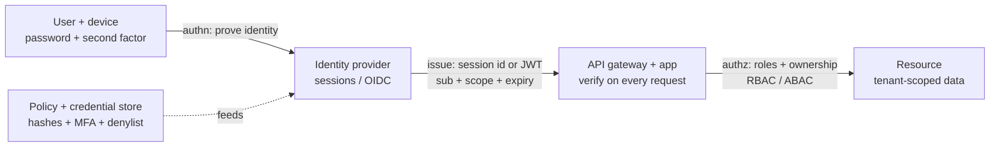
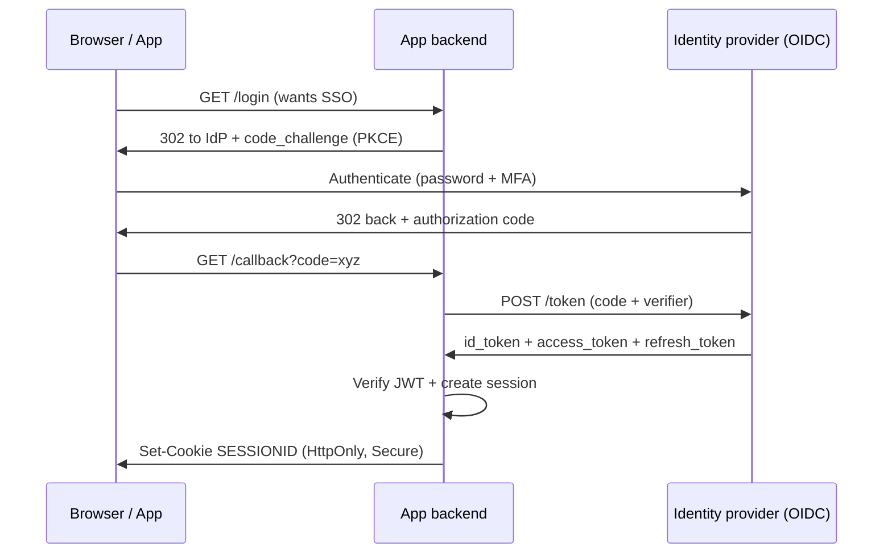
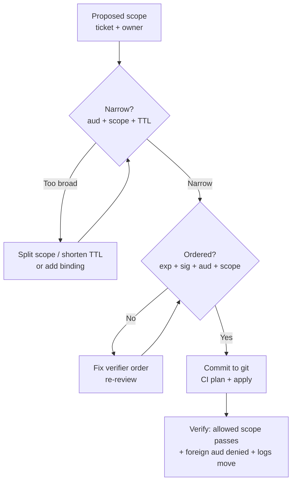
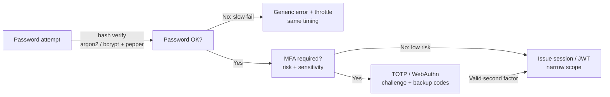
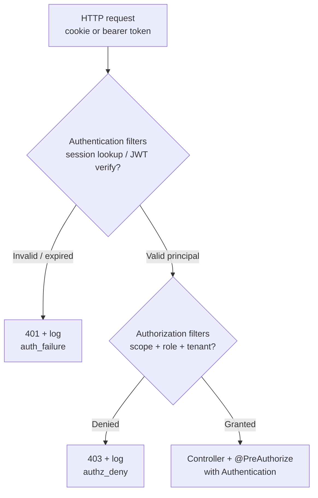

# Authentication and Authorization

## Theory

Authentication (authn) verifies *who* a caller is; authorization (authz) decides *what* they may do.
It matters because confusing the two leads to broken access control — identity must be established before permissions can be checked.
Key subtopics: sessions vs tokens (see JWT and OAuth), SSO, RBAC/ABAC (see RBAC), and enforcing authz on every request server-side.

Authentication is the identity checkpoint that answers "who is this caller and how sure are we," while authorization is the permission checkpoint that answers "what may this verified identity do on this resource under these conditions." It replaced the early-web default of a single shared password checked inline in each handler by inserting dedicated identity infrastructure: a credential store with slow hashes, a session or token issuer, a federated login layer for SSO, and a policy engine that re-checks permissions on every request. Each layer sees different signals — passwords, OTPs, and WebAuthn during login, session ids or JWT claims during requests, roles and attributes during access checks — and together they implement never-trust-the-client so only authenticated callers with explicit grants ever reach business logic.

This guide takes you from mental model to production operations. You will learn what authn and authz guarantee (and what they do not), how sessions, JWTs, and OIDC differ and compose, how to design OAuth2 flows and SSO that stay auditable, how to store passwords with bcrypt and argon2 plus MFA without locking users out, how the Spring Security filter chain enforces all of this on every request, and how attackers steal, forge, and replay identity. It closes with threats, best practices, and interview Q&A.

> Scope note: this page covers authentication and authorization operations for browser and API backends — sessions, JWT/OAuth2/OIDC, password hashing with bcrypt/argon2, MFA, RBAC/ABAC enforcement, and the Spring Security filter chain — not user provisioning pipelines or IAM policy authoring for cloud consoles. It assumes basic HTTP and TLS (cookies, headers, redirects) and focuses on the decisions interviewers probe: state, token lifetime, storage, and server-side enforcement.

### Topics Covered

1. [What AuthN and AuthZ Do and Why They Matter](#1-what-authn-and-authz-do-and-why-they-matter)
2. [Sessions vs JWT vs OIDC and Federated Identity](#2-sessions-vs-jwt-vs-oidc-and-federated-identity)
3. [OAuth2 Flows, SSO, and Token Design](#3-oauth2-flows-sso-and-token-design)
4. [Password Hashing, MFA, and Credential Storage](#4-password-hashing-mfa-and-credential-storage)
5. [Spring Security Filter Chain in Practice](#5-spring-security-filter-chain-in-practice)
6. [Threats and Mitigations](#6-threats-and-mitigations)
7. [Best Practices](#7-best-practices)
8. [Interview Questions and Answers](#8-interview-questions-and-answers)

### 1. What AuthN and AuthZ Do and Why They Matter

Authentication enforces an explicit identity policy at a trust boundary: this caller proved control of this credential with this strength, at this time, on this device, everything else is anonymous. When a user hits `POST https://api.example.com/orders`, four checkpoints may each vote: the TLS layer proves the server to the client, the session or JWT check proves the client to the server, the MFA policy decides whether that proof is strong enough for this action, and the RBAC/ABAC check decides whether this identity may create orders for this tenant. Any single deny stops the request, which is why layered identity survives one leaked password or one stolen token.

Consider life without a clean authn/authz split. Every handler re-implements `if (user.isAdmin)` from a client-supplied flag, passwords sit in cleartext or fast hashes, "remember me" means a user id in localStorage, and authorization is skipped on "internal" endpoints that turn out to be internet-reachable. Breaches compound the exposure: a SQL leak exposes reusable passwords everywhere, an XSS flaw mints admin sessions, and a confused deputy lets tenant A read tenant B by incrementing an id. Separating who-you-are from what-you-may-do shrinks that blast radius by making identity a single audited issuance point and permissions a server-side check that cannot be edited in DevTools.

The benefits compound at fleet scale:

- **Single identity decision.** Login, MFA, lockout, and anomaly checks happen once at issuance; downstream services verify a signature or session lookup instead of re-checking passwords.
- **Least-privilege access.** Short-lived tokens with narrow scopes and per-request authz checks mean a stolen token opens one drawer, not the building.
- **Revocable sessions.** Server-side session lists and token denylists answer "log this user out everywhere now" without waiting for expiry.
- **Attributable audit.** `auth_success`, `auth_failure`, `mfa_challenge`, and `authz_deny` events answer "who tried what, when, and which policy stopped it" without instrumenting business code.

Auth works best as an identity and permission control for traffic you serve: human logins, service-to-service calls with scoped tokens, and federated SSO across apps. It works poorly as transport security (a JWT does not encrypt — it only asserts), as input validation for payloads it carries, or as a fix for a broken access check — a valid token with `role: user` never becomes an admin unless your code trusts the client claim.

Authn and authz map to three classic questions you must not confuse. Identity (authn) establishes the subject — "this is alice@example.com via Google OIDC, auth_time 10:02, amr pwd+otp." Session or token binding proves continuity — "this request carries the same session id or bearer token issued to that subject." Permission (authz) evaluates policy — "alice with role seller in tenant acme may POST /orders but not refund them." When an interviewer asks "where would you enforce X," the answer maps to the layer: password strength at registration, MFA at login step-up, scopes at issuance, object ownership at the API handler.



*The diagram above shows layered enforcement: identity is proven once, bound to a session or token, and re-authorized against policy on every request so a mistake at one layer is still caught by the next.*

A request walks the stack in order, and each layer adds context the one below lacks. TLS proves the channel and server; the auth filter extracts the credential (cookie session id, `Authorization: Bearer` JWT, or API key), validates it (lookup plus expiry, or signature plus `iss`/`aud`/`exp`), and builds a principal with claims; the MFA/step-up rule checks authentication strength against the action sensitivity; and the authorization voter matches principal, action, and resource attributes against RBAC roles and ABAC rules. Logging happens at every verdict — success, failure, challenge, deny — which is what makes auth debugging a claim-and-policy exercise rather than guesswork.

Placement deserves explicit attention because interviewers draw it on whiteboards. Edge authentication (gateway validates tokens, WAF rate-limits `/login`) keeps junk off app hosts; service authentication (each microservice validates the same JWT JWKS or calls the session store) keeps trust zero-hop; and handler authorization (ownership check `order.tenantId == principal.tenantId`) keeps tenants isolated even when tokens are valid. Section 5 builds exactly this with Spring Security filters you can audit.

### 2. Sessions vs JWT vs OIDC and Federated Identity

The three identity carriers answer progressively different questions: what did I remember server-side, what did I assert cryptographically, and who vouched for the user. Keeping them straight answers half of all auth interview questions: revocation versus scale versus federation.

**Sessions (stateful) check each request against server memory.** The classic flow is a login POST that verifies the password hash, creates a random 128-bit session id, stores `{ sub, roles, expiry, device }` in Redis or a database, and sets `Set-Cookie: SESSIONID=abc; HttpOnly; Secure; SameSite=Lax`. Every later request presents the cookie, the server looks it up, and anonymous or expired ids are rejected. That makes revocation instant (`DEL sess:abc` logs the user out everywhere) and payloads tiny, but stateful: every app instance needs the shared store, and cross-domain mobile clients fight cookie semantics.

**JWTs (stateless) carry signed claims instead of a lookup.** The issuer signs a header plus payload — `sub`, `iss`, `aud`, `exp`, `scope`, `tenant` — with HS256 or RS256, and verifiers check the signature against a shared secret or JWKS endpoint plus lifetime and audience. That makes them fast and portable across gateways and microservices with no shared session store, but brittle: revocation needs a denylist or short expiry plus refresh rotation, payloads are visible to anyone holding them (base64, not encrypted), and a leaked signing key forges every user until rotation.

**OIDC (federated) outsources who-the-user-is to an identity provider.** Where sessions and JWTs are carriers, OIDC is a protocol on top of OAuth2 where Google, Entra ID, or Okta authenticates the user and returns an `id_token` (who they are) plus an `access_token` (what this client may do). The app never sees the password, gets SSO across properties for free, and inherits the provider MFA and anomaly detection. The price is indirection: redirects, code exchange, JWKS validation, and mapping external `sub` to internal accounts and roles, or one provider outage logs everyone out.



*The diagram above shows the OIDC authorization-code flow with PKCE: the browser proves identity at the provider, the backend exchanges the code for tokens, and the app mints its own session so later requests never replay provider tokens.*

The generations compare as follows across six axes. Speed favors JWT: signature check with cached JWKS and no store round-trip. Correctness favors sessions: instant revoke, idle timeout, and device binding without denylist plumbing. Federation favors OIDC: no password storage, one MFA rollout, one deprovisioning point. Cost inverts the same way: sessions cost Redis RAM and lookup latency, JWTs cost key-management and short-expiry churn, OIDC costs provider dependency plus claim-mapping toil. Operationally, teams stack all three: OIDC for human login, a session cookie for browser continuity, and scoped JWTs for API-to-API calls — never one in place of the others.

State, storage, and lifetime deserve a closer look because they confuse newcomers. Store session ids in `HttpOnly; Secure; SameSite` cookies so XSS cannot read them and CSRF is neutered; store JWT access tokens in memory (SPA) with 5-15 minute expiry and refresh tokens in httpOnly cookies with rotation and reuse detection; never store tokens in localStorage where any injected script exfiltrates them. Timeouts matter — idle 30 minutes plus absolute 12 hours for sessions, minutes for access tokens and days with rotation for refresh — so stolen carriers die quickly while legitimate users Glide through silent refresh.

A minimal truth table cements the behavior interviewers probe. A stolen session id with server revocation: lookup misses after `DEL`, request is anonymous despite a valid-looking cookie. A stolen JWT without denylist: signature still verifies until `exp`, only short lifetime bounds the abuse. A forged `role: admin` in localStorage: server ignores it because authz reads server claims, not client flags. A legitimate SSO login burst of 200 users after an IdP blip: sessions spike Redis, JWT verification spikes JWKS cache, the `/login` rate limit challenges before the IdP bill does. The lesson is composition: each carrier catches what the ones below cannot express.

### 3. OAuth2 Flows, SSO, and Token Design

Good token design reads like a contract: a short default-deny spine, narrow scopes above it, explicit audience and expiry, and nothing else. The ordering principle is deny-first validation on every request — the first check that fails decides the verdict and later checks never run. That single fact explains most auth outages: a service that checks scopes before signature lets forged tokens through, and a gateway that skips audience lets a token for the billing API spend itself on the admin API. Validate in fixed order — expiry, signature, issuer, audience, scope, ownership — and end every path with an explicit deny-plus-log rather than relying on a framework default.

**Scoped delegation beats shared passwords for anything you integrate.** An OAuth2 scope names exactly what the client may do — `orders:read` for the shipping widget, `profile:email` for the newsletter — and denies everything else by default, so a brand-new endpoint is closed to old tokens without anyone writing a rule for it. A broad token (`*` or a user password pasted into a third-party form) names nothing and allows everything, so it only takes one leak to lose the account and it rots as integrations accumulate. Use narrow scopes for every delegation you control (first-party SPAs, partner webhooks, CI deployers), and reserve coarse grants for the federated edge where the user explicitly consents: SSO login scopes, social profile reads, and calendar imports.

**Design tokens narrow in four dimensions.** First, audience: pin the tightest `aud` you can — `orders-api-prod`, not `*.example.com`. Second, scope: one grant per capability, never `admin` except documented break-glass. Third, lifetime: minutes for access tokens, rotation for refresh, so theft buys a window, not a lease. Fourth, binding: sender-constrained tokens (DPoP proof, mTLS cert, cookie `__Host-` prefix) so a copied string alone does not spend. A token that is wide in any dimension should carry a comment with owner and expiry, or it becomes permanent.

**Log the deny, sample the allow.** Every rejected token increments a counter and, at sampled volume, emits a record with timestamp, client id, audience, scope, and the check that fired. Those logs are your detection layer: a sudden `invalid_signature` spike is a key-confusion probe, `expired_token` from one client is clock skew, `insufficient_scope` on admin paths is privilege creep. Log allows sparingly (full allow-logging drowns disks on busy gateways) but always log refresh reuse and scope-escalation denies with the offending claim snippet.

**Keep scopes small, named, and versioned.** Past a dozen scopes, flat strings become unreviewable — group them into named capabilities (`orders.reader`, `refunds.approver`) referenced by one policy each, so adding a partner edits a grant, not the policy. Store the source of truth in git (authorization-server config, gateway `requiredScopes` blocks) and apply through CI with a plan/apply review, exactly like app code. Every scope gets a comment: what it grants, for whom, ticket reference. `Allow payments:write for partner X` with no owner is a finding in every audit.

Below is a commented token baseline in JWT claims showing the spine — issuer, audience, subject, narrow scope, short expiry, tenant binding:

```json
{
  "iss": "https://auth.example.com",
  "aud": "orders-api-prod",
  "sub": "user_9f42",
  "tenant": "acme",
  "scope": "orders:read orders:write",
  "auth_time": 1760000000,
  "acr": "urn:example:amr:pwd+otp",
  "exp": 1760000900,
  "iat": 1760000000,
  "jti": "tok_7d2c1a"
}
```

The claims are explained group by group. `iss` plus `aud` makes acceptance atomic — a token minted for staging never spends in prod, so a leaked dev key cannot cross environments. The `sub` plus `tenant` pair separates identity from tenancy: the same user in two tenants gets two tokens, and reviewers see the blast radius immediately. `scope` lists the only two capabilities granted, `auth_time` plus `acr` records how strongly the user proved identity (password plus OTP here), and `exp` minus `iat` bounds the window to fifteen minutes. The trailing `jti` is the unique id that lets a denylist revoke one token without killing the session, and documents single-use refresh semantics even where the engine would do it implicitly.

The client-credentials equivalent below maps one-to-one so you can read either flow in interviews — authorization-code with PKCE is the browser default (user consent, redirect, code exchange) while client-credentials serves service-to-service calls:

```bash
# Client-credentials grant for the shipping worker. No user, no browser, narrow scope.
curl -s -X POST https://auth.example.com/oauth/token \
  -d grant_type=client_credentials \
  -d client_id=shipping-worker \
  -d client_secret="$SHIPPING_SECRET" \
  -d audience=orders-api-prod \
  -d scope="orders:read"
# Returns {"access_token":"eyJ...","expires_in":600,"token_type":"Bearer"}
# Verifier checks: exp -> signature (JWKS) -> iss -> aud -> scope -> tenant.
```

The commands are explained briefly. `grant_type=client_credentials` sets the machine spine so no redirect or user session is involved. The `audience` plus `scope` pair is the delegation core: the token spends only on the orders API with read rights. `expires_in=600` bounds theft to ten minutes, and the verifier order (`exp` first, ownership last) mirrors the deny-first principle. Store the secret in a vault with rotation, never in git, or the grant becomes a password with extra steps.



*The diagram above shows the grant-review loop: narrow the delegation, fix the validation order, then ship through version control and verify both the allow and the deny.*

### 4. Password Hashing, MFA, and Credential Storage

Credential storage and second factors split the same policy across two vantage points: the hash decides how much a database leak costs, MFA decides how much a password leak costs. Neither replaces the other — argon2 cannot stop phishing alone, and TOTP cannot save cleartext passwords in a dump. Production stacks run both and keep them consistent from one reviewed source.

**For storage, argon2id is the current standard and bcrypt is the portable default.** One `argon2id` call covers memory-hardness and CPU-hardness together (no more parallel MD5/SHA-256 drift), per-password salts come free, and `m=64MiB, t=3, p=1` resists GPU cracking on commodity logins. Keep the parameters versioned alongside the hash (`$argon2id$v=19$m=65536,t=3,p=1$...`) so upgrades re-hash on next login. Pepper server-side (HMAC the password with a KMS secret before hashing) and alert if the pepper ever rotates unexpectedly, because a config change that drops the pepper silently weakens every comparison.

Verify from both sides after every change. From the allowed side, a correct password with `argon2.verify(stored, candidate)` and a TOTP code inside the ±1 step window should succeed; from a denied side (wrong password, reused code, scores of guesses), the same endpoint must return identical timing and a generic error, and the `auth_failure` counter plus the throttling log must move. Debugging order is fixed: check lockout state (is the account held?), then hash parameters (did the work factor change?), then clock skew (TOTP ±30s), then the store (`SELECT iterations, salt`), then the channel (`Secure` cookie missing mimics a login loop) — most "hashing blocks my deploy" reports are actually clock or cookie bugs.

**In practice, bcrypt and argon2 are adaptive cost functions, and SHA/MD5 are fast digests that must never touch passwords.** bcrypt defaults to cost 10-12 (each +1 doubles time); you add only a salt and a 72-byte input limit, and verification stays constant-time because comparison is hash-then-equals. argon2id adds memory (`m`), iterations (`t`), and parallelism (`p`) — tune so one login costs ~300-500 ms on prod hardware. Scrypt sits between them for legacy mobile KDFs. Use argon2id for new backends and bcrypt where the platform library is audited (Spring Security `BCryptPasswordEncoder`), and reserve SHA-256/HMAC for token peppering — never `SHA256(password)`, which a single GPU reverses at billions of guesses per second.

The Java below builds the classic registration-plus-login shape — pepper, adaptive hash, constant-time verify, re-hash on upgrade — with Spring Security primitives instead of hand-rolled crypto:

```java
// PasswordService.java — adaptive hashing with pepper + upgrade path. Reviewed like policy.
@Component
public class PasswordService {
    private final BCryptPasswordEncoder encoder = new BCryptPasswordEncoder(12);
    private final String pepper = System.getenv("PASSWORD_PEPPER"); // KMS-backed, never in git

    public String hash(String rawPassword) {
        // Pepper first: DB leak alone is useless without the KMS secret.
        String peppered = Hmacs.hmacSha256Hex(pepper, rawPassword);
        return encoder.encode(peppered); // $2a$12$... salt + cost embedded
    }

    public boolean verify(String rawPassword, String storedHash) {
        String peppered = Hmacs.hmacSha256Hex(pepper, rawPassword);
        return encoder.matches(peppered, storedHash); // constant-time compare inside
    }

    public boolean needsRehash(String storedHash) {
        // After raising cost 10 -> 12, re-hash transparently on next successful login.
        return storedHash.startsWith("$2a$10$");
    }
}
```

The blocks are explained tier by tier. The pepper line is the only secret outside the database, and only HMAC with a KMS key counts — concatenation with a config string is theater. `BCryptPasswordEncoder(12)` pins ~250 ms per hash on modern CPUs, and its `$2a$12$` prefix documents cost beside the salt so verification needs no extra column. `matches` is the constant-time core that defeats timing oracles, `needsRehash` is the migration path that upgrades cost without a flag day, and every stanza carries the rule that raw passwords never hit logs — which is what `toString` exclusions show the on-call at 3 AM.

An MFA enrollment example rounds out the layer for interviews — note the single-use backup codes that step-up auth forces:

```bash
# TOTP enrollment: server stores the seed encrypted, user scans otpauth:// once.
curl -s -X POST https://api.example.com/mfa/totp/enroll \
  -H "Authorization: Bearer $SESSION_JWT" | jq -r .otpauth_uri
# Returns otpauth://totp/acme:alice?secret=JBSW...&issuer=acme&period=30&digits=6
# Verify with two consecutive codes, then print 10 single-use backup codes (bcrypt-hashed).
```

The entries are explained briefly. The seed never leaves the server in cleartext after enrollment, `period=30` plus `digits=6` pins RFC 6238, and requiring two consecutive codes defeats clock-skew false starts. Backup codes are the tell that MFA is recoverable: each is a random 10-char string stored as a slow hash and burned on use. Keep SMS as fallback-only and push WebAuthn/passkeys as primary, because SIM-swap defeats texted codes.



*The diagram above shows defense in depth for one login: slow-hash verification first, risk-based MFA second, and issuance only after both succeed.*

### 5. Spring Security Filter Chain in Practice

A Spring Security filter chain sits in front of every servlet and API handler — installed as a `DelegatingFilterProxy` named `springSecurityFilterChain` that delegates to an ordered list of `OncePerRequestFilter` instances before the `DispatcherServlet` ever runs. Deployment is always in the request path: the container routes the `HttpServletRequest` through security-context setup, logout and login filters, bearer-token authentication, exception translation, and authorization in fixed order, matched requests are authenticated then authorized, and clean ones reach the controller with a populated `Authentication` the handler may use for finer decisions. Start every new chain from `SecurityFilterChain` bean defaults with CSRF protection, stateless sessions for APIs, and deny-by-default, read the `auth_failure` and `authz_deny` logs for a week, tune `permitAll` for genuinely public paths, then tighten — teams that start fully open always ship an unauthenticated admin path on day one.

**The filter chain is the shared baseline every Spring interview expects.** The chain is a community-ordered pipeline of single-responsibility filters built by `HttpSecurity`: authentication filters prove identity (form login, HTTP Basic, JWT bearer, OIDC login), the `SecurityContextHolder` holds the result for the rest of the request, and authorization filters vote on it (`hasRole`, `hasAuthority`, `hasScope`, custom `AuthorizationManager`). Order carries verdict semantics, and deny-by-default mode rejects when no rule matches — so one edgy `permitAll` does not doom the API but three permissive matchers do.

Below is a commented Java baseline showing the production shape — stateless JWT API plus OIDC login for browsers, narrow matchers, explicit order:

```java
// SecurityConfig.java — filter-chain baseline. Reviewed via git diff like policy.
@Configuration
@EnableWebSecurity
@EnableMethodSecurity
public class SecurityConfig {

    @Bean
    SecurityFilterChain api(HttpSecurity http, JwtAuthFilter jwtFilter) throws Exception {
        http
            .csrf(csrf -> csrf.ignoringRequestMatchers("/api/**")) // SPA + bearer: no CSRF token; cookie UI keeps it on
            .sessionManagement(s -> s.sessionCreationPolicy(SessionCreationPolicy.STATELESS)) // JWT API: no HttpSession
            .authorizeHttpRequests(auth -> auth
                .requestMatchers("/health", "/login", "/oauth2/**").permitAll() // public spine only
                .requestMatchers(HttpMethod.GET, "/api/orders/**").hasAuthority("SCOPE_orders:read")
                .requestMatchers(HttpMethod.POST, "/api/orders/**").hasAuthority("SCOPE_orders:write")
                .requestMatchers("/api/admin/**").hasRole("ADMIN") // ROLE_ prefix implicit
                .anyRequest().denyAll()) // fail closed: anything not explicitly allowed is denied
            .oauth2Login(oauth -> oauth.defaultSuccessUrl("/callback")) // browser SSO; PKCE handled by client
            .oauth2ResourceServer(oauth -> oauth.jwt(Customizer.withDefaults())) // API: validate iss/aud/exp via JWKS
            .addFilterBefore(jwtFilter, UsernamePasswordAuthenticationFilter.class); // custom tenant check first
        return http.build();
    }
}
```

The policy is explained filter by filter. `ignoringRequestMatchers("/api/**")` plus `STATELESS` is the standard API posture — opposite to the cookie-UI default — because bearer tokens are not auto-attached by browsers; session-cookie apps leave CSRF on. The `authorizeHttpRequests` block still follows deny-first ordering: most specific matchers first (`GET` read versus `POST` write), role-gated admin paths next, and `anyRequest().denyAll()` documents default-deny even where the engine would do it implicitly. The `oauth2Login` entry is the browser hatch: authorization-code flow with the provider, and every callback maps the external `sub` to an internal account before minting the app session. The `oauth2ResourceServer().jwt()` line validates `exp` then signature (JWKS) then `iss` then `aud` then `scope`, and the custom `JwtAuthFilter` adds the tenant binding (`order.tenantId == jwt.tenant`) that scopes alone cannot express. Every rule carries the same justification comment in real code review.

A custom filter rounds out the layer for interviews — note the fail-closed catch that never sets a half-built principal:

```bash
# Verify the chain behaves: public passes, forged scope fails, foreign tenant is denied.
curl -s -o /dev/null -w "%{http_code}\n" https://api.example.com/health # expect 200, no token
curl -s -o /dev/null -w "%{http_code}\n" https://api.example.com/api/orders/42 \
  -H "Authorization: Bearer $READ_TOKEN" # expect 200, SCOPE_orders:read
curl -s -o /dev/null -w "%{http_code}\n" https://api.example.com/api/orders/42 \
  -H "Authorization: Bearer $FORGED_TOKEN" # expect 401, invalid signature
curl -s -o /dev/null -w "%{http_code}\n" https://api.example.com/api/admin/users \
  -H "Authorization: Bearer $READ_TOKEN" # expect 403, authz_deny + log
```

The probes are explained briefly. The unauthenticated `/health` check proves `permitAll` is scoped to exactly the public spine. The read-token call proves the allow path populates `SCOPE_orders:read`. The forged-token call proves signature runs before scope, and the admin call proves authentication without authorization still denies with an attributable `authz_deny` record. Keep these four as smoke tests in CI: a chain nobody probes rots into `permitAll("/**")` within a quarter.

Tuning is the job, not the prelude. False permits arrive from matchers that look helpful but are wide — `permitAll("/api/**")` for one webhook, `hasAnyRole` where `hasAuthority("SCOPE_...")` belonged, a custom filter registered after the authorization filter so it never votes. The fix is scoped ordering (public matchers first and minimal, `denyAll` last, custom filters `addFilterBefore` the voter they inform), never disabling the chain for debugging without a revert ticket. Order method security (`@PreAuthorize("hasAuthority('refunds:approve')")`) behind the same vocabulary so URL rules and handler rules agree, keep a staging chain mirroring production matchers so deploys rehearse there first, and alert on `authz_deny` jumps after each rule change. Log full deny contexts only with PII redaction: auth logs contain the attacker's raw credential attempts, which is exactly where passwords typed into the wrong field end up.

Method-level enforcement layers on top of URL rules. URL matchers stop coarse abuse cheaply at the edge of the app, method annotations (`@PreAuthorize`, bean `AuthorizationManager`) enforce ownership and tenancy where the domain object is loaded, and both read the same `Authentication` so a fix in one place propagates. Use progressive precision: URL scope for the API surface, method rule for the object (`@PostAuthorize("returnObject.tenantId == authentication.claims['tenant']")`), service check for the side effect (refunds need step-up `acr`) — a stolen read token gets past the door but never opens the ledger.



*The diagram above shows filter verdict order: authentication establishes the principal first, URL and method authorization vote second, and only granted requests reach business logic.*

### 6. Threats and Mitigations

Auth fails the way secrets, carriers, and trust assumptions fail — not the way signature math fails. Every row below is a real incident pattern; the mitigations are the controls interviewers expect you to name.

| Threat | What goes wrong | Mitigation |
|---|---|---|
| Credential stuffing and password spraying | Leaked passwords replayed against `/login` at scale; one reused password owns the account | Rate-limit `/login` per IP and account, require CAPTCHA or proof-of-work after failures, alert on `auth_failure` bursts, enforce MFA |
| Cleartext or fast-hash password store | SQL leak exposes reusable passwords everywhere; GPU cracks millions of SHA-256 guesses per second | argon2id or bcrypt with per-password salt plus KMS pepper, versioned cost, re-hash on next login |
| Stolen bearer token replay | XSS or log leak copies a JWT; signature still verifies until `exp` so attacker rides the session | Short access-token TTL (5-15 min), sender binding where possible, `HttpOnly` storage, denylist by `jti` for high-risk revoke |
| XSS exfiltration of tokens | Script reads `localStorage` JWT or session cookie without flags and ships it out | Store session in `HttpOnly; Secure; SameSite` cookie, keep SPA access tokens in memory, strict CSP, never tokens in localStorage |
| CSRF on cookie sessions | Forged cross-site POST rides the ambient cookie; server sees a valid session | `SameSite=Lax` or `Strict`, CSRF tokens on mutations for cookie apps, prefer bearer header for APIs |
| Session fixation and hijacking | Attacker plants a known session id before login, then reuses the authenticated session | Regenerate session id at login, bind to device fingerprint, idle plus absolute timeouts, revoke list on logout |
| Refresh-token theft and reuse | Long-lived refresh token copied from cookie or DB; attacker mints fresh access tokens forever | Rotate refresh on every use with reuse detection (reuse burns the family), `__Host-` cookie prefix, absolute lifetime cap |
| IDOR / broken object authorization | Valid token with `role: user` reads tenant B by incrementing `orderId`; authn passed, authz missing | Server-side ownership check on every handler (`order.tenantId == principal.tenantId`), deny-by-default, per-object tests |
| Scope and role escalation | Client edits `scope` or `role` claim, or old broad token reaches a new admin endpoint | Verify signature plus `iss`/`aud`/`scope` server-side, narrow scopes, `denyAll` default, never trust client claims |
| OAuth redirect and code interception | Open redirector or missing PKCE lets attacker steal the authorization code and exchange it | Exact redirect-URI allowlist, PKCE `S256` for public clients, short code lifetime single-use, `state` plus `nonce` checks |
| MFA fatigue and SIM-swap | Push-bombing wears the user down or SMS is ported; second factor becomes the weak link | Number-matching or WebAuthn/passkeys over SMS, rate-limit challenges, step-up only for sensitive actions, single-use backup codes |
| Signing-key or pepper compromise | Leaked HS256 secret or JWT private key forges every user until rotation; pepper loss weakens all hashes | RS256 with JWKS rotation and `kid`, short key lifetimes, KMS-backed secrets, emergency rotation runbook plus denylist |

Two scenarios tie the table together for interviews. First, the stolen-token evening: an XSS flaw in a comment widget exfiltrates SPA access tokens to an attacker domain, and because tokens lived in `localStorage` with a 24-hour expiry, the attacker replays them for hours. The fix layers `HttpOnly` session handling plus in-memory short-lived access tokens, a 10-minute expiry with rotating refresh and reuse detection, and a `jti` denylist that revokes the whole family on first anomaly. Second, the confused-deputy morning: a partner integration holding `orders:read` discovers `GET /api/orders/{id}` never checks tenancy and walks every tenant's orders. The fix is handler authorization — `order.tenantId` matched against the JWT `tenant` claim with `denyAll` default — plus contract tests that probe cross-tenant ids on every deploy.

Logging deserves emphasis because auditors grade it. Keep `auth_success`, `auth_failure`, `mfa_challenge`, and `authz_deny` events with timestamp, subject, client id, audience, scope, and the check that fired, ship them immutably to the SIEM, and alert on `invalid_signature` spikes, refresh reuse, and scope-escalation denies after token edits. An auth system nobody watches is a gate with no guard.

### 7. Best Practices

These practices are ordered from credential design to fleet operations, so a new team can adopt them top-down and an existing fleet can audit against them.

1. **Separate authn from authz and enforce both server-side.** Prove identity once at issuance, check permissions on every request; never read roles or ownership from client-supplied flags.
2. **Hash with argon2id or bcrypt plus a KMS pepper.** Per-password salts, versioned cost (~300-500 ms per login), constant-time verify, and transparent re-hash on upgrade — never MD5/SHA for passwords.
3. **Prefer WebAuthn/passkeys, then TOTP, and keep SMS fallback-only.** Phishing-resistant factors for primary, single-use hashed backup codes, step-up `acr` for sensitive actions.
4. **Keep access short, refresh rotating, and sessions revocable.** Minutes for access tokens, rotation with reuse detection for refresh, server-side session lists with idle plus absolute timeouts.
5. **Store carriers where XSS cannot reach them.** Session ids and refresh tokens in `HttpOnly; Secure; SameSite` cookies, SPA access tokens in memory — never tokens in localStorage.
6. **Validate tokens in fixed deny-first order.** Expiry, signature (JWKS), issuer, audience, scope, then ownership — and end every path with an explicit deny-plus-log.
7. **Scope narrowly by audience, capability, and tenant.** One grant per capability, tightest `aud`, `sub` plus `tenant` binding, sender-constrained tokens for high value — broad tokens carry an owner and expiry comment.
8. **Lock the filter chain to deny-by-default.** Minimal `permitAll` spine, specific matchers before broad ones, `anyRequest().denyAll()`, method-level ownership checks agreeing with URL rules.
9. **Harden OAuth with PKCE, exact redirects, and short codes.** `S256` challenge, allowlisted redirect URIs, single-use short-lived codes, `state` plus `nonce`, JWKS claim mapping to internal accounts.
10. **Throttle logins and challenge progressively.** Per-IP and per-account budgets on `/login` and `/mfa`, CAPTCHA or proof-of-work before hard blocks, so credential stuffing pays while users pass.
11. **Log every deny and watch the verdicts.** `auth_failure` and `authz_deny` with claim context — dashboarded, alerted on spikes and reuse, retained immutably for incident review.
12. **Rotate keys and expire every exception on a calendar.** JWKS `kid` rotation, secret versioning, quarterly scope and `permitAll` audits, break-glass grants with owner plus expiry tickets.

### 8. Interview Questions and Answers

**Q1 (Beginner): What is the difference between authentication and authorization in one minute?**
Authentication proves who the caller is — password plus second factor verified at login and bound to a session or token — while authorization decides what that verified identity may do on this resource under these conditions. Stacked in order on every request, authn establishes the subject and authz checks roles plus ownership server-side, so only authenticated callers with explicit grants ever reach business logic.

**Q2 (Beginner): Why do we still need server-side checks if the client already hides admin buttons?**
Hiding UI is not enforcement: anyone can edit DevTools, replay curl, or forge a `role: admin` flag, and hidden endpoints are still internet-reachable. Server-side authz re-checks the signed principal against roles and object ownership on every request, keeps the audit trail where attackers cannot edit it, and turns a UI bug into a non-event instead of a breach.

**Q3 (Beginner): What is the difference between sessions, JWTs, and OIDC?**
Sessions are stateful server lookups keyed by a random cookie id — instant revoke, tiny payloads, but a shared store. JWTs are stateless signed claims verified by signature plus `iss`/`aud`/`exp` — fast and portable across services, but needing short expiry plus denylists for revoke. OIDC is a federated protocol on OAuth2 where Google or Okta authenticates the user and returns `id_token` plus `access_token` — no password storage and free SSO, at the cost of redirects and claim mapping.

**Q4 (Intermediate): Stateful sessions vs stateless JWTs — what breaks if you pick only one?**
Sessions-only breaks cross-domain mobile and scales Redis cost with every request lookup, while JWT-only breaks instant logout — a stolen token verifies until `exp` with no server kill-switch. Stateful tracks revocation and device binding naturally but needs store latency; stateless skips the lookup but needs `jti` denylists, short TTLs, and key rotation. Production stacks both: OIDC for login, cookies for browsers, scoped JWTs for service calls.

**Q5 (Intermediate): Scopes vs roles — when is each right?**
Scopes name delegated capabilities on the token (`orders:read`, `profile:email`) for anything you integrate — narrow, auditable, deny-by-default. Roles name job functions on the account (`SELLER`, `ADMIN`) for what employees may do inside your app. Mixing them up (a coarse `admin` scope on a partner token, a per-integration role explosion) is the classic design error — scopes gate the API surface, roles plus ownership gate the object.

**Q6 (Intermediate): Why does token validation order matter, and how do you review it?**
Validation is deny-first: the first failing check decides and later checks never compensate, so checking scope before signature lets forged tokens through and skipping audience lets a staging token spend in prod. Review in fixed order — expiry, signature (JWKS), issuer, audience, scope, ownership — end in explicit deny-plus-log, and verify both directions: allowed scopes pass, foreign audiences fail, and the right counter moves.

**Q7 (Intermediate): Sessions vs JWTs vs filter chain — where does each live?**
Sessions live in the shared store plus `HttpOnly` cookie — the primary browser continuity. JWTs live on the wire as bearer claims verified by the resource server — the primary service-to-service carrier. The Spring filter chain lives in front of every handler (session lookup or JWT verify, then scope plus role plus tenant vote) — the enforcement point that binds both carriers to one policy. Production runs all three with precision in the handler ownership check, not the carrier.

**Q8 (Senior): How do you store passwords and roll out MFA without locking users out?**
Peppered argon2id (or bcrypt cost 12) with versioned parameters and transparent re-hash on next login, generic same-timing errors plus throttling on failure, and risk-based step-up: password always, WebAuthn or TOTP for sensitive actions, SMS fallback-only with single-use hashed backup codes. Enroll with double-code confirmation, rate-limit challenges against fatigue, bind step-up strength into `acr`, and alert on `auth_failure` bursts so rollout friction is measurable per cohort.

**Q9 (Senior): Design auth for a multi-tenant SaaS with SSO and partner APIs.**
Browser login via OIDC authorization-code with PKCE to Okta or Entra ID, mapped to internal accounts with per-tenant memberships; app mints `HttpOnly` session cookies (idle 30 min, absolute 12 h) for UI and short-lived JWTs (`aud` per environment, `scope` per capability, `tenant` claim, 10-min TTL) for APIs. Partner integrations use client-credentials with one narrow scope each, refresh rotates with reuse detection, the Spring chain enforces `denyAll` plus `order.tenantId == principal.tenantId` on every handler, and `auth_success`/`authz_deny` ship immutably with break-glass grants expiry-ticketed.

**Q10 (Senior): Logins are failing and nobody knows why — walk me through triage.**
Isolate the layer bottom-up: lockout and throttle state (is the account held?), then hash parameters (did the cost or pepper rotate?), then clock skew (TOTP ±30 s, JWT `exp`/`iat` drift), then the store (session lookup misses, JWKS `kid` mismatch), then the channel (`Secure` cookie dropped over HTTP mimics a loop), then the chain (permitAll shadowing, filter order, `authz_deny` vs 401 split). Fix in git, re-probe the four smoke paths — public, valid, forged, unauthorized — and add the regression probe plus a log alert so it never recurs silently.

## Blogs

- [Authn vs. authz: How are they different?](https://www.cloudflare.com/en-gb/learning/access-management/authn-vs-authz/)
- [AuthZ vs AuthN - What is the Difference Exactly?](https://doubleoctopus.com/blog/access-management/authentication-vs-authorization-2020/)


## Youtube

- [7 Authentication Concepts Every Developer Should Know](https://www.youtube.com/watch?v=iX8g4LqF8p8)

- [Authentication Concepts for Developers | OAuth2 vs JWT vs Basic Auth | Every Dev should Master](https://www.youtube.com/watch?v=az5Nppk-Hs0)