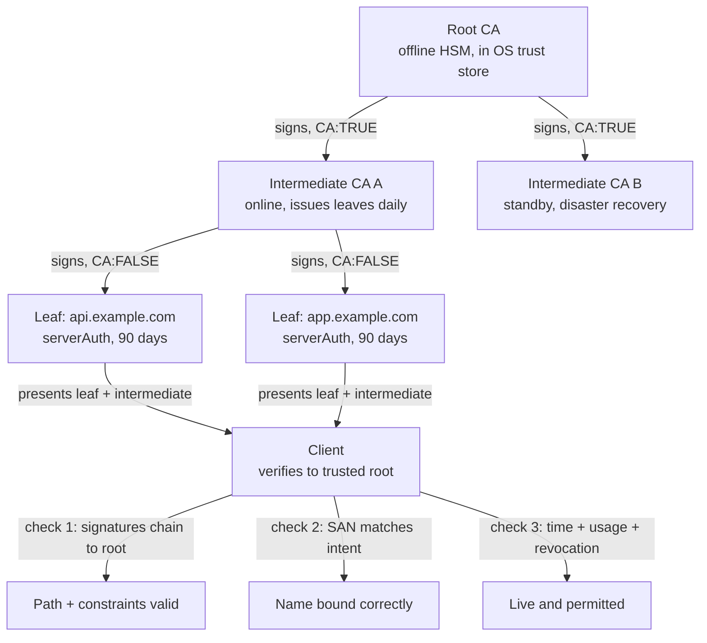

# Certificate Authority

## Theory

A certificate authority (CA) is a trusted entity that issues and signs digital certificates after verifying identity.
It matters because clients (browsers, services) trust server and client certificates only if they chain to a known root CA.
Key subtopics: root vs intermediate CAs, chains of trust, public CAs (e.g. Let's Encrypt) vs private/internal CAs,
revocation (CRL, OCSP), and running your own CA for internal mTLS.

A CA is the trust anchor that turns an unverifiable public-key claim into a verifiable identity binding.
Anyone can generate a key pair and claim to be `api.example.com`, but only a CA that the client already
trusts can sign a certificate that the client will accept for that name. The signature is the whole product:
the CA checks the requester (domain control, organization identity, or device membership), encodes the
verified identity plus the requester's public key plus validity and usage constraints into an X.509
certificate, and signs the whole structure with its own private key. Any client holding the CA's public
key can verify that signature in milliseconds without ever talking to the CA at issuance time.

Think of a CA the way you think of a passport office. It does three jobs that must stay separate: it
verifies identity (checking documents before issuing), it attests identity (stamping the passport so
strangers can verify it), and it revokes identity (publishing a cancellation list when a passport is
stolen or expired). A CA that verifies sloppily, signs carelessly, or revokes slowly poisons every
connection that trusts it. That is why public CAs are audited against CA/Browser Forum Baseline
Requirements and WebTrust, logged in Certificate Transparency, and constrained by name constraints,
path lengths, and short lifetimes — the power to mint trust must be narrow, observable, and revocable.

This page teaches you to reason about CAs before you operate one or depend on one. You will learn what
a CA actually vouches for and why clients trust it without ever meeting the server, how offline roots
and online intermediates split risk in a chain of trust, when to use a public CA versus running a
private CA for internal and mTLS traffic, how issuance works from CSR to ACME automation with commands
you can run, how revocation propagates through CRLs, OCSP, and OCSP stapling and where each breaks,
which attacks target the CA layer and which control kills each class, and how to answer the CA
questions interviewers always ask.

> Scope note: this page is the interview-ready guide to certificate authorities — trust role, root and
> intermediate hierarchy with chain building, public versus private CA trade-offs, issuance and ACME
> automation, revocation with CRL and OCSP stapling, threats, and Q&A. Certificate field anatomy, TLS
> server deployment, client certificates for mTLS, and self-signed development flows live in the linked
> pages of this subsection. It assumes basic TLS and X.509 familiarity and focuses on the decisions
> interviewers probe: who may mint trust, how that power is constrained, and what happens when it fails.

### Topics Covered

1. [What a CA Is and Why to Trust It](#1-what-a-ca-is-and-why-to-trust-it)
2. [Root vs Intermediate CAs](#2-root-vs-intermediate-cas)
3. [Public vs Private CAs](#3-public-vs-private-cas)
4. [Issuance and ACME](#4-issuance-and-acme)
5. [Revocation CRL vs OCSP Stapling](#5-revocation-crl-vs-ocsp-stapling)
6. [Threats and Mitigations](#6-threats-and-mitigations)
7. [Interview Questions and Answers](#7-interview-questions-and-answers)

### 1. What a CA Is and Why to Trust It

A CA is a trusted third party that binds a public key to an identity after performing a defined level
of verification, and the binding is only as strong as the verification plus the constraints on the
signing key. The identity may be a domain (`api.example.com` proved by DNS or HTTP challenge), an
organization (Example Inc. proved by business registry and callback), a user (alice@example.com proved
by mailbox control), or a device or workload (a laptop, phone, or SPIFFE ID proved by enrollment with
an MDM or cloud attestor). The CA encodes that identity with the subject's public key, a validity
window, allowed usages, and revocation pointers, then signs the bundle. Trust comes from the client
pre-installing the CA's root key out of band through OS and browser updates — never from the network
exchange itself.

Trust works because verification and attestation are separated in time. Verification happens once at
issuance: the CA challenges the requester to prove control (serve a token at the domain, create a DNS
TXT record, answer an organization callback, present an enrollment secret). Attestation is then
checked millions of times without contacting the CA: each TLS client verifies the leaf signature with
the intermediate key, the intermediate signature with the root key, and the root against its local
trust store, plus name, time, usage, and revocation checks. An attacker on the path can present any
key they like, but they cannot produce a chain for the victim name signed by a trusted root, so the
connection fails closed instead of silently relaying.

What a CA vouches for, end to end:

- **That the named subject controlled the identity at issuance time.** DV means domain control only,
  OV adds legal-entity vetting, EV adds deep operational-existence checks — each level redefines what
  "verified" promises and how long issuance takes.
- **That the named public key belongs to that subject.** Proof of possession happens when the subject
  signs handshake bytes with the matching private key; the CA never needs (and must never see) the
  private key itself for standard issuance.
- **What the binding may be used for and for how long.** Extended Key Usage (serverAuth, clientAuth),
  Basic Constraints (CA:FALSE for leaves), Name Constraints, and NotBefore/NotAfter bounds scope the
  attestation so a stolen server cert cannot mint children or outlive its window.
- **How the binding can be cancelled.** Serial number plus CRL Distribution Points and Authority
  Information Access tell verifiers where to check revocation before expiry when keys leak.
- **That issuance is auditable.** Publicly trusted leaves carry Signed Certificate Timestamps from
  Certificate Transparency logs, so rogue or mistaken issuance is discoverable after the fact.

A concrete contrast shows why the CA must be independent of the server. Compare two deployments:

- *Self-asserted:* the server says "here is my key, I am api.example.com." The client has no test
  beyond receiving bytes. Every DNS poisoner, rogue AP, or transparent proxy can say the same sentence
  with their own key, and encryption still shows a padlock on both attacker legs.
- *CA-issued:* the server says "here is api.example.com, its key, 90-day validity, serverAuth usage,
  signed by Intermediate X which is signed by Root Y you already trust, plus my live signature over
  fresh handshake randomness." The client verifies two independent facts: the chain terminates at a
  trusted root, and the live proof matches the certified key. Either check can fail the connection.

The backend lesson generalizes across this subsection: the CA converts identity vetting into a portable,
offline-verifiable artifact. Server pages consume that artifact to prove API identity to browsers,
client pages consume it in reverse to prove caller identity to APIs without passwords, revocation
pages explain how to cancel the artifact early, and self-signed pages explain what happens when you
skip the CA entirely and why that only works where you control the trust store.

### 2. Root vs Intermediate CAs

No client can ship every server certificate, so trust delegates through a two-tier hierarchy. A small
set of root CAs — run by firms and governments, audited annually, and shipped in OS and browser trust
stores — sign intermediate CAs, which sign leaf certificates for domains, users, or devices.
Verification walks upward: the leaf signature verifies with the intermediate key, the intermediate
signature verifies with the root key, and the root is trusted because it arrived with the platform.
Extensions at each level enforce the delegation: intermediates carry CA:TRUE with path-length limits,
leaves carry CA:FALSE so they cannot sign children.

Roots stay offline and paranoid so intermediates can stay online and useful. A root private key
typically lives in a hardware security module inside a ceremony room with dual control, video
recording, and auditors present, used a few times per decade to mint or rotate intermediates. An
intermediate key lives in a hardened online HSM and signs thousands of leaves per day under policy
(allowed names, maximum lifetime, mandatory CT logging). This separation contains blast radius: if an
intermediate key leaks, the CA revokes that intermediate, pushes CRL and OCSP updates, and reissues
its leaves from a sibling intermediate without replacing trust stores worldwide. If a root key leaked,
every device would need a trust-store update — the incident the hierarchy exists to make unlikely.

Chain building is the server's job and chain validation is the client's. The server must send its leaf
plus every intermediate up to (but excluding) the root during the handshake; the client already holds
the root and reconstructs the path. The classic outage is the incomplete chain: the server sends only
the leaf, desktop browsers succeed from cached intermediates, and mobile apps or `curl` fail with
unknown-issuer errors. Full-chain bundles, SNI-aware chain selection, and cold-client probing exist
exactly for this asymmetry.



*The diagram above shows delegation from one offline root to online intermediates to leaves, with the
client enforcing signatures, name binding, and liveness before trusting the key.*

Validation applies four gates in order and any failure fails closed. First, signature path: every
signature verifies and Basic Constraints plus Key Usage permit the signing that happened. Second, name
binding: the intended hostname matches a Subject Alternative Name entry under RFC 6125. Third, time
and scope: the local clock falls inside every certificate's window and EKU allows the purpose. Fourth,
revocation freshness: CRL, OCSP, or stapled evidence shows neither leaf nor intermediate was cancelled.
Cross-signing (one intermediate signed by two roots) bridges root rotations so old and new stores both
build a path, while path-length constraints cap subtree depth so a compromised edge intermediate cannot
mint an unbounded hierarchy beneath itself.

### 3. Public vs Private CAs

Public and private CAs solve opposite trust problems with the same cryptography, and choosing wrong is
a production incident in slow motion. A public CA (Let's Encrypt, DigiCert, Sectigo) chains to a root
already in every browser and OS, so anyone on the internet can verify your certificates without prior
setup. A private CA is a root you create and distribute yourself — via MDM, cloud-init, Kubernetes
ConfigMaps, or corporate group policy — so only your fleet trusts it. The signatures are identical
X.509; the difference is entirely who holds the root and what that root is allowed to assert.

Public CAs are constrained by global policy in exchange for universal trust. They must follow CA/Browser
Forum Baseline Requirements (verified domain control, maximum lifetimes around 398 days and shrinking
toward 90, mandatory Certificate Transparency logging, public revocation endpoints), pass annual
WebTrust audits, and issue only for names the requester provably controls. They cannot issue for
`localhost`, bare internal names, or RFC 1918 addresses, and every issuance is publicly logged and
rate-limited. You rent trust by proving control each time; you cannot bend validation, lifetime, or
name policy no matter how large the contract.

Private CAs trade universal trust for total control inside your boundary. You define validity (hours
for workloads, years for device roots), names (service mesh identities, `*.svc.cluster.local`, custom
SPIFFE URIs), usages (clientAuth for mTLS, code signing for deploys), and enrollment (MDM bootstrap,
cloud instance identity, Vault AppRole, manual ceremony). Issuance stays off the public record, runs
offline or inside your VPC, and costs nothing per certificate. The price is distribution and discipline:
every client must install and update your root securely, you own audits, revocation plumbing, key
ceremonies, and rotation runbooks, and any leak of the root compromises the whole fleet silently.

| Dimension | Public CA | Private CA |
|---|---|---|
| Who trusts it | Everyone with a stock OS and browser | Only hosts where you installed the root |
| Verification | Domain control (DV), org vetting (OV/EV) per global rules | Whatever you define: MDM, cloud attestor, manual approval |
| Names allowed | Public DNS only, no internal or localhost | Any name: internal DNS, IPs, SPIFFE IDs, device serials |
| Lifetime and cost | 90-398 days, free to paid per cert, rate-limited | Arbitrary (minutes to years), free, no rate limits |
| Transparency | CT-logged, publicly auditable | Private inventory, auditable only by you |
| Revocation story | CRL plus OCSP run by the vendor | CRL plus OCSP you must run and monitor |
| Best for | Public APIs, SaaS, marketing sites, anything browsers touch | East-west mTLS, VPN and Wi-Fi auth, CI signers, dev and staging |
| Failure smell | Internal name rejected, rate limit at deploy, CT leak of staging | Root sprawl, forgotten rotation, non-prod root trusted in prod |

Three selection rules end every public-versus-private discussion in interviews. First, browsers decide
for you: anything loaded in a stock browser must chain to a public CA, full stop — no private root,
no self-signed, no internal name will pass. Second, workloads decide the opposite: service-to-service
mTLS, database client certs, IoT fleets, and CI signing should use a private CA with short lifetimes
and automated enrollment, because public issuance per workload is slow, logged, and coupled to DNS.
Third, never mix the roots: keep a dedicated private root per environment (prod, staging, dev) with
distinct names and colors in dashboards, so a staging intermediate can never mint a prod identity and
a leaked dev root cannot pivot anywhere real.

A concrete contrast shows the operational split. Compare two teams securing `payments.internal`:

- *Public-CA attempt:* the CA refuses `payments.internal` (not a public name), forces a public alias
  like `payments-internal.example.com`, logs every cert in CT, and rate-limits burst scaling. External
  verifiability was bought but never needed, while internal automation pays the cost.
- *Private-CA setup:* an offline prod root signs one online intermediate per cluster, Vault or
  step-ca issues 24-hour clientAuth and serverAuth leaves via workload attestation, Envoy rotates them
  nightly, and revocation is short lifetime plus a local CRL. No browser ever trusts it — and no
  browser ever needs to.

The backend lesson: public CAs outsource trust policy to the web PKI so strangers can verify you,
while private CAs insource trust policy so you can move fast inside your boundary. Mature platforms
run both at once — public ACME at the edge for browsers, private automation inside the mesh for
services — and interviewers award full marks when you name the pair and the root-distribution plan
that keeps them separate.

### 4. Issuance and ACME

Issuance is the five-stage pipeline from private key to trusted leaf — generate, request, validate,
issue, deploy and renew — plus revocation on failure. Every CA outage or expiry page is a stage left
manual, unmonitored, or coupled to a human calendar. Learn the pipeline with the OpenSSL and ACME
commands below, because interviewers treat fluent CSR-to-renew narration as proof you have operated a
CA rather than read about one.

Stage one is the private key, generated where it will be used and never transmitted. Stage two is the
Certificate Signing Request, which packages the public key plus requested names and is the only thing
sent to the CA. Stage three is validation: the CA challenges the requester (HTTP token, DNS TXT, TLS
challenge, or organization callback) and the requester proves control. Stage four is issuance and
installation: the CA signs, logs to CT for public certs, and returns the leaf with its intermediate
bundle. Stage five is renewal before expiry, ideally via ACME, plus revocation on compromise. Expiry
is a safety net, never a strategy — waiting for expiry after a leak leaves attackers valid for weeks.

```bash
# 1. Generate a private key on the host that will serve it (never emails, tickets, or chat).
openssl genpkey -algorithm EC -pkeyopt ec_paramgen_curve:P-256 -out server.key
chmod 600 server.key # readable only by its service user; back up via HSM or manager

# 2. Create a CSR binding the key to the identities you want certified.
openssl req -new -key server.key -out server.csr \
  -subj "/CN=api.example.com/O=Example Inc/C=US" \
  -addext "subjectAltName=DNS:api.example.com,DNS:api-v2.example.com"
# The CSR carries the public key + requested names; the CA still verifies each name independently.
```

The snippet above is explained as the ownership boundary. The key command mints the secret half
locally with tight permissions — anyone who reads `server.key` becomes the identity, so manager
storage or HSM backing applies from birth and RSA must be 2048 bits minimum if EC is unavailable.
The CSR command derives the public half and the requested SANs without exposing the secret, so
forwarding the CSR to a CA operator or ACME client is safe by construction. Reviewers check two things
here: the key type is modern (P-256 or Ed25519 preferred) and the SAN list matches deployment intent
(both hostnames the load balancer will actually serve, no trophy names).

```bash
# 3. Issue via ACME for public names (automatic domain validation + renewal).
sudo certbot certonly --nginx -d api.example.com -d api-v2.example.com \
  --email ops@example.com --agree-tos --no-eff-email
# Certbot proves control via HTTP-01 or DNS-01, fetches the leaf + chain, and schedules renewal.

# 4. Inspect what the CA returned before reloading (never deploy blind).
openssl x509 -in /etc/letsencrypt/live/api.example.com/cert.pem -noout -subject -issuer -dates \
  -ext subjectAltName
openssl s_client -connect api.example.com:443 -servername api.example.com -showcerts </dev/null
# First line checks names, issuer, and dates; second reproduces the cold-client chain view.

# 5. Renew and reload without dropping connections (cron or systemd runs twice daily).
sudo certbot renew --deploy-hook "nginx -s reload"
# Private-CA path instead: step-ca renews via API: step ca renew server.crt server.key --expires-in 24h
```

The snippet above is explained stage by stage. The `certbot` issuance proves domain control
automatically — HTTP-01 serves a token at `/.well-known/acme-challenge` for standard hosts, DNS-01
creates a `_acme-challenge` TXT record for wildcards — then installs the leaf plus chain where the
server expects them and arms a twice-daily renewal timer. Inspection confirms subject, issuer, dates,
and SANs before any reload, while the `s_client` probe catches missing intermediates and SNI routing
mistakes that desktop browsers hide via caching. Renewal keeps two disciplines: fresh keys on each
cycle (never re-certify a post-incident CSR) and graceful reloads (new handshakes use the new cert
while existing connections drain). The private-CA variant swaps ACME challenges for workload
attestation but keeps the same rhythm: short lifetimes with API-driven renewal beat long lifetimes
with calendar reminders every time.

Two issuance habits separate senior answers. First, run ACME in staging before production with the
provider's staging directory and a dry-run flag, plus external expiry alerts at 30, 14, and 3 days —
internal calendar reminders rot while outside probes and `certbot renew --dry-run` do not. Second,
segregate validation paths: HTTP-01 behind the edge for plain domains, DNS-01 with scoped API tokens
for wildcards, and organization callbacks only for OV and EV — then lock each path down (least-privilege
DNS tokens, redirect-aware challenge routing) so the proof of control cannot become the attack itself.

### 5. Revocation CRL vs OCSP Stapling

Expiry ends trust passively, but revocation must end it early when keys leak, employees leave, or names
change hands. Every certificate carries the pointers verifiers need: a serial number as its revocation
handle, a CRL Distribution Point naming a signed list to download, and an Authority Information Access
extension naming an OCSP responder to query. The CA publishes cancellations through those channels; the
client decides how hard to enforce them. The interview trap is treating revocation as instant — it is
eventually consistent at best, with caches, soft-fail fallbacks, and stapling windows between the CA's
decision and the client's enforcement.

Certificate Revocation Lists are the old, simple channel: the CA periodically signs a list of revoked
serials per issuer and clients download it. CRLs work offline after fetch, cover intermediates and
leaves uniformly, and need no per-connection responder — but they grow without bound, go stale between
publish intervals, and force clients to fetch megabytes for a single handshake decision. Online
Certificate Status Protocol fixes granularity by letting clients ask "is serial X still good" and get a
signed, timestamped yes or unknown — small, fresh, and specific — but it adds a blocking fetch to every
first connection, leaks browsing history to the responder, and fails open when responders are slow
unless clients enforce hard-fail. OCSP stapling breaks the dilemma: the server fetches its own OCSP
response every few hours and staples it to the handshake, so clients get fresh revocation evidence with
no extra connection and no privacy leak.

| Channel | How it works | Strengths | Weaknesses | When it wins |
|---|---|---|---|---|
| CRL | Signed list of revoked serials fetched periodically | Offline after fetch, simple, covers whole issuer | Large, stale, slow to propagate | Private PKI fleets and mTLS where clients poll centrally |
| OCSP | Per-cert query to responder, signed good or revoked | Fresh, tiny, per-serial precision | Extra latency, privacy leak, responder SPOF | Browsers checking high-value certs with hard-fail policy |
| OCSP stapling | Server staples its own recent OCSP response in handshake | No client fetch, private, fast with Must-Staple | Server must refresh, CDN and cache windows linger | Default for public servers and edge termination |
| Short lifetimes | 90-day or 24-hour certs that expire instead of revoke | Shrinks revocation window without plumbing | Needs automation, not instant | ACME leaves and workload certs where renewal is cheap |

```bash
# Check revocation pointers embedded in a leaf (where clients would look).
openssl x509 -in server.crt -noout -text | grep -A2 -E "CRL Distribution|OCSP|Authority Information"

# Query OCSP directly the way a client would (issuer cert needed for signature check).
openssl ocsp -issuer intermediate.crt -cert server.crt \
  -url http://ocsp.example-ca.com -resp_text
# Response: GOOD means unrevoked and fresh; REVOKED names the reason and time; errors mean try CRL.

# CA side: revoke a compromised leaf and publish a fresh CRL for CRL consumers.
openssl ca -revoke server.crt -crl_reason keyCompromise
openssl ca -gencrl -out intermediate.crl  # distribute via CDP; stapling servers fetch OCSP instead
```

The snippet above is explained as the revocation loop. The pointer check confirms the leaf actually
advertises a CRL and OCSP URL before you depend on either — missing extensions mean no early kill
switch exists. The OCSP query validates liveness end to end: freshness comes from `ProducedAt` and
`NextUpdate`, authority from the responder signature against the issuer. The CA-side pair closes the
incident: the serial enters both the CRL and the OCSP database, and stapling servers pick up the new
response within their refresh interval. Reviewers check that you name the residual window — CDN OCSP
caches, client CRL intervals, and stapled-response lifetimes — rather than claiming instant kill.

Two revocation habits separate senior answers. First, pair short lifetimes with stapling: 90-day public
leaves via ACME plus `ssl_stapling on` in nginx (or the equivalent edge flag) shrink every compromise
to hours without relying on clients to fetch anything. Second, enforce Must-Staple for critical hosts
and hard-fail or CRLSets and OneCRL style aggregation where the platform supports it — and rehearse the
"key leaked, OCSP cached for 24 hours" drill with a fresh-key reissue plus revoke plus reload runbook
measured in minutes, because the interview follow-up always probes the cache gap.

### 6. Threats and Mitigations

The CA layer concentrates power, so every failure here forges trust rather than merely breaking it.
Learn the set as pairs — how the abuse works in one sentence, which control kills the class — and every
CA scenario becomes pattern matching rather than recall.

| Threat | How it works | Mitigation that kills the class |
|---|---|---|
| Rogue or mistaken issuance | CA signs a cert for a name the requester does not control | Strict validation plus Certificate Transparency monitoring and alerting |
| CA key compromise | Attacker holds intermediate or root key and mints trusted certs | Offline roots, online intermediates, HSM storage, rapid revoke and reissue |
| Incomplete chain outage | Server omits intermediate, cold clients fail unknown-issuer | Serve full chain bundle, probe with s_client plus mobile clients |
| Revoked-but-accepted cert | Compromised key stays trusted until expiry or cache flush | CRL and OCSP hard-fail or stapling, short lifetimes, rotation runbooks |
| Validation bypass (ACME) | Attacker answers HTTP or DNS challenge via hijack or token leak | Scoped DNS tokens, redirect-aware routing, DNS-01 for wildcards, CAA records |
| Overly broad intermediate | One intermediate can sign any name, leak spreads everywhere | Name Constraints, path-length limits, per-env and per-purpose intermediates |
| Private root sprawl | Dev or test root lands in prod trust stores | Per-env roots, distinct names, MDM-pinned distribution, prod-only auditing |
| OCSP and CRL downgrade | Attacker blocks revocation fetch, soft-fail client accepts | Stapling with Must-Staple, hard-fail policy, short-lived certs |
| Stale or missing revocation | CRL too large or responder down, clients skip the check | Stapled responses, aggregated CRLSets, monitoring of responder freshness |
| Expiry and renewal miss | Manual renewal slips, edge serves an expired chain | ACME automation, external 30/14/3-day alerts, staging dry-runs |
| Key theft at the CA or server | Key file copied from disk, backup, image, or log | chmod 600 plus service user, HSM or manager storage, fresh key per renewal |
| Downgrade around trust | Attacker forces HTTP or legacy TLS past the CA check | HSTS with preload, redirect to HTTPS, minimum TLS 1.2, CAA enforcement |

Two scenarios show how to narrate an answer. First, suspected intermediate leak: the CA revokes the
intermediate, publishes CRL and OCSP, reissues its leaves from a sibling intermediate, and owners
reload full chains — plus detection via CT and pinning monitors that spot the rogue leaf first. Second,
ACME hijack scare: an attacker briefly controlled DNS and fetched a valid cert. Fix with DNSSEC plus
CAA scoping issuance to one CA, CT alerts paging in minutes, ACME revocation of the rogue serial, and
short lifetimes so the artifact dies even if revocation lags.

### 7. Interview Questions and Answers

**Q1 (Beginner): What is a CA and why do clients trust it?**
A CA is a third party that verifies identity and signs the binding of public key to identity so
strangers can check it. Clients trust it because its root key shipped with the OS or browser out of
band — the server presents a chain from leaf to that root, and the client verifies signatures plus
name, time, usage, and revocation instead of trusting first contact.

**Q2 (Beginner): Why split root and intermediate CAs?**
Roots stay offline in HSM ceremonies and sign rarely, so their keys almost never expose. Intermediates
stay online and sign leaves daily under policy. If an intermediate leaks, the CA revokes it and
reissues leaves without updating every trust store; if a root leaked, every device would need one.

**Q3 (Intermediate): Public versus private CA — which do you pick?**
Public for anything a stock browser touches: universal trust with DV to EV validation, CT logging, and
rate limits. Private for internal mTLS, VPN, device fleets, and CI signing: custom names and lifetimes
with zero per-cert cost. Never serve internal names from a public CA or public traffic from a private
root; run both with per-env roots kept separate.

**Q4 (Intermediate): Walk me through issuance from key to deployed cert.**
Generate the key locally with `genpkey` and lock permissions, mint a CSR with `req` carrying the SANs,
prove control via ACME HTTP-01 or DNS-01 (or org vetting for OV and EV), have the CA sign and CT-log
the leaf, inspect with `x509`, probe the live chain with `s_client`, and renew automatically with
`certbot renew` plus graceful reload. Never transmit the private key.

**Q5 (Intermediate): How does ACME validation actually prove control?**
The CA gives a nonce the requester must publish where only the name owner can: an HTTP token under
`/.well-known/acme-challenge` for plain domains or a `_acme-challenge` TXT record for wildcards. The
CA fetches it before signing, then issuance and renewal run on cron without humans. Lock it down with
scoped DNS tokens and CAA records naming the allowed CA.

**Q6 (Intermediate): CRL versus OCSP versus stapling — what is the trade-off?**
CRLs are signed bulk lists: simple and offline-capable but large and stale. OCSP is a per-cert freshness
query: precise but slow and privacy-leaking with a responder SPOF. Stapling has the server attach its own
recent OCSP response to the handshake: fast and private but needs server refresh discipline. Default to
short lifetimes plus stapling, Must-Staple on critical hosts.

**Q7 (Senior): Mobile fails unknown-issuer while desktop works — what happened?**
The server sent a partial chain without the intermediate. Desktops succeeded from cached intermediates
while cold clients could not build a path. Fix by serving the full chain bundle, confirm with `s_client
-showcerts` from a clean host, and add synthetic chain-depth monitoring per PoP so rotations cannot regress it.

**Q8 (Senior): Your intermediate may have leaked — what do you do?**
Revoke the intermediate so CRL and OCSP publish it, reissue its leaves from a sibling intermediate with
fresh keys, reload full chains with zero-downtime restarts, staple fresh OCSP with short caches, and
watch CT and pinning monitors for rogue leaves. Report time-to-revoke from the rehearsed runbook and name
the residual window from stapled-response and CDN caches.