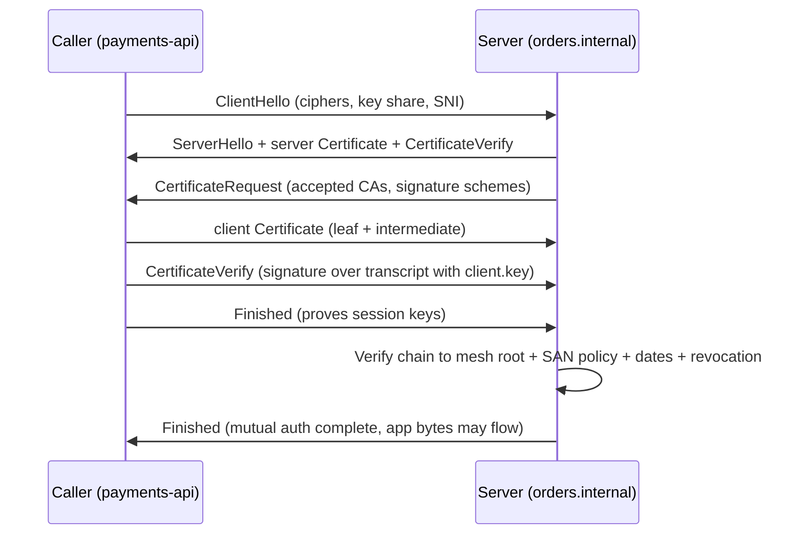

# Client Certificates

## Theory

Client certificates let a server authenticate the caller via TLS mutual authentication (mTLS) instead of passwords or tokens.
They matter for zero-trust service-to-service communication, where every request must prove a cryptographic identity.
Key subtopics: the mTLS handshake, issuing client certs from an internal CA, presenting certs from services and devices,
rotation and revocation, and passing identity downstream (e.g. headers set by the proxy).

A client certificate is a TLS leaf certificate with `clientAuth` extended key usage, binding a service, workload,
or device identity to a public key under an internal CA signature. When `payments-api` calls `orders.internal`,
it presents this leaf plus any intermediates during the mTLS handshake, proves possession of the matching private
key via a signature over the handshake transcript, and the server verifies three independent facts: the chain
terminates at the private root the server trusts, the identity in the Subject or Subject Alternative Name matches
an allowed caller, and the certificate is live, correctly purposed, and unrevoked. If any check fails, the
connection fails closed — no fallback to unauthenticated HTTP, no bypass header, no shared secret retry.

Think of a client certificate the way you think of an employee badge plus a company directory. The badge photo
and name (the Subject DN or SPIFFE ID on the certificate) tell the guard who claims to be at the door. The company
hologram (the private CA signature) tells the guard the badge office issued it and it was not printed at home. And
the badge holder typing a PIN only the true owner knows (the handshake proof of private-key possession) tells the
guard the person holding the badge is its owner, not someone who photocopied it. A valid signature with the wrong
identity is a real badge for the wrong employee. A matching name without the CA hologram is a homemade badge. A
matching signed badge without the private key is a photocopy — it cannot complete the cryptographic challenge, so
the handshake fails.

This page teaches you to deploy client certificates that authenticate every caller, not just to describe mTLS. You
will learn what a client certificate proves and what it never proves, how to issue and distribute identities from
a private CA and when SPIFFE pays off, how the mTLS handshake differs from server-only TLS with message flow you
can draw, how rotation and revocation keep short-lived identities fresh, how to pass the verified identity to
backends as headers without spoofing, which client-identity mistakes cause outages or impersonation and which
controls kill each class, and how to answer the client-certificate questions interviewers always ask.

> Scope note: this page is the interview-ready guide to client certificates for mTLS — identity proof, issuance
> from a private CA and SPIFFE, the mTLS handshake, rotation and revocation, identity headers to backends,
> threats, and Q&A. Chain-of-trust mechanics and CA policy live in the parent introduction and the CA page,
> server identity lives in the server-certificates page, and localhost trust lives in the self-signed page. It
> assumes basic TLS and HTTP and focuses on the decisions interviewers probe: correct identities, safe
> distribution, automated lifetimes, and unspoofable downstream propagation.

### Topics Covered

1. [What Client Certs Prove](#1-what-client-certs-prove)
2. [Issuance and Distribution](#2-issuance-and-distribution)
3. [mTLS Handshake](#3-mtls-handshake)
4. [Rotation and Revocation](#4-rotation-and-revocation)
5. [Identity Headers to Backend](#5-identity-headers-to-backend)
6. [Threats and Mitigations](#6-threats-and-mitigations)
7. [Interview Questions and Answers](#7-interview-questions-and-answers)

### 1. What Client Certs Prove

A client certificate proves three claims at once, and only those three. First, that a trusted internal CA verified
the workload or device was entitled to the listed identity at issuance time and signed that binding. Second, that
the public key in the certificate is the one whose private half the caller must wield live during the handshake.
Third, that the binding is currently scoped: inside its validity window, permitted for client authentication, and
not revoked. Everything the server does — chain building to the private root, identity comparison against policy,
date and EKU checks, revocation consultation — is a test of one of those three claims.

What it never proves is equally interview-relevant. It does not prove the request is authorized — identity is who
is calling, authorization is what they may do, and that mapping lives in policy (RBAC, OPA, per-route ACLs). It
does not prove the caller software is uncompromised — a stolen key on a healthy-looking host passes every check
until revoked. It does not prove a human user is behind the call: service identities authenticate workloads, and
user context must travel separately (JWT `sub`, session cookie) alongside the workload identity. Say this boundary
crisply and you avoid the most common junior trap: equating "mTLS passed" with "allowed to do anything."

The live proof is what turns a static document into authentication. The certificate itself is public — it is sent
in cleartext in every handshake — so possession of a copy means nothing. During TLS 1.2 and 1.3 the client must
use the private key: signing the handshake transcript with `CertificateVerify` after the server sends
`CertificateRequest`. An attacker who copies the certificate but lacks the key cannot produce that signature, and
the handshake aborts. That is why key storage — file permissions, secret managers, TPMs, workload-attested
delivery — is a certificate control, not an afterthought: whoever reads `client.key` becomes the service for
every identity on the cert.

Servers enforce the proof with four gates, in order:

- **Signature path:** every signature verifies up to the pinned private root or an allowed intermediate, with Basic
  Constraints and Key Usage permitting each signing step. A leaf signed by an unknown CA or a chain ending at a
  public root the mesh never pinned fails here.
- **Identity binding:** the authenticated Subject DN, Common Name, or — preferably — SAN entry (DNS, URI, or
  SPIFFE ID such as `spiffe://prod/payments-api`) matches an authorization policy entry. Never match on a
  self-asserted header; match on the verified certificate fields the terminator extracted.
- **Time and purpose:** the server clock falls inside NotBefore and NotAfter, and Extended Key Usage includes
  `clientAuth`. A correct identity with server-only purpose or an expired window still fails closed.
- **Revocation freshness:** per local policy, CRL, OCSP, or short-lifetime expiry shows the leaf and its issuer
  were not cancelled. Short lifetimes shrink the window this gate must cover to hours, not weeks.

A concrete contrast anchors the whole section. Compare two introductions to `orders.internal`:

- *Bearer token:* "Here is secret string `tok_abc123`, trust me, I am payments-api." Anyone who copies the string
  from a log, a backup, or a debug header replays it perfectly. Rotation is manual, scope is coarse, and the
  receiver cannot tell which host or replica called.
- *Client certificate:* "Here is `spiffe://prod/payments-api` with its P-256 key, valid for the next 12 hours,
  clientAuth usage, signed by Intermediate W signed by Mesh Root you already pin — and here is my signature over
  fresh handshake randomness proving I hold the private half." The server verifies the chain, the identity, and
  the live signature independently, then logs which exact replica called.

The backend lesson generalizes: client certificates convert "whoever holds a shared secret" into "the verified
holder of this workload identity." Edge gateways, reverse proxies, and sidecars all consume the same proof; they
differ only in where the trust bundle lives and which component enforces the policy, which is the subject of
sections 3 and 5.

### 2. Issuance and Distribution

Issuance answers who may mint identities and how callers receive keys safely. Distribution answers how private
keys reach workloads without being copied, logged, or baked into images. The two choices are decided together
because a fast CA with sloppy delivery is worse than no mTLS: it spreads impersonation-capable keys everywhere.

The default is a private CA dedicated to client identities, kept separate from any public server CA. Options
range from OpenSSL or `step-ca` for small estates, to Vault PKI or cert-manager plus Vault for Kubernetes, to a
managed mesh CA (Istio Citadel, Linkerd identity) that issues automatically per pod. The CA root is generated
offline or in an HSM, intermediates sign day-to-day leaves, and servers pin the root bundle out of band — never
learn it from the caller. Keep server and client chains under different roots or at least different intermediates
so a compromised issuing path for one direction cannot mint the other.

Identity format is the decision reviewers probe first. The legacy form puts the service name in the Common Name
or the full Distinguished Name (`CN=payments-api, O=Prod, C=US`) and matches on that string. The modern form
puts a URI or DNS SAN on the leaf — ideally a SPIFFE ID such as `spiffe://prod/payments-api/replica-7` — and
matches on the SAN only. Prefer the SAN form: CN parsing is ambiguous, DN string comparison is brittle across
libraries, and only SANs carry structured workload attributes (cluster, namespace, service account) that policy
can select on without regex over display names.

| Identity form | Where it lives | Strengths | Costs and risks | Choose when |
|---|---|---|---|---|
| Common Name only | Subject CN | Simple, works with legacy proxies | Ambiguous, easy to collide, deprecated matching | Legacy clients you cannot upgrade yet |
| Distinguished Name | Subject DN fields | Human-readable org scoping | Brittle string compare, hard to rotate per replica | Regulated estates requiring legal subject fields |
| DNS SAN | `subjectAltName=DNS:` | Native TLS matching, per-replica names | Couples identity to DNS, breaks behind renames | Services with stable internal DNS |
| URI / SPIFFE ID | `subjectAltName=URI:` | Structured trust-domain plus workload path, mesh-native | Needs SPIFFE-aware issuance and policy | Default for Kubernetes and zero-trust meshes |

Stage one of issuance is the caller key, generated as close to the workload as possible and never transmitted.
For VMs that means generating on the host; for Kubernetes that means the CSI driver, init container, or sidecar
writes it to a tmpfs volume readable only by the service user. ECDSA P-256 is the modern default; RSA-2048 where
legacy middleboxes demand it. Stage two is the CSR carrying the public key plus the requested identity to the
private CA. Stage three is verification of entitlement — service account token, node attestation, manager approval
— followed by signing and delivery of a short-lived leaf.

```bash
# 1. Generate the caller key where it will be used (never leaves this host).
openssl genpkey -algorithm EC -pkeyopt ec_paramgen_curve:P-256 -out client.key
chmod 600 client.key # key readable only by its service user

# 2. Create a CSR binding the key to the workload identity you want certified.
openssl req -new -key client.key -out client.csr \
  -subj "/CN=payments-api/O=Prod/C=US" \
  -addext "subjectAltName=URI:spiffe://prod/payments-api,DNS:payments-api.prod.svc"
# The CSR carries the public key + requested identity; the CA still verifies entitlement.
# For per-replica identity add a unique suffix: URI:spiffe://prod/payments-api/replica-7
```

The snippet above is the ownership boundary interviewers probe. The `genpkey` command mints the secret half
locally: the algorithm flag chooses the key type reviewers check first (P-256 or RSA-2048 minimum), and the
`chmod` line is a control, not hygiene — world-readable caller keys leak through images, backups, and log
collectors. The `req` command derives the public half and the requested SAN list without exposing the secret;
the `-subj` sets legacy display fields while `-addext` sets the SAN list the server actually enforces. Reviewers
check two things here: the SAN encodes the workload path (trust domain plus service, not a human name), and the
key was generated fresh per replica rather than cloned across the fleet.

```bash
# 3a. Sign with the private CA (Vault, step-ca, or offline intermediate for the drill).
step ca sign client.csr client.crt --provisioner payments-jwk --not-after 12h
# Vault path equivalent: vault write pki-int/issue/payments common_name=payments-api uri_sans=spiffe://prod/payments-api ttl=12h

# 3b. Inspect what the CA returned before distributing (never deploy blind).
openssl x509 -in client.crt -noout -subject -issuer -dates -ext subjectAltName,keyUsage,extendedKeyUsage
# Expect: Extended Key Usage includes TLS Web Client Authentication, SAN carries the SPIFFE URI.

# 3c. Verify the caller chain against the pinned private root exactly as servers see it.
openssl verify -CAfile mesh-root.crt -untrusted mesh-intermediate.crt client.crt
# Expect: client.crt: OK. Any other result means the bundle or the SAN is wrong.
```

Distribution keeps the key from ever travelling like a password. Prefer workload-attested delivery: the mesh CA
or SPIRE agent on the node attests the workload (Kubernetes service account, AWS IID, container hash) and hands
the key plus a short-lived leaf directly into pod memory or tmpfs — no ticket queue, no shared vault path the
whole team can read. For VMs without attestation, use a secret manager with narrow IAM (one role per service can
read one key prefix), mounted at boot and never logged. Never bake keys into images, never email CSRs with keys
attached, and never reuse one caller key across staging and production to save a signing call — key scope is
blast radius.

SPIFFE in brief is the standard that makes the paragraph above interoperable. SPIRE agents attest every workload
on a node, issue SVIDs (X.509 leaves with `spiffe://trust-domain/workload` URI SANs) with hour-scale lifetimes,
and rotate them automatically over the Workload API. Services and sidecars fetch fresh SVIDs locally instead of
managing CSRs by hand, and federated trust bundles let two clusters verify each other's IDs without sharing a
root. Name it in interviews as the answer to "how do you avoid running a ticket-driven CA for ten thousand pods":
short-lived SPIFFE SVIDs plus node attestation plus automatic rotation, with Vault or step-ca behind clusters too
small for full SPIRE.

### 3. mTLS Handshake

The mTLS handshake is server-only TLS plus one extra round trip: after the server authenticates itself, it
demands, receives, and verifies the caller's certificate before any application byte flows. The cryptography is
familiar — ephemeral key exchange, transcript signatures — but the policy check is new: the server must map the
verified identity to allow or deny, not merely complete the tunnel.



*The diagram above shows mutual authentication in order — server proves itself first, then the caller proves
itself with a live signature, and the server enforces identity policy before completing the handshake.*

Walk the diagram the way interviewers expect. `ClientHello` and `ServerHello` negotiate versions and ciphers
exactly as in server-only TLS, with TLS 1.3 completing in one round trip and TLS 1.2 in two. The server's
`Certificate` plus `CertificateVerify` prove it holds the server key. The new message is `CertificateRequest`:
the server lists which client CAs it trusts and which signature schemes it accepts, so the caller knows which
leaf to offer. The caller answers with its `Certificate` chain and a `CertificateVerify` signature over the full
transcript — freshness comes from the handshake randomness, so replay of an old signature fails. Only after the
server validates the chain, the SAN identity, and liveness does it send `Finished`; application data never
precedes authentication.

Two version details earn senior marks. In TLS 1.3 the client certificate is encrypted under the negotiated
handshake traffic secret, so passive observers learn the server name (via SNI) but not the caller identity. In
TLS 1.2 the client certificate travels in cleartext, so caller identities leak to observers — one more reason to
prefer 1.3 and to treat identities as non-secret routable names. In both versions session resumption (tickets or
PSKs) must be bound to the original client identity or disabled across identities: resuming a session without
re-verifying the caller certificate lets one service ride another's handshake.

Termination enforces all of this in one place so apps stay simple:

```nginx
# Nginx: require and verify caller certs at the edge, forward identity downstream.
server {
    listen 443 ssl http2;
    server_name orders.internal;
    ssl_certificate     /etc/nginx/tls/server-fullchain.pem;
    ssl_certificate_key /etc/nginx/tls/server.key;
    ssl_client_certificate /etc/nginx/tls/mesh-root.crt; # pinned private root
    ssl_verify_client on;               # fail closed: no cert, no connection
    ssl_verify_depth 2;
    ssl_crl /etc/nginx/tls/mesh-ca.crl; # consulted when lifetimes exceed hours
    location / { proxy_pass http://orders_upstream; }
}
```

```bash
# Caller side: present the leaf + key on every request (fails closed without them).
curl --cert client.crt --key client.key --cacert mesh-root.crt https://orders.internal/v1/orders
# Expect: HTTP 200 with the caller identity in the access log; without --cert expect 400/403.
# Debug exactly as the server sees it:
openssl s_client -connect orders.internal:443 -servername orders.internal \
  -cert client.crt -key client.key -CAfile mesh-root.crt -showcerts </dev/null
```

The configs above encode the decisions reviewers listen for. `ssl_client_certificate` pins the private root so
public CAs can never mint an accepted caller; `ssl_verify_client on` fails closed instead of passing an empty
identity to the app; `verify_depth` caps chain length so surprise intermediates fail. The `curl` line proves the
caller path end to end, and the `s_client` probe with `-cert` reproduces the handshake faithfully — check the
`Verify return code: 0 (ok)` plus the server's accepted-CA list rather than eyeballing the first PEM block.

### 4. Rotation and Revocation

Client identities expire by design, so rotation is the control that decides whether expiry is a non-event or a
fleet-wide outage. The modern default is automatic rotation of short-lived leaves (hours to a day) via the mesh
CA or SPIRE, with revocation as the deliberate exception for suspected compromise. The rule to state in
interviews: rotation runs hourly under automation, not quarterly on a calendar reminder.

Rotation is overlap, not swap. The workload fetches the next leaf well before expiry (at half or two-thirds of
lifetime), serves both briefly, then retires the old key — so a slow clock or a delayed push never causes a flag
flap where caller and server disagree. Sidecars and SPIRE agents do this continuously over a local socket; cron or
systemd does it for VMs. The reload must be graceful: the caller swaps the in-memory identity without dropping
pooled connections, and the server reloads its trust bundle without restarting listeners.

```bash
# Rotate a caller leaf before expiry (cron or systemd timer, not a calendar invite).
step ca renew client.crt client.key --expires-in 2h --force
# SPIRE / mesh path equivalent: agent refreshes the SVID over the Workload API automatically.
chmod 600 client.key client.crt

# Verify the new leaf before rolling it out fleet-wide.
openssl x509 -in client.crt -noout -subject -issuer -dates -ext subjectAltName,extendedKeyUsage
openssl verify -CAfile mesh-root.crt -untrusted mesh-intermediate.crt client.crt
# Expect: client.crt: OK plus a fresh NotAfter window; roll forward only on OK.
```

The snippet above is the rotation answer in six lines. The `renew` call keeps the same key or mints a fresh one
per policy — prefer fresh keys per rotation so a leaked key dies with its window. The `chmod` re-locks
permissions because renewal agents and copy steps often widen them. The `verify` pair gates rollout: subject and
SAN must still match policy, EKU must still include `clientAuth`, and the chain must still terminate at the pinned
root. Fleet rollout is staged (canary service, then tier) with served-identity logging so a bad issuance shows up
as a serial change before it becomes an outage.

Monitoring and revocation discipline close the loop automation cannot cover alone:

- **Expiry probes at 50% and 25% of lifetime remaining.** Scrape `client.crt` NotAfter per workload (Prometheus
  exporter, agent health endpoint, or a five-line `openssl x509 -enddate` cron) rather than trusting issuance
  logs — what the caller will present is the truth, including stale sidecars that stopped refreshing.
- **Identity and bundle checks, not just dates.** Alert on issuer change, trust-bundle staleness, and SAN drift
  after every deploy, because a fresh leaf from the wrong intermediate or a renamed service fails exactly like an
  expiry.
- **Fresh keys per rotation, graceful swaps.** Mint new keys on rotation by default, keep the old leaf valid
  during overlap, then delete it — never leave retired keys on disk where backups collect them.
- **Runbooked compromise response.** Time the drill from "key suspected leaked" to new key deployed plus old
  serial revoked plus CRL and OCSP caches flushed, because the follow-up is always "your gateway caches CRLs for
  hours, now what" — and the answer is short lifetimes plus a rehearsed runbook, not hope.
- **Manual path for device and break-glass identities kept deliberate.** Calendar long-lived device certs
  separately, pin the approver, and never let one durable device root share automation or key material with the
  hourly service SVIDs — isolation beats uniformity here.

Revocation kills a live leaf before expiry, and it only works if servers actually consult it. Distribute CRLs to
every terminator for offline enforcement, publish OCSP for online checks, and keep lifetimes short enough that
expiry does the heavy lifting: a 12-hour leaf needs only a 12-hour revocation window, while a 1-year device cert
needs reliable CRL fetches for a year. Name the trade-off explicitly: short-lived workload SVIDs minimize
revocation state at the cost of constant issuance, long-lived device certs minimize issuance at the cost of CRL
and OCSP machinery that must never fail open.

### 5. Identity Headers to Backend

Backends rarely terminate mTLS themselves — the gateway, reverse proxy, or sidecar does, then passes the verified
identity downstream as headers. This hop is where mTLS deployments are won or lost: a header set from the verified
certificate is authentication, while a header accepted from the network is a spoofing hole.

The contract is three headers and one rule. The terminator extracts the Distinguished Name into
`X-Client-Cert-DN`, the primary SAN (preferably the SPIFFE URI) into `X-Client-Cert-SAN`, and the verification
result into `X-Client-Cert-Verified: SUCCESS`, then proxies. The rule: the terminator strips any inbound values
for these headers before overwriting, and the app trusts them only from the terminator — over a private network,
a verified inner mTLS hop, or a sidecar socket, never from the open internet.

```nginx
# Nginx: strip spoofed inbound headers, set verified identity from the client cert.
server {
    listen 443 ssl http2;
    server_name orders.internal;
    ssl_client_certificate /etc/nginx/tls/mesh-root.crt;
    ssl_verify_client on;
    # Drop any caller-supplied values before setting our own.
    proxy_set_header X-Client-Cert-DN "";
    proxy_set_header X-Client-Cert-SAN "";
    proxy_set_header X-Client-Cert-Verified "";
    location / {
        proxy_pass http://orders_upstream;
        proxy_set_header X-Client-Cert-DN     $ssl_client_s_dn;
        proxy_set_header X-Client-Cert-SAN    $ssl_client_s_dn; # prefer $ssl_client_san in patched builds; else map below
        proxy_set_header X-Client-Cert-Verified $ssl_client_verify;
        proxy_set_header X-Forwarded-Proto https;
    }
}
# Envoy equivalent: forward_client_cert_details: SANITIZE_SET with set_current_client_cert_details
# (subject + URI SAN + verified) to upstream; apps read x-forwarded-client-cert (XFCC).
```

The config above encodes the decisions reviewers listen for. The empty `proxy_set_header` lines outside the
`location` clear spoofed inbound values so only terminator-set values reach the app. The inner `proxy_set_header`
lines bind each header to a verified TLS variable (`$ssl_client_s_dn`, `$ssl_client_verify`), never to a client
controlled `$http_` variable. The Envoy comment states the mesh-native equivalent: `SANITIZE_SET` strips inbound
XFCC and sets fresh details, so multi-hop meshes do not accumulate forged identities.

Three rules close every header answer. First, fail closed at the terminator: unverified callers never reach the
app with empty headers — they are rejected at the handshake. Second, authorize on the SAN header, log the DN:
policy matches the structured URI while audit keeps the human-readable DN plus serial. Third, prove the path with
evidence: `curl` without `--cert` gets rejected, `curl` with a header injection (`-H "X-Client-Cert-DN: admin"`)
arrives overwritten, and access logs show the verified SAN per request.

### 6. Threats and Mitigations

Client certificates stop impersonation only while issuance, storage, verification, and downstream propagation are
all honored. Learn the failure set as pairs — how the bypass or outage works in one sentence, which control kills
the class — and every mTLS scenario becomes pattern matching rather than recall.

| Threat | How it works | Mitigation that kills the class |
|---|---|---|
| Stolen caller key | Key file copied from disk, image, backup, or log | chmod 600 plus service user, TPM or secret manager, fresh key per rotation |
| Shared key across fleet | One key cloned to every replica, leak spreads wide | Per-replica keys and per-workload SANs, attested delivery, no image-baked keys |
| Bearer-header spoof | Attacker injects X-Client-Cert-DN directly to backend | Terminator strips inbound headers, app trusts only terminator-set values |
| Missing client verification | Server requests but does not require certs, anonymous callers pass | ssl_verify_client on with fail-closed default, no optional mode in prod |
| Wrong trust root | Server pins public roots, any internet cert is accepted | Pin dedicated private root bundle, separate client and server chains |
| Expired caller outage | Leaf passes NotAfter, every replica rejected at once | Short lifetimes with overlap rotation, expiry alerts at 50%/25%, staged rollout |
| Revoked-but-accepted cert | Compromised leaf stays valid until expiry | CRL plus OCSP consulted at terminator, short lifetimes, rehearsed runbook |
| Overly broad identity | One cert for many services, compromise impersonates all | Narrow per-service SPIFFE IDs, policy least-privilege per route |
| Weak key or signature | RSA-1024 or SHA-1 forged or factored | Allowlist modern algorithms, minimum RSA-2048 or P-256, inventory scans |
| Cleartext identity leak | TLS 1.2 exposes client cert on the wire | Prefer TLS 1.3 (encrypted client cert), treat identities as non-secret names |
| Session resumption across identities | Resumed session skips re-verification of caller | Bind resumption to client identity or disable cross-identity resumption |
| Clock-skew rejection | Caller or server clock outside validity window | NTP everywhere, validity monitoring, bounded skew handling |

Two scenarios show how to narrate an answer. First, the spoofed-header breach: backends trusted
`X-Client-Cert-DN` from the network while the gateway ran `ssl_verify_client optional`. State both controls in
one breath — enforce `on` at the terminator and strip plus overwrite inbound identity headers — plus detection:
log `$ssl_client_verify` per request and alert on any app-received identity without a gateway-verified mark.
Second, the fleet-wide expiry: every replica shared one year-lived leaf that expired at midnight. Fix by moving
to 12-hour per-replica SVIDs with overlap rotation and 50%/25% expiry alerts, plus staged rollout so a bad
issuance halts at the canary instead of the fleet.

### 7. Interview Questions and Answers

**Q1 (Beginner): What does a client certificate prove, and what does it never prove?**
It proves a private CA bound a workload identity to a public key, scoped by time, purpose, and revocation — with
the caller proving live possession of the private key each handshake via CertificateVerify. It never proves
authorization or software health: a valid service identity still needs per-route policy, and a stolen key passes
until revoked or expired.

**Q2 (Beginner): mTLS versus bearer tokens — why pay for certificates?**
Bearer strings replay from any log or backup that copies them, while client certificates need the live private key
per handshake. mTLS gives per-replica identity, short automated lifetimes, and no shared secret to rotate on every
leak — at the cost of running a private CA and pinning trust bundles. Choose mTLS for east-west zero-trust,
tokens for user delegation layered above it.

**Q3 (Intermediate): CN versus DN versus SPIFFE SAN — what do you match on?**
Match on the SAN URI (SPIFFE ID) only: structured trust-domain plus workload path, unambiguous across libraries.
CN is deprecated for matching and DN string comparison is brittle. Keep CN/DN for human-readable audit, authorize
on the SAN, and log serial plus SAN per request for incident tracing.

**Q4 (Intermediate): Narrate private-CA issuance with commands.**
Generate the key on the workload host with `genpkey` and lock it with `chmod 600`, mint a CSR with `req` carrying
the SPIFFE URI SAN, have the CA verify entitlement (service account or attestation) and sign with `step ca sign`
or Vault, inspect with `x509 -noout -subject -issuer -dates -ext`, and verify with `verify -CAfile mesh-root.crt`.
Never transmit the key; never deploy without inspecting.

**Q5 (Intermediate): Walk the mTLS handshake — what is new versus server-only TLS?**
Server authenticates first exactly as usual, then sends CertificateRequest listing accepted client CAs. The caller
answers with its chain plus CertificateVerify over the transcript, and the server enforces chain, SAN policy, and
liveness before Finished. In TLS 1.3 the client certificate is encrypted; in 1.2 it is cleartext — and resumption
must stay bound to the verified identity.

**Q6 (Intermediate): How do rotation and revocation work at scale?**
Rotate short-lived leaves (hours) with overlap: fetch at half lifetime, serve both, retire the old key, minting
fresh keys each cycle via SPIRE or cron plus graceful reload. Revoke via CRL and OCSP at every terminator for
compromise, but let expiry carry the normal case. Monitor NotAfter at 50%/25% plus issuer and SAN drift, and stage
rollouts so a bad issuance stops at the canary.

**Q7 (Intermediate): How do backends learn who called without terminating mTLS?**
The terminator verifies the handshake, strips inbound identity headers, and sets X-Client-Cert-DN, X-Client-Cert-SAN,
and X-Client-Cert-Verified from TLS variables (Nginx) or XFCC with SANITIZE_SET (Envoy). The app authorizes on the
SAN and trusts the headers only from the terminator. Prove it: no-cert curl fails, injected headers are
overwritten, logs show the verified SAN.

**Q8 (Senior): A caller key may have leaked with ten hours left — what do you do?**
Mint fresh per-replica keys and reissue narrow SVIDs immediately rather than waiting for expiry, roll out staged
with overlap, revoke the old serial so CRL and OCSP publish it, flush gateway revocation caches, and confirm logs
show only new serials. Report time-to-revoke from the rehearsed runbook and name the residual window from cache TTLs
plus the shortened future lifetime and per-replica scoping going forward.

