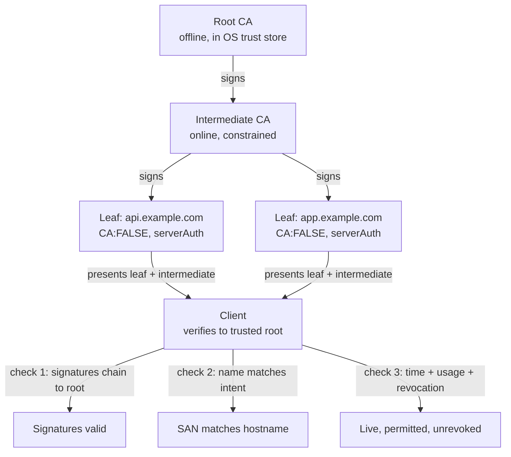
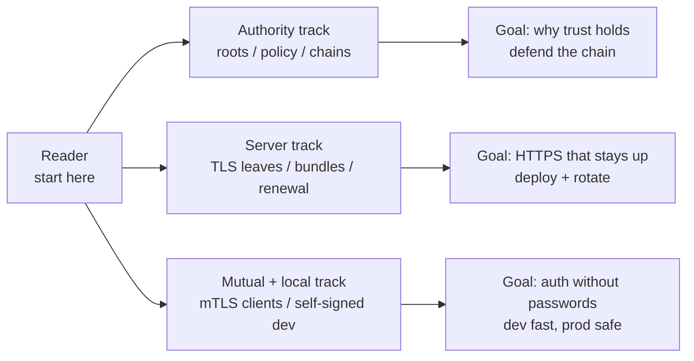

# Certificates

## Theory

Digital certificates bind a public key to an identity (domain, user, or device) via a trusted issuer's signature.
They matter because they make TLS, mTLS, and code signing possible — without them, encryption has no authentication.
Key subtopics: certificate authorities (CAs) and chains of trust, server certificates (TLS), client certificates (mTLS),
and self-signed certificates for local development and testing.

Certificates are the identity layer of encrypted communication. TLS without certificates gives you secrecy
without certainty: the bits are scrambled, but you have no proof who you are whispering to. A certificate
solves that by stapling three things together — an identity (a hostname, an organization, a user, a device),
a public key, and a trusted third party's signature over both. Any client that trusts the signer can verify
the staple in milliseconds and proceed with confidence.

Think of a certificate the way you think of a passport. The passport binds a face (the public key) to a name
(the identity) via a government's stamp (the issuer signature). A border agent does not need to have met you
before; they only need to trust the government and to check that the photo matches the person standing there.
TLS clients behave the same way: they trust a small set of root CAs preinstalled in the OS or browser, they
verify the server's certificate chain back to one of those roots, and they check that the name on the
certificate matches the hostname they intended to reach.

This landing page teaches you to reason about certificates before you dive into any single use. You will learn
what a certificate actually binds and why that binding is the whole point, how to read an X.509 certificate
field by field, how chains of trust let millions of servers prove identity from a hundred roots, when each
validation level and name form is appropriate, how certificates are born, deployed, renewed, and killed with
OpenSSL commands you can run, which page in this subsection answers which question and in what order to read
them, which attacks certificates stop and which mistakes void them, and how to answer the certificate
questions interviewers always ask.

> Scope note: this page is the interview-ready overview for the certificate subsection — binding, X.509
> anatomy, chain of trust, validation levels and name forms, lifecycle with OpenSSL, reading map, threats,
> and Q&A. Deep mechanics live in the linked pages (CA operations and chain building, server certificate
> deployment for TLS, client certificates for mTLS, self-signed certificates for local development). It
> assumes basic TLS and HTTP and focuses on the decisions interviewers probe: identity proof, chain
> validation, name matching, expiry and revocation, and trade-offs between trust, cost, and operability.

### Topics Covered

1. [What Certificates Bind and Why](#1-what-certificates-bind-and-why)
2. [X.509 Anatomy](#2-x509-anatomy)
3. [Chain of Trust](#3-chain-of-trust)
4. [Validation Levels and Names](#4-validation-levels-and-names)
5. [Certificate Lifecycle](#5-certificate-lifecycle)
6. [Subsection Map](#6-subsection-map)
7. [Threats and Mitigations](#7-threats-and-mitigations)
8. [Interview Questions and Answers](#8-interview-questions-and-answers)

### 1. What Certificates Bind and Why

A certificate binds a public key to an identity, and the binding is only as useful as its three parts are
precise. The identity states who the key belongs to: a DNS name such as `api.example.com`, an organization
such as Example Inc., a user such as alice@example.com, or a device such as a phone or a workload with a
SPIFFE ID. The public key states what the identity can do cryptographically: establish session keys in a TLS
handshake, verify signatures, or decrypt key-exchange material. The issuer signature states who vouches for
the binding and makes it checkable by strangers who trust the issuer but have never met the subject.

The binding exists because public keys alone are self-asserted and therefore spoofable. Anyone can generate
a key pair in a millisecond and claim to be your bank. Without a trusted attestation, a client receiving a
naked public key has no way to distinguish the bank's key from an attacker's key delivered by DNS poisoning,
BGP hijack, rogue Wi-Fi, or a transparent proxy. The classic active attack is the person-in-the-middle: the
attacker terminates the client's connection, presents their own key, opens a second connection to the real
server, and relays bytes while reading everything. Encryption still happens on both legs, and both sides see
padlocks and ciphertext, but confidentiality and integrity are already lost because authentication failed first.

Certificates kill that class by moving trust from first contact to preinstalled roots. The client ships with
roughly a hundred root CA certificates it trusts out of band through OS and browser updates. A server proves
identity by presenting a leaf certificate plus intermediates that chain to one of those roots, signed at each
step. The attacker can still present a key, but they cannot present a chain for the victim hostname signed by
a trusted root, so verification fails closed with a hard error instead of a quiet relay. That is why every
TLS, mTLS, and code-signing story starts here: no binding, no authentication; no authentication, no security
guarantee worth naming.

What certificates bind, end to end:

- **An identity string the client already knows.** For server TLS it is the hostname the user typed or the
  service name the caller configured — checked against Subject Alternative Names, never trusted from the
  certificate alone without comparison to intent.
- **A public key the subject controls.** The matching private key never appears in the certificate; proof of
  possession happens live when the server signs handshake bytes or completes key exchange with it.
- **Validity and scope metadata.** Not-before and not-after bounds, allowed usages (server auth, client auth,
  code signing), name constraints, and policy OIDs that tell verifiers what the binding may be used for.
- **An issuer attestation.** The CA's signature over all of the above, plus a pointer (Authority Key
  Identifier, Authority Information Access) to the issuer's own certificate so chains can be built.
- **A revocation story.** Serial number plus distribution points (CRL) and authority endpoints (OCSP) so the
  binding can be cancelled before expiry when keys leak or identities change.

A concrete contrast shows why the distinction matters in interviews. Compare these two server greetings:

- *Naked key:* "Here is my RSA public key, trust me, I am api.example.com." The client has no test to run
  beyond receiving bytes. Every network attacker in the path can say the same sentence with their own key.
- *Certificate:* "Here is api.example.com, its RSA public key, validity for the next 90 days, server-auth
  usage, signed by Intermediate X which is signed by Root Y you already trust, and here is my live signature
  over fresh handshake randomness proving I hold the private half." The client verifies two independent facts:
  the chain of signatures terminates at a trusted root, and the live proof matches the certified key.

The backend lesson generalizes across this subsection: certificates convert a trust-on-first-use gamble into
a verifiable claim. Server pages use that claim to let browsers trust APIs, client pages use it in reverse to
let APIs trust callers without passwords, CA pages explain who is allowed to mint claims and how that power
is constrained, and self-signed pages explain what happens when you mint claims nobody else trusts and why
that is fine on localhost but fatal in production.

### 2. X.509 Anatomy

X.509 is the field layout every TLS, mTLS, and code-signing certificate shares, defined across RFC 5280 and
its profiles. You do not need to memorize ASN.1 tags, but you must be able to read the dozen fields verifiers
actually enforce, because every certificate bug in production — expired deploys, wrong-host errors, broken
chains, unauthorized usages — is one of these fields surprising someone at 2 a.m.

The fastest way to learn the anatomy is to look at a real certificate with OpenSSL and map each line to the
decision a client makes with it:

```text
Certificate:
    Serial Number: 03:9e:3f:5c:12:8a (must be unique per issuer, used for revocation)
    Signature Algorithm: ecdsa-with-SHA256 (how the issuer signed; must be allowlisted)
    Issuer: CN = Example Intermediate CA, O = Example CA (who vouches)
    Validity: Not Before: Oct  1 00:00:00 2026 GMT / Not After: Dec 30 23:59:59 2026 GMT
    Subject: CN = api.example.com (legacy; modern clients use SANs, see below)
    Subject Public Key Info: ECDSA P-256 public key (the bound key itself)
    X509v3 extensions:
        Subject Alternative Name: DNS:api.example.com, DNS:api-v2.example.com
        Key Usage: digitalSignature, keyEncipherment
        Extended Key Usage: serverAuth
        Basic Constraints: CA:FALSE (this cert must not sign children)
        Authority Key Identifier: keyid of the intermediate (chain-building pointer)
        Subject Key Identifier: keyid of this leaf (matching hint for caches)
        CRL Distribution Points: URI:http://crl.example-ca.com/intermediate.crl
        Authority Information Access: OCSP URI:http://ocsp.example-ca.com
```

The dump above is explained field by field. The serial number is the revocation handle: CRLs and OCSP
responses name revoked certificates by issuer plus serial, so uniqueness per issuer is mandatory. The
signature algorithm names both the hash and the issuer-key type; verifiers reject weak combinations such as
SHA-1 or RSA-1024 outright. Issuer and subject are Distinguished Names carried for human debugging, but
automated hostname checks ignore the subject Common Name and consult the SAN list instead. Validity is a hard
window enforced by comparing the client's clock against both ends — clock skew is a real outage cause. The
public-key block is the bound key; everything else is metadata about it.

| Field | What it states | How verifiers use it | Failure smell |
|---|---|---|---|
| Serial Number | Unique ID per issuer | Revocation lookup key in CRL and OCSP | Duplicate serials, unrevocable ambiguity |
| Signature Algorithm | Hash plus signing key type | Must be in allowlist, must verify with issuer key | SHA-1, MD5, RSA-1024 accepted |
| Issuer | Distinguished Name of signer | Chain-building hint to parent certificate | Unknown issuer, missing intermediate |
| Validity (NotBefore/NotAfter) | Time window of binding | Reject before start and after end using local clock | Expired deploy, 90-day cert left for a year |
| Subject | Distinguished Name of owner | Display and logging; not used for hostname match | Relying on CN instead of SANs |
| Subject Public Key Info | Algorithm plus public key bytes | Live proof-of-possession target in handshake | Key mismatch after rotation, weak curve |
| Subject Alternative Name | DNS, IP, email, URI names | Hostname and identity matching (the real check) | Missing SAN, wrong host, bare IP without entry |
| Key Usage | Allowed cryptographic operations | Constrain signing versus encipherment versus cert-signing | Server cert with keyCertSign set |
| Extended Key Usage | Allowed purposes | Require serverAuth for servers, clientAuth for mTLS clients | Reused cert across purposes |
| Basic Constraints | CA flag plus path length | Leaf must be CA:FALSE; intermediates carry path limits | Leaf that can mint children |
| Authority/Subject Key IDs | Key identifier pointers | Chain assembly when names repeat or cross-sign | Chain built to wrong parent, slow path building |
| CRL/OCSP pointers | Where revocation lives | Fetch revocation status when hard-fail policy demands | No revocation story, soft-fail downgrade |
| Fingerprint (derived) | Hash of whole certificate | Pinning, inventory, human comparison | Pinned fingerprint left stale after renewal |

Three companion rules complete the reading skill. First, v3 extensions decide authority, not the subject
string: a certificate that looks like api.example.com but carries CA:TRUE or the wrong EKU must be rejected
for server auth regardless of its name. Second, wildcards and SANs live only in the SAN extension — one entry
per name, internationalized names in punycode, IPs only as `iPAddress` entries, never as DNS strings. Third,
fingerprints and key IDs are conveniences for humans and caches; the cryptographic truth is always the issuer
signature verified with the issuer's public key over the exact DER bytes.

### 3. Chain of Trust

No client can pre-install every server certificate on the internet, so trust delegates through a chain.
A small set of root CAs — operated by firms and governments, audited against WebTrust and CA/Browser Forum
baselines, and shipped in OS and browser trust stores — sign intermediate CAs, which sign leaf certificates
for individual domains, users, or devices. Verification walks the chain upward: the leaf's signature checks
out with the intermediate's key, the intermediate's signature checks out with the root's key, and the root
is trusted because it arrived with the operating system.

Roots stay offline and paranoid so intermediates can stay online and useful. A root private key typically
lives in a hardware security module inside a ceremony room, used a few times per decade to mint new
intermediates. Intermediates live closer to production and sign thousands of leaves per day. This separation
contains damage: if an intermediate key leaks, the CA revokes that intermediate and reissues its leaves
without replacing every trust store on the planet. If a root key leaked, every client would need an update —
the incident the whole hierarchy is designed to make nearly impossible.

Chain building is the server's job and chain validation is the client's. The server must send its leaf plus
every intermediate up to (but not including) the root during the TLS handshake; the client already holds the
root and reconstructs the path. The classic production outage is an incomplete chain: the server sends only
the leaf, desktop browsers succeed because they cached the intermediate from another site, and mobile apps or
curl fail with unknown-issuer errors. Full-chain bundles and monitoring for chain completeness exist exactly
for this asymmetry.



*The diagram above shows delegation from offline roots through intermediates to leaves, with the client
enforcing three independent checks — signature path, name match, and liveness — before trusting the key.*

Validation applies four gates in order, and any failure fails the whole connection closed. First, signature
path: every signature verifies and every Basic Constraints and key-usage extension permits the signing that
happened. Second, name binding: the hostname the client intended matches a SAN entry under RFC 6125 rules.
Third, time and scope: the current clock falls inside every certificate's validity window and the EKU allows
the purpose. Fourth, revocation freshness: CRL, OCSP, or CRLite evidence (per local policy) shows neither
leaf nor intermediate was cancelled. Skip any gate and the other three cannot save you — a valid signature
on the wrong name is still an attack.

Cross-signing and path length complete the interview picture. Cross-signing lets one intermediate carry
signatures from two roots so old and new trust stores both build a path during root rotations. Path-length
constraints cap how many CA levels may sit below an intermediate, preventing a compromised edge CA from
minting an unbounded subtree. Certificate Transparency logs add a public audit layer: publicly trusted
leaves must appear in signed SCT logs, so rogue issuance is discoverable even when validation technically
passes.

### 4. Validation Levels and Names

Validation level answers how carefully the CA checked the requester before signing, while name form answers
which identities the resulting certificate covers. The two choices are independent — any level can carry any
name form — but interviews probe them together because both trade trust signal against issuance cost and
operational risk.

Domain Validated (DV) proves control of the name only, typically by responding to an HTTP token, DNS TXT
record, or admin-email challenge under ACME. Issuance takes minutes, costs nothing from providers like
Let's Encrypt, and encrypts just as strongly as any other level. Organization Validated (OV) adds manual
vetting of the legal entity — business registry, address, phone callback — and embeds O, L, ST, C fields in
the subject. Extended Validation (EV) adds deeper legal-opinion and operational-existence checks with the
strictest audit trail. Browsers no longer render distinct EV chrome, so the user-visible signal has faded;
the remaining value is internal assurance and contractual requirement, not stronger cryptography.

| Level | What CA verifies | Issuance time and cost | Trust signal | When to choose it |
|---|---|---|---|---|
| DV | Control of the domain via HTTP, DNS, or email challenge | Minutes, often free via ACME | Encryption plus correct name, no identity claim | Default for services, APIs, internal TLS, ephemeral envs |
| OV | Domain control plus legal existence and address | Days, paid per cert | Name plus vetted organization in subject | B2B APIs and regulated pages where customers inspect the org |
| EV | Rigorous legal, physical, and operational existence checks | Weeks, most expensive audit | Strongest vetting trail, no extra browser UI today | Banks and CAs bound by policy or contract, rarely for tech alone |

Name forms decide blast radius and renewal pain independently of level. A single-name certificate covers one
FQDN and keeps compromise scope minimal but multiplies renewal work. A Subject Alternative Name (SAN)
certificate lists many FQDNs — `api.example.com`, `app.example.com`, even unrelated domains — in one object
with one expiry, which simplifies deploys but couples their fate. A wildcard such as `*.example.com` covers
every direct subdomain with one entry, which is operationally sweet and risky at once: one key guards many
properties, so rotation and storage discipline must match.

Three name-matching rules end every wildcard discussion in interviews. First, a wildcard matches exactly one
label: `*.example.com` covers `api.example.com` but never the bare `example.com` nor `a.b.example.com`
unless those appear as separate SAN entries. Second, matching consults SANs only — the legacy Common Name
fallback is dead in modern clients, so a cert with CN but no SAN fails closed. Third, never put too much in
one certificate: a SAN list spanning production, staging, and partner domains means one renewal mistake or
one key leak takes down or exposes unrelated systems. Prefer per-environment, per-purpose certificates with
automation over one trophy certificate managed by hand.

Short lifetimes are the modern default that makes both choices cheaper. Ninety-day DV certificates from ACME
providers push teams toward auto-renewal, which shrinks the revocation problem (a stolen key dies soon
anyway) and the expiry-outage problem (renewal runs weekly, not yearly). OV and EV keep longer manual cycles
because re-vetting humans cannot run on cron. Say this trade-off explicitly in interviews: automation favors
short-lived DV, compliance favors long-lived OV/EV, and mixing them per audience beats one policy everywhere.

### 5. Certificate Lifecycle

Certificates are short-lived credentials with five stages — generate, request, issue, deploy and renew,
revoke — and every outage is a stage someone left manual. Learn the loop with the OpenSSL commands below,
because interviewers treat fluent CSR-to-revoke narration as proof you have operated TLS rather than read
about it.

Stage one is the private key, generated on the machine that will use it and never transmitted. Stage two is
the Certificate Signing Request, which packages the public key plus requested identity and is the only thing
sent to the CA. Stage three is issuance and installation: the CA validates, signs, and returns the leaf
while the server serves it with its intermediate bundle. Stage four is renewal before expiry, ideally
automated via ACME. Stage five is revocation on compromise or identity change, propagating through CRL and
OCSP. Expiry is a safety net, not a strategy — waiting for expiry after a leak leaves attackers valid for
the remainder.

```bash
# 1. Generate a private key (never leaves the server; ECDSA P-256 is the modern default).
openssl genpkey -algorithm EC -pkeyopt ec_paramgen_curve:P-256 -out server.key
chmod 600 server.key # key readable only by its service user

# 2. Create a CSR binding the key to the identities you want certified.
openssl req -new -key server.key -out server.csr \
  -subj "/CN=api.example.com/O=Example Inc/C=US" \
  -addext "subjectAltName=DNS:api.example.com,DNS:api-v2.example.com"
# The CSR carries the public key + requested names; the CA still verifies each name.
```

The snippet above is explained as the ownership boundary. The key command mints the secret half locally with
tight permissions — anyone who reads `server.key` becomes the identity, so backup, HSM, or manager storage
applies from birth. The CSR command derives the public half and the requested names without exposing the
private key; forwarding the CSR to a CA (or ACME client) is safe precisely because it contains no secret.
Reviewers check two things here: the key type is modern (P-256 or RSA-2048 minimum) and the SAN list matches
deployment intent (both hostnames the load balancer will serve).

```bash
# 3a. Inspect what the CA returned before installing (never deploy blind).
openssl x509 -in server.crt -noout -subject -issuer -dates -ext subjectAltName

# 3b. Verify the served chain exactly as clients see it (catches missing intermediates).
openssl s_client -connect api.example.com:443 -servername api.example.com -showcerts </dev/null

# 4. Renew proactively: reissue with a fresh key and reload without dropping connections.
# Manual path: repeat steps 1-3, then: nginx -s reload  (or: systemctl reload haproxy)
# Automated path: certbot renew --deploy-hook "nginx -s reload"  (cron/systemd runs twice daily)

# 5. Revoke on compromise: tell the CA to publish the serial in CRL + OCSP.
openssl ca -revoke server.crt -crl_reason keyCompromise
openssl ca -gencrl -out intermediate.crl  # CA-side; clients fetch this or query OCSP
```

The snippet above is explained stage by stage. Inspection first confirms subject, issuer, dates, and SANs
before any reload — most expiry and wrong-host outages are caught here in seconds. The `s_client` probe
validates the live chain including intermediates and SNI routing, reproducing mobile-client failures that
desktop browsers hide via caching. Renewal keeps two disciplines: fresh keys (never re-certify an old CSR
after incidents) and graceful reloads (new handshakes use the new cert while existing connections drain).
Revocation closes the loop for compromise: the serial enters CRL and OCSP, and clients with hard-fail or
fresh-stapled policies reject it before expiry — which is also why OCSP stapling and short lifetimes matter
when revocation propagation lags.

Two lifecycle habits separate senior answers. First, monitor expiry from the outside with certificate-age
alerts at 30, 14, and 3 days plus a staging dry-run of the ACME path — internal calendar reminders rot
while external probes do not. Second, rehearse rotation and revocation like restores: time how long it takes
from "key suspected leaked" to new key deployed plus old serial revoked plus OCSP cache flushed, because the
interview follow-up is always "your CDN caches OCSP for 24 hours, now what" and the answer is short-lived
certs plus stapling plus a tested runbook.

### 6. Subsection Map

This subsection is organized along the certificate's life and direction so you always know where you are.
Authority pages answer who may mint trust, server and client pages answer each direction of authentication,
and self-signed pages answer what to do when no third party vouches. Read in the order below the first time;
afterwards jump straight to the page matching the interview question.

| Page | What it covers | When to read it |
|---|---|---|
| Certificate Authority | Roots, intermediates, issuance policy, chain building, cross-signing | When asked "who signs certs and why should browsers trust them" |
| Server Certificates | TLS leaf issuance, chain bundles, SNI, deployment, renewal automation | When asked "how do you put HTTPS on an API" |
| Client Certificates | mTLS identity, per-device certs, verification and revocation at the server | When asked "how do services authenticate without passwords" |
| Self-Signed Certificates | Local trust, custom dev CAs, fingerprint verification, prod pitfalls | When asked "what do you use on localhost or in tests" |

Three reading paths cover the common interview shapes. The trust path runs authority to server: it answers
every "prove this API is who it claims" arc from root policy to leaf deployment and chain debugging. The
mutual path runs server to client: it answers every "both sides prove identity" arc from one-way TLS to
mTLS distribution, rotation, and revocation for services and devices. The pragmatic path runs self-signed to
server: it answers every "ship locally today, deploy safely tomorrow" arc from dev-only trust to ACME
automation in staging and production.



*The diagram above shows the three reading tracks and the design goal each one prepares you to defend.*

Two cross-cutting notes apply to every page. First, each deep page follows the same cadence as the security
reference: theory with scope, layered explanation, commented commands or config you can run, a threats table,
best practices, and Q&A — so once you learn one page's rhythm you can skim any other fast. Second, controls
compose across pages: an authority decision (short-lived intermediates) pairs with a server decision
(automated ACME renewal) and a client decision (hard-fail revocation), and interviewers award full marks when
you name the pair instead of one control in isolation.

### 7. Threats and Mitigations

Certificates stop impersonation only while every field, chain link, clock, and revocation signal is honored.
Learn the failure set as pairs — how the bypass works in one sentence, which control kills the class — and
every certificate scenario becomes pattern matching rather than recall.

| Threat | How it works | Mitigation that kills the class |
|---|---|---|
| Person-in-the-middle with rogue key | Attacker presents their own key for the victim hostname | Full chain validation to a trusted root plus SAN match, fail closed |
| Name mismatch abuse | Valid cert for one name served on another (vhost confusion) | RFC 6125 SAN matching against intended hostname, SNI routing tests |
| Expired certificate outage | Leaf or intermediate passes NotAfter, clients reject | ACME auto-renewal, external expiry alerts at 30/14/3 days, staging dry-runs |
| Incomplete chain | Server omits intermediate, some clients cannot build path | Serve full chain bundle, probe with s_client plus mobile clients, monitor |
| Revoked-but-accepted cert | Compromised key stays valid until expiry | CRL/OCSP hard-fail or stapling, short lifetimes, rotation runbooks |
| Weak signature or key | SHA-1, RSA-1024, or small curves forged or factored | Allowlist modern algorithms, minimum RSA-2048 or P-256, scan inventory |
| Overly broad SAN or wildcard | One key guards many properties, leak spreads wide | Per-environment certs, narrow SANs, HSM or manager-backed wildcard keys |
| CA compromise or rogue issuance | Attacker mints trusted certs from a trusted CA | Certificate Transparency monitoring, pinning for critical hosts, multi-path checks |
| Private-key theft | Key file copied from disk, backup, image, or log | chmod 600 plus service user, HSM or secret manager, fresh key per renewal |
| Clock-skew rejection | Client or server clock outside validity window | NTP on all hosts, validity monitoring, tolerant-but-bounded skew handling |
| Downgrade and stripping | Attacker forces HTTP or legacy TLS around the cert | HSTS with preload, redirect HTTP to HTTPS, minimum TLS 1.2, no mixed content |
| Self-signed in production | Untrusted cert trains users to click through warnings | Public CA or private PKI with installed roots in prod, self-signed for localhost only |

Two scenarios show how to narrate an answer. First, the missing-intermediate outage: desktop works because
the browser cached the intermediate while the mobile app fails unknown-issuer. State both controls in one
breath — deploy the full chain bundle and verify with `openssl s_client` from a cold client — plus
detection: synthetic probes per PoP alerting on chain depth and issuer changes. Second, suspected key leak:
the cert is valid for sixty more days and OCSP caches for hours. Fix with a fresh key and reissue, deploy
with graceful reload, revoke the old serial, enable stapling with short cache, and shorten the next lifetime
— plus an incident drill measured in minutes from suspicion to revocation published.

### 8. Interview Questions and Answers

**Q1 (Beginner): What does a certificate bind, and why does TLS need it?**
A public key to an identity — hostname, org, user, or device — under an issuer's signature. Raw public keys
are self-asserted, so without the binding any network attacker can substitute their own key and relay both
TLS legs. The certificate lets strangers verify the binding against preinstalled roots instead of trusting
first contact.

**Q2 (Beginner): Walk me through the fields you check on an X.509 certificate.**
Serial for revocation identity, signature algorithm for allowlisting, issuer for chain building, validity
window against the local clock, SAN list for the real name match, key usages for permitted purposes, Basic
Constraints for CA versus leaf authority, and CRL/OCSP pointers for the revocation story. Any mismatch fails
the connection closed.

**Q3 (Beginner): How does the chain of trust work?**
Roots ship with the OS and stay offline; they sign intermediates that sign leaves. The server sends leaf plus
intermediates, and the client verifies each signature up to a trusted root, then checks name, time, usage,
and revocation. Compromised intermediates can be revoked without replacing every trust store, which is why
the hierarchy exists.

**Q4 (Intermediate): DV versus OV versus EV — which do you pick?**
DV proves domain control in minutes for free and encrypts identically, so it is the default for services and
APIs with ACME automation. OV adds vetted organization identity over days for B2B pages where customers
inspect the subject. EV adds the deepest legal checks over weeks for policy-bound institutions. With no
browser UI distinction left, choose by assurance requirement, not by crypto strength.

**Q5 (Intermediate): How do SANs and wildcards match, and what goes wrong?**
Matching consults the SAN extension only: each FQDN needs its own entry, `*.example.com` covers exactly one
label (never the bare domain or nested levels), and IPs need `iPAddress` entries. Failures come from CN-only
certs, missing SANs after adding hostnames, and trophy SAN lists coupling unrelated environments to one
expiry and one key.

**Q6 (Intermediate): Narrate the lifecycle from key to revocation with commands.**
Generate the key locally with `genpkey` and lock permissions, mint a CSR with `req` carrying the SANs, have
the CA sign it, inspect with `x509` and probe the live chain with `s_client`, renew with fresh keys via
`certbot renew` plus graceful reload, and revoke with `ca -revoke` on compromise. Never transmit the private
key; never re-certify a post-incident CSR.

**Q7 (Intermediate): Desktop loads but mobile fails with unknown issuer — what happened?**
The server sent a partial chain: leaf only, no intermediate. Desktops succeeded from cached intermediates
while cold clients could not build a path. Fix by serving the full chain bundle, confirm with `s_client
-showcerts` from a clean host, and add synthetic chain-depth monitoring so the next rotation cannot regress it.

**Q8 (Senior): Your private key may have leaked with sixty days left — what do you do?**
Mint a fresh key and reissue immediately rather than waiting for expiry, deploy with zero-downtime reload,
revoke the old serial so CRL and OCSP publish it, staple fresh OCSP with short caches, and shorten future
lifetimes toward automated renewal. Report time-to-revoke from the rehearsed runbook, and name the residual
risk window from CDN and client OCSP caching.

**Q9 (Senior): When is mTLS with client certificates better than tokens, and what does it cost?**
When callers are services or managed devices needing long-lived, non-phishable identity without shared
secrets — per-caller certs with server-side revocation beat rotating API keys. The cost is PKI operations:
secure distribution, per-client renewal, revocation plumbing, and debugging handshake failures. Prefer mTLS
east-west inside the mesh and tokens at the user edge.

**Q10 (Senior): Design certificate management for fifty services across three environments.**
Issue per-service, per-environment short-lived DV certificates via ACME with per-service keys in a manager
or HSM, terminate at the edge with full-chain bundles, enforce SAN-scoped names with no cross-env sharing,
monitor expiry externally with 30/14/3-day alerts, staple OCSP, log issuance via Certificate Transparency,
and rehearse rotation plus revocation quarterly. The trade-off is automation complexity versus blast radius,
answered with narrow certs that renew themselves.
