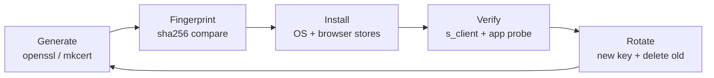
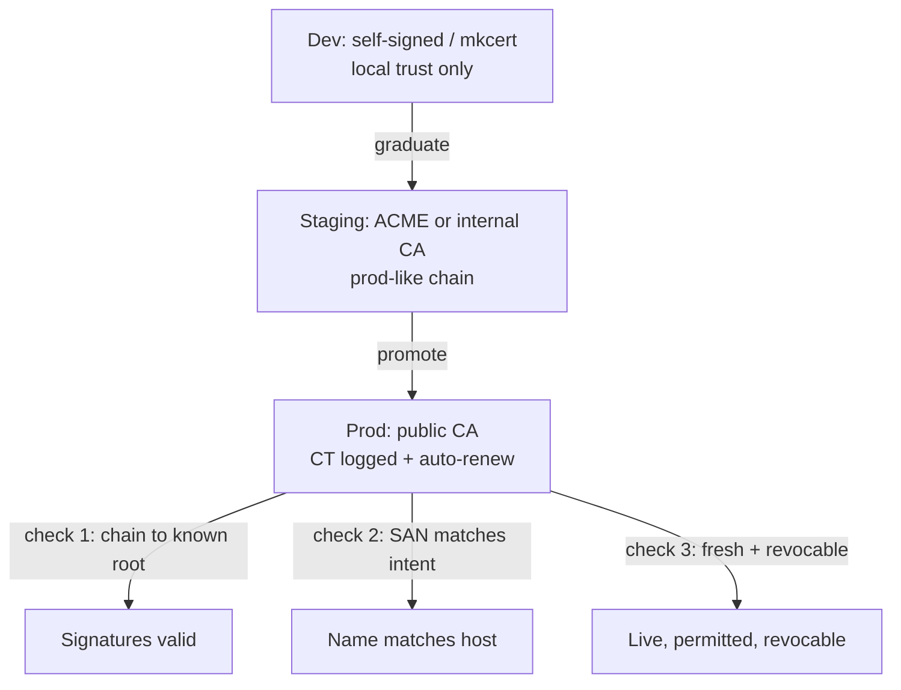

# Self-Signed Certificates

## Theory

A self-signed certificate is signed by its own key rather than a CA, so no external party vouches for it.
It matters for local development, integration tests, and bootstrapping internal PKI — but must never be trusted blindly in production.
Key subtopics: generating self-signed certs (openssl), trusting them locally (OS/browser trust stores),
differences from private-CA certs, and promoting dev setups to ACME or internal-CA issuance.

A self-signed certificate is the identity layer with the trusted third party removed. TLS without any
certificate gives you secrecy without certainty: the bits are scrambled, but you have no proof who is on
the other end. A CA-signed certificate solves that by stapling identity, public key, and a trusted
issuer's signature together. A self-signed certificate keeps the first two staples and signs the third
with its own private key — so the cryptography still works (encryption, handshake, SAN matching), but
the authentication staples to nobody except itself. Any client that has never seen this exact certificate
has no reason to trust it, and must fail closed until a human vouches for it out of band.

Think of a self-signed certificate the way you think of a handwritten name badge versus a passport. The
name badge binds a face (the public key) to a name (localhost, `myapp.test`, an ephemeral test hostname)
with the wearer's own pen (the self-signature). Inside your own office — your laptop, your team's dev
machines — everyone knows the handwriting and the badge speeds work up. At a border crossing — the public
internet, a partner network, a production deploy — the same badge is worthless, because the guard has no
shared trust in the pen. That is why browsers show `NET::ERR_CERT_AUTHORITY_INVALID` for self-signed
hosts: they are not saying the encryption broke, they are saying the vouching is missing.

This page teaches you to reason about self-signed certificates before you mint one. You will learn
what self-signed actually means field by field and how verifiers detect it in one check, how to generate
dev-ready certificates with OpenSSL and mkcert for localhost without training bad habits, how to trust
those certificates locally through OS and browser stores plus fingerprints and SAN discipline, when each
alternative — self-signed single cert, local private CA, public ACME cert — is appropriate, which attacks
self-signed setups invite and which controls contain them, and how to answer the self-signed questions
interviewers always ask.

> Scope note: this page is the interview-ready guide for self-signed certificates — meaning, dev and
> localhost generation with OpenSSL and mkcert, local trust via OS and browser stores, why blind trust
> fails in production, threats, and Q&A. Deep mechanics live in the linked sibling pages (CA operations
> and chain building, server certificate deployment for TLS, client certificates for mTLS). It assumes
> basic TLS and X.509 from the introduction and focuses on the decisions interviewers probe: trust on
> first use, fingerprint verification, SAN correctness, private-CA graduation, and prod promotion paths.

### Topics Covered

1. [What Self-Signed Means](#1-what-self-signed-means)
2. [Dev and Localhost Use](#2-dev-and-localhost-use)
3. [Trusting Locally](#3-trusting-locally)
4. [Why Never Blindly Trust in Prod](#4-why-never-blindly-trust-in-prod)
5. [Threats and Mitigations](#5-threats-and-mitigations)
6. [Interview Questions and Answers](#6-interview-questions-and-answers)

### 1. What Self-Signed Means

A self-signed certificate is one where subject and issuer are the same entity, and the signature verifies
with the public key carried inside the certificate itself. The binding still states an identity (a DNS
name such as `localhost`, an IP such as `127.0.0.1`, a custom dev name such as `api.myapp.test`), a
public key the holder controls, and a validity window — but the issuer attestation points back at the
subject. Verification therefore splits in two: the cryptographic check passes (the signature is valid
for the enclosed key), while the trust check fails (no preinstalled root vouches for that key).

The binding exists in this form because public keys alone are self-asserted and spoofable, and sometimes
you want a cheap, offline stand-in before real trust exists. On localhost anyone can generate a key pair
in a millisecond and claim to be any host. A self-signed certificate does not fix that spoofability for
strangers — an attacker on the path can mint an equally valid-looking self-signed cert for the same name
— but it does give the holder a stable object to pin, fingerprint, and install into their own trust
store. The security then comes from the out-of-band trust decision (I installed exactly this fingerprint
on exactly these machines), not from the certificate itself.

Self-signed verification, end to end:

- **An identity string you invented.** For local TLS it is the name you typed — `localhost`, a dev alias,
  a test container hostname — checked against Subject Alternative Names exactly like a public cert.
- **A public key you control.** The matching private key never leaves the dev machine; proof of possession
  happens live when the server signs handshake bytes with it.
- **A self-signature anyone can verify, nobody trusts by default.** `openssl verify -CAfile self.crt
  self.crt` passes cryptographically, while browsers and `curl` reject the chain with unknown-issuer
  because no trust-store root signed it.
- **Validity and scope metadata you chose.** Not-before and not-after bounds, serverAuth usage, CA:FALSE,
  SAN list — all enforced by clients even when the issuer is untrusted.
- **A fingerprint trust story instead of a revocation story.** Serial plus SHA-256 fingerprint is the
  handle; there is no CRL or OCSP behind it, so rotation means distributing a new fingerprint.

A concrete contrast shows why the distinction matters in interviews. Compare these two server greetings:

- *CA-signed:* "Here is api.example.com, its public key, validity for 90 days, signed by Intermediate X
  which is signed by Root Y you already trust, plus live proof I hold the private half." The client
  verifies chain to a root plus live proof, and trusts without prior contact.
- *Self-signed:* "Here is localhost, its public key, validity for 825 days, signed by localhost itself,
  plus live proof I hold the private half." The client verifies the live proof and the SAN match, then
  stops: the chain terminates at an unknown key, so a human must confirm the fingerprint before proceeding.

The backend lesson generalizes across this subsection: self-signed converts a verifiable third-party claim
back into a trust-on-first-use gamble. Dev pages use that gamble deliberately to move fast on localhost,
CA pages explain how to replace the gamble with constrained delegation, server pages use ACME to automate
the replacement, and client pages show why the gamble is never acceptable for callers you do not control.

| Kind | Who signs | Who trusts by default | Revocation story | When to choose it |
|---|---|---|---|---|
| Self-signed single cert | Its own key | Nobody; each machine installs it | None; rotate by replacing fingerprint | Single dev host, throwaway test, one-day spike |
| Local private CA (mkcert, smallstep) | Your dev CA key | Machines with the CA root installed | Local CRL or short lifetimes plus reissue | Team localhost, multi-service dev, integration tests |
| Public CA (ACME, Let's Encrypt) | Public intermediate chaining to a root | Every OS and browser | CRL, OCSP, short lifetimes, CT logs | Staging, preview, production — anything strangers touch |
| Internal enterprise PKI | Corporate intermediate | Managed fleet via MDM or group policy | CRL, OCSP, asset inventory | Prod-internal services on managed devices only |

Three companion rules complete the definition skill. First, extensions still decide authority: a self-signed
cert with CA:TRUE can sign children like a mini-CA, while CA:FALSE cannot — never mint dev certs with
CA:TRUE unless you are deliberately building a local CA. Second, SANs are still the real name check —
a self-signed cert with CN `localhost` but no SAN fails in modern clients exactly like a public cert
would. Third, fingerprints are the whole trust anchor: the SHA-256 hash over the DER bytes is what you
compare on the phone, in the README, and in the test setup script.

### 2. Dev and Localhost Use

Dev servers need HTTPS long before any public name exists, and self-signed certificates fill that gap.
Frontend features — secure cookies, service workers, WebCrypto, OAuth redirects, mixed-content-free
fetch — require a trusted-looking TLS context even on `localhost`. A self-signed cert gives you that
context offline in seconds: no DNS challenge, no CA account, no network. The cost is that every client
must be told to trust it explicitly, which is exactly the habit you want on a laptop and never in prod.

The fastest correct way to learn generation is to mint a cert with OpenSSL and map each flag to the
decision a client makes with it:

```bash
# 1. Generate a private key (never leaves the dev machine; ECDSA P-256 is the modern default).
openssl genpkey -algorithm EC -pkeyopt ec_paramgen_curve:P-256 -out localhost.key
chmod 600 localhost.key # key readable only by its owner

# 2. Mint a self-signed cert in one step (subject == issuer; SANs carry the real names).
openssl req -x509 -new -key localhost.key -out localhost.crt -days 825 -sha256 \
  -subj "/CN=localhost/O=Local Dev/C=US" \
  -addext "subjectAltName=DNS:localhost,DNS:api.myapp.test,IP:127.0.0.1" \
  -addext "keyUsage=digitalSignature,keyEncipherment" \
  -addext "extendedKeyUsage=serverAuth" \
  -addext "basicConstraints=critical,CA:FALSE"
# The -x509 flag self-signs instead of emitting a CSR; the CA:FALSE marks it a leaf, not a mini-CA.
```

The snippet above is explained as the ownership boundary. The key command mints the secret half locally
with tight permissions — anyone who reads `localhost.key` becomes localhost, so gitignore it and never
copy it into images. The cert command binds the public half to the names you will actually type, with
serverAuth usage and CA:FALSE so the cert cannot sign children. Reviewers check two things here: the
SAN list covers every alias the app serves (bare `localhost`, dev domain, loopback IP as `IP`, never as
`DNS`), and the lifetime is bounded so a forgotten cert cannot linger for a decade.

```bash
# 3. Inspect before trusting (never install blind).
openssl x509 -in localhost.crt -noout -subject -issuer -dates -ext subjectAltName
openssl x509 -in localhost.crt -noout -fingerprint -sha256  # read this aloud when sharing

# 4. Serve it locally exactly as clients see it (catches wrong-host and expired-cert surprises).
openssl s_server -accept 8443 -cert localhost.crt -key localhost.key -www &
openssl s_client -connect localhost:8443 -servername localhost -showcerts </dev/null
```

The snippet above is explained step by step. Inspection first confirms subject equals issuer (the
self-signed tell), dates bound the trust window, and SANs match deployment intent. The fingerprint line
prints the SHA-256 hash you compare out of band before anyone clicks trust. The `s_server` plus
`s_client` probe reproduces the browser check from a cold client, including SNI routing and SAN matching.

mkcert is the team-scale upgrade over raw OpenSSL, and interviews expect you to name it. `mkcert -install`
creates a local CA root once and installs it into the OS plus browser stores; `mkcert localhost
127.0.0.1 ::1 api.myapp.test` then mints a leaf from that local CA instead of a lone self-signed cert.
Clients with the local root installed trust every mkcert leaf with zero click-through, fingerprints stay
stable per machine, and the CA key never leaves `~/.local/share/mkcert`. Prefer mkcert when two or more
services or teammates share trust; keep raw OpenSSL for single-host spikes, CI jobs that pin one
fingerprint, and interviews that ask you to narrate every flag.

Two dev habits separate senior answers. First, keep dev TLS disposable and documented: a `make dev-certs`
script plus a README with fingerprints and expiry beats a Slack-dropped `localhost.crt` nobody can verify.
Second, rehearse the graduation path early: dev serves self-signed or mkcert today, staging serves ACME or
internal-CA certs tomorrow, and the app code never branches on cert kind — only the trust store changes.

### 3. Trusting Locally

No client trusts a self-signed certificate until a human installs it, and the store you install into
decides which apps believe you. Operating systems ship a trust store — macOS Keychain, Windows cert
manager, Linux NSS or ca-certificates bundle — that most languages and tools consult. Browsers add their
own layer: Chrome and Safari follow the OS store, Firefox keeps its own NSS database, Node and Python may
honor `NODE_EXTRA_CA_CERTS` or `REQUESTS_CA_BUNDLE` instead. Installing into one store while testing in
another is the classic "still untrusted" loop.

Trusting works differently per store, and the matrix below is the fastest way to stop guessing:

| Store | Applies to | Install or point command | Failure smell |
|---|---|---|---|
| macOS Keychain | Chrome, Safari, curl, Go | `sudo security add-trusted-cert -d -r trustRoot -k /Library/Keychains/System.keychain localhost.crt` | Added to login keychain only, server still untrusted |
| Linux ca-certificates | curl, Python, system tools | Copy to `/usr/local/share/ca-certificates/` then `sudo update-ca-certificates` | Forgot the update step, stale bundle cached |
| Windows cert manager | Chrome, Edge, .NET | `Import-Certificate -FilePath localhost.crt -CertStoreLocation Cert:\LocalMachine\Root` | Installed under CurrentUser while service runs as SYSTEM |
| Firefox NSS | Firefox only | Settings, Privacy and Security, View Certificates, Import under Authorities | OS store trusted but Firefox still warns |
| Node.js | Node apps | `export NODE_EXTRA_CA_CERTS=/path/localhost.crt` | Global install works, per-service env missing it |
| Python requests | Test scripts | `export REQUESTS_CA_BUNDLE=/path/localhost.crt` | System curl passes, pytest still fails verify |

Three companion rules complete the trust skill. First, verify fingerprints out of band before installing:
compare the SHA-256 from `openssl x509 -fingerprint -sha256` over chat, README, or a pinned CI artifact,
never by downloading cert and key from the same unverified channel. Second, scope trust narrowly: install
the single dev leaf or the mkcert local root on dev machines only, label it `LOCAL DEV ONLY`, and set a
calendar reminder to delete it when the project ends. Third, keep SAN discipline even locally — one entry
per name, loopback as `IP:127.0.0.1` and `IP:::1`, custom domains via `/etc/hosts` plus matching SANs —
because a sloppy dev cert trains you to ignore the exact errors production must fail closed on.



*The diagram above shows the local-trust loop: generate once, compare the fingerprint, install narrowly,
verify from a cold client, and rotate by replacing rather than extending.*

Two verification habits close the loop. Probe with `openssl s_client -connect localhost:8443
-CAfile localhost.crt -verify_return_error` for the cryptographic check, then load the real app in a
fresh profile to catch the store you forgot. And never export trust: the dev cert, its key, and the
mkcert root stay off Slack, off git, off base images — teammates generate or fetch fingerprints, they do
not inherit your private key.

### 4. Why Never Blindly Trust in Prod

Blind trust means clicking through the warning, pinning without verifying, or shipping a self-signed leaf
where strangers must decide. In production every one of those moves fails open, and the failure trains the
exact behavior attackers need. A user who learns "click Advanced, Proceed" on your staging host will click
it on the attacker's lookalike too. A deploy that sets `rejectUnauthorized: false` or `verify=False` to
accommodate a self-signed cert disables authentication for every connection from that client, not just the
dev one. The encryption still shows a padlock or a 200 OK, but confidentiality and integrity are already
lost because authentication failed first.

Roots stay audited and paranoid so leaves can stay cheap and replaceable, and self-signed skips the whole
hierarchy. A public root key lives in a hardware security module inside a ceremony room, used a few times
per decade to mint intermediates. Those intermediates sign thousands of leaves per day under baseline
requirements, Certificate Transparency logging, and revocation plumbing. A self-signed prod cert has none
of that: no third-party vetting, no public log entry, no CRL or OCSP endpoint, no rotation automation.
If its key leaks, there is no one to publish a revocation — every client keeps trusting until a human
finds and replaces each installed copy.

Promotion is the server's job and validation is the client's, so graduate before strangers arrive. The
server must present a chain strangers already trust: ACME-issued public certs for anything on the open
internet, internal-PKI certs with MDM-installed roots for managed fleets only. The client keeps failing
closed on unknown issuers, mismatched SANs, and expired windows. The classic production outage is the
dev cert that escaped: staging's self-signed leaf copied to prod, mobile apps pinned to its fingerprint,
desktop browsers green because someone installed the root once, and new users blocked with hard errors.



*The diagram above shows the promotion path from local trust through staging to production, with the
client enforcing three independent checks — trusted path, name match, and liveness — before trusting the
key.*

Three promotion rules end every self-signed discussion in interviews. First, localhost-only is a trust
boundary, not a suggestion: self-signed and mkcert roots live on dev machines, never in AMIs, containers,
or user instructions. Second, staging must look like prod cryptographically — same ACME client, same
chain bundle, same expiry alerts — so rotation and revocation get rehearsed where failure is cheap. Third,
never branch app code on cert kind: the TLS config, SAN list, and verification flags stay identical and
only the issuer and trust store change, which keeps `verify=False` hacks out of the codebase entirely.

### 5. Threats and Mitigations

Self-signed setups stop nothing by default — every guarantee comes from the human trust decision around
them. Learn the failure set as pairs — how the bypass works in one sentence, which control kills the
class — and every localhost-versus-production scenario becomes pattern matching rather than recall.

| Threat | How it works | Mitigation that kills the class |
|---|---|---|
| Person-in-the-middle with rogue self-signed cert | Attacker presents their own self-signed leaf for the same dev name | Fingerprint comparison out of band plus install-once trust, fail closed otherwise |
| Click-through training | Users learn to bypass warnings on dev hosts, then bypass the attacker's | Never ask users to click through; install the dev root or use mkcert locally |
| Verification disabled in code | `rejectUnauthorized: false` or `verify=False` shipped past dev | Per-env trust bundles, lint for disabled verify, identical TLS config across envs |
| Self-signed in production | Untrusted cert trains users and clients to accept unauthenticated keys | Public CA via ACME in prod, internal PKI with managed roots for fleets only |
| Private-key leak from dev machine | Key file copied from laptop, backup, image, or chat | chmod 600 plus gitignore, fresh key per rotation, never share keys |
| Overly broad dev cert | One dev key guards many hostnames, leak spreads across services | Narrow SANs per project, CA:FALSE leaves, separate mkcert scopes |
| Expired or wrong-host dev cert | Leaf passes NotAfter or misses a SAN, app fails confusingly | Bounded lifetimes, SAN review in generation script, s_client probe |
| Stale pinned fingerprint | App pins old self-signed hash, rotation bricks clients | Pin the local CA root or migrate to CA certs before shipping, version pins |
| Fake fingerprint channel | Attacker substitutes cert plus fingerprint in the same message | Share fingerprints over a second channel, sign them, or commit via reviewed PR |
| No revocation story | Compromised dev cert stays trusted until manually deleted everywhere | Short dev lifetimes, delete-on-rotation checklist, graduate to revocable CA certs |
| Trust-store confusion | Root installed for Chrome but tests run in Firefox or Node | Install into every store the app touches, verify per runtime, document the matrix |
| Dev CA key escape | mkcert or mini-CA root copied off the laptop, signs arbitrary hosts | CA:FALSE leaves by default, local CA key never leaves home dir, disk encryption |

Two scenarios show how to narrate an answer. First, the new-teammate setup: they clone the repo and hit
an untrusted-cert warning. State both controls in one breath — fetch the fingerprint from the README and
compare it against `openssl x509 -fingerprint -sha256` output, then install into the OS plus Firefox
stores — plus detection: a `make verify-certs` script that probes each dev host from a cold profile.
Second, suspected dev-key leak: the cert is valid for two more years and five laptops trust it. Fix with
a fresh key and reissue, distribute the new fingerprint over a second channel, delete the old cert from
every store, and shorten the next lifetime — plus a graduation note: this manual recall is exactly why
prod uses short-lived ACME certs instead.

### 6. Interview Questions and Answers

**Q1 (Beginner): What makes a certificate self-signed, and how do clients detect it?**
Subject equals issuer and the signature verifies with the enclosed public key itself. Clients detect it
in one check: the chain terminates at a key with no path to any trust-store root, so verification fails
with unknown-issuer or authority-invalid even though the cryptography is intact.

**Q2 (Beginner): When is a self-signed certificate the right tool?**
Single-host localhost work, throwaway spikes, and offline integration tests where installing one
fingerprint is cheaper than running a CA. The boundary is strangers: the moment anyone outside your
machine must trust without a prior fingerprint exchange, graduate to a local CA or ACME cert.

**Q3 (Intermediate): Walk me through minting a correct localhost cert with OpenSSL.**
Generate a P-256 key locally with `genpkey` and `chmod 600`, self-sign with `req -x509` carrying
`subjectAltName` for every alias (DNS plus `IP:127.0.0.1`), serverAuth usage, and `CA:FALSE`, then
inspect with `x509` and probe with `s_client` before installing. Never transmit the key; never deploy
without checking SANs and dates.

**Q4 (Intermediate): OpenSSL versus mkcert — which do you pick?**
Raw OpenSSL for single-host spikes and interviews where you narrate every flag, mkcert where a team or
multi-service mesh shares trust: one local CA root installed per machine, then unlimited leaves with
zero click-through. Both stay on dev machines; neither ships to staging or production.

**Q5 (Intermediate): Teammate still gets warnings after installing — what happened?**
Wrong-store install: the cert went into the OS keychain while the app reads Firefox NSS, Node's
`NODE_EXTRA_CA_CERTS`, or Python's `REQUESTS_CA_BUNDLE`. Fix by installing into every store the app
touches per the matrix, then verify with `s_client` plus a fresh-profile app load.

**Q6 (Intermediate): Why must production never trust self-signed blindly?**
No third-party vetting, no transparency log, no revocation channel — plus click-through and
`verify=False` habits that disable authentication for attackers too. Prod needs chains strangers
already trust: public ACME certs on the internet, managed internal PKI on managed fleets, with
auto-renewal and revocation rehearsed in staging.

**Q7 (Senior): Dev key may have leaked — what do you do?**
Mint a fresh key and reissue rather than waiting for expiry, share the new fingerprint over a second
channel, delete the old cert from every dev store, and shorten the next lifetime. Name the residual
risk window from machines you cannot reach, and the structural fix: graduate shared environments to a
revocable local CA or ACME path.

**Q8 (Senior): Design the TLS path from localhost to production for ten services.**
Localhost serves mkcert or self-signed leaves with pinned fingerprints and a `make dev-certs` script;
staging mirrors prod with per-service ACME or internal-CA certs, full-chain bundles, and expiry alerts;
production enforces trusted chains, SAN-scoped per-service names, short lifetimes with auto-renew, CT
logging, and identical verification flags everywhere. The trade-off is manual fingerprint trust versus
automation complexity, answered with disposable local trust that graduates to self-renewing chains.