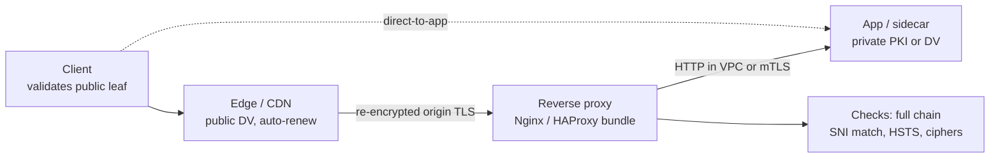

# Server Certificates

## Theory

Server certificates let clients verify a server's identity and establish an encrypted TLS session.
They matter because every HTTPS endpoint depends on a valid, trusted server certificate — expiry or mis-issuance causes outages.
Key subtopics: domain validation (DV) vs organization/extended validation, SANs and wildcards, issuance via ACME (Let's Encrypt),
renewal automation, and terminating TLS at reverse proxies (Nginx, HAProxy).

A server certificate is a TLS leaf certificate with `serverAuth` extended key usage, binding one or more
DNS names to a public key under a publicly trusted CA signature. When a browser opens `https://api.example.com`,
the server presents this leaf plus its intermediate chain, proves possession of the matching private key during
the handshake, and the client verifies three independent facts: the chain terminates at a trusted root, the
intended hostname matches a Subject Alternative Name, and the certificate is live, correctly purposed, and
unrevoked. If any check fails, the connection fails closed — no retry over plaintext, no click-through in
well-configured clients.

Think of a server certificate the way you think of a lit shop sign plus a business license in the window.
The sign (the DNS name on the certificate) tells the visitor which shop they found. The license (the CA
signature) tells them a registrar verified the shopkeeper may use that name. And the shopkeeper opening the
safe with a key only they hold (the handshake proof of private-key possession) tells them the person behind
the counter is the license holder, not someone who photocopied the license. A valid chain without name match
is a real license in the wrong shop. A matching name without a trusted signature is a hand-painted sign with
no registrar behind it. A matching signed certificate without the private key is a photocopy — it cannot open
the safe, so the handshake fails.

This page teaches you to deploy server certificates that stay up, not just to describe them. You will learn
what a server certificate proves and what it never proves, when each validation level and name form pays off,
how a CSR becomes an installed leaf with OpenSSL commands you can run, how renewal and ACME automation remove
the 2 a.m. expiry page, where to terminate TLS — at the edge, the reverse proxy, or the app — and what each
choice costs, which server-side mistakes cause outages or impersonation and which controls kill each class,
and how to answer the server-certificate questions interviewers always ask.

> Scope note: this page is the interview-ready guide to server certificates for TLS — identity proof, DV/OV/EV
> and SANs, CSR to issuance to installation with OpenSSL, renewal and ACME automation, TLS termination
> patterns, threats, and Q&A. Chain-of-trust mechanics and CA policy live in the parent introduction and the
> CA page, mTLS client identity lives in the client-certificates page, and localhost trust lives in the
> self-signed page. It assumes basic TLS and HTTP and focuses on the decisions interviewers probe: correct
> names, complete chains, automated lifetimes, and termination trade-offs.

### Topics Covered

1. [What Server Certs Prove](#1-what-server-certs-prove)
2. [DV, OV, EV and SANs](#2-dv-ov-ev-and-sans)
3. [CSR to Issue to Install](#3-csr-to-issue-to-install)
4. [Renewal and ACME Automation](#4-renewal-and-acme-automation)
5. [TLS Termination Patterns](#5-tls-termination-patterns)
6. [Threats and Mitigations](#6-threats-and-mitigations)
7. [Interview Questions and Answers](#7-interview-questions-and-answers)

### 1. What Server Certs Prove

A server certificate proves three claims at once, and only those three. First, that a trusted CA verified the
requester controlled the listed DNS names at issuance time and signed that binding. Second, that the public key
in the certificate is the one whose private half the server must wield live during the handshake. Third, that the
binding is currently scoped: inside its validity window, permitted for server authentication, and not revoked.
Everything a client does — chain building, SAN comparison, date and EKU checks, revocation consultation — is a
test of one of those three claims.

What it never proves is equally interview-relevant. It does not prove the site is safe, honest, or uncompromised —
a phishing site gets a valid DV certificate in minutes. It does not prove the organization behind the site unless
the certificate is OV or EV carrying vetted subject fields, and even then it proves legal existence, not good
intent. It does not prove the content is intact beyond the TLS session: it authenticates the endpoint for key
establishment, while HTTP semantics, API authorization, and code integrity are separate layers. Say this boundary
 crisply and you avoid the most common junior trap: equating the padlock with trustworthiness.

The live proof is what turns a static document into authentication. The certificate itself is public — it is sent
in cleartext in every handshake — so possession of a copy means nothing. During TLS 1.2 and 1.3 the server must
use the private key: signing the handshake transcript (certificate-based authentication) or completing an
ephemeral key exchange bound to that key. An attacker who copies the certificate but lacks the key cannot complete
either step, and the handshake aborts. That is why key storage — file permissions, secret managers, HSMs — is a
certificate control, not an afterthought: whoever reads `server.key` becomes the server for every name on the cert.

Clients enforce the proof with four gates, in order:

- **Signature path:** every signature verifies up to a root in the local trust store, with Basic Constraints and
  Key Usage permitting each signing step. A leaf with `CA:TRUE` or a chain ending at an unknown issuer fails here.
- **Name binding:** the hostname the client intended — the URL host or the configured service name, never a string
  taken from the certificate — matches a SAN entry under RFC 6125 rules. Modern clients ignore Common Name.
- **Time and purpose:** the local clock falls inside NotBefore and NotAfter, and Extended Key Usage includes
  `serverAuth`. A correct name with the wrong purpose or an expired window still fails closed.
- **Revocation freshness:** per local policy, CRL, OCSP, or stapled evidence shows the leaf and its intermediate
  were not cancelled. Short lifetimes shrink the window this gate must cover.

A concrete contrast anchors the whole section. Compare two greetings for `api.example.com`:

- *Naked key:* "Here is my RSA public key, trust me, I am api.example.com." No test exists beyond receiving bytes.
  DNS poisoning, BGP hijack, rogue Wi-Fi, or a transparent proxy can all replay the sentence with the attacker's key.
- *Certificate:* "Here is api.example.com with its P-256 key, valid until December, serverAuth usage, signed by
  Intermediate X signed by Root Y you already trust — and here is my signature over fresh handshake randomness
  proving I hold the private half." The client verifies the chain, the name, and the live signature independently.

The backend lesson generalizes: server certificates convert "encrypt to whoever answered" into "encrypt to the
verified holder of this name." Edge, proxy, and app layers all consume the same proof; they differ only in where
the private key lives and which component answers the handshake, which is the subject of section 5.

### 2. DV, OV, EV and SANs

Validation level answers how hard the CA checked the requester before signing. Name form answers which identities
the resulting certificate covers. The two choices are independent — any level can carry any name form — but they
are decided together because both trade assurance against issuance latency, cost, and operational blast radius.

Domain Validated (DV) proves control of the name only: answer an HTTP-01 token, publish a DNS-01 TXT record, or
click an admin-email link, usually via ACME in minutes and free from providers like Let's Encrypt. The resulting
encryption is identical to OV and EV — the cryptography never differed. Organization Validated (OV) adds manual
vetting of the legal entity against business registries plus address and phone callbacks over days, embedding O,
L, ST, and C fields in the subject. Extended Validation (EV) adds the strictest legal-opinion letters and
operational-existence checks over weeks with the heaviest audit trail. Browsers no longer render distinct EV
chrome, so the user-visible signal has faded; remaining EV value is contractual and internal, not cryptographic.

| Level | What CA verifies | Issuance time and cost | Trust signal | When to choose it |
|---|---|---|---|---|
| DV | Control of the domain via HTTP, DNS, or email challenge | Minutes, often free via ACME | Correct name plus encryption, no identity claim | Default for APIs, services, internal TLS, ephemeral envs |
| OV | Domain control plus legal existence and address | Days, paid per certificate | Name plus vetted organization in subject | B2B APIs and regulated pages where customers inspect the org |
| EV | Rigorous legal, physical, and operational existence | Weeks, most expensive audit | Strongest vetting trail, no extra browser UI today | Banks and institutions bound by policy or contract |
| Private PKI server cert | Employment or device ownership per internal policy | Minutes via internal CA | Trusted only where the private root is installed | East-west service TLS inside a mesh or VPC |

Name forms decide blast radius and renewal pain. A single-name certificate covers one FQDN, keeping compromise
scope minimal but multiplying renewal work across fleets. A SAN certificate lists many FQDNs — `api.example.com`,
`app.example.com`, even unrelated domains — in one object with one expiry, simplifying deploys while coupling
their fate: one renewal miss downs every name at once. A wildcard such as `*.example.com` covers every direct
subdomain with one entry, operationally sweet and risky together, because one key guards many properties and its
storage and rotation discipline must match that reach. A multi-year trophy certificate spanning production,
staging, and partner domains is the canonical anti-pattern this table argues against.

Three name-matching rules end every wildcard discussion in interviews. First, a wildcard matches exactly one DNS
label: `*.example.com` covers `api.example.com` but never the bare `example.com` nor `a.b.example.com` unless
those appear as separate SAN entries. Second, matching consults the SAN extension only — the legacy Common Name
fallback is dead, so a certificate with CN but no SAN fails closed on modern clients. Third, internationalized
names match in punycode and IP identities match only as `iPAddress` SAN entries, never as DNS strings — serving
`https://10.0.0.5` with a DNS SAN for that string fails while an `IP:10.0.0.5` entry succeeds.

Short lifetimes are the modern default that makes DV plus narrow SANs cheap. Ninety-day ACME certificates push
teams toward auto-renewal, shrinking both the revocation problem (a stolen key dies soon anyway) and the expiry
problem (renewal runs weekly, not yearly). OV and EV keep longer manual cycles because human re-vetting cannot run
on cron. State the trade-off explicitly: automation favors short-lived DV per service and per environment,
compliance favors long-lived OV/EV for the handful of pages that need them, and mixing both per audience beats
one policy everywhere.

### 3. CSR to Issue to Install

Every server certificate is born the same way: a private key is generated where it will be used, a Certificate
Signing Request packages the public key plus requested names, a CA validates and signs, and the returned leaf is
installed with its intermediate bundle and served. Learn this loop with the OpenSSL commands below, because
interviewers treat fluent CSR-to-install narration as proof you have operated HTTPS rather than read about it.

Stage one is the private key, created on the terminating host and never transmitted. ECDSA P-256 is the modern
default for speed and size; RSA-2048 remains the conservative floor where legacy clients demand it. Permissions
are set at birth — readable only by the service user — because anyone who copies the key becomes the identity.
Stage two is the CSR, which carries the public key, the requested subject, and the SAN list to the CA. The CSR
contains no secret, so forwarding it to a CA or an ACME client is safe by construction; the CA must still verify
each requested name independently before signing.

```bash
# 1. Generate the private key where it will serve (never leaves this host).
openssl genpkey -algorithm EC -pkeyopt ec_paramgen_curve:P-256 -out server.key
chmod 600 server.key # key readable only by its service user

# 2. Create a CSR binding the key to the identities you want certified.
openssl req -new -key server.key -out server.csr \
  -subj "/CN=api.example.com/O=Example Inc/C=US" \
  -addext "subjectAltName=DNS:api.example.com,DNS:api-v2.example.com"
# The CSR carries the public key + requested names; the CA still verifies each name.
# For an IP-served API add IP entries: -addext "subjectAltName=DNS:api.example.com,IP:10.0.0.5"
```

The snippet above is the ownership boundary interviewers probe. The `genpkey` command mints the secret half
locally: the algorithm flag chooses the key type reviewers check first (P-256 or RSA-2048 minimum), and the
`chmod` line is a control, not hygiene — world-readable keys leak through backups, images, and log collectors.
The `req` command derives the public half and the requested names without exposing the secret; the `-subj` sets
the legacy display fields while `-addext` sets the SAN list clients actually enforce. Reviewers check two things
here: the SAN list matches deployment intent (both hostnames the load balancer will answer for), and the CSR was
generated fresh per host rather than cloned across environments.

Stage three is issuance and installation: the CA validates domain control (or organization identity for OV/EV),
signs, and returns the leaf, while you serve it with the full intermediate bundle. Never deploy blind — inspect
the returned certificate, verify the live chain exactly as clients see it, then wire the bundle into the proxy
and reload gracefully so existing connections drain.

```bash
# 3a. Inspect what the CA returned before installing (never deploy blind).
openssl x509 -in server.crt -noout -subject -issuer -dates -ext subjectAltName,keyUsage,extendedKeyUsage

# 3b. Install the full chain: leaf + intermediates in one bundle most proxies expect.
cat server.crt intermediate.crt > fullchain.pem
# Nginx: ssl_certificate points at the bundle, ssl_certificate_key at the private key.
#   ssl_certificate     /etc/nginx/tls/fullchain.pem;
#   ssl_certificate_key /etc/nginx/tls/server.key;
# HAProxy: concatenated PEM in one file.
cat server.crt intermediate.crt server.key > /etc/haproxy/tls/api.example.com.pem

# 3c. Verify the served chain exactly as clients see it (catches missing intermediates + SNI mistakes).
openssl s_client -connect api.example.com:443 -servername api.example.com -showcerts </dev/null
# Expect: depth 0 = leaf (api.example.com), depth 1 = intermediate, Verify return code: 0 (ok).
```

The snippet above is explained stage by stage. Inspection first confirms subject, issuer, dates, SANs, and usages
before any reload — most wrong-host, expired-on-arrival, and wrong-purpose outages are caught here in seconds.
The bundle step fixes the classic incomplete-chain outage: the server must send leaf plus intermediates because
clients hold only roots, and desktop browsers hide the mistake via cached intermediates while mobile apps and
`curl` fail with unknown-issuer errors. The `s_client` probe with `-servername` reproduces SNI routing and cold
chain building faithfully; check the depth list and the final verify code rather than eyeballing the first PEM
block. The install lines double as config answers: Nginx splits bundle and key into two directives, HAProxy wants
a single concatenated PEM, and both reload without dropping connections (`nginx -s reload`, `systemctl reload
haproxy`) so new handshakes use the new leaf while established ones drain.

Two install habits separate senior answers. First, keep one private key per terminating host or per service, never
one key copied across production and staging to save a CSR — key scope is blast radius. Second, version the bundle
and test SNI explicitly when one proxy serves many names: connect with each `-servername` the vhost answers for
and confirm the returned leaf's SAN covers it, because a default-cert fallback serving the wrong name is a
name-mismatch outage wearing a valid certificate.

### 4. Renewal and ACME Automation

Certificates expire by design, so renewal is the control that decides whether expiry is a non-event or an outage.
The modern default is automated renewal of short-lived (90-day) DV certificates via ACME — the protocol behind
Let's Encrypt — with monitoring as the backstop and manual OV/EV renewal as the deliberate exception. The rule to
state in interviews: renewal runs weekly under automation, not yearly on a calendar reminder.

ACME automates domain validation and reissuance in a loop the server can run unattended. An ACME client (Certbot,
lego, acme.sh, Caddy's built-in client) proves control of each name, obtains a signed leaf, installs it, and
reloads the proxy. HTTP-01 proves control by serving a challenge token over port 80, which suits single hosts
with public HTTP. DNS-01 proves control by publishing a TXT record, which is the only path for wildcards and the
standard path behind load balancers and for internal names delegated to an ACME-aware DNS zone. TLS-ALPN-01 proves
control over port 443 for hosts without port 80. The CA returns a fresh leaf (typically 90 days), and the client
repeats the loop forever — issuance becomes a cron job, not a ticket.

```bash
# Issue once (HTTP-01 via webroot; DNS-01 via --preferred-challenges dns-01 for wildcards).
certbot certonly --webroot -w /var/www/html -d api.example.com -d api-v2.example.com
# Wildcard path (requires DNS plugin for your provider):
# certbot certonly --dns-route53 -d 'api.example.com' -d '*.example.com'

# Renewal runs unattended twice daily; the deploy hook reloads only when a cert actually renewed.
certbot renew --deploy-hook "nginx -s reload"
# Dry-run the path in staging before production depends on it:
# certbot renew --dry-run
```

The snippet above is the automation answer in four lines. The `certonly` issuance separates obtaining from
installing so the same flow works behind Nginx, HAProxy, or a CDN origin pull. The wildcard comment names the
constraint interviewers expect: `*.example.com` never issues over HTTP-01 because a single HTTP vhost cannot
prove control of every possible subdomain — DNS-01 is mandatory, which means the DNS provider API credential
becomes part of the PKI and must be scoped least-privilege. The `renew` line runs on a timer (systemd or cron,
twice daily with random jitter) and the `--deploy-hook` keeps reloads tied to actual renewal rather than every
tick. The `--dry-run` against the staging endpoint validates the challenge path, rate limits, and hook without
burning production issuance quotas.

Monitoring and rotation discipline close the loop automation cannot cover alone:

- **External expiry probes at 30, 14, and 3 days.** Poll each public endpoint's served leaf (Prometheus
  `blackbox_exporter`, Datadog TLS checks, or a five-line `openssl s_client` cron) rather than trusting an
  internal spreadsheet — what the client sees is the truth, including CDN and proxy layers.
- **Chain and name checks, not just dates.** Alert on issuer change, shrinking chain depth, and SAN drift after
  every deploy, because a fresh but incomplete bundle or a hostname added to the proxy but not the cert fails
  exactly like an expiry.
- **Fresh keys per renewal, graceful reloads.** Reissue with a new key (`--force-renewal` only for incidents;
  routine renewal mints new keys by default in modern clients), then `nginx -s reload` or equivalent so existing
  connections drain on the old leaf while new handshakes negotiate the new one.
- **Runbooked rotation and revocation.** Time the drill from "key suspected leaked" to new key deployed plus old
  serial revoked plus OCSP cache flushed, because the follow-up is always "your CDN caches OCSP for 24 hours, now
  what" — and the answer is short lifetimes plus stapling plus a rehearsed runbook, not hope.
- **Manual path for OV/EV kept deliberate.** Calendar the re-vetting window months early, pin the approver and
  the callback phone number, and never let the one marketing page on EV share automation, expiry, or key material
  with the fifty DV services — isolation beats uniformity here.

Name the failure modes automation leaves behind to earn senior marks. Rate limits bite during mass reissue after
an incident — stage renewals and use one certificate per service so a retry storm does not block the fleet. DNS-01
credentials leak through CI logs — scope the API token to TXT records on the challenged zone only. Reload hooks
fail silently — log the hook output and alert when the served serial stops advancing after a reported renewal.

### 5. TLS Termination Patterns

Termination is the decision about where the private key lives and which component completes the handshake. The
certificate is identical in every pattern; what changes is blast radius, visibility, latency, and who reloads on
renewal. Four patterns cover nearly every production topology, and interviews expect you to place each workload
in one and defend the trade-off.

At the CDN or cloud edge, the edge PoP holds a publicly trusted leaf (often managed by the provider with one-click
ACME) and speaks HTTPS to clients, then re-encrypts or — only inside a private backbone — plain HTTP to the
origin. At the reverse proxy, Nginx or HAProxy in your VPC terminates TLS, enforces HSTS and cipher policy once,
and forwards HTTP or re-encrypted HTTPS to apps that never see keys. At the app, each service terminates its own
TLS with its own leaf and key, maximizing end-to-end authentication at the cost of fleet-wide renewal work. In the
mesh sidecar variant, an Envoy or linkerd sidecar next to each pod terminates and originates TLS with short-lived
mesh-issued leaves, often backed by private PKI rather than public DV.



*The diagram above shows the three termination points in series — edge, reverse proxy, app or sidecar — with the
client validating the outermost leaf and each inner hop re-establishing trust independently.*

```nginx
# Nginx: canonical TLS termination block (leaf bundle + key + SNI vhosts).
server {
    listen 443 ssl http2;
    server_name api.example.com;
    ssl_certificate     /etc/nginx/tls/fullchain.pem; # leaf + intermediates
    ssl_certificate_key /etc/nginx/tls/server.key;    # service-user readable only
    ssl_protocols TLSv1.2 TLSv1.3;
    ssl_prefer_server_ciphers on;
    add_header Strict-Transport-Security "max-age=31536000; includeSubDomains" always;
    location / { proxy_pass http://app_upstream; proxy_set_header X-Forwarded-Proto https; }
}
# Second name = second block with its own bundle; test each with s_client -servername.
```

```text
# HAProxy: single concatenated PEM per frontend, SNI-routed to backends.
frontend https_in
    bind *:443 ssl crt /etc/haproxy/tls/api.example.com.pem crt /etc/haproxy/tls/app.example.com.pem alpn h2,http/1.1
    use_backend api_nodes if { ssl_fc_sni api.example.com }
    default_backend app_nodes
backend api_nodes
    # Re-encrypt to origins; never plaintext across AZs you do not control.
    server api1 10.0.1.11:443 ssl verify required ca-file /etc/ssl/certs/internal-ca.crt check
```

The configs above encode the decisions reviewers listen for. Both serve the full chain so cold clients build a
path, both pin modern TLS floors with HSTS so downgrade and stripping fail, and both route by SNI so each name
gets its own leaf — the default-cert fallback is tested, not assumed. The HAProxy backend line states the inner-hop
choice explicitly: re-encrypt with verification against an internal CA rather than dropping to plaintext the moment
traffic leaves the proxy. The Nginx block keeps apps keyless, so renewal touches one proxy tier and one reload.

| Pattern | Where key lives | Strengths | Costs and risks | Choose when |
|---|---|---|---|---|
| CDN / cloud edge | Provider-managed at PoP | DDoS absorption, global session reuse, zero-touch renewal | Origin trust gap, provider key custody, cache subtleties | Public sites and APIs needing edge performance |
| Reverse proxy (Nginx/HAProxy) | Proxy tier in your VPC | One policy point, apps stay keyless, SNI + HSTS in one place | Proxy is the blast radius, inner hop must re-encrypt | Default for multi-service VPCs and interviews |
| App-direct | Each service host | True end-to-end TLS, no middlebox plaintext | Fleet renewal burden, cipher drift across services | Regulated or single-service estates with automation |
| Sidecar / mesh | Sidecar per pod | Uniform mTLS, short-lived private-PKI leaves, identity per workload | Mesh CA operations, debugging through two handshakes | East-west zero-trust inside Kubernetes |

Three rules close every termination answer. First, terminate once per trust boundary and re-encrypt across every
boundary you do not physically control — edge-to-proxy and proxy-to-app are separate TLS sessions with separate
verification. Second, keep SNI and SAN aligned: every `server_name` or `ssl_fc_sni` value needs a SAN entry in
the served bundle, verified per name from a cold client. Third, centralize policy (protocols, ciphers, HSTS) at
the terminator and monitor the served serial per PoP, so a renewal that updated one proxy but not its twin shows
up as serial divergence before clients notice.

### 6. Threats and Mitigations

Server certificates stop impersonation only while every field, chain link, clock, and revocation signal is honored.
Learn the failure set as pairs — how the bypass or outage works in one sentence, which control kills the class —
and every server-certificate scenario becomes pattern matching rather than recall.

| Threat | How it works | Mitigation that kills the class |
|---|---|---|
| Person-in-the-middle with rogue key | Attacker presents their own key for the victim hostname | Full chain validation to a trusted root plus SAN match, fail closed |
| Name mismatch via vhost confusion | Valid cert for one name served on another SNI route | Per-name bundles, RFC 6125 SAN checks, s_client probes per servername |
| Expired leaf outage | Leaf passes NotAfter, every client rejects at once | ACME auto-renewal, external expiry alerts at 30/14/3 days, staging dry-runs |
| Incomplete chain | Server omits intermediate, cold clients fail unknown-issuer | Serve full-chain bundle, verify from clean hosts and mobile clients |
| Revoked-but-accepted cert | Compromised key stays valid until expiry | CRL/OCSP hard-fail or stapling, short lifetimes, rehearsed rotation runbook |
| Weak signature or key | SHA-1, RSA-1024, or small curves forged or factored | Allowlist modern algorithms, minimum RSA-2048 or P-256, inventory scans |
| Overly broad SAN or wildcard | One key guards many properties, leak spreads wide | Per-service per-env certs, narrow SANs, HSM or manager-backed keys |
| Private-key theft | Key file copied from disk, backup, image, or log | chmod 600 plus service user, HSM or secret manager, fresh key per renewal |
| Downgrade and stripping | Attacker forces HTTP or legacy TLS around the cert | HSTS with preload, HTTP-to-HTTPS redirects, minimum TLS 1.2, no mixed content |
| Origin-plaintext after edge TLS | Edge encrypts but proxy-to-app hops run cleartext across networks | Re-encrypt inner hops with verified origin certs, private PKI between tiers |
| Self-signed in production | Untrusted cert trains users to click through warnings | Public CA or installed private PKI in prod, self-signed for localhost only |
| Clock-skew rejection | Client or server clock outside validity window | NTP everywhere, validity monitoring, bounded skew handling |

Two scenarios show how to narrate an answer. First, the missing-intermediate outage: desktop works because the
browser cached the intermediate while the mobile app fails unknown-issuer. State both controls in one breath —
deploy the full-chain bundle and verify with `openssl s_client -showcerts` from a cold client — plus detection:
synthetic probes per PoP alerting on chain depth and issuer change. Second, the edge-terminated checkout whose
origin runs plaintext across AZs: the padlock is real at the edge and the card numbers traverse a shared network
unencrypted. Fix by re-encrypting proxy-to-app with verified origin certificates, pinning the internal CA in the
proxy backend, and proving it with packet-level or header-level evidence that no cleartext hop remains.

### 7. Interview Questions and Answers

**Q1 (Beginner): What does a server certificate prove, and what does it never prove?**
It proves a CA verified control of the listed DNS names, bound them to a public key, and scoped the binding by
time, purpose, and revocation — with the server proving live possession of the private key each handshake. It never
proves the site is honest or safe: phishing hosts get valid DV certificates in minutes, and only OV/EV add vetted
organization identity, never a safety guarantee.

**Q2 (Beginner): DV versus OV versus EV — which do you pick for an API?**
DV by default: minutes, free via ACME, identical encryption, and automatable renewal. OV when B2B customers inspect
the organization subject or regulators demand vetted identity. EV only when policy or contract mandates the deepest
audit trail. With no browser UI distinction left, choose by assurance requirement per audience, not by crypto
strength — DV for fifty services, OV/EV for the handful of pages that need them.

**Q3 (Intermediate): How do SANs and wildcards match, and what goes wrong?**
Matching consults the SAN extension only: each FQDN needs its own entry, `*.example.com` covers exactly one label
(never the bare domain or nested levels), and IPs need `iPAddress` entries. Failures come from CN-only certs,
hostnames added to the proxy but not the SAN list, and trophy SAN lists coupling production, staging, and partner
domains to one expiry and one key. Prefer narrow per-environment certificates.

**Q4 (Intermediate): Narrate CSR to install with commands.**
Generate the key on the serving host with `genpkey` and lock it with `chmod 600`, mint a CSR with `req` carrying
the SANs, have the CA validate and sign, inspect the returned leaf with `x509 -noout -subject -issuer -dates -ext`,
bundle leaf plus intermediates into `fullchain.pem`, wire it into Nginx or HAProxy, and verify live with `s_client
-connect host:443 -servername host -showcerts`. Never transmit the key; never deploy without inspecting.

**Q5 (Intermediate): How does ACME renewal work, and what still needs monitoring?**
An ACME client proves control via HTTP-01, DNS-01 (mandatory for wildcards), or TLS-ALPN-01, obtains a 90-day leaf,
installs it, and reloads the proxy on a twice-daily timer with `--deploy-hook` and `--dry-run` staging checks.
Monitoring still covers external expiry at 30/14/3 days, chain depth and SAN drift, served-serial advancement after
renewal, and DNS-01 credential scope — plus rate-limit staging so mass reissue after an incident does not block.

**Q6 (Intermediate): Where do you terminate TLS — edge, proxy, or app?**
Reverse proxy by default: one HSTS, cipher, and renewal policy point with apps kept keyless. CDN edge in front for
public performance and DDoS, re-encrypting to the origin. App-direct only for true end-to-end needs with fleet
automation to carry the renewal burden, and sidecars for per-pod mTLS inside the mesh. Terminate once per trust
boundary, re-encrypt across every network you do not control, and route each SNI name to its own bundle.

**Q7 (Intermediate): Desktop loads but mobile fails with unknown issuer — what happened?**
The server sent a partial chain: leaf only, no intermediate. Desktops succeeded from cached intermediates while cold
clients could not build a path. Fix by serving the full-chain bundle, confirm with `s_client -showcerts` from a
clean host for every SNI name, and add synthetic chain-depth monitoring per PoP so the next rotation cannot regress.

**Q8 (Senior): Your wildcard key may have leaked with sixty days left — what do you do?**
Mint fresh per-service keys and reissue narrow non-wildcard leaves immediately rather than waiting for expiry,
deploy with zero-downtime reloads, revoke the old serial so CRL and OCSP publish it, staple fresh OCSP with short
caches, and split the trophy wildcard into per-service certificates going forward. Report time-to-revoke from the
rehearsed runbook and name the residual window from CDN and client OCSP caching plus the shortened future lifetime.