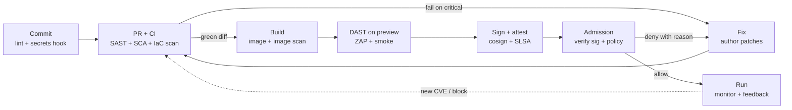
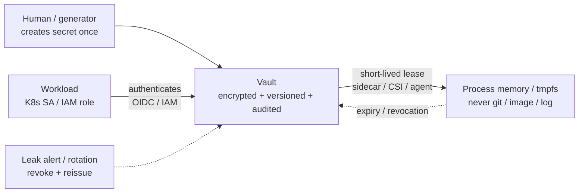

# DevSecOps

## Theory

DevSecOps integrates security into every stage of the delivery pipeline — build, test, deploy, and run — rather than auditing at the end.
It matters because vulnerabilities caught by automated scanning and policy checks are far cheaper to fix than production incidents.
Key subtopics: SAST/DAST and dependency scanning in CI, container image signing, secrets management, and policy-as-code.

DevSecOps is the answer to a delivery problem every backend team has felt. When security lives only
as a pre-release review, it becomes a queue: features wait, reviewers rush, findings arrive too late
to fix cleanly, and the choice collapses to ship with known holes or slip the date. Pipelines kept
getting faster with CI, containers, and GitOps while that final gate stayed manual. DevSecOps moves
the checks into the pipeline itself so every commit, image, and deploy carries its own evidence.

Think of it as shift-left applied to delivery. Developers get fast feedback where they work — IDE
hints, pre-commit hooks, pull-request scans — instead of a PDF weeks later. The pipeline enforces
budgets and gates where machines are consistent — SAST on diffs, SCA on lockfiles, secret scans on
history, image scans before push, policy checks before deploy. Runtime keeps the promises honest —
signatures verified, posture monitored, incidents fed back into new gates. Speed survives because
the safe path is the paved path, not an extra form to file.

This guide takes you from why to how to prove-it. You will learn why shift-left economics force
security into the pipeline, how each pipeline stage maps to one scanner class and one gate, how
policy-as-code turns tribal rules into blocking checks, how secrets flow from vault to workload
without touching git, how image signing and provenance close the supply-chain loop, which threats
each control kills, which habits interviewers always probe, and how to narrate a pipeline design
under whiteboard pressure.

> Scope note: this page is the interview-ready DevSecOps guide for backend and platform interviews —
> shift-left rationale, pipeline stages, scanning classes, policy-as-code, secrets, image security,
> threats, habits, and Q&A. Deep mechanics live in linked pages (OAuth flows, TLS, encryption, WAF,
> firewall, reverse proxy, SSH, environment variables). It assumes basic CI/CD and Docker and focuses
> on the decisions interviewers probe: gates, provenance, least privilege, and speed with safety.

### Topics Covered

1. [What is DevSecOps and Why Shift Left](#1-what-is-devsecops-and-why-shift-left)
2. [Pipeline Stages SAST DAST SCA Secrets and Image Signing](#2-pipeline-stages-sast-dast-sca-secrets-and-image-signing)
3. [Policy as Code and Guardrails](#3-policy-as-code-and-guardrails)
4. [Secrets Management](#4-secrets-management)
5. [Container and Image Security](#5-container-and-image-security)
6. [Threats and Mitigations](#6-threats-and-mitigations)
7. [Best Practices](#7-best-practices)
8. [Interview Questions and Answers](#8-interview-questions-and-answers)

### 1. What is DevSecOps and Why Shift Left

DevSecOps means security is a pipeline property, not a team that says no at the end. Every change
travels a path — code, build, test, artifact, deploy, run — and each step runs the checks suited to
it, fails closed on what matters, and records evidence. Developers own secure code with fast tools,
platform teams own guardrails and paved roads, and security teams own policy, threat models, and
exception handling. The culture shift is shared ownership: whoever breaks it finds it first, where it is
cheapest, with automation rather than heroics.

The economic argument is the cost-of-change curve every interviewer expects you to draw in words.
A hardcoded secret caught by a pre-commit hook costs a rewrite of one line. The same secret merged
to main costs rotation, history scrubbing, and audit. An SQL injection caught by SAST on a diff
costs a parameterized query. The same injection found by DAST in staging costs a ticket plus a
re-test. Found via bug bounty in production it costs incident response, forensics, notification,
and reputation. Shift-left exists because finding classes earlier removes them everywhere later.

| Phase found | Example finding | Typical cost | What shift-left replaces it with |
|---|---|---|---|
| Design | Missing authz on new endpoint | Whiteboard correction | STRIDE + RFC checklist |
| Code | Hardcoded AWS key | One-line fix | Pre-commit secret hook |
| PR / CI | Vulnerable lodash version | Version bump + test | SCA gate on lockfile |
| Staging | Reflected XSS in search | Ticket + re-deploy | SAST + DAST pair in pipeline |
| Production | Leaked image with shell | Incident + rotation + rebuild | Signed minimal images + admission block |

Four realities make DevSecOps inseparable from backend delivery. First, code ships faster than
reviews scale: dozens of deploys a day cannot pass through a human gate, so machines must enforce
the non-negotiables. Second, dependencies are the codebase: 80 percent of a service is open source
and base images, so SCA and image scanning matter as much as your own SAST. Third, secrets travel
with delivery: env files, images, logs, and history all carry keys unless the pipeline injects and
scrubs by default. Fourth, infrastructure is code: Terraform, Helm, and Dockerfiles decide blast
radius, so IaC scanning and admission policy are security controls, not ops polish.

Interviewers test ownership with scenario pressure. They describe a team shipping fast with weekly
incidents — leaked keys, vulnerable images, open S3 buckets — and ask what you would gate first.
They are listening for a reflex: name the stage, name the scanner class, state pass-fail criteria,
name the exception path, and state what evidence each deploy records. That reflex matters more than
naming vendors, and this page trains exactly it.

What DevSecOps teams uniquely control, end to end:

- **Fast feedback in the editor and PR.** Lint plus typecheck, SAST on diffs, secret scan on commit,
  dependency hints on version bumps — findings where the author still has context, with one-click
  fixes and links to the paved-road helper.
- **Deterministic gates in CI.** Every pipeline runs the same scanners with pinned versions and
  severity budgets: break on critical, ticket on high, warn on medium. No silent skips, no
  unpinned latest, no green build with a suppressed critical.
- **Trusted artifacts between build and run.** One build produces one digest-pinned, scanned, and
  signed image; promotion moves the digest, never rebuilds. Provenance records who built what from
  which commit with which checks passing.
- **Policy-checked delivery.** IaC scan before plan, admission control before schedule, progressive
  rollout with security smoke tests. Deploys that violate policy fail with a message that names the
  rule, the offender, and the fix.
- **Feedback from run back to code.** Runtime findings — WAF blocks, CVE disclosures, leaked-secret
  alerts — become new rules, new gates, and rotated credentials within hours, not quarters.

### 2. Pipeline Stages SAST DAST SCA Secrets and Image Signing

A DevSecOps pipeline is a chain of stages where each stage answers one question and keeps receipts.
Commit answers is this code safe to review. Build answers are these dependencies and secrets safe
to package. Test answers does this running app expose known classes. Publish answers is this
artifact trustworthy to deploy. Deploy answers is this change allowed in this environment. Run
answers is this workload still healthy. Interviewers want that mapping recited as stages plus
scanner plus gate, not as a vendor list.

The stage-to-scanner map, in flow order:

- **Pre-commit and IDE: secrets plus lint.** Gitleaks or TruffleHog as hooks, ESLint security
  rules, editor SAST hints. Gate: commit blocked on secret match; fix is remove plus rotate.
- **PR / SAST: static analysis of your code.** Semgrep, CodeQL, SonarQube on diffs. Finds
  injection, hardcoded secrets, weak crypto, mass assignment. Gate: break on high severity in
  changed lines; baseline legacy debt separately so new code stays clean.
- **SCA: dependencies and licenses.** Snyk, Dependabot, Trivy fs, npm audit on lockfiles. Finds
  CVEs in transitive deps plus copyleft risk. Gate: break on critical CVE with fix available;
  auto-PR bumps for the rest with tests.
- **Secrets and IaC scan: history and config.** Scan git history, env samples, Terraform, Helm,
  Dockerfiles with Checkov, KubeLinter, Hadolint. Finds leaked keys, public buckets, privileged
  pods, latest tags. Gate: break on exposed secret or critical misconfiguration.
- **Build and image scan: layers and packages.** Trivy image, Grype, Docker Scout on the built
  image. Finds OS CVEs, npm/jar CVEs inside layers, embedded secrets, setuid binaries. Gate:
  break on critical in runnable image; rebuild from minimal base.
- **DAST and smoke: running app behavior.** OWASP ZAP, Nuclei, custom auth-crawls against a
  preview or staging deploy. Finds XSS, auth gaps, exposed debug routes, missing headers. Gate:
  break on high in reachable routes; record baseline for deltas.
- **Sign and attest: provenance.** Cosign sign plus SLSA or in-toto attestation: this digest came
  from this commit through this pipeline with these scans green. Gate: unsigned or unattested
  digests cannot promote past staging.
- **Deploy and admission: policy verdict.** OPA, Kyverno, or cloud policy checks image signature,
  provenance, namespace, and resources before scheduling. Gate: deny with reason; log the verdict.



*The diagram above shows the DevSecOps pipeline loop: fast hooks at commit, scanner gates in CI, DAST on a live preview, signing before promotion, admission before schedule, and runtime feedback reopening the loop.*

The loop behavior is what to narrate. The inner loop is commit to PR: hooks and SAST give minute
level feedback so authors fix while context is hot. The middle loop is build to sign: image scan
and DAST decide whether a digest earns promotion, and signing freezes that verdict to the digest.
The outer loop is run back to code: disclosures, WAF verdicts, and leak alerts create tickets and
rule updates that tighten the next run. Promotion moves digests, never rebuilds, so what was
scanned is what ships.

### 3. Policy as Code and Guardrails

Policy-as-code turns tribal security rules into versioned, tested, blocking checks. Instead of a
wiki page saying "no privileged pods" that everyone forgets, a Rego or Kyverno rule denies the
deploy, names the violation, and points at the fix. Guardrails differ from gates: gates run inside
the pipeline and scan artifacts, while guardrails run at admission and constrain what the platform
will schedule even if the pipeline was skipped. Together they make the safe path automatic and the
unsafe path impossible without a recorded exception.

The policy lifecycle mirrors code: write the rule, unit-test it against good and bad fixtures,
enforce it in audit mode first to measure blast radius, then flip to deny, and monitor violations
as a metric. Every deny message must answer three questions: which rule fired, which field
offended, and what change passes. A deny without a fix pointer is a support ticket generator.
Exceptions are time-boxed, scoped to a workload and rule id, and expire loudly rather than living
forever in an allowlist nobody reviews.

A minimal OPA/Rego example shows the shape every interview answer should follow — default deny,
named allow conditions, and a human-readable reason:

```rego
# policy/kubernetes_basics.rego: deny privileged pods and untagged images.
package kubernetes.admission

import future.keywords.in

# Default posture: deny unless every check below explicitly allows.
default allow = false

# Allow only when no deny reason fires; the message names the fix.
allow {
  count(deny) == 0
}

# Reason 1: privileged containers escape to the host — never allowed.
deny[msg] {
  some c in input.request.object.spec.containers
  c.securityContext.privileged == true
  msg := sprintf("container %v: privileged=true is forbidden; drop it and use scoped capabilities", [c.name])
}

# Reason 2: :latest floats between builds — provenance becomes meaningless.
deny[msg] {
  some c in input.request.object.spec.containers
  endswith(c.image, ":latest")
  msg := sprintf("container %v: image tag :latest is forbidden; pin a digest", [c.name])
}

# Reason 3: missing resource limits let one pod starve the node.
deny[msg] {
  some c in input.request.object.spec.containers
  not c.resources.limits.memory
  msg := sprintf("container %v: memory limit is required; set requests and limits", [c.name])
}
```

The snippet above is explained rule by rule. The `default allow = false` posture is fail-closed:
anything the policy does not understand is rejected rather than waved through. Each `deny` block is
one guardrail with a message written for the developer who just got blocked — naming the container,
the offending field, and the exact remediation. The `allow` rule aggregates: zero deny reasons means
admit. In interviews, stress testability: this file ships with `*_test.rego` fixtures for a good
pod and three bad pods, runs in CI on every policy change, and rolls out to clusters via GitOps so
policy versions are as auditable as app versions.

Guardrails extend beyond admission. Branch protection requires green security checks before merge.
Environment protection requires signed digests plus manual approval for production. Cloud org policy
denies public buckets, open security groups, and unencrypted stores at the API level. Secrets
policy denies `privileged` plus `hostNetwork` plus external IPs in one breath for multi-tenant
clusters. The pattern is identical: codify once, enforce everywhere, alert on attempt, expire
exceptions. When an interviewer asks "how do you stop X without slowing developers," the senior
answer is one guardrail: where it enforces, what it denies, what the fix looks like, and how long
the exception lasts.

### 4. Secrets Management

Secrets management answers a deceptively simple question: how does a password get from a human or
generator into a running process without ever resting in git, an image, a log, or a chat thread.
The threat model is unforgiving: git history is forever replicated, image layers are retrievable
from any registry mirror, logs ship to systems with wide readership, and env dumps leak through
error pages. Every secret that touches those surfaces must be treated as compromised — revoked,
not just deleted. The pipeline therefore treats secrets as dynamic, short-lived, and injected.

The reference architecture has four parts. A vault (HashiCorp Vault, AWS Secrets Manager, GCP
Secret Manager, Azure Key Vault, or S3-backed age/SOPS for small teams) stores ciphertext with
envelope encryption, versioning, and audit. An authenticator proves the workload's identity — IAM
role, Kubernetes service account via OIDC, SPIFFE id — so there is no long-lived vault token baked
into config. An injector delivers the secret at the last moment: sidecar, CSI driver, or
`vault agent` template rendering to memory or a tmpfs volume. Rotation closes the loop: scheduled
turns plus immediate turns on departure, leak alert, or incident, measured by time-to-rotate.



*The diagram above shows the vault sketch: humans write once to the vault, workloads authenticate with identity, secrets arrive as short leases into memory, and rotation revokes from the vault side.*

A concrete sketch shows the workload side — authenticate with identity, read a versioned secret,
fail closed when the vault is unreachable, and never log the value:

```javascript
// secrets-loader.js: fetch Postgres credentials from Vault with the pod identity.
const vault = require("node-vault")({
  apiVersion: "v1",
  endpoint: process.env.VAULT_ADDR, // no token here: login uses the K8s SA JWT
});

async function loadDbCredentials() {
  // 1. Authenticate as this workload, not as a shared token.
  const role = process.env.VAULT_ROLE; // e.g. payments-api-prod, scoped per env
  await vault.kubernetesLogin({
    role,
    jwt: require("fs").readFileSync(
      "/var/run/secrets/kubernetes.io/serviceaccount/token",
      "utf8"
    ),
  });

  // 2. Read the current version; short TTL keeps the theft window small.
  const { data } = await vault.read("secret/data/prod/postgres");
  if (!data || !data.data.username || !data.data.password) {
    throw new Error("secret_missing: abort boot, do not fall back to defaults");
  }

  // 3. Hand credentials to the pool; never print, never embed in errors.
  return { user: data.data.username, password: data.data.password };
}

module.exports = { loadDbCredentials };
```

The sketch is explained line by line. Login uses the pod's Kubernetes service-account JWT, so
compromising one pod yields no reusable vault credential and each role maps to a least-privilege
policy path. The read targets a versioned path per environment, so staging and prod never share
values and rollback is a version pin. Missing secrets throw at boot — fail-closed — instead of
falling back to a default password that ships to production. Nothing is logged: errors name the
secret path, never the value, and log scrubbers redact accidental echoes. Pair it with rotation:
dynamic database credentials with a one-hour TTL mean a dumped env string is already dead.

Three rules complete the interview answer. Zero secrets in git, images, or tickets — enforced by
pre-commit hooks plus history scans, with rotation on any match. Separate secret per environment
and per service with narrow scopes — a read-only analytics key cannot write payments. Automate
rotation and practice it — scheduled turns, departure turns, and leak turns each have a runbook
with a measured time-to-rotate. When asked "where do secrets live," the senior answer names all
four parts — store, identity, injection, rotation — plus what happens when each fails.

### 5. Container and Image Security

Image security decides what code is allowed to run in production. A container image is a tarball
of choices — base OS, language runtime, app deps, copied files, default user, exposed ports — and
attackers read those choices: a full Ubuntu base with a shell and curl, running as root, built
`FROM :latest`, unsigned, carrying an `.env` file, is an invitation. Hardened images invert every
default: minimal base, pinned digest, non-root user, no shell in the runnable stage, no secrets in
layers, scanned and signed before any cluster admits them.

The Dockerfile is the first control. Multi-stage builds separate compile from run so compilers,
caches, and test fixtures never reach production. Distroless or minimal bases shrink CVE surface
by an order of magnitude versus full distributions. A pinned digest (`FROM node:20-slim@sha256:…`)
freezes the base; a floating tag reintroduces unreviewed code on every rebuild. `USER appuser`
plus dropped capabilities contain breakout; read-only filesystems plus no-new-privileges contain
persistence. `.dockerignore` keeps `.git`, `.env`, and credentials files out of the build context
entirely.

```dockerfile
# Hardened multi-stage build: compile with tools, ship without them.
FROM node:20-slim@sha256:PUT_REAL_DIGEST_HERE AS build
WORKDIR /app
COPY package.json package-lock.json ./
RUN npm ci --ignore-scripts && npm run build

FROM gcr.io/distroless/nodejs20-debian12@sha256:PUT_REAL_DIGEST_HERE AS run
WORKDIR /app
COPY --from=build /app/dist ./dist
COPY --from=build /app/package.json /app/package-lock.json ./
# Production deps only; runs as non-root with no shell in this stage.
USER 65532:65532
EXPOSE 3000
ENTRYPOINT ["node", "dist/server.js"]
```

The snippet above is explained directive by directive. Pinning both stages by digest makes rebuilds
reproducible: the image you scanned is the image you ship, and Dependabot-style PRs bump digests
explicitly. The builder stage holds dev dependencies and toolchains; the runnable stage copies
only compiled output plus manifests, so no compiler, shell, or test harness ships. The numeric
non-root user avoids name-resolution surprises in distroless bases. No `ENV` secrets appear: the
container expects injected values at runtime from the secret system in section 4, so `docker
inspect` and registry mirrors reveal nothing.

Scanning and signing close the loop after the build. Image scanners (Trivy, Grype, Docker Scout)
run on the final digest and break promotion on critical CVEs with fixes, while base-image bots
propose digest bumps as normal PRs with tests. Cosign signs the digest and attaches an SBOM plus
SLSA provenance; admission verifies the signature and rejects anything unsigned, from an unknown
builder, or past a freshness SLA. Runtime completes it: read-only root filesystems, dropped
capabilities, seccomp and AppArmor profiles, and image-pull policies that forbid `:latest` keep
even a compromised process boxed in and observed.

### 6. Threats and Mitigations

Pipelines face the same STRIDE classes as apps, plus supply-chain attacks that turn the delivery
system itself into the vector. Interviewers probe this table because each row maps one threat to
the one control that kills the class — learn it as pairs and every scenario becomes matching.

| Threat | How it works | Control that kills the class |
|---|---|---|
| Leaked secrets in git | Keys committed to code or history, cloned forever | Pre-commit hooks plus history scan plus rotation on match |
| Vulnerable dependencies | CVE in direct or transitive open-source package | SCA gate on lockfiles with auto-bump PRs and tests |
| Poisoned base image | Upstream tag rebuilt with malware or new CVEs | Digest-pinned minimal bases plus image scan plus signing |
| Unsigned artifacts | Attacker swaps image between staging and prod | Cosign signatures plus SLSA provenance verified at admission |
| Privileged workloads | Container escapes to host via privileged or hostPath | OPA/Kyverno admission denying privileged, hostNetwork, hostPath |
| IaC misconfiguration | Public bucket, open SG, unencrypted store in Terraform | IaC scan in CI plus org policy deny plus plan review |
| Pipeline injection | Untrusted PR input executes in privileged CI job | Ephemeral least-privilege runners, no secrets on untrusted forks |
| DAST-visible injection/XSS | Unsanitized input reaches query or browser via API | SAST on diffs plus DAST on preview plus parameterized output |
| Over-permissive deploy | Any branch deploys to prod with stale approvals | Environment protection: signed digest plus manual approval |
| Stale exception | Suppressed critical lives forever in allowlist | Time-boxed scoped exceptions with expiry alerts and re-review |
| Secret in image/log | ENV or file baked into layer or echoed to logs | Runtime injection via vault plus scrubbers plus image secret scan |
| Rollback without provenance | Rebuild on promote reintroduces unreviewed code | Promote digests immutable; rebuild creates a new artifact identity |

Two scenarios show how to narrate. First, leaked AWS key in a PR: the hook blocks the commit,
the key is revoked and reissued from the vault, history is scrubbed, and a regression test adds
the pattern to the scanner — fix plus rotation plus prevention in one breath. Second, critical
OpenSSL CVE in the base image: the image scan breaks promotion, the base bot opens a digest-bump
PR, tests run, the new digest is signed, and admission admits only the fresh signature while the
old digest is quarantined — detection, rebuild, provenance, and enforcement chained.

### 7. Best Practices

Shift-left habits that keep speed and safety together — each small enough to adopt this sprint
and visible enough to defend in interviews.

1. **Gate on severity budgets, not zero findings.** Break on critical, ticket on high, warn on
   medium, with baselines for legacy debt. Zero-tolerance on everything teaches developers to
   bypass the scanner; budgets teach them to fix what matters first.
2. **Pin everything: scanners, bases, actions, deps.** Unpinned `latest` floats behavior between
   runs and voids provenance. Lockfiles, digests, and action SHAs make every green build
   reproducible and every audit answerable.
3. **Promote digests, never rebuilds.** One commit builds one digest; staging to prod moves the
   pointer. Rebuilding per environment reintroduces drift and invalidates every scan and signature.
4. **Make the paved road the easy road.** Golden paths — reviewed Dockerfile, auth middleware,
   secret loader, policy bundle — ship as templates with passing gates. Custom setups need written
   justification and carry their own scanning burden.
5. **Fail closed with fix-pointing messages.** Every deny names the rule, the offender, and the
   remediation command. A blocked developer should be one copy-paste from green without paging
   anyone.
6. **Expire every exception loudly.** Allowlist entries carry owner, rule id, scope, reason, and
   expiry under 30 days with alerts. Permanent exceptions are policy deletes wearing a costume.
7. **Rotate on schedule and on signal.** Time-based turns plus event turns on departure, leak
   alert, or incident, each rehearsed with a measured time-to-rotate. Rotation drills are game
   days, not incident-day improvisation.
8. **Feed runtime back into gates.** Each WAF block pattern, CVE disclosure, and leak alert
   becomes a rule update, a scanner tweak, or a new test within the sprint. The pipeline learns
   from every incident or it will repeat it.

A minimal CI sketch shows gates composed in cheap-to-expensive order — fast local checks first,
live DAST only after the artifact earns it:

```yaml
# .github/workflows/secure-pipe.yml: cheap gates first, live tests last.
name: secure-pipe
on: [pull_request]
jobs:
  gates:
    runs-on: ubuntu-latest
    steps:
      - uses: actions/checkout@v4 # pinned by tag; prefer SHA in strict setups
      - name: Secret scan
        uses: gitleaks/gitleaks-action@v2 # blocks on committed keys
      - name: SAST on diff
        uses: github/codeql-action/analyze@v3 # injection, crypto, auth gaps
      - name: SCA and IaC
        run: |
          trivy fs --severity CRITICAL --exit-code 1 . # deps plus config
          checkov -d terraform --compact # no public buckets or open SGs
  dast:
    needs: gates # live probe only runs when static gates pass
    runs-on: ubuntu-latest
    steps:
      - name: ZAP baseline on preview
        uses: zaproxy/action-baseline@v0.12.0 # XSS, headers, auth gaps
```

*The sketch above shows gate ordering as economics: secret and SAST checks fail in seconds, SCA
and IaC in a minute, and DAST only spends preview time on diffs already worth testing.*

### 8. Interview Questions and Answers

**Q1 (Beginner): What is DevSecOps in one minute?**
Security built into every pipeline stage instead of a review at the end: fast feedback in the
editor and PR, scanner gates in CI, signed artifacts at publish, policy verdicts at deploy, and
runtime findings fed back into new gates. Developers own secure code, platform owns guardrails,
security owns policy — automation carries the non-negotiables at deploy speed.

**Q2 (Beginner): Why shift left — what is the cost argument?**
Fix cost grows with phase: a secret caught pre-commit costs one line, merged costs rotation plus
history scrubbing, in production costs incident plus notification. Shift-left moves each finding
class to its cheapest phase with hooks, SAST, SCA, image scans, and admission, so classes
disappear instead of recurring.

**Q3 (Beginner): SAST versus DAST versus SCA — when does each run?**
SAST reads your code statically on diffs and finds injection and weak crypto early. SCA reads
your lockfiles and finds CVEs in dependencies you did not write. DAST probes the running preview
and finds reachable XSS, auth gaps, and missing headers. Mature pipelines run all three: SAST
plus SCA before build, image scan after build, DAST on preview before sign.

**Q4 (Intermediate): How do you stop secrets leaking through delivery?**
Never store them in git, images, logs, or tickets; keep them in a vault with per-service scoped
paths. Inject at runtime via sidecar, CSI, or agent after workload-identity login with short
leases. Scan every commit and image plus scrub logs, and rotate on schedule plus on any match —
revoke first, then delete, then add the pattern as a regression.

**Q5 (Intermediate): What is policy-as-code, and where does it enforce?**
Versioned, tested rules that block unsafe changes with fix-pointing messages. In CI it scans IaC
and Dockerfiles before plan; at admission OPA or Kyverno denies privileged pods, floating tags,
or missing limits before scheduling; at org level it denies public buckets or open groups at the
API. Roll out in audit mode, then deny, with time-boxed exceptions.

**Q6 (Intermediate): How do image signing and provenance stop supply-chain swaps?**
One build produces one digest, scanners vet it, Cosign signs it with SBOM plus SLSA attestation
recording commit, builder, and checks. Promotion moves the digest untouched; admission verifies
signature and provenance and rejects unsigned, unknown-builder, or stale digests. What was
scanned is what ships, provably.

**Q7 (Intermediate): Unsigned image reaches admission — walk me through the verdict.**
The admission webhook verifies signature and attestation against the trusted builder key, finds
no valid signature, denies scheduling with the rule id and digest, emits an audit event, and
alerts the owning team. The fix is rebuild through the pipeline to earn a signature — never a
manual allow — unless a time-boxed exception records owner and expiry.

**Q8 (Senior): Design a secure pipeline for ten microservices shipping daily.**
Shared template pipeline: hooks plus SAST on diffs, SCA plus IaC gates with severity budgets,
one digest build with image scan, DAST on ephemeral previews, Cosign sign plus attest, GitOps
promotion of digests, OPA admission per environment with prod approvals. Golden images and policy
bundles versioned centrally; exceptions expire; runtime CVE and WAF signals auto-file bump PRs
and rule updates. Trade-off is gate latency versus safety, answered with fast-path ordering and
parallel scanners plus preview parallelism.

**Q9 (Senior): Critical CVE disclosed in a base image at 2am — what do you do?**
Quarantine affected digests at admission via freshness policy, let the base bot open digest-bump
PRs with image rescan, fast-track tests, sign fresh digests, promote pointers, and rotate any
exposed credentials. Post-incident, tighten the base SLA gate and add the CVE pattern to staging
smoke so the next disclosure follows the same rehearsed path.

**Q10 (Senior): Developers complain gates are slow — how do you keep speed with safety?**
Order gates cheap-first with parallel scanners and cached layers, baseline legacy debt so only
new findings break, auto-PR dependency bumps with tests, ephemeral previews for DAST, and paved
templates that pass by default. Measure false-positive rate and gate minutes per deploy, tune
budgets and exclusions from data, and keep the exception path faster than the bypass.

## Youtube

- [What is DevSecOps? DevSecOps explained in 8 Mins](https://www.youtube.com/watch?v=nrhxNNH5lt0)
- [DevSecOps Tutorial for Beginners | CI Pipeline with GitHub Actions and Docker Scout](https://www.youtube.com/watch?v=gLJdrXPn0ns)
- [The Importance of DevSecOps and 5 Steps for Doing it Properly (DevSecOps EXPLAINED)](https://www.youtube.com/watch?v=KaoPQLyWq_g)
