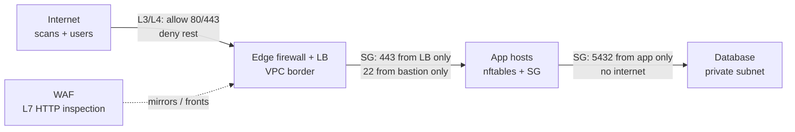
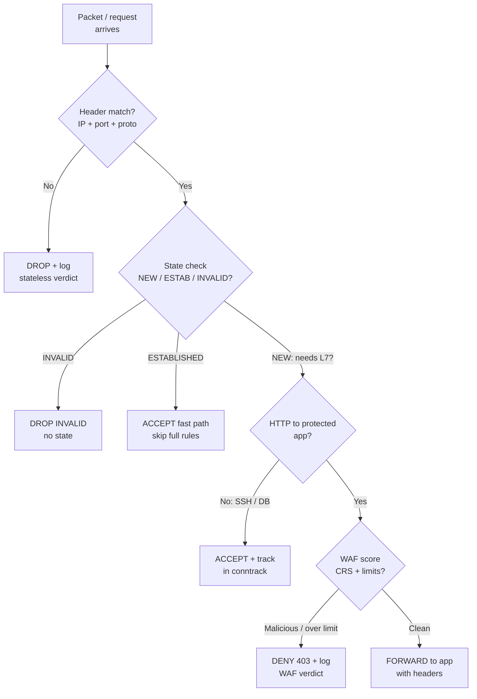
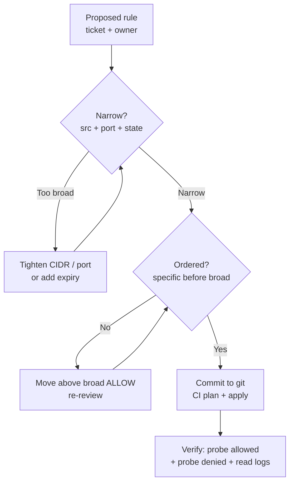
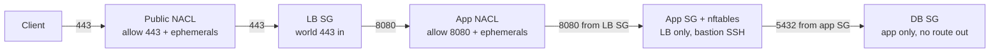
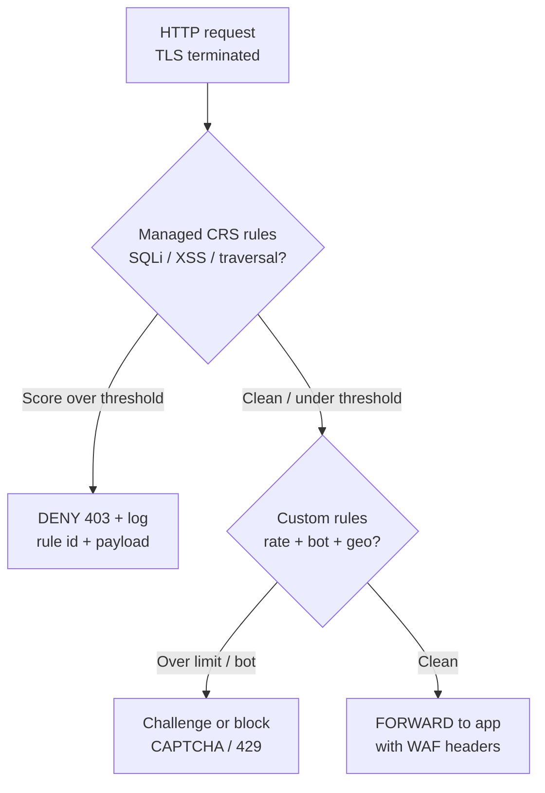

# Application Firewall

## Theory

An application firewall (WAF for HTTP apps, host firewalls like iptables/nftables otherwise) filters traffic by rules before it reaches your service.
It matters as a first line of defense — blocking scans, known exploit patterns, and unwanted ports even when app code is imperfect.
Key subtopics: WAF rule sets (e.g. OWASP CRS), allowlisting vs blocklisting, network vs host vs cloud security groups, and logging blocked traffic.

A firewall is a policy enforcement point that decides, for every packet or request, whether to allow, drop, reject, or inspect it further based on ordered rules over addresses, ports, connection state, and — at the top of the stack — application content. It replaced the 1990s default of every host directly reachable on every port by inserting choke points: a border firewall at the VPC edge, security groups around each workload, a host firewall on each machine, and a web application firewall (WAF) in front of HTTP APIs. Each layer sees different signals — IP headers at L3, TCP/UDP ports and flags at L4, HTTP methods, paths, and bodies at L7 — and together they implement default-deny so only expected traffic ever reaches application code.

This guide takes you from mental model to production operations. You will learn what firewalls guarantee (and what they do not), how packet filtering, stateful inspection, and L7 WAFs differ and compose, how to design allowlisted, ordered rules that stay auditable, how to operate nftables and iptables on hosts and AWS security groups and NACLs in the cloud, how WAFs with the OWASP Core Rule Set block injection and bot abuse, and how attackers evade, misconfigure, and bypass rules. It closes with threats, best practices, and interview Q&A.

> Scope note: this page covers network and application firewall operations for Linux and AWS fleets — packet filtering, stateful rules, host firewalls, security groups, and WAFs with OWASP CRS — not next-gen firewall hardware sizing or IDS/IPS signature authoring. It assumes basic TCP/IP and HTTP (addresses, ports, requests) and focuses on the decisions interviewers probe: allowlisting, rule order, state, and WAF tuning.

### Topics Covered

1. [What Firewalls Do and Why They Matter](#1-what-firewalls-do-and-why-they-matter)
2. [Packet Filtering vs Stateful vs WAF](#2-packet-filtering-vs-stateful-vs-waf)
3. [Rule Design: Allowlisting and Ordering](#3-rule-design-allowlisting-and-ordering)
4. [Host and Cloud Firewalls: nftables, iptables, and Security Groups](#4-host-and-cloud-firewalls-nftables-iptables-and-security-groups)
5. [WAF and OWASP CRS](#5-waf-and-owasp-crs)
6. [Threats and Mitigations](#6-threats-and-mitigations)
7. [Best Practices](#7-best-practices)
8. [Interview Questions and Answers](#8-interview-questions-and-answers)

### 1. What Firewalls Do and Why They Matter

A firewall enforces an explicit traffic policy at a trust boundary: this source may reach that destination on that port under those conditions, everything else is denied and logged. When a browser hits `https://api.example.com/checkout`, four checkpoints may each vote: the edge network firewall allows 443 from the internet, the AWS security group allows 443 from the load balancer only, the host nftables set allows 443 from the VPC plus 22 from the bastion subnet, and the WAF inspects the HTTP body for SQL injection before the app ever parses it. Any single deny stops the request, which is why layered rules survive one bad deploy or one missed patch.

Consider life without firewalls. Every service that binds a port — databases on 5432, admin dashboards on 8080, debug endpoints on 3000 — is reachable by any scanner on the internet, and worms like those that spread via exposed Redis or Postgres brute-force their way in within minutes of a fresh VM booting. Application bugs compound the exposure: a path-traversal flaw is merely a bug if only the office IP can reach it, but a breach if `0.0.0.0/0` can. Firewalls shrink that blast radius by making reachability a deliberate grant rather than an accident of what happened to listen.

The benefits compound at fleet scale:

- **Default-deny reachability.** No new port becomes world-reachable by surprise; adding access requires a rule change that is reviewed, versioned, and logged.
- **Pre-patch shielding.** Blocking `/.git/`, `phpMyAdmin`, and known exploit paths at the WAF buys days while app teams ship fixes.
- **Least-privilege segmentation.** Tiers talk only to the tier they need — web to app on 8080, app to DB on 5432, nothing to DB directly — so one compromised host cannot roam.
- **Cheap, attributable audit.** `DROP` counters, VPC flow logs, and WAF match logs answer "who probed what, when, and which rule stopped it" without instrumenting the app.

Firewalls work best as reachability and hygiene controls for traffic you own: VPC borders, host ingress, service-to-service ports, and HTTP abuse in front of public APIs. They work poorly as authentication (a rule cannot tell Alice from an attacker on the same IP), as data-loss prevention for encrypted payloads they cannot see, or as a fix for a vulnerable app — a WAF hides an injection pattern, it does not remove the unsanitized query underneath.

Firewalls operate at three classic layers you must not confuse. L3 (network) filters on IP source, destination, and protocol — "10.0.0.0/8 may reach 10.1.2.0/24." L4 (transport) adds ports, TCP flags, and connection state — "allow inbound 443, allow return traffic for established connections, drop SYN to 22 except from bastion." L7 (application) parses the stream as HTTP, DNS, or TLS SNI and filters on method, host, path, headers, and body signatures — "block `POST /login` with 50 attempts per minute or `' OR 1=1` in a field." When an interviewer asks "where would you block X," the answer maps to the layer: port scans at L3/L4, lateral Postgres at L4 state, credential stuffing and SQLi at L7.



*The diagram above shows layered enforcement: each hop re-checks a narrower policy so a mistake at one layer is still caught by the next.*

A packet walks the stack in order, and each layer adds context the one below lacks. The NIC sees an IP packet with source, destination, and protocol; conntrack tags it as NEW, ESTABLISHED, RELATED, or INVALID by consulting the state table; the L4 engine matches ports and flags against ordered chains; and, for HTTP, a reverse proxy or WAF terminates or sniffs the stream and matches method, URI, headers, and body against managed and custom rules. Logging happens at every verdict — increment a counter on drop, emit a flow record, send the WAF match to the SIEM — which is what makes firewall debugging a rule-listing exercise rather than guesswork.

Placement deserves explicit attention because interviewers draw it on whiteboards. North-south traffic (internet to app) crosses edge firewalls, load balancers, and WAFs; east-west traffic (service to service) crosses security groups and host firewalls inside the VPC. A common production shape is: CloudFront or ALB with AWS WAF at the edge, public subnets holding only load balancers, private app subnets with security groups pinned to the LB security group ID, and data subnets with no route to the internet at all. Section 4 builds exactly this with rules you can audit.

### 2. Packet Filtering vs Stateful vs WAF

The three firewall generations answer progressively richer questions: where is this packet going, is it part of a conversation I approved, and what does the request actually say. Keeping them straight answers half of all firewall interview questions: stateless speed versus stateful correctness versus L7 understanding.

**Packet filtering (stateless) checks each packet in isolation.** The classic example is an ACL or NACL entry: allow TCP destination port 443 from `0.0.0.0/0`, deny all else. The engine looks only at the current header — source and destination IP, protocol, ports, TCP flags — with no memory of what came before. That makes it fast and simple enough to run at line rate on routers, but brittle: return traffic needs an explicit mirror rule (allow ephemeral ports back), fragmented packets can slip past naive checks, and a forged ACK sails through because there is no notion of "this connection was ever opened."

**Stateful inspection remembers connections.** A conntrack table records every flow the policy allowed out (or in): source, destination, ports, sequence numbers, TCP state, and timeout. Return packets matching an ESTABLISHED entry are accepted without re-matching the whole ruleset, INVALID packets (no plausible state — stray SYN-ACK, out-of-window sequence) are dropped early, and RELATED helpers admit secondary channels like FTP data or ICMP errors tied to an existing flow. This is why a host rule can say "allow outbound DNS and HTTP, accept only their replies" in two lines instead of opening all high ports inbound — the state table closes the hole automatically when the connection dies.

**WAFs (L7) parse the application conversation.** Where L3/L4 see bytes, a WAF reassembles HTTP: verb, path, query string, headers, cookies, and body, optionally after TLS termination. Rules then match semantics — SQL keywords in a parameter, `../` traversal in a path, a JWT hammering `/login`, a bot rotating user agents — and can score, challenge (CAPTCHA/JS), rate-limit, or block. The price is context: a WAF must see cleartext (terminate TLS or hold the private key via the LB), understand the app's normal shape, and be tuned, or it blocks legitimate traffic with false positives.



*The diagram above shows the verdict pipeline: stateless header match first, state lookup second, and L7 WAF scoring only for new HTTP requests to protected apps.*

The generations compare as follows across six axes. Speed favors stateless: per-packet header compare at hardware rate with no table lookup. Correctness favors stateful: return-traffic handling, anti-spoofing (`--ctstate INVALID -j DROP`), and SYN-flood resilience via `limit` and `synproxy`. Visibility favors WAF: only L7 sees SQLi, XSS, and credential stuffing, because L3/L4 cannot distinguish `GET /` from `GET /?id=' OR 1=1--`. Cost inverts the same way: stateless is nearly free, stateful costs RAM for the conntrack table (tune `nf_conntrack_max` and timeouts or large fleets evict entries under load), and WAF costs latency plus tuning toil. Operationally, teams stack all three: NACLs as coarse stateless guardrails, security groups plus host nftables as stateful policy, and a WAF as the HTTP-aware shield — never one in place of the others.

State tables and NAT deserve a closer look because they confuse newcomers. Source NAT (masquerade on an egress gateway) rewrites the private source to the gateway IP and records the mapping so replies route back; destination NAT (port-forward on a bastion) rewrites the target similarly. Both ride the same conntrack entries as filtering, which is why `iptables -t nat` and `filter` share fate: flush conntrack mid-deploy and established SSH sessions stall. Timeouts matter — TCP ESTABLISHED defaults to days on some stacks while UDP "connections" expire in tens of seconds — so DNS and QUIC need shorter, explicit expectations or they flap under idle load.

A minimal truth table cements the behavior interviewers probe. A SYN to closed port 22 from the internet with default-deny: stateless drops on "no allow 22," stateful logs it as NEW-no-match. A SYN-ACK with no prior SYN: stateless may allow it if "allow ephemeral" is sloppy, stateful drops it as INVALID. An HTTP POST with `' UNION SELECT` to `/search`: both L3/L4 layers accept it (valid TCP to allowed 443), only the WAF denies it with 403. A legitimate login burst of 200 attempts from one IP: L3/L4 accept every packet, the WAF rate-limit challenges after the threshold. The lesson is composition: each generation catches what the ones below cannot express.

### 3. Rule Design: Allowlisting and Ordering

Good rulesets read like a contract: a short default-deny spine, narrow allows above it, explicit logging, and nothing else. The ordering principle is first-match-wins on most engines (iptables, nftables, NACLs, WAF rule lists) — the first rule that matches a packet decides its fate and later rules never run. That single fact explains most firewall outages: a broad ALLOW placed above a narrow DENY silently neuters it, and a stale ALLOW above a new block keeps an attacker in. Review order top-down, put the most specific rules first, and end every chain with an explicit deny-plus-log rather than relying on the implicit default.

**Allowlisting beats blocklisting for anything you control.** An allowlist names exactly what may pass — ports 443 from the load balancer, 22 from the bastion `/28`, 5432 from the app tier — and denies everything else by default, so a brand-new exploit on port 6379 is blocked without anyone writing a rule for it. A blocklist names what is forbidden — drop port 23, drop this botnet IP — and allows everything else, so it only stops yesterday's attack and rots as attacker IPs churn. Use allowlists for ingress to your hosts and tiers (small, stable, known), and reserve blocklists for the WAF edge where the threat list is genuinely open-ended: known bad signatures, abusive ASNs, and scanner user agents.

**Design rules narrow in four dimensions.** First, source: pin the tightest CIDR or security-group ID you can — the load balancer's SG, not `0.0.0.0/0`. Second, destination port: one rule per service, never "allow 1-65535" except documented egress. Third, state: accept ESTABLISHED/RELATED return traffic once, early, so inbound rules only describe NEW initiations. Fourth, time and rate: cap SYNs per source, expire idle flows, and schedule break-glass rules with a revert ticket. A rule that is wide in any dimension should carry a comment with owner and expiry, or it becomes permanent.

**Log the deny, sample the allow.** Every dropped packet increments a counter and, at sampled volume, emits a record with timestamp, interfaces, addresses, ports, and the rule number that fired. Those logs are your detection layer: a sudden `DROP` spike on 22 is a spray campaign, on 5432 from the app tier is a misconfigured deploy, on high ports from one host is compromise phoning home. Log allows sparingly (full allow-logging drowns disks on busy LBs) but always log WAF denies with the matched rule id and the offending payload snippet.

**Keep rulesets small, named, and versioned.** Past a few dozen rules, flat lists become unreviewable — group them into named sets (bastion CIDRs, scraper ASNs, admin ports) referenced by one rule each, so adding an office IP edits a set, not the policy. Store the source of truth in git (nftables files, Terraform `aws_security_group` blocks) and apply through CI with a plan/apply review, exactly like app code. Every rule gets a comment: what it allows, for whom, ticket reference. "Allow 8080 from 10.0.0.0/8" with no owner is a finding in every audit.

Below is a commented host baseline in nftables syntax showing the spine — flush, default-deny, loopback, established, narrow allows, final log-and-drop:

```nft
#!/usr/sbin/nft -f
# /etc/nftables/prod.nft — host baseline. Validate with `nft -c -f` before load.
flush ruleset

table inet filter {
    # Named sets: edit membership without touching policy below.
    set bastion_mgmt {
        type ipv4_addr; flags interval
        elements = { 10.0.10.0/28 }   # bastion subnet only, ticket NET-1187
    }
    set admin_ports {
        type inet_service
        elements = { 22 }             # SSH only; add 9100 for monitoring if needed
    }

    chain input {
        type filter hook input priority 0; policy drop;
        # Fail closed: anything not explicitly allowed below is dropped.
        ct state invalid drop comment "drop packets with no plausible state"
        ct state established,related accept comment "fast path for replies"
        iif "lo" accept comment "loopback must never break"
        ip protocol icmp icmp type echo-request limit rate 5/second accept
        ip saddr @bastion_mgmt tcp dport @admin_ports ct state new accept
        tcp dport 443 ct state new accept comment "app TLS from LB/VPC"
        log prefix "nft-drop-in: " limit rate 10/second
    }

    chain forward {
        type filter hook forward priority 0; policy drop;
        # No forwarding on app hosts: they are endpoints, not routers.
    }

    chain output {
        type filter hook output priority 0; policy accept;
        # Restricted hosts flip this to drop + explicit allows for DNS/HTTP.
    }
}
```

The ruleset is explained group by group. The `flush ruleset` plus table definition makes loads atomic — either the whole policy applies or nothing does, so a half-written file never strands the host. The named sets (`bastion_mgmt`, `admin_ports`) separate membership from policy: onboarding a new bastion edits one CIDR, and reviewers see the blast radius immediately. The input chain orders verdicts from cheapest to most specific: INVALID first (spoofed packets die before consuming rule evaluations), then the ESTABLISHED fast path (most packets match here and skip the rest), then loopback, then rate-limited ICMP (diagnostics without ping-flood), then the two narrow NEW allows. The trailing `log ... limit rate 10/second` records denies without letting a flood fill the disk, and the explicit `policy drop` documents default-deny even where the engine would do it implicitly.

The iptables equivalent below maps one-to-one so you can read either syntax in interviews — nftables is the modern default (single engine, sets, atomic loads) while iptables persists on older images:

```bash
# iptables mirror of the same baseline. Order matters: first match wins.
iptables -P INPUT DROP                          # default-deny spine
iptables -A INPUT -m conntrack --ctstate INVALID -j DROP
iptables -A INPUT -m conntrack --ctstate ESTABLISHED,RELATED -j ACCEPT
iptables -A INPUT -i lo -j ACCEPT
iptables -A INPUT -p icmp --icmp-type echo-request -m limit --limit 5/s -j ACCEPT
iptables -A INPUT -p tcp -s 10.0.10.0/28 --dport 22 -m conntrack --ctstate NEW -j ACCEPT
iptables -A INPUT -p tcp --dport 443 -m conntrack --ctstate NEW -j ACCEPT
iptables -A INPUT -m limit --limit 10/s -j LOG --log-prefix "ipt-drop-in: "
```

The commands are explained briefly. `-P INPUT DROP` sets the chain policy so any packet surviving all rules is still denied. The conntrack matches (`-m conntrack --ctstate`) are the stateful core: INVALID dies first, replies ride the fast path. `-i lo` protects loopback, the `limit` matches bound both ICMP and LOG against floods, and the two NEW rules are the only doors in — SSH from the bastion `/28`, TLS from anywhere the upstream SG already narrowed. Save persistently (`iptables-save` / `netfilter-persistent`) or the rules evaporate on reboot, which is itself a classic outage story.



*The diagram above shows the rule-review loop: narrow the scope, fix the order, then ship through version control and verify both the allow and the deny.*

### 4. Host and Cloud Firewalls: nftables, iptables, and Security Groups

Host and cloud firewalls split the same policy across two vantage points: the host sees its own sockets and processes, the cloud sees the whole VPC topology. Neither replaces the other — a security group cannot stop a compromised app opening a new listener to the world if the host allows it, and a host rule cannot see cross-subnet topology the way a group reference can. Production stacks run both and keep them consistent from one reviewed source.

**On the host, nftables is the current Linux standard.** One `inet` table covers IPv4 and IPv6 together (no more parallel `iptables`/`ip6tables` drift), sets replace the old per-IP rule explosion, and `nft -c -f` checks syntax before a load that either fully applies or fully fails. Keep the host policy minimal — loopback, established, bastion SSH, app port from the VPC — and let richer topology live in the cloud layer where it is visible to the whole team. Enable the ruleset at boot (`systemctl enable nftables`) and alert if the daemon is ever inactive, because a host with no firewall after a rebuild is silently naked.

Verify from both sides after every change. From the allowed side, `nc -vz -w3 host 443` and an actual login or request should succeed; from a denied side (a test instance in another subnet), the same probes must time out or refuse, and the drop counter (`nft list chain inet filter input` or `iptables -L -v -n`) plus the `nft-drop-in` log line must move. Debugging order is fixed: check reachability (route, SG), then state (`conntrack -L | grep <ip>` for evictions), then rule order (list with handles/numbers), then the app listener (`ss -tlnp`) — most "firewall blocks my deploy" reports are actually nothing listening.

**In AWS, security groups are stateful virtual firewalls per attachment, and NACLs are stateless subnet guardrails.** A security group defaults to deny-inbound and allow-all-outbound; you add only ingress allows, and return traffic is automatically permitted because groups track state — no mirror egress rule needed for replies. Groups reference each other by ID (`app-sg` allows 5432 from `web-sg`), which survives autoscaling IP churn that would defeat CIDR rules. NACLs sit one level up at the subnet: numbered, ordered, stateless entries evaluated lowest-number-first, where you must explicitly allow both the inbound port and the outbound ephemeral range (1024-65535) or replies die. Use groups for the real policy and NACLs as coarse backstops — block a malicious ASN at the subnet, deny everything in a quarantine subnet — never as the primary mechanism, because their statelessness doubles every rule.

The Terraform below builds the classic three-tier shape — load balancer, app, data — with group-to-group references instead of brittle CIDRs:

```hcl
# security-groups.tf — three tiers, default-deny, group references. Reviewed via terraform plan.
resource "aws_security_group" "lb" {
  name   = "prod-lb"            # internet-facing: only web ports in
  vpc_id = var.vpc_id

  ingress {                     # ALB accepts world HTTPS; WAF (Section 5) sits ahead
    from_port = 443
    to_port   = 443
    protocol  = "tcp"
    cidr_blocks = ["0.0.0.0/0"]
    description = "world HTTPS to ALB"
  }
  egress {                      # LB may only call the app tier, nothing else
    from_port       = 8080
    to_port         = 8080
    protocol        = "tcp"
    security_groups = [aws_security_group.app.id]
    description     = "LB to app only"
  }
}

resource "aws_security_group" "app" {
  name   = "prod-app"
  vpc_id = var.vpc_id

  ingress {                     # app accepts only the LB, never the world
    from_port       = 8080
    to_port         = 8080
    protocol        = "tcp"
    security_groups = [aws_security_group.lb.id]
    description     = "app from LB only"
  }
  ingress {                     # SSH only from the bastion subnet
    from_port   = 22
    to_port     = 22
    protocol    = "tcp"
    cidr_blocks = ["10.0.10.0/28"]
    description = "ssh from bastion, NET-1187"
  }
  egress {                      # app may reach DB and managed HTTPS endpoints
    from_port       = 5432
    to_port         = 5432
    protocol        = "tcp"
    security_groups = [aws_security_group.db.id]
    description     = "app to postgres only"
  }
}

resource "aws_security_group" "db" {
  name   = "prod-db"
  vpc_id = var.vpc_id

  ingress {                     # postgres accepts only the app tier
    from_port       = 5432
    to_port         = 5432
    protocol        = "tcp"
    security_groups = [aws_security_group.app.id]
    description     = "postgres from app only"
  }
  # No ingress from 0.0.0.0/0 anywhere, and no SSH: data subnets have no internet route.
}
```

The blocks are explained tier by tier. The LB group is the only one with a world CIDR, and only on 443 — its egress is pinned to the app group on 8080, so even a compromised edge cannot dial elsewhere. The app group never names an IP for its main port: `security_groups = [aws_security_group.lb.id]` means "whatever instances the LB runs today," which keeps working through deploys and scaling events. SSH appears exactly once, scoped to the bastion `/28` with a ticket reference. The DB group has no world rule, no SSH rule, and lives in subnets without an internet gateway — defense in depth so that even a wrong rule edit cannot expose Postgres directly. Every stanza carries a `description`, which is what `aws ec2 describe-security-groups` shows the on-call at 3 AM.

A NACL example rounds out the layer for interviews — note the mirrored ephemeral egress that statelessness forces:

```bash
# NACL for the app subnet: ordered numbers, stateless, explicit replies.
aws ec2 create-network-acl-entry --network-acl-id acl-0abc123 \
  --rule-number 100 --protocol 6 --rule-action allow --egress \
  --port-range From=1024,To=65535 --cidr-block 0.0.0.0/0
# Rule 100 egress: allow ephemeral replies or inbound 443 responses die.

aws ec2 create-network-acl-entry --network-acl-id acl-0abc123 \
  --rule-number 110 --protocol 6 --rule-action allow --ingress \
  --port-range From=443,To=443 --cidr-block 0.0.0.0/0
# Rule 110 ingress: allow world 443 to the subnet; SGs narrow it further.
```

The entries are explained briefly. Numbers set evaluation order (100 before 110 before the default `*` deny), `--egress` versus ingress marks direction, and protocol 6 pins TCP. The ephemeral egress range is the tell that NACLs are stateless: without it, the SYN arrives but the SYN-ACK cannot leave, and TLS breaks in a way that looks like an app bug. Keep NACLs permissive-but-bounded and put precision in the groups.



*The diagram above shows defense in depth for one request: subnet NACLs, group policy, and host rules each re-narrow the path from internet to database.*

### 5. WAF and OWASP CRS

A web application firewall sits in front of HTTP/S APIs — on AWS WAF at CloudFront/ALB, Cloudflare, or ModSecurity + Nginx self-hosted — and scores every request against managed and custom rules before it reaches your code. Deployment is always in the request path: DNS points at the WAF endpoint, TLS terminates there (or at the LB it integrates with) so inspection sees cleartext, matched requests are blocked, challenged, or counted, and clean ones are forwarded with added headers (`X-Amzn-Waf-Id`, geo, bot verdict) the app may use for finer decisions. Start every new protection in count/monitor mode, read the matches for a week, tune out false positives, then flip to block — teams that start in block mode always break checkout on day one.

**The OWASP Core Rule Set (CRS) is the shared baseline every WAF interview expects.** CRS is a community set of generic attack-detection rules for ModSecurity-compatible engines (and the model AWS managed rules follow): SQL injection, cross-site scripting, local/remote file inclusion, command injection, path traversal, HTTP protocol violations, and scanner detection, each mapped to paranoia levels 1-4 trading coverage against false positives. Paranoia level 1 blocks obvious payloads (`' OR 1=1`, `<script>`) with few breakages; level 2+ adds stricter regexes that catch obfuscation but need exclusions per app. Rules carry severity scores, and the anomaly-scoring mode sums them per request — block when inbound plus outbound scores cross the threshold — so one edgy parameter does not doom a request but three suspicious signals do.

An AWS WAF example below shows the production shape: one managed CRS-like group plus two custom rules (rate-limit logins, block a traversal pattern), with scoped-down statements and explicit actions:

```json
{
  "Name": "prod-api-waf",
  "DefaultAction": { "Allow": {} },
  "Rules": [
    {
      "Name": "AWSManagedRulesCommonRuleSet",
      "Priority": 10,
      "Statement": { "ManagedRuleGroupStatement": {
        "VendorName": "AWS", "Name": "AWSManagedRulesCommonRuleSet",
        "ExcludedRules": [{ "Name": "SizeRestrictions_BODY" }]
      }},
      "OverrideAction": { "None": {} },
      "VisibilityConfig": { "SampledRequestsEnabled": true, "CloudWatchMetricsEnabled": true, "MetricName": "crs" }
    },
    {
      "Name": "rate-limit-login",
      "Priority": 20,
      "Statement": { "RateBasedStatement": {
        "Limit": 100, "AggregateKeyType": "IP",
        "ScopeDownStatement": { "ByteMatchStatement": {
          "SearchString": "/login", "FieldToMatch": { "UriPath": {} },
          "TextTransformations": [{ "Priority": 0, "Type": "NONE" }],
          "PositionalConstraint": "STARTS_WITH" } }
      }},
      "Action": { "Block": {} },
      "VisibilityConfig": { "SampledRequestsEnabled": true, "CloudWatchMetricsEnabled": true, "MetricName": "login-rate" }
    },
    {
      "Name": "block-traversal",
      "Priority": 30,
      "Statement": { "ByteMatchStatement": {
        "SearchString": "../", "FieldToMatch": { "QueryString": {} },
        "TextTransformations": [{ "Priority": 0, "Type": "URL_DECODE" }],
        "PositionalConstraint": "CONTAINS" } },
      "Action": { "Block": {} },
      "VisibilityConfig": { "SampledRequestsEnabled": true, "CloudWatchMetricsEnabled": true, "MetricName": "traversal" }
    }
  ]
}
```

The policy is explained rule by rule. `DefaultAction: Allow` with specific blocks is the standard WAF posture — opposite to L3/L4 default-deny — because HTTP is too expressive to allowlist exhaustively; the managed group still catches known-bad classes across all paths. The `ExcludedRules` entry is the tuning hatch: `SizeRestrictions_BODY` is skipped because the file-upload endpoint legitimately posts large bodies, and every exclusion carries the same justification comment in real Terraform. The rate-based rule scopes its 100-requests-per-5-minutes budget to `UriPath STARTS_WITH /login` per IP, so one credential-stuffing source is blocked without throttling the whole API. The traversal rule URL-decodes before matching (`URL_DECODE` transform catches `%2e%2e%2f` evasion) and inspects the query string where traversal payloads hide. Every rule enables sampled requests plus CloudWatch metrics, which is what lets you answer "which rule blocked checkout yesterday" from the WAF sampled-request console.

Tuning is the job, not the prelude. False positives arrive from legitimate inputs that look like attacks — a bio field containing `<script>` as text, a product SKU like `1 OR 2`, a password with SQL keywords — and the fix is scoped exclusions (that field on that path skips that rule id), never disabling the rule globally. Order custom allows before managed blocks where the engine supports priority, keep a staging WAF mirroring production rules so deploys rehearse there first, and alert on block-rate jumps after each rule change. Log full matched payloads only with PII redaction: WAF logs contain the attacker's raw input, which is exactly where passwords typed into the wrong field end up.

Bot management layers on top of signatures. Rate limits stop brute force, managed bot-control rules (AWS Bot Control, Cloudflare Bot Fight Mode) score automation via JA3 fingerprints, TLS anomalies, and behavioral signals, and challenges (silent JS, CAPTCHA, proof-of-work) separate scrapers from browsers without hard blocks. Use progressive friction: allow clean, challenge suspicious, block confirmed-malicious — a price-scraper burning residential proxies gets challenged into unprofitability while a grandma on an old iPad never sees a puzzle.



*The diagram above shows WAF verdict order: managed signatures score first, custom rate and bot rules second, and only clean requests are forwarded upstream.*

### 6. Threats and Mitigations

Firewalls fail the way rulesets, parsers, and humans fail — not the way packet matching fails. Every row below is a real incident pattern; the mitigations are the controls interviewers expect you to name.

| Threat | What goes wrong | Mitigation |
|---|---|---|
| `0.0.0.0/0` on sensitive ports | Postgres, Redis, or SSH world-open; ransomware or brute force within hours | Default-deny ingress, group-to-group references, weekly `0.0.0.0/0` audit on 22/3389/5432/6379, config rule auto-remediate |
| Rule-order shadowing | Broad ALLOW above narrow DENY silently keeps attacker path open | Specific-first ordering, CI lint for shadowed rules, periodic top-down review, priority numbers documented |
| Stale rules after deploys | Temp debug port or vendor IP left open for months becomes entry point | Owner + expiry comment on every exception, ticket-linked break-glass, quarterly orphan-rule scan |
| Evasion via fragmentation and encoding | Overlapping fragments or `%2e%2e%2f` slip past naive header or string matches | Stateful reassembly before matching, `URL_DECODE` transforms, normalize before inspect, INVALID drop |
| SYN floods and connection exhaustion | Spoofed SYNs fill conntrack/backlog, legit handshakes starve | SYN cookies/proxy, `limit` on NEW, `MaxStartups`-style throttles, conntrack sizing + eviction alerts |
| SMTP-style open egress | Compromised host phones home or spams because outbound is allow-all | Egress allowlisting on sensitive tiers (DNS/HTTP proxy only), VPC endpoints, alert on new external flows |
| WAF bypass via TLS or API-direct | Attacker calls ALB origin or API directly, skipping the WAF endpoint | Origin locked to WAF/LB SG only, signed origin headers, no public origin DNS, test direct-origin reachability |
| False-positive outage | New CRS rule blocks checkout or webhooks on deploy day | Count-mode soak before block, staging WAF mirror, scoped exclusions per field/path, block-rate alerts with rollback |
| Missing deny logs | Breach review cannot answer what was probed or which rule fired | Log-prefix on final deny, VPC flow logs to S3, WAF sampled requests + SIEM, dashboard on DROP spikes |
| NAT and conntrack eviction | Flush or table-full drops established sessions, SSH and deploys stall | Size `nf_conntrack_max`, monitor `conntrack_count`, never flush in prod hours, graceful rule reloads |
| IPv6 shadow exposure | IPv4 locked down but `::/0` left open on the same service | Mirror every v4 rule in v6 (`inet` table), audit both families, same SG coverage, test probes over v6 |
| Management-plane reachability | Firewall admin UI or cloud console keys reachable from the internet | Admin from bastion/VPN only, MFA on console, break-glass runbook, audit `AllowUsers` and IAM policy quarterly |

Two scenarios tie the table together for interviews. First, the exposed-database morning: a developer opens 5432 to `0.0.0.0/0` to debug from home, forgets it, and automated scanners brute-force weak staging credentials over the weekend. The fix layers a weekly world-open audit plus a config rule that reverts Postgres-ingress violations, security-group references so home debugging rides an SSH tunnel instead, and flow-log alerts on first-ever external 5432. Second, the WAF bypass: the team celebrates blocking SQLi at the edge, but the API's ALB still has a public DNS record, so the attacker sends payloads straight to the origin and the WAF never sees them. The fix is origin lockdown — the origin SG accepts only the WAF/LB, and a canary probe asserts direct-origin requests fail.

Logging deserves emphasis because auditors grade it. Keep sampled deny logs on every host chain, ship VPC flow logs and WAF full-logs (redacted) to immutable storage, and alert on `DROP` bursts per port, new external flows from data tiers, and WAF block-rate step changes after rule edits. A firewall nobody watches is a speed bump with paperwork.

### 7. Best Practices

These practices are ordered from policy design to fleet operations, so a new team can adopt them top-down and an existing fleet can audit against them.

1. **Default to deny on ingress everywhere.** Every chain, group, and NACL ends in deny; access is an explicit grant with owner and ticket. No new listener becomes reachable by accident.
2. **Allowlist what you know, blocklist only the open-ended edge.** Narrow ingress for hosts and tiers; signatures, rate limits, and bot rules for HTTP abuse where the threat list never closes.
3. **Put specific rules before broad ones and lint the order.** First-match-wins means placement is policy — review top-down, flag shadowed rules in CI, document priority numbers.
4. **Reference groups, not IPs, for tier-to-tier traffic.** SG-to-SG allows survive autoscaling and deploys; CIDRs are reserved for the bastion, office, and known vendor ranges in named sets.
5. **Run stateful inspection on every host and tier.** INVALID drop first, ESTABLISHED fast path, NEW describes initiations only — never mirror ephemeral allows by hand where state does it.
6. **Keep host policy minimal and cloud policy topological.** Hosts enforce loopback, replies, bastion SSH, and the app port; the VPC layer expresses which tier reaches which. One source of truth in git.
7. **Version rules like code and apply through CI.** nftables files and Terraform groups get plan/apply review, `nft -c` and `terraform plan` gates, and rollback on block-rate alerts — never console click-ops.
8. **Start WAF protections in count mode, then block.** Soak new CRS versions and custom rules against real traffic, write scoped exclusions per field and path, and mirror production rules in staging first.
9. **Lock the origin behind the WAF.** The app must be unreachable except through the edge — SG pinned to the LB/WAF, no public origin DNS — and a probe asserts direct access fails.
10. **Rate-limit and challenge before you hard-block humans.** Login, signup, and search get per-IP budgets with progressive friction (allow, challenge, block) so scrapers pay while users pass.
11. **Log every deny and watch the counters.** Sampled host-drop logs, VPC flow logs, WAF match logs with rule ids — dashboarded, alerted on spikes, retained immutably for incident review.
12. **Audit both families and the egress you forgot.** Mirror v4 policy in v6, scan for world-open sensitive ports weekly, egress-allowlist data tiers, and expire every exception on a calendar.

### 8. Interview Questions and Answers

**Q1 (Beginner): What is a firewall in one minute?**
A policy checkpoint that allows, denies, or inspects traffic by ordered rules over addresses, ports, connection state, and application content. Stacked at the edge, around tiers, on hosts, and in front of HTTP, firewalls implement default-deny reachability so only expected traffic reaches services — blocking scans, stray ports, and known exploit shapes even when app code is imperfect.

**Q2 (Beginner): Why do we still need firewalls if the app uses TLS and auth?**
TLS gives confidentiality and auth gives identity, but neither controls reachability: without firewalls every listener is world-dialable, scanners find weak credentials and unpatched endpoints in minutes, and one injection bug is directly exploitable. Firewalls shrink who can even attempt the handshake, buy pre-patch shielding time, and produce the probe logs auth alone never records.

**Q3 (Beginner): What is the difference between L3, L4, and L7 firewalls?**
L3 filters IP headers (source/destination/protocol), L4 adds ports, flags, and connection state (SYN to 22, replies for established flows), and L7 parses application protocols like HTTP to match methods, paths, and bodies (`' OR 1=1` in a field). Port scans die at L3/L4, lateral database access is an L4 state decision, and injection or stuffing is visible only at L7.

**Q4 (Intermediate): Stateful vs stateless — what breaks if you pick stateless?**
Stateless checks each packet alone, so return traffic needs explicit mirror rules, forged ACKs and stray SYN-ACKs sail through, and ephemeral ranges gape open. Stateful tracks flows in conntrack, accepts ESTABLISHED replies automatically, drops INVALID early, and closes the hole when the connection dies — the reason one "allow outbound, accept replies" pair replaces dozens of port rules.

**Q5 (Intermediate): Allowlist vs blocklist — when is each right?**
Allowlist (deny-by-default, permit named traffic) for anything you control — host ingress, tier-to-tier ports — because unknown-new attacks are blocked with no new rule. Blocklist (allow-by-default, deny named-bad) only where the threat space is open-ended — WAF signatures, abusive IPs, scanner agents — where enumeration of good is impossible. Mixing them up (blocklisting SSH, allowlisting the whole web) is the classic design error.

**Q6 (Intermediate): Why does rule order matter, and how do you review it?**
Most engines are first-match-wins: the first matching rule decides and later rules never execute, so a broad ALLOW above a narrow DENY neuters the deny. Review top-down from most specific to most general, lint for shadowed rules in CI, keep chains short with named sets, end in explicit deny-plus-log, and verify both directions — allowed probes succeed, denied probes fail, and the right counter moves.

**Q7 (Intermediate): Security groups vs NACLs vs host iptables — where does each live?**
Security groups are stateful per-attachment firewalls (allow-rules only, replies automatic, group-ID references) — the primary cloud policy. NACLs are stateless per-subnet ordered lists needing mirrored ephemeral egress — coarse backstops and quarantine. Host nftables/iptables is the last word on the machine itself (sockets, loopback, INVALID drops). Production runs all three with precision in the groups, not the NACLs.

**Q8 (Senior): How do you put a WAF with OWASP CRS in front of an API without breaking it?**
Terminate TLS at the edge so inspection sees cleartext, start the managed rule set in count mode, soak a week of real traffic, write scoped exclusions per offending field/path/paranoia-level, mirror rules in staging for deploys, then flip to block with anomaly scoring. Lock the origin to accept only the WAF/LB, redact PII from match logs, alert on block-rate jumps, and layer rate-based login rules plus bot challenges over the CRS baseline.

**Q9 (Senior): Design three-tier firewalling for a VPC handling payments.**
Public subnets hold only the ALB with AWS WAF (world 443 in, 8080-to-app out); private app subnets accept 8080 solely from the LB SG plus 22 from the bastion `/28`, with host nftables mirroring that; data subnets have no internet route and a DB SG accepting 5432 solely from the app SG. NACLs stay permissive-but-bounded, egress from app is pinned to DB plus required endpoints, flow and WAF logs ship immutably, and break-glass rules carry expiry tickets.

**Q10 (Senior): Traffic is blocked and nobody knows why — walk me through triage.**
Isolate the layer bottom-up: route and SG reachability (`nc -vz`, flow-log REJECTs), then conntrack/state (`INVALID` counters, table-full), then rule order (list chains/groups top-down for shadowing, check NACL numbers and ephemeral egress), then the listener (`ss -tlnp` — nothing listening mimics a block), then L7 (WAF sampled requests for the rule id, TLS/SNI mismatch). Fix in git, re-probe allow and deny, and add the regression probe plus a log alert so it never recurs silently.

## Youtube

- [Web Application Firewall - Complete Guide](https://www.youtube.com/watch?v=-Q4fpgEUqfs)
