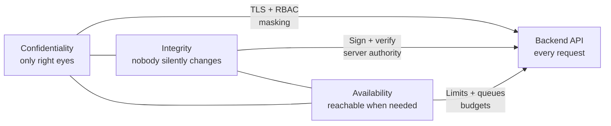
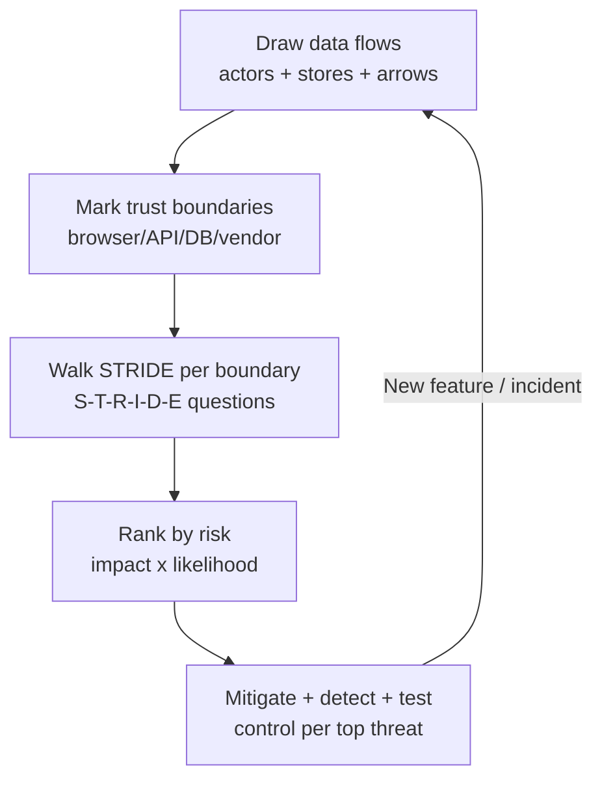
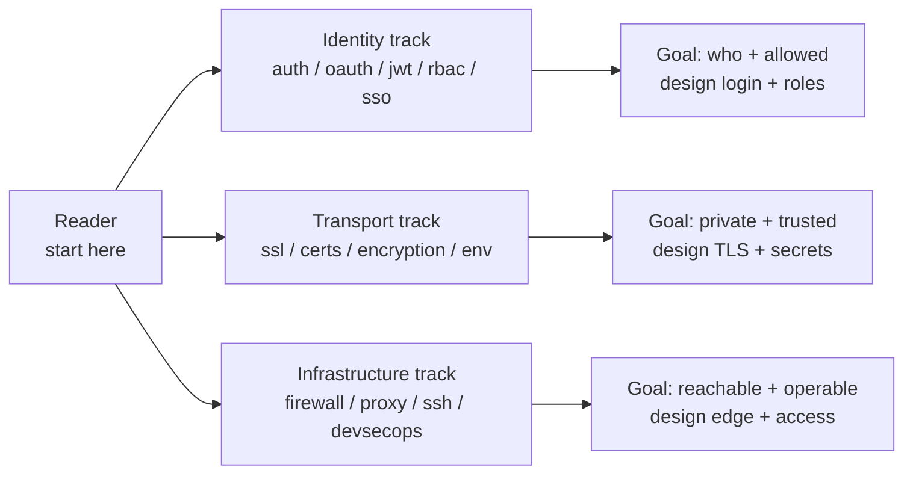
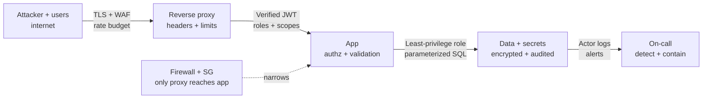

# Security

## Theory

Security is the practice of protecting systems, networks, and data from attacks, theft, and damage.
It matters because every system-design decision — from API auth to secret storage — carries threat-model trade-offs.
Key subtopics: authentication and authorization (OAuth, JWT, RBAC, SSO), encryption (symmetric/asymmetric),
transport security (SSL/TLS certificates), secret management (environment variables), infrastructure hardening
(firewalls, SSH, reverse proxies), and process (DevSecOps).

Security for backend engineers is not a separate specialty you bolt on at the end. It is the set of guarantees
your APIs, data stores, networks, and deploys must hold even while someone is actively trying to break them.
Every endpoint you expose, every token you mint, every secret you load, and every port you open is a promise
about who can do what, what they can see, and what happens when they lie. This landing page teaches you how to
reason about those promises before you dive into any single mechanism.

Think of this section as a map with two axes. The horizontal axis is the request path: client to edge to app
to data, with identity checked at the door, secrets carried safely, transport encrypted, and infrastructure
hardened at every hop. The vertical axis is depth: no single control is trusted alone, so authentication,
authorization, cryptography, network policy, and process controls overlap. When one layer fails — a leaked key,
a missed patch, a confused deputy — the next layer still contains the blast radius.

This guide takes you from mindset to map to mechanics. You will learn why backend developers own security
outcomes whether or not a security team exists, how the CIA triad and AAA frame every design trade-off, how to
run a lightweight STRIDE threat model on any whiteboard, which page in this section answers which question and
in what order to read them, how defense in depth composes across edge, app, and data, which attacks interviewers
always probe, and how shift-left practices make secure the default instead of the exception.

> Scope note: this page is the interview-ready overview for the whole security section — mindset, vocabulary,
> threat-modeling method, reading map, layered architecture, common attacks, and process habits. Deep mechanics
> live in the linked pages (OAuth flows, JWT validation, RBAC modeling, TLS handshakes, encryption modes, WAF
> tuning, SSH hardening, reverse-proxy config). It assumes basic HTTP and API design and focuses on the decisions
> interviewers probe: identity, access, secrets, transport, segmentation, and trade-offs under attack.

### Topics Covered

1. [Why Security Is a Backend Concern](#1-why-security-is-a-backend-concern)
2. [CIA Triad and Security Fundamentals](#2-cia-triad-and-security-fundamentals)
3. [Threat Modeling 101 and STRIDE](#3-threat-modeling-101-and-stride)
4. [Section Map What to Read and When](#4-section-map-what-to-read-and-when)
5. [Defense in Depth Layers That Save You](#5-defense-in-depth-layers-that-save-you)
6. [Common Attacks Every Backend Developer Must Know](#6-common-attacks-every-backend-developer-must-know)
7. [Shift Left Basics for Backend Teams](#7-shift-left-basics-for-backend-teams)
8. [Interview Questions and Answers](#8-interview-questions-and-answers)

### 1. Why Security Is a Backend Concern

Backend code is where trust decisions execute. The frontend can suggest, but the API decides: is this caller
who they claim to be, are they allowed to do this, is this input safe to act on, is this secret safe to use,
is this response safe to return. An attacker never sees your React components; they see your endpoints, your
headers, your error messages, your timing, and your defaults. Every one of those is a backend choice.

Four realities make security inseparable from backend design. First, the backend holds the data worth stealing:
user records, payment tokens, session stores, backups, logs. Breach math counts backend rows, not frontend
pixels. Second, the backend enforces every boundary: authentication gates, authorization checks, rate limits,
query parameterization, and output encoding all run server-side because anything client-side can be bypassed
with curl. Third, the backend owns the secrets: database passwords, API keys, signing keys, TLS private keys,
and tokens all load and live around your services. Fourth, the backend defines the blast radius: subnet layout,
security groups, firewall rules, and proxy topology decide whether one compromised container means one lost
pod or one lost company.

Interviewers test this ownership with scenario pressure. They describe a feature — file upload, password reset,
social login, service-to-service calls, admin panel — and ask what can go wrong and what you would do first.
They are listening for a reflex: identify the asset, name the trust boundary, state the threat, pick the
cheapest control that kills the whole class, and name what you would monitor. That reflex matters more than
reciting cipher names, and this section trains exactly it.

The cost curve is the business argument. A missing authorization check found in design costs a whiteboard
correction. Found in code review it costs a patch. Found in production it costs incident response, forensics,
notification, rotation, and reputation. Shift-left exists because late security is expensive security, and the
backend is where shifting left pays fastest: parameterized queries, default-deny auth, secret managers, and
hardened proxies each remove a class of incident for every future feature.

What backend developers uniquely control, end to end:

- **Identity and access on every request.** Who is calling (authentication), what they may do (authorization),
  and how that decision is re-checked per endpoint, per object, per action — never once at login and never
  in the client alone.
- **Input handling as a trust boundary.** Every header, path, query, body, file, webhook, and queue message
  is untrusted until validated, bounded, typed, and encoded for the sink it reaches (SQL, shell, HTML, LDAP).
- **Secrets and keys lifecycle.** How secrets are created, stored, injected, rotated, scoped, and revoked —
  environment variables versus managers, per-environment keys, short-lived tokens, and zero secrets in git.
- **Transport and storage guarantees.** TLS everywhere in transit, strong hashing for passwords, encryption
  for sensitive fields at rest, and integrity checks where tampering pays (cookies, download links, webhooks).
- **Reachability and observability.** Which ports and paths exist at all (firewalls, groups, proxies), what is
  logged without leaking secrets, and which alerts fire when someone probes the edges.

A concrete habit shows the difference between knowing and owning. Compare these two password paths:

```javascript
// Weak: fast hash, no salt, string comparison leaks timing.
const crypto = require("crypto");
function checkPasswordWeak(input, stored) {
  const hash = crypto.createHash("md5").update(input).digest("hex");
  return hash === stored; // fast, unsalted, timing-leaky
}
```

The snippet above is explained as an anti-pattern. MD5 is built for speed, which helps attackers brute-force
billions of guesses per second on GPUs. With no unique salt, identical passwords share hashes and rainbow
tables apply across users. Plain `===` comparison short-circuits on the first differing byte, leaking prefix
information through timing. No backend reviewer should let this reach main.

```javascript
// Strong: slow adaptive hash, unique salt, constant-time compare.
const bcrypt = require("bcrypt");
async function registerStrong(password) {
  const saltRounds = 12; // cost factor: raise as hardware improves
  return bcrypt.hash(password, saltRounds); // salt embedded in output
}
async function checkPasswordStrong(input, storedHash) {
  return bcrypt.compare(input, storedHash); // constant-time comparison
}
```

The snippet above is explained as the baseline to defend in interviews. Bcrypt is deliberately slow and
adaptive: the cost factor makes each guess expensive while staying cheap enough per login. A random salt per
password defeats rainbow tables and is stored alongside the hash. Comparison runs in constant time so attackers
learn nothing from response latency. Argon2id is the modern alternative with memory hardness; the principle is
identical — slow, salted, constant-time, and never reversible.

The backend lesson generalizes: security is choosing primitives whose economics favor the defender. Slow hashes
punish guessing, short-lived tokens shrink theft windows, parameterized queries remove injection as a class,
and default-deny access makes the safe path the easy path. Each page in this section is one such economic
choice explained until you can apply it under interview pressure.

### 2. CIA Triad and Security Fundamentals

The CIA triad is the three-way trade-off behind every security decision: confidentiality (only the right eyes
see it), integrity (nobody silently changes it), and availability (the right people can reach it when needed).
Backend interviews return to this triangle constantly because most controls strengthen one corner while taxing
another, and senior answers name the tension explicitly.

Confidentiality answers who can read. TLS in transit, encryption at rest, field-level masking, per-object
authorization, and secret scoping all serve it. The classic failure is over-collection plus over-exposure:
storing SSNs you never needed and returning full user rows where an ID sufficed. The fix is data minimization
plus least privilege — do not store what you do not need, do not return what the caller did not ask for and
is not allowed to see.

Integrity answers whether data and actions are trustworthy. Signed tokens, HMAC webhooks, parameterized
queries, audit logs, and certificate validation all serve it. The classic failure is trusting the client:
accepting a `role: admin` field, a price in the checkout body, or an unsigned callback and acting on it. The
fix is server-side authority — re-derive price, re-check role, verify the signature before any state change.

Availability answers whether the system survives load and abuse. Rate limits, timeouts, retries with backoff,
queue backpressure, autoscaling, and DDoS absorption all serve it. The classic failure is an unauthenticated
expensive endpoint — regex search, report export, image resize — with no budget, letting one caller burn the
fleet. The fix is budgets everywhere: per-IP limits, per-user quotas, global circuit breakers, and async
deferral for heavy work.

| Principle | Question it asks | Backend controls | Failure smell |
|---|---|---|---|
| Confidentiality | Who can read this | TLS, encryption, RBAC, masking, secret scoping | Full rows returned, secrets in logs, world-readable buckets |
| Integrity | Can this be trusted | Signatures, HMAC, parameterized queries, audit trails | Client-supplied roles, unsigned webhooks, silent overwrites |
| Availability | Can legit users reach it | Rate limits, timeouts, queues, autoscaling, caching | No limits on expensive routes, sync heavy work, retry storms |
| Authentication | Who are you | Passwords plus MFA, SSO, OAuth, API keys, mTLS | Shared secrets, no rotation, auth only in frontend |
| Authorization | What may you do | RBAC, scopes, per-object checks, deny by default | IDOR by swapping IDs, hidden endpoints assumed safe |
| Non-repudiation | Who did what, provably | Signed audit logs, append-only trails, key-bound actions | Mutable logs, no actor IDs, disputed admin actions |

Three companion ideas complete the vocabulary. AAA separates proving identity (authentication) from granting
power (authorization) from recording use (accounting) — three checks, three failure modes, three log lines.
Least privilege grants the minimum power for the minimum time: read-only DB users for the app, per-service
tokens with narrow scopes, short expirations with refresh. Zero trust assumes the network is already hostile,
so every hop authenticates and authorizes — service to service included — instead of trusting by subnet alone.



*The diagram above shows the CIA triangle converging on the backend API, with one control family per corner.*

### 3. Threat Modeling 101 and STRIDE

Threat modeling is the five-minute whiteboard habit that separates senior answers from recited definitions.
Before naming any control, you sketch the system as data flows, mark where trust changes, list what an attacker
would want at each point, and pick mitigations in risk order. Interviewers love it because it turns any vague
"design a secure X" prompt into a structured walkthrough they can follow and grade.

The lightweight flow has four steps and fits on any whiteboard. First, draw the data-flow diagram: clients,
APIs, services, queues, databases, caches, third parties, and the arrows between them with what travels each
arrow (credentials, tokens, PII, money, commands). Second, mark trust boundaries wherever data crosses a change
in control — browser to API, API to database, service to vendor webhook, CI to production. Third, brainstorm
threats per boundary with STRIDE so you do not miss a class. Fourth, rank by risk (impact times likelihood)
and answer each with a control, a detection, and a test.

STRIDE is the mnemonic that guarantees coverage. Each letter names an attacker goal with a matching defender
property, so walking the six letters per boundary means no obvious threat survives unmentioned:

| Letter | Threat | Violates | Backend question | Typical control |
|---|---|---|---|---|
| S | Spoofing | Authentication | Can an attacker pretend to be someone else | MFA, strong auth, mTLS, token verification |
| T | Tampering | Integrity | Can data or requests be silently altered | TLS, signatures, HMAC, parameterized writes |
| R | Repudiation | Non-repudiation | Can an attacker act and deny it later | Signed audit logs, actor IDs, append-only trails |
| I | Information disclosure | Confidentiality | Can private data leak to the wrong eyes | Encryption, RBAC, masking, minimal responses |
| D | Denial of service | Availability | Can one caller starve everyone else | Rate limits, quotas, timeouts, queues, autoscale |
| E | Elevation of privilege | Authorization | Can a low-privilege caller gain admin power | Per-object checks, scopes, deny by default |

Run STRIDE on a concrete example to see the method pay off. Take password reset: the user submits an email,
the backend mints a token, emails a link, and the link sets a new password. Spoofing means guessing or
stealing the token, so tokens are random, single-use, short-lived, and bound to the account. Tampering means
rewriting the email or user ID in the reset request, so the token itself encodes the account and is verified
server-side. Repudiation means no record of who reset what, so every request and completion is audit-logged.
Information disclosure means user enumeration via "email not found" differences, so responses are uniform and
timed evenly. Denial of service means reset-email floods, so per-IP and per-email throttles apply. Elevation
means a token for one account resetting another, so the token-to-account binding is re-checked at use time.



*The diagram above shows the threat-modeling loop: diagram, boundaries, STRIDE walk, risk ranking, and mitigations that feed back on every change.*

Threat modeling also tells you what not to do, which interviewers reward. Do not model once and file it away;
re-run the loop when data flows change, vendors change, or an incident teaches something new. Do not chase
exotic threats while basics bleed: missing authorization and injection outrank exotic crypto breaks in almost
every breach dataset. Do not accept "the firewall handles it" for an application flaw — network controls
cannot fix a confused-deputy API. And do not skip abuse cases: the model must include legitimate users doing
illegitimate things (scraping, sharing accounts, replaying requests), not just masked outsiders.

A worked thirty-second script shows how to open any interview answer. "The assets are sessions and PII, the
boundaries are client-to-API and API-to-DB, top threats are credential stuffing (spoofing), IDOR (elevation),
and injection (tampering), so I would add rate-limited MFA-ready login, per-object auth checks, parameterized
queries, uniform error responses, and audit logging, with alerts on login spikes and 403 bursts." That single
paragraph demonstrates assets, boundaries, STRIDE coverage, controls, and detection — the full loop compressed.

### 4. Section Map What to Read and When

This section is organized along the request path so you always know where you are. Identity pages answer who
and what-allowed, transport and crypto pages answer how data stays private and trustworthy, infrastructure
pages answer who can even reach the service, and process pages answer how teams keep it that way. Read in the
order below the first time; afterwards jump straight to the page matching the interview question.

| Page | What it covers | When to read it |
|---|---|---|
| Authentication and authorization | Sessions, passwords, MFA, auth models, the AAA split | When asked "how do users log in" or "auth vs authz" |
| OAuth | Delegated authorization flows, grant types, scopes | When asked "login with Google" or third-party access |
| JWT | Token structure, signing, validation, rotation, revocation | When asked "how do stateless sessions work" |
| RBAC | Roles, permissions, hierarchies, per-object checks | When asked "how do you model admin versus user" |
| SSO | Single sign-on, SAML versus OIDC, session propagation | When asked "one login across many apps" |
| SSL/TLS | Handshakes, versions, termination, HSTS, pinning | When asked "how does HTTPS actually work" |
| Encryption | Symmetric vs asymmetric, modes, hashing, key management | When asked "how do you store secrets or PII" |
| Certificates | X.509, chains, issuance, rotation, mTLS | When asked "how do certs prove identity" |
| Firewall | Packet vs stateful vs WAF, rule design, security groups | When asked "how do you segment or shield services" |
| Reverse proxy and Nginx | Edge termination, routing, rate limiting, WAF placement | When asked "what sits in front of your app" |
| SSH | Host access, keys, hardening, bastions, agent rules | When asked "how do engineers reach production" |
| Environment variables | Secret injection, dotenv, managers, rotation | When asked "where do secrets live in deploys" |
| DevSecOps | Pipelines, scanning, policy as code, incident habits | When asked "how do teams ship securely at speed" |

Three reading paths cover the common interview shapes. The identity path runs authentication and authorization
to OAuth to JWT to RBAC to SSO: it answers every "users, tokens, roles, login everywhere" arc from first
principles to federated sessions. The transport path runs SSL/TLS to certificates to encryption to environment
variables: it answers every "keep data private and keys safe" arc from handshake to storage to rotation. The
infrastructure path runs firewall to reverse proxy to SSH to DevSecOps: it answers every "harden, expose, and
operate" arc from packet rules to edge config to human access to pipeline gates.



*The diagram above shows the three reading tracks and the design goal each one prepares you to defend.*

Two cross-cutting notes apply to every page. First, each deep page follows the same cadence as the firewall
reference: theory with scope, layered explanation, commented code or config you can run, a threats table, best
practices, and Q&A — so once you learn one page's rhythm you can skim any other fast. Second, controls compose
across pages: a JWT page decision (short expiry) pairs with a proxy decision (rate-limit login) and a firewall
decision (only the proxy reaches the app), and interviewers award full marks when you name the pair instead of
one control in isolation.

### 5. Defense in Depth Layers That Save You

Defense in depth means no single control is load-bearing. Each layer assumes the one outside it has already
failed: the WAF assumes bots get through, the app assumes the WAF missed a payload, the database assumes the
app has a bug, and the audit trail assumes the database was touched. When an interviewer asks "what if that
fails," the senior answer points to the next layer inward without pausing.

Walk one request through the full stack to see the layers cooperate. A `POST /transfer` arrives from the
internet: the edge terminates TLS, checks the WAF score, and enforces a per-IP rate budget. The reverse proxy
adds security headers, forwards only to a pinned upstream, and logs without bodies. The app verifies the JWT
signature and expiry, loads the caller's roles, checks ownership of the source account, validates amount
bounds, and runs a parameterized update inside a transaction. The database permits only the app role, encrypts
the balance column, and appends an audit row. A secret manager injected the DB password at boot; no secret
appears in code, logs, or images. If any layer is bypassed — stolen token, missed validation, open port — the
next layer still constrains what the attacker can do and records that they tried.

The layers, outside in:

- **Edge and network.** DNS, CDN, WAF, DDoS absorption, TLS termination, firewall rules, security groups.
  Job: shrink who can reach the app and strip known-bad shapes before they cost compute. Fail-closed default.
- **Gateway and proxy.** Reverse proxy routing, header hardening, request size caps, rate limiting, mTLS to
  upstreams, origin lockdown. Job: enforce shape and budget on HTTP before app logic spends anything.
- **Application.** Authentication, per-request authorization, input validation, output encoding, idempotency,
  business-rule checks. Job: decide who may do what to which object, correctly, on every call.
- **Data and secrets.** Parameterized access, least-privilege DB roles, encryption at rest, field masking,
  backups, key rotation, secret-manager injection. Job: keep stolen access narrow and stolen bytes useless.
- **Observability and response.** Structured audit logs with actor IDs, metrics on auth and WAF verdicts,
  alerts on spikes, runbooks, rotation drills. Job: detect fast, contain fast, prove what happened.



*The diagram above shows one request crossing five narrowing layers, with network policy constraining every hop behind the edge.*

A single Express-style sketch shows three app-layer controls composed in the order they must run — budget,
identity, then authority — before any business logic:

```javascript
// Defense in depth in middleware order: limit, authenticate, authorize, validate.
const rateLimit = require("express-rate-limit");
const jwt = require("jsonwebtoken");

// 1. Budget first: expensive work never runs for abusive callers.
const transferLimiter = rateLimit({
  windowMs: 60 * 1000, // 1-minute window per IP
  max: 20,             // 20 transfers per IP per window
  standardHeaders: true,
});

// 2. Identity: verify signature and expiry, attach the caller.
function authenticate(req, res, next) {
  const token = (req.headers.authorization || "").replace("Bearer ", "");
  try {
    req.user = jwt.verify(token, process.env.JWT_PUBLIC_KEY, { algorithms: ["RS256"] });
    return next();
  } catch (err) {
    return res.status(401).json({ error: "invalid_token" }); // uniform, no detail leak
  }
}

// 3. Authority plus validation: ownership check and bounds before the DB.
function authorizeTransfer(req, res, next) {
  const { fromAccountId, amount } = req.body;
  if (!Number.isFinite(amount) || amount <= 0 || amount > 10000) {
    return res.status(400).json({ error: "invalid_amount" });
  }
  if (!req.user.accounts.includes(fromAccountId)) {
    return res.status(403).json({ error: "forbidden" }); // per-object check, deny by default
  }
  return next();
}

module.exports = { transferLimiter, authenticate, authorizeTransfer };
```

The sketch is explained layer by layer. The limiter runs first so floods die before JWT verification burns CPU
and before any database connection is opened — availability before correctness. The authenticator verifies an
asymmetric RS256 signature against a public key, rejecting expired or forged tokens with a uniform message
that reveals nothing about which check failed. The authorizer enforces per-object ownership from the verified
identity (never from a client-supplied role) plus strict amount bounds, so a valid token for Alice cannot move
Bob's money and cannot smuggle types the ledger does not expect. Missing any one control reopens its class:
no limiter invites stuffing, no verification invites forgery, no ownership check invites IDOR.

### 6. Common Attacks Every Backend Developer Must Know

Interviewers probe a stable set of attacks because each maps to one missing backend control. Learn the set as
pairs — how the attack works in one sentence, which control kills the class — and every scenario question
becomes pattern matching rather than recall.

| Attack | How it works | Control that kills the class |
|---|---|---|
| SQL / NoSQL injection | Untrusted input concatenated into a query changes its logic | Parameterized queries plus least-privilege DB roles |
| Broken object access (IDOR) | Swapping an ID in the URL exposes another user's object | Per-object authorization on every read and write |
| Broken authentication | Stuffing, spraying, or replaying credentials or tokens | Slow hashes, MFA, lockout plus throttling, short token life |
| SSRF | Server fetched an attacker URL reaching cloud metadata | Egress allowlists, metadata protection, URL validation |
| Stored and reflected XSS | Injected script runs in victims' browsers via your API | Output encoding, CSP, validation, HttpOnly cookies |
| CSRF | Victim's browser fires a state-changing request with cookies | SameSite cookies, anti-CSRF tokens, state-changing via POST |
| Path traversal | `../` escapes the intended directory or key prefix | Canonicalize paths, sandbox roots, allowlisted names |
| Mass assignment | Extra JSON fields overwrite role, price, or flags | Explicit allowlisted fields, server-side authority |
| Token theft and replay | Stolen JWT or session reused from another device | Short expiry, rotation, binding, revocation, secure flags |
| Secrets leakage | Keys in git, images, logs, or error messages | Managers, env injection, scanning, redaction, rotation |
| Rate and quota abuse | One caller burns search, export, or resize for everyone | Per-IP and per-user budgets, queues, async heavy work |
| Misconfiguration exposure | Debug ports, buckets, or admin UIs left world-open | Default-deny firewall, audited groups, hardened defaults |

Two scenarios show how to narrate an answer. First, injection to IDOR chain: the search box interpolates
input into SQL, and the order endpoint trusts any order ID. State both controls in one breath — parameterize
the query and re-check ownership per order — plus detection: alert on SQL error bursts and 403-to-200 ID
enumeration patterns. Second, SSRF via webhook icon fetch: the server fetches any URL the user supplies and
reaches instance metadata. Fix with an allowlisted fetch domain set, blocked metadata IP, short timeouts, and
response size caps, plus an egress rule so even a missed check cannot leave the VPC.

### 7. Shift Left Basics for Backend Teams

Shift left moves security earlier in the lifecycle — into design, code, and pipelines — where fixes are cheap
and classes disappear instead of recurring. For backend teams it is habits plus one pipeline, each small enough
to adopt this sprint and visible enough to defend in interviews.

1. **Threat-model the design, not just the code.** Every RFC names assets, boundaries, and top STRIDE threats
   with chosen controls before implementation starts. Ten minutes at design saves ten days after launch.
2. **Choose secure defaults and paved roads.** The framework's auth middleware, the reviewed rate-limit
   helper, and the secret-manager loader are the easy path; hand-rolled crypto and homegrown sessions need
   written justification. Defaults decide outcomes more than policies do.
3. **Validate and encode at every boundary.** Schemas on ingress, parameterization to stores, encoding on
   egress, size and type caps everywhere. Treat internal callers with the same suspicion as external ones.
4. **Keep secrets out of code, images, and logs.** Inject via manager or environment, scope per service and
   environment, rotate on schedule and on departure, and scan every commit and image for accidental commits.
5. **Review with a checklist, not vibes.** Auth on every route, authz per object, no client authority, errors
   uniform, logs redacted, limits present, dependencies pinned. The checklist lives in the repo beside code.
6. **Gate the pipeline.** Lint plus typecheck, SAST on diffs, dependency and license scan, secret scan, image
   scan, IaC policy check, and a staging WAF in count mode — failing closed on high-severity findings with a
   documented exception path so speed survives rigor.
7. **Log for detection and prove it.** Every auth decision, authz denial, and validation failure emits actor,
   action, object, and verdict without secrets; dashboards track login spikes, 403 bursts, and WAF blocks.
8. **Practice rotation and rollback.** Key rotation, cert renewal, and WAF exclusion rollback are rehearsed
   runbooks, not first-time adventures during incidents — measured by time-to-rotate, not good intentions.

A minimal edge-hardening snippet shows the kind of default every service inherits from its proxy — small,
reviewed, and copied rather than reinvented:

```nginx
# nginx edge defaults: hide version, cap size, budget logins, forward clean only.
server {
  listen 443 ssl;
  server_tokens off;                     # hide version from scanners
  client_max_body_size 2m;               # reject oversized bodies early
  add_header X-Content-Type-Options nosniff always;
  add_header X-Frame-Options DENY always;  # no clickjacking host by default

  location /login {
    limit_req zone=login burst=5 nodelay;  # per-IP budget before app spends anything
    proxy_pass http://app_upstream;
  }
}
```

The snippet is explained directive by directive. Hiding the version removes free reconnaissance, and the body
cap stops giant payloads before parsing. The two hardened headers block MIME-sniffing and framing attacks for
every response without app code changes. The login budget is the availability control: bursts past five queue
or reject at the edge, so credential stuffing cannot convert into app CPU. Clean requests proxy upstream; the
app still authenticates and authorizes everything, because the proxy narrows but never decides identity.

### 8. Interview Questions and Answers

**Q1 (Beginner): Why is security a backend responsibility?**
Because the backend decides truth: identity, permission, input safety, secret use, and reachability all execute
server-side. Clients can be bypassed with curl, so anything enforced only in the frontend is a suggestion. The
backend also holds the data worth stealing and defines the blast radius through network and access design.

**Q2 (Beginner): Explain the CIA triad with one backend example for each.**
Confidentiality means only the right eyes see data, like masking PII and scoping TLS plus RBAC. Integrity
means data cannot be silently changed, like verifying webhook HMACs and deriving prices server-side. Availability
means legitimate users can reach the system, like rate-limiting expensive search so one caller cannot starve all.

**Q3 (Beginner): What is STRIDE, and when would you use it?**
A six-class threat checklist — spoofing, tampering, repudiation, disclosure, denial of service, elevation —
walked per trust boundary during design or when answering any open "secure this" scenario. It guarantees no
major class goes unmentioned and turns vague prompts into a structured asset, boundary, threat, and control walk.

**Q4 (Intermediate): How do you secure a REST API end to end?**
Terminate TLS at the edge with a WAF and per-IP budgets, verify short-lived signed tokens per request, enforce
per-object authorization with deny by default, validate and bound all input with parameterized storage access,
return minimal fields with uniform errors, encrypt sensitive data at rest, inject secrets from a manager, and
log actor, action, and verdict with alerts on auth and WAF spikes.

**Q5 (Intermediate): Authentication versus authorization — why do interviews separate them?**
Authentication proves who is calling and fails open to impersonation when weak, while authorization decides what
that identity may do to which object and fails open to IDOR when missing. They need different controls — MFA
and token verification versus roles, scopes, and per-object checks — and different tests, so conflating them
hides exactly the gap attackers exploit.

**Q6 (Intermediate): Where do you store secrets, and why not in code or environment files in git?**
Injected at runtime from a secret manager or the platform's env store, scoped per service and environment, with
rotation and audit. Git is forever replicated and searchable, images layer secrets into history, and logs leak
them into retention — so committed secrets must be revoked, not just deleted, and pipelines scan to prevent return.

**Q7 (Intermediate): How does defense in depth contain a leaked JWT?**
Short expiry plus rotation shrinks the window, per-request signature verification blocks forgery, narrow scopes
and per-object checks limit what the token can touch, edge rate limits slow automated reuse, and audit logs
with revocation plus anomaly alerts cut the session short. No single control is trusted; each inner layer
narrows what the stolen outer credential can do.

**Q8 (Senior): Walk me through threat-modeling a file-upload feature.**
Assets are stored files, viewers' browsers, and worker compute; boundaries are client to API, API to storage,
and storage to renderer. STRIDE gives malware hosting and XSS on download, path traversal on names, DoS via
giant or decompression-bomb files, and disclosure of private uploads — answered with type and size caps, AV
scan, randomized storage keys, content-disposition plus CSP on serve, per-object read checks, and async
processing with quotas, all logged and alerted.

**Q9 (Senior): Your WAF is blocking legitimate checkout traffic — what do you do?**
Drop the offending managed rule to count mode, scope an exclusion to the exact field, path, and rule id from
sampled requests, mirror the change in staging and replay checkout plus webhook suites, then re-enable block
with anomaly scoring and a block-rate alert tied to rollback. Never disable the rule globally; the fix is
narrow, rehearsed, and reversible with a recorded justification.

**Q10 (Senior): Design auth for ten microservices with one login.**
Federate login once via OIDC SSO, issue short-lived JWT access tokens with narrow scopes plus rotated refresh
tokens, verify signatures at each service against a cached JWKS with per-object RBAC inside, run service calls
on mTLS with least-privilege identities, and centralize revocation, audit, and key rotation. The trade-off is
revocation latency versus statelessness, answered with short lifetimes plus a denylist or introspection for
sensitive actions.
