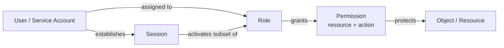
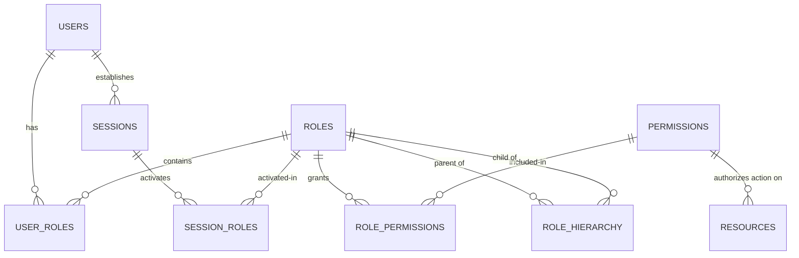
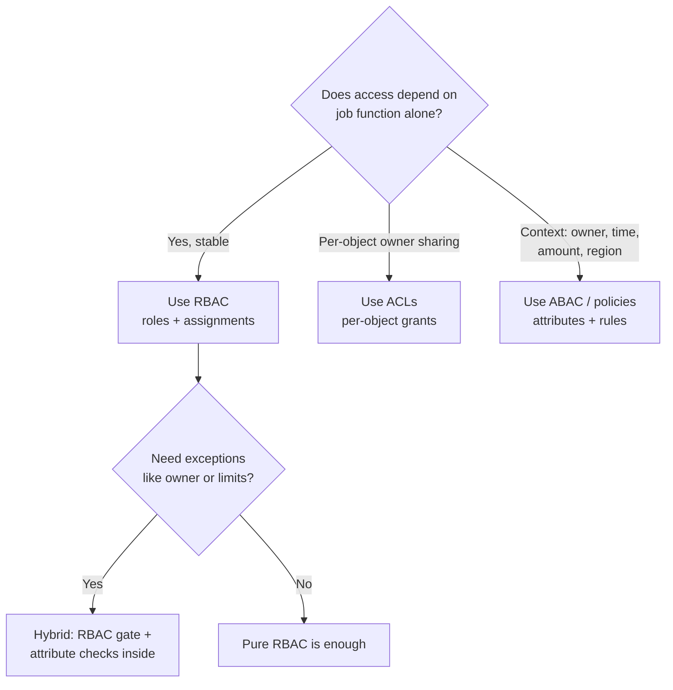
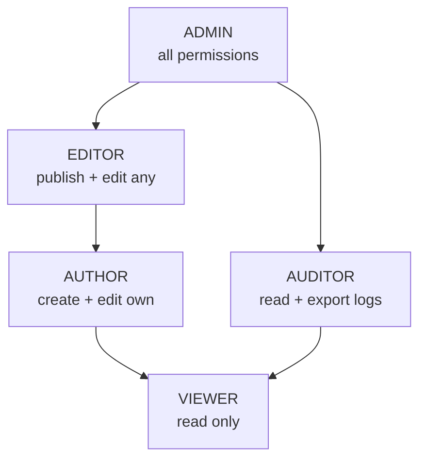
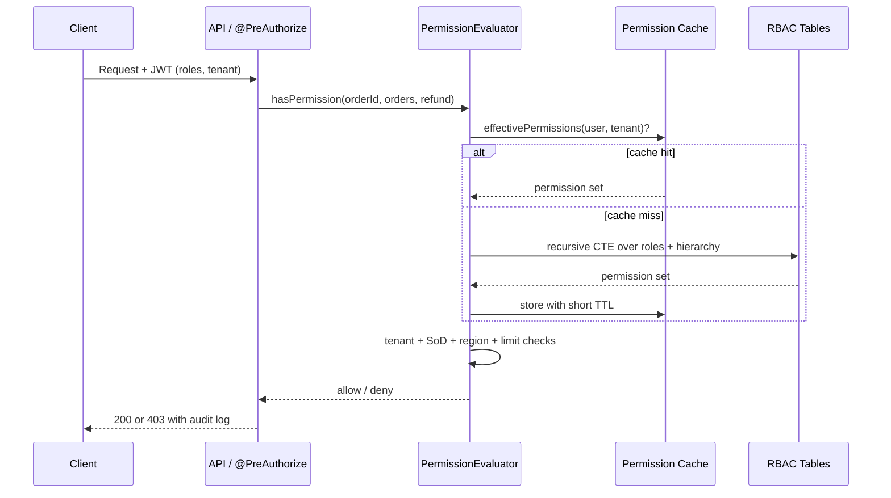

# Role based Access Control

## Theory

Role-based access control (RBAC) grants permissions to roles, and assigns users to roles, instead of granting permissions directly.
It matters because it keeps authorization manageable as teams grow — adding a user to a role is safer than hand-editing permission lists.
Key subtopics: roles vs permissions vs users, role hierarchies, least privilege, and how RBAC compares to ABAC and ACLs.

RBAC is the dominant authorization model in enterprise systems because it aligns access with organizational function rather than individual identity. Instead of answering "what can Alice do?" for every user, you answer "what can an Editor do?" once, and then assign Alice the Editor role. This indirection is the entire power of RBAC: it reduces an `O(Users x Permissions)` management problem to `O(Roles x Permissions) + O(Users x Roles)`, which stays tractable when you grow from 10 users to 10,000.

This guide takes you from mental model to production implementation. You will learn the NIST RBAC reference model (core, hierarchical, constrained, and symmetric variants), how roles differ from groups, when RBAC breaks down and needs attributes (ABAC) or policies (PBAC/ReBAC), how to model role hierarchies and separation-of-duties constraints, and how to implement RBAC correctly in Spring Security with method security, role hierarchies, and cached permission evaluation. It closes with threats, best practices, and interview Q&A.

> Scope note: this page covers authorization (what an authenticated principal may do), not authentication (proving who they are). It assumes you already know HTTP sessions, JWTs, or OAuth2 at a high level and focuses on the access-control decision itself.

### Topics Covered

1. [What is RBAC and Why It Matters](#1-what-is-rbac-and-why-it-matters)
2. [Core Model: Users, Roles, Permissions and Sessions](#2-core-model-users-roles-permissions-and-sessions)
3. [RBAC vs ABAC vs ACLs](#3-rbac-vs-abac-vs-acls)
4. [Role Hierarchies, Constraints and Separation of Duties](#4-role-hierarchies-constraints-and-separation-of-duties)
5. [Implementation: Schema and Spring Security](#5-implementation-schema-and-spring-security)
6. [Threats and Mitigations](#6-threats-and-mitigations)
7. [Best Practices](#7-best-practices)
8. [Interview Questions and Answers](#8-interview-questions-and-answers)

### 1. What is RBAC and Why It Matters

RBAC is an access-control model in which permissions are associated with roles, users (or service accounts) are assigned to roles, and a session activates a subset of those roles for a given interaction. A user never holds a permission directly; they hold it transitively through role membership.

Consider a content-management system without RBAC. Alice needs `article:publish`, Bob needs `article:publish` plus `article:delete`, and Carol joins needing the same as Bob. Every joiner, mover, and leaver requires hand-editing permission lists on every resource. Now introduce roles: `AUTHOR` gets `article:create` and `article:edit:own`, `EDITOR` gets `article:publish` and `article:edit:any`, and `ADMIN` gets everything. Onboarding Carol is one assignment (`Carol -> EDITOR`), offboarding is one revocation, and auditing is reading role definitions instead of diffing thousands of grants.

The benefits compound in regulated environments:

- **Least privilege becomes enforceable.** You define narrow roles (billing-viewer, deploy-approver) and default-deny everything else, rather than relying on developers remembering to check each permission.
- **Audits become answerable.** Auditors ask "who can touch PII or move money?" With RBAC you list role members; without it you scan per-user ACLs across every service.
- **Change becomes safe.** Renaming a permission, splitting a role, or revoking a capability is a single-point change in the role definition, not a migration over user rows.
- **Delegation becomes possible.** Managers or team leads can be given `role-assign` rights scoped to their own team without granting them global admin.

RBAC works best when access correlates with job function and changes slowly: employee roles, SaaS plan tiers (free vs pro vs enterprise), or operational tiers (viewer, operator, admin). It works poorly when access depends on dynamic context such as "the owner of this document," "only during business hours," or "only for orders under $10,000 in the requester's region." Those are attribute or relationship problems, and forcing them into static roles produces role explosion (hundreds of `EDITOR_US_EAST_NIGHT_SHIFT` roles). Section 3 shows where to draw that line.

The NIST RBAC standard (INCITS 359-2004, building on Sandhu et al., 1996) formalizes four levels: Core RBAC (users, roles, permissions, sessions), Hierarchical RBAC (role inheritance), Constrained RBAC (separation of duties), and Symmetric RBAC (permission-to-role review plus user-to-role review). Most production systems implement Core plus Hierarchy plus a subset of Constraints. You do not need to memorize the standard number for interviews, but naming the four levels signals depth.



*The diagram above shows the RBAC indirection: users activate roles through sessions, and roles carry permissions that protect resources.*

A permission itself is best modeled as a `resource + action` pair (sometimes `resource + action + scope`), for example `orders:refund`, `documents:read`, or `deploy:approve:production`. A role is a named set of such permissions (`SUPPORT_L2 = {tickets:read, tickets:reply, refunds:issue-under-100}`). Keeping permissions fine-grained and roles coarse-grained is the central design tension: too-coarse permissions force over-privileged roles, and too-fine roles collapse back into per-user management.

Sessions deserve explicit attention because interviewers probe them. A session is the runtime activation of roles: the same user may hold both `DEVELOPER` and `DEPLOY_APPROVER` but activate only one at a time, or a web request may carry only the roles relevant to that tenant. Sessions enable the principle of least privilege dynamically and are the enforcement point for dynamic separation of duties (you cannot activate two conflicting roles in the same session).

### 2. Core Model: Users, Roles, Permissions and Sessions

The NIST core model has five elements and three relations. Understanding each precisely lets you design schemas and answer scenario questions without hand-waving.

**Users** are authenticated principals: humans, service accounts, or machine identities. A user has no permissions of their own in pure RBAC. In practice most systems allow a small number of direct grants as break-glass exceptions, but every direct grant is audit debt and should expire.

**Roles** are job functions or capability bundles within an organization or tenant. Good roles are stable, meaningful to non-engineers ("Billing Viewer"), and far fewer than users. A common smell is a 1:1 role per user (`alice-admin`), which means you have ACLs wearing an RBAC costume.

**Permissions** are approvals to perform an operation on a resource class. They are the smallest unit of authorization. Design them as verbs over resources (`invoice:void`, `user:suspend`, `feature-flag:toggle`) and keep them application-level, not URL-level, so that renaming a route does not silently change security semantics.

**Operations and objects** sit beneath permissions. An operation (read, write, approve) applied to an object (order #123, production cluster) is authorized if any active role carries the matching permission. Enforcement can live at the API gateway, the service method, the data row (row-level security), or all three for defense in depth.

**Sessions** map one user to a set of active roles. Stateless JWT architectures emulate sessions by embedding `roles` or `scope` claims with short expiry; stateful servers keep a session store. Either way, the authorization check reads active roles, not all assignable roles.



*The diagram above shows the canonical RBAC schema: many-to-many joins between users and roles and between roles and permissions, plus sessions that activate a subset of roles.*

The two join tables (`user_roles` and `role_permissions`) are the heart of the schema. They let you answer both directions efficiently: "what can this user do?" (expand roles to permissions at login and cache) and "who can do this?" (reverse lookup for audits and incident response). Index both columns of each join table; both query directions are hot.

Role assignment follows a lifecycle often called Joiner-Mover-Leaver (JML): provisioning on hire or signup, modification on team change, and deprovisioning on departure. Mature organizations drive this from an HR or IdP source (SCIM from Okta or Entra ID into the app), require manager approval for privileged roles, and run periodic access recertification where managers re-confirm their reports' roles. Interviewers love asking how you revoke access when someone leaves: the correct answer is short-lived tokens plus centralized role source plus session revocation, not "delete the user row and hope JWTs expire."

Multi-tenancy adds a dimension. In a single-tenant enterprise app, `ADMIN` is global. In SaaS, `ADMIN` must be scoped: Alice is `ADMIN` of tenant Acme but `VIEWER` of tenant Globex. The fix is a ternary assignment `(user, role, tenant)` or `(user, role, scope)` rather than a binary `(user, role)`. Spring Security expresses this with custom voters or `@PreAuthorize` SpEL that checks tenant alongside role; the schema section below shows the `tenant_id` column that makes it possible.

### 3. RBAC vs ABAC vs ACLs

Interviewers routinely ask "how does RBAC differ from ABAC and ACLs, and when would you pick each?" The crisp answer is about what the decision depends on: an access-control list depends on identity ("Alice can read file F"), RBAC depends on job function ("Editors can publish"), and attribute-based access control depends on evaluated attributes of subject, resource, action, and environment ("a doctor in the same department can read the record during business hours").

**Access-Control Lists (ACLs)** attach a per-object list of `(principal, rights)` entries. A Google Doc share list is an ACL; so are filesystem permissions and S3 bucket policies. ACLs are intuitive for owner-driven sharing ("share this document with Bob") and need no central role engineering. They collapse at scale: answering "who can read PII across all buckets?" requires scanning every object's list, revocation is scattered, and there is no notion of job function. Use ACLs for user-owned resources with ad-hoc sharing, never as the primary enterprise authorization model.

**RBAC** inserts the role indirection described above. Decisions depend only on role membership, which makes administration and auditing cheap. The weakness is context-blindness: RBAC cannot natively express "the owner," "business hours only," "under a dollar limit," or "same department as the patient." Teams that try end up with role explosion: `TELLER_NYC_UNDER_10K_DAYTIME` is a symptom, not a design.

**Attribute-Based Access Control (ABAC)** evaluates boolean policies over attributes: subject attributes (department, clearance, tenure), resource attributes (classification, owner, region), action attributes (read vs approve), and environment attributes (time, IP, device posture). Standards like XACML and ALFA, and cloud IAM condition keys (`aws:PrincipalTag`, `request.Time`), are ABAC. ABAC handles fine-grained context elegantly but costs policy complexity: policies are code that must be tested, versioned, and debugged when someone is mysteriously denied.

| Dimension | ACL | RBAC | ABAC |
|---|---|---|---|
| Decision input | Identity on the object | Role membership | Attributes of subject, resource, action, environment |
| Admin unit | Per-object entry | Role definition + assignment | Policy + attribute source |
| Scales to 10k users | Poorly (list per object) | Well (roles grow slowly) | Well (policies cover classes) |
| Context (time, owner, amount) | No | No (without explosion) | Yes, natively |
| Audit question "who can X?" | Scan all objects | List role members | Evaluate policies (harder) |
| Best fit | User-owned sharing (docs, files) | Job-function access (employee roles, SaaS tiers) | Dynamic rules (owner-only, region, limits) |
| Example | Doc shared with alice@, bob@ | `SUPPORT_L2` can refund under $100 | "Doctors in same ward, 8am-8pm, non-sensitive records" |

The production answer is almost always a hybrid: RBAC as the coarse gate plus ABAC-flavored checks inside. A request must first satisfy the role (`hasRole('EDITOR')`), then satisfy contextual predicates (is the requester the owner or in the same tenant? is the amount within the role's limit? is MFA fresh?). Spring Security models this naturally: `hasRole` for the coarse check plus a custom `PermissionEvaluator` or SpEL bean (`@orderPolicy.canRefund(authentication, #orderId)`) for the fine check. Open-source policy engines (Open Policy Agent with Rego, Cedar, Casbin) externalize the same split so product code calls `allow(subject, action, resource, context)` and policy lives outside the deploy.

Two relatives worth naming briefly: **PBAC** (policy-based access control) is the umbrella term for externalized policies that may combine roles and attributes, and **ReBAC** (relationship-based access control, as in Google Zanzibar) authorizes via relationship graphs ("editors of a folder inherit access to its docs"). If an interviewer mentions Zanzibar, Drive-style sharing, or "friends of friends," they are probing ReBAC; answer that relationships become the attribute evaluated at decision time.



*The diagram above shows how to choose between ACLs, RBAC, and ABAC, with the hybrid pattern covering most production systems.*

A worked example ties it together. A refund endpoint needs: (a) only support staff can refund (role), (b) only for their own region's orders (attribute match), (c) only under $100 unless a supervisor (attribute limit + escalation role), and (d) never their own orders (dynamic SoD). Pure RBAC needs a role per region per limit; pure ABAC needs policies every developer must get right. The hybrid keeps `SUPPORT_L2` as the auditable role and pushes region, amount, and self-dealing into a small policy function with unit tests. Name this pattern explicitly in interviews; it is what senior engineers describe as "coarse-grained roles, fine-grained policies."

### 4. Role Hierarchies, Constraints and Separation of Duties

**Hierarchical RBAC** lets senior roles inherit junior permissions. `ADMIN` inherits `EDITOR`, which inherits `AUTHOR`, which inherits `VIEWER`. Without hierarchies, every permission must be duplicated into every senior role, and adding one capability to `VIEWER` means editing every role above it. With hierarchies, you define each permission once at the lowest role that needs it and let inheritance propagate upward.

Hierarchies must form a directed acyclic graph, never a cycle. A cycle (`A` inherits `B` inherits `A`) makes permission resolution non-terminating and usually signals a modeling error where two teams each assumed the other was junior. Enforce acyclicity at role-definition time with a graph check, and keep hierarchies shallow (two to four levels). Deep chains (`L1` through `L9`) become undebuggable: nobody can predict what `L7` can actually do without expanding the transitive closure, and a change at the bottom silently escalates everyone above.



*The diagram above shows a role hierarchy DAG: senior roles inherit all junior permissions, and the auditor branch shares the viewer base without gaining editing rights.*

Inheritance can be normalized two ways. The common relational approach stores only direct parent-child edges in `role_hierarchy(parent, child)` and computes transitive permissions at login or request time with a recursive CTE. The alternative materializes transitive closure into a table for O(1) reads at the cost of write-time fan-out. Prefer computed closure with caching for most apps; materialize only when permission evaluation is on a latency-critical path with deep hierarchies.

**Constraints** are the guardrails that keep RBAC honest. The NIST model distinguishes static separation of duties (SSD: conflicting roles can never be assigned to the same user, enforced at assignment time) from dynamic separation of duties (DSD: conflicting roles can be assigned but never activated in the same session, enforced at request time). The textbook example is `PAYMENT_INITIATOR` vs `PAYMENT_APPROVER`: no single person should both create and approve the same payment, because that enables fraud. SSD forbids holding both roles at all; DSD allows holding both but blocks approving a payment you initiated.

| Constraint type | Enforced when | Example | Why it matters |
|---|---|---|---|
| Static SoD | Role assignment | Cannot hold `CASHIER` and `AUDITOR` together | Removes fraud path entirely, simplest to audit |
| Dynamic SoD | Session / request | Cannot activate `BUYER` and `APPROVER` on the same order | Flexible for small teams, needs runtime checks |
| Cardinality | Assignment count | At most 3 `PROD_ADMIN`s; `AUDITOR` needs at least 2 members | Limits blast radius, avoids single points of failure |
| Prerequisite | Assignment order | `SENIOR_TELLER` requires `TELLER` first | Encodes training or tenure gates |
| Temporal | Activation window | `CONTRACTOR` active only 9-5, expiring Friday | Bounds third-party and temporary access |
| Scope / tenant | Every decision | `ADMIN` of tenant A has zero rights in tenant B | Prevents cross-tenant privilege bleed in SaaS |

Least privilege and default-deny underpin all constraints. New roles start with zero permissions and gain only what a ticket justifies; every endpoint denies unless a permission explicitly allows. Combine this with time-bounded elevation instead of permanent privileged roles: an engineer who needs production access gets `PROD_READ` for two hours via a just-in-time flow (PagerDuty or Slack approval), and the grant auto-expires. Interviewers asking "how do you handle on-call production access?" expect exactly this answer, not "we have five permanent super-admins."

Role explosion deserves a failure-mode discussion. It happens when teams encode attributes as roles (region, shift, project, clearance level multiplied together), when every exception becomes a new role instead of a policy, or when tenant-specific roles are cloned rather than parameterized. Symptoms include more roles than users, role names with three or more concatenated dimensions, and admins who approve assignments without understanding what the role grants. Fixes are mechanical: replace dimensional roles with one role plus scoped checks (`EDITOR` + `region == order.region`), introduce permission-time parameters, merge near-duplicate roles, and publish a role catalog with plain-language descriptions and owners so requesters pick correctly.

### 5. Implementation: Schema and Spring Security

This section builds a production-grade RBAC implementation in three layers: the relational schema, Spring Security enforcement with `@PreAuthorize` and role hierarchies, and the performance layer (caching plus a custom `PermissionEvaluator` for object-level checks). Every code block is explained below it.

#### 5.1 Relational schema

The schema below is the minimum viable RBAC store for a multi-tenant SaaS app. It supports hierarchies, tenant scoping, and time-bounded grants without extra tables.

```sql
CREATE TABLE users (
    id          BIGINT GENERATED ALWAYS AS IDENTITY PRIMARY KEY,
    username    VARCHAR(255) NOT NULL UNIQUE,
    display_name VARCHAR(255) NOT NULL,
    active      BOOLEAN NOT NULL DEFAULT TRUE
);

CREATE TABLE roles (
    id          BIGINT GENERATED ALWAYS AS IDENTITY PRIMARY KEY,
    name        VARCHAR(100) NOT NULL UNIQUE,   -- e.g. 'EDITOR', 'SUPPORT_L2'
    description TEXT NOT NULL,                  -- plain language for the catalog
    owner       VARCHAR(255) NOT NULL           -- team accountable for approvals
);

CREATE TABLE permissions (
    id          BIGINT GENERATED ALWAYS AS IDENTITY PRIMARY KEY,
    resource    VARCHAR(100) NOT NULL,          -- e.g. 'orders', 'articles'
    action      VARCHAR(100) NOT NULL,          -- e.g. 'refund', 'publish'
    UNIQUE (resource, action)
);

CREATE TABLE role_permissions (
    role_id       BIGINT NOT NULL REFERENCES roles (id) ON DELETE CASCADE,
    permission_id BIGINT NOT NULL REFERENCES permissions (id) ON DELETE CASCADE,
    PRIMARY KEY (role_id, permission_id)
);

CREATE TABLE user_roles (
    user_id    BIGINT NOT NULL REFERENCES users (id) ON DELETE CASCADE,
    role_id    BIGINT NOT NULL REFERENCES roles (id) ON DELETE CASCADE,
    tenant_id  VARCHAR(100) NOT NULL DEFAULT 'default',
    expires_at TIMESTAMPTZ,                     -- NULL means no expiry (prefer short TTLs)
    granted_by VARCHAR(255) NOT NULL,           -- approver for audit trail
    PRIMARY KEY (user_id, role_id, tenant_id)
);

CREATE TABLE role_hierarchy (
    parent_role_id BIGINT NOT NULL REFERENCES roles (id) ON DELETE CASCADE,
    child_role_id  BIGINT NOT NULL REFERENCES roles (id) ON DELETE CASCADE,
    PRIMARY KEY (parent_role_id, child_role_id),
    CHECK (parent_role_id <> child_role_id)
);

CREATE INDEX idx_user_roles_user ON user_roles (user_id);
CREATE INDEX idx_user_roles_role ON user_roles (role_id);
CREATE INDEX idx_role_permissions_role ON role_permissions (role_id);
CREATE INDEX idx_role_permissions_perm ON role_permissions (permission_id);
```

The schema is explained table by table. `users`, `roles`, and `permissions` are the entity tables; keep `permissions` fine-grained (`orders:refund`) and `roles` coarse (`SUPPORT_L2`). The `role_permissions` join answers "what can this role do?" and `user_roles` answers "what roles does this user hold?" with both index directions because both are queried on hot paths. The `tenant_id` column on `user_roles` scopes every assignment so the same user can be `ADMIN` in one tenant and `VIEWER` in another. The `expires_at` and `granted_by` columns turn assignments into auditable, self-cleaning grants instead of permanent privileges. The `role_hierarchy` table stores only direct edges; a database `CHECK` plus an application-level cycle test keeps it a DAG.

Resolving effective permissions for a user walks the hierarchy transitively. The recursive CTE below expands direct roles through all ancestors and collects distinct permissions, which is exactly what login-time authority loading runs:

```sql
-- Effective permissions for user 42 in tenant 'acme', including inherited roles.
WITH RECURSIVE reachable_roles (role_id) AS (
    SELECT ur.role_id
    FROM user_roles ur
    WHERE ur.user_id = 42
      AND ur.tenant_id = 'acme'
      AND ur.expires_at IS DISTINCT FROM NULL
        AND ur.expires_at > now()
        OR ur.expires_at IS NULL
    UNION
    SELECT rh.parent_role_id
    FROM role_hierarchy rh
    JOIN reachable_roles rr ON rh.child_role_id = rr.role_id
)
SELECT DISTINCT p.resource, p.action
FROM reachable_roles rr
JOIN role_permissions rp ON rp.role_id = rr.role_id
JOIN permissions p ON p.id = rp.permission_id;
```

The CTE is explained in two halves. The anchor query selects the user's direct, unexpired role assignments for the requested tenant, which enforces expiry and tenant scope at the data layer rather than trusting callers. The recursive term climbs `role_hierarchy` from each child to its parents, so a user holding `AUTHOR` also collects `EDITOR` and `ADMIN` permissions when those are ancestors. The outer select joins through `role_permissions` and deduplicates, giving the exact authority set to embed in the security context or cache.

#### 5.2 Spring Security enforcement with @PreAuthorize

URL rules alone are insufficient because routes change and one route can serve multiple permission levels. Method security with `@PreAuthorize` places the check next to the business operation, where reviewers can see it, and it survives URL refactors. The configuration below enables method security, defines a role hierarchy, and wires a custom permission evaluator (built in the next subsection).

```java
@Configuration
@EnableMethodSecurity(prePostEnabled = true)
public class SecurityConfig {

    @Bean
    SecurityFilterChain filterChain(HttpSecurity http) throws Exception {
        http
            .csrf(csrf -> csrf.disable()) // stateless JWT API; keep enabled for cookie sessions
            .sessionManagement(sm -> sm.sessionCreationPolicy(SessionCreationPolicy.STATELESS))
            .authorizeHttpRequests(auth -> auth
                .requestMatchers("/actuator/health", "/public/**").permitAll()
                .requestMatchers("/admin/**").hasRole("ADMIN")
                .anyRequest().authenticated())
            .oauth2ResourceServer(oauth -> oauth.jwt(Customizer.withDefaults()));
        return http.build();
    }

    @Bean
    RoleHierarchy roleHierarchy() {
        // ADMIN > EDITOR > AUTHOR > VIEWER, plus AUDITOR > VIEWER branch.
        return RoleHierarchyImpl.fromHierarchy("""
                ROLE_ADMIN > ROLE_EDITOR
                ROLE_EDITOR > ROLE_AUTHOR
                ROLE_AUTHOR > ROLE_VIEWER
                ROLE_AUDITOR > ROLE_VIEWER
                """);
    }

    @Bean
    MethodSecurityExpressionHandler expressionHandler(
            RoleHierarchy hierarchy, OrderPermissionEvaluator evaluator) {
        DefaultMethodSecurityExpressionHandler handler =
                new DefaultMethodSecurityExpressionHandler();
        handler.setRoleHierarchy(hierarchy);      // hasRole('EDITOR') implies AUTHOR + VIEWER
        handler.setPermissionEvaluator(evaluator); // enables hasPermission(...) checks
        return handler;
    }
}
```

The configuration is explained piece by piece. `@EnableMethodSecurity` activates `@PreAuthorize` annotations; without it those annotations are silently ignored, which is a classic interview trap. The `SecurityFilterChain` keeps coarse URL gates (`/admin/**` needs `ADMIN`) as defense in depth while delegating real decisions to method annotations. The `RoleHierarchy` bean declares inheritance with Spring's `ROLE_` prefix convention: a check for `hasRole('AUTHOR')` now passes for `EDITOR` and `ADMIN` holders without duplicating grants. Wiring the hierarchy into the expression handler is what makes `hasRole` hierarchy-aware; forgetting `setRoleHierarchy` leaves URL checks and method checks disagreeing. The custom evaluator bean (next subsection) powers `hasPermission` for object-level decisions like "can this user refund this specific order?"

Service methods carry the fine-grained annotations. Coarse role gates use `hasRole`, object-level rules use `hasPermission`, and contextual hybrid rules delegate to a policy bean via SpEL:

```java
@Service
public class ArticleService {

    @PreAuthorize("hasRole('AUTHOR')")
    public Article createDraft(String tenantId, String title, String body) {
        // Any author (or senior inheritor) can create drafts.
        return articles.save(new Article(tenantId, title, body));
    }

    @PreAuthorize("hasRole('EDITOR')")
    public Article publish(Long articleId) {
        // Hierarchy means ADMIN passes too; AUTHOR is denied.
        return articles.publish(articleId);
    }

    @PreAuthorize("hasPermission(#orderId, 'orders', 'refund')")
    public void refundOrder(Long orderId, Money amount) {
        // Object-level rule lives in OrderPermissionEvaluator below.
        payments.refund(orderId, amount);
    }

    @PreAuthorize("@orderPolicy.canApprove(authentication, #orderId)")
    public void approvePayment(Long orderId) {
        // Hybrid RBAC + ABAC: role gate plus region, amount, and self-dealing checks.
        payments.approve(orderId);
    }
}
```

The annotations are explained one by one. `createDraft` uses a pure role gate: hierarchy-aware `hasRole('AUTHOR')` admits authors, editors, and admins while denying viewers. `publish` raises the bar to `EDITOR`, which admits editors and admins only. `refundOrder` switches to `hasPermission` with the target object id, resource, and action, delegating to the evaluator that loads the order and applies contextual rules. `approvePayment` shows the hybrid pattern: a Spring bean method receives the authentication and business id and returns a boolean, keeping policy logic unit-testable outside the annotation.

#### 5.3 Custom PermissionEvaluator with caching

The evaluator below implements the refund policy from Section 3: support role membership, same-region constraint, amount limit with supervisor escalation, and dynamic SoD against self-dealing. Authorities are cached per user and tenant so every request does not hit the database.

```java
@Component
public class OrderPermissionEvaluator implements PermissionEvaluator {

    private final OrderRepository orders;
    private final CacheManager caches;

    public OrderPermissionEvaluator(OrderRepository orders, CacheManager caches) {
        this.orders = orders;
        this.caches = caches;
    }

    @Override
    public boolean hasPermission(
            Authentication auth, Object targetId, Object permission) {
        if (auth == null || !auth.isAuthenticated()) return false; // default deny
        if (!(targetId instanceof Long orderId)) return false;

        Order order = orders.findById(orderId).orElse(null);
        if (order == null) return false; // unknown object denies, never permits
        if (!tenantMatches(auth, order.tenantId())) return false;

        Set<String> perms = effectivePermissions(auth.getName(), order.tenantId());
        String want = "orders:" + permission; // e.g. 'orders:refund'
        if (!perms.contains(want) && !perms.contains("orders:*")) return false;

        return switch (String.valueOf(permission)) {
            case "refund" -> canRefund(auth, order);
            case "approve" -> canApprove(auth, order);
            default -> true; // permission string already authorized the action class
        };
    }

    private boolean canRefund(Authentication auth, Order order) {
        if (isSelfDealing(auth, order)) return false;      // dynamic SoD
        if (!regionMatches(auth, order.region())) return false;
        if (order.amount().isLessThanOrEqual(Money.of(100))) return true;
        return hasAuthority(auth, "ROLE_SUPERVISOR");       // escalation path
    }

    private boolean canApprove(Authentication auth, Order order) {
        // Initiator may never approve their own payment (dynamic SoD).
        if (order.initiatedBy().equals(auth.getName())) return false;
        return hasAuthority(auth, "ROLE_SUPERVISOR")
            || hasAuthority(auth, "ROLE_FINANCE_APPROVER");
    }

    @Cacheable(value = "rbac-permissions", key = "#username + ':' + #tenantId")
    public Set<String> effectivePermissions(String username, String tenantId) {
        // Runs the recursive-CTE equivalent via JPA; result cached per user + tenant.
        return permissionsRepository.findEffective(username, tenantId);
    }

    @CacheEvict(value = "rbac-permissions", key = "#username + ':' + #tenantId")
    public void evict(String username, String tenantId) {
        // Called by role-assignment, revocation, and expiry flows.
    }

    @Override
    public boolean hasPermission(
            Authentication auth, Serializable targetId,
            String targetType, Object permission) {
        return hasPermission(auth, targetId, permission);
    }
}
```

The evaluator is explained in layers. The entry method defaults to deny at every early exit: unauthenticated, wrong id type, missing order, tenant mismatch, and absent permission string all return false, so a new code path fails closed. Tenant and permission-string checks come before business rules because they are cheap and eliminate cross-tenant bleed regardless of what follows. The `switch` dispatches to per-action predicates where the ABAC-flavored logic lives: `canRefund` layers dynamic SoD, region match, amount limit, and supervisor escalation in that order, while `canApprove` enforces the initiator-approver split. Caching uses Spring's `@Cacheable` keyed on `username:tenantId`, which matches the ternary assignment model; every grant, revoke, and expiry path must call `evict`, and a short TTL (five to fifteen minutes) bounds staleness when eviction is missed. Interviewers asking "what happens when you revoke a role but the user still has a JWT?" expect exactly this: short token lifetimes plus server-side session or permission-cache revocation plus a revocation list checked at the gateway.



*The sequence above shows the request-time authorization flow: cached permission expansion first, then contextual policy checks, with every denial audited.*

One paragraph on testing, because interviewers probe it. Unit-test the evaluator predicates with plain JUnit and Mockito (self-dealing denied, over-limit without supervisor denied, cross-tenant denied) since they are pure functions of auth plus order. Slice-test controllers with `@WebMvcTest` and a mocked evaluator to assert 403 mappings. Run a hierarchy regression test that expands every role to its transitive permission set and diffs against a checked-in snapshot, so an accidental `ROLE_VIEWER > ROLE_ADMIN` inversion fails the build instead of production.

### 6. Threats and Mitigations

RBAC fails not when the model is wrong but when enforcement, administration, or revocation has gaps. Every threat below is a real incident pattern; the mitigations are the controls interviewers expect you to name.

| Threat | What goes wrong | Mitigation |
|---|---|---|
| Privilege escalation via self-assignment | An endpoint or admin panel lets users grant themselves roles | Separate role-assignment permission (`role:assign`) held only by admins; require approval workflow and log every grant with approver identity |
| Stale access after role revocation | Cached permissions or long-lived JWTs keep working for hours after removal | Short token TTL (5-15 min), server-side permission cache with eviction on every grant/revoke, session revocation list checked at gateway |
| Role explosion hiding over-privilege | Hundreds of overlapping roles; nobody knows what `OPS_L3_NIGHT` grants | Role catalog with owners and descriptions, quarterly recertification, merge dimensional roles into scoped policies |
| Hierarchy inversion or cycle | Misconfigured parent grants admin rights to every viewer, or cyclic inheritance loops resolution | Acyclicity check at definition time, snapshot regression test on transitive closure, require two-person review for hierarchy edits |
| Cross-tenant bleed | `ADMIN` of tenant A calls an endpoint with tenant B's id and succeeds | Tenant-scoped assignments `(user, role, tenant)`, mandatory tenant check in every evaluator, integration test that swaps tenant ids and asserts 403 |
| Insecure direct object reference (IDOR) with valid role | User holds `orders:read` and reads another tenant's or another user's order by guessing ids | Object-level `hasPermission` checks that compare resource owner/tenant against authentication, never role-only checks on single-object reads |
| Separation-of-duties violation | One user initiates and approves the same payment, enabling fraud | Static SoD on conflicting assignments plus dynamic SoD in the evaluator (`initiatedBy != approver`), alert on attempted violations |
| Over-broad wildcard permissions | `orders:*` granted to support for convenience becomes delete and export rights | Prefer explicit action lists, reserve wildcards for break-glass roles with expiry and alerting, audit wildcard holders monthly |
| Break-glass and orphaned grants | Emergency admin grants never expire; departed employees keep service-account roles | Time-bounded grants with default expiry, automated JML deprovisioning from HR/IdP via SCIM, periodic orphaned-account scan |
| Missing audit trail | A breach investigation cannot answer who granted what to whom and when | Append-only authorization audit log (who, what, which role/permission, decision, tenant, timestamp); ship to SIEM, alert on privileged grants |
| Client-side enforcement only | UI hides buttons but the API accepts the call, so curl bypasses authorization | Enforce on the server in service methods; treat UI hiding as usability, never as control; contract-test every endpoint with a least-privileged token |
| Confused deputy via service accounts | A backend job with `ADMIN` acts on user-supplied ids and becomes a privilege proxy | Scope service accounts to narrow permissions, propagate original caller identity (on-behalf-of), validate tenant/object ownership inside the job |

Two scenarios tie the table together for interviews. First, the revocation race: Alice is fired at 10:00, her `user_roles` row is deleted at 10:01, but her JWT is valid until 11:00 and the permission cache holds her authorities until 10:15. Without countermeasures she keeps refunding for an hour. The fix layers short JWT expiry, cache eviction on revocation, and a gateway-checked denylist for high-risk revocations, shrinking the window to seconds. Second, the confused deputy: a report-export job runs as `ADMIN` and takes an `orderId` parameter from the requesting user without re-checking that user's rights. Any viewer can export any order by calling the job. The fix is propagating the caller's authentication into the job and re-running the evaluator, or scoping the job to pre-authorized object lists.

Logging deserves emphasis because auditors grade it. Log both allow and deny decisions for privileged actions with the fields `timestamp, principal, roles, tenant, resource, action, objectId, decision, policyVersion`. Deny-heavy logs reveal probing; allow-heavy privileged logs reveal misuse. Never log raw tokens or passwords alongside these events.

### 7. Best Practices

These practices are ordered from design to operations, so a new system can adopt them top-down and an existing system can audit against them.

1. **Design permissions as resource plus action, roles as job functions.** Permissions like `invoices:void` stay stable across UI refactors; roles like `BILLING_CLERK` stay meaningful to managers. Never encode URLs or button names as permissions.
2. **Default-deny everything and fail closed.** Every endpoint requires an explicit permission; unknown roles, missing objects, and evaluator exceptions deny. New code paths are secure before anyone reviews them.
3. **Keep hierarchies shallow and reviewed.** Two to four levels with named owners per role. Any hierarchy edit needs a second reviewer and must pass the transitive-closure snapshot test.
4. **Scope every assignment with tenant and expiry.** Default `user_roles` rows carry a `tenant_id` and a short `expires_at`. Permanent global grants are the exception and require a ticket plus an alert.
5. **Enforce coarse roles plus fine policies, not one or the other.** `hasRole` at the method boundary, `PermissionEvaluator` or policy bean for owner, region, amount, and SoD rules. This avoids both role explosion and policy spaghetti.
6. **Centralize the authorization decision point.** One evaluator or policy service per application, called from every enforcement point. Scattered `if (role.equals(...))` checks drift and cannot be audited.
7. **Cache permissions per user plus tenant with aggressive eviction.** Short TTL plus explicit eviction on grant, revoke, expiry, and hierarchy change. Measure cache hit rate and revocation-to-enforcement latency as SLOs.
8. **Separate who can assign roles from who holds them.** The `role:assign` permission is rarer than any business permission. Require manager or owner approval for privileged roles and notify the requester, approver, and security channel.
9. **Automate Joiner-Mover-Leaver from the identity provider.** SCIM or HR-driven provisioning and deprovisioning beats manual tickets. Rehearse offboarding: from HR termination event to enforced denial should be seconds, and you should be able to demo it.
10. **Recertify and publish a role catalog.** Quarterly, every role owner re-confirms members. The catalog lists each role's permissions in plain language, its owner, and how to request it. Anything without an owner gets deleted.
11. **Prefer just-in-time elevation over standing privilege.** Production and finance roles are granted for hours with approval, not held forever. Standing `SUPER_ADMIN` counts should fit on one hand, each with hardware-backed MFA.
12. **Audit everything and alert on the interesting parts.** Log all privileged allows and all denies with tenant and policy version. Alert on wildcard grants, SoD violations attempted, cross-tenant denies spiking, and assignments outside business hours.

### 8. Interview Questions and Answers

**Q1 (Beginner): What is RBAC in one minute?**
RBAC grants permissions to roles and assigns users to roles, instead of granting permissions directly. A permission is a `resource + action` pair like `orders:refund`; a role like `SUPPORT_L2` bundles permissions; a user gets capabilities by holding roles. This reduces administration from per-user permission lists to role definitions plus assignments, which is why onboarding becomes one assignment and audits become role-membership reviews.

**Q2 (Beginner): What is the difference between a role, a group, and a permission?**
A permission is the atomic right to do something (`invoices:void`). A role is a bundle of permissions tied to a job function and is the unit of authorization decisions. A group is an administrative collection of users (for example, "Berlin office") used to simplify assignment: you assign a role to a group rather than to each member. Collapsing groups and roles into one concept works in tiny apps but breaks down when the same group needs different rights in different tenants or environments.

**Q3 (Beginner): What is least privilege, and how does RBAC enforce it?**
Least privilege means every principal holds only the permissions needed for its current task, nothing more. RBAC enforces it through default-deny (no permission means no access), narrowly scoped roles, sessions that activate only the roles needed right now, and time-bounded grants that expire. In reviews, cite the just-in-time elevation pattern: production access granted for two hours with approval beats a permanent admin grant.

**Q4 (Intermediate): How do RBAC, ABAC, and ACLs differ, and when would you use each?**
ACLs attach per-object identity lists and fit owner-driven sharing like document shares. RBAC decides by job-function role membership and fits stable organizational access like employee roles or SaaS tiers. ABAC evaluates attributes of subject, resource, action, and environment and fits contextual rules like owner-only, regional, or amount-limited access. Most production systems combine RBAC as the coarse gate with attribute checks inside, for example `hasRole('SUPPORT_L2')` plus same-region and under-limit predicates.

**Q5 (Intermediate): How do role hierarchies work, and what can go wrong with them?**
A senior role inherits all permissions of its junior roles, so `ADMIN` gets everything `EDITOR` has without duplicating grants. This removes duplication but introduces two failure modes: cycles that break permission resolution and inversions where a misplaced edge silently escalates juniors. Keep hierarchies to a DAG of two to four levels, validate acyclicity at definition time, require two-person review for edits, and snapshot-test the transitive closure in CI.

**Q6 (Intermediate): What is separation of duties, and what is the difference between static and dynamic SoD?**
Separation of duties ensures no single person can complete a sensitive workflow alone, such as initiating and approving the same payment. Static SoD forbids assigning conflicting roles to the same user and is enforced at assignment time. Dynamic SoD allows holding both roles but forbids activating or using them on the same object or session, enforced at request time in the evaluator. Static is simpler to audit; dynamic is more flexible for small teams. Implement both: static for incompatible pairs like cashier and auditor, dynamic for per-object conflicts like initiator versus approver.

**Q7 (Intermediate): How do you implement RBAC in Spring Security?**
Define a `SecurityFilterChain` with coarse URL rules, enable `@PreAuthorize` method security for fine-grained checks, declare a `RoleHierarchy` bean so `hasRole` respects inheritance, and implement a `PermissionEvaluator` for object-level `hasPermission` decisions. Annotate service methods with `hasRole` for role gates and `hasPermission` or bean-delegated SpEL like `@orderPolicy.canApprove(authentication, #orderId)` for contextual rules. Wire the hierarchy into the expression handler, or method and URL checks will disagree.

**Q8 (Intermediate): Where should permission checks live: URL filter, controller, or service method?**
At the service method, with URL rules as defense in depth. URL rules break when routes are renamed and cannot express object-level logic like ownership. Service-method annotations sit next to the business operation, survive refactors, and are visible in code review. Complement them with gateway-level coarse checks for cheap early rejection and with row-level filtering for list queries so unauthorized rows never leave the database.

**Q9 (Senior): A user is revoked but keeps accessing the system for an hour. Walk me through the causes and the fix.**
Three layers conspire: a long-lived JWT still validates, a cached authority set still returns the old permissions, and stateful sessions were never invalidated. The fix shrinks each window: short access-token TTL of five to fifteen minutes with refresh-token rotation, permission cache keyed on `user:tenant` with explicit eviction on every grant, revoke, and hierarchy change plus a short TTL as backstop, and a gateway-checked session or token denylist for high-risk revocations. Then define the SLO: revocation-to-denial latency in seconds, and demo it in the interview with the HR-termination-to-403 walkthrough.

**Q10 (Senior): How do you scope RBAC for multi-tenant SaaS without role explosion?**
Never clone roles per tenant (`ACME_ADMIN`, `GLOBEX_ADMIN`). Store ternary assignments of `(user, role, tenant)` and check the request tenant inside every evaluator decision, so `ADMIN` of tenant A has zero rights in tenant B. Keep one global role catalog, enforce the tenant predicate before any business rule so failures close safely, and add an integration test that swaps tenant ids on every privileged endpoint and asserts 403. Tenant confusion tests catch the cross-tenant bleed class systematically.

**Q11 (Senior): Design the authorization for "support agents can refund orders under $100 in their own region, supervisors can refund anything except their own orders." How do you keep it auditable?**
Keep one auditable role, `SUPPORT_L2`, as the coarse gate so the auditor's question "who can refund?" has a one-list answer. Push region, amount, and self-dealing into a versioned policy function or evaluator with unit tests for each predicate: cross-region denied, over-limit without supervisor denied, self-dealing denied, supervisor path allowed. Log every decision with principal, roles, tenant, resource, action, object id, decision, and policy version. Pure RBAC would need a role per region per limit, and pure ABAC would scatter the role question across policies; the hybrid gives both answers cheaply.

## Youtube

- [Master Role-Based Access Control Patterns](https://www.youtube.com/watch?v=Cy-o0LECWWU)
