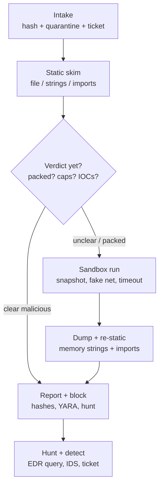

# The art of Reverse Engineering

## Theory

Reverse engineering is the practice of understanding a system by observing its behavior and structure
rather than its source code — for defenders, it means answering "what does this binary actually do"
when logs, alerts, or user reports cannot tell you.
It matters because modern incidents arrive as opaque artifacts: a suspicious attachment, a flagged
installer, a memory dump, a firmware blob. Triage without reverse engineering is guessing from hashes
and vendor verdicts; triage with it is evidence about capabilities, persistence, and blast radius.
Key subtopics: static analysis (reading without running), dynamic analysis (observing while running),
tool-assisted disassembly and decompilation, structured malware triage, and the defensive and legal
boundaries that keep the work safe and lawful.

A binary is a set of promises the CPU will keep, written in a dialect few humans read fluently.
The operating system loader maps sections into memory, resolves imports, jumps to an entry point,
and the program unpacks, decrypts, and executes its real logic. Reverse engineering reconstructs
that story backwards: from bytes on disk to sections and headers, from imports to capabilities,
from strings and control flow to intent, and from runtime traces to confirmed behavior.
Defenders rarely need to recover perfect source code; they need to decide block, isolate, hunt,
or escalate — and to write a detection others can use.

Think of the work the way a doctor reads an X-ray before surgery. Static analysis is the X-ray:
fast, safe, non-invasive, showing structure — packed or not, which libraries it calls, which
strings survived stripping. Dynamic analysis is supervised observation: run the sample in an
isolated ward, watch breathing (processes), circulation (network), and reflexes (registry, files),
and confirm which suspicions were real. Surgery — full decompilation and patching — is reserved
for when diagnosis demands it, because every incision risks crashing the patient or infecting you.

This page teaches you to reason like a defender before you touch any single tool. You will learn
when static evidence is enough and when to pay the cost of a sandbox, how to drive Ghidra, strings,
and binwalk with commands you can explain, how to triage an unknown binary in under an hour with
a repeatable workflow, how to turn findings into detections and tickets without crossing legal or
safety lines, which anti-analysis tricks map to which counters, and how to answer the reverse
engineering questions interviewers ask defenders and detection engineers.

> Scope note: this page is the defender-oriented overview — static versus dynamic trade-offs,
> essential tool commands, a triage workflow with diagram, defensive applications and legality,
> threats, and Q&A. Deep internals (x86_64 and ARM assembly fluency, unpacking custom packers,
> kernel driver analysis, firmware extraction at scale) live in dedicated training such as the
> linked blogs and playlists below. It assumes basic Linux, networking, and security concepts
> and focuses on decisions interviewers probe: safe handling, capability assessment, detection
> authoring, and knowing when to stop and escalate.

### Topics Covered

1. [Static vs Dynamic Analysis](#1-static-vs-dynamic-analysis)
2. [Tool Walkthrough](#2-tool-walkthrough)
3. [Triage Workflow](#3-triage-workflow)
4. [Defensive Use and Legality](#4-defensive-use-and-legality)
5. [Threats and Mitigations](#5-threats-and-mitigations)
6. [Interview Questions and Answers](#6-interview-questions-and-answers)

### 1. Static vs Dynamic Analysis

Static analysis inspects a file without executing it, so it is always the first step: safe, fast,
and repeatable on any workstation. You read headers, hashes, strings, imports, and disassembly to
infer capability — "this sample can touch the registry, resolve DNS, and inject into another
process" — without giving the malware a chance to run. It answers structure questions in minutes
and produces detection material (hashes, strings, YARA candidates) even when the sandbox queue is long.

Dynamic analysis executes the sample in an instrumented sandbox and records what it actually does:
processes spawned, files dropped, registry keys set, DNS and HTTP traffic, API calls. It confirms
or refutes static hypotheses and exposes decrypted payloads, C2 addresses, and persistence that
packing hides from static view. The price is risk and cost — you need an isolated VM with snapshots,
fake network services, and time to let beacons fire — plus the chance the sample detects the sandbox
and stays quiet.

Use both in a fixed order: static first to scope the danger and choose sandbox settings, dynamic
to confirm, then static again on dumped memory to decode what the run revealed. A packed binary is
the classic loop: static shows high entropy and one import (`LoadLibrary`, `GetProcAddress`), dynamic
dumps the unpacked image from memory, and a second static pass on the dump yields the real imports
and strings. Either technique alone misses half the story; together they converge quickly.

| Aspect | Static analysis | Dynamic analysis |
|---|---|---|
| Runs the sample | Never — safe on analyst host | Yes — isolated VM or sandbox only |
| Speed | Minutes, scriptable | Tens of minutes, needs setup and wait |
| Sees through packing | No, sees the packer stub | Yes, observes unpacked behavior |
| Best outputs | Hashes, strings, imports, YARA, control flow | IOCs, C2, persistence, process tree |
| Blinded by | Packing, encryption, obfuscation, stripped symbols | VM checks, sleep timers, missing C2, user interaction gates |
| Defender question answered | What could it do | What did it do here |

Three habits complete the mental model. First, trust capabilities over strings: an import of
`CreateRemoteThread` plus `WriteProcessMemory` means injection capability even if no string says
so. Second, treat absence as inconclusive: no network in a five-minute run may mean a sleep timer
or sandbox check, not cleanware. Third, always work on copies with hashes logged before and after,
so every claim ties to an exact artifact another analyst can reproduce.

### 2. Tool Walkthrough

Defender tooling forms a pipeline: identify the file, extract cheap signals, disassemble the
interesting parts, and unpack firmware when the artifact is an image rather than a binary.
Learn one command per stage deeply instead of ten tools shallowly — interviews reward explaining
flags and failure modes over naming tools.

Start with identification and cheap static signals. The `file` command reads magic bytes rather
than trusting extensions, `sha256sum` pins identity for sharing and allowlisting, and `strings`
surfaces URLs, registry paths, and error messages the author left in cleartext:

```bash
# 1. Identify the real file type (extension lies, magic bytes do not).
file suspicious.bin
# Example output: PE32+ executable (console) x86-64, for MS Windows

# 2. Pin identity before you copy or share anything.
sha256sum suspicious.bin | tee case-2026-014.sha256
# The hash goes into the ticket, the sandbox submission, and the YARA metadata.

# 3. Extract printable strings with a minimum length to cut noise.
strings -n 8 suspicious.bin | head -n 40
# Look for http://, .onion, SOFTWARE\Microsoft\Windows\CurrentVersion\Run, cmd.exe, powershell.
```

The snippet above is explained flag by flag. `file` consults the libmagic database against the
first bytes — MZ means Windows PE, ELF means Linux, and data-only output hints at packing or a
firmware blob. `sha256sum` plus `tee` keeps the hash on screen and in the case file at once, so
chain of custody survives copy-paste. `strings -n 8` skips single-character noise while keeping
short IOCs; piping to `head` forces a quick skim before you drown in output. If strings show only
packer residue (UPX, section names like UPX0) and no URLs, treat the sample as packed and move on
rather than verdicting clean.

Next, inspect structure and hunt embedded content. `rabin2` or `objdump` lists imports and sections,
`binwalk` carves firmware images, and `xxd` confirms magic bytes by eye:

```bash
# 4. List imports and sections to infer capability (Rizin/radare2 must be installed).
rabin2 -I -S suspicious.bin
# -I shows arch, OS, entry point; -S shows section sizes and entropy hints.

# 5. Carve a firmware image or installer for hidden filesystems and certs.
binwalk -e firmware.bin
# -e extracts recognized signatures (SquashFS, LZMA, certificates) into _firmware.bin.extracted/.

# 6. Confirm a magic number when binwalk and file disagree.
xxd -l 16 firmware.bin
# 1f 8b means gzip, 37 7a means 7z, 4d 5a means an EXE hiding inside the blob.
```

The snippet above is explained as triage logic. `rabin2 -I -S` answers two questions fast: what
CPU and OS this targets (do you even need a Windows sandbox?) and whether sections look packed
(tiny imports plus one giant high-entropy section). `binwalk -e` turns a router image into a
directory of extractable files — check it for hardcoded credentials, private keys, and busybox
configs before touching Ghidra. `xxd -l 16` reads just the header so you can arbitrate tool
disagreement without hexdumping megabytes.

Reserve Ghidra for directed questions, not aimless browsing. Import the binary, let auto-analysis
finish, then search rather than scroll — entry point, suspicious imports, and string cross-references:

```text
Ghidra pass (GUI, no CLI flags to memorize):
1. New project (non-shared) > Import File > select sample > format auto-detected.
2. Open in CodeBrowser > Analyze > accept default analyzers > wait for green bar.
3. Window > Defined Strings > filter "http", "cmd", "tmp", ".dll" > right-click Show XREFs.
4. Search > For Direct Calls > type CreateRemoteThread, socket, CryptEncrypt > jump to caller.
5. Double-click a caller > read the Decompile window alongside Listing for intent.
```

The pass above is explained step by step. Project isolation keeps samples out of shared workspaces
where a misclick could execute them. Default analyzers recover functions, strings, and calling
conventions well enough for triage; custom scripts wait for deep dives. String cross-references
(XREFs) jump from a suspicious URL to the exact function using it, which beats reading `main`
top to bottom. Decompiler output gives intent ("builds a Run key path, then calls RegSetValue")
while the listing gives ground truth (which registers, which API) — cite both in notes.

Two dynamic compliments close the loop without new expertise. On Linux, `strace` logs syscalls and
`ltrace` logs library calls; on Windows, Procmon and Wireshark fill the same roles. Run each with
a timeout, a snapshot to revert, and no host network route — fake DNS and INetSim answer beacons
safely. If the sample exits instantly, check for sandbox checks (sleep-skipping, CPUID, MAC vendor)
before declaring it benign.

### 3. Triage Workflow

Triage turns chaos into a verdict in under an hour: quarantine, skim, confirm, report. The rule is
always the same order — safe handling first, cheap static second, sandbox third, write-up last —
so no sample ever runs before you know what it might do and no finding ever leaves without hashes.

Stage zero is intake and safety, five minutes that prevent every horror story. Copy the sample to
a quarantine folder, record SHA-256, original filename, source (email, EDR alert, URL), and do not
rename the original extension blindly. Work on copies, never the original; disable automount and
preview execution on the analyst host; submit hashes to VirusTotal only if policy allows sharing.
If the file arrived as an archive or image, note the outer hash separately from each extracted inner.

Stage one is the ten-minute static skim: `file`, strings, imports, and section sanity from the
previous section. Score three questions — is it packed, what capabilities do imports imply, are
there immediate IOCs (URLs, IPs, Run keys)? Stage two is the gate: if static already proves
malicious capability plus context (phish attachment plus credential APIs), block and hunt now
without waiting for a sandbox. Otherwise configure the sandbox from static hints: Windows or Linux
guest, fake DNS on, snapshot taken, timeout set past sleep timers.



*The diagram above shows the defender loop: every sample passes intake and static, only unclear
ones pay for sandbox time, and every path ends in a shareable report and detection.*

Stage three is the twenty-minute sandbox run plus memory re-static. Detonate once with Procmon or
`strace` and Wireshark running, let beacons retry at least twice, then save pcap, process tree,
and dropped files. Dump unpacked regions from memory and re-run strings and imports on the dump —
this second static pass usually yields the real C2 and the persistence key packing hid. Stage four
is the report: what it is, what it does, what to block, and confidence. Include hashes, filenames,
C2s, YARA or Sigma snippet, and a one-line executive summary for the ticket.

```bash
# Minimal triage record: every claim traces to these three lines.
sha256sum suspicious.bin dumped-mem.bin | tee triage-hashes.txt
strings -n 8 dumped-mem.bin | grep -Eo 'https?://[^ "]+' | sort -u > triage-c2.txt
# triage-c2.txt becomes blocklist + hunt input; hashes pin the exact artifacts.
```

The snippet above is explained as evidence hygiene. Hashing both the original and the memory dump
proves which artifact each IOC came from, so a teammate reproducing the run can match bytes. The
strings-plus-grep pass extracts candidate C2s without eyeballing thousands of lines; every entry
still needs sandbox-pcap confirmation before blocking, because strings alone include dead test URLs.

### 4. Defensive Use and Legality

Defenders reverse engineer to shrink attacker advantage, not to build weapons. The four legitimate
uses are malware triage (scope an incident), detection authoring (YARA, Sigma, Snort from confirmed
behavior), vulnerability validation (prove a crash is exploitable and needs a patch), and product
assessment (verify what a vendor binary or firmware actually does before rollout). Each ends in a
defensive artifact — a block, a rule, a ticket, a risk note — never a repackaged exploit.

Safety rules are non-negotiable. Analyze only in isolated VMs with no host shares, no production
credentials, and snapshots you actually revert. Never run suspected malware on bare metal or a
daily-driver laptop; never forward live samples over personal email or public chat; use passworded
zips (`infected`) when transfer is policy-approved. Treat firmware and installers with the same
suspicion as executables — craft and macro payloads trigger on open, not on double-click.

Legality bounds the work alongside safety. You generally may analyze files you own or that attacked
your systems, under your employer's incident-response authority and the tool's license. You may not
break access controls, redistribute copyrighted code, bypass license checks, or publish victim data
extracted from samples. EULAs, anti-circumvention law, and privacy rules all bite here: cracking a
competitor's licensing, stripping DRM, or posting credentials dumped from a stealer cross from
defense into liability. When in doubt — third-party software, medical or OT firmware, cross-border
sharing — get written approval and legal review before extracting, running, or disclosing.

Two judgment calls complete the section. First, know when to stop: a packed sample with confirmed
C2 and persistence is already actionable — full decompilation adds little and burns hours better
spent hunting. Escalate to a specialist when kernel code, custom crypto, or nation-state tooling
appears. Second, share responsibly: hashes and detection logic travel freely inside policy, while
binaries, configs with victim data, and bypass techniques stay need-to-know with handling marks.

### 5. Threats and Mitigations

Malware fights analysis with packing, evasion, and stealth; defenders answer each with a paired
counter so triage degrades gracefully instead of failing silently. Learn the pairs below and every
quiet sandbox run becomes a next step rather than a dead end.

| Threat | How it works | Mitigation that kills the class |
|---|---|---|
| Packed or encrypted payload | Stub unpacks real code only at runtime | Sandbox + memory dump, then re-static on dump |
| String and config encryption | URLs and keys decrypted just before use | Break on crypto APIs, scrape memory post-decode |
| VM and sandbox detection | Checks MAC, CPUID, drivers, uptime to stay quiet | Harden VM (realistic profile), bare-metal fallback, patch checks |
| Sleep and time bombs | Sleeps past short runs, beacons at fixed hours | Extend timeout, fast-forward clock, patch sleep in lab |
| User-interaction gates | Waits for clicks or scrolling before payload | Simulate clicks, use sandbox with interaction engine |
| Process injection | Writes into explorer or browser to hide | Monitor cross-process writes, trace with Procmon and API logs |
| Persistence tricks | Run keys, services, cron, scheduled tasks | Snapshot diff files and autoruns, hunt same keys fleet-wide |
| DGA and fast-flux C2 | Generates daily domains, rotates IPs | Extract seed from dump, precompute domains, sinkhole at DNS |
| Signed or trojanized legit binary | Valid cert or bundled app builds false trust | Verify signer plus behavior, check cert anomaly and prevalence |
| Firmware and installer hiding | Malice inside image, ISO, or macro | Binwalk carve, scan macros, analyze extracted children separately |
| Analyst self-infection | Sample escapes via share or auto-run | Isolated VM, no host mapping, snapshot revert, hashed handling |
| Over-sharing samples | Upload leaks victim data or tips off actor | Share hashes and rules by default, binaries only per policy |

Two scenarios show how to narrate an answer. First, the quiet sandbox: static showed injection
imports but the run logged nothing. State both controls in one breath — check for sleep timers and
VM checks, extend runtime with realistic VM profile — plus detection: hunt the import-derived
behaviors (remote thread creation) across EDR while the sandbox is re-armed. Second, the firmware
backdoor: `binwalk -e` yields a private key and a hardcoded admin. Fix with rotation of the exposed
key, blocklist of the shipped hash, vendor ticket with extracted evidence, and fleet scan for the
same banner — plus a procurement note so the next purchase requires reproducible builds.

### 6. Interview Questions and Answers

**Q1 (Beginner): Static versus dynamic analysis — what does each give you?**
Static reads without running: type, hashes, strings, imports, structure — safe and fast, but blind
to packing. Dynamic runs in an isolated sandbox: processes, files, registry, network — confirms
behavior, but costs setup and can be evaded. Defenders run static first, dynamic to confirm, then
static again on memory dumps.

**Q2 (Beginner): Walk me through your first ten minutes with a suspicious binary.**
Quarantine and hash it, log source and context, run `file` for true type, `strings -n 8` for URLs
and paths, and imports for capabilities. Decide packed or not from entropy and stub signs, and gate:
clear malice gets blocked and hunted now, unclear goes to the sandbox with settings chosen from
static hints.

**Q3 (Intermediate): What do `strings`, `file`, and `binwalk` each tell you, and where do they fail?**
`strings` surfaces cleartext IOCs but misses encrypted configs; `file` names the true type from
magic bytes but reports packed blobs as data; `binwalk -e` carves firmware into extractable files
but misfires on custom formats. Explain one flag each (`-n`, magic database, `-e`) and confirm
hits with a second source before blocking.

**Q4 (Intermediate): How do you handle a packed sample that shows almost no imports?**
Treat minimal imports plus high entropy as packed, not clean. Run it once in a snapshotted sandbox
with fake network, dump the unpacked image from memory, and re-run strings and imports on the dump
for the real C2 and capabilities. Cite the loop — static scopes, dynamic unpacks, re-static decodes.

**Q5 (Intermediate): The sandbox run is totally quiet — malware or cleanware?**
Inconclusive until evasion is ruled out: check sleep timers, VM checks, missing C2, and interaction
gates. Extend timeout, harden the VM profile, simulate clicks, and fast-forward the clock; meanwhile
hunt static-derived behaviors in EDR. Never verdict clean from one quiet run.

**Q6 (Intermediate): What goes into a good triage report?**
Hashes of original and dump, one-line verdict with confidence, capability list tied to evidence,
confirmed IOCs (C2, persistence, dropped files), a YARA or Sigma snippet, and response actions
taken plus hunt queries. Another analyst should reproduce every claim from the hashes alone.

**Q7 (Senior): How do you turn a triaged sample into fleet-wide detection?**
Pick stable signals from confirmed behavior — persistence path, C2 pattern, injection API sequence —
and author YARA for files plus Sigma or EDR queries for behavior. Test against benign baselines to
cut false positives, deploy in alert-only mode first, then block. Expire or version the rule when
the actor rotates infrastructure.

**Q8 (Senior): Where are the legal and safety lines in reverse engineering for defenders?**
Analyze only what you own or what attacked you, under incident-response authority, in isolated VMs
with no production data. Do not crack licensing, strip DRM, redistribute code, or publish victim
data from samples. Get written approval before third-party, OT, or cross-border work, and escalate
kernel or nation-state tooling to specialists with legal review.

## Blogs and courses

- [Nightmare](https://guyinatuxedo.github.io/)


## Open Sourced Github Projects

- [OpenRCT2](https://github.com/openrct2/openrct2)
- [OpenGoal](https://github.com/open-goal/jak-project)


## Youtube

- [How to 10x your programming skills](https://www.youtube.com/watch?v=cLpfcn_dPEo)
- [The LinkedIn Spyware Situation](https://www.youtube.com/watch?v=mHj6IvBmlpU)


- [Dev Tool them ALL!](https://www.youtube.com/playlist?list=PLQnljOFTspQX9U79P6eD_V9USIUTE9yAD)
- [Low Level](https://www.youtube.com/@LowLevelTV/playlists)
- [Howdy](https://www.youtube.com/@howdy_official/playlists)