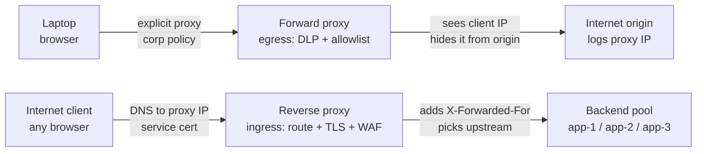
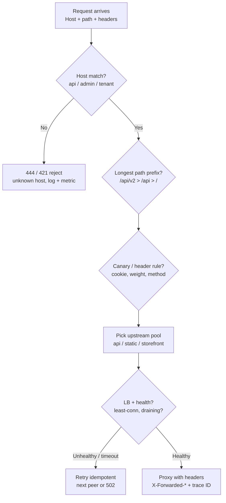
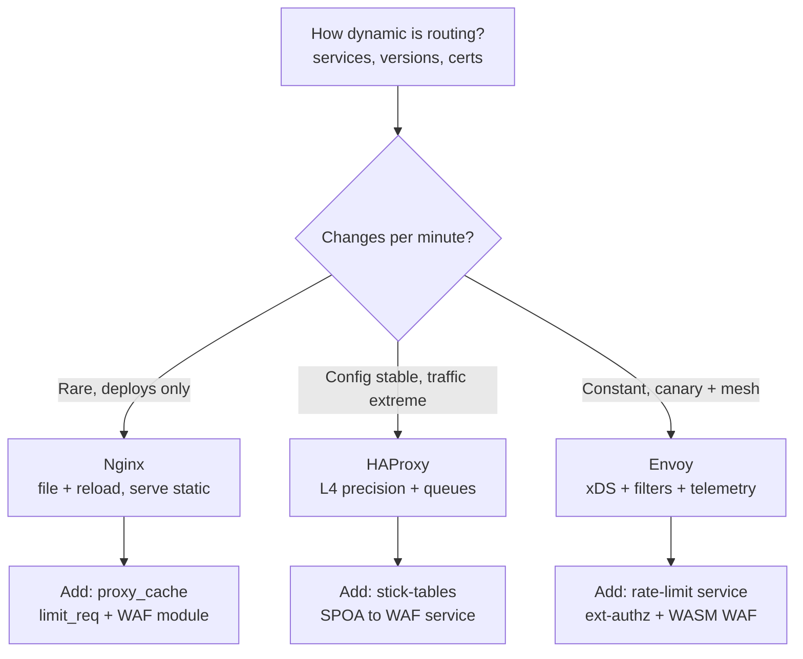
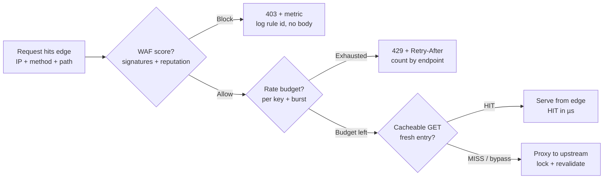
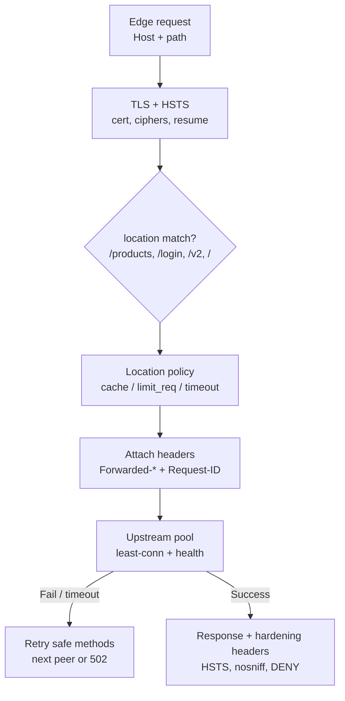

# Reverse proxy

## Theory

A reverse proxy sits in front of backend services and handles incoming client traffic — routing, TLS termination, caching, and load balancing.
It matters because it centralizes cross-cutting concerns (certs, rate limits, auth headers) so backends stay simple.
Key subtopics: forward vs reverse proxies, TLS termination and mTLS (see HAProxy/Nginx), path- and host-based routing, and common choices (Nginx, HAProxy, Envoy).

A reverse proxy is the front door of most production web architectures: clients never dial application servers directly, they dial the proxy, and the proxy decides — based on host, path, headers, and policy — which upstream pool, cache entry, or error page answers. It replaced the early pattern of exposing every app server with its own TLS certificate and ad-hoc access control by centralizing the concerns that are identical across services: terminating TLS once, enforcing rate limits and WAF rules once, caching hot responses once, and emitting uniform access logs once. Backends behind it stay small, speak plain HTTP on private networks, and scale horizontally without clients noticing.

This guide takes you from mental model to production operations. You will learn how forward and reverse proxies differ and why the direction of trust flips between them, how path-based, host-based, and header-based routing compose with load balancing, how TLS termination and mutual TLS work and where private keys should live, how Nginx, HAProxy, and Envoy compare and when to pick each, how caching, rate limiting, and WAF enforcement behave when they run at the proxy layer, and how to read and write a minimal Nginx config with confidence. It closes with threats, best practices, and interview Q&A.

> Scope note: this page covers reverse-proxy architecture and operations for HTTP services — routing, TLS/mTLS termination, Nginx vs HAProxy vs Envoy selection, proxy-layer caching, rate limiting, WAF integration, and a minimal Nginx config — not forward-proxy fleet management or full service-mesh control planes. It assumes basic HTTP and TLS (requests, hosts, certificates) and focuses on the decisions interviewers probe: where termination happens, how routing composes, and what the proxy guarantees.

### Topics Covered

1. [Forward vs Reverse Proxy](#1-forward-vs-reverse-proxy)
2. [Routing, TLS Termination, and mTLS](#2-routing-tls-termination-and-mtls)
3. [Nginx vs HAProxy vs Envoy](#3-nginx-vs-haproxy-vs-envoy)
4. [Caching, Rate Limiting, and WAF at the Proxy](#4-caching-rate-limiting-and-waf-at-the-proxy)
5. [Basic Nginx Config — Explained](#5-basic-nginx-config--explained)
6. [Threats and Mitigations](#6-threats-and-mitigations)
7. [Best Practices](#7-best-practices)
8. [Interview Questions and Answers](#8-interview-questions-and-answers)

### 1. Forward vs Reverse Proxy

A forward proxy serves the client; a reverse proxy serves the server. A forward proxy sits near users and fetches the internet on their behalf — hiding client IPs, enforcing egress policy, and caching shared downloads — so the destination server sees the proxy, not the user. A reverse proxy sits near servers and receives the internet on their behalf — hiding backend topology, enforcing ingress policy, and caching hot responses — so the client sees the proxy, not the fleet. The direction of the arrow determines who configures it, who trusts it, and what it is allowed to see.

Consider the same `GET https://shop.example.com/products` through each. With a forward proxy (corporate egress, school filter), the browser is explicitly configured to send all requests to `proxy.corp:3128`, the proxy checks "is Alice allowed to visit shop.example.com," fetches it, optionally scans the response, and returns it; `shop.example.com` logs the corporate NAT IP. With a reverse proxy, the browser dials `shop.example.com` normally, DNS resolves to the proxy (Nginx/CloudFront/ALB), the proxy checks "is this request allowed into the fleet," picks an upstream (`app-3:8080`), adds `X-Forwarded-For` and `X-Request-ID`, and returns the response; the browser never learns `app-3` exists.

The trust relationship inverts, which is the point interviewers want. A forward proxy is trusted by the client: the enterprise installs a corporate CA on laptops so the proxy can MITM TLS for DLP, and users accept that the proxy sees cleartext because their employer owns both endpoints. A reverse proxy is trusted by the server: the service gives it the private TLS key (or ACM-managed cert) so it can terminate TLS, and clients trust it because it presents the service's public certificate. Swap them and the security story breaks — a reverse proxy must never hold a client's private identity, and a forward proxy must never hold a server's private key beyond its own inspection scope.

| Dimension | Forward proxy | Reverse proxy |
|---|---|---|
| Sits near | Clients (egress) | Servers (ingress) |
| Configured by | Client / IT admin (browser PAC, env vars) | Service owner (DNS points at it) |
| Hides | Client identity and network from origin | Backend topology and count from client |
| Core jobs | Egress allowlisting, auth, DLP scan, shared cache | Routing, TLS termination, load balancing, ingress WAF |
| TLS role | Optionally intercepts with corporate CA (client consented) | Terminates service TLS with service cert (client expected) |
| Sees | All client destinations (privacy-sensitive) | All service traffic (availability-sensitive) |
| Examples | Squid, corporate Zscaler, `HTTP_PROXY` dev proxies | Nginx, HAProxy, Envoy, ALB, Cloudflare, CloudFront |

Use each where its position gives leverage. Forward proxies govern what users and workloads may reach: block malware domains, require SSO before browsing, cache OS updates once for a thousand laptops, log egress for audit. Reverse proxies govern what the world may reach: expose one anycast IP while hundreds of pods churn behind it, absorb slowloris and SYN floods at the edge, retry idempotent GETs on another upstream when one fails, and emit one access-log format every team can query. Most companies run both — Zscaler out, CloudFront/ALB in — and the two never substitute for each other.



*The diagram above shows the mirror symmetry: the forward proxy stands with the client and faces outward, while the reverse proxy stands with the servers and faces inward.*

Placement cements the difference. A forward proxy lives on the client network (office, VPC egress, sidecar for outbound calls) and scales with user count; its failure mode is "nobody can browse," and its bypass risk is a user unsetting `HTTP_PROXY`. A reverse proxy lives on the server network (edge PoP, public subnet, sidecar for inbound calls) and scales with request rate; its failure mode is "nobody can reach the service," and its bypass risk is an attacker dialing an origin IP directly (see Section 6). When an interviewer asks "proxy or reverse proxy," answer with position, principal, and key custody — that triple never misleads.

Operationally the two share tooling but not policy. Both log who asked for what and what the verdict was, both cache (egress caches shared artifacts like package registries; ingress caches hot product pages), and both can inject headers — forward proxies add user identity (`X-Authenticated-User`), reverse proxies add routing context (`X-Forwarded-Proto`, `X-Request-ID`). Keep the configs in separate repos with separate owners: egress policy belongs to IT/security, ingress routing belongs to the service team, and mixing them is how a "temporary debug allow" opens the wrong door.

### 2. Routing, TLS Termination, and mTLS

Routing is the reverse proxy's core promise: inspect each request's host, path, headers, and sometimes body, then deliver it to the right upstream pool with the right rewrite. Path-based routing splits one domain across services — `/api/*` to the API fleet, `/static/*` to object storage, `/` to the storefront — so a single public hostname composes many backends. Host-based (virtual-host) routing splits many domains across one proxy — `api.example.com` to API, `admin.example.com` to the internal console with IP allowlisting, `*.tenants.example.com` to per-tenant pools — so one edge serves a whole portfolio. Header and method rules refine both: mobile `User-Agent` to a lighter backend, `POST /checkout` with stricter timeouts than `GET /images`, canary cookie to the new version for 1% of traffic.

A production routing story usually layers all three. DNS points `shop.example.com` at the proxy; the proxy matches `Host: shop.example.com` to the shop server block, then longest-prefix path rules (`/api/v2/` beats `/api/`) select the upstream, then a header condition (`X-Canary: 1` or a weighted `split_clients` hash) steers a slice to canary, and finally query or method guards reject absurd requests early (`GET` with a 10 MB body never reaches the app). Rewrites normalize before proxying: strip the `/api` prefix the app does not expect, preserve the original URI in `X-Original-URI` for logs, and always set `Host`, `X-Forwarded-Proto`, and `X-Request-ID` so upstreams can build correct redirects and trace requests end to end.

Load balancing rides on top of routing: once a rule selects a pool, the algorithm picks a member. Round-robin spreads evenly and suits stateless APIs; least-connections favors uneven latencies and suits mixed workloads; IP-hash (or consistent hashing) pins sessions and caches and suits sticky carts and sharded state. Health checks make the set dynamic — passive (count failures, eject for N seconds) plus active (probe `/healthz` every 5 s, require 2 successes to rejoin) — so deploys drain gracefully: mark unhealthy, wait for in-flight requests to finish, then terminate. Timeouts bound every hop (`connect 2s`, `read 10s` for APIs, longer for uploads on a separate location) because an unbounded upstream hold is an edge-queueing outage.



*The diagram above shows the routing pipeline: host selects the tenant, path selects the service, headers select the slice, and only healthy members receive traffic.*

TLS termination is the second core job: the proxy holds the service certificate, completes the TLS handshake with the client, and forwards cleartext (or re-encrypted) HTTP to backends. Clients get one strong, centrally managed endpoint — TLS 1.2+, modern ciphers, HSTS, OCSP stapling, session resumption — while apps avoid per-instance key distribution and expensive handshakes. Inside the VPC the proxy opens plain HTTP to upstreams over a private subnet (fast, debuggable) or re-encrypts (TLS to upstream with an internal CA) where compliance demands encryption in transit everywhere. Never terminate and then trust blindly: the proxy must still validate that the upstream certificate matches the expected SAN when re-encrypting, or a compromised subnet can impersonate backends.

Keys and certificates deserve operational respect. Issue via ACM/Let's Encrypt with auto-renewal (alert at 21 and 7 days to expiry), store private keys in the platform's secret store (ACM, Vault, Kubernetes Secrets with encryption at rest — never in git), and prefer ECDSA (P-256) for speed with RSA-2048 where client compatibility demands it. Enable HTTP/2 and keep-alive to both sides (multiplexed clients, reused upstream connections), set `ssl_prefer_server_ciphers` with a vetted Mozilla-intermediate list, and staple OCSP so clients skip a blocking revocation fetch. Rotate without downtime by loading the new cert alongside the old and reloading (Nginx `reload`, Envoy xDS) rather than restarting.

mTLS extends termination to client authentication: the proxy requests a client certificate during the handshake and verifies it against a trusted CA before routing. Service-to-service calls use it so `payments` proves to `ledger` that it really is `payments` (SPIFFE/SPIRE or an internal CA issues short-lived certs, Envoy validates SAN `spiffe://prod/payments`), and privileged human endpoints use it so only laptops with issued certs reach `/admin`. Verification must check expiry, chain, revocation (CRL/OCSP or short TTLs that make revocation moot), and — critically — map the verified SAN to an authorization decision; authentication without an allowlist is just expensive logging. Fail closed: no cert or untrusted cert gets 403, never a downgrade to passwords alone, and log the fingerprint for incident correlation.

### introduction
- [Forward proxy vs reverse proxy](https://www.youtube.com/watch?v=AuINJdBPf8I)
- [Proxy vs reverse proxy vs load balancer (2023) | Explained with real life examples](https://www.youtube.com/watch?v=MiqrArNSxSM)

### 3. Nginx vs HAProxy vs Envoy

All three answer "what sits in front of the app," but they were born for different bottlenecks. Nginx grew up as a high-concurrency web server that learned to proxy: it serves static files, terminates TLS, and routes HTTP with a declarative config every backend engineer can read. HAProxy grew up as a pure load balancer: it moves TCP and HTTP bytes with ruthless efficiency, health-check precision, and failover semantics honed on bare metal. Envoy grew up inside microservices: it assumes config changes every second, every hop needs telemetry, and every call may need retries, circuit breaking, and mTLS without restarts.

Choose by control-plane needs first, data-plane speed second. A single team with a dozen upstreams, Let's Encrypt certs, and mostly static routing wants Nginx: one `nginx.conf`, `reload` on deploy, pages of Stack Overflow for every error. A payments edge pushing 100k TPS with zero-dropped-connection failover and surgical ACLs wants HAProxy: its stick-tables, queue management, and Layer 4 fidelity are still the benchmark for raw TCP balancing. A platform with fifty services, canary by header, per-route retries, and SPIFFE mTLS rotated hourly wants Envoy: its xDS API, filter chain, and native observability (stats, tracing, access logs per route) assume a control plane like Istio or a custom gateway controller drives it.

Performance folklore needs grounding. All three saturate 10 Gbps on modest hardware when tuned (keepalive, epoll, TLS session reuse); the bottleneck is almost always upstream latency, TLS handshake rate, or logging, not proxy choice. Nginx event-driven workers handle tens of thousands of keepalive connections with low memory; HAProxy's single-process event loop squeezes the most requests per core for L4/L7 passthrough; Envoy pays a small per-request tax for its filter richness but repays it with fewer hops — retries, hedging, and load-aware balancing done once at the edge instead of in every SDK. Benchmark your shape (TLS 1.3 handshake storm versus large-file proxying versus chatty gRPC) before trusting generic charts.

| Dimension | Nginx | HAProxy | Envoy |
|---|---|---|---|
| Primary identity | Web server + reverse proxy | TCP/HTTP load balancer | Service-mesh edge + sidecar proxy |
| L4 / L7 | Strong L7 HTTP, good stream TCP/UDP | Best L4 fidelity, excellent L7 HTTP | Full L7 (HTTP/1, HTTP/2, gRPC), good L4 |
| Config model | Static file, `reload` on change | Static file, hitless reload via master-worker | Dynamic xDS API, hot update with no reload |
| Routing expressiveness | `server` + `location` prefix/regex, maps | ACLs + backends, precise but verbose | Routes, virtual hosts, header/query match, traffic shifting |
| Load balancing | Round-robin, least-conn, ip-hash, random | Round-robin, leastconn, source, uri, consistent hash | Round-robin, least-request, ring hash, Maglev, locality-aware |
| Health checking | Passive + basic active (Plus for full) | Rich active TCP/HTTP checks, rise/fall, agent checks | Active + passive, outlier detection, panic mode |
| TLS / mTLS | Mature termination, stapling, session cache | Mature termination, SNI routing, cert storage | Termination + origination, SDS cert rotation, SPIFFE native |
| Observability | Access/error logs, stub_status, Prometheus exporter | Stats socket/page, detailed counters, Prometheus exporter | Native stats, tracing, access-log filters, admin `/stats` |
| Caching / WAF | `proxy_cache`, `limit_req`, ModSecurity/NGINX App Protect | Stick-tables + rate counters, no cache, WAF via SPOA | Local rate limit, RBAC filter, WASM, WAF via external service |
| Ecosystem | Biggest tutorials, OpenResty/Lua, CDN default | Hardware-appliance lineage, ALB heritage | CNCF, Istio/Contour/Gateway API default |
| Pick when | One edge, static routes, serve + proxy together | Max connections, TCP failover, queue control | Dynamic services, canary/mirroring, mesh + edge unified |



*The diagram above shows the selection rule: change velocity picks the proxy, and caching, rate limiting, and WAF attach differently to each.*

Operationally they converge more than marketing suggests. All three must set `X-Forwarded-For`, `X-Forwarded-Proto`, and request IDs consistently, drain on deploy (stop accepting, finish in flight, then exit), and emit one JSON access-log schema your SIEM can parse. All three need the same upstream contract: `/healthz` that reflects real readiness, keepalive-enabled backends, and timeouts that bound slow peers. Migrating is common — Nginx at the edge for TLS and static, HAProxy behind it for TCP queueing, Envoy as sidecars for mesh policy — and the interview-winning answer names which tier does what instead of declaring one global winner.

A concrete migration story clarifies trade-offs. A monolith starts with Nginx: `shop.example.com/` to Rails, `/api/` to Node, static from disk, certbot renewing monthly. Traffic grows 10x with long-lived WebSockets; the team adds HAProxy in front for `balance source` stickiness and queue-aware failover while Nginx keeps routing. Microservices arrive with twenty deploys a day and header-based canary; the platform swaps edge routing to Envoy managed by Gateway API, keeps HAProxy for legacy TCP, and leaves Nginx serving `/static` where `sendfile` still wins. Each layer kept its strength; no rewrite was ideological.

### 4. Caching, Rate Limiting, and WAF at the Proxy

The proxy earns its keep by answering without waking backends, rejecting without spending compute, and blocking known-bad shapes before they become incidents. Caching, rate limiting, and WAF are the same idea at three time scales: reuse yesterday's work, budget today's arrivals, and refuse tomorrow's exploit. Running all three at the edge compounds: a cached product page never touches the app, a throttled scraper never reaches login, and a blocked SQLi probe never appears in app logs.

Caching at the proxy is an HTTP contract, not a hack. The proxy keys on method plus host plus URI (plus `Accept-Encoding` and selected headers), honors `Cache-Control` from upstreams (`max-age`, `s-maxage`, `no-store` for personalized bodies), and serves `HIT` in microseconds while `MISS` populates once with `proxy_lock` so ten concurrent misses do not stampede the DB. Hot, public, versioned objects cache longest — product pages for 60 s, images for hours with fingerprinted filenames, `/api/v1/config` for 30 s — while authenticated or cart responses bypass by default (`Cookie`, `Authorization` present means do not serve shared entries). Stale policies decide failure behavior: `proxy_cache_use_stale` serves last-good during upstream deploys, `stale-while-revalidate` hides refresh latency, and explicit `PURGE` or short TTLs handle invalidation; never cache on URL alone when `Vary: Cookie` changes the bytes.

Rate limiting at the proxy is budgeting before business logic. The algorithm is usually leaky-bucket or fixed-window per key: `10r/s` per IP for APIs, `5r/m` per IP for `/login`, `100r/m` per API key for partners, with `burst` absorbing human clicks and `nodelay` versus delayed choice deciding queue versus 429. Keys matter more than rates: IP alone fails behind carrier NAT (one limit throttles a campus), so combine IP plus path plus method, or prefer authenticated identity (`sub` claim, API key) once past login. Responses must be uniform and cheap — `429` with `Retry-After`, counted in metrics, logged without bodies — and global breakers (edge queue depth, upstream latency) shed lowest-priority traffic first (`GET /search` before `POST /checkout`) when the fleet saturates.

WAF at the proxy is pattern enforcement before parsing. Managed rule sets (OWASP CRS, vendor sets on CloudFront/Cloudflare/ALB) score requests for SQLi, XSS, traversal, RCE, and protocol abuse; anomaly scoring blocks when the sum exceeds threshold rather than on any single regex, which cuts false positives. Deploy in count/log mode first, sample blocks for a week, then carve exclusions narrowly — this rule id, this field, this path — instead of disabling the rule globally because checkout legitimately posts `<` in an address field. The proxy WAF cannot fix broken auth or IDOR (it sees shapes, not ownership), so pair it with app-layer checks; its job is to delete the noise class — scanners, script-kiddie payloads, known CVEs — so app CPU and analyst attention spend on real logic.

| Control | What it keys on | Good defaults | Failure smell |
|---|---|---|---|
| Cache | `GET` + host + URI + encoding + vary headers | Public 30–60 s, static hours, `use_stale` on error | Private bodies cached, no `Vary`, stampede on miss |
| Rate limit | IP + path + method, then identity/key | API 10r/s, login 5r/m, burst 2x, `Retry-After` | IP-only behind NAT, no burst, 429 without metric |
| WAF | Signatures + anomaly score + reputation | Count first, narrow exclusions, block on score | Global disable, unreviewed exclusions, app relies on WAF for authz |
| Headers/size | Type, length, content-type | `2–10m` body cap, `nosniff`, `DENY` framing | Unbounded uploads, sniffable MIME, framed checkout |



*The diagram above shows the edge order that minimizes cost: block known-bad first, budget abusers second, serve cached third, and proxy only the remainder.*

Together they define edge SLOs you can alert on. Cache hit ratio per location (drop means deploy cleared keys or personalization leaked into shared entries), 429 rate per endpoint (spike means stuffing or a too-tight limit), WAF block rate per rule (spike means new scanner or false positive), and origin offload (bytes not fetched because the edge answered) tell one story: is the edge absorbing load or passing it through. Tune weekly from these four graphs, not from anecdotes, and every tuning change ships as a reviewed config diff with a rollback window.

### 5. Basic Nginx Config — Explained

Reading Nginx is reading three nested contexts: `events` and `http` set global behavior, `upstream` names backend pools, and `server` plus `location` route and enforce per path. The minimal production edge below terminates TLS, routes shop versus API, caches public GETs, budgets login, and proxies everything else with safe headers and bounded timeouts.

```nginx
# Minimal production edge: TLS once, route by host+path, cache public, budget login.
worker_processes auto;
events { worker_connections 4096; }

http {
  # Upstream pools: names the proxy can balance across with keepalive reuse.
  upstream shop_api {
    least_conn;                    # uneven latencies: send to least-loaded member
    server app-1:8080 max_fails=3 fail_timeout=30s;
    server app-2:8080 max_fails=3 fail_timeout=30s;
    keepalive 64;                  # reused upstream connections cut handshake cost
  }
  upstream storefront {
    server web-1:3000 max_fails=2 fail_timeout=15s;
    server web-2:3000 max_fails=2 fail_timeout=15s;
    keepalive 32;
  }

  # Shared memory zones: cache for GETs, budgets for rate limits.
  proxy_cache_path /var/cache/nginx levels=1:2 keys_zone=edge_cache:50m
                   max_size=5g inactive=60m use_temp_path=off;
  limit_req_zone $binary_remote_addr zone=login:10m rate=5r/m;
  limit_req_zone $binary_remote_addr zone=api:10m rate=10r/s;

  # Global hardening: hide version, cap bodies, log in JSON with trace IDs.
  server_tokens off;
  log_format edge_json escape=json
    '{ "time": "$time_iso8601", "req_id": "$request_id", "ip": "$remote_addr",'
    ' "host": "$host", "method": "$request_method", "uri": "$request_uri",'
    ' "status": $status, "upstream": "$upstream_addr", "cache": "$upstream_cache_status" }';

  # HTTP only redirects: never serve content on port 80.
  server {
    listen 80;
    server_name shop.example.com api.example.com;
    return 301 https://$host$request_uri;
  }

  # Main TLS edge for the shop hostname.
  server {
    listen 443 ssl http2;
    server_name shop.example.com;
    access_log /var/log/nginx/shop.access.log edge_json;

    ssl_certificate     /etc/nginx/certs/shop.example.com.fullchain.pem;
    ssl_certificate_key /etc/nginx/certs/shop.example.com.key;
    ssl_protocols TLSv1.2 TLSv1.3;
    ssl_prefer_server_ciphers on;
    ssl_session_cache shared:SSL:20m;
    ssl_session_timeout 1d;
    add_header Strict-Transport-Security "max-age=31536000; includeSubDomains" always;

    client_max_body_size 2m;       # reject oversized bodies before parsing
    add_header X-Content-Type-Options nosniff always;
    add_header X-Frame-Options DENY always;

    # Public product pages: cached 60s, stale served when upstreams deploy.
    location /products/ {
      proxy_cache edge_cache;
      proxy_cache_valid 200 60s;
      proxy_cache_use_stale error timeout updating;
      proxy_cache_lock on;         # one miss populates, rest wait (no stampede)
      add_header X-Cache-Status $upstream_cache_status always;
      proxy_pass http://storefront;
      include proxy_headers.conf;  # Host, X-Forwarded-*, X-Request-ID
    }

    # Login: tight budget before the app spends anything on password hashes.
    location /login {
      limit_req zone=login burst=5 nodelay;
      proxy_connect_timeout 2s;
      proxy_read_timeout 10s;
      proxy_pass http://shop_api;
      include proxy_headers.conf;
    }

    # Default: longest-prefix fallback to the storefront pool.
    location / {
      proxy_connect_timeout 2s;
      proxy_read_timeout 10s;
      proxy_next_upstream error timeout http_502;  # retry idempotent misses once
      proxy_pass http://storefront;
      include proxy_headers.conf;
    }
  }

  # API hostname: stricter timeouts, higher rate budget, no cache by default.
  server {
    listen 443 ssl http2;
    server_name api.example.com;
    access_log /var/log/nginx/api.access.log edge_json;

    ssl_certificate     /etc/nginx/certs/api.example.com.fullchain.pem;
    ssl_certificate_key /etc/nginx/certs/api.example.com.key;
    ssl_protocols TLSv1.2 TLSv1.3;
    ssl_prefer_server_ciphers on;

    client_max_body_size 1m;

    location /v2/ {
      limit_req zone=api burst=20 nodelay;
      proxy_connect_timeout 2s;
      proxy_read_timeout 10s;
      proxy_pass http://shop_api;
      include proxy_headers.conf;
    }
  }
}
```

The snippet above is explained block by block. The `upstream` blocks decouple names from IPs so deploys change members without touching routing: `least_conn` suits mixed-latency APIs, `max_fails` plus `fail_timeout` passively ejects sick peers, and `keepalive` reuses upstream TCP and TLS sessions instead of paying a handshake per request. Shared zones size the edge state explicitly — 50 MB of cache keys with a 5 GB body cap, 10 MB per rate-limit zone for roughly 160k tracked IPs — so memory is budgeted, not accidental. Global directives set the posture every server inherits: no version banner, JSON logs with request ID and cache status for tracing, and a port-80 server whose only job is upgrading to HTTPS.

The `proxy_headers.conf` include referenced above is small but load-bearing, so treat it as required rather than optional:

```nginx
# proxy_headers.conf: identity and trace context every upstream can rely on.
proxy_http_version 1.1;
proxy_set_header Connection "";              # allow upstream keepalive
proxy_set_header Host $host;                 # preserve original host for redirects
proxy_set_header X-Real-IP $remote_addr;
proxy_set_header X-Forwarded-For $proxy_add_x_forwarded_for;
proxy_set_header X-Forwarded-Proto $scheme;
proxy_set_header X-Request-ID $request_id;   # trace ID generated once at edge
proxy_set_header X-Original-URI $request_uri;
```

The headers include is explained as the contract with backends. Upstreams never trust socket IPs directly because only the proxy sees the client; they read `X-Forwarded-For` for the client chain and `X-Forwarded-Proto` to build `https://` redirects behind TLS termination. `X-Request-ID` generated once at the edge joins proxy, app, and DB logs for one trace, while `X-Original-URI` preserves the pre-rewrite path for audit. Backends must be configured to trust these headers only from the proxy's security group, never from arbitrary clients, or header spoofing bypasses IP logic.

Timeouts and retries deserve a final note because they decide outage shape. `proxy_connect_timeout 2s` bounds dead-peer waits, `proxy_read_timeout 10s` bounds slow-app holds, and `proxy_next_upstream` retries only safe outcomes (errors, timeouts, 502s) so `POST /charge` is never double-submitted by default; mark non-idempotent locations with `proxy_next_upstream off` or `non_idempotent` explicitly. Validate with `nginx -t` before every `reload`, roll the config as a reviewed diff, and canary the reload on one edge node while watching 5xx and p99 before fleet-wide rollout.



*The diagram above shows one request through the sample config: terminate, match location, apply that path's policy, attach identity headers, and balance across healthy upstreams.*

### 6. Threats and Mitigations

The proxy is the most exposed component you operate: it parses hostile bytes first, holds private keys, and decides what reaches the app. Threat-model it as an attacker would — direct origin bypass, header lies, cache poisoning, budget exhaustion, and config mistakes — and answer each with an edge control plus an inward layer, because the edge narrows but never decides identity alone.

| Threat | How it works | Proxy mitigation | Inward layer that still holds |
|---|---|---|---|
| Origin bypass (direct-to-IP) | Attacker resolves origin IP and dials app, skipping WAF and limits | Security group allows only proxy to app; app validates expected `Host`, drops unknown hosts with 444 | App-layer auth on every route regardless of source network |
| TLS downgrade / weak ciphers | Attacker forces TLS 1.0 or export cipher, then decrypts or injects | TLS 1.2+ only, vetted cipher list, HSTS with preload, no port-80 content | Certificate Transparency monitoring plus expiry and config alerts |
| Stolen or expired cert / leaked key | Key in git or image, renewal missed, outage or impersonation | ACM or certbot auto-renewal, keys in secret store, alert at 21 and 7 days, reload not restart | Rotation runbook rehearsed; revoke and reissue on any suspected leak |
| Header spoofing (`X-Forwarded-For`) | Client sends fake forwarded headers to fake IP or proto | Proxy overwrites (never appends blindly) these headers; backends trust them only from proxy SG | App reads IP from socket or verified header chain, never raw client input |
| Cache poisoning / deception | Attacker crafts `Host` or `X-Forwarded-Host` variant that caches evil bytes for victims | Normalize and allowlist `Host`, cache key includes host plus encoding, never cache with `Authorization` or `Cookie` present | Upstream emits correct `Cache-Control` and `Vary`; purge path authenticated |
| Rate-limit bypass (NAT, rotation) | Botnet spreads guesses across IPs, or one campus shares one IP unfairly | Key on identity plus path once logged in, per-endpoint zones, global queue-depth breaker, CAPTCHA or proof-of-work on login burst | App-level per-account throttling and lockout survive any edge miss |
| Slowloris / slow-read drain | Many slow connections hold workers with partial requests | `client_header_timeout`, `client_body_timeout`, connection caps, edge absorbs before app | Autoscale plus LB queue limits; app never holds unbounded uploads in memory |
| Request smuggling / desync | Ambiguous `Content-Length` versus `Transfer-Encoding` splits chained proxies | Reject ambiguous framing, normalize at one tier, keep proxy and app parser versions aligned | App framework with strict parser; integration test for smuggle vectors on upgrade |
| WAF bypass via encoding | Double-encoding, unicode, or chunked tricks slip past one regex | Anomaly scoring over single signatures, canonicalize before inspect, update CRS sets monthly | Parameterized queries and output encoding make bypass payloads inert anyway |
| SSRF via open proxy / rewrite | Crafted path or redirect makes the proxy fetch metadata or intranet | No user-controlled upstream host, egress deny to `169.254.169.254`, allowlisted fetch domains, short fetch timeouts | Instance metadata IMDSv2 with hop limit 1; app URL validation independent of proxy |
| mTLS misconfig (fail-open) | Missing client cert falls through to password-only or anonymous path | `ssl_verify_client on` with `fail closed`, SAN-to-role allowlist map, 403 on unverified with fingerprint log | Service allowlist re-checked at app; short-lived SPIFFE certs limit replay window |
| Config drift / overly broad location | Regex location shadows auth, debug endpoint left public, `autoindex` on | Least-privilege locations first,deny unknown hosts, `server_tokens off`, review every diff, `nginx -T` audited | Firewall default-deny plus staging WAF count mode catches exposure before prod |

Two scenarios show how to narrate the table in interviews. First, origin bypass with cache poisoning chained: the attacker finds the ALB origin via certificate transparency, dials it directly with a poisoned `X-Forwarded-Host`, and the app builds password-reset links from that header while the direct path skips WAF. Answer in one breath — lock the security group to the proxy, reject unknown hosts at the edge with logging, build absolute URLs from configured canonical hosts, and key cache on normalized host — plus detection: alert on direct-origin connection attempts and on `Host` mismatches. Second, login stuffing through rotation: 100k IPs try two passwords each, staying under per-IP limits. Answer with layered budgets — per-IP edge limit plus per-account app throttle plus global login queue with CAPTCHA challenge — and detection on 401 bursts per account and 429 geography shifts, not on any single IP.

### 7. Best Practices

1. **Terminate once, at the edge, and re-encrypt only where compliance demands.** One managed certificate, TLS 1.2+ with vetted ciphers, HSTS, stapling, and session reuse at the proxy; plain HTTP to upstreams over private subnets by default, or internal-CA TLS with SAN verification where regulators require encryption in transit everywhere. Never terminate and forward to an unauthenticated upstream hostname an attacker can claim.
2. **Lock origins so the proxy is the only door.** Security groups, firewall rules, and app `Host` allowlists accept traffic solely from proxy subnets or security-group IDs; everything else gets connection-refused or 444 with a metric. Probe this monthly by dialing origin IPs directly from outside and confirming rejection, because every bypass finding starts with "we assumed nobody knew the IP."
3. **Route explicit, rewrite minimal, headers consistent.** Longest-prefix locations with documented precedence, rewrites that preserve `X-Original-URI`, and the same `X-Forwarded-*` plus `X-Request-ID` set on every location. Backends code against that contract (proto for redirects, trace ID for logs) instead of sniffing sockets, and new routes inherit it via include rather than copy-paste.
4. **Budget before business logic on every expensive path.** Per-IP edge limits on login, signup, search, and export; per-identity or per-key limits once authenticated; global breakers that shed low-priority GETs before checkout. Every 429 carries `Retry-After`, a counter, and a dashboard, and every limit change ships with a before/after graph of 429 rate and p99.
5. **Cache public, bypass private, purge deliberately.** Cache keys include host plus URI plus encoding plus `Vary` dimensions; `Cookie` or `Authorization` bypasses shared entries; `proxy_cache_lock` prevents stampedes and `use_stale` covers deploys. TTLs live in upstream `Cache-Control` (30–60 s for pages, hours for fingerprinted static), and purge is authenticated, logged, and rate-limited — never a public `PURGE` method.
6. **Run WAF in count first, exclude narrow, never disable broad.** Ship new managed rules in log mode, sample a week of verdicts, then block with exclusions scoped to rule id plus field plus path. Record each exclusion with owner and expiry, re-test checkout and webhook suites after every change, and alert on block-rate spikes per rule so false positives page before customers report them.
7. **Verify upstreams both ways: health out, identity back.** Active `/healthz` probes with rise/fall thresholds plus passive ejection, graceful drain on deploy (unhealthy, finish in flight, terminate), and — where re-encrypting — proxy-side verification of upstream SAN against an expected name. For service-to-service, terminate mTLS at the sidecar or edge with SAN-to-role mapping, short-lived certs, and fingerprint logs, failing closed on missing or untrusted certs.
8. **Make edge config reviewable, testable, and observable.** Every change is a diff with `nginx -t` plus staging replay (checkout, login burst, cache HIT/MISS, WAF sample) before fleet reload; JSON access logs carry trace ID, upstream, and cache status into one SIEM schema; dashboards track hit ratio, 429 rate, WAF blocks, cert expiry, and origin 5xx together. Roll back by reverting one diff and reloading — measured in seconds, not postmortems.

### 8. Interview Questions and Answers

**Q1 (Beginner): Forward proxy versus reverse proxy — who configures each, and who trusts it?**
The client configures the forward proxy (browser PAC, `HTTP_PROXY`) and trusts it with destinations, while the service owner configures the reverse proxy (DNS points at it) and trusts it with the private key. Forward hides clients from origins for egress policy; reverse hides backends from clients for ingress routing, TLS, and load balancing. Name position, principal, and key custody and the answer is complete.

**Q2 (Beginner): Where should TLS terminate, and what travels behind it?**
Terminate once at the reverse proxy so certs, ciphers, HSTS, and stapling are managed in one place with auto-renewal. Behind it, plain HTTP over a private subnet is the default for speed and debuggability, or re-encrypted TLS to upstreams with SAN verification where compliance requires encryption everywhere. Either way the proxy sets `X-Forwarded-Proto` so apps build correct redirects, and origins accept only proxy traffic.

**Q3 (Beginner): Path-based versus host-based routing — when is each right?**
Path-based splits one hostname across services (`/api/*` to API, `/static/*` to storage) and suits a single product composed of many backends. Host-based splits many hostnames across one edge (`api.` to API, `admin.` with IP allowlisting, `*.tenants.` per tenant) and suits platforms and multi-tenancy. Production uses both — host selects the tenant, longest path prefix selects the service, headers select the slice — with rewrites that preserve the original URI for logs.

**Q4 (Intermediate): Nginx versus HAProxy versus Envoy — how do you pick?**
Pick by change velocity and tier: Nginx for a stable edge that also serves static with a readable file plus reload, HAProxy for extreme-connection TCP/HTTP balancing with precise health and queue control, Envoy for constantly changing microservice routing with xDS, per-route retries, and native mTLS plus telemetry. All three saturate links when tuned, so benchmark your shape and consider stacking them — Nginx or Envoy at the edge, HAProxy for legacy TCP, Envoy sidecars for mesh — instead of declaring one winner.

**Q5 (Intermediate): How do caching, rate limiting, and WAF compose at the edge, and in what order?**
WAF first to drop known-bad shapes before they cost compute, rate limiting second to budget abusers with 429 plus `Retry-After`, caching third to serve public GETs in microseconds, proxying only the remainder. Cache keys on host plus URI plus encoding with private bypass and stampede lock; limits key on IP plus path then identity with burst; WAF scores anomalies with narrow exclusions. Dashboards on hit ratio, 429 rate, and block rate prove the edge is absorbing load.

**Q6 (Intermediate): Walk me through this Nginx config's request path for `GET shop.example.com/products/42`.**
Port 80 upgrades to 443, the `shop.example.com` server block terminates TLS with HSTS, the `/products/` location applies cache-plus-timeout policy, headers (`Host`, `X-Forwarded-*`, `X-Request-ID`) attach from the shared include, and `least_conn` picks a healthy `storefront` member with keepalive reuse. On HIT the edge answers directly with `X-Cache-Status: HIT`; on MISS one request populates under `proxy_cache_lock` while upstreams stay bounded by 2 s connect and 10 s read timeouts, retrying only safe errors.

**Q7 (Intermediate): How do you stop attackers from bypassing the proxy and hitting origins directly?**
Layer three controls: network (security groups allow only proxy subnets to app ports), edge (unknown `Host` gets 444 with logging), and app (auth runs on every route regardless of source). Verify by dialing origin IPs externally each month and alerting on direct-hit attempts. The same lockdown plus header-overwrite discipline (proxy sets forwarded headers, backends trust them only from the proxy) also defeats `X-Forwarded-For` spoofing.

**Q8 (Senior): Design mTLS for service-to-service calls behind the proxy.**
Issue short-lived SPIFFE or internal-CA certs per workload, terminate and verify at Envoy sidecars or the edge with SDS rotation, and check expiry, chain, revocation (or short TTLs), then map the verified SAN to a role allowlist — authentication alone never authorizes. Fail closed with 403 plus fingerprint logging, keep human `/admin` on client-certs plus SSO rather than certs alone, and rehearse rotation so reissue is a reload, not an outage.

**Q9 (Senior): Cache hit ratio collapsed after a deploy and origins are melting — what do you do?**
Check what changed the key space first: new query strings, missing `Cache-Control`, or personalization leaking `Cookie` into shared entries. Serve `stale` while diagnosing (`proxy_cache_use_stale updating`), confirm `proxy_cache_lock` is on to stop stampedes, and roll back the header or key change behind the flag. Longer term, version static filenames with fingerprints, set `s-maxage` from the app, and alert on hit-ratio drop per location so the next deploy pages before origins saturate.

**Q10 (Senior): Login stuffing is spread across 100k IPs, each under the per-IP limit — how does the edge still help?**
Per-IP limits alone cannot see the campaign, so add per-account throttling at the app (N failures per account per hour with lockout or challenge), a global login-queue breaker at the edge that CAPTCHAs or proof-of-works bursts, and anomaly detection on 401 bursts per account plus 429 geography shifts. Keep the edge login budget tight (5r/m with burst 5) and forward only surviving attempts with trace IDs, so the app's account-level control and audit log finish what the edge started.


