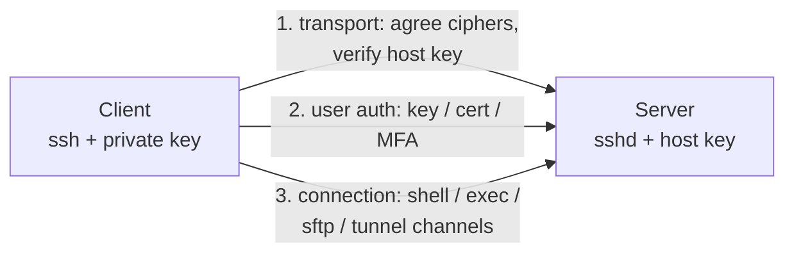
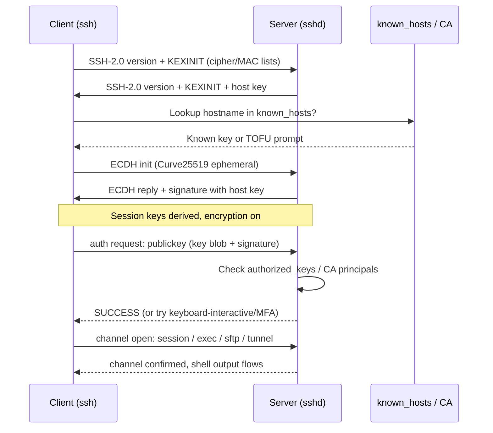
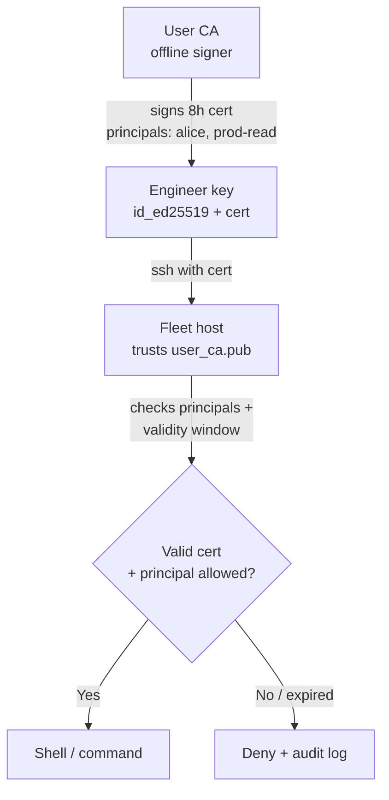
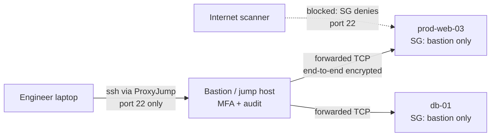
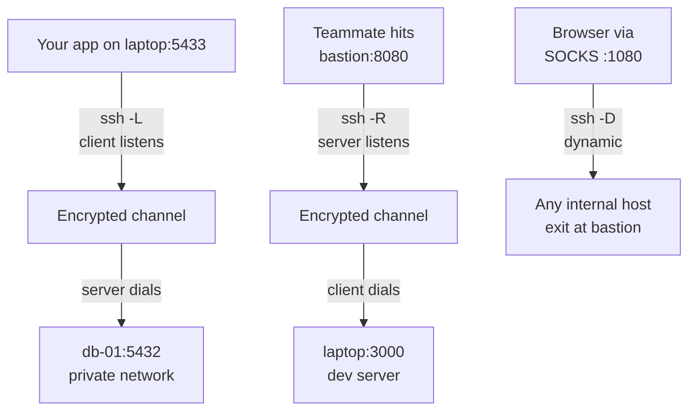

# SSH into Remote Server

## Theory

SSH provides encrypted remote shell access and tunneling, authenticating hosts via host keys and users via passwords or (preferably) key pairs.
It matters because it is the primary administrative entry point to servers — so key hygiene and hardening decide your blast radius.
Key subtopics: key-based auth and `authorized_keys`, known-hosts verification, bastion hosts, agent forwarding risks, and basic `sshd` hardening.

SSH (Secure Shell, RFC 4251-4254) is the ubiquitous protocol for encrypted remote administration, file transfer, and tunneling over untrusted networks. It replaced Telnet, rsh, and FTP-era cleartext administration by multiplexing authentication, confidentiality, and integrity into a single TCP connection — typically port 22 — that sets up a confidential channel first and only then proves who is on either end.

This guide takes you from mental model to production operations. You will learn what SSH guarantees (and what it does not), how the handshake splits into transport, host authentication, and user authentication, how to manage ed25519 keys at team scale with rotation and CA-signed certificates, how to harden `sshd_config` and front fleets with bastion hosts, how local, remote, and dynamic tunnels work, and how attackers abuse weak keys, forwarding, and exposed daemons. It closes with threats, best practices, and interview Q&A.

> Scope note: this page covers OpenSSH client and server operations for Linux fleets — key auth, host verification, hardening, and tunneling — not SSH protocol cryptography internals or file-transfer products. It assumes basic Linux and networking (TCP, ports, public-key crypto) and focuses on the decisions interviewers probe: keys vs passwords, known-hosts, bastions, and forwarding risks.

### Topics Covered

1. [What is SSH and Why It Matters](#1-what-is-ssh-and-why-it-matters)
2. [Handshake and Host and User Authentication](#2-handshake-and-host-and-user-authentication)
3. [Key Management: ed25519, Rotation, and CA-Signed Keys](#3-key-management-ed25519-rotation-and-ca-signed-keys)
4. [Hardening sshd and Bastion Hosts](#4-hardening-sshd-and-bastion-hosts)
5. [Tunnels and Port Forwarding](#5-tunnels-and-port-forwarding)
6. [Threats and Mitigations](#6-threats-and-mitigations)
7. [Best Practices](#7-best-practices)
8. [Interview Questions and Answers](#8-interview-questions-and-answers)

### 1. What is SSH and Why It Matters

SSH is a cryptographic network protocol that gives you an authenticated, encrypted, integrity-protected shell (and more) over an insecure network. When you run `ssh alice@prod-web-03`, three promises kick in: nobody on the path can read the session (confidentiality via negotiated symmetric ciphers), nobody can silently tamper with it (integrity via MACs/AEAD), and you know which machine you reached and it knows which account you claim (mutual authentication split across host keys and user credentials).

Consider life without it. Telnet sends the password in cleartext; anyone on the coffee-shop Wi-Fi, a compromised switch, or a tap runs `tcpdump` and owns the box. Password-over-TLS web consoles help for one app but do not give you a shell, port forwarding, file copy, or multiplexed channels. SSH collapses all of that into one daemon (`sshd`) and one key story, which is why every cloud VM, CI runner, and network appliance exposes it — and why it is the highest-value target on your network.

The benefits compound at fleet scale:

- **One encrypted administrative plane.** Shell, `scp`/`sftp`, `rsync -e ssh`, Git-over-SSH, Ansible, and tunnels all ride the same authenticated channel instead of each inventing its own encryption.
- **Key-based identity that outlives passwords.** A 256-bit ed25519 private key never traverses the wire, never expires on a sticky note, and is cheap to rotate per engineer versus shared root passwords.
- **Mutual authentication by default.** Host keys stop man-in-the-middle impostors; user keys (or certificates) stop credential stuffing — provided you verify both sides instead of clicking through warnings.
- **Built-in least-privilege primitives.** Forced commands, `authorized_keys` options (`command=`, `from=`, `no-agent-forwarding`), principals, and bastions let you say "this key may only run backups from this IP" rather than "this key is root everywhere."

SSH works best as the interactive and automation entry point to machines you own: EC2 fleets, on-prem racks, jump boxes, and emergency break-glass when SSO or VPN is down. It works poorly as an application transport for end users (use TLS + OAuth there), as a VPN replacement for whole networks (use WireGuard/IPsec), or as a secrets-distribution system (use a secrets manager — stuffing secrets through tunnels does not audit them).

The protocol comes in two major versions you must not confuse. SSH-1 (mid-1990s) had CRC-based integrity and MITM weaknesses and is long dead; every modern system speaks SSH-2, the IETF-standardized suite in RFC 4251 (architecture), 4252 (user auth), 4253 (transport), and 4254 (connection). When an interviewer asks "which version," the answer is always "SSH-2 / OpenSSH, SSH-1 disabled" — and the `sshd_config` below enforces exactly that.



*The diagram above shows the three SSH-2 layers: transport builds the encrypted channel and verifies the host, user auth proves the account, and connection multiplexes shell and tunnel channels over it.*

A connection carries all of this over one TCP stream. After the version-string exchange (`SSH-2.0-OpenSSH_9.x`), transport negotiates key exchange (Curve25519), host-key algorithm (ed25519/ECDSA/RSA), cipher (ChaCha20-Poly1305 or AES-GCM), and MAC, derives session keys, and verifies the server's host key against `~/.ssh/known_hosts`. Only then does user authentication run — publickey, password, keyboard-interactive (PAM/MFA), or GSSAPI — inside the encrypted channel so credentials never leak. Finally the connection layer opens parallel channels (session, `exec`, `sftp`, `direct-tcpip` for forwarding) without new handshakes, which is why one `ssh -L` can carry a shell plus three tunnels at once.

Sessions deserve explicit attention because interviewers probe them. A single authenticated connection multiplexes many logical channels, each with flow control and exit status. `ControlMaster`/`ControlPersist` reuses one authenticated connection for many commands (`ssh -O` multiplexing), which speeds Ansible dramatically. Idle timeouts, `ClientAliveInterval`, and channel close semantics decide whether a dropped laptop lid leaves ghost sessions holding ports — Section 4 tunes them.

### 2. Handshake and Host and User Authentication

The handshake has three phases, and keeping them straight answers half of all SSH interview questions: transport (private channel + server identity), user auth (client identity), and connection (what you do with it). Mixing up host auth and user auth is the classic junior mistake — the server proves itself first, then you prove yourself.

**Phase 1 — Transport and host authentication.** Client and server exchange version strings, negotiate algorithms via `KEXINIT` lists, run elliptic-curve Diffie-Hellman (typically `curve25519-sha256`) to derive a shared secret, and the server signs the exchange hash with its host private key. The client checks that signature against its `known_hosts` entry for that hostname. A match means "same machine as last time"; a mismatch means possible MITM or a rebuilt host, and OpenSSH fails closed with `WARNING: REMOTE HOST IDENTIFICATION HAS CHANGED`. First-connect prompts (`Are you sure you want to continue connecting (yes/no)?`) embody trust-on-first-use (TOFU): convenient for one box, dangerous for fleets unless you pre-seed host keys via DNS SSHFP records or configuration management.

**Phase 2 — User authentication.** Inside the encrypted channel, the client offers one or more methods in server-preferred order. `publickey` dominates: the server checks whether the offered public key is listed for the target account (`authorized_keys` or a CA principal), sends a challenge bound to the session id, and the client signs it with the private key that never leaves the laptop or agent. Fallbacks include `password` (encrypted but phishable and brute-forceable), `keyboard-interactive` (the PAM hook where TOTP/MFA like `AuthenticationMethods publickey,keyboard-interactive` lives), and `hostbased`/`GSSAPI` (rare, Kerberos shops). Servers should try methods in least-to-most-privilege order and log every attempt verbosely enough to spot spraying.

**Phase 3 — Connection and channels.** The authenticated client requests services: `session` (shell/exec), `sftp`, or `direct-tcpip` / `forwarded-tcpip` for tunnels. Each channel is separately flow-controlled and can carry environment, signals, exit codes, and X11/agent-forwarding requests. This layering is why disabling `PasswordAuthentication` does not break `sftp` (same auth, different channel) and why `MaxSessions` throttles channels per connection rather than connections per host.



*The sequence above shows host authentication (transport) completing before user authentication, with encryption switched on in between so credentials never travel in cleartext.*

Host-key verification has three operational flavors. Plain `known_hosts` entries (`hostname ssh-ed25519 AAAA...`) suit individuals; `HashKnownHosts yes` obscures hostnames if the file leaks. DNS SSHFP records publish host fingerprints in DNSSEC-signed zones so fresh clients verify without TOFU (`VerifyHostKeyDNS yes`). At scale, teams distribute a global `known_hosts` via Ansible/Puppet or skip per-host TOFU entirely with host certificates (Section 3): the client trusts the CA once, and every host presents a short-lived cert instead.

User-auth methods compare as follows. Public-key auth never sends the secret, survives server-database leaks (the server stores public halves), and composes with per-key restrictions — it is the default for humans and automation. Password auth is simple and universal but invites brute force, reuse, and spraying; keep it off on internet-facing daemons. Keyboard-interactive via PAM adds TOTP or Duo MFA on top of keys (`publickey` then `keyboard-interactive`), which is the right answer when an interviewer asks "how do you add MFA to SSH?" Certificate auth (OpenSSH certs, Section 3) replaces `authorized_keys` distribution with CA-signed, expiring, principal-scoped credentials — the fleet-grade answer. Never enable `PermitEmptyPasswords`, `ChallengeResponseAuthentication` without MFA backend, or `.rhosts`/hostbased trust; they trade a small convenience for a large impersonation surface.

### 3. Key Management: ed25519, Rotation, and CA-Signed Keys

Key management is where SSH security is won or lost. The cryptography is sound; incidents come from keys that never rotate, shared private keys on five laptops, `authorized_keys` files nobody audits, and agents forwarding to compromised hops. A production key story covers generation, storage, distribution, rotation, and revocation — not just `ssh-keygen`.

**Generate ed25519 by default.** Ed25519 gives 128-bit security in 32-byte keys that sign fast and avoid RSA padding pitfalls. Every new key should be ed25519 unless FIPS or legacy hardware forces RSA-3072+ or ECDSA:

```bash
# Generate a modern key: ed25519, strong KDF rounds, clear comment.
ssh-keygen -t ed25519 -a 100 -f ~/.ssh/id_ed25519_prod -C "alice@corp-2026-08"

# Inspect the public half (this is what gets distributed, never the private file).
cat ~/.ssh/id_ed25519_prod.pub
# ssh-ed25519 AAAAC3NzaC1lZDI1NTE5AAAAI... alice@corp-2026-08

# Restrict private-key permissions or sshd/ssh will refuse to use it.
chmod 600 ~/.ssh/id_ed25519_prod
chmod 644 ~/.ssh/id_ed25519_prod.pub
chmod 700 ~/.ssh
```

The commands are explained flag by flag. `-t ed25519` selects the Edwards-curve signature scheme (small, fast, side-channel-resistant). `-a 100` raises the bcrypt KDF rounds protecting the passphrase-encrypted private key, slowing offline guessing if the laptop is stolen. `-C` embeds an owner-and-date comment so `authorized_keys` audits can tell `alice@corp-2026-08` from a 2019 intern key. The `chmod` lines enforce OpenSSH's `StrictModes` expectations: group- or world-writable private keys and `~/.ssh` directories are rejected because another local user could have swapped them.

Protect the private half with a passphrase plus a platform keychain (`ssh-add --apple-use-keychain`, GNOME Keyring, or 1Password agent), and prefer hardware-backed storage for privileged roles: FIDO2 resident keys (`ssh-keygen -t ed25519-sk`) or PIV smartcards keep the secret off disk entirely and require a touch per use. Automation keys (CI deploy, backup) get no passphrase but compensating controls instead: dedicated service account, forced command, source-IP restriction, and short validity if certificates are available. Never reuse one keypair across human login, CI, and vendor access — compromise of any context becomes compromise of all.

**Distribute via `authorized_keys` with least privilege.** The server-side file `~/.ssh/authorized_keys` lists one public key per line, optionally prefixed with restrictions:

```bash
# Least-privilege entries: restrict source, disable forwarding, force a command.
from="10.0.0.0/8",no-agent-forwarding,no-X11-forwarding ssh-ed25519 AAAAC3... alice@corp-2026-08
command="/usr/local/bin/run-backup.sh",no-pty,no-port-forwarding ssh-ed25519 AAAAC3... backup-ci-2026
```

The options are explained left to right. `from=` binds the key to an expected network (bastion subnet or CI egress IPs) so a leaked public-half match cannot log in from anywhere. `no-agent-forwarding` and `no-port-forwarding` strip tunnel capabilities from keys that only need a shell or a single command. `command=` forces execution of one binary regardless of what the client requests, turning a full shell key into a single-purpose credential — ideal for backups, Git serving, or deploy hooks. `no-pty` blocks interactive shells for non-interactive keys. Audit these files centrally: a cron or Ansible task that reports unknown key fingerprints per host catches the "ex-employee key still on prod-web-03" class.

**Rotate on a schedule and on events.** Rotation means generating a new pair, deploying the new public half, verifying login, then removing the old public half — overlapping both briefly so nobody is locked out. Good triggers are calendar (every 90-180 days for human keys, shorter for automation), role change, laptop loss, teammate departure (remove their halves fleet-wide), and any suspected compromise. Keep a key inventory (owner, fingerprint via `ssh-keygen -lf`, hosts, expiry) so rotation is a query, not an archaeology dig. For shared service keys, rotate by swapping the secret in the secrets manager and redeploying, never by emailing the private key around.

**Scale with CA-signed certificates.** `authorized_keys` distribution is O(engineers x hosts) toil: every joiner touches every host. OpenSSH certificates flip this to O(1) trust — hosts trust the user CA once, users fetch short-lived certs, and no per-host key pushing remains:

```bash
# 1. One-time: create the user CA (kept offline / in a signer service).
ssh-keygen -f user_ca -C "corp user CA 2026"   # produces user_ca + user_ca.pub

# 2. Deploy trust once per host via sshd_config (see Section 4):
# TrustedUserCAKeys /etc/ssh/user_ca.pub

# 3. Sign an engineer's key for 8 hours with principals (roles) baked in.
ssh-keygen -s user_ca -I "alice-2026-10-08" -n alice,prod-read \
  -V -5m:+8h -z 101 ~/.ssh/id_ed25519_prod.pub
# Produces id_ed25519_prod-cert.pub; ssh presents it automatically.

# 4. Inspect what a cert actually grants before debugging access.
ssh-keygen -Lf ~/.ssh/id_ed25519_prod-cert.pub
```

The certificate flow is explained end to end. The CA keypair is the crown jewel: its public half is deployed to every host (`TrustedUserCAKeys`), its private half lives in a signing service (Vault SSH secrets engine, step-ca, or `ssh-keygen -s` behind SSO) and never on servers. Signing binds the user's public key to a key id (`-I`, for audit), one or more principals (`-n alice,prod-read`, matched against `AuthorizedPrincipalsFile` on hosts), and a validity window (`-V`, e.g. eight hours). Revocation becomes expiry plus an optional `RevokedKeys` list for emergencies — departing engineers simply stop getting fresh certs. Host certificates work symmetrically: hosts get short-lived certs from a host CA, clients trust the host CA once (`@cert-authority *.corp` in global `known_hosts`), and TOFU prompts plus `known_hosts` sprawl disappear.



*The diagram above shows CA-based SSH: hosts verify short-lived certificates against one trusted CA instead of maintaining per-user authorized_keys files.*

Choose the model by scale. Under ~20 hosts, disciplined `authorized_keys` via Ansible plus rotation runbooks is fine. Beyond that, certificates pay off: onboarding becomes "SSO login mints an 8-hour cert," offboarding becomes "SSO disabled, no new certs," and every access carries identity, role, and expiry auditors can verify with `ssh-keygen -Lf`.

### 4. Hardening sshd and Bastion Hosts

Hardening `sshd` means shrinking who can connect, how they may authenticate, and what they can do once inside. The default OpenSSH config favors compatibility (passwords on, root login permitted, all forwarding on); a production config inverts that to default-deny and re-enables only what the fleet needs. The annotated config below is a solid internet-facing baseline — every directive is explained beneath it:

```sshd_config
# /etc/ssh/sshd_config — hardened baseline (OpenSSH 9.x). Test with sshd -t before reload.
Port 22
Protocol 2
PermitRootLogin no
PasswordAuthentication no
KbdInteractiveAuthentication no
ChallengeResponseAuthentication no
PermitEmptyPasswords no
PubkeyAuthentication yes
AuthenticationMethods publickey
PubkeyAuthOptions none

# Certificates at scale; harmless to keep alongside authorized_keys.
TrustedUserCAKeys /etc/ssh/user_ca.pub
AuthorizedPrincipalsFile /etc/ssh/auth_principals/%u
RevokedKeys /etc/ssh/revoked_keys

# Least privilege: only these users/groups from these networks may connect.
AllowUsers deploy alice bob
AllowGroups ssh-users
# ListenAddress 10.0.1.20   # uncomment to bind internal NIC only

# Crypto: modern KEX, ciphers, and MACs only.
KexAlgorithms curve25519-sha256,curve25519-sha256@libssh.org
Ciphers chacha20-poly1305@openssh.com,aes256-gcm@openssh.com,aes128-gcm@openssh.com
MACs hmac-sha2-512-etm@openssh.com,hmac-sha2-256-etm@openssh.com

# Session hygiene: kill ghosts, cap multiplexing and idle time.
ClientAliveInterval 300
ClientAliveCountMax 2
LoginGraceTime 60
MaxAuthTries 3
MaxSessions 4
MaxStartups 10:30:60

# Logging and privilege separation.
SyslogFacility AUTH
LogLevel VERBOSE
StrictModes yes
UsePAM yes
X11Forwarding no
AllowAgentForwarding no
PermitTunnel no
Banner /etc/issue.net
```

The config is explained group by group. The login block (`PermitRootLogin no`, `PasswordAuthentication no`, `AuthenticationMethods publickey`) kills the two most-sprayed paths — root guessing and password stuffing — so only key or cert holders proceed; keep `UsePAM yes` so account lockout and session limits still apply even with keyboard-interactive off. The certificate trio (`TrustedUserCAKeys`, `AuthorizedPrincipalsFile`, `RevokedKeys`) is inert until you deploy those files, making the baseline forward-compatible with Section 3. `AllowUsers`/`AllowGroups` is the coarse allowlist: even a valid key for `carol` fails if she is not listed, which bounds a leaked-key blast radius. The crypto lines pin elliptic-curve key exchange and AEAD ciphers, dropping legacy `diffie-hellman-group1-sha1`, CBC ciphers, and MD5 MACs that scanners flag. The session block logs out dead clients after ~10 idle minutes (`ClientAliveInterval` x `CountMax`), gives unauthenticated clients 60 seconds before disconnect (slowing slowloris-style tarpits), and `MaxStartups 10:30:60` starts dropping 30% of new connections past 10 concurrent unauthenticated ones — the standard brute-force throttle. Logging at `VERBOSE` records key fingerprints on login, which is what lets you answer "which key did the attacker use?" `X11Forwarding no`, `AllowAgentForwarding no`, and `PermitTunnel no` disable forwarding classes globally; re-enable per-host or per-key with `Match` blocks rather than fleet-wide. Always validate with `sshd -t` and reload (`systemctl reload sshd`) instead of restart so existing sessions survive a typo.

`Match` blocks carve exceptions without forking the whole file. A deploy key that needs one command from CI, or an SFTP-only vendor account, gets its stanza at the bottom (order matters — first match wins):

```sshd_config
# Exceptions go last: first-match-wins.
Match User backup-ci
    AllowUsers backup-ci
    PasswordAuthentication no
    AllowAgentForwarding no
    X11Forwarding no
    ForceCommand /usr/local/bin/run-backup.sh

Match Group sftp-vendors
    ChrootDirectory /srv/sftp/%u
    ForceCommand internal-sftp
    AllowTcpForwarding no
```

The stanzas are explained briefly. The `backup-ci` block pins that automation user to its forced command even if the client requests a shell, stripping forwarding so a compromised CI runner cannot pivot. The vendor block chroots SFTP users into their own directory with no shell and no TCP forwarding — file drop-off without lateral movement. Because `Match` is first-match-wins, put specific users before broad groups and keep a comment noting the ordering rule for the next editor.

**Bastions (jump hosts) collapse the attack surface from N daemons to one.** Instead of exposing port 22 on every box, security groups allow SSH only from the bastion's subnet, and engineers hop through it — ideally transparently with `ProxyJump`:

```bash
# ~/.ssh/config — transparent bastion hop, no manual two-step login.
Host bastion
    HostName bastion.corp.example.com
    User alice
    IdentityFile ~/.ssh/id_ed25519_prod

Host *.internal.corp
    User alice
    IdentityFile ~/.ssh/id_ed25519_prod
    ProxyJump bastion
    # ServerAliveInterval 60 keeps the hop alive on flaky Wi-Fi.
    ServerAliveInterval 60
```

The client config is explained line by line. The `bastion` stanza names the single internet-reachable entry point and its key; the wildcard stanza routes every `*.internal.corp` connection through `ProxyJump bastion`, so `ssh db-01.internal.corp` opens a direct end-to-end encrypted channel tunneled through the bastion — the bastion never sees cleartext, it only forwards TCP. `ServerAliveInterval` sends keepalives so NATs and hotel Wi-Fi do not silently kill the outer connection. Alternatives worth naming: `ProxyCommand ssh -W %h:%p bastion` (older equivalent), VPN-then-direct-SSH (heavier but protocol-agnostic), and identity-aware proxies such as Teleport or Boundary, which replace static bastions with SSO-minted short-lived certs plus session recording.

Harden the bastion itself harder than anything behind it: minimal AMI, read-only root where possible, no application data, unattended security updates, MFA-gated login (`AuthenticationMethods publickey,keyboard-interactive` with Duo/Google-Authenticator PAM), aggressive `fail2ban` or security-group rate limiting, and full session audit (`LogLevel VERBOSE` plus `ssh -J` logs shipped to the SIEM). Never store long-lived private keys on the bastion, never allow agent forwarding *to* it from untrusted clients, and prefer per-session certs so the bastion holds zero standing credentials.



*The diagram above shows the bastion pattern: only the jump host is internet-reachable, private hosts accept SSH solely from it, and scanners hit closed security groups.*

### 5. Tunnels and Port Forwarding

SSH tunnels forward arbitrary TCP over the encrypted channel — the feature that makes SSH a poor man's VPN and, misconfigured, a ready-made exfiltration path. There are three directions, and interviews expect you to draw each from memory: local, remote, and dynamic forwarding.

**Local forwarding (`-L`) exposes a remote service on your laptop.** The classic use is reaching a database that listens only on private interfaces:

```bash
# Reach prod Postgres (private:5432) as if it were on your laptop:5433.
ssh -N -L 5433:db-01.internal.corp:5432 alice@bastion.corp.example.com

# Now point your client at localhost — traffic rides the encrypted channel.
psql -h localhost -p 5433 -U app_ro
```

The flags are explained. `-L [bind:]port:target:targetport` tells the *client* to listen locally (here `localhost:5433`) and ask the *server* to open TCP to the target on your behalf. `-N` skips the remote shell since this connection exists only to carry the tunnel. Security note: binding `localhost` (default) keeps the forwarded port off your LAN; `-L 0.0.0.0:5433:...` (or `GatewayPorts yes` server-side) exposes it to the whole coffee shop — use only with firewall rules and never by accident.

**Remote forwarding (`-R`) exposes a local service on the far end.** Useful for webhooks-to-laptop development or letting a teammate reach your dev server through the bastion:

```bash
# Expose laptop:3000 as bastion:8080 so a webhook provider can hit it back.
ssh -R 8080:localhost:3000 alice@bastion.corp.example.com
```

The direction is the mirror of `-L`: the *server* listens on `8080` and forwards back down the channel to the client's `localhost:3000`. This is the dangerous one — a compromised account can punch inbound holes through your firewall (`-R 0.0.0.0:443:internal:443` for persistence). Production servers restrict it with `AllowTcpForwarding local` (local only, no remote) or `no` for keys that should never tunnel, plus `GatewayPorts no` so remote forwards bind loopback only.

**Dynamic forwarding (`-D`) turns SSH into a SOCKS proxy.** Point a browser at it and every TCP connection routes through the far network:

```bash
# SOCKS5 proxy on localhost:1080 exiting from the bastion's network.
ssh -N -D 1080 alice@bastion.corp.example.com
```

The mechanism is explained. `-D` runs a SOCKS4/5 server on your laptop; applications configured to use it send `CONNECT host:port` requests that `sshd` fulfills from its own network vantage point. Handy for reaching a whole admin subnet (dashboards, internal wikis) over one authenticated channel without a VPN client. Equally handy for attackers: a single `-D` on a compromised box gives interactive browsing of your private network, which is why egress monitoring and `AllowTcpForwarding` restrictions matter.

Three operational rules keep tunnels safe. First, prefer `-N -o ExitOnForwardFailure=yes` so a failed bind dies loudly instead of silently leaving you talking to a stale local port. Second, keep tunnels short-lived and visible: document who may forward what, alert on `GatewayPorts` usage, and log forwarded-port opens at `VERBOSE`. Third, never solve permanent connectivity with ad-hoc tunnels — a tunnel somebody's laptop holds open is not infrastructure; promote recurring needs to a VPN, PrivateLink, or service mesh path with auth and audit.



*The diagram above contrasts the three forwards: -L pulls a remote port home, -R pushes a local port out, and -D proxies arbitrary connections through the far side.*

**File transfer, multiplexing, and jump chains ride the same auth.** `scp`, `sftp`, and `rsync -e ssh` reuse the authenticated connection, so disabling passwords hardens them automatically — there is no separate file-transfer credential to rotate. A few patterns interviewers expect you to know from daily use:

```bash
# Copy a build artifact to prod (compress + preserve perms, over the same key auth).
scp -C -p ./app.tar.gz alice@prod-web-03:/opt/releases/

# Sync a directory with resume and delete parity (common deploy primitive).
rsync -avz -e "ssh -J bastion.corp.example.com" ./dist/ alice@app-01.internal.corp:/srv/app/

# Batch mode for scripts: no prompts, short timeout, fail fast.
ssh -o BatchMode=yes -o ConnectTimeout=5 alice@prod-web-03 "systemctl is-active app"

# Reuse one authenticated connection for many commands (huge Ansible speedup).
ssh -M -S ~/.ssh/cm-%r@%h:%p -fN alice@prod-web-03   # master in background
ssh -S ~/.ssh/cm-%r@%h:%p alice@prod-web-03 "uptime"  # reuses master, no re-auth
ssh -S ~/.ssh/cm-%r@%h:%p -O exit alice@prod-web-03   # shut the master down
```

The commands are explained in turn. `scp -C -p` compresses on the wire and preserves timestamps, which matters for release traceability. `rsync -e "ssh -J ..."` tunnels the sync through the bastion transparently, so deploy scripts never need the private network directly. `BatchMode=yes` plus `ConnectTimeout` is the automation-safe combo: scripts fail loudly instead of hanging on a password prompt when a cert expires at 3 AM. The `ControlMaster` trio (`-M -S ... -fN`, reuse, `-O exit`) multiplexes many commands over one handshake — Ansible's `ControlPersist` does this automatically, cutting fleet-run time from minutes to seconds.

**Debug tunnels and logins with verbose flags before blaming the network.** Most "SSH hangs" are DNS, security groups, or key mismatch, and `-v` output names the culprit in seconds:

```bash
# -v shows offered keys, auth order, and which key the server accepted.
ssh -v alice@prod-web-03 2>&1 | grep -E "Offering|Authenticated|Denied|Failed"

# Test whether the port is even reachable (vs auth failing after connect).
nc -vz -w3 prod-web-03 22 || echo "port 22 filtered — check SG / firewall"

# Verify a forwarded port actually bound (vs ExitOnForwardFailure killing it).
ssh -N -o ExitOnForwardFailure=yes -L 5433:db-01:5432 alice@bastion &
ss -tlnp | grep 5433
```

The debugging steps are explained briefly. The `-v` grep isolates the three decisive lines: which public keys were offered, whether authentication succeeded, and which method the server rejected — a `Permission denied (publickey)` with zero `Offering` lines means the client never found the key (wrong `IdentityFile` or agent), not a server problem. The `nc` probe separates L3/L4 reachability from L7 auth: connection refused or timeout means security groups, NACLs, or `ListenAddress`, and only a banner followed by auth failure means `sshd_config` or keys. The `ss` check confirms the local listener bound — tunnels that fail to bind (port already taken) die silently without `ExitOnForwardFailure=yes`, leaving stale processes that confuse the next attempt.

**Chain multiple hops without nesting interactive shells.** Beyond one bastion, `ProxyJump` accepts comma-separated hops (`-J bastion,inner-jump`), and `scp`/`rsync` inherit `-J` so files traverse the whole chain end-to-end encrypted. Prefer this over `ssh` into the bastion then `ssh` onward from there: nested shells scatter shell history and private keys across intermediate hosts, while a jump chain keeps credentials on the laptop and gives each hop only forwarded TCP bytes.

### 6. Threats and Mitigations

SSH fails the way keys, daemons, and humans fail — not the way ciphers fail. Every row below is a real incident pattern; the mitigations are the controls interviewers expect you to name.

| Threat | What goes wrong | Mitigation |
|---|---|---|
| Password spraying and brute force | Botnets try thousands of `root/admin` passwords against port 22 | Disable `PasswordAuthentication`, `PermitRootLogin no`, `MaxAuthTries 3`, `MaxStartups` throttle, fail2ban or WAF rate-limit, alert on `Failed password` spikes |
| Stale keys of departed staff | Ex-employee public halves linger in `authorized_keys` fleet-wide for years | Central key inventory, Ansible-managed `authorized_keys`, CA certs with 8h expiry so ex-staff simply stop getting certs, quarterly orphan-key scan |
| Shared private keys | One deploy key on five laptops and CI; a leak is unattributable and unrevocable | One keypair per principal per context, forced commands and `from=` per key, secrets-manager storage for automation keys, fingerprint audit with `ssh-keygen -lf` |
| MITM on first connect | Attacker on the path presents their own host key; user types `yes` and leaks the password or session | Pre-seed `known_hosts` via config management, DNS SSHFP with DNSSEC, host certificates trusted via CA, never auto-accept changed host keys |
| Agent-forwarding hijack | `ForwardAgent yes` to a compromised hop lets root there use your loaded keys for the agent lifetime | Default `ForwardAgent no`, `AllowAgentForwarding no` server-side, prefer `ProxyJump` (no agent needed), scope with `ssh-add -c` confirmation per use |
| Tunnel-based pivoting and exfiltration | Attacker with a foothold opens `-R`/`-D` to browse the VPC or hold persistence | `AllowTcpForwarding local` or `no` where unneeded, `GatewayPorts no`, `PermitTunnel no`, alert on unexpected listeners, kill idle sessions with `ClientAlive*` |
| Root login and privilege escalation | Direct root SSH plus weak keys gives instant full compromise with no attribution | `PermitRootLogin no` (use `sudo` with audit), `AllowUsers/AllowGroups`, per-user principals, ship auth logs to SIEM with key fingerprints |
| Unpatched OpenSSH RCEs | Exploits like the `regreSSHion` race (CVE-2024-6387) hit internet-facing daemons | Auto-patch cadence, minimal bastion image, `LoginGraceTime 60`, version disclosure minimization, vulnerability scan on port 22 weekly |
| X11 and TTY escape abuse | Malicious server spoofs local X11 clients or terminal escape sequences on weak clients | `X11Forwarding no` by default, `ForwardX11Trusted no`, keep clients updated, disable `PermitUserEnvironment` unless needed |
| Missing audit trail | Breach review cannot answer who logged in as what, with which key, and did what | `LogLevel VERBOSE` (fingerprints), centralized auth logs, bastion session recording (Teleport/`script`), alert on off-hours root-adjacent logins |
| Copy-paste `curl \| sh` over SSH sessions | Engineers pipe untrusted installers through the same trusted channel, bypassing review | Require signed packages, checksum verification, separate deploy pipeline identity with forced command, no vendor keys with shell access |
| SFTP-only bypass to shell | Vendor account scoped to `internal-sftp` escapes via misconfigured `ForceCommand` or SSH exec | Chroot with `ChrootDirectory`, `ForceCommand internal-sftp`, `AllowTcpForwarding no`, test escapes after every config change |

Two scenarios tie the table together for interviews. First, the departed-contractor key: Dan leaves in March, his `authorized_keys` line survives on 40 hosts, and in September his stolen laptop logs into prod unchallenged. The fix layers CA certs (his principals simply expire) plus an Ansible-enforced key list that would have removed the line in March. Second, the forwarded-agent pivot: Alice `ssh -A` into a staging box to reach git, the box is compromised, and root there queries her agent socket to hop to prod as Alice with no password prompt. The fix is `ProxyJump` instead of `-A` plus `ssh-add -c` so even a present agent demands per-use touch confirmation.

Logging deserves emphasis because auditors grade it. Keep `LogLevel VERBOSE` on every daemon (it logs key fingerprint, principal, and auth method per login), forward `AUTH` facility to a tamper-evident store, and alert on `Accepted` for privileged users outside change windows, `Failed` bursts per source IP, and `WARNING: REMOTE HOST IDENTIFICATION HAS CHANGED` clusters that suggest MITM or mass rebuilds.

### 7. Best Practices

These practices are ordered from key hygiene to fleet operations, so a new team can adopt them top-down and an existing fleet can audit against them.

1. **Default to ed25519 keys with passphrases.** Generate per-principal ed25519 keys, protect human keys with a passphrase plus OS keychain, and move privileged roles to FIDO2 (`ed25519-sk`) or smartcards so theft requires the hardware.
2. **Never share private keys across people or contexts.** One keypair per engineer per device class, separate automation keys per service, each with forced command and source restriction. Shared keys destroy attribution and make rotation impossible.
3. **Distribute public halves centrally.** Manage `authorized_keys` (or principals files) with Ansible/Puppet from one source of truth; report unknown fingerprints nightly. Hand-edited keys on individual boxes are how ex-staff access survives.
4. **Expire access with short-lived certificates at scale.** Beyond ~20 hosts, mint 4-12h user certs bound to principals via SSO; revocation becomes non-renewal plus a `RevokedKeys` emergency list. Host certs kill TOFU prompts symmetrically.
5. **Harden `sshd_config` to keys-only, no-root, modern crypto.** `PasswordAuthentication no`, `PermitRootLogin no`, `AuthenticationMethods publickey` (plus MFA where warranted), pinned KEX/ciphers/MACs, `sshd -t` before every reload.
6. **Allowlist who may connect.** `AllowUsers`/`AllowGroups` plus `from=` on sensitive keys and tenant-scoped principals. Every login outside the list fails closed even with a valid key.
7. **Front fleets with a hardened bastion or ZTA proxy.** One MFA-gated entry point, private hosts reachable only from it, `ProxyJump` for transparent hops, session recording, and zero standing keys on the bastion itself.
8. **Disable forwarding classes by default, enable by exception.** `AllowAgentForwarding no`, `X11Forwarding no`, `PermitTunnel no`, `AllowTcpForwarding` minimal; re-enable with `Match` blocks for the narrow accounts that genuinely need tunnels.
9. **Prefer ProxyJump over agent forwarding.** `-J` gives end-to-end encryption without lending your keys to intermediate hosts; if an agent is unavoidable, scope it with `ssh-add -c` confirmation and short lifetimes.
10. **Rotate on calendar and on events.** 90-180 days for human keys, faster for automation, immediate on laptop loss, role change, or departure. Rotation is deploy-new, verify, remove-old — never a flag day with a lockout risk.
11. **Patch fast and throttle aggressively.** Unattended OpenSSH security updates, `MaxAuthTries 3`, `MaxStartups 10:30:60`, `LoginGraceTime 60`, fail2ban or cloud rate limits, and weekly port-22 exposure scans.
12. **Audit logins with fingerprints and alert the interesting ones.** `LogLevel VERBOSE` everywhere, centralized `AUTH` logs with key id and principal, alerts on privileged accepts, spray bursts, new fingerprints on jump boxes, and forwarding opens.

### 8. Interview Questions and Answers

**Q1 (Beginner): What is SSH in one minute?**
SSH is an encrypted protocol for remote shell, file transfer, and tunneling. It sets up a confidential channel using key exchange, verifies the server via its host key, then authenticates the user — usually with a keypair — and multiplexes shell, exec, SFTP, and tunnel channels over the one connection. It replaced cleartext Telnet/rsh and is the standard admin entry point to servers.

**Q2 (Beginner): Why are key pairs better than passwords for SSH?**
The private key never crosses the network — the client only signs a session-bound challenge — so eavesdropping and server-database leaks reveal nothing reusable. Keys have ~128-bit (ed25519) entropy versus guessable passwords, resist stuffing and spraying, and compose with restrictions like `from=`, `command=`, and expiry via certificates. Passwords remain phishable and brute-forceable even inside the encrypted channel, so production daemons disable them.

**Q3 (Beginner): What happens when you type `ssh alice@host`?**
The client and server exchange versions, negotiate algorithms, run ECDH key exchange, and the server proves its identity by signing with its host key, which the client checks against `known_hosts`. Then user auth runs inside the encrypted channel (publickey challenge-response, optionally MFA). Finally the connection layer opens the requested channel — interactive shell, single command, SFTP, or tunnel — with flow control and exit status.

**Q4 (Intermediate): What is the difference between host auth and user auth, and what is `known_hosts`?**
Host auth (transport phase) proves the *server* is the machine you reached before any credential is offered; user auth (later phase) proves *you* may use the account. `known_hosts` is the client's TOFU database mapping hostnames to accepted host-key fingerprints — a mismatch fails closed as possible MITM. At scale teams replace per-host TOFU with SSHFP DNS records, config-managed global `known_hosts`, or host certificates.

**Q5 (Intermediate): How do you add MFA to SSH?**
Keep `PubkeyAuthentication yes` and add a second factor via PAM-backed `keyboard-interactive`: set `AuthenticationMethods publickey,keyboard-interactive` with TOTP (Google Authenticator PAM) or Duo, so the key alone is insufficient. For phishing-resistant MFA use FIDO2-backed keys (`ed25519-sk`) requiring a hardware touch. Mention that passwords alone are not MFA and that automation accounts get scoped certs instead of interactive second factors.

**Q6 (Intermediate): Local vs remote vs dynamic forwarding — when would you use each?**
Local (`-L`) pulls a remote port home — e.g. reaching private Postgres as `localhost:5433` for local tooling. Remote (`-R`) pushes a local port out — e.g. exposing laptop:3000 on the bastion for webhook callbacks. Dynamic (`-D`) runs a local SOCKS proxy exiting from the far network for browsing whole admin subnets. Restrict `-R`/`-D` server-side (`AllowTcpForwarding`, `GatewayPorts no`) because attackers use the same flags for pivoting and persistence.

**Q7 (Intermediate): What is SSH agent forwarding, and why is it risky?**
Agent forwarding (`-A`) lets a remote host request signatures from your local `ssh-agent` so you can hop onward without copying keys. The risk: root on the intermediate host can use your loaded keys for as long as you stay connected, hopping to prod as you. Prefer `ProxyJump` (end-to-end channel, no agent exposure), default `ForwardAgent no`, and if forwarding is unavoidable use `ssh-add -c` for per-use confirmation with short key lifetimes.

**Q8 (Senior): How do you manage SSH keys for a 500-engineer, 2000-host fleet?**
Abandon per-host `authorized_keys` distribution for CA-signed certificates: hosts trust one user CA, engineers fetch 4-12h certs with role principals via SSO, and offboarding is non-renewal. Manage host keys with host certs from the same CA. Inventory every key (owner, fingerprint, principals, expiry), enforce `AuthorizedPrincipalsFile` per role, keep a `RevokedKeys` emergency list, and audit with `ssh-keygen -Lf` plus nightly unknown-fingerprint scans.

**Q9 (Senior): Design bastion access for production with audit requirements.**
Expose port 22 only on hardened, MFA-gated bastions; private hosts accept SSH solely from bastion subnets via security groups. Engineers connect transparently with `ProxyJump` and short-lived certs — no standing keys on the bastion. Harden `sshd` (keys-only, no root, modern crypto, throttling), record sessions (Teleport/Boundary or `script` + centralized `VERBOSE` logs with fingerprints), alert on off-hours privileged logins and spray bursts, and rehearse break-glass for VPN/SSO outages.

**Q10 (Senior): A changed-host-key warning appears on a fleet host overnight. Walk me through triage.**
Treat it as MITM until proven otherwise: do not type `yes` or enter credentials, check whether the host was rebuilt or reimaged (config-management and cloud console serial logs), compare the presented fingerprint against the inventory/CMDB and against DNS SSHFP or host-cert records, and ask teammates if they see the same. If legitimate (rebuilt), remove the stale line with `ssh-keygen -R` and re-verify out-of-band; if not, isolate the network path, capture the differing key, rotate any credentials used since the change, and incident-review. Fleet-wide, host certificates prevent the entire class.

## Youtube

- [How to SSH into Remote Server? - Secure Shell for Beginners.](https://www.youtube.com/watch?v=ZZjWrOJDDAQ)
