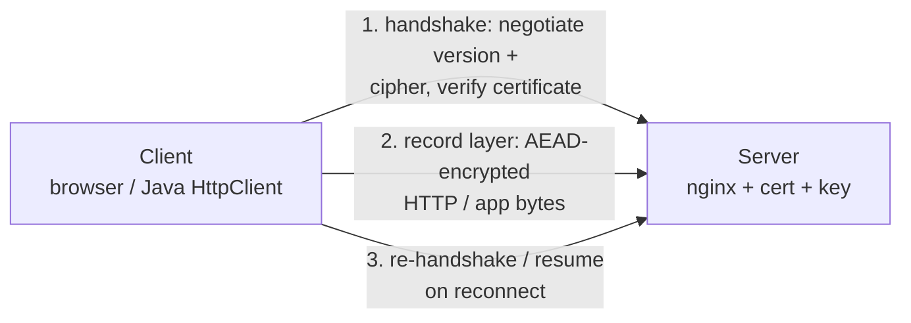
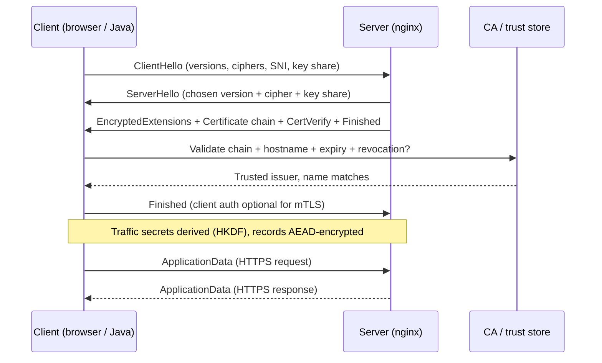
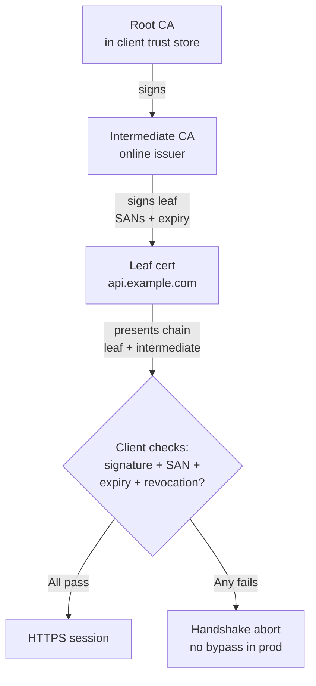
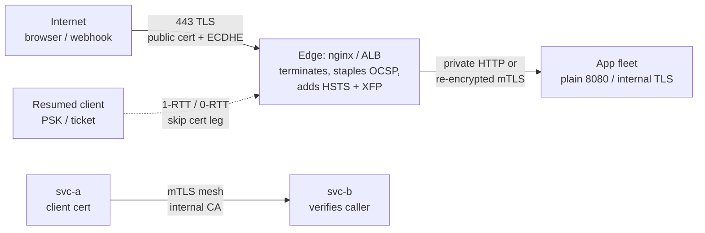
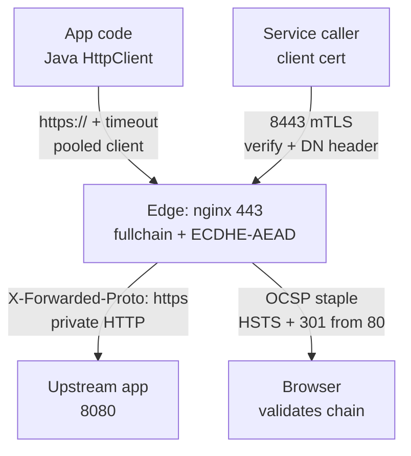

# SSL

## Theory

SSL (and its successor TLS) is the protocol that encrypts traffic between clients and servers and authenticates the server via certificates.
It matters because every HTTPS connection depends on it — see also the certificate section (server certificates, CAs) for the PKI side.
Key subtopics: the TLS handshake, TLS 1.2 vs 1.3, certificate validation, and terminating TLS at reverse proxies.

TLS (Transport Layer Security, RFC 8446 for 1.3, RFC 5246 for 1.2) is the successor to SSL 2.0/3.0 — every modern "SSL" connection is really TLS, and SSL itself is long dead. It wraps HTTP, SMTP, Postgres wire protocol, and thousands of other TCP (and via DTLS/QUIC, UDP) exchanges in an authenticated, confidential, integrity-checked channel negotiated per connection over port 443 for HTTPS.

This guide takes you from mental model to production operations. You will learn what TLS guarantees (and what it does not), how the TLS 1.2 and TLS 1.3 handshakes differ in round trips and cipher agility, how X.509 chains, CAs, and hostname validation prove you reached the right server, how to terminate TLS at nginx and call it correctly from Java, and how attackers downgrade, strip, or mis-issue certificates. It closes with threats, best practices, and interview Q&A.

> Scope note: this page covers TLS for HTTPS services — handshake, certificates, termination, and Java/nginx configuration — not PKI operations deep-dives (see certificate pages for CA setup) or QUIC internals. It assumes basic HTTP, TCP, and public-key crypto and focuses on the decisions interviewers probe: TLS 1.2 vs 1.3, validation failures, termination, and cipher hygiene.

### Topics Covered

1. [What is TLS and Why It Matters](#1-what-is-tls-and-why-it-matters)
2. [Handshake: TLS 1.2 vs TLS 1.3](#2-handshake-tls-12-vs-tls-13)
3. [Certificates and Chain Validation](#3-certificates-and-chain-validation)
4. [Termination, mTLS, and Session Resumption](#4-termination-mtls-and-session-resumption)
5. [Config Examples: nginx and Java](#5-config-examples-nginx-and-java)
6. [Threats and Mitigations](#6-threats-and-mitigations)
7. [Best Practices](#7-best-practices)
8. [Interview Questions and Answers](#8-interview-questions-and-answers)

### 1. What is TLS and Why It Matters

TLS is the cryptographic protocol that turns an insecure TCP connection into an authenticated, encrypted, tamper-evident channel without changing the application protocol on top. When a browser hits `https://api.example.com`, three promises kick in: the client knows it is talking to the real `api.example.com` (authentication via X.509 certificate chain to a trusted CA), nobody on the path can read the bodies and headers (confidentiality via negotiated symmetric cipher), and nobody can silently rewrite bytes in flight (integrity via AEAD or HMAC).

Consider life without it. Plain HTTP sends cookies, tokens, and POST bodies in cleartext; anyone on the Wi-Fi, a compromised router, or a passive tap runs `tcpdump` and replays the session cookie. IP allowlists and VPNs help for employees but do nothing for public users, and application-level encryption per endpoint is a bug farm. TLS collapses authentication, secrecy, and integrity into one handshake every HTTPS client already speaks, which is why browsers mark non-TLS logins "Not Secure" and why APIs, webhooks, and database links all converge on it.

The benefits compound at internet scale:

- **One ubiquitous security layer.** HTTPS, SMTPS, IMAPS, LDAPS, Postgres `sslmode=verify-full`, Redis TLS, and gRPC TLS all reuse the same handshake, certificate format, and trust store instead of each inventing crypto.
- **Server identity users can verify.** A CA-signed certificate binds DNS name to public key with expiry and revocation, so `evil-wifi` cannot impersonate your bank without also compromising a trusted CA.
- **Forward-secret bulk encryption.** Ephemeral Diffie-Hellman (ECDHE) derives fresh session keys per connection that are never transmitted, so a later private-key leak does not decrypt past captures.
- **Negotiated agility.** Client and server intersect on version, cipher suite, and extensions (SNI, ALPN), letting a 2026 server speak TLS 1.3 to modern browsers while still serving a pinned legacy client on TLS 1.2.

TLS works best as the transport protector for anything crossing an untrusted network: public HTTPS, service-to-service in a mesh, webhooks, and database replication. It works poorly as sole access control (add OAuth/session auth on top), as stored-data encryption (use KMS/envelope encryption at rest), or as phishing prevention (attackers get free DV certificates for lookalike domains — TLS proves *which* name, not *trustworthiness*).

The version history is interview-critical. SSL 2.0 (1995) and SSL 3.0 (1996) are broken (DROWN, POODLE) and must never be enabled; TLS 1.0/1.1 (1999/2006) are deprecated by RFC 8996 (BEAST, weak ciphers); TLS 1.2 (2008) is the widely compatible baseline; TLS 1.3 (2018, RFC 8446) is the modern default — 1-RTT, fewer primitives, encrypted handshake tail, mandatory forward secrecy. When an interviewer asks "which version," the answer is "TLS 1.2 minimum, TLS 1.3 preferred, everything older disabled" — and the nginx config in Section 5 enforces exactly that.



*The diagram above shows the two TLS layers: the handshake authenticates the server and agrees keys, then the record layer carries application bytes under symmetric AEAD encryption.*

A connection carries all of this over one TCP stream (plus UDP for QUIC, which embeds a TLS 1.3 handshake). After TCP connect, the client sends `ClientHello` (versions, cipher suites, SNI hostname, ALPN protocols, key share), the server answers with `ServerHello`, certificate chain, and `Finished`, both derive traffic secrets via HKDF, and HTTP request bytes flow only inside encrypted records with nonce-based replay protection. SNI (Server Name Indication) deserves explicit attention because interviewers probe it: the client sends the target hostname in cleartext in `ClientHello` so one IP can serve many certificates — which is also why SNI-based censorship and ECH (Encrypted Client Hello) exist, covered in Section 4.

Sessions deserve explicit attention because they decide latency. A full handshake costs 2-RTT in TLS 1.2 and 1-RTT in TLS 1.3; resumed sessions via tickets or PSKs skip certificate transfer and key exchange, cutting reconnects to 0-1 RTT. Keepalive, connection pooling in Java, and ticket-key rotation decide whether your p99 is handshake-bound — Sections 4 and 5 tune them.

### 2. Handshake: TLS 1.2 vs TLS 1.3

The handshake has one job — agree on secrets without letting a middleman read or alter them — and keeping the two versions straight answers half of all TLS interview questions: TLS 1.2 negotiates then validates then exchanges keys over two round trips, while TLS 1.3 guesses the key share up front, encrypts most of the handshake, and finishes in one round trip with fewer ways to misconfigure.

**TLS 1.2 full handshake (2-RTT).** The client sends `ClientHello` with highest supported version, cipher list, SNI, and random nonce. The server picks the version and cipher, returns `ServerHello` plus its random, then its certificate chain, optionally a `ServerKeyExchange` (for ECDHE/DHE), and `ServerHelloDone`. The client validates the chain (Section 3), sends `ClientKeyExchange` (ephemeral public share or RSA-encrypted premaster), both derive the master secret, exchange `ChangeCipherSpec` + `Finished` MACs, and switch to encrypted records. RSA key transport (no forward secrecy) and static-DH variants exist but must be disabled — ECDHE-only is the production rule.

**TLS 1.3 handshake (1-RTT, 0-RTT optional).** The client predicts the server's group and sends key shares eagerly alongside `ClientHello` (versions extension, SNI, ALPN, signature algorithms). The server picks a share, returns `ServerHello` with its share, then immediately sends encrypted extensions, certificate, certificate verify (signature over transcript), and `Finished` — all encrypted under the freshly derived handshake secret. The client validates, sends its `Finished`, and application data flows one round trip after connect. Downgrade protection is baked in: servers embed a sentinel in `ServerHello.random` when negotiating down, so a version-stripping MITM is detected.



*The sequence above shows the TLS 1.3 1-RTT handshake with server authentication; TLS 1.2 inserts an extra round trip and sends certificates in cleartext before key derivation.*

Cipher negotiation compares as follows. TLS 1.2 negotiates composite suites like `ECDHE-RSA-AES128-GCM-SHA256` (key exchange + auth + bulk cipher + hash) from a long, misconfigurable list — servers must prune to ECDHE + AEAD only. TLS 1.3 splits concerns: five simple AEAD suites (`TLS_AES_128_GCM_SHA256`, `TLS_AES_256_GCM_SHA384`, `TLS_CHACHA20_POLY1305_SHA256`, plus CCM variants) with key exchange and signatures negotiated separately, static RSA and CBC/HMAC suites removed entirely. Never enable `RC4`, `3DES`, `NULL`, `EXPORT`, `DES-CBC-SHA`, or RSA key transport; scanners flag them instantly.

Host and client roles mirror each other when mTLS is on. Server authentication is mandatory (every HTTPS handshake validates the server chain); client authentication is optional and requested via `CertificateRequest` — the client then sends its own chain plus `CertificateVerify`, which the server validates against its own trust store. This is how service meshes and `ssl_verify_client on` in nginx turn TLS into mutual identity without passwords.

Forward secrecy deserves emphasis because interviewers probe it directly. With ECDHE, each connection generates ephemeral key shares that are discarded after use, so stealing the server's long-term private key lets an attacker impersonate the future but not decrypt recorded past traffic. With RSA key transport (TLS 1.2 legacy), the premaster is encrypted to the server's static public key — one key theft decrypts everything ever captured. That is why RSA key exchange is banned in TLS 1.3 and must be disabled in TLS 1.2, and why "do you have forward secrecy?" is answered by showing `ECDHE` in every enabled cipher.

Resumption and 0-RTT trade latency for replay risk. TLS 1.2 session IDs/tickets and TLS 1.3 PSKs let a returning client skip the certificate leg; TLS 1.3 0-RTT goes further by sending early data with the first flight. Enable resumption for performance, restrict 0-RTT to idempotent GETs (or off entirely) because early data is replayable by design — Section 4 shows the nginx knobs.

### 3. Certificates and Chain Validation

Certificate validation is where TLS security is won or lost. The cryptography is sound; incidents come from expired certs on one host behind the load balancer, wildcard sprawl, private keys in Git, and clients that skip hostname checks "just for dev" and ship that way. A production certificate story covers issuance, chain building, validation checks, rotation, and revocation — not just buying a cert.

**An X.509 leaf binds name to key with constraints.** The end-entity certificate carries Subject Alternative Names (SANs — the DNS names it is valid for), issuer, serial, validity window (`notBefore`/`notAfter`), public key plus algorithm, key-usage extensions, and the CA's signature. Browsers ignore the legacy Common Name and check SANs only, so every name — `example.com`, `api.example.com`, internal aliases — must appear as a SAN. Wildcards (`*.example.com`) cover one label only, never match `a.b.example.com`, and widen blast radius, which is why many teams prefer per-service names plus automation over broad wildcards.

**Chains build trust from leaf to root.** The server presents leaf plus intermediates; the client already trusts roots in its store (OS, browser, or Java `cacerts`). Validation walks leaf → intermediate(s) → trusted root, checking each signature, each `BasicConstraints`/`KeyUsage` (is this CA allowed to sign this?), and each validity window. Missing intermediates are the classic outage: the chain works in browsers that cache them and fails in Java/Go that do not — always serve the full chain (`fullchain.pem`, not `cert.pem` alone). Self-signed certs and private CAs work internally only when every client installs the root; on the public internet only a public CA (Let's Encrypt, DigiCert) chains to default trust.

**Clients run five checks, and any failure must fail closed.** Expiry (is now inside `notBefore`/`notAfter`?), hostname (does the URL's host match a SAN, case-insensitively, per RFC 6125/2818?), issuer trust (does the chain end at a trusted root?), revocation status (OCSP/CRL or OCSP stapling — Section 4), and policy (key length, signature algorithm, Certificate Transparency SCTs). A mismatch — expired yesterday, SAN for `api.example.com` presented by `evil-cdn.example.net`, SHA-1 signature — aborts the handshake with `certificate_unknown` / `bad_certificate`, never a "click through in prod" bypass.

```bash
# Inspect what a server actually presents (chain, SANs, expiry, issuer).
echo | openssl s_client -connect api.example.com:443 -servername api.example.com -showcerts 2>/dev/null \
  | openssl x509 -noout -subject -issuer -dates -ext subjectAltName

# Verify the full chain against the system trust store, checking hostname semantics.
echo | openssl s_client -connect api.example.com:443 -servername api.example.com 2>/dev/null \
  | awk '/BEGIN CERT/,/END CERT/' > /tmp/leaf.pem
openssl verify -verify_hostname api.example.com /tmp/leaf.pem

# Check expiry across a fleet before the 3 AM page (epoch compare).
for h in api-01 api-02 bastion; do
  echo -n "$h: "
  echo | openssl s_client -connect "$h.example.com:443" -servername "$h.example.com" 2>/dev/null \
    | openssl x509 -noout -enddate
done

# Generate a private key + CSR correctly: 2048-bit RSA minimum, 256-bit ECDSA preferred.
openssl req -new -newkey ec -pkeyopt ec_paramgen_curve:P-256 \
  -keyout api.example.com.key -out api.example.com.csr \
  -subj "/CN=api.example.com" -addext "subjectAltName=DNS:api.example.com,DNS:api-02.example.com"
chmod 600 api.example.com.key
```

The commands are explained flag by flag. The first `s_client -showcerts` plus `x509 -noout` prints the four fields that decide trust — subject/SANs, issuer, dates, and signer — so "is the right cert deployed?" is a one-liner, and `-servername` sends SNI so multi-cert hosts return the right chain. The `verify -verify_hostname` step reproduces the client's hostname check offline, catching the wildcard-depth and missing-SAN bugs browsers report cryptically. The loop turns expiry into a cron-able fleet probe; alert at 30/14/7 days because ACME renewals fail silently behind firewalls. The `req` invocation creates an ECDSA P-256 key (fast, small, modern) with explicit SANs — never reuse one key across prod and staging — and `chmod 600` enforces the private-key discipline scanners audit for.

**Choose issuance by lifetime and automation.** Public DV (Let's Encrypt via ACME) suits public HTTPS with 90-day auto-renewal; OV/EV add identity vetting for trust-sensitive brands but no crypto advantage. Private CAs (Vault PKI, step-ca, EJBCA) issue short-lived (hours-to-days) internal certs for services and mTLS clients with automated renewal. Long-lived (1-year) manually renewed certs are the outage factory — prefer 90 days or shorter with a renew-and-reload pipeline plus monitoring, never email-based CSR juggling.

**Rotate by overlapping, then removing.** Rotation means issuing the new leaf, deploying key + fullchain side by side, reloading (not restarting) the terminator, verifying externally with `s_client`, then retiring the old files — overlapping both briefly so no restart serves an expired cert. Good triggers are calendar (at 2/3 lifetime for short certs), key suspicion, algorithm migration (RSA → ECDSA), and CA distrust events. Keep a cert inventory (DNS name, issuer, fingerprint via `openssl x509 -fingerprint -sha256 -noout`, hosts, expiry) so rotation is a query, not an archaeology dig.

**Revocation is expiry plus OCSP, not deletion.** Compromised or superseded certs are revoked at the CA (CRL/OCSP responder updated) and clients check via OCSP, OCSP stapling (server attaches a fresh OCSP response — privacy-preserving and fast), or CRLSets/OneCRL push lists; browsers soft-fail open on responder outage, which is why short lifetimes beat revocation lists at scale. For private PKI, maintain a CRL distribution point plus an emergency deny list at the terminator (`ssl_crl` in nginx) and rehearse the revoke-reload path before the incident.



*The diagram above shows chain validation: trust flows down from the pre-installed root while the client re-verifies every link, name, and date before sending any application data.*

### 4. Termination, mTLS, and Session Resumption

Terminating TLS means deciding where the encrypted channel ends and cleartext begins. The default internet pattern ends it at the edge — CDN or load balancer / reverse proxy (nginx, ALB, Cloudflare) holds the private key and fullchain, validates clients optionally, then forwards HTTP (or re-encrypts) upstream. Alternatives worth naming: passthrough (TCP-level SNI routing to backends that each terminate — preserves end-to-end but spreads key material), sidecar termination (Envoy per pod in a mesh — fine-grained mTLS with rotation), and in-app termination (Java `SSLContext` directly — simplest for one service, hardest to rotate fleet-wide).

**Terminate at the reverse proxy for public HTTPS.** One hardened nginx/ALB tier owns cipher policy, HSTS, OCSP stapling, and cert reloads, while app servers receive `X-Forwarded-Proto: https` and plain HTTP over a private network — or re-encrypted HTTPS where compliance demands it. Security groups allow 443 only to the edge; private subnets accept 80 (or 443 with internal certs) only from the edge security group. Never terminate at each of 200 heterogeneous app configs; cipher drift and forgotten renewals follow immediately.

**Use mTLS where services need identity, not just secrecy.** With `ssl_verify_client on`, the edge or mesh validates each caller's client certificate against an internal CA and forwards the verified identity (`$ssl_client_s_dn`, `$ssl_client_verify`) as a header the app authorizes on. This replaces static API tokens for service-to-service and privileged automation: short-lived client certs (hours) minted via Vault/step-ca carry role principals, and revocation becomes non-renewal plus CRL. Keep public browser traffic to server-only auth — distributing client certs to humans is operationally brutal — and gate mTLS paths separately from public ones with distinct `server` blocks.

**Resume sessions for latency, rotate ticket keys for safety.** Session IDs (server-side cache) and session tickets (client-held, encrypted with a ticket key) let returning clients skip certificate transfer; TLS 1.3 PSKs do the same with stronger binding. Enable a 10-minute shared ticket cache with ticket keys rotated and synced across edge nodes (via shared ticket-key file or central store), and prefer `ssl_session_cache shared:SSL:10m` + `ssl_session_timeout 10m`. Treat 0-RTT as opt-in for safe idempotent endpoints only (`ssl_early_data on` plus app-level replay guards) — payments and mutations must never ride early data.



*The diagram above shows edge termination for public traffic, mTLS between internal services, and resumption shortcuts that skip the certificate leg for returning clients.*

SNI routing and ECH close the section because interviewers probe metadata leakage. SNI is cleartext in TLS 1.2 and 1.3, so observers see *which* hostname you connect to even without seeing content; multi-tenant hosts route on it. Encrypted Client Hello (ECH, formerly ESNI) encrypts the inner `ClientHello` to a published public key fetched via DNS HTTPS records, leaving only the outer (CDN-front) name visible — deploy where censorship or privacy matters, noting Java and legacy middleboxes may not support it yet.

### 5. Config Examples: nginx and Java

Config examples turn handshake theory into running HTTPS. The nginx block below is a hardened internet-facing baseline for TLS 1.2+ with ECDHE-only AEAD ciphers, and the Java block shows the correct client side — default trust, hostname verification on, pooled connections. Every directive and line is explained beneath its block so you can defend each choice in an interview.

```nginx
# /etc/nginx/conf.d/api.example.com.conf — hardened TLS baseline (nginx 1.25+, OpenSSL 3.x).
server {
    listen 443 ssl;
    listen [::]:443 ssl;
    server_name api.example.com;

    # Chain + key: fullchain (leaf + intermediates), key readable only by root/nginx.
    ssl_certificate     /etc/letsencrypt/live/api.example.com/fullchain.pem;
    ssl_certificate_key /etc/letsencrypt/live/api.example.com/privkey.pem;

    # Versions + ciphers: 1.2 minimum, 1.3 preferred, ECDHE + AEAD only.
    ssl_protocols TLSv1.2 TLSv1.3;
    ssl_ciphers 'ECDHE-ECDSA-AES128-GCM-SHA256:ECDHE-RSA-AES128-GCM-SHA256:ECDHE-ECDSA-AES256-GCM-SHA384:ECDHE-RSA-AES256-GCM-SHA384:ECDHE-ECDSA-CHACHA20-POLY1305:ECDHE-RSA-CHACHA20-POLY1305';
    ssl_prefer_server_ciphers on;

    # Curves, stapling, tickets, and session cache.
    ssl_ecdh_curve X25519:secp256r1:secp384r1;
    ssl_stapling on;
    ssl_stapling_verify on;
    resolver 1.1.1.1 8.8.8.8 valid=300s;
    ssl_session_cache shared:SSL:10m;
    ssl_session_timeout 10m;
    ssl_session_tickets on;

    # HSTS + secure upstream hints.
    add_header Strict-Transport-Security "max-age=63072000; includeSubDomains; preload" always;
    location / {
        proxy_pass http://app_upstream;
        proxy_set_header Host $host;
        proxy_set_header X-Real-IP $remote_addr;
        proxy_set_header X-Forwarded-For $proxy_add_x_forwarded_for;
        proxy_set_header X-Forwarded-Proto https;
    }
}
# Redirect all plain HTTP to HTTPS (no content served on port 80).
server {
    listen 80;
    listen [::]:80;
    server_name api.example.com;
    return 301 https://$host$request_uri;
}
```

The nginx config is explained group by group. The `ssl_certificate` pair must be `fullchain.pem` (leaf plus intermediates) so strict clients like Java validate without cached intermediates, while `privkey.pem` stays `600 root:nginx` — group-readable keys are a scanner finding. `ssl_protocols TLSv1.2 TLSv1.3` drops SSL 2/3 and TLS 1.0/1.1 entirely, which answers "which versions do you support" with one line. The `ssl_ciphers` list is ECDHE-only with GCM or ChaCha20-Poly1305 AEAD, no CBC, RC4, 3DES, or RSA key transport — `ssl_prefer_server_ciphers on` forces the server's order so a weak-client preference cannot downgrade the suite. `ssl_ecdh_curve X25519:...` pins modern curves for fast forward-secret exchanges. `ssl_stapling on` plus `ssl_stapling_verify` attaches a fresh OCSP response to each handshake (privacy-preserving revocation without a browser OCSP fetch) and needs a `resolver` for the CA responder. `ssl_session_cache shared:SSL:10m` with a 10-minute timeout enables cross-worker resumption without unbounded memory, and `ssl_session_tickets on` trades a ticket-encryption key for faster reconnects — rotate that key regularly. The `Strict-Transport-Security` header with two-year max-age plus `includeSubDomains` tells browsers to never use `http://` again, killing SSL-stripping for return visitors. The `proxy_set_header X-Forwarded-Proto https` line is what lets the upstream app build correct redirects and cookies without seeing TLS itself. The trailing port-80 server block closes the loop: no HTTP content, only a 301 to HTTPS, so credentials never traverse cleartext. Always validate with `nginx -t` then `systemctl reload nginx`, and confirm externally with `testssl.sh` or Qualys SSL Labs.

`Match`-style exceptions in nginx are separate `server` blocks, not inline conditionals. An internal mTLS endpoint for service-to-service gets its own block with client verification, kept apart from the public browser block:

```nginx
# Internal mTLS endpoint: same host, separate port + trust store.
server {
    listen 8443 ssl;
    server_name internal-api.example.com;
    ssl_certificate     /etc/nginx/tls/internal-fullchain.pem;
    ssl_certificate_key /etc/nginx/tls/internal-key.pem;
    ssl_protocols TLSv1.2 TLSv1.3;
    ssl_ciphers 'ECDHE-ECDSA-AES128-GCM-SHA256:ECDHE-RSA-AES128-GCM-SHA256:ECDHE-ECDSA-AES256-GCM-SHA384';

    # Mutual auth against the internal CA; CRL for emergency revocation.
    ssl_verify_client on;
    ssl_client_certificate /etc/nginx/tls/internal-ca.pem;
    ssl_crl /etc/nginx/tls/internal-ca.crl;
    ssl_verify_depth 2;

    location / {
        # Pass the verified caller identity upstream; app authorizes on it.
        proxy_set_header X-Client-Verify $ssl_client_verify;
        proxy_set_header X-Client-DN $ssl_client_s_dn;
        proxy_pass http://app_upstream;
    }
}
```

The mTLS stanza is explained briefly. `ssl_verify_client on` requests and requires a client chain on every handshake, failing closed with `400` when absent — `optional` plus `if ($ssl_client_verify != SUCCESS)` is the variant when one block serves both humans and services. `ssl_client_certificate` pins the internal root (Vault/step-ca), `ssl_crl` enforces the emergency revoke list, and `ssl_verify_depth 2` allows leaf-plus-intermediate client chains. The two `proxy_set_header` lines are the whole authorization contract: the app never parses certificates, it trusts `$ssl_client_verify == SUCCESS` plus the DN set by the edge it controls.

**Java clients must use defaults plus verification, never trust-all hacks.** The `HttpClient` below is the production pattern for calling HTTPS from Java 11+: system trust store, hostname verification on, timeouts bounded, connections pooled and reused:

```java
import java.net.URI;
import java.net.http.HttpClient;
import java.net.http.HttpRequest;
import java.net.http.HttpResponse;
import java.time.Duration;
import javax.net.ssl.SSLContext;
import javax.net.ssl.SSLParameters;

/**
 * Production HTTPS client: default PKIX trust (cacerts), hostname
 * verification ON, bounded timeouts, shared pooled HttpClient.
 * Patterns: Builder (HttpClient/HttpRequest), Singleton (shared client).
 */
public final class TlsApiClient {

    // One shared client per process: connection pool + session resumption live here.
    private static final HttpClient CLIENT = HttpClient.newBuilder()
            .version(HttpClient.Version.HTTP_2)          // ALPN negotiates h2 over TLS
            .connectTimeout(Duration.ofSeconds(5))       // TCP + handshake cap
            .sslContext(defaultTlsContext())             // system trust, TLSv1.2+ only
            .sslParameters(verifiedParams())             // endpoint identification on
            .followRedirects(HttpClient.Redirect.NORMAL) // safe redirects only
            .build();

    private static SSLContext defaultTlsContext() {
        try {
            // getDefault(): PKIX validator over cacerts + default TrustManager.
            // Never install a trust-all X509TrustManager — that disables all of Section 3.
            SSLContext ctx = SSLContext.getDefault();
            return ctx;
        } catch (Exception e) {
            throw new IllegalStateException("No default TLS context", e);
        }
    }

    private static SSLParameters verifiedParams() {
        SSLParameters p = new SSLParameters();
        // HTTPS endpoint identification = hostname check against SANs per RFC 2818.
        // Without this, any valid CA-signed cert for ANY name would be accepted.
        p.setEndpointIdentificationAlgorithm("HTTPS");
        p.setProtocols(new String[]{"TLSv1.3", "TLSv1.2"}); // floor at 1.2, prefer 1.3
        return p;
    }

    /** GET with total-call timeout; caller handles 4xx/5xx by status code. */
    public static String get(String url) throws Exception {
        HttpRequest req = HttpRequest.newBuilder(URI.create(url))
                .timeout(Duration.ofSeconds(10)) // covers handshake + response
                .header("Accept", "application/json")
                .GET()
                .build();
        HttpResponse<String> res =
                CLIENT.send(req, HttpResponse.BodyHandlers.ofString());
        if (res.statusCode() >= 400) {
            throw new IllegalStateException("HTTP " + res.statusCode() + " from " + url);
        }
        return res.body();
    }

    /** mTLS variant: swap in a KeyManager (client cert) + TrustManager (private CA). */
    public static HttpClient mtlsClient(SSLContext mtlsContext) {
        return HttpClient.newBuilder()
                .sslContext(mtlsContext) // KeyManagerFactory (client key) + TrustManagerFactory (internal CA)
                .sslParameters(verifiedParams())
                .connectTimeout(Duration.ofSeconds(5))
                .build();
    }
}
```

The Java code is explained line by line. The shared static `CLIENT` is deliberate: `HttpClient` pools keep-alive connections and TLS session tickets, so per-request clients would forfeit resumption and pay a full handshake every call. `SSLContext.getDefault()` loads the JDK `cacerts` PKIX trust — adding a private CA means importing its root into `cacerts` (or a custom `TrustManagerFactory`), never disabling validation. `setEndpointIdentificationAlgorithm("HTTPS")` re-enables the hostname check that raw `SSLSocket` leaves off; deleting that one line reintroduces the "valid cert, wrong host" hole. `setProtocols({"TLSv1.3","TLSv1.2"})` floors the client at 1.2 even if the server offers 1.0. The per-request `timeout` bounds DNS plus handshake plus body, preventing thread-pool exhaustion behind a slow terminator. The `mtlsClient` factory shows the service-to-service shape: an `SSLContext` initialized with a `KeyManager` (client leaf + key from a short-lived Vault cert) and a `TrustManager` for the internal CA, reusing the same verified params. Debug with `-Djavax.net.debug=ssl,handshake,verbose` to see negotiated version, cipher, and validation failures before blaming the network.

**Debug TLS like SSH `-v`: isolate version, chain, and name.** Most "handshake failure" tickets are expired certs, missing intermediates, SNI mismatch, or a Java trust store without the private root, and these probes name the culprit:

```bash
# Which versions and ciphers does the server actually accept?
nmap --script ssl-enum-ciphers -p 443 api.example.com

# Full-chain + protocol detail in one shot (check Verify return code: 0).
echo | openssl s_client -connect api.example.com:443 -servername api.example.com -tls1_3 2>/dev/null \
  | grep -E "Protocol|Cipher|Verify return code|subject=|issuer="

# Does plain HTTP still serve content (should be 301 only)?
curl -sI http://api.example.com/ | head -5

# Java-side trust check: does cacerts know this issuer?
keytool -list -cacerts -storepass changeit | grep -i "lets encrypt\|digicert" || echo "issuer missing from cacerts"
```

The debugging steps are explained briefly. The `nmap ssl-enum-ciphers` sweep lists every accepted version/cipher pair — any `SSLv3`, `TLSv1.0`, `RC4`, or `DES` line is a fail that maps straight to the nginx `ssl_protocols`/`ssl_ciphers` fix. The `s_client -tls1_3` grep isolates the four decisive fields: negotiated protocol, active cipher, chain verify code, and subject/issuer — `Verify return code: 21 (unable to verify the first certificate)` means missing intermediates, `code 10 (certificate has expired)` means rotation failed. The `curl -sI http://` check enforces the "no content on 80" rule; a `200` there is an SSL-stripping invitation. The `keytool` probe separates server bugs from client trust: if the issuer is absent from `cacerts`, the fix is importing the private root, not redeploying the server chain.



*The diagram above maps the two config blocks together: public 443 with stapling and HSTS, private 8443 with mTLS identity headers, and a pooled Java client that verifies both.*

### 6. Threats and Mitigations

TLS fails the way deployments, clients, and CAs fail — not the way AES fails. Every row below is a real incident pattern; the mitigations are the controls interviewers expect you to name.

| Threat | What goes wrong | Mitigation |
|---|---|---|
| Expired certificate outage | One host behind the LB serves an expired leaf; health checks miss it | ACME auto-renewal, expiry alerts at 30/14/7 days, fleet `s_client` scans, overlapping rotation with reload |
| Missing intermediate chain | Browsers pass (cached), Java/Go fail (strict builders) | Always serve `fullchain.pem`, verify with `openssl s_client` + Java client test, SSL Labs check after deploy |
| Hostname-mismatch bypass | Client accepts valid cert for wrong name; dev trust-all ships to prod | Enforce SAN checks (`HTTPS` endpoint ID in Java), never ship trust-all managers, fail closed on mismatch |
| SSL stripping / downgrade | MITM on HTTP rewrites links, strips `https://`, user never upgrades | HSTS preload + 301-everything on port 80, `Secure` cookies, no mixed content, ECH where apt |
| Version/cipher downgrade (FREAK, Logjam) | Attacker forces weak EXPORT/DHE ciphers or TLS 1.0 | `TLSv1.2+` only, ECDHE + AEAD allowlist, `prefer_server_ciphers`, weekly `ssl-enum-ciphers` scans |
| POODLE / BEAST / Lucky13 legacy flaws | CBC padding oracles and predictable IVs in SSLv3/TLS 1.0 | Disable SSLv3/TLS 1.0/1.1, no CBC-only suites, prefer TLS 1.3, patch OpenSSL promptly |
| Heartbleed-style memory disclosure | Unpatched OpenSSL leaks private keys and session data | Auto-patch OpenSSL/nginx, rotate keys after disclosure CVEs, minimal edge image, vuln scan on 443 weekly |
| Private-key theft from disk or Git | Key committed, snapshotted, or world-readable; passive decrypt (RSA) or impersonation | `600` perms, secrets-manager/KMS storage, never commit keys, ECDHE for forward secrecy, rotate on suspicion |
| Rogue / mis-issued certificates | Compromised CA or lax DV issues valid cert for your domain to attacker | Certificate Transparency monitoring, CAA DNS records, short lifetimes, pin HPKP successor (Expect-CT/SCTs) |
| Revocation blind spots | Revoked cert still trusted because clients skip OCSP / soft-fail open | OCSP stapling + `ssl_stapling_verify`, short-lived certs, CRL for mTLS (`ssl_crl`), emergency revoke-reload runbook |
| 0-RTT replay | Attacker replays early data; non-idempotent action executes twice | Disable `ssl_early_data` or allow GET-only with app replay guards, never payments/mutations over 0-RTT |
| SNI sniffing and traffic analysis | Observer logs every hostname visited even with encrypted bodies | ECH via HTTPS DNS records, consolidated CDN fronting, document residual metadata for threat model |

Two scenarios tie the table together for interviews. First, the Black-Friday expiry: `api-03` missed the ACME reload, serves last month's leaf, and 25% of checkouts fail in Java apps while browsers look fine (cached intermediates mask a second bug). The fix layers overlapping renewal plus `nginx -t && reload`, an external `s_client` fleet loop that checks every backend IP (not just the VIP), and a synthetic Java transaction that validates the full chain. Second, the coffee-shop strip: a user on open Wi-Fi hits `http://shop.example.com` once, the attacker strips the redirect and proxies `https://` upstream, reading the session cookie in cleartext on the victim side. The fix is HSTS preload (browser never emits that first HTTP), 301-everything on port 80, and `Secure; HttpOnly; SameSite` cookies so even a slipped HTTP request carries nothing.

Logging deserves emphasis because auditors grade it. Log TLS version and cipher per connection (`$ssl_protocol`, `$ssl_cipher` in nginx access logs) to prove 1.2-minimum compliance, alert on handshake-failure bursts per source IP (downgrade probes), ship cert-deploy and reload events with fingerprints, and review CT-log alerts for unexpected issuance on your domains weekly.

### 7. Best Practices

These practices are ordered from crypto hygiene to fleet operations, so a new team can adopt them top-down and an existing fleet can audit against them.

1. **Speak TLS 1.2 minimum, 1.3 preferred, nothing older.** Disable SSL 2/3 and TLS 1.0/1.1 on every terminator and client floor (`ssl_protocols`, Java `setProtocols`), and re-scan after every change.
2. **Allowlist ECDHE + AEAD ciphers only.** ECDHE key exchange with AES-GCM or ChaCha20-Poly1305, server order preferred; no RC4, 3DES, CBC-only, NULL, EXPORT, or RSA key transport.
3. **Demand forward secrecy everywhere.** Every enabled suite starts with `ECDHE`; treat any `RSA` key-exchange (non-`ECDHE-RSA`) hit as a finding, because one key theft must never decrypt history.
4. **Serve the full chain from one hardened edge.** `fullchain.pem` on a single nginx/ALB tier, `600` keys, `nginx -t` before reload; never spread TLS config across 200 app servers.
5. **Automate issuance and rotation with overlap.** ACME or Vault PKI with 90-day (or shorter) lifetimes, deploy-new then verify with `s_client` then retire-old; alert at 30/14/7 days.
6. **Validate all five client checks and fail closed.** Expiry, SAN hostname, issuer trust, revocation, policy — no trust-all managers, no click-through bypasses in prod, `HTTPS` endpoint ID on in Java.
7. **Staple OCSP, preload HSTS, and close port 80.** `ssl_stapling_verify`, two-year HSTS with `includeSubDomains`, 301-everything on HTTP, `Secure` cookies — the anti-stripping trio.
8. **Resume fast but replay-safe.** Shared session cache plus rotated ticket keys for 1-RTT reconnects; 0-RTT off or GET-only with app-level idempotency guards.
9. **Use mTLS for service identity, not browser users.** Short-lived client certs from an internal CA on a separate port/block, DN-header contract upstream, CRL plus non-renewal for revocation.
10. **Separate public and internal trust cleanly.** Public CA for internet names, private CA roots installed only where needed (`cacerts` import), CAA records constraining who may issue for your domains.
11. **Patch fast and scan continuously.** Unattended OpenSSL/nginx updates, weekly `ssl-enum-ciphers` + SSL Labs grading, CT-log watch for rogue issuance, rotate keys after any memory-disclosure CVE.
12. **Log handshakes and alert the interesting ones.** `$ssl_protocol`/`$ssl_cipher` per request, handshake-failure bursts, new fingerprints on the edge, and forwarding-proto anomalies — centralized with expiry and deploy events.

### 8. Interview Questions and Answers

**Q1 (Beginner): What is TLS in one minute?**
TLS is the protocol that turns TCP into an authenticated, encrypted, tamper-evident channel. The client and server negotiate version and cipher, the server proves its DNS identity with a CA-signed X.509 chain, they derive fresh session keys via (EC)DHE, and HTTP bytes flow inside AEAD-encrypted records. It replaced SSL 2/3 and is what every `https://` connection uses.

**Q2 (Beginner): Why does the browser show "Not Secure" on plain HTTP?**
Because HTTP sends URLs, headers, cookies, and bodies in cleartext — anyone on the path can read and rewrite them. TLS adds server authentication (are you really `api.example.com`?), confidentiality (AES-GCM/ChaCha20 bulk encryption), and integrity (AEAD tags reject tampering). Without it, a login cookie is a one-`tcpdump` theft, so browsers warn and APIs should refuse non-TLS traffic.

**Q3 (Beginner): What happens when you open `https://api.example.com`?**
TCP connects to 443, the client sends `ClientHello` (versions, ciphers, SNI `api.example.com`, key share), the server answers with `ServerHello`, chain, and `Finished`, the client validates expiry, SAN hostname, issuer trust, and revocation, both derive traffic secrets via HKDF, and the HTTP request flows inside encrypted records. Port-80 `http://` would first 301-redirect here under the Section 5 config.

**Q4 (Intermediate): What is the difference between TLS 1.2 and TLS 1.3 handshakes?**
TLS 1.2 takes 2-RTT: negotiate, send certificates in cleartext, exchange keys, then `ChangeCipherSpec`/`Finished`. TLS 1.3 takes 1-RTT: the client guesses the key share eagerly, the server replies with its share plus encrypted extensions, certificate, verify, and `Finished` under the new handshake secret. TLS 1.3 also removes RSA key transport and CBC suites, mandates forward secrecy, and bakes in downgrade sentinels — fewer knobs, faster, harder to misconfigure.

**Q5 (Intermediate): How does certificate validation actually work, and what is SNI?**
The client builds leaf-to-root using presented intermediates plus its trust store, checks each signature, validity window, and CA constraints, then verifies the URL hostname against SANs, plus revocation (OCSP/stapling) and policy (key size, SCTs) — any failure aborts. SNI is the cleartext hostname in `ClientHello` that lets one IP serve many certificates by selecting the right chain; it also leaks the target name to observers, which ECH encrypts where supported.

**Q6 (Intermediate): Where should TLS terminate, and what is mTLS?**
Terminate public TLS at the edge (nginx/ALB/CDN) so one tier owns ciphers, HSTS, stapling, and renewals, forwarding `X-Forwarded-Proto: https` upstream over private HTTP or re-encrypted links. mTLS adds client certificates: the server requests a client chain and validates it against an internal CA, turning the handshake into mutual identity for service-to-service without tokens — public browsers stay server-auth-only while internal ports require `ssl_verify_client on`.

**Q7 (Intermediate): What is forward secrecy, and why ban RSA key exchange?**
Forward secrecy means a future private-key theft cannot decrypt recorded past traffic, achieved by ephemeral (EC)DHE shares discarded after each connection. RSA key transport encrypts the premaster to the server's static public key, so one key compromise decrypts the entire capture history. That is why TLS 1.3 removed RSA exchange and production TLS 1.2 enables only `ECDHE` suites — "show me `ECDHE` in every cipher" is the audit answer.

**Q8 (Senior): Design HTTPS for a fleet behind nginx with zero-downtime rotation.**
One edge tier holds `fullchain.pem` + `600` key, `TLSv1.2+`, ECDHE-AEAD allowlist, stapling, shared session cache, HSTS, and 80-to-443 301s. Issue via ACME/Vault with 90-day (or shorter) lifetimes; rotate by deploying new files side by side, `nginx -t`, reload (not restart), verify every backend IP with `s_client` plus a synthetic Java transaction, then retire old files. Monitor expiry at 30/14/7 days, log `$ssl_protocol`/`$ssl_cipher`, scan ciphers weekly, and watch CT logs for rogue issuance.

**Q9 (Senior): A Java service throws `PKIX path building failed` after a cert deploy. Walk me through triage.**
Isolate client vs server: `s_client -showcerts` — missing intermediates (works in browsers, fails in Java) means deploy `fullchain.pem`, not `cert.pem`. If the chain is complete, the issuer is unknown to `cacerts` (private CA): import the root via `keytool -import -trustcacerts`, not a trust-all hack. If trust is fine, check hostname (`-verify_hostname` vs SANs, wildcard depth), expiry (`-enddate`), and SNI (`-servername` mismatch returns the default vhost cert). Reproduce with the same JDK version — `cacerts` contents drift across releases.

**Q10 (Senior): TLS 1.3 0-RTT promises speed — when would you enable it?**
Almost never for mutating APIs: 0-RTT early data is replayable by design, so an attacker can duplicate the first flight and double-execute a payment. Enable only for idempotent GETs behind `ssl_early_data on` with app-level anti-replay (nonce cache, safe-method routing), keep session resumption/PSK on for the 1-RTT win everywhere, and document the residual replay model. When in doubt, leave 0-RTT off — the latency saving rarely justifies the replay surface.

## Youtube

- [How SSL Certificate Works? - HTTPS Explained](https://www.youtube.com/watch?v=0yw-z6f7Mb4)
- [How HTTPS Works - It's Not Just Encryption](https://www.youtube.com/watch?v=UIcCwuYzxcE)
