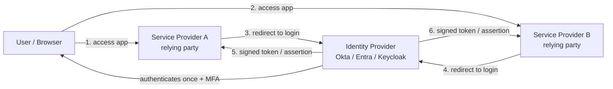
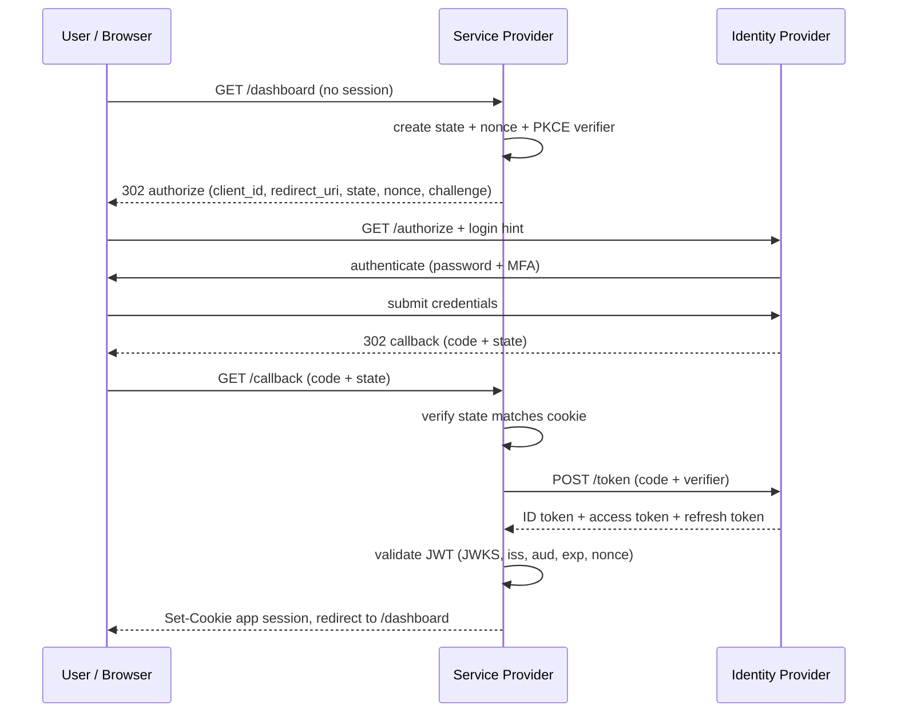
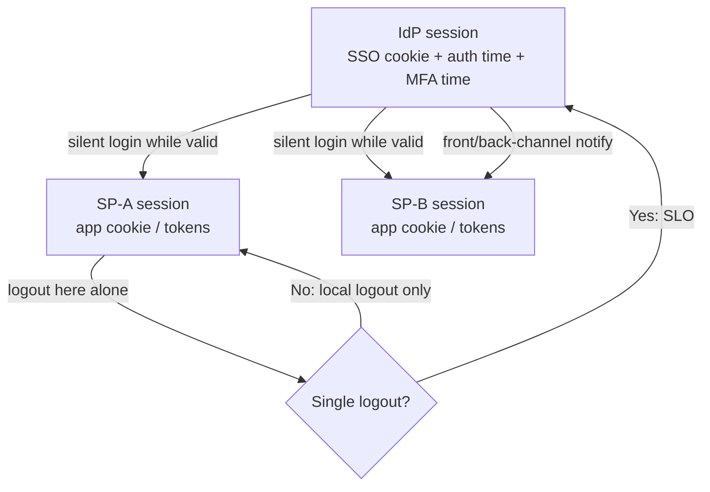

# Single Sign On

## Theory

Single sign-on (SSO) lets users authenticate once with an identity provider and access multiple applications without re-logging in.
It matters because it improves UX while centralizing authentication policy (MFA, session lifetime) in one place.
Key subtopics: identity providers (IdP) vs service providers (SP), protocols (OIDC, SAML), token exchange, and single logout.

SSO is the dominant enterprise authentication pattern because it replaces N passwords with one phishing-resistant login. Instead of every application storing credentials, validating MFA, and handling password resets, a central identity provider (Okta, Entra ID, Keycloak, Google Workspace) performs authentication once and vouches for the user to every connected application with signed tokens or assertions. This indirection is the entire power of SSO: applications stop being credential authorities and become credential consumers, which shrinks the attack surface from dozens of login forms to one hardened front door.

This guide takes you from mental model to production implementation. You will learn what SSO guarantees (and what it does not), how the three enterprise protocols compare (OIDC, SAML, Kerberos), how an SP-initiated OIDC authorization-code flow works step by step, how sessions, refresh, and single logout (SLO) interact across apps, and how to implement SSO correctly in Spring Security as both a client and a resource server. It closes with threats, best practices, and interview Q&A.

> Scope note: this page covers federated web SSO (browser-based login across apps), not authorization (see RBAC) or low-level password hashing. It assumes you know HTTP redirects, JWTs at a high level, and Spring Boot basics, and focuses on the protocol exchange and session decisions.

### Topics Covered

1. [What is SSO and Why It Matters](#1-what-is-sso-and-why-it-matters)
2. [OIDC vs SAML vs Kerberos](#2-oidc-vs-saml-vs-kerberos)
3. [SP-Initiated OIDC Flow](#3-sp-initiated-oidc-flow)
4. [Session and Single Logout](#4-session-and-single-logout)
5. [Implementation with Spring Security](#5-implementation-with-spring-security)
6. [Threats and Mitigations](#6-threats-and-mitigations)
7. [Best Practices](#7-best-practices)
8. [Interview Questions and Answers](#8-interview-questions-and-answers)

### 1. What is SSO and Why It Matters

SSO is a federated authentication arrangement with three roles: the user (resource owner), the identity provider (IdP) that authenticates the user, and one or more service providers (SPs, also called relying parties) that trust the IdP's verdict instead of authenticating directly. After the user proves identity to the IdP once, each SP accepts a signed artifact (an ID token, SAML assertion, or Kerberos ticket) as proof, and creates its own local session without ever seeing the password.

Consider life without SSO. A company runs Jira, Confluence, Jenkins, Grafana, and five internal tools. Each has its own user table, password policy, and MFA toggle. An employee uses ten passwords, reuses three, and files a reset ticket weekly. When she leaves, IT must disable ten accounts, and misses Grafana. Now introduce SSO via Okta. She authenticates once to Okta with password plus WebAuthn, and each tool redirects to Okta, receives a signed identity assertion, and logs her in. Onboarding is one IdP assignment, offboarding is one deprovision, and MFA policy lives in one place.

The benefits compound at enterprise scale:

- **One login, many apps.** Users authenticate once per IdP session and step into each SP without re-typing credentials, which cuts friction and password-reset load.
- **Centralized policy.** MFA strength, password rules, device posture, brute-force lockout, and session lifetime are enforced once at the IdP, not re-implemented per app.
- **Centralized lifecycle.** Joiner-mover-leaver (JML) provisioning via SCIM means disabling one IdP account revokes access everywhere, subject to token expiry and SLO.
- **No per-app credential stores.** SPs never hold passwords, so a breach of one app leaks sessions, not reusable credentials.
- **Auditable identity.** Every login, MFA challenge, and grant is logged in one place, which answers "who accessed what, when?" for compliance.

SSO works best when one organization owns the user directory and many apps trust it: workforce login, SaaS suites, and platform ecosystems. It works poorly as a substitute for authorization (SSO proves who you are, not what you may do), for machine-to-machine calls (use OAuth2 client credentials instead), or across mutually distrustful organizations without federation agreements.

Federation is the trust plumbing underneath SSO. Each SP registers with the IdP (client ID and secret or public key, redirect URIs, metadata URL) and pins the IdP's signing keys. At runtime the SP validates signatures, issuer (`iss`), audience (`aud`), expiry (`exp`), and nonce/state, then maps IdP claims (subject, email, groups) to a local principal. Getting this mapping right is the core engineering work: the protocol moves identity securely, but your app decides what that identity means.



*The diagram above shows the SSO indirection: the user authenticates once at the IdP, and each SP consumes a signed artifact instead of a password.*

A session subtlety interviewers probe early: SSO creates at least two session layers. The IdP session (SSO cookie at the IdP) controls whether the next app login is silent or interactive. Each SP session (cookie or token pair at the app) controls access to that app. Killing one does not automatically kill the other, which is why single logout is a separate protocol concern covered in Section 4.

SSO does not solve consent, fine-grained permissions, or API authorization by itself. OIDC scopes and SAML attributes carry coarse groups; mapping those to application roles and enforcing them per request is still RBAC work. Name this boundary explicitly in interviews: SSO answers authentication, OAuth2 answers delegated authorization, and RBAC answers access control.

### 2. OIDC vs SAML vs Kerberos

Interviewers routinely ask "compare OIDC, SAML, and Kerberos, and when would you pick each?" The crisp answer is about transport and era: OIDC is JSON/JWT over HTTP redirects for modern web and mobile, SAML is XML assertions over HTTP POST/redirect for legacy enterprise federation, and Kerberos is ticket-based symmetric cryptography for on-premise LAN and Windows domains.

**OpenID Connect (OIDC)** is an identity layer on top of OAuth2. The SP redirects the browser to the IdP authorization endpoint, the user authenticates, and the SP exchanges an authorization code for an ID token (JWT with `sub`, `iss`, `aud`, `exp`) plus an access token (and optionally a refresh token). Discovery (`/.well-known/openid-configuration`) and JWKS key rotation make integration nearly configuration-only. OIDC is the default for new SaaS, SPAs, and mobile apps.

**SAML 2.0** exchanges XML assertions between IdP and SP through the browser via HTTP redirect or POST bindings. Assertions carry subject, attributes (groups, department), conditions (time window, audience), and a signature over the XML. SAML supports rich federation (one IdP to many orgs), IdP-initiated login (start at the IdP portal), and deep enterprise integration. Its cost is XML canonicalization, clock-skew sensitivity, and heavier metadata management. It remains dominant in large-enterprise and government SSO.

**Kerberos** is a trusted-third-party ticket protocol for intranets, not the web. A Key Distribution Center (KDC) issues ticket-granting tickets (TGTs) and then service tickets that clients present directly to services, with mutual authentication and no passwords on the wire. Active Directory is Kerberos plus LDAP plus DNS. Kerberos gives seamless Windows desktop SSO but does not traverse the internet or browsers cleanly, which is why web apps federate with OIDC or SAML even inside Kerberos-heavy enterprises.

| Dimension | OIDC | SAML 2.0 | Kerberos |
|---|---|---|---|
| Token format | JWT (JSON), JWS-signed ID token | XML assertion, XML-DSig signed | Binary tickets, symmetric crypto |
| Transport | Browser redirects + back-channel token exchange | Browser redirect / POST bindings | Direct client-to-KDC and client-to-service |
| Trust setup | Client registration + discovery + JWKS | Metadata XML exchange both directions | Shared realm and KDC, keytabs |
| Login initiation | SP-initiated (IdP-initiated possible but rare) | SP-initiated and IdP-initiated both common | Client obtains TGT, then service tickets |
| Mobile / SPA fit | Excellent (PKCE, refresh, thin tokens) | Poor (POST flows, heavy XML) | Not applicable over internet |
| Logout | RP-initiated logout + session management specs | Single Logout (SLO) profile over SOAP/redirect | Ticket expiry, no web logout concept |
| Best fit | New SaaS, SPAs, mobile, cloud IdPs | Enterprise federation, legacy apps, government | Windows LAN, on-prem AD, intranet services |
| Example | Login with Google to a SaaS dashboard | Okta to Workday via SAML assertion | Windows logon reaching file shares without re-auth |

The production answer is often a bridge: the IdP speaks Kerberos to desktops on the LAN and OIDC or SAML to web apps, so a Windows logon yields silent web SSO. Cloud directories (Entra ID) sync or federate with on-prem AD for exactly this reason. If an interviewer mentions seamless intranet login plus internet SaaS, answer hybrid: Kerberos inside, OIDC/SAML outside, one directory behind both.

Discovery and metadata deserve one paragraph because they drive integration effort. OIDC discovery is a single HTTPS GET to a well-known URL returning endpoints and JWKS location, so adding Google or Okta is minutes. SAML metadata is bulkier XML exchanged out of band with certificate fingerprints and binding URLs, so onboarding each partner is a ticket. Kerberos needs realm, KDC, DNS, and time sync before anything works. When asked "which is easiest to integrate?" the honest ranking is OIDC first, SAML second, Kerberos last for web teams.

### 3. SP-Initiated OIDC Flow

SP-initiated login is the standard OIDC pattern: the user starts at the application, the app redirects to the IdP, and the authorization-code flow with PKCE returns tokens through the back channel. Every redirect carries anti-forgery state, and every token is validated before a local session is created.

The steps in order are: (a) the user hits a protected route and the SP creates `state` plus PKCE `code_verifier`/`code_challenge`, storing them in a short-lived cookie; (b) the browser is redirected to the IdP authorization endpoint with client ID, redirect URI, scope (`openid profile email`), state, nonce, and challenge; (c) the user authenticates at the IdP (password plus MFA) under the IdP session; (d) the IdP redirects back with an authorization code and echoed state; (e) the SP validates state, then exchanges the code plus verifier for ID, access, and refresh tokens over server-to-server HTTPS; (f) the SP validates the ID token signature via JWKS, issuer, audience, expiry, and nonce, then creates its own session.



*The diagram above shows the SP-initiated authorization-code flow: browser redirects carry the code, and tokens move only over the back-channel exchange.*

Validation is where interviews focus. The SP must check the ID token signature against the IdP JWKS (with key-ID matching and rotation), require `iss` equal to the expected issuer URL, require `aud` equal to its own client ID, reject expired tokens with small clock-skew leeway (30-60 seconds), match `nonce` to the value stored before the redirect, and consume the authorization code exactly once. Skipping audience or nonce checks is how confused-deputy and replay bugs happen.

PKCE deserves explicit attention because SPAs and mobile apps cannot keep a client secret. The SP generates a random `code_verifier`, sends only its SHA-256 `code_challenge` in the authorize request, and reveals the verifier at the token endpoint. An attacker intercepting the authorization code on a mobile deep link still cannot exchange it without the verifier. Confidential web apps add `client_secret` (or private-key JWT) on top; public clients rely on PKCE alone.

SAML SP-initiated flow mirrors the same shape with different encoding: the SP sends a `SAMLRequest` (AuthnRequest XML, deflated and redirect-bound), the IdP authenticates, and the browser POSTs a `SAMLResponse` containing the signed assertion to the SP Assertion Consumer Service URL. The SP validates the XML signature, conditions (`NotBefore`/`NotOnOrAfter`), audience restriction, `InResponseTo` matching the request ID, and rejects duplicate assertion IDs. IdP-initiated SAML skips the request half, so the SP must additionally guard against unsolicited responses by pinning allowed IdPs and requiring signed assertions.

Token usage after login follows one rule: the ID token proves authentication to the SP that requested it and is not an API credential, while the access token authorizes calls to downstream APIs. Passing an ID token to another service is a common design smell. Keep ID-token lifetime short (minutes), keep the SP session in a cookie or token pair, and use refresh tokens (rotated, sender-constrained where possible) to renew without bouncing the user to the IdP.

### 4. Session and Single Logout

SSO creates a two-layer session architecture that interviewers love to diagram. The IdP session (a cookie on the IdP domain, e.g. `login.okta.com`) remembers that the user authenticated and when MFA was last performed. Each SP session (a cookie on the app domain, or an access plus refresh token pair) remembers that this browser is logged into that app. Logging into app B after app A is silent when the IdP session is still valid; the redirect happens but no credentials are asked.



*The diagram above shows the two session layers and why logout scope matters: local logout ends one app, while single logout propagates to the IdP and every participating app.*

Session lifetime is three clocks, not one. The IdP session lifetime (often 8-12 hours with sliding renewal) bounds silent SSO. Each SP session lifetime (often shorter, 30 minutes to 4 hours) bounds access to that app. Token lifetimes (ID/access in minutes, refresh in hours to days) bound API calls made with SSO-derived credentials. Align them deliberately: a 24-hour SP cookie with a 5-minute IdP session gives no real re-authentication benefit, and a 30-day refresh token without rotation undermines the whole model.

Refresh without re-login works while the IdP session or a valid refresh token exists. OIDC silent authentication (`prompt=none` in a hidden iframe) lets an SPA renew tokens without user interaction when the IdP session persists. Refresh-token rotation (each use returns a new token and invalidates the old one, with reuse detection) contains stolen refresh tokens. Revoking at the IdP (password change, admin disable, logout) must invalidate refresh tokens server-side, or renewal continues after the user is gone.

Single logout (SLO) ends the IdP session and asks every participating SP to end its session too. OIDC RP-initiated logout redirects to the IdP end-session endpoint with `id_token_hint` and `post_logout_redirect_uri`, and the IdP fans out via front-channel (browser iframes hitting each app logout URL) or back-channel (server-to-server logout tokens). SAML SLO uses `LogoutRequest`/`LogoutResponse` messages over redirect or SOAP bindings. Both are best-effort in practice: an offline or buggy SP may miss the notification, so treat SLO as a hygiene signal plus per-app expiry and revocation, never as a guaranteed kill switch.

Design logout UX in tiers and say so in interviews. Offer local logout (leave this app), SSO logout (end IdP session plus attempt SLO to all apps), and step-up re-authentication (ask for MFA again before sensitive actions even inside a valid session). High-risk events (password change, MFA reset, admin disable, reported theft) must revoke IdP sessions, refresh tokens, and SP sessions immediately and push a denylist or short-lifetime check to APIs so access tokens die within minutes.

### 5. Implementation with Spring Security

This section builds SSO in Spring Security 6 in three layers: the OAuth2 login client that runs the SP-initiated flow, the resource-server JWT validation that protects APIs, and the logout handler that ends both local and IdP sessions. Every code block is explained below it.

#### 5.1 OAuth2 login client with OIDC

The client configuration below registers one IdP (Okta in this example; Entra ID, Keycloak, and Google differ only in URLs) and forces authentication on every route except public and health endpoints. Spring Boot auto-configures the authorize redirect, state and nonce handling, PKCE, code exchange, and JWKS validation from these properties.

```yaml
spring:
  security:
    oauth2:
      client:
        registration:
          okta:
            client-id: ${OKTA_CLIENT_ID}
            client-secret: ${OKTA_CLIENT_SECRET}
            scope: openid, profile, email, groups
        provider:
          okta:
            issuer-uri: https://login.example.okta.com/oauth2/default
```

The properties are explained field by field. `client-id` and `client-secret` are the SP credentials issued at IdP registration; the secret stays server-side and is never shipped to SPAs or mobile apps. `scope` starting with `openid` triggers OIDC (ID token plus user-info) rather than plain OAuth2, while `profile`, `email`, and `groups` request the claims the app maps to a local principal. `issuer-uri` enables OIDC discovery: Boot fetches the well-known document, learns the authorize, token, JWKS, user-info, and end-session endpoints, and configures signature validation without hard-coded URLs.

```java
@Configuration
@EnableWebSecurity
public class SsoSecurityConfig {

    @Bean
    SecurityFilterChain filterChain(HttpSecurity http) throws Exception {
        http
            .authorizeHttpRequests(auth -> auth
                .requestMatchers("/public/**", "/actuator/health").permitAll()
                .anyRequest().authenticated())
            .oauth2Login(oauth -> oauth
                .defaultSuccessUrl("/dashboard", true)
                .failureUrl("/login?error")
                .userInfoEndpoint(user -> user
                    .oidcUserService(customOidcUserService())))
            .logout(logout -> logout
                .logoutSuccessHandler(oidcLogoutHandler())
                .invalidateHttpSession(true)
                .clearAuthentication(true)
                .deleteCookies("JSESSIONID", "APP_SESSION"));
        return http.build();
    }

    @Bean
    OAuth2UserService<OidcUserRequest, OidcUser> customOidcUserService() {
        OidcUserService delegate = new OidcUserService();
        return request -> {
            OidcUser oidcUser = delegate.loadUser(request);
            // Map IdP groups claim to local ROLE_ authorities for RBAC.
            Set<GrantedAuthority> mapped = new HashSet<>(oidcUser.getAuthorities());
            List<String> groups = oidcUser.getClaimAsStringList("groups");
            if (groups != null) {
                for (String g : groups) {
                    mapped.add(new SimpleGrantedAuthority(
                        "ROLE_" + g.toUpperCase().replace('-', '_')));
                }
            }
            return new DefaultOidcUser(mapped, oidcUser.getIdToken(),
                oidcUser.getUserInfo(), "email");
        };
    }
}
```

The configuration is explained piece by piece. `authorizeHttpRequests` keeps coarse gates (`/public/**` open, everything else authenticated) while real identity decisions come from the IdP. `oauth2Login` installs the SP-initiated flow: unauthenticated requests are redirected to the IdP with state, nonce, and PKCE handled by Spring, and the callback exchanges the code over the back channel. `defaultSuccessUrl` sends first-time logins to the landing page; `failureUrl` surfaces IdP errors without a stack trace. The custom `OidcUserService` bridges SSO into authorization: it reads the `groups` claim and mints `ROLE_*` authorities so existing `@PreAuthorize("hasRole('EDITOR')")` checks work unchanged, and it names `email` as the principal key because `sub` is opaque. Logout clears the local session and cookies and delegates to an OIDC handler (next subsection) so IdP logout accompanies local logout.

#### 5.2 Resource-server JWT validation for APIs

A single-page app or mobile client that logs in via OIDC calls backend APIs with the access token, and each API validates the JWT independently. The configuration below turns the service into an OAuth2 resource server pinned to the same issuer, with a converter that maps the `groups` claim to authorities.

```java
@Configuration
@EnableMethodSecurity(prePostEnabled = true)
public class ApiSecurityConfig {

    @Bean
    SecurityFilterChain apiChain(HttpSecurity http) throws Exception {
        http
            .securityMatcher("/api/**")
            .csrf(csrf -> csrf.disable()) // stateless bearer API; keep enabled for cookies
            .sessionManagement(sm -> sm.sessionCreationPolicy(SessionCreationPolicy.STATELESS))
            .authorizeHttpRequests(auth -> auth
                .requestMatchers("/api/public/**").permitAll()
                .requestMatchers("/api/admin/**").hasRole("ADMIN")
                .anyRequest().authenticated())
            .oauth2ResourceServer(oauth -> oauth
                .jwt(jwt -> jwt.jwtAuthenticationConverter(groupsConverter())));
        return http.build();
    }

    @Bean
    JwtAuthenticationConverter groupsConverter() {
        JwtGrantedAuthoritiesConverter base = new JwtGrantedAuthoritiesConverter();
        base.setAuthoritiesClaimName("groups"); // Okta/Entra groups claim
        base.setAuthorityPrefix("ROLE_");
        JwtAuthenticationConverter converter = new JwtAuthenticationConverter();
        // Keep 'sub' as principal, add groups as roles for @PreAuthorize.
        converter.setJwtGrantedAuthoritiesConverter(base);
        return converter;
    }
}
```

The resource-server setup is explained in layers. `securityMatcher("/api/**")` isolates API rules from the browser login chain so the two filter chains coexist. Stateless session policy plus disabled CSRF fits bearer tokens; cookie-based SP sessions must keep CSRF enabled instead. `oauth2ResourceServer` with `jwt()` validates signature via JWKS, `iss` against the expected issuer, `aud` where the IdP sets it, and `exp` with default clock-skew leeway. The converter maps the `groups` claim to `ROLE_*` so method security (`@PreAuthorize("hasRole('SUPPORT_L2')")`) enforces SSO-derived roles per endpoint. A missing or unknown group fails closed to 403, which keeps a misconfigured IdP mapping from silently opening endpoints.

One paragraph on testing, because interviewers probe it. Slice-test controllers with `@WebMvcTest` plus a mocked `JwtDecoder` that returns fixed claims, and assert that a token without the required group gets 403. Contract-test the login callback with `MockMvc` and a stubbed token endpoint. Add a claims-mapping unit test that feeds sample ID tokens (viewer, editor, admin, no-groups) into the converter and asserts the resulting authorities, so an IdP claim rename fails the build instead of production.

#### 5.3 RP-initiated logout and back-channel handling

Logout must end the local session and redirect to the IdP end-session endpoint with the ID token as a hint, then accept back-channel logout tokens that end sessions initiated elsewhere. The handler below implements the redirect half; the endpoint below it implements the receiving half.

```java
@Component
public class OidcLogoutHandler implements LogoutSuccessHandler {

    private final ClientRegistrationRepository registrations;

    public OidcLogoutHandler(ClientRegistrationRepository registrations) {
        this.registrations = registrations;
    }

    @Override
    public void onLogoutSuccess(HttpServletRequest request, HttpServletResponse response,
            Authentication auth) throws IOException {
        // Local session already invalidated by the logout config above.
        ClientRegistration okta =
            registrations.findByRegistrationId("okta");
        String endSession = okta.getProviderDetails()
            .getConfigurationMetadata().get("end_session_endpoint").toString();
        String postLogout = UriComponentsBuilder
            .fromUriString("https://app.example.com/logged-out").build().toUriString();
        String target = UriComponentsBuilder.fromUriString(endSession)
            .queryParam("post_logout_redirect_uri", postLogout)
            .queryParamIfPresent("id_token_hint", idTokenHint(auth))
            .build().toUriString();
        response.sendRedirect(target);
    }

    private Optional<String> idTokenHint(Authentication auth) {
        if (auth != null && auth.getPrincipal() instanceof OidcUser user) {
            return Optional.ofNullable(user.getIdToken().getTokenValue());
        }
        return Optional.empty();
    }
}
```

The handler is explained step by step. It looks up the provider metadata discovered at startup, so the end-session URL never hard-codes IdP paths. It passes `post_logout_redirect_uri` pre-registered at the IdP, because unregistered redirect targets are rejected as open-redirect protection. It attaches `id_token_hint` so the IdP knows which session to end and can skip the "which account?" prompt. The local session is invalidated before the redirect by the surrounding logout config, which guarantees the app session dies even if the IdP redirect never completes.

Back-channel logout completes the loop: when the user logs out in another app, the IdP POSTs a signed logout token to each registered SP, and the SP kills the matching session by `sid` (session ID) claim. Implement a `/oauth2/back-channel-logout` endpoint that validates the logout-token signature, issuer, audience, and `sid`, then removes that session from the session registry. Front-channel (iframe) logout covers SPs without a back channel. Name both in interviews and admit SLO is best-effort: always pair it with short session TTLs and server-side revocation for high-risk events.

### 6. Threats and Mitigations

SSO concentrates trust in the IdP and the redirect exchange, so every threat below targets either token forgery, redirect abuse, or session lifetime. The mitigations are the controls interviewers expect you to name.

| Threat | What goes wrong | Mitigation |
|---|---|---|
| Token forgery or key confusion | Attacker mints or re-signs an ID token with the wrong key or algorithm (`none`) | Validate signature via JWKS with key-ID match, pin expected `alg`, reject `none`, auto-rotate keys |
| Audience confusion | Token issued for app A is replayed against app B | Require `aud` equal to own client ID, require `iss` equal to expected issuer on every validation |
| Authorization-code interception | Stolen code exchanged for tokens, especially on mobile deep links | PKCE on every flow, single-use codes, short code lifetime, exact redirect-URI match |
| CSRF on the login callback | Attacker plants their own code in the victim session (login CSRF) | Random `state` bound to browser cookie, verified before code exchange; `nonce` bound to ID token |
| Replay of assertions or tokens | Captured SAML response or JWT reused later | Single-use assertion IDs with replay cache, short token expiry, `InResponseTo` and nonce checks |
| XML wrapping (SAML) | Signature covers one element while the SP reads another | Validate signature over the consumed assertion node, enforce schema, use a hardened SAML library |
| IdP-initiated unsolicited login abuse | Forged unsolicited SAML response logs victim in as attacker (or vice versa) | Accept IdP-initiated only from pinned IdPs, require signed assertions, prefer SP-initiated |
| Session hijack after login | Stolen app cookie or access token impersonates the user | HttpOnly, Secure, SameSite cookies; short access-token TTL; sender-constrained or DPoP tokens where possible |
| Logout gap across apps | SLO misses an SP, leaving a live session after central logout | Treat SLO as best-effort, add short SP session TTLs, revocation list, and re-authentication for sensitive actions |
| Stale access after offboarding | Disabled IdP user keeps valid tokens and sessions for hours | Short token TTL (5-15 min), refresh-token revocation, back-channel logout, gateway-checked denylist |
| Over-broad scopes and group mappings | `groups` claim grants admin because of a typo or wildcard mapping | Least-privilege scopes, explicit group-to-role allowlist, default-deny unknown groups, audit mapping changes |
| Single point of failure at the IdP | IdP outage blocks login to every connected app | Cache JWKS with failover, multi-region IdP or backup IdP, emergency break-glass local accounts with MFA and alerting |

Two scenarios tie the table together for interviews. First, the cross-app replay: an access token scoped for a reporting API is pasted into an admin API that only checks expiry. Without audience and scope checks it succeeds. The fix is per-API `aud` plus scope enforcement (`reports:read` cannot call `admin:write`) and separate audiences per service. Second, the missed logout: a user clicks logout in the HR portal, SLO notifies three of four apps, and the fourth keeps a 24-hour cookie. The fix layers short SP sessions, back-channel logout with `sid` tracking, and step-up authentication before payroll actions, so the residual session cannot do damage.

Logging deserves emphasis because auditors grade it. Log authentication successes and failures, MFA challenges, token-exchange errors, logout and SLO fan-out results, and group-mapping decisions with `timestamp, subject, issuer, client, sessionId, decision, reason`. Never log ID tokens, access tokens, codes, or verifiers. Ship auth logs to the SIEM and alert on exchange-error spikes, cross-tenant mismatches, and logouts that never complete.

### 7. Best Practices

These practices are ordered from integration to operations, so a new SSO rollout can adopt them top-down and an existing one can audit against them.

1. **Prefer OIDC authorization code with PKCE for every new app.** It fits web, SPA, and mobile with one pattern. Reserve SAML for legacy enterprise federation and Kerberos for on-prem LAN.
2. **Register redirect URIs exactly and keep secrets server-side.** Exact-match HTTPS URIs, no wildcards, separate registrations per environment. Public clients use PKCE without secrets.
3. **Validate every field, not just the signature.** Require `iss`, `aud`, `exp` with skew leeway, `nonce`, single-use codes, and SAML `InResponseTo` plus conditions on every response.
4. **Treat the ID token as authentication proof, the access token as API credential.** Never call APIs with the ID token or make login decisions from an access token alone.
5. **Map IdP groups through an explicit allowlist.** Unknown groups default to least privilege. Review the mapping like code and snapshot-test it in CI.
6. **Centralize MFA, password, and lockout policy at the IdP.** Demand phishing-resistant MFA (WebAuthn or TOTP at minimum) for workforce SSO and enforce it before any SP session is created.
7. **Layer three lifetimes deliberately.** Short ID/access tokens in minutes, bounded SP sessions in hours, and rotated refresh tokens. Document the three clocks in the runbook.
8. **Offer tiered logout: local, SSO-wide, and step-up.** Attempt SLO on SSO logout, accept its best-effort nature, and require fresh MFA before high-risk actions.
9. **Automate joiner-mover-leaver from the IdP.** SCIM provisioning, immediate disable on departure, refresh-token revocation, and a rehearsed termination-to-403 drill measured in seconds.
10. **Separate authentication from authorization in code.** SSO builds the principal; RBAC annotations and policy checks decide access. Keep both visible in code review.
11. **Harden cookies and tokens in transit and at rest.** HttpOnly, Secure, SameSite cookies; TLS everywhere; encrypted session stores; short-lived caches for JWKS and permissions.
12. **Monitor the exchange, not just the login page.** Alert on token-validation failures, SLO fan-out misses, mapping fallbacks, IdP latency, and break-glass account usage.

### 8. Interview Questions and Answers

**Q1 (Beginner): What is SSO in one minute?**
SSO lets users authenticate once with an identity provider and access many apps without re-logging in. The IdP verifies identity and MFA, then issues signed tokens or assertions that each service provider validates instead of checking passwords. This centralizes login UX, MFA policy, and lifecycle in one place while apps stop storing credentials.

**Q2 (Beginner): What are the IdP, SP, and federation in SSO?**
The identity provider authenticates the user and vouches for identity. The service provider (relying party) trusts the IdP and creates a local session from the signed artifact. Federation is the pre-established trust between them: registered client IDs, redirect URIs, exchanged metadata or JWKS keys, and agreed claim mappings. Without federation there is no SSO, only redirects.

**Q3 (Beginner): How does SSO improve security if it creates a single point of failure?**
It shrinks many weak front doors into one hardened one: MFA, lockout, anomaly detection, and patching happen once instead of per app, and apps stop holding reusable passwords. The single-point risk is real, so production designs add IdP high availability, JWKS caching, backup IdP or break-glass accounts, short token lifetimes, and per-app sessions that survive brief IdP outages.

**Q4 (Intermediate): Compare OIDC, SAML, and Kerberos. When would you use each?**
OIDC uses JWT over HTTP redirects with back-channel code exchange and fits modern web, SPA, and mobile. SAML uses signed XML assertions over browser POST/redirect and fits legacy enterprise and government federation with IdP-initiated login. Kerberos uses symmetric tickets via a KDC and fits Windows LAN and intranet services. New SaaS defaults to OIDC; enterprise bridges keep Kerberos inside and OIDC or SAML outside one directory.

**Q5 (Intermediate): Walk me through the SP-initiated OIDC authorization-code flow.**
The app creates state, nonce, and PKCE verifier, then redirects to the IdP authorize endpoint. The user authenticates with MFA, the IdP returns an authorization code with state to the callback, the app verifies state and exchanges the code plus verifier server-to-server for ID, access, and refresh tokens, validates the ID token (JWKS, issuer, audience, expiry, nonce), and creates a local session. Codes are single-use and tokens move only over HTTPS back channels.

**Q6 (Intermediate): What is the difference between an ID token and an access token, and what is PKCE?**
The ID token proves authentication to the app that requested login and carries subject and profile claims; it is not an API credential. The access token authorizes calls to downstream APIs with scopes and audience. PKCE protects the code exchange for public clients: the app sends a challenge derived from a random verifier in the authorize request and reveals the verifier at the token endpoint, so an intercepted code alone is useless.

**Q7 (Intermediate): How do SSO sessions work, and what is single logout?**
Two layers exist: the IdP session (SSO cookie enabling silent login to the next app) and per-app SP sessions (cookies or token pairs). Three clocks bound them: IdP lifetime, SP lifetime, and token lifetime. Single logout ends the IdP session and fans out to each SP via OIDC front/back-channel or SAML logout messages. SLO is best-effort, so pair it with short SP sessions, revocation, and step-up authentication for sensitive actions.

**Q8 (Intermediate): How do you implement SSO in Spring Security?**
Configure an OAuth2 login client with issuer URI, scopes, and a custom `OidcUserService` that maps the `groups` claim to `ROLE_*` authorities, plus a resource-server chain that validates JWTs and converts groups for `@PreAuthorize` checks. Add an RP-initiated logout handler using the discovered end-session endpoint with `id_token_hint`, and a back-channel logout endpoint keyed on `sid`. Test with mocked `JwtDecoder` and claims-mapping unit tests.

**Q9 (Senior): A disabled employee keeps accessing apps for an hour after offboarding. Walk me through the causes and the fix.**
Three windows conspire: valid access tokens, renewable refresh tokens, and live SP sessions after the IdP account is disabled, compounded by missed SLO. The fix shrinks each: 5-15 minute access tokens, server-side refresh revocation on disable, back-channel logout plus session-registry invalidation, and a gateway denylist for high-risk revocations. Automate disable via SCIM and define the SLO: termination-to-403 in seconds, rehearsed and measurable.

**Q10 (Senior): Design SSO for ten apps across web, SPA, and mobile with central MFA and per-app roles. How do you keep it auditable?**
Standardize on one IdP with OIDC authorization code plus PKCE everywhere, central WebAuthn-backed MFA, and short rotated tokens. Each app maps the `groups` claim through an explicit allowlist to local roles enforced by method security, keeping SSO (authentication) separate from RBAC (authorization). Log logins, MFA, exchanges, mapping decisions, and SLO fan-out centrally with session IDs, never log tokens, and alert on validation failures and missed logouts.

## Youtube

- [Build Your Own SSO | What is SSO | SSO Explained](https://www.youtube.com/watch?v=JuyaVlK-kGQ)

