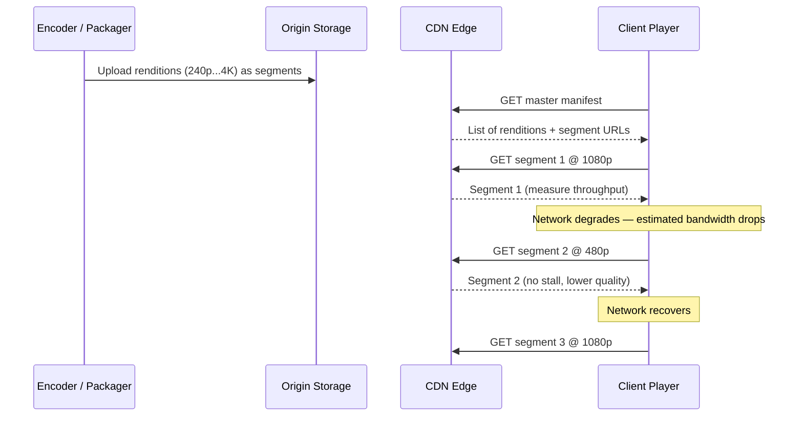
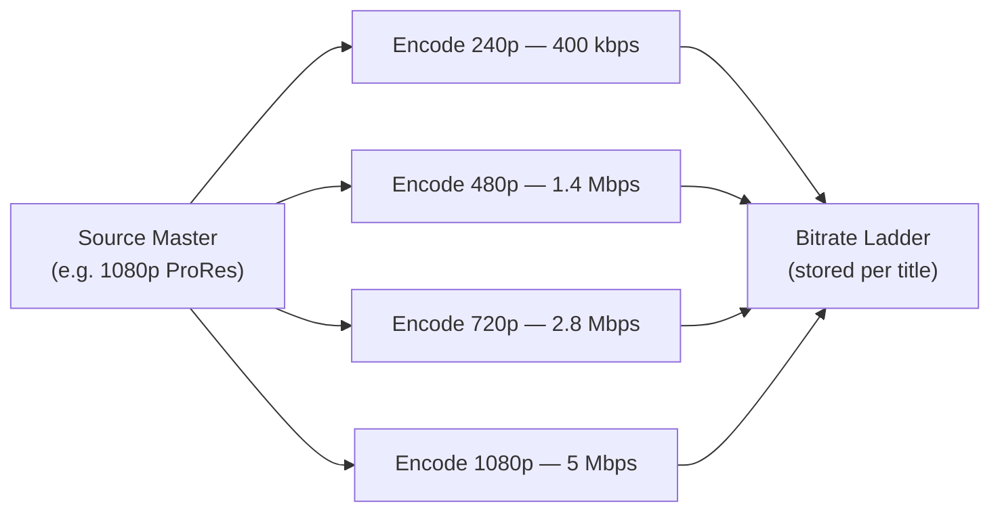
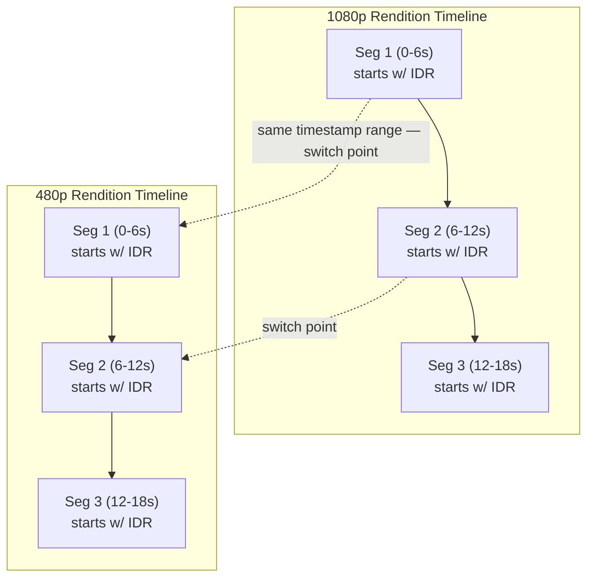
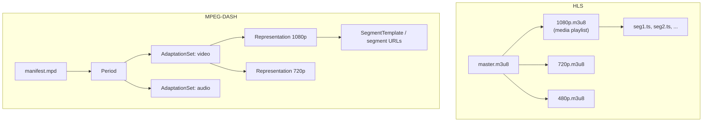
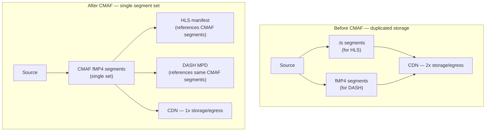
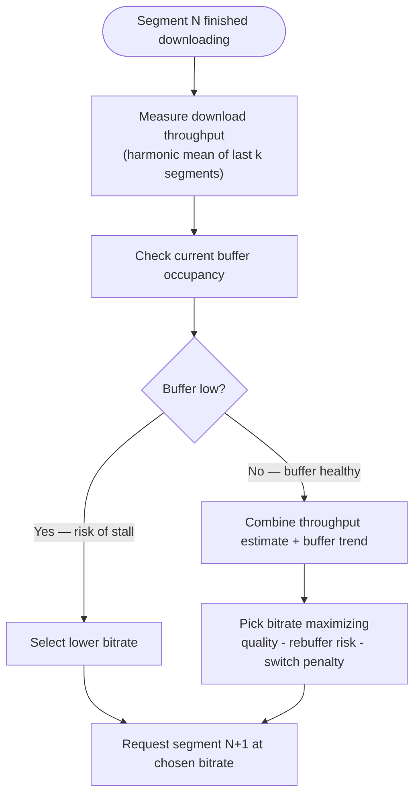
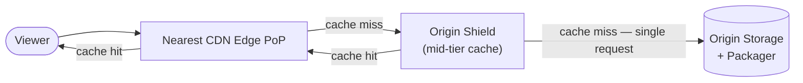
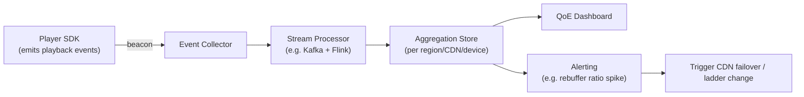

# Adaptive Birtate Streaming

## Blogs and websites


## Medium


## Youtube

- [What is Adaptive Bitrate Streaming? | Video Streaming Explained](https://www.youtube.com/watch?v=-JtjQ-OA7XE)

## Theory

### Topics Covered

- **What Is Adaptive Bitrate Streaming?** — the core problem ABR solves and how it differs from progressive download.
- **Bitrate Ladder Design & Video Encoding Profiles** — resolution/bitrate tiers, codecs, per-title encoding.
- **Segmentation: GOPs, Chunks & Segment Duration** — keyframe alignment and the latency/overhead/quality trade-off.
- **Manifest Formats: HLS (M3U8) vs MPEG-DASH (MPD)** — how the client discovers renditions and segments.
- **Packaging: CMAF & Unified Delivery** — one set of segments serving both HLS and DASH.
- **Client-Side ABR Algorithms** — buffer-based, throughput-based and hybrid (MPC) bitrate selection.
- **CDN, Origin & Edge Delivery Architecture** — caching, origin shields, multi-CDN.
- **QoE Metrics & Monitoring** — rebuffering ratio, startup time, bitrate switch frequency.

This is a high-yield topic in video/streaming system design rounds (e.g. "design Netflix/YouTube/Twitch") — each subtopic below includes the core theory, a diagram, a real-life use case, a Java code example, and interview questions with answers.

### What Is Adaptive Bitrate Streaming?

Adaptive Bitrate (ABR) Streaming is a technique for delivering video/audio over plain HTTP where the same source content is encoded into **multiple quality renditions** (different resolution + bitrate combinations), split into small time-aligned **segments**, and the **client player** continuously monitors its network throughput and local buffer health to decide — segment by segment — the best rendition it can sustain without stalling.

Before ABR, streaming had two bad options:
- **Fixed single bitrate** — pick one quality for everyone. Too high and slow connections constantly rebuffer; too low and fast connections get needlessly poor quality.
- **Progressive download** — download one file top-to-bottom (like an MP4 over HTTP). There's no way to switch quality mid-playback if the network degrades, and seeking/scrubbing is inefficient since the whole file must be fetched sequentially.

ABR solves this by decoupling **what quality is played** from **what is encoded** — the encoder prepares every quality level up front, and the *player* (not the server) makes the real-time decision of which one to request next, based on conditions it observes locally (buffer, throughput, CPU/decoder capability, screen size).



> **Real-life use case:** A Netflix viewer starts a 4K stream on home WiFi (~25 Mbps). They walk into a room with a weak signal and throughput drops to 3 Mbps. Instead of the video freezing, the player seamlessly drops to a 1080p or 720p rendition within a segment or two — the viewer notices a brief drop in sharpness but never sees a spinning buffer icon.

#### Code Example (Java)

```java
public record Rendition(int heightPx, int bitrateKbps, String codec, String segmentUrlTemplate) {}

public class SimpleAbrPlayer {

    private static final double SAFETY_MARGIN = 0.8; // never commit more than 80% of estimated bandwidth

    /** Picks the highest-quality rendition that fits within the estimated bandwidth. */
    public Rendition selectBitrate(double estimatedBandwidthKbps, List<Rendition> ladder) {
        return ladder.stream()
                .filter(r -> r.bitrateKbps() <= estimatedBandwidthKbps * SAFETY_MARGIN)
                .max(Comparator.comparingInt(Rendition::bitrateKbps))
                .orElse(ladder.get(0)); // fall back to lowest rendition if nothing fits
    }
}
```

#### Interview Questions

**1. What problem does ABR solve compared to a single fixed-bitrate stream?**

A fixed-bitrate stream forces every viewer onto one quality level regardless of their actual network conditions. Viewers with slow or congested connections experience constant rebuffering because the server keeps sending data faster than the network can deliver it; viewers with fast connections are stuck with unnecessarily low quality because the bitrate was chosen conservatively for the lowest common denominator. ABR removes this compromise by preparing multiple quality renditions up front and letting each client's player pick — and continuously re-pick — the rendition that best matches its *own*, currently observed network and buffer conditions, so slow connections get a lower (but stall-free) quality and fast connections get the best quality they can sustain.

**2. How does ABR differ from progressive download?**

Progressive download fetches a single, fixed-quality file sequentially over HTTP (e.g. a raw MP4) — the client has no ability to switch quality mid-stream if conditions change, and efficient seeking requires either a fully downloaded file or byte-range tricks that don't adapt quality. ABR instead encodes the content into multiple discrete renditions split into short, independently decodable segments; the player requests each segment individually and can choose a *different* rendition for the very next segment based on updated network/buffer measurements, giving it fine-grained, continuous adaptability that progressive download fundamentally cannot provide.

**3. Why is ABR built on top of plain HTTP rather than RTSP/UDP-based streaming protocols?**

HTTP-based ABR (HLS, DASH) piggybacks on the existing web infrastructure: standard HTTP CDNs, caches, load balancers, and firewalls all already understand and optimize for HTTP GET requests, so segments can be cached and scaled exactly like any other static web asset — no specialized streaming servers or open UDP ports are required (which are often blocked by corporate/mobile firewalls). RTSP/RTP/UDP-based streaming needs dedicated streaming servers, doesn't benefit from ubiquitous HTTP caching, and is frequently blocked by NATs and firewalls. The trade-off is that HTTP/TCP-based ABR has slightly higher inherent latency than raw UDP streaming, which is why low-latency variants (LL-HLS, LL-DASH, chunked CMAF) were later introduced to close that gap while keeping the HTTP/CDN benefits.

### Bitrate Ladder Design & Video Encoding Profiles

A **bitrate ladder** is the set of resolution + bitrate + codec combinations ("renditions") that the encoder produces for a single piece of source content. A typical fixed ladder for a 1080p source might look like:

| Rendition | Resolution | Bitrate | Codec | Typical Network |
|---|---|---|---|---|
| Audio-only | — | 64 kbps | AAC | Extremely poor / offline fallback |
| Low | 426x240 | 400 kbps | H.264 | 3G / congested mobile |
| SD | 640x360 | 800 kbps | H.264 | Weak WiFi |
| SD+ | 854x480 | 1.4 Mbps | H.264 | Average mobile |
| HD | 1280x720 | 2.8 Mbps | H.264/H.265 | Good WiFi |
| Full HD | 1920x1080 | 5 Mbps | H.264/H.265 | Broadband |

A rendition should never exceed the **source resolution/quality** — upscaling low-resolution source to a higher-resolution rendition wastes bitrate encoding detail that was never captured. More sophisticated pipelines use **per-title encoding**: instead of a fixed ladder for every asset, the encoder analyzes each title's visual complexity (a static talk show vs. a fast-motion action film) and computes a custom bitrate/resolution ladder that sits on the **convex hull** of the quality-vs-bitrate curve for that specific content — animation can hit high perceptual quality at a much lower bitrate than a high-motion action scene, so a one-size-fits-all ladder wastes bits on simple content and under-serves complex content.



> **Real-life use case:** Netflix's per-title encoding (described in their tech blog) reduced average bitrate by roughly 20% across their catalog compared to a fixed ladder, by giving simple/animated content (e.g. cartoons) a much lower top bitrate while giving high-complexity content (e.g. action movies with rapid motion) a higher one — same or better perceptual quality, less CDN egress cost.

#### Code Example (Java)

```java
public class BitrateLadderBuilder {

    private static final List<Rendition> STANDARD_LADDER = List.of(
            new Rendition(240, 400, "H.264", "/240p/seg-%d.ts"),
            new Rendition(360, 800, "H.264", "/360p/seg-%d.ts"),
            new Rendition(480, 1400, "H.264", "/480p/seg-%d.ts"),
            new Rendition(720, 2800, "H.264", "/720p/seg-%d.ts"),
            new Rendition(1080, 5000, "H.264", "/1080p/seg-%d.ts")
    );

    /** Never recommend a rendition taller than the source — avoids wasted upscaled bitrate. */
    public List<Rendition> recommendLadder(int sourceHeightPx) {
        return STANDARD_LADDER.stream()
                .filter(r -> r.heightPx() <= sourceHeightPx)
                .toList();
    }
}
```

#### Interview Questions

**1. Why shouldn't the bitrate ladder include a rendition of higher resolution than the source?**

Upscaling a lower-resolution source to a "higher-resolution" rendition doesn't add any real detail — the extra pixels are interpolated, not captured, so the rendition costs more bitrate to store and transmit while delivering no genuine quality improvement over just displaying the native-resolution rendition scaled up on the client's screen (which decoders/displays already do for free). Excluding it saves storage, encoding time, and CDN egress with zero perceptual quality loss.

**2. What is per-title encoding and why does Netflix use it?**

Per-title encoding analyzes each individual asset's visual complexity (motion, texture, noise) and computes a custom bitrate ladder for it, rather than applying one fixed ladder to every title. Because perceptual quality per bitrate varies enormously by content type — animation/low-motion content reaches near-perfect quality at a fraction of the bitrate that high-motion/high-detail content needs — a fixed ladder must be conservative enough to look acceptable on the *worst-case* (most complex) content, wasting bitrate on everything simpler. Netflix uses per-title (and even per-shot/per-chunk in later iterations) encoding to cut average bitrate substantially catalog-wide while maintaining or improving perceptual quality, directly reducing CDN egress costs at their scale.

**3. Why must the GOP/keyframe interval align with the segment duration?**

Each segment must be independently decodable so that a player switching renditions between segments (or a CDN caching/serving segments individually) doesn't need any data from a different segment to start decoding. That requires every segment to start exactly on a keyframe (I-frame) — a "closed GOP" boundary. If the GOP length doesn't evenly divide the segment duration, segment boundaries would sometimes land mid-GOP, meaning the first frames of that segment couldn't be decoded standalone, breaking both clean bitrate switching and reliable segment caching.

### Segmentation: GOPs, Chunks & Segment Duration

ABR content is split into short, self-contained **segments** (typically 2–10 seconds each, with 6 seconds being a common default). Each segment must begin with a keyframe (IDR frame) so the decoder can start fresh without depending on frames from a previous segment — this is called a **closed GOP**. Critically, every rendition's segments must be **time-aligned**: segment *N* covers the exact same playback time range in the 240p rendition as it does in the 1080p rendition, so the player can switch renditions between segment *N* and *N+1* without any gap or overlap in the timeline.

Segment duration is a direct trade-off:
- **Shorter segments** (e.g. 1–2s) → finer-grained bitrate switching, lower end-to-end latency, but higher HTTP request overhead and slightly worse compression efficiency (more frequent keyframes, which are larger than predicted frames).
- **Longer segments** (e.g. 6–10s) → better compression efficiency and fewer requests, but coarser switching granularity (a bad bitrate decision "sticks" for longer) and higher latency for live streaming.

Low-latency variants (LL-HLS, LL-DASH) split each segment further into small **partial segments/chunks** (a few hundred milliseconds) inside a CMAF fragment, letting the player start consuming data before the full parent segment finishes encoding.



> **Real-life use case:** Twitch and other low-latency live platforms reduce chunk size down to sub-second CMAF fragments (LL-HLS/LL-DASH) to cut glass-to-glass latency from the traditional ~30-45 seconds of classic HLS down to under 3-5 seconds, which matters enormously for live chat/interaction to feel synchronized with the stream.

#### Code Example (Java)

```java
public class Segmenter {

    /** Computes segment boundary timestamps, requiring the keyframe interval to evenly divide segment duration. */
    public List<Double> computeSegmentBoundaries(double totalDurationSec, double segmentDurationSec, double keyframeIntervalSec) {
        if (segmentDurationSec % keyframeIntervalSec != 0) {
            throw new IllegalArgumentException("Keyframe interval must evenly divide segment duration for closed-GOP alignment");
        }
        List<Double> boundaries = new ArrayList<>();
        for (double t = 0; t < totalDurationSec; t += segmentDurationSec) {
            boundaries.add(t);
        }
        return boundaries;
    }
}
```

#### Interview Questions

**1. Why must every rendition's segments be aligned at the same timestamps?**

If rendition A's segment 3 covers a different time range than rendition B's segment 3, switching from A to B between segments would either skip or repeat playback time, causing a visible glitch or A/V desync. Time-aligned segments (all derived from the same closed-GOP structure with identical segment/keyframe boundaries) guarantee that any rendition's segment *N* is a drop-in substitute for any other rendition's segment *N*, which is what makes seamless mid-stream quality switching possible.

**2. What trade-off does segment duration create between latency, overhead and switch granularity?**

Shorter segments allow the player to react to changing network conditions faster (finer switching granularity) and reduce live-streaming latency (less data must be buffered before the segment is complete), but each segment incurs its own HTTP request overhead (connection reuse helps, but TLS/HTTP header overhead and lower compression efficiency from more frequent keyframes still add up) and slightly worse compression since keyframes are far larger than predicted frames. Longer segments compress better and reduce request count but make bitrate switches coarser-grained and increase both live latency and the "blast radius" of a bad quality decision (it persists for the whole segment).

**3. What is a "closed GOP" and why is it required for ABR?**

A closed GOP is a Group of Pictures that starts with an IDR (keyframe) frame and contains no predictive references to frames outside that GOP — meaning the GOP (and therefore the segment built from it) can be decoded completely independently of any other segment. This is required for ABR because segments from different renditions must be freely interchangeable at segment boundaries (for bitrate switching) and independently servable/cacheable by a CDN — neither would be possible if decoding a segment required frames from a previous segment in a *different* rendition.

### Manifest Formats: HLS (M3U8) vs MPEG-DASH (MPD)

The **manifest** (also called a playlist/index) is the document the player fetches first — it tells the player every available rendition and where to find its segments, without the player needing to guess anything.

**HLS (HTTP Live Streaming, Apple)** uses a two-level `.m3u8` text playlist:
- A **master playlist** lists each rendition (bandwidth, resolution, codec) with a pointer to that rendition's **media playlist**.
- Each **media playlist** lists the actual segment URLs (or byte ranges) in order, plus metadata like target duration and (for live) a sliding window of recent segments.

**MPEG-DASH (Dynamic Adaptive Streaming over HTTP)** uses a single XML **MPD** (Media Presentation Description) with a hierarchical structure: `Period` (a time range of the presentation) → `AdaptationSet` (a group of interchangeable renditions for one media type, e.g. "video" or "audio") → `Representation` (one specific rendition) → `SegmentTemplate`/`SegmentList` (how to build/find segment URLs).

A key structural difference: DASH's `AdaptationSet` cleanly separates audio and video as independent adaptation sets from the start, so a player can pick a low video bitrate while keeping the best audio bitrate (or vice versa) independently. Classic HLS historically muxed audio+video together per rendition (audio-only/independent audio renditions were added later via `EXT-X-MEDIA`).

Live manifests differ from VOD manifests: a **VOD manifest** is static and lists every segment for the entire asset up front; a **live manifest** is a **sliding window** that the player re-fetches periodically, with old segments dropped off the front and new segments appended as they're encoded.



> **Real-life use case:** YouTube's player is built on DASH, taking advantage of independent audio/video adaptation sets — on a poor connection it can keep audio at full quality (audio is cheap in bitrate) while aggressively dropping video resolution, giving a much better perceived experience than dropping both proportionally.

#### Code Example (Java)

```java
public class HlsMasterPlaylistParser {

    private static final Pattern STREAM_INF = Pattern.compile(
            "#EXT-X-STREAM-INF:BANDWIDTH=(\\d+).*?RESOLUTION=(\\d+)x(\\d+)\\n(\\S+)");

    /** Extracts renditions (bandwidth, resolution, playlist URI) from a raw HLS master playlist string. */
    public List<Rendition> parse(String masterPlaylistText) {
        List<Rendition> renditions = new ArrayList<>();
        Matcher m = STREAM_INF.matcher(masterPlaylistText);
        while (m.find()) {
            int bandwidthBps = Integer.parseInt(m.group(1));
            int height = Integer.parseInt(m.group(3));
            String uri = m.group(4);
            renditions.add(new Rendition(height, bandwidthBps / 1000, "H.264", uri));
        }
        return renditions;
    }
}
```

#### Interview Questions

**1. What's the structural difference between HLS and DASH manifests?**

HLS uses a two-level plain-text `.m3u8` format: one master playlist that lists renditions and points to per-rendition media playlists, each of which lists that rendition's segment URLs in order. DASH uses a single hierarchical XML `MPD` document with `Period` → `AdaptationSet` → `Representation` → segment addressing, all in one file. DASH's `AdaptationSet` groups interchangeable renditions of the *same media type* (e.g. all video renditions in one set, all audio renditions in another), giving a cleaner, more explicit separation of independently-selectable tracks than HLS's traditionally muxed, per-rendition playlists.

**2. How does a live manifest differ from a VOD manifest?**

A VOD manifest is static and complete: it lists every segment of the entire asset from start to finish the moment it's published, and never changes. A live manifest is a sliding window: it only lists the last N segments (e.g. the last 3-5), the player must periodically re-fetch it to discover newly encoded segments, and old segments eventually fall off the front of the window and become unavailable — reflecting that a live stream has no fixed end and only recent history is retained.

**3. Why can DASH represent audio and video as independent adaptation sets more naturally than classic HLS?**

DASH's manifest schema was designed from the outset around `AdaptationSet` as a first-class grouping concept for interchangeable renditions of one media component, so audio and video are naturally two separate adaptation sets with independently selectable representations. Classic HLS's original design coupled audio and video together within a single rendition's media playlist (each `.m3u8` implicitly represented a muxed audio+video stream); independent audio/text tracks were only added later via the separate `EXT-X-MEDIA` tag, layered on top of a structure that wasn't originally built around that separation — making it a retrofit rather than DASH's native model.

### Packaging: CMAF & Unified Delivery

Historically, serving both HLS and DASH clients meant encoding and storing **two separate sets of segments**: MPEG-2 Transport Stream (`.ts`) segments for HLS, and fragmented MP4 (`.m4s`) segments for DASH — doubling encoding time, storage, and (most expensively) CDN egress and cache footprint, since every segment had to exist in two container formats.

**CMAF (Common Media Application Format)** solves this by standardizing on a single fragmented-MP4-based segment format that *both* HLS and DASH manifests can reference. The encoder/packager now produces just one set of `.m4s` media fragments (plus an initialization segment with codec/track metadata); an HLS master/media playlist and a DASH MPD are generated as two thin "views" pointing at the *same* underlying segment files. CMAF also standardizes **CENC (Common Encryption)**, letting one encrypted segment set be decrypted by multiple DRM schemes (Widevine, PlayReady, FairPlay) via different license servers, instead of encrypting separately per DRM system.



> **Real-life use case:** Apple's requirement that HLS support fragmented MP4/CMAF, combined with major streamers (Netflix, Disney+) adopting CMAF, cut per-title storage and CDN egress roughly in half by eliminating the need to store and cache a duplicate `.ts` copy of every segment purely for HLS compatibility — and CMAF's small chunked fragments are also the foundation LL-HLS and LL-DASH build low-latency streaming on top of.

#### Code Example (Java)

```java
public class CmafTrack {
    private final byte[] initSegment;
    private final List<byte[]> mediaFragments;

    public CmafTrack(byte[] initSegment, List<byte[]> mediaFragments) {
        this.initSegment = initSegment;
        this.mediaFragments = mediaFragments;
    }

    /** Same underlying fragments, exposed as an HLS media playlist. */
    public String toHlsMediaPlaylist(String baseUrl, int segmentDurationSec) {
        StringBuilder sb = new StringBuilder("#EXTM3U\n#EXT-X-TARGETDURATION:" + segmentDurationSec + "\n");
        for (int i = 0; i < mediaFragments.size(); i++) {
            sb.append("#EXTINF:").append(segmentDurationSec).append(",\n")
              .append(baseUrl).append("/frag-").append(i).append(".m4s\n");
        }
        return sb.toString();
    }

    /** Same underlying fragments, exposed as a DASH SegmentTemplate reference. */
    public String toDashSegmentTemplate(String baseUrl) {
        return "<SegmentTemplate media=\"" + baseUrl + "/frag-$Number$.m4s\" initialization=\""
                + baseUrl + "/init.mp4\" />";
    }
}
```

#### Interview Questions

**1. What problem does CMAF solve for CDN/storage costs?**

Before CMAF, serving both HLS and DASH clients required encoding, storing, and caching two separate segment container formats — MPEG-2 TS for HLS and fragmented MP4 for DASH — for every rendition of every title, roughly doubling storage footprint and CDN egress/cache pressure since the same content existed twice in different wrappers. CMAF standardizes a single fragmented MP4 segment format referenced by both HLS and DASH manifests, so only one set of segments needs to be produced, stored, and cached, cutting that duplicated cost.

**2. How does CMAF support both HLS and DASH from the same media segments?**

CMAF defines the segment *container* format (fragmented MP4 with an init segment + media fragments) independently of the manifest format. An HLS media playlist and a DASH MPD are just two different "index" documents that both point at the same underlying CMAF fragment files by URL — the manifests differ in syntax (M3U8 text vs. MPD XML) but describe access to identical bytes on disk/CDN, so no duplicate encoding or storage is needed per protocol.

**3. What role does CMAF play in achieving low-latency streaming (LL-HLS/LL-DASH)?**

CMAF's fragmented MP4 structure allows a "segment" to be built incrementally from smaller chunks/partial fragments that can be requested and played before the full parent segment has finished encoding — the player can start consuming a fragment as soon as it's available rather than waiting for a complete multi-second segment. LL-HLS and LL-DASH are both built on top of CMAF's chunked fragments (using HTTP/1.1 chunked transfer encoding or HTTP/2 push to deliver partial segments as they're produced), which is what lets them cut end-to-end latency from tens of seconds down to a few seconds without abandoning the CDN-friendly, segment-based ABR model.

### Client-Side ABR Algorithms (Buffer-Based, Throughput-Based & Hybrid)

The player's **ABR algorithm** is the logic that decides which rendition to request for the *next* segment. There are three broad families:

- **Throughput-based** — estimate available bandwidth from how fast recent segments downloaded (often a harmonic mean of the last few segments' download speed, since harmonic mean penalizes slow outliers more than an arithmetic mean), then pick the highest bitrate that fits within that estimate times a safety margin. Simple and reactive, but prone to **oscillation**: a single congestion blip can cause an unnecessary downgrade, and instantaneous throughput samples are noisy on shared/mobile networks.
- **Buffer-based** (e.g. **BOLA**, based on Lyapunov optimization) — ignore bandwidth estimation almost entirely and instead decide purely from **buffer occupancy**: if the buffer is comfortably full, request a higher bitrate; if the buffer is draining toward empty, drop to a lower bitrate to avoid a stall. This is naturally robust to noisy bandwidth estimates since the buffer level is itself an integrated signal of "am I downloading faster than I'm playing."
- **Hybrid / MPC (Model Predictive Control)** — combine both signals: estimate future throughput *and* simulate buffer evolution several segments ahead, choosing the bitrate sequence that maximizes a reward function balancing quality, rebuffer risk, and switch smoothness (penalizing frequent up/down oscillation). Netflix's and many production players' algorithms are hybrid/MPC-inspired for exactly this reason — pure throughput-based algorithms are too reactive/oscillatory, and pure buffer-based algorithms can be slow to react to a genuinely deteriorating network before the buffer has drained.



> **Real-life use case:** YouTube's ABR leans heavily buffer-based (BOLA-inspired) so it stays robust across highly variable mobile networks without chasing every momentary bandwidth fluctuation; Netflix combines buffer occupancy with a throughput/MPC-style predictive model so its player can proactively step down *before* the buffer gets dangerously low on a degrading connection, rather than reactively waiting for the buffer to already be draining.

#### Code Example (Java)

```java
public class AbrController {

    private final Deque<Double> recentThroughputsKbps = new ArrayDeque<>();
    private static final int WINDOW = 4;
    private static final double LOW_BUFFER_SEC = 5.0;
    private static final double HIGH_BUFFER_SEC = 20.0;

    public void recordSegmentDownload(long bytes, double downloadSeconds) {
        double kbps = (bytes * 8.0 / 1000.0) / downloadSeconds;
        if (recentThroughputsKbps.size() == WINDOW) recentThroughputsKbps.poll();
        recentThroughputsKbps.offer(kbps);
    }

    /** Harmonic mean penalizes slow samples more than an arithmetic mean — safer bandwidth estimate. */
    private double estimateThroughputKbps() {
        double sumOfReciprocals = recentThroughputsKbps.stream().mapToDouble(v -> 1.0 / v).sum();
        return recentThroughputsKbps.size() / sumOfReciprocals;
    }

    /** Hybrid decision: buffer-based safety net combined with a throughput-based ceiling. */
    public Rendition selectNextBitrate(double bufferLevelSec, List<Rendition> ladder) {
        if (bufferLevelSec < LOW_BUFFER_SEC) {
            return ladder.get(0); // buffer critically low — always drop to lowest to avoid a stall
        }
        double estimatedKbps = estimateThroughputKbps() * 0.8; // safety margin
        Rendition candidate = ladder.stream()
                .filter(r -> r.bitrateKbps() <= estimatedKbps)
                .max(Comparator.comparingInt(Rendition::bitrateKbps))
                .orElse(ladder.get(0));

        if (bufferLevelSec > HIGH_BUFFER_SEC) {
            return candidate; // buffer healthy — free to use the full throughput-based estimate
        }
        // Mid-range buffer: be conservative, cap at current rendition to avoid oscillation
        return candidate;
    }
}
```

#### Interview Questions

**1. Why is throughput-based ABR alone prone to oscillation/aggressive switching?**

Instantaneous or short-window throughput samples on real networks (especially mobile/shared WiFi) are noisy — a momentary congestion blip or a competing download can make a single segment's measured throughput look much worse (or better) than the true sustainable bandwidth. An algorithm that reacts to every sample directly will downgrade on a transient blip and then upgrade again once it passes, causing frequent, visually jarring bitrate switches even though the underlying network conditions were actually stable. Smoothing (harmonic mean over a window) and safety margins help, but purely throughput-driven logic is fundamentally reactive to noise rather than the true trend.

**2. How does buffer-based ABR (like BOLA) make decisions without directly measuring bandwidth?**

Buffer-based algorithms treat buffer occupancy as an implicit, self-correcting signal of the download-vs-playback rate: if segments are downloading faster than they're being played, the buffer grows; if downloads can't keep up, the buffer drains. BOLA (grounded in Lyapunov optimization) picks a bitrate as a function of current buffer level relative to configured thresholds — request higher bitrates when the buffer has a healthy cushion, and step down as the buffer approaches empty — without needing an explicit bandwidth estimate at all. This makes it naturally robust to noisy or hard-to-estimate bandwidth, since the buffer level already reflects the net effect of whatever the real throughput has been.

**3. What is a hybrid/MPC-based ABR algorithm and why do major players use it?**

MPC (Model Predictive Control) based ABR looks several segments into the future: it predicts likely throughput and simulates how the buffer would evolve under different candidate bitrate sequences, then picks the sequence (in practice, just the next decision) that maximizes a reward function combining expected video quality, rebuffer risk, and a penalty for switching bitrates too often. This is preferred over pure throughput-based or pure buffer-based approaches because it explicitly balances all three competing objectives instead of over-optimizing for just one — pure throughput-chasing causes oscillation, pure buffer-only reacts too late to a real (not noisy) degrading trend. Netflix and similarly sophisticated production players use MPC/hybrid approaches because at their scale, small improvements in average quality-of-experience translate into meaningful differences in viewer engagement and infrastructure cost.

### CDN, Origin & Edge Delivery Architecture for ABR

Once content is encoded, segmented, and packaged, it needs to reach millions of concurrent viewers with low latency — this is the CDN's job. The **origin** (object storage + packager) holds the authoritative copy of every rendition's segments. A global **CDN** with many edge Points of Presence (PoPs) caches segments close to viewers, since ABR segments are ideal cache candidates: they're **immutable** once published (a VOD segment never changes) and requested repeatedly by many viewers, giving very high cache-hit ratios with simple, long-TTL HTTP caching — no different from caching a static image.

On a cache miss, the edge PoP doesn't necessarily go straight to the origin — large deployments insert an **origin shield**, a mid-tier cache layer that all edge PoPs miss through to, so that a spike in demand for the same uncached segment (e.g. right when a live event starts) results in only *one* request per shield reaching the origin instead of one per edge PoP globally, protecting the origin from a "thundering herd." Many large streamers also run **multi-CDN**: multiple CDN providers behind a request router that picks the best-performing CDN per viewer/ISP/region, for both resilience (a single CDN outage doesn't take the whole service down) and cost/performance optimization.



> **Real-life use case:** Disney+'s launch day faced record concurrent streams; a multi-CDN strategy with per-ISP/per-region request routing spread the load across several CDN providers so no single provider's capacity limit became a global outage, and origin shields kept the spike in first-viewer cache misses for newly released content from overwhelming the origin.

#### Code Example (Java)

```java
public class EdgeCache {

    private final int capacity;
    private final LinkedHashMap<String, byte[]> cache;
    private long hits = 0, misses = 0;

    public EdgeCache(int capacity) {
        this.capacity = capacity;
        this.cache = new LinkedHashMap<>(16, 0.75f, true) {
            protected boolean removeEldestEntry(Map.Entry<String, byte[]> eldest) {
                return size() > EdgeCache.this.capacity; // simple LRU eviction
            }
        };
    }

    public byte[] getSegment(String segmentUrl, Function<String, byte[]> originFetch) {
        byte[] cached = cache.get(segmentUrl);
        if (cached != null) {
            hits++;
            return cached;
        }
        misses++;
        byte[] fetched = originFetch.apply(segmentUrl); // falls through to origin shield/origin
        cache.put(segmentUrl, fetched);
        return fetched;
    }

    public double hitRatio() {
        return hits + misses == 0 ? 0 : (double) hits / (hits + misses);
    }
}
```

#### Interview Questions

**1. Why are ABR video segments especially cache-friendly for a CDN?**

VOD segments are immutable — once encoded and published, a given segment's bytes never change — and they're requested repeatedly by many different viewers watching the same popular content. This combination (immutability + high request repetition) is exactly what makes something an ideal HTTP cache candidate: a segment can be cached with a long TTL, safely revalidated rarely if ever, and served to thousands of viewers from a single cached copy at the edge, achieving very high cache-hit ratios with simple caching semantics — no different in principle from caching a static image or JS bundle.

**2. What is an origin shield and what problem does it solve?**

An origin shield is a mid-tier cache layer positioned between many geographically distributed edge PoPs and the origin. Without it, a cache miss for the same object happening simultaneously at dozens/hundreds of edge PoPs (e.g. everyone watching a newly live event at once) would each independently request that object from the origin, creating a "thundering herd" that can overwhelm origin capacity right at the moment of peak demand. The origin shield deduplicates this: all edge PoPs miss through to the *same* shield node (per object/region), so only one request per shield reaches the origin regardless of how many edges missed, and every subsequent edge miss is served from the shield's cache instead.

**3. Why do large streaming platforms use multi-CDN architectures?**

A single CDN provider represents a single point of failure and a hard capacity ceiling — an outage, misconfiguration, or regional capacity limit at that one provider can degrade or take down playback for the entire viewer base. Multi-CDN spreads traffic across several independent CDN providers, with a request-routing layer (often DNS-based or client-side) selecting the best-performing/available provider per viewer's ISP and region in real time. This gives resilience (failover away from a degraded/down CDN), performance optimization (different CDNs perform differently per ISP/region), and negotiating leverage/cost optimization across providers at massive scale.

### QoE Metrics & Monitoring (Rebuffering, Startup Time, Bitrate Switches)

Encoding and delivery choices ultimately need to be judged against **Quality of Experience (QoE)** — what the viewer actually perceives — not just infrastructure metrics like CDN hit ratio. The key QoE metrics every ABR system tracks:

- **Startup/join time** — delay between the viewer pressing play and the first frame rendering. Dominated by manifest fetch, initial bitrate selection, and how much buffer the player insists on pre-filling before starting playback.
- **Rebuffering ratio** — the percentage of total playback time spent stalled waiting for data. Widely considered the single most important QoE metric, since studies consistently show rebuffering correlates most strongly with viewers abandoning a stream.
- **Average bitrate / average quality** — the time-weighted average bitrate (or a perceptual quality score like VMAF) actually delivered over the session.
- **Bitrate switch frequency & amplitude** — how often, and by how much, the rendition changes. Frequent or large jumps (e.g. bouncing between 1080p and 240p) are visually jarring even if the *average* bitrate over the session looks fine.

Player SDKs emit these as events (segment downloaded, rebuffer start/end, bitrate switched, playback started/ended) to an analytics/beacon endpoint; a streaming pipeline (e.g. Kafka + a stream processor) aggregates them into dashboards and alerts, and platforms correlate QoE metrics directly against business metrics like watch time and churn to prioritize engineering investment (e.g. "is it worth a CDN failover to cut rebuffer ratio in this region?").



> **Real-life use case:** Netflix and YouTube both run QoE dashboards that correlate rebuffering ratio and startup delay directly with viewer abandonment/drop-off rate per region and CDN; when a specific CDN or region's rebuffer ratio spikes past a threshold, automated systems can shift traffic to an alternate CDN or adjust the bitrate ladder before the degradation meaningfully impacts engagement.

#### Code Example (Java)

```java
public record PlaybackEvent(String type, long timestampMs) {} // types: START, REBUFFER_START, REBUFFER_END, BITRATE_SWITCH, END

public class PlayerMetrics {

    public double rebufferRatio(List<PlaybackEvent> events) {
        long totalPlaybackMs = events.get(events.size() - 1).timestampMs() - events.get(0).timestampMs();
        long rebufferMs = 0;
        Long rebufferStart = null;
        for (PlaybackEvent e : events) {
            if (e.type().equals("REBUFFER_START")) rebufferStart = e.timestampMs();
            if (e.type().equals("REBUFFER_END") && rebufferStart != null) {
                rebufferMs += e.timestampMs() - rebufferStart;
                rebufferStart = null;
            }
        }
        return totalPlaybackMs == 0 ? 0 : (double) rebufferMs / totalPlaybackMs;
    }

    public long startupDelayMs(List<PlaybackEvent> events, long playRequestedAtMs) {
        return events.stream()
                .filter(e -> e.type().equals("START"))
                .findFirst()
                .map(e -> e.timestampMs() - playRequestedAtMs)
                .orElse(-1L);
    }

    public long bitrateSwitchCount(List<PlaybackEvent> events) {
        return events.stream().filter(e -> e.type().equals("BITRATE_SWITCH")).count();
    }
}
```

#### Interview Questions

**1. What is rebuffering ratio and why is it considered the most important QoE metric?**

Rebuffering ratio is the fraction of total intended playback time that the viewer spends stalled, waiting for the player's buffer to refill because it ran empty. It's considered the single most important QoE metric because it represents a complete interruption of the experience (as opposed to, say, a lower-quality-but-still-playing stream), and it correlates most strongly with viewers abandoning a session in essentially every large-scale streaming study — a single, even brief, rebuffer event measurably increases the odds a viewer stops watching, far more than a comparable dip in average bitrate does.

**2. How do frequent bitrate switches hurt perceived quality even if average bitrate stays high?**

Human perception is highly sensitive to *changes* in quality, not just the average level — a stream that oscillates between 1080p and 360p every few segments is visibly jarring and reads as "unstable" even if its time-weighted average bitrate matches a stream that played steadily at 720p throughout. Frequent switching also often indicates the ABR algorithm is chasing noisy bandwidth estimates rather than converging on a sustainable rate, and large jumps in either direction (both up and down) draw the eye to the transition itself, breaking immersion — this is exactly why modern ABR algorithms (hybrid/MPC) explicitly penalize switch frequency and amplitude in their bitrate-selection objective, not just optimize for raw average bitrate.

**3. How would you design a pipeline to collect and aggregate QoE metrics at scale (millions of concurrent viewers)?**

Each player SDK emits lightweight playback events (start, rebuffer start/end, bitrate switch, segment download stats, end) as periodic or event-triggered beacons to a collector endpoint, batching/compressing client-side to avoid a request storm per event. The collector publishes into a high-throughput streaming pipeline (e.g. Kafka), where a stream processor (e.g. Flink/Spark Streaming) computes rolling aggregates (rebuffer ratio, startup delay percentiles, switch counts) windowed by dimensions like region, CDN, device type, and title, writing results into a time-series/aggregation store that backs real-time dashboards. Given the event volume at millions of concurrent viewers, the collector tier and stream processing must scale horizontally and tolerate at-least-once delivery (with idempotent aggregation keyed by session ID), and alerting thresholds (e.g. rebuffer ratio exceeding X% in a region) should be able to trigger automated mitigations like CDN traffic shifting without waiting for a human to notice a dashboard anomaly.

