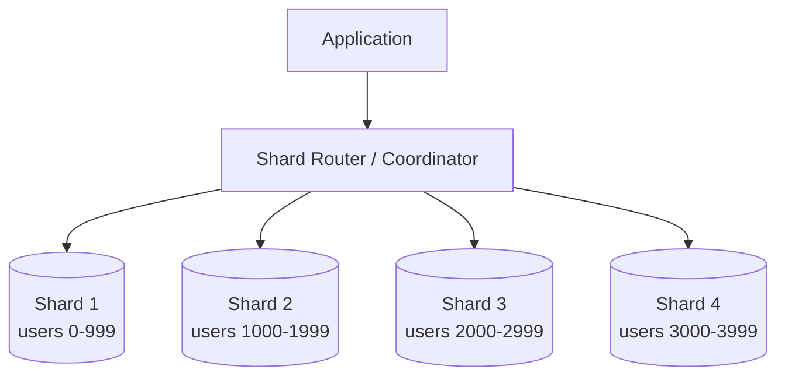
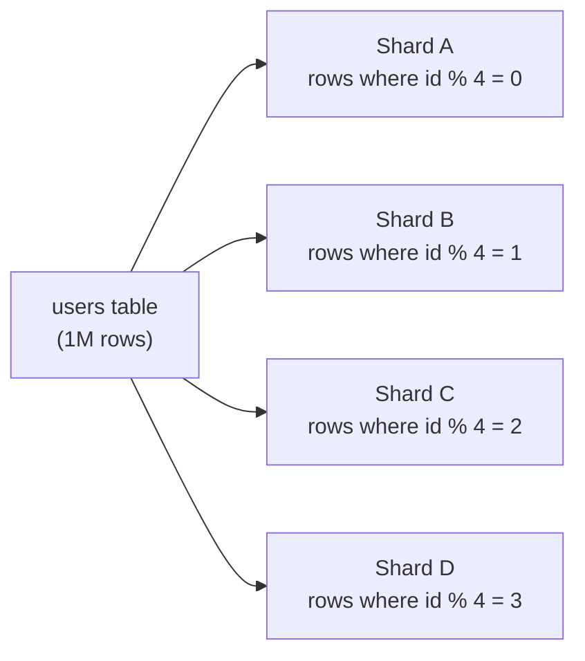
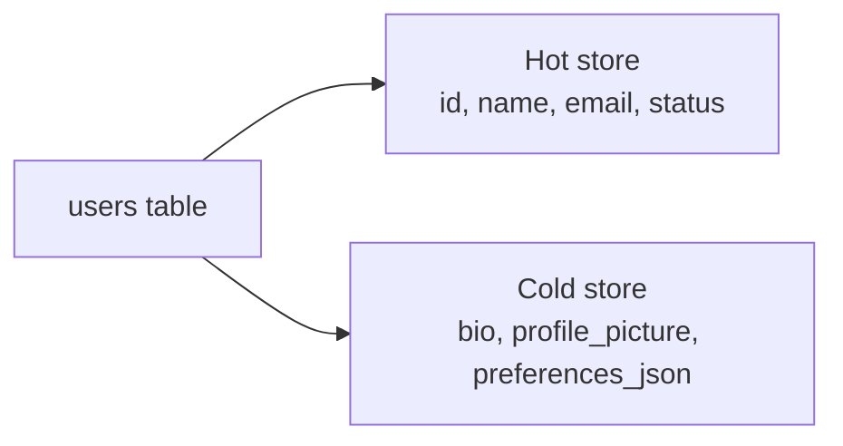
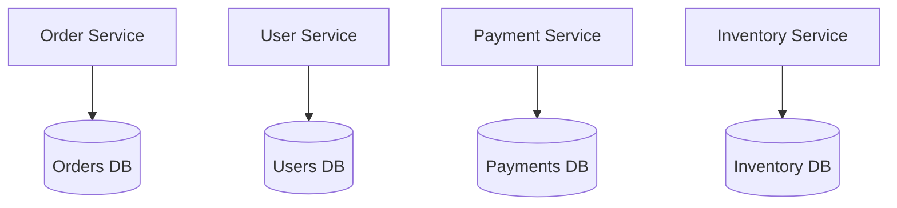
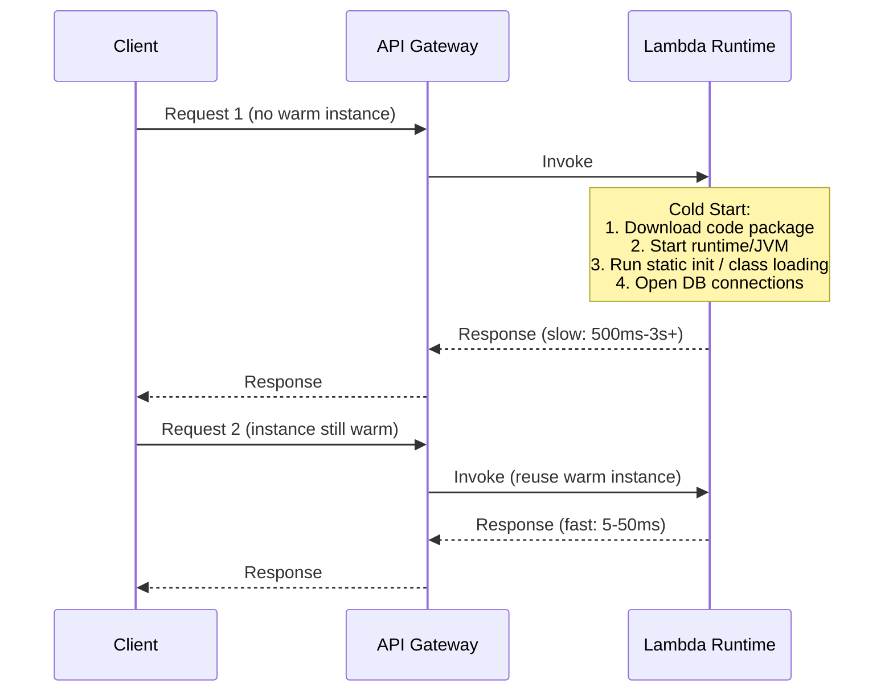
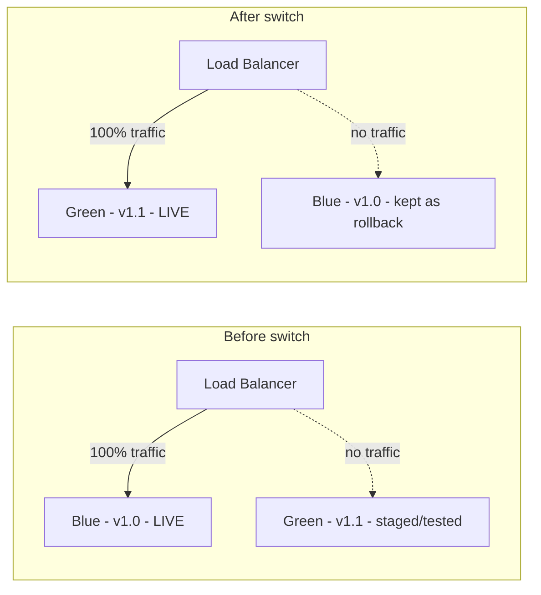
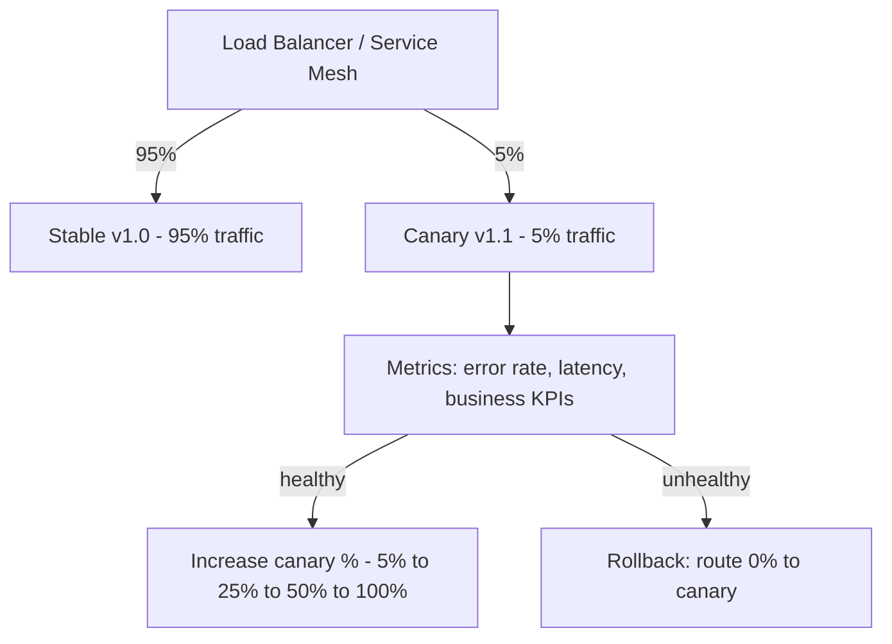
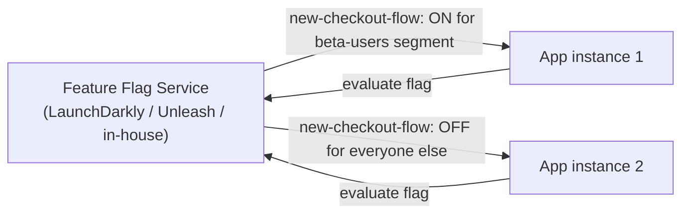

# Data Partitioning

## Blogs and websites

- [Sharding Pinterest: How we scaled our MySQL fleet](https://medium.com/pinterest-engineering/sharding-pinterest-how-we-scaled-our-mysql-fleet-3f341e96ca6f)
- [Instagram Engineering: Sharding & IDs at Instagram](https://instagram-engineering.com/sharding-ids-at-instagram-1cf5a71e5a5c)

## Medium

- [Top 15 Software Development Trends in 2024](https://serokell.medium.com/top-15-software-development-trends-in-2024-5a4526653004)

## Youtube


## Theory

### What Is Data Partitioning?

Data partitioning is the practice of **splitting a large dataset into smaller, independent pieces (partitions/shards)** so that no single machine has to store or serve all of the data. It is the foundational technique that lets a database scale **horizontally** — by adding more machines — instead of only **vertically** — by buying a bigger machine.

Without partitioning, a single database node eventually hits a hard ceiling:

```
Single node limits (rule of thumb):
  Storage:      a few TB before backups/restores become painful
  Write IOPS:   limited by disk & single writer
  Connections:  thousands, then contention dominates
  RAM:          working set must fit for good cache hit rate
```

Partitioning removes this ceiling by turning "one huge table" into "many small tables", each of which fits comfortably in memory/disk and can be served by its own node.



### Why Partition Data?

- **Scalability** — spread storage and query load across many machines instead of one
- **Performance** — smaller indexes and working sets per node mean faster lookups and more of the data fits in RAM
- **Availability** — a failure in one shard only affects the users/data on that shard, not the whole system
- **Parallelism** — queries that scan multiple shards can run concurrently (scatter-gather)
- **Cost** — commodity hardware scaled horizontally is usually cheaper than exotic vertical scaling

### Types of Partitioning

#### 1. Horizontal Partitioning (Sharding)

Split a table by **rows** — each shard holds a subset of the rows, but all shards share the same schema.



Use case: user tables, orders, events — anything that grows unbounded in row count.

#### 2. Vertical Partitioning

Split a table by **columns** — frequently accessed "hot" columns live in one store, rarely accessed "cold"/large columns (blobs, bios, logs) live in another.



Use case: keep the frequently-queried columns small and cache-friendly, while large/rarely-read blobs (profile pictures, long text) don't bloat the primary table's pages.

#### 3. Functional Partitioning (Data Domain Split)

Split **by business domain/service** — each microservice owns its own database. This is the natural partitioning strategy that falls out of a microservices architecture.



Use case: large organizations splitting a monolith database along team/service boundaries (Database-per-Service pattern).

### Partitioning Strategies (How to Pick a Shard Key)

| Strategy | How it works | Pros | Cons |
|---|---|---|---|
| **Range-based** | Partition by a contiguous key range (e.g., `user_id 1-1000` → shard 1) | Simple, efficient range queries | Hotspots if writes cluster at the end of a range (e.g., auto-increment IDs, timestamps) |
| **Hash-based** | `hash(key) % N` decides the shard | Even distribution, no hotspots | Range queries become scatter-gather across all shards; resharding is expensive |
| **List-based** | Explicit list of values mapped to a shard (e.g., country → region shard) | Intuitive, good for categorical data | Uneven distribution if one category dominates |
| **Directory-based** | A lookup service/table maps key → shard | Flexible, easy to rebalance (update the mapping) | Lookup service becomes a bottleneck/single point of failure — must be highly available |
| **Consistent Hashing** | Hash ring so only `1/N` of keys move when a node is added/removed | Minimal data movement on scale up/down | More complex to implement — see [Consistent Hashing](consistent-hashing.md) |

### Real-World Use Case

**Instagram's ID sharding (~2011):** Instagram needed globally unique, sortable-by-time IDs across thousands of PostgreSQL shards without a central ID-generation service (which would be a single point of failure/bottleneck). Their solution encoded three things into a single 64-bit integer:

```
64-bit ID = [41 bits: ms since custom epoch] [13 bits: shard ID] [10 bits: auto-increment sequence]
```

This let every shard generate IDs **independently**, while the ID itself still: (1) sorts roughly by creation time, (2) encodes which shard the row lives on so a lookup by ID doesn't need a directory service, and (3) avoids collisions across shards.

**Discord's shard migration:** Discord partitions messages by `channel_id` using range-based buckets on Cassandra, and later moved hot data to a re-partitioned scheme when a small number of extremely active channels created hotspots — a classic **celebrity/hot-partition problem**.

### Java Code Example: A Simple Hash-Based Shard Router

```java
public class ShardRouter {

    private final int shardCount;
    private final List<DataSource> shardDataSources;

    public ShardRouter(List<DataSource> shardDataSources) {
        this.shardDataSources = shardDataSources;
        this.shardCount = shardDataSources.size();
    }

    /** Deterministically maps a key to one of the configured shards. */
    public int resolveShard(String key) {
        int hash = Math.abs(murmur3(key));
        return hash % shardCount;
    }

    public DataSource dataSourceFor(String key) {
        return shardDataSources.get(resolveShard(key));
    }

    // Stand-in for a real hashing function (Guava's Hashing.murmur3_32() in production).
    private int murmur3(String key) {
        return key.hashCode();
    }
}

// Usage: routing a user lookup to the correct shard
public class UserRepository {

    private final ShardRouter shardRouter;

    public UserRepository(ShardRouter shardRouter) {
        this.shardRouter = shardRouter;
    }

    public User findById(String userId) throws SQLException {
        DataSource shard = shardRouter.dataSourceFor(userId);
        try (Connection conn = shard.getConnection();
             PreparedStatement stmt = conn.prepareStatement(
                 "SELECT * FROM users WHERE id = ?")) {
            stmt.setString(1, userId);
            try (ResultSet rs = stmt.executeQuery()) {
                return rs.next() ? User.fromResultSet(rs) : null;
            }
        }
    }
}
```

### Challenges of Partitioning

- **Rebalancing** — adding/removing shards can require moving huge amounts of data; consistent hashing mitigates this
- **Hot partitions (celebrity problem)** — a single popular key (viral post, celebrity account) overwhelms one shard while others sit idle
- **Cross-shard joins & transactions** — a query spanning multiple shards needs application-level scatter-gather or distributed transactions (2PC/Sagas), both of which are slow/complex
- **Referential integrity** — foreign keys across shards can't be enforced by the database itself
- **Operational complexity** — backups, schema migrations, and monitoring must now be done per-shard, at scale

### Interview Questions & Answers

**Q1: What's the difference between partitioning and replication?**
A: Partitioning splits **different** data across nodes to scale storage/throughput (each shard holds a unique subset of data). Replication copies the **same** data to multiple nodes to improve availability and read throughput. Large systems typically use both together — each shard is itself replicated for fault tolerance.

**Q2: How do you choose a good shard key?**
A: A good shard key has high cardinality, distributes writes/reads evenly (no hotspots), and matches the most common query pattern so most queries hit a single shard. E.g., shard by `user_id` if 95% of queries are "get data for this user"; avoid shard keys like `country` if one country dominates traffic.

**Q3: What happens when you need to add a new shard to a hash-based (`mod N`) scheme?**
A: Because `hash(key) % N` changes for nearly every key when `N` changes, almost all data must be reshuffled — an expensive, often-downtime-inducing operation. This is exactly the problem **consistent hashing** solves: adding a node only remaps `~1/N` of the keys.

**Q4: How do you handle a query that needs to join data across two shards?**
A: Options: (1) denormalize/duplicate the needed data into both shards to avoid the join, (2) do the join in the application layer with two queries + in-memory merge, (3) use a scatter-gather query and aggregate at the coordinator, or (4) redesign the shard key so related data (e.g., an order and its line items) always lives on the same shard (co-location).

**Q5: What is the "hot partition" / celebrity problem and how do you fix it?**
A: It occurs when one shard receives disproportionate traffic (e.g., a viral post's shard). Fixes include: further sub-partitioning the hot key (e.g., append a random suffix and fan-in on read), caching the hot key aggressively in front of the shard, or dynamically moving hot keys to dedicated shards.

**Q6: Range vs hash partitioning — when would you pick each?**
A: Pick **range** when range queries (e.g., "all events between two timestamps") are common and you can tolerate/avoid monotonic-key hotspots (e.g., by prefixing with a shard-friendly value). Pick **hash** when you need even distribution and mostly do point lookups, at the cost of losing efficient range scans.

### Cold Start Problem

#### What Is a Cold Start?

A **cold start** is the extra latency a request pays when it is the **first** request to hit a piece of compute that isn't already warm/running — most commonly a serverless function (AWS Lambda, Azure Functions, Google Cloud Functions), but the same phenomenon shows up in containers, JVMs, and caches.



#### Why It Happens

A cold start pays for all of the setup work that a warm instance has already amortized:

1. **Provisioning** — the platform must find/allocate a host, download the deployment package or container image
2. **Runtime bootstrap** — starting the language runtime (JVM startup is notoriously slow: 1-3s+ vs Node.js's ~100-200ms)
3. **Static initialization** — class loading, dependency-injection container wiring (Spring context startup can add multiple extra seconds), JIT hasn't warmed up yet so code runs unoptimized bytecode
4. **Connection setup** — opening DB connection pools, TLS handshakes to downstream services, loading config/secrets

Java/Spring workloads are hit especially hard by cold starts because of JVM startup + class loading + Spring's reflection-heavy context initialization, compared to lighter runtimes like Go or Node.js.

#### Real-World Use Case

**E-commerce flash sale on serverless checkout:** An online store runs its checkout service on AWS Lambda to save cost during normal traffic. During a flash sale, traffic spikes 50x within seconds. AWS auto-scales by spinning up hundreds of new Lambda instances — each one pays a cold start, so a fraction of users experience multi-second checkout delays right when conversion matters most. The fix used in practice: **provisioned concurrency** to pre-warm a baseline of instances before the sale starts, combined with **AWS Lambda SnapStart** for Java functions, which restores from a pre-initialized, frozen JVM snapshot instead of booting from scratch.

#### Java Code Example: Minimizing Cold Start Impact

```java
// BAD: heavy work done in the constructor/instance field initializer,
// re-paid on every cold start.
public class OrderHandler implements RequestHandler<OrderRequest, OrderResponse> {

    private final DynamoDbClient dynamoDb = DynamoDbClient.builder()
        .region(Region.US_EAST_1)
        .build(); // network/TLS setup happens here, on the hot path of a cold start

    @Override
    public OrderResponse handleRequest(OrderRequest request, Context context) {
        return process(request, dynamoDb);
    }
}

// BETTER: lazy-init + reuse SDK clients across warm invocations via static fields,
// and keep the constructor itself as light as possible.
public class OptimizedOrderHandler implements RequestHandler<OrderRequest, OrderResponse> {

    // Static: created once per execution environment, reused across warm invocations.
    private static volatile DynamoDbClient dynamoDb;

    private static DynamoDbClient client() {
        DynamoDbClient local = dynamoDb;
        if (local == null) {
            synchronized (OptimizedOrderHandler.class) {
                local = dynamoDb;
                if (local == null) {
                    local = DynamoDbClient.builder().region(Region.US_EAST_1).build();
                    dynamoDb = local;
                }
            }
        }
        return local;
    }

    @Override
    public OrderResponse handleRequest(OrderRequest request, Context context) {
        return process(request, client());
    }
}
```

#### Mitigation Strategies

- **Provisioned concurrency** — pre-warm a pool of instances so they're ready before traffic arrives (AWS Lambda Provisioned Concurrency, Azure Premium Plan)
- **Keep functions warm** — scheduled "ping" invocations (e.g., every 5 minutes) to prevent idle instances from being recycled — a cheap but imperfect workaround
- **Lighter runtimes** — prefer Go, Rust, Node.js, or Python over JVM-based runtimes when cold-start latency is critical
- **Snapshot-based startup** — AWS Lambda SnapStart for Java takes a frozen, initialized JVM snapshot and restores memory/state instead of re-running `main()`
- **Smaller deployment packages** — trim dependencies, use tree-shaking/native images (GraalVM native-image for Java can cut startup from seconds to milliseconds)
- **Optimize initialization code** — defer non-critical work (e.g., cache warming) to run lazily on first use rather than in static initializers

#### Interview Questions & Answers

**Q1: What's the difference between a cold start and a warm start?**
A: A cold start happens when a new execution environment must be provisioned from scratch (runtime boot, class loading, connection setup) before the actual handler code runs — adding hundreds of ms to several seconds of latency. A warm start reuses an already-initialized environment from a previous invocation, so only the handler logic runs, typically in single-digit to low tens of milliseconds.

**Q2: Why are Java/JVM-based Lambda functions more prone to cold starts than Node.js or Go?**
A: The JVM itself takes time to start, class loading is comparatively slow, and JIT compilation hasn't kicked in yet so the first executions run unoptimized bytecode. Frameworks like Spring add further overhead via reflection-based dependency injection and component scanning during context initialization. Go and Node.js have much lighter/faster runtime bootstraps.

**Q3: How does provisioned concurrency differ from just keeping functions "warm" with scheduled pings?**
A: Provisioned concurrency is a platform feature that guarantees a specified number of fully-initialized execution environments are always ready to serve traffic instantly — it's reliable and scales predictably (at a fixed cost). Scheduled pings are a workaround: they only keep one instance warm per ping and don't guarantee availability under concurrent traffic spikes, since multiple simultaneous requests still cold-start additional instances.

**Q4: If cold starts are unavoidable, how do you design an API to tolerate them gracefully?**
A: Set client-side timeouts and retries with backoff, use asynchronous/queue-based processing for non-latency-critical work so a slow first invocation isn't user-facing, pre-warm before predictable traffic spikes (scheduled sales, deploys), and monitor p99 latency (not just average) since cold starts primarily hurt tail latency.

**Q5: Does cold start only apply to serverless functions?**
A: No — the same concept applies whenever a new instance must initialize before serving traffic: a freshly started container in Kubernetes with no readiness yet, a new JVM instance that hasn't JIT-warmed, a cache that has just been flushed ("cold cache"), or a newly promoted database replica with an empty buffer pool.

### Blue-Green Deployment

#### What Is Blue-Green Deployment?

Blue-green deployment runs **two identical production environments**, only one of which (say, Blue) serves live traffic at any time. You deploy the new version to the idle environment (Green), fully test it, then flip a router/load balancer to send all traffic to Green. Blue is kept running as an instant rollback target.



#### Why Use It

- **Zero-downtime releases** - the switch is a routing change, not a restart
- **Instant rollback** - if Green misbehaves, flip the router back to Blue in seconds
- **Full pre-production testing** - Green can be smoke-tested with real production-like infrastructure before it takes any live traffic

#### Real-World Use Case

**Netflix / large-scale API rollouts:** Teams deploy a new version of a service to a fully separate fleet (Green), run automated smoke tests and synthetic traffic against it, then use their internal routing layer (or AWS Route 53 weighted/ALB target group switch) to cut traffic over instantly. If error rates spike, DNS/ALB target groups are flipped back to Blue within seconds - far faster than redeploying the old version.

**Database migrations caveat:** Blue-green is straightforward for stateless services. When Blue and Green share the same database and a migration changes the schema, both versions of the code must be compatible with the schema during the transition window (expand/contract migration pattern) - otherwise Blue breaks the moment Green's migration runs.

#### Java / Infra Code Example

A Spring Boot health/readiness endpoint used to gate the traffic switch (the load balancer only routes to Green once this returns healthy):

```java
@RestController
public class HealthController {

    private final DataSource dataSource;
    private final CacheManager cacheManager;

    public HealthController(DataSource dataSource, CacheManager cacheManager) {
        this.dataSource = dataSource;
        this.cacheManager = cacheManager;
    }

    @GetMapping("/health/ready")
    public ResponseEntity<Map<String, String>> readiness() {
        try (Connection conn = dataSource.getConnection()) {
            conn.createStatement().execute("SELECT 1");
            cacheManager.getCache("warmup").get("ping"); // confirm cache connectivity
            return ResponseEntity.ok(Map.of("status", "UP"));
        } catch (SQLException e) {
            return ResponseEntity.status(503).body(Map.of("status", "DOWN", "reason", e.getMessage()));
        }
    }
}
```

A minimal traffic-switch script against an AWS ALB, moving 100% of traffic from the blue to the green target group:

```bash
#!/bin/bash
# switch-to-green.sh - flips ALB listener to point fully at the green target group
aws elbv2 modify-listener \
  --listener-arn "$LISTENER_ARN" \
  --default-actions Type=forward,TargetGroupArn="$GREEN_TARGET_GROUP_ARN"

echo "Traffic switched to GREEN. Rollback: aws elbv2 modify-listener --listener-arn $LISTENER_ARN --default-actions Type=forward,TargetGroupArn=$BLUE_TARGET_GROUP_ARN"
```

#### Process

1. Deploy the new version to the inactive (Green) environment
2. Run automated tests and manual smoke tests against Green while it receives zero live traffic
3. Switch the router/load balancer so all traffic goes to Green
4. Keep Blue running, unchanged, as an instant fallback until Green is proven stable
5. Decommission or recycle Blue once confidence is high (it becomes the target for the *next* deployment)

#### Trade-offs

- **Cost** - requires running double the infrastructure during the deployment window
- **Stateful services are hard** - shared databases/caches need careful migration strategies (expand/contract) since both versions may briefly run concurrently
- **All-or-nothing switch** - unlike canary, every user hits the new version at once, so subtle bugs affect 100% of traffic immediately after the switch (mitigated by thorough pre-switch testing, not by gradual exposure)

#### Interview Questions & Answers

**Q1: What is the main advantage of blue-green deployment over a rolling deployment?**
A: Rollback is instantaneous - just flip the router back to the old environment - versus a rolling deployment, where rolling back means redeploying the previous version node by node, which takes time and during which the system may run a mix of old/new versions.

**Q2: What's the biggest challenge with blue-green deployment when a database schema change is involved?**
A: Both Blue (old code) and Green (new code) may need to talk to the same database during the cutover window, so schema changes must be backward-compatible for at least one deployment cycle (the expand/contract pattern: add new columns/tables without removing old ones, deploy code that can read/write both, migrate data, then in a later deploy remove the old schema).

**Q3: How is blue-green different from canary deployment?**
A: Blue-green switches 100% of traffic at once between two full environments; canary gradually shifts a small, increasing percentage of traffic to the new version while both versions run side by side, allowing issues to be caught while only a subset of users are affected.

**Q4: Does blue-green deployment double your infrastructure cost permanently?**
A: Only during the deployment window if using ephemeral environments (e.g., spin up Green in the cloud, tear down old Blue after the cutover is confirmed stable) - it doesn't have to be a permanently doubled fleet, though some teams do keep both running for fast rollback readiness at a higher steady-state cost.

**Q5: How do you decide when it's safe to decommission the old (Blue) environment?**
A: After a defined bake period with no elevated error rates, latency regressions, or customer-reported issues on Green, and once you're confident there's no need for an instant rollback - the length of that bake period depends on how much of your traffic pattern (e.g., weekly batch jobs, month-end billing) you need to observe before feeling confident.

### Canary Deployment

#### What Is Canary Deployment?

Canary deployment gradually shifts a small percentage of live traffic to a new version while the majority still goes to the stable version, closely monitoring metrics at each stage before increasing exposure. The name comes from 'canary in a coal mine' - a small, controlled early warning signal before a full rollout risks the whole system.



#### Why Use It

- **Limits blast radius** - a bug in the new version only affects a small fraction of users, not everyone
- **Real production signal** - unlike staging, canary traffic is real user traffic, exposing issues synthetic tests miss
- **Data-driven promotion** - the rollout only proceeds if real metrics (error rate, latency, conversion) stay healthy at each stage

#### Real-World Use Case

**Google / Kubernetes-native canary rollouts:** Teams using Kubernetes with Istio or Argo Rollouts define a canary strategy that shifts traffic in steps (e.g., 5% -> 20% -> 50% -> 100%), pausing at each step to let automated analysis (Prometheus queries on error rate and p99 latency) decide whether to proceed or automatically roll back. This is standard practice for high-traffic services where even a few minutes of a bad deploy at 100% could mean significant revenue loss or a major incident.

**Feature-level canary:** A payments team rolls out a new fraud-detection model to 1% of transactions, compares its decisions against the existing model in shadow mode, and only increases traffic once the false-positive rate is confirmed acceptable - directly limiting financial risk from a bad model.

#### Java Code Example: Traffic-Splitting Filter

A simple servlet filter that routes a percentage of requests to a canary backend based on a rollout percentage, using a consistent hash of the user ID so the same user always lands on the same version (sticky routing):

```java
@Component
public class CanaryRoutingFilter extends OncePerRequestFilter {

    private final CanaryConfig canaryConfig; // holds current rollout percentage, e.g. 5

    public CanaryRoutingFilter(CanaryConfig canaryConfig) {
        this.canaryConfig = canaryConfig;
    }

    @Override
    protected void doFilterInternal(HttpServletRequest request, HttpServletResponse response,
                                     FilterChain chain) throws ServletException, IOException {
        String userId = request.getHeader("X-User-Id");
        boolean routeToCanary = shouldRouteToCanary(userId, canaryConfig.getPercentage());
        request.setAttribute("targetVersion", routeToCanary ? "canary" : "stable");
        chain.doFilter(request, response);
    }

    /** Consistent hashing ensures the same user always gets the same version. */
    private boolean shouldRouteToCanary(String userId, int rolloutPercentage) {
        if (userId == null) {
            return false;
        }
        int bucket = Math.abs(userId.hashCode()) % 100;
        return bucket < rolloutPercentage;
    }
}
```

#### Process

1. Deploy the new version alongside the stable version, routing a small percentage of traffic (e.g., 1-5%) to it
2. Monitor key metrics: error rate, latency percentiles (p95/p99), resource usage, business KPIs (conversion, checkout success)
3. If metrics stay within acceptable thresholds, gradually increase the canary's traffic share (e.g., 5% to 25% to 50% to 100%)
4. If metrics degrade at any stage, automatically or manually roll back to 0% canary traffic

#### Canary vs Blue-Green

| | Canary | Blue-Green |
|---|---|---|
| Traffic shift | Gradual (%) | Instant (all-or-nothing) |
| Blast radius | Small subset of users | 100% of users after switch |
| Rollback speed | Fast (reduce % to 0) | Instant (flip router) |
| Infra cost | Runs alongside stable, smaller footprint | Requires two full environments |
| Best for | High-traffic services needing gradual confidence | Services needing simple, fast full cutover |

#### Interview Questions & Answers

**Q1: How do you decide what percentage of traffic to send to a canary initially?**
A: Start small enough that a failure has negligible business impact (commonly 1-5%), but large enough to get statistically meaningful signal quickly, especially for lower-traffic metrics like error rate on rare code paths. The right number depends on total traffic volume - a service with millions of requests/day can use 1%, while a lower-traffic service might need a higher percentage to get a meaningful sample.

**Q2: What metrics should trigger an automatic rollback during a canary rollout?**
A: Elevated error rate (5xx responses) relative to the stable baseline, latency regressions (p95/p99), increased resource usage (CPU/memory) that suggests a leak, and business KPIs like conversion or checkout failure rate - compared against the stable version's baseline in the same time window, not against historical averages, to control for time-of-day effects.

**Q3: How do you ensure a specific user consistently sees the same version during a canary rollout (sticky routing)?**
A: Use a consistent hash of a stable identifier (user ID, session ID, or cookie) modulo 100 to decide bucket assignment, rather than random per-request routing - this avoids a confusing experience where a user flips between old and new UI/behavior mid-session, and it makes debugging user-reported issues traceable to one version.

**Q4: Can canary deployment be combined with feature flags?**
A: Yes - canary deployment controls which *version of the code* a user hits at the infrastructure level, while feature flags control which *features* are active within a single version. Combining them lets you deploy the same canary build to everyone at the infra level while still gating a risky feature behind a flag exposed to only 5% of users, decoupling the deployment risk from the feature-rollout risk.

**Q5: What's a risk of canary deployments that blue-green doesn't have?**
A: Running two versions simultaneously means you must handle data/schema compatibility between them for longer (since the rollout can take hours to fully complete), and any shared state (caches, sessions, database writes) must work correctly regardless of which version produced it - a longer window of two-version coexistence increases the surface area for subtle bugs.

### Feature Flags

#### What Are Feature Flags?

A feature flag (a.k.a. feature toggle) is a conditional check in the code that turns a piece of functionality on or off **without deploying new code**. It decouples **deployment** (getting code onto production servers) from **release** (making a feature visible/active to users) - code can sit dormant in production behind a flag until it's ready to be switched on for some or all users.



#### Why Use Them

- **Decouple deploy from release** - ship code continuously (continuous delivery) while controlling exactly when/who sees a feature
- **A/B testing and experimentation** - expose a feature to a random subset of users and compare metrics
- **Gradual rollout** - ramp a feature from 1% to 100% of users, similar in spirit to canary deployment but at the feature level rather than the infrastructure level
- **Instant kill switch** - if a feature causes problems, flip the flag off in seconds instead of rolling back a deployment
- **Environment-specific behavior** - enable a feature in staging/QA while keeping it off in production until validated

#### Real-World Use Case

**Facebook/Meta's Gatekeeper:** Nearly every new feature at Meta ships behind a feature flag from day one. Engineers merge and deploy code continuously; a separate configuration system (Gatekeeper) controls exposure by employee-only, then a small % of users, then a larger %, independent of the deploy cadence. This is what allows thousands of engineers to ship to production multiple times a day without every change immediately being user-facing.

**Incident mitigation:** An e-commerce company ships a new recommendation engine behind a flag. Post-launch, it causes a spike in page load time. Instead of a rollback (redeploy, wait for build/deploy pipeline), an on-call engineer flips the flag off via a dashboard, restoring the old behavior within seconds while the root cause is investigated offline.

#### Java Code Example: A Minimal Feature Flag Service

```java
public interface FeatureFlagService {
    boolean isEnabled(String flagKey, String userId);
}

/** Simple percentage-based rollout with per-user consistency, no external dependency. */
public class PercentageRolloutFeatureFlagService implements FeatureFlagService {

    private final Map<String, Integer> rolloutPercentages; // flagKey -> 0-100

    public PercentageRolloutFeatureFlagService(Map<String, Integer> rolloutPercentages) {
        this.rolloutPercentages = rolloutPercentages;
    }

    @Override
    public boolean isEnabled(String flagKey, String userId) {
        int percentage = rolloutPercentages.getOrDefault(flagKey, 0);
        if (percentage <= 0) return false;
        if (percentage >= 100) return true;

        int bucket = Math.abs((flagKey + ":" + userId).hashCode()) % 100;
        return bucket < percentage;
    }
}

// Usage in application code:
@Service
public class CheckoutService {

    private final FeatureFlagService featureFlags;

    public CheckoutService(FeatureFlagService featureFlags) {
        this.featureFlags = featureFlags;
    }

    public CheckoutResult checkout(CheckoutRequest request) {
        if (featureFlags.isEnabled("new-checkout-flow", request.getUserId())) {
            return newCheckoutFlow(request);
        }
        return legacyCheckoutFlow(request);
    }

    private CheckoutResult newCheckoutFlow(CheckoutRequest request) { /* ... */ return null; }
    private CheckoutResult legacyCheckoutFlow(CheckoutRequest request) { /* ... */ return null; }
}
```

#### Types of Feature Flags

| Type | Purpose | Typical lifetime |
|---|---|---|
| **Release flags** | Hide incomplete features until ready | Short (removed after full rollout) |
| **Experiment flags** | A/B testing, compare variants | Medium (removed after experiment concludes) |
| **Ops flags** | Kill switches for degrading gracefully under load | Long-lived / permanent |
| **Permission flags** | Entitlements (e.g., premium-only features) | Long-lived / permanent |

#### Challenges

- **Flag debt** - stale flags left in code long after a feature is fully rolled out create clutter and hidden complexity; requires a process to regularly clean up expired flags
- **Combinatorial testing explosion** - many simultaneous flags multiply the number of code paths that need testing
- **Configuration as a new failure mode** - the flag service itself becomes critical infrastructure; it needs sane defaults and to fail open/closed predictably if unreachable

#### Interview Questions & Answers

**Q1: What's the difference between a feature flag and a canary deployment?**
A: A canary deployment controls exposure at the *infrastructure/version* level (which build of the code a request hits), while a feature flag controls exposure at the *code path* level within a single deployed version. You can canary-deploy the same build to everyone while a feature flag inside that build is only turned on for a subset - they solve related but distinct problems and are often used together.

**Q2: How do you prevent feature flags from accumulating as permanent technical debt?**
A: Treat release-type flags as temporary from creation - track an owner and an expected removal date, add automated linting/reporting for flags older than a threshold (e.g., 90 days), and make flag cleanup part of the definition of done for the feature, not a separate later task that never happens.

**Q3: What should a feature flag service do if it can't be reached (fail open vs fail closed)?**
A: It depends on the flag's purpose: an ops/kill-switch flag should typically fail toward the *safe* state (e.g., default to the stable/legacy behavior, 'fail closed' on the risky new feature), while flags gating optional cosmetic features can often fail open to the default experience. The key point is the failure behavior must be an explicit, deliberate decision per flag, not left to chance.

**Q4: How would you implement a feature flag so the same user consistently gets the same variant across requests?**
A: Hash a stable identifier (user ID) combined with the flag key, and bucket the result (e.g., modulo 100) against the configured rollout percentage - this is deterministic and requires no shared state/session storage, so the same user always lands in the same bucket for that flag without needing to persist an explicit assignment.

**Q5: Why are feature flags considered a key enabler of continuous deployment/trunk-based development?**
A: They let engineers merge incomplete or risky code directly into the main branch and deploy it continuously, because the flag - not the deployment - controls whether end users are exposed to it. This avoids long-lived feature branches (which cause painful merge conflicts) since unfinished work simply stays hidden behind a flag until ready, decoupling 'code is deployed' from 'feature is live'.
