# API Gateway

## Blogs and websites


## Medium


## Youtube

- [API GATEWAY and Microservices Architecture | How API Gateway act as a Single Entry Point?](https://www.youtube.com/watch?v=dkgxvnk8cWw)

## Theory

### Introduction

An **API Gateway** is a single entry point that sits between clients (web, mobile, third-party) and a backend of microservices. Instead of a client calling ten different services directly, it calls one gateway, which then routes, secures, shapes, and observes every request on the client's behalf.

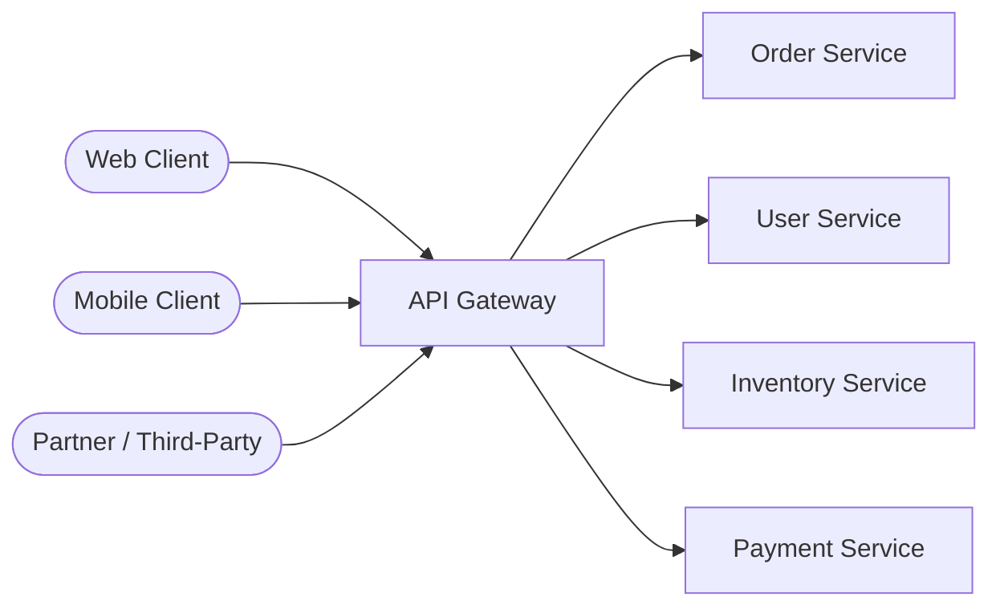

Without a gateway, every client has to know the network location of every microservice, re-implement cross-cutting concerns (auth, rate limiting, logging) itself, and absorb the pain every time a service is split, merged, or moved. The gateway centralizes all of that so backend services stay focused purely on business logic.

This page is organized into the following topics, each covering the core theory, a Mermaid diagram, a real-life use case, interview questions with answers, and a Java implementation sketch:

- [API Gateway](#api-gateway)
  - [Blogs and websites](#blogs-and-websites)
  - [Medium](#medium)
  - [Youtube](#youtube)
  - [Theory](#theory)
    - [Introduction](#introduction)
    - [What is an API Gateway?](#what-is-an-api-gateway)
    - [Request Routing](#request-routing)
    - [Authentication \& Authorization](#authentication--authorization)
    - [Rate Limiting \& Throttling](#rate-limiting--throttling)
    - [Request/Response Transformation](#requestresponse-transformation)
    - [Protocol Translation](#protocol-translation)
    - [Aggregation (API Composition)](#aggregation-api-composition)
    - [Caching at the Gateway](#caching-at-the-gateway)
    - [Logging, Monitoring \& Observability](#logging-monitoring--observability)
    - [Resilience Patterns (Circuit Breaking, Retries, Timeouts)](#resilience-patterns-circuit-breaking-retries-timeouts)
    - [API Gateway vs Load Balancer vs Service Mesh](#api-gateway-vs-load-balancer-vs-service-mesh)
    - [Popular Solutions](#popular-solutions)

### What is an API Gateway?

An API Gateway is a server (or managed service) that acts as a **reverse proxy** deployed at the "edge" of a system, accepting all incoming API calls and directing them to the appropriate internal microservice. It is the architectural embodiment of the **Facade pattern** applied at the network level: clients see one simple, stable API surface, while the gateway hides the complexity, churn, and internal topology of dozens (or hundreds) of backend services behind it.

**Why it exists:**
- Before microservices, a monolith exposed one API from one process, so there was nothing to "gateway" - the app server was the entry point.
- Once a system splits into many independently deployable services, clients would otherwise need to know every service's host, port, and API shape, and every service would have to duplicate auth, rate limiting, and logging code.
- The API Gateway pulls all of that duplicated, cross-cutting logic out of individual services and centralizes it in one place.

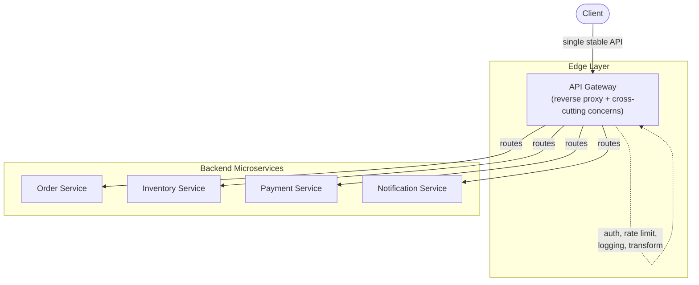

**Core responsibilities (the "Functions" of a gateway):**
- Request routing - directing each incoming request to the correct downstream service.
- Authentication & authorization - verifying identity and permissions before a request ever reaches a backend service.
- Rate limiting & throttling - protecting backend services from being overwhelmed.
- Request/response transformation - reshaping payloads, headers, and protocols between client and backend expectations.
- Protocol translation - e.g. exposing REST/JSON externally while backend services speak gRPC internally.
- Aggregation (API composition) - combining multiple backend calls into one client-facing response.
- Caching - serving repeated read requests without hitting backend services at all.
- Logging & monitoring - centralized visibility into every request that enters the system.

> **Real-life use case:** Netflix's edge gateway (originally Zuul, now Zuul2/Spring Cloud Gateway at some services) handles tens of billions of requests per day from millions of devices (TVs, phones, browsers, game consoles). Each device type needs slightly different payloads and API versions, but every request funnels through the same edge layer, which handles routing, auth, and traffic shaping centrally instead of duplicating that logic across hundreds of backend services.

**Java: a minimal gateway skeleton using Spring Cloud Gateway**

```java
@SpringBootApplication
public class ApiGatewayApplication {

    public static void main(String[] args) {
        SpringApplication.run(ApiGatewayApplication.class, args);
    }

    @Bean
    public RouteLocator routes(RouteLocatorBuilder builder) {
        return builder.routes()
            .route("orders", r -> r.path("/api/orders/**")
                .filters(f -> f.stripPrefix(1))
                .uri("lb://order-service"))
            .route("inventory", r -> r.path("/api/inventory/**")
                .filters(f -> f.stripPrefix(1))
                .uri("lb://inventory-service"))
            .route("payments", r -> r.path("/api/payments/**")
                .filters(f -> f.stripPrefix(1))
                .uri("lb://payment-service"))
            .build();
    }
}
```

**Interview Q&A**

- **Q: What problem does an API Gateway solve that a simple load balancer does not?**
    A: A load balancer only distributes traffic across replicas of a *single* service based on network-level rules (round robin, least connections). An API Gateway operates at layer 7, understands API-level concerns (paths, headers, JWTs, payload shape), routes to *many different* services based on that content, and layers in auth, rate limiting, transformation, and aggregation - none of which a plain load balancer does.
- **Q: Is the API Gateway a single point of failure?**
    A: It can be if deployed as one instance, but in practice it is deployed as a horizontally scaled, stateless fleet behind its own load balancer, often across multiple availability zones/regions, so no single gateway instance failing takes down the system.
- **Q: Where does the API Gateway sit relative to a CDN?**
    A: The CDN sits in front of the API Gateway for cacheable/static content and edge-level DDoS protection; the API Gateway handles dynamic, application-aware routing and business-logic-adjacent concerns like auth and aggregation that a CDN cannot do.
- **Q: What are the downsides of introducing an API Gateway?**
    A: It adds an extra network hop (latency), becomes a critical piece of shared infrastructure that must be highly available and carefully capacity-planned, and can become a bottleneck for development velocity if every team must route changes through a shared gateway config/team.

---

### Request Routing

Routing is the gateway's most fundamental job: inspecting an incoming request (path, host, headers, method, or even payload) and deciding which downstream service should handle it.

**Common routing strategies:**
- **Path-based routing** - `/orders/**` goes to the Order service, `/users/**` goes to the User service.
- **Host-based routing** - `api.example.com` vs `partners.example.com` route to different backends.
- **Header-based routing** - e.g. `X-API-Version: v2` routes to a newer service version (used for canary/versioning).
- **Weighted/canary routing** - send 5% of traffic to a new version of a service to validate it before a full rollout.

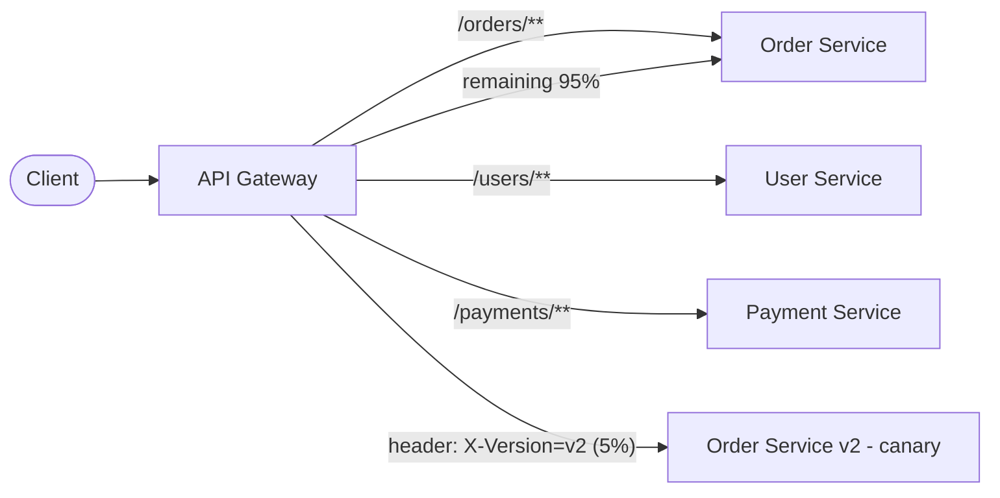

Routing tables are typically stored as declarative configuration (YAML/JSON) or dynamically discovered from a **service registry** (Eureka, Consul, Kubernetes Service DNS), so routes update automatically as service instances scale up/down or move.

> **Real-life use case:** Amazon API Gateway lets teams define a route like `/v1/products/{id}` mapped to a specific Lambda function or backend HTTP endpoint, and supports stage-based routing (`dev`, `staging`, `prod`) so the same route definition can point at different backend deployments per environment without client changes.

**Java: path-based routing with Spring Cloud Gateway**

```java
@Bean
public RouteLocator routingRules(RouteLocatorBuilder builder) {
    return builder.routes()
        // Path-based routing to the Order service.
        .route("order-route", r -> r.path("/orders/**")
            .uri("lb://order-service"))
        // Header-based canary routing: 5% of traffic with this header hits v2.
        .route("order-v2-canary", r -> r.path("/orders/**")
            .and().header("X-Version", "v2")
            .uri("lb://order-service-v2"))
        // Host-based routing for partner traffic.
        .route("partner-route", r -> r.host("partners.example.com")
            .uri("lb://partner-api-service"))
        .build();
}
```

**Interview Q&A**

- **Q: How does the gateway know where each service instance is running?**
    A: Through a service registry (Eureka, Consul, Zookeeper) or the platform's native discovery (Kubernetes Service/DNS); the gateway resolves a logical service name (e.g. `order-service`) to a live set of IPs and load-balances across them, rather than hardcoding IPs.
- **Q: How would you implement a canary release using gateway routing?**
    A: Add a weighted or header-matched route that sends a small percentage of traffic (or requests carrying a specific header/cookie) to the new service version, monitor error rates/latency, and gradually shift more traffic once confidence is established.
- **Q: What happens if two routes could match the same request?**
    A: Gateways evaluate routes in a defined precedence order (usually most-specific-first or explicit priority/order values); ambiguous overlapping routes are a config smell and most gateways log a warning or require an explicit order field to disambiguate.

---

### Authentication & Authorization

The gateway is the natural place to enforce **who** is calling (authentication) and **what** they are allowed to do (authorization), so individual backend services do not each have to re-implement identity verification.

**Common approaches:**
- **API keys** - simple shared secret per client, good for machine-to-machine/partner APIs, but weak (no expiry, no scoped claims) on its own.
- **JWT (JSON Web Tokens)** - the gateway validates a signed token's signature and expiry, extracts claims (user id, roles, scopes), and forwards a trusted identity header downstream, so backend services never need to talk to an auth server themselves.
- **OAuth2 / OIDC** - the gateway acts as a resource server, validating tokens issued by an identity provider (Auth0, Okta, Keycloak) and enforcing scopes per route.
- **mTLS** - for service-to-service or high-security partner integrations, the gateway can require a client certificate in addition to (or instead of) a token.

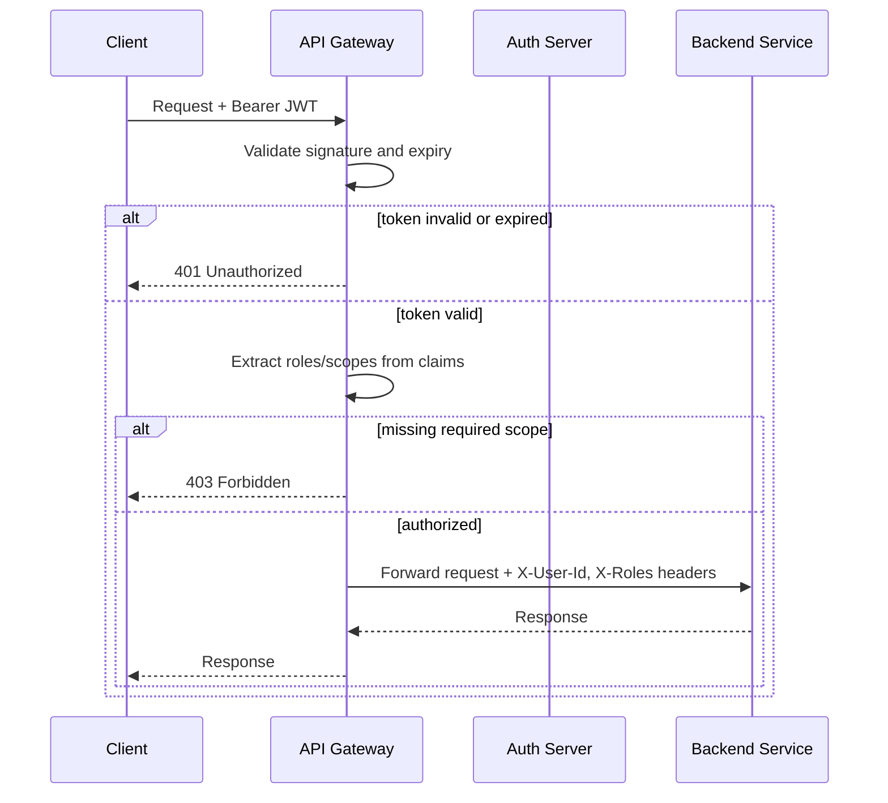

Centralizing auth at the gateway means a compromised or buggy backend service cannot accidentally skip authentication, and revoking access (e.g. blocking a leaked API key) can be done in one place instantly.

> **Real-life use case:** Kong Gateway's JWT plugin validates every incoming request's token against a configured public key/JWKS endpoint before it ever reaches any upstream service; if validation fails, Kong short-circuits with a 401 immediately at the edge, so backend services never even see unauthenticated traffic and never spend CPU cycles on invalid requests.

**Java: a JWT-validating gateway filter (Spring Cloud Gateway)**

```java
@Component
public class JwtAuthGatewayFilterFactory extends AbstractGatewayFilterFactory<Object> {

    private final JwtParser jwtParser; // configured with the auth server's public key

    public JwtAuthGatewayFilterFactory(JwtParser jwtParser) {
        super(Object.class);
        this.jwtParser = jwtParser;
    }

    @Override
    public GatewayFilter apply(Object config) {
        return (exchange, chain) -> {
            String header = exchange.getRequest().getHeaders().getFirst(HttpHeaders.AUTHORIZATION);
            if (header == null || !header.startsWith("Bearer ")) {
                exchange.getResponse().setStatusCode(HttpStatus.UNAUTHORIZED);
                return exchange.getResponse().setComplete();
            }

            try {
                String token = header.substring("Bearer ".length());
                Claims claims = jwtParser.parseClaimsJws(token).getBody();

                // Forward trusted identity to downstream services via headers.
                var mutated = exchange.getRequest().mutate()
                    .header("X-User-Id", claims.getSubject())
                    .header("X-Roles", claims.get("roles", String.class))
                    .build();

                return chain.filter(exchange.mutate().request(mutated).build());
            } catch (JwtException e) {
                exchange.getResponse().setStatusCode(HttpStatus.UNAUTHORIZED);
                return exchange.getResponse().setComplete();
            }
        };
    }
}
```

**Interview Q&A**

- **Q: Why validate JWTs at the gateway instead of in each microservice?**
    A: It avoids duplicating token-validation logic and public-key/JWKS management across every service, guarantees no service can accidentally be deployed without auth checks, and lets you revoke or rotate keys centrally in one place instead of redeploying every service.
- **Q: If the gateway already validated the JWT, why would a backend service still check authorization?**
    A: Defense in depth. The gateway typically enforces coarse-grained checks (is this token valid, does the caller have a role that can reach this route at all); the backend service still enforces fine-grained, resource-level authorization (e.g. "can this specific user edit this specific order") since only it has the business context to know.
- **Q: How do you handle token revocation with stateless JWTs?**
    A: Short expiry times plus a refresh-token flow limit the blast radius; for immediate revocation, gateways maintain a denylist/blacklist cache (e.g. in Redis) of revoked token IDs (`jti` claim) checked on every request, or reduce token lifetime aggressively.
- **Q: What is the difference between authentication and authorization at the gateway?**
    A: Authentication answers "who is this caller" (validating identity via token/API key/mTLS); authorization answers "is this caller allowed to do this" (checking roles/scopes/permissions against the requested route), and both are typically enforced as separate filter stages.

---

### Rate Limiting & Throttling

Rate limiting caps how many requests a client (per API key, user, or IP) can make in a given time window, protecting backend services from being overwhelmed by a single noisy client, a bug in a client's retry loop, or an intentional abuse/DoS attempt.

**Common algorithms:**
- **Fixed window counter** - count requests in fixed time buckets (e.g. per minute); simple but allows bursts at window boundaries (2x the limit right at the boundary).
- **Sliding window log/counter** - tracks requests over a rolling window, smoothing out the boundary-burst problem at the cost of more memory/computation.
- **Token bucket** - a bucket refills with tokens at a steady rate; each request consumes a token, and requests are rejected when the bucket is empty, naturally allowing short bursts up to the bucket size.
- **Leaky bucket** - requests queue and are processed at a constant outflow rate, smoothing bursty traffic into a steady stream.

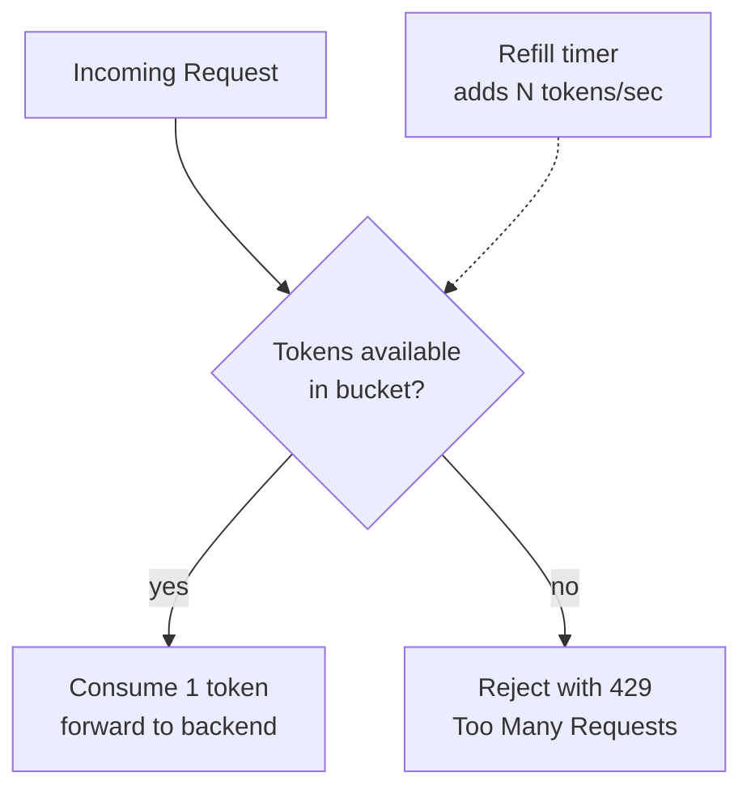

Rate limits are usually tiered: a generous global limit protects infrastructure, and per-client/per-plan limits enforce business rules (e.g. "free tier: 100 req/min, paid tier: 10,000 req/min").

> **Real-life use case:** Stripe's public API enforces per-account rate limits (roughly 100 requests/second in live mode) and returns a `429` with a `Retry-After` header when exceeded; this is enforced at their API edge layer so a single misbehaving integration cannot degrade the shared platform for every other merchant.

**Java: a token bucket rate limiter filter (Spring Cloud Gateway + Redis)**

```java
@Bean
public KeyResolver apiKeyResolver() {
    // Rate limit per API key/client rather than globally.
    return exchange -> Mono.just(exchange.getRequest().getHeaders().getFirst("X-Api-Key"));
}

@Bean
public RouteLocator rateLimitedRoutes(RouteLocatorBuilder builder,
                                       RedisRateLimiter redisRateLimiter,
                                       KeyResolver apiKeyResolver) {
    return builder.routes()
        .route("orders-rate-limited", r -> r.path("/orders/**")
            .filters(f -> f.requestRateLimiter(c -> c
                .setRateLimiter(redisRateLimiter)   // e.g. new RedisRateLimiter(replenishRate=100, burstCapacity=200)
                .setKeyResolver(apiKeyResolver)))
            .uri("lb://order-service"))
        .build();
}
```

**Interview Q&A**

- **Q: Why is token bucket generally preferred over a fixed window counter?**
    A: Fixed window counters allow up to 2x the intended limit right at a window boundary (e.g. a burst at the end of minute 1 plus another burst at the start of minute 2); token bucket enforces a steady average rate while still allowing legitimate short bursts up to the bucket's capacity, without that boundary flaw.
- **Q: How do you rate limit in a horizontally scaled gateway fleet?**
    A: Counters/token buckets must be stored in a shared, low-latency store (typically Redis) rather than in-process memory, so all gateway instances see a consistent view of a client's usage; some systems trade strict accuracy for performance using local counters with periodic sync/approximate distributed counting.
- **Q: What should the gateway return when a client is rate limited, and what should the client do?**
    A: Return HTTP `429 Too Many Requests` with a `Retry-After` header indicating when to retry; well-behaved clients implement exponential backoff and respect that header rather than retrying immediately in a tight loop.
- **Q: How is rate limiting different from throttling?**
    A: The terms are often used interchangeably, but "rate limiting" typically means rejecting requests once a limit is exceeded, while "throttling" can also mean delaying/queuing excess requests to smooth them out rather than outright rejecting them (closer to leaky bucket behavior).

---

### Request/Response Transformation

Backend services and clients do not always agree on payload shape, header conventions, or API versioning; the gateway can rewrite requests and responses in-flight so neither side has to change to accommodate the other.

**Common transformations:**
- **Header manipulation** - adding correlation IDs, stripping internal headers before they leak to clients, injecting trusted identity headers (see Authentication above).
- **Body reshaping** - converting an old client's `snake_case` field names to a new backend's `camelCase` schema, or vice versa, without touching either codebase.
- **API versioning adapters** - translating a `v1` request shape into the `v2` shape a service now expects, letting old clients keep working while the backend only maintains one version.
- **Response filtering** - stripping sensitive/internal fields (e.g. internal cost basis, admin flags) from a response before it reaches an external client.

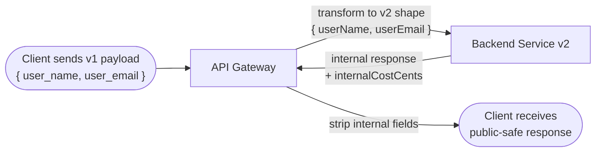

This lets backend teams evolve their internal API shape freely while the gateway maintains a stable, backward-compatible contract for external clients - an important decoupling for independent service evolution.

> **Real-life use case:** Many payment platforms accept legacy XML-based requests from long-tail enterprise clients that never migrated off older integrations, while every backend service internally only speaks JSON; the gateway (or an adapter layer just behind it) transforms XML to JSON on the way in and back to XML on the way out, so the backend never needs to support two payload formats.

**Java: a request/response transformation filter (Spring Cloud Gateway)**

```java
@Component
public class FieldRenameGatewayFilterFactory extends AbstractGatewayFilterFactory<Object> {

    public FieldRenameGatewayFilterFactory() {
        super(Object.class);
    }

    @Override
    public GatewayFilter apply(Object config) {
        return (exchange, chain) -> {
            ServerHttpResponse originalResponse = exchange.getResponse();
            ServerHttpResponseDecorator decoratedResponse = new ServerHttpResponseDecorator(originalResponse) {
                @Override
                public Mono<Void> writeWith(Publisher<? extends DataBuffer> body) {
                    // Buffer the response, strip internal-only fields before returning to the client.
                    return super.writeWith(Flux.from(body).map(dataBuffer -> {
                        byte[] content = new byte[dataBuffer.readableByteCount()];
                        dataBuffer.read(content);
                        DataBufferUtils.release(dataBuffer);

                        String json = new String(content, StandardCharsets.UTF_8);
                        String publicSafeJson = json.replaceAll(",?\"internalCostCents\":[0-9]+", "");

                        byte[] transformed = publicSafeJson.getBytes(StandardCharsets.UTF_8);
                        return bufferFactory().wrap(transformed);
                    }));
                }
            };

            return chain.filter(exchange.mutate().response(decoratedResponse).build());
        };
    }
}
```

**Interview Q&A**

- **Q: Why do transformation at the gateway instead of just updating the backend service?**
    A: The backend team may not control (or want to keep maintaining) legacy shapes for old clients; centralizing transformation at the edge lets the backend evolve its "true" internal contract freely while the gateway absorbs the compatibility burden for whichever external contract still needs supporting.
- **Q: What is the risk of putting heavy transformation logic in the gateway?**
    A: It adds CPU/latency cost to every request and can turn the gateway into a place where business logic accidentally accumulates (a "smart gateway" anti-pattern), making the gateway itself hard to change safely and blurring ownership between platform and product teams.
- **Q: How would you support both a legacy XML client and a modern JSON client through the same gateway?**
    A: Use content negotiation on `Content-Type`/`Accept` headers to select a transformation filter chain per request, converting XML to the canonical internal JSON schema on ingress and back to XML on egress only for clients that require it.

---

### Protocol Translation

Clients and backend services do not always speak the same wire protocol. The gateway can accept one protocol on the client-facing side and translate to a different protocol on the backend-facing side, letting each side use whatever protocol suits it best.

**Common translations:**
- **REST/JSON (external) to gRPC (internal)** - clients get a familiar HTTP/JSON API, while backend services communicate over the leaner, strongly-typed, higher-throughput gRPC/Protobuf internally.
- **HTTP to WebSocket** - useful for gateways that need to bridge a request/response client model to a backend that streams events.
- **GraphQL to REST** - a gateway can expose a single GraphQL endpoint to clients while fanning individual field resolutions out to multiple REST microservices behind the scenes.
- **SOAP to REST** - common in enterprises migrating legacy SOAP services to modern REST-consuming clients without rewriting the legacy backend immediately.

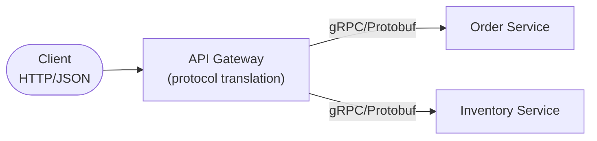

Protocol translation decouples the client-facing contract (which needs broad compatibility, human readability, and browser support) from the internal contract (which can prioritize performance, strict typing, and bandwidth efficiency).

> **Real-life use case:** Many companies running gRPC internally (Google, Netflix, Square) expose a REST/JSON facade at the edge via a gRPC-to-JSON transcoding gateway (e.g. grpc-gateway or Envoy's gRPC-JSON transcoder) so that web/mobile clients and third-party partners - who cannot easily consume raw gRPC/HTTP2/Protobuf from a browser - get a normal REST API, while internal services still enjoy gRPC's performance and strict contract benefits.

**Java: a REST-to-gRPC translating controller**

```java
@RestController
@RequestMapping("/api/orders")
public class OrderRestToGrpcController {

    private final OrderServiceGrpc.OrderServiceBlockingStub grpcStub;

    public OrderRestToGrpcController(OrderServiceGrpc.OrderServiceBlockingStub grpcStub) {
        this.grpcStub = grpcStub;
    }

    @GetMapping("/{orderId}")
    public ResponseEntity<OrderResponse> getOrder(@PathVariable String orderId) {
        // Translate the incoming REST call into a gRPC request to the backend service.
        GetOrderRequest grpcRequest = GetOrderRequest.newBuilder()
            .setOrderId(orderId)
            .build();

        GetOrderResponse grpcResponse = grpcStub.getOrder(grpcRequest);

        // Translate the gRPC response back into a plain REST/JSON DTO for the client.
        OrderResponse restResponse = new OrderResponse(
            grpcResponse.getOrderId(),
            grpcResponse.getStatus(),
            grpcResponse.getTotalAmountCents() / 100.0
        );
        return ResponseEntity.ok(restResponse);
    }
}
```

**Interview Q&A**

- **Q: Why would a company use gRPC internally but REST externally?**
    A: gRPC offers Protobuf's compact binary encoding, HTTP/2 multiplexing, strict schema contracts, and code generation - great for high-throughput internal service-to-service calls - while REST/JSON remains the more universally compatible, human-debuggable, browser-friendly option that external clients and third parties expect.
- **Q: What is transcoding, and where does it happen?**
    A: Transcoding is converting a request/response between two protocols/encodings (e.g. JSON to Protobuf and back); it typically happens at the gateway or a dedicated edge proxy (like Envoy's gRPC-JSON transcoder), based on a mapping defined once (often generated from the same `.proto` service definitions used internally).
- **Q: What's a downside of protocol translation at the gateway?**
    A: Every translated call adds serialization/deserialization overhead and another place where a schema mismatch (e.g. a new backend field not yet mapped) can silently drop data; keeping the translation mapping in sync with the backend's evolving schema requires discipline (often via schema-driven code generation rather than hand-written mapping code).

---

### Aggregation (API Composition)

A single client-facing operation (e.g. "render the product page") often needs data from several microservices (product details, pricing, reviews, inventory). Without aggregation, the client would have to make several round trips itself. With aggregation, the gateway fans out to multiple backend services in parallel and composes one combined response.

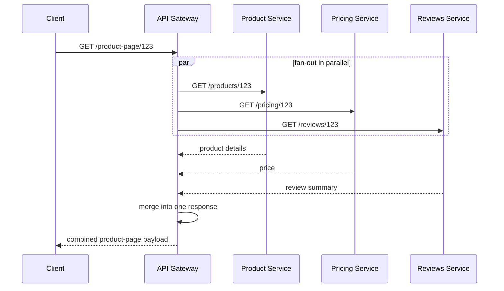

This pattern is closely related to the **Backend-for-Frontend (BFF)** pattern, where each client type (mobile, web, smart TV) gets its own aggregation layer tuned to that client's exact data and payload-size needs, rather than one generic API forcing every client to over-fetch or under-fetch.

> **Real-life use case:** Netflix's API layer aggregates data from dozens of backend microservices (video metadata, personalized recommendations, licensing/availability by region, user profile/preferences) into a single response tailored to each device type, so a TV app makes one call to get everything needed to render its home screen instead of the device juggling dozens of separate network calls itself.

**Java: a parallel-fan-out aggregation endpoint**

```java
@RestController
@RequestMapping("/product-page")
public class ProductPageAggregatorController {

    private final ProductServiceClient productClient;
    private final PricingServiceClient pricingClient;
    private final ReviewsServiceClient reviewsClient;

    public ProductPageAggregatorController(ProductServiceClient productClient,
                                            PricingServiceClient pricingClient,
                                            ReviewsServiceClient reviewsClient) {
        this.productClient = productClient;
        this.pricingClient = pricingClient;
        this.reviewsClient = reviewsClient;
    }

    @GetMapping("/{productId}")
    public ResponseEntity<ProductPageResponse> getProductPage(@PathVariable String productId) {
        // Fan out to three services concurrently instead of calling them one at a time.
        CompletableFuture<ProductDetails> productFuture =
            CompletableFuture.supplyAsync(() -> productClient.getProduct(productId));
        CompletableFuture<PriceInfo> pricingFuture =
            CompletableFuture.supplyAsync(() -> pricingClient.getPrice(productId));
        CompletableFuture<ReviewSummary> reviewsFuture =
            CompletableFuture.supplyAsync(() -> reviewsClient.getReviewSummary(productId));

        CompletableFuture.allOf(productFuture, pricingFuture, reviewsFuture).join();

        ProductPageResponse response = new ProductPageResponse(
            productFuture.join(),
            pricingFuture.join(),
            reviewsFuture.join()
        );
        return ResponseEntity.ok(response);
    }
}
```

**Interview Q&A**

- **Q: Why aggregate at the gateway/BFF instead of letting the client call every service directly?**
    A: It reduces the number of round trips a client makes (critical on high-latency mobile networks), lets the aggregation layer parallelize backend calls the client couldn't easily coordinate itself, and hides internal service topology so clients aren't coupled to how many services exist or how they're split.
- **Q: What happens if one of the aggregated backend calls fails or times out?**
    A: The aggregator needs a policy per dependency - some fields may be optional (return partial data with the failed section omitted or a fallback default), while others are required (fail the whole request); this is usually paired with per-call timeouts and circuit breakers so one slow dependency doesn't stall the entire aggregated response.
- **Q: What is the Backend-for-Frontend (BFF) pattern and how does it relate to aggregation?**
    A: BFF is a dedicated aggregation/API layer built specifically for one client type (e.g. a mobile BFF vs a web BFF), each shaping and combining backend calls differently to match that client's exact needs, rather than one generic aggregation gateway trying to serve every client type identically.
- **Q: How do you keep an aggregation layer from becoming a second monolith?**
    A: Keep it thin - pure composition and shaping, no business logic or state - and keep aggregation logic close to (and owned by) the frontend team it serves, rather than centralizing all aggregation for every client type in one shared, slow-moving codebase.

---

### Caching at the Gateway

Many requests through a gateway are read-heavy and repeat frequently (e.g. `GET /products/123` from thousands of different users). The gateway can cache responses for such requests and serve subsequent identical requests without ever forwarding them to the backend service, cutting backend load and latency dramatically.

**Key considerations:**
- **Cache key** - usually the request path plus relevant query params and headers (e.g. `Accept-Language`) that affect the response.
- **TTL (time-to-live)** - how long a cached response is considered fresh before it must be revalidated or refetched.
- **Cache invalidation** - the classic hard problem; either short TTLs, explicit purge/invalidation events from the backend on writes, or cache-control headers driven by the backend service.
- **Per-route policy** - only cacheable, idempotent (`GET`/`HEAD`) requests should be cached; personalized or mutating requests must bypass the cache entirely.

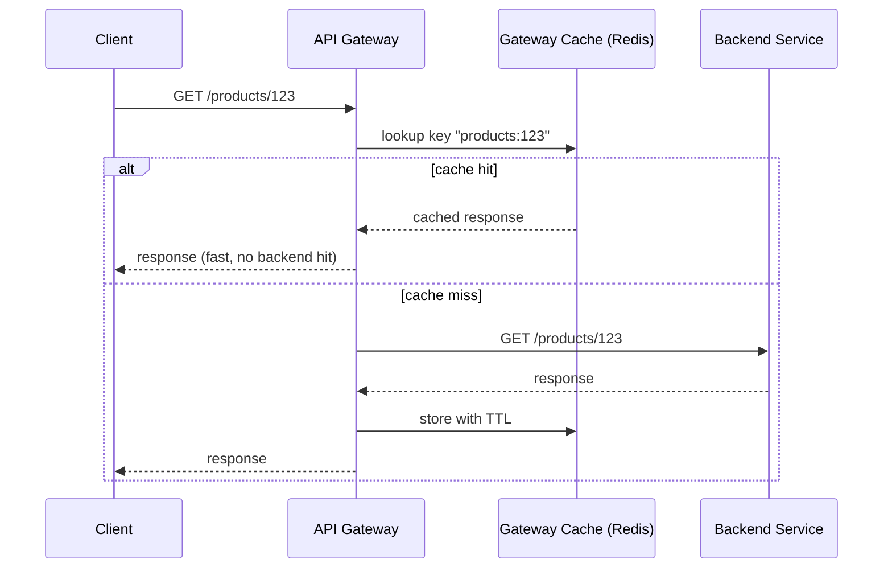

> **Real-life use case:** AWS API Gateway supports a built-in response cache per stage/method - teams enable caching on read-heavy, rarely-changing endpoints (like a product catalog listing) with a TTL of a few minutes, which can cut backend Lambda/API invocations (and cost) by an order of magnitude during traffic spikes like a flash sale, without any application-level caching code.

**Java: a gateway-level response cache filter (Spring Cloud Gateway + Redis)**

```java
@Component
public class ResponseCacheGatewayFilterFactory extends AbstractGatewayFilterFactory<Object> {

    private final ReactiveStringRedisTemplate redisTemplate;
    private static final Duration TTL = Duration.ofMinutes(5);

    public ResponseCacheGatewayFilterFactory(ReactiveStringRedisTemplate redisTemplate) {
        super(Object.class);
        this.redisTemplate = redisTemplate;
    }

    @Override
    public GatewayFilter apply(Object config) {
        return (exchange, chain) -> {
            // Only cache safe, idempotent GET requests.
            if (exchange.getRequest().getMethod() != HttpMethod.GET) {
                return chain.filter(exchange);
            }

            String cacheKey = "gw-cache:" + exchange.getRequest().getURI();

            return redisTemplate.opsForValue().get(cacheKey)
                .flatMap(cached -> {
                    // Cache hit: write cached body straight back, skip the backend entirely.
                    DataBuffer buffer = exchange.getResponse().bufferFactory()
                        .wrap(cached.getBytes(StandardCharsets.UTF_8));
                    return exchange.getResponse().writeWith(Mono.just(buffer));
                })
                .switchIfEmpty(Mono.defer(() -> chain.filter(exchange)
                    // On a miss, the downstream filter chain populates the cache via a response decorator (omitted for brevity).
                ));
        };
    }
}
```

**Interview Q&A**

- **Q: What is the hardest part of caching at the gateway, and why?**
    A: Cache invalidation - the gateway sits outside the backend service's data-change events by default, so it either needs short TTLs (accepting some staleness), explicit purge calls/webhooks from the backend on writes, or cache-control headers set by the backend, all of which add coordination overhead between the gateway and backend teams.
- **Q: Which requests should never be cached at the gateway?**
    A: Non-idempotent requests (`POST`/`PUT`/`PATCH`/`DELETE`), personalized responses that vary per authenticated user (unless the cache key includes the user identity), and any response containing sensitive data not safe to serve to a different caller than the one who generated the cache entry.
- **Q: How does gateway-level caching differ from a CDN cache?**
    A: A CDN caches at geographically distributed edge locations mainly for static or semi-static, non-authenticated content close to the end user; the gateway cache sits centrally in front of application services and can cache dynamic, authenticated (per-key) API responses with awareness of backend-specific invalidation signals that a generic CDN wouldn't have.

---

### Logging, Monitoring & Observability

Because every request passes through it, the gateway is the ideal single place to capture consistent, structured telemetry for the entire system - without instrumenting every backend service identically by hand.

**What the gateway typically captures:**
- **Access logs** - method, path, status code, latency, client identity, and response size for every request.
- **Distributed tracing** - the gateway generates (or propagates) a **correlation/trace ID** on every request, attaching it as a header so every downstream service's logs can be tied back to the same originating request.
- **Metrics** - request rate, error rate, and latency percentiles (p50/p95/p99) per route, often exported to Prometheus/Grafana or a similar stack.
- **Alerting** - the gateway's aggregate view of error rates and latency makes it a natural source for SLO-based alerts (e.g. "5xx rate over 1% for 5 minutes").

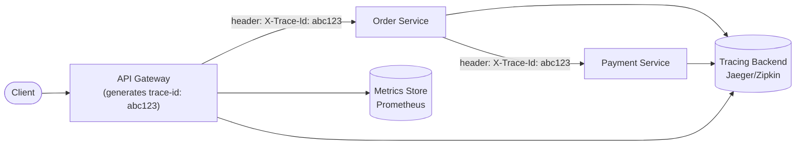

Centralized gateway logging also gives security and platform teams one place to detect anomalies (sudden spikes in 401s might indicate a credential-stuffing attack; a spike in 5xxs on one route pinpoints exactly which backend service is unhealthy) without correlating logs across dozens of separate services manually.

> **Real-life use case:** Kong and AWS API Gateway both integrate with distributed tracing systems (Jaeger/Zipkin, AWS X-Ray) - every request entering the gateway gets a trace ID stamped and propagated to every downstream service call, letting engineers reconstruct the entire request path across a dozen microservices in one trace view when debugging a slow or failed customer request, instead of grepping through separate logs per service.

**Java: a correlation-ID and access-log filter (Spring Cloud Gateway)**

```java
@Component
public class CorrelationIdGatewayFilterFactory extends AbstractGatewayFilterFactory<Object> {

    private static final Logger log = LoggerFactory.getLogger(CorrelationIdGatewayFilterFactory.class);

    public CorrelationIdGatewayFilterFactory() {
        super(Object.class);
    }

    @Override
    public GatewayFilter apply(Object config) {
        return (exchange, chain) -> {
            String traceId = exchange.getRequest().getHeaders().getFirst("X-Trace-Id");
            if (traceId == null) {
                traceId = UUID.randomUUID().toString();
            }
            final String finalTraceId = traceId;

            var mutatedRequest = exchange.getRequest().mutate()
                .header("X-Trace-Id", finalTraceId)
                .build();

            long startTime = System.currentTimeMillis();

            return chain.filter(exchange.mutate().request(mutatedRequest).build())
                .doFinally(signal -> {
                    long durationMs = System.currentTimeMillis() - startTime;
                    log.info("traceId={} method={} path={} status={} durationMs={}",
                        finalTraceId,
                        exchange.getRequest().getMethod(),
                        exchange.getRequest().getPath(),
                        exchange.getResponse().getStatusCode(),
                        durationMs);
                });
        };
    }
}
```

**Interview Q&A**

- **Q: Why generate the trace/correlation ID at the gateway rather than each service generating its own?**
    A: If every service generated its own ID independently, there would be no shared identifier to stitch together the full request path across services; the gateway (the true entry point) mints one ID per incoming request and every downstream service simply propagates it forward, giving one consistent thread through the entire trace.
- **Q: What's the difference between logging, metrics, and tracing, and why does the gateway typically produce all three?**
    A: Logs are discrete, detailed records of individual events (good for post-hoc debugging); metrics are aggregated numeric time series (good for dashboards/alerting on trends); traces show the causal path of one request across multiple services (good for pinpointing where in a call chain latency/errors occurred). The gateway sees every request, so it is a natural producer of all three with minimal per-service instrumentation effort.
- **Q: How would you detect a credential-stuffing attack using gateway logs?**
    A: Watch for an abnormal spike in `401 Unauthorized` responses concentrated on login/auth routes, especially from a small number of IPs/user agents hitting many distinct usernames in a short window - a pattern visible in gateway-level access logs/metrics without needing to instrument the auth service itself for this specific detection.

---

### Resilience Patterns (Circuit Breaking, Retries, Timeouts)

Backend services fail, slow down, or become unreachable. Because the gateway sits between every client and every backend call, it is the natural place to prevent one struggling downstream service from cascading into a system-wide outage.

**Key patterns:**
- **Timeouts** - every backend call must have a bounded timeout; without one, a slow dependency can hold gateway threads/connections indefinitely, exhausting resources needed to serve unrelated requests.
- **Retries** - transient failures (a dropped connection, a brief blip) can be retried automatically, ideally with exponential backoff and jitter, but only for idempotent requests to avoid duplicating side effects (e.g. double-charging a payment).
- **Circuit breaker** - after a dependency's failure rate crosses a threshold, the gateway "opens the circuit" and stops calling it entirely for a cooldown period, failing fast instead of piling up timeouts, then periodically tests ("half-open") whether the dependency has recovered.
- **Bulkheads** - isolate connection pools/thread pools per downstream dependency so a saturated call to one slow service cannot starve capacity needed for calls to healthy services.
- **Fallbacks** - return a cached, default, or degraded response (e.g. "recommendations temporarily unavailable" placeholder) instead of a hard failure when a non-critical dependency is down.

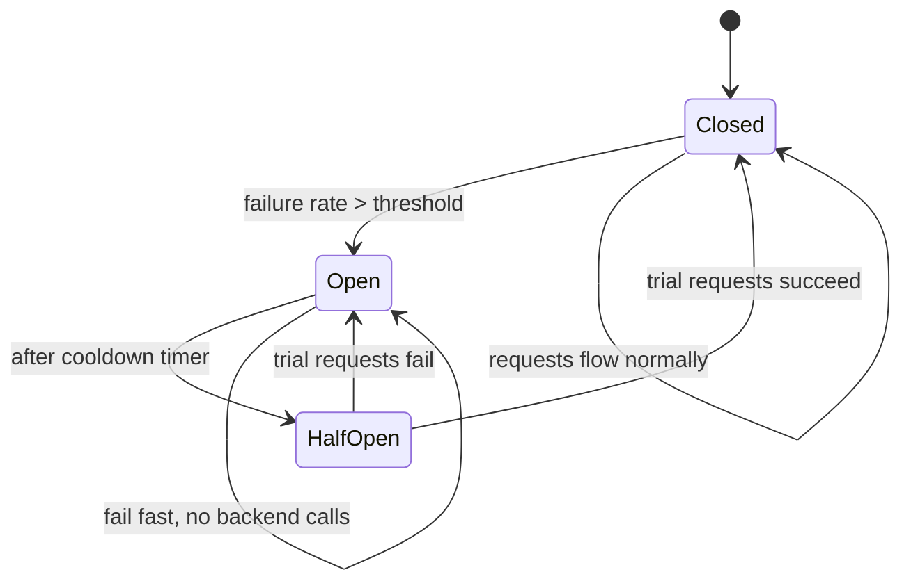

> **Real-life use case:** Netflix's Hystrix (and its modern successor, resilience4j) pioneered the circuit breaker pattern at massive scale - when a recommendation microservice degrades, the circuit trips and Netflix's edge layer serves a generic, cached "trending now" fallback row instead of the personalized one, keeping the rest of the homepage (and the whole request) fast and available rather than letting one slow dependency take down the entire page load.

**Java: a circuit breaker + timeout + fallback using resilience4j**

```java
@RestController
@RequestMapping("/recommendations")
public class RecommendationController {

    private final RecommendationServiceClient recommendationClient;
    private final CircuitBreaker circuitBreaker;
    private final TimeLimiter timeLimiter;

    public RecommendationController(RecommendationServiceClient recommendationClient,
                                     CircuitBreakerRegistry cbRegistry,
                                     TimeLimiterRegistry tlRegistry) {
        this.recommendationClient = recommendationClient;
        this.circuitBreaker = cbRegistry.circuitBreaker("recommendationService");
        this.timeLimiter = tlRegistry.timeLimiter("recommendationService");
    }

    @GetMapping("/{userId}")
    public CompletableFuture<List<Recommendation>> getRecommendations(@PathVariable String userId) {
        Supplier<CompletableFuture<List<Recommendation>>> call =
            () -> CompletableFuture.supplyAsync(() -> recommendationClient.getFor(userId));

        // Wrap the call with a circuit breaker and a timeout; fall back to a safe default on either tripping.
        Supplier<CompletableFuture<List<Recommendation>>> decorated =
            CircuitBreaker.decorateSupplier(circuitBreaker, call);

        return timeLimiter.executeCompletionStage(
                Executors.newCachedThreadPool(),
                () -> decorated.get())
            .toCompletableFuture()
            .exceptionally(ex -> List.of(Recommendation.trendingFallback()));
    }
}
```

**Interview Q&A**

- **Q: Why is a timeout alone not enough - why also need a circuit breaker?**
    A: A timeout bounds how long a single failing call takes, but if a dependency is completely down, every new request still has to wait out the full timeout before failing, wasting resources and adding latency to every caller; a circuit breaker remembers the dependency is unhealthy and fails those calls immediately (no wait) until the dependency proves it has recovered.
- **Q: Which requests are safe to retry automatically at the gateway, and which are not?**
    A: Idempotent requests (`GET`, `PUT`, `DELETE`, and `POST` requests explicitly designed to be idempotent via an idempotency key) are generally safe to retry; non-idempotent `POST` requests without an idempotency key (e.g. "charge this card") are not, since a retry after a timeout could duplicate the side effect if the original request actually succeeded server-side but the response was lost.
- **Q: What is a bulkhead, and why is it named that?**
    A: Named after ship bulkheads that partition a hull into watertight compartments so one breach doesn't sink the whole ship; in software, it means isolating resources (thread pools, connection pools) per downstream dependency so one overloaded/slow dependency can't exhaust resources needed to serve calls to other, healthy dependencies.
- **Q: How do you decide the half-open trial traffic percentage for a circuit breaker recovering from open state?**
    A: Typically a small, configurable number of trial requests (e.g. 5-10) are allowed through in the half-open state; if they succeed above a threshold, the circuit closes fully, if they fail, it reopens and waits another cooldown period - balancing "recover quickly" against "don't immediately re-overwhelm a barely-recovering dependency."

---

### API Gateway vs Load Balancer vs Service Mesh

These three components are often confused because they all sit "in the path" of a request, but they operate at different layers and solve different problems.

| Concern | Load Balancer | API Gateway | Service Mesh |
|---|---|---|---|
| OSI layer | Layer 4 (TCP) or Layer 7 (HTTP) | Layer 7 (HTTP/gRPC, API-aware) | Layer 7, via sidecar proxies |
| Primary traffic | North-south (client to backend) | North-south (client to backend) | East-west (service to service) |
| Awareness | IPs/ports, basic health checks | Routes, auth, payload, business rules | Service identity, retries, mTLS between services |
| Typical concerns | Distribute load across replicas | Auth, rate limiting, routing, aggregation, transformation | Service-to-service mTLS, retries, traffic shifting, observability |
| Examples | ELB/NLB, HAProxy, Nginx (L4 mode) | Kong, AWS API Gateway, Apigee | Istio, Linkerd, Consul Connect |

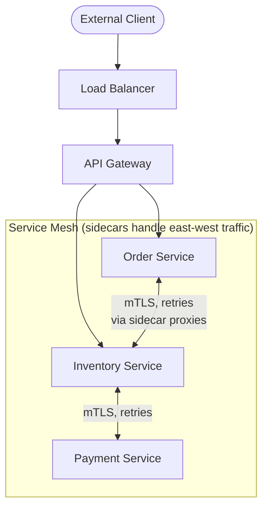

A common misconception is that these are competing choices - in a mature architecture they typically **coexist**: a load balancer distributes raw connections across a gateway fleet, the gateway handles all north-south (client-to-system) API concerns, and a service mesh (if present) handles east-west (service-to-service) concerns like mTLS and fine-grained internal traffic policies, which are out of scope for an edge-facing gateway.

> **Real-life use case:** A typical large-scale setup: an AWS Network Load Balancer distributes raw TCP connections across a fleet of Kong API Gateway instances (handling auth, rate limiting, and routing for all external traffic), while internally, an Istio service mesh manages mTLS encryption and retry policies purely between the microservices themselves - two different tools solving two different layers of the same system.

**Java: illustrating the layering (gateway route calling a mesh-managed backend)**

```java
// The gateway only needs to know the logical service name; the mesh sidecar
// transparently handles mTLS, retries, and load balancing to a healthy pod.
@Bean
public RouteLocator meshAwareRoutes(RouteLocatorBuilder builder) {
    return builder.routes()
        .route("orders", r -> r.path("/orders/**")
            // "order-service.default.svc.cluster.local" resolves via the mesh's
            // sidecar proxy, which then applies mTLS + retry policy internally.
            .uri("http://order-service.default.svc.cluster.local"))
        .build();
}
```

**Interview Q&A**

- **Q: If you already have a service mesh, do you still need an API Gateway?**
    A: Yes - a service mesh secures and manages traffic *between* internal services (east-west) but is not designed to be the client-facing edge; it typically doesn't do external authentication, third-party-facing API contracts, public rate limiting per API key, or client-specific response aggregation, all of which remain the gateway's job.
- **Q: Can a load balancer replace an API Gateway?**
    A: No - a load balancer (especially L4) has no concept of API routes, payload shape, or business-level auth; it only distributes connections/requests across healthy backend replicas. An API Gateway operates a layer above, understanding and acting on the content of each request.
- **Q: Where would you enforce mTLS between two internal microservices - at the gateway or the mesh?**
    A: At the service mesh - the gateway typically terminates client-facing TLS at the edge, while the mesh's sidecar proxies handle mTLS for internal service-to-service calls, since the gateway isn't present on every internal hop between services.

---

### Popular Solutions

Choosing a gateway implementation is a trade-off between managed convenience, self-hosted control, performance, and ecosystem fit.

| Solution | Type | Notes |
|---|---|---|
| **Kong** | Self-hosted / hybrid, built on Nginx/OpenResty | Plugin-driven (auth, rate limiting, transformation as plugins); popular open-source choice with a large plugin ecosystem. |
| **AWS API Gateway** | Fully managed (AWS) | Deep integration with Lambda, IAM, and Cognito; pay-per-request pricing; built-in caching, throttling, and stage-based deployments. |
| **Azure API Management** | Fully managed (Azure) | Strong developer portal and policy XML-based transformation/routing rules; integrates with Azure AD for auth. |
| **Apigee (Google Cloud)** | Fully managed (GCP) | Strong analytics and API monetization/productization features, popular in enterprise/partner-API-heavy organizations. |
| **Spring Cloud Gateway** | Self-hosted library/framework | Java/Spring-native, code-first (as used in the examples throughout this page); ideal when the platform team is already a Spring shop. |
| **Envoy / Ambassador** | Self-hosted proxy | High-performance C++ proxy, often used as both an edge gateway and a service mesh data plane (e.g. inside Istio). |
| **NGINX / NGINX Plus** | Self-hosted | Extremely mature, high-performance reverse proxy; can be configured as a basic gateway, though lacks some higher-level API-management features out of the box compared to Kong/Apigee. |

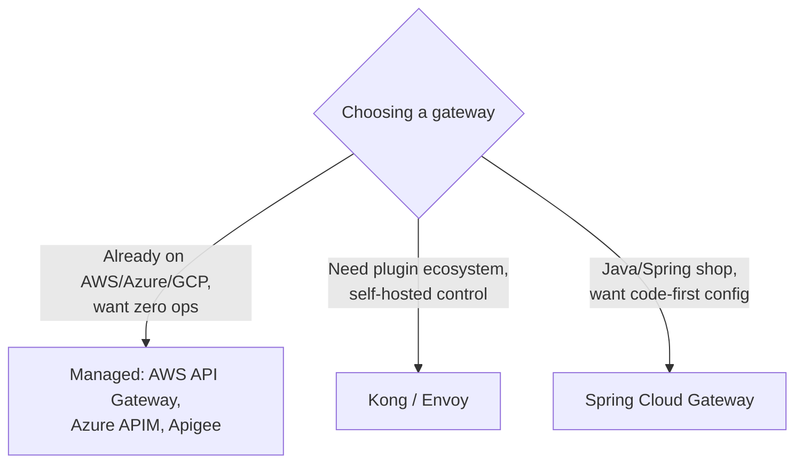

> **Real-life use case:** A startup already fully hosted on AWS with heavy Lambda usage typically defaults to AWS API Gateway for near-zero operational overhead and native IAM/Cognito auth integration, while a larger platform team running Kubernetes across multiple clouds might choose Kong or Envoy-based solutions for portability, finer-grained plugin control, and to avoid cloud vendor lock-in on a piece of critical shared infrastructure.

**Java: bootstrapping a self-hosted gateway choice (Spring Cloud Gateway dependency)**

```java
// build.gradle / pom.xml equivalent: choosing Spring Cloud Gateway as the
// self-hosted, code-first option referenced throughout this page's examples.
// implementation 'org.springframework.cloud:spring-cloud-starter-gateway'

@SpringBootApplication
public class GatewayBootstrap {
    public static void main(String[] args) {
        SpringApplication.run(GatewayBootstrap.class, args);
    }
}
```

**Interview Q&A**

- **Q: When would you choose a managed gateway (AWS API Gateway/Apigee) over a self-hosted one (Kong/Envoy)?**
    A: Choose managed when minimizing operational burden matters most and you're already committed to that cloud provider's ecosystem (Lambda, IAM); choose self-hosted when you need multi-cloud portability, fine-grained plugin customization, predictable cost at very high volume, or want to avoid vendor lock-in on critical edge infrastructure.
- **Q: What is a major cost consideration with fully managed gateways like AWS API Gateway?**
    A: Pricing is typically per-request (and per-GB of data transfer), which can become expensive at very high request volumes compared to a self-hosted gateway on fixed-cost compute; teams at massive scale often migrate to self-hosted solutions (Kong, Envoy, or custom) once request volume makes per-request pricing costlier than running their own infrastructure.
- **Q: Why might a company use Envoy both as its edge gateway and inside its service mesh?**
    A: Envoy is a high-performance, extensible L7 proxy with a rich filter chain and dynamic configuration API (xDS); using the same proxy technology at the edge and as the mesh's sidecar data plane (as Istio does) reduces the number of distinct technologies the platform team must operate and lets teams reuse the same observability/config tooling across both layers.

---
