# Asynchronus Communication/Message Queue

## Blogs and websites


## Medium

- [Message Queueing versus Event Streaming](https://azeynalli1990.medium.com/message-queueing-versus-event-streaming-ab5758dc88b3)
- [Event Driven Systems-Lessons from the Trenches](https://medium.com/sids-tech-cafe/event-driven-systems-lessons-from-the-trenches-107c07b3fc1d)
- [Event Driven Architecture, The Hard Parts: Events Vs Messages](https://medium.com/simpplr-technology/event-driven-architecture-the-hard-parts-events-vs-messages-0fcfc7243703)

- [Event Notification vs. Event-Carried State Transfer](https://medium.com/swlh/event-notification-vs-event-carried-state-transfer-2e4fdf8f6662)

## Youtube

### Single Videos

- [Message Queues vs Pub/Sub | System Design](https://www.youtube.com/watch?v=XvnppkWqJbs)

- [Why Your Event-Driven Design Is Failing](https://www.youtube.com/watch?v=Zqvre6dWRw4)

- [Event Driven Architecture is Dead!](https://www.youtube.com/watch?v=RbAXpZAoQUk)

### Playlists

- [Data Architecture Basics with Adam Bellemare](https://www.youtube.com/playlist?list=PLa7VYi0yPIH0QypJnW0OXOnbLvzJRP34C)


## Theory

### Introduction

**Asynchronous communication** is a messaging style where the sender does not block waiting for the receiver to process a request. Instead, the sender hands off a unit of work and immediately continues, while the actual processing happens independently, often through a **message queue** sitting between the two sides.

In a synchronous system, Service A calls Service B directly and waits for a response. If Service B is slow or down, Service A is blocked:

```
Synchronous (tightly coupled):
  User -> API -> Process Video -> Return Response
  Problem: User waits 5 minutes for video to process

Asynchronous (with message queue):
  User -> API -> Push to Queue -> Return "Processing..."
                    |
              Worker picks up -> Process Video -> Notify user
  Result: User gets instant response, video processes in background
```

A **message queue** is the mechanism that makes this possible: **producers** send messages to a queue and **consumers** pull messages from it for processing. The queue acts as a durable buffer between the sender and receiver, absorbing traffic spikes and surviving temporary failures on either side.

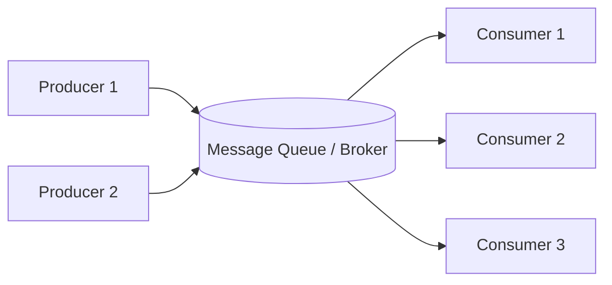

**Why this matters in system design:**
- **Decoupling** - the producer and consumer don't need to know about each other's location, load, or even whether the other is currently running.
- **Load leveling** - the queue absorbs bursts of traffic so downstream workers can process at a sustainable, steady pace instead of being overwhelmed.
- **Fault tolerance** - if a consumer crashes mid-processing, the message stays in the queue (or is redelivered) instead of being lost.
- **Independent scalability** - producers and consumers scale separately; adding more consumer instances increases throughput without touching the producer.

This page is organized into the following topics, each covering the core theory, a Mermaid diagram, a real-life use case, interview questions with answers, and a Java implementation sketch:

- [Asynchronus Communication/Message Queue](#asynchronus-communicationmessage-queue)
  - [Blogs and websites](#blogs-and-websites)
  - [Medium](#medium)
  - [Youtube](#youtube)
    - [Single Videos](#single-videos)
    - [Playlists](#playlists)
  - [Theory](#theory)
    - [Introduction](#introduction)
    - [Core Concepts: Producers, Consumers, Brokers, Queues and Topics](#core-concepts-producers-consumers-brokers-queues-and-topics)
    - [Point-to-Point Messaging (Queue Model)](#point-to-point-messaging-queue-model)
    - [Publish/Subscribe Messaging (Topic Model)](#publishsubscribe-messaging-topic-model)
    - [Fan-Out Pattern](#fan-out-pattern)
    - [Message Acknowledgment and Redelivery](#message-acknowledgment-and-redelivery)
    - [Dead Letter Queues (DLQ)](#dead-letter-queues-dlq)
    - [Delivery Guarantees: At-Most-Once, At-Least-Once, Exactly-Once](#delivery-guarantees-at-most-once-at-least-once-exactly-once)
    - [Idempotent Consumers](#idempotent-consumers)
    - [Message Ordering and Partitioning](#message-ordering-and-partitioning)
    - [Backpressure and Load Leveling](#backpressure-and-load-leveling)
    - [Message Queues vs Event Streaming](#message-queues-vs-event-streaming)

---

### Core Concepts: Producers, Consumers, Brokers, Queues and Topics

Every message-queue-based system is built from the same small set of building blocks, regardless of which product (Kafka, RabbitMQ, SQS) implements them.

- **Producer**: The service or application that creates a message and publishes it to the broker. It has no knowledge of who (or how many consumers) will eventually process it.
- **Consumer/Worker**: The service that subscribes to (or polls) a queue/topic and processes messages. Multiple consumer instances can share the load.
- **Broker**: The middleware server (Kafka, RabbitMQ, ActiveMQ) or managed service (SQS, Google Pub/Sub) that receives, stores, and routes messages between producers and consumers.
- **Queue/Topic**: The named channel messages are written to. A **queue** typically implies point-to-point delivery; a **topic** typically implies pub/sub delivery to multiple subscribers.
- **Message**: The unit of data being transferred, usually a payload (JSON/Avro/Protobuf) plus metadata (headers, timestamp, message ID).
- **Acknowledgment (ack)**: A signal from the consumer back to the broker confirming successful processing, so the message can be safely removed (or, for logs like Kafka, the consumer offset advanced).

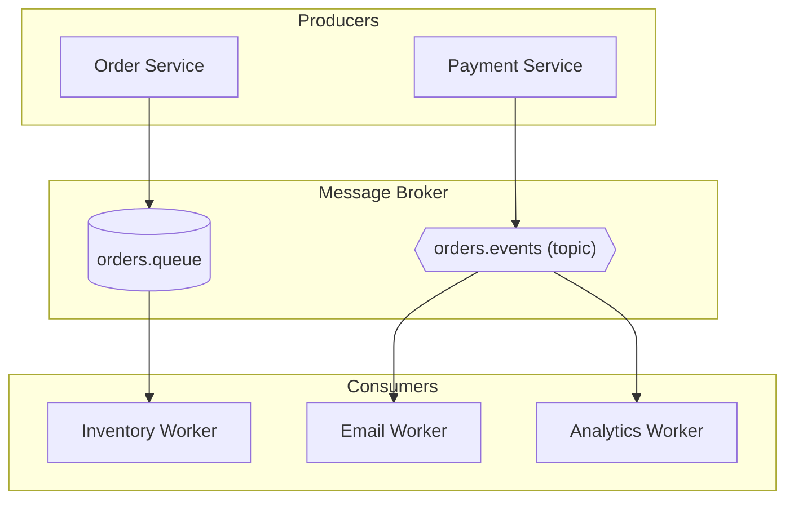

> **Real-life use case:** At an e-commerce company, the Order Service (producer) publishes an `OrderPlaced` message to a broker. It has zero knowledge that an Inventory Worker, an Email Worker, and an Analytics Worker will all eventually consume that same event - the broker handles all the fan-out and delivery guarantees, keeping the Order Service simple and fast.

**Java: a minimal producer using the Kafka client**

```java
Properties props = new Properties();
props.put("bootstrap.servers", "localhost:9092");
props.put("key.serializer", "org.apache.kafka.common.serialization.StringSerializer");
props.put("value.serializer", "org.apache.kafka.common.serialization.StringSerializer");

try (KafkaProducer<String, String> producer = new KafkaProducer<>(props)) {
    ProducerRecord<String, String> record =
        new ProducerRecord<>("orders.events", "order-123", "{\"orderId\":\"123\",\"status\":\"PLACED\"}");
    producer.send(record, (metadata, exception) -> {
        if (exception != null) {
            System.err.println("Failed to publish: " + exception.getMessage());
        } else {
            System.out.println("Published to partition " + metadata.partition() + " offset " + metadata.offset());
        }
    });
}
```

**Interview Q&A**

- **Q: What is the difference between a queue and a topic?**
    A: A queue delivers each message to exactly one consumer (point-to-point); a topic delivers each message to every subscriber (pub/sub). Some systems, like Kafka, blur this line - a Kafka topic delivers to every consumer group once, but within a group only one consumer instance gets each message.
- **Q: Why does the producer not talk to the consumer directly?**
    A: Direct calls create tight coupling and require both sides to be available simultaneously. Routing through a broker lets producers and consumers be developed, deployed, scaled, and restarted independently, and lets new consumers be added without any change to the producer.
- **Q: What happens if there are no consumers currently running?**
    A: Messages remain buffered in the queue/topic (subject to retention limits) until a consumer comes online and reads them - this is one of the key properties that makes async communication resilient to temporary outages.

---

### Point-to-Point Messaging (Queue Model)

In the point-to-point model, a message published to a queue is delivered to **exactly one** consumer, even if many consumer instances are listening. This is the classic model for distributing units of work across a pool of workers.

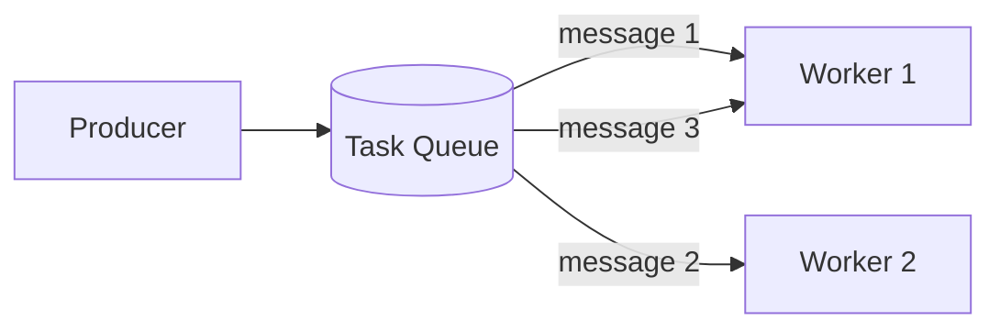

**Key characteristics:**
- Each message is consumed once and then removed (or acknowledged) - it is not broadcast to other workers.
- Adding more worker instances increases total throughput; the broker load-balances messages across them (competing consumers pattern).
- Ideal when a unit of work should be handled by exactly one worker - e.g. "resize this image" should not run twice.

> **Real-life use case:** A video-encoding platform pushes one message per uploaded video onto an SQS queue. A fleet of EC2 worker instances polls the queue; whichever worker is free next picks up the next video, encodes it, and deletes the message on success. Scaling from 5,000 to 50,000 uploads a day is handled simply by adding more worker instances - no producer-side changes required.

**Java: a competing consumer using AWS SQS**

```java
SqsClient sqs = SqsClient.create();
String queueUrl = "https://sqs.us-east-1.amazonaws.com/123456789012/video-encoding-queue";

while (true) {
    ReceiveMessageRequest request = ReceiveMessageRequest.builder()
        .queueUrl(queueUrl)
        .maxNumberOfMessages(1)
        .waitTimeSeconds(20) // long polling
        .build();

    List<Message> messages = sqs.receiveMessage(request).messages();
    for (Message message : messages) {
        try {
            encodeVideo(message.body());
            sqs.deleteMessage(DeleteMessageRequest.builder()
                .queueUrl(queueUrl)
                .receiptHandle(message.receiptHandle())
                .build());
        } catch (Exception e) {
            // leave message in queue; it becomes visible again after the visibility timeout
            System.err.println("Processing failed, message will be retried: " + e.getMessage());
        }
    }
}
```

**Interview Q&A**

- **Q: If I run 10 instances of the same consumer, will each of them process every message?**
    A: No - in a point-to-point queue, each message is delivered to exactly one consumer instance. The 10 instances compete for messages, effectively load-balancing the work across the pool (the "competing consumers" pattern).
- **Q: How does the queue know a message was processed successfully?**
    A: The consumer explicitly acknowledges the message (deletes it, in SQS terms) after successful processing. If no acknowledgment arrives before the visibility timeout expires, the broker assumes the consumer failed and makes the message visible again for another consumer to pick up.
- **Q: What is a good use case where point-to-point is preferred over pub/sub?**
    A: Any "do this task exactly once" workload - image resizing, PDF generation, sending a single confirmation email - where processing the same message twice would be wasteful or incorrect.

---

### Publish/Subscribe Messaging (Topic Model)

In the publish/subscribe (pub/sub) model, a message published to a topic is delivered to **every** subscriber, not just one. This is the model for broadcasting events to multiple independent downstream systems.

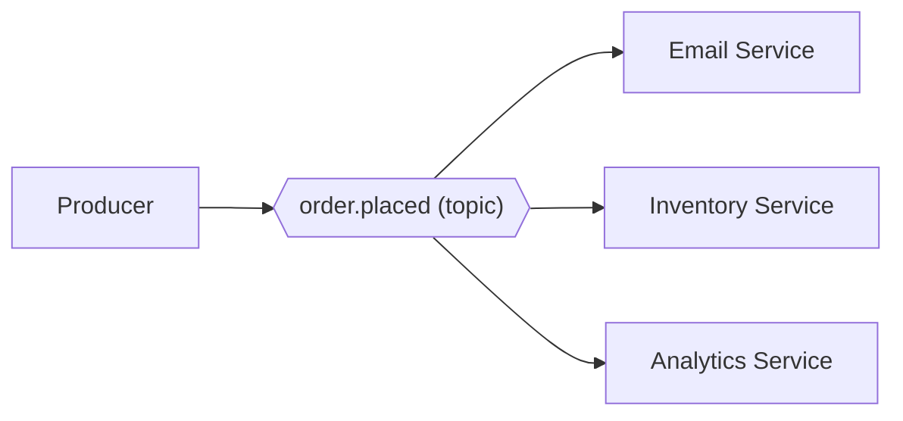

**Key characteristics:**
- Every subscriber gets its own independent copy of the message.
- Subscribers can be added or removed without the producer ever knowing or changing.
- Each subscriber typically has its own queue behind the topic, so slow subscribers don't block fast ones.

> **Real-life use case:** When a ride is completed on a ride-hailing platform, a single `RideCompleted` event is published to a topic. Independently, the Billing service subscribes to charge the rider, the Driver Payout service subscribes to credit the driver, and the Analytics service subscribes to update dashboards - all three react to the same event without knowing about each other.

**Java: publish/subscribe with Spring for RabbitMQ (fanout exchange)**

```java
@Configuration
public class PubSubConfig {

    @Bean
    public FanoutExchange orderPlacedExchange() {
        return new FanoutExchange("order.placed.exchange");
    }

    @Bean
    public Queue emailQueue() {
        return new Queue("email.queue");
    }

    @Bean
    public Queue inventoryQueue() {
        return new Queue("inventory.queue");
    }

    @Bean
    public Binding bindEmail(Queue emailQueue, FanoutExchange orderPlacedExchange) {
        return BindingBuilder.bind(emailQueue).to(orderPlacedExchange);
    }

    @Bean
    public Binding bindInventory(Queue inventoryQueue, FanoutExchange orderPlacedExchange) {
        return BindingBuilder.bind(inventoryQueue).to(orderPlacedExchange);
    }
}

// Producer
rabbitTemplate.convertAndSend("order.placed.exchange", "", orderPlacedEvent);
```

**Interview Q&A**

- **Q: In pub/sub, if the Email Service is down, does the Inventory Service still get the message?**
    A: Yes - each subscriber has its own independent delivery path (its own queue behind the topic in most implementations), so one subscriber being down or slow does not affect delivery to the others.
- **Q: How is a Kafka "consumer group" related to pub/sub?**
    A: Kafka blends both models - a topic broadcasts each message once per consumer group (pub/sub across groups), but within a single group only one member processes each message/partition (point-to-point across group members). This lets the same topic serve multiple independent applications while each application still load-balances internally.
- **Q: What is the main risk of pub/sub compared to point-to-point?**
    A: Because every subscriber processes every message, pub/sub can amplify load and requires each subscriber to independently handle failures, retries, and idempotency; there's no single shared "one worker handles this" guarantee.

---

### Fan-Out Pattern

Fan-out is the pattern where **one event triggers multiple independent downstream actions**, typically implemented on top of pub/sub: a single published message results in several unrelated pieces of work happening in parallel.

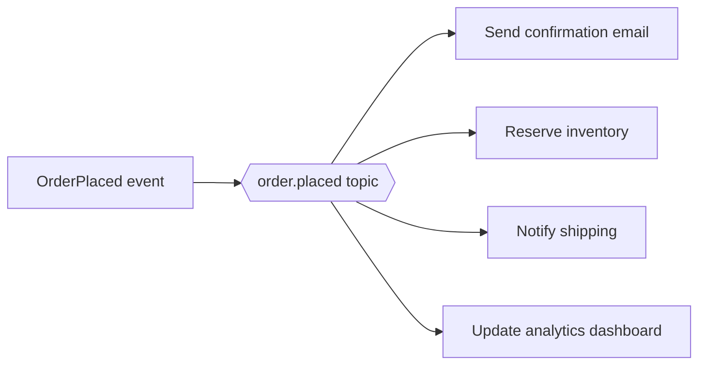

**Key characteristics:**
- Each downstream action is decoupled from the others - shipping notification failing does not stop inventory reservation from happening.
- New reactions to an event (e.g. adding fraud detection) can be added later by subscribing a new consumer, with zero changes to the producer or existing consumers.
- Commonly implemented with a fanout exchange (RabbitMQ), an SNS topic fanning out to multiple SQS queues (AWS), or multiple consumer groups on a Kafka topic.

> **Real-life use case:** AWS's classic "fan-out" reference architecture publishes one message to an SNS topic, which fans out to several SQS queues - one for order fulfillment, one for email notifications, and one for a data warehouse ETL pipeline. Each queue is consumed independently, at its own pace, by a completely separate service.

**Java: fan-out with AWS SNS to multiple SQS queues**

```java
SnsClient sns = SnsClient.create();
String topicArn = "arn:aws:sns:us-east-1:123456789012:order-placed";

PublishRequest publishRequest = PublishRequest.builder()
    .topicArn(topicArn)
    .message("{\"orderId\":\"123\",\"status\":\"PLACED\"}")
    .build();

sns.publish(publishRequest);
// SNS delivers a copy of this message to every SQS queue subscribed to the topic:
// email-queue, inventory-queue, and analytics-queue - each processed independently.
```

**Interview Q&A**

- **Q: How is fan-out different from plain pub/sub?**
    A: Fan-out is really the *outcome* you get by applying pub/sub - one message, many independent subscribers each triggering a different business action. Pub/sub is the delivery mechanism; fan-out describes the resulting architecture where a single event ripples out into several unrelated side effects.
- **Q: What happens if one of the fan-out consumers is much slower than the others?**
    A: Because each subscriber has its own queue, a slow consumer only builds up backlog on its own queue - it does not slow down or block the other consumers, which is one of the main benefits of fan-out over a synchronous "call every downstream service in a loop" approach.
- **Q: How do you avoid tightly coupling the producer to how many consumers exist?**
    A: The producer publishes to a single topic and never enumerates subscribers itself; new consumers subscribe independently. This means adding a tenth downstream reaction to an event requires zero producer code changes.

---

### Message Acknowledgment and Redelivery

**Acknowledgment (ack)** is how a consumer tells the broker "I successfully processed this message, you can remove it (or advance my offset)." Without acknowledgment, the broker has no way to know whether a message was actually handled or the consumer crashed mid-processing.

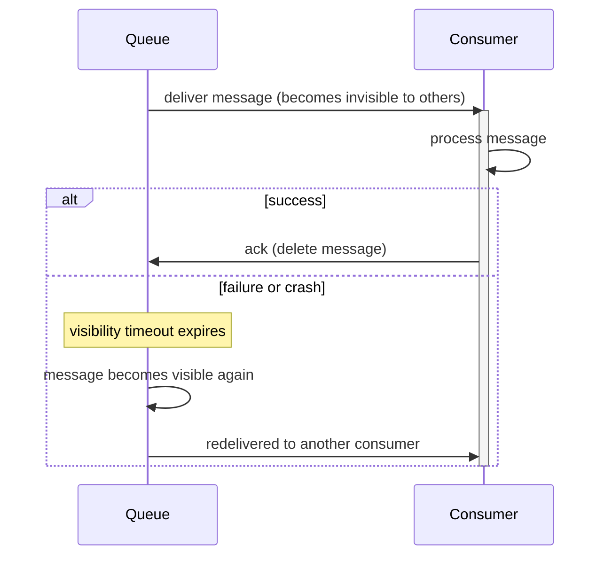

**Key mechanisms:**
- **Visibility timeout (SQS) / lock duration**: once a message is delivered, it becomes temporarily invisible to other consumers so it isn't processed twice while being worked on.
- **Manual ack vs auto-ack**: manual ack (send the ack only after business logic fully completes) is safer than auto-ack (broker marks it done the instant it's delivered), because auto-ack loses the message if the consumer crashes right after receiving it.
- **Negative acknowledgment (nack)**: a consumer can explicitly reject a message, sending it back to the queue immediately instead of waiting for a timeout.
- **Redelivery count**: brokers track how many times a message has been redelivered, which is used to decide when to route it to a dead letter queue.

> **Real-life use case:** RabbitMQ workers processing PDF-generation jobs use manual acknowledgment - if a worker process is killed (e.g. during a deploy) mid-render, RabbitMQ detects the lost connection, and the unacknowledged message is automatically requeued for another worker to pick up, so no PDF request is silently dropped during a rolling deployment.

**Java: manual acknowledgment with RabbitMQ**

```java
Channel channel = connection.createChannel();
channel.basicQos(1); // one unacked message at a time per consumer

DeliverCallback deliverCallback = (consumerTag, delivery) -> {
    String body = new String(delivery.getBody(), StandardCharsets.UTF_8);
    try {
        processPdfJob(body);
        channel.basicAck(delivery.getEnvelope().getDeliveryTag(), false);
    } catch (Exception e) {
        // requeue = true sends it back to the queue for another attempt
        channel.basicNack(delivery.getEnvelope().getDeliveryTag(), false, true);
    }
};

channel.basicConsume("pdf.jobs", false, deliverCallback, consumerTag -> {});
```

**Interview Q&A**

- **Q: Why is manual acknowledgment generally preferred over auto-ack for critical work?**
    A: Auto-ack marks a message as done the moment it is delivered, before processing even starts - if the consumer crashes immediately after receiving it, the message is lost forever. Manual ack only removes the message after processing truly succeeds, so a crash mid-processing results in safe redelivery instead of silent data loss.
- **Q: What is a visibility timeout and why does it need to be tuned carefully?**
    A: It is the window during which a delivered-but-unacknowledged message is hidden from other consumers. If it's too short, a still-processing message can be redelivered to a second consumer, causing duplicate processing; if it's too long, a genuinely failed message sits idle longer than necessary before being retried.
- **Q: What is the difference between ack and nack?**
    A: Ack confirms successful processing and removes the message. Nack explicitly signals failure and typically triggers immediate requeue (or dead-lettering), rather than waiting for a timeout to expire.

---

### Dead Letter Queues (DLQ)

A **Dead Letter Queue** is a separate queue where messages are routed after they fail processing repeatedly (exceeding a configured max-retry count), so they don't block the main queue or get retried forever.

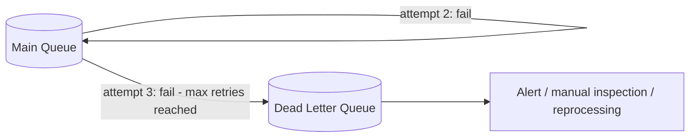

**Why DLQs matter:**
- **Prevents poison-pill loops**: a malformed message that always throws an exception would otherwise be redelivered forever, wasting consumer resources and potentially blocking well-formed messages behind it.
- **Provides observability**: engineers can inspect the DLQ to understand exactly which messages failed and why, instead of losing them silently.
- **Enables recovery**: once the root cause is fixed (e.g. a bug or a downstream outage), messages in the DLQ can be replayed back into the main queue.

> **Real-life use case:** An SQS-based order-processing pipeline configures a redrive policy of `maxReceiveCount: 5`. A message referencing a since-deleted product ID fails validation on every attempt; after 5 failed deliveries, SQS automatically moves it to `orders-dlq`. An on-call alert fires on non-empty DLQ depth, and the team inspects and fixes the bad message instead of it looping forever and starving the queue.

**Java: configuring a redrive policy for an SQS dead letter queue**

```java
SqsClient sqs = SqsClient.create();

String dlqArn = sqs.getQueueAttributes(GetQueueAttributesRequest.builder()
        .queueUrl(dlqUrl)
        .attributeNames(QueueAttributeName.QUEUE_ARN)
        .build())
    .attributes().get(QueueAttributeName.QUEUE_ARN);

String redrivePolicy = String.format(
    "{\"deadLetterTargetArn\":\"%s\",\"maxReceiveCount\":\"5\"}", dlqArn);

sqs.setQueueAttributes(SetQueueAttributesRequest.builder()
    .queueUrl(mainQueueUrl)
    .attributes(Map.of(QueueAttributeName.REDRIVE_POLICY, redrivePolicy))
    .build());
```

**Interview Q&A**

- **Q: What problem does a dead letter queue solve that plain retries don't?**
    A: Unlimited retries on a message that can never succeed (a "poison pill") waste consumer capacity forever and can starve other valid messages behind it in the queue. A DLQ caps retries and isolates the bad message so the main queue keeps flowing while the failure gets investigated separately.
- **Q: Should every failure route straight to the DLQ?**
    A: No - transient failures (a downstream service briefly down, a network blip) should be retried with backoff first. Only messages that exceed a max retry count, or that fail with a clearly non-retryable error (e.g. schema validation failure), should go to the DLQ.
- **Q: What do you do with messages once they land in the DLQ?**
    A: Typically alert on non-empty DLQ depth, inspect the message content and failure reason, fix the root cause (code bug, bad data, downstream outage), and then replay the message back into the main queue for reprocessing, or discard it if it's no longer relevant.

---

### Delivery Guarantees: At-Most-Once, At-Least-Once, Exactly-Once

Every messaging system has to make a trade-off about what happens when acknowledgment is uncertain (e.g. the consumer processed the message but crashed before the ack was received by the broker).

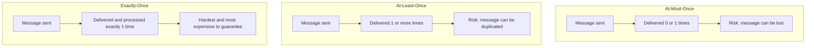

**The three guarantees:**
- **At-most-once**: the message is sent and forgotten; if it's lost in transit or the consumer crashes before processing, it is never retried. Fast and simple, but data can silently disappear. Rarely acceptable for anything business-critical.
- **At-least-once**: the broker keeps redelivering until it receives an ack, guaranteeing the message is eventually processed - but the same message may be delivered and processed more than once (e.g. ack lost on the network after successful processing). This is the most common guarantee in real systems (SQS, RabbitMQ, Kafka with manual offset commits).
- **Exactly-once**: the message is guaranteed to be processed precisely once, with no loss and no duplication. True exactly-once is very difficult across a network in the general case; systems like Kafka achieve **effectively exactly-once** within their own ecosystem (via idempotent producers and transactional consumer-producer chains), but this rarely extends to side effects outside the messaging system (e.g. an external HTTP call).

**Practical takeaway:** most real-world systems choose **at-least-once delivery** combined with an **idempotent consumer** (see next topic) to achieve the practical equivalent of exactly-once processing.

> **Real-life use case:** Kafka's idempotent producer (`enable.idempotence=true`) assigns each message a sequence number per partition so that if a producer retries a send due to a network timeout, the broker recognizes and discards the duplicate, giving exactly-once semantics for the producer-to-broker leg - while the consumer side still needs its own idempotency handling for true end-to-end exactly-once behavior.

**Java: enabling an idempotent Kafka producer**

```java
Properties props = new Properties();
props.put("bootstrap.servers", "localhost:9092");
props.put("enable.idempotence", "true"); // prevents duplicate sends on retry
props.put("acks", "all");
props.put("retries", Integer.MAX_VALUE);
props.put("max.in.flight.requests.per.connection", "5");

KafkaProducer<String, String> producer = new KafkaProducer<>(props);
```

**Interview Q&A**

- **Q: Why do most production systems pick at-least-once instead of trying for exactly-once?**
    A: True exactly-once across an entire distributed pipeline (including any side effects like external API calls) is extremely difficult and expensive to guarantee. At-least-once is far simpler to implement reliably, and combined with idempotent consumers it produces the same practical outcome - no lost or double-applied business effects - at a fraction of the complexity.
- **Q: Can at-most-once ever be an acceptable choice?**
    A: Yes, for data where occasional loss is tolerable and low latency matters more than completeness - e.g. live metrics/telemetry pings, best-effort UI notifications, or ephemeral live-location updates where the next update supersedes any lost one.
- **Q: How does Kafka's idempotent producer prevent duplicates?**
    A: It tags each message with a producer ID and a monotonically increasing sequence number per partition; if a retry resends a message the broker has already committed with that sequence number, the broker recognizes and drops the duplicate instead of appending it again.

---

### Idempotent Consumers

An operation is **idempotent** if performing it multiple times has the same effect as performing it once. Since at-least-once delivery guarantees a message may arrive more than once, the consumer itself must be written so that duplicate processing is harmless.

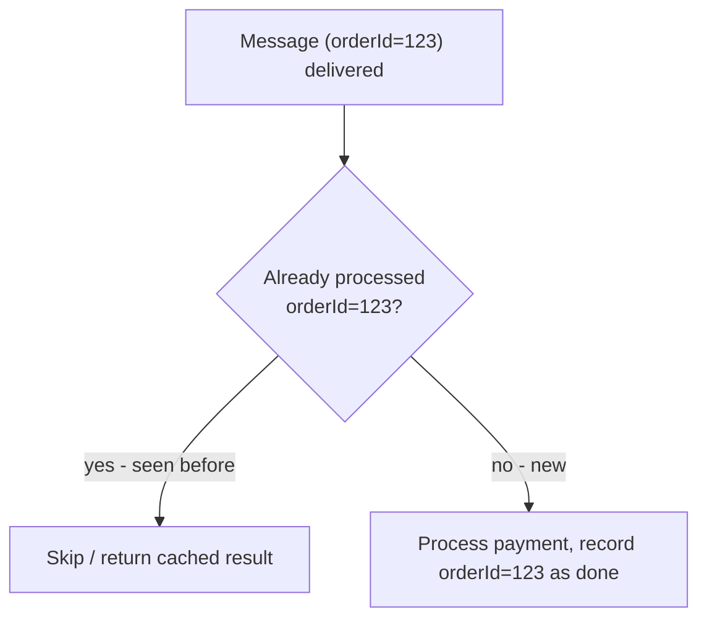

**Common idempotency strategies:**
- **Idempotency keys**: attach a unique key (e.g. order ID, request UUID) to each message; before processing, check a store (database, Redis) to see if that key was already handled.
- **Natural idempotency**: design the operation itself to be safe to repeat - e.g. "set balance to $100" is idempotent, while "add $10 to balance" is not.
- **Upserts instead of inserts**: using `INSERT ... ON CONFLICT DO NOTHING` or a unique constraint on the idempotency key so a duplicate insert is a no-op rather than a duplicate row.
- **Deduplication window**: some brokers (Kafka with transactional IDs, SQS FIFO queues) provide broker-level deduplication for a limited time window, reducing (but not eliminating) the burden on the consumer.

> **Real-life use case:** Stripe's webhook consumers store the `event.id` from every incoming webhook in a database with a unique constraint before processing it. If Stripe redelivers the same webhook (which it explicitly documents can happen), the duplicate insert fails the unique constraint, and the consumer safely skips re-charging the customer a second time.

**Java: an idempotent consumer using a database unique constraint**

```java
public void handleOrderPlaced(String orderId, String payload) {
    try {
        // processed_events table has a UNIQUE constraint on event_id
        jdbcTemplate.update(
            "INSERT INTO processed_events (event_id, processed_at) VALUES (?, NOW())",
            orderId);
    } catch (DuplicateKeyException e) {
        System.out.println("Duplicate delivery for order " + orderId + ", skipping");
        return; // already handled - safe no-op
    }

    reserveInventory(orderId, payload);
    sendConfirmationEmail(orderId, payload);
}
```

**Interview Q&A**

- **Q: Why can't we just rely on the broker to guarantee exactly-once instead of making consumers idempotent?**
    A: Even brokers with strong internal guarantees (like Kafka's idempotent producer) can't protect against every failure mode end-to-end - e.g. a consumer that fully processes a message and then crashes before its ack is recorded will see that message redelivered. Idempotent consumer logic is the layer that makes the overall system safe regardless of where a duplicate originates.
- **Q: What is the difference between "naturally idempotent" and "made idempotent with a dedup key"?**
    A: A naturally idempotent operation (like `SET status = SHIPPED`) produces the same end state no matter how many times it runs, with no extra bookkeeping needed. A non-idempotent operation (like `charge $10`) needs an explicit idempotency key check to detect and skip duplicates, because repeating it changes the outcome.
- **Q: Where should the idempotency check happen - before or after the side effect?**
    A: The check-and-record step (e.g. inserting the event ID with a unique constraint) must happen atomically with, or before, the side effect is committed, ideally in the same transaction as the business data change - otherwise a crash between "process" and "record as done" can still let a duplicate slip through.

---

### Message Ordering and Partitioning

Some workloads (e.g. events for a single bank account or a single user session) must be processed **in the order they were produced**. Message queues achieve ordering at a partial scope - usually per-partition or per-queue - rather than globally across an entire system.

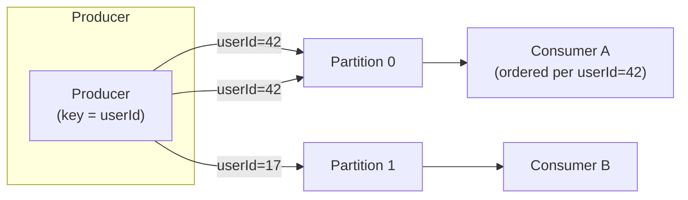

**Key concepts:**
- **Partitioning by key**: messages with the same partition key (e.g. `userId`, `accountId`) always land in the same partition, and a single partition is only ever read by one consumer within a group, which preserves order for that key.
- **Global order is rarely guaranteed**: across different partitions/queues there is no ordering guarantee - only ordering *within* a partition is provided.
- **FIFO queues**: some systems offer an explicit FIFO mode (e.g. SQS FIFO queues) that guarantees strict order and exactly-once processing within a "message group," at the cost of lower throughput than standard queues.
- **Trade-off**: more partitions increase parallelism/throughput but shrink the scope over which ordering is guaranteed.

> **Real-life use case:** A banking platform partitions its Kafka `transactions` topic by `accountId`. All debit/credit events for account `#4471` always land on the same partition and are processed strictly in order by a single consumer instance, guaranteeing the running balance is never computed against events applied out of sequence - while transactions for different accounts are processed fully in parallel across other partitions.

**Java: producing with a partition key to preserve per-key order in Kafka**

```java
ProducerRecord<String, String> record = new ProducerRecord<>(
    "transactions",
    account.getId(),           // partition key - ensures same-account events stay ordered
    toJson(transactionEvent));

producer.send(record);
```

**Interview Q&A**

- **Q: Does Kafka guarantee global ordering across an entire topic?**
    A: No - Kafka only guarantees ordering *within* a single partition. Across partitions there is no ordering guarantee at all, which is a deliberate trade-off to allow parallel consumption and higher throughput.
- **Q: How do you guarantee that all events for the same entity (e.g. a user or account) are processed in order?**
    A: Use that entity's ID as the partition/message-group key, so every event for that entity is deterministically routed to the same partition/queue and therefore processed sequentially by a single consumer.
- **Q: What is the throughput cost of using a FIFO queue instead of a standard queue?**
    A: FIFO queues (e.g. SQS FIFO) trade throughput for ordering and exactly-once guarantees - they support far fewer transactions per second than standard queues, so they're used selectively for data where strict order truly matters, not as the default choice for every queue.

---

### Backpressure and Load Leveling

**Backpressure** is the mechanism by which a system signals "slow down" to an upstream producer when a downstream consumer cannot keep up, preventing the consumer (or the broker) from being overwhelmed and falling over.

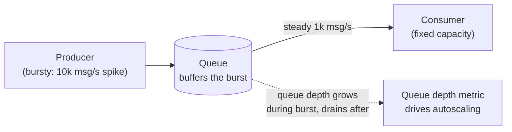

**How message queues provide load leveling:**
- The queue absorbs a burst of incoming messages so the producer never has to wait for (or be limited by) the consumer's processing speed - this is exactly the "return response immediately" benefit described in the introduction.
- Consumers drain the queue at whatever rate they can sustain, so a downstream database or API is never hit with more concurrent load than it can handle.
- **Autoscaling on queue depth**: many systems scale the number of consumer instances based on queue length (e.g. Kubernetes HPA on SQS `ApproximateNumberOfMessagesVisible`), automatically adding workers during a burst and scaling back down afterward.
- **Backpressure at the producer**: if the queue itself has a bounded size or the broker signals it is overloaded, well-behaved producers should slow down or apply their own retry/backoff rather than fire-hosing an already-struggling system.

> **Real-life use case:** A flash-sale event on an e-commerce site produces a spike of 50,000 order-placed events in one minute, far more than the normal steady rate of 500/minute. Because orders flow through a queue rather than directly hitting the inventory database, the database only ever sees the steady rate its consumer pool is tuned for, while the queue depth temporarily grows and then drains over the following minutes - no synchronous timeout or database overload occurs.

**Java: scaling consumer concurrency based on queue depth**

```java
SqsClient sqs = SqsClient.create();

int queueDepth = Integer.parseInt(sqs.getQueueAttributes(GetQueueAttributesRequest.builder()
        .queueUrl(queueUrl)
        .attributeNames(QueueAttributeName.APPROXIMATE_NUMBER_OF_MESSAGES)
        .build())
    .attributes().get(QueueAttributeName.APPROXIMATE_NUMBER_OF_MESSAGES));

int desiredWorkers = Math.min(MAX_WORKERS, Math.max(MIN_WORKERS, queueDepth / MESSAGES_PER_WORKER));
autoScalingClient.setDesiredCapacity(r -> r
    .autoScalingGroupName("order-worker-asg")
    .desiredCapacity(desiredWorkers));
```

**Interview Q&A**

- **Q: How does a message queue provide "load leveling" specifically?**
    A: It decouples the arrival rate of work from the processing rate - producers can burst far above the consumer's steady-state capacity, and the queue simply buffers the excess, letting consumers drain it at a sustainable pace instead of failing under sudden load.
- **Q: What is backpressure, concretely, in a queue-based system?**
    A: It is any signal or mechanism that slows down message production when downstream capacity is exceeded - this could be a bounded queue rejecting new writes, a broker returning a throttling error, or simply queue depth growing, which then triggers autoscaling of consumers to relieve pressure.
- **Q: What happens if a queue has unbounded depth and consumers never catch up?**
    A: Messages pile up indefinitely, increasing end-to-end latency (a message produced now might not be processed for hours) and eventually risking storage/cost limits or message expiry (TTL) if the broker enforces a retention period, so monitoring queue depth and consumer lag is critical to catching this before data is lost.

---

### Message Queues vs Event Streaming

Not all asynchronous messaging systems solve the same problem. Traditional message queues (RabbitMQ, SQS) are optimized for **task distribution**, while event streaming platforms (Kafka) are optimized for **durable, replayable event logs**.

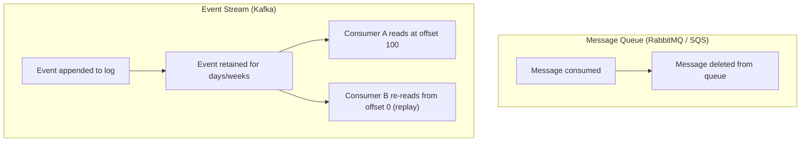

**Key differences:**

| Aspect | Message Queue (RabbitMQ, SQS) | Event Streaming (Kafka) |
|--------|-------------------------------|--------------------------|
| Message lifecycle | Deleted once acknowledged | Retained for a configured period regardless of consumption |
| Replay | Not possible once consumed | Any consumer can rewind and reprocess from an earlier offset |
| Primary use case | Task/job distribution, RPC-style work queues | Event sourcing, analytics, multiple independent readers of history |
| Ordering scope | Per queue (or per message group in FIFO) | Per partition |
| Throughput | Moderate, optimized for flexible routing | Very high, optimized for sequential log writes/reads |

**When to choose which:**
- Choose a **message queue** when you need simple task distribution, flexible routing (exchanges, filters), and don't need to replay history - e.g. "process this one job."
- Choose an **event stream** when multiple independent consumers need to read the same events, potentially replay from the past (e.g. to rebuild a cache or backfill a new service), or when very high throughput sequential writes are required - e.g. clickstream analytics, audit logs, event-sourced systems.

> **Real-life use case:** LinkedIn (Kafka's original creator) uses Kafka as the backbone for its activity data pipeline - every profile view, connection, and click is appended to a Kafka topic, retained for days, and independently consumed by the news feed ranking service, the analytics warehouse ingestion job, and the anti-abuse detection service - each reading the same stream of events at its own pace, with the anti-abuse service able to replay a day of history after a model update without needing LinkedIn to re-emit anything.

**Java: replaying from the beginning of a Kafka topic**

```java
Properties props = new Properties();
props.put("bootstrap.servers", "localhost:9092");
props.put("group.id", "analytics-backfill");
props.put("key.deserializer", "org.apache.kafka.common.serialization.StringDeserializer");
props.put("value.deserializer", "org.apache.kafka.common.serialization.StringDeserializer");
props.put("auto.offset.reset", "earliest"); // replay full retained history

try (KafkaConsumer<String, String> consumer = new KafkaConsumer<>(props)) {
    consumer.subscribe(List.of("user.activity"));
    consumer.seekToBeginning(consumer.assignment());

    while (true) {
        ConsumerRecords<String, String> records = consumer.poll(Duration.ofMillis(500));
        records.forEach(r -> reprocessForAnalytics(r.value()));
    }
}
```

**Interview Q&A**

- **Q: Why can't you replay messages in a traditional queue like SQS the way you can in Kafka?**
    A: A traditional queue's model is "deliver once, then delete" - once a message is acknowledged it is gone from the queue entirely. Kafka instead treats a topic as an append-only log with a configurable retention period, so consumed messages simply remain on disk and any consumer can rewind its offset to re-read them.
- **Q: If a new service is added six months into a project and needs historical data, which model helps more?**
    A: An event streaming platform like Kafka, because the new service's consumer can seek to the earliest retained offset and replay all historical events to build up its own state, whereas a traditional message queue would have already discarded those messages after they were first consumed.
- **Q: Is Kafka always the better choice given it can do both jobs?**
    A: Not necessarily - Kafka's log-based model adds operational complexity (partition management, consumer group rebalancing, retention tuning) that a simple task queue doesn't need. For straightforward "distribute this job to one worker" use cases, a simpler queue like SQS or RabbitMQ is often the more appropriate, lower-overhead choice.
