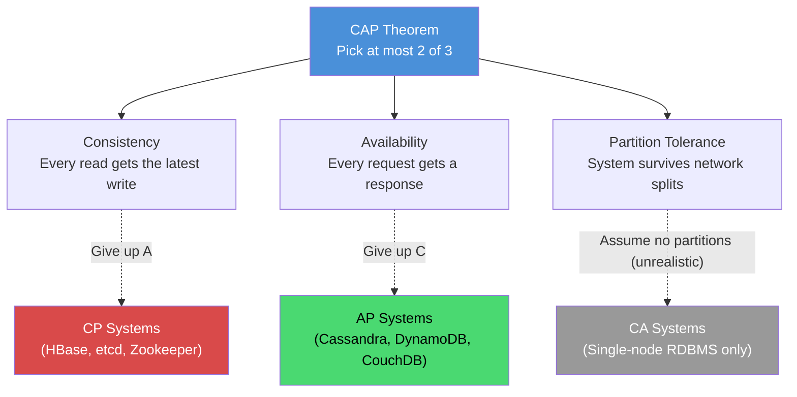
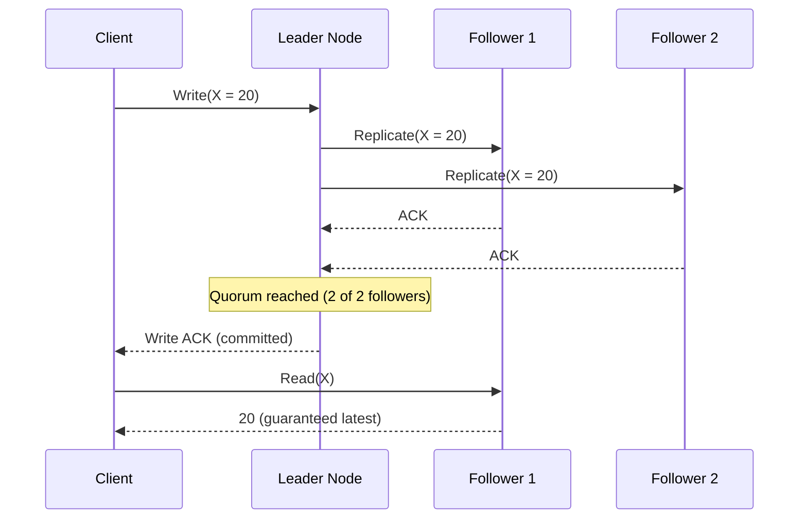
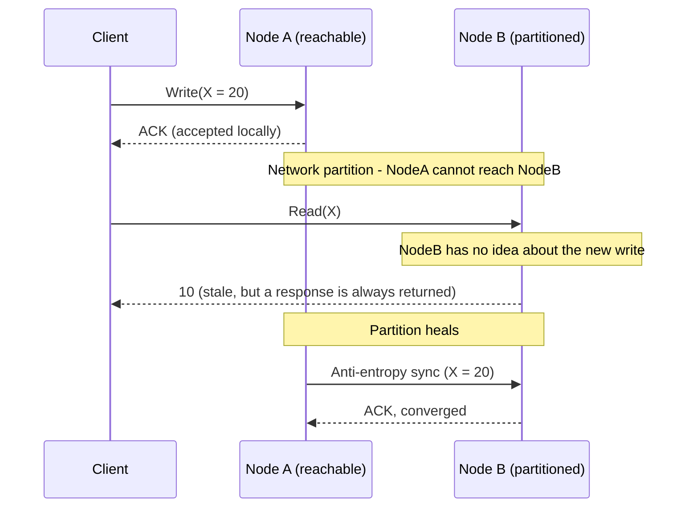
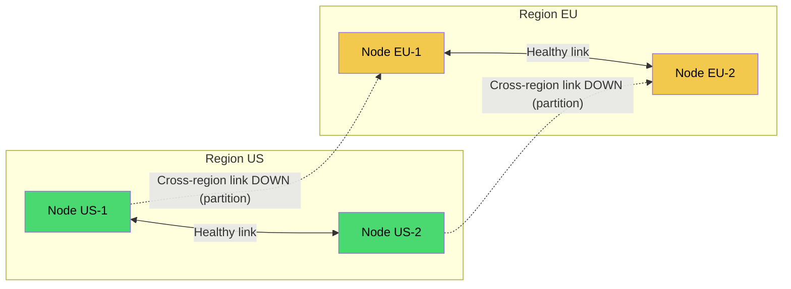
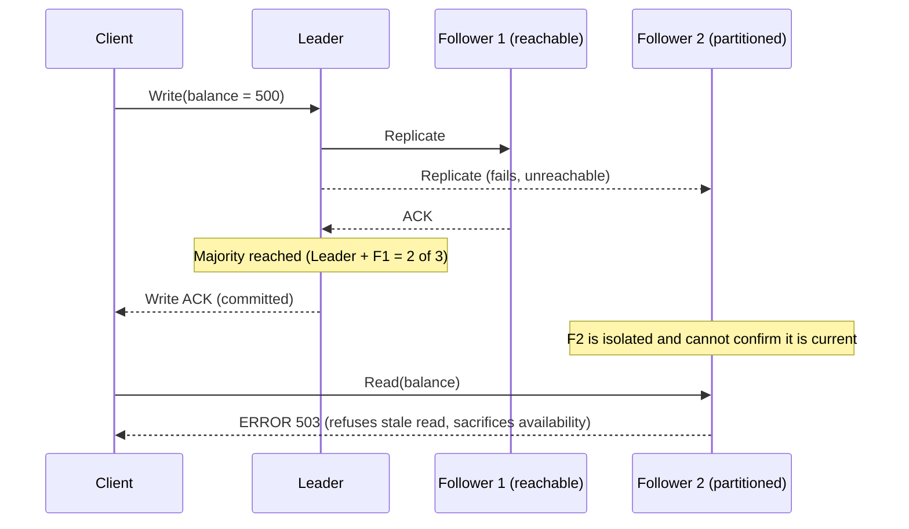
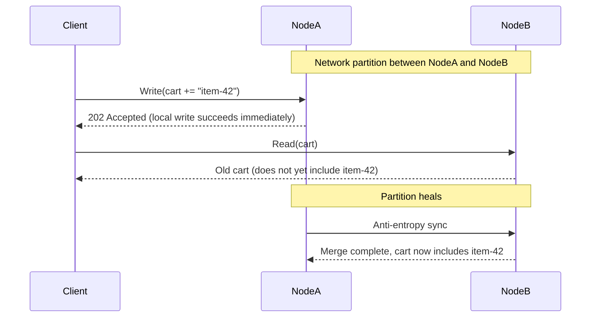
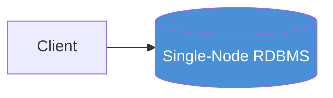
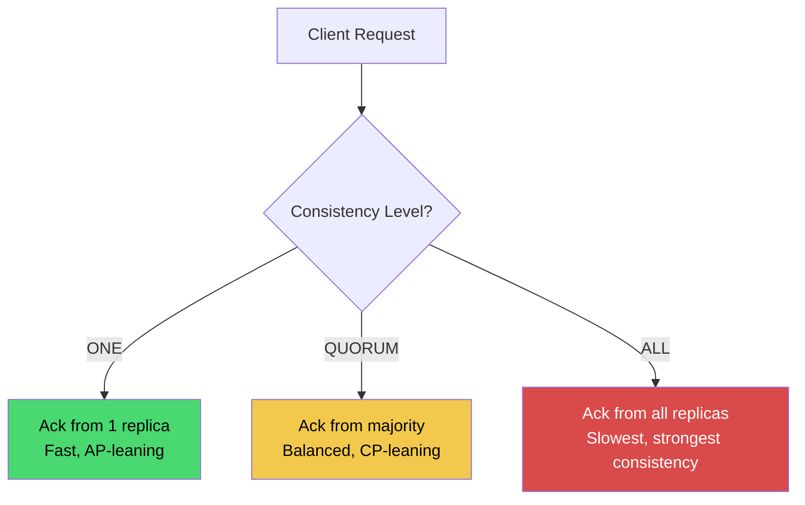
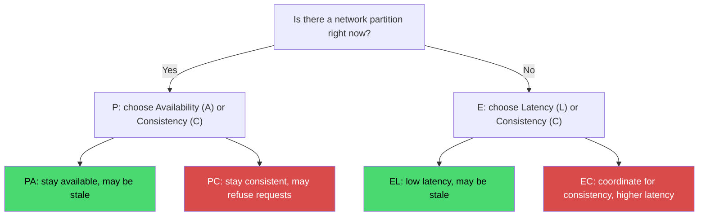
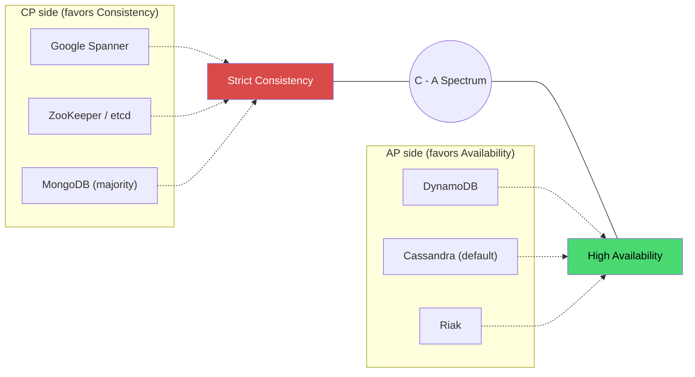

# CAP Theorem

## Blogs and websites


## Medium


## Youtube

- [2. CAP Theorem (Hindi) | High Level Design for Beginners | CAP Partition Tolerance explained](https://www.youtube.com/watch?v=3qRBeZsUa18)
- [CAP Theorem (English Dubbed) | Better with 1.25x playback speed](https://www.youtube.com/watch?v=SckoiQefVEE)

## Theory

### Topics Covered

This page is organized into the following topics. Each topic includes a detailed explanation, its characteristics, components, patterns, pros/benefits, cons/challenges, best practices, when to use it, a real-life use case, a diagram, a Java code example, and interview questions with answers.

1. [Introduction: The Immutable Law of Distributed Systems](#the-immutable-law-of-distributed-systems)
2. [Consistency (C)](#consistency-c)
3. [Availability (A)](#availability-a)
4. [Partition Tolerance (P)](#partition-tolerance-p)
5. [The Real Choice: CP vs AP](#the-real-choice-cp-vs-ap)
6. [CP Systems (Consistency over Availability)](#cp-systems-consistency-over-availability)
7. [AP Systems (Availability over Consistency)](#ap-systems-availability-over-consistency)
8. [CA Systems: The Myth](#ca-systems-the-myth)
9. [The Spectrum: Tunable Consistency](#the-spectrum-its-not-binary)
10. [PACELC Theorem](#pacelc-the-cap-extension)
11. [Real-World Examples: Who Chose What?](#real-world-examples-who-chose-what)
12. [The Wisdom: How to Choose](#the-wisdom-how-to-choose)
13. [CAP Theorem: Characteristics, Pros, Cons, Use Cases, Components, Patterns, Benefits, Challenges, Best Practices and When to Use](#cap-theorem-characteristics-pros-cons-use-cases-components-patterns-benefits-challenges-best-practices-and-when-to-use)

### The Immutable Law of Distributed Systems

The CAP Theorem is not a guideline or best practice—it's a **fundamental law of physics** for distributed systems, as immutable as the laws of thermodynamics. Formulated by Eric Brewer in 2000 and proven by Seth Gilbert and Nancy Lynch in 2002, it states an impossible choice:

**In a distributed system, you can guarantee at most TWO of the following three properties simultaneously:**

1. **Consistency (C)**: All nodes see the same data at the same time
2. **Availability (A)**: Every request receives a response (success or failure)
3. **Partition Tolerance (P)**: System continues operating despite network failures

### The Deep Theory: Why CAP is Inevitable

**The Impossibility Proof (Simplified):**

Imagine a distributed database with two nodes, N1 and N2.

**Scenario: Network Partition**
```
N1 (New York)  |  NETWORK PARTITION  |  N2 (London)
   X = 10      |      (no communication)     |    X = 10
```

**User A writes to N1:**
```
N1: X = 20  |  PARTITION  |  N2: X = 10
```

N1 cannot tell N2 about the update. Now User B reads from N2.

**The Impossible Choice:**

**Option 1: Choose Consistency (CP)**
```
N2: "I can't guarantee I have the latest value"
N2: Returns ERROR or TIMEOUT
Result: Not Available (❌ A)
```

**Option 2: Choose Availability (AP)**
```
N2: "I'll return my value: X = 10"
Result: Inconsistent (wrong value!) (❌ C)
```

**Option 3: Choose CA (Ignore partitions)**
```
Assume network never fails
Result: System breaks during partition (❌ P)
```

**The Revelation:**
There is **no fourth option**. Network partitions will happen (hardware fails, cables cut, routers crash). Therefore, P is not optional—you must tolerate partitions. The real choice is **C vs A during a partition**.

#### Diagram: The Impossibility Triangle



The diagram shows the central trade-off: because network partitions are unavoidable in any real distributed system, the P vertex is effectively "always chosen." That collapses the theoretical triangle into a straight line between C and A, and every distributed system design decision is really a decision about where it sits on that C-A line during a partition.

#### Real-Life Use Case: Multi-Region E-Commerce Checkout

Consider an e-commerce platform with data centers in the US and EU. A fiber cut severs the link between regions for eight minutes.

- An **inventory service** (must never oversell a limited-edition product) is configured as **CP**. During the partition, the EU region refuses to sell the product because it cannot confirm the latest stock count with the US region. Customers in the EU see "temporarily unavailable" for that single product, but the business never oversells it.
- A **product catalog / recommendations service** (browsing, "customers also bought") is configured as **AP**. During the same partition, EU shoppers keep browsing with a slightly stale catalog. Nobody notices a description that is a few minutes old, and the site never goes down for browsing.

This single incident shows that CAP is not chosen once for "the system"; it is chosen per service, based on what happens if that service is wrong versus what happens if that service is down.

#### Java Code: Simulating the Impossibility

The snippet below simulates two nodes that lose contact with each other, then shows the two only possible behaviors when a read arrives at the stale node: refuse (CP) or answer with old data (AP).

```java
import java.util.concurrent.atomic.AtomicInteger;

public class CapImpossibilityDemo {

    // A minimal "node" holding one integer value, replicated from a primary.
    static class Node {
        private final String name;
        private final AtomicInteger value;
        private volatile boolean reachablePeer; // simulates the network link to the other node

        Node(String name, int initialValue) {
            this.name = name;
            this.value = new AtomicInteger(initialValue);
            this.reachablePeer = true;
        }

        void setPeerReachable(boolean reachable) {
            this.reachablePeer = reachable;
        }

        void write(int newValue) {
            value.set(newValue);
        }

        // CP behavior: refuse the read when the peer cannot be confirmed as in-sync.
        int readConsistent() {
            if (!reachablePeer) {
                throw new IllegalStateException(name + ": partitioned, refusing read to avoid stale data (CP)");
            }
            return value.get();
        }

        // AP behavior: always answer, even if the value might be stale.
        int readAvailable() {
            return value.get(); // may be stale during a partition, but always responds
        }
    }

    public static void main(String[] args) {
        Node n1 = new Node("N1-NewYork", 10);
        Node n2 = new Node("N2-London", 10);

        // A write lands on N1 only, then the network partitions.
        n1.write(20);
        n1.setPeerReachable(false);
        n2.setPeerReachable(false); // N2 also cannot reach N1

        System.out.println("N1 value: " + n1.readConsistent()); // 20, N1 has the fresh write

        try {
            System.out.println("N2 (CP) value: " + n2.readConsistent());
        } catch (IllegalStateException e) {
            System.out.println("N2 (CP) error: " + e.getMessage()); // sacrifices Availability
        }

        System.out.println("N2 (AP) value: " + n2.readAvailable()); // 10, stale but available
    }
}
```

Running this prints the same conclusion as the proof: N2 cannot both respond and be correct once it is partitioned from N1. It must pick one.

#### Interview Questions and Answers

**Q1. Who formulated the CAP theorem, and is it a rule of thumb or a mathematical proof?**
A: Eric Brewer stated it as a conjecture in 2000 in a keynote talk. Seth Gilbert and Nancy Lynch formally proved it in 2002 for asynchronous network models. It is a proven theorem, not just a guideline, which is why it cannot be "engineered around."

**Q2. Why can't a distributed system just choose CA and ignore partitions?**
A: Because network partitions are a physical reality (hardware failures, switch outages, fiber cuts, congestion). A system that assumes partitions never happen will simply break unpredictably the first time one occurs. "Choosing CA" really means "the system has not yet dealt with what happens during a partition," not that it has actually solved the problem.

**Q3. Does CAP mean a system is always either CP or AP with no in-between?**
A: No. CAP describes behavior *during a partition* only. During normal operation (no partition), most systems try to offer both good consistency and good availability, and many offer tunable consistency per request (see the Cassandra example below). The CP/AP label describes what the system does in the failure case, not its behavior 100% of the time.

**Q4. Give an example where you would deliberately choose CP over AP.**
A: A seat-booking system for a concert. If two regions are partitioned and both allow writes, you can double-sell the same seat. It is better to reject bookings in the disconnected region during the partition (CP) than to oversell and issue refunds/apologies later.

**Q5. Give an example where you would deliberately choose AP over CP.**
A: A "like" counter or view counter on a social media post. If the count is off by a few during a rare partition, nobody is harmed, but if the whole post fails to load because the counter service is down, that is a poor user experience. Availability wins here.

### The Three Properties: Deep Dive

#### Consistency (C)

**Formal Definition:**
Linearizability—every read receives the most recent write or an error.

**What It Means:**
```
Write(X = 5) completes at time T
  ⇓
Any Read(X) starting at or after T returns 5
  ⇓
All nodes agree on the value at any given time
```

**The Guarantee:**
- System behaves like a single, atomic unit
- No client ever sees stale data
- Operations appear to happen in a total order

**The Cost:**
- Must coordinate across nodes (slow)
- Blocks during partition (unavailable)
- Limited by speed of light (can't make network faster)

**Example: Banking**
```python
balance = 100
withdraw(50)  # Must coordinate
read_balance()  # Must see 50
```
Wrong balance = overdraft = lost money. Consistency is mandatory.

##### Consistency: Characteristics

- **Linearizability**: Every operation appears to take effect instantaneously at a single point in time between its invocation and its response, and all clients observe the same total order of operations. This is the strongest practical consistency model and what CAP's "C" formally refers to.
- **Single-copy illusion**: Even though the data is physically replicated across many nodes, the system behaves as if there were only one copy. Clients never need to reason about replicas.
- **Synchronous coordination**: To guarantee the single-copy illusion, nodes must coordinate on every write (and often every read) using protocols like two-phase commit, Paxos, or Raft, before acknowledging success.
- **Monotonic reads and writes**: Once a value is read, no client will subsequently see an older value. Once a write is acknowledged, all future reads (from any node) reflect it.
- **No stale reads, ever**: Under strict consistency, a node that cannot verify it is up-to-date must refuse to answer rather than guess.

##### Consistency: Components

- **Consensus protocol**: Paxos, Raft, or ZAB coordinates nodes to agree on the order and outcome of operations. This is the mechanical backbone that makes linearizability possible.
- **Quorum manager**: Logic that decides how many replicas must acknowledge a write (or be contacted for a read) before the operation is considered successful.
- **Leader/coordinator election**: Many CP systems elect a single leader per data partition to serialize writes, with automatic re-election if the leader fails.
- **Write-ahead log (WAL)**: A durable, ordered log of every write, replicated to followers, that allows a crashed node to reconstruct exact state and preserve ordering.
- **Version/timestamp oracle**: A mechanism (e.g., Lamport clocks, TrueTime, hybrid logical clocks) used to order operations correctly across nodes.

##### Consistency: Patterns

- **Quorum reads and writes (W + R > N)**: Require enough overlapping replicas on both write and read paths so that every read sees the latest committed write.
- **Leader-based replication**: All writes go through a single leader who fixes ordering, then replicates to followers synchronously before acknowledging.
- **Two-Phase Commit (2PC)**: A coordinator asks all participants to "prepare," and only commits once every participant agrees, guaranteeing atomicity across nodes at the cost of blocking on failures.
- **State machine replication via consensus (Raft/Paxos)**: Every node applies the same sequence of operations in the same order, so their states never diverge.

##### Consistency: Pros / Benefits

- **Correctness by default**: Application code never has to detect or resolve conflicting versions of data; the system guarantees there is only ever one "truth."
- **Simpler application logic**: Developers can write code as if talking to a single database, without reasoning about eventual convergence or version vectors.
- **Safe for compound operations**: Multi-step business logic (check balance, then deduct) is safe because the system will not have moved between the check and the deduction.

##### Consistency: Cons / Challenges

- **Higher latency**: Every write (often every read too) must wait for a quorum of nodes to acknowledge, which is bounded by network round-trip time, not local disk speed.
- **Reduced availability during faults**: If a quorum cannot be reached (node down, network partition), the system must refuse the operation rather than risk an incorrect answer.
- **Throughput ceiling**: Because operations must be serialized through consensus, consistency-first systems typically scale writes less linearly than eventually consistent systems.
- **Operational complexity**: Running Raft/Paxos correctly (leader election, log compaction, membership changes) requires careful engineering and monitoring.

##### Consistency: Best Practices

- Keep the set of nodes participating in a quorum small and geographically close when low latency matters; use separate consistency zones for different data types.
- Use a proven consensus library (e.g., Raft implementations like etcd's raft, or systems like ZooKeeper) instead of hand-rolling distributed consensus.
- Monitor quorum health and leader-election frequency; frequent re-elections signal network or resource instability that will surface as elevated write latency.
- Reserve strict consistency for the subset of data where correctness is worth the latency cost (e.g., account balances), not the entire system.

##### Consistency: When to Use

- Financial ledgers, payment processing, and account balances, where an incorrect read can mean real monetary loss.
- Inventory counts for limited/scarce goods, where overselling has legal or financial consequences.
- Distributed locks, leader election, and configuration data, where two nodes disagreeing on the "truth" can cause split-brain behavior.
- Any workflow with a hard invariant that must never be violated (e.g., "a seat can only be booked once").

##### Consistency: Diagram



##### Consistency: Real-Life Use Case

A bank's core ledger service uses a Raft-based store (e.g., etcd or a Spanner-like database) so that a "transfer $500 from A to B" operation is never partially visible: no other transaction can read an intermediate state where the money has left A but not yet arrived in B. Even though this adds tens of milliseconds of consensus latency per transaction, it eliminates an entire class of accounting bugs and regulatory risk.

##### Consistency: Java Code Example

```java
import java.util.concurrent.ConcurrentHashMap;
import java.util.concurrent.CountDownLatch;
import java.util.List;
import java.util.ArrayList;

// A simplified quorum-write simulation: a write only succeeds once a majority of
// replicas acknowledge it, modeling how a CP system guarantees consistency.
public class QuorumConsistentStore {

    private final List<ConcurrentHashMap<String, Integer>> replicas;
    private final int quorumSize;

    public QuorumConsistentStore(int replicaCount) {
        this.replicas = new ArrayList<>();
        for (int i = 0; i < replicaCount; i++) {
            replicas.add(new ConcurrentHashMap<>());
        }
        this.quorumSize = (replicaCount / 2) + 1; // majority
    }

    public boolean write(String key, int value) throws InterruptedException {
        CountDownLatch acks = new CountDownLatch(quorumSize);
        for (ConcurrentHashMap<String, Integer> replica : replicas) {
            new Thread(() -> {
                replica.put(key, value); // simulate replication
                acks.countDown();
            }).start();
        }
        // Wait only for a majority; the write is "consistent" once a quorum agrees.
        return acks.await(2, java.util.concurrent.TimeUnit.SECONDS);
    }

    public int readFromQuorum(String key) {
        // Read from a majority of replicas and return the highest (most recent) value.
        return replicas.stream()
                .limit(quorumSize)
                .mapToInt(r -> r.getOrDefault(key, 0))
                .max()
                .orElse(0);
    }

    public static void main(String[] args) throws InterruptedException {
        QuorumConsistentStore store = new QuorumConsistentStore(5);
        boolean committed = store.write("balance", 500);
        System.out.println("Write committed with quorum: " + committed);
        System.out.println("Consistent read: " + store.readFromQuorum("balance"));
    }
}
```

##### Consistency: Interview Questions and Answers

**Q1. What is the difference between linearizability and eventual consistency?**
A: Linearizability guarantees that every read returns the most recent write and that all operations appear in a single global order, as if there were one copy of the data. Eventual consistency only guarantees that, absent new writes, all replicas will *eventually* converge to the same value, with no bound on how stale an intermediate read can be.

**Q2. Why does strong consistency increase latency?**
A: Because a write cannot be acknowledged until enough replicas (a quorum, or all of them) have durably applied it, and that requires network round trips across nodes (potentially across data centers). The latency floor is bounded by the round-trip time to reach a quorum, not by local disk speed.

**Q3. How does a quorum-based system decide it has "enough" acknowledgements?**
A: It requires overlap between the write set (W) and read set (R) such that `W + R > N` (N = total replicas). This guarantees at least one node in any read quorum has the latest write, e.g., N=5, W=3, R=3 guarantees overlap.

**Q4. What happens to a strictly consistent system during a network partition?**
A: The minority side (the side that cannot reach a quorum) must refuse writes (and often reads) rather than risk serving stale or conflicting data. This is the "C over A" trade-off in action.

#### Availability (A)

**Formal Definition:**
Every request receives a response, without guarantee it contains the most recent write.

**What It Means:**
```
Any non-failing node must respond
  ⇓
No timeouts, no errors (except when node truly dead)
  ⇓
System stays up even during partition
```

**The Guarantee:**
- Always get an answer
- Low latency (no waiting for coordination)
- System stays operational during network issues

**The Cost:**
- Might return stale data
- Different nodes might disagree
- Must handle conflicts

**Example: Social Media Feed**
```python
post_tweet("Hello")
read_feed()  # Might not see "Hello" yet
```
Missing a tweet briefly = acceptable. Being down = unacceptable.

##### Availability: Characteristics

- **Every request gets a response**: As long as a node is alive and reachable by the client, it must return something meaningful (success or a well-defined value), not a timeout or a hard failure.
- **No global coordination requirement**: A node does not need to wait for other nodes to answer a request, which is what keeps latency low and uptime high.
- **Graceful degradation over hard failure**: Rather than refusing service, an available system serves the best answer it currently has, even if that answer might be a version behind.
- **Local decision-making**: Each node can independently decide how to respond using only the state it has, without blocking on a remote coordinator.
- **Bounded response time**: A core (informal) requirement of availability is that a response arrives within a reasonable, bounded time, not "eventually" after an unbounded wait.

##### Availability: Components

- **Multi-master / leaderless replication**: Any replica can accept both reads and writes, so there is no single point that can become a bottleneck or unavailable target (e.g., Dynamo-style ring).
- **Hinted handoff**: When the "correct" replica for a write is temporarily unreachable, another node accepts the write temporarily and forwards it once the original node recovers.
- **Conflict resolution mechanism**: Vector clocks, version vectors, last-write-wins timestamps, or CRDTs (Conflict-free Replicated Data Types) reconcile divergent replica states after a partition heals.
- **Read-repair / anti-entropy process**: A background process that compares replicas and repairs stale copies, so consistency improves over time even though it was not guaranteed immediately.
- **Health checks and failure detectors**: Gossip protocols or heartbeat mechanisms that let a node quickly determine "is my peer alive?" so it knows whether to route around it.

##### Availability: Patterns

- **Eventual consistency**: Replicas may briefly disagree, but converge to the same value once communication resumes and background reconciliation completes.
- **Sloppy quorum**: Instead of requiring the exact "correct" N replicas to respond, any N reachable nodes can satisfy the quorum, keeping the system responsive even when some nodes are down.
- **Multi-region active-active deployment**: Every region can serve both reads and writes locally, so a regional outage or cross-region partition does not take down the whole service.
- **Circuit breaking with graceful fallback**: When a dependency is unreachable, return cached or default data instead of failing the whole request.

##### Availability: Pros / Benefits

- **High uptime**: The system keeps serving traffic even when individual nodes or network links fail, which is critical for user-facing products where downtime directly costs revenue or trust.
- **Lower and more predictable latency**: Because nodes do not block on cross-node coordination for every operation, typical response times are faster and more consistent.
- **Better horizontal scalability**: Multi-master, leaderless designs scale writes across many nodes instead of funnelling them through a single coordinator.

##### Availability: Cons / Challenges

- **Stale or conflicting reads**: Different clients can observe different values for the same key until reconciliation happens, which can confuse users or break assumptions in application logic.
- **Conflict resolution complexity**: Engineers must design and test merge logic (last-write-wins, CRDTs, application-level merges), which is often subtle and easy to get wrong.
- **Harder debugging**: "Why did this user see two different values two seconds apart?" is a much harder support/debugging question than in a strongly consistent system.
- **Risk of business-invariant violations**: Without care, availability-first designs can allow duplicate bookings, oversold inventory, or double-spending unless the specific use case tolerates it.

##### Availability: Best Practices

- Use conflict-free data structures (CRDTs) or well-tested merge strategies (last-write-wins with reliable timestamps) rather than ad hoc conflict resolution.
- Make staleness visible where it matters (e.g., "results as of 2 minutes ago") rather than presenting stale data as authoritative.
- Combine with anti-entropy/read-repair so that temporary divergence self-heals quickly once the partition is resolved.
- Reserve availability-first design for data where a temporarily stale or approximate answer is genuinely acceptable to the business.

##### Availability: When to Use

- Content delivery such as news feeds, product catalogs, or search suggestions, where a few seconds of staleness is invisible to users.
- Shopping carts and "add to wishlist" actions, where a rare merge conflict is far less costly than the cart being unavailable.
- Metrics, analytics counters, and view/like counts, where approximate values are acceptable.
- Global consumer-facing systems that need to stay up through regional outages and cannot tolerate a hard-down state.

##### Availability: Diagram



##### Availability: Real-Life Use Case

A global e-commerce "add to cart" service is backed by a leaderless, multi-region datastore (Dynamo-style). During a transient network issue between the US and Asia-Pacific regions, a shopper in Singapore can still add items to their cart served by the local region; the write is accepted immediately and replicated once connectivity returns. The business explicitly accepts the small risk of a rare merge (e.g., a duplicate cart item that gets deduplicated later) in exchange for the cart never appearing "broken" to a paying customer.

##### Availability: Java Code Example

```java
import java.util.concurrent.ConcurrentHashMap;
import java.util.Map;

// A simplified "always responds" store: reads/writes never block on other nodes,
// and conflicting writes are resolved with last-write-wins using a timestamp.
public class AlwaysAvailableStore {

    static class VersionedValue {
        final int value;
        final long timestamp;

        VersionedValue(int value, long timestamp) {
            this.value = value;
            this.timestamp = timestamp;
        }
    }

    private final Map<String, VersionedValue> localData = new ConcurrentHashMap<>();

    // Always accepts the write locally; never waits on remote nodes.
    public void write(String key, int value) {
        long now = System.currentTimeMillis();
        localData.merge(key, new VersionedValue(value, now),
                (oldVal, newVal) -> newVal.timestamp >= oldVal.timestamp ? newVal : oldVal);
    }

    // Always returns immediately, even if this node has not yet synced with peers.
    public int read(String key) {
        VersionedValue v = localData.get(key);
        return v == null ? 0 : v.value; // best-known value, possibly stale
    }

    // Anti-entropy: merge state received from another node (last-write-wins).
    public void mergeFromPeer(String key, int peerValue, long peerTimestamp) {
        localData.merge(key, new VersionedValue(peerValue, peerTimestamp),
                (oldVal, newVal) -> newVal.timestamp >= oldVal.timestamp ? newVal : oldVal);
    }

    public static void main(String[] args) {
        AlwaysAvailableStore nodeB = new AlwaysAvailableStore();
        System.out.println("NodeB read during partition: " + nodeB.read("cart:item-count")); // 0, stale but responds

        // Partition heals; NodeA's write syncs over.
        nodeB.mergeFromPeer("cart:item-count", 3, System.currentTimeMillis());
        System.out.println("NodeB read after sync: " + nodeB.read("cart:item-count")); // 3
    }
}
```

##### Availability: Interview Questions and Answers

**Q1. Does "availability" in CAP mean 100% uptime?**
A: No. It means that every request to a non-failed node receives a response, not that the response is guaranteed correct or that the system never has downtime for reasons like maintenance. It is about not blocking or erroring out due to *coordination failures* specifically.

**Q2. What is "sloppy quorum" and why does it improve availability?**
A: Instead of requiring exactly the designated N replicas to respond, a sloppy quorum accepts responses from any N reachable healthy nodes, temporarily storing data via hinted handoff on non-owner nodes if the real owners are down. This keeps the system responsive even when the "correct" nodes are unreachable.

**Q3. How do AP systems resolve conflicting writes after a partition heals?**
A: Common strategies include last-write-wins (using synchronized or logical timestamps), vector clocks/version vectors (to detect and sometimes automatically merge concurrent writes), and CRDTs (data structures mathematically guaranteed to converge regardless of merge order).

**Q4. What is a real risk of over-using an availability-first design?**
A: Business invariants can be silently violated, e.g., two regions each accept a write that decrements the same limited inventory count, resulting in overselling once merged. Availability-first designs need explicit compensation logic (or a CP boundary) for any invariant that truly cannot be violated.

#### Partition Tolerance (P)

**Formal Definition:**
System continues operating despite arbitrary message loss between nodes.

**What It Means:**
```
Network can drop/delay any messages
  ⇓
System still functions (maybe degraded)
  ⇓
No assumption of reliable network
```

**The Reality:**
Partitions are not theoretical—they happen:
- Switch failure: 100s of times/year
- Fiber cut: 10s of times/year  
- Datacenter network failure: Multiple times/year
- Cross-datacenter partition: Rare but catastrophic

**The Conclusion:**
Partition tolerance is **not optional** in distributed systems. Networks fail. You must handle it.

##### Partition Tolerance: Characteristics

- **Survives arbitrary message loss**: The system keeps functioning even when messages between nodes are delayed, dropped, duplicated, or reordered, not just when a single node crashes.
- **No reliance on a perfect network**: Partition-tolerant design assumes the network is fundamentally unreliable (the "fallacies of distributed computing"), rather than treating network failure as an edge case.
- **Detects and reacts to partitions**: The system can distinguish "this node is slow" from "this node is truly unreachable" well enough to make a C vs A decision on each side of the split.
- **Continues operating in degraded form**: Rather than a full outage, a partition-tolerant system keeps serving some requests, possibly with reduced consistency or a subset of functionality.
- **Self-heals when the partition resolves**: Once connectivity returns, the system reconciles state (via consensus catch-up, anti-entropy, or replay) without manual intervention.

##### Partition Tolerance: Components

- **Failure detector / gossip protocol**: Continuously exchanges liveness information between nodes so each node has an up-to-date view of who is reachable.
- **Replication topology**: Determines how many copies of data exist and where, which decides how much of the system can be cut off before data becomes unreachable.
- **Partition-aware routing / load balancer**: Routes client requests only to reachable, healthy nodes, avoiding nodes on the wrong side of a split.
- **Reconciliation engine**: Runs after a partition heals to merge divergent state (via consensus log replay for CP systems, or CRDT/vector-clock merges for AP systems).
- **Timeout and retry policy**: Defines how long a node waits before declaring a peer unreachable, directly influencing how quickly the system reacts to a partition.

##### Partition Tolerance: Patterns

- **Gossip-based membership**: Nodes periodically exchange state with random peers so that failure/partition information propagates quickly without a central coordinator.
- **Split-brain prevention via quorum**: Only the side of a partition that holds a majority of nodes is allowed to keep accepting writes, preventing two independent "truths" from forming.
- **Regional isolation / bulkheading**: Deliberately partitioning the system along region or shard boundaries so that a network problem in one region cannot cascade to others.
- **Circuit breakers at the client**: Client-side logic that stops sending requests to an unreachable partition quickly, instead of piling up timeouts.

##### Partition Tolerance: Pros / Benefits

- **Resilience to real-world network failures**: The system keeps working through switch failures, fiber cuts, and cross-datacenter issues that are a statistical certainty at scale.
- **Forces an explicit, thought-out failure mode**: Because you must decide what happens during a partition, partition-tolerant design pushes teams to make a deliberate CP/AP choice per component rather than being surprised in production.
- **Enables geographic distribution**: Multi-region deployments for lower latency and disaster recovery are only possible if the system is designed to tolerate the partitions that inherently come with wide-area networks.

##### Partition Tolerance: Cons / Challenges

- **Added design and testing complexity**: Engineers must explicitly design, implement, and chaos-test partition scenarios, which is more work than assuming a always-connected network.
- **Ambiguity between "slow" and "down"**: Distinguishing a genuinely partitioned node from one that is merely slow is fundamentally hard (this is part of why FLP impossibility and CAP exist), and false positives cause unnecessary failovers.
- **Reconciliation cost**: Merging state after a long or complex partition can be expensive (large anti-entropy transfers, replay of large logs) and can itself impact availability.

##### Partition Tolerance: Best Practices

- Assume partitions **will** happen and explicitly test for them with chaos-engineering tools (e.g., simulated network partitions, packet loss injection).
- Choose sensible timeout values based on real network latency data, not guesses, to minimize false-positive partition detection.
- Prefer designs with a bounded "blast radius" (sharding, regional isolation) so a single partition affects a small slice of traffic, not the whole system.
- Document, per component, what happens during a partition (refuse writes vs. serve stale reads) so on-call engineers are not surprised during an incident.

##### Partition Tolerance: When to Use

- Any system with nodes distributed across multiple racks, data centers, or regions, since network failures between them are a matter of "when," not "if."
- Systems required to survive a full data center or availability-zone outage without total service loss.
- Large-scale systems where the sheer number of network links statistically guarantees frequent partial failures.

##### Partition Tolerance: Diagram



Each region continues to operate internally (its nodes can still talk to each other), but the two regions cannot coordinate with each other. Whatever the system does next (refuse cross-region-dependent operations, or serve region-local answers) is the CP/AP decision partition tolerance forces you to make.

##### Partition Tolerance: Real-Life Use Case

A ride-hailing platform runs regional clusters (e.g., North America, Europe) that normally sync driver-availability data globally for cross-border trip handoffs. When the transatlantic link degrades, each region keeps matching riders with drivers using its own local, up-to-date data (partition tolerance in action), while cross-region features (like a driver's global trip history sync) are queued and reconciled once the link recovers. The core "match a rider to a nearby driver" function never goes down because it does not depend on the cross-region link at all.

##### Partition Tolerance: Java Code Example

```java
import java.util.Set;
import java.util.HashSet;
import java.util.concurrent.ConcurrentHashMap;

// A minimal failure detector that tracks reachable peers via heartbeats,
// letting the rest of the system know when a "partition" has occurred.
public class PartitionDetector {

    private final ConcurrentHashMap<String, Long> lastHeartbeat = new ConcurrentHashMap<>();
    private final long timeoutMillis;

    public PartitionDetector(long timeoutMillis) {
        this.timeoutMillis = timeoutMillis;
    }

    public void recordHeartbeat(String nodeId) {
        lastHeartbeat.put(nodeId, System.currentTimeMillis());
    }

    // A node is considered partitioned if we have not heard from it within the timeout.
    public boolean isPartitioned(String nodeId) {
        Long last = lastHeartbeat.get(nodeId);
        if (last == null) {
            return true;
        }
        return (System.currentTimeMillis() - last) > timeoutMillis;
    }

    public Set<String> reachableNodes(Set<String> allNodes) {
        Set<String> reachable = new HashSet<>();
        for (String node : allNodes) {
            if (!isPartitioned(node)) {
                reachable.add(node);
            }
        }
        return reachable;
    }

    public static void main(String[] args) throws InterruptedException {
        PartitionDetector detector = new PartitionDetector(500); // 500ms timeout
        Set<String> allNodes = Set.of("EU-1", "EU-2", "US-1", "US-2");

        detector.recordHeartbeat("EU-1");
        detector.recordHeartbeat("EU-2");
        detector.recordHeartbeat("US-1");
        // US-2's heartbeat is never recorded, simulating a partitioned node.

        Thread.sleep(600);
        detector.recordHeartbeat("EU-1"); // EU-1 keeps heartbeating
        detector.recordHeartbeat("EU-2");

        System.out.println("Reachable nodes: " + detector.reachableNodes(allNodes));
        // US-1 and US-2 will be reported as unreachable/partitioned.
    }
}
```

##### Partition Tolerance: Interview Questions and Answers

**Q1. Is it possible to build a distributed system that does not need to tolerate partitions?**
A: Only if it truly has a single node, or if all nodes are physically wired such that the link can never fail (not achievable in practice for real networks). Any system with more than one node connected by a real network must handle the possibility of a partition; "not tolerating partitions" just means the system will fail unpredictably instead of gracefully.

**Q2. How do you distinguish a slow node from a partitioned node?**
A: In practice you cannot know for certain (this connects to the FLP impossibility result for asynchronous consensus); you approximate it with timeouts, heartbeats, and failure detectors, accepting a trade-off between detecting failures quickly (more false positives) and being sure (slower to react).

**Q3. What is "split-brain" and how is it prevented?**
A: Split-brain occurs when a network partition causes two sides of a cluster to each believe they are the sole authority and both accept writes independently, leading to conflicting data. It is prevented by requiring a quorum (a majority of nodes) to accept writes, so at most one side of any partition can have a majority.

**Q4. Why is partition tolerance described as "mandatory" rather than a real design choice?**
A: Because forgoing it is not actually possible for a genuinely distributed system operating over an unreliable network; you can only decide how you *react* when a partition happens (favor C or favor A), not whether partitions can occur.

### The Real Choice: CP vs AP

Since P is mandatory, you choose between C and A **during a partition**.

#### CP Systems (Consistency over Availability)

**Philosophy**: "Better to be unavailable than wrong."

**Behavior During Partition:**
```
Write request arrives at partitioned node
  ↓
Node: "Can't reach other nodes to coordinate"
  ↓
Returns ERROR (503 Service Unavailable)
  ↓
Client knows operation didn't complete
```

**Characteristics:**
- Sacrifice availability during partition
- Always return correct (or no) answer
- Coordinate writes across majority
- Use consensus protocols (Paxos, Raft)

**Examples:**
- **HBase**: Requires ZooKeeper quorum
- **MongoDB** (with write concern majority): Waits for replica acknowledgment
- **Consul**: Requires consensus for writes
- **etcd**: Raft-based, requires quorum

**When to Choose CP:**
- Financial transactions (can't lose money)
- Inventory systems (can't oversell)
- Booking systems (can't double-book)
- Any system where correctness > uptime

**Real Example: Bank ATM**
```
Partition occurs
  ↓
ATM can't reach central database
  ↓
ATM displays: "Service temporarily unavailable"
  ↓
Better than dispensing cash twice or showing wrong balance
```

##### CP Systems: Characteristics (Detailed)

- **Sacrifice availability during partition**: When a quorum or coordinator cannot be reached, the node deliberately returns an error or times out rather than guessing at an answer. This is a conscious design decision, not a bug.
- **Always return correct (or no) answer**: A CP system never trades correctness for uptime; a wrong answer is considered worse than no answer at all.
- **Coordinate writes across a majority**: Writes are not considered durable/committed until a majority (quorum) of replicas have acknowledged them, which is what keeps every replica's data mutually consistent.
- **Use consensus protocols (Paxos, Raft)**: These protocols provide the mathematical guarantee that, as long as a majority of nodes are healthy and can communicate, they agree on a single, unambiguous sequence of operations.

##### CP Systems: Components

- **Consensus module**: Implements leader election, log replication, and commit rules (e.g., Raft's leader/follower roles, or Paxos's proposer/acceptor/learner roles).
- **Quorum coordinator**: Tracks which nodes are reachable and computes whether a majority is available before allowing writes to proceed.
- **Fencing tokens**: Monotonically increasing tokens used to prevent a stale leader (one that lost its majority but has not yet realized it) from making conflicting writes after a new leader is elected.
- **Replicated write-ahead log**: The durable record from which all replicas replay operations, ensuring they all reach the same state in the same order.

##### CP Systems: Patterns

- **Leader-follower replication with synchronous acknowledgment**: Only the elected leader accepts writes, and it waits for a majority of followers to acknowledge before confirming to the client.
- **Fail-fast on minority partition**: Nodes on the minority side of a partition proactively reject requests instead of serving potentially stale data.
- **Read-your-writes via leader reads**: Reads are routed to the current leader (or require a quorum read) so a client always observes its own most recent write.

##### CP Systems: Pros / Benefits

- **Strong correctness guarantees** make CP systems ideal as the "system of record" for critical business data.
- **Simplifies reasoning about application state** because every observer of the system sees the same value at the same time.
- **Well-understood failure semantics**: an error clearly signals "the operation may not have happened," letting clients retry safely rather than silently trusting stale data.

##### CP Systems: Cons / Challenges

- **Downtime during partitions or leader failure**: The minority partition (or the whole cluster during leader re-election) cannot serve writes, which directly impacts user-facing availability.
- **Higher write latency**: Every write must round-trip to a majority of replicas before being acknowledged, which is slower than a purely local write.
- **Operational overhead of consensus infrastructure**: Running ZooKeeper, etcd, or a Raft group reliably requires careful capacity planning (odd number of nodes, dedicated resources) and monitoring.

##### CP Systems: Best Practices

- Deploy an odd number of consensus nodes (3, 5, 7) so a clear majority can always be determined and split votes are avoided.
- Keep consensus group members close together (same region or low-latency link) since every write pays the round-trip cost to a majority.
- Design clients to retry idempotently on CP errors rather than assuming failure, since a request may have partially succeeded before the error was returned.
- Separate CP-critical data (money, inventory counts, locks) from bulk/non-critical data so only the necessary subset pays the consensus latency cost.

##### CP Systems: When to Use

- Distributed configuration and coordination stores (ZooKeeper, etcd, Consul) backing leader election or service discovery.
- Financial ledgers, payment gateways, and anything involving money movement.
- Inventory systems for scarce/limited goods where overselling is unacceptable.
- Any workload where "no answer" is strictly preferable to "wrong answer."

##### CP Systems: Diagram



##### CP Systems: Real-Life Use Case

A stock-trading platform's order-matching engine uses a Raft-based CP store to record every order and trade. If the primary data center loses its network link to a secondary region during a partition, the isolated secondary refuses to accept new orders rather than risk executing a trade against a price or balance it cannot confirm is current. Traders in that region see a "temporarily unavailable" message rather than risk a duplicated or invalid trade, which regulators and the business consider the only acceptable behavior for that data.

##### CP Systems: Java Code Example

```java
import java.util.List;
import java.util.concurrent.atomic.AtomicInteger;

// A simplified leader that only commits a write once a majority of followers
// (including itself) acknowledge, modeling a CP system's core rule.
public class CpLeaderNode {

    static class Follower {
        final String name;
        volatile boolean reachable;

        Follower(String name, boolean reachable) {
            this.name = name;
            this.reachable = reachable;
        }

        boolean tryAck() {
            return reachable; // simulates network reachability during replication
        }
    }

    private final List<Follower> followers;
    private final AtomicInteger committedValue = new AtomicInteger();

    public CpLeaderNode(List<Follower> followers) {
        this.followers = followers;
    }

    public boolean write(int newValue) {
        int totalNodes = followers.size() + 1; // + leader itself
        int majority = (totalNodes / 2) + 1;
        int acks = 1; // leader counts as one ack

        for (Follower f : followers) {
            if (f.tryAck()) {
                acks++;
            }
        }

        if (acks >= majority) {
            committedValue.set(newValue);
            return true; // CP: write only "succeeds" with majority confirmation
        }
        return false; // CP: refuse rather than commit without majority
    }

    public static void main(String[] args) {
        CpLeaderNode leader = new CpLeaderNode(List.of(
                new Follower("Follower-1", true),
                new Follower("Follower-2", false) // partitioned, unreachable
        ));

        boolean committed = leader.write(500);
        System.out.println("Write committed (majority reached): " + committed);
        System.out.println("Committed value: " + leader.committedValue.get());
    }
}
```

##### CP Systems: Interview Questions and Answers

**Q1. Why does MongoDB with write concern "majority" behave as CP?**
A: Because a write is only acknowledged to the client once a majority of the replica set has durably applied it. If a partition prevents reaching a majority, the write blocks or times out rather than being falsely confirmed, which is the defining CP behavior.

**Q2. What is a "fencing token" and why do CP systems need one?**
A: A fencing token is a monotonically increasing number issued each time a new leader is elected. It prevents a stale leader (one that has lost majority support but has not yet noticed, e.g., due to a long garbage-collection pause) from committing writes after a new leader has already taken over, which would otherwise cause a correctness violation.

**Q3. Why do CP systems typically use an odd number of nodes (3, 5, 7)?**
A: An odd count avoids tie votes when computing a majority and gives the maximum fault tolerance for a given node count; for example 5 nodes tolerate 2 failures with the same majority requirement (3) as 6 nodes, but with one fewer node to operate and pay for.

**Q4. What is the practical user-facing impact of a CP system during a partition?**
A: Clients on the minority side of the partition (or connected to a leaderless cluster during re-election) receive errors, timeouts, or "service unavailable" responses for writes (and sometimes reads) until the partition heals or a new leader is elected.

#### AP Systems (Availability over Consistency)

**Philosophy**: "Better to be approximately right than unavailable."

**Behavior During Partition:**
```
Write request arrives at partitioned node
  ↓
Node: "Can't reach others, but I'll accept anyway"
  ↓
Returns SUCCESS (202 Accepted)
  ↓
Will sync with others later (eventual consistency)
```

**Characteristics:**
- Always available (as long as any node works)
- Accept temporary inconsistency
- Use conflict resolution (last-write-wins, vector clocks, CRDTs)
- Eventual consistency model

**Examples:**
- **Cassandra**: Multi-master, always writable
- **DynamoDB**: Eventually consistent reads by default
- **Riak**: Anti-entropy for reconciliation
- **CouchDB**: Master-master replication

**When to Choose AP:**
- Social media (stale likes tolerable)
- Shopping cart (brief inconsistency OK)
- Analytics (approximate counts fine)
- Any system where uptime > perfect accuracy

**Real Example: Shopping Cart**
```
Partition occurs
  ↓
User adds item to cart
  ↓
Local node accepts: "Added to cart"
  ↓
Items might appear differently on different nodes briefly
  ↓
Eventually syncs (user doesn't notice)
```

##### AP Systems: Characteristics (Detailed)

- **Always available (as long as any node works)**: As long as a client can reach at least one replica, that replica accepts reads and writes locally, without waiting to confirm with the rest of the cluster.
- **Accept temporary inconsistency**: Divergent replicas are allowed to exist for a window of time; the system's contract is that they will converge eventually, not immediately.
- **Use conflict resolution (last-write-wins, vector clocks, CRDTs)**: Because multiple replicas can accept conflicting writes independently, the system needs a deterministic way to merge them back into one value once communication resumes.
- **Eventual consistency model**: The formal guarantee is that, if no new writes occur, all replicas will converge to the same value in a finite (but not strictly bounded) amount of time.

##### AP Systems: Components

- **Leaderless replica ring / hash ring**: Every node owns a set of key ranges and can accept requests for its ranges without electing or waiting on a leader.
- **Vector clocks / version vectors**: Metadata attached to each write recording "which node, at which logical time" made the change, used to detect true concurrent writes versus simple overwrite ordering.
- **Hinted handoff buffer**: Temporary storage on a substitute node for writes intended for a currently unreachable owner node, replayed once that owner comes back.
- **Anti-entropy / Merkle-tree comparison**: A background process comparing hash trees of replica data to efficiently find and repair differences without transferring the entire dataset.

##### AP Systems: Patterns

- **Dynamo-style leaderless replication**: Any replica in the preference list for a key can serve reads/writes; consistency is tuned via read/write quorum sizes (R, W) rather than a fixed leader.
- **CRDTs (Conflict-free Replicated Data Types)**: Data types (counters, sets, maps) specifically designed so that merging any two replica states, in any order, always produces a correct, deterministic result without manual conflict resolution.
- **Read-repair on the read path**: When a read discovers replicas disagree, the coordinator repairs the stale replicas as part of serving that read, gradually improving consistency without a separate batch job.

##### AP Systems: Pros / Benefits

- **Very high availability and low latency**, since operations complete locally without waiting for remote coordination.
- **Graceful degradation**: a regional outage or network partition reduces consistency guarantees but does not take the system down.
- **Scales writes well**: because any node can accept writes, throughput scales roughly linearly by adding more nodes, unlike single-leader designs.

##### AP Systems: Cons / Challenges

- **Conflicting data must be resolved**, which adds application or infrastructure complexity (merge functions, conflict resolution UI, or CRDT design work).
- **Stale reads are possible** and, without extra work, invisible to the caller (the response looks the same whether it is fresh or stale).
- **Harder to reason about invariants that span multiple keys or replicas** (e.g., "total inventory across all warehouses must never go negative").

##### AP Systems: Best Practices

- Use CRDTs for data types where they exist (counters, sets, registers) to eliminate manual conflict-resolution bugs entirely.
- Attach and surface timestamps/staleness indicators to callers when the exact freshness of data matters for the UX.
- Run continuous anti-entropy (read-repair, Merkle-tree sync) so divergence windows stay short in practice, even though they are not formally bounded.
- Keep any hard invariant (e.g., "never oversell") out of the AP path, or add a compensating CP-backed check at the point where it truly matters (e.g., at final checkout).

##### AP Systems: When to Use

- Consumer social features: likes, views, comments count, activity feeds.
- Product catalogs, session data, and shopping carts where brief divergence is invisible or easily reconciled.
- IoT/telemetry ingestion where high write throughput and availability matter more than perfectly ordered reads.
- Global, multi-region services that must survive regional network problems without going fully offline.

##### AP Systems: Diagram



##### AP Systems: Real-Life Use Case

A ride-sharing app's "driver location" feed uses an AP datastore (Cassandra-like) so the map keeps updating even if one data center briefly loses contact with another. A rider might see a driver's position that is a second or two stale during a network hiccup, which is imperceptible, but the map never freezes or shows an error screen. Availability of the live map is judged far more important to the user experience than perfect real-time precision.

##### AP Systems: Java Code Example

```java
import java.util.concurrent.ConcurrentHashMap;
import java.util.Set;
import java.util.concurrent.ConcurrentSkipListSet;

// A simplified CRDT: a grow-only set (G-Set) that merges deterministically
// regardless of the order replicas are combined in, modeling an AP data structure.
public class GrowOnlySetCrdt {

    private final Set<String> items = new ConcurrentSkipListSet<>();

    // Local add always succeeds immediately; no coordination required (AP behavior).
    public void add(String item) {
        items.add(item);
    }

    public Set<String> value() {
        return items;
    }

    // Merging two replicas is just a union; order and repetition never matter.
    public void mergeFrom(GrowOnlySetCrdt other) {
        items.addAll(other.value());
    }

    public static void main(String[] args) {
        GrowOnlySetCrdt cartNodeA = new GrowOnlySetCrdt();
        GrowOnlySetCrdt cartNodeB = new GrowOnlySetCrdt();

        // Partition: each node accepts writes independently.
        cartNodeA.add("item-42");
        cartNodeB.add("item-99");

        System.out.println("NodeA before merge: " + cartNodeA.value());
        System.out.println("NodeB before merge: " + cartNodeB.value());

        // Partition heals: merge in either order, result is identical (CRDT guarantee).
        cartNodeA.mergeFrom(cartNodeB);
        cartNodeB.mergeFrom(cartNodeA);

        System.out.println("NodeA after merge: " + cartNodeA.value());
        System.out.println("NodeB after merge: " + cartNodeB.value());
    }
}
```

##### AP Systems: Interview Questions and Answers

**Q1. What guarantee does "eventual consistency" actually make?**
A: If no new writes are made to a given key, all replicas that can eventually communicate will converge to the same value. It does not promise a specific time bound, only that divergence is temporary rather than permanent.

**Q2. How do vector clocks help resolve conflicts in an AP system?**
A: Each write is tagged with a vector clock (a per-node counter). Comparing two vector clocks tells you whether one write happened strictly before another (safe to discard the older one) or whether they were truly concurrent (requiring explicit conflict resolution, e.g., presenting both versions to the application).

**Q3. Why are CRDTs attractive for AP systems?**
A: CRDTs are mathematically designed so merging replica states is commutative, associative, and idempotent, meaning any merge order produces the same correct result automatically, removing the need for custom conflict-resolution logic and the bugs that come with it.

**Q4. What is a concrete risk of using an AP datastore for inventory counts?**
A: Two regions could each independently accept a decrement of the same item's stock during a partition (e.g., the last unit sold twice), because neither region waited to confirm with the other. This can lead to overselling unless compensating logic (like a post-hoc reconciliation and refund flow, or a CP check at the final commit step) is added.

### CA Systems: The Myth

**Traditional RDBMS (Single Node):**
- **C**: Strong ACID guarantees
- **A**: Always responds (if node is up)
- **P**: Not tolerant (there's only one node)

**The Truth:**
CA systems are **not distributed**. They're single nodes. The moment you add a second node, you must choose CP or AP.

**CA Distributed Systems Don't Exist in Real Networks:**
If you try to build one, any partition breaks it entirely.

##### CA Systems: Characteristics (Detailed)

- **Single point of authority**: A CA "system" is really one node (or a tightly-coupled cluster acting as one unit, e.g., via shared storage) with no independent network-separable replicas.
- **No partition handling logic exists**: Because there is nothing to partition *between*, the system has no code path for "what do I do when I cannot reach my peer," which is exactly the gap that breaks it the moment it is distributed.
- **Strong consistency and availability, but only while the single node is up**: Both C and A hold trivially because there is no second node to disagree with.

##### CA Systems: Why the Category Is Misleading

- **It conflates "not yet distributed" with "solved distribution"**: Teams sometimes label a single-node RDBMS as "CA" as if that were an achievement equal to CP/AP; in reality it simply has not faced the problem yet.
- **Any replication added for durability/backup reintroduces the CAP choice**: The moment you add a standby replica for failover, you must decide: does the primary block on replica acknowledgment (CP-like), or does it fail over and risk serving stale data or losing recent writes (AP-like)?

##### CA Systems: When "CA" Still Shows Up in Practice

- **Single-node deployments** for development, testing, or small-scale applications where distribution is genuinely not needed yet.
- **Systems using synchronous shared storage** (e.g., a SAN) where multiple compute nodes access the same disk; here the "partition" risk moves to the storage layer, which still must resolve CP vs AP internally.

##### CA Systems: Diagram



There is only one node, so there is nothing to partition from; C and A both hold by default, but this is not a "third option" to CAP, it is simply the absence of a second node.

##### CA Systems: Interview Questions and Answers

**Q1. Can a truly distributed system be CA?**
A: No. The instant there is more than one node communicating over a network that can fail, the system must decide between consistency and availability during a partition. "CA" only describes single-node systems, which are not distributed by definition.

**Q2. Why do some vendors still market products as "CA"?**
A: Usually because the product is deployed as a single node (or a cluster with shared, non-partitionable storage) in the scenario being discussed. It is a true statement about that specific deployment, but misleading if generalized to any multi-node, network-partitioned setup.

### The Spectrum: It's Not Binary

Real systems don't make a hard choice—they offer **tunable consistency**.

#### Cassandra: The Exemplar

**Tunable Consistency Levels:**

**Write Consistency:**
```
ANY:  Success if any node acknowledges (even hinted handoff)
ONE:  Success if one replica acknowledges (AP)
QUORUM: Success if majority acknowledges (CP)
ALL:  Success if all replicas acknowledge (CP, slower)
```

**Read Consistency:**
```
ONE:  Return from first replica (fast, might be stale)
QUORUM: Read from majority, return newest (slower, consistent)
ALL:  Read from all replicas (slowest, most consistent)
```

**The Magic Formula:**
```
If (Write_Replicas + Read_Replicas) > Replication_Factor:
    Guaranteed to see latest write (Strong Consistency)

Example:
Replication = 3
Write = QUORUM (2)
Read = QUORUM (2)
2 + 2 > 3 ✓ (overlap guaranteed)
```

**Per-Request Tunability:**
```python
# Strong consistency (CP behavior)
session.execute(query, consistency_level=QUORUM)

# High availability (AP behavior)
session.execute(query, consistency_level=ONE)
```

**The Power:**
Choose C vs A **per request**:
- User login: QUORUM (security-critical)
- View post: ONE (speed matters)
- Write post: QUORUM (data important)
- Page view count: ONE (approximate OK)

##### Tunable Consistency: Characteristics (Detailed)

- **Per-request granularity**: Unlike a system-wide CP or AP label, tunable consistency lets each individual read or write specify its own consistency level, so the same cluster can serve both strongly consistent and eventually consistent operations simultaneously.
- **Configurable overlap guarantee**: By choosing write consistency (W) and read consistency (R) relative to the replication factor (N), operators can mathematically guarantee (`W + R > N`) that reads see the latest write, or deliberately relax that guarantee for speed.
- **Symmetric trade-off knob**: Higher consistency levels (QUORUM, ALL) trade latency and availability for correctness; lower levels (ONE, ANY) trade correctness guarantees for speed and resilience.
- **No single "right" setting**: The correct level is a business decision made per data type or per query, not a single database-wide configuration.

##### Tunable Consistency: Components

- **Replication factor (N)**: The number of copies of each piece of data maintained across the cluster, set per keyspace/table.
- **Consistency level enum**: A parameter on each read/write request (e.g., `ONE`, `QUORUM`, `LOCAL_QUORUM`, `EACH_QUORUM`, `ALL`) that tells the coordinator how many replicas must respond before it returns.
- **Coordinator node**: The node that receives the client request, fans it out to the appropriate replicas, and waits for the configured number of acknowledgments before responding.
- **Hinted handoff and read-repair**: Background mechanisms that keep replicas converging even when individual requests use a relaxed (ONE/ANY) consistency level.

##### Tunable Consistency: Patterns

- **LOCAL_QUORUM for multi-datacenter deployments**: Requires a quorum only within the local data center, avoiding cross-region latency while still getting strong consistency locally.
- **Mixed workload tuning**: Use QUORUM for financial or account-critical writes and ONE for high-volume telemetry or analytics writes within the same cluster.
- **Read-your-own-writes pattern**: Use QUORUM (or higher) consistency specifically for the read immediately following a user's own write (e.g., "did my comment post?"), while using ONE for general browsing reads.

##### Tunable Consistency: Pros / Benefits

- **Flexibility to match each data type's actual requirements** instead of forcing an all-or-nothing consistency model on the whole system.
- **Better resource utilization**: Non-critical high-volume traffic (e.g., telemetry) can use cheap, fast consistency levels, freeing capacity for the smaller volume of critical operations that need strong guarantees.
- **Smoother incident behavior**: Operators can temporarily relax consistency levels during a partial outage to keep serving traffic, then restore stricter levels once healthy.

##### Tunable Consistency: Cons / Challenges

- **Cognitive overhead**: Developers must understand and correctly choose the consistency level for every query; a wrong choice (e.g., using ONE for a balance check) can silently introduce bugs.
- **Testing complexity**: The same code path can behave differently in production depending on the configured consistency level and cluster health at the time, making certain bugs hard to reproduce.
- **Cross-team consistency drift**: Without conventions, different teams may pick different levels for similar operations, leading to inconsistent guarantees across a codebase.

##### Tunable Consistency: Best Practices

- Document a small number of standard consistency-level "profiles" (e.g., "critical-write", "fast-read") and have teams pick a profile rather than choosing raw levels ad hoc.
- Default to `LOCAL_QUORUM` for both reads and writes on data where correctness matters, and only relax to `ONE` after a deliberate, reviewed decision.
- Monitor per-query consistency level alongside latency and error-rate dashboards so operators can see the actual trade-offs being made in production.
- Re-validate the `W + R > N` overlap formula whenever the replication factor changes, since a change in N can silently break a previously "guaranteed" consistency invariant.

##### Tunable Consistency: When to Use

- Multi-tenant platforms where different customers or features have genuinely different correctness requirements.
- Systems that need to keep serving during partial outages by relaxing consistency temporarily instead of going fully unavailable.
- Any workload with a clear split between "critical path" writes (money, security) and "best effort" writes (metrics, logs, counters).

##### Tunable Consistency: Diagram



##### Tunable Consistency: Real-Life Use Case

A ride-sharing company runs a single Cassandra cluster that stores both payment/account-balance data and trip-telemetry (GPS pings). Payment writes use `QUORUM` consistency so a driver's balance is never miscounted, while GPS telemetry writes use `ONE` because losing or slightly delaying a single location ping is inconsequential and the sheer volume (thousands of pings per second) would be too costly to run through full quorum coordination.

##### Tunable Consistency: Java Code Example

```java
import com.datastax.oss.driver.api.core.CqlSession;
import com.datastax.oss.driver.api.core.ConsistencyLevel;
import com.datastax.oss.driver.api.core.cql.SimpleStatement;

// Demonstrates choosing a different consistency level per query against the
// same Cassandra cluster, based on how critical each piece of data is.
public class TunableConsistencyExample {

    public static void main(String[] args) {
        try (CqlSession session = CqlSession.builder().build()) {

            // Critical write: account balance update needs strong consistency.
            SimpleStatement balanceUpdate = SimpleStatement.builder(
                            "UPDATE accounts SET balance = balance - 50 WHERE account_id = ?")
                    .addPositionalValue("acc-123")
                    .setConsistencyLevel(ConsistencyLevel.QUORUM)
                    .build();
            session.execute(balanceUpdate);

            // Non-critical write: a GPS ping can use a fast, low-consistency level.
            SimpleStatement gpsPing = SimpleStatement.builder(
                            "INSERT INTO driver_locations (driver_id, lat, lon, ts) VALUES (?, ?, ?, toTimestamp(now()))")
                    .addPositionalValues("driver-456", 37.7749, -122.4194)
                    .setConsistencyLevel(ConsistencyLevel.ONE)
                    .build();
            session.execute(gpsPing);
        }
    }
}
```

##### Tunable Consistency: Interview Questions and Answers

**Q1. What does the formula `W + R > N` guarantee, and what does it not guarantee?**
A: It guarantees that any read quorum and any write quorum will overlap on at least one replica, so a read is guaranteed to see the most recent acknowledged write. It does not guarantee low latency, does not protect against a total loss of quorum during a large partition, and does not by itself resolve concurrent writes that race each other.

**Q2. Why would a system use `LOCAL_QUORUM` instead of plain `QUORUM` in a multi-datacenter deployment?**
A: `QUORUM` requires a majority across *all* replicas in *all* data centers, which means every write pays cross-region network latency. `LOCAL_QUORUM` only requires a majority within the local data center, giving strong consistency locally while avoiding the cost and availability risk of waiting on a remote region.

**Q3. If you set write consistency to ONE and read consistency to ALL, what do you get?**
A: You get availability-favoring writes (fast, accepted by a single replica) combined with the strongest possible read guarantee, at the cost of read latency and read availability (a read fails if any replica is unreachable). This is a valid but less common tuning, usually used when writes vastly outnumber reads.

**Q4. Can tunable consistency fully eliminate the CAP trade-off?**
A: No. It only lets you choose, per operation, where on the C-A spectrum that specific operation sits during a partition; the underlying impossibility (you cannot have both perfect consistency and perfect availability during a genuine partition) still applies to each individual request.

### PACELC: The CAP Extension

**CAP Only Discusses Partitions. What About Normal Operation?**

PACELC Theorem (Daniel Abadi, 2012):
```
If Partition:
    Choose between Availability and Consistency
Else (no partition):
    Choose between Latency and Consistency
```

**The Addition:**
Even without partitions, there's a trade-off:
- **High Consistency**: Coordinate across nodes (higher latency)
- **Low Latency**: Don't coordinate (eventual consistency)

**System Classification:**
- **PA/EL**: Available during partition, Low latency normally (Cassandra, DynamoDB)
- **PA/EC**: Available during partition, Consistent normally (rare in practice)
- **PC/EL**: Consistent during partition, Low latency normally (rare in practice)
- **PC/EC**: Consistent during partition, Consistent normally (Traditional DBs)

##### PACELC: Characteristics (Detailed)

- **Extends CAP to normal (non-partitioned) operation**: CAP only says what a system must sacrifice *during* a partition; PACELC adds that even when the network is healthy, there is a separate, everyday trade-off between latency and consistency.
- **Two independent axes**: A system's behavior is described by two letters, not one: its P-vs-A/C choice during a partition, and its E-vs-L/C choice during normal operation. These can differ (e.g., a system can be AP during partitions but still favor consistency, at a latency cost, day-to-day).
- **Latency cost of coordination is unavoidable, not just a partition artifact**: Even with a perfectly healthy network, coordinating across geographically distant nodes takes time bounded by the speed of light and network round-trip time; PACELC makes this explicit cost visible.
- **More descriptive than CAP alone**: Two systems can both be "AP" under CAP but behave very differently day-to-day; PACELC's second half (EL vs EC) distinguishes them.

##### PACELC: Components

- **Partition detector**: Same as in CAP, determines whether the P-branch (A vs C) applies right now.
- **Latency budget / SLA target**: The maximum acceptable response time a system is designed around, which determines how much coordination it can afford to do even when there is no partition.
- **Coordination protocol**: Whatever mechanism (quorum, consensus, synchronous replication) the system uses to achieve consistency, whose cost is paid continuously, not just during partitions.

##### PACELC: Patterns

- **Classify then design**: Explicitly write down your system's PACELC classification (e.g., "PA/EL" or "PC/EC") as a design decision, then verify implementation choices actually match it.
- **Regional read replicas with a global write path**: A common PC/EL-leaning pattern where writes go through a consistent global path (paying latency) while reads are served from nearby low-latency replicas (accepting slightly stale data for reads only).
- **Synchronous cross-region replication only for critical tables**: Apply the higher-latency, higher-consistency path selectively, rather than to the entire dataset, to keep the average latency low.

##### PACELC: Pros / Benefits

- **More honest and complete framework for system design conversations**: Forces teams to discuss the latency/consistency trade-off that exists every single day, not just during rare partition events.
- **Explains real-world system differences that CAP alone cannot**: Two AP systems can have very different everyday latency/consistency profiles, and PACELC gives vocabulary for that difference.
- **Helps set realistic SLAs**: By acknowledging the latency cost of consistency up front, teams can set response-time targets that are actually achievable given the consistency guarantees promised.

##### PACELC: Cons / Challenges

- **Less well-known than CAP**, so using it in a discussion may require first explaining the concept.
- **Still a simplification**: Real systems have more nuanced behavior (e.g., different consistency levels per operation, as seen in tunable consistency) than four fixed classification buckets can fully capture.
- **Classification can be ambiguous** for systems with per-request tunable consistency, since the "official" PACELC label may only describe the default configuration.

##### PACELC: Best Practices

- Classify each critical service explicitly (e.g., "our payments service is PC/EC; our activity feed is PA/EL") and record the reasoning in design docs.
- Measure actual p50/p99 latency under both healthy and partitioned conditions to validate that the system's real behavior matches its intended PACELC classification.
- When designing a new service, decide the E-vs-L trade-off (normal-operation latency budget) independently from the P-vs-A/C trade-off (partition behavior), since they are genuinely separate decisions.

##### PACELC: When to Use

- Use PACELC as a design/discussion framework whenever you need to reason about everyday latency, not just rare-failure behavior, e.g., choosing between synchronous and asynchronous cross-region replication.
- Particularly relevant for globally distributed systems where cross-region round-trip time is a significant, constant cost even without any partition.

##### PACELC: Diagram



##### PACELC: Real-Life Use Case

Google Spanner is classified PC/EC: during a partition it favors consistency (refusing operations rather than risking incorrect data), and even during completely normal operation it pays extra latency (typically single-digit to double-digit milliseconds) to coordinate via TrueTime and Paxos so that every transaction is globally, strictly consistent. This is a deliberate trade Google makes because Spanner underpins products like Google Ads billing, where a wrong balance is far more costly than a few extra milliseconds of latency.

##### PACELC: Interview Questions and Answers

**Q1. What gap in CAP does PACELC address?**
A: CAP only specifies behavior during a network partition. It says nothing about the trade-offs a system faces during normal, healthy operation. PACELC adds that even without a partition, there is a latency-versus-consistency trade-off caused by the time needed to coordinate across nodes.

**Q2. How can a system be "AP" under CAP but still have a "C"-leaning label in PACELC?**
A: These describe different situations: AP under CAP describes what the system does specifically during a partition (favors availability). The E-branch of PACELC describes what happens with no partition; a system could still choose to coordinate for consistency during normal operation (accepting extra latency) even though it is designed to fall back to availability if a partition actually occurs.

**Q3. Why does Amazon DynamoDB classify as PA/EL by default?**
A: During a partition it favors availability (accepts writes/reads without waiting for cross-partition coordination), and during normal operation it favors low latency by default (eventually consistent reads), avoiding the coordination overhead of strongly consistent reads unless the caller explicitly requests them.

**Q4. Does choosing EC (favor consistency during normal operation) also imply PC (favor consistency during a partition)?**
A: Not necessarily in theory, but in practice most systems that pay the coordination cost for consistency during normal operation also want that consistency preserved during a partition, so PC/EC and PA/EL are the two combinations seen most often; PA/EC and PC/EL are rare because they mix "coordinate for consistency normally" with "abandon it during a failure," or vice versa, which is an unusual product decision.

### Real-World Examples: Who Chose What?

**Google Spanner (PC/EC):**
- CP during partitions
- Strong consistency always
- Uses atomic clocks for global time
- **Trade-off**: High latency (10-100ms), complex infrastructure

**Amazon DynamoDB (PA/EL):**
- AP during partitions  
- Eventually consistent reads by default
- **Trade-off**: Can read stale data, simpler, faster

**MongoDB (PC/EC with tuning):**
- CP during partitions (write concern = majority)
- Can tune to AP (write concern = 1)
- **Trade-off**: Flexible but requires understanding

**Cassandra (PA/EL with tuning):**
- AP by default
- Can achieve CP with QUORUM reads/writes
- **Trade-off**: Maximum flexibility, maximum complexity

##### Real-World Examples: Per-System Detailed Explanation

**Google Spanner (PC/EC):**
- **CP during partitions**: If a Paxos group loses contact with enough of its members to no longer hold a majority, that group stops accepting writes (and often reads) rather than risk returning a value that a healthy majority has not agreed on. This is a direct, deliberate application of the CP choice, not an accident of implementation.
- **Strong consistency always**: Every transaction, not just some, gets a globally meaningful timestamp and is externally consistent (if transaction A commits before transaction B starts in real time, B's timestamp is guaranteed to be later). This holds even for transactions touching data in different regions, which is unusual among distributed databases.
- **Uses atomic clocks for global time**: Spanner's TrueTime API exposes not a single timestamp but a bounded uncertainty interval (`[earliest, latest]`) backed by GPS and atomic clocks in each data center. By waiting out this small uncertainty window before committing, Spanner can order transactions globally without needing a full extra network round-trip to every participant just to agree on ordering.
- **Trade-off, high latency and complex infrastructure**: The TrueTime wait and cross-region Paxos commits add real, measurable latency (roughly 10-100ms depending on region distance) to every strongly consistent transaction, and running it requires specialized, Google-operated infrastructure (atomic clocks in every data center) that is not something most companies can replicate on their own.

**Amazon DynamoDB (PA/EL):**
- **AP during partitions**: DynamoDB's underlying Dynamo-style design keeps accepting reads and writes on the reachable side of a partition using sloppy quorums and hinted handoff, rather than blocking, so the table stays available even if some storage nodes cannot be reached.
- **Eventually consistent reads by default**: Unless a caller explicitly requests a strongly consistent read (which costs more read capacity and slightly more latency), DynamoDB returns whatever value the nearest available replica currently has, which may be a few hundred milliseconds behind the latest write.
- **Trade-off, can read stale data but simpler and faster**: Applications must tolerate the possibility of reading an older value shortly after a write (or explicitly opt into strongly consistent reads where needed), but in exchange they get predictably low read/write latency and DynamoDB's fully managed operational model (no manual cluster tuning).

**MongoDB (PC/EC with tuning):**
- **CP during partitions (write concern = majority)**: When a client requests `majority` write concern, MongoDB will not acknowledge the write until it has been replicated to a majority of the replica set's voting members, so a write that cannot reach a majority (e.g., during a partition isolating the primary) is not falsely confirmed as durable.
- **Can tune to AP (write concern = 1)**: Setting write concern to `1` acknowledges the write as soon as the primary alone has applied it locally, without waiting for any replication, trading durability/consistency guarantees for lower latency and the ability to keep accepting writes even if secondaries are unreachable.
- **Trade-off, flexible but requires understanding**: Because the same database can be configured for very different CAP behavior on a per-query basis, teams must actually understand and consistently apply the right write concern/read preference for each collection; picking the wrong one for critical data (e.g., using `1` for financial writes) silently reintroduces the exact risk `majority` was meant to prevent.

**Cassandra (PA/EL with tuning):**
- **AP by default**: Out of the box, Cassandra's leaderless ring design and default consistency levels (often `ONE` for both reads and writes) favor accepting requests locally and resolving any divergence later, so the cluster keeps serving traffic through partial node or network failures.
- **Can achieve CP with QUORUM reads/writes**: By explicitly setting both read and write consistency levels to `QUORUM` (or higher) so that `W + R > N`, a team can make Cassandra behave like a CP system for the specific tables that need it, at the cost of requiring a majority of replicas to respond to every operation.
- **Trade-off, maximum flexibility but maximum complexity**: Because every table (and even every query) can independently choose its consistency level, Cassandra offers the widest range of CAP behavior of any system in this list, but that same flexibility means there is no single "safe default" and operators must actively decide and monitor the right level for each workload.

##### Real-World Examples: Detailed Comparison

| System | CAP Default | PACELC | Consensus/Replication Mechanism | Why This Trade-off Fits Its Use Case |
|---|---|---|---|---|
| Google Spanner | CP | PC/EC | Paxos groups + TrueTime atomic clocks for global ordering | Powers financial and ads billing systems where a globally consistent, correct value matters more than shaving milliseconds off latency |
| Amazon DynamoDB | AP (tunable) | PA/EL | Dynamo-style leaderless replication, sloppy quorum, hinted handoff | Backs high-traffic consumer services (e.g., shopping cart, session state) where staying up during regional issues is the priority |
| MongoDB | CP (with `majority` write concern) | PC/EC (tunable to PA/EL) | Replica sets with a single primary, oplog replication | General-purpose database used for everything from content management to e-commerce; tunable so teams can choose per collection |
| Apache Cassandra | AP (tunable) | PA/EL (tunable to PC/EC) | Leaderless ring, gossip-based membership, tunable consistency levels | Built for massive write throughput across many data centers, ideal for time-series, IoT, and activity-feed workloads |
| Apache ZooKeeper / etcd | CP | PC/EC | ZAB / Raft consensus over an odd-numbered node ensemble | Used for coordination tasks (leader election, config, locks) where two callers ever disagreeing on the current leader would be a serious bug |
| Riak | AP (tunable) | PA/EL | Dynamo-style with vector clocks and CRDT support | Chosen historically for its strong support for conflict resolution and always-write availability guarantees |

##### Real-World Examples: Diagram



##### Real-World Examples: Interview Questions and Answers

**Q1. Why does Google Spanner need atomic clocks (TrueTime) to be both CP and low latency by industry standards?**
A: Spanner needs to know precisely when a transaction's timestamp is guaranteed to be in the past across all nodes globally, to safely commit distributed transactions without waiting for a full round of communication with every node. TrueTime bounds clock uncertainty (using GPS and atomic clocks), letting Spanner assign globally ordered timestamps and briefly wait out the uncertainty window rather than run a full cross-region consensus round for every read, which is what makes its consistency guarantee achievable at a competitive (though still higher than AP systems) latency.

**Q2. Why might a company choose DynamoDB over Cassandra, given both are AP-leaning?**
A: The choice is often about operations rather than CAP behavior: DynamoDB is a fully managed service (no cluster operations, capacity planning, or upgrades to manage), while Cassandra requires self-managing (or paying a vendor to manage) nodes, JVM tuning, and compaction. Both offer similar tunable consistency models, so the deciding factor is frequently operational overhead, cost model, and existing cloud provider commitments.

**Q3. Can MongoDB be used as an AP system?**
A: Yes. By setting write concern to `1` (or `0`) instead of `majority`, and read preference to allow reads from secondaries without waiting for replication, MongoDB behaves more like an AP system: writes and reads complete quickly using a single node, accepting a higher risk of data loss or staleness if the primary fails before replicating.

**Q4. Why is ZooKeeper (a CP system) often used alongside AP systems like Cassandra in the same architecture?**
A: The two solve different problems. ZooKeeper coordinates cluster metadata, leader election, and configuration that must never be ambiguous (a CP requirement). Cassandra stores the actual application data at scale, where availability and throughput matter more than strict consistency. Using a small CP system for coordination and a larger AP system for bulk data is a very common hybrid pattern.

### The Wisdom: How to Choose

**Ask These Questions:**

1. **What happens if I show stale data?**
   - Lost money? → CP
   - User confusion? → AP

2. **What happens if system is down?**
   - Lost sales? → AP
   - Wrong transaction? → CP

3. **Can I handle conflicts?**
   - Yes (last write wins, CRDTs) → AP
   - No (needs coordination) → CP

4. **What's more expensive: downtime or incorrectness?**
   - Downtime → AP
   - Incorrectness → CP

**Domain Examples:**

| Domain | Choice | Reason |
|--------|--------|--------|
| Banking | CP | Money can't be wrong |
| Social Media | AP | Brief staleness OK |
| E-commerce | AP | Cart inconsistency tolerable |
| Inventory | CP | Can't oversell |
| Analytics | AP | Approximate counts fine |
| DNS | AP | Eventual consistency acceptable |
| Booking | CP | No double-bookings |
| Likes/Views | AP | Exact count not critical |

##### Domain Examples: Detailed Explanation

- **Banking, CP, "Money can't be wrong"**: An account balance is a hard invariant; a wrong balance can let a customer overdraw, cause a bank to lose money, or trigger regulatory issues. A brief "service unavailable" during a rare partition is far cheaper, financially and reputationally, than even one incorrect balance reaching a customer.
- **Social Media, AP, "Brief staleness OK"**: A feed showing a post from 30 seconds ago instead of the very latest one causes no real harm, but a feed that fails to load because the backend is enforcing strict cross-node consistency directly costs engagement and ad revenue. Staying up and slightly behind beats being perfectly current and down.
- **E-commerce, AP, "Cart inconsistency tolerable"**: If a shopping cart briefly shows a different item count on two devices during a network hiccup, the discrepancy self-corrects within seconds via replication and is rarely even noticed. A cart that refuses to accept "add item" during a partition, however, directly blocks a sale.
- **Inventory, CP, "Can't oversell"**: Unlike the general cart, the actual stock count for a limited item is a hard invariant, selling the same last unit to two customers means a broken promise, a refund, and a support ticket. It is better for the checkout to briefly refuse or queue the purchase than to confirm an oversold order.
- **Analytics, AP, "Approximate counts fine"**: Dashboards and metrics are read for trends and rough magnitude, not exact accounting; a count that is 0.1% off during a partition has no operational impact, while a metrics pipeline that stops ingesting because it is waiting on cross-node consensus loses visibility exactly when things are going wrong.
- **DNS, AP, "Eventual consistency acceptable"**: DNS records propagate across resolvers and caches on their own TTL-based schedule already; the entire system is designed around records eventually converging, so a resolver serving a slightly outdated (but not yet expired) record during a partition is expected behavior, not a defect.
- **Booking, CP, "No double-bookings"**: Reserving a seat, hotel room, or appointment slot is a hard invariant similar to inventory: two people cannot occupy the same seat. A CP design that rejects a booking attempt when it cannot confirm availability with the rest of the system prevents a much costlier double-booking and manual conflict resolution afterward.
- **Likes/Views, AP, "Exact count not critical"**: A "1,204 likes" counter that is briefly "1,199" on one replica during a partition has no business or user-facing consequence; nobody makes a decision based on the exact digit, so favoring availability and fast responses is the correct default.

**The Modern Approach: Hybrid**

Don't choose system-wide. Choose per-data-type:
```python
# Strong consistency for critical data
db.users.update(query, write_concern="majority")

# Eventual consistency for less critical
db.page_views.insert(data, write_concern="acknowledged")
```

##### The Modern Approach: Hybrid, Detailed Explanation

- **"Don't choose system-wide"**: Treating an entire platform as uniformly CP or uniformly AP forces every piece of data, regardless of how critical it is, to pay the cost (latency/downtime for CP, or conflict-resolution complexity for AP) of the most demanding use case in the system, even when most of the data does not need that guarantee.
- **"Choose per-data-type"**: Because CAP behavior is a property of how a specific read/write is coordinated, not an inherent property of the whole database, the same underlying cluster (MongoDB in the example) can apply strict guarantees to one collection and relaxed guarantees to another, matching each data type's actual business requirement.
- **`db.users.update(query, write_concern="majority")`**: User account data (credentials, profile permissions, balances) is updated with `majority` write concern so the write is only confirmed once a majority of replicas have durably applied it, guaranteeing that a subsequent read anywhere in the replica set reflects this update, the CP-leaning choice appropriate for account-critical data.
- **`db.page_views.insert(data, write_concern="acknowledged")`**: Page-view telemetry is inserted with a lighter `acknowledged` write concern, meaning the primary confirms the write as soon as it applies locally without waiting for replication, favoring low latency and high throughput since losing or slightly delaying an individual view-count record has no real consequence.
- **The underlying principle**: This hybrid pattern is the practical, everyday expression of the CAP decision framework: apply the four questions (stale-data cost, downtime cost, conflict-handling ability, relative cost of downtime vs incorrectness) separately to each collection or table, rather than answering them once for the entire system.

##### Decision Framework: Detailed Explanation of Each Question

**Question 1: "What happens if I show stale data?"**
This question isolates the cost of a *wrong answer*. Walk through the worst realistic case: if a user sees a bank balance that is $50 too high, they might overdraw; if a user sees a "like" count that is 3 lower than reality, nothing bad happens. If the worst case involves money, legal exposure, or safety, lean CP. If the worst case is a cosmetic or momentary discrepancy that self-corrects, lean AP.

**Question 2: "What happens if the system is down?"**
This question isolates the cost of *no answer*. If downtime directly blocks revenue (a checkout page that cannot load) or blocks an urgent user action (an emergency alert system), that pushes toward AP, because an error screen is worse than a slightly stale response. If downtime is an acceptable, brief pause that protects against a worse outcome (e.g., a booking system refusing to double-book), that pushes toward CP.

**Question 3: "Can I handle conflicts?"**
This question is about engineering capability and workload shape, not just business risk. If the data type has well-known, safe merge strategies (counters via CRDTs, "last edit wins" for a user's profile bio), AP is low-risk. If the data represents a strict invariant across multiple fields or aggregates (double-entry accounting, a limited set of seats), conflicts cannot be safely auto-merged, and CP is the safer choice.

**Question 4: "What's more expensive, downtime or incorrectness?"**
This is the final tie-breaker when the first three questions do not give a clear answer: put a rough number on both costs (e.g., "an hour of downtime costs $X in lost orders" versus "a single incorrect balance costs $Y in refunds, support time, and trust") and let that comparison decide the trade-off, rather than a purely theoretical preference.

##### Decision Framework: Interview Questions and Answers

**Q1. Walk through how you would decide CP vs AP for a new "wallet balance" feature.**
A: Ask the four questions: stale data would mean a user thinks they have money they do not (or vice versa), which risks real financial loss, so lean CP. Downtime for a balance check is a minor inconvenience compared to an incorrect balance, reinforcing CP. Conflicts (two concurrent debits) cannot be safely auto-merged without risking double-spending, reinforcing CP. Given all four signals point the same way, choose a CP-backed store (or at least CP semantics for the write path) for wallet balance.

**Q2. How would you apply this framework to a "trending hashtags" feature?**
A: Stale data (a hashtag ranking that is a minute old) causes no real harm. Downtime for the whole trending panel is a visible, unnecessary degradation of the product experience. Conflicts (two regions counting slightly different tallies) are easy to approximately merge (sum or max the counts). Cost of downtime clearly outweighs the cost of minor inaccuracy. All four signals point to AP.

### The Fundamental Insight

CAP is not about databases or technologies, it is about **the nature of distributed systems**. It's a consequence of:
- The finite speed of light
- The impossibility of perfectly reliable networks  
- The fundamental trade-off between coordination and independence

You can't engineer around CAP. You can only make informed choices about which trade-offs suit your use case.

**The Meta-Lesson:**
*"In distributed systems, you can't have everything. Understanding what you can sacrifice is the key to good design."*

### PACELC Theorem

Extension of CAP:
- **If Partition**: Choose between Availability and Consistency
- **Else**: Choose between Latency and Consistency

---

### Quick Recap: CAP Theorem Fundamentals

*(A condensed summary of the theorem, restated here for quick revision. See the detailed topic sections above for the full explanation, diagrams, code, and interview Q&A for each concept.)*

#### Introduction

- The CAP theorem describes Consistency, Availability, and Partition Tolerance and explains why a distributed system can only fully guarantee two of these three properties at once.
- Considering CAP trade-offs early in system design matters because retrofitting a consistency model onto a system that was built assuming the opposite trade-off (e.g., adding strong consistency to a system built AP-first) is usually an expensive, invasive rewrite rather than a configuration change.

#### CAP: Stands For

- **C - Consistency**: Stands for Consistency, Availability, Partition Tolerance. Consistency means every node returns the same, most-recent data for a given read, as if there were only one copy of the data.
- **A - Availability**: Every request to a non-failed node receives a response, without a guarantee that the response reflects the most recent write.
- **P - Partition Tolerance**: The system continues to operate correctly even when network messages between nodes are lost, delayed, or dropped.
- **Desired properties of distributed systems**: All three properties are desirable because users want correct data (C), a system that is always usable (A), and a system that survives real-world network failures (P). The theorem's insight is that wanting all three simultaneously is not achievable once a partition occurs.
- **The CAP trade-off**: You cannot guarantee all three properties simultaneously during a network partition; you must choose at most two.
- **Worked example**: Consider a distributed database with nodes in India and the US, replicating the same user's data across both locations. Under normal conditions, the system can be consistent (both locations agree), available (both respond to requests), and appear partition-tolerant. The theorem becomes visible only once the network link between India and the US is disrupted: at that moment, the system must choose whether the India node refuses requests (favoring consistency) or answers anyway with potentially stale data (favoring availability).

#### Understanding Each Property (Recap)

- **Consistency**: Ensures that all nodes have the same, up-to-date data at any given time; a read from any node returns the most recently written value or an explicit error, never a silently outdated one.
- **Availability**: Guarantees that every request is successfully processed by at least one non-failed node, even if that node cannot confirm it has the very latest data.
- **Partition Tolerance**: Allows the system to continue functioning even if communication between nodes is disrupted, rather than the entire system halting the moment any two nodes cannot talk to each other.

#### Why CAP Properties Cannot Co-Exist

- **Case 1: CA (Consistency and Availability), not possible with Partition Tolerance.**
    - *Scenario:* A partition occurs, separating nodes A and B.
    - *Conflict:* Node A writes updated data, but node B cannot access it due to the partition, yet is still expected to answer every request immediately with consistent data.
    - *Result:* The only way to keep B both available and consistent while partitioned is for B to somehow know A's latest value without communicating, which is impossible; something has to give, so an actual "CA-only" outcome does not exist once a partition happens.
- **Case 2: CP (Consistency and Partition Tolerance), not possible together with full Availability.**
    - *Scenario:* A partition occurs, separating nodes A and B.
    - *Strategy:* To maintain consistency, only the side of the partition that can confirm a quorum (say, node A) is allowed to process writes, and the isolated side (node B) is deliberately blocked.
    - *Result:* Node B becomes unavailable for writes (and often reads) during the partition, which is the explicit cost of guaranteeing correctness.
- **Case 3: AP (Availability and Partition Tolerance), not possible together with strict Consistency.**
    - *Scenario:* A partition occurs, separating nodes A and B.
    - *Strategy:* To maintain availability, both nodes continue to accept writes independently, without waiting to confirm with each other.
    - *Result:* This creates the potential for inconsistent data between nodes (e.g., two conflicting updates to the same record), which must be reconciled later through conflict resolution.

#### CAP Trade-off in Real-World Systems

- **Why partition tolerance dominates the conversation**: In today's distributed systems, network disruptions (switch failures, fiber cuts, congestion, cross-region latency spikes) are common enough that partition tolerance cannot realistically be treated as optional; this is why the "real" design decision in practice is CP vs AP, not "should we tolerate partitions."
- **Choosing between CP and AP**:
    - **CP**: Choose this option for systems where consistency is critical, even if it means some temporary downtime or rejected requests, for example financial ledgers, inventory for scarce goods, and distributed locks.
    - **AP**: Choose this option for systems where availability is paramount, even if it means some temporary data inconsistency, for example social feeds, shopping carts, and analytics counters.

#### Key Takeaways

- Understanding CAP is crucial for effective distributed system design because it clarifies exactly what trade-off you are making, rather than leaving the system's failure behavior undefined and discovered by accident in production.
- Early consideration of CAP constraints can prevent costly changes later, since switching a system's core consistency model after launch usually requires re-architecting the data layer, not just changing a configuration flag.
- The choice between CP and AP depends on the specific needs of your system, and often varies by data type within the same system rather than being a single, global decision.
- Partition tolerance is a key factor in modern distributed systems and should be treated as a baseline requirement, with the real design conversation focused on what happens to consistency and availability once a partition occurs.

### CAP Theorem: Characteristics, Pros, Cons, Use Cases, Components, Patterns, Benefits, Challenges, Best Practices, and When to Use

This section summarizes CAP Theorem as a design framework in its own right (as opposed to the individual C, A, P, CP, AP properties detailed above), with a detailed explanation for every point.

#### Characteristics

- **It is a proven impossibility result, not a design pattern**: Unlike most items in a system-design glossary, CAP is a mathematically proven theorem (Gilbert and Lynch, 2002). You cannot "implement CAP" the way you implement a cache; you can only choose how your system behaves within the constraint CAP describes.
- **Applies specifically during network partitions**: CAP's guarantee about "pick two of three" is scoped to the moment a partition exists. Outside of a partition, well-engineered systems can, and should, aim to deliver both good consistency and good availability.
- **Binary at the moment of decision, spectrum over the whole system**: For any single operation at the exact moment a partition is active, the choice between consistency and availability is binary (a node either answers with a possibly stale value or it does not). But across a whole system and over time, teams can offer a spectrum via tunable consistency, per-data-type policies, and PACELC-style latency trade-offs.
- **Universal to distributed systems, not vendor-specific**: CAP is not a property of a specific database like MongoDB or Cassandra, it is a property of any system with more than one node communicating over an unreliable network, including message queues, caches, service meshes, and coordination services.

#### Pros / Benefits

- **Forces explicit, deliberate failure-mode design**: Because CAP makes the trade-off unavoidable, teams are pushed to explicitly decide and document what happens during a partition, instead of leaving it as undefined behavior that surfaces unpredictably during an incident.
- **Gives a shared vocabulary for architecture discussions**: Terms like "CP", "AP", "quorum", and "eventual consistency" let engineers communicate complex distributed-systems trade-offs quickly and precisely across teams.
- **Enables intentional, business-aligned trade-offs**: Instead of treating all data uniformly, CAP thinking encourages classifying data by what happens if it is wrong versus what happens if it is unavailable, and choosing the technology and configuration that matches.
- **Improves incident response**: When a partition does occur in production, a team that has already reasoned through the CAP trade-off for each service can predict and communicate the expected behavior immediately, rather than being surprised.

#### Cons / Challenges

- **Frequently oversimplified or misunderstood**: It is common to hear "our system is CA," which, as covered above, is a category error for any genuinely distributed system; misunderstanding CAP leads to false confidence about a system's actual failure behavior.
- **Binary framing hides nuance**: The classic "pick two of three" framing does not capture tunable consistency, per-operation trade-offs, or the latency-versus-consistency trade-off during normal operation (which is why PACELC exists as an extension).
- **Hard to apply uniformly across a large system**: Real systems mix many data types with different CAP requirements; applying a single CAP decision to an entire platform (rather than per service or per data type) usually results in either unnecessary latency or unnecessary risk somewhere.
- **Conflict resolution and reconciliation logic add real engineering cost**: Choosing AP is not "free"; it shifts complexity into vector clocks, CRDTs, read-repair, and merge logic that must be built, tested, and maintained correctly.

#### Use Cases

- **Financial systems (CP-leaning)**: Payment processing, ledgers, and account balances, where every read must reflect the true, current state.
- **Coordination and configuration services (CP-leaning)**: Leader election, distributed locks, and service discovery, where two nodes disagreeing on the current leader can cause serious correctness bugs.
- **Consumer-facing content and social features (AP-leaning)**: News feeds, likes, view counts, and product catalogs, where brief staleness has no meaningful user impact.
- **Global multi-region platforms (AP-leaning, or CP with LOCAL_QUORUM)**: Systems that must survive regional network issues while still serving the majority of traffic.
- **IoT and telemetry ingestion (AP-leaning)**: High-volume sensor or event data where throughput and availability matter more than perfectly ordered delivery.

#### Components

- **Replication topology**: How many copies of data exist, and across what failure domains (racks, availability zones, regions), determining how much of the system can be cut off before data becomes unreachable.
- **Consensus or quorum mechanism**: The protocol (Raft, Paxos, ZAB, or a Dynamo-style quorum) that decides how writes and reads are coordinated across replicas.
- **Failure/partition detector**: Heartbeats, gossip protocols, or timeouts that let the system determine when it is dealing with a partition versus a temporarily slow peer.
- **Conflict resolution layer**: Vector clocks, last-write-wins timestamps, or CRDTs used to reconcile divergent state once communication resumes (relevant to AP-leaning designs).
- **Client-side routing and retry logic**: Load balancers and client libraries that route requests to healthy, reachable nodes, and retry idempotently when a CP system returns an error during a partition.

#### Patterns

- **Leader-based replication for CP behavior**: A single elected leader serializes writes and requires majority acknowledgment before committing, ensuring a single, consistent version of the truth.
- **Leaderless, quorum-tunable replication for AP behavior**: Any replica can serve a request, with the option to require a quorum for stronger guarantees when needed (as in Cassandra or DynamoDB).
- **Hybrid per-data-type CAP policy**: Running a small CP-backed store (e.g., etcd or ZooKeeper) for coordination metadata alongside a larger AP-backed store (e.g., Cassandra) for bulk application data, within the same overall architecture.
- **PACELC-aware regional design**: Using synchronous replication (paying latency for consistency) only for the specific tables or services where it is required, while defaulting to asynchronous, low-latency replication elsewhere.

#### Best Practices

- Decide CAP behavior per service or per data type, not once for the entire platform; a single global choice almost always over- or under-serves some part of the system.
- Document the expected behavior during a partition for every critical service (what error is returned, what data might be stale) so on-call engineers are not guessing during an incident.
- Test partition behavior deliberately using chaos-engineering tools (simulated network partitions, latency injection) rather than assuming the failure path works because it has never been triggered.
- Reassess CAP decisions when replication factor, region count, or traffic patterns change significantly, since the original trade-off analysis may no longer hold.
- Prefer well-tested, widely used consensus and replication implementations (Raft libraries, established databases) over custom-built distributed coordination logic.

#### When to Use (CAP Thinking in General)

- Apply CAP reasoning any time you are designing or evaluating a system with more than one node that communicates over a network, which includes essentially all modern databases, caches, message queues, and microservice architectures.
- Apply it explicitly at data-modeling time: for every new table, collection, or data type, ask the four decision-framework questions above (stale data cost, downtime cost, conflict handling ability, and relative cost of downtime versus incorrectness) to choose the right consistency model.
- Revisit CAP reasoning whenever expanding to a new region or data center, since cross-region links introduce the exact kind of partition risk CAP is concerned with.
