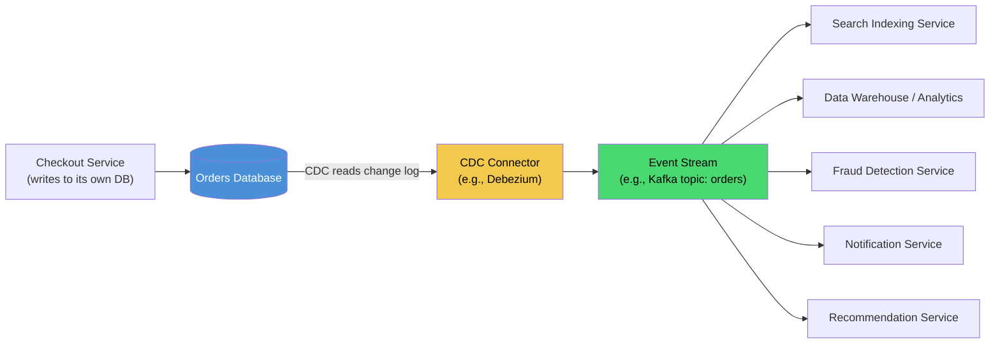
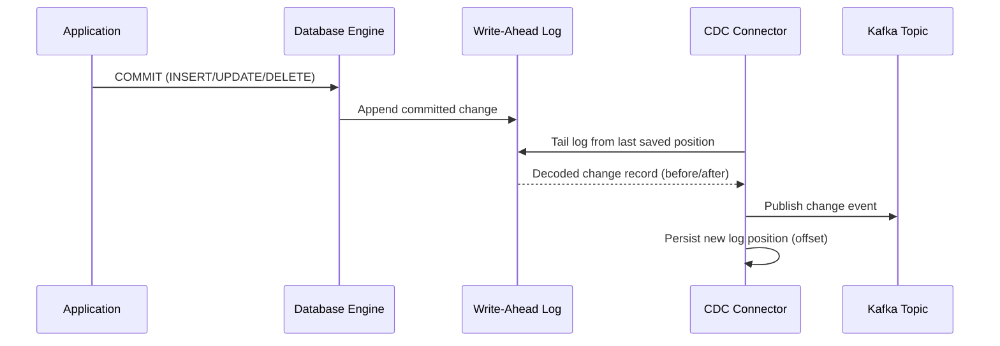
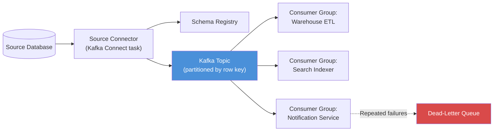
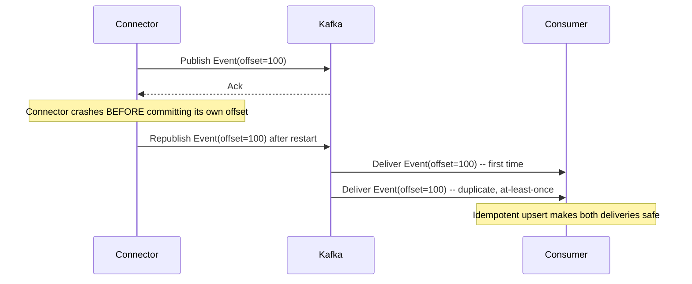
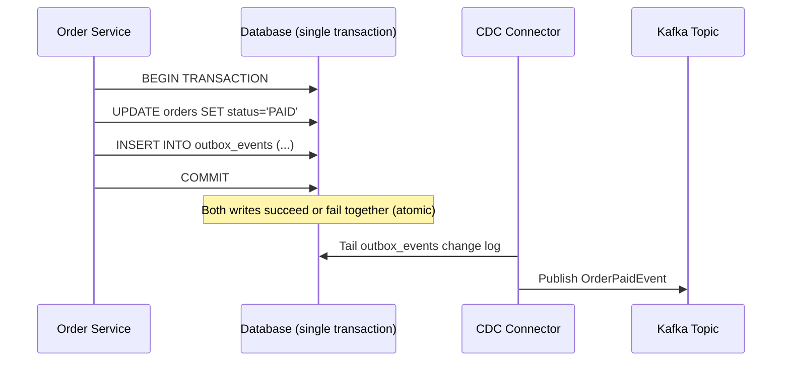
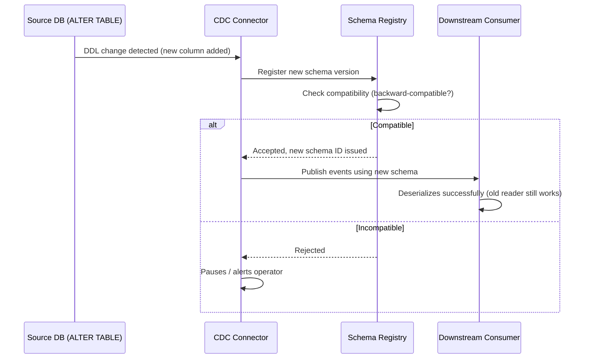
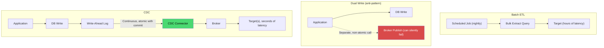
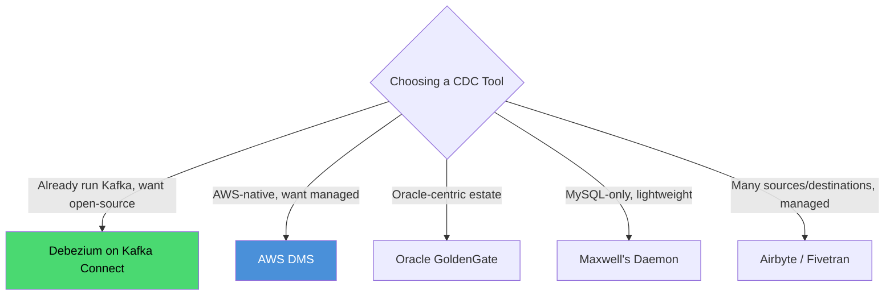
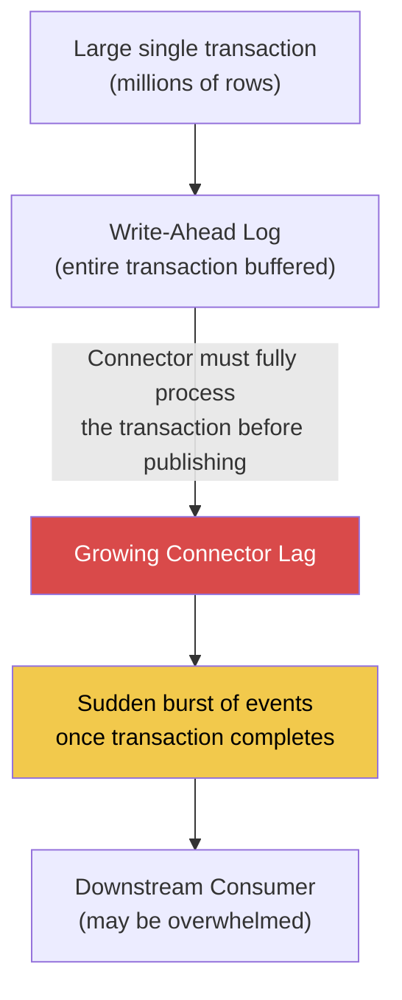

# Change Data Capture

## Blogs and websites


## Medium

- [Building a Real-Time CDC Data Application Using Debezium, SQL Server, Docker, Consumer App, and AWS Athena -Part 1](https://medium.com/@kiddojazz/building-a-real-time-cdc-data-application-using-debezium-sql-server-docker-consumer-app-and-aws-363bf1cf006f)
- [Building a Scalable Real-Time ETL Pipeline with Kafka, Debezium, Flink, Airflow, MinIO, and ClickHouse](https://towardsdev.com/building-a-scalable-real-time-etl-pipeline-with-kafka-debezium-flink-airflow-minio-and-b5a85ae28a02)
- [Real-Time Data Streaming: Monitoring Database Changes with Postgres, Debezium, and Kafka](https://medium.com/@jushijun/real-time-data-streaming-monitoring-database-changes-with-postgres-debezium-and-kafka-f37c85cc9975)


- [Kafka, Debezium CDC, Kafka Connect: 12-Day Guide](https://codefarm0.medium.com/list/learning-kafka-with-building-real-production-ready-systems-5b63508a7096)

- [Enterprise CDC Architecture: Oracle to Kafka with GoldenGate](https://medium.com/@vamcrulz09/enterprise-cdc-architecture-oracle-to-kafka-with-goldengate-0d02d1d21d56)
  - [Part 1: Preparing Oracle for GoldenGate-based Streaming](https://medium.com/@vamcrulz09/part-1-preparing-oracle-for-goldengate-based-streaming-08c6aae4754e)
  - [Part 2: GoldenGate Extract — Capturing Oracle Transactions Efficiently](https://medium.com/@vamcrulz09/part-2-goldengate-extract-capturing-oracle-transactions-efficiently-cb913b887aea)
  - [Part 3: Streaming Oracle Changes to Kafka with Replicat](https://medium.com/@vamcrulz09/part-3-streaming-oracle-changes-to-kafka-with-replicat-d16fbf5cc623)
  - [Part 4: Customizing Kafka Payloads and Message Keys](https://medium.com/@vamcrulz09/part-4-customizing-kafka-payloads-and-message-keys-8b04fa70cbc8)
  - [Part 5: Tuning & Hardening Your CDC Pipeline](https://medium.com/@vamcrulz09/part5-tuning-7e07f2d7017a)

- [Kafka + Debezium CDC vs. Cron ETL (Trade-offs, Cost, and When to Choose Which)](https://medium.com/@balaji.rajan.ts/kafka-debezium-cdc-vs-cron-etl-trade-offs-cost-and-when-to-choose-which-c53ae8d18c4f)

## Youtube

- [What is CDC in System Design?](https://www.youtube.com/watch?v=Ut0i-SSEXY4)
- [What Is Change Data Capture - Understanding Data Engineering 101](https://www.youtube.com/watch?v=hNJCxF3IWC4)
- [Change Data Capture (CDC) | Why & How | Use case | System Design](https://www.youtube.com/watch?v=dN_11nBcv_A)

- [Change Data Capture (CDC) Explained (with examples)](https://www.youtube.com/watch?v=5KN_feUhtTM)
- [Stream your PostgreSQL changes into Kafka with Debezium](https://www.youtube.com/watch?v=YZRHqRznO-o)
  - [irtiza07/postgres_debezium_cdc](https://github.com/irtiza07/postgres_debezium_cdc)
- [Set up Debezium, Apache Kafka and Postgres for real time Data Streaming | Real Time ETL | ETL](https://www.youtube.com/watch?v=9yP_75OBWis)
  - [hnawaz007/pythondataanalysis/tree/main/kafka](https://github.com/hnawaz007/pythondataanalysis/tree/main/kafka)
- [How to Stream Data from PostgreSQL to Kafka](https://www.youtube.com/watch?v=Uoas9E8Luo8)


- [Why use Change Data Capture | Batch Data vs Streaming Data](https://www.youtube.com/watch?v=ppB_GLbfFHo)
- [Debezium - Change Data Capture Made Easy | Distributed Systems Deep Dives With Ex-Google SWE](https://www.youtube.com/watch?v=6VbRlQ0rL3I)


## Theory

### Topics Covered

This page is organized into the following topics. Each topic includes a detailed explanation, its characteristics, components, patterns, pros/benefits, cons/challenges, best practices, when to use it, a real-life use case, a diagram, a Java code example, and interview questions with answers.

1. [Introduction: What Is Change Data Capture](#introduction-what-is-change-data-capture)
2. [CDC Capture Techniques: Query-Based, Trigger-Based, and Log-Based](#cdc-capture-techniques-query-based-trigger-based-and-log-based)
3. [Log-Based CDC: The Production-Grade Approach](#log-based-cdc-the-production-grade-approach)
4. [CDC Architecture and Components](#cdc-architecture-and-components)
5. [Delivery Guarantees and Ordering in CDC](#delivery-guarantees-and-ordering-in-cdc)
6. [The Outbox Pattern: Solving the Dual-Write Problem](#the-outbox-pattern-solving-the-dual-write-problem)
7. [Schema Evolution and the Schema Registry](#schema-evolution-and-the-schema-registry)
8. [CDC vs Batch ETL vs Dual Writes](#cdc-vs-batch-etl-vs-dual-writes)
9. [Popular CDC Tools and Platforms](#popular-cdc-tools-and-platforms)
10. [Challenges and Failure Modes in CDC](#challenges-and-failure-modes-in-cdc)
11. [CDC: Characteristics, Pros, Cons, Use Cases, Components, Patterns, Benefits, Challenges, Best Practices and When to Use](#cdc-characteristics-pros-cons-use-cases-components-patterns-benefits-challenges-best-practices-and-when-to-use)

### Introduction: What Is Change Data Capture

Change Data Capture (CDC) is a set of software design patterns used to detect and capture changes (inserts, updates, deletes) made to data in a source system, and then deliver those changes, in order, to one or more downstream consumers, typically as a stream of events.

Instead of periodically querying an entire table to see "what changed since last time" (a slow, load-heavy, and often incomplete process), CDC treats every row-level change as a discrete event the moment it happens, so downstream systems can react in near real time rather than waiting for the next batch window.

**The Core Idea:**

```
Traditional Batch ETL:
   Source DB --(nightly query, full/partial scan)--> Warehouse
   Change visible: next day, load spikes the source DB

Change Data Capture:
   Source DB --(row-level change event, streamed continuously)--> Kafka/Consumers
   Change visible: milliseconds to seconds, minimal load on source DB
```

**Why It Matters:**

Modern architectures are built from many independently owned services and data stores: a relational database of record, a search index, a cache, a data warehouse, a fraud-detection pipeline, and an audit log might all need to know about the same "order created" event. CDC lets every one of those systems stay in sync with the source of truth without the source database needing to know who is listening, and without resorting to fragile, slow, full-table batch comparisons.

#### Introduction: Characteristics

- **Non-intrusive to the source system**: Well-implemented CDC (particularly log-based CDC) reads a database's existing internal change log rather than adding extra query load or requiring application code changes, so the source system's normal read/write performance is largely unaffected.
- **Row-level granularity**: CDC captures individual insert/update/delete operations on individual rows, not just "the table changed," giving downstream consumers the exact before/after values needed to replay or react to a change precisely.
- **Ordered, incremental stream**: Changes are captured and delivered in the order they were committed on the source, so consumers can reconstruct the sequence of state transitions rather than just a final snapshot.
- **Decouples producers from consumers**: The source database does not need to know which systems consume its changes; new consumers can be added later by simply subscribing to the change stream, without modifying the source application.
- **Near real-time propagation**: Changes typically reach downstream systems within milliseconds to a few seconds of being committed, in contrast to the hours of latency typical of nightly batch jobs.

#### Introduction: Real-Life Use Case

An e-commerce company's `orders` table lives in a PostgreSQL database owned by the checkout service. Five different teams need to know about every new or updated order: the search team needs to index it, the analytics team needs it in the data warehouse, the fraud team needs to score it in real time, the notifications team needs to email a receipt, and the recommendations team needs to update a user's purchase history. Without CDC, the checkout team would either have to call five different APIs synchronously on every checkout (coupling their availability to five other teams) or have five teams polling the orders table directly (overloading the database). With CDC, the checkout team writes to its own database as normal, and a single CDC pipeline turns every row change into an event that all five downstream teams can independently subscribe to.

#### Introduction: Diagram



#### Introduction: Java Code Example

The snippet below is a simplified illustration of what a CDC connector conceptually does: it reads a stream of committed change records (as Debezium would emit from a database's transaction/write-ahead log) and republishes each one as a structured event.

```java
import java.time.Instant;

public class ChangeDataCaptureDemo {

    // Represents a single row-level change captured from a source database's change log.
    record ChangeEvent(String table, String operation, String rowId,
                        String beforeJson, String afterJson, Instant capturedAt) {
    }

    interface ChangeEventPublisher {
        void publish(ChangeEvent event);
    }

    // A minimal simulation of a log-based CDC connector reacting to committed changes.
    static class SimpleCdcConnector {
        private final ChangeEventPublisher publisher;

        SimpleCdcConnector(ChangeEventPublisher publisher) {
            this.publisher = publisher;
        }

        // In a real connector, this would be invoked by tailing the DB's WAL/binlog,
        // not called directly; here we simulate one row being inserted then updated.
        void onCommittedChange(String table, String operation, String rowId,
                                String beforeJson, String afterJson) {
            ChangeEvent event = new ChangeEvent(table, operation, rowId, beforeJson, afterJson, Instant.now());
            publisher.publish(event);
        }
    }

    public static void main(String[] args) {
        ChangeEventPublisher kafkaLikePublisher = event ->
                System.out.printf("Publishing to topic 'orders': %s%n", event);

        SimpleCdcConnector connector = new SimpleCdcConnector(kafkaLikePublisher);

        // Simulate an INSERT followed by an UPDATE, as read from the source DB's change log.
        connector.onCommittedChange("orders", "INSERT", "order-123",
                null, "{\"status\":\"CREATED\",\"total\":49.99}");
        connector.onCommittedChange("orders", "UPDATE", "order-123",
                "{\"status\":\"CREATED\",\"total\":49.99}", "{\"status\":\"PAID\",\"total\":49.99}");
    }
}
```

#### Introduction: Interview Questions and Answers

**Q1. What problem does Change Data Capture solve that periodic polling does not?**
A: Polling requires repeatedly scanning a table (or a "last modified" column) to detect changes, which adds continuous load to the source database, misses intermediate states between polls (e.g., a row updated twice between polls only shows the final state), and cannot reliably detect deletes without extra bookkeeping. CDC instead captures every committed change as a discrete, ordered event exactly once, with minimal load on the source, in near real time.

**Q2. Is CDC only useful for feeding data warehouses?**
A: No. While data warehouse replication is a very common use case, CDC is equally used for cache invalidation, search index updates, triggering microservice workflows, maintaining materialized views, audit logging, and replicating data between microservices without direct service-to-service calls.

**Q3. Does CDC replace the need for an application to publish its own domain events?**
A: Not always, it depends on the use case. CDC captures the low-level row change (a database fact), while an application-published domain event usually captures a business-level fact (e.g., "OrderShipped") with richer context. Many teams use CDC specifically to reliably publish domain events by writing them to an outbox table (see the Outbox Pattern topic below) rather than hand-rolling an event bus.

**Q4. What is the main risk of building a system that has multiple consumers polling the same source table directly instead of using CDC?**
A: Each additional poller adds repeated query load to the source database, and as more consumers are added, that load scales linearly (or worse) with the number of consumers, eventually degrading the performance of the primary application relying on that same database. CDC decouples this by capturing changes once and letting any number of consumers subscribe to the resulting stream.

### CDC Capture Techniques: Query-Based, Trigger-Based, and Log-Based

There are three broad techniques for actually capturing changes from a source system. They differ in how they detect a change happened, how much load they add to the source, how completely they capture history, and how hard they are to operate.

**1. Query-Based (Polling) CDC**

```
Every N seconds:
    SELECT * FROM orders WHERE updated_at > :last_poll_time
```
The consumer repeatedly queries the table using a "last modified" timestamp or an auto-incrementing ID/version column, then processes any rows newer than the last checkpoint.

**2. Trigger-Based CDC**

```sql
CREATE TRIGGER orders_audit
AFTER INSERT OR UPDATE OR DELETE ON orders
FOR EACH ROW EXECUTE FUNCTION log_change_to_shadow_table();
```
A database trigger fires on every row-level change and writes a corresponding record into a separate "shadow" or "audit" table, which a downstream process then reads and clears.

**3. Log-Based CDC**

```
Source DB's internal transaction log (WAL / binlog / redo log)
   --(read continuously, no impact on live tables)-->
   CDC connector decodes committed changes --> event stream
```
The CDC connector directly tails the database engine's own internal write-ahead log (e.g., PostgreSQL's WAL, MySQL's binlog, Oracle's redo log), which the database already writes for its own crash-recovery and replication purposes, and decodes it into structured change events.

#### CDC Capture Techniques: Characteristics

- **Query-based is the simplest but least complete**: It only requires a `SELECT` with a filter and no special database privileges, but it cannot detect deletes without additional soft-delete flags, and it can miss rapid intermediate updates that happen between two poll cycles.
- **Trigger-based is synchronous with the write path**: The trigger executes as part of the same transaction as the original write, guaranteeing the audit/shadow record is captured atomically with the change, but this also means the trigger's overhead is paid on every single write to the table.
- **Log-based is asynchronous and near-zero overhead on the source**: Because it reads a log the database is already producing for its own purposes, it adds negligible extra load to the live table's read/write path, and it naturally captures every operation, including deletes, in the exact commit order.
- **Completeness differs sharply**: Query-based CDC only ever reconstructs "current state as of poll time"; trigger-based and log-based CDC both capture every discrete state transition, including ones that are overwritten moments later.

#### CDC Capture Techniques: Components

- **Checkpoint/offset store**: Tracks the last successfully processed position (a timestamp for polling, a log sequence number for log-based CDC) so the connector can resume exactly where it left off after a restart.
- **Shadow/audit table (trigger-based only)**: A dedicated table that accumulates change records written by triggers, which must itself be periodically cleaned up once records are consumed.
- **Log reader/parser (log-based only)**: A component that understands the source database's specific binary log format (e.g., PostgreSQL logical decoding, MySQL binlog row format) and turns raw log entries into structured change events.
- **Polling scheduler (query-based only)**: A timer or cron-like mechanism that triggers the next `SELECT` at a fixed interval.

#### CDC Capture Techniques: Patterns

- **Timestamp/version-column polling**: Add an `updated_at` or monotonically increasing `version` column and query rows greater than the last seen value; simple to implement but requires disciplined application code to always update that column.
- **Trigger-to-outbox pattern**: Instead of a generic audit table, triggers (or application code in the same transaction) write directly to a dedicated outbox table structured specifically for downstream event consumption (see the Outbox Pattern topic below).
- **Log-based tailing with a replication slot**: The connector registers as a logical replica of the database (e.g., a PostgreSQL replication slot) so the database engine itself guarantees the log entries the connector needs are retained until they are consumed.

#### CDC Capture Techniques: Pros / Benefits

- **Query-based**: Requires no special database configuration or elevated privileges, easy to prototype quickly, and works against virtually any database or even a read replica.
- **Trigger-based**: Captures every operation (including deletes) with guaranteed atomicity relative to the original write, and works on databases that do not expose a usable change log.
- **Log-based**: Minimal performance impact on the source, captures the complete and precisely ordered history of every operation, and does not require any changes to application code or schema.

#### CDC Capture Techniques: Cons / Challenges

- **Query-based**: Misses deletes (unless soft-deleted), can miss intermediate changes between polls, and polling frequency is a direct trade-off between staleness and load on the source database.
- **Trigger-based**: Adds latency and lock contention to every write on the table, increases schema complexity and maintenance burden (triggers, shadow tables), and can be a source of subtle bugs if triggers are not kept in sync with schema changes.
- **Log-based**: Requires deeper database-specific expertise and configuration (enabling logical replication, granting replication privileges), can be harder to set up initially, and log retention/disk usage must be managed carefully if the connector falls behind or disconnects.

#### CDC Capture Techniques: Best Practices

- Default to log-based CDC for any production system where write-path latency and completeness matter; reserve trigger-based CDC for databases that do not support logical/binary log decoding.
- If query-based polling must be used, always include a reliable `updated_at`/version column maintained by the database (e.g., via a trigger or default expression) rather than relying on application code to remember to set it.
- Monitor replication slot/log retention on log-based CDC closely; an unconsumed backlog can cause the source database to retain excessive log data and risk disk exhaustion.
- Avoid stacking multiple CDC techniques on the same table unless there is a clear reason; it multiplies operational complexity without a proportional benefit.

#### CDC Capture Techniques: When to Use

- **Query-based**: Low-change-rate tables, quick prototypes, or environments where you cannot get replication/logical-decoding privileges on the source database.
- **Trigger-based**: Databases without usable change-log access, or when you need atomic, same-transaction capture of a change alongside custom business logic (e.g., writing to an outbox table).
- **Log-based**: Any production system that needs low-latency, complete, ordered change capture with minimal impact on the source, which is the overwhelming majority of real-world CDC deployments today.

#### CDC Capture Techniques: Real-Life Use Case

A retailer initially built CDC by polling an `updated_at` column on their `inventory` table every 30 seconds to feed a caching layer. As the product catalog grew and multiple downstream teams began polling the same table, the added query load started showing up as measurable latency on the primary application's own inventory checks. The team migrated to Debezium reading MySQL's binlog directly; the added load on the primary disappeared (the binlog is written regardless of CDC), delete operations (previously invisible to the timestamp-based poll) became correctly captured, and latency for downstream cache invalidation dropped from ~30 seconds to under one second.

#### CDC Capture Techniques: Diagram

```mermaid
graph TD
    subgraph "Query-Based"
        Q1["Poller"] -->|"SELECT ... WHERE updated_at > last_poll"| QDB[(Source Table)]
    end
    subgraph "Trigger-Based"
        TDB[(Source Table)] -->|"AFTER INSERT/UPDATE/DELETE trigger"| Shadow[(Shadow/Audit Table)]
        Shadow --> TConsumer["Downstream Consumer"]
    end
    subgraph "Log-Based"
        LDB[(Source Table)] --> WAL["Write-Ahead Log / Binlog"]
        WAL -->|"Continuous tail, no table load"| Connector["CDC Connector (e.g., Debezium)"]
        Connector --> LConsumer["Event Stream"]
    end

    style WAL fill:#4a90d9,color:#fff
    style Connector fill:#4ad971,color:#000
```



#### CDC Capture Techniques: Java Code Example

```java
import java.time.Instant;
import java.util.ArrayList;
import java.util.List;

public class QueryBasedPollingDemo {

    record Row(String id, String status, Instant updatedAt) {
    }

    // Simulates a naive query-based CDC poller using an updated_at watermark.
    static class TimestampPoller {
        private Instant lastPollTime;

        TimestampPoller(Instant initialWatermark) {
            this.lastPollTime = initialWatermark;
        }

        // Simulates: SELECT * FROM orders WHERE updated_at > :lastPollTime
        List<Row> poll(List<Row> allRows) {
            List<Row> changed = new ArrayList<>();
            Instant maxSeen = lastPollTime;
            for (Row row : allRows) {
                if (row.updatedAt().isAfter(lastPollTime)) {
                    changed.add(row);
                    if (row.updatedAt().isAfter(maxSeen)) {
                        maxSeen = row.updatedAt();
                    }
                }
            }
            lastPollTime = maxSeen; // advance the watermark for the next poll
            return changed;
        }
    }

    public static void main(String[] args) {
        Instant t0 = Instant.parse("2026-01-01T00:00:00Z");
        TimestampPoller poller = new TimestampPoller(t0);

        List<Row> allRows = List.of(
                new Row("order-1", "CREATED", t0.plusSeconds(10)),
                new Row("order-2", "CREATED", t0.plusSeconds(20)),
                new Row("order-1", "PAID", t0.plusSeconds(30)) // note: this is a NEW row object simulating an update
        );

        List<Row> changed = poller.poll(allRows);
        System.out.println("Detected changes: " + changed);
        // Limitation visible here: a real deletion of "order-2" between polls would not
        // appear at all, since it is simply absent from the next SELECT result set.
    }
}
```

#### CDC Capture Techniques: Interview Questions and Answers

**Q1. Why can't timestamp-based polling reliably detect deleted rows?**
A: A `SELECT ... WHERE updated_at > :lastPollTime` query can only return rows that still exist in the table. When a row is deleted, it simply disappears from the result set with no trace, so the poller has no way to know a deletion happened unless the application uses soft deletes (a `deleted_at` or `is_deleted` flag) instead of hard deletes.

**Q2. Why do triggers add latency to the write path, and is that always a problem?**
A: A trigger runs synchronously as part of the same transaction as the original write, so any work it does (writing to a shadow table, running additional logic) adds directly to the write's commit latency. This is not always a problem for low-throughput tables, but on high-write-volume tables it can become a meaningful bottleneck and a new source of lock contention.

**Q3. Why is log-based CDC considered "non-intrusive" even though it reads the database's internal log?**
A: The write-ahead log or binlog is data the database engine already generates and writes for its own crash-recovery and native replication features, regardless of whether CDC is reading it. A log-based connector just attaches as an additional reader (often via a replication slot or binlog subscription) to that existing stream, so it does not add extra work to the transaction commit path itself.

**Q4. What operational risk is unique to log-based CDC that the other two techniques don't have?**
A: If the CDC connector falls behind or disconnects for an extended period, the source database may need to retain log segments (or hold open a replication slot) far longer than usual so the connector can eventually catch up, which can consume significant disk space and, in the worst case, exhaust storage on the primary database if left unmonitored.

### Log-Based CDC: The Production-Grade Approach

Log-based CDC is the technique used by nearly all serious production CDC deployments (Debezium, AWS DMS, GoldenGate, Maxwell) because it uniquely combines completeness, ordering guarantees, and near-zero source overhead. This section goes deeper into how it actually works.

**How It Works, Step by Step:**

```
1. Application commits a transaction (INSERT/UPDATE/DELETE)
2. Database engine writes the change to its internal log
   (PostgreSQL: WAL: MySQL: binlog: Oracle: redo log)
3. CDC connector registers as a "replica" of that log
   (PostgreSQL: logical replication slot: MySQL: binlog client)
4. Connector reads new log entries as they are written
5. Connector decodes the log's binary/proprietary format into
   structured before/after row images
6. Connector publishes each decoded change as an event
   (typically to Kafka, one topic per source table)
7. Connector periodically records its position (LSN/binlog offset)
   so it can resume exactly where it left off after a restart
```

**Initial Snapshot + Streaming:**

A newly started log-based connector faces a bootstrap problem: the log only contains changes going forward, not the table's current full state. Production CDC tools solve this with a two-phase process:

```
Phase 1 (Snapshot): Take a consistent full-table read of existing rows,
                     emitting each as a synthetic "insert" event.
Phase 2 (Streaming): Switch to tailing the log from the exact position
                     captured at the start of the snapshot, so no
                     changes made during the snapshot are lost or duplicated.
```

#### Log-Based CDC: Characteristics

- **Reads a physical or logical replication stream**: The connector behaves like just another database replica from the engine's point of view, benefiting from the same durability and ordering guarantees native replication relies on.
- **Captures before and after row images**: Most log-based connectors expose both the previous and new value of a changed row, which is essential for consumers that need to compute deltas or detect which specific columns changed.
- **Exactly-once position tracking, at-least-once delivery**: The connector's own read position in the log is precisely trackable (a specific log sequence number or offset), but end-to-end delivery to consumers is typically at-least-once unless additional deduplication is applied downstream.
- **Requires a consistent snapshot + streaming handoff**: Because the log alone cannot describe the table's state at connector start time, correct log-based CDC always begins with a snapshot phase before or alongside streaming.

#### Log-Based CDC: Components

- **Replication slot / binlog client registration**: The mechanism by which the source database agrees to retain and stream log entries specifically for this connector, preventing the entries from being purged before they're read.
- **Log decoder**: Database-engine-specific logic that parses the raw log format into structured change records (e.g., PostgreSQL's `pgoutput` or `wal2json` logical decoding plugins, MySQL's binlog row-based format parser).
- **Snapshot reader**: A component that performs the initial full-table read, typically using a consistent transaction isolation level so the snapshot and the log's starting position agree exactly.
- **Offset/position store**: Durable storage (often itself a Kafka topic, in Debezium's case) recording the last successfully processed log position, used to resume after a connector restart without data loss or duplication.

#### Log-Based CDC: Patterns

- **One Kafka topic per source table**: Each table's changes are published to their own topic, keyed by primary key, so consumers can subscribe only to the tables they care about and Kafka can maintain per-key ordering.
- **Single Message Transforms (SMTs)**: Lightweight, per-message transformations (e.g., flattening the before/after envelope, extracting just the new-value fields) applied as messages pass through the connector pipeline, avoiding the need for a separate stream-processing job for simple reshaping.
- **Heartbeat events**: The connector periodically emits a synthetic heartbeat change event even on tables with no real activity, so consumers and monitoring can distinguish "no changes happened" from "the connector has silently stopped."

#### Log-Based CDC: Pros / Benefits

- **Minimal source impact**: Because it reads a log the database already writes, log-based CDC adds negligible CPU/IO overhead to the primary application's read/write path, unlike trigger-based or aggressive polling approaches.
- **Complete and ordered history**: Every insert, update, and delete is captured in the exact order it was committed, with no missed intermediate states, which polling fundamentally cannot guarantee.
- **No application or schema changes required**: Unlike the outbox pattern or trigger-based CDC, log-based CDC does not require the application team to add any new tables, columns, or code paths.

#### Log-Based CDC: Cons / Challenges

- **Database-specific implementation complexity**: Each database engine's log format is different and often requires enabling specific configuration (e.g., PostgreSQL's `wal_level = logical`, MySQL's binlog row format), which not every managed database offering permits.
- **Schema change handling is tricky**: A `ALTER TABLE` on the source can change the shape of subsequent log entries mid-stream, and the connector must correctly detect and adapt to this without corrupting or misinterpreting later records.
- **Snapshot phase can be heavy for very large tables**: The initial full-table snapshot for a multi-terabyte table can take hours and add meaningful read load during that window, requiring careful scheduling and, sometimes, incremental/parallel snapshotting features.

#### Log-Based CDC: Best Practices

- Size replication slot/log retention alarms conservatively, and page on-call staff well before disk usage from retained log segments becomes critical.
- Use incremental or parallelized snapshotting features (available in tools like Debezium) for very large initial tables instead of a single long-running full scan.
- Pin connector and database versions together and test schema migrations against a staging CDC pipeline before applying them in production, since some DDL changes can break log decoding.
- Always run the connector against a dedicated low-privilege replication user, not the application's primary database credentials.

#### Log-Based CDC: When to Use

- Any production system where source database performance, complete change history, and low end-to-end latency all matter, which describes the majority of real-time data-integration and event-driven-architecture use cases.
- Systems that need to migrate or replicate data continuously between heterogeneous databases (e.g., Oracle to Kafka to Elasticsearch) without adding load to the source.
- Environments building an event-driven architecture where the database is the natural source of truth and downstream services should react to changes as they occur.

#### Log-Based CDC: Real-Life Use Case

A financial services company replicates every row change from its core Oracle ledger database to a Kafka-backed audit and fraud-detection pipeline using Oracle GoldenGate reading the redo log. Because GoldenGate reads the redo log the database already produces for crash recovery, the ledger's transactional throughput is unaffected, while the fraud team receives every debit/credit event within seconds, in the exact order it was committed, letting them flag suspicious patterns (e.g., rapid repeated withdrawals) almost immediately rather than in the next day's batch report.

#### Log-Based CDC: Diagram



#### Log-Based CDC: Java Code Example

```java
import java.util.ArrayDeque;
import java.util.Deque;

public class LogBasedCdcSimulation {

    record LogEntry(long position, String table, String operation, String before, String after) {
    }

    // Simulates a database's write-ahead log as an append-only sequence of committed changes.
    static class WriteAheadLog {
        private final Deque<LogEntry> entries = new ArrayDeque<>();
        private long nextPosition = 1;

        void append(String table, String operation, String before, String after) {
            entries.addLast(new LogEntry(nextPosition++, table, operation, before, after));
        }

        // Returns entries strictly after the given position, simulating tailing from an offset.
        Deque<LogEntry> readFrom(long position) {
            Deque<LogEntry> result = new ArrayDeque<>();
            for (LogEntry e : entries) {
                if (e.position() > position) {
                    result.addLast(e);
                }
            }
            return result;
        }
    }

    // Simulates a connector that resumes reading exactly where it left off.
    static class CdcConnector {
        private long lastProcessedPosition;

        CdcConnector(long startingPosition) {
            this.lastProcessedPosition = startingPosition;
        }

        void processNewEntries(WriteAheadLog wal) {
            for (LogEntry entry : wal.readFrom(lastProcessedPosition)) {
                System.out.printf("Publishing change: table=%s op=%s before=%s after=%s (pos=%d)%n",
                        entry.table(), entry.operation(), entry.before(), entry.after(), entry.position());
                lastProcessedPosition = entry.position(); // advance offset only after successful publish
            }
        }
    }

    public static void main(String[] args) {
        WriteAheadLog wal = new WriteAheadLog();
        wal.append("orders", "INSERT", null, "{status:CREATED}");
        wal.append("orders", "UPDATE", "{status:CREATED}", "{status:PAID}");

        CdcConnector connector = new CdcConnector(0);
        connector.processNewEntries(wal); // processes both entries, then remembers position 2

        wal.append("orders", "DELETE", "{status:PAID}", null);
        connector.processNewEntries(wal); // resumes from position 2, only processes the new delete
    }
}
```

#### Log-Based CDC: Interview Questions and Answers

**Q1. Why does log-based CDC need both a snapshot phase and a streaming phase?**
A: The database's write-ahead log or binlog only contains changes made after the connector started reading it; it says nothing about rows that already existed beforehand. The snapshot phase captures the table's existing state as a consistent baseline, and the connector then switches to streaming from the exact log position that was current at snapshot time, ensuring no gap and no duplication between the two phases.

**Q2. What happens if a schema change (e.g., adding a column) occurs while log-based CDC is running?**
A: The connector must detect the DDL change (often by also monitoring schema-change events in the log or a separate schema history topic) and adjust how it decodes subsequent log entries to match the new row shape; if this is not handled properly, later change events can be misinterpreted or fail to decode.

**Q3. Why is a replication slot (PostgreSQL) or binlog retention (MySQL) important to monitor?**
A: The database retains log segments for as long as a registered connector has not yet consumed them, so that the connector can eventually catch up after a disconnect. If the connector is down for an extended period or falls far behind, retained log segments can grow unbounded and eventually fill the disk, potentially impacting the primary database's availability.

**Q4. Why do log-based CDC events typically include both a "before" and "after" image of a row?**
A: Consumers often need more than just the new value, they may need to know exactly which fields changed (by diffing before/after), or need the previous value to correctly update a downstream materialized view or cache (e.g., decrementing an old category's count and incrementing a new one when a product's category changes).

### CDC Architecture and Components

A production CDC pipeline is made up of several distinct pieces working together, from the source database all the way to the final consumer. Understanding each piece clarifies where failures can occur and what each layer is responsible for.

**The End-to-End Pipeline:**

```
Source DB --> CDC Connector --> Message Broker --> Sink Connector / Consumer --> Target System
  (WAL)      (Debezium, DMS)    (Kafka, Kinesis)   (JDBC sink, custom app)      (Warehouse, Search, Cache)
```

Each arrow in this chain is a place where messages can be delayed, lost, duplicated, or reordered if not designed carefully, which is why production CDC systems put explicit guarantees and monitoring at every hop.

#### CDC Architecture: Characteristics

- **Multi-hop pipeline, not a single component**: A real CDC deployment spans at least four distinct systems (source DB, connector runtime, message broker, sink/consumer), each independently deployable, scalable, and monitorable.
- **Connector runtime is typically distributed**: Frameworks like Kafka Connect run connectors as tasks distributed across a cluster of worker nodes, providing fault tolerance if a single worker fails.
- **Broker acts as a durable buffer**: The message broker (commonly Kafka) decouples the pace of the source database from the pace of downstream consumers, so a slow consumer does not block or backpressure the CDC connector directly.
- **Schema propagation runs alongside data**: Most production setups also propagate the source table's schema (often via a schema registry) so that consumers can safely deserialize messages and detect incompatible changes.

#### CDC Architecture: Components

- **Source connector**: Reads the change log (or polls/uses triggers) and converts raw changes into structured events; this is the piece discussed in depth in the CDC Capture Techniques and Log-Based CDC topics above.
- **Connect framework/runtime**: A distributed platform (e.g., Kafka Connect) that manages connector lifecycle, task distribution across workers, automatic restarts, and offset/position storage.
- **Message broker**: A durable, ordered, partitioned log (e.g., Apache Kafka) that stores change events for some retention window, allowing multiple independent consumers to read at their own pace and replay history if needed.
- **Schema registry**: A separate service that stores and versions the structure of each event type, letting producers and consumers agree on a compatible message format and detect breaking schema changes before they cause consumer failures.
- **Sink connector / consumer application**: Reads events from the broker and applies them to a target system, whether that's a JDBC sink writing to another relational database, a client library, indexing into a search engine, or invalidating a cache entry.
- **Dead-letter queue (DLQ)**: A separate topic or store where events that repeatedly fail to process are routed, so a single malformed or unexpected event does not block the entire stream indefinitely.

#### CDC Architecture: Patterns

- **One topic per table, keyed by primary key**: Preserves per-row ordering (Kafka guarantees order only within a partition, and keying by primary key ensures all changes to the same row land in the same partition).
- **Connector cluster with automatic task rebalancing**: Running Kafka Connect in distributed mode across multiple worker nodes so a worker failure automatically reassigns its connector tasks to healthy workers without manual intervention.
- **Fan-out via multiple independent consumer groups**: Each downstream system (search, warehouse, cache) runs its own consumer group against the same topics, so one slow or failing consumer never blocks another.
- **Dead-letter queue with alerting**: Route poison-pill messages to a DLQ and alert on-call staff, rather than letting a single bad message stall the whole pipeline or silently drop data.

#### CDC Architecture: Pros / Benefits

- **Each layer scales and fails independently**: A spike in downstream consumer load does not back up into the source connector or the source database, because the broker absorbs the difference in pace.
- **Multiple consumers reuse the same captured stream**: Once a change is captured and published, any number of downstream systems can consume it independently without adding any additional load on the source database.
- **Replayability**: Because the broker retains events for a configurable window, a new consumer (or one recovering from a bug) can often re-read recent history rather than needing a fresh full snapshot.

#### CDC Architecture: Cons / Challenges

- **More moving parts to operate**: A full pipeline includes the connector runtime, the broker cluster, schema registry, and sink connectors, each requiring its own monitoring, scaling, and on-call ownership.
- **End-to-end latency accumulates across hops**: While each individual hop is fast, the total latency from "row committed" to "consumer applies change" is the sum of connector capture latency, broker publish/replication latency, and consumer processing latency.
- **Coordinating schema changes across the whole pipeline is hard**: A source schema change must propagate correctly through the connector, the schema registry, and every downstream consumer without breaking any of them.

#### CDC Architecture: Best Practices

- Give every hop of the pipeline its own monitoring and alerting (connector lag, broker partition health, consumer group lag) rather than only monitoring the source database or only the final target.
- Use a schema registry with compatibility checking (e.g., backward-compatible schema evolution) enforced automatically, rather than relying on manual coordination between producer and consumer teams.
- Set a dead-letter queue and alerting for every sink/consumer so a single malformed event cannot silently stall or crash the whole downstream pipeline.
- Size broker topic retention based on the worst realistic downstream outage duration, so a consumer that is down for maintenance can catch up by replaying rather than requiring a fresh snapshot.

#### CDC Architecture: When to Use

- Any environment with more than one downstream consumer of the same source changes, since the fan-out and decoupling benefits of a broker-centered architecture grow directly with the number of consumers.
- Systems that require replay/reprocessing capability (e.g., rebuilding a search index after a mapping change) without re-querying or re-snapshotting the source database.
- Organizations already operating a message broker (Kafka, Kinesis, Pulsar) for other purposes, since CDC pipelines integrate naturally into that existing infrastructure.

#### CDC Architecture: Real-Life Use Case

A logistics company built its CDC pipeline as: PostgreSQL (shipments table) to Debezium running on Kafka Connect to a Kafka topic to three independent consumer groups (a warehouse ETL job, a real-time tracking dashboard, and a customer notification service). When the notification service had an incident and was down for two hours, the Kafka topic's retention window (set to 24 hours) meant it simply resumed consuming from where it left off once restored, with zero data loss and no need to re-snapshot the source table, while the other two consumers were entirely unaffected by the outage.

#### CDC Architecture: Diagram



#### CDC Architecture: Java Code Example

```java
import java.util.List;
import java.util.ArrayList;
import java.util.function.Consumer;

public class CdcPipelineSimulation {

    record ChangeEvent(String key, String table, String payload) {
    }

    // Simulates a durable, partitioned broker topic that multiple independent
    // consumer groups can read from at their own pace.
    static class BrokerTopic {
        private final List<ChangeEvent> events = new ArrayList<>();

        void publish(ChangeEvent event) {
            events.add(event);
        }

        List<ChangeEvent> readFrom(int offset) {
            return events.subList(Math.min(offset, events.size()), events.size());
        }

        int size() {
            return events.size();
        }
    }

    // Simulates an independent consumer group with its own offset and a DLQ for poison pills.
    static class ConsumerGroup {
        private final String name;
        private int offset = 0;
        private final Consumer<ChangeEvent> handler;
        private final List<ChangeEvent> deadLetterQueue = new ArrayList<>();

        ConsumerGroup(String name, Consumer<ChangeEvent> handler) {
            this.name = name;
            this.handler = handler;
        }

        void poll(BrokerTopic topic) {
            for (ChangeEvent event : topic.readFrom(offset)) {
                try {
                    handler.accept(event);
                } catch (RuntimeException e) {
                    deadLetterQueue.add(event); // route poison-pill messages instead of blocking
                }
                offset++;
            }
        }
    }

    public static void main(String[] args) {
        BrokerTopic topic = new BrokerTopic();
        topic.publish(new ChangeEvent("shipment-1", "shipments", "{status:PICKED_UP}"));
        topic.publish(new ChangeEvent("shipment-2", "shipments", "{status:INVALID_PAYLOAD}"));

        ConsumerGroup warehouseEtl = new ConsumerGroup("warehouse-etl",
                e -> System.out.println("[warehouse-etl] applied " + e));

        ConsumerGroup notifications = new ConsumerGroup("notifications", e -> {
            if (e.payload().contains("INVALID")) {
                throw new IllegalStateException("cannot parse payload");
            }
            System.out.println("[notifications] sent alert for " + e);
        });

        warehouseEtl.poll(topic); // unaffected by the other consumer's failures
        notifications.poll(topic); // second event routed to its own DLQ, first event still processed
    }
}
```

#### CDC Architecture: Interview Questions and Answers

**Q1. Why is a message broker like Kafka typically placed between the CDC connector and downstream consumers, rather than having the connector call consumers directly?**
A: A broker decouples the source's change rate from each consumer's processing rate, buffers events durably so slow or temporarily down consumers do not cause data loss or backpressure onto the source connector, and allows any number of independent consumers to read the same stream at their own pace without the connector needing to know who they are.

**Q2. What is the purpose of a schema registry in a CDC pipeline?**
A: It stores and versions the structure of each event type, lets producers and consumers agree on compatibility rules (e.g., backward-compatible only), and allows a schema change on the source to be validated and safely propagated to all consumers, catching a breaking change before it causes a consumer to fail deserializing new messages.

**Q3. Why should each downstream consumer of a CDC stream use its own consumer group?**
A: Kafka consumer groups track read offsets independently per group, so giving each downstream system its own group means a slow, failing, or restarted consumer never affects the read progress or availability of any other consumer reading the same topic.

**Q4. What is a dead-letter queue and why is it important in a CDC pipeline?**
A: It is a separate topic or store where events that repeatedly fail to be processed are routed instead of blocking the main processing loop. Without a DLQ, a single malformed or unexpected event can stall an entire consumer indefinitely (since it keeps retrying the same failing event), silently halting all subsequent processing for that consumer.

### Delivery Guarantees and Ordering in CDC

CDC pipelines must be explicit about two related but distinct promises: how many times will a consumer see the same event (delivery semantics), and in what order will events for a given row arrive (ordering guarantees). Getting these wrong leads to duplicated side effects, lost updates, or out-of-order state.

**The Three Delivery Semantics:**

```
At-most-once:  Event is sent 0 or 1 times. Risk: silent data loss on failure.
At-least-once: Event is sent 1 or more times. Risk: duplicate processing.
Exactly-once:  Event is applied exactly 1 time, end to end. Hardest to achieve.
```

Most production CDC systems (Debezium, Kafka Connect) provide **at-least-once** delivery by default: if a connector crashes after publishing an event but before committing its offset, it will republish that event again after restart. This means consumers must be designed to handle duplicates safely.

#### Delivery Guarantees: Characteristics

- **At-least-once is the practical default**: The overwhelming majority of production CDC pipelines guarantee at-least-once delivery, because achieving true exactly-once semantics end to end requires coordinated transactional writes across the broker and every consumer, which most systems do not implement everywhere.
- **Per-key ordering, not global ordering**: Kafka (and similar brokers) guarantee message order only within a single partition; CDC pipelines achieve per-row ordering by keying messages on the row's primary key so all changes to that row land in the same partition.
- **Idempotency is the standard mitigation for duplicates**: Because duplicates are expected under at-least-once delivery, consumers are designed so that applying the same event twice has the same effect as applying it once.
- **Ordering can still break across related rows/tables**: Even with correct per-row ordering, two related rows in different tables (e.g., an order and its order-line items) may be processed by different partitions/consumers at different times, so consumers needing cross-table consistency must handle that explicitly.

#### Delivery Guarantees: Components

- **Idempotent consumer logic**: Typically implemented by using the primary key plus a monotonically increasing source offset/LSN as an upsert key, so replaying the same event again simply overwrites with the same value rather than double-applying an increment or side effect.
- **Partition key strategy**: The choice of what field to key messages on (usually the source row's primary key) that determines which events are guaranteed to be ordered relative to each other.
- **Offset/commit tracking**: The mechanism (consumer offsets in Kafka, or an application-level checkpoint table) that records what has been successfully processed, used to resume correctly after a restart.
- **Deduplication window/store**: An optional cache or table of recently processed event IDs used to explicitly detect and skip exact duplicates, for consumers whose operations are not naturally idempotent.

#### Delivery Guarantees: Patterns

- **Upsert-based consumers**: Instead of blindly applying an "increment" or "append" operation, consumers perform an upsert keyed by primary key plus source offset, so reprocessing the same event is naturally a no-op.
- **Idempotency keys for side effects**: For non-database side effects (e.g., sending an email), the consumer stores a record of "already sent for event X" so a duplicate delivery of the same CDC event does not trigger a duplicate email.
- **Per-key partitioning for ordering**: Explicitly setting the Kafka message key to the source table's primary key guarantees that consumer processing of any single row's history stays in commit order, even though different rows may be processed out of order relative to each other.

#### Delivery Guarantees: Pros / Benefits

- **At-least-once with idempotent consumers gives practical exactly-once behavior**: This combination is far simpler to build and operate than true distributed exactly-once semantics, while still avoiding the double-counting or duplicate-side-effect bugs that a naive at-least-once consumer would suffer from.
- **Per-key ordering is sufficient for the vast majority of use cases**: Most downstream consumers only need to see a given row's changes in the correct order relative to each other, not a total global order across every row in the database.

#### Delivery Guarantees: Cons / Challenges

- **Non-idempotent consumers are a common source of production bugs**: A consumer that blindly increments a counter or appends to a list on every event will double-count whenever the at-least-once guarantee causes a redelivery.
- **Cross-table ordering is not free**: Two related CDC streams (e.g., orders and order_items) can be consumed at different rates by different consumers, so any downstream logic that depends on strict cross-table ordering needs additional coordination (e.g., buffering, watermarking).
- **True exactly-once end to end is operationally expensive**: It typically requires transactional producers, transactional consumers, and careful coordination with the sink system, which not every technology stack supports.

#### Delivery Guarantees: Best Practices

- Design every CDC consumer to be idempotent by default (upsert by primary key plus offset/version) rather than assuming delivery will always be exactly-once.
- Explicitly key CDC messages by the source row's primary key to guarantee per-row ordering through the broker's partitioning.
- For workflows that span multiple related tables, add an explicit reconciliation or buffering step rather than assuming cross-table event arrival order will always match commit order.
- Track and alert on consumer lag (how far behind the latest published offset a consumer is), since a growing lag is often the first sign of a downstream performance or correctness issue.

#### Delivery Guarantees: When to Use

- Design for at-least-once plus idempotency in essentially all CDC consumers, since it is the delivery model provided by nearly every popular CDC and streaming platform.
- Invest in true exactly-once tooling (transactional Kafka producers/consumers) only for the specific, narrow set of use cases where even a single duplicate side effect (e.g., double-charging a customer) is unacceptable and cannot be made idempotent another way.

#### Delivery Guarantees: Real-Life Use Case

A payments company's CDC consumer originally incremented a running "total revenue today" counter every time it received a payment-completed event. After a connector restart caused a handful of events to be redelivered (expected at-least-once behavior), the revenue counter was inflated by the duplicated events' value, causing an incorrect finance report. The fix was to make the consumer idempotent: instead of incrementing a counter, it now upserts each payment's contribution keyed by payment ID, so reprocessing the same event overwrites the same value rather than adding to it again, making the daily total correct regardless of how many times any individual event is redelivered.

#### Delivery Guarantees: Diagram



#### Delivery Guarantees: Java Code Example

```java
import java.util.HashMap;
import java.util.Map;

public class IdempotentConsumerDemo {

    record PaymentEvent(String paymentId, long offset, double amount) {
    }

    // A naive, non-idempotent consumer: vulnerable to double-counting on redelivery.
    static class NaiveRevenueCounter {
        private double total = 0;

        void apply(PaymentEvent event) {
            total += event.amount(); // BUG: applying the same event twice double-counts it
        }

        double total() {
            return total;
        }
    }

    // An idempotent consumer: safe even if the same event is delivered multiple times.
    static class IdempotentRevenueCounter {
        private final Map<String, Double> contributionsByPaymentId = new HashMap<>();

        void apply(PaymentEvent event) {
            // Upsert by paymentId: reprocessing the same event overwrites with the same value.
            contributionsByPaymentId.put(event.paymentId(), event.amount());
        }

        double total() {
            return contributionsByPaymentId.values().stream().mapToDouble(Double::doubleValue).sum();
        }
    }

    public static void main(String[] args) {
        PaymentEvent event = new PaymentEvent("pay-1", 100, 49.99);

        NaiveRevenueCounter naive = new NaiveRevenueCounter();
        naive.apply(event);
        naive.apply(event); // simulates an at-least-once redelivery
        System.out.println("Naive total (WRONG, double-counted): " + naive.total());

        IdempotentRevenueCounter safe = new IdempotentRevenueCounter();
        safe.apply(event);
        safe.apply(event); // same redelivery, but harmless
        System.out.println("Idempotent total (CORRECT): " + safe.total());
    }
}
```

#### Delivery Guarantees: Interview Questions and Answers

**Q1. Why do most CDC systems default to at-least-once delivery instead of exactly-once?**
A: Guaranteeing true exactly-once delivery end to end requires coordinated, transactional behavior across the connector, the broker, and every downstream consumer/sink, which adds significant complexity and is not supported uniformly across all technologies. At-least-once combined with idempotent consumers achieves the same practical outcome (no duplicate effect) with far less operational complexity.

**Q2. How does keying Kafka messages by primary key help with ordering?**
A: Kafka guarantees message order only within a single partition, and messages with the same key are always routed to the same partition. By keying CDC messages on the source row's primary key, every change to a given row is guaranteed to be processed in commit order relative to other changes to that same row.

**Q3. What makes a consumer "idempotent," and why does it matter for CDC?**
A: An idempotent consumer produces the same end result no matter how many times the same event is applied, typically by upserting state keyed by a unique identifier rather than incrementing or appending. Because CDC delivery is usually at-least-once, consumers will occasionally see the same event more than once, and only idempotent consumers handle that correctly without side effects like double-counting.

**Q4. If two related tables (e.g., orders and order_items) are each streamed to a different Kafka topic, is it guaranteed that a consumer sees the order before its order_items?**
A: No. Ordering guarantees only apply within a single partition/topic keyed by row; there is no built-in guarantee about the relative arrival order of events across two different topics or tables. A consumer that needs strict cross-table ordering must add explicit coordination, such as buffering child events until the parent event has been seen, or using a watermarking/reconciliation step.

### The Outbox Pattern: Solving the Dual-Write Problem

A very common mistake in event-driven architectures is the "dual write": an application updates its own database and separately publishes a message to a broker, as two independent operations.

```
BEGIN TRANSACTION
    UPDATE orders SET status = 'PAID' WHERE id = 'order-123'
COMMIT

// Separately, outside the database transaction:
kafkaProducer.send("orders-topic", orderPaidEvent)
```

**The Problem:**

These two operations are not atomic. If the process crashes after the database commit but before the Kafka send succeeds, the database says the order is paid but no event was ever published, so every downstream consumer (search, notifications, fraud) never finds out. If the Kafka send happens but the database transaction later rolls back, the reverse problem occurs: an event was published for a state change that never actually happened.

**The Outbox Pattern Solution:**

```
BEGIN TRANSACTION
    UPDATE orders SET status = 'PAID' WHERE id = 'order-123'
    INSERT INTO outbox_events (id, aggregate_id, type, payload) VALUES (...)
COMMIT

-- Separately, a CDC connector tails the outbox_events table's change log
-- and publishes each row as an event, then the row can be cleaned up.
```

Instead of writing to the database and the broker as two separate operations, the application writes the business change and an outbox record describing the event to publish, in the very same local database transaction. A CDC connector then reads the outbox table's change log (using log-based CDC) and reliably publishes each new outbox row as an event. Because both writes are part of one atomic transaction, there is no window where one succeeds and the other fails.

#### Outbox Pattern: Characteristics

- **Turns a distributed dual-write into a single local transaction**: The core insight is that a single database transaction is atomic, so writing "the business change" and "the event to publish" as two rows in the same transaction eliminates the atomicity gap entirely.
- **Relies on CDC, rather than application code, to publish events**: The application's job stops at writing to the outbox table; a CDC connector (typically log-based) takes over the responsibility of reliably getting that row published to the broker.
- **At-least-once delivery, same as underlying CDC**: The outbox pattern does not create a new delivery guarantee, it inherits whatever delivery semantics the CDC layer publishing the outbox table provides (usually at-least-once).
- **Requires eventual cleanup of published rows**: Outbox rows accumulate over time and need a periodic cleanup process (or a change to soft-delete/mark-as-published) so the table does not grow unbounded.

#### Outbox Pattern: Components

- **Outbox table**: A dedicated table (commonly with columns like `id`, `aggregate_type`, `aggregate_id`, `event_type`, `payload`, `created_at`) written to as part of the same transaction as the business data change.
- **CDC connector on the outbox table**: A log-based CDC connector configured specifically to tail the outbox table and publish each new row as a message, often using an "outbox event router" transform to reshape the row into the final event format.
- **Cleanup/archival job**: A scheduled process (or a CDC-driven mechanism) that removes or archives outbox rows once they have been successfully published, to keep the table small and fast to scan/index.
- **Event router transform**: A message-reshaping step (e.g., Debezium's outbox event router SMT) that extracts the actual event payload and routes it to the correct destination topic based on the outbox row's metadata.

#### Outbox Pattern: Patterns

- **Single shared outbox table per service**: All aggregates within one microservice write to one outbox table, keeping the CDC configuration simple (one connector, one table) regardless of how many different event types the service produces.
- **Outbox event router with per-aggregate-type topics**: A single outbox table's rows are routed to different Kafka topics based on an `aggregate_type` column, so consumers can still subscribe to just the event types they care about.
- **Transactional outbox plus idempotent consumer**: Combining the outbox pattern (guaranteeing the event is eventually published if the transaction commits) with idempotent downstream consumers (handling the at-least-once redelivery that CDC provides) gives a complete, reliable, end-to-end pipeline.

#### Outbox Pattern: Pros / Benefits

- **Eliminates the dual-write problem entirely**: Because the business change and the event-to-publish are committed atomically in one transaction, there is no scenario where the database is updated but the event is lost, or vice versa.
- **No distributed transaction coordinator needed**: Unlike a two-phase commit across the database and the broker, the outbox pattern only requires a single local ACID transaction, which every relational database already supports natively.
- **Naturally reuses log-based CDC's reliability**: The same durability and completeness guarantees that make log-based CDC reliable for regular tables apply directly to the outbox table with no extra work.

#### Outbox Pattern: Cons / Challenges

- **Adds an extra table and cleanup process**: Every service adopting the pattern needs to create, maintain, and periodically clean up its outbox table, which is additional schema and operational surface area.
- **Couples event publishing to CDC infrastructure**: Teams must already have (or be willing to set up) log-based CDC tooling, which is more infrastructure than simply calling a message broker's client library directly.
- **Event payload shape is now part of the schema contract**: Because the outbox row's payload becomes the published event, changes to that payload's structure need the same schema-evolution discipline as any other public API.

#### Outbox Pattern: Best Practices

- Keep the outbox table narrow and write-optimized (an append-only table with a small number of columns) so writes to it add negligible overhead to the surrounding business transaction.
- Use a dedicated CDC connector and event router transform (rather than hand-rolled polling of the outbox table) to get log-based CDC's reliability and ordering guarantees for free.
- Clean up published outbox rows on a schedule (or use a capped/partitioned table strategy) so the table does not grow unbounded and slow down writes over time.
- Treat the outbox event payload as a versioned, backward-compatible schema from day one, since downstream consumers will depend on its shape just like any other integration contract.

#### Outbox Pattern: When to Use

- Any service that needs to reliably publish an event as a direct consequence of a database write, especially in a microservices architecture where other services depend on being notified of that change.
- Situations where a naive dual write (separate database commit and broker publish) has already caused, or could plausibly cause, missed or phantom events.
- Teams that already operate log-based CDC infrastructure and want a standard, low-risk way to extend it to reliable domain-event publishing.

#### Outbox Pattern: Real-Life Use Case

An online marketplace's order service used to update the orders table and then call `kafkaProducer.send()` directly in application code immediately afterward. During a deployment, a brief network blip caused several Kafka sends to fail silently after their corresponding database commits had already succeeded, resulting in orders that were marked "paid" in the database but never triggered a fulfillment event, silently stalling those orders' shipments for hours until manually discovered. The team adopted the outbox pattern: the order service now writes an `outbox_events` row in the same transaction as the order update, and a Debezium connector with an outbox event router publishes every row reliably. The class of "missed event" bugs was eliminated entirely, because publishing failure became impossible to decouple from the business transaction succeeding.

#### Outbox Pattern: Diagram



#### Outbox Pattern: Java Code Example

```java
import java.sql.Connection;
import java.sql.PreparedStatement;
import java.sql.SQLException;
import java.time.Instant;
import java.util.UUID;

public class OutboxPatternDemo {

    // Demonstrates writing the business change and the outbox event in one atomic transaction.
    static void markOrderAsPaid(Connection connection, String orderId, String payloadJson) throws SQLException {
        boolean originalAutoCommit = connection.getAutoCommit();
        connection.setAutoCommit(false);
        try {
            try (PreparedStatement updateOrder = connection.prepareStatement(
                    "UPDATE orders SET status = 'PAID' WHERE id = ?")) {
                updateOrder.setString(1, orderId);
                updateOrder.executeUpdate();
            }

            try (PreparedStatement insertOutbox = connection.prepareStatement(
                    "INSERT INTO outbox_events (id, aggregate_type, aggregate_id, event_type, payload, created_at) " +
                            "VALUES (?, ?, ?, ?, ?, ?)")) {
                insertOutbox.setString(1, UUID.randomUUID().toString());
                insertOutbox.setString(2, "Order");
                insertOutbox.setString(3, orderId);
                insertOutbox.setString(4, "OrderPaidEvent");
                insertOutbox.setString(5, payloadJson);
                insertOutbox.setTimestamp(6, java.sql.Timestamp.from(Instant.now()));
                insertOutbox.executeUpdate();
            }

            connection.commit(); // both the order update and the outbox insert commit atomically
        } catch (SQLException e) {
            connection.rollback(); // both changes roll back together; no dual-write gap is possible
            throw e;
        } finally {
            connection.setAutoCommit(originalAutoCommit);
        }
    }
}
```

#### Outbox Pattern: Interview Questions and Answers

**Q1. What is the "dual-write problem" and why is it dangerous?**
A: It occurs when an application performs two logically related writes, typically a database update and a message broker publish, as two separate, non-atomic operations. If the process crashes or fails between the two operations, the system can end up with the database updated but no event published (or an event published for a change that never actually committed), leading to silently inconsistent state between the source of truth and downstream consumers.

**Q2. How does the outbox pattern avoid needing a distributed transaction across the database and the message broker?**
A: It avoids the broker entirely at write time. The application only writes to its own database, business table and outbox table together, in a single local ACID transaction. A separate CDC connector, working asynchronously, is responsible for turning outbox rows into published events, so the application code never needs a cross-system transaction at all.

**Q3. Why is log-based CDC specifically well-suited to reading the outbox table, as opposed to polling it?**
A: Log-based CDC captures every insert to the outbox table with minimal overhead and in strict commit order, with no risk of missing a row between polls; polling the outbox table would reintroduce the same staleness and missed-row risks that make polling unsuitable for CDC in general.

**Q4. Does the outbox pattern guarantee exactly-once event delivery to consumers?**
A: No. It guarantees that an event will eventually be published if (and only if) the originating transaction commits, but the actual delivery to consumers still follows the underlying CDC pipeline's at-least-once semantics. Consumers of outbox-published events still need to be idempotent, exactly as with any other CDC-sourced event stream.

### Schema Evolution and the Schema Registry

Source database schemas change over time: columns are added, renamed, removed, or have their type changed. A CDC pipeline must handle these changes without breaking every downstream consumer that depends on the event structure staying stable.

**The Compatibility Problem:**

```
Producer schema v1: { orderId, status, total }
Producer schema v2: { orderId, status, total, currency }  <- new field added

Consumer written against v1 schema...
   Does it break when it receives a v2 message? Depends on the compatibility rule.
```

A schema registry enforces a compatibility rule (backward, forward, or full) whenever a producer tries to register a new schema version, rejecting changes that would break existing or future consumers according to that rule.

**Compatibility Types:**

```
Backward compatible: New schema can be read using the OLD schema's reader.
                      (Safe to upgrade consumers before producers.)
Forward compatible:  Old schema can be read using the NEW schema's reader.
                      (Safe to upgrade producers before consumers.)
Full compatible:     Both backward and forward compatible.
```

#### Schema Evolution: Characteristics

- **Schema changes are inevitable, not exceptional**: Any CDC pipeline that runs for more than a short time will eventually encounter an `ALTER TABLE` on the source, so handling schema evolution gracefully is a core requirement, not an edge case.
- **Compatibility is checked at registration time**: A schema registry validates a new schema against the configured compatibility rule before allowing it to be registered, catching breaking changes at the moment they are introduced rather than when a consumer crashes in production.
- **Additive, optional changes are the safest evolution path**: Adding a new optional field (with a default value) is backward compatible in virtually every serialization format (Avro, Protobuf, JSON Schema), while removing or renaming a field, or changing its type, is much more likely to break existing consumers.
- **Different serialization formats have different evolution rules**: Avro's schema evolution rules (based on default values and field ordering) differ from Protobuf's (based on field numbers) and from JSON Schema's, so the specific rules that apply depend on which format the pipeline uses.

#### Schema Evolution: Components

- **Schema registry service**: A centralized store (e.g., Confluent Schema Registry, AWS Glue Schema Registry) that holds every registered schema version for each topic and enforces the configured compatibility mode.
- **Serializer/deserializer (SerDe) libraries**: Client-side libraries that look up the correct schema version from the registry when producing or consuming a message, embedding a schema ID in each message rather than the full schema itself.
- **Compatibility checker**: Registry-side logic that compares a newly submitted schema against previous version(s) and accepts or rejects it based on the compatibility mode set for that subject/topic.
- **Schema history topic (CDC-specific)**: Some CDC connectors (e.g., Debezium) maintain a dedicated internal topic recording every DDL statement observed on the source, used to correctly interpret change events captured before and after a schema change.

#### Schema Evolution: Patterns

- **Backward-compatible-only enforcement**: Configuring the registry to only allow backward-compatible changes is the most common production setting, since it allows consumers to be upgraded independently and later than producers without breaking.
- **Additive-only schema changes**: A team convention of only ever adding new optional fields (never removing or renaming existing ones) sidesteps most compatibility problems entirely, at the cost of schemas slowly accumulating unused fields over time.
- **Versioned topics for breaking changes**: When a genuinely breaking change is unavoidable (e.g., a fundamental restructuring), publishing to a new topic version (e.g., `orders-v2`) rather than mutating the existing schema lets old and new consumers coexist during a migration window.

#### Schema Evolution: Pros / Benefits

- **Prevents a schema change from silently breaking consumers**: By validating compatibility at registration time, a producer cannot accidentally publish a schema that existing deployed consumers cannot deserialize.
- **Decouples producer and consumer deployment schedules**: With backward compatibility enforced, consumers do not need to be redeployed in lockstep with every producer schema change.
- **Reduces message size**: Since messages carry a schema ID rather than an embedded full schema, using a registry with a binary format like Avro keeps individual messages small, which matters at high CDC throughput.

#### Schema Evolution: Cons / Challenges

- **Adds an additional piece of infrastructure to operate**: The schema registry itself becomes a critical-path dependency, if it is unavailable, producers and consumers may be unable to serialize or deserialize messages at all.
- **Compatibility rules can be misunderstood**: Teams sometimes assume "backward compatible" also protects producers being upgraded before consumers, when that specific direction actually requires forward compatibility, leading to unexpected breakage.
- **Some source schema changes have no clean compatible mapping**: Renaming or changing the type of an existing column on the source database does not map cleanly to any compatible schema evolution rule, and typically requires a coordinated, versioned migration rather than an automatic one.

#### Schema Evolution: Best Practices

- Default new topics to backward-compatible-only enforcement in the schema registry, and treat any registry rejection as a signal to redesign the change (e.g., add a new field instead of renaming) rather than bypassing the check.
- Always give new fields a sensible default value so that old consumers that do not yet know about the field can still deserialize new messages.
- Track and alert on the CDC connector's schema-history state so operators are notified immediately when a source `ALTER TABLE` is detected, rather than discovering it later through consumer failures.
- Version topics explicitly (e.g., `orders-v2`) for changes that cannot be made compatible, and run both versions in parallel during a planned consumer migration window.

#### Schema Evolution: When to Use

- Any CDC pipeline with more than one independently deployed consumer, since that is exactly the scenario where uncoordinated schema changes cause the most damage.
- Systems where producer and consumer teams are organizationally separate and cannot always coordinate deployments tightly, making automatic compatibility enforcement especially valuable.
- Any long-lived pipeline expected to survive multiple source schema migrations over its lifetime.

#### Schema Evolution: Real-Life Use Case

A subscription company's billing team added a new required `taxRegion` column to their `invoices` table and expected the CDC pipeline to just pick it up. Because the schema registry was configured for backward compatibility and the new field had no default value, the registry rejected the new schema version outright, and the connector paused rather than publishing a wave of messages that existing downstream consumers (accounting, analytics) could not deserialize. The billing team reworked the migration to add the column with a default value of `"UNKNOWN"` instead, the schema registry accepted the backward-compatible version, and all existing consumers kept working without any code changes while a follow-up backfill job populated the correct tax region for historical invoices.

#### Schema Evolution: Diagram



#### Schema Evolution: Java Code Example

```java
import java.util.HashSet;
import java.util.Set;

public class SchemaCompatibilityDemo {

    record FieldDef(String name, String type, boolean hasDefault) {
    }

    record SchemaVersion(String name, Set<FieldDef> fields) {
    }

    // A simplified backward-compatibility check: every field required by the OLD reader
    // must still be present (or have a default) in the NEW schema.
    static boolean isBackwardCompatible(SchemaVersion oldSchema, SchemaVersion newSchema) {
        for (FieldDef oldField : oldSchema.fields()) {
            boolean stillPresent = newSchema.fields().stream()
                    .anyMatch(f -> f.name().equals(oldField.name()) && f.type().equals(oldField.type()));
            if (!stillPresent) {
                return false; // an old-reader-required field disappeared or changed type
            }
        }
        return true;
    }

    public static void main(String[] args) {
        SchemaVersion v1 = new SchemaVersion("Order", Set.of(
                new FieldDef("orderId", "string", false),
                new FieldDef("status", "string", false),
                new FieldDef("total", "double", false)
        ));

        // Compatible change: adding a new optional field with a default.
        Set<FieldDef> v2Fields = new HashSet<>(v1.fields());
        v2Fields.add(new FieldDef("currency", "string", true));
        SchemaVersion v2 = new SchemaVersion("Order", v2Fields);

        System.out.println("v1 -> v2 backward compatible? " + isBackwardCompatible(v1, v2)); // true

        // Incompatible change: renaming "total" to "totalAmount".
        Set<FieldDef> v3Fields = new HashSet<>();
        v3Fields.add(new FieldDef("orderId", "string", false));
        v3Fields.add(new FieldDef("status", "string", false));
        v3Fields.add(new FieldDef("totalAmount", "double", false));
        SchemaVersion v3 = new SchemaVersion("Order", v3Fields);

        System.out.println("v1 -> v3 backward compatible? " + isBackwardCompatible(v1, v3)); // false
    }
}
```

#### Schema Evolution: Interview Questions and Answers

**Q1. What does "backward compatible" mean in the context of a schema registry, and who does it protect?**
A: It means a message written with the new schema can still be correctly read by a consumer using the old schema/reader. It protects consumers, they can be left un-upgraded (or upgraded later) after a producer starts emitting the new schema, without breaking.

**Q2. Why is adding a new field with a default value usually safe, while renaming a field usually is not?**
A: An old reader simply ignores fields it does not know about and uses defaults for fields it expects but does not find, so adding a new optional field with a default breaks neither an old reader (new field) nor a new reader (default supplied). Renaming a field looks, from the old reader's perspective, like the original field vanished, since the reader does not know to look under the new name, so it is a breaking change unless handled with an explicit aliasing mechanism.

**Q3. What happens to a CDC pipeline if the source database's schema changes but the connector cannot detect or correctly interpret the change?**
A: The connector may misinterpret subsequent log entries against the wrong (stale) schema, potentially corrupting field values, misaligning columns, or crashing outright. This is why production log-based CDC connectors maintain an internal schema history and explicitly watch for DDL statements in the log rather than assuming the schema is static.

**Q4. Why might a team choose to publish a genuinely breaking change to a brand-new topic (e.g., `orders-v2`) instead of trying to force it through the schema registry?**
A: Some changes (removing a required field, changing a field's type incompatibly, restructuring the whole message) have no compatible mapping under any standard compatibility rule. Publishing to a new topic lets old consumers keep reading the old topic unaffected while new consumers migrate to the new topic on their own schedule, avoiding a hard, coordinated cutover.

### CDC vs Batch ETL vs Dual Writes

CDC is one of three broad strategies for getting data (or notifications of changes) from a source system to other systems. Comparing them directly clarifies when CDC is the right tool and when it is not.

```
Batch ETL:    Source DB --(scheduled bulk extract, e.g. nightly)--> Target
Dual Write:   Application --(writes to DB AND publishes event, separately)--> DB + Broker
CDC:          Source DB --(continuous log tailing)--> Broker --> Target(s)
```

#### CDC vs Batch ETL vs Dual Writes: Characteristics

- **Batch ETL is scheduled and bulk-oriented**: It runs on a fixed interval (hourly, nightly) and typically extracts either the whole dataset or a large delta, trading immediacy for simplicity and lower operational overhead.
- **Dual writes are synchronous and application-driven**: The application itself is responsible for both writing to its database and notifying other systems, in real time, but as two separate, non-atomic operations (see the Outbox Pattern topic for why this is risky).
- **CDC is continuous and infrastructure-driven**: Changes are captured automatically as they are committed, without the application needing to remember to publish anything, and delivered continuously rather than on a fixed schedule.
- **Latency, completeness, and coupling differ sharply across the three**: Batch ETL has the highest latency but the least ongoing infrastructure; dual writes have the lowest latency but the highest risk of inconsistency; CDC offers low latency and completeness without coupling the application to knowing who consumes its data.

#### CDC vs Batch ETL vs Dual Writes: Pros / Benefits

- **Batch ETL**: Simple to reason about and implement (a scheduled job and a bulk query), works well for large analytical loads where near-real-time freshness is not required, and needs no ongoing streaming infrastructure.
- **Dual writes**: Conceptually the most direct way to notify another system "right now," requiring no additional infrastructure beyond the application and the broker's client library.
- **CDC**: Combines low latency with completeness and reliability, decouples the source application entirely from knowing about downstream consumers, and captures every change (including deletes) without extra application code.

#### CDC vs Batch ETL vs Dual Writes: Cons / Challenges

- **Batch ETL**: High latency (changes are invisible downstream until the next scheduled run), and each run typically re-scans large amounts of data, creating periodic load spikes on the source.
- **Dual writes**: Not atomic, a crash between the two writes can silently lose an event or publish one for a change that never committed; this is widely considered an anti-pattern for exactly this reason.
- **CDC**: Requires dedicated infrastructure (connectors, a broker, often a schema registry) and specific database configuration/privileges, representing a higher upfront operational investment than either alternative.

#### CDC vs Batch ETL vs Dual Writes: Best Practices

- Use batch ETL for large, non-time-sensitive analytical workloads (e.g., a monthly financial reconciliation report) where the operational simplicity of a scheduled job outweighs the cost of staleness.
- Avoid dual writes for anything where a missed or phantom event has real business consequences; replace them with the outbox pattern plus CDC instead.
- Adopt CDC as the default choice whenever multiple systems need low-latency, complete, ordered visibility into a source database's changes, especially in event-driven microservice architectures.
- Do not assume CDC is strictly "better" in every situation, weigh its operational cost against the actual latency and completeness requirements of the use case before adopting it.

#### CDC vs Batch ETL vs Dual Writes: When to Use

- **Batch ETL**: Nightly data warehouse loads, large historical backfills, or any workload where a scheduled job with hours of latency is genuinely acceptable.
- **Dual writes**: Rarely recommended on its own; acceptable only for extremely low-stakes, best-effort notifications where an occasional missed message truly does not matter.
- **CDC**: Real-time analytics, cache invalidation, search indexing, cross-service data synchronization, audit logging, and any event-driven architecture that needs a reliable, ordered, low-latency stream of source changes.

#### CDC vs Batch ETL vs Dual Writes: Real-Life Use Case

A media company originally ran a nightly batch job to sync its content-metadata database into the search index used by its website. Editors complained that a published article was not searchable for up to 12 hours after publishing. The team first tried adding a dual write (index the article directly in application code right after saving it), but a search-cluster hiccup during a traffic spike caused a batch of writes to silently fail to index, with no record that they had ever tried, leaving several published articles permanently missing from search until someone happened to notice weeks later. Migrating to log-based CDC (Debezium reading the content database's binlog, streaming to Kafka, consumed by a dedicated search-indexing service) brought search visibility down to a few seconds, while a Kafka consumer group with retry and dead-letter handling meant a temporary search-cluster outage no longer caused silent, undetected data loss.

#### CDC vs Batch ETL vs Dual Writes: Diagram



#### CDC vs Batch ETL vs Dual Writes: Java Code Example

```java
public class DualWriteVsCdcDemo {

    interface SearchIndexClient {
        void index(String documentId, String payload);
    }

    // Anti-pattern: dual write. If indexClient.index() throws or times out AFTER the DB
    // commit already succeeded, the article is permanently missing from search with no trace.
    static void publishArticle_DualWriteAntiPattern(String articleId, String payload,
                                                     SearchIndexClient indexClient) {
        saveArticleToDatabase(articleId, payload); // step 1: committed
        indexClient.index(articleId, payload);     // step 2: separate call, can silently fail
    }

    // Correct approach: only write to the database; a CDC connector (external process)
    // is responsible for reliably publishing the change for the search indexer to consume.
    static void publishArticle_CdcApproach(String articleId, String payload) {
        saveArticleToDatabase(articleId, payload);
        // No direct call to the search index here. A log-based CDC connector tailing this
        // table's change log will pick up the committed row and publish it reliably.
    }

    static void saveArticleToDatabase(String articleId, String payload) {
        System.out.println("Saved article " + articleId + " to database (committed)");
    }
}
```

#### CDC vs Batch ETL vs Dual Writes: Interview Questions and Answers

**Q1. Why is the "dual write" pattern considered an anti-pattern in distributed systems design?**
A: Because it performs two related operations (a database write and a message publish) as two independent, non-atomic steps. Any failure between the two (a crash, a network blip, a timeout) leaves the system in an inconsistent state, either the database changed with no corresponding event, or an event was published for a change that never actually committed, with no built-in way to detect or recover from either case.

**Q2. In what situation would batch ETL still be a reasonable choice over CDC in 2026?**
A: When the workload is large, primarily analytical, and does not require near-real-time freshness, for example a monthly financial reconciliation report or a one-time historical data migration, the operational simplicity of a scheduled bulk job can outweigh the benefit of continuous low-latency streaming.

**Q3. How does CDC avoid the atomicity problem that dual writes suffer from?**
A: CDC only requires the application to perform its normal, single-database write; the responsibility for capturing and publishing that change is moved entirely to the CDC connector, which reads the database's own transaction log after the fact. Since the application never has to perform a second, separate write to a different system, there is no window in which the two could get out of sync.

**Q4. If a team is already using dual writes and cannot migrate to full CDC immediately, what is a lower-risk intermediate step?**
A: Adopt the outbox pattern: instead of publishing directly to the broker, write an outbox row in the same local transaction as the business change, and add a lightweight log-based CDC connector just for that one outbox table. This gets the atomicity benefit of CDC without necessarily requiring the source's main business tables to be fully CDC-enabled yet.

### Popular CDC Tools and Platforms

Several mature tools implement log-based (and sometimes trigger/query-based) CDC. Choosing between them usually comes down to source database support, deployment model (self-managed vs fully managed), and existing infrastructure.

| Tool | Capture Technique | Deployment Model | Typical Target |
|---|---|---|---|
| Debezium | Log-based (WAL/binlog/redo log) | Self-managed, runs on Kafka Connect | Kafka topics |
| AWS Database Migration Service (DMS) | Log-based | Fully managed (AWS) | S3, Kinesis, Redshift, another RDS/Aurora DB |
| Oracle GoldenGate | Log-based (redo log) | Self-managed or Oracle Cloud managed | Kafka, another Oracle DB, other targets |
| Maxwell's Daemon | Log-based (MySQL binlog only) | Self-managed, lightweight | Kafka, Kinesis, RabbitMQ |
| Airbyte | Log-based and query-based connectors | Self-managed or managed cloud | Wide range of destinations (warehouses, lakes) |
| Fivetran / HVR | Log-based | Fully managed (SaaS) | Data warehouses primarily |

#### Popular CDC Tools: Characteristics

- **Debezium is the de facto open-source standard**: It runs as a set of Kafka Connect source connectors, supporting PostgreSQL, MySQL, MongoDB, SQL Server, Oracle, and others, with a large community and deep integration into the Kafka ecosystem (schema registry, outbox event router SMT).
- **Cloud-managed tools trade flexibility for operational simplicity**: AWS DMS, Fivetran, and similar SaaS tools handle connector infrastructure, scaling, and monitoring for you, at the cost of less fine-grained control and sometimes higher per-row or per-connector pricing.
- **Database-specific tools exist for deep integration**: Oracle GoldenGate is purpose-built for Oracle's redo log format and offers Oracle-specific features (conflict resolution, bidirectional replication) that general-purpose tools do not.
- **Lightweight single-purpose tools trade breadth for simplicity**: Maxwell's Daemon only supports MySQL but is simple to deploy and operate for teams that do not need Debezium's broader multi-database feature set.

#### Popular CDC Tools: Pros / Benefits

- **Mature open-source options (Debezium, Maxwell) avoid vendor lock-in** and can be run entirely within a team's existing Kafka infrastructure.
- **Fully managed options (AWS DMS, Fivetran) reduce operational burden significantly**, letting a small team run production CDC pipelines without deep in-house streaming expertise.
- **Broad ecosystem support (Airbyte) covers many source and destination combinations** with a single, consistent connector framework.

#### Popular CDC Tools: Cons / Challenges

- **Self-managed tools require operating the connector runtime yourself** (Kafka Connect workers, monitoring, upgrades), adding to the on-call and infrastructure burden.
- **Fully managed tools can be more expensive at scale** and may have less flexibility for custom transformations or unusual source/target combinations.
- **Not every tool supports every source database equally well**; feature parity (e.g., snapshot resumability, DDL handling) can differ significantly between connectors for different databases within the same tool.

#### Popular CDC Tools: Best Practices

- Choose a tool based primarily on your source database and existing streaming infrastructure, not on marketing claims; verify the specific connector's maturity and DDL-handling support for your exact database version.
- For teams already running Kafka, prefer Debezium on Kafka Connect for the tightest integration with schema registry and outbox event routing.
- For small teams without dedicated streaming infrastructure expertise, a fully managed option (AWS DMS, Fivetran) often has a lower total cost of ownership despite higher per-unit pricing.
- Pilot the chosen tool against a non-critical table first to validate snapshot behavior, schema-change handling, and failure recovery before rolling it out to critical tables.

#### Popular CDC Tools: When to Use

- **Debezium**: Teams already running Kafka who want open-source, community-supported connectors across many database engines with deep Kafka ecosystem integration.
- **AWS DMS**: Teams already on AWS who want a managed migration/replication service, especially for database-to-database or database-to-warehouse replication.
- **Oracle GoldenGate**: Organizations with an Oracle-centric estate needing advanced features like bidirectional replication and conflict resolution.
- **Maxwell's Daemon**: Small teams with a MySQL-only environment wanting a lightweight, low-overhead connector without adopting the broader Kafka Connect framework.
- **Airbyte / Fivetran**: Teams prioritizing broad source/destination coverage and managed operations over deep customization, especially for feeding data warehouses.

#### Popular CDC Tools: Real-Life Use Case

A mid-sized SaaS company running entirely on AWS with an Aurora PostgreSQL database chose AWS DMS to replicate CDC changes into Redshift for analytics, specifically because it integrated natively with their existing AWS IAM and networking setup and required no additional infrastructure to operate. A larger sister company within the same group, already running a self-managed Kafka cluster for several other services, instead chose Debezium on Kafka Connect for the same kind of PostgreSQL CDC use case, because it let them reuse their existing Kafka expertise, schema registry, and monitoring stack rather than adopting a second, separate managed service.

#### Popular CDC Tools: Diagram



#### Popular CDC Tools: Java Code Example

```java
import java.util.Properties;

public class DebeziumConnectorConfigExample {

    // Illustrates the shape of a typical Debezium PostgreSQL source connector configuration,
    // as would be submitted to a Kafka Connect REST API.
    static Properties buildDebeziumPostgresConfig() {
        Properties config = new Properties();
        config.setProperty("connector.class", "io.debezium.connector.postgresql.PostgresConnector");
        config.setProperty("database.hostname", "orders-db.internal");
        config.setProperty("database.port", "5432");
        config.setProperty("database.user", "cdc_replication_user"); // dedicated, low-privilege user
        config.setProperty("database.dbname", "orders");
        config.setProperty("plugin.name", "pgoutput"); // logical decoding plugin
        config.setProperty("slot.name", "orders_cdc_slot");
        config.setProperty("table.include.list", "public.orders,public.outbox_events");
        config.setProperty("topic.prefix", "orders-db");
        config.setProperty("snapshot.mode", "initial"); // full snapshot, then stream from the WAL
        return config;
    }

    public static void main(String[] args) {
        Properties config = buildDebeziumPostgresConfig();
        config.forEach((key, value) -> System.out.println(key + " = " + value));
    }
}
```

#### Popular CDC Tools: Interview Questions and Answers

**Q1. What is the main architectural difference between Debezium and AWS DMS?**
A: Debezium is a set of open-source Kafka Connect source connectors that you run yourself (typically alongside a self-managed or hosted Kafka cluster), giving fine-grained control and deep Kafka ecosystem integration. AWS DMS is a fully managed AWS service that handles the connector infrastructure, scaling, and monitoring for you, trading some flexibility and customization for lower operational overhead.

**Q2. Why might a team choose Maxwell's Daemon over Debezium for a MySQL-only use case?**
A: Maxwell's Daemon is purpose-built and lightweight for MySQL specifically, without requiring the broader Kafka Connect framework Debezium relies on. For a team that only needs MySQL CDC and does not want to operate a Kafka Connect cluster, Maxwell can be a simpler, lower-overhead choice.

**Q3. What should a team verify before committing to a specific CDC tool for a given source database?**
A: The maturity and feature completeness of that specific tool's connector for their exact database engine and version, particularly its handling of schema changes (DDL), snapshot resumability for large tables, and support for the specific data types used, since these vary significantly between connectors even within the same overall tool.

**Q4. Why do organizations sometimes use different CDC tools for different databases within the same company?**
A: Because the best tool choice depends on the specific source database, existing infrastructure, and team expertise; a company might use AWS DMS for an Aurora database in an AWS-native team while another team with existing Kafka expertise uses Debezium for a different, self-hosted PostgreSQL database, since each choice best fits that team's specific context rather than following a single company-wide mandate.

### Challenges and Failure Modes in CDC

Beyond the specific challenges already covered in earlier topics (delivery semantics, schema evolution), there are several broader operational challenges that come up repeatedly when running CDC in production at scale.

#### Challenges: Characteristics

- **Large transactions can stall the pipeline**: A single very large source transaction (e.g., a bulk update touching millions of rows) can appear as one enormous, indivisible unit of work in the log, delaying the connector's ability to publish anything until that whole transaction is fully processed.
- **Connector lag is a leading indicator of trouble**: The gap between "latest change committed on the source" and "latest change published by the connector" grows whenever the connector, broker, or downstream system is struggling, making lag one of the most important CDC-specific metrics to monitor.
- **Long-running or high-volume initial snapshots are a common bottleneck**: For very large source tables, the initial full-table snapshot can take hours, during which the source database experiences additional read load and the pipeline is not yet delivering complete, real-time data.
- **Network partitions and connector restarts require careful position tracking**: A connector must be able to resume from exactly the right log position after any interruption, or it risks either skipping changes (data loss) or reprocessing already-published changes (duplicates beyond the expected at-least-once level).
- **Source database maintenance can disrupt CDC**: Operations like major version upgrades, failover to a new primary, or table rewrites (e.g., `VACUUM FULL` in PostgreSQL) can invalidate a connector's replication slot or position, requiring careful coordination to avoid a painful full re-snapshot.

#### Challenges: Best Practices

- Monitor connector lag continuously and alert well before it reaches a threshold that risks exhausting log/replication-slot retention on the source.
- Test failover and connector-restart scenarios explicitly (e.g., via chaos testing) to confirm the connector resumes from the correct position without data loss or unexpected duplication.
- Coordinate planned source database maintenance (major upgrades, failovers) with the CDC team in advance, since these operations can silently invalidate replication slots or connector offsets if not handled carefully.
- For very large initial snapshots, use incremental/parallel snapshotting features where available, and schedule the initial snapshot during a low-traffic window.

#### Challenges: Real-Life Use Case

An analytics team's Debezium connector fell significantly behind after a bulk data-migration job ran a multi-million-row `UPDATE` against the source table as a single transaction. Because the entire transaction had to be fully read and decoded before any of its changes could be published, downstream consumers saw a multi-hour gap with no new events, followed by a sudden burst once the transaction was finally processed, which briefly overloaded a downstream consumer that was not designed to handle such a large burst. The team's fix was twofold: coordinating with the migration team to break large batch jobs into smaller, chunked transactions going forward, and adding backpressure-aware batching in the downstream consumer so a sudden burst of catch-up events would not overwhelm it.

#### Challenges: Diagram



#### Challenges: Interview Questions and Answers

**Q1. Why can a single very large transaction on the source database cause a CDC pipeline to appear stalled?**
A: Log-based CDC connectors typically must read and decode an entire transaction before they can safely publish any of its changes (since the transaction could still roll back), so a transaction touching millions of rows can take a long time to fully process, during which no new events are published, even though the connector is still working.

**Q2. What metric should be monitored to detect a struggling CDC pipeline before it causes a serious incident?**
A: Connector lag, the difference between the most recent change committed on the source and the most recent change actually published by the connector. A steadily growing lag is an early warning sign of a struggling connector, an overwhelmed broker, or a slow downstream consumer, well before a full outage or data-loss scenario occurs.

**Q3. Why can a source database failover to a new primary be risky for a running CDC connector?**
A: The connector's replication slot or binlog position is typically tied to the specific database instance it was registered against; if a failover promotes a different instance to primary without properly carrying over that replication state, the connector may lose its position and be forced into a full re-snapshot, or worse, silently miss changes that occurred during the failover window.

**Q4. Why is it useful to have downstream consumers handle a sudden burst of catch-up events gracefully, rather than assuming a steady trickle of messages?**
A: Any interruption (a large transaction, a connector restart, a temporary consumer outage) can cause a backlog of events to accumulate and then arrive all at once when the pipeline catches up. A consumer built only for a steady low rate of messages can be overwhelmed by this burst, so production consumers should be designed with batching, backpressure, or rate limiting to handle catch-up scenarios safely.

### CDC: Characteristics, Pros, Cons, Use Cases, Components, Patterns, Benefits, Challenges, Best Practices and When to Use

This section summarizes Change Data Capture as a design pattern in its own right (as opposed to the individual technique/architecture/pattern topics detailed above), with a detailed explanation for every point.

#### Characteristics

- **Row-level, not table-level, granularity**: CDC captures each individual insert, update, or delete as a discrete event, including the specific before/after values of the affected row, rather than only signaling "this table changed."
- **Continuous rather than scheduled**: Changes are captured and delivered as they happen, in a steady stream, instead of accumulating and being processed in periodic batches.
- **Source-transparent when log-based**: The best implementations (log-based CDC) require no changes to application code and add negligible load to the source database, since they read a log the engine already maintains for its own purposes.
- **Ordering is guaranteed per key, not globally**: A CDC pipeline guarantees that changes to a given row arrive in commit order relative to each other, but does not guarantee a single global order across every row and table in the database.
- **Delivery is at-least-once by default**: Nearly all production CDC systems can redeliver the same event after a connector restart, so correctness depends on downstream consumers being idempotent, not on the pipeline being perfectly exactly-once.

#### Pros / Benefits

- **Drastically lower latency than batch approaches**: Changes typically reach consumers within milliseconds to a few seconds, compared to the hours of staleness typical of nightly batch ETL jobs.
- **Decouples the source application from its consumers**: New downstream systems can be added by subscribing to the existing change stream, without the source application ever needing to know they exist or change its code.
- **Captures complete history, including deletes**: Unlike simple polling, CDC captures every operation type, avoiding the silent blind spots (especially around deletions) that timestamp-based polling suffers from.
- **Enables reliable event-driven architectures**: Combined with the outbox pattern, CDC provides a way to publish domain events with the same atomicity guarantee as a local database transaction, without needing distributed transactions.
- **Minimal load on the source system (when log-based)**: Because it reads an existing internal log rather than issuing extra queries or running extra trigger logic on every write, it avoids adding meaningful overhead to the primary application's database.

#### Cons / Challenges

- **Higher upfront infrastructure investment**: A full CDC pipeline requires a connector runtime, a durable broker, often a schema registry, and monitoring across every hop, which is considerably more infrastructure than a simple scheduled batch job.
- **Requires database-specific configuration and expertise**: Enabling logical replication or binlog access, granting the right privileges, and understanding each database engine's specific log format and quirks demands specialized knowledge.
- **Schema evolution must be actively managed**: Source schema changes can break the pipeline or downstream consumers if not handled with compatibility rules and careful coordination.
- **At-least-once delivery pushes idempotency responsibility onto consumers**: Every consumer must be built to safely handle duplicate events, which is an additional design constraint compared to simpler point-to-point integrations.
- **Large transactions and snapshots can create latency spikes**: A very large source transaction or an initial full-table snapshot on a huge table can temporarily stall or slow the pipeline.

#### Use Cases

- **Real-time data warehouse and lakehouse ingestion**: Continuously replicating operational database changes into an analytical store so dashboards and reports reflect near-current data instead of yesterday's snapshot.
- **Search index synchronization**: Keeping a search engine's index up to date with the source-of-truth database within seconds of a change, rather than via periodic reindexing jobs.
- **Cache invalidation**: Reliably evicting or refreshing cache entries the moment the underlying data changes, instead of relying on a fixed TTL that can serve stale data or over-invalidate unnecessarily.
- **Microservice data synchronization**: Letting one service's database changes reliably and asynchronously propagate to other services' local read models, without direct synchronous service-to-service calls.
- **Reliable domain-event publishing (via the Outbox Pattern)**: Guaranteeing that a business event (e.g., "OrderPaid") is published if and only if the corresponding database transaction actually commits.
- **Audit logging and compliance**: Capturing a complete, ordered history of every change to sensitive data for regulatory or forensic purposes, without adding overhead to the primary application.

#### Components

- **Source connector**: Reads changes from the source (via log tailing, triggers, or polling) and converts them into structured change events; the most critical and technique-dependent piece of the pipeline.
- **Connector runtime/framework**: A distributed platform (e.g., Kafka Connect) that manages connector deployment, scaling, task distribution, and offset/position persistence across multiple worker nodes.
- **Message broker**: A durable, partitioned, ordered log (e.g., Apache Kafka) that buffers change events, decoupling the source's write rate from each consumer's processing rate and enabling multiple independent consumers.
- **Schema registry**: A service that stores and versions event schemas and enforces compatibility rules, protecting producers and consumers from breaking changes as the source schema evolves.
- **Sink connector / consumer application**: Reads events from the broker and applies them to a target system (a warehouse, search index, cache, or another service), typically requiring idempotent handling of at-least-once delivery.
- **Dead-letter queue**: A safety-valve destination for events that repeatedly fail processing, preventing a single bad message from stalling an entire consumer indefinitely.

#### Patterns

- **Log-based tailing with replication slots**: Registering the connector as a logical replica of the source database so the engine itself retains the exact log entries the connector still needs to process.
- **Transactional outbox**: Writing business changes and the event to be published in the same local database transaction, then using CDC to reliably publish the resulting outbox rows, eliminating the dual-write problem.
- **One topic per table, keyed by primary key**: Preserving per-row ordering guarantees by ensuring every change to a given row is routed to the same broker partition.
- **Idempotent, upsert-based consumers**: Designing downstream consumers to apply changes as upserts keyed by primary key (and often source offset), so at-least-once redelivery never causes incorrect double-application.
- **Backward-compatible schema evolution**: Enforcing that new event schema versions remain readable by existing consumers, so producer and consumer deployments can be decoupled in time.

#### Best Practices

- Prefer log-based CDC over trigger-based or query-based polling for any production system where source performance, completeness, and low latency matter.
- Always design downstream consumers to be idempotent, since virtually every production CDC system provides at-least-once, not exactly-once, delivery.
- Adopt the outbox pattern for any application-level domain event that must be reliably published as a consequence of a database write, rather than performing a separate, non-atomic broker publish.
- Enforce schema compatibility rules (typically backward-compatible-only) via a schema registry, and default new fields to have sensible defaults so old consumers keep working.
- Monitor connector lag, replication slot/log retention, and consumer group lag continuously, since these are the earliest indicators of a struggling CDC pipeline.
- Plan for large initial snapshots and large source transactions explicitly (incremental snapshotting, chunked batch jobs) rather than discovering the problem the first time it happens in production.

#### When to Use

- Use CDC whenever more than one downstream system needs low-latency, complete, and ordered visibility into changes happening in a source database, especially in event-driven microservice architectures.
- Use CDC (via the outbox pattern) whenever an application needs to reliably publish a domain event as a direct, atomic consequence of a database write.
- Use CDC for real-time cache invalidation, search index updates, and data warehouse ingestion where staleness measured in hours (as with batch ETL) is not acceptable.
- Avoid CDC (in favor of simpler batch ETL) for large, non-time-sensitive analytical workloads where a scheduled job's simplicity outweighs the benefit of real-time freshness.
- Avoid ad hoc dual writes in favor of CDC-backed patterns (like the outbox pattern) any time a missed or phantom event has real business consequences.
