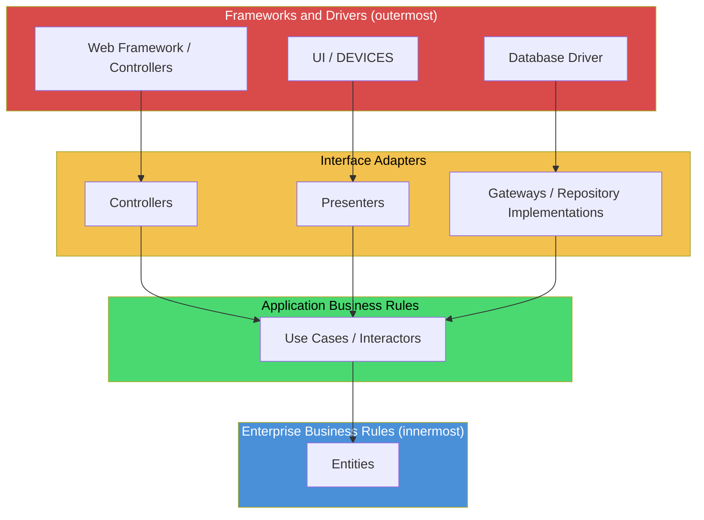
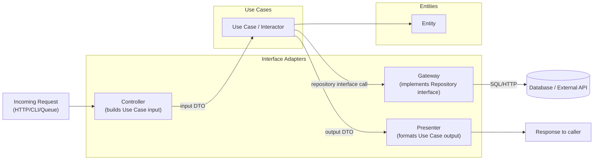
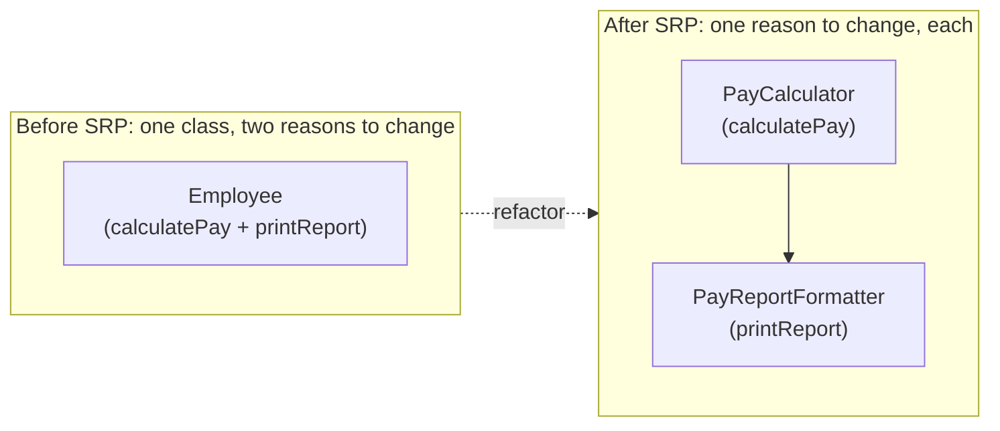
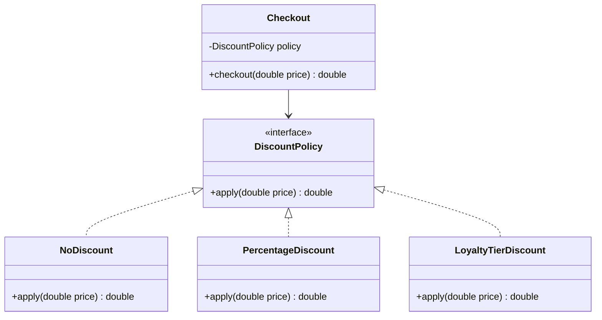
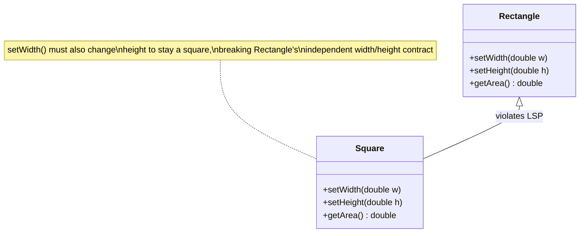
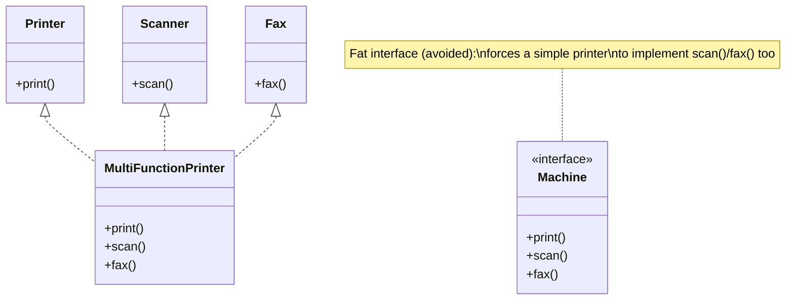
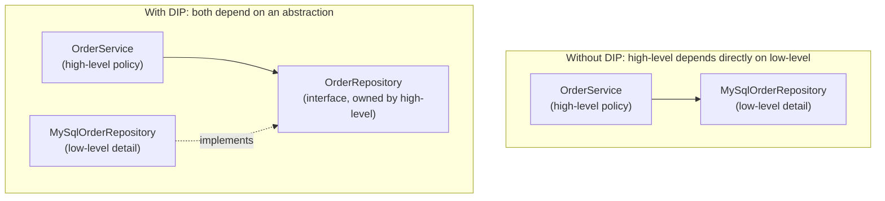

# Clean Architecture

## Blogs and websites

- [A quick introduction to clean architecture](https://www.freecodecamp.org/news/a-quick-introduction-to-clean-architecture-990c014448d2/)
- [The SOLID Principles of Object-Oriented Programming Explained in Plain English](https://www.freecodecamp.org/news/solid-principles-explained-in-plain-english/)

- [SOLID Principles with Real Life Examples](https://www.geeksforgeeks.org/system-design/solid-principle-in-programming-understand-with-real-life-examples/)

- [What is Inversion of Control?](https://stackoverflow.com/questions/3058/what-is-inversion-of-control)
- [What is dependency injection?](https://stackoverflow.com/questions/130794/what-is-dependency-injection)

## Medium

- [The S.O.L.I.D Principles in Pictures](https://medium.com/backticks-tildes/the-s-o-l-i-d-principles-in-pictures-b34ce2f1e898)
- [The 7 Most Important Software Design Patterns](https://learningdaily.dev/the-7-most-important-software-design-patterns-d60e546afb0e)
- [Understanding Inversion of Control (IoC) Principle](https://medium.com/@amitkma/understanding-inversion-of-control-ioc-principle-163b1dc97454)
- [Free E-BOOK on Design Patterns In Use](https://medium.com/@techworldwithmilan/how-to-select-a-design-pattern-567181b90e8c)

## Youtube


## Theory

### Topics Covered

This page is organized into the following topics. Each major topic includes a detailed explanation, its characteristics, components, patterns, pros/benefits, cons/challenges, best practices, when to use it, a real-life use case, a diagram, a Java code example, and interview questions with answers.

1. [Key Concepts](#key-concepts)
2. [What is Clean Architecture? (Introduction)](#what-is-clean-architecture-introduction)
3. [The Dependency Rule and Layers of Clean Architecture](#the-dependency-rule-and-layers-of-clean-architecture)
4. [SOLID Principles](#solid-principles)
5. [Single Responsibility Principle (SRP)](#single-responsibility-principle-srp)
6. [Open-Closed Principle (OCP)](#open-closed-principle-ocp)
7. [Liskov Substitution Principle (LSP)](#liskov-substitution-principle-lsp)
8. [Interface Segregation Principle (ISP)](#interface-segregation-principle-isp)
9. [Dependency Inversion Principle (DIP)](#dependency-inversion-principle-dip)
10. [Common Design Patterns](#common-design-patterns)
11. [Clean Architecture: Characteristics, Pros, Cons, Use Cases, Components, Patterns, Benefits, Challenges, Best Practices and When to Use](#clean-architecture-characteristics-pros-cons-use-cases-components-patterns-benefits-challenges-best-practices-and-when-to-use)

### Key Concepts

- **What is a web service?** - A software system designed to support interoperable machine-to-machine interaction over a network, usually exposed over HTTP and consumed by other applications rather than end users directly.
- **What is MQ (Message Queue)?** - A form of asynchronous service-to-service communication where a producer places a message on a queue and a consumer processes it independently, decoupling services in time and allowing serverless and microservices architectures to absorb load spikes without the caller blocking.
- **What is a SOAP web service?** - Simple Object Access Protocol, an XML-based messaging protocol for exchanging structured information in web services, with strict contracts (via WSDL), built-in error handling, and support for transactions and security standards (WS-Security), which makes it common in enterprise and legacy financial/banking integrations.
- **What is a REST web service?** - Representational State Transfer, an architectural style (not a protocol) for designing networked applications using standard HTTP methods (GET, POST, PUT, DELETE) against resource-oriented URLs, typically exchanging JSON, favored for its simplicity, statelessness, and cacheability.
- **What is WSDL?** - Web Services Description Language, an XML format for describing network services, their operations, input/output message formats, and endpoints, used primarily to generate and validate client/server code for SOAP services.
- **What is Clean Architecture?** - A software design philosophy, popularized by Robert C. Martin ("Uncle Bob"), that separates a system into concentric layers (Entities, Use Cases, Interface Adapters, Frameworks and Drivers) governed by a single Dependency Rule: source code dependencies can only point inward, toward business logic, never outward toward frameworks or infrastructure. This makes the business logic independent of UI, database, and external frameworks, which in turn makes it more maintainable, testable, and adaptable to change.

### What is Clean Architecture? (Introduction)

Clean Architecture is a layered software design approach, described by Robert C. Martin in 2012 and later expanded in his book *Clean Architecture: A Craftsman's Guide to Software Structure and Design* (2017). It is not a single, prescriptive framework but a synthesis of decades of similar ideas, including Hexagonal Architecture (Ports and Adapters) by Alistair Cockburn, Onion Architecture by Jeffrey Palermo, and Data, Context and Interaction (DCI). All of these share the same underlying goal: keep the business rules of an application independent of the tools and delivery mechanisms used to run it.

The core idea is captured in one rule, **the Dependency Rule**: source code dependencies must point only inward. Nothing in an inner, more abstract layer can know anything about an outer, more concrete layer. A database schema can change, a web framework can be swapped, a UI can be redesigned, and none of that should force a change to the core business logic, because the business logic never depended on any of those things in the first place.

**Why this matters:** in a traditional layered application, business logic often ends up directly calling a specific ORM, importing a specific web framework's request/response objects, or embedding SQL. This wires the most valuable, most stable part of the code (the rules that make the business what it is) to the most volatile, most replaceable part of the code (whatever database or framework happens to be popular this year). Clean Architecture inverts that relationship: infrastructure depends on business logic, never the other way around.

#### What is Clean Architecture: Diagram



Every arrow in this diagram points inward, toward `Entities`. The outer rings (frameworks, UI, database drivers) are free to change or be replaced entirely, because nothing on the inside has a compile-time or run-time dependency on them.

#### What is Clean Architecture: Real-Life Use Case

A mid-size fintech company built its loan-approval engine using Clean Architecture. The `Entities` layer defines what a `Loan`, `Applicant`, and `CreditScore` are and the invariants they must satisfy (for example, a `Loan` cannot be approved if the debt-to-income ratio exceeds a threshold). The `Use Cases` layer defines operations like `ApproveLoanUseCase` that orchestrate entities to fulfil a business goal. Two years later, the company needed to migrate from a monolithic PostgreSQL database to a mix of PostgreSQL and a document store for audit logs, and separately needed to expose the same approval logic through a new gRPC API in addition to the existing REST API. Because the database access lived entirely behind a `LoanRepository` interface (implemented in the Interface Adapters layer) and the delivery mechanism lived entirely in Controllers, both migrations were completed without touching a single line of the `Entities` or `Use Cases` layers, and the existing use-case unit tests kept passing unmodified throughout.

#### What is Clean Architecture: Java Code Example

```java
// --- Entities layer: pure business rules, no framework/database imports ---
public class Loan {
    private final String applicantId;
    private final double amount;
    private final double debtToIncomeRatio;

    public Loan(String applicantId, double amount, double debtToIncomeRatio) {
        this.applicantId = applicantId;
        this.amount = amount;
        this.debtToIncomeRatio = debtToIncomeRatio;
    }

    // Business invariant lives on the entity itself, not in a controller or service.
    public boolean isEligibleForApproval() {
        return debtToIncomeRatio <= 0.40 && amount > 0;
    }

    public String getApplicantId() {
        return applicantId;
    }
}

// --- Use Cases layer: application-specific business rules ---
public interface LoanRepository {
    void save(Loan loan);
}

public class ApproveLoanUseCase {
    private final LoanRepository loanRepository; // depends on an abstraction, not a concrete DB

    public ApproveLoanUseCase(LoanRepository loanRepository) {
        this.loanRepository = loanRepository;
    }

    public boolean execute(Loan loan) {
        if (!loan.isEligibleForApproval()) {
            return false;
        }
        loanRepository.save(loan);
        return true;
    }
}

// --- Interface Adapters layer: implements the repository using a real database ---
public class PostgresLoanRepository implements LoanRepository {
    @Override
    public void save(Loan loan) {
        // JDBC/ORM specific code lives here, isolated from business rules.
        System.out.println("INSERT INTO loans ... applicant=" + loan.getApplicantId());
    }
}

// --- Frameworks and Drivers layer: wires everything together (composition root) ---
public class LoanApprovalApp {
    public static void main(String[] args) {
        LoanRepository repository = new PostgresLoanRepository(); // concrete detail chosen here only
        ApproveLoanUseCase useCase = new ApproveLoanUseCase(repository);

        Loan loan = new Loan("applicant-42", 15000.0, 0.30);
        boolean approved = useCase.execute(loan);
        System.out.println("Approved: " + approved);
    }
}
```

Notice that `Loan` and `ApproveLoanUseCase` never import anything from a database driver, web framework, or JSON library. `PostgresLoanRepository` could be swapped for `MongoLoanRepository` or an in-memory fake for tests without changing either class.

#### What is Clean Architecture: Interview Questions and Answers

**Q1. Who introduced Clean Architecture, and how does it relate to Hexagonal and Onion Architecture?**
A: Robert C. Martin ("Uncle Bob") introduced the term and diagram in a 2012 blog post, later expanded into his 2017 book. It is essentially a synthesis of earlier, similar ideas: Alistair Cockburn's Hexagonal Architecture (Ports and Adapters) and Jeffrey Palermo's Onion Architecture. All three share the same core insight (isolate business logic from infrastructure via the Dependency Rule); Clean Architecture is best understood as a popularized, well-named restatement of that shared idea rather than a wholly new invention.

**Q2. What is "the Dependency Rule" and why is it the single most important rule in Clean Architecture?**
A: The Dependency Rule states that source code dependencies can only point inward, from outer, concrete layers toward inner, abstract layers, never the reverse. It is the single rule because every other property of Clean Architecture (testability, independence from frameworks, independence from the database and UI) is a direct consequence of enforcing it consistently.

**Q3. If Entities and Use Cases cannot depend on the database, how do they read and write data at all?**
A: They depend on an abstraction (an interface, e.g. `LoanRepository`) defined in the inner layer. A concrete implementation of that interface lives in an outer layer (e.g. `PostgresLoanRepository`) and is "plugged in" at the composition root (main/startup code) using dependency injection. This is Dependency Inversion in action: the abstraction is owned by the inner layer, not the outer one.

**Q4. Does Clean Architecture mean you cannot use a specific framework like Spring or Django?**
A: No. It means the business logic should not be tightly coupled to the framework. A Spring `@RestController` can sit in the Interface Adapters layer and translate HTTP requests into calls on a use case; the use case class itself should contain no Spring annotations or imports. The framework is treated as a replaceable delivery mechanism, not the foundation the business logic is built on.

**Q5. What is the main criticism or risk of adopting Clean Architecture?**
A: The main risk is over-engineering small or simple applications. Introducing four explicit layers, dozens of interfaces, and mapping objects between layers adds real boilerplate and indirection. For a small CRUD app or short-lived prototype, this cost can exceed the benefit; Clean Architecture pays off primarily in applications with real business complexity, a long expected lifetime, or requirements that are known to change (e.g., swapping databases, adding new delivery channels).

### The Dependency Rule and Layers of Clean Architecture

Clean Architecture is usually drawn as four concentric circles. Each ring is a layer with a distinct kind of responsibility, and every dependency arrow (imports, method calls, object references) must point from an outer ring to an inner ring, never the reverse.

1. **Entities (innermost)** - Enterprise-wide business rules and critical business data structures, such as a `Loan`, `Account`, or `Order`, along with the invariants they must always satisfy. These objects would exist and make sense even if the specific application around them was deleted; they represent the business itself, not a particular app.
2. **Use Cases (application business rules)** - Application-specific business rules that orchestrate the flow of data to and from entities to achieve a specific goal, such as `ApproveLoanUseCase` or `TransferFundsUseCase`. This layer knows about entities but knows nothing about HTTP, SQL, or UI frameworks.
3. **Interface Adapters** - Converters that translate data between the format most convenient for use cases/entities and the format most convenient for external agents such as a database or the web. This layer contains Controllers (translate incoming requests into use-case calls), Presenters (translate use-case output into a view model), and Gateways/Repositories (translate use-case data needs into actual database or API calls).
4. **Frameworks and Drivers (outermost)** - The concrete, volatile details: the web framework, the database engine and its driver, the UI toolkit, external device APIs. This is where Spring, Django, JDBC, React, or a specific message broker library actually live. This layer is expected to change often and is deliberately kept thin, mostly wiring and configuration.

#### Dependency Rule and Layers: Characteristics

- **Strict inward-pointing dependencies**: Every compile-time dependency (imports, `implements`, constructor parameters) in the diagram points from an outer circle to an inner circle. A class in `Entities` must never import a class from `Interface Adapters` or `Frameworks and Drivers`.
- **Inner layers define the contracts, outer layers implement them**: When an inner layer needs something from an outer layer (e.g., "save this loan"), it defines an interface for that need itself, and the outer layer provides the concrete implementation. This is the mechanism, Dependency Inversion, that lets the arrows point inward even though data must ultimately flow outward to a real database.
- **Data crosses boundaries as simple structures**: When data passes between layers (e.g., from a Controller into a Use Case), it is passed as simple data structures (DTOs, plain method arguments) rather than passing framework-specific objects like an HTTP `HttpServletRequest` inward.
- **Layers are about responsibility, not physical packages or services**: The four layers can be four packages in a single deployable, four modules in a mono-repo, or four physically separate services; Clean Architecture describes a dependency direction, not a specific deployment topology.
- **Business rules are independent and separately testable**: Because `Entities` and `Use Cases` have zero dependency on frameworks, they can be unit tested with plain objects and no test containers, mocks of a database, or running web server.

#### Dependency Rule and Layers: Components

- **Entities**: Plain objects encoding critical business data and rules, with no framework annotations or external library imports.
- **Use Case / Interactor classes**: Orchestrate one specific application operation, calling entities and repository interfaces to accomplish it, and returning a result or output boundary.
- **Input/Output boundary interfaces**: Interfaces that define what a use case needs from the outside world (input) and what it produces (output), so the use case layer never directly references a concrete controller or presenter class.
- **Controllers**: Translate an incoming request (HTTP, CLI, message from a queue) into the input format a use case expects, then invoke the use case.
- **Presenters / view models**: Translate a use case's output into the exact shape a UI or API response needs, keeping formatting logic out of the use case.
- **Gateways / Repository implementations**: Concrete classes, living in the outer layers, that implement the repository interfaces declared by the use case layer, using a specific database, ORM, or external API client.
- **Composition root (main/wiring code)**: The one place (typically in `main()` or a dependency-injection configuration class) where concrete implementations are actually instantiated and wired into the abstractions the inner layers expect.

#### Dependency Rule and Layers: Patterns

- **Dependency Inversion at every boundary**: Each crossing between layers is implemented via an interface owned by the inner layer, with the outer layer supplying the implementation, which is the concrete pattern used to make the Dependency Rule achievable in real code.
- **Humble Object pattern**: Logic that is hard to unit test (e.g., framework glue in a Controller, JDBC calls in a Gateway) is kept deliberately "humble" (thin, with minimal logic), so the majority of meaningful logic lives in the easily testable Use Case and Entity layers.
- **Data Transfer Objects (DTOs) at boundaries**: Simple, framework-free data carriers are used to move information between layers instead of passing framework types (e.g., an ORM entity or an HTTP request object) across a boundary.
- **Ports and Adapters (Hexagonal Architecture) equivalence**: A "port" is the interface an inner layer defines; an "adapter" is the outer-layer implementation of that port. This is functionally the same pattern as Clean Architecture's Interface Adapters layer, just named differently.

#### Dependency Rule and Layers: Pros / Benefits

- **Framework and database independence**: Because concrete frameworks and databases live only in the outermost ring, they can be replaced (e.g., swapping MySQL for DynamoDB, or REST for gRPC) with changes isolated to the outer layers.
- **High testability**: `Entities` and `Use Cases` can be tested with plain unit tests, no web server, database, or UI needed, which makes the test suite both fast and reliable.
- **Clear separation of concerns**: Each layer has one well-defined kind of responsibility, which makes it easier for new team members to know where a piece of logic belongs.
- **Parallel development**: Because layers interact only through interfaces, different developers or teams can work on the UI, the use cases, and the database layer simultaneously, integrating against agreed-upon interfaces.
- **Business logic outlives infrastructure choices**: Since the frameworks and drivers are the layer most likely to need replacement over a system's lifetime (due to end-of-life, licensing, or performance reasons), keeping business logic uncoupled from them protects the most valuable code from churn caused by infrastructure decisions.

#### Dependency Rule and Layers: Cons / Challenges

- **More upfront structure and boilerplate**: Four layers, multiple interfaces, and mapping objects between layers (DTOs, view models) requires writing more classes and more mapping code than a simpler two- or three-tier design.
- **Indirection can slow down navigation**: Following a single request through Controller to Use Case to Gateway to database can require jumping through several interfaces, which can feel slower to trace than a single method that just queries the database directly.
- **Risk of over-abstraction**: Teams sometimes add interfaces and layers "because Clean Architecture says so" even where there is only one real implementation and no expected need to swap it, adding complexity without a corresponding benefit.
- **Learning curve**: Developers new to the approach often struggle to know where a given piece of logic belongs (is this validation an entity rule, or a use-case rule?), and inconsistent application of the rule across a team leads to a codebase with mixed conventions.

#### Dependency Rule and Layers: Best Practices

- Start by identifying the true Entities and their invariants first; if the invariant only matters for one specific operation, it usually belongs in a Use Case, not the Entity.
- Define repository and gateway interfaces from the perspective of what the Use Case needs (e.g., `findActiveLoansForApplicant`), not from what the database table looks like, to avoid leaking persistence concerns inward.
- Keep Controllers and Presenters "humble": no business rules, just translation between the external format and the use case's input/output.
- Use a single composition root (e.g., a Spring `@Configuration` class or a plain `main` method) to wire concrete implementations to abstractions, rather than scattering `new ConcreteClass()` calls for infrastructure dependencies throughout the codebase.
- Apply the layering pragmatically based on the project's actual complexity and expected lifetime; a small internal tool may only need three layers, while a large, long-lived platform may benefit from the full four.

#### Dependency Rule and Layers: When to Use

- Systems expected to have a long lifetime, where the underlying database, UI framework, or delivery mechanism is likely to change at least once.
- Applications with genuinely complex business rules that deserve to be tested in isolation, independent of infrastructure concerns.
- Codebases maintained by multiple teams or many contributors over time, where clear boundaries reduce the risk of business logic leaking into infrastructure code (or vice versa).
- Situations requiring multiple delivery mechanisms for the same business logic (e.g., a REST API, a CLI tool, and a scheduled batch job all needing to run the same `ApproveLoanUseCase`).

#### Dependency Rule and Layers: Diagram



#### Dependency Rule and Layers: Real-Life Use Case

An online learning platform originally shipped its course-enrollment logic tightly coupled to Django's ORM: the enrollment view directly queried Django model objects and applied business rules (seat limits, prerequisite checks) inline in the view function. When the company needed to expose the exact same enrollment logic through a new mobile app's GraphQL API and a partner-facing batch import job, the business rules had to be copy-pasted and re-validated in three places, and a seat-limit bug was fixed in the web view but forgotten in the batch job, causing overselling. After refactoring around the Dependency Rule, an `EnrollStudentUseCase` in the application layer became the single place seat-limit and prerequisite logic lived; the REST view, the GraphQL resolver, and the batch job became three thin Controllers that all called the same Use Case, eliminating the duplicated-logic bug class entirely.

#### Dependency Rule and Layers: Java Code Example

```java
// Use case layer defines the *interface* it needs (a "port"), not a concrete DB class.
public interface EnrollmentRepository {
    int countActiveEnrollments(String courseId);
    void enroll(String studentId, String courseId);
}

// Input/output boundary keeps the use case decoupled from any specific delivery mechanism.
public class EnrollStudentUseCase {
    private static final int SEAT_LIMIT = 30;
    private final EnrollmentRepository repository;

    public EnrollStudentUseCase(EnrollmentRepository repository) {
        this.repository = repository;
    }

    public EnrollmentResult execute(String studentId, String courseId) {
        if (repository.countActiveEnrollments(courseId) >= SEAT_LIMIT) {
            return EnrollmentResult.failure("Course is full");
        }
        repository.enroll(studentId, courseId);
        return EnrollmentResult.success();
    }
}

public class EnrollmentResult {
    private final boolean success;
    private final String message;

    private EnrollmentResult(boolean success, String message) {
        this.success = success;
        this.message = message;
    }

    public static EnrollmentResult success() {
        return new EnrollmentResult(true, "Enrolled");
    }

    public static EnrollmentResult failure(String message) {
        return new EnrollmentResult(false, message);
    }

    public boolean isSuccess() {
        return success;
    }

    public String getMessage() {
        return message;
    }
}

// Interface Adapters / Frameworks layer: a REST controller and a batch-job controller
// both reuse the exact same use case, eliminating duplicated business logic.
public class EnrollmentRestController {
    private final EnrollStudentUseCase useCase;

    public EnrollmentRestController(EnrollStudentUseCase useCase) {
        this.useCase = useCase;
    }

    public String handlePostRequest(String studentId, String courseId) {
        EnrollmentResult result = useCase.execute(studentId, courseId);
        return result.isSuccess() ? "200 OK" : "409 Conflict: " + result.getMessage();
    }
}
```

#### Dependency Rule and Layers: Interview Questions and Answers

**Q1. What crosses a boundary between two Clean Architecture layers, and what must never cross it?**
A: Simple data (DTOs, primitive values, plain method arguments) crosses boundaries. Framework-specific types (an HTTP request object, an ORM entity class, a JDBC `ResultSet`) must never cross inward, because that would create a compile-time dependency from an inner layer to an outer one.

**Q2. How does an inner layer "call" an outer layer if dependencies can only point inward?**
A: It does not call the outer layer directly. The inner layer defines an interface describing what it needs (e.g., `EnrollmentRepository`), and a class in the outer layer implements that interface. At runtime, the outer-layer object is passed into the inner layer (via constructor/dependency injection), so control flows outward while the source-code dependency still points inward. This is the Dependency Inversion Principle applied at the architectural level.

**Q3. What is the "Humble Object" pattern and why does Clean Architecture rely on it?**
A: The Humble Object pattern splits logic into a part that is hard to test (usually because it touches a framework, UI, or external system) and a part that contains real logic and is easy to test. The hard-to-test part is kept deliberately "humble", minimal, containing almost no logic, so that nearly all meaningful behavior lives in the easily unit-tested part (typically the Use Case). Controllers, Presenters, and Gateways are all examples of Humble Objects in Clean Architecture.

**Q4. Is Clean Architecture the same thing as microservices?**
A: No. Clean Architecture is about the direction of source-code dependencies within a codebase; microservices are about physical deployment boundaries between separately deployable services. A single microservice can (and often should) be internally organized using Clean Architecture's layers, and a monolith can also be organized this way; the two concepts operate at different levels and are complementary, not the same thing.

**Q5. How would you decide whether a business rule belongs in the Entity layer or the Use Case layer?**
A: Ask whether the rule is true for the concept everywhere it appears in the business (an Entity rule, e.g., "a loan's debt-to-income ratio must not exceed 40%") or whether it is specific to one particular operation or workflow (a Use Case rule, e.g., "when approving a loan through the fast-track workflow, only auto-approve if the applicant has no missed payments in the last 12 months"). Entity rules protect the concept's core integrity everywhere; Use Case rules govern one specific application flow.

### SOLID Principles

SOLID is an acronym for five object-oriented design principles, introduced (and later collected under this mnemonic) by Robert C. Martin, that exist to make software easier to extend and maintain over time. They are the principle-level foundation that Clean Architecture's layering and Dependency Rule are built on: each SOLID principle deals with how individual classes and modules should be shaped, while Clean Architecture deals with how whole layers of an application should be organized, but both pursue the same goal of isolating stable business logic from volatile implementation detail.

- **Single Responsibility Principle (SRP)** - A class should have only one reason to change, meaning it should be responsible for a single, well-defined piece of functionality. See the [full breakdown](#single-responsibility-principle-srp) below.
- **Open-Closed Principle (OCP)** - Software entities (classes, modules, functions) should be open for extension but closed for modification, so new behavior is added without editing existing, already-tested code. See the [full breakdown](#open-closed-principle-ocp) below.
- **Liskov Substitution Principle (LSP)** - Objects of a superclass should be replaceable with objects of its subclasses without altering the correctness of the program. See the [full breakdown](#liskov-substitution-principle-lsp) below.
- **Interface Segregation Principle (ISP)** - Clients should not be forced to depend on methods/interfaces they don't use; prefer many small, specific interfaces over one large, general-purpose one. See the [full breakdown](#interface-segregation-principle-isp) below.
- **Dependency Inversion Principle (DIP)** - High-level modules should not depend on low-level modules; both should depend on abstractions, and abstractions should not depend on details. See the [full breakdown](#dependency-inversion-principle-dip) below.

### Single Responsibility Principle (SRP)

**Definition:** A class (or module) should have only one reason to change. Equivalently, a class should have one, and only one, job or actor it is responsible to.

The word "responsibility" here does not mean "one method" or "few lines of code"; it means "one axis of change owned by one stakeholder." A class that both calculates an employee's pay and formats a report about that pay has two reasons to change: the finance department changing the pay calculation rules, and the reporting team changing the report layout. SRP says these two responsibilities should live in two different classes, because a change requested by one stakeholder should never risk breaking behavior that only the other stakeholder cares about.

#### SRP: Characteristics

- **One reason to change, per class**: A class should be affected by changes from exactly one source or stakeholder (Robert Martin later refined this from "one job" to "one actor," the person or group who would request a change).
- **High cohesion**: All the methods and fields inside a class work together toward the same single purpose; nothing in the class is "along for the ride" for an unrelated reason.
- **Small, focused classes as a natural side effect**: Following SRP tends to produce more, smaller classes, each named precisely for what it does (e.g., `PayCalculator`, `PayReportFormatter`) rather than broad, vague names (e.g., `PayManager`).
- **Separation of "what" from "how it is presented/persisted/transmitted"**: Calculating a value, formatting a value, and persisting a value are three distinct responsibilities that SRP keeps apart.

#### SRP: Components

- **A single well-named class or module** per responsibility, with a name that reflects exactly that responsibility (e.g., `InvoicePdfRenderer`, not `InvoiceHelper`).
- **A clear owner/actor** for each class, an identifiable stakeholder or subsystem whose requirements alone drive changes to that class.
- **Collaborators, not inheritance, for composing responsibilities**: When a use case needs both calculation and formatting, it composes a calculator and a formatter as collaborators rather than merging both concerns into one class.

#### SRP: Patterns

- **Extract Class**: When a class is found to serve two actors, its methods and fields are split into two new classes, one per responsibility, with the original class optionally kept as a thin façade if needed for compatibility.
- **Facade**: A single simple entry point can coordinate multiple single-responsibility collaborators internally, giving callers a simple API without merging the underlying responsibilities into one class.
- **Service layer separation**: Business calculation services, persistence/repository services, and presentation/formatting services are commonly split into distinct classes or packages, mirroring SRP at a coarser, architectural granularity.

#### SRP: Pros / Benefits

- **Lower risk of unrelated breakage**: A change to how a report is formatted cannot accidentally break the pay calculation, because they live in different classes with no shared mutable state.
- **Easier to understand and name**: A class with one responsibility can be described in a single sentence and given a precise name, which makes the codebase easier to navigate.
- **Easier to test in isolation**: Unit tests for the calculation logic do not need to set up or verify anything about formatting, and vice versa, keeping tests small and fast.
- **Easier parallel work**: Two developers (or teams) can work on the calculation logic and the report formatting simultaneously with minimal merge conflicts.

#### SRP: Cons / Challenges

- **Can lead to many small classes**: Strict application of SRP increases the total class count, which some developers find harder to navigate at first, since a single behavior may now require reading three or four small classes instead of one large one.
- **Determining the "right" responsibility boundary is subjective**: Two engineers can reasonably disagree on whether "validating an order" and "calculating an order's total" are one responsibility or two; SRP does not give a mechanical formula, only a guiding question ("what actor would request this change?").
- **Over-splitting adds indirection without benefit**: Splitting a class purely to reduce line count, without an identifiable second actor or reason to change, adds navigation overhead with no real decoupling benefit.

#### SRP: Best Practices

- Ask "who would ask me to change this class, and why?" for each class; if you can name two unrelated stakeholders or reasons, split it.
- Name classes after their single responsibility precisely (`TaxCalculator`, not `OrderHelper` or `OrderManager`), since a vague name is often a symptom of a vague, overloaded responsibility.
- Prefer composing small, focused classes over inheriting from a large base class to reuse partial behavior.
- Revisit SRP boundaries as requirements evolve; a class that had one responsibility at first can accumulate a second one silently over time as new features are bolted on.

#### SRP: When to Use

- Any class that currently mixes business calculation, data access, and presentation/formatting logic in the same file.
- Classes that have grown large and are frequently the site of merge conflicts between different feature teams.
- Whenever writing a unit test for one behavior of a class requires unrelated setup for a second, unrelated behavior, a strong signal that the class has more than one responsibility.

#### SRP: Diagram



#### SRP: Real-Life Use Case

A payroll system originally had a single `Employee` class with `calculatePay()`, `save()`, and `printPaySlip()` methods. When the finance team changed the overtime-pay formula, a bug was accidentally introduced into `printPaySlip()` because both methods shared a private field that the overtime change touched. After applying SRP, the team split the class into `PayCalculator` (owned by finance/payroll rules), `EmployeeRepository` (owned by the data/persistence team), and `PaySlipPrinter` (owned by the reporting team). Subsequent changes to the pay formula could no longer break the pay-slip printing, because the two now share only an immutable, already-computed `PayResult` value object.

#### SRP: Java Code Example

```java
// Before SRP: Employee mixes calculation, persistence, and formatting concerns.
class EmployeeBeforeSrp {
    double calculatePay() { /* payroll rules */ return 0; }
    void save() { /* database code */ }
    void printPaySlip() { /* formatting/printing code */ }
}

// After SRP: each class has exactly one reason to change.
class PayCalculator {
    double calculatePay(Employee employee, double hoursWorked) {
        double baseRate = employee.getHourlyRate();
        double overtimeHours = Math.max(0, hoursWorked - 40);
        return (40 * baseRate) + (overtimeHours * baseRate * 1.5);
    }
}

class EmployeeRepository {
    void save(Employee employee) {
        // Persistence-only concern, changes only if storage technology changes.
        System.out.println("Saving employee " + employee.getId());
    }
}

class PaySlipPrinter {
    void print(Employee employee, double pay) {
        // Presentation-only concern, changes only if pay-slip format changes.
        System.out.println("Pay slip for " + employee.getId() + ": $" + pay);
    }
}

class Employee {
    private final String id;
    private final double hourlyRate;

    Employee(String id, double hourlyRate) {
        this.id = id;
        this.hourlyRate = hourlyRate;
    }

    String getId() { return id; }
    double getHourlyRate() { return hourlyRate; }
}

public class PayrollDemo {
    public static void main(String[] args) {
        Employee employee = new Employee("E-100", 25.0);
        PayCalculator calculator = new PayCalculator();
        EmployeeRepository repository = new EmployeeRepository();
        PaySlipPrinter printer = new PaySlipPrinter();

        double pay = calculator.calculatePay(employee, 45);
        repository.save(employee);
        printer.print(employee, pay);
    }
}
```

#### SRP: Interview Questions and Answers

**Q1. What does "one reason to change" actually mean in practice?**
A: It means one identifiable actor or stakeholder group can request changes to the class. Robert Martin later clarified this as "a class should be responsible to one, and only one, actor," to avoid confusion with counting literal reasons. If both the finance team and the reporting team can independently request changes to the same class for unrelated reasons, that class violates SRP.

**Q2. Isn't SRP just "keep classes small"?**
A: Not quite. A large class can still satisfy SRP if all its methods serve exactly one responsibility (e.g., a complex tax calculator with many helper methods, all serving tax calculation). Conversely, a very small class can still violate SRP if its few methods serve two unrelated actors. Size is a side effect, not the definition.

**Q3. How does SRP at the class level relate to the layering in Clean Architecture?**
A: Clean Architecture applies the same idea at a coarser granularity: each layer (Entities, Use Cases, Interface Adapters, Frameworks and Drivers) has a single responsibility relative to the whole application, and the Dependency Rule prevents a lower-level detail's reason to change (e.g., swapping databases) from forcing a change in a higher-level responsibility (business rules).

**Q4. Can you give a real-world non-software analogy for SRP?**
A: A restaurant that has the chef also handle billing, seating guests, and cleaning would be brittle: a change in tax law (billing) and a change in food safety code (kitchen) are unrelated concerns forced through the same person. Splitting these into a cashier, a host, and a chef mirrors SRP: each role changes for its own reason without affecting the others.

**Q5. What is a practical warning sign that a class violates SRP?**
A: A useful sign is that the class's name contains a vague, catch-all word like "Manager," "Helper," or "Processor," or that its unit test file needs to set up unrelated mocks/fixtures for different tests within the same class. Another sign is that two different feature teams keep touching the same file for unrelated reasons.

### Open-Closed Principle (OCP)

**Definition:** Software entities (classes, modules, functions) should be open for extension but closed for modification. New behavior should be addable by writing new code, not by editing existing, already-tested code.

The classic mechanism for achieving this in object-oriented languages is polymorphism: define an abstraction (an interface or abstract class) that existing code depends on, then add new behavior by writing a new class that implements that abstraction, leaving the existing code and its abstraction untouched.

#### OCP: Characteristics

- **Extension without modification**: New requirements are satisfied by adding new classes/implementations, not by adding `if`/`else` or `switch` branches to existing, working code.
- **Abstraction as the extension point**: An interface or abstract class defines the "shape" of the behavior that can vary; concrete implementations plug into that shape.
- **Protects already-tested code from regressions**: Since existing classes are not edited to add new behavior, their existing tests and behavior remain provably unaffected by the new feature.
- **Plug-in style architecture**: The overall design resembles a set of plug-ins conforming to a shared interface, discovered or injected at runtime/composition time.

#### OCP: Components

- **A stable abstraction (interface/abstract class)**: Defines the contract that both existing and future implementations must satisfy.
- **Concrete strategy/handler implementations**: Each new requirement becomes a new class implementing the abstraction, rather than a new conditional branch.
- **A composition point (factory, dependency injection, registry)**: Something that selects or wires in the correct concrete implementation at runtime, so client code never needs to change to support a new implementation.

#### OCP: Patterns

- **Strategy pattern**: Encapsulates interchangeable algorithms behind a common interface, allowing new algorithms/behaviors to be added as new classes.
- **Template Method pattern**: Defines the skeleton of an algorithm in a base class while letting subclasses override specific steps, adding variation without modifying the skeleton.
- **Decorator pattern**: Adds new behavior to an object by wrapping it in a new class implementing the same interface, rather than modifying the original class.
- **Plugin/registry pattern**: New implementations register themselves (or are discovered via configuration/dependency injection) against a shared interface, so the core system loop never needs to change to support a new plugin.

#### OCP: Pros / Benefits

- **Reduced regression risk**: Since existing, already-tested code is not touched when adding new behavior, the probability of accidentally breaking existing functionality drops significantly.
- **Easier to reason about change impact**: A code reviewer only needs to review the new class being added, not re-review a modified branch of a large existing method.
- **Encourages small, composable units**: Because each new behavior is its own class implementing a shared interface, the codebase naturally accumulates small, focused, independently testable units.
- **Supports third-party/plugin extension**: External developers can add new behavior by implementing a published interface, without needing access to modify the core codebase at all.

#### OCP: Cons / Challenges

- **Requires anticipating the right abstraction upfront**: If the original interface does not anticipate the kind of variation a new requirement needs, teams may still have to modify the abstraction itself, which ripples out to every implementation.
- **Can add indirection for cases that never actually vary**: Introducing an interface and a strategy pattern for a piece of logic that will realistically never have a second implementation adds unnecessary ceremony.
- **Harder to trace which implementation runs**: With many interchangeable implementations wired via dependency injection or configuration, understanding "which class actually executes here" can require tracing through a registry or configuration file rather than reading a single method.

#### OCP: Best Practices

- Apply OCP where change is likely or has already happened more than once (a repeated pattern of adding `else if` branches for a new type is the classic trigger), not speculatively everywhere.
- Design the abstraction around the stable part of the behavior (the "what"), letting the implementation vary the unstable part (the "how").
- Combine with the Open-Closed-friendly patterns (Strategy, Decorator, Template Method) rather than inventing ad hoc extension mechanisms.
- Keep the number of abstraction methods small and focused, so implementing a new extension does not require excessive boilerplate.

#### OCP: When to Use

- Business rules that are known to vary by type, region, customer tier, or configuration (e.g., different discount calculations, different tax rules per country, different payment gateways).
- Systems that must support third-party or future, not-yet-known extensions through a stable public interface.
- Any place in the code where a `switch` statement or long `if`/`else if` chain keeps growing every time a new case/type is introduced.

#### OCP: Diagram



Adding a new discount type (e.g., `FlashSaleDiscount`) means adding a new class implementing `DiscountPolicy`; `Checkout` never changes.

#### OCP: Real-Life Use Case

An e-commerce checkout originally had a single method with a growing `if`/`else if` chain: `if (customer.isVip()) {...} else if (isHoliday) {...} else if (couponCode != null) {...}`. Every new marketing promotion required editing this shared method, and twice a change to one branch accidentally broke an unrelated branch due to shared mutable variables. The team refactored to a `DiscountPolicy` interface with one implementation per discount type, selected via a small factory based on the order context. The next five new promotions were each added as a new class implementing `DiscountPolicy`, with zero changes to the `Checkout` class or its existing tests.

#### OCP: Java Code Example

```java
public interface DiscountPolicy {
    double apply(double price);
}

public class NoDiscount implements DiscountPolicy {
    public double apply(double price) { return price; }
}

public class PercentageDiscount implements DiscountPolicy {
    private final double percentage;

    public PercentageDiscount(double percentage) {
        this.percentage = percentage;
    }

    public double apply(double price) {
        return price - (price * percentage / 100.0);
    }
}

// Adding this new class required zero changes to Checkout or existing discount classes.
public class LoyaltyTierDiscount implements DiscountPolicy {
    private final int loyaltyYears;

    public LoyaltyTierDiscount(int loyaltyYears) {
        this.loyaltyYears = loyaltyYears;
    }

    public double apply(double price) {
        double rate = loyaltyYears >= 5 ? 0.15 : 0.05;
        return price - (price * rate);
    }
}

public class Checkout {
    private final DiscountPolicy policy; // depends on the abstraction, closed for modification

    public Checkout(DiscountPolicy policy) {
        this.policy = policy;
    }

    public double checkout(double price) {
        return policy.apply(price);
    }
}

public class OcpDemo {
    public static void main(String[] args) {
        Checkout checkout = new Checkout(new LoyaltyTierDiscount(6));
        System.out.println("Final price: " + checkout.checkout(200.0));
    }
}
```

#### OCP: Interview Questions and Answers

**Q1. What does "closed for modification" actually forbid, and what does it allow?**
A: It forbids editing the source code of an existing, already-shipped class or module to add new behavior. It allows (and encourages) adding entirely new classes/files that implement an existing abstraction. The existing class's compiled binary or already-passing tests should not need to change to support the new behavior.

**Q2. How is OCP different from just using inheritance everywhere?**
A: OCP is most safely achieved through composition against an interface (Strategy pattern), not deep inheritance hierarchies. Inheritance can violate OCP just as easily if a subclass depends on a base class's implementation details that later change; the mechanism that matters is depending on a stable abstraction, not the specific keyword (`extends` vs `implements`).

**Q3. Give an example of code that violates OCP.**
A: A `shipping cost` method with `if (type == "STANDARD") {...} else if (type == "EXPRESS") {...} else if (type == "OVERNIGHT") {...}`. Every new shipping type requires editing this method, risking a regression in the existing branches, which is the definition of "not closed for modification."

**Q4. Does following OCP mean you should add an interface for absolutely everything up front?**
A: No, this is a common misapplication known as speculative generality. OCP is best applied to axes of variation that have already shown up more than once, or that the business explicitly says will vary (e.g., "we will keep adding payment providers"). Introducing an interface with only one implementation and no known second implementation adds cost without benefit.

**Q5. How does OCP relate to the Dependency Inversion Principle?**
A: They are closely related but distinct: OCP is about being able to add new behavior without modifying existing code, typically achieved via polymorphism against an abstraction. DIP is about which direction the dependency on that abstraction points, specifically, that high-level policy code should own the abstraction, and low-level detail code should depend on it. OCP tells you to introduce the abstraction; DIP tells you who should own it.

### Liskov Substitution Principle (LSP)

**Definition:** Objects of a superclass should be replaceable with objects of any of its subclasses without altering the correctness of the program. Formulated by Barbara Liskov in 1987, it is a precise, behavioral definition of what "is-a" should actually mean in object-oriented design: a subtype must honor every promise (precondition, postcondition, and invariant) that client code relies on when using the supertype.

LSP is frequently misunderstood as being only about method signatures compiling correctly. In reality it is about *behavioral* compatibility: a subclass must not strengthen preconditions (demand more from the caller than the base class did), weaken postconditions (guarantee less than the base class did), or throw new exceptions the caller was not already prepared to handle for the base type.

#### LSP: Characteristics

- **Behavioral substitutability, not just type compatibility**: A subclass passing the compiler's type checks is not enough; it must also behave in a way that satisfies every contract the base class established.
- **No strengthened preconditions**: A subclass method cannot require stricter input conditions than the base class method promised to accept.
- **No weakened postconditions**: A subclass method cannot return a weaker guarantee or a "worse" result than what client code was told to expect from the base class.
- **Preserved invariants**: Any invariant the base class guaranteed to always hold true must still hold true for every subclass.
- **The classic violation is often geometric or arithmetic, but is really about assumed behavior**: The famous Square-extends-Rectangle example fails LSP not because a square is not "a kind of" rectangle mathematically, but because code that sets a rectangle's width and separately checks its height (`assert rect.getHeight() == originalHeight`) breaks silently when handed a `Square`.

#### LSP: Components

- **A base type (interface or superclass) with a documented contract**: Preconditions, postconditions, and invariants, ideally written down explicitly (in Javadoc or tests), not left implicit.
- **Subtypes that honor, and do not narrow, that contract**: Each subclass extends behavior without silently changing the meaning client code already depends on.
- **Contract tests (a shared test suite run against every implementation)**: A single suite of tests written against the base type's contract, executed against every concrete subclass, to mechanically verify substitutability.

#### LSP: Patterns

- **Design by Contract**: Preconditions, postconditions, and invariants are explicitly documented (and ideally enforced with assertions) on the base type, giving subclasses an explicit contract to honor rather than an implicit, easy-to-violate one.
- **Composition over inheritance**: When a "subtype" cannot honestly satisfy the base type's full contract (e.g., a `Square` cannot independently vary width and height like a `Rectangle`), prefer composing behavior rather than forcing an inheritance relationship that will violate LSP.
- **Template Method with well-defined hook contracts**: When using Template Method, the contract of each overridable hook method is documented precisely so subclasses extending it cannot silently break the algorithm's correctness.

#### LSP: Pros / Benefits

- **Polymorphism can be trusted**: Client code written against a base type or interface can safely use any subtype without adding type checks (`if (obj instanceof SpecificSubclass)`), because every subtype is guaranteed to behave compatibly.
- **Fewer surprising runtime bugs**: Bugs caused by "this specific subclass behaves subtly differently" are caught at design time by checking the contract, rather than discovered in production.
- **Cleaner client code**: Because callers never need special-case logic per subtype, calling code stays simple and free of type-checking branches.
- **Safer refactoring and extension**: New subclasses can be added with confidence that they will not break existing client code, as long as they honor the contract.

#### LSP: Cons / Challenges

- **Contracts are often implicit and undocumented**: Many codebases never write down the preconditions/postconditions/invariants of a base class, making it easy to violate LSP unintentionally without any compiler warning.
- **Tempting but incorrect "is-a" modeling**: Real-world taxonomies (a square "is a" rectangle, a penguin "is a" bird) do not always match the behavioral substitutability that LSP requires, leading to natural but incorrect inheritance hierarchies.
- **Retrofitting is expensive**: Discovering an LSP violation after many client classes already depend on the base type's original contract can require a significant refactor to fix properly.

#### LSP: Best Practices

- Write down (even informally, in comments/Javadoc) the preconditions, postconditions, and invariants of any base class or interface intended to be extended.
- Write a shared contract-test suite for the base type and run it against every subclass/implementation to mechanically catch LSP violations.
- Prefer composition when a "subtype" would need to override a method to throw an exception, do nothing, or otherwise opt out of behavior the base type promised.
- Be suspicious of subclasses that override a method only to weaken it (return `null` where the base guaranteed a value, throw `UnsupportedOperationException`, etc.); these are strong LSP violation signals.

#### LSP: When to Use

- Any time you introduce class hierarchies or interface implementations meant to be interchangeable at runtime through polymorphism.
- When designing a public library or framework's base classes/interfaces that third parties will extend, since LSP violations there break client code you do not control.
- When reviewing an existing hierarchy where subclasses have overridden methods to throw `UnsupportedOperationException` or silently no-op, both classic LSP red flags.

#### LSP: Diagram



#### LSP: Real-Life Use Case

A reporting library shipped a `Reader` base class whose contract promised `read()` would return `-1` at end-of-stream and never throw for a normal, readable resource. A team added a `NetworkReader` subclass that, when the connection dropped mid-stream, threw an unchecked `ConnectionLostException` instead of returning `-1`. Every piece of client code written against `Reader` (following the original contract) crashed with an unhandled exception the first time a network hiccup occurred in production, because none of it expected a `Reader` to throw there. The fix was to make dropped connections return a well-defined end-of-stream/error result consistent with the base contract (or introduce an explicit checked exception documented on the base type itself), restoring substitutability.

#### LSP: Java Code Example

```java
// Base contract: getArea() always reflects independently-set width and height.
public class Rectangle {
    protected double width;
    protected double height;

    public void setWidth(double width) { this.width = width; }
    public void setHeight(double height) { this.height = height; }
    public double getArea() { return width * height; }
}

// LSP VIOLATION: Square silently changes both dimensions together,
// breaking any client code that sets width and height independently.
public class SquareViolatesLsp extends Rectangle {
    @Override
    public void setWidth(double width) {
        this.width = width;
        this.height = width; // surprising side effect breaks the base contract
    }

    @Override
    public void setHeight(double height) {
        this.width = height;
        this.height = height;
    }
}

// LSP-COMPLIANT fix: model the shared behavior via composition/interface,
// not inheritance that cannot honestly satisfy the base contract.
public interface Shape {
    double getArea();
}

public class RectangleShape implements Shape {
    private final double width;
    private final double height;

    public RectangleShape(double width, double height) {
        this.width = width;
        this.height = height;
    }

    public double getArea() { return width * height; }
}

public class SquareShape implements Shape {
    private final double side;

    public SquareShape(double side) {
        this.side = side;
    }

    public double getArea() { return side * side; }
}

public class LspDemo {
    // Client code trusts that ANY Shape can be substituted safely.
    static void printArea(Shape shape) {
        System.out.println("Area: " + shape.getArea());
    }

    public static void main(String[] args) {
        printArea(new RectangleShape(4, 5));
        printArea(new SquareShape(4));
    }
}
```

#### LSP: Interview Questions and Answers

**Q1. Why does making Square extend Rectangle violate LSP, even though a square is mathematically a rectangle?**
A: Because `Rectangle`'s contract (implicitly) promises that setting width and height are independent operations. `Square` cannot honor that promise, since a square's width and height must always be equal, so it must override `setWidth`/`setHeight` to also change the other dimension. Any client code that relies on setting width and height independently (a very reasonable assumption given `Rectangle`'s interface) will get the wrong area when handed a `Square`, so `Square` is not truly substitutable for `Rectangle`.

**Q2. What is the difference between strengthening a precondition and weakening a postcondition, and why are both LSP violations?**
A: Strengthening a precondition means a subclass method demands more from its caller than the base class did (e.g., base accepts any integer, subclass throws if the integer is negative). Weakening a postcondition means a subclass method guarantees less than the base promised (e.g., base guarantees a sorted list is returned, subclass returns an unsorted one). Both break client code that was written correctly against the base class's original contract, which is exactly what LSP is designed to prevent.

**Q3. How would you detect an LSP violation without knowing the internal implementation of a subclass?**
A: Write (or reuse) a single contract test suite against the base type's documented behavior, and run that identical suite against every subclass. Any subclass that fails a test the base type is expected to pass has violated LSP; this technique works precisely because it does not require reading the subclass's implementation.

**Q4. Give a non-geometric, business-logic example of an LSP violation.**
A: A `PaymentProcessor` base class whose `charge(amount)` method is documented to always either succeed or throw a `PaymentDeclinedException`. A new `CryptoPaymentProcessor` subclass instead silently returns `false` on failure instead of throwing. Any client code written to catch `PaymentDeclinedException` will never notice a failed crypto payment, silently treating it as a success, a serious correctness bug caused purely by an LSP violation.

**Q5. How does LSP interact with the other SOLID principles, particularly OCP?**
A: OCP relies on being able to add new subclasses/implementations of an abstraction without modifying existing client code. That only stays safe if every new subclass is actually substitutable for the abstraction, which is precisely what LSP guarantees. In other words, LSP is the behavioral guarantee that makes OCP's polymorphic extension mechanism trustworthy; violating LSP while practicing OCP just means you are safely adding new, silently broken behavior.

### Interface Segregation Principle (ISP)

**Definition:** Clients should not be forced to depend on methods (or interfaces) they do not use. Prefer several small, client-specific interfaces over one large, general-purpose interface.

ISP targets "fat" interfaces: an interface with many unrelated methods forces every implementing class to provide (or stub out) methods it does not actually need, and forces every client depending on that interface to be recompiled/redeployed whenever any method on the interface changes, even a method that client never calls.

#### ISP: Characteristics

- **Small, role-specific interfaces**: Interfaces are defined around what a specific kind of client actually needs, rather than aggregating every possible operation an object might support into one interface.
- **No forced no-op or exception-throwing implementations**: A class implementing an interface should never need to implement a method with an empty body or a `throw new UnsupportedOperationException()`, that is the signature of an interface that is too broad for that class.
- **Clients depend only on what they use**: A piece of client code that only reads data should depend on a read-only interface, not a combined read/write interface, even if the concrete object underneath happens to support both.
- **Reduced ripple effect of interface changes**: Because interfaces are narrow, a change to one interface's method only forces recompilation/review of the small set of clients that actually depend on that interface.

#### ISP: Components

- **Multiple small interfaces** grouped by client role or capability (e.g., `Readable`, `Writable`, `Printable`) instead of one combined interface (`Machine` with `scan()`, `print()`, `fax()`, all required).
- **Composable implementations**: A concrete class can implement several small interfaces at once if it genuinely supports all those capabilities, without forcing every client to know about all of them.
- **Role interfaces consumed by specific client code**: Each piece of client/application code depends on exactly the narrow interface matching the capability it needs, nothing more.

#### ISP: Patterns

- **Role Interface pattern**: Interfaces are defined from the perspective of client roles/use cases (what does *this* caller need?) rather than from the perspective of the implementing class's full capability set.
- **Interface segregation via composition**: A broad concrete class can implement multiple small, focused interfaces; different client code depends on only the specific interface relevant to it.
- **Adapter pattern to bridge a fat legacy interface**: When forced to work with an existing broad interface (e.g., a legacy SDK), a thin adapter can expose only a narrow, ISP-compliant interface to the rest of the application.

#### ISP: Pros / Benefits

- **No wasted or dangerous stub implementations**: Classes never need to fake-implement methods they do not support, eliminating a common source of runtime `UnsupportedOperationException` bugs.
- **Lower coupling and smaller recompilation/change blast radius**: A client depending on a three-method interface is unaffected by an unrelated tenth method changing on a large interface it never used.
- **Clearer, more honest API contracts**: Small interfaces make it immediately obvious what a piece of client code actually requires, improving readability and making mock/test doubles trivial to write.
- **Easier to implement for new classes**: A new class only needs to implement the small subset of interfaces relevant to its actual capabilities, rather than being forced to support an entire fat interface.

#### ISP: Cons / Challenges

- **Interface proliferation**: Splitting into many small interfaces can increase the total number of types in a codebase, which can feel like more to navigate for developers not used to the style.
- **Requires upfront thought about client roles**: Correctly identifying "who are the different kinds of clients and what do they each actually need" takes deliberate design effort; getting it wrong can lead to interfaces that are still not aligned with real usage.
- **Composing many small interfaces can be verbose in some languages**: In languages without convenient multiple-interface implementation or default methods, implementing several small interfaces on one class can require more boilerplate than one large interface.

#### ISP: Best Practices

- Design interfaces from the calling code's point of view ("what does this specific client need to call?"), not from the implementing class's full feature list.
- Treat an empty method body or a `throw new UnsupportedOperationException()` inside an interface implementation as a hard signal that the interface needs to be split.
- Use adapters to isolate unavoidable fat interfaces from legacy libraries/SDKs, so the rest of the codebase only ever sees narrow, purpose-built interfaces.
- Favor several small interfaces that a class can implement together over one large interface that a class must implement fully.

#### ISP: When to Use

- Whenever a class implementing an interface has one or more methods it cannot meaningfully support (leading to empty bodies or thrown exceptions).
- When designing plugin or SDK boundaries meant to be implemented by many different third parties with varying capabilities.
- When a change to one method on a widely-used interface is triggering unrelated code to be recompiled, retested, or redeployed.

#### ISP: Diagram



Instead of one fat `Machine` interface, `Printer`, `Scanner`, and `Fax` are separate, narrow interfaces; a simple printer implements only `Printer`, while a multi-function device implements all three.

#### ISP: Real-Life Use Case

A print-management SDK originally exposed one `Machine` interface with `print()`, `scan()`, `fax()`, and `emailScan()`. A basic, single-function printer manufacturer integrating with the SDK was forced to implement `scan()`, `fax()`, and `emailScan()` by throwing `UnsupportedOperationException`, and application code that called `machine.fax(document)` on what it assumed was a generic `Machine` started crashing in production whenever a customer plugged in a basic printer. The SDK was refactored into four narrow interfaces (`Printer`, `Scanner`, `FaxMachine`, `EmailScanner`); application code was updated to depend only on `Printer` where only printing was needed, and the runtime crashes from calling unsupported operations disappeared entirely.

#### ISP: Java Code Example

```java
// ISP VIOLATION: a fat interface forces unrelated capabilities on every implementer.
interface MachineFat {
    void print(String document);
    void scan(String document);
    void fax(String document);
}

class BasicPrinterViolatesIsp implements MachineFat {
    public void print(String document) {
        System.out.println("Printing: " + document);
    }
    public void scan(String document) {
        throw new UnsupportedOperationException("This printer cannot scan");
    }
    public void fax(String document) {
        throw new UnsupportedOperationException("This printer cannot fax");
    }
}

// ISP-COMPLIANT: small, role-specific interfaces.
interface Printer {
    void print(String document);
}

interface Scanner {
    void scan(String document);
}

interface FaxMachine {
    void fax(String document);
}

class BasicPrinter implements Printer {
    public void print(String document) {
        System.out.println("Printing: " + document);
    }
}

class MultiFunctionPrinter implements Printer, Scanner, FaxMachine {
    public void print(String document) {
        System.out.println("Printing: " + document);
    }
    public void scan(String document) {
        System.out.println("Scanning: " + document);
    }
    public void fax(String document) {
        System.out.println("Faxing: " + document);
    }
}

public class IspDemo {
    // Client code that only needs to print depends only on the Printer interface.
    static void printDocument(Printer printer, String document) {
        printer.print(document);
    }

    public static void main(String[] args) {
        printDocument(new BasicPrinter(), "invoice.pdf");
        printDocument(new MultiFunctionPrinter(), "contract.pdf");
    }
}
```

#### ISP: Interview Questions and Answers

**Q1. What is the practical symptom that tells you an interface violates ISP?**
A: A concrete class implementing the interface has one or more methods it cannot meaningfully perform, forcing it to leave the method body empty, return a dummy value, or throw an exception like `UnsupportedOperationException`. That is the clearest sign the interface bundles together capabilities that not every implementer actually has.

**Q2. How is ISP different from SRP?**
A: SRP is about a class having only one reason to change (cohesion of a single implementation). ISP is about an interface not forcing clients (or implementers) to depend on capabilities they do not need (cohesion of a contract from the client's perspective). A class can satisfy SRP internally while still implementing a fat, ISP-violating interface designed by someone else.

**Q3. Does ISP mean every interface should only ever have one method?**
A: No. ISP means an interface should group only the methods that genuinely belong together for a specific client role. An interface can have several methods as long as they are cohesive from the caller's point of view; it becomes a violation when unrelated capabilities (e.g., printing and faxing) are bundled together purely because one concrete class happens to support both.

**Q4. How would you fix a legacy, fat third-party interface you cannot change?**
A: Introduce an Adapter: write your own narrow, ISP-compliant interface(s) that reflect what your application actually needs, then implement thin adapter classes that wrap the legacy fat interface and expose only the narrow interface to the rest of your codebase. This isolates the fat-interface problem to a small adapter layer instead of spreading it through the whole application.

**Q5. How does ISP relate to the Interface Adapters layer in Clean Architecture?**
A: Clean Architecture's Interface Adapters layer commonly defines narrow, purpose-built interfaces (e.g., a `LoanRepository` with only `save()` and `findById()`, rather than a generic `DataAccessObject` with dozens of methods) precisely so each use case depends only on the small subset of data-access capability it actually needs. ISP is the principle that justifies keeping those port interfaces narrow rather than consolidating them into one large repository interface.

### Dependency Inversion Principle (DIP)

**Definition:** High-level modules should not depend on low-level modules; both should depend on abstractions. Abstractions should not depend on details; details should depend on abstractions.

DIP is the SOLID principle most directly responsible for making Clean Architecture's Dependency Rule achievable. "High-level" means code that encodes business policy (what the application does and why); "low-level" means code that encodes implementation detail (how a specific database, framework, or external API works). Without DIP, high-level policy code ends up importing and directly instantiating low-level detail classes, wiring the most important code in the system to its most replaceable parts.

Note that "Dependency Inversion" and "Dependency Injection" are related but not identical: Dependency Injection is a *technique* (passing a collaborator into a class via constructor/setter instead of the class constructing it itself); Dependency Inversion is the *design principle* about which direction the ownership of an abstraction should point. Dependency Injection is commonly used as the mechanism to satisfy Dependency Inversion, but you can use dependency injection without actually inverting any dependency (e.g., injecting a concrete low-level class directly still leaves the high-level module depending on a low-level module).

#### DIP: Characteristics

- **Both high- and low-level modules depend on an abstraction**: Neither the business policy code nor the implementation detail code depends on the other directly; both depend on an interface that sits between them.
- **The abstraction is owned by the high-level module**: The interface describing what is needed (e.g., `NotificationSender`) is defined alongside the business logic that needs it, not alongside the concrete implementation that will eventually satisfy it.
- **Inversion of the "natural" dependency direction**: Without DIP, a natural design has business logic importing a concrete database class; DIP inverts this so the database class instead implements an interface defined by the business logic.
- **Runtime composition, compile-time decoupling**: The concrete low-level class is only wired to the abstraction at composition/startup time (e.g., in a dependency-injection container or a `main` method), keeping the compile-time dependency graph pointing from detail to abstraction.

#### DIP: Components

- **An abstraction (interface/abstract class)** describing a capability the high-level module needs, expressed in terms the high-level module cares about (e.g., `sendReceipt(Order order)`, not `insertRowIntoEmailQueueTable`).
- **A high-level (policy) module** that depends only on the abstraction, containing the actual business rule or workflow.
- **A low-level (detail) module** that implements the abstraction using a specific technology (an SMTP library, a specific database driver, a third-party payment SDK).
- **A composition mechanism**: manual wiring in a `main` method, a factory, or a dependency-injection framework (Spring, Guice, etc.) that supplies the concrete implementation to the high-level module at runtime.

#### DIP: Patterns

- **Dependency Injection (constructor injection preferred)**: The concrete implementation of an abstraction is passed into a class's constructor, rather than the class instantiating it internally, making the dependency explicit and swappable (including for tests).
- **Inversion of Control (IoC) containers**: A framework (e.g., Spring's `ApplicationContext`) manages the lifecycle and wiring of concrete implementations to the interfaces that depend on them, based on configuration or annotations.
- **Ports and Adapters / Hexagonal Architecture**: The high-level module defines a "port" (interface); a low-level "adapter" class implements it. This is DIP applied consistently across an entire application's boundaries, essentially the same mechanism Clean Architecture's Interface Adapters layer uses.
- **Factory pattern for late binding**: A factory can be used to decide, at runtime or based on configuration, which concrete implementation of an abstraction to construct and hand to the high-level module.

#### DIP: Pros / Benefits

- **Business logic is decoupled from infrastructure**: The most valuable, most stable part of the codebase (business rules) has zero compile-time knowledge of databases, frameworks, or external services, so it is unaffected when those details change.
- **Trivial to substitute test doubles**: Because high-level code depends on an interface, unit tests can inject an in-memory fake or mock implementation instead of a real database or network call, making tests fast and deterministic.
- **Supports swapping implementations without touching business logic**: Moving from one payment gateway, database, or messaging system to another only requires a new implementation of the existing interface, not a rewrite of the business rules that use it.
- **Enables true parallel development**: Teams can develop against an agreed-upon interface before the concrete implementation even exists, since the high-level module never needs the real implementation to compile or to be unit tested.

#### DIP: Cons / Challenges

- **Adds an abstraction layer that has a real cost**: Every interface introduced is one more type to navigate, understand, and keep in sync with its implementation(s); for a genuinely single, never-changing implementation, this cost may not be justified.
- **Can obscure the actual runtime implementation**: With dependency injection frameworks doing the wiring, it can be harder to answer "which concrete class actually runs here?" without inspecting configuration or container wiring, especially in larger applications.
- **Requires discipline to keep the abstraction stable**: If the interface is designed by looking at what one specific concrete implementation currently does (rather than what the high-level module conceptually needs), it tends to leak implementation detail back into the abstraction, defeating the purpose.

#### DIP: Best Practices

- Define abstractions from the high-level module's point of view (what does the business logic need to happen?), not from the low-level implementation's point of view (what does this specific database/API expose?).
- Prefer constructor injection over field injection or service-locator lookups, since constructor injection makes a class's dependencies explicit, immutable, and impossible to forget to configure.
- Keep the abstraction's owner (the package/module where the interface lives) with the high-level module, not the low-level implementation, to reflect that the high-level module is what defines the need.
- Use an IoC container/dependency-injection framework for wiring in medium-to-large applications, but keep the composition root (where concrete classes are actually instantiated) as the only place that knows about both abstractions and concrete implementations.

#### DIP: When to Use

- Any boundary between business logic and an external system: databases, third-party APIs, message queues, file systems, or UI frameworks.
- Whenever you want to unit test business logic without a real database, network call, or other slow/non-deterministic external dependency.
- Whenever the underlying technology (a specific database, cloud provider, or SDK) is likely to change or needs to support multiple concrete implementations simultaneously (e.g., supporting both Stripe and PayPal).

#### DIP: Diagram



In the "Without DIP" version, `OrderService` cannot be tested or reused without a real MySQL database. In the "With DIP" version, `OrderService` only knows about `OrderRepository`, and any implementation (MySQL, in-memory fake, a different database entirely) can be substituted.

#### DIP: Real-Life Use Case

A subscription-billing service originally had its `SubscriptionService` class directly instantiate and call `StripeApiClient`. When the business decided to add PayPal as a second payment provider (for markets where Stripe was unavailable), the team discovered that every method in `SubscriptionService` was tightly coupled to Stripe-specific request/response objects, and unit testing the subscription-renewal logic required a Stripe sandbox account and network access, making the test suite slow and flaky. After applying DIP, the team introduced a `PaymentGateway` interface owned by the billing domain, with `StripePaymentGateway` and `PayPalPaymentGateway` as two interchangeable implementations. `SubscriptionService` was rewritten to depend only on `PaymentGateway`, unit tests began using a lightweight in-memory `FakePaymentGateway`, and adding PayPal support required zero changes to the subscription-renewal business logic.

#### DIP: Java Code Example

```java
// WITHOUT DIP: high-level policy directly depends on a low-level detail class.
class StripeApiClientDetail {
    void chargeCard(String cardToken, double amount) {
        System.out.println("Charging " + amount + " via Stripe API");
    }
}

class SubscriptionServiceViolatesDip {
    private final StripeApiClientDetail stripeClient = new StripeApiClientDetail(); // hard-coded detail

    void renewSubscription(String cardToken, double amount) {
        stripeClient.chargeCard(cardToken, amount); // cannot swap provider or fake this in tests
    }
}

// WITH DIP: both the high-level service and low-level clients depend on an abstraction.
interface PaymentGateway {
    void charge(String token, double amount);
}

class StripePaymentGateway implements PaymentGateway {
    public void charge(String token, double amount) {
        System.out.println("Charging " + amount + " via Stripe API");
    }
}

class PayPalPaymentGateway implements PaymentGateway {
    public void charge(String token, double amount) {
        System.out.println("Charging " + amount + " via PayPal API");
    }
}

// A lightweight fake used only in unit tests, no network calls needed.
class FakePaymentGateway implements PaymentGateway {
    boolean chargeCalled = false;

    public void charge(String token, double amount) {
        chargeCalled = true;
    }
}

class SubscriptionService {
    private final PaymentGateway paymentGateway; // depends only on the abstraction

    SubscriptionService(PaymentGateway paymentGateway) {
        this.paymentGateway = paymentGateway;
    }

    void renewSubscription(String cardToken, double amount) {
        paymentGateway.charge(cardToken, amount);
    }
}

public class DipDemo {
    public static void main(String[] args) {
        // Composition root: the only place that knows about the concrete implementation.
        SubscriptionService service = new SubscriptionService(new StripePaymentGateway());
        service.renewSubscription("tok_123", 9.99);
    }
}
```

#### DIP: Interview Questions and Answers

**Q1. What exactly is being "inverted" in the Dependency Inversion Principle?**
A: The naturally occurring dependency direction. Without DIP, high-level business logic naturally ends up importing and instantiating low-level detail classes (e.g., a specific database client). DIP inverts this so that the low-level detail class instead implements an abstraction defined by (and owned by) the high-level module, meaning the detail now depends on the policy's abstraction instead of the policy depending on the detail directly.

**Q2. Is Dependency Injection the same thing as Dependency Inversion?**
A: No. Dependency Injection is a technique: supplying a class's collaborators from the outside (via constructor, setter, or field) rather than having the class construct them itself. Dependency Inversion is a design principle about which direction a dependency on an abstraction should point. You can use dependency injection to inject a concrete low-level class directly, which uses the DI technique without actually achieving Dependency Inversion.

**Q3. Who should own/define the abstraction (interface), the high-level module or the low-level module?**
A: The high-level module. The interface should be defined in terms of what the business policy needs (e.g., `PaymentGateway.charge(token, amount)`), living conceptually alongside the business logic, not the payment provider's SDK. The low-level module then adapts its specific implementation to satisfy that interface, not the other way around.

**Q4. How does DIP make unit testing easier?**
A: Because the high-level module depends only on an interface, tests can supply a lightweight fake or mock implementation of that interface instead of a real database, network client, or external service. This removes network calls, external service availability, and non-determinism from unit tests, making them fast and reliable.

**Q5. How does DIP relate to the Dependency Rule in Clean Architecture?**
A: The Dependency Rule (source code dependencies always point inward, toward business logic) is essentially DIP applied consistently across every boundary in an entire application's architecture, not just between two individual classes. Every place an inner layer (Entities, Use Cases) needs something from an outer layer (a database, a web framework), it defines an interface owned by the inner layer, and an outer-layer class implements it, which is exactly the mechanism DIP describes.

### Common Design Patterns

Design patterns are proven, reusable solutions to recurring design problems. In the context of Clean Architecture, they are the practical tools used to satisfy SOLID principles and enforce the Dependency Rule; for example, the Adapter pattern is what actually implements Dependency Inversion at the boundary between a use case and a database, and the Factory Method pattern is what keeps object-creation decisions from leaking into business logic. Each pattern below includes its intent, a diagram, a real-life use case, a Java code example, pros/cons, and when to use it.

- **Singleton** - Ensures a class has only one instance and provides a single, well-known global access point to it
- **Factory Method** - Creates objects through a common interface without the caller needing to specify or know their exact concrete classes
- **Strategy** - Defines a family of interchangeable algorithms, encapsulates each one, and lets the algorithm vary independently of the clients that use it
- **Observer** - Defines a one-to-many dependency between objects so that when one object (the subject) changes state, all its dependents (observers) are notified automatically
- **Builder** - Separates the construction of a complex object from its representation, so the same construction process can create different representations, step by step
- **Adapter** - Converts the interface of a class into another interface clients expect, allowing otherwise incompatible interfaces to work together
- **State** - Allows an object to alter its behavior when its internal state changes, so it appears to change its class at runtime

#### Singleton

**Intent:** Ensure a class has exactly one instance for the lifetime of the application, and provide a single, well-known global point of access to it, most often used for things that are expensive to create or must be coordinated centrally, such as a configuration manager, a connection pool, or a logging facility.

**Pros:** Guarantees a single shared instance, avoiding duplicate/conflicting state; lazy initialization is possible, so the cost of creation is deferred until actually needed.
**Cons:** Introduces global mutable state, which makes unit testing harder (tests can leak state into each other); can hide dependencies (a class using a singleton does not declare that dependency in its constructor, unlike proper Dependency Injection); can become a concurrency bottleneck if not implemented thread-safely.
**When to use:** Genuinely singular, cross-cutting resources such as a thread pool, a cache manager, or an application-wide configuration object, and only after considering whether a normal dependency-injected object (with a singleton *scope* managed by a DI container, rather than a hand-rolled Singleton class) would be a cleaner fit.

```java
public class AppConfig {
    private static volatile AppConfig instance;
    private final String environment;

    private AppConfig() {
        this.environment = "production"; // loaded from a config file/env var in practice
    }

    public static AppConfig getInstance() {
        if (instance == null) {
            synchronized (AppConfig.class) {
                if (instance == null) {
                    instance = new AppConfig(); // double-checked locking for thread-safe lazy init
                }
            }
        }
        return instance;
    }

    public String getEnvironment() { return environment; }
}
```

**Real-life use case:** A logging framework's `LoggerFactory` maintains a single, process-wide registry of logger instances so that log-level configuration changes apply consistently everywhere, without every part of the application needing to coordinate manually.

#### Factory Method

**Intent:** Define an interface (or abstract method) for creating an object, but let implementing classes decide which concrete class to instantiate. This keeps object-creation logic out of client/business code and centralizes it behind a common creation interface, directly supporting the Open-Closed Principle: adding a new product type means adding a new factory implementation, not editing existing client code.

**Pros:** Client code depends only on an abstract product type, not concrete classes; new product types can be added without modifying existing factory or client code; centralizes complex construction logic in one place.
**Cons:** Adds an extra layer of classes (a factory per product family) purely for construction, which can feel like overhead for simple objects with a single, stable implementation; can make the class hierarchy harder to follow if overused for trivial objects.
**When to use:** When the exact class of object to create depends on runtime input, configuration, or subclassing, and when client code should remain unaware of (and unaffected by) which concrete class actually gets instantiated.

```java
interface NotificationSender {
    void send(String message);
}

class EmailSender implements NotificationSender {
    public void send(String message) { System.out.println("Email: " + message); }
}

class SmsSender implements NotificationSender {
    public void send(String message) { System.out.println("SMS: " + message); }
}

abstract class NotificationSenderFactory {
    abstract NotificationSender createSender();

    // Template method using the factory method internally.
    void notify(String message) {
        createSender().send(message);
    }
}

class EmailSenderFactory extends NotificationSenderFactory {
    NotificationSender createSender() { return new EmailSender(); }
}

class SmsSenderFactory extends NotificationSenderFactory {
    NotificationSender createSender() { return new SmsSender(); }
}
```

**Real-life use case:** A payment platform's `PaymentGatewayFactory` returns a `StripeGateway`, `PayPalGateway`, or `RazorpayGateway` instance based on the merchant's configured provider, so the checkout code that calls `gateway.charge(amount)` never needs to know or change based on which concrete gateway class is active.

#### Strategy

**Intent:** Define a family of algorithms, encapsulate each one in its own class behind a common interface, and make them interchangeable at runtime. This is the primary pattern used to satisfy the Open-Closed Principle for behavior that varies by type, configuration, or context (see the [OCP](#open-closed-principle-ocp) section above for a full worked example with `DiscountPolicy`).

**Pros:** Eliminates large conditional (`if`/`switch`) chains by replacing each branch with its own class; new algorithms/behaviors are added as new classes with zero changes to existing code; each algorithm can be unit tested independently.
**Cons:** Increases the number of classes in the codebase; the client must know enough to select the correct strategy (though this selection can itself be delegated to a factory); can be overkill if there is genuinely only ever one algorithm.
**When to use:** Whenever a piece of behavior varies by type, customer tier, region, or configuration, and is expected to grow new variants over time (tax calculation rules, shipping cost rules, sorting/compression algorithms, pricing/discount rules).

```java
interface CompressionStrategy {
    byte[] compress(byte[] data);
}

class ZipCompression implements CompressionStrategy {
    public byte[] compress(byte[] data) { System.out.println("Zip compressing"); return data; }
}

class GzipCompression implements CompressionStrategy {
    public byte[] compress(byte[] data) { System.out.println("Gzip compressing"); return data; }
}

class FileCompressor {
    private final CompressionStrategy strategy; // swappable at construction time

    FileCompressor(CompressionStrategy strategy) { this.strategy = strategy; }

    byte[] compressFile(byte[] data) { return strategy.compress(data); }
}
```

**Real-life use case:** A ride-hailing app's fare-calculation service selects between `SurgePricingStrategy`, `FlatRatePricingStrategy`, and `PromotionalPricingStrategy` at request time based on current demand and active promotions, without the core booking flow needing to know how the fare was actually computed.

#### Observer

**Intent:** Define a one-to-many dependency between objects so that when a subject's state changes, all registered observers are notified and updated automatically, without the subject needing to know any concrete detail about its observers beyond a shared notification interface.

**Pros:** Decouples the subject (event source) from its observers (event consumers); supports adding new observers without modifying the subject; enables broadcast-style communication (one change, many reactions).
**Cons:** Notification order between observers is often unspecified, which can cause subtle bugs if observers have hidden dependencies on each other; can lead to unexpected performance issues or cascading updates if overused; memory leaks are possible if observers are not properly unregistered.
**When to use:** Event-driven systems where multiple, independent parts of the application need to react to a state change (UI updates, audit logging, cache invalidation, sending notifications) without those reactions being hard-coded into the source of the change.

```java
import java.util.ArrayList;
import java.util.List;

interface OrderObserver {
    void onOrderPlaced(String orderId);
}

class EmailNotifierObserver implements OrderObserver {
    public void onOrderPlaced(String orderId) {
        System.out.println("Sending confirmation email for " + orderId);
    }
}

class InventoryObserver implements OrderObserver {
    public void onOrderPlaced(String orderId) {
        System.out.println("Reserving inventory for " + orderId);
    }
}

class OrderSubject {
    private final List<OrderObserver> observers = new ArrayList<>();

    void subscribe(OrderObserver observer) { observers.add(observer); }

    void placeOrder(String orderId) {
        // Business logic to place the order would go here.
        for (OrderObserver observer : observers) {
            observer.onOrderPlaced(orderId); // subject knows nothing about concrete observer types
        }
    }
}
```

**Real-life use case:** An e-commerce order-placement service notifies an email service, an inventory service, and an analytics service through an `OrderObserver` interface, so adding a new reaction (e.g., a loyalty-points service) requires only registering a new observer, with no change to the order-placement code itself.

#### Builder

**Intent:** Separate the construction of a complex object (one with many optional parameters or multi-step assembly) from its final representation, so the same step-by-step construction process can produce different configurations, and client code is not forced into a telescoping constructor with many parameters.

**Pros:** Avoids constructors with long parameter lists (telescoping constructors) and ambiguous positional arguments; makes object construction readable via named, chained method calls; allows validation of the fully-assembled object before it is used.
**Cons:** Adds an extra builder class per complex object being constructed; can be excessive for simple objects with only one or two fields.
**When to use:** Objects with many optional fields or configuration options, where different call sites need different subsets of fields set (e.g., building an HTTP request, an email message, or a complex configuration object).

```java
public class HttpRequest {
    private final String url;
    private final String method;
    private final String body;
    private final int timeoutMs;

    private HttpRequest(Builder builder) {
        this.url = builder.url;
        this.method = builder.method;
        this.body = builder.body;
        this.timeoutMs = builder.timeoutMs;
    }

    public static class Builder {
        private final String url; // required
        private String method = "GET";
        private String body = null;
        private int timeoutMs = 5000;

        public Builder(String url) { this.url = url; }
        public Builder method(String method) { this.method = method; return this; }
        public Builder body(String body) { this.body = body; return this; }
        public Builder timeoutMs(int timeoutMs) { this.timeoutMs = timeoutMs; return this; }

        public HttpRequest build() {
            return new HttpRequest(this);
        }
    }
}

// Usage: HttpRequest request = new HttpRequest.Builder("https://api.example.com")
//     .method("POST").body("{\"key\":\"value\"}").timeoutMs(10000).build();
```

**Real-life use case:** A cloud SDK's `ClientConfiguration.Builder` lets callers set only the options relevant to them (region, retry policy, credentials provider, timeout) in any order, while keeping every other option at a sensible default, instead of requiring every caller to pass a dozen positional constructor arguments.

#### Adapter

**Intent:** Convert the interface of an existing class into another interface that client code expects, allowing classes with incompatible interfaces to work together without modifying either the client or the class being adapted. This is the concrete pattern most commonly used to implement Dependency Inversion and the Interface Adapters layer of Clean Architecture.

**Pros:** Allows integrating third-party or legacy code without modifying it or the code that depends on the new interface; isolates incompatible-interface problems into a single, small adapter class; supports the Interface Segregation Principle by letting an adapter expose only a narrow, client-specific interface over a broader legacy one.
**Cons:** Adds an extra class and level of indirection between the client and the real implementation; if overused, can accumulate many small adapter classes that are individually simple but collectively add navigation overhead.
**When to use:** Integrating a third-party library, legacy code, or external system whose interface does not match what your application's abstractions expect, without rewriting either side.

```java
// Third-party/legacy class with an incompatible interface we cannot modify.
class LegacyXmlLogger {
    void writeXmlLogEntry(String xml) {
        System.out.println("Legacy XML log: " + xml);
    }
}

// The interface our application actually depends on.
interface AppLogger {
    void log(String message);
}

// Adapter bridges the incompatible interfaces.
class LegacyXmlLoggerAdapter implements AppLogger {
    private final LegacyXmlLogger legacyLogger;

    LegacyXmlLoggerAdapter(LegacyXmlLogger legacyLogger) {
        this.legacyLogger = legacyLogger;
    }

    public void log(String message) {
        String xml = "<log><message>" + message + "</message></log>";
        legacyLogger.writeXmlLogEntry(xml);
    }
}
```

**Real-life use case:** A company migrating from an old SOAP-based shipping-rate API to its application's internal `ShippingRateProvider` interface writes a `LegacySoapShippingAdapter` that translates internal calls into SOAP requests and SOAP responses back into the internal DTO, letting the rest of the application remain completely unaware that the underlying integration is SOAP rather than REST.

#### State

**Intent:** Allow an object to alter its behavior when its internal state changes, by delegating state-specific behavior to separate state classes, so the object appears to change its class at runtime. This replaces large conditional blocks that check a status/state field with polymorphic dispatch to the current state object.

**Pros:** Eliminates large `if`/`switch` blocks checking a status field throughout the codebase; each state's behavior and valid transitions are encapsulated in its own class, making them easy to find and test; adding a new state means adding a new class, consistent with the Open-Closed Principle.
**Cons:** Increases the number of classes (one per state); can be harder to follow for developers unfamiliar with the pattern, since behavior for one conceptual object is spread across multiple state classes; requires care to keep state transition logic consistent and centralized.
**When to use:** Objects with a well-defined, finite set of states and state-dependent behavior/transitions (an order's lifecycle, a document's workflow status, a network connection's state), especially when the same status field is checked with conditionals in many different methods.

```java
interface OrderState {
    void next(OrderContext context);
    String getName();
}

class PlacedState implements OrderState {
    public void next(OrderContext context) { context.setState(new ShippedState()); }
    public String getName() { return "PLACED"; }
}

class ShippedState implements OrderState {
    public void next(OrderContext context) { context.setState(new DeliveredState()); }
    public String getName() { return "SHIPPED"; }
}

class DeliveredState implements OrderState {
    public void next(OrderContext context) {
        throw new IllegalStateException("Order is already delivered, no further transitions");
    }
    public String getName() { return "DELIVERED"; }
}

class OrderContext {
    private OrderState state = new PlacedState();

    void setState(OrderState state) { this.state = state; }
    void advance() { state.next(this); }
    String getStatus() { return state.getName(); }
}
```

**Real-life use case:** A ride-hailing trip object moves through `RequestedState`, `DriverAssignedState`, `InProgressState`, and `CompletedState`, with each state class defining exactly which transitions and actions (cancel, rate driver, request receipt) are valid, replacing what was previously a single `Trip` class with a large `switch` statement on a `status` string scattered across a dozen methods.

#### Common Design Patterns: Interview Questions and Answers

**Q1. What is the key difference between the Strategy and State patterns, since both encapsulate behavior in separate classes selected at runtime?**
A: Strategy is chosen by the *client* (or a factory acting on the client's behalf) and typically does not change once selected for an operation; it is about interchangeable algorithms for a single computation. State is changed by the *object itself* (or its state classes) as a direct reaction to events, and represents the object's own lifecycle; state transitions are usually triggered by the state classes calling back into the context to change its current state.

**Q2. Why is Factory Method preferred over calling `new ConcreteClass()` directly in business/use case code, especially in a Clean Architecture context?**
A: Calling `new ConcreteClass()` directly creates a compile-time dependency on a specific concrete class, which, if that class is a low-level detail (e.g., a specific database driver class), violates the Dependency Rule and the Dependency Inversion Principle. A Factory Method lets business/use case code depend only on an abstract product type, with the decision of which concrete class to instantiate deferred to a factory implementation that can live in an outer layer.

**Q3. What is the main risk of overusing the Singleton pattern in a large codebase?**
A: It introduces global, shared mutable state that is implicitly depended upon rather than explicitly passed in through a constructor. This makes unit testing harder (state can leak between tests unless carefully reset), hides a class's true dependencies from its public API, and can create subtle concurrency bugs if the singleton is mutable and accessed from multiple threads without proper synchronization.

**Q4. How does the Adapter pattern relate to the Dependency Inversion Principle and Clean Architecture's Interface Adapters layer?**
A: DIP says high-level modules should depend on abstractions they own, with low-level details implementing them. The Adapter pattern is the concrete mechanism that makes this possible when the low-level detail (a third-party library, legacy system, or external API) was not designed with your abstraction in mind: the adapter class implements your abstraction while internally translating to/from the external system's actual interface. This is exactly the role Clean Architecture's Interface Adapters layer plays at the architectural level.

**Q5. When would you choose the Builder pattern over a simple constructor with default parameter overloading?**
A: When an object has many optional fields (more than roughly three to four), when different call sites need different subsets of those fields, or when constructing the object requires validating combinations of fields before it is safe to use. A Builder avoids "telescoping constructors" (multiple overloaded constructors with increasing parameter counts) and makes the meaning of each value clear at the call site through named builder methods, rather than relying on easily-confused positional arguments.

### Clean Architecture: Characteristics, Pros, Cons, Use Cases, Components, Patterns, Benefits, Challenges, Best Practices and When to Use

This section summarizes Clean Architecture as a whole design philosophy (as opposed to the individual layers, SOLID principles, and design patterns detailed above), with a detailed explanation for every point.

#### Characteristics

- **Independent of frameworks**: The architecture does not depend on the existence of any specific library or framework. Frameworks are treated as tools to be used from the outer layers, not as the foundation the system's business rules are built upon, so the system is not constrained to fit a particular framework's assumptions.
- **Testable without external infrastructure**: The business rules (Entities and Use Cases) can be tested without a UI, database, web server, or any other external element, because they have no compile-time dependency on any of those things.
- **Independent of the UI**: The UI can change (a web UI can become a CLI, a mobile app, or a voice interface) without changing the underlying business rules, since the UI is just another outer-layer delivery mechanism.
- **Independent of the database**: Business rules are not bound to a specific database; you can swap Oracle or SQL Server for MongoDB, or vice versa, since the database is a detail hidden behind a repository interface owned by an inner layer.
- **Independent of any external agency**: Business rules do not know anything about the outside world at all, meaning third-party services, external APIs, and even the specific delivery mechanism (REST, gRPC, message queue) are all details kept out of the core.
- **Governed by a single Dependency Rule**: All of the above independence properties are consequences of enforcing exactly one rule consistently: source code dependencies can only point inward.

#### Pros / Benefits

- **Long-term maintainability**: Because business rules are isolated from volatile implementation detail, the parts of the system most likely to need replacement (a specific framework, database, or UI) can be swapped with a bounded, well-understood blast radius, rather than requiring a rewrite of core logic.
- **High testability and fast feedback loops**: Since Entities and Use Cases can be exercised with plain unit tests (no database, network, or UI needed), the test suite for the most important business logic runs quickly and deterministically, encouraging developers to run it constantly.
- **Enables true technology and vendor independence**: Decisions like which database, cloud provider, or web framework to use become reversible, deferred decisions rather than foundational, hard-to-change ones, reducing lock-in risk.
- **Supports multiple delivery mechanisms from one core**: The same use cases can be exposed through a REST API, a CLI, a batch job, or a gRPC service simultaneously, since delivery mechanisms are just different Controllers/Presenters calling the same inner-layer logic.
- **Clear onboarding model for new developers**: The four-layer structure gives new team members a predictable place to look for a given kind of code (business rule vs. orchestration vs. translation vs. infrastructure), reducing the ramp-up time for a well-organized codebase.

#### Cons / Challenges

- **Higher upfront complexity and boilerplate for small projects**: Defining explicit layers, interfaces, and mapping objects (DTOs, view models) between them is real, additional work that a simple CRUD application or short-lived prototype may never need to recoup the cost of.
- **Steeper learning curve**: Developers unfamiliar with the Dependency Rule often place code in the wrong layer at first (e.g., putting validation logic in a Controller instead of a Use Case), and inconsistent understanding across a team can produce a codebase that only partially follows the intended structure.
- **Risk of over-engineering**: Some teams apply the full four-layer structure, with an interface for every single class, even where there is only ever one implementation and no real expectation of change, adding indirection without a corresponding benefit.
- **More files and indirection to trace a single request**: Following one incoming request from Controller through Use Case to Gateway and back can require navigating several files and interfaces, which some developers find slower than reading a single, monolithic method (even though the monolithic version has worse long-term properties).
- **Mapping overhead between layers**: Converting between an Entity, a DTO, and a view model at each layer boundary adds mapping code that must be kept in sync as fields are added or changed.

#### Use Cases

- **Long-lived, business-critical applications**: Systems like banking platforms, healthcare records systems, and insurance platforms, where the software is expected to run and evolve for many years and where the underlying technology stack is likely to be replaced at least once during that lifetime.
- **Applications with genuinely complex business rules**: Domains with rich validation, calculation, or workflow logic (loan underwriting, pricing engines, regulatory compliance checks) that deserve to be modeled, tested, and evolved independently of any specific delivery mechanism.
- **Multi-channel products**: Products that must expose the same core functionality through several different interfaces at once (web, mobile, API-for-partners, batch jobs), where duplicating business logic per channel would be a maintenance and correctness risk.
- **Systems expected to change technology over time**: Applications where the team already anticipates (or has already experienced) swapping a database, framework, or third-party integration, and wants that change to be isolated rather than systemic.

#### Components

- **Entities**: The innermost layer holding enterprise-wide business rules and critical data invariants, independent of any specific application.
- **Use Cases / Interactors**: Application-specific orchestration logic that fulfills a single business goal by coordinating entities and repository interfaces.
- **Interface Adapters (Controllers, Presenters, Gateways)**: Translation classes that convert data between the format convenient for the inner layers and the format convenient for external agents (HTTP, SQL, message formats).
- **Frameworks and Drivers**: The outermost, most volatile layer containing the actual web framework, database driver, UI toolkit, and other concrete infrastructure.
- **Boundary interfaces (ports)**: Interfaces, owned by inner layers, that describe what an inner layer needs from an outer layer, forming the seams where Dependency Inversion is applied.
- **Composition root**: The single place (typically `main()` or a DI configuration module) where concrete implementations are actually wired to the abstractions the inner layers depend on.

#### Patterns

- **Dependency Inversion at every layer boundary**: The core enabling pattern, ensuring inner layers own the abstractions that outer layers implement, so the Dependency Rule holds even though data must flow outward to real infrastructure at runtime.
- **Ports and Adapters (Hexagonal Architecture)**: Functionally equivalent framing of the same idea, useful when discussing the architecture with teams already familiar with hexagonal terminology.
- **Humble Object**: Keeps hard-to-test glue code (Controllers, Presenters, Gateways) deliberately thin, so that almost all meaningful logic lives in the easily unit-tested Use Case and Entity layers.
- **Strategy, Factory Method, and Adapter as SOLID/Clean Architecture enablers**: These design patterns (detailed in the [Common Design Patterns](#common-design-patterns) section above) are the concrete implementation mechanisms most commonly used to satisfy OCP and DIP within a Clean Architecture codebase.
- **CQRS and layered use cases (optional extensions)**: Larger systems sometimes split use cases into separate command (write) and query (read) paths, each still following the same Dependency Rule, to optimize each path independently.

#### Best Practices

- Apply the layering in proportion to the project's actual complexity and expected lifetime; a small internal tool may only need three of the four layers, not all four applied rigidly.
- Enforce the Dependency Rule with tooling where possible (module boundaries, architecture linters such as ArchUnit for Java) rather than relying purely on code review discipline, since violations are easy to introduce accidentally over time.
- Keep Entities and Use Cases free of any framework annotations or imports; if a class needs a framework-specific annotation (e.g., `@Entity`, `@RestController`), it almost certainly belongs in an outer layer, not the core.
- Define boundary interfaces (repositories, gateways) from the perspective of what the Use Case needs, not from what the underlying database schema or external API looks like.
- Use a consistent, single composition root for wiring dependencies, so the knowledge of "which concrete class implements which abstraction" lives in one predictable place.
- Revisit and refactor layer boundaries as the application grows; a boundary that made sense for a small application may need to be adjusted as new use cases and integrations are added.

#### When to Use

- When building a system expected to have a long lifetime, multiple delivery channels, or a non-trivial chance of swapping its database, framework, or major third-party integrations.
- When the business logic itself is complex enough to benefit from being modeled, tested, and evolved independently of infrastructure concerns.
- When a team is large enough, or expected to grow large enough, that clear boundaries between business logic and infrastructure meaningfully reduce coordination overhead and merge conflicts.
- It is reasonable to avoid the full four-layer structure for small, short-lived scripts, prototypes, or simple CRUD applications with no expected complexity growth, where the overhead of strict layering would outweigh its benefits.
