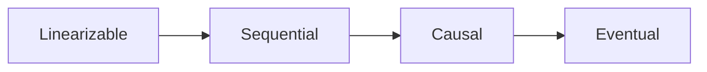
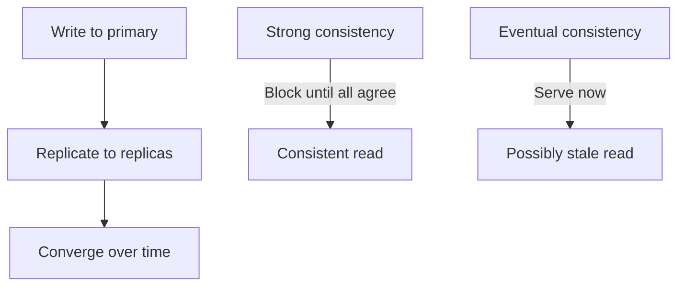
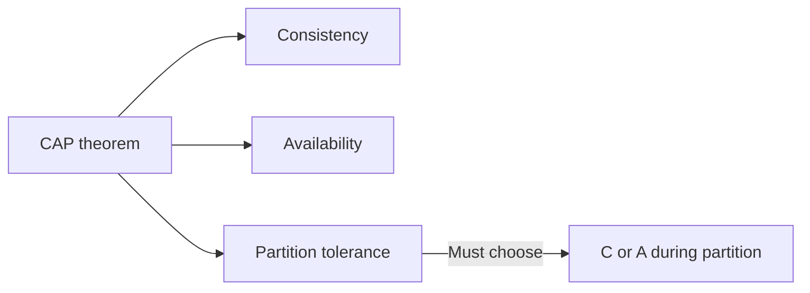
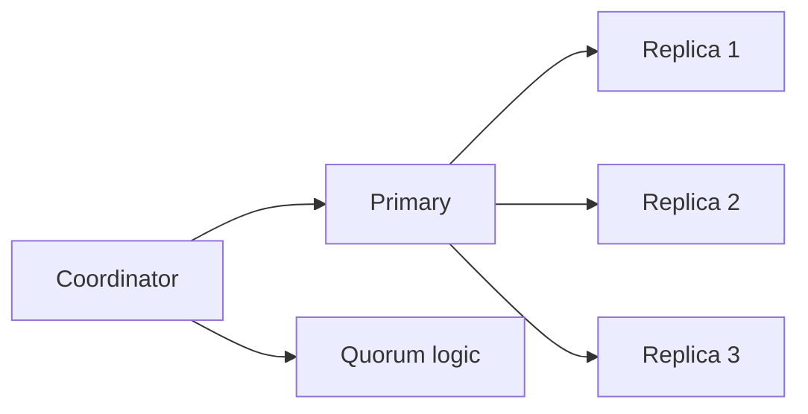

# Consistency

## Blogs and websites


## Medium

- [Strong Consistency vs Eventual Consistency](https://medium.com/@abhirup.acharya009/strong-consistency-vs-eventual-consistency-19ce6f87c112)


## Youtube


## Theory

### Topics Covered

1. [Introduction](#introduction)
2. [Consistency Models](#consistency-models)
3. [Strong vs Eventual Consistency](#strong-vs-eventual-consistency)
4. [CAP and PACELC](#cap-and-pacelc)
5. [Characteristics](#characteristics)
6. [Pros](#pros)
7. [Cons](#cons)
8. [Use Cases](#use-cases)
9. [Components](#components)
10. [Patterns](#patterns)
11. [Benefits](#benefits)
12. [Challenges](#challenges)
13. [Best Practices](#best-practices)
14. [When to Use](#when-to-use)
15. [Java and Spring Boot Examples](#java-and-spring-boot-examples)

---

### Introduction

In distributed systems, **consistency** refers to whether all nodes in the system see the same data at the same time. It's one of the most important (and most misunderstood) concepts in system design.

**The Core Problem:**
When data is replicated across multiple servers (for availability and performance), writes happen on one node first and must propagate to others. The question is: *how quickly must all nodes agree?*

```
Write: "user.name = Alice" → Node A (primary)
                              ↓ replication
                        Node B (replica) → still sees "Bob" for a brief moment

Strong Consistency:  Node B blocks reads until it has "Alice"
Eventual Consistency: Node B returns "Bob" now, "Alice" later (after replication)
```

**Why It Matters:**

- **Bank balance**: You must see the correct balance after a transfer → strong consistency.
- **Social media likes**: Seeing 999 vs 1000 for a few seconds is fine → eventual consistency.
- **Inventory count**: Can't oversell → strong consistency.
- **News feed order**: Slightly stale is OK → eventual consistency.

**The Trade-off (CAP / PACELC):**
You can't have perfect consistency AND perfect availability in a distributed system. Stronger consistency = higher latency and lower availability during network issues.

**Consistency Models Spectrum:**

```
Strongest ←————————————————————————————————→ Weakest

Linearizable → Sequential → Causal → Eventual
  (safest)                              (fastest)
```

- **Linearizable**: All operations appear instantaneous and ordered. Most expensive.
- **Sequential**: All nodes see operations in the same order (but not necessarily real-time).
- **Causal**: Causally related operations are seen in order; concurrent operations may differ.
- **Eventual**: Given enough time, all replicas converge. No ordering guarantees during propagation.



**Real-life use cases**

- **Banking transfers**: strong consistency prevents double spending.
- **Social media likes**: eventual consistency accepts minor staleness.
- **Inventory counts**: strong consistency prevents overselling.
- **News feeds**: eventual consistency allows slightly stale order.

**Interview questions and answers**

- **Q: What is consistency in distributed systems?**
  **A:** The guarantee that reads observe a coherent view of data across replicas.

- **Q: What is the strongest consistency model?**
  **A:** Linearizability, where every operation appears to take effect instantaneously at a single point in time.

- **Q: Why does stronger consistency increase latency?**
  **A:** Replicas must coordinate and agree before serving, adding synchronization overhead.

---

### Consistency Models

**Linearizability:**

- Operations appear to occur at a single instant.
- Every read reflects the latest acknowledged write.
- Hardest to implement and scale.

**Sequential consistency:**

- All nodes observe operations in the same order.
- Weaker than linearizability because the order may not match real time.

**Causal consistency:**

- Causally related operations appear in order.
- Concurrent operations may appear in different orders.

**Eventual consistency:**

- Replicas converge when writes stop.
- Reads may temporarily return stale data.

**Read-your-writes and monotonic reads:**

- **Read-your-writes**: a client sees its own writes.
- **Monotonic reads**: a client never sees older data after seeing newer data.



**Interview questions and answers**

- **Q: What is read-your-writes consistency?**
  **A:** A guarantee that a client always reads its own previous writes.

- **Q: How does causal consistency differ from sequential consistency?**
  **A:** Causal consistency orders only causally related operations; sequential consistency orders all operations in one order.

- **Q: Why is linearizability expensive?**
  **A:** It requires coordination and agreement across nodes on every operation, adding latency and reducing availability.

---

### Strong vs Eventual Consistency

**Quick Reference**

**Strong Consistency:**

- Read returns most recent write.
- All nodes see same data at same time.
- Higher latency.
- Example: SQL databases with synchronous replication.

**Eventual Consistency:**

- System becomes consistent over time.
- Temporary inconsistency allowed.
- Lower latency, higher availability.
- Example: DynamoDB, Cassandra.

**Consistency Levels (Cassandra example):**

- ONE: Any single node.
- QUORUM: Majority of nodes.
- ALL: All nodes.

| Level | Read/write nodes | Consistency | Availability |
|-------|------------------|-------------|--------------|
| **ONE** | One replica | Weak | High |
| **QUORUM** | Majority | Stronger | Balanced |
| **ALL** | All replicas | Strongest | Low |


**Interview questions and answers**

- **Q: What is a quorum?**
  **A:** A majority of replicas, used to ensure read and write sets overlap.

- **Q: Why does QUORUM provide stronger consistency than ONE?**
  **A:** Reading and writing a majority guarantees that at least one replica has the latest write.

- **Q: What is the downside of ALL?**
  **A:** It requires every replica to respond, so any single failure makes the operation unavailable.

---

### CAP and PACELC

CAP says a distributed system can provide only two of three guarantees during a network partition:

- **Consistency**: every read returns the latest write.
- **Availability**: every request receives a response.
- **Partition tolerance**: the system continues despite network partitions.

Since partition tolerance is effectively mandatory, the practical choice is consistency or availability during a partition.



**PACELC** extends this by noting that even without a partition, there is a trade-off between **latency** and **consistency**:

- **P**artition: choose A or C.
- **E**lse: choose L (latency) or C (consistency).

**Interview questions and answers**

- **Q: Why is partition tolerance not optional in practice?**
  **A:** Networks fail, so a distributed system must be designed to continue operating during partitions.

- **Q: What does PACELC add to CAP?**
  **A:** It recognizes the latency-consistency trade-off that exists even when no partition is present.

- **Q: What is a CP system?**
  **A:** A system that favors consistency over availability during a partition, such as Zookeeper or etcd.

---

### Characteristics

- **Replication-dependent**
  Consistency only matters when data is replicated.

- **Model-based**
  Guarantees range from linearizable to eventual.

- **Latency-coupled**
  Stronger consistency usually means higher latency.

- **Availability-coupled**
  Consistency and availability trade off during partitions.

- **Read/write visibility**
  Consistency defines what a read can observe.

- **Convergent**
  Eventual systems converge once writes stop.

- **Coordinated**
  Strong consistency requires agreement among replicas.

- **Configurable**
  Systems expose consistency levels and quorums.

- **Application-dependent**
  The right model depends on business requirements.

---

### Pros

- **Correctness**
  Strong consistency prevents anomalies.

- **Simplicity for developers**
  Linearizable reads behave like a single machine.

- **Predictability**
  Strong models give clear ordering guarantees.

- **Availability with eventual consistency**
  Reads succeed even during partitions.

- **Performance**
  Weaker models reduce coordination overhead.

- **Scalability**
  Eventual consistency scales across regions.

- **Flexibility**
  Configurable quorums tune the trade-off.

- **Fault tolerance**
  Replicas allow reads to continue despite failures.

---

### Cons

- **Latency**
  Strong consistency adds coordination cost.

- **Availability loss**
  CP systems may reject requests during partitions.

- **Complexity**
  Reasoning about weak consistency is difficult.

- **Stale reads**
  Eventual consistency can return outdated data.

- **Conflict resolution**
  Replicas may need merging or last-write-wins.

- **Developer bugs**
  Weak guarantees can cause subtle anomalies.

- **Operational overhead**
  Quorum and replica management require tuning.

- **Cross-region cost**
  Strong consistency across regions is expensive.

---

### Use Cases

- **Banking**
  Strong consistency for balances and transfers.

- **Inventory**
  Strong consistency to prevent overselling.

- **Social feeds**
  Eventual consistency for likes and comments.

- **Shopping carts**
  Causal or read-your-writes consistency.

- **Leaderboards**
  Eventual consistency with periodic recalculation.

- **Configuration**
  Strong consistency via CP systems like etcd.

- **Metrics**
  Eventual consistency for monitoring data.

- **Collaborative editing**
  Causal consistency for user edits.

---

### Components

- **Replica**
  A copy of the data.

- **Primary node**
  Coordinates writes.

- **Replica node**
  Serves reads and receives updates.

- **Quorum**
  The minimum set of replicas for an operation.

- **Version / timestamp**
  Tracks data versions for ordering.

- **Conflict resolver**
  Merges or selects among divergent values.

- **Consensus protocol**
  Coordinates agreement (Raft, Paxos).

- **Read/write coordinator**
  Routes operations to replicas.



---

### Patterns

- **Synchronous replication**
  Wait for all or a quorum before acknowledging.

- **Asynchronous replication**
  Acknowledge locally and propagate later.

- **Quorum reads and writes**
  Overlap read and write sets for stronger consistency.

- **Read-your-writes**
  Route reads to the node that handled the write.

- **Monotonic reads**
  Read from the same replica for a session.

- **Version vectors**
  Track causality across replicas.

- **Conflict-free replicated data types (CRDTs)**
  Merge concurrent updates deterministically.

- **Last-write-wins**
  Resolve conflicts by timestamp.

---

### Benefits

- **Correct business behavior**
  Strong consistency prevents invalid states.

- **High availability**
  Eventual consistency keeps reads available.

- **Performance**
  Weaker models lower latency.

- **Scalability**
  Replication and weak consistency scale reads.

- **Fault tolerance**
  Replicas survive node failures.

- **User experience**
  Read-your-writes avoids confusing stale reads.

- **Tunability**
  Quorums let teams choose the trade-off.

- **Global reach**
  Eventual consistency supports multi-region replication.

---

### Challenges

- **Choosing the right model**
  Requirements often blur the boundaries.

- **Handling conflicts**
  Concurrent writes need deterministic resolution.

- **Latency budgets**
  Strong consistency must fit performance goals.

- **Cross-region coordination**
  Consistency across regions is costly.

- **Testing weak consistency**
  Stale-read bugs are hard to reproduce.

- **Monitoring**
  Detecting divergence requires tracking lag.

- **Schema and versioning**
  Data versions must evolve carefully.

- **Developer education**
  Teams must understand the chosen guarantees.

---

### Best Practices

- **Match consistency to the use case**
  Do not force strong consistency where eventual is enough.

- **Use quorums deliberately**
  Balance consistency and availability.

- **Provide read-your-writes**
  Avoid confusing users with stale own writes.

- **Use version vectors or CRDTs**
  Resolve conflicts deterministically.

- **Replicate asynchronously for scale**
  Only synchronize when correctness requires it.

- **Monitor replication lag**
  Alert when replicas fall too far behind.

- **Test under partitions**
  Simulate network failures.

- **Document the consistency model**
  Make guarantees explicit to developers.

- **Isolate strongly consistent data**
  Keep critical state in a CP store.

- **Use consensus for coordination**
  Prefer Raft or Paxos over custom solutions.

---

### When to Use

- **Use strong consistency when** correctness is critical, such as balances or inventory.
- **Use eventual consistency when** staleness is acceptable and availability matters.
- **Use quorum consistency when** balancing availability and correctness.
- **Use read-your-writes when** users expect to see their own changes.
- **Use causal consistency when** related operations must be ordered.

**Avoid strong consistency when**

- The workload is read-heavy and tolerates staleness.
- Cross-region latency makes coordination impractical.
- Availability is more important than instantaneous correctness.

---

### Java and Spring Boot Examples

#### 1. Simulating a quorum decision

```java
import org.springframework.stereotype.Service;

import java.util.List;

@Service
public class QuorumService {

    private final int replicaCount;

    public QuorumService(int replicaCount) {
        this.replicaCount = replicaCount;
    }

    public int quorum() {
        return (replicaCount / 2) + 1;
    }

    public boolean isMajority(List<Boolean> successes) {
        long successful = successes.stream().filter(Boolean::booleanValue).count();
        return successful >= quorum();
    }
}
```

#### 2. Versioned value for eventual consistency

```java
public record VersionedValue(long version, String value) {

    public VersionedValue merge(VersionedValue other) {
        return version >= other.version() ? this : other;
    }
}
```

#### 3. Replica with last-write-wins

```java
import org.springframework.stereotype.Service;

import java.util.concurrent.atomic.AtomicReference;

@Service
public class LastWriteWinsStore {

    private final AtomicReference<VersionedValue> current = new AtomicReference<>();

    public void write(long version, String value) {
        current.accumulateAndGet(new VersionedValue(version, value), VersionedValue::merge);
    }

    public VersionedValue read() {
        return current.get();
    }
}
```

#### 4. Read-your-writes store

```java
import org.springframework.stereotype.Service;

import java.util.Map;
import java.util.concurrent.ConcurrentHashMap;

@Service
public class ReadYourWritesStore {

    private final Map<String, String> writes = new ConcurrentHashMap<>();

    public void write(String key, String value) {
        writes.put(key, value);
    }

    public String read(String key) {
        return writes.get(key);
    }
}
```

**Interview questions and answers**

- **Q: What is linearizability?**
  **A:** The strongest consistency model, where every operation appears to take effect instantaneously at one point in time.

- **Q: What is a quorum?**
  **A:** A majority of replicas, used to ensure read and write sets overlap for stronger consistency.

- **Q: Why do replicated systems eventually converge?**
  **A:** Replication eventually propagates all writes to all replicas, so their states become identical once writes stop.

- **Q: How does read-your-writes improve user experience?**
  **A:** It guarantees users see their own changes immediately, avoiding confusion from stale reads.
