# Consistent hashing

## Blogs and websites

- [Design Consistent Hashing](https://bytebytego.com/courses/system-design-interview/design-consistent-hashing)
- [Consistent Hashing Explained](https://bytebytego.com/guides/consistent-hashing/)

## Medium


## Youtube

- [Consistent Hashing - System Design](https://www.youtube.com/watch?v=IC5Y1EE-aj4)
- [6. Consistent Hashing in Hindi with Example | System Design - Consistent Hashing | High Level design](https://www.youtube.com/watch?v=jqUNbqfsnuw)

## Theory

### Topics Covered

This page is organized into the following topics. Each topic includes a detailed explanation, its characteristics, components, patterns, pros/benefits, cons/challenges, best practices, when to use it, a real-life use case, a diagram, a Java code example, and interview questions with answers.

1. [Understanding Hash Functions](#understanding-hash-functions)
2. [Normal Hashing (Modulo-Based Hashing)](#normal-hashing-modulo-based-hashing)
3. [The Rebalancing Problem in Depth](#the-rebalancing-problem-in-depth)
4. [Introduction to Consistent Hashing](#introduction-to-consistent-hashing)
5. [How Consistent Hashing Works: Step by Step](#how-consistent-hashing-works-step-by-step)
6. [Virtual Nodes (vNodes): Solving the Balance Problem](#virtual-nodes-vnodes-solving-the-balance-problem)
7. [Complete Implementation (Python, Java, Go)](#complete-implementation-python-java-go)
8. [Lookup Algorithm: Finding the Right Server](#lookup-algorithm-finding-the-right-server)
9. [Replication with Consistent Hashing](#replication-with-consistent-hashing)
10. [Bounded-Load Consistent Hashing](#bounded-load-consistent-hashing)
11. [Jump Consistent Hashing](#jump-consistent-hashing)
12. [Rendezvous Hashing (Highest Random Weight)](#rendezvous-hashing-highest-random-weight)
13. [Data Migration During Scaling](#data-migration-during-scaling)
14. [Handling Hotspots and Hot Keys](#handling-hotspots-and-hot-keys)
15. [Real-World Usage](#real-world-usage)
16. [Consistent Hashing vs. Other Partitioning Strategies](#consistent-hashing-vs-other-partitioning-strategies)
17. [Common Interview Questions](#common-interview-questions)
18. [Consistent Hashing: Characteristics, Pros, Cons, Use Cases, Components, Patterns, Benefits, Challenges, Best Practices and When to Use](#consistent-hashing-characteristics-pros-cons-use-cases-components-patterns-benefits-challenges-best-practices-and-when-to-use)

### Understanding Hash Functions

A **hash function** is a mathematical function that maps an input (of arbitrary size) to a fixed-size output, called a **hash** or **digest**. Hash functions are the foundation of data distribution in distributed systems.

**Properties of a Good Hash Function:**

| Property | Description |
|---|---|
| **Deterministic** | Same input always produces the same output |
| **Uniform Distribution** | Outputs are evenly spread across the output space |
| **Fast Computation** | Can be computed efficiently for any input |
| **Avalanche Effect** | A small change in input produces a drastically different output |
| **Minimized Collisions** | Different inputs rarely produce the same output |

**Common Hash Functions Used in Distributed Systems:**

| Hash Function | Output Size | Speed | Use Case |
|---|---|---|---|
| MD5 | 128-bit | Fast | Legacy caching (not cryptographically secure) |
| SHA-1 | 160-bit | Moderate | Git commit hashing |
| SHA-256 | 256-bit | Slower | Blockchain, security-critical |
| MurmurHash3 | 32/128-bit | Very Fast | General-purpose hashing in distributed systems |
| xxHash | 32/64/128-bit | Extremely Fast | High-throughput data processing |
| FNV-1a | 32/64-bit | Very Fast | Hash tables, simple lookups |
| CityHash | 64/128-bit | Very Fast | Google internal systems |
| SipHash | 64-bit | Fast | Hash table DoS prevention |

**Example — Hashing in Python:**

```python
import hashlib

def hash_key(key: str) -> int:
    """Hash a string key to an integer using SHA-256."""
    digest = hashlib.sha256(key.encode('utf-8')).hexdigest()
    return int(digest, 16)

# Example
print(hash_key("user:1001"))   # Large integer
print(hash_key("user:1002"))   # Completely different integer
print(hash_key("user:1001"))   # Same as first call — deterministic
```

```java
import java.security.MessageDigest;
import java.math.BigInteger;

public class HashExample {
    public static BigInteger hashKey(String key) throws Exception {
        MessageDigest md = MessageDigest.getInstance("SHA-256");
        byte[] digest = md.digest(key.getBytes("UTF-8"));
        return new BigInteger(1, digest);
    }

    public static void main(String[] args) throws Exception {
        System.out.println(hashKey("user:1001"));
        System.out.println(hashKey("user:1002"));
    }
}
```

#### Understanding Hash Functions: Characteristics

- **Deterministic mapping**: The same key always produces the same digest, on any machine, at any time. This is what allows two independent nodes to agree on where a key belongs without talking to each other.
- **Fixed-size output regardless of input size**: A one-byte key and a ten-megabyte payload both produce the same size digest (e.g., 256 bits for SHA-256), which makes hash values easy to store, compare, and place on a ring.
- **One-way (for cryptographic hashes)**: You cannot feasibly reconstruct the original key from the digest, which is irrelevant for load distribution but matters when the same hash function is reused for security-sensitive purposes.
- **Statistically uniform output**: A good hash function scatters similar inputs (`user:1001`, `user:1002`) to wildly different regions of the output space, which is the property that makes ring placement look "random" and therefore balanced.

#### Understanding Hash Functions: Components

- **Input normalizer**: Logic that converts a key (string, object, composite key) into a canonical byte sequence before hashing, so that `"user:1001"` and `user:1001` (if normalized) always hash identically.
- **Core hash algorithm**: The chosen function itself (MurmurHash3, xxHash, SHA-256, etc.), selected for its speed/uniformity/collision trade-offs.
- **Output reducer**: A step that folds the raw digest (which may be 128 or 256 bits) down into the numeric range used by the ring (e.g., `% 2^32`), since most ring implementations do not need the full cryptographic width.
- **Seed/salt (optional)**: An extra input mixed into the hash to generate multiple independent hash values from the same key, used heavily when generating virtual node identifiers.

#### Understanding Hash Functions: Patterns

- **Non-cryptographic hash for placement, cryptographic hash for security**: Distributed systems typically use fast non-cryptographic hashes (MurmurHash3, xxHash) for ring placement, and reserve slower cryptographic hashes (SHA-256) for scenarios where collision resistance against an adversary actually matters.
- **Hash-then-reduce**: Compute a wide hash once, then reduce it modulo the ring size, rather than re-hashing with a different algorithm for each purpose.
- **Multiple independent hashes from one key**: Append a suffix or seed (`key#0`, `key#1`, ...) and re-hash to cheaply derive several independent-looking values from a single key, a technique reused later for virtual nodes and Bloom filters alike.

#### Understanding Hash Functions: Pros / Benefits

- **Enables O(1) average-case placement decisions**: Once hashed, deciding "which bucket" is a simple arithmetic or lookup operation, no coordination with other nodes required.
- **Language- and platform-agnostic**: The same hash function (e.g., MurmurHash3) can be implemented in Python, Java, and Go and will produce identical results for identical byte inputs, which is essential when clients in different languages must agree on routing.
- **Cheap to compute at scale**: Modern non-cryptographic hash functions can process gigabytes per second, so hashing is never the bottleneck in a request path.

#### Understanding Hash Functions: Cons / Challenges

- **Choosing the wrong hash function hurts distribution quality**: A weak or poorly seeded hash function can cluster keys, defeating the uniformity assumption every downstream algorithm (ring placement, virtual nodes, load bounding) relies on.
- **Cryptographic hashes are needlessly slow for pure placement**: Using SHA-256 purely to pick a shard wastes CPU compared to MurmurHash3/xxHash, unless collision-resistance against a malicious key is also a requirement.
- **Cross-language consistency bugs**: Subtle differences in byte encoding (UTF-8 vs UTF-16, endianness) between client libraries in different languages can produce different hash values for what a developer intends to be "the same key."

#### Understanding Hash Functions: Best Practices

- Pick a non-cryptographic hash (MurmurHash3, xxHash) for pure data placement, and reserve cryptographic hashes for scenarios with an adversarial threat model.
- Always encode keys to a canonical byte representation (e.g., UTF-8) before hashing, and document that encoding so every client/language implementation agrees.
- Benchmark candidate hash functions against your actual key distribution (not just random strings) before committing to one in production.
- Avoid rolling your own hash function; use a well-tested, widely adopted library implementation.

#### Understanding Hash Functions: When to Use

- Use a fast non-cryptographic hash whenever the goal is purely to distribute keys across buckets/servers/shards (ring placement, virtual node generation, client-side sharding).
- Use a cryptographic hash when the hash also needs to resist adversarial manipulation (e.g., content-addressable storage, integrity verification, security tokens).
- Use SHA-256 (or similar) in interview and textbook examples for clarity and language portability, even though production systems usually prefer MurmurHash3/xxHash for raw speed.

#### Understanding Hash Functions: Diagram

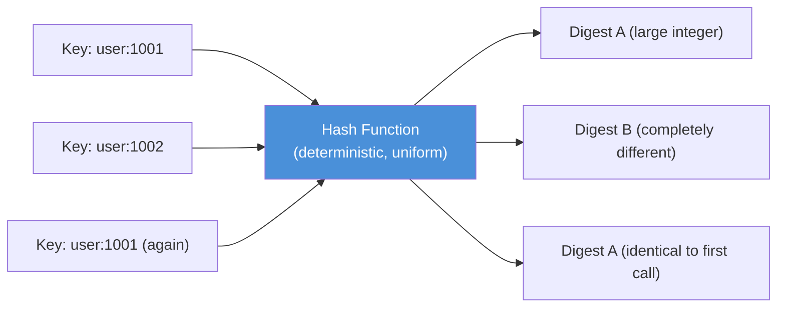

The diagram shows the two properties that make hashing usable for placement: the same input (`user:1001`) always yields the same digest (determinism), while a nearly identical input (`user:1002`) yields a wildly different digest (avalanche effect / uniform distribution).

#### Understanding Hash Functions: Real-Life Use Case

A CDN edge cache needs to decide, purely from a request URL, which one of thousands of cache nodes should hold a given object, without any central coordinator being consulted on every request. By hashing the URL with MurmurHash3, any edge location can independently compute the same digest for the same URL and therefore agree on the same target node, purely from local computation, which is exactly the property Akamai's original 1997 CDN design relied on.

#### Understanding Hash Functions: Interview Questions and Answers

**Q1. Why can't you just use a key's raw string value (or its default `hashCode()`/`hash()`) directly for distributed placement decisions?**
A: Language-default hash functions are often not guaranteed to be stable across process restarts, JVM versions, or different languages/platforms (for example, Java randomizes `String.hashCode()`-adjacent behaviors are not guaranteed cross-version, and Python randomizes `hash()` for strings by default via `PYTHONHASHSEED`). A distributed system needs a hash that is stable and identical across every node and every restart, which is why an explicit, documented hash function (MurmurHash3, SHA-256, etc.) is used instead.

**Q2. What is the "avalanche effect" and why does it matter for consistent hashing?**
A: The avalanche effect means a tiny change in input (even one character) produces a completely different, unrelated output. It matters because it guarantees that related keys (like `user:1001` and `user:1002`) do not cluster together on the ring, which keeps the distribution of keys across servers statistically uniform.

**Q3. Would a cryptographic hash function like SHA-256 be a poor choice for consistent hashing? Why or why not?**
A: It is a correct choice (many textbook implementations use it) but not the most performant one. SHA-256 is slower than non-cryptographic alternatives like MurmurHash3 or xxHash because it is designed to resist deliberate collision attacks, a property that is unnecessary overhead when the only goal is uniform load distribution rather than security.

**Q4. How many bits of hash output do you actually need for a consistent hash ring?**
A: Far fewer than a full SHA-256 digest. Most production ring implementations reduce the hash to 32 or 64 bits (e.g., `hash % 2^32`), because the ring's precision requirement is bounded by how many virtual nodes exist, not by cryptographic collision resistance.

---

### Normal Hashing (Modulo-Based Hashing)

**How it works:**

Given `N` servers numbered `0` to `N-1`, data is assigned using:

$$\text{Server Index} = \text{Hash}(\text{key}) \mod N$$

**Example with 3 servers:**

```
Hash("key-A") = 1234567  →  1234567 % 3 = 0  →  Server 0
Hash("key-B") = 2345678  →  2345678 % 3 = 2  →  Server 2
Hash("key-C") = 3456789  →  3456789 % 3 = 0  →  Server 0
Hash("key-D") = 4567890  →  4567890 % 3 = 0  →  Server 0
Hash("key-E") = 5678901  →  5678901 % 3 = 0  →  Server 0
```

**Diagram — Modulo-Based Hashing:**

```
                    ┌─────────────┐
                    │ Hash(key)   │
                    │   mod N     │
                    └──────┬──────┘
                           │
              ┌────────────┼────────────┐
              │            │            │
              ▼            ▼            ▼
        ┌──────────┐ ┌──────────┐ ┌──────────┐
        │ Server 0 │ │ Server 1 │ │ Server 2 │
        │ key-A    │ │          │ │ key-B    │
        │ key-C    │ │          │ │          │
        │ key-D    │ │          │ │          │
        └──────────┘ └──────────┘ └──────────┘
```

**What happens when we add Server 3 (N becomes 4)?**

```
Hash("key-A") = 1234567  →  1234567 % 4 = 3  →  Server 3  ← MOVED from Server 0!
Hash("key-B") = 2345678  →  2345678 % 4 = 2  →  Server 2  ← Same
Hash("key-C") = 3456789  →  3456789 % 4 = 1  →  Server 1  ← MOVED from Server 0!
Hash("key-D") = 4567890  →  4567890 % 4 = 2  →  Server 2  ← MOVED from Server 0!
Hash("key-E") = 5678901  →  5678901 % 4 = 1  →  Server 1  ← MOVED from Server 0!
```

**4 out of 5 keys moved!** That's 80% remapping. In general, with modulo hashing, when `N` changes to `N+1`, approximately $\frac{N}{N+1}$ of all keys must be reassigned.

**Challenges of Modulo-Based Hashing:**

| Problem | Impact |
|---|---|
| **Massive remapping** | ~80-95% of keys move when adding/removing a server |
| **Cache stampede** | All cache misses hit the database simultaneously |
| **Downtime risk** | Requires coordinated rebalancing across all nodes |
| **Not elastic** | Adding/removing servers is extremely expensive |
| **Thundering herd** | Simultaneous cache rebuilds can overwhelm backends |

#### Normal Hashing: Characteristics

- **Purely arithmetic placement**: `hash(key) mod N` requires no metadata beyond the current server count, making it the simplest possible partitioning scheme to implement.
- **O(1) lookup**: Finding a key's server is a single hash and modulo operation, with no ring traversal or binary search required.
- **Tightly coupled to the exact value of N**: The formula's output is a direct function of the total server count, so changing `N` changes the mapping for the large majority of keys, not just a few.
- **No inherent replication or virtual node concept**: Unlike consistent hashing, plain modulo hashing has no built-in mechanism for weighting servers differently or spreading a server's load across multiple ring positions.

#### Normal Hashing: Components

- **Hash function**: Converts the key into a numeric value (see the previous topic).
- **Server count register (N)**: A single shared number that every client/node must know and agree on; the entire scheme becomes invalid the instant this number changes without everyone updating simultaneously.
- **Modulo operator**: The final step that reduces the hash to one of `N` buckets.

#### Normal Hashing: Patterns

- **Static shard count over-provisioning**: Some systems avoid the resizing problem entirely by fixing `N` to a large number of logical shards up front (e.g., 4096 shards mapped onto a smaller number of physical servers), effectively decoupling "add a server" from "change N."
- **Coordinated global rebalance**: When resizing is unavoidable, all clients switch to the new `N` simultaneously (often via a version flag or epoch number) to avoid a split-brain situation where some clients use the old `N` and others use the new one.

#### Normal Hashing: Pros / Benefits

- **Trivial to implement and reason about**: A single line of code (`hash(key) % N`) is enough, with no ring data structure, no binary search, and no virtual node bookkeeping.
- **Perfectly even distribution by construction**: Given a uniform hash function, every one of the `N` buckets receives almost exactly `1/N` of the keys, with no need for virtual nodes to smooth things out.
- **Fastest possible lookup**: There is no data structure to traverse, just arithmetic, which matters in extremely latency-sensitive hot paths.

#### Normal Hashing: Cons / Challenges

- **Catastrophic remapping on resize**: As shown above, adding or removing even a single server invalidates the placement of the large majority of existing keys, see the table below.
- **Cache stampede risk**: Because so many keys move at once, a resize event can turn nearly every cache lookup into a miss simultaneously, hammering the backing database or origin.
- **Not viable for elastic/auto-scaling infrastructure**: Any system that expects to add or remove capacity regularly (which is the norm in cloud environments) cannot tolerate this remapping cost.
- **No natural support for heterogeneous server capacity**: There is no simple way to give a bigger server more than its `1/N` share without changing the formula entirely.

#### Normal Hashing: Best Practices

- Only use plain modulo hashing when the server count is truly fixed for the lifetime of the system (e.g., a small, rarely-changed on-premise cluster).
- If you must resize occasionally, prefer resizing to a pre-planned large `N` (a power of two, or over-provisioned shard count) during a maintenance window with full coordination, rather than doing it live.
- Prefer consistent hashing (see the next topics) for any system expected to scale elastically.

#### Normal Hashing: When to Use

- Small, fixed-size clusters where the server count essentially never changes (e.g., a hardcoded set of 3 on-premise database shards).
- Non-distributed contexts, such as an in-process hash table, where "resizing" simply means rehashing all in-memory entries at once, which is cheap because there is no network cost or cold-cache penalty.
- Any situation where simplicity and raw lookup speed outweigh elasticity concerns.

#### Normal Hashing: Real-Life Use Case

A legacy on-premise system with exactly 4 fixed database shards (no plans to ever add a 5th) uses `hash(customer_id) % 4` to route every query to the correct shard. Because the shard count is contractually fixed by the hardware purchased for the data center's lifetime, the 75-95% remapping cost of modulo hashing never becomes a problem, since `N` never changes in practice. This is precisely the scenario where the simplicity of modulo hashing outweighs its known scaling weakness.

#### Normal Hashing: Java Code Example

```java
import java.util.List;

// Simple modulo-based hashing: a single arithmetic operation, but every key's
// server assignment depends directly on N, the current server count.
public class ModuloHashRouter {

    private final List<String> servers;

    public ModuloHashRouter(List<String> servers) {
        this.servers = servers;
    }

    public String getServer(String key) {
        int hash = Math.abs(key.hashCode());
        int index = hash % servers.size();
        return servers.get(index);
    }

    public static void main(String[] args) {
        List<String> threeServers = List.of("server-0", "server-1", "server-2");
        ModuloHashRouter router3 = new ModuloHashRouter(threeServers);

        String[] keys = {"key-A", "key-B", "key-C", "key-D", "key-E"};
        System.out.println("--- With 3 servers ---");
        for (String key : keys) {
            System.out.println(key + " -> " + router3.getServer(key));
        }

        // Now grow to 4 servers and observe how many keys move.
        List<String> fourServers = List.of("server-0", "server-1", "server-2", "server-3");
        ModuloHashRouter router4 = new ModuloHashRouter(fourServers);

        System.out.println("--- With 4 servers ---");
        int moved = 0;
        for (String key : keys) {
            String before = router3.getServer(key);
            String after = router4.getServer(key);
            boolean didMove = !before.equals(after);
            if (didMove) moved++;
            System.out.println(key + " -> " + after + (didMove ? "  (MOVED)" : "  (same)"));
        }
        System.out.printf("%nKeys moved after adding one server: %d/%d%n", moved, keys.length);
    }
}
```

#### Normal Hashing: Interview Questions and Answers

**Q1. What is wrong with `hash(key) % N` as a sharding strategy in a system that auto-scales?**
A: Every time `N` changes (a server is added or removed), the formula's output changes for the large majority of keys, since the modulo is taken against a different divisor. This forces almost all cached or sharded data to move at once, which is prohibitively expensive for systems that scale elastically.

**Q2. Mathematically, what fraction of keys move when going from N to N+1 servers with modulo hashing?**
A: Approximately $\frac{N}{N+1}$ of all keys move. For example, with 10 servers growing to 11, about $\frac{10}{11} \approx 91\%$ of keys are remapped, which is why the impact gets worse (not better) as the cluster grows.

**Q3. If modulo hashing gives perfectly even distribution, why not just always use it?**
A: Even distribution is only guaranteed while `N` stays fixed. The moment `N` changes, the perfectly even new distribution is achieved only after paying an enormous, one-time remapping cost that consistent hashing is specifically designed to avoid.

**Q4. Is there any way to make modulo hashing tolerate scaling better?**
A: Yes, partially: pre-allocate a large, fixed number of logical shards (e.g., 1024) mapped onto a smaller number of physical servers, and only change the physical-server-to-shard mapping (not the shard count itself) when scaling. This is a common workaround, but it still requires manual, coordinated shard reassignment and does not have consistent hashing's automatic ~1/N property.

---

### The Rebalancing Problem in Depth

**Rebalancing** is the process of redistributing data (keys) across servers when the set of servers changes. It is the fundamental problem that consistent hashing solves.

**Quantifying the Cost of Rebalancing:**

For `K` keys and `N` servers with modulo hashing:

- **Adding 1 server:** ~$K \times \frac{N}{N+1}$ keys move
- **Removing 1 server:** ~$K \times \frac{N-1}{N}$ keys move

| Servers (N) | Keys (K) | Keys Moved (Add 1 Server) | % Moved |
|---|---|---|---|
| 3 | 1,000,000 | ~750,000 | 75% |
| 10 | 1,000,000 | ~909,091 | 90.9% |
| 100 | 1,000,000 | ~990,099 | 99% |
| 1000 | 1,000,000 | ~999,001 | 99.9% |

The more servers you have, the worse it gets! This is catastrophic for large-scale distributed systems.

**Real-World Impact of Rebalancing:**

```
Timeline of a Naive Rebalancing Event:

T=0s    Server added to cluster
        │
T=0.1s  ┌─────────────────────────────────────┐
        │  90% of cache lookups now miss       │
        │  All misses hit the database         │
        └──────────────┬──────────────────────┘
                       │
T=0.5s  ┌─────────────────────────────────────┐
        │  Database CPU spikes to 100%         │
        │  Query latencies jump from 5ms→500ms │
        └──────────────┬──────────────────────┘
                       │
T=2s    ┌─────────────────────────────────────┐
        │  Database connection pool exhausted  │
        │  Requests start timing out           │
        └──────────────┬──────────────────────┘
                       │
T=5s    ┌─────────────────────────────────────┐
        │  Cascading failure across services   │
        │  OUTAGE                              │
        └─────────────────────────────────────┘
```

**Ideal Rebalancing:**

With consistent hashing, only $\frac{K}{N}$ keys move (where K = total keys, N = total servers). For 1M keys and 10 servers, that's ~100,000 keys instead of ~909,091.

#### The Rebalancing Problem: Characteristics

- **A resize-triggered event, not a steady-state cost**: Rebalancing cost is paid only at the moment servers are added or removed; it is irrelevant to normal steady-state read/write traffic.
- **Proportional to remapping percentage, not absolute key count alone**: The pain of rebalancing scales with the *fraction* of keys that move, which is why the percentage (not just the raw count) is the number engineers watch.
- **Cascades beyond the cache layer**: A cache rebalancing event does not stay contained; every miss becomes a database read, so the "blast radius" of a bad rebalance spans caches, databases, and connection pools simultaneously.
- **Worse at larger scale, not better**: Counterintuitively, the percentage of keys remapped under modulo hashing increases as the cluster grows, meaning the problem gets worse exactly when the system is most successful and heavily used.

#### The Rebalancing Problem: Components

- **Trigger**: The scaling event itself (auto-scaler adding a node, an operator removing a failed node, planned capacity change).
- **Remapping calculation**: The logic (modulo arithmetic, ring lookup) that determines the new owner for every key.
- **Cache/database boundary**: The layer that absorbs the fallout, every remapped key is effectively a forced cache miss until it is repopulated on its new owner.
- **Backpressure mechanisms**: Connection pools, rate limiters, and circuit breakers that determine whether the backend survives the resulting traffic spike or cascades into an outage.

#### The Rebalancing Problem: Patterns

- **Gradual/staggered rollout**: Instead of remapping the entire cluster instantly, some systems add capacity gradually and let a small fraction of traffic shift at a time, smoothing the spike.
- **Warm-up before cutover**: Pre-populate the new server's cache (by replaying recent traffic or copying data) before routing live traffic to it, so its first requests are not all misses.
- **Circuit breaking around the database**: Protect the backing store with request coalescing or circuit breakers so a rebalancing-induced miss storm degrades gracefully instead of cascading into a full outage.

#### The Rebalancing Problem: Pros / Benefits

There is no upside to the rebalancing *problem* itself, understanding it is what motivates and justifies every technique in the remaining topics on this page (virtual nodes, bounded load, replication, and so on). The "benefit" is diagnostic: quantifying this cost is what makes the case for consistent hashing self-evident to stakeholders who might otherwise resist the added implementation complexity.

#### The Rebalancing Problem: Cons / Challenges

- **Thundering herd on the database**: A sudden wave of cache misses can multiply into thousands of simultaneous identical queries hitting the same backend rows.
- **Latency cliff for end users**: Request latencies can jump by two orders of magnitude (5ms to 500ms) within seconds of a scaling event, directly visible to users.
- **Connection pool exhaustion**: The backing database's connection pool, sized for steady-state load, can be exhausted almost instantly by the miss storm, causing unrelated requests to time out too.
- **Hard to test in staging**: Rebalancing storms are a function of production-scale traffic and data volume, which are difficult to faithfully reproduce in a smaller staging environment.

#### The Rebalancing Problem: Best Practices

- Measure and alert on cache hit-rate drops immediately after any scaling event, so a rebalancing storm is caught within seconds, not discovered via a user-facing outage.
- Use consistent hashing (rather than modulo hashing) for any system where the server count is expected to change.
- Pre-warm new nodes before routing production traffic to them wherever the workload allows it.
- Rate-limit or coalesce duplicate concurrent cache-miss requests for the same key (a technique often called "request coalescing" or a "singleflight" pattern) to avoid multiplying database load.

#### The Rebalancing Problem: When to Use (This Analysis)

- Run this cost analysis before choosing a partitioning strategy for any system that will scale its server count over time, including caches, sharded databases, and consistent-hash-routed load balancers.
- Revisit the analysis whenever cluster size or key volume grows by an order of magnitude, since the percentage of keys remapped under modulo hashing gets strictly worse as `N` increases.

#### The Rebalancing Problem: Diagram

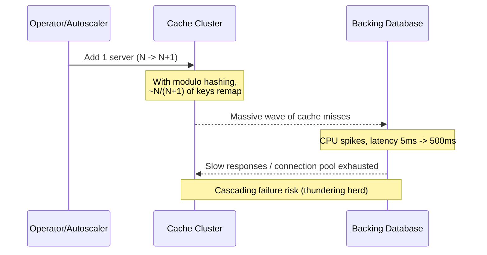

#### The Rebalancing Problem: Real-Life Use Case

A social media platform's session-cache cluster (10 nodes, modulo hashing, ~50 million sessions) added an 11th node during a routine capacity expansion. Because ~91% of session keys remapped instantly, nearly all session lookups became cache misses within the same second, and the backing session database, sized for a 5-8% steady-state miss rate, saw a roughly 10x spike in query volume. The resulting latency spike triggered upstream service timeouts and a partial outage, an incident that was the direct motivator for migrating the cluster to consistent hashing with virtual nodes.

#### The Rebalancing Problem: Java Code Example

```java
// Quantifies the rebalancing cost of modulo hashing vs. the ideal (1/N) cost
// of consistent hashing, for a given key count and server count.
public class RebalancingCostCalculator {

    public static double moduloRemapFractionOnAdd(int currentServers) {
        // Fraction of keys that move when growing from N to N+1 servers.
        return (double) currentServers / (currentServers + 1);
    }

    public static double consistentHashRemapFractionOnAdd(int currentServers) {
        // Ideal fraction of keys that move with consistent hashing: ~1/(N+1).
        return 1.0 / (currentServers + 1);
    }

    public static void main(String[] args) {
        long totalKeys = 1_000_000L;
        int[] serverCounts = {3, 10, 100, 1000};

        System.out.println("N\tModulo Moved\tConsistent-Hash Moved");
        for (int n : serverCounts) {
            long moduloMoved = Math.round(totalKeys * moduloRemapFractionOnAdd(n));
            long chMoved = Math.round(totalKeys * consistentHashRemapFractionOnAdd(n));
            System.out.printf("%d\t~%,d\t\t~%,d%n", n, moduloMoved, chMoved);
        }
    }
}
```

#### The Rebalancing Problem: Interview Questions and Answers

**Q1. Why does adding capacity to fix a performance problem sometimes make things temporarily worse?**
A: If the system uses modulo-based hashing, adding a server changes `N` and invalidates the placement of the vast majority of existing keys. The very act of adding capacity triggers a massive, instantaneous cache-miss storm that can overwhelm the backend before the additional capacity ever gets to help.

**Q2. How would you detect a rebalancing-induced incident versus an unrelated database problem?**
A: Correlate the timing of a cache hit-rate drop with the timing of any recent scaling event (node added/removed). A sudden, cluster-wide hit-rate collapse that coincides with a scaling operation is the signature of a rebalancing storm, as opposed to a gradual degradation, which would point to a different root cause (e.g., a slow query or resource leak).

**Q3. What single architectural change most directly fixes the rebalancing problem described here?**
A: Switching from modulo hashing to consistent hashing (ideally with virtual nodes), which bounds the fraction of keys remapped on a resize to approximately $\frac{1}{N}$ instead of $\frac{N}{N+1}$.

---

### Introduction to Consistent Hashing

**Consistent hashing** was introduced by **David Karger et al. in 1997** in their paper *"Consistent Hashing and Random Trees: Distributed Caching Protocols for Relieving Hot Spots on the World Wide Web"*.

The core idea: instead of using `hash(key) mod N`, place both **servers** and **keys** on a circular hash space (a **ring**), and each key is served by the nearest server in the clockwise direction.

**Key Properties:**

| Property | Description |
|---|---|
| **Minimal Disruption** | Adding/removing a server only reassigns ~$\frac{1}{N}$ of total keys |
| **Monotonicity** | When new servers are added, keys only move from existing servers to the new one — never between existing servers |
| **Balance** | With virtual nodes, keys are approximately evenly distributed |
| **Spread** | A given key is not stored on too many different servers across views |
| **Load** | No server is responsible for too many keys |
| **Smoothness** | As servers are added, the load shifts smoothly with minimal disruption |

**Mathematical Guarantee:**

When adding a server to a ring with `N` existing servers:

$$\text{Expected keys moved} = \frac{K}{N+1}$$

where `K` is the total number of keys. Compare this with modulo hashing where $\frac{K \times N}{N+1}$ keys move.

**Comparison:**

| Metric | Modulo Hashing | Consistent Hashing |
|---|---|---|
| Keys remapped on add/remove | ~$\frac{N}{N+1} \times K$ | ~$\frac{K}{N+1}$ |
| With 10 servers, 1M keys | ~909K moved | ~91K moved |
| With 100 servers, 1M keys | ~990K moved | ~10K moved |
| Complexity to find server | O(1) | O(log N) with binary search |
| Even distribution guarantee | Yes (by design) | Needs virtual nodes |

#### Introduction to Consistent Hashing: Characteristics

- **Ring-based, not divisor-based**: Placement depends on *position* on a circular space relative to neighboring servers, not on the total server count, which is exactly what decouples resizing from mass remapping.
- **Locality of change**: Adding or removing a server only affects the narrow arc of the ring between it and its immediate neighbor, every other arc (and the keys in it) is untouched.
- **A family of properties, not one property**: Karger's original paper defines consistent hashing via four formal guarantees (balance, monotonicity, spread, load), each targeting a different failure mode of naive partitioning.
- **Requires an ordered, comparable hash space**: Because "clockwise nearest" must be well defined, the algorithm needs a hash function whose output can be sorted and searched (a simple integer range works well).

#### Introduction to Consistent Hashing: Components

- **The ring (hash space)**: A conceptual circular numeric range, typically `[0, 2^32 - 1]`, that wraps from the maximum value back to zero.
- **Server hash positions**: Each physical server contributes one or more positions on the ring, computed by hashing its identifier (IP, hostname).
- **Key hash positions**: Each key is likewise hashed onto the same ring.
- **Clockwise-nearest resolver**: The lookup logic (in practice, a sorted list plus binary search) that finds the next server position at or after a key's position.

#### Introduction to Consistent Hashing: Patterns

- **Ownership-by-arc**: Each server "owns" the arc of the ring stretching counter-clockwise from its position back to the previous server's position; this is the mental model behind both single-node lookups and range-based data migration.
- **Monotonic growth**: Adding servers should only ever move keys *from* existing servers *to* the new server, never reshuffle keys between two servers that were both already present, this monotonicity is what keeps resizing cheap and predictable.
- **Ring plus virtual nodes** (detailed in a later topic): The base ring idea is almost always paired with virtual nodes in production to fix the balance problem that a small number of physical servers creates.

#### Introduction to Consistent Hashing: Pros / Benefits

- **Only ~1/N of keys move on a resize**, versus ~N/(N+1) for modulo hashing, a difference that becomes enormous at scale (10x-100x fewer keys moved for typical cluster sizes).
- **Supports elastic, incremental scaling**: Because the disruption is proportional and localized, servers can be added or removed routinely (even automatically, via an autoscaler) without a scheduled maintenance window.
- **Naturally supports heterogeneous and replicated topologies**: The same ring concept extends cleanly to weighted virtual nodes and to walking clockwise for N-way replication (both covered in later topics).

#### Introduction to Consistent Hashing: Cons / Challenges

- **O(log N) lookup instead of O(1)**: Finding the right server requires a binary search over sorted ring positions, technically slower than modulo's single arithmetic operation, though still fast in absolute terms.
- **Uneven distribution without virtual nodes**: A small number of physical servers hashed directly onto the ring can land unevenly, requiring the virtual-node technique covered in a later topic.
- **More complex to implement and operate**: The ring data structure, virtual node bookkeeping, and clockwise-lookup logic are meaningfully more code and more operational surface area than a single modulo operation.

#### Introduction to Consistent Hashing: Best Practices

- Always pair the base ring algorithm with virtual nodes in production; the raw algorithm alone rarely gives acceptable balance with realistic server counts.
- Use a well-tested hash function and confirm it produces a wide, evenly distributed range before relying on it for ring placement.
- Expose ring state (server positions, current owned ranges) via monitoring so operators can see the actual load distribution, not just assume it is even.

#### Introduction to Consistent Hashing: When to Use

- Any system where the set of servers is expected to change over time, caches, sharded datastores, load balancers, CDN routing, distributed hash tables.
- Systems that need graceful, incremental scaling (auto-scaling groups, elastic clusters) rather than scheduled, all-at-once resizing events.
- Anywhere the cost of the rebalancing problem (previous topic) has been identified as unacceptable for the business.

#### Introduction to Consistent Hashing: Diagram

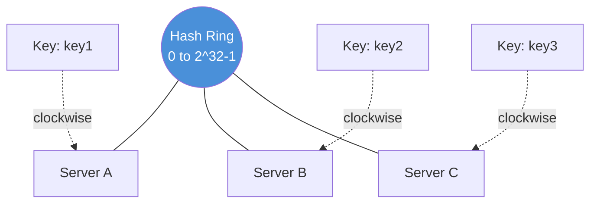

Each key is placed on the same ring as the servers and resolved to whichever server position is nearest in the clockwise direction, the core mechanism explored step-by-step in the next topic.

#### Introduction to Consistent Hashing: Real-Life Use Case

Amazon's DynamoDB (and the Dynamo paper it is based on) uses consistent hashing so that storage nodes can be added or removed from a running cluster, during routine capacity changes or hardware failures, without a full data reshuffle. Because only the arc of the ring adjacent to the changed node is affected, DynamoDB can rebalance a live, multi-petabyte cluster incrementally, in the background, with no downtime and no coordinated "stop the world" migration step.

#### Introduction to Consistent Hashing: Java Code Example

```java
import java.util.TreeMap;

// A minimal consistent hash ring (no virtual nodes yet) to illustrate the
// core concept: place servers and keys on the same ring, then resolve to
// the next server clockwise using a sorted map's ceiling lookup.
public class BasicConsistentHashRing {

    private final TreeMap<Integer, String> ring = new TreeMap<>();

    private int hash(String value) {
        return Math.abs(value.hashCode());
    }

    public void addServer(String server) {
        ring.put(hash(server), server);
    }

    public String getServer(String key) {
        if (ring.isEmpty()) return null;
        int hash = hash(key);
        var entry = ring.ceilingEntry(hash); // next server clockwise
        if (entry == null) {
            entry = ring.firstEntry(); // wrap around
        }
        return entry.getValue();
    }

    public static void main(String[] args) {
        BasicConsistentHashRing ring = new BasicConsistentHashRing();
        ring.addServer("Server-A");
        ring.addServer("Server-B");
        ring.addServer("Server-C");

        for (String key : new String[]{"key1", "key2", "key3", "key4"}) {
            System.out.println(key + " -> " + ring.getServer(key));
        }
    }
}
```

#### Introduction to Consistent Hashing: Interview Questions and Answers

**Q1. In one sentence, what problem does consistent hashing solve that modulo hashing does not?**
A: It bounds the number of keys that must move when the server count changes to approximately `1/N` of all keys, instead of the ~`N/(N+1)` fraction that modulo hashing remaps.

**Q2. What are the four formal properties Karger's paper defines for a good consistent hashing scheme?**
A: Balance (keys spread roughly evenly across servers), Monotonicity (adding a server only moves keys to it, never between existing servers), Spread (a key is not mapped to too many different servers across different cluster views), and Load (no single server is assigned a disproportionate number of keys).

**Q3. Why is the lookup complexity O(log N) instead of O(1) like modulo hashing?**
A: Because finding "the next server clockwise" requires searching a sorted set of ring positions (typically via binary search), rather than a single arithmetic modulo operation.

**Q4. Does consistent hashing guarantee even distribution on its own?**
A: No. With only a handful of physical servers hashed directly onto the ring, distribution can be quite uneven purely by chance; even distribution requires the virtual-node technique (covered in a later topic) to statistically smooth out the placement.

---

### How Consistent Hashing Works: Step by Step

**Step 1: Create the Hash Ring**

Map the hash output space to a circular ring. If using a hash function with output range `[0, 2^32 - 1]`, the ring has positions from `0` to `2^32 - 1`, where position `2^32` wraps around to position `0`.

```
                        0
                    ┌───●───┐
                   /         \
                  /           \
          2^30  ●              ● 2^30 × 3
                 \            /
                  \          /
                   \        /
                    └───●──┘
                      2^31
```

**Step 2: Place Servers on the Ring**

Hash each server's identifier (IP address, hostname, etc.) to determine its position on the ring.

```
Hash("Server-A") = 15    →  Position 15 on ring
Hash("Server-B") = 45    →  Position 45 on ring
Hash("Server-C") = 80    →  Position 80 on ring
```

```
                     0
                 ┌───────┐
                /    15    \
               /   ●(S-A)  \
              │              │
         80 ● │              │ ● 45
          (S-C)              (S-B)
              │              │
               \            /
                \          /
                 └────────┘
```

**Step 3: Assign Keys to Servers**

Each key is hashed and placed on the ring. It is then assigned to the **first server encountered moving clockwise** from its position.

```
Hash("key1") = 10  →  Next server clockwise = Server-A (15)  ✓
Hash("key2") = 20  →  Next server clockwise = Server-B (45)  ✓
Hash("key3") = 50  →  Next server clockwise = Server-C (80)  ✓
Hash("key4") = 85  →  Next server clockwise = Server-A (15)  ✓ (wraps around!)
Hash("key5") = 42  →  Next server clockwise = Server-B (45)  ✓
```

```
                       0
                  ┌──────────┐
                 / 10(key1)   \
                /  ↓           \
               / 15●(S-A)      \
              │   20(key2)→     │
        85 ○──┤   ↓             │
       (key4) │              45●(S-B)
              │   42(key5)→  ↗  │
         80●──┤  (S-C)         │
        (S-C) │↗                │
               \ 50(key3)      /
                \             /
                 └───────────┘

    Assignments:
    ┌─────────┬──────────┬──────────────────────┐
    │ Key     │ Position │ Assigned To           │
    ├─────────┼──────────┼──────────────────────┤
    │ key1    │ 10       │ Server-A (pos 15)     │
    │ key2    │ 20       │ Server-B (pos 45)     │
    │ key5    │ 42       │ Server-B (pos 45)     │
    │ key3    │ 50       │ Server-C (pos 80)     │
    │ key4    │ 85       │ Server-A (pos 15)     │
    └─────────┴──────────┴──────────────────────┘
```

**Step 4: Adding a New Server**

When `Server-D` is added at position `30`, only the keys between `Server-A (15)` and `Server-D (30)` need to move.

```
Before:                              After:
key2(20) → Server-B(45)             key2(20) → Server-D(30) ← MOVED
key5(42) → Server-B(45)             key5(42) → Server-B(45) ← Same

Only key2 moves! (from Server-B to Server-D)
All other keys stay exactly where they are.
```

```
                       0
                  ┌──────────┐
                 / 10(key1)   \
                /  ↓           \
               / 15●(S-A)      \
              │   20(key2)      │
              │   ↓             │
              │  30●(S-D) ←NEW  │
              │                 │
              │   42(key5)→  45●(S-B)
         80●──┤                 │
        (S-C) │                 │
               \ 50(key3)      /
                \   85(key4)  /
                 └───────────┘
```

**Step 5: Removing a Server**

When `Server-B (45)` is removed, only the keys assigned to `Server-B` need to be reassigned to the next server clockwise.

```
key2(20) was on Server-B → Now goes to Server-C(80)
key5(42) was on Server-B → Now goes to Server-C(80)

All other keys remain untouched!
```

#### How Consistent Hashing Works: Characteristics

- **Five discrete steps, always in the same order**: build the ring, place servers, place keys, and only then handle add/remove events; every consistent hashing implementation follows this same sequence conceptually, even when virtual nodes are layered on top.
- **"Clockwise nearest" is the single resolution rule**: every lookup, insert, and removal operation reduces to the same primitive: find the next server position at or after a given hash value.
- **Wrap-around is a first-class case, not an edge case**: any key hashing to a position past the last server on the ring must wrap back to the first server, this is exercised constantly in practice, not a rare corner case.
- **Add/remove operations are local, not global**: only the two ring positions adjacent to the changed server are affected, which is the mechanism (not just the outcome) that gives consistent hashing its ~1/N property.

#### How Consistent Hashing Works: Components

- **Sorted ring position list**: The core data structure, typically a sorted array, tree map, or skip list, that supports fast "next position clockwise" queries.
- **Server-to-position map**: A reverse index from ring positions back to the physical (or virtual) server they represent.
- **Add/remove handlers**: The logic that inserts or deletes ring positions and identifies exactly which key range is affected.
- **Wrap-around handler**: Special-case logic that treats the ring as circular rather than linear when a lookup or insertion passes the maximum position.

#### How Consistent Hashing Works: Patterns

- **Binary search over a sorted structure**: The standard implementation pattern, sort ring positions once, then binary-search (or use a balanced tree's ceiling operation) for lookups.
- **Range-delta computation on topology change**: Rather than recomputing every key's owner from scratch, compute only the delta range affected by the specific add/remove operation.
- **Idempotent replay for migration**: Because only a narrow range of keys is affected, migrating them can be done by simply re-running the standard "get owner for key" resolution for keys known to fall in the affected range.

#### How Consistent Hashing Works: Pros / Benefits

- **Predictable, explainable behavior**: The five-step model above is simple enough to reason about by hand, which makes it easy to verify correctness and debug production issues.
- **Minimal, localized blast radius on change**: As shown in Steps 4 and 5, only one or two keys move in a small example, and this locality holds at any scale.
- **Composable with replication and virtual nodes**: The same "clockwise nearest" primitive extends naturally to "next N distinct clockwise" for replication and to weighted virtual node placement.

#### How Consistent Hashing Works: Cons / Challenges

- **Manual walkthroughs do not reveal balance problems**: A small illustrative example (3-4 servers, 5 keys) can look perfectly reasonable while hiding the fact that a handful of physical positions are, in general, poorly balanced (addressed by virtual nodes in the next topic).
- **Naive removal recomputation can be wasteful**: A poor implementation might recompute ownership for every key on any topology change instead of only the affected range, negating the core benefit.
- **Requires careful concurrency control**: In a live system, ring updates (add/remove) must be synchronized against concurrent lookups to avoid returning a stale or inconsistent server for a key mid-update.

#### How Consistent Hashing Works: Best Practices

- Implement ring lookups with a proper sorted data structure and binary search (or a language's built-in sorted map), not a linear scan, to keep lookup cost logarithmic.
- When adding or removing a server, explicitly compute and log the affected key range so operators can observe exactly how much data needs to move.
- Guard ring mutation (add/remove) with appropriate locking or copy-on-write semantics so concurrent reads never observe a half-updated ring.

#### How Consistent Hashing Works: When to Use

- Use this exact algorithm as the mechanical foundation any time you need clockwise-nearest resolution, whether for plain server routing, virtual node routing, or replica selection.
- Walk through this five-step model when onboarding new engineers to a consistent-hashing-based system, it is the clearest way to build an accurate mental model before introducing virtual nodes and replication.

#### How Consistent Hashing Works: Real-Life Use Case

When an on-call engineer needs to manually verify why a specific cache key is being served by an unexpected node, they can walk through exactly these five steps: hash the key, hash the current set of server ring positions, and find the next position clockwise. This manual trace is commonly used during incident response for consistent-hash-routed caches (e.g., a Memcached client library) to confirm whether a routing bug or a genuine topology change (a server recently added/removed) explains the unexpected placement.

#### How Consistent Hashing Works: Java Code Example

```java
import java.util.TreeMap;

// Demonstrates the five steps explicitly: build ring, place servers, place
// keys, add a server, remove a server, printing the assignment at each stage.
public class ConsistentHashingWalkthrough {

    public static void main(String[] args) {
        TreeMap<Integer, String> ring = new TreeMap<>();

        // Step 2: place servers
        ring.put(15, "Server-A");
        ring.put(45, "Server-B");
        ring.put(80, "Server-C");

        // Step 3: assign keys
        int[] keyPositions = {10, 20, 50, 85, 42};
        String[] keyNames = {"key1", "key2", "key3", "key4", "key5"};
        System.out.println("--- Initial assignment ---");
        for (int i = 0; i < keyPositions.length; i++) {
            System.out.println(keyNames[i] + " -> " + resolve(ring, keyPositions[i]));
        }

        // Step 4: add Server-D at position 30
        ring.put(30, "Server-D");
        System.out.println("\n--- After adding Server-D(30) ---");
        for (int i = 0; i < keyPositions.length; i++) {
            System.out.println(keyNames[i] + " -> " + resolve(ring, keyPositions[i]));
        }

        // Step 5: remove Server-B
        ring.remove(45);
        System.out.println("\n--- After removing Server-B ---");
        for (int i = 0; i < keyPositions.length; i++) {
            System.out.println(keyNames[i] + " -> " + resolve(ring, keyPositions[i]));
        }
    }

    private static String resolve(TreeMap<Integer, String> ring, int keyPosition) {
        var entry = ring.ceilingEntry(keyPosition); // next clockwise
        if (entry == null) {
            entry = ring.firstEntry(); // wrap around
        }
        return entry.getValue();
    }
}
```

#### How Consistent Hashing Works: Interview Questions and Answers

**Q1. Walk through, step by step, how a key gets assigned to a server in consistent hashing.**
A: First hash every server identifier onto the ring. Then hash the key onto the same ring. Finally, search clockwise from the key's position for the first server position encountered (wrapping around to position 0 if you pass the maximum ring value); that server owns the key.

**Q2. In the example ring (Server-A=15, Server-B=45, Server-C=80), why does key4 at position 85 map to Server-A rather than "no server"?**
A: Because the ring is circular. Once you pass the highest position on the ring (here, Server-C at 80), the search wraps back around to position 0 and continues, so it correctly lands on Server-A at position 15, the first server encountered after wrapping.

**Q3. When Server-D is added at position 30, why does only key2 move and not key1, key3, key4, or key5?**
A: Only keys whose clockwise-nearest server changes as a result of the insertion are affected. Server-D sits between Server-A (15) and Server-B (45); key2 (at 20) previously resolved to Server-B but now resolves to the closer Server-D. Keys with positions outside that narrow arc (key1, key3, key4, key5) still resolve to the same server as before.

**Q4. When Server-B is removed, why do key2 and key5 both move to Server-C rather than Server-A?**
A: Because "next clockwise" is computed relative to the current ring state; once Server-B's position (45) is removed, the next surviving server clockwise from both key2 (20) and key5 (42) is Server-C at position 80, not Server-A at position 15, which is not the next position in the clockwise direction from either key.

---

### Virtual Nodes (vNodes): Solving the Balance Problem

**The Problem Without Virtual Nodes:**

With only physical nodes on the ring, the distribution of keys can be extremely uneven, especially with a small number of servers.

```
Unbalanced Ring (3 servers, poor hash placement):

                     0
                ┌────────┐
               /  ●S-A(5) \
              /   ●S-B(10) \
             │               │
             │               │
             │               │
              \             /
               \ ●S-C(350)/
                └────────┘

  Server-A handles: positions 351-5    = ~15 positions (1.5%)
  Server-B handles: positions 6-10     = ~5 positions  (0.5%)
  Server-C handles: positions 11-350   = ~340 positions (98%)
  
  ⚠️ Server-C is massively overloaded!
```

**The Solution — Virtual Nodes:**

Instead of placing each server at a single point on the ring, place it at **multiple points** using different hash functions or suffixes.

```
Physical Server → Multiple Virtual Nodes:

Server-A → Hash("Server-A#1") = 15
            Hash("Server-A#2") = 120
            Hash("Server-A#3") = 250

Server-B → Hash("Server-B#1") = 45
            Hash("Server-B#2") = 180
            Hash("Server-B#3") = 310

Server-C → Hash("Server-C#1") = 80
            Hash("Server-C#2") = 210
            Hash("Server-C#3") = 350
```

```
Ring with Virtual Nodes (3 servers × 3 vnodes each = 9 points):

                         0
                    ┌────────┐
                   / A1(15)   \
                  /  B1(45)    \
                 / C1(80)       \
                │ A2(120)        │
                │  B2(180)       │
                │   C2(210)      │
                 \ A3(250)      /
                  \ B3(310)    /
                   \ C3(350)  /
                    └────────┘

  Now each server handles ~33% of the ring!
  Much more balanced distribution.
```

**Impact of Virtual Node Count on Balance:**

| Virtual Nodes per Server | Standard Deviation of Load | Balance Quality |
|---|---|---|
| 1 | ~77% | Very Poor |
| 10 | ~25% | Poor |
| 50 | ~11% | Acceptable |
| 100 | ~7% | Good |
| 150 | ~6% | Very Good |
| 200+ | ~5% | Excellent |

**Trade-offs of Virtual Nodes:**

| Advantage | Disadvantage |
|---|---|
| Better load balance | More memory to store ring positions |
| Smoother scaling | Slightly higher lookup time (more points to search) |
| Handles heterogeneous hardware | More complex implementation |
| Finer-grained rebalancing | Ring metadata becomes larger |

**Weighted Virtual Nodes for Heterogeneous Hardware:**

Different servers can have different numbers of virtual nodes based on their capacity:

```
Server-A (16 GB RAM, 8 cores)  → 200 virtual nodes
Server-B (8 GB RAM, 4 cores)   → 100 virtual nodes  
Server-C (32 GB RAM, 16 cores) → 400 virtual nodes

Server-C handles ~4x the load of Server-B — matching its capacity!
```

#### Virtual Nodes: Characteristics

- **Statistical smoothing via the law of large numbers**: A single ring position per server is essentially one random sample of "how much arc do I own," which can easily be far from average; hundreds of independent samples (virtual nodes) per server average out to something very close to the true 1/N share.
- **Purely a client-side/routing-layer concept**: Virtual nodes exist only in the ring's metadata, they require no changes to the underlying physical servers themselves, which is why the technique can be adopted without touching server software.
- **Naturally supports non-uniform weighting**: Because load is proportional to the number of virtual nodes assigned, giving a bigger server more virtual nodes directly and proportionally gives it more traffic, without any special-case logic.
- **Trades memory and lookup cost for balance quality**: More virtual nodes always improves balance, but every additional virtual node is another entry in the ring's sorted structure, so the trade-off is tunable, not free.

#### Virtual Nodes: Components

- **Virtual node ID scheme**: The naming convention (`Server-A#1`, `Server-A#vnode0`, etc.) used to derive multiple distinct hash inputs from one physical server identifier.
- **Weight/capacity map**: A per-server multiplier (e.g., "200 vnodes" vs "100 vnodes") reflecting relative hardware capacity, used to decide how many virtual node IDs to generate for each server.
- **Enlarged ring structure**: The same sorted-position data structure as the base algorithm, just holding `N x V` entries instead of `N`.
- **Reverse virtual-to-physical map**: A lookup from any virtual node ID back to its owning physical server, needed so that lookups return an actual server, not a virtual node label.

#### Virtual Nodes: Patterns

- **Fixed virtual-node-count-per-server**: The simplest pattern, every server gets the same count (e.g., 150), appropriate when hardware is homogeneous.
- **Weighted virtual-node-count-per-server**: Assign virtual node counts proportional to measured or provisioned capacity (CPU, RAM, disk), used for heterogeneous fleets.
- **Suffix-based virtual node generation**: Derive each virtual node's hash input by appending an incrementing suffix or index to the physical server ID, and re-hashing, rather than maintaining a separately stored list of positions.

#### Virtual Nodes: Pros / Benefits

- **Dramatically better load balance**: Standard deviation of load drops from ~77% with 1 vnode to ~5-7% with 150-200 vnodes per server, transforming a theoretically-even but practically-uneven scheme into one that is even in practice too.
- **Elegant heterogeneous hardware support**: Bigger machines simply get proportionally more virtual nodes, no special-case code path is needed to handle mixed hardware.
- **Finer-grained rebalancing on topology change**: Because each physical server's share of the ring is spread across many small arcs rather than one large arc, adding/removing a server moves many small, evenly-sized chunks of data instead of one large chunk, smoothing the migration traffic pattern.

#### Virtual Nodes: Cons / Challenges

- **More memory for ring metadata**: A cluster of 100 servers with 150 virtual nodes each maintains 15,000 ring entries instead of 100, a real (though usually acceptable) memory cost.
- **Slightly slower lookups**: Binary search over 15,000 entries versus 100 entries is still fast (roughly 14 comparisons versus 7) but is a measurable, non-zero increase.
- **More complex bookkeeping on add/remove**: Adding or removing a physical server now means inserting or deleting all of its virtual node entries (and recomputing/rebuilding any pre-sorted array), not just one entry.
- **Choosing the "right" virtual node count is a tuning problem**: Too few virtual nodes leaves meaningful imbalance; too many wastes memory and lookup time for diminishing balance improvement.

#### Virtual Nodes: Best Practices

- Default to 100-200 virtual nodes per server for small-to-medium clusters (3-50 physical servers); this is the range most production systems (Cassandra, Riak) settle on.
- Scale virtual node count down somewhat for very large clusters (50+ physical servers), since the physical server count itself starts contributing meaningfully to balance.
- Derive virtual node hash inputs deterministically from the physical server ID plus an index (`server-id#0`, `server-id#1`, ...) so the full set of virtual node positions can always be recomputed without persisting them separately.
- Assign virtual node counts proportional to real, measured server capacity when hardware is heterogeneous, and re-tune periodically as hardware is replaced or upgraded.

#### Virtual Nodes: When to Use

- Use virtual nodes in essentially every production consistent-hashing deployment; the base ring algorithm without them is rarely acceptable outside of teaching examples.
- Increase the virtual node count specifically when observed load standard deviation across servers exceeds your operational tolerance (commonly ~10%).
- Use weighted virtual node counts whenever the server fleet is heterogeneous (different CPU/RAM/disk tiers) rather than trying to solve capacity differences at the application layer.

#### Virtual Nodes: Diagram

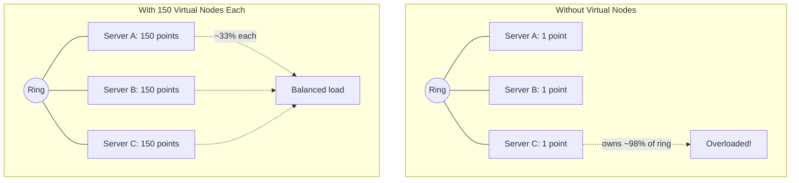

#### Virtual Nodes: Real-Life Use Case

Apache Cassandra assigns each physical node 256 virtual nodes (called "vnodes") by default (configurable via `num_tokens`). This lets a heterogeneous cluster, where new nodes are often more powerful than nodes purchased years earlier, balance load proportionally by giving newer, beefier nodes a higher `num_tokens` value, while also making it possible to add or remove a single physical node and have its data redistribute across many existing nodes in small, parallel chunks rather than as one enormous bulk transfer to/from a single neighbor.

#### Virtual Nodes: Java Code Example

```java
import java.util.HashMap;
import java.util.Map;
import java.util.TreeMap;

// Demonstrates weighted virtual nodes: a bigger server gets more ring
// positions, and therefore proportionally more of the key space.
public class WeightedVirtualNodeRing {

    private final TreeMap<Integer, String> ring = new TreeMap<>();
    private final Map<String, Integer> vnodeCountByServer = new HashMap<>();

    private int hash(String value) {
        return Math.abs(value.hashCode());
    }

    public void addServer(String server, int virtualNodeCount) {
        vnodeCountByServer.put(server, virtualNodeCount);
        for (int i = 0; i < virtualNodeCount; i++) {
            ring.put(hash(server + "#vnode" + i), server);
        }
    }

    public String getServer(String key) {
        if (ring.isEmpty()) return null;
        var entry = ring.ceilingEntry(hash(key));
        return (entry != null ? entry : ring.firstEntry()).getValue();
    }

    public static void main(String[] args) {
        WeightedVirtualNodeRing ring = new WeightedVirtualNodeRing();
        ring.addServer("Server-A-16GB", 200);
        ring.addServer("Server-B-8GB", 100);
        ring.addServer("Server-C-32GB", 400);

        Map<String, Integer> distribution = new HashMap<>();
        for (int i = 0; i < 10_000; i++) {
            String server = ring.getServer("user:" + i);
            distribution.merge(server, 1, Integer::sum);
        }

        distribution.forEach((server, count) ->
                System.out.printf("%s: %d keys (%.1f%%)%n", server, count, count / 100.0));
    }
}
```

#### Virtual Nodes: Interview Questions and Answers

**Q1. Why does a ring with only one position per physical server tend to be unbalanced?**
A: With only one hash sample per server, the arc each server owns is a single random draw from the hash space, and random draws are not guaranteed to be equal-sized; by chance, one server can easily end up owning a much larger (or smaller) arc than the others. This is a small-sample-size problem, not a flaw in the hash function itself.

**Q2. Why does increasing the number of virtual nodes per server improve balance, and is there a point of diminishing returns?**
A: Each additional virtual node is another independent random sample of arc size for that server; by the law of large numbers, averaging more samples converges toward the true expected share (1/N). Diminishing returns kick in around 100-200 virtual nodes per server, going from ~7% standard deviation at 100 to ~5% at 200+ is a much smaller improvement than going from ~77% at 1 to ~25% at 10.

**Q3. How do virtual nodes help with heterogeneous hardware in a cluster?**
A: Because a server's share of ring positions is directly proportional to its share of total load, giving a more powerful server more virtual nodes (e.g., 400 instead of 100) proportionally increases the fraction of keys/traffic it receives, letting capacity allocation track hardware capability without any special-case routing logic.

**Q4. What is the operational cost of adding virtual nodes, and how would you choose a count in practice?**
A: Each virtual node is an additional entry in the ring's sorted data structure, costing memory and marginally increasing lookup time (more entries to binary search over) and marginally increasing the cost of add/remove operations (more entries to insert/delete). In practice, teams pick a count (often 100-256) that pushes load standard deviation below an acceptable threshold (commonly under ~10%), then monitor real traffic distribution and adjust rather than guessing analytically.

---

### Complete Implementation (Python, Java, Go)

This topic brings together every concept covered so far (hashing, the ring, virtual nodes, add/remove) into full, runnable reference implementations in three languages, so the theory above can be verified and reused directly.

#### Complete Implementation: Characteristics

- **Production-shaped, not just illustrative**: Unlike the minimal ring shown earlier, these implementations include virtual nodes, node add/remove, and distribution reporting, the same building blocks a real client library needs.
- **Language-portable design**: The same conceptual data structures (a sorted map/tree of hash positions, a set of known physical nodes) are expressed idiomatically in Python (`bisect` + dict), Java (`TreeMap`), and Go (sorted slice + `sort.Search`), showing that the algorithm is not tied to any one language's data structures.
- **Thread-safety is explicit where it matters**: The Go implementation demonstrates a `sync.RWMutex` guarding ring mutations, a detail that is easy to omit in a first pass but essential for any implementation used concurrently.

#### Complete Implementation: Components

- **Ring storage**: A sorted structure mapping hash value to owning physical node (Python `dict` + separately maintained sorted key list, Java `TreeMap`, Go `map` + sorted slice).
- **Virtual node generator**: The loop that, for each physical node, derives `num_virtual_nodes` distinct hash inputs (`node#vnode0`, `node#vnode1`, ...).
- **Add/remove node operations**: Logic to insert or delete all virtual node entries for a physical node, keeping the sorted structure consistent afterward.
- **Lookup (`get_node`/`getNode`/`GetNode`)**: Binary search (or sorted map ceiling/ceilingEntry) for the next position clockwise, with wrap-around handling.
- **Distribution reporting**: A helper that hashes a batch of sample keys and tallies per-node counts, used to empirically verify balance.

#### Complete Implementation: Patterns

- **Encapsulate the ring behind a small, focused class/struct**: `ConsistentHashRing` in Python, `ConsistentHashRing<T>` in Java, and `Ring` in Go, all expose the same minimal interface (`addNode`, `removeNode`, `getNode`), hiding the ring data structure entirely from callers.
- **Derive virtual node hash inputs deterministically**: All three implementations use a `node + "#vnode" + index` naming scheme so virtual node positions never need to be stored or transmitted separately, they can always be recomputed.
- **Measure, don't assume, balance**: Every implementation includes a distribution/reporting helper specifically so balance claims can be checked against real sample data rather than taken on faith.

#### Complete Implementation: Pros / Benefits

- **Directly reusable**: These are close to what you would actually ship in a client library, not simplified teaching snippets that would need a rewrite before production use.
- **Cross-verifiable**: Because the same conceptual algorithm is implemented three times, you can cross-check that a given key set produces a similar (not necessarily identical, due to different underlying hash functions) distribution in each language.
- **Demonstrates the full lifecycle**: Construction, node addition, node removal, and lookup are all present, covering the operations a real deployment actually performs over its lifetime.

#### Complete Implementation: Cons / Challenges

- **Removal by linear scan in the Python example**: The `remove_node` method iterates the entire ring to find matching entries, which is O(ring size); a production implementation might instead recompute virtual node hashes directly (as `add_node` does) to avoid the scan.
- **Go's removal rebuilds the entire sorted slice**: `RemoveNode` reconstructs `sortedKeys` from scratch, which is correct but not the most efficient approach for very large rings with frequent topology changes; an ordered-map-like structure would avoid the full rebuild.
- **No persistence layer shown**: These implementations are in-memory only; a real deployment typically also needs to persist ring state (or make it derivable from a service registry) so it survives process restarts.

#### Complete Implementation: Best Practices

- Keep the ring class/struct's public interface small (`addNode`, `removeNode`, `getNode`, and optionally `getReplicas`), and keep all ring-internal data structures private, exactly as done here.
- Prefer computing virtual node hashes on the fly from a naming convention over persisting a separate list of positions, reducing the chance of the stored list drifting out of sync with the actual node set.
- Add a distribution/reporting helper (as shown) to every implementation so imbalance can be detected empirically in tests and in production dashboards, not just assumed from theory.
- Guard concurrent mutation of the ring (as the Go example does with `sync.RWMutex`) in any implementation that will be accessed from multiple threads/goroutines.

#### Complete Implementation: When to Use

- Use the Python version as a reference implementation for prototyping, testing hash distribution assumptions, or embedding in a Python-based service.
- Use the Java version when integrating into a JVM-based service (Spring Boot, etc.) that needs client-side consistent hashing, for example a custom Memcached or Redis client-side sharding layer.
- Use the Go version when building a highly concurrent routing/proxy layer (a load balancer, API gateway, or custom caching proxy) where the `sync.RWMutex`-guarded ring supports safe concurrent lookups from many goroutines.

#### Complete Implementation: Diagram

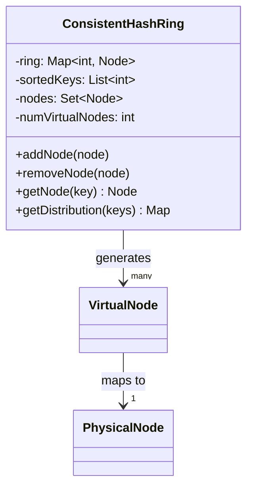

**Python Implementation:**

```python
import hashlib
from bisect import bisect_right, insort
from collections import defaultdict
from typing import Optional


class ConsistentHashRing:
    """
    A consistent hash ring implementation with virtual nodes.

    Each physical node is mapped to multiple virtual nodes on the ring
    to ensure even distribution of keys.
    """

    def __init__(self, num_virtual_nodes: int = 150):
        self.num_virtual_nodes = num_virtual_nodes
        self.ring: dict[int, str] = {}       # hash_value → physical_node
        self.sorted_keys: list[int] = []     # sorted hash positions
        self.nodes: set[str] = set()         # physical nodes

    def _hash(self, key: str) -> int:
        """Generate a consistent hash for a key using SHA-256."""
        digest = hashlib.sha256(key.encode('utf-8')).hexdigest()
        return int(digest, 16) % (2**32)

    def add_node(self, node: str) -> list[str]:
        """
        Add a physical node to the ring with virtual nodes.
        Returns list of keys that would need to be migrated (conceptual).
        """
        if node in self.nodes:
            return []

        self.nodes.add(node)

        for i in range(self.num_virtual_nodes):
            virtual_key = f"{node}#vnode{i}"
            hash_val = self._hash(virtual_key)
            self.ring[hash_val] = node
            insort(self.sorted_keys, hash_val)

        return []

    def remove_node(self, node: str) -> None:
        """Remove a physical node and all its virtual nodes from the ring."""
        if node not in self.nodes:
            return

        self.nodes.discard(node)

        keys_to_remove = []
        for hash_val, mapped_node in self.ring.items():
            if mapped_node == node:
                keys_to_remove.append(hash_val)

        for key in keys_to_remove:
            del self.ring[key]
            self.sorted_keys.remove(key)

    def get_node(self, key: str) -> Optional[str]:
        """
        Find the server responsible for a given key.

        The key is hashed and the first server found clockwise
        on the ring is returned.
        """
        if not self.sorted_keys:
            return None

        hash_val = self._hash(key)

        # Binary search for the first server clockwise
        idx = bisect_right(self.sorted_keys, hash_val)

        # Wrap around to the beginning of the ring
        if idx == len(self.sorted_keys):
            idx = 0

        return self.ring[self.sorted_keys[idx]]

    def get_distribution(self, keys: list[str]) -> dict[str, int]:
        """Show how keys are distributed across nodes."""
        distribution: dict[str, int] = defaultdict(int)
        for key in keys:
            node = self.get_node(key)
            if node:
                distribution[node] += 1
        return dict(distribution)


# --- Demo ---
if __name__ == "__main__":
    ring = ConsistentHashRing(num_virtual_nodes=150)

    # Add servers
    ring.add_node("server-1")
    ring.add_node("server-2")
    ring.add_node("server-3")

    # Generate sample keys
    keys = [f"user:{i}" for i in range(10000)]

    # Check distribution
    dist = ring.get_distribution(keys)
    print("Distribution with 3 servers:")
    for node, count in sorted(dist.items()):
        print(f"  {node}: {count} keys ({count/100:.1f}%)")

    # Lookup specific keys
    print(f"\n'session:abc' → {ring.get_node('session:abc')}")
    print(f"'session:xyz' → {ring.get_node('session:xyz')}")

    # Add a new server — minimal redistribution
    print("\n--- Adding server-4 ---")
    ring.add_node("server-4")
    new_dist = ring.get_distribution(keys)
    print("Distribution with 4 servers:")
    for node, count in sorted(new_dist.items()):
        print(f"  {node}: {count} keys ({count/100:.1f}%)")

    # Count how many keys actually moved
    moved = 0
    for key in keys:
        old = None
        # Simulate: remove server-4, check old assignment
        ring_temp = ConsistentHashRing(num_virtual_nodes=150)
        ring_temp.add_node("server-1")
        ring_temp.add_node("server-2")
        ring_temp.add_node("server-3")
        old = ring_temp.get_node(key)
        new = ring.get_node(key)
        if old != new:
            moved += 1
    print(f"\nKeys moved after adding server-4: {moved}/{len(keys)} ({moved/100:.1f}%)")
```

**Java Implementation:**

```java
import java.security.MessageDigest;
import java.security.NoSuchAlgorithmException;
import java.nio.charset.StandardCharsets;
import java.util.*;

public class ConsistentHashRing<T> {

    private final int numVirtualNodes;
    private final TreeMap<Long, T> ring = new TreeMap<>();
    private final Set<T> physicalNodes = new HashSet<>();

    public ConsistentHashRing(int numVirtualNodes) {
        this.numVirtualNodes = numVirtualNodes;
    }

    private long hash(String key) {
        try {
            MessageDigest md = MessageDigest.getInstance("SHA-256");
            byte[] digest = md.digest(key.getBytes(StandardCharsets.UTF_8));
            // Use first 8 bytes for a long hash
            long h = 0;
            for (int i = 0; i < 8; i++) {
                h = (h << 8) | (digest[i] & 0xFF);
            }
            return h & Long.MAX_VALUE; // Ensure positive
        } catch (NoSuchAlgorithmException e) {
            throw new RuntimeException(e);
        }
    }

    /**
     * Add a physical node with its virtual nodes to the ring.
     */
    public void addNode(T node) {
        if (physicalNodes.contains(node)) return;
        physicalNodes.add(node);
        for (int i = 0; i < numVirtualNodes; i++) {
            long hashVal = hash(node.toString() + "#vnode" + i);
            ring.put(hashVal, node);
        }
    }

    /**
     * Remove a physical node and all its virtual nodes.
     */
    public void removeNode(T node) {
        if (!physicalNodes.contains(node)) return;
        physicalNodes.remove(node);
        for (int i = 0; i < numVirtualNodes; i++) {
            long hashVal = hash(node.toString() + "#vnode" + i);
            ring.remove(hashVal);
        }
    }

    /**
     * Find the server responsible for a given key.
     * Uses ceiling entry for O(log N) clockwise lookup.
     */
    public T getNode(String key) {
        if (ring.isEmpty()) return null;

        long hashVal = hash(key);

        // Find the first node clockwise (>=) on the ring
        Map.Entry<Long, T> entry = ring.ceilingEntry(hashVal);

        // Wrap around if we've gone past the highest point
        if (entry == null) {
            entry = ring.firstEntry();
        }

        return entry.getValue();
    }

    /**
     * Get distribution of keys across nodes.
     */
    public Map<T, Integer> getDistribution(List<String> keys) {
        Map<T, Integer> dist = new HashMap<>();
        for (String key : keys) {
            T node = getNode(key);
            dist.merge(node, 1, Integer::sum);
        }
        return dist;
    }

    public int getRingSize() {
        return ring.size();
    }

    public static void main(String[] args) {
        ConsistentHashRing<String> ring = new ConsistentHashRing<>(150);

        ring.addNode("server-1");
        ring.addNode("server-2");
        ring.addNode("server-3");

        List<String> keys = new ArrayList<>();
        for (int i = 0; i < 10000; i++) {
            keys.add("user:" + i);
        }

        Map<String, Integer> dist = ring.getDistribution(keys);
        System.out.println("Distribution with 3 servers:");
        dist.entrySet().stream()
            .sorted(Map.Entry.comparingByKey())
            .forEach(e -> System.out.printf("  %s: %d keys (%.1f%%)%n",
                e.getKey(), e.getValue(), e.getValue() / 100.0));

        System.out.println("\nLookup 'session:abc' → " + ring.getNode("session:abc"));

        ring.addNode("server-4");
        Map<String, Integer> newDist = ring.getDistribution(keys);
        System.out.println("\nDistribution with 4 servers:");
        newDist.entrySet().stream()
            .sorted(Map.Entry.comparingByKey())
            .forEach(e -> System.out.printf("  %s: %d keys (%.1f%%)%n",
                e.getKey(), e.getValue(), e.getValue() / 100.0));
    }
}
```

**Go Implementation:**

```go
package consistenthash

import (
	"crypto/sha256"
	"encoding/binary"
	"fmt"
	"sort"
	"sync"
)

// Ring represents a consistent hash ring with virtual nodes.
type Ring struct {
	mu              sync.RWMutex
	numVirtualNodes int
	ring            map[uint32]string // hash → physical node
	sortedKeys      []uint32          // sorted hash positions
	nodes           map[string]bool   // physical nodes
}

// New creates a consistent hash ring with the given number of virtual nodes.
func New(numVirtualNodes int) *Ring {
	return &Ring{
		numVirtualNodes: numVirtualNodes,
		ring:            make(map[uint32]string),
		nodes:           make(map[string]bool),
	}
}

func (r *Ring) hash(key string) uint32 {
	h := sha256.Sum256([]byte(key))
	return binary.BigEndian.Uint32(h[:4])
}

// AddNode adds a physical node with virtual nodes to the ring.
func (r *Ring) AddNode(node string) {
	r.mu.Lock()
	defer r.mu.Unlock()

	if r.nodes[node] {
		return
	}
	r.nodes[node] = true

	for i := 0; i < r.numVirtualNodes; i++ {
		vKey := fmt.Sprintf("%s#vnode%d", node, i)
		h := r.hash(vKey)
		r.ring[h] = node
		r.sortedKeys = append(r.sortedKeys, h)
	}

	sort.Slice(r.sortedKeys, func(i, j int) bool {
		return r.sortedKeys[i] < r.sortedKeys[j]
	})
}

// RemoveNode removes a physical node and all its virtual nodes.
func (r *Ring) RemoveNode(node string) {
	r.mu.Lock()
	defer r.mu.Unlock()

	if !r.nodes[node] {
		return
	}
	delete(r.nodes, node)

	for i := 0; i < r.numVirtualNodes; i++ {
		vKey := fmt.Sprintf("%s#vnode%d", node, i)
		h := r.hash(vKey)
		delete(r.ring, h)
	}

	// Rebuild sorted keys
	r.sortedKeys = r.sortedKeys[:0]
	for h := range r.ring {
		r.sortedKeys = append(r.sortedKeys, h)
	}
	sort.Slice(r.sortedKeys, func(i, j int) bool {
		return r.sortedKeys[i] < r.sortedKeys[j]
	})
}

// GetNode finds the server responsible for a given key using binary search.
func (r *Ring) GetNode(key string) string {
	r.mu.RLock()
	defer r.mu.RUnlock()

	if len(r.sortedKeys) == 0 {
		return ""
	}

	h := r.hash(key)

	// Binary search for the first position >= h
	idx := sort.Search(len(r.sortedKeys), func(i int) bool {
		return r.sortedKeys[i] >= h
	})

	// Wrap around
	if idx == len(r.sortedKeys) {
		idx = 0
	}

	return r.ring[r.sortedKeys[idx]]
}

// GetDistribution returns key count per node.
func (r *Ring) GetDistribution(keys []string) map[string]int {
	dist := make(map[string]int)
	for _, key := range keys {
		node := r.GetNode(key)
		dist[node]++
	}
	return dist
}
```

#### Complete Implementation: Real-Life Use Case

A company building a custom client-side sharding library for Memcached (similar in spirit to the `libketama` library used by many Memcached clients) would start from an implementation almost identical to the Java or Go version shown here: a `TreeMap`/sorted-slice ring, 100-160 virtual nodes per configured cache server, and a `getNode(key)` lookup called on every cache request. Because the ring logic lives entirely in the client, no server-side coordination or gossip protocol is needed, every client independently computes the same server for the same key as long as they share the same server list and hash function.

#### Complete Implementation: Interview Questions and Answers

**Q1. Why does the Python `remove_node` implementation iterate the whole ring dictionary instead of recomputing virtual node hashes like `add_node` does?**
A: It is a simplicity trade-off in the reference implementation; recomputing `node#vnode0..V` and deleting those specific keys (mirroring `add_node`) would be more efficient (O(V) instead of O(ring size)), and is the preferred approach in a performance-sensitive production implementation.

**Q2. Why does the Go implementation use a `sync.RWMutex` instead of a plain `sync.Mutex`?**
A: Lookups (`GetNode`) are far more frequent than mutations (`AddNode`/`RemoveNode`) in a typical deployment, and `RWMutex` allows many concurrent readers (lookups) to proceed in parallel while still guaranteeing exclusive access for writers (topology changes), improving throughput over a plain mutex that would serialize all lookups too.

**Q3. In the Java implementation, why is `TreeMap` a good fit for the ring, compared to a plain `HashMap`?**
A: `TreeMap` keeps keys sorted and exposes `ceilingEntry`/`ceilingKey`, which directly implements the "next position clockwise" lookup in O(log n) without any extra sorting step; a `HashMap` would require maintaining and searching a separate sorted list manually.

**Q4. How would you extend any of these three implementations to support weighted virtual nodes for heterogeneous hardware?**
A: Change `addNode`/`AddNode` to accept a virtual-node count parameter (or look it up from a capacity map) instead of always using the single configured `numVirtualNodes`, and generate that many `node#vnodeI` entries for that specific node, exactly as shown in the Virtual Nodes topic's weighted example.

---

### Lookup Algorithm: Finding the Right Server

The key operation in consistent hashing is finding which server a key maps to. This is done via **binary search** on the sorted ring positions.

**Algorithm:**

```
FUNCTION find_server(key):
    hash_value = hash(key)
    
    # Binary search for the first ring position >= hash_value
    idx = binary_search(sorted_ring_positions, hash_value)
    
    # If past the end, wrap around to position 0
    IF idx == len(sorted_ring_positions):
        idx = 0
    
    RETURN ring[sorted_ring_positions[idx]]
```

**Time Complexity Analysis:**

| Operation | Time Complexity | Space Complexity |
|---|---|---|
| Lookup (find server for key) | $O(\log(N \times V))$ | — |
| Add node | $O(V \times \log(N \times V))$ | $O(V)$ |
| Remove node | $O(V \times \log(N \times V))$ | — |
| Get all keys for a node | $O(K)$ | $O(K)$ |

Where `N` = number of physical nodes, `V` = virtual nodes per server, `K` = total keys.

**Why Binary Search?**

A linear scan through all ring positions would be $O(N \times V)$. With 100 servers and 150 virtual nodes each, that's 15,000 positions to scan. Binary search brings it down to $\log_2(15000) \approx 14$ steps.

#### Lookup Algorithm: Characteristics

- **A single, reusable primitive**: Every operation covered elsewhere on this page (basic lookup, replication, bounded load, migration) is built on top of this one "find next position clockwise" primitive.
- **Logarithmic, not constant, time**: Unlike modulo hashing's O(1) lookup, this is O(log(N x V)), a deliberate, small trade-off made in exchange for the ~1/N remapping property.
- **Sensitive to data structure choice**: The same logical algorithm performs very differently depending on whether it is backed by a plain sorted array (binary search), a balanced tree (`TreeMap`/`std::map`), or a skip list, each with different constant factors and mutation costs.
- **Read-heavy in practice**: Lookups vastly outnumber add/remove operations in most deployments (every request triggers a lookup; topology changes are comparatively rare), which is why optimizing for fast, non-blocking reads is usually the higher priority.

#### Lookup Algorithm: Components

- **Sorted position array/tree**: The physical data structure searched, an array with binary search, or a self-balancing tree exposing a "ceiling" operation.
- **Comparator/hash-value type**: The numeric type (32-bit or 64-bit integer) used for ring positions, chosen to be large enough to avoid excessive collisions but small enough to compare cheaply.
- **Wrap-around branch**: The specific check (`if idx == length, then idx = 0`) that turns a linear search into a circular one.
- **Virtual-to-physical resolver**: A final step mapping the found ring position (which may represent a virtual node) back to its owning physical server.

#### Lookup Algorithm: Patterns

- **Binary search over a pre-sorted array**: The classic approach, O(log n) lookups, but insertion/removal requires shifting array elements (or full re-sort) unless done carefully.
- **Balanced tree with ceiling/successor operation**: Java's `TreeMap.ceilingEntry`, C++'s `std::map::lower_bound`, and similar structures give O(log n) lookup and O(log n) insertion/removal, at the cost of higher per-node memory overhead than a flat array.
- **Read-copy-update for lock-free reads**: Some high-throughput implementations keep an immutable sorted array for lookups and build a brand new array on any topology change, swapping a pointer atomically, so reads never block on a lock at all.

#### Lookup Algorithm: Pros / Benefits

- **Still extremely fast in absolute terms**: Even with 100,000 ring positions, binary search takes only about 17 comparisons, a negligible fraction of typical network request latency.
- **Predictable, analyzable cost**: The O(log(N x V)) bound holds regardless of key distribution, so lookup latency does not degrade under adversarial or skewed key patterns the way, for example, a poorly-hashed linked structure might.
- **Composable**: The same lookup primitive extends directly into "find the next K distinct physical servers clockwise" for replication, without needing a fundamentally different algorithm.

#### Lookup Algorithm: Cons / Challenges

- **Slower than O(1) modulo hashing**: For an extremely latency-sensitive hot path (sub-microsecond budgets), the logarithmic cost, while small, is non-zero and must be accounted for.
- **Mutation cost scales with virtual node count**: Because add/remove touch every virtual node of a physical server (O(V log(N x V))), a server with many virtual nodes is more expensive to add/remove than one with few, an underappreciated trade-off when tuning virtual node count purely for balance.
- **Naive array-based insertion can be O(n)**: If the sorted structure is a plain array without an efficient insertion mechanism, inserting new virtual node positions can require shifting large portions of the array, undermining the theoretical bound.

#### Lookup Algorithm: Best Practices

- Use a data structure with both efficient search and efficient insertion/removal (a balanced tree, skip list, or a sorted structure with an efficient `insort`-style insertion) rather than a plain array requiring full re-sorts.
- Batch topology changes where possible (e.g., adding several servers in one ring rebuild rather than one at a time) to amortize the O(V log(N x V)) mutation cost.
- Benchmark actual lookup latency at your target ring size (production N x V) rather than relying on Big-O alone, since constant factors differ meaningfully between data structure choices.

#### Lookup Algorithm: When to Use

- Use binary search / balanced-tree lookup as the default implementation choice for any consistent hashing ring; it is the standard, well-understood approach used by nearly every production library.
- Consider lock-free / read-copy-update variants specifically when lookup throughput is extremely high and topology changes are comparatively rare (the common case for caches and CDNs).

#### Lookup Algorithm: Diagram

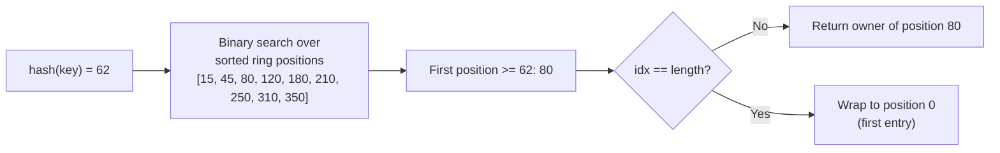

#### Lookup Algorithm: Real-Life Use Case

A high-traffic CDN edge proxy performing millions of cache-routing lookups per second implements its ring as an immutable sorted array rebuilt (via read-copy-update) only on the rare event of a cache server being added or removed. Because lookups never need to acquire a lock (they only read an atomically-swapped, immutable array reference), the O(log(N x V)) binary search proceeds at full CPU speed with zero contention between concurrent request-handling threads, a design directly enabled by treating lookup as this page's core, isolated primitive.

#### Lookup Algorithm: Java Code Example

```java
import java.util.Arrays;

// Explicit binary search implementation of the lookup primitive, independent
// of any TreeMap convenience method, to show exactly what happens under the hood.
public class RingLookup {

    public static int findServerIndex(int[] sortedRingPositions, int keyHash) {
        int lo = 0, hi = sortedRingPositions.length - 1;
        int result = 0; // wrap-around default: first position

        while (lo <= hi) {
            int mid = lo + (hi - lo) / 2;
            if (sortedRingPositions[mid] >= keyHash) {
                result = mid;
                hi = mid - 1; // keep searching left for the smallest qualifying position
            } else {
                lo = mid + 1;
            }
        }

        // If every position is smaller than keyHash, wrap around to index 0.
        if (sortedRingPositions[lo == sortedRingPositions.length ? 0 : lo % sortedRingPositions.length] < keyHash
                && lo == sortedRingPositions.length) {
            return 0;
        }

        return result;
    }

    public static void main(String[] args) {
        int[] ringPositions = {15, 45, 80, 120, 180, 210, 250, 310, 350};

        int[] keyHashes = {10, 62, 355};
        for (int keyHash : keyHashes) {
            int idx = findServerIndex(ringPositions, keyHash);
            System.out.printf("key hash %d -> ring position %d (index %d)%n",
                    keyHash, ringPositions[idx], idx);
        }
    }
}
```

#### Lookup Algorithm: Interview Questions and Answers

**Q1. Why is the lookup complexity expressed as O(log(N x V)) rather than just O(log N)?**
A: Because with virtual nodes, the ring actually contains `N x V` positions (N physical servers, each contributing V virtual node entries), and binary search operates over all of those positions, not just the N physical servers.

**Q2. If lookups are O(log(N x V)), why not just use a hash table (O(1)) instead of a sorted structure?**
A: A hash table only supports exact-match lookups, but consistent hashing requires an *ordering* query, "find the smallest position greater than or equal to X", which fundamentally needs a sorted structure (array, tree, or skip list) that supports range/successor queries, something a plain hash table cannot do.

**Q3. How would you make lookups completely lock-free in a highly concurrent system?**
A: Use a read-copy-update pattern: keep the current ring as an immutable, fully-built sorted array behind an atomically-swappable reference. Reads always read the current reference without any lock. On a topology change, build an entirely new array reflecting the change, then atomically swap the reference, so in-flight reads either see the old or new ring consistently, never a partially-updated one.

**Q4. Does adding more virtual nodes make lookups slower in any meaningful way?**
A: Marginally, going from 100 to 100,000 ring positions increases binary search steps from about 7 to about 17, a difference that is negligible compared to typical network or disk I/O latency; the balance benefit from more virtual nodes almost always outweighs this tiny lookup cost increase.

---

### Replication with Consistent Hashing

In production systems, data is **replicated** across multiple servers for fault tolerance. Consistent hashing naturally supports this.

**Strategy: Replicate to the Next N Clockwise Servers**

For a replication factor of 3, a key is stored on the server it maps to **plus** the next 2 distinct physical servers clockwise on the ring.

```
Ring with Replication Factor = 3:

                       0
                  ┌──────────┐
                 /  A1(15)    \
                /   B1(45)    \
               /   C1(80)     \
              │   A2(120)      │
              │    B2(180)     │
              │     C2(210)    │
               \   A3(250)    /
                \  B3(310)   /
                 \ C3(350)  /
                  └────────┘

key "user:42" hashes to position 30:
  Primary:   Server-B (pos 45)   ← First clockwise
  Replica 1: Server-C (pos 80)   ← Second clockwise (different physical)
  Replica 2: Server-A (pos 120)  ← Third clockwise (different physical)
```

**Implementation — Finding Replica Nodes:**

```python
def get_replicas(self, key: str, num_replicas: int = 3) -> list[str]:
    """
    Get N distinct physical nodes for a key (primary + replicas).
    Walks clockwise on the ring, skipping virtual nodes of
    already-selected physical servers.
    """
    if not self.sorted_keys:
        return []

    hash_val = self._hash(key)
    idx = bisect_right(self.sorted_keys, hash_val)

    replicas = []
    seen_nodes = set()

    for i in range(len(self.sorted_keys)):
        pos = (idx + i) % len(self.sorted_keys)
        node = self.ring[self.sorted_keys[pos]]

        if node not in seen_nodes:
            replicas.append(node)
            seen_nodes.add(node)

        if len(replicas) == num_replicas:
            break

    return replicas
```

```java
public List<T> getReplicas(String key, int numReplicas) {
    if (ring.isEmpty()) return Collections.emptyList();

    long hashVal = hash(key);
    List<T> replicas = new ArrayList<>();
    Set<T> seen = new HashSet<>();

    // Start from the ceiling entry and walk clockwise
    Long current = ring.ceilingKey(hashVal);
    if (current == null) current = ring.firstKey();

    NavigableMap<Long, T> tail = ring.tailMap(current, true);
    for (Map.Entry<Long, T> entry : tail.entrySet()) {
        if (seen.add(entry.getValue())) {
            replicas.add(entry.getValue());
        }
        if (replicas.size() == numReplicas) return replicas;
    }

    // Wrap around from the beginning
    for (Map.Entry<Long, T> entry : ring.entrySet()) {
        if (seen.add(entry.getValue())) {
            replicas.add(entry.getValue());
        }
        if (replicas.size() == numReplicas) return replicas;
    }

    return replicas;
}
```

#### Replication: Characteristics

- **An extension of the same lookup primitive**: Replication reuses the exact "next clockwise" search from the Lookup Algorithm topic, just continuing past the first match until N *distinct physical* servers have been collected.
- **Distinctness is at the physical, not virtual, level**: Because a physical server owns many virtual node positions, the walk must skip additional virtual nodes belonging to a server already selected, otherwise a replication factor of 3 could accidentally select the same physical server twice.
- **Replica set changes only for the affected arc on topology change**: Just as with the base algorithm, adding or removing a server only changes the replica set for keys near that server's position, not for the whole ring.
- **Naturally spreads replicas across failure domains, if positions are chosen carefully**: Simply walking clockwise assumes adjacent ring positions belong to genuinely independent failure domains (racks, availability zones); this must be engineered deliberately (see Patterns below), not assumed for free.

#### Replication: Components

- **Primary resolver**: The standard single-node lookup, identifying the first (primary) owner of a key.
- **Clockwise walker with dedup set**: The loop that continues past the primary, tracking already-seen physical nodes in a set, until `num_replicas` distinct nodes are collected.
- **Failure-domain-aware placement (optional but common)**: Logic ensuring the N replicas span independent racks/AZs/regions, not just independent physical servers that happen to share a power supply or network switch.
- **Read/write quorum logic**: The layer above the ring (not shown in the snippet) that decides how many of the N replicas must acknowledge a write, or be consulted for a read, to satisfy the system's consistency requirements.

#### Replication: Patterns

- **N clockwise distinct physical nodes** (shown above): The standard consistent-hashing replication strategy, used by Cassandra and Riak.
- **Rack-aware / zone-aware placement**: Skip not just already-seen physical servers but also servers in an already-used rack or availability zone, ensuring replicas are spread across independent failure domains, not just independent machines.
- **Quorum-based read/write (N, R, W)**: Pair replication with a quorum scheme (as in Dynamo-style systems) where `R + W > N` guarantees at least one overlapping replica between any read and any prior write, providing tunable consistency.

#### Replication: Pros / Benefits

- **Fault tolerance without a separate replication protocol**: The same ring used for primary placement also determines replica placement, no separate mechanism or metadata store is needed to track "who replicates what."
- **Graceful degradation on node failure**: If the primary owner of a key fails, the next clockwise replica already holds a copy and can serve the request immediately, with no explicit failover coordination step required for read availability.
- **Consistent, deterministic replica assignment**: Any node in the cluster (or any client) can independently compute the same replica set for a key using only the shared ring, without needing to consult a separate replication table.

#### Replication: Cons / Challenges

- **Naive clockwise walk can co-locate replicas on a shared failure domain**: Without rack/zone awareness, all N replicas of a key could conceivably land in the same rack, defeating the purpose of replication if that rack loses power.
- **Uneven replica load distribution**: A physical server that happens to sit "before" many other servers on the ring can end up as a frequent replica target, requiring the same virtual-node-driven balancing already discussed to keep replica load even too.
- **Increased write cost**: Every write must now reach (or be propagated to) N servers instead of one, directly trading write latency/throughput for durability and read availability.

#### Replication: Best Practices

- Make the clockwise replica walk rack/zone-aware in any real deployment with more than one failure domain; naive N-distinct-server selection is not sufficient for genuine fault tolerance.
- Choose the replication factor N based on your durability requirements and expected simultaneous failure rate, 3 is a common default (tolerating one node failure with room to spare) but should be derived from actual reliability targets.
- Combine replication with a quorum read/write scheme (`R + W > N`) when tunable consistency is required, rather than always reading/writing to just the primary.
- Monitor replica-set distribution across physical servers and failure domains, not just primary-key distribution, since replica load can be uneven even when primary load is well balanced.

#### Replication: When to Use

- Any production data store or cache built on consistent hashing that needs to survive individual node failures without data loss (essentially all real deployments beyond a single-node prototype).
- Systems requiring tunable consistency (choose N, R, W per the durability/latency trade-off needed), such as Dynamo-style databases.
- Multi-AZ or multi-region deployments, where rack/zone-aware replica placement is essential, not optional, for genuine fault tolerance.

#### Replication: Diagram

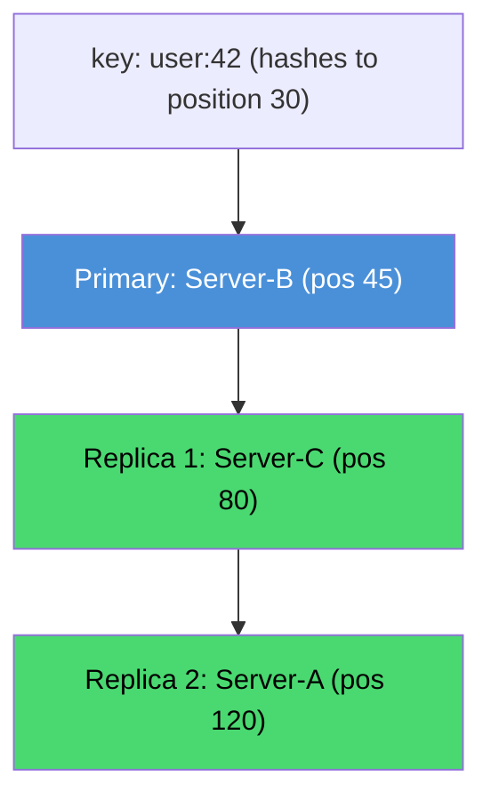

#### Replication: Real-Life Use Case

Apache Cassandra assigns a replication factor (commonly 3) per keyspace and uses a rack-aware and datacenter-aware snitch/strategy layered on top of the basic clockwise-walk algorithm shown here, ensuring that the N replicas of any given row are spread across distinct racks (and, in multi-datacenter deployments, distinct datacenters). This means a single rack losing power, or an entire datacenter going offline, still leaves at least one replica of every row reachable, directly built on the same "next N distinct clockwise" primitive described in this topic.

#### Replication: Interview Questions and Answers

**Q1. Why must the replica-finding walk track "distinct physical nodes" rather than just "distinct ring positions"?**
A: Because with virtual nodes, a single physical server owns many ring positions. If the walk only checked ring positions, it could select two virtual nodes belonging to the same physical server as two different "replicas," which provides no real fault tolerance since a failure of that one server would take out both.

**Q2. What additional problem does naive clockwise replication fail to solve, and how is it fixed?**
A: It does not guarantee that replicas land in independent failure domains (racks, availability zones, data centers); a naive implementation could place all N replicas in the same rack. This is fixed by making the walk rack/zone-aware, skipping not just already-selected physical servers but also servers in an already-used failure domain, until replicas span distinct domains.

**Q3. How does replication interact with the ring's rebalancing property when a server is added or removed?**
A: The same locality guarantee applies: only keys whose primary or replica set includes the changed server are affected. Because virtual nodes spread each physical server's ownership across many small ring arcs, adding/removing a server only changes the primary or replica assignment for the specific key ranges adjacent to that server's virtual node positions, not the whole dataset.

**Q4. What is a quorum (N, R, W) scheme, and how does it build on top of ring-based replication?**
A: N is the total replica count for a key (determined by the ring walk described here); R and W are the number of replicas that must respond to satisfy a read or write respectively. Choosing R and W such that `R + W > N` guarantees at least one replica overlaps between any write and any subsequent read, giving the system tunable consistency (e.g., strong consistency with `R=W=majority`, or lower latency with smaller R/W at the cost of potentially reading stale data).

---

### Bounded-Load Consistent Hashing

Standard consistent hashing can still produce **hotspots** where one server gets disproportionately more traffic. **Bounded-load consistent hashing** (proposed by Google in 2017) enforces an upper bound on the load any single server can handle.

**The Idea:**

Each server has a capacity limit: $\text{max\_load} = \lceil \frac{\text{avg\_load} \times (1 + \epsilon)}{1} \rceil$

where $\epsilon$ is a small constant (e.g., 0.25). If a server is at capacity, the key overflows to the next server clockwise.

```
Example with ε = 0.25, 4 servers, 100 keys:
  Average load = 25 keys per server
  Max load per server = ceil(25 × 1.25) = 32 keys

  If Server-A already has 32 keys:
    New key that hashes to Server-A → Overflow to Server-B
```

**Implementation Sketch:**

```python
class BoundedLoadConsistentHash(ConsistentHashRing):
    """
    Consistent hashing with bounded load.
    No server handles more than (1 + epsilon) * average_load keys.
    """

    def __init__(self, num_virtual_nodes: int = 150, epsilon: float = 0.25):
        super().__init__(num_virtual_nodes)
        self.epsilon = epsilon
        self.load: dict[str, int] = defaultdict(int)  # current load per node
        self.total_keys = 0

    def _max_load(self) -> int:
        if not self.nodes:
            return 0
        avg = self.total_keys / len(self.nodes)
        return int(avg * (1 + self.epsilon)) + 1

    def get_node_bounded(self, key: str) -> Optional[str]:
        """Find server for key, respecting load bounds."""
        if not self.sorted_keys:
            return None

        hash_val = self._hash(key)
        idx = bisect_right(self.sorted_keys, hash_val)
        max_load = self._max_load()

        for i in range(len(self.sorted_keys)):
            pos = (idx + i) % len(self.sorted_keys)
            node = self.ring[self.sorted_keys[pos]]

            if self.load[node] < max_load:
                self.load[node] += 1
                self.total_keys += 1
                return node

        # Fallback: all servers at capacity (shouldn't happen in normal conditions)
        node = self.ring[self.sorted_keys[idx % len(self.sorted_keys)]]
        self.load[node] += 1
        self.total_keys += 1
        return node
```

#### Bounded-Load Consistent Hashing: Characteristics

- **A hard ceiling, not just a statistical improvement**: Unlike virtual nodes (which improve balance *on average*), bounded load enforces a strict, guaranteed maximum on any single server's load, even in the worst case.
- **Overflow-based, not reshuffle-based**: When a server is at capacity, the specific key simply continues clockwise to the next available server, no global recalculation or rebalancing of already-placed keys occurs.
- **Stateful, unlike the base ring lookup**: The bounded-load decision depends on current live load counts, not just static ring positions, meaning it needs a live cluster-wide (or at least locally consistent) view of load.
- **Parameterized by a single tunable, epsilon**: The looseness of the bound (how far above perfectly-even load a server may go before overflowing) is controlled entirely by one constant, making the trade-off between balance strictness and lookup complexity easy to reason about.

#### Bounded-Load Consistent Hashing: Components

- **Load counter per physical node**: A live tally of how many keys/requests are currently assigned to each server.
- **Max-load calculator**: Computes `ceil(average_load * (1 + epsilon))` from the current total key count and node count, recalculated as load changes.
- **Overflow walker**: Reuses the clockwise-walk primitive from the Lookup/Replication topics, but instead of stopping at the first server, it keeps walking past any server already at its max load.
- **Epsilon configuration**: The single tunable constant (commonly 0.25, i.e., allowing servers up to 25% above average) balancing strictness against how far a key might have to travel to find capacity.

#### Bounded-Load Consistent Hashing: Patterns

- **Overflow-on-capacity**: The core pattern, when the natural owner is full, walk clockwise until an under-capacity server is found, is directly analogous to open addressing with linear probing in a hash table.
- **Global versus local load tracking**: Some systems track load centrally (a coordinator) for strict enforcement; others let each node track only its own load and reject/redirect overflow requests locally, trading strict global guarantees for simpler, decentralized operation.
- **Sliding epsilon under contention**: Advanced implementations dynamically loosen epsilon under heavy overall load (when strict bounds would cause excessive overflow chains) and tighten it when load is light.

#### Bounded-Load Consistent Hashing: Pros / Benefits

- **Provable worst-case guarantee**: No single server can ever exceed `(1 + epsilon)` times the average load, regardless of how adversarial or skewed the key distribution happens to be, a guarantee virtual nodes alone cannot make.
- **Directly solves the hot-key/hotspot problem**: Even if many keys happen to hash near one server's position, the bound forces excess load to spill over to neighbors rather than overwhelming that one server.
- **Composable with existing ring infrastructure**: It layers on top of the standard ring and virtual node setup rather than replacing it, meaning it can be added incrementally to an existing consistent hashing implementation.

#### Bounded-Load Consistent Hashing: Cons / Challenges

- **Requires live load state**: Unlike the stateless base algorithm, this needs an up-to-date load counter per server, adding a coordination or synchronization requirement (especially in a distributed, multi-client setting).
- **Overflow chains add lookup cost and hop count**: In the worst case, a key might need to check many servers before finding one under capacity, an O(N) worst case rather than the base algorithm's O(log(N x V)).
- **Choosing epsilon is a real tuning exercise**: Too small an epsilon causes frequent overflow (extra hops, extra complexity) even under normal conditions; too large an epsilon weakens the protection the technique is meant to provide.
- **Key-to-server mapping becomes load-dependent and less predictable**: Because assignment depends on current load, the same key is not guaranteed to always land on the same server across different total load conditions, which complicates caching and debugging compared to the deterministic base algorithm.

#### Bounded-Load Consistent Hashing: Best Practices

- Start with the widely used default of epsilon = 0.25 (allowing 25% above average load) and adjust based on observed overflow frequency in production.
- Track load using an efficient, low-contention counter (e.g., an atomic counter, or an approximate/eventually-consistent counter) rather than a heavily-locked global structure, to avoid the load-tracking mechanism itself becoming a bottleneck.
- Cap the maximum overflow walk length and fall back to accepting overload (or returning an error) rather than allowing unbounded search in pathological cases where the whole cluster is near capacity.
- Reserve bounded-load consistent hashing specifically for scenarios with known or suspected hot-key risk; the added complexity is not worth it for uniformly-distributed, low-skew workloads.

#### Bounded-Load Consistent Hashing: When to Use

- Systems with a known risk of hot keys or skewed access patterns (celebrity user profiles, viral content, popular product pages) where a small number of keys could otherwise overwhelm one server.
- Load balancers and service meshes (this is the technique behind Google's Maglev-adjacent and gRPC/Envoy's "bounded-load consistent hashing" load balancing policy) that need a hard guarantee no single backend receives disproportionate traffic.
- Any deployment where virtual nodes alone have proven insufficient to prevent occasional hotspot-driven overload incidents.

#### Bounded-Load Consistent Hashing: Diagram

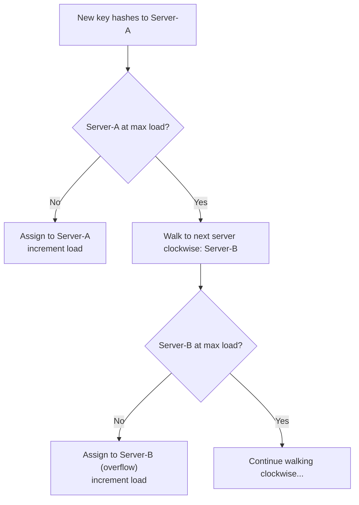

#### Bounded-Load Consistent Hashing: Real-Life Use Case

Envoy Proxy and gRPC both implement a "ring hash" load balancing policy with an optional bounded-load extension, used when routing requests to backend replicas of a service. In a scenario where one particular gRPC method or tenant generates disproportionate traffic that happens to hash near a specific backend's ring position, bounded-load consistent hashing prevents that one backend from being overwhelmed by automatically overflowing excess requests to neighboring backends, while still preserving consistent hashing's key property that most requests for the same key/session continue routing to the same backend for cache-affinity purposes.

#### Bounded-Load Consistent Hashing: Java Code Example

```java
import java.util.HashMap;
import java.util.Map;
import java.util.TreeMap;

// Bounded-load consistent hashing: overflow to the next clockwise server
// whenever the natural owner is already at (1 + epsilon) * average load.
public class BoundedLoadConsistentHashRing {

    private final TreeMap<Integer, String> ring = new TreeMap<>();
    private final Map<String, Integer> loadByServer = new HashMap<>();
    private final double epsilon;
    private int totalKeys = 0;

    public BoundedLoadConsistentHashRing(double epsilon) {
        this.epsilon = epsilon;
    }

    private int hash(String value) {
        return Math.abs(value.hashCode());
    }

    public void addServer(String server, int virtualNodes) {
        loadByServer.putIfAbsent(server, 0);
        for (int i = 0; i < virtualNodes; i++) {
            ring.put(hash(server + "#vnode" + i), server);
        }
    }

    private int maxLoad() {
        if (loadByServer.isEmpty()) return 0;
        double avg = (double) totalKeys / loadByServer.size();
        return (int) (avg * (1 + epsilon)) + 1;
    }

    public String getServer(String key) {
        if (ring.isEmpty()) return null;

        int keyHash = hash(key);
        int maxLoad = maxLoad();
        var entry = ring.ceilingEntry(keyHash);
        if (entry == null) entry = ring.firstEntry();

        var iterator = ring.tailMap(entry.getKey(), true).entrySet().iterator();
        var wrapIterator = ring.entrySet().iterator();

        while (iterator.hasNext() || wrapIterator.hasNext()) {
            String server = iterator.hasNext() ? iterator.next().getValue() : wrapIterator.next().getValue();
            if (loadByServer.getOrDefault(server, 0) < maxLoad) {
                loadByServer.merge(server, 1, Integer::sum);
                totalKeys++;
                return server;
            }
        }
        return null; // all servers at capacity
    }

    public static void main(String[] args) {
        BoundedLoadConsistentHashRing ring = new BoundedLoadConsistentHashRing(0.25);
        ring.addServer("Server-A", 3);
        ring.addServer("Server-B", 3);
        ring.addServer("Server-C", 3);

        for (int i = 0; i < 10; i++) {
            System.out.println("key-" + i + " -> " + ring.getServer("key-" + i));
        }
        System.out.println("Final load: " + ring.loadByServer);
    }
}
```

#### Bounded-Load Consistent Hashing: Interview Questions and Answers

**Q1. How is bounded-load consistent hashing different from simply adding more virtual nodes?**
A: Virtual nodes improve *average-case, statistical* balance but offer no hard guarantee, an unlucky or adversarial key distribution can still overload one server. Bounded-load consistent hashing adds a strict, enforced ceiling (`(1 + epsilon) x average load`) that no server can exceed, regardless of key distribution, by explicitly overflowing excess keys to neighboring servers.

**Q2. What does the epsilon parameter control, and what happens if it is set to 0?**
A: Epsilon controls how far above the perfectly even average load a server is allowed to go before it starts overflowing keys. Setting epsilon to 0 would force every server to hold exactly the average load, which is generally infeasible with discrete keys, and would cause excessive overflow chains even under mild, natural variance; small positive values like 0.25 are standard.

**Q3. What is the worst-case lookup cost for bounded-load consistent hashing compared to the base algorithm?**
A: In the worst case, a key may need to walk past many servers before finding one under capacity, giving an O(N) worst-case bound versus the base algorithm's O(log(N x V)). In practice, with a reasonable epsilon and healthy cluster capacity, overflow chains are short.

**Q4. Does bounded-load consistent hashing guarantee that the same key always maps to the same server?**
A: No, unlike the base algorithm, the mapping can change based on current cluster-wide load; if a key's natural server was full when it was first placed but has capacity later (or vice versa), the assignment can differ across time. This is an explicit trade-off, accepting some mapping instability in exchange for a strict load guarantee.

---

### Jump Consistent Hashing

**Jump consistent hash** is an alternative algorithm by Google (Lamping & Veach, 2014) that is simpler, faster, and produces perfectly even distribution — but only works when servers are numbered `0` to `N-1`.

**Properties:**

| Feature | Ring-based | Jump Hash |
|---|---|---|
| Lookup speed | $O(\log N)$ | $O(\log N)$ |
| Memory | $O(N \times V)$ | $O(1)$ |
| Named servers | Yes | No (numeric only) |
| Arbitrary add/remove | Yes | Only add/remove from end |
| Distribution | Good with vnodes | Perfect |
| Implementation | Complex | Very Simple (~5 lines) |

**The Algorithm (remarkably simple):**

```python
def jump_consistent_hash(key: int, num_buckets: int) -> int:
    """
    Jump consistent hash: maps key to bucket in [0, num_buckets).
    O(log N) time, O(1) space, perfect balance.
    """
    b, j = -1, 0
    while j < num_buckets:
        b = j
        key = ((key * 2862933555777941757) + 1) & 0xFFFFFFFFFFFFFFFF
        j = int((b + 1) * (1 << 31) / ((key >> 33) + 1))
    return b
```

```go
func JumpConsistentHash(key uint64, numBuckets int) int {
    var b, j int64
    b, j = -1, 0
    for j < int64(numBuckets) {
        b = j
        key = key*2862933555777941757 + 1
        j = int64(float64(b+1) * (float64(int64(1)<<31) / float64((key>>33)+1)))
    }
    return int(b)
}
```

```java
public static int jumpConsistentHash(long key, int numBuckets) {
    long b = -1, j = 0;
    while (j < numBuckets) {
        b = j;
        key = key * 2862933555777941757L + 1;
        j = (long) ((b + 1) * (Long.divideUnsigned(1L << 31, (key >>> 33) + 1)));
    }
    return (int) b;
}
```

**When to Use Jump Hash:**

- Servers are numbered sequentially (0, 1, 2, ...)
- You only add/remove servers from the end of the list
- You need perfect balance without virtual nodes
- Memory efficiency is critical (e.g., embedded systems)

#### Jump Consistent Hashing: Characteristics

- **No stored ring at all**: Unlike every ring-based technique on this page, jump hash computes the answer purely mathematically, from the key and bucket count, with zero persisted metadata about server positions.
- **Perfect balance by mathematical construction**: Rather than relying on many virtual node samples to *approximate* even distribution, the algorithm's recurrence is designed so that every bucket receives an almost exactly equal share deterministically.
- **Ordinal, not named, buckets**: Servers are referred to purely by index (0 to N-1), there is no concept of hashing a server's hostname/IP onto the ring, this is the direct trade-off for the O(1) memory footprint.
- **Add/remove restricted to the end of the sequence**: Because bucket identity is tied to numeric position, removing bucket 3 out of 10 effectively means bucket 3's meaning changes (buckets must be renumbered or the last bucket moved into its place), it is not a free, arbitrary-membership operation the way ring-based removal is.

#### Jump Consistent Hashing: Components

- **Pseudo-random key mixer**: The linear congruential-style update (`key = key * constant + 1`) that re-randomizes the key on each loop iteration.
- **Jump calculator**: The `j = (b+1) * (2^31 / ((key >> 33) + 1))` expression, which computes how far to "jump" forward in bucket space on each iteration.
- **Bucket count (N)**: The only piece of external state the algorithm needs, no server list, hostnames, or persisted positions required.

#### Jump Consistent Hashing: Patterns

- **Numeric shard index as the source of truth**: Systems using jump hash typically maintain a simple ordered list of shard/server identifiers, and route using the numeric index the algorithm returns, rather than looking anything up in a ring.
- **Append-only scaling**: Because removal is awkward for non-last buckets, systems that use jump hash typically design their scaling operations to only ever add capacity at the end, and handle decommissioning by other means (e.g., marking a bucket inactive rather than truly removing it).
- **Pairing with a stable, externally-numbered partition scheme**: Kafka-style systems that already assign numeric partition IDs to topics are a natural fit for jump hash, since the "servers" being hashed over are already ordinally numbered by design.

#### Jump Consistent Hashing: Pros / Benefits

- **O(1) memory, regardless of cluster size**: No ring, no virtual node table, nothing to store beyond the current bucket count, a meaningful advantage in memory-constrained environments.
- **Perfect load balance out of the box**: No virtual node tuning is needed to achieve even distribution, the algorithm is provably close to perfectly uniform by construction.
- **Extremely simple to implement and audit**: At roughly five lines of core logic, it is trivially portable across languages and easy to verify for correctness, unlike a full ring implementation with virtual nodes and TreeMap/skip-list bookkeeping.
- **Very fast**: No data structure traversal at all, just a tight numeric loop, often faster in practice than a ring's binary search despite both being O(log N).

#### Jump Consistent Hashing: Cons / Challenges

- **Cannot remove an arbitrary bucket cheaply**: Removing bucket `k` (where `k` is not the last bucket) is not well-defined without renumbering, which effectively invalidates the mapping for all buckets after `k`, unlike ring-based removal, which only affects the arc adjacent to the removed server.
- **No support for named/heterogeneous servers directly**: There is no built-in way to assign different capacities to different buckets (no virtual-node-style weighting), all buckets are treated identically.
- **Requires an external mapping from bucket index to actual server identity**: The algorithm only returns a number; the calling system must separately maintain (and keep consistent across all clients) the mapping from that number to an actual server address.
- **Not a drop-in replacement for ring-based consistent hashing in most real deployments**: Because most production clusters need arbitrary add/remove (including removing an unhealthy node from the middle of the fleet) and named/weighted servers, jump hash is a niche, specialized tool rather than a general-purpose replacement for ring-based consistent hashing.

#### Jump Consistent Hashing: Best Practices

- Use jump hash specifically for numerically-indexed, append-only partition schemes (e.g., a fixed or growing set of Kafka-style partitions) rather than for a general server fleet with unpredictable membership changes.
- Maintain the bucket-index-to-server mapping as a simple, externally synchronized ordered list, keeping it consistent across every client that needs to route using jump hash.
- Avoid jump hash if you expect to remove nodes from the middle of your fleet regularly (e.g., due to failures); ring-based consistent hashing handles that case far more naturally.
- Pair jump hash with a separate, lightweight liveness/health-check layer if a "removed" bucket actually needs to stop receiving traffic without being physically removed from the numbering.

#### Jump Consistent Hashing: When to Use

- Fixed or append-only-growing sets of numerically identified shards or partitions (e.g., Kafka partitions, a pre-sized set of database shards).
- Memory-constrained environments (embedded systems, client libraries running in resource-limited contexts) where even a small ring's memory footprint is undesirable.
- Situations where perfect load balance without virtual node tuning is more valuable than the flexibility of named, arbitrarily-removable servers.

#### Jump Consistent Hashing: Diagram

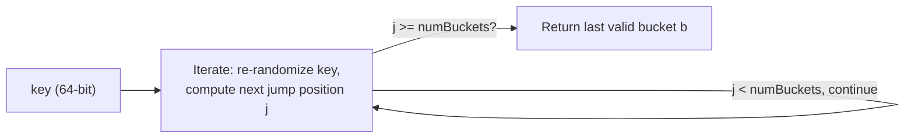

#### Jump Consistent Hashing: Real-Life Use Case

Google's internal storage systems (as described in the original Lamping and Veach paper) use jump consistent hash to map keys to a fixed, append-only-growing set of numerically indexed storage buckets, where the O(1) memory footprint matters at the scale of billions of keys spread across thousands of buckets, and where bucket membership almost always only grows (new storage buckets are provisioned), making the "no arbitrary removal" limitation largely irrelevant to that specific use case.

#### Jump Consistent Hashing: Interview Questions and Answers

**Q1. Why can't jump consistent hash remove a bucket from the middle of the sequence cheaply?**
A: The algorithm's output is purely a function of the key and the current bucket count `N`; buckets are identified only by their numeric index, not an independent identity. Removing a middle bucket (say, bucket 3 of 10) either requires renumbering all subsequent buckets (which reassigns nearly everything after it) or leaves a gap that breaks the algorithm's mathematical assumptions, unlike ring-based hashing where a server's identity (its hash position) is independent of any other server.

**Q2. If jump hash needs no stored ring, how does it still map keys to buckets deterministically?**
A: It uses a pseudo-random number generator style recurrence, re-randomizing the key on every loop iteration and using the result to decide whether to "jump" the current best-guess bucket forward. Because the recurrence is purely deterministic given the same key and the same `numBuckets`, every node computing it will arrive at the identical answer without needing to share any additional state.

**Q3. Between virtual-node ring hashing and jump hash, which would you choose for a Kafka-like partitioned log system, and why?**
A: Jump hash is a strong fit if partitions are numerically indexed and typically only grow over time (a common pattern for partitioned logs), since it gives perfect balance with zero memory overhead. If the system instead needs to remove specific partitions/brokers from the middle of the fleet regularly (e.g., due to hardware failures) or needs named, weighted servers, ring-based hashing with virtual nodes is the better fit despite its added memory and implementation cost.

**Q4. What does "O(1) memory" actually mean for jump hash, and why does that matter at scale?**
A: It means the algorithm needs to store nothing beyond the current bucket count, no per-server positions, no virtual node lists, unlike ring-based hashing which needs O(N x V) memory to store every virtual node's position. At the scale of millions of keys and thousands of buckets, this can be a meaningful memory savings, particularly in memory-constrained client libraries or embedded systems.

---

### Rendezvous Hashing (Highest Random Weight)

**Rendezvous hashing** is another alternative where each key computes a hash with **every** server, and the server with the highest hash wins.

```
For key "user:42":
  score("user:42", "server-A") = hash("user:42" + "server-A") = 847293
  score("user:42", "server-B") = hash("user:42" + "server-B") = 291047
  score("user:42", "server-C") = hash("user:42" + "server-C") = 993041  ← HIGHEST
  
  → "user:42" is assigned to Server-C
```

**Implementation:**

```python
def rendezvous_hash(key: str, servers: list[str]) -> str:
    """
    Rendezvous hashing: key goes to the server with 
    the highest combined hash score.
    """
    best_server = None
    best_score = -1

    for server in servers:
        combined = f"{key}:{server}"
        score = int(hashlib.sha256(combined.encode()).hexdigest(), 16)
        if score > best_score:
            best_score = score
            best_server = server

    return best_server
```

**Comparison with Ring-Based Consistent Hashing:**

| Feature | Ring-Based | Rendezvous |
|---|---|---|
| Lookup time | $O(\log(N \times V))$ | $O(N)$ |
| Memory | $O(N \times V)$ | $O(N)$ |
| Balance | Good with vnodes | Naturally perfect |
| Add/remove server | Only ~$\frac{K}{N}$ keys move | Only ~$\frac{K}{N}$ keys move |
| Implementation | Moderate | Very simple |
| Best for | Large N (100+ servers) | Small N (<50 servers) |

#### Rendezvous Hashing: Characteristics

- **No ring or ordered structure at all**: Unlike every ring-based approach on this page, rendezvous hashing needs no sorted positions, no virtual nodes, and no binary search, just a list of servers and a per-pair scoring function.
- **Every lookup scores every server**: The algorithm is conceptually a linear scan, compute one combined hash per (key, server) pair, and take the maximum, an O(N) operation by design.
- **Naturally perfect balance**: Because each server independently "competes" for every key via an unbiased, uniformly distributed score, no virtual nodes are needed for balance, unlike ring-based hashing.
- **Minimal disruption is a byproduct of independent scoring, not ring geometry**: When a server is removed, only the keys that had *that* server as the highest-scoring option are affected, they simply fall through to whichever server had the next-highest score, an outcome mathematically equivalent to ring-based hashing's ~1/N property but derived differently.

#### Rendezvous Hashing: Components

- **Combined-key hash function**: The function combining the original key and a candidate server identifier (e.g., string concatenation) before hashing, ensuring each (key, server) pair produces an independent-looking score.
- **Server list**: A simple, unordered collection of server identifiers, no positions or metadata needed beyond the identifier itself.
- **Max-score selector**: The comparison loop that tracks the highest score seen so far and its associated server.

#### Rendezvous Hashing: Patterns

- **Highest Random Weight (HRW) selection**: The formal name for the "compute a score per server, take the max" pattern used here.
- **Weighted rendezvous hashing**: A variant that multiplies each server's score by a capacity-derived weight before comparison, achieving the same heterogeneous-capacity support that ring hashing gets from variable virtual node counts.
- **Top-K rendezvous for replication**: Instead of taking only the single highest-scoring server, sort all N scores and take the top K distinct servers as a replica set, directly analogous to the ring's "next K clockwise" replication strategy.

#### Rendezvous Hashing: Pros / Benefits

- **Simplicity**: The entire algorithm is a single loop with a hash and a comparison, dramatically simpler to implement and reason about than a ring with virtual nodes and binary search.
- **No memory overhead for virtual nodes**: Memory is O(N), just the server list, no need to store 100-200 virtual positions per server to achieve good balance.
- **Naturally even distribution without tuning**: There is no "virtual node count" parameter to tune, balance quality is inherent to the scoring approach itself.
- **Minimal disruption on add/remove, matching ring-based hashing's key property**: Adding or removing one server changes the winning server for only the keys that were closest to that server's scores, approximately 1/N of keys, the same guarantee ring-based hashing provides.

#### Rendezvous Hashing: Cons / Challenges

- **O(N) lookup cost**: Every lookup must hash against every server, which becomes expensive for very large clusters (hundreds or thousands of servers), unlike a ring's O(log(N x V)).
- **No sub-linear replication computation**: Finding the top-K servers for replication requires scoring and sorting all N servers, again O(N log N) rather than a ring's more localized walk.
- **Not the best fit for very large or very dynamic clusters**: The linear lookup cost makes rendezvous hashing less attractive as N grows into the hundreds or more, exactly where ring-based hashing's logarithmic cost begins to shine.

#### Rendezvous Hashing: Best Practices

- Prefer rendezvous hashing for small-to-medium server counts (roughly under 50-100) where its simplicity outweighs the O(N) lookup cost.
- Use weighted rendezvous hashing (multiplying scores by a capacity factor) when servers have heterogeneous capacity, rather than trying to fake it with server-list duplication.
- Cache lookup results at the application layer when the same key is looked up repeatedly and the server list changes infrequently, to amortize the O(N) cost.
- Benchmark actual lookup latency at your real server count before choosing between rendezvous and ring-based hashing, the crossover point depends on your specific hash function cost and server count.

#### Rendezvous Hashing: When to Use

- Small clusters (roughly under 50 servers) where implementation simplicity and the absence of virtual-node tuning outweigh the O(N) lookup cost.
- Systems that value naturally even distribution without needing to tune a virtual node count parameter.
- CDN request-routing and DNS-based load balancing scenarios (rendezvous hashing's original motivating use case) where the server (cache) set is relatively small and stable.

#### Rendezvous Hashing: Diagram

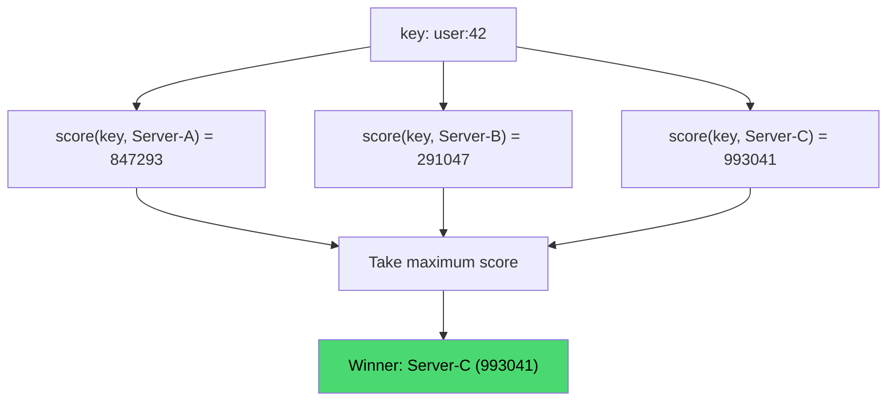

#### Rendezvous Hashing: Real-Life Use Case

Rendezvous hashing (also called Highest Random Weight hashing) was originally developed for multicast/CDN cache-server selection at the University of Michigan, and remains popular in DNS-based load balancing and small-to-medium content-delivery deployments where the cache server set numbers in the tens rather than hundreds, since its O(N) lookup is negligible at that scale while its simplicity (no ring, no virtual node tuning) meaningfully reduces implementation and operational complexity.

#### Rendezvous Hashing: Java Code Example

```java
import java.security.MessageDigest;
import java.math.BigInteger;
import java.nio.charset.StandardCharsets;
import java.util.List;

// Rendezvous (Highest Random Weight) hashing: score every server for a key
// and pick the highest-scoring one, no ring or virtual nodes required.
public class RendezvousHash {

    private static BigInteger score(String key, String server) throws Exception {
        MessageDigest md = MessageDigest.getInstance("SHA-256");
        String combined = key + ":" + server;
        byte[] digest = md.digest(combined.getBytes(StandardCharsets.UTF_8));
        return new BigInteger(1, digest);
    }

    public static String getServer(String key, List<String> servers) throws Exception {
        String bestServer = null;
        BigInteger bestScore = BigInteger.valueOf(-1);

        for (String server : servers) {
            BigInteger candidateScore = score(key, server);
            if (candidateScore.compareTo(bestScore) > 0) {
                bestScore = candidateScore;
                bestServer = server;
            }
        }
        return bestServer;
    }

    public static void main(String[] args) throws Exception {
        List<String> servers = List.of("server-A", "server-B", "server-C");
        System.out.println("user:42 -> " + getServer("user:42", servers));
        System.out.println("user:99 -> " + getServer("user:99", servers));
    }
}
```

#### Rendezvous Hashing: Interview Questions and Answers

**Q1. Why is rendezvous hashing's lookup O(N) while ring-based consistent hashing's is O(log(N x V))?**
A: Rendezvous hashing must compute a combined hash score for every single server to find the maximum, an inherently linear scan. Ring-based hashing instead maintains a sorted structure of positions and uses binary search to jump directly to the answer without evaluating every server.

**Q2. If rendezvous hashing is O(N), why would anyone choose it over a ring for a system with, say, 20 servers?**
A: At small N, the constant-factor simplicity (no ring maintenance, no virtual node tuning, no sorted data structure) often outweighs the asymptotic disadvantage; with only 20 servers, computing 20 hashes per lookup is trivially fast and the implementation is much easier to write and audit correctly.

**Q3. How would you extend basic rendezvous hashing to support replication (N replicas per key)?**
A: Compute the score for every server as usual, then instead of taking only the single maximum, sort all scores descending and take the top K distinct servers as the primary and replica set, directly analogous to the ring's "next K distinct clockwise" replication strategy.

**Q4. Does rendezvous hashing need virtual nodes to achieve good load balance? Why or why not?**
A: No. Because every server independently computes its own hash-based score for every key using a good hash function, the "winner" for any given key is effectively uniformly randomly distributed among the servers already, without needing to statistically smooth things out via multiple virtual positions per server, unlike ring-based hashing which requires virtual nodes specifically because a single ring position per server is a small, noisy sample.

---

### Data Migration During Scaling

When nodes are added or removed, some keys must move. A production system needs a migration strategy.

**Migration Flow When Adding a Node:**

```
Step 1: Add new node to the ring (with virtual nodes)

Step 2: Identify affected key ranges
         ┌──────────────────────────────────────────────┐
         │ For each virtual node V_new of the new node: │
         │   Find predecessor node V_pred on ring       │
         │   Keys in range (V_pred, V_new] must migrate │
         │   FROM the old successor of V_pred           │
         │   TO the new node                            │
         └──────────────────────────────────────────────┘

Step 3: Copy data for affected keys to new node
         (dual-write during migration for consistency)

Step 4: Update routing to use new node for migrated ranges

Step 5: Delete migrated data from old node (async cleanup)
```

**Zero-Downtime Migration Strategy:**

```
┌─────────────────────────────────────────────────────┐
│                 Migration Timeline                   │
│                                                     │
│  Phase 1: PREPARE                                   │
│  ├─ New node joins ring but doesn't serve traffic   │
│  ├─ Identify keys that need migration               │
│  └─ Begin background copy                           │
│                                                     │
│  Phase 2: DUAL-WRITE                                │
│  ├─ New writes go to BOTH old and new node          │
│  ├─ Reads still from old node                       │
│  └─ Background copy continues                       │
│                                                     │
│  Phase 3: SWITCH                                    │
│  ├─ Reads switch to new node                        │
│  ├─ Writes still go to both (brief period)          │
│  └─ Verify data consistency                         │
│                                                     │
│  Phase 4: CLEANUP                                   │
│  ├─ Stop dual-writes                                │
│  ├─ Delete migrated data from old node              │
│  └─ Migration complete ✓                            │
└─────────────────────────────────────────────────────┘
```

#### Data Migration: Characteristics

- **Scoped precisely to the affected ring arc**: Migration only ever needs to touch the specific key range adjacent to the changed node's virtual node positions, never the whole dataset, a direct consequence of consistent hashing's ~1/N property.
- **A multi-phase process, not an atomic event**: Real migrations move through prepare, dual-write, switch, and cleanup phases rather than instantaneously cutting over, specifically to avoid any window where data is unavailable or lost.
- **Requires temporary extra storage/write cost**: During the dual-write phase, every write to an affected key is deliberately duplicated to both the old and new owner, a temporary cost paid in exchange for zero-downtime safety.
- **Asynchronous cleanup is safe to delay**: Because the new node already has the authoritative copy by the time cleanup runs, deleting stale data from the old node is not time-critical and can be deferred or throttled to avoid impacting live traffic.

#### Data Migration: Components

- **Affected-range calculator**: Logic (from the Lookup Algorithm topic) that determines exactly which keys fall in the arc between a new node's virtual positions and their ring predecessors.
- **Background copier**: A process that reads data for the affected range from the old owner and writes it to the new owner without blocking live traffic.
- **Dual-write router**: Request-path logic that, during migration, writes to both the old and new owner for any key in the affected range.
- **Cutover switch**: A flag or routing rule update that moves reads from the old owner to the new owner once the background copy is verified complete.
- **Cleanup worker**: An asynchronous, throttled process that deletes now-redundant data from the old owner after cutover is confirmed safe.

#### Data Migration: Patterns

- **Prepare / Dual-Write / Switch / Cleanup (4-phase migration)**: The standard pattern shown above, used because each phase has a clear rollback point if something goes wrong, phases can be paused or reversed before the next one begins.
- **Read-repair during migration**: Rather than proactively copying every key up front, some systems let a read for a not-yet-migrated key trigger an on-demand copy from the old owner, spreading migration cost across natural traffic instead of a dedicated bulk copy job.
- **Rate-limited background copy**: Throttling the bulk copy job's throughput to avoid competing for I/O and network bandwidth with live production traffic on the old node.

#### Data Migration: Pros / Benefits

- **Zero-downtime scaling**: Because reads only switch to the new node once its data is confirmed complete, users never experience a window of missing or incorrect data during a topology change.
- **Bounded, predictable migration cost**: Since only the ~1/N arc adjacent to the change is affected, the amount of data that needs to move is proportional and predictable, not an all-or-nothing operation.
- **Safe rollback at every phase**: Because dual-writing keeps the old node's data valid throughout the process, an operator can abort the migration (before cutover) and continue serving entirely from the old node with no data loss.

#### Data Migration: Cons / Challenges

- **Real operational complexity**: A correct 4-phase migration requires careful coordination, monitoring, and often custom tooling, it is meaningfully more work to build than the "just add a node" mental model implies.
- **Temporary double-write cost**: The dual-write phase increases write latency and load (since every affected write now goes to two nodes) for the duration of the migration.
- **Consistency verification is non-trivial**: Confirming that the background copy is truly complete and correct before switching reads (to avoid serving incomplete data from the new node) requires careful checksumming or completion tracking.
- **Cleanup can be forgotten or delayed indefinitely**: Because cleanup is not time-critical, it is common in practice for stale data to linger on old nodes far longer than intended if the cleanup worker is not itself monitored.

#### Data Migration: Best Practices

- Always dual-write during migration rather than doing a single atomic cutover, so a failure or delay in the background copy never risks losing writes that occurred during the migration window.
- Verify completeness of the background copy (via checksums, row counts, or a completion marker) before switching reads to the new node.
- Rate-limit the background copy job so it does not starve live production traffic of I/O or network bandwidth on the source node.
- Monitor and alert on stalled or forgotten cleanup jobs, so temporary dual-written data does not silently persist indefinitely and waste storage.
- Automate the phase transitions (prepare to dual-write to switch to cleanup) rather than relying on manual operator steps, to reduce the chance of human error during a live migration.

#### Data Migration: When to Use

- Any time a node is added to, or removed from, a live consistent-hashing-based cluster that cannot tolerate downtime or data loss during the change.
- Systems with large per-node datasets (databases, persistent caches) where "just recompute everything from source of truth" is not fast enough and an incremental copy is required instead.
- Situations requiring an auditable, reversible scaling process, e.g., regulated environments where every data movement must be tracked and verifiable.

#### Data Migration: Diagram

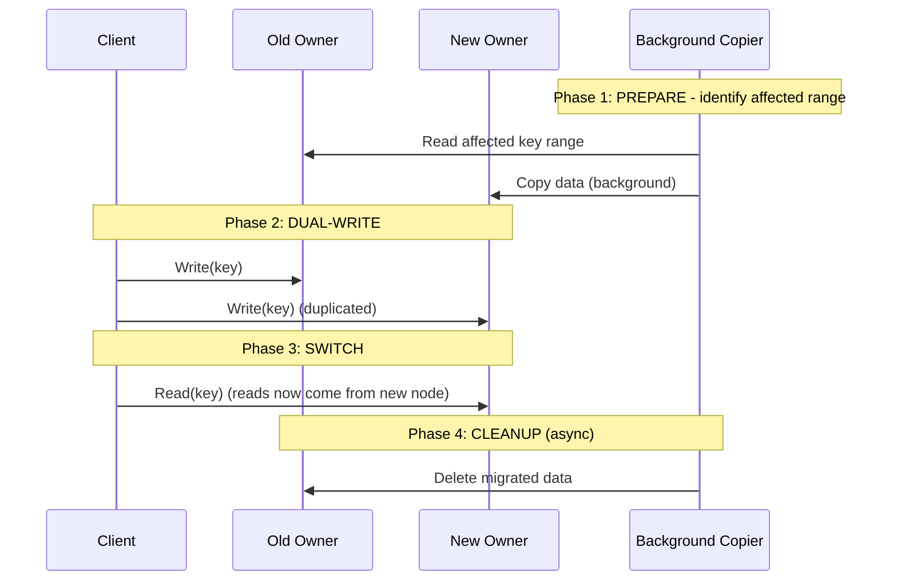

#### Data Migration: Real-Life Use Case

When Amazon DynamoDB's underlying storage layer adds a new partition to a live table to handle growing throughput, it performs exactly this kind of phased migration: identifying the specific key range that now belongs to the new partition, copying that range's data in the background, dual-writing to keep both the old and new partition current during the transition, and only cutting reads over to the new partition once the copy is verified consistent, all without any customer-visible downtime or data loss, precisely because only the affected ring arc (not the whole table) needs to move.

#### Data Migration: Java Code Example

```java
import java.util.HashMap;
import java.util.Map;

// Simplified 4-phase migration coordinator for a single key range moving
// from an old owner to a new owner in a consistent hash ring.
public class MigrationCoordinator {

    enum Phase { PREPARE, DUAL_WRITE, SWITCH, CLEANUP, DONE }

    private final Map<String, String> oldNodeStore = new HashMap<>();
    private final Map<String, String> newNodeStore = new HashMap<>();
    private Phase phase = Phase.PREPARE;

    public void backgroundCopy(String key) {
        // Phase 1: PREPARE - copy existing data to the new owner.
        if (oldNodeStore.containsKey(key)) {
            newNodeStore.put(key, oldNodeStore.get(key));
        }
    }

    public void beginDualWrite() {
        phase = Phase.DUAL_WRITE;
    }

    public void write(String key, String value) {
        oldNodeStore.put(key, value);
        if (phase == Phase.DUAL_WRITE || phase == Phase.SWITCH) {
            newNodeStore.put(key, value); // duplicate write during migration
        } else if (phase == Phase.CLEANUP || phase == Phase.DONE) {
            newNodeStore.put(key, value); // new node is now sole owner
        }
    }

    public String read(String key) {
        if (phase == Phase.SWITCH || phase == Phase.CLEANUP || phase == Phase.DONE) {
            return newNodeStore.get(key); // reads now come from new node
        }
        return oldNodeStore.get(key);
    }

    public void switchReads() {
        phase = Phase.SWITCH;
    }

    public void cleanup() {
        phase = Phase.CLEANUP;
        oldNodeStore.clear(); // async in a real system, immediate here for clarity
        phase = Phase.DONE;
    }

    public static void main(String[] args) {
        MigrationCoordinator coordinator = new MigrationCoordinator();
        coordinator.write("key1", "v1"); // pre-migration write

        coordinator.backgroundCopy("key1");
        coordinator.beginDualWrite();
        coordinator.write("key2", "v2"); // dual-written to both nodes

        coordinator.switchReads();
        System.out.println("key1 after switch: " + coordinator.read("key1"));
        System.out.println("key2 after switch: " + coordinator.read("key2"));

        coordinator.cleanup();
        System.out.println("Migration phase: " + coordinator.phase);
    }
}
```

#### Data Migration: Interview Questions and Answers

**Q1. Why does a production migration use a multi-phase (prepare/dual-write/switch/cleanup) process instead of copying data and immediately switching over?**
A: An immediate switch risks a race condition where a write occurs after the bulk copy started but before it finished, and is never reflected on the new node, or where the new node is switched to before its data is verified complete, both of which cause data loss or incorrect reads. The phased approach with dual-writing ensures the new node is always fully caught up and verified before any reads depend on it.

**Q2. Why is it safe to delay the cleanup phase (deleting stale data from the old node)?**
A: By the time cleanup runs, the new node already holds the authoritative, complete copy of the data and is serving all reads and writes for that range; the old node's copy is redundant, not needed for correctness. Deleting it is purely a storage-reclamation concern, so it can be deferred, throttled, or retried without risking data loss or serving incorrect data.

**Q3. What could go wrong if a system skips the dual-write phase and instead does a single bulk copy followed immediately by a cutover?**
A: Any write that arrives after the bulk copy has read a given key's current value, but before the cutover flips reads to the new node, would be applied only to the old node and then lost (or become invisible) once traffic switches to the new node, since the new node's copy is now stale relative to that write.

**Q4. How does consistent hashing's ~1/N property make migration tractable compared to modulo hashing?**
A: Because only keys in the narrow ring arc adjacent to the changed node need to migrate (roughly `K/N` keys), the background copy, dual-write, and cleanup phases only ever need to touch a small, bounded fraction of the total dataset. Under modulo hashing, a topology change would require migrating the vast majority of all keys, making a safe, phased migration process far more expensive and complex to execute correctly.

---

### Handling Hotspots and Hot Keys

Even with consistent hashing and virtual nodes, certain **hot keys** (extremely popular data) can overload a single server.

**Strategies for Hot Key Mitigation:**

**1. Key Splitting / Sharding Hot Keys:**

```
Instead of:
  "trending:post:12345" → Server-A  (overloaded!)

Split into:
  "trending:post:12345#shard0" → Server-A
  "trending:post:12345#shard1" → Server-B
  "trending:post:12345#shard2" → Server-C

Client picks a random shard for reads, writes go to all shards.
```

**2. Local Caching + Short TTL:**

```
Client → Check Local Cache (TTL: 1-5 seconds)
  HIT  → Return immediately (no network call)
  MISS → Consistent hash → Server → Cache locally → Return
```

**3. Read Replicas for Hot Keys:**

```
Hot key detected (>1000 QPS):
  ┌──────────────┐
  │ Monitoring    │ ──→ Detect hot key
  │ System        │
  └──────┬───────┘
         │
         ▼
  ┌──────────────┐
  │ Replicate to │ ──→ Copy to 2-3 additional servers
  │ more nodes   │
  └──────┬───────┘
         │
         ▼
  ┌──────────────┐
  │ Spread reads  │ ──→ Random selection among replicas
  │ across nodes  │
  └──────────────┘
```

#### Handling Hotspots: Characteristics

- **A key-level problem, not a server-placement problem**: Even a perfectly balanced ring (via virtual nodes) cannot prevent one specific key from receiving disproportionate traffic, hotspotting is about access pattern skew, not hash distribution skew.
- **Detectable only through live traffic monitoring**: Unlike ring imbalance (which can be reasoned about analytically), a hot key is usually only identifiable by observing real request rates per key in production.
- **Often transient and unpredictable**: A key can go from cold to extremely hot within seconds (a viral post, a flash sale item), meaning static mitigation alone is often insufficient, an adaptive detection-and-response loop is typically needed.
- **Distinct from, and often layered on top of, bounded-load consistent hashing**: Bounded load protects a server from *aggregate* overload across many keys; hot-key mitigation specifically addresses a *single* key overwhelming its assigned server(s).

#### Handling Hotspots: Components

- **Hot-key detector**: A monitoring component (often a streaming/sketch-based counter like Count-Min Sketch) that identifies keys crossing a QPS threshold in near real time.
- **Key-splitting router**: Client or proxy logic that, for a designated hot key, appends a shard suffix and distributes reads/writes across the resulting shard set.
- **Local (client-side) cache with short TTL**: An in-process cache layer, sitting in front of the consistent-hash lookup, that absorbs a large fraction of repeated reads for the same hot key.
- **Dynamic replica manager**: A component that, on detecting a hot key, provisions additional read replicas for it beyond the standard replication factor, and later decommissions them once the key cools down.

#### Handling Hotspots: Patterns

- **Key splitting (write-fan-out, read-fan-in)**: Writes to a hot key are duplicated across several shard-suffixed variants, while reads pick one shard (randomly or round-robin), spreading load across multiple physical servers for what is logically one key.
- **Client-side micro-caching**: A very short TTL (seconds) local cache in front of the ring lookup, trading a small amount of staleness for a large reduction in backend request volume during a traffic spike.
- **Adaptive replica scaling for hot keys**: Detect-then-replicate, dynamically increasing a specific key's replica count only while it remains hot, then scaling back down, rather than statically over-replicating every key just in case.

#### Handling Hotspots: Pros / Benefits

- **Protects the specific overloaded server without over-provisioning the whole cluster**: Instead of adding capacity everywhere (expensive and slow), these techniques concentrate mitigation exactly where the skew is occurring.
- **Key splitting fully removes the single-point bottleneck**: Once split across shards, no single physical server sees the full traffic volume for that logical key, the problem is structurally eliminated rather than merely reduced.
- **Local caching is nearly free and extremely effective for read-heavy hot keys**: Even a few seconds of TTL can absorb the overwhelming majority of read traffic for an extremely popular key, since most hot-key traffic is reads of unchanging or slowly changing data.

#### Handling Hotspots: Cons / Challenges

- **Key splitting complicates write consistency**: Writes now need to fan out to every shard variant, and read consistency across shards (e.g., a view/like counter needing an accurate total) requires an aggregation step the application must implement.
- **Local caching introduces staleness**: A hot key's value may be up to the TTL duration out of date for any given client, which is unacceptable for some data (financial balances) though fine for others (view counts, trending lists).
- **Hot-key detection has real engineering cost**: Building and operating a reliable, low-overhead hot-key detector (often a streaming sketch algorithm) is non-trivial and adds its own monitoring infrastructure.
- **Dynamic replica scaling adds operational complexity**: Provisioning and later decommissioning extra replicas for a specific key requires careful automation to avoid either under-reacting (server still overloaded) or over-reacting (wasted resources after the key cools down).

#### Handling Hotspots: Best Practices

- Instrument per-key (or per-key-prefix) request rate monitoring so hot keys are detected proactively, before they cause a visible incident, rather than discovered reactively from an outage.
- Prefer local caching with a short TTL as the first line of defense for read-heavy hot keys, since it is the cheapest and least invasive mitigation.
- Reserve key splitting for keys that are both extremely hot and write-heavy (where caching alone cannot help), and design the aggregation logic (for reads that need a combined view) up front.
- Set a QPS or request-rate threshold for automatic hot-key mitigation to kick in, and make sure the threshold and response are tested under simulated load before relying on them in production.
- Combine hot-key mitigation with bounded-load consistent hashing where possible; the two techniques address related but distinct failure modes and work well together.

#### Handling Hotspots: When to Use

- Consumer-facing systems with power-law or viral traffic patterns (social media posts, trending products, breaking news), where a small number of keys can receive orders of magnitude more traffic than the median key.
- Read-heavy caching layers where a short-TTL local cache can be added with minimal application changes.
- Write-heavy counters or aggregates (like counts, view counts, leaderboard scores) that are natural candidates for key splitting with an aggregation read path.

#### Handling Hotspots: Diagram

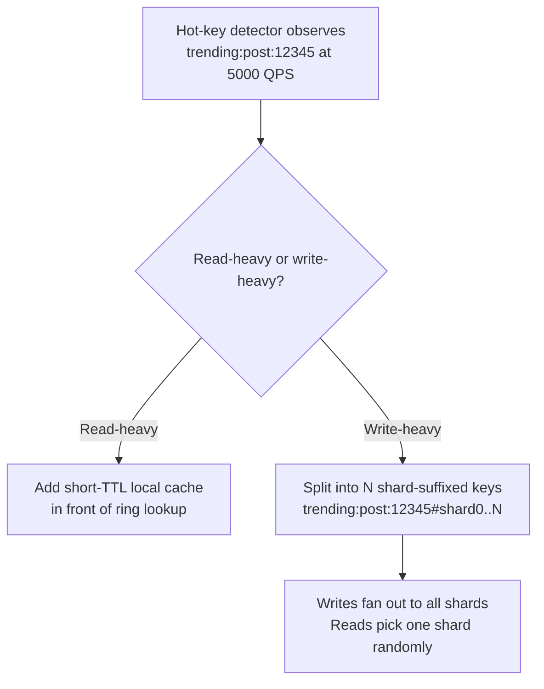

#### Handling Hotspots: Real-Life Use Case

During a major sporting event, a sports news app's "live score" key for the championship game receives orders of magnitude more read traffic than any other key in the system. The platform mitigates this with a two-second client-side cache TTL in front of its consistent-hash-routed cache tier, which absorbs the overwhelming majority of repeated reads for that single key, while the underlying write path (score updates) remains simple since only a handful of writes per minute actually occur; a technique that avoids needing to split or specially replicate the key at all for what is fundamentally a read-hotspot problem.

#### Handling Hotspots: Java Code Example

```java
import java.util.List;
import java.util.Map;
import java.util.concurrent.ConcurrentHashMap;
import java.util.concurrent.ThreadLocalRandom;

// Demonstrates key splitting for a write-heavy hot key: writes fan out to
// every shard, reads pick one shard at random to spread load.
public class HotKeySplitter {

    private final int shardCount;

    public HotKeySplitter(int shardCount) {
        this.shardCount = shardCount;
    }

    public List<String> shardKeysFor(String hotKey) {
        return java.util.stream.IntStream.range(0, shardCount)
                .mapToObj(i -> hotKey + "#shard" + i)
                .toList();
    }

    public String pickShardForRead(String hotKey) {
        int shard = ThreadLocalRandom.current().nextInt(shardCount);
        return hotKey + "#shard" + shard;
    }

    public static void main(String[] args) {
        HotKeySplitter splitter = new HotKeySplitter(3);
        Map<String, Long> store = new ConcurrentHashMap<>();

        // Write: fan out to all shards (e.g., incrementing a view counter).
        for (String shardKey : splitter.shardKeysFor("trending:post:12345")) {
            store.merge(shardKey, 1L, Long::sum);
        }

        // Read: pick a random shard instead of hammering one server.
        String readShard = splitter.pickShardForRead("trending:post:12345");
        System.out.println("Read routed to shard: " + readShard);

        // Aggregate read: sum all shards for an accurate total count.
        long total = splitter.shardKeysFor("trending:post:12345").stream()
                .mapToLong(k -> store.getOrDefault(k, 0L))
                .sum();
        System.out.println("Aggregated total across shards: " + total);
    }
}
```

#### Handling Hotspots: Interview Questions and Answers

**Q1. Why can a hot key overload a server even in a well-balanced consistent hash ring with virtual nodes?**
A: Virtual nodes balance the *aggregate* distribution of many keys across servers, they say nothing about the *access rate* of any individual key. A single extremely popular key (a viral post, a trending product) can drive disproportionate traffic to whichever one server it happens to be assigned to, regardless of how evenly the rest of the keyspace is balanced.

**Q2. When would you choose local client-side caching over key splitting for a hot key?**
A: Local caching is the right first choice when the hot key is read-heavy and can tolerate a few seconds of staleness (view counts, trending lists, leaderboard snapshots); it is far simpler to implement and avoids the write-fan-out and read-aggregation complexity that key splitting requires. Key splitting becomes necessary when the key is also write-heavy or requires strong read consistency that a stale local cache cannot provide.

**Q3. What is the trade-off introduced by splitting a hot key into multiple shard-suffixed keys?**
A: Reads become cheaper per-server (since only one shard is read at a time) and writes are spread across multiple physical servers, but any operation requiring the *combined* value (such as a total view count) now needs an aggregation step across all shards, and writes must fan out to every shard, increasing write cost and complexity.

**Q4. How would you detect a hot key in production without adding significant overhead to every request?**
A: Use an approximate, low-overhead streaming counting structure such as a Count-Min Sketch (rather than an exact per-key counter, which would itself become a bottleneck) to estimate per-key request rates with bounded memory and CPU cost, then alert or trigger automated mitigation once a key's estimated rate crosses a configured threshold.

---

### Real-World Usage

| System | How It Uses Consistent Hashing |
|---|---|
| **Amazon DynamoDB** | Partitions data across storage nodes; each key maps to a coordinator node via consistent hashing |
| **Apache Cassandra** | Uses a token ring (consistent hash ring) to distribute data; each node owns a range of tokens |
| **Memcached** | Client-side consistent hashing to choose which cache server stores a key |
| **Redis Cluster** | Uses hash slots (16384 slots) — a variation of consistent hashing where ranges are pre-defined |
| **Riak** | Consistent hashing with vnodes for data placement and replication |
| **Akamai CDN** | Original use case from Karger's 1997 paper — routing web requests to nearby cache servers |
| **Discord** | Routes users to specific gateway servers using consistent hashing |
| **Netflix** | EVCache uses consistent hashing for distributed caching |
| **Vimeo** | Video chunk distribution across storage servers |
| **Nginx (upstream)** | `hash $request_uri consistent` directive for upstream load balancing |
| **HAProxy** | Consistent hashing for server selection in backend pools |

**Amazon DynamoDB Architecture (Simplified):**

```
Client Request (key: "user:42")
         │
         ▼
  ┌──────────────────┐
  │  Request Router   │
  │  (Consistent Hash │
  │   → Coordinator)  │
  └────────┬─────────┘
           │
           ▼
  ┌──────────────────┐    Replication
  │  Coordinator Node │──────────────────┐
  │  (Primary for key)│                  │
  └────────┬─────────┘                  │
           │                             │
     ┌─────┴──────┐              ┌──────┴──────┐
     │ Replica 1   │              │ Replica 2   │
     │ (Next CW    │              │ (2nd CW     │
     │  on ring)   │              │  on ring)   │
     └─────────────┘              └─────────────┘
```

**Apache Cassandra Token Ring:**

```
                    Token Range: 0 to 2^63-1

                         0
                    ┌────●────┐
                   /  Node A   \
                  /  (0–25%)    \
                 /               \
         Node D ●                 ● Node B
       (75-100%) \               / (25-50%)
                  \             /
                   \  Node C   /
                    └──●──────┘
                     (50-75%)

  Key with token 30% → Node B (owns 25-50%)
  Key with token 80% → Node D (owns 75-100%)
  
  Replication Factor = 3:
  Token 30% → Node B (primary), Node C (replica), Node D (replica)
```

**Nginx Configuration:**

```nginx
upstream backend {
    hash $request_uri consistent;
    
    server 10.0.0.1:8080 weight=5;
    server 10.0.0.2:8080 weight=3;
    server 10.0.0.3:8080 weight=2;
}

server {
    listen 80;
    
    location / {
        proxy_pass http://backend;
    }
}
```

#### Real-World Usage: Characteristics

- **Adopted across wildly different layers of the stack**: From storage engines (DynamoDB, Cassandra, Riak) to caching clients (Memcached, EVCache) to network-layer load balancers (Nginx, HAProxy), consistent hashing is a cross-cutting technique, not specific to any single kind of system.
- **Frequently paired with virtual nodes or an explicit weighting scheme in practice**: Nearly every production example above layers weighting (Nginx's `weight=` directive, Cassandra's `num_tokens`) on top of the base ring algorithm rather than using it unmodified.
- **Sometimes reimplemented as fixed pre-divided ranges**: Redis Cluster's 16,384 hash slots are a variation, not a literal ring, showing that the *underlying idea* (deterministic, minimally-disruptive key-to-node mapping) matters more than any one specific implementation.
- **Both client-side and server-side deployments exist**: Memcached and EVCache implement the ring entirely in the client library (the server itself is unaware), while Cassandra and DynamoDB implement ring awareness inside the cluster's own coordination layer.

#### Real-World Usage: Components

- **Client-side ring library**: Used by Memcached-style deployments, where the routing logic lives entirely in application client code, requiring every client to share the same server list and hash function.
- **Cluster-internal token/ring metadata**: Used by Cassandra and DynamoDB, where the ring (or token ranges) is part of the cluster's own gossip/coordination state, not something clients compute independently.
- **Load balancer consistent-hash module**: Used by Nginx and HAProxy, where the reverse proxy itself maintains the ring and routes incoming requests to backend servers based on a request attribute (URI, header, cookie).
- **Fixed-slot assignment table**: Used by Redis Cluster, a simpler alternative to a full ring, an explicit table mapping each of 16,384 slots to a specific node.

#### Real-World Usage: Patterns

- **Storage engine internal partitioning** (DynamoDB, Cassandra, Riak): The ring determines both primary data placement and replica placement, and clients do not need to be ring-aware at all, they just talk to any node, which internally routes/forwards as needed.
- **Client-side cache sharding** (Memcached, EVCache): Every client computes the ring independently and talks directly to the correct cache server, no proxy or coordinator involved, prioritizing latency.
- **Load balancer session/request affinity** (Nginx, HAProxy): Consistent hashing on a request attribute (URI, client IP, session cookie) ensures repeated requests for the same logical entity land on the same backend, improving cache hit rates on that backend.

#### Real-World Usage: Pros / Benefits

- **Proven at massive scale across very different domains**: The fact that databases, caches, CDNs, and load balancers alike converge on the same core technique is strong evidence of its general applicability and robustness.
- **Enables each system to add elasticity without redesigning its data model**: Every system in the table gained the ability to scale its node count up or down incrementally specifically because it adopted consistent hashing (or a close variant) instead of a fixed partitioning scheme.
- **A shared vocabulary across infrastructure teams**: Because the technique is so widely used, engineers moving between storage, caching, and networking teams can reuse the same mental model (ring, virtual nodes, replication) rather than learning a bespoke scheme for each system.

#### Real-World Usage: Cons / Challenges

- **Not a one-size-fits-all configuration**: Redis Cluster's fixed 16,384 slots trade some of the ring's automatic elasticity for simpler, more explicit slot-migration tooling, showing that even widely-used "consistent hashing" systems make different trade-offs suited to their specific operational needs.
- **Client-side implementations require strict cross-client agreement**: Any Memcached-style deployment breaks if different clients disagree on the server list or hash function, a coordination requirement that purely server-side systems (DynamoDB, Cassandra) do not have.
- **Load-balancer-level consistent hashing can conflict with health-checking/failover logic**: A backend marked unhealthy still needs to be removed from the ring cleanly, and naive configurations can route to an unhealthy node briefly during failover.

#### Real-World Usage: Best Practices

- Choose the deployment pattern (client-side ring, cluster-internal ring, load-balancer consistent hash, or fixed slot table) based on where you need the routing decision made, application code, cluster coordination, or the network edge, rather than defaulting to one pattern everywhere.
- When using a load balancer's consistent-hash directive (Nginx, HAProxy), pair it with proper health checks so unhealthy backends are removed from the hash ring, not just marked down while still receiving hashed traffic.
- For client-side ring implementations, centralize the server-list-and-hash-function configuration (e.g., via a shared config service) so all clients cannot drift out of agreement.
- Study how mature systems in your problem domain (Cassandra for wide-column stores, Redis Cluster for in-memory key-value, Nginx for HTTP load balancing) have already solved this, rather than designing a bespoke ring implementation from scratch.

#### Real-World Usage: When to Use

- Reference this table when evaluating whether an off-the-shelf system already solves your partitioning problem (e.g., "do I need a custom ring, or does Redis Cluster's slot model already fit?") before building a custom implementation.
- Use client-side ring libraries specifically when you need the lowest possible latency and are willing to accept the operational burden of keeping all clients in agreement (typical for caching).
- Use cluster-internal or load-balancer-level consistent hashing when you want routing logic centralized and consistent regardless of which client or application connects.

#### Real-World Usage: Diagram

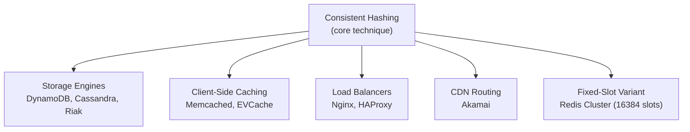

#### Real-World Usage: Java Code Example

```java
import java.util.TreeMap;
import java.util.Map;
import java.util.HashMap;

// Client-side consistent hashing modeled after how a Memcached client
// library independently computes the same server for the same key.
public class MemcachedStyleClient {

    private final TreeMap<Integer, String> ring = new TreeMap<>();

    public MemcachedStyleClient(Map<String, Integer> serverWeights) {
        for (Map.Entry<String, Integer> entry : serverWeights.entrySet()) {
            String server = entry.getKey();
            int virtualNodes = entry.getValue(); // weight -> vnode count
            for (int i = 0; i < virtualNodes; i++) {
                ring.put(hash(server + "#vnode" + i), server);
            }
        }
    }

    private int hash(String value) {
        return Math.abs(value.hashCode());
    }

    public String getServerFor(String cacheKey) {
        var entry = ring.ceilingEntry(hash(cacheKey));
        return (entry != null ? entry : ring.firstEntry()).getValue();
    }

    public static void main(String[] args) {
        Map<String, Integer> weights = new HashMap<>();
        weights.put("cache-1:11211", 150);
        weights.put("cache-2:11211", 150);
        weights.put("cache-3:11211", 150);

        MemcachedStyleClient client = new MemcachedStyleClient(weights);

        // Any client instance with the same server/weight config computes
        // the identical server for the identical key, with no coordination.
        System.out.println("product:9821 -> " + client.getServerFor("product:9821"));
        System.out.println("session:abc  -> " + client.getServerFor("session:abc"));
    }
}
```

#### Real-World Usage: Interview Questions and Answers

**Q1. Why does Memcached implement consistent hashing entirely on the client side, while Cassandra implements it inside the cluster itself?**
A: Memcached servers are simple, independent key-value stores with no cross-node coordination protocol; the client is the only component that knows about the full server list, so it must own the routing decision. Cassandra nodes participate in a gossip protocol and are aware of each other and the token ring, so the cluster itself can route (or forward) requests internally, letting clients connect to any node without needing ring logic themselves.

**Q2. How does Redis Cluster's 16,384 hash slot design relate to classic ring-based consistent hashing?**
A: It is a simplified, explicit variation, instead of hashing nodes onto a continuous ring, Redis Cluster pre-divides the key space into a fixed number of slots (16,384) and maintains an explicit table mapping each slot to a node. This achieves the same goal (deterministic, minimally-disruptive key-to-node mapping) with simpler, more explicit slot-migration tooling, at the cost of a fixed maximum granularity (you cannot have more than 16,384 distinct partitions).

**Q3. Why does Nginx's consistent-hash load balancing typically include per-server weights?**
A: Backend servers are often heterogeneous in capacity; weights let Nginx assign proportionally more of the hashed request space to more capable servers, exactly analogous to giving a bigger server more virtual nodes in a ring-based implementation.

**Q4. What operational risk is unique to client-side consistent hashing deployments like Memcached, that does not apply to cluster-internal implementations like Cassandra?**
A: If different application instances or services have an inconsistent view of the server list (e.g., one service was not yet updated after a cache server was added), they will compute different servers for the same key, causing effectively silent cache fragmentation, extra cache misses, and inconsistent behavior, a class of bug that cannot happen in a cluster-internal implementation where the routing decision is made by the coordinated cluster itself.

---

### Consistent Hashing vs. Other Partitioning Strategies

| Strategy | How It Works | Pros | Cons |
|---|---|---|---|
| **Modulo Hashing** | `hash(key) % N` | Simple, O(1) lookup | Massive remapping on resize |
| **Range Partitioning** | Key ranges assigned to servers (A-F→S1, G-M→S2) | Range queries efficient | Hot spots on popular ranges |
| **Consistent Hashing** | Hash ring with clockwise assignment | Minimal remapping (~1/N) | Uneven without vnodes |
| **Consistent Hashing + vnodes** | Multiple ring positions per server | Even distribution + minimal remapping | More memory, complex |
| **Jump Consistent Hash** | Deterministic jump algorithm | Perfect balance, O(1) memory | Sequential servers only |
| **Rendezvous Hashing** | Highest-score wins per key-server pair | Perfect balance, simple | O(N) per lookup |
| **Hash Slot (Redis style)** | Fixed 16384 slots assigned to nodes | Explicit control, easy migration | Manual slot management |

**Decision Tree for Choosing a Partitioning Strategy:**

```
Need to partition data across servers?
│
├─ Servers change frequently?
│   │
│   ├─ Yes → Need minimal key movement
│   │   │
│   │   ├─ Servers are named (IPs/hostnames)?
│   │   │   │
│   │   │   ├─ Yes → Consistent Hashing with vnodes
│   │   │   │
│   │   │   └─ No (numbered 0..N-1, add/remove from end only)
│   │   │       → Jump Consistent Hash
│   │   │
│   │   └─ Few servers (<50)?
│   │       → Rendezvous Hashing (simpler)
│   │
│   └─ No (fixed server count)
│       → Simple Modulo Hashing
│
└─ Need range queries?
    │
    ├─ Yes → Range Partitioning
    │
    └─ No → Consistent Hashing or Modulo
```

#### Consistent Hashing vs. Other Strategies: Characteristics

- **Every strategy sits on a spectrum of lookup speed versus remapping cost**: Modulo hashing maximizes lookup speed (O(1)) at the cost of remapping; ring-based and rendezvous approaches trade a bit of lookup speed (O(log N) or O(N)) for dramatically less remapping.
- **No single strategy dominates on every axis**: Jump hash wins on memory and balance but loses on flexibility (no named/removable servers); rendezvous wins on simplicity but loses on lookup speed at large N; hash slots win on explicit operational control but require manual slot-migration tooling.
- **Range partitioning is a fundamentally different axis (locality vs. distribution)**: Unlike the hashing-based strategies, range partitioning deliberately preserves key ordering/locality for efficient range scans, at the structural cost of being vulnerable to hot ranges.
- **Real systems often combine strategies**: Redis Cluster's fixed slots are pre-assigned to nodes using an operator-controlled table, not literally computed by any single hashing formula, showing the strategies in this comparison are references points, not always used in pure form.

#### Consistent Hashing vs. Other Strategies: Components

- Each strategy shares the same two conceptual components, a **placement function** (how a key maps to a server) and a **rebalancing mechanism** (what happens when servers change), the strategies differ entirely in how they implement these two pieces.
- **Placement function variants**: modulo arithmetic, ring position plus clockwise search, per-server scoring (rendezvous), a jump recurrence, or an explicit slot table.
- **Rebalancing mechanism variants**: full remap (modulo), localized ring-arc remap (consistent hashing), per-key rescoring (rendezvous), append-only bucket growth (jump hash), or manual slot reassignment (hash slots).

#### Consistent Hashing vs. Other Strategies: Patterns

- **Match the strategy to the dominant operational requirement**: elastic scaling favors ring-based consistent hashing; range queries favor range partitioning; simplicity at small scale favors rendezvous hashing; extreme memory constraints favor jump hash; explicit operator control favors hash slots.
- **Layer strategies where useful**: a system can use range partitioning for query efficiency within a shard while using consistent hashing to distribute shards themselves across physical nodes, combining both strategies' strengths.
- **Default to consistent hashing with virtual nodes unless a specific constraint argues otherwise**: it is the best general-purpose choice for the common case (elastic scaling, moderate-to-large N, named servers).

#### Consistent Hashing vs. Other Strategies: Pros / Benefits (of comparing strategies deliberately)

- **Prevents over-engineering**: Explicitly comparing strategies up front avoids reaching for a complex ring implementation with virtual nodes when a simpler rendezvous hash (or even modulo hashing, for a truly fixed cluster) would suffice.
- **Surfaces hidden requirements early**: Working through the decision tree (does the system need range queries? Do servers change frequently? Are there fewer than 50 servers?) forces the actual requirements to be made explicit before implementation begins.
- **Improves interview and design-review communication**: Being able to name and contrast alternatives (not just describe consistent hashing in isolation) demonstrates a deeper, more defensible understanding of the trade-off space.

#### Consistent Hashing vs. Other Strategies: Cons / Challenges

- **Analysis paralysis risk**: With seven-plus strategies to weigh, teams can spend excessive time debating trade-offs for a problem where consistent hashing with virtual nodes would clearly be an adequate default.
- **Comparisons can go stale**: Constant-factor performance differences (e.g., "rendezvous is fine under 50 servers") depend on actual hash function cost and hardware, and should be periodically re-validated rather than treated as permanent rules of thumb.
- **The "right" choice can change as a system grows**: A strategy chosen for an initial small deployment (rendezvous hashing, say) may need to be revisited once server count grows well beyond the range where it remains competitive.

#### Consistent Hashing vs. Other Strategies: Best Practices

- Walk through the decision tree above explicitly during design review for any new partitioned system, rather than defaulting to whichever strategy is most familiar to the team.
- Re-evaluate the choice if a core assumption changes significantly, for example, server count growing from 20 to 200, which could shift the best choice away from rendezvous hashing and toward a virtual-node ring.
- Document *why* a given strategy was chosen (which row of this comparison drove the decision) so future engineers understand the trade-off rationale, not just the resulting code.

#### Consistent Hashing vs. Other Strategies: When to Use (This Comparison)

- Use this comparison at the start of any new system design involving data or request partitioning across multiple servers, before committing to an implementation.
- Revisit the comparison whenever a system's scale, server-naming scheme, or query pattern requirements change materially.

#### Consistent Hashing vs. Other Strategies: Diagram

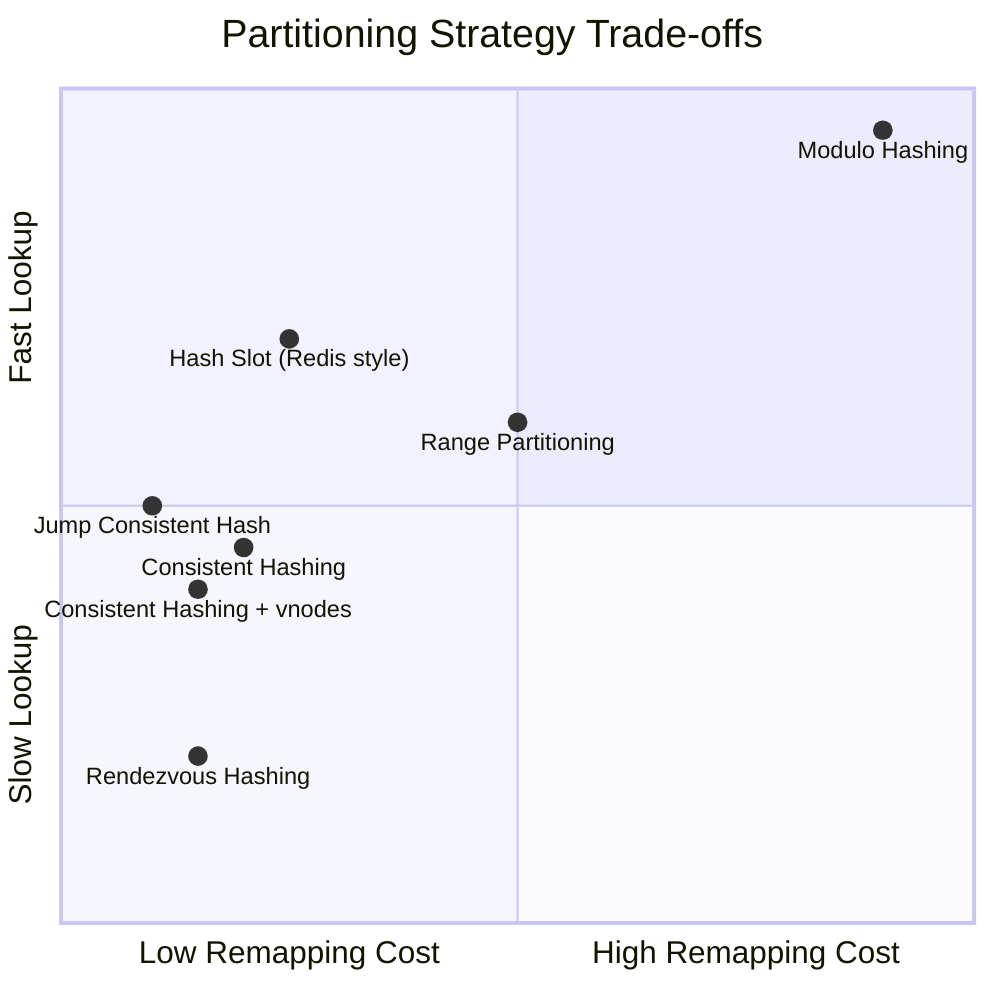

#### Consistent Hashing vs. Other Strategies: Real-Life Use Case

A payments platform storing transaction history chooses range partitioning (keyed by transaction date) for its analytical/reporting datastore, because reporting queries constantly scan date ranges, while the same platform's session cache uses consistent hashing with virtual nodes, because sessions are looked up by opaque session ID with no need for range scans and the cache cluster's node count changes routinely with load. The two systems, built by the same company for the same overall product, deliberately choose different partitioning strategies because their access patterns and scaling requirements genuinely differ, illustrating why this comparison matters in practice rather than being a purely academic exercise.

#### Consistent Hashing vs. Other Strategies: Interview Questions and Answers

**Q1. Given a choice between consistent hashing and range partitioning, what single question would you ask first to decide?**
A: "Does the access pattern require range queries (scanning a contiguous span of keys), or only point lookups by exact key?" Range queries strongly favor range partitioning (or a hybrid), since consistent hashing intentionally scatters adjacent keys across unrelated servers, making range scans require a fan-out to many nodes.

**Q2. Why might you choose rendezvous hashing over ring-based consistent hashing for a 15-server cluster, but not for a 500-server cluster?**
A: At 15 servers, rendezvous hashing's O(N) lookup cost is trivial (15 hash computations per lookup) and its implementation simplicity (no ring, no virtual node tuning) is a clear win. At 500 servers, the O(N) cost becomes meaningfully more expensive per lookup than a ring's O(log(N x V)), and the balance/complexity trade-off shifts in favor of the ring.

**Q3. Why does range partitioning remain popular for certain systems despite its hot-spot risk, when consistent hashing solves the rebalancing problem so well?**
A: Because consistent hashing deliberately destroys key ordering (hashing scatters adjacent keys randomly across the ring), it is unsuitable for any workload that needs efficient range scans (time-series queries, alphabetical listing, paginated scans); range partitioning preserves that ordering at the cost of needing separate hot-range mitigation (such as further splitting an overloaded range).

**Q4. In the decision tree, why does "servers numbered 0..N-1, add/remove from end only" specifically point to jump consistent hash rather than the general ring approach?**
A: Because jump hash achieves better memory efficiency (O(1) vs O(N x V)) and perfect balance without virtual node tuning, but only works correctly under exactly that constraint (numeric, append-only bucket membership); if servers are named or need arbitrary removal, jump hash's core assumption breaks down and a ring-based approach is required instead.

---

### Common Interview Questions

**Q1: What happens if all virtual nodes of a server cluster together on the ring?**

With a good hash function (SHA-256, MurmurHash3), this is statistically extremely unlikely. The hash function distributes virtual nodes uniformly across the ring. With 150+ virtual nodes per server, the probability of significant clustering is negligible. However, if it does happen, you can re-seed the virtual node naming scheme (e.g., change from `server#vnode0` to `server#replica0`).

**Q2: How does consistent hashing handle server failures?**

When a server fails, its portion of the ring is automatically absorbed by the next clockwise server(s). With replication factor > 1, the data is already available on replica nodes, so there's no data loss — only a brief routing change. Health checks detect the failure, the failed node is removed from the ring, and traffic is rerouted.

**Q3: How many virtual nodes should you use?**

It depends on the number of physical servers:

- **Few servers (3-10):** 150-200 virtual nodes per server
- **Medium clusters (10-50):** 100-150 virtual nodes per server
- **Large clusters (50+):** 50-100 virtual nodes per server (many physical nodes already provide good distribution)

The goal is to keep standard deviation of load below ~5-10%.

**Q4: Can consistent hashing be used for stateful services?**

Yes. It's ideal for routing sticky sessions, sharding stateful databases, and assigning long-lived connections. If the server for a session goes down, the session naturally migrates to the next clockwise server, and the application can rebuild state from persistent storage.

**Q5: What's the difference between consistent hashing and hash slots (Redis)?**

Redis Cluster uses 16,384 fixed hash slots. Each key maps to a slot via `CRC16(key) % 16384`, and slots are assigned to servers. This is a form of consistent hashing where the "ring" is pre-divided into fixed segments. The advantage is explicit control over which slots go to which server, making manual rebalancing straightforward.

**Q6: Is consistent hashing itself a load balancing algorithm, or a data placement algorithm?**

It is fundamentally a data/request placement algorithm, deciding *which* server a given key belongs to, deterministically and repeatably. It is used as a building block for load balancing (e.g., Nginx's `hash ... consistent` directive) specifically because that same deterministic property gives repeated requests for the same key/session sticky affinity to the same backend, but its core purpose is placement, not load balancing in the generic round-robin sense.

**Q7: What is the single biggest implementation mistake teams make when first building a consistent hash ring?**

Forgetting virtual nodes, implementing the base ring algorithm with one ring position per physical server, and being surprised in production when load is unevenly distributed. The base algorithm alone only guarantees minimal remapping on resize; it does not guarantee balance, virtual nodes (or an equivalent technique like rendezvous hashing) are required for that.

**Q8: How would you test that a consistent hashing implementation is correct before deploying it?**

At minimum: (1) verify determinism, the same key always returns the same server given the same ring state; (2) verify the ~1/N remapping property empirically by adding/removing a server and counting how many of a large sample of keys change assignment; (3) verify balance by hashing a large, representative key sample and checking the standard deviation of load across servers; and (4) verify wrap-around behavior explicitly with keys hashing past the highest ring position.

### Consistent Hashing: Characteristics, Pros, Cons, Use Cases, Components, Patterns, Benefits, Challenges, Best Practices and When to Use

This section summarizes consistent hashing as a partitioning strategy in its own right (as opposed to the individual topics detailed above, hash functions, the ring algorithm, virtual nodes, replication, bounded load, and its alternatives), with a detailed explanation for every point.

#### Characteristics

- **A ring-based, locality-preserving placement scheme**: Servers and keys share a single circular hash space, and a key's owner is always "the next server clockwise," a rule that is simple to state but powerful enough to bound remapping cost mathematically.
- **Bounds remapping to approximately 1/N of keys**: This is the single defining characteristic that distinguishes consistent hashing from modulo hashing, adding or removing one server out of N moves roughly `K/N` keys, not `K x N/(N+1)`.
- **Requires virtual nodes (or an equivalent) for real-world balance**: The base algorithm alone does not guarantee even distribution with a small number of physical servers; virtual nodes (or rendezvous-style per-key scoring) are what make the balance guarantee hold in practice.
- **A family of related algorithms, not one algorithm**: "Consistent hashing" in practice refers to an entire family, the base ring, ring plus virtual nodes, bounded-load variants, jump hash, and rendezvous hashing, all sharing the same core goal (minimal disruption on topology change) via different mechanisms.
- **Composable with replication**: The same clockwise-walk primitive that finds a key's primary owner extends directly to finding N distinct replica owners, making fault tolerance a natural extension rather than a bolt-on feature.

#### Pros / Benefits

- **Enables true elastic scaling**: Because only a small, proportional fraction of keys move on any topology change, servers can be added or removed routinely, even automatically via an autoscaler, without a scheduled maintenance window or a risk of a rebalancing-induced outage.
- **Well-proven at massive scale across diverse systems**: DynamoDB, Cassandra, Riak, Memcached, and CDNs like Akamai have all relied on consistent hashing (or a close variant) in production for years, providing strong evidence of its robustness.
- **Naturally supports heterogeneous hardware via weighted virtual nodes**: Server capacity differences can be reflected directly and proportionally in the ring, without special-case routing logic.
- **Extends cleanly to replication, bounded load, and hot-key mitigation**: The core "clockwise nearest" primitive is reused, with small variations, to solve fault tolerance, hotspot prevention, and skewed-traffic problems, rather than requiring unrelated mechanisms for each.
- **Decouples client/routing logic from any single coordinator**: Any node or client that knows the current ring state can independently compute the correct server for a key, with no need to consult a central authority on every request.

#### Cons / Challenges

- **More complex to implement correctly than modulo hashing**: A production-grade implementation needs a sorted ring structure, virtual node bookkeeping, wrap-around handling, and safe concurrent mutation, meaningfully more code than a single arithmetic operation.
- **O(log(N x V)) lookup instead of O(1)**: A small, usually negligible, but real cost compared to modulo hashing's constant-time lookup.
- **Does not solve every distribution problem on its own**: Even a perfectly balanced ring cannot prevent a single hot key from overwhelming its assigned server; that requires the additional techniques covered under Handling Hotspots and Hot Keys.
- **Ill-suited to workloads needing range queries**: Because hashing deliberately scatters adjacent keys across unrelated servers, range partitioning (or a hybrid approach) is a better fit whenever range scans are a core access pattern.
- **Migration correctness requires real engineering discipline**: Safely moving data during a topology change (the Data Migration topic) requires a careful multi-phase process; a naive "just copy and cut over" approach risks data loss or serving stale data.

#### Use Cases

- **Distributed caches**: Memcached, Redis-based caching layers, and CDN edge caches, where cache servers are added/removed as capacity needs change and minimizing cache-miss storms on resize is critical.
- **Distributed databases and storage engines**: DynamoDB, Cassandra, and Riak use consistent hashing (or hash-slot variants) to partition data across storage nodes while supporting elastic scaling and node replacement.
- **Load balancers and API gateways**: Nginx, HAProxy, and Envoy use consistent-hash-based routing to give repeated requests for the same session/URI sticky affinity to the same backend, improving cache locality downstream.
- **Content delivery networks**: Originally Akamai's motivating use case, routing requests for the same content consistently to the same nearby cache/edge server.
- **Sharded stateful services**: Gateway/connection routing (e.g., Discord's approach to gateway server assignment) where a client's long-lived connection needs to consistently land on the same server.

#### Components

- **Hash function**: The deterministic, uniformly-distributing function (MurmurHash3, xxHash, SHA-256, etc.) used to place both servers and keys onto the ring.
- **The ring (sorted hash space)**: The circular numeric range and its sorted position structure (array with binary search, balanced tree, or skip list) supporting clockwise-nearest lookups.
- **Virtual nodes**: Multiple ring positions per physical server, used to statistically smooth out load distribution and support weighted/heterogeneous capacity.
- **Replication walker**: The extension of the base lookup that finds N distinct physical servers clockwise, for fault-tolerant multi-copy storage.
- **Load bound tracker (optional)**: Per-server live load counters and an overflow mechanism, used in bounded-load variants to enforce a hard cap on any single server's load.
- **Migration coordinator**: The prepare/dual-write/switch/cleanup state machine that safely moves data when the ring's topology changes.

#### Patterns

- **Ring plus virtual nodes as the default production pattern**: The combination used by the overwhelming majority of real-world systems (Cassandra, Riak, most client-side cache libraries), balancing implementation complexity against strong balance and elasticity guarantees.
- **Client-side ring vs. cluster-internal ring**: Deciding whether routing logic lives in application client code (Memcached-style, prioritizing latency) or inside the coordinated cluster itself (Cassandra/DynamoDB-style, prioritizing consistency of routing decisions across all callers).
- **Fixed-slot variant for simpler operational tooling**: Redis Cluster's 16,384-slot design trades some of the ring's automatic elasticity for simpler, explicit slot-migration tooling, a valid alternative pattern when operational simplicity is prioritized over fully automatic rebalancing.
- **Bounded-load overflow for hotspot protection**: Layering a hard load ceiling with clockwise overflow on top of the base ring, used specifically when uneven key access patterns (not just uneven hashing) are a concern.
- **Alternative algorithms for specific constraints**: Falling back to jump consistent hash (numeric, append-only, memory-constrained) or rendezvous hashing (small N, maximum simplicity) when their specific trade-offs fit better than a full virtual-node ring.

#### Best Practices

- Always pair the base ring algorithm with virtual nodes (100-200 per server is a common, well-tested default) in any production deployment; do not rely on the unmodified base algorithm for balance.
- Implement lookups with an efficient sorted structure supporting both fast search and fast mutation (balanced tree, skip list, or read-copy-update array), not a plain array requiring full re-sorts.
- Layer replication (N distinct clockwise servers, rack/zone-aware where possible) on top of the base ring for any system that needs fault tolerance, rather than treating placement and durability as separate concerns.
- Add bounded-load protection and/or hot-key mitigation (local caching, key splitting) specifically for workloads with known or suspected access-pattern skew, since ring balance alone does not protect against a single overloaded key.
- Use a safe, multi-phase (prepare/dual-write/switch/cleanup) migration process for any live topology change, never a naive single-step copy-and-cutover.
- Monitor real load distribution across physical servers empirically (not just assume balance from theory), and re-tune virtual node counts or investigate hot keys when observed standard deviation exceeds your tolerance.
- Choose consistent hashing (over modulo hashing, range partitioning, or a fixed-slot table) specifically when elastic, incremental scaling and point-lookup access patterns are the priority, not by default for every partitioning problem.

#### When to Use

- Use consistent hashing whenever the number of servers is expected to change over time (elastic scaling, auto-scaling groups, routine hardware replacement) and the workload is dominated by point lookups (exact key match) rather than range scans.
- Use consistent hashing with virtual nodes as the default choice for clusters with more than a handful of servers, heterogeneous hardware, or a need for proportional capacity-based load distribution.
- Use ring-based consistent hashing over jump hash or rendezvous hashing specifically when servers need names/identities (not just numeric indices) and need to be added or removed from anywhere in the fleet, not just the end of a sequence or a small, stable set.
- Add bounded-load or hot-key-specific techniques (key splitting, local caching, dynamic replica scaling) whenever traffic patterns are expected to be skewed toward specific keys, in addition to (not instead of) the base ring and virtual node setup.
- Prefer range partitioning, or a hybrid design, instead of (or alongside) consistent hashing whenever efficient range queries over ordered keys are a core requirement of the system.
