# CQRS (Command Query Responsibility Segregation)

## Blogs and websites


## Medium


## Youtube

- [CQRS System Design Pattern](https://www.youtube.com/watch?v=vNplj9LwQSw)

## Theory

### Topics Covered

This page is organized into the following topics. Each topic includes a detailed explanation, a diagram, a real-life use case, a Java/Spring Boot code example, and interview questions with answers.

1. [Introduction: What Is CQRS](#introduction-what-is-cqrs)
2. [The Command Model (Write Side)](#the-command-model-write-side)
3. [The Query Model (Read Side)](#the-query-model-read-side)
4. [Why Separate Read and Write Models](#why-separate-read-and-write-models)
5. [Data Synchronization Between Write and Read Models](#data-synchronization-between-write-and-read-models)
6. [Eventual Consistency in CQRS](#eventual-consistency-in-cqrs)
7. [CQRS with Event Sourcing](#cqrs-with-event-sourcing)
8. [Levels of CQRS: Simple vs Complex](#levels-of-cqrs-simple-vs-complex)
9. [Messaging and Event-Driven Propagation](#messaging-and-event-driven-propagation)
10. [Scaling Reads and Writes Independently](#scaling-reads-and-writes-independently)
11. [CQRS in a Microservices Architecture](#cqrs-in-a-microservices-architecture)
12. [CQRS: Characteristics, Pros, Cons, Use Cases, Components, Patterns, Benefits, Challenges, Best Practices and When to Use](#cqrs-characteristics-pros-cons-use-cases-components-patterns-benefits-challenges-best-practices-and-when-to-use)

### Introduction: What Is CQRS

CQRS stands for Command Query Responsibility Segregation. It is an architectural pattern, first named by Greg Young (building on Bertrand Meyer's earlier Command-Query Separation principle from object-oriented design), that splits an application's data-handling logic into two distinct models:

- A **Command model** that handles all operations which change state (create, update, delete). Commands do not return data; they only report success or failure.
- A **Query model** that handles all operations which read state. Queries never change data; they only return a view of it.

In a traditional layered (CRUD) architecture, a single model and often a single set of entity/repository classes are used for both reading and writing the same data. That works well for simple applications, but as business logic and read requirements grow more complex, the same model ends up serving two very different, and sometimes conflicting, purposes: being normalized and transactionally safe for writes, while also being denormalized and fast for arbitrary read queries and UI-specific projections. CQRS resolves that tension by explicitly separating the two responsibilities, sometimes down to using entirely different data stores, technologies, and even teams for each side.

It is important to understand that CQRS is **not** about having two databases by definition, and it is **not** the same thing as Event Sourcing (though the two are frequently combined). CQRS is fundamentally about splitting responsibility for commands (writes) from responsibility for queries (reads) at the model and, usually, the code level. How far that separation goes (same database vs separate databases, synchronous vs asynchronous synchronization) is a spectrum of implementation choices layered on top of the core idea.

#### Diagram: CQRS at a Glance

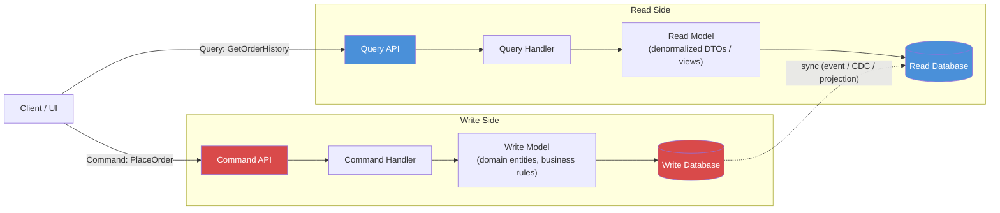

The diagram shows the two independent pipelines: commands flow through validation and business rules into the write store, while queries flow through a separate, often much simpler, path straight to a read-optimized store. The dotted line represents the synchronization mechanism that keeps the read side up to date with changes made on the write side.

#### Real-Life Use Case: E-Commerce Order Management

An e-commerce platform needs to handle two very different workloads on "orders":

- **Writes**: Placing an order, applying a discount, cancelling an order, updating shipment status. These operations must enforce strict business rules (stock availability, payment validation, valid state transitions) and must be transactionally safe.
- **Reads**: An "Order History" page, an "Admin Dashboard" showing orders per region, a "Customer Support" screen showing full order and shipment details, and analytics reports. Each of these reads needs a different shape of data, often joined from multiple domains (orders, customers, shipments, payments), and is read far more often than orders are written.

With CQRS, the write side stays a clean, normalized domain model focused purely on enforcing order business rules. The read side maintains multiple pre-joined, denormalized projections, one shaped for the order history page, another for the admin dashboard, updated asynchronously whenever an order-related event occurs. This lets the support team's dashboard query a single fast table instead of joining five tables on every page load, without ever slowing down or complicating the checkout write path.

#### Java/Spring Boot Code Example: Package Structure and Core Contracts

```java
// Command: represents intent to change state, carries only the data needed to do so
public class PlaceOrderCommand {
    private final String customerId;
    private final List<OrderLineItem> items;

    public PlaceOrderCommand(String customerId, List<OrderLineItem> items) {
        this.customerId = customerId;
        this.items = items;
    }

    public String getCustomerId() { return customerId; }
    public List<OrderLineItem> getItems() { return items; }
}

// Query: represents intent to read data, carries only the criteria needed
public class GetOrderHistoryQuery {
    private final String customerId;
    private final int page;
    private final int size;

    public GetOrderHistoryQuery(String customerId, int page, int size) {
        this.customerId = customerId;
        this.page = page;
        this.size = size;
    }

    public String getCustomerId() { return customerId; }
    public int getPage() { return page; }
    public int getSize() { return size; }
}

@RestController
@RequestMapping("/orders")
public class OrderController {

    private final OrderCommandService commandService; // write side
    private final OrderQueryService queryService;       // read side

    public OrderController(OrderCommandService commandService, OrderQueryService queryService) {
        this.commandService = commandService;
        this.queryService = queryService;
    }

    // Command endpoint: changes state, returns only an identifier / acknowledgement
    @PostMapping
    public ResponseEntity<String> placeOrder(@RequestBody PlaceOrderCommand command) {
        String orderId = commandService.handle(command);
        return ResponseEntity.accepted().body(orderId);
    }

    // Query endpoint: reads state, never mutates it
    @GetMapping("/history/{customerId}")
    public ResponseEntity<List<OrderHistoryView>> getOrderHistory(
            @PathVariable String customerId,
            @RequestParam(defaultValue = "0") int page,
            @RequestParam(defaultValue = "20") int size) {
        List<OrderHistoryView> history = queryService.handle(
                new GetOrderHistoryQuery(customerId, page, size));
        return ResponseEntity.ok(history);
    }
}
```

This skeleton shows the essential shape of CQRS at the API layer: one service dedicated to commands (`OrderCommandService`) and a separate service dedicated to queries (`OrderQueryService`), each with its own request/response contracts.

#### Interview Questions and Answers

**Q1: What does CQRS stand for, and what problem does it solve?**
A: CQRS stands for Command Query Responsibility Segregation. It solves the problem of a single data model being forced to serve two conflicting needs at once: a normalized, rule-enforcing model for writes, and a denormalized, fast, flexible model for reads. By splitting these into a Command model and a Query model, each side can be designed, scaled, and optimized independently.

**Q2: Is CQRS the same as having two databases?**
A: No. CQRS is about separating the *responsibility* for handling commands from the responsibility for handling queries, typically at the code and model level (different classes, different services). Using two physically separate databases is one common but optional implementation choice; a simpler CQRS implementation can use a single database with two different sets of models/repositories on top of it.

**Q3: Is CQRS the same as Event Sourcing?**
A: No, although they are frequently used together. CQRS only concerns the read/write model split. Event Sourcing is a separate pattern about persisting state as a sequence of events rather than as current-state rows. CQRS can be implemented without Event Sourcing (e.g., using change data capture or synchronous projections), and Event Sourcing can theoretically be used without CQRS, though in practice they complement each other very well.

**Q4: What is the origin of CQRS?**
A: CQRS was coined by Greg Young. It builds on the Command-Query Separation (CQS) principle introduced by Bertrand Meyer, which states that a method should either be a command that performs an action or a query that returns data, but never both. CQRS applies that same idea at the architectural level, across an entire bounded context, instead of at the level of a single method.

**Q5: When would you avoid using CQRS?**
A: For simple CRUD applications with low complexity, low traffic, and few or no diverging read/write requirements, plain CRUD with a single model is simpler to build, test, and maintain. CQRS introduces additional moving parts (extra models, mapping code, synchronization) that are only worth the cost once read and write needs, or their scaling requirements, genuinely diverge.

---

### The Command Model (Write Side)

The Command model is the part of the system responsible for changing state. It receives commands (imperative, intent-revealing instructions such as `PlaceOrderCommand`, `CancelOrderCommand`, `UpdateShippingAddressCommand`), validates them against business rules, and, if valid, mutates the domain state and persists it.

Key characteristics of a well-designed command model:

- **Commands are named as verbs / intents**, not as generic "update" operations. `CancelOrder` is more expressive than `UpdateOrderStatus(status=CANCELLED)`, because it captures the business intent, not just the resulting data change.
- **Commands can fail**, and failure is explicit (a validation exception, a rejected command, a domain error). Unlike queries, which should always be safe to run, commands can be rejected because they would violate a business invariant (e.g., cancelling an order that has already shipped).
- **Commands do not return data.** They return, at most, an acknowledgement, an identifier for the created resource, or a success/failure status. Returning the full updated entity from a command handler blurs the read/write boundary that CQRS is trying to establish.
- **The write model is the single source of truth.** It owns the authoritative, normalized, transactionally consistent representation of the domain. Every read model is ultimately derived from it.
- **The write model enforces invariants.** Business rules such as "an order cannot be shipped before payment is confirmed" or "stock cannot go negative" live in the write model, not scattered across UI layers or read-side code.

#### Diagram: Command Flow

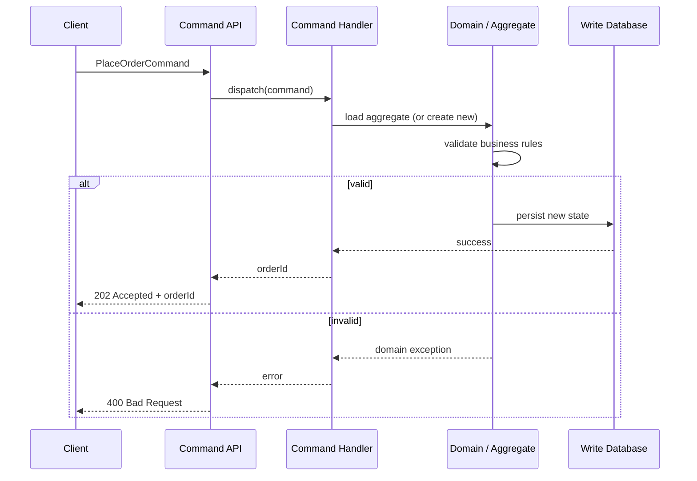

The diagram highlights that a command handler's job is to load the relevant piece of the domain, let the domain decide whether the command is valid, and only then persist the result, returning a minimal acknowledgement rather than data.

#### Real-Life Use Case: Bank Account Withdrawal

Consider a banking application processing a `WithdrawFundsCommand`. The command model must check the account balance, daily withdrawal limits, account status (frozen or active), and fraud rules before allowing the withdrawal. If any rule fails, the command is rejected with a specific business reason (`InsufficientFundsException`, `DailyLimitExceededException`). None of this logic belongs on the read side; a "view account balance" query should never be able to trigger, or be blocked by, withdrawal business rules. This clean separation is exactly what lets the bank harden and audit the write path (the money-moving logic) independently from the read path (statements, balance widgets, notifications).

#### Java/Spring Boot Code Example: Command Handler with Business Rules

```java
@Service
public class OrderCommandService {

    private final OrderRepository orderRepository; // write-side repository
    private final ApplicationEventPublisher eventPublisher;

    public OrderCommandService(OrderRepository orderRepository,
                                ApplicationEventPublisher eventPublisher) {
        this.orderRepository = orderRepository;
        this.eventPublisher = eventPublisher;
    }

    @Transactional
    public String handle(PlaceOrderCommand command) {
        if (command.getItems() == null || command.getItems().isEmpty()) {
            throw new InvalidCommandException("Order must contain at least one item");
        }

        Order order = Order.createNew(command.getCustomerId(), command.getItems());
        orderRepository.save(order);

        // Notify the read side (and other interested parties) that state changed
        eventPublisher.publishEvent(new OrderPlacedEvent(order.getId(), order.getCustomerId(),
                order.getItems(), order.getTotalAmount()));

        return order.getId();
    }

    @Transactional
    public void handle(CancelOrderCommand command) {
        Order order = orderRepository.findById(command.getOrderId())
                .orElseThrow(() -> new OrderNotFoundException(command.getOrderId()));

        // Business invariant enforced only in the write model
        if (order.getStatus() == OrderStatus.SHIPPED) {
            throw new IllegalOrderStateException("Cannot cancel an order that has already shipped");
        }

        order.cancel();
        orderRepository.save(order);
        eventPublisher.publishEvent(new OrderCancelledEvent(order.getId()));
    }
}
```

Note how the handler never returns query-friendly data such as a full order DTO; it returns an identifier (`String orderId`) or nothing (`void`), and business invariants (like refusing to cancel a shipped order) live entirely inside this write-side service and domain object.

#### Interview Questions and Answers

**Q1: What is the responsibility of the command side in CQRS?**
A: The command side accepts intent-revealing instructions to change state, validates them against business rules and invariants, applies the change to the domain model, persists it, and returns only an acknowledgement or identifier, never query data.

**Q2: Why should commands avoid returning full domain objects or DTOs?**
A: Returning full data from a command blurs the CQRS boundary and tempts callers to rely on command responses for reading data, which reintroduces coupling between the two models and can hide the fact that the read data may not yet be reflected in any read-optimized projection. Keeping the response minimal (an ID or status) keeps the separation clean and forces reads to go through the query side.

**Q3: Where do business invariants live in a CQRS system?**
A: Exclusively in the write/command model (typically inside domain entities or aggregates). The read/query model should contain no business rule enforcement, only data shaping and retrieval logic.

**Q4: How should command validation failures be communicated?**
A: Through explicit, typed exceptions or rejection responses (e.g., `InsufficientFundsException`, HTTP 400/409 responses) that clearly convey which business rule was violated, so calling code and users receive actionable, specific feedback rather than a generic failure.

**Q5: Can a single command modify multiple aggregates?**
A: It is a best practice for a command to modify a single aggregate within one transaction, to keep transactional consistency boundaries small and predictable. If multiple aggregates need to change as a result of one business action, this is usually coordinated via domain events and eventual consistency (e.g., a saga), rather than one large transaction spanning several aggregates.

---

### The Query Model (Read Side)

The Query model is the part of the system responsible for serving read requests. It receives queries (requests for data such as `GetOrderHistoryQuery`, `SearchProductsQuery`), retrieves data, and returns it shaped exactly as the caller needs it, without ever mutating state.

Key characteristics of a well-designed query model:

- **Queries never change state.** A query is idempotent and side-effect-free by definition; running the same query a hundred times must return consistent results (up to normal data changes) and never modify anything.
- **The read model is denormalized and shaped for consumption.** Instead of reusing the write side's normalized entities, the read model typically stores flattened, pre-joined, UI- or report-specific projections (DTOs, view tables, materialized views, or search indices), often duplicating data across multiple projections.
- **Different queries can use different read models.** A single write-side aggregate (e.g., `Order`) might be projected into several read models simultaneously: an `OrderHistoryView`, an `OrderAdminSummaryView`, an `OrderAnalyticsView`, each optimized for its own consumer.
- **The read side can be scaled and technologically diverse.** Because it does not need to run business logic or maintain strict transactional invariants, it is free to use a completely different storage technology than the write side, for example Elasticsearch for full-text search, Redis for hot low-latency lookups, or a read replica for reporting.
- **The read model can be rebuilt.** Since it is derived data (rather than the source of truth), a read model can, in principle, be dropped and regenerated entirely from the write side's data or event history if it becomes corrupted or its schema needs to change.

#### Diagram: Query Flow

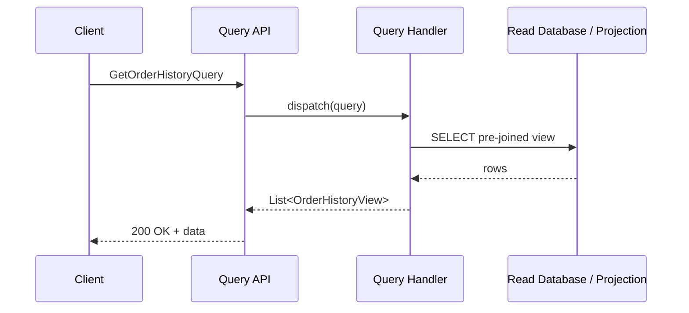

Unlike the command flow, the query flow has no branching for business-rule validation; it is a straight-line path from request to a read-optimized store and back, which is why query paths are typically much simpler and faster than command paths.

#### Real-Life Use Case: Product Search and Catalog Browsing

An online marketplace needs to support full-text product search with filters (price range, category, ratings, availability) and typo tolerance. The write side (product catalog service) stores products in a normalized relational schema optimized for inventory and pricing updates. The read side, however, projects each product update into an Elasticsearch index shaped specifically for search: denormalized fields, pre-computed facets, and a search-optimized text analyzer. Search queries never touch the write database at all; they are served entirely from Elasticsearch, which can be scaled and tuned independently of the transactional catalog store, and can even be rebuilt from scratch by replaying all product-updated events if the index schema changes.

#### Java/Spring Boot Code Example: Query Handler with a Dedicated Read Model

```java
// Read-optimized projection, intentionally denormalized and different from the write-side Order entity
public class OrderHistoryView {
    private String orderId;
    private String customerName;   // denormalized: joined in ahead of time
    private String status;
    private BigDecimal totalAmount;
    private LocalDateTime placedAt;

    // getters and setters omitted for brevity
}

public interface OrderHistoryRepository extends JpaRepository<OrderHistoryViewEntity, String> {
    Page<OrderHistoryViewEntity> findByCustomerId(String customerId, Pageable pageable);
}

@Service
public class OrderQueryService {

    private final OrderHistoryRepository orderHistoryRepository; // read-side repository, separate from write side

    public OrderQueryService(OrderHistoryRepository orderHistoryRepository) {
        this.orderHistoryRepository = orderHistoryRepository;
    }

    // Read-only, never touches business rules or the write model
    @Transactional(readOnly = true)
    public List<OrderHistoryView> handle(GetOrderHistoryQuery query) {
        Pageable pageable = PageRequest.of(query.getPage(), query.getSize(),
                Sort.by("placedAt").descending());

        return orderHistoryRepository.findByCustomerId(query.getCustomerId(), pageable)
                .map(this::toView)
                .getContent();
    }

    private OrderHistoryView toView(OrderHistoryViewEntity entity) {
        OrderHistoryView view = new OrderHistoryView();
        view.setOrderId(entity.getOrderId());
        view.setCustomerName(entity.getCustomerName());
        view.setStatus(entity.getStatus());
        view.setTotalAmount(entity.getTotalAmount());
        view.setPlacedAt(entity.getPlacedAt());
        return view;
    }
}
```

Notice that `OrderHistoryRepository` and `OrderHistoryViewEntity` are entirely separate from the write side's `OrderRepository` and `Order` aggregate; the read model is free to be shaped, indexed, and even stored however best serves this specific query.

#### Interview Questions and Answers

**Q1: What is the responsibility of the query side in CQRS?**
A: The query side is responsible solely for retrieving and shaping data for consumers. It must never mutate state, and it is free to use denormalized, pre-joined, or entirely differently structured data than the write side, in whatever form best serves the specific read use case.

**Q2: Why is it acceptable, and even encouraged, for the read model to duplicate data from the write model?**
A: Because the read model's purpose is fast, convenient retrieval, not being the source of truth. Duplicating and denormalizing data (e.g., embedding a customer's name directly in an order history row instead of joining) trades storage space and synchronization effort for significantly simpler and faster reads, which is a good trade-off since storage is cheap and read latency directly affects user experience.

**Q3: Can the read side use a different database technology than the write side?**
A: Yes, and this is one of CQRS's biggest advantages. The write side often uses a strongly consistent relational database to enforce invariants, while the read side can use whatever technology best matches the query pattern, for example Elasticsearch for search, Redis for low-latency lookups, or a columnar store for analytics.

**Q4: What happens to the read model if it needs a schema change or becomes corrupted?**
A: Because the read model is derived, non-authoritative data, it can be dropped and regenerated by replaying the underlying events or re-syncing from the write side's current state, rather than requiring a delicate, in-place migration as would be needed for a system of record.

**Q5: Should query handlers ever contain business logic?**
A: No. Query handlers should be limited to data retrieval, filtering, sorting, pagination, and shaping. Business rules and invariants belong exclusively to the command/write side; mixing business logic into queries reintroduces the coupling CQRS is designed to remove.

---

### Why Separate Read and Write Models

This topic explains the core motivation behind CQRS: why a single shared model for both reads and writes becomes a liability as a system grows, and what specifically improves once the two responsibilities are split.

- **Conflicting optimization goals.** A write model wants to be normalized (to avoid update anomalies and keep invariants easy to enforce in one place), while a read model wants to be denormalized (to avoid expensive joins and serve data as close as possible to its final display shape). A single shared model can never fully satisfy both goals at once; it is always a compromise.
- **Read and write workloads scale differently.** Most real-world applications are read-heavy, often by ratios of 10:1, 100:1, or more (e.g., a product is viewed thousands of times for every one purchase). Sharing a single model and single database means the write path's transactional guarantees and locking behavior constrain how much the read path can be scaled, and vice versa.
- **Divergent consistency requirements.** Writes typically need strong consistency (an order total must be exactly correct), whereas many reads can comfortably tolerate slightly stale data (a "recommended products" widget being a few seconds old is invisible to users). Forcing both through the same consistency model over-engineers the read path or under-engineers the write path.
- **Independent evolution.** UI and reporting requirements change constantly (new dashboard, new filter, new report), while the core business rules that govern writes change far less often. If both share one model, every new read requirement risks destabilizing the write model, and vice versa.
- **Simpler, more focused code.** A command handler that only has to think about "is this change valid" is simpler to reason about and test than one that also has to account for every possible read shape. Likewise, a query handler that only has to think about "how do I return this data fast" does not need to understand business invariants at all.

#### Diagram: Shared Model vs Separated Models

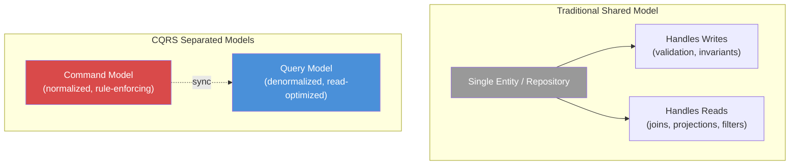

The left side shows a single model straining to satisfy two conflicting sets of requirements at once; the right side shows each model free to be optimized purely for its own purpose, connected only by a synchronization mechanism.

#### Real-Life Use Case: Social Media Platform

A social media platform's "post" entity is written rarely per user (a handful of posts per day) but read extremely often (a single popular post might be viewed millions of times through feeds, search, and profile pages). If the write and read paths shared one model and one database, every feed-rendering read would compete for the same database connections and locks as the (comparatively rare) write operations, and any schema change needed for a new feed-ranking feature would risk breaking the core "create a post" write path. By separating the two, the platform can keep post creation on a strongly consistent primary store while serving billions of feed reads from a separately scaled, cached, and denormalized read layer, without either side interfering with the other.

#### Java/Spring Boot Code Example: Same Data, Two Purpose-Built Representations

```java
// Write-side aggregate: normalized, focused on invariants
@Entity
public class Order {
    @Id
    private String id;
    private String customerId;
    @OneToMany(cascade = CascadeType.ALL)
    private List<OrderLineItem> items;
    @Enumerated(EnumType.STRING)
    private OrderStatus status;

    public void cancel() {
        if (this.status == OrderStatus.SHIPPED) {
            throw new IllegalOrderStateException("Cannot cancel a shipped order");
        }
        this.status = OrderStatus.CANCELLED;
    }
    // other domain behavior omitted for brevity
}

// Read-side projection: denormalized, focused on fast, ready-to-render data
@Entity
@Table(name = "order_history_view")
public class OrderHistoryViewEntity {
    @Id
    private String orderId;
    private String customerName;     // denormalized from Customer
    private String customerEmail;    // denormalized from Customer
    private String status;
    private BigDecimal totalAmount;  // pre-computed, not derived at read time
    private int itemCount;           // pre-computed
    private LocalDateTime placedAt;
    // getters and setters omitted for brevity
}
```

The write side's `Order` never exposes a pre-computed `itemCount` or a denormalized `customerName`, those concerns belong entirely to the read side's `OrderHistoryViewEntity`, which is free to store convenience fields the write model would never need.

#### Interview Questions and Answers

**Q1: What is the single biggest reason to separate read and write models?**
A: Read and write workloads have fundamentally different, often conflicting, optimization goals: writes want normalization and strong consistency to protect invariants, while reads want denormalization and speed. A single shared model can only ever be a compromise between the two; separating them lets each be optimized for its actual purpose.

**Q2: How does separating models help with scaling?**
A: Because most applications are read-heavy, the read side can be independently scaled out (more replicas, caching layers, different storage technology) without needing to scale the more sensitive, transactionally constrained write side in lockstep, and without read traffic competing for the same resources as writes.

**Q3: Does CQRS mean the write and read models can never share any code?**
A: Not necessarily. In simple CQRS implementations, both models might read from the same underlying database tables. What is always separated is the responsibility and the code path: distinct DTOs, distinct handlers, and no shared "do everything" repository. As requirements grow, the underlying storage is often separated too.

**Q4: How does model separation affect the pace of feature development?**
A: It decouples the evolution of the two sides. A new report or dashboard (a read concern) can be added by creating a new projection without touching the write model or its invariants, and a new business rule (a write concern) can be added without needing to update every existing read projection.

**Q5: What is a potential downside of separating the models too aggressively for a simple application?**
A: Unnecessary complexity. If an application's read and write needs are simple and closely aligned (e.g., an internal admin tool with low traffic), building two full model hierarchies, mapping code, and synchronization logic adds development and maintenance overhead with little corresponding benefit.

---

### Data Synchronization Between Write and Read Models

Once write and read models are separated, especially when they use different databases, the read side must somehow be kept up to date with changes made on the write side. This is the data synchronization problem, and it is the central engineering challenge of any non-trivial CQRS implementation.

Common synchronization strategies, from simplest to most involved:

- **Synchronous, in-transaction updates.** The command handler updates both the write model and the read model's projection in the same database transaction. This is the simplest approach and gives strong consistency, but it couples the read side's schema and availability tightly to the write path, which reduces the benefits of separation.
- **Synchronous, post-commit updates.** The command handler commits the write, then immediately updates the read projection in a second step (still within the request). Slightly more flexible than doing both in one transaction, but the two can go out of sync if the second step fails after the first succeeds.
- **Domain events with an in-process event bus.** The write side publishes a domain event (e.g., `OrderPlacedEvent`) after a successful write, and one or more in-process listeners update the read projections. This decouples the code but the two stores can still be inconsistent for a short time, and a listener failure needs its own handling (retry, dead-letter queue).
- **Asynchronous messaging (queues / event bus).** The write side publishes an event to a message broker (Kafka, RabbitMQ, SQS), and one or more independent consumers update their own read projections. This is the most decoupled, most resilient, and most scalable approach, at the cost of the read side lagging behind by however long message delivery and processing take.
- **Change Data Capture (CDC).** A tool (Debezium, AWS DMS) tails the write database's transaction/binlog and streams every row-level change as an event, without the application code needing to explicitly publish anything. This guarantees no write is ever missed (since it reads directly from the database log), at the cost of operational complexity in running and monitoring the CDC pipeline.

Regardless of mechanism, the key design questions are: how quickly must the read side catch up (the acceptable staleness window), what happens if synchronization fails or an event is processed out of order, and how are gaps detected and repaired (reconciliation jobs, idempotent consumers, replay from source of truth).

#### Diagram: Synchronization Mechanisms Compared

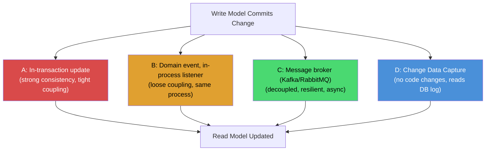

Moving from A to D generally trades immediate consistency for greater decoupling, resilience, and independent scalability of the read side.

#### Real-Life Use Case: Ride-Sharing Trip Status Updates

In a ride-sharing application, the write side (trip service) updates a trip's status through a strict state machine (`REQUESTED` -> `DRIVER_ASSIGNED` -> `IN_PROGRESS` -> `COMPLETED`). Multiple read models need to reflect this: the rider's live-tracking screen (needs near-instant updates), a driver-earnings report (can be minutes behind), and a fraud-detection analytics pipeline (can be hours behind). The platform uses a single `TripStatusChangedEvent` published to Kafka whenever the write side changes a trip's state. The live-tracking read model consumes it with a low-latency, dedicated consumer group, while the earnings and analytics read models consume the exact same event stream at their own pace, from their own consumer groups, entirely independently of each other and of the write path.

#### Java/Spring Boot Code Example: Publishing and Consuming Synchronization Events

```java
// 1. Write side publishes a domain event after committing the state change
@Service
public class TripCommandService {

    private final TripRepository tripRepository;
    private final KafkaTemplate<String, TripStatusChangedEvent> kafkaTemplate;

    public TripCommandService(TripRepository tripRepository,
                               KafkaTemplate<String, TripStatusChangedEvent> kafkaTemplate) {
        this.tripRepository = tripRepository;
        this.kafkaTemplate = kafkaTemplate;
    }

    @Transactional
    public void markInProgress(String tripId) {
        Trip trip = tripRepository.findById(tripId)
                .orElseThrow(() -> new TripNotFoundException(tripId));
        trip.startTrip(); // enforces valid state transitions internally
        tripRepository.save(trip);

        // Published after the DB transaction commits (e.g., via TransactionalEventListener)
        kafkaTemplate.send("trip-status-changed",
                tripId, new TripStatusChangedEvent(tripId, trip.getStatus(), Instant.now()));
    }
}

// 2. Read side consumes the event independently and updates its own projection
@Component
public class TripReadModelProjector {

    private final TripLiveStatusRepository liveStatusRepository; // read-side store

    public TripReadModelProjector(TripLiveStatusRepository liveStatusRepository) {
        this.liveStatusRepository = liveStatusRepository;
    }

    @KafkaListener(topics = "trip-status-changed", groupId = "live-tracking-projector")
    public void onTripStatusChanged(TripStatusChangedEvent event) {
        // Idempotent upsert so re-delivery of the same event is safe
        liveStatusRepository.upsertStatus(event.getTripId(), event.getStatus(), event.getTimestamp());
    }
}
```

Each consumer group (`live-tracking-projector`, `earnings-projector`, `fraud-analytics-projector`) processes the same topic independently, at its own pace, which means a slow analytics consumer never delays the rider's live-tracking updates.

#### Interview Questions and Answers

**Q1: What is the core synchronization problem in CQRS?**
A: Once the write and read models are separated, particularly onto different data stores, every change made through the command side must be propagated to every relevant read projection so that queries return up-to-date data. Designing how, and how quickly, that propagation happens is the core synchronization challenge.

**Q2: What are the main strategies for synchronizing read models, from simplest to most decoupled?**
A: In-transaction synchronous updates, post-commit synchronous updates, in-process domain events, asynchronous message-broker-based events, and Change Data Capture (CDC) reading the write database's transaction log. Each step trades some consistency guarantees for greater decoupling, resilience, and scalability.

**Q3: What is Change Data Capture (CDC), and why is it attractive for CQRS synchronization?**
A: CDC is a technique (implemented by tools like Debezium) that reads a database's transaction log (e.g., MySQL binlog, PostgreSQL WAL) and emits an event for every row-level insert, update, or delete. It is attractive because it guarantees no change is ever missed, and it requires no changes to application code to publish events explicitly.

**Q4: How do you handle out-of-order or duplicate synchronization events?**
A: By making read-model updates idempotent (e.g., upserts keyed by entity ID, or checking an event version/sequence number before applying it), and by including a version or timestamp in each event so a consumer can detect and discard an event that is older than the state it already has.

**Q5: What happens if the synchronization mechanism fails partway (e.g., the message broker is down)?**
A: With asynchronous messaging, failed or unavailable delivery is typically handled with retries, dead-letter queues, and consumer-side alerting; because the write side already committed successfully, no data is lost, only the read side's freshness is temporarily affected. Reconciliation jobs that periodically compare read projections against the source of truth are a common safety net for catching and repairing any gaps.

---

### Eventual Consistency in CQRS

Whenever the write and read models are synchronized asynchronously (which is the common case once they are backed by separate stores), there is an unavoidable window of time during which the read model does not yet reflect the very latest write. This is eventual consistency: the guarantee that the read side *will* converge to match the write side, given enough time and no further writes, but not instantly.

Important aspects of eventual consistency in a CQRS system:

- **It is a deliberate trade-off, not a bug.** Teams accept a small staleness window in exchange for the read side's independence, scalability, and resilience. The goal is to make that window small enough, and the user experience around it graceful enough, that it does not cause real problems.
- **The staleness window is bounded but not zero.** With a well-tuned message-driven pipeline, the lag is often milliseconds to a few seconds; with batch-based synchronization (e.g., a nightly ETL job), it can be hours. The acceptable lag must be chosen deliberately per use case, not left as an accident of implementation.
- **User experience must account for staleness.** A classic scenario: a user submits a form (a command), the UI immediately redirects to a "view" page (a query), and the newly created item is briefly missing because the read projection has not caught up yet. Common mitigations include: optimistic UI updates (show the submitted data immediately, from the command's own input, without waiting for a query), "read-your-writes" techniques (routing a user's own immediate follow-up read to the write store, or to a session-pinned read replica, until the projection catches up), or simply designing the UI/UX to tolerate a short delay (e.g., "Your order is being processed").
- **Not all data needs the same consistency.** Even within one system, some read paths (e.g., "did my payment succeed") may need to be strongly consistent (routed to the write store directly), while others (e.g., "recommended for you") can tolerate minutes of staleness. CQRS does not mandate a single global consistency level.
- **Failure and retries must not break the "eventual" guarantee.** If a synchronization event is ever silently dropped and never retried, "eventual" consistency turns into "permanent" inconsistency. Robust CQRS systems always pair eventual consistency with reliable delivery (at-least-once messaging, dead-letter queues, monitoring, and reconciliation jobs) so that eventual truly means eventual.

#### Diagram: The Staleness Window

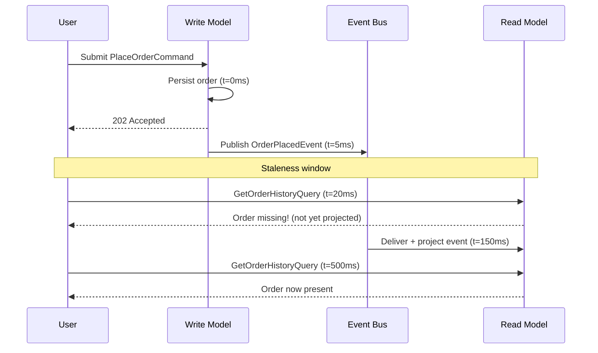

The diagram makes the trade-off concrete: between roughly t=20ms and t=150ms, a query for the order the user just placed would not yet find it, even though the write itself succeeded instantly and durably.

#### Real-Life Use Case: E-Commerce "Order Confirmation" Page

An e-commerce checkout flow places an order (a command) and then immediately redirects the user to an order confirmation page that queries order details (a query). If the read model is populated asynchronously, there is a real risk the confirmation page's query runs before the projection has caught up, showing a confusing "order not found." A common, effective fix is for the checkout flow to pass the data the command already validated (customer, items, computed total) directly to the confirmation page via the command's own response and client-side state, rather than immediately re-querying the read model, then let subsequent visits to "my orders" rely on the read model once it has caught up (typically within milliseconds to low seconds).

#### Java/Spring Boot Code Example: Read-Your-Writes Pattern

```java
@RestController
@RequestMapping("/orders")
public class OrderController {

    private final OrderCommandService commandService;
    private final OrderQueryService queryService;

    public OrderController(OrderCommandService commandService, OrderQueryService queryService) {
        this.commandService = commandService;
        this.queryService = queryService;
    }

    @PostMapping
    public ResponseEntity<OrderConfirmation> placeOrder(@RequestBody PlaceOrderCommand command) {
        String orderId = commandService.handle(command);

        // Build the confirmation directly from the command's own validated input,
        // instead of immediately querying a read model that may not have caught up yet
        OrderConfirmation confirmation = new OrderConfirmation(
                orderId, command.getCustomerId(), command.getItems(), OrderStatus.PLACED);

        return ResponseEntity.accepted().body(confirmation);
    }

    @GetMapping("/{orderId}")
    public ResponseEntity<OrderHistoryView> getOrder(@PathVariable String orderId) {
        // Later reads safely go through the (by-then consistent) read model
        return queryService.findById(orderId)
                .map(ResponseEntity::ok)
                .orElseGet(() -> ResponseEntity.status(HttpStatus.ACCEPTED).build()); // still processing
    }
}
```

Returning HTTP 202 with a fallback "still processing" response instead of a 404 clearly communicates to the client that the resource exists but its read projection has not caught up yet, rather than implying it does not exist at all.

#### Interview Questions and Answers

**Q1: What does eventual consistency mean in the context of CQRS?**
A: It means that after a write is committed on the command side, there is a window of time during which the read side may not yet reflect that change, but it is guaranteed to converge to the correct state once synchronization completes, assuming reliable delivery of the underlying events or changes.

**Q2: Is eventual consistency a flaw in CQRS?**
A: No, it is a deliberate, accepted trade-off made in exchange for decoupling, independent scalability, and resilience of the read side. It becomes a problem only if the staleness window is inappropriate for the specific use case, or if the system fails to communicate/handle that staleness gracefully.

**Q3: How can you avoid confusing users with a "missing data right after I created it" experience?**
A: Common techniques include optimistic UI updates using data already known from the command itself, read-your-writes routing (temporarily reading from the write store or a session-pinned replica for the user's own recent write), and UX patterns that explicitly communicate "processing" states instead of implying the data does not exist.

**Q4: Can every part of a system tolerate the same amount of eventual consistency?**
A: No. Consistency requirements should be assessed per read use case. A payment confirmation status might need to be strongly consistent, while a "customers who bought this also bought" widget can be minutes stale with no negative impact, even within the same application.

**Q5: How do you ensure "eventual" consistency does not become "never" consistency?**
A: By pairing the synchronization mechanism with reliability guarantees, at-least-once delivery, retries with backoff, dead-letter queues for poison messages, monitoring/alerting on consumer lag, and periodic reconciliation jobs that detect and repair any read models that have drifted from the source of truth.

---

### CQRS with Event Sourcing

CQRS and Event Sourcing are separate patterns, but they combine exceptionally well and are frequently discussed together. Event Sourcing changes how the write side stores state: instead of persisting only the current state of an entity (e.g., an `orders` row showing the current status), it persists the full sequence of events that led to that state (`OrderPlaced`, `PaymentReceived`, `OrderShipped`), and the current state is derived by replaying those events.

Why Event Sourcing pairs naturally with CQRS:

- **Events are a natural synchronization mechanism.** If the write side already produces a durable, ordered stream of events as its primary persistence mechanism, that same stream can be consumed directly to build and update read projections, rather than needing a separate CDC or event-publishing step bolted on afterward.
- **Read models become simply "just another projection."** With Event Sourcing, even the write side's "current state" view is technically a projection of the event stream. This makes it conceptually clean to build any number of additional read-side projections (search index, analytics view, cache) from the exact same authoritative event log.
- **Full audit history for free.** Because every state change is stored as an immutable event, the system inherently has a complete, tamper-evident history of everything that happened, which is valuable for audit, debugging, and compliance, independent of CQRS.
- **Read models can be rebuilt from scratch.** If a projection's logic changes or a bug corrupted a read table, it can be deleted and rebuilt by replaying the entire event log from the beginning, something that is much harder to do if the write side only ever stored current-state snapshots.
- **They are not required to use each other.** CQRS can be implemented with a conventional current-state database and CDC or domain events for synchronization (no Event Sourcing at all). Event Sourcing can theoretically be used with a single unified model (no read/write split), though this is rare in practice because Event Sourcing's read patterns (rebuilding state by folding events) are usually a poor fit for arbitrary ad hoc queries.

#### Diagram: Event-Sourced CQRS

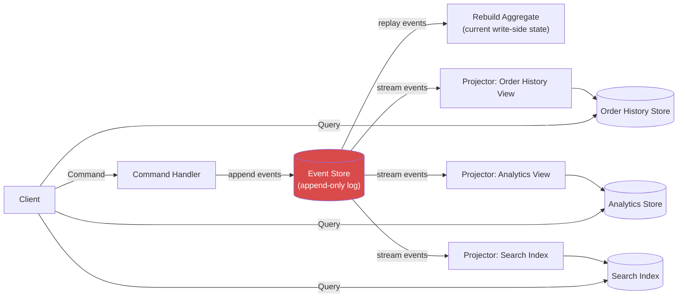

The event store is the single source of truth, and every read model, no matter how differently shaped, is ultimately just a replayable, independently rebuildable projection over that same event stream.

#### Real-Life Use Case: Financial Ledger / Audit-Critical Systems

A brokerage platform needs to record every account action (`FundsDeposited`, `SharesPurchased`, `DividendPaid`, `FundsWithdrawn`) with full auditability, since regulators may require reconstructing the exact state of an account at any historical point in time. Using Event Sourcing, the write side never deletes or overwrites data, it only appends new events, and the current account balance is computed by folding all events for that account. On the read side, one projection maintains a fast "current balance" table for everyday queries, while a separate "point-in-time" projection can replay events up to any given timestamp for audit or dispute-resolution purposes, both derived from the exact same authoritative event log without any risk of divergence in the underlying facts.

#### Java/Spring Boot Code Example: Event-Sourced Aggregate and Projector

```java
// Domain events: immutable facts, the only thing ever persisted for the write side
public abstract class OrderEvent {
    private final String orderId;
    private final Instant occurredAt;
    protected OrderEvent(String orderId, Instant occurredAt) {
        this.orderId = orderId;
        this.occurredAt = occurredAt;
    }
    public String getOrderId() { return orderId; }
    public Instant getOccurredAt() { return occurredAt; }
}

public class OrderPlaced extends OrderEvent {
    private final String customerId;
    private final BigDecimal totalAmount;
    public OrderPlaced(String orderId, String customerId, BigDecimal totalAmount, Instant occurredAt) {
        super(orderId, occurredAt);
        this.customerId = customerId;
        this.totalAmount = totalAmount;
    }
    public String getCustomerId() { return customerId; }
    public BigDecimal getTotalAmount() { return totalAmount; }
}

public class OrderShipped extends OrderEvent {
    public OrderShipped(String orderId, Instant occurredAt) { super(orderId, occurredAt); }
}

// Write-side aggregate: current state is rebuilt by folding events, never stored directly
public class OrderAggregate {
    private String id;
    private OrderStatus status;

    public static OrderAggregate replay(List<OrderEvent> history) {
        OrderAggregate aggregate = new OrderAggregate();
        history.forEach(aggregate::apply);
        return aggregate;
    }

    private void apply(OrderEvent event) {
        if (event instanceof OrderPlaced placed) {
            this.id = placed.getOrderId();
            this.status = OrderStatus.PLACED;
        } else if (event instanceof OrderShipped) {
            this.status = OrderStatus.SHIPPED;
        }
    }
}

// Read-side projector: consumes the same event stream to maintain a fast query table
@Component
public class OrderHistoryProjector {

    private final OrderHistoryRepository orderHistoryRepository;

    public OrderHistoryProjector(OrderHistoryRepository orderHistoryRepository) {
        this.orderHistoryRepository = orderHistoryRepository;
    }

    @EventStoreListener(topic = "order-events") // conceptual annotation for an event-store subscription
    public void on(OrderPlaced event) {
        orderHistoryRepository.insertNew(event.getOrderId(), event.getCustomerId(),
                event.getTotalAmount(), "PLACED", event.getOccurredAt());
    }

    @EventStoreListener(topic = "order-events")
    public void on(OrderShipped event) {
        orderHistoryRepository.updateStatus(event.getOrderId(), "SHIPPED");
    }
}
```

The same two events (`OrderPlaced`, `OrderShipped`) simultaneously rebuild the write side's current state via `OrderAggregate.replay` and feed the read side's `OrderHistoryProjector`, illustrating how one authoritative log serves both purposes.

#### Interview Questions and Answers

**Q1: Are CQRS and Event Sourcing the same thing?**
A: No. CQRS is about separating command (write) responsibility from query (read) responsibility. Event Sourcing is about persisting state as an ordered sequence of events rather than as current-state rows. They are independent patterns that combine very effectively but do not require each other.

**Q2: Why does Event Sourcing pair so well with CQRS?**
A: Because Event Sourcing already produces a durable, ordered event log as the write side's primary persistence mechanism, that same log can be directly streamed to build any number of independent read projections, making event sourcing a natural, built-in synchronization mechanism for CQRS's read side.

**Q3: What is a major operational benefit of event-sourced CQRS beyond the read/write split?**
A: A complete, immutable audit trail of every state change, and the ability to rebuild any read projection from scratch (or reconstruct state as of any point in time) simply by replaying the event log, which is invaluable for debugging, compliance, and recovering from projection bugs.

**Q4: What is a downside of combining CQRS with Event Sourcing?**
A: Increased complexity and a steeper learning curve: developers must think in terms of events and eventual state derivation rather than direct row updates, event schemas must be carefully versioned as they evolve over time, and replaying very long event streams for an aggregate can become a performance concern without techniques like snapshotting.

**Q5: How do you handle an aggregate with a very long event history efficiently?**
A: By periodically persisting a snapshot of the aggregate's current state alongside a reference to the last event applied, so that rebuilding the aggregate only requires loading the latest snapshot and replaying events that occurred after it, rather than replaying the entire history from the beginning every time.

---

### Levels of CQRS: Simple vs Complex

CQRS is not an all-or-nothing choice; it exists on a spectrum, and it is a common mistake to assume it always requires two separate databases and full asynchronous messaging. Understanding the levels helps teams adopt exactly as much CQRS as their problem actually warrants.

- **Level 1: Separate models, same database.** The simplest form. Commands and queries use different classes (different DTOs, different repositories or query objects), but both read from and write to the same underlying tables in the same database. This already yields cleaner code (no more "god" repository doing everything) with almost none of the operational complexity of synchronization, since there is nothing to synchronize; both sides see the same data instantly.
- **Level 2: Separate models, same database, different read paths.** Commands go through the normal ORM/entity layer, but queries bypass it entirely in favor of hand-written, denormalizing SQL, native queries, or database views, still against the same database. This improves read performance and flexibility without introducing any synchronization lag.
- **Level 3: Separate databases, synchronous synchronization.** The read side gets its own database (perhaps a read replica, or a differently indexed store), updated synchronously as part of, or immediately after, the write transaction. This adds real infrastructure complexity but keeps the two sides consistent at all times.
- **Level 4: Separate databases, asynchronous synchronization.** The read side is a separate store, kept up to date via events, messaging, or CDC. This is "full" CQRS as most architecture diagrams depict it: maximum independence and scalability for the read side, at the cost of eventual consistency and meaningfully more moving parts (event schemas, consumers, retries, monitoring).
- **Level 5: CQRS plus Event Sourcing.** The write side's persistence itself becomes an event log rather than current-state rows, and every read model, including the "current state" view used for command validation, is a projection of that log. This is the most powerful but also the most complex and specialized level, typically reserved for domains that also need a strong audit trail or complex temporal queries.

The most important lesson at this topic is that teams should start at the lowest level that solves their actual problem, and move up only when a specific, concrete pain point (read scaling limits, conflicting schema needs, audit requirements) justifies the added complexity, rather than adopting full event-sourced CQRS by default because it is the most commonly diagrammed version.

#### Diagram: The CQRS Complexity Spectrum

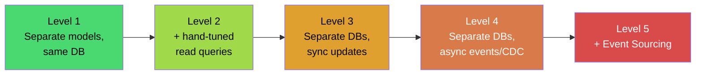

Complexity, operational cost, and read-side scalability/independence all increase moving from left to right; the correct starting point is the leftmost level that solves the team's actual current problem.

#### Real-Life Use Case: A SaaS Startup's Growth Path

A small SaaS product starts with Level 1 CQRS: separate `CreateInvoiceCommand`/`InvoiceQueryService` classes, but both hitting the same PostgreSQL tables, mainly for cleaner code organization. As the product grows and a customer-facing analytics dashboard becomes slow due to complex joins competing with transactional writes, the team moves to Level 3: a read replica dedicated to the dashboard's queries, updated via PostgreSQL's built-in streaming replication (still effectively synchronous/near-real-time). Only once the company adds a separate, high-volume event-driven billing pipeline, and needs a full audit trail of every invoice state change for compliance, does it adopt Level 5 (Event Sourcing) for the billing subsystem specifically, while leaving simpler parts of the product at Level 1 or 2. This staged adoption avoids paying for infrastructure and complexity the product does not yet need.

#### Java/Spring Boot Code Example: Level 1 (Same Database, Separate Models) vs Level 4 (Separate Databases)

```java
// Level 1: Same database, separate models purely for code clarity
@Service
public class InvoiceCommandService {
    private final InvoiceRepository invoiceRepository; // writes to `invoices` table
    public String create(CreateInvoiceCommand cmd) {
        Invoice invoice = Invoice.createNew(cmd.getCustomerId(), cmd.getLineItems());
        invoiceRepository.save(invoice);
        return invoice.getId();
    }
}

@Service
public class InvoiceQueryService {
    private final InvoiceViewRepository invoiceViewRepository; // reads the SAME `invoices` table,
                                                                 // but via hand-tuned, denormalizing SQL
    public InvoiceSummaryView getSummary(String invoiceId) {
        return invoiceViewRepository.findSummaryById(invoiceId); // native @Query, joins done in SQL
    }
}
```

```java
// Level 4: Separate databases, asynchronous synchronization via a message listener
@Service
public class InvoiceCommandService {
    private final InvoiceRepository invoiceRepository;      // writes to the WRITE database
    private final ApplicationEventPublisher eventPublisher;

    public String create(CreateInvoiceCommand cmd) {
        Invoice invoice = Invoice.createNew(cmd.getCustomerId(), cmd.getLineItems());
        invoiceRepository.save(invoice);
        eventPublisher.publishEvent(new InvoiceCreatedEvent(invoice.getId(), invoice.getCustomerId()));
        return invoice.getId();
    }
}

@Component
public class InvoiceReadModelSync {
    private final InvoiceSummaryReadRepository readRepository; // separate READ database

    @Async
    @TransactionalEventListener(phase = TransactionPhase.AFTER_COMMIT)
    public void on(InvoiceCreatedEvent event) {
        readRepository.upsertSummary(event.getInvoiceId(), event.getCustomerId());
    }
}
```

The two code samples look structurally similar at the service layer, the difference that actually determines the CQRS "level" is entirely in the infrastructure: which database each repository points to, and whether the update happens inline or via an asynchronous listener.

#### Interview Questions and Answers

**Q1: Does CQRS always require two separate databases?**
A: No. CQRS fundamentally requires only separating the responsibility (and typically the code/model) for commands from queries. Using two physically separate databases with asynchronous synchronization is one implementation option, often called "full" CQRS, but simpler levels using a single shared database are equally valid and much lower cost.

**Q2: What is the risk of jumping straight to the most complex CQRS implementation (separate databases plus Event Sourcing) for a new project?**
A: Over-engineering. The team pays the full cost of synchronization infrastructure, eventual consistency handling, and event-versioning discipline before knowing whether their actual read/write patterns require it, which slows delivery and increases operational burden without a matching benefit.

**Q3: What is a practical first step toward CQRS for a team currently using a single CRUD model?**
A: Split the code into distinct command and query classes/services first (Level 1), while still using the same database. This alone often clarifies responsibilities and removes "god" repository classes, and it can be done incrementally without any new infrastructure.

**Q4: What typically triggers a move from same-database CQRS to separate-database CQRS?**
A: Concrete, measured pain points: the read workload's query patterns or scaling needs start conflicting with the write workload's transactional requirements (e.g., analytical queries causing lock contention or unacceptable latency on the transactional path), or the read side needs a fundamentally different technology (e.g., a full-text search engine).

**Q5: Can different parts of the same system sit at different CQRS levels simultaneously?**
A: Yes, and this is common and recommended. A system's core, high-traffic subsystem (e.g., billing or order processing) might justify full event-sourced CQRS, while an internal admin module in the same system stays at Level 1 with a single shared model, matched to its own, much simpler requirements.

---

### Messaging and Event-Driven Propagation

At Level 4 and above, CQRS relies on a messaging infrastructure to propagate changes from the write side to one or more read side projections. This topic looks specifically at the messaging concerns that make that propagation reliable, scalable, and maintainable.

- **Choice of broker.** Kafka is a common choice when the event log itself is valuable (replay, multiple independent consumer groups, high throughput), while RabbitMQ, AWS SQS/SNS, or Azure Service Bus are common when simpler point-to-point or fan-out queueing semantics are sufficient and full log retention is not required.
- **At-least-once delivery and idempotency.** Most messaging systems guarantee at-least-once delivery under failure conditions (a consumer may receive the same message more than once). Read-model projectors must therefore be idempotent, applying the same event twice must produce the same result as applying it once, typically via upserts keyed by entity ID plus an event sequence/version check.
- **Ordering guarantees.** Systems like Kafka guarantee order only within a partition. Events that must be applied in order for a given entity (e.g., all events for one `orderId`) should be routed to the same partition (commonly by keying on the entity's ID) so a projector never sees `OrderShipped` before `OrderPlaced` for the same order.
- **The transactional outbox pattern.** A classic pitfall is publishing an event to a message broker in a separate step from committing the database transaction; if the process crashes between the two, the write succeeds but the event is lost (or vice versa). The transactional outbox pattern solves this by writing the event to an "outbox" table in the same local database transaction as the state change, then having a separate relay process (or CDC) reliably publish rows from that outbox table to the broker.
- **Consumer group independence.** Multiple read projections (search index, analytics store, notification service) typically each run their own consumer group against the same event topic, so that one slow or failing consumer never blocks or delays the others, and each can be scaled, restarted, or rebuilt independently.

#### Diagram: Transactional Outbox Pattern

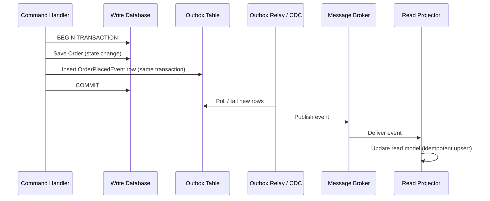

Because the state change and the outbox event insert happen in the same local transaction, either both are committed or neither is, eliminating the "write succeeded but event was lost" failure mode.

#### Real-Life Use Case: Multi-Consumer Notification and Analytics Pipeline

A food-delivery platform publishes an `OrderStatusChanged` event every time an order moves between states. Three independent systems consume the exact same topic: a push-notification service (tells the customer "your food is on the way," needs low latency), a restaurant-facing dashboard (shows current order queue, needs near real-time updates), and a nightly analytics warehouse (aggregates delivery time metrics, tolerates hours of lag). Each consumer uses its own Kafka consumer group, so a temporary slowdown in the analytics warehouse's batch processing never delays the time-sensitive push notification or dashboard updates, and any one consumer can be paused, redeployed, or rebuilt from the beginning of the topic without affecting the others.

#### Java/Spring Boot Code Example: Transactional Outbox with Spring

```java
@Entity
@Table(name = "outbox_events")
public class OutboxEvent {
    @Id @GeneratedValue
    private Long id;
    private String aggregateId;
    private String eventType;
    @Lob
    private String payload; // JSON-serialized event
    private boolean published = false;
    // getters and setters omitted for brevity
}

@Service
public class OrderCommandService {

    private final OrderRepository orderRepository;
    private final OutboxEventRepository outboxRepository;
    private final ObjectMapper objectMapper;

    @Transactional // same local transaction covers both writes
    public String placeOrder(PlaceOrderCommand command) {
        Order order = Order.createNew(command.getCustomerId(), command.getItems());
        orderRepository.save(order);

        OutboxEvent outboxEvent = new OutboxEvent();
        outboxEvent.setAggregateId(order.getId());
        outboxEvent.setEventType("OrderPlaced");
        outboxEvent.setPayload(toJson(new OrderPlacedEvent(order.getId(), order.getCustomerId())));
        outboxRepository.save(outboxEvent); // written atomically with the order itself

        return order.getId();
    }

    private String toJson(Object event) {
        try {
            return objectMapper.writeValueAsString(event);
        } catch (JsonProcessingException e) {
            throw new EventSerializationException(e);
        }
    }
}

// Separate relay process/scheduled job publishes unpublished outbox rows to Kafka
@Component
public class OutboxRelay {

    private final OutboxEventRepository outboxRepository;
    private final KafkaTemplate<String, String> kafkaTemplate;

    @Scheduled(fixedDelay = 500)
    public void relayPendingEvents() {
        List<OutboxEvent> pending = outboxRepository.findTop100ByPublishedFalseOrderById();
        for (OutboxEvent event : pending) {
            kafkaTemplate.send("order-events", event.getAggregateId(), event.getPayload());
            event.setPublished(true);
            outboxRepository.save(event);
        }
    }
}
```

The `@Transactional` boundary in `placeOrder` guarantees the order row and its outbox event row are committed together or not at all; the separate `OutboxRelay` then handles the actual, potentially unreliable, network call to Kafka.

#### Interview Questions and Answers

**Q1: Why can't you simply publish an event to a message broker right after saving to the database, in two separate steps?**
A: Because the two operations are not atomic: if the process crashes or the broker call fails after the database commit but before the publish succeeds (or vice versa), the write and the event can end up inconsistent, either losing the event entirely or publishing an event for a write that never actually committed.

**Q2: What is the transactional outbox pattern, and what problem does it solve?**
A: It is a pattern where the event to be published is written to an "outbox" table within the same local database transaction as the actual state change, guaranteeing both succeed or both fail together. A separate relay process or CDC tool then reliably publishes rows from the outbox table to the message broker, decoupling the atomic local write from the less reliable network publish step.

**Q3: Why must read-model projectors be idempotent?**
A: Because most messaging systems only guarantee at-least-once delivery, meaning a consumer can receive the same event more than once (due to retries, rebalances, or redelivery after a crash). An idempotent projector (e.g., an upsert keyed by entity ID and event version) produces the same correct result whether an event is applied once or multiple times.

**Q4: How do you guarantee events for the same entity are processed in the correct order?**
A: By ensuring events for a given entity are routed to the same partition (commonly by keying messages on the entity's ID in systems like Kafka, which guarantee ordering only within a partition), and, if there are multiple consumer instances, ensuring each partition is consumed by only one instance at a time.

**Q5: Why do independent read projections typically use separate consumer groups on the same topic?**
A: So that each projection's processing speed, failures, and restarts are fully isolated from the others; a slow or crashing analytics consumer, for example, will not delay or block a time-sensitive notification consumer, since each consumer group tracks its own independent read offset on the shared topic.

---

### Scaling Reads and Writes Independently

One of the most practical, business-visible benefits of CQRS is that it allows the read side and write side to be scaled using completely different strategies, matched to their very different traffic characteristics.

- **Read traffic is usually much higher volume.** Product views, search queries, dashboard loads, and report generation typically outnumber actual writes (orders placed, records updated) by one or more orders of magnitude. Once reads have their own dedicated store, they can be scaled horizontally (more read replicas, more cache nodes, more search-cluster shards) without that scaling effort touching the write path at all.
- **Read scaling techniques.** Because the read side does not need to enforce strict transactional invariants across writes, it can freely use read replicas, in-memory caches (Redis, Memcached), CDNs for public data, materialized views, and denormalized, purpose-built stores like Elasticsearch, each scaled independently to match its own specific query load.
- **Write scaling techniques.** The write side, needing strong consistency and invariant enforcement, typically scales differently: vertical scaling of a primary database, sharding by a business key (e.g., customer ID or tenant ID), or, in event-sourced systems, partitioning the event log by aggregate ID so different aggregates can be processed and stored on different partitions/nodes in parallel.
- **Independent failure domains.** Because reads and writes are handled by different infrastructure, a spike in read traffic (a viral product going trending, a reporting job running at month-end) does not risk exhausting resources needed for the write path, and vice versa, a burst of writes (a flash sale) does not degrade the read experience for the rest of the catalog.
- **Cost efficiency.** Read replicas and caches are usually far cheaper to run at scale than scaling a strongly consistent, transactional primary database, so CQRS often reduces overall infrastructure cost for read-heavy systems by moving the bulk of traffic onto cheaper, purpose-built read infrastructure.

#### Diagram: Independent Scaling of Read and Write Paths

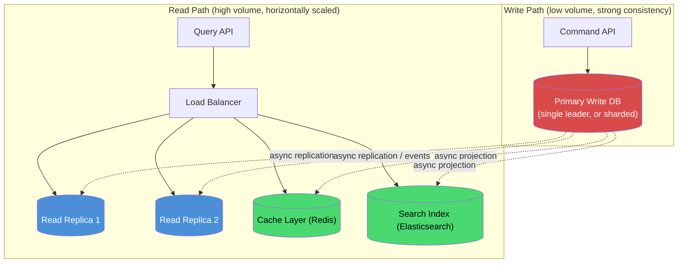

The write path stays intentionally small and tightly controlled, while the read path fans out to as many horizontally scaled, purpose-built stores as the application's query patterns require.

#### Real-Life Use Case: Ticket-Booking Platform During a High-Demand Sale

A concert ticket-booking platform faces extreme read traffic (hundreds of thousands of users refreshing seat-availability pages) alongside a much smaller, but strictly consistency-sensitive, write workload (the actual seat reservation and payment). With CQRS, seat-availability *browsing* is served from a heavily cached, horizontally scaled read layer that can absorb the traffic spike, while the actual "reserve this seat" command still goes through a single strongly consistent write path (often with optimistic locking or a distributed lock per seat) to guarantee no seat is sold twice. Without this separation, the sheer volume of read traffic alone could overwhelm the same database that must correctly and safely process reservations.

#### Java/Spring Boot Code Example: Routing Reads to a Replica/Cache and Writes to the Primary

```java
// Write side: always targets the primary datasource, configured for strong consistency
@Service
public class SeatCommandService {

    private final SeatRepository seatRepository; // @Primary datasource

    @Transactional
    public void reserveSeat(ReserveSeatCommand command) {
        Seat seat = seatRepository.findByIdForUpdate(command.getSeatId()) // pessimistic lock
                .orElseThrow(() -> new SeatNotFoundException(command.getSeatId()));

        if (seat.getStatus() != SeatStatus.AVAILABLE) {
            throw new SeatAlreadyReservedException(command.getSeatId());
        }

        seat.reserveFor(command.getCustomerId());
        seatRepository.save(seat);
    }
}

// Read side: targets a cache first, falling back to a read replica, never the primary
@Service
public class SeatQueryService {

    private final RedisTemplate<String, SeatAvailabilityView> cache;
    private final SeatReadReplicaRepository readReplicaRepository; // datasource pointed at a replica

    public List<SeatAvailabilityView> getAvailability(String eventId) {
        String cacheKey = "seat-availability:" + eventId;
        List<SeatAvailabilityView> cached = cache.opsForValue().get(cacheKey);
        if (cached != null) {
            return cached; // served without touching any database
        }

        List<SeatAvailabilityView> fromReplica = readReplicaRepository.findByEventId(eventId);
        cache.opsForValue().set(cacheKey, fromReplica, Duration.ofSeconds(5));
        return fromReplica;
    }
}
```

`SeatCommandService` uses a pessimistic, strongly consistent write path against the primary datasource, while `SeatQueryService` never touches the primary at all, serving from cache first and a horizontally scaled replica second, so massive read traffic cannot contend with, or slow down, the seat-reservation write path.

#### Interview Questions and Answers

**Q1: Why is independent scaling considered one of the biggest practical benefits of CQRS?**
A: Because in most real systems, read and write traffic differ by orders of magnitude and have very different consistency needs; CQRS lets teams apply the cheapest, most effective scaling technique to each side (caching and replicas for reads, careful transactional scaling for writes) instead of forcing one scaling strategy to serve both.

**Q2: What scaling techniques are typically used on the read side that would not be safe or appropriate on the write side?**
A: Aggressive caching (Redis/CDN), multiple read replicas with only eventual consistency, and denormalized, technology-diverse stores like Elasticsearch. These are safe for reads because a cache miss or slightly stale replica has minimal consequence, whereas applying the same techniques to writes risks lost updates or violated invariants.

**Q3: How does CQRS reduce infrastructure cost for a read-heavy application?**
A: By moving the overwhelming majority of traffic (reads) onto comparatively cheap, horizontally scalable infrastructure such as caches and read replicas, instead of scaling an expensive, strongly consistent primary database to handle both read and write load together.

**Q4: How do you prevent a burst of read traffic from ever affecting the write path?**
A: By ensuring read queries are physically routed to different infrastructure (replicas, caches, search indexes) than write commands, so read traffic has no connection pool, lock, or resource contention with the primary write database, even under extreme read load.

**Q5: Give an example where write-side scaling and read-side scaling require genuinely different techniques.**
A: A ticket-booking system: the write side (reserving a specific seat) needs pessimistic locking or optimistic concurrency control against a single, strongly consistent primary to prevent double-booking, while the read side (browsing seat availability) can be served almost entirely from a cache or CDN that tolerates a few seconds of staleness, since incorrect availability display can be corrected at the moment of actual reservation.

---

### CQRS in a Microservices Architecture

CQRS shows up in microservices architectures both within a single service (splitting one service's own read and write models) and across services (an entirely separate "read service" or "query service" consuming events from one or more "write" or "command" services). This topic focuses on the cross-service pattern, which is especially common at scale.

- **Dedicated query services.** A common microservices pattern is to have one or more owning services expose commands only (e.g., an `Order Service` that only accepts `PlaceOrder`, `CancelOrder`), while a separate `Order Query Service` (or a broader API-composition/BFF layer) subscribes to events from multiple owning services and maintains its own denormalized, cross-domain read store purely for serving queries.
- **Solving cross-service joins.** In a microservices architecture, data needed for a single UI screen (e.g., an order summary showing customer name, product details, and shipment status) often lives in three different services' own databases. Rather than having the API layer make three synchronous calls and join the data on every request (slow, fragile, tightly coupling availability), a CQRS-style read service subscribes to events from all three domains and maintains a single, pre-joined projection ready to be queried in one fast call.
- **Decoupling service availability.** Because the read service's projection is already built ahead of time from past events, it remains queryable even if one of the owning write services is temporarily down, a resilience benefit that synchronous cross-service joins cannot offer.
- **API Gateway / BFF integration.** Read services built this way are frequently exposed directly to a Backend-For-Frontend (BFF) or API Gateway layer, since their entire purpose is to serve fast, UI-shaped reads, while write requests are routed to the appropriate owning service's command API.
- **Bounded contexts stay intact.** Each owning service remains the sole authority for its own data and business rules (Domain-Driven Design's bounded context principle); the cross-service read model is explicitly a derived, secondary copy, and it is a mistake to ever accept writes into it or treat it as authoritative.

#### Diagram: Cross-Service CQRS Read Model

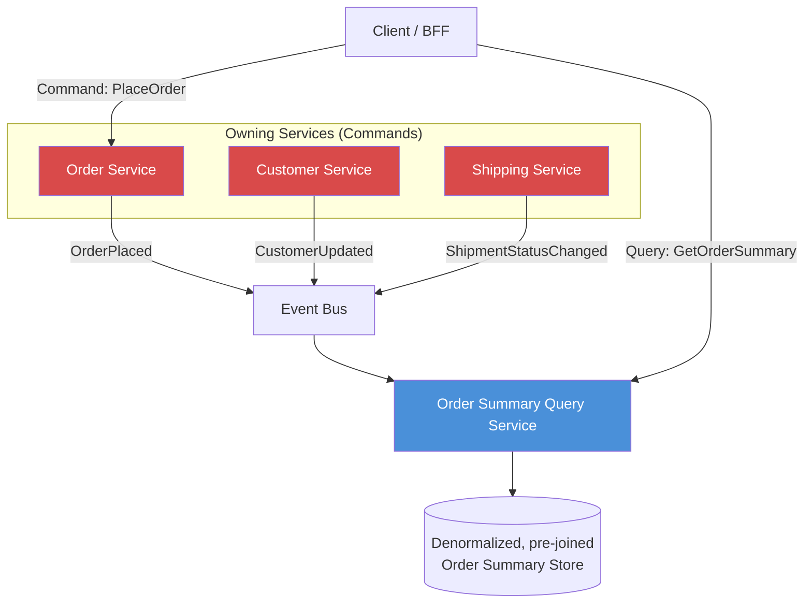

The Order Summary Query Service owns no business logic and accepts no commands; its entire job is to consume events from three independently owned domains and expose one fast, pre-joined read model.

#### Real-Life Use Case: Airline Booking "Trip Summary" Screen

An airline's mobile app shows a "My Trip" screen combining flight details (owned by a Flight Service), seat and baggage selections (owned by a Booking Service), and loyalty points earned (owned by a Loyalty Service), three entirely separate microservices, each with its own database. Instead of the mobile app's backend making three synchronous calls and assembling the response on every screen load (slow, and completely broken if any one of the three services has an outage), a dedicated Trip Summary Query Service subscribes to events from all three services (`FlightScheduled`, `SeatSelected`, `LoyaltyPointsEarned`) and continuously maintains one pre-joined, denormalized trip-summary document per passenger. The "My Trip" screen then makes a single, fast call to this query service, which keeps working (serving the last known state) even during a temporary outage of the Loyalty Service.

#### Java/Spring Boot Code Example: A Dedicated Cross-Service Query Microservice

```java
// This entire microservice only ever consumes events and serves queries; it accepts no commands
@Component
public class TripSummaryProjector {

    private final TripSummaryRepository tripSummaryRepository;

    public TripSummaryProjector(TripSummaryRepository tripSummaryRepository) {
        this.tripSummaryRepository = tripSummaryRepository;
    }

    @KafkaListener(topics = "flight-events", groupId = "trip-summary-query-service")
    public void on(FlightScheduledEvent event) {
        tripSummaryRepository.upsertFlightDetails(
                event.getBookingId(), event.getFlightNumber(), event.getDepartureTime());
    }

    @KafkaListener(topics = "booking-events", groupId = "trip-summary-query-service")
    public void on(SeatSelectedEvent event) {
        tripSummaryRepository.upsertSeatDetails(event.getBookingId(), event.getSeatNumber());
    }

    @KafkaListener(topics = "loyalty-events", groupId = "trip-summary-query-service")
    public void on(LoyaltyPointsEarnedEvent event) {
        tripSummaryRepository.upsertLoyaltyPoints(event.getBookingId(), event.getPointsEarned());
    }
}

@RestController
@RequestMapping("/trip-summary")
public class TripSummaryController {

    private final TripSummaryRepository tripSummaryRepository;

    public TripSummaryController(TripSummaryRepository tripSummaryRepository) {
        this.tripSummaryRepository = tripSummaryRepository;
    }

    // The only endpoint this service exposes: a fast, single-call, pre-joined read
    @GetMapping("/{bookingId}")
    public ResponseEntity<TripSummaryView> getTripSummary(@PathVariable String bookingId) {
        return tripSummaryRepository.findByBookingId(bookingId)
                .map(ResponseEntity::ok)
                .orElseGet(() -> ResponseEntity.notFound().build());
    }
}
```

This microservice has no `Controller` for commands and no business-rule validation at all; it exists purely to consume events from three unrelated owning services and expose one fast, pre-assembled query endpoint, the clearest possible example of CQRS applied across service boundaries.

#### Interview Questions and Answers

**Q1: How does CQRS help solve the "cross-service join" problem in microservices?**
A: Instead of the API layer synchronously calling multiple services and joining their responses on every request (which is slow and creates a hard dependency on every service being available), a dedicated read/query service subscribes to events from all relevant owning services ahead of time and maintains its own pre-joined, denormalized projection, so a single fast query can serve data assembled from many domains.

**Q2: Does the cross-service read model become the new source of truth for that data?**
A: No. Each owning service remains the sole authority and source of truth for its own data and business rules. The cross-service read model is explicitly a derived, secondary, read-only copy; it must never accept writes or be treated as authoritative.

**Q3: What resilience benefit does a CQRS-style query service provide over synchronous cross-service calls?**
A: Because its projection is built ahead of time from past events, the query service can continue serving (slightly stale, but available) data even if one of the owning services it depends on is currently down, whereas a synchronous, on-demand join would fail entirely if any dependency were unavailable.

**Q4: How does this pattern relate to the Backend-For-Frontend (BFF) pattern?**
A: A CQRS-style query service is often used as, or alongside, a BFF: its entire purpose is to expose data shaped exactly for a particular UI or client, built from cross-domain event consumption, which is precisely the problem BFFs are designed to solve.

**Q5: What is a common mistake teams make when introducing cross-service read models?**
A: Allowing the read/query service to accept writes or business logic "for convenience," which breaks the bounded-context ownership model and creates two sources of truth for the same data. Another common mistake is under-investing in idempotent, ordered event handling, leading to a read model that silently drifts out of sync with its owning services over time.

---

### CQRS: Characteristics, Pros, Cons, Use Cases, Components, Patterns, Benefits, Challenges, Best Practices and When to Use

This section summarizes CQRS as a design pattern in its own right, consolidating everything covered in the topics above, with a detailed explanation for every point.

#### Characteristics

- **A structural separation of intent, not just code organization.** CQRS distinguishes between operations that express intent to change something (commands) and operations that express intent to retrieve something (queries), and treats them as fundamentally different kinds of operations with different contracts, different error semantics, and often different models entirely.
- **Commands are imperative and can fail; queries are safe and idempotent.** A command (`CancelOrder`) can be rejected because it violates a business rule, while a query (`GetOrder`) should always be safe to execute repeatedly with no side effects, this asymmetry is a defining characteristic of the pattern.
- **Exists on a spectrum of implementation depth.** CQRS ranges from "separate classes over the same database" to "fully separate databases synchronized asynchronously, combined with Event Sourcing." It is a set of principles applied with a matching, deliberately chosen degree of physical separation, not a single fixed architecture.
- **Introduces (optional but common) eventual consistency.** Once the read and write stores are physically separated, the read side updates asynchronously, which means CQRS at higher levels of implementation is inherently linked to eventual consistency and must be paired with strategies to manage the resulting staleness window.
- **Complements, but is distinct from, Event Sourcing.** CQRS is often discussed alongside Event Sourcing because they combine so well, but the read/write split (CQRS) and the append-only event log persistence model (Event Sourcing) are independent architectural decisions that can be adopted separately.
- **Enables per-operation, rather than system-wide, design decisions.** Because commands and queries are handled by different code paths, teams can make independent choices about validation strictness, caching, consistency level, and even storage technology for each one, rather than being forced into one uniform approach for all data access.

#### Pros / Benefits

- **Independent optimization of read and write models.** The write model can stay normalized and focused on invariants, while the read model can be denormalized and shaped precisely for its consumers, each side is free to be exactly as simple or as specialized as it needs to be, without compromising the other.
- **Independent, often much cheaper, scalability.** Since most systems are read-heavy, the read side can be scaled out with caches, replicas, and specialized stores, while the more sensitive write side stays smaller and simpler, reducing overall infrastructure cost and complexity growth compared to scaling one shared model for both workloads.
- **Simpler, more focused, more testable code.** Command handlers only need to reason about validity and state transitions; query handlers only need to reason about retrieval and shaping. Each is easier to understand, test, and change in isolation than a single class trying to do both.
- **Flexibility to use different storage technologies per side.** The write side can use a strongly consistent relational database while the read side uses Elasticsearch, Redis, or a graph database, whichever best matches its query patterns, something a shared model would never allow.
- **Improved resilience through decoupling.** With asynchronous synchronization, a temporary outage or slowdown in the read infrastructure does not block writes from succeeding, and, in cross-service scenarios, a pre-built read projection can continue serving queries even if an owning write service is temporarily unavailable.
- **Supports parallel and independent team ownership.** Because the command and query sides have clean, well-defined boundaries and contracts, different developers or teams can own and evolve each side (or even different read projections) with minimal coordination overhead.

#### Cons / Challenges

- **Added architectural and code complexity.** Two models mean two sets of classes, two sets of tests, and often two data stores to provision, monitor, and operate, this is a real, ongoing cost that must be justified by an actual, corresponding benefit.
- **Eventual consistency must be actively managed.** Once the read side is asynchronously synchronized, the system must handle the staleness window gracefully (UX design, read-your-writes patterns, or accepting the delay) rather than assuming reads always reflect the very latest writes.
- **Data synchronization is genuinely hard to get right.** Ensuring reliable, ordered, idempotent propagation of every write to every relevant read projection, especially across service boundaries, requires careful engineering (transactional outbox, CDC, idempotent consumers, reconciliation jobs); getting it wrong silently corrupts the read side over time.
- **Higher learning curve and onboarding cost.** Developers unfamiliar with CQRS (and especially with Event Sourcing, if combined) need real ramp-up time to understand why data is duplicated across models, why reads can be stale, and how to trace a change from a command through to its eventual read-side effect.
- **Debugging becomes more involved.** Tracing an issue often requires following a command through business logic, through an event or synchronization pipeline, into a read projection, across potentially several services and stores, which requires better tracing, logging, and monitoring discipline than a single-model CRUD system.
- **Risk of over-application.** It is easy to over-apply CQRS to parts of a system that never actually needed the separation, adding cost and complexity without benefit; this is a discipline problem as much as a technical one.

#### Use Cases

- **High-traffic, read-heavy applications** such as e-commerce catalogs, content platforms, and social feeds, where reads vastly outnumber writes and benefit enormously from independent caching and denormalization.
- **Systems with complex, divergent reporting or dashboard needs**, where many different, differently shaped views must be derived from the same underlying business data (admin dashboards, customer-facing summaries, analytics).
- **Domains requiring strict write-side business rule enforcement combined with flexible read access**, such as banking, inventory management, and order processing, where invariants must be airtight on writes, but reads need to be fast and varied.
- **Systems requiring full auditability or temporal queries**, where CQRS combined with Event Sourcing provides a complete, replayable history of every state change, useful for compliance-heavy domains like finance and healthcare.
- **Microservices architectures needing cross-service, pre-joined read models**, where data owned by multiple independent services must be combined into a single fast read without synchronous, availability-coupling cross-service calls.
- **Collaborative or real-time systems with high write concurrency**, such as collaborative editors or booking systems, where separating command validation from read serving simplifies handling concurrent updates safely.

#### Components

- **Command**: A well-named object representing a single, atomic intent to change state (e.g., `PlaceOrderCommand`), carrying only the data needed to perform that change.
- **Command Handler**: The component that receives a command, validates it against business rules, invokes domain logic, and persists the resulting state change, returning at most an acknowledgement or identifier.
- **Domain Model / Aggregate**: The write-side object(s) that encapsulate business invariants and state transitions, ensuring no invalid state is ever persisted.
- **Query**: An object representing a request for data (e.g., `GetOrderHistoryQuery`), carrying only the filtering/paging criteria needed to retrieve it.
- **Query Handler**: The component that receives a query and retrieves/shapes data from a read-optimized store, with no business logic and no side effects.
- **Read Model / Projection**: The denormalized, often duplicated, representation of data specifically shaped for one or more query use cases, stored in whatever technology best serves fast retrieval.
- **Synchronization Mechanism**: The domain events, message broker, transactional outbox, or Change Data Capture pipeline responsible for propagating write-side changes into every relevant read projection.
- **Event Store (optional, if combined with Event Sourcing)**: An append-only log of every state-changing event, serving as the ultimate source of truth from which both the write side's current state and every read projection are derived.

#### Patterns

- **Mediator / Command-Query Bus**: A dispatching layer (e.g., a lightweight in-process mediator, or a library like MediatR's Java equivalents) that routes each command or query object to its single corresponding handler, keeping controllers thin and handlers independently testable.
- **Transactional Outbox**: Writing an event to an outbox table within the same local transaction as the state change, then relaying it to a message broker separately, to guarantee state changes and their corresponding events are never lost or divergent.
- **Change Data Capture (CDC)**: Using a tool like Debezium to tail the write database's transaction log directly, generating synchronization events without requiring explicit event-publishing code in the application.
- **Materialized View / Projection Rebuild**: Treating each read model as fully disposable and rebuildable from the source of truth (event log or write database), allowing schema changes or corruption recovery by dropping and regenerating the projection.
- **Read-Your-Writes / Session Consistency**: Temporarily routing a user's own immediate follow-up reads to the write store, or to a session-pinned, more up-to-date replica, to mask the staleness window right after that user's own command.
- **Backend-For-Frontend (BFF) Query Service**: A dedicated service, especially in microservices architectures, whose sole job is to consume events from multiple owning services and expose a single, fast, pre-joined read model tailored to a specific client or screen.

#### Best Practices

- Start at the lowest CQRS level that solves your actual, current problem (often just separate command/query classes over one shared database), and add physical separation or asynchronous synchronization only once a concrete pain point justifies it.
- Keep all business rule enforcement exclusively in the command/write side; never let query handlers or read projections contain validation or business logic.
- Make every read-model update idempotent (upserts keyed by entity ID and a version/sequence number) so at-least-once message delivery can never corrupt a projection through duplicate processing.
- Use the transactional outbox pattern (or CDC) rather than publishing events in a separate, non-atomic step from the database commit, to eliminate the "write succeeded but event was lost" failure mode.
- Design the user experience around the staleness window explicitly (optimistic UI updates, read-your-writes for a user's own recent actions, clear "processing" states) rather than discovering it as a confusing bug in production.
- Monitor synchronization lag and consumer health as first-class operational metrics, and build reconciliation jobs that can detect and repair read models that have drifted from the source of truth.
- Treat every read projection as disposable, derived data that can be rebuilt from the source of truth; never let a read store become an accidental second source of truth that other code depends on for correctness.

#### When to Use

- Use CQRS when read and write workloads have genuinely different scaling, consistency, or modeling requirements, most commonly in read-heavy systems where reporting, dashboards, or search need denormalized views that a normalized write model cannot serve efficiently.
- Use CQRS when a domain's business rules are complex enough that a shared, one-size-fits-all model is becoming difficult to reason about, and separating "what makes a change valid" from "how do I display this data" would meaningfully simplify the code.
- Use CQRS when full audit history, temporal queries, or strong compliance/traceability requirements make Event Sourcing attractive, since CQRS naturally accompanies that choice.
- Use CQRS in microservices architectures where a single UI screen or client needs data assembled from multiple independently owned services, and synchronous cross-service joins would be too slow or too fragile.
- Avoid CQRS, or keep it at its simplest level, for straightforward CRUD applications, internal tools, or early-stage products where read and write needs are simple, closely aligned, and unlikely to diverge significantly, since the added complexity would outweigh any benefit at that stage.
