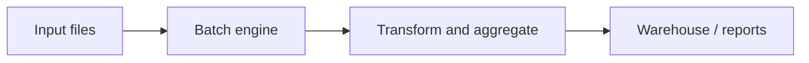
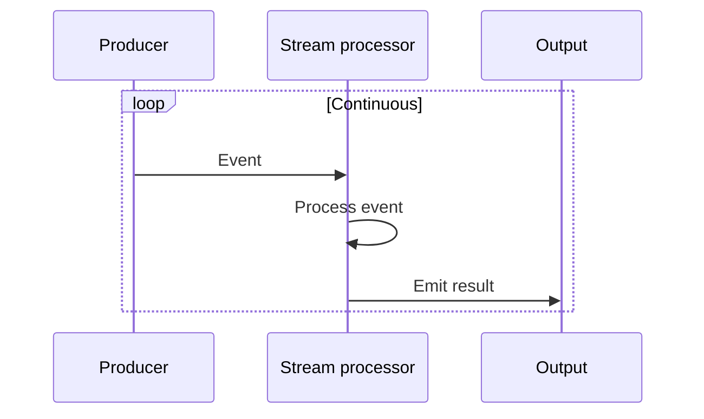
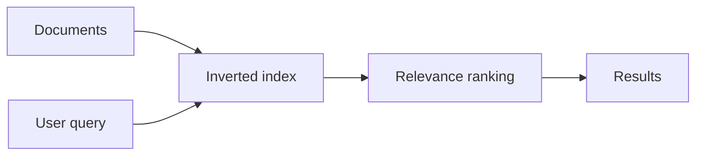
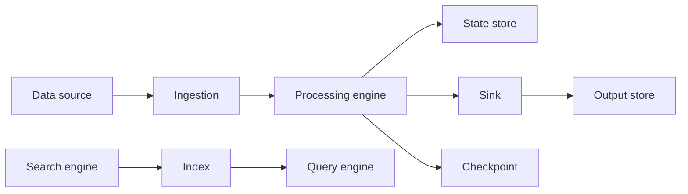

# Data Processing

## Blogs and websites


## Medium


## Youtube


## Theory

### Topics Covered

1. [Introduction](#introduction)
2. [Batch Processing](#batch-processing)
3. [Stream Processing](#stream-processing)
4. [Text-Based Search and Indexing](#text-based-search-and-indexing)
5. [Characteristics](#characteristics)
6. [Pros](#pros)
7. [Cons](#cons)
8. [Use Cases](#use-cases)
9. [Components](#components)
10. [Patterns](#patterns)
11. [Benefits](#benefits)
12. [Challenges](#challenges)
13. [Best Practices](#best-practices)
14. [When to Use](#when-to-use)
15. [Java and Spring Boot Examples](#java-and-spring-boot-examples)

---

### Introduction

Data processing transforms raw data into useful information. It spans batch jobs that process large volumes on a schedule, stream jobs that process events in real time, and search systems that index and retrieve text.


**Real-life use cases**

- **Analytics**: compute metrics and dashboards.
- **ETL**: move and transform data between systems.
- **Fraud detection**: flag suspicious events in real time.
- **Search**: return relevant documents.
- **Recommendations**: process user activity.

**Interview questions and answers**

- **Q: What is the difference between batch and stream processing?**
  **A:** Batch processes large, bounded data on a schedule; stream processes continuous, unbounded data as it arrives.

- **Q: What is ETL?**
  **A:** Extract, transform, and load — moving data from sources, reshaping it, and writing it to a destination.

- **Q: What is full-text search?**
  **A:** Indexing and querying text by tokens, relevance, and ranking rather than exact matching.

---

### Batch Processing

Process large volumes of data at scheduled intervals.

**Characteristics:**

- High latency.
- High throughput.
- Scheduled execution.

**Tools:**

- Apache Spark.
- Hadoop MapReduce.
- AWS Batch.

**Use Cases:**

- Data warehousing.
- Report generation.
- ETL pipelines.



**Interview questions and answers**

- **Q: When is batch processing appropriate?**
  **A:** When results are not needed immediately and large volumes can be processed efficiently on a schedule.

- **Q: What is the advantage of batch throughput?**
  **A:** Batch engines optimize for total volume, making them cost-effective for large jobs.

- **Q: Why is latency high in batch?**
  **A:** Work accumulates until the scheduled run, so the time from data arrival to result includes waiting.

---

### Stream Processing

Process data in real time as it arrives.

**Characteristics:**

- Low latency.
- Continuous processing.
- Event-driven.

**Tools:**

- Apache Kafka Streams.
- Apache Flink.
- AWS Kinesis.

**Use Cases:**

- Real-time analytics.
- Fraud detection.
- IoT data processing.



**Interview questions and answers**

- **Q: What is an unbounded data stream?**
  **A:** A continuous sequence of events with no predefined end.

- **Q: How do stream processors handle state?**
  **A:** They maintain local or remote state with checkpoints for fault tolerance.

- **Q: Why is ordering important in streams?**
  **A:** Many computations depend on event order, especially windows and stateful operations.

---

### Text-Based Search & Indexing

Full-text search capabilities.

**Features:**

- Tokenization.
- Relevance scoring.
- Fuzzy matching.
- Faceted search.

**Tools:**

- Elasticsearch.
- Apache Solr.
- Algolia.

**Use Cases:**

- E-commerce search.
- Document search.
- Log analysis.



**Interview questions and answers**

- **Q: What is an inverted index?**
  **A:** A mapping from terms to the documents that contain them, enabling fast lookups.

- **Q: What is relevance scoring?**
  **A:** Ranking documents by how well they match a query, often using term frequency and inverse document frequency.

- **Q: Why is tokenization important?**
  **A:** It splits text into searchable terms, normalizing case, punctuation, and sometimes word forms.

---

### Characteristics

- **Batch or streaming**
  Processing may be scheduled or continuous.

- **Latency-aware**
  Latency ranges from hours to milliseconds.

- **Throughput-focused**
  Systems optimize for volume or speed.

- **Stateful**
  Stream processors and search engines maintain state.

- **Distributed**
  Large datasets require parallel processing.

- **Fault-tolerant**
  Jobs and streams recover from failures.

- **Index-driven**
  Search relies on prebuilt indexes.

- **Transformational**
  Data is cleaned, joined, and aggregated.

- **Tool-rich**
  Many engines target different workloads.

---

### Pros

- **Scalability**
  Distributed engines handle large data.

- **Efficiency**
  Batch and stream engines optimize resource use.

- **Low latency for streams**
  Real-time insights enable quick action.

- **Flexibility**
  Multiple processing paradigms fit different needs.

- **Search quality**
  Full-text indexing returns relevant results.

- **Automation**
  Scheduled and event-driven jobs reduce manual work.

- **Fault tolerance**
  Engines recover from failures.

- **Integration**
  Rich connectors to sources and sinks.

---

### Cons

- **Complexity**
  Distributed data systems are hard to operate.

- **Cost**
  Storage, compute, and indexing add expense.

- **Latency trade-offs**
  Batch is slow; stream consistency is complex.

- **State management**
  Stateful streams require checkpointing.

- **Operational overhead**
  Tuning, monitoring, and capacity planning.

- **Consistency challenges**
  Streams and indexes may lag sources.

- **Learning curve**
  Each engine has a distinct model.

- **Tooling sprawl**
  Many overlapping tools complicate choice.

---

### Use Cases

- **Data warehousing**
  Aggregate structured data for analytics.

- **Real-time analytics**
  Monitor metrics as events arrive.

- **Fraud detection**
  Identify anomalies immediately.

- **IoT telemetry**
  Process sensor data continuously.

- **Log analysis**
  Search and aggregate logs.

- **Recommendations**
  Update models from user activity.

- **E-commerce search**
  Deliver relevant product results.

- **ETL pipelines**
  Move and transform data.

---

### Components

- **Data source**
  Databases, files, queues, or streams.

- **Ingestion**
  Reads data from sources.

- **Processing engine**
  Transforms and aggregates data.

- **State store**
  Maintains processing state.

- **Sink**
  Writes results to a destination.

- **Scheduler**
  Triggers batch jobs.

- **Checkpoint**
  Saves stream progress for recovery.

- **Index**
  Maps terms to documents.

- **Query engine**
  Retrieves and ranks results.



---

### Patterns

- **Batch ETL**
  Extract, transform, and load on a schedule.

- **Lambda architecture**
  Combine batch and stream layers.

- **Kappa architecture**
  Use a single stream pipeline for all processing.

- **Event sourcing**
  Persist events and derive state.

- **Windowing**
  Group stream events by time.

- **Checkpointing**
  Save state for recovery.

- **Inverted indexing**
  Map terms to documents.

- **Relevance ranking**
  Score documents against queries.

---

### Benefits

- **Actionable insights**
  Data becomes available for decisions.

- **Timeliness**
  Stream processing enables real-time response.

- **Scale**
  Distributed engines handle growth.

- **Consistency**
  Batch jobs produce reproducible results.

- **Search quality**
  Indexing delivers fast, relevant retrieval.

- **Automation**
  Pipelines run without manual intervention.

- **Resilience**
  Checkpoints and retries recover failures.

- **Composability**
  Engines integrate into larger platforms.

---

### Challenges

- **Latency vs consistency**
  Balancing speed and correctness.

- **Stateful processing**
  Managing state at scale.

- **Data quality**
  Handling duplicates, late data, and errors.

- **Operational complexity**
  Clusters, monitoring, and tuning.

- **Cost control**
  Compute and storage can grow fast.

- **Schema evolution**
  Changing data structures without breaking pipelines.

- **Security**
  Protecting data and access.

- **Tool selection**
  Choosing the right engine for the workload.

---

### Best Practices

- **Match the engine to the workload**
  Batch for volume, stream for latency, search for retrieval.

- **Use idempotent processing**
  Tolerate retries and duplicates.

- **Checkpoint stream state**
  Recover without reprocessing everything.

- **Monitor lag and throughput**
  Detect slow or stalled pipelines.

- **Handle late and out-of-order data**
  Define watermarks and windows.

- **Partition for parallelism**
  Distribute work across workers.

- **Optimize indexes**
  Balance write cost and query speed.

- **Version schemas**
  Evolve data formats safely.

- **Secure data pipelines**
  Encrypt and control access.

- **Test with realistic data**
  Validate performance and correctness.

---

### When to Use

- **Use batch processing when** results can wait for scheduled runs.
- **Use stream processing when** low-latency insights are required.
- **Use search indexing when** users query text.
- **Use stream processing when** handling continuous events.
- **Use batch processing when** processing large bounded datasets.

**Avoid real-time streaming when**

- The data is small and static.
- A simple batch job or database query suffices.
- The operational cost of a stream engine is not justified.

---

### Java and Spring Boot Examples

#### 1. Batch job with Spring Batch

```java
import org.springframework.batch.core.Job;
import org.springframework.batch.core.Step;
import org.springframework.batch.core.job.builder.JobBuilder;
import org.springframework.batch.core.repository.JobRepository;
import org.springframework.batch.core.step.builder.StepBuilder;
import org.springframework.batch.item.ItemProcessor;
import org.springframework.batch.item.ItemReader;
import org.springframework.batch.item.ItemWriter;
import org.springframework.context.annotation.Bean;
import org.springframework.context.annotation.Configuration;
import org.springframework.transaction.PlatformTransactionManager;

@Configuration
public class BatchJobConfig {

    @Bean
    public Job sampleJob(JobRepository jobRepository, Step step) {
        return new JobBuilder("sampleJob", jobRepository)
                .start(step)
                .build();
    }

    @Bean
    public Step step(JobRepository jobRepository,
                     PlatformTransactionManager transactionManager,
                     ItemReader<String> reader,
                     ItemProcessor<String, String> processor,
                     ItemWriter<String> writer) {
        return new StepBuilder("step", jobRepository)
                .<String, String>chunk(10, transactionManager)
                .reader(reader)
                .processor(processor)
                .writer(writer)
                .build();
    }
}
```

#### 2. Kafka stream processing

```java
import org.apache.kafka.streams.KafkaStreams;
import org.apache.kafka.streams.StreamsBuilder;
import org.apache.kafka.streams.kstream.KStream;
import org.springframework.beans.factory.annotation.Value;
import org.springframework.context.annotation.Bean;
import org.springframework.context.annotation.Configuration;

import java.util.Properties;

@Configuration
public class StreamProcessingConfig {

    @Bean
    public KafkaStreams kafkaStreams(@Value("${app.kafka.topic}") String topic) {
        StreamsBuilder builder = new StreamsBuilder();
        KStream<String, String> stream = builder.stream(topic);
        stream.mapValues(String::toUpperCase).to(topic + "-processed");

        Properties properties = new Properties();
        properties.put("application.id", "processing-app");
        properties.put("bootstrap.servers", "localhost:9092");
        return new KafkaStreams(builder.build(), properties);
    }
}
```

#### 3. Search service with a repository abstraction

```java
import org.springframework.stereotype.Service;

import java.util.List;
import java.util.Map;

@Service
public class SearchService {

    private final SearchRepository searchRepository;

    public SearchService(SearchRepository searchRepository) {
        this.searchRepository = searchRepository;
    }

    public List<Document> search(String query) {
        return searchRepository.search(query);
    }

    public interface SearchRepository {
        List<Document> search(String query);
    }

    public record Document(String id, String title, Map<String, Object> fields) {}
}
```

#### 4. Scheduled data processing task

```java
import org.springframework.scheduling.annotation.Scheduled;
import org.springframework.stereotype.Service;

@Service
public class ScheduledDataProcessor {

    @Scheduled(cron = "0 0 * * * *")
    public void processHourly() {
        // Run hourly aggregation.
    }
}
```

**Interview questions and answers**

- **Q: What is the difference between batch and stream processing?**
  **A:** Batch processes bounded data on a schedule; stream processes continuous data as it arrives.

- **Q: What is an inverted index?**
  **A:** A mapping from terms to documents that enables fast full-text search.

- **Q: How do stream processors recover from failure?**
  **A:** They checkpoint state and offsets, then resume from the last successful checkpoint.

- **Q: When would you choose a stream engine over a batch engine?**
  **A:** When results must be available in near real time, such as fraud detection or live analytics.
