# Distributed Cache and Caching Strategies

## Blogs and websites


## Medium


## Youtube

- [19. System Design: Distributed Cache and Caching Strategies | Cache-Aside, Write-Through, Write-Back](https://www.youtube.com/watch?v=RtOyBwBICRs)

## Theory

### Topics Covered

This page is organized into the following topics. Each topic includes a detailed explanation, its characteristics, components, patterns, pros/benefits, cons/challenges, best practices, when to use it, a real-life use case, a diagram, Java/Spring Boot code, and interview questions with answers.

1. [What is Caching?](#what-is-caching)
2. [Distributed Cache](#distributed-cache)
3. [Cache Architecture Patterns](#cache-architecture-patterns)
4. [Cache-Aside (Lazy Loading)](#cache-aside-lazy-loading)
5. [Write-Through Cache](#write-through-cache)
6. [Write-Behind (Write-Back) Cache](#write-behind-write-back-cache)
7. [Read-Through Cache](#read-through-cache)
8. [Refresh-Ahead Cache](#refresh-ahead-cache)
9. [Write-Around Cache](#write-around-cache)
10. [Caching Strategy Comparison](#caching-strategy-comparison)
11. [Cache Eviction Policies](#cache-eviction-policies)
12. [Cache Invalidation Strategies](#cache-invalidation-strategies)
13. [Best Practices](#best-practices)
14. [Complete Example: E-commerce Product Cache](#complete-example-e-commerce-product-cache)
15. [Distributed Cache and Caching Strategies: Characteristics, Pros, Cons, Use Cases, Components, Patterns, Benefits, Challenges, Best Practices and When to Use](#distributed-cache-and-caching-strategies-characteristics-pros-cons-use-cases-components-patterns-benefits-challenges-best-practices-and-when-to-use)

### What is Caching?

**Caching** is a technique to store frequently accessed data in a fast-access storage layer (cache) to reduce latency and improve application performance. Instead of repeatedly fetching data from slow data sources (database, external API, disk), the application retrieves it from the cache.

**Key Benefits:**
- **Reduced Latency**: Cache reads are 10-100x faster than database queries
- **Lower Database Load**: Fewer database queries reduce CPU, memory, and I/O usage
- **Improved Scalability**: Handle more requests with same infrastructure
- **Cost Savings**: Reduce expensive database or API calls
- **Better User Experience**: Faster page loads and responses

**Cache Hierarchy:**
```
Fastest ↑
--------
CPU Cache (L1, L2, L3) - Nanoseconds
RAM (Application Cache) - Microseconds
Distributed Cache (Redis, Memcached) - Milliseconds (1-5ms)
Database - Tens of milliseconds (10-100ms)
Disk - Milliseconds to seconds
Network/API - Hundreds of milliseconds to seconds
--------
Slowest ↓
```

Caching works because of two well-known access-pattern principles that hold true for most real-world workloads:

- **Temporal locality**: Data accessed recently is likely to be accessed again soon (e.g., a trending product page, a user's own profile).
- **Spatial locality**: Data near recently accessed data is also likely to be accessed soon (e.g., other fields of the same row, nearby pages in a paginated list).

A cache exploits the fact that a small subset of data typically accounts for the majority of requests (the **80/20 rule**, also called the **Pareto principle**, or in caching terms, a small **"hot set"** of keys receives most of the traffic). By keeping that hot set in a fast-access layer, the system avoids repeatedly paying the cost of slow storage for the same data.

#### What is Caching?: Characteristics

- **Speed differential is the entire premise**: A cache is only useful if reading from it is meaningfully faster than reading from the original source; the bigger the gap between cache latency (microseconds to low milliseconds) and source latency (tens to hundreds of milliseconds), the more valuable the cache becomes.
- **Finite capacity**: Caches are deliberately smaller than the underlying data store (memory is more expensive than disk), which means caches always need an eviction policy to decide what to keep when full.
- **Transient by nature**: Unlike a database, a cache is not expected to be the durable source of truth (except in write-behind designs) - data in the cache can be lost, expired, or evicted without violating correctness, as long as the source of truth still has it.
- **Read/write asymmetry**: Most caching techniques are optimized primarily for read performance; write handling differs significantly between strategies (this is exactly why multiple caching strategies exist - see the individual strategy topics below).
- **Key-value oriented**: Nearly all caches (in-process maps, Redis, Memcached, CDNs) are accessed by a lookup key, even when the underlying data model is relational or document-based.

#### What is Caching?: Components

- **Cache store**: The actual fast storage medium - could be an in-process data structure (HashMap, LRU list), or a separate service (Redis, Memcached, Ehcache, Caffeine).
- **Cache key**: A unique identifier used to look up an entry (e.g., `user:1001`, `product:456:details`). Good key design avoids collisions and makes invalidation predictable.
- **Cache value**: The cached payload itself - a primitive, a serialized object (JSON, Protobuf), or a computed result.
- **TTL (Time-To-Live) / expiry metadata**: Metadata attached to an entry that determines how long it remains valid before being considered stale.
- **Eviction policy engine**: The logic (LRU, LFU, FIFO, TTL-based) that decides which entries to remove when the cache is full.
- **Cache client / SDK**: The library used by the application to talk to the cache (e.g., Jedis/Lettuce for Redis, Spymemcached for Memcached, Spring's `CacheManager` abstraction).

#### What is Caching?: Patterns

- **Look-aside vs. inline caching**: Whether the application explicitly manages the cache (look-aside, e.g., Cache-Aside) or the cache transparently sits inline in the data path (e.g., Read-Through, Write-Through) - this distinction underlies every strategy covered later on this page.
- **Layered caching**: Combining multiple cache tiers (in-process L1 cache + distributed L2 cache like Redis) to balance raw speed against shareability across instances.
- **Negative caching**: Caching the fact that something does not exist (e.g., a "not found" result) for a short TTL, to avoid repeatedly hitting the database for keys that are known to be absent.
- **Request coalescing / single-flight**: Ensuring that when many concurrent requests miss the cache for the same key, only one of them fetches from the source while the others wait for that result, instead of all of them hitting the database simultaneously.

#### What is Caching?: Pros / Benefits

- **Reduced latency**: Cache reads (microseconds to low milliseconds) are typically 10-100x faster than a database round trip (tens of milliseconds), directly improving perceived application responsiveness.
- **Lower load on the source of truth**: Every cache hit is one query the database never has to serve, which frees up database CPU, I/O, and connection pool capacity for the requests that truly need it.
- **Improved scalability**: Because most reads are absorbed by the cache layer, the application can serve significantly more traffic without a proportional increase in database or backend capacity.
- **Cost savings**: Fewer database reads/writes and fewer calls to metered external APIs directly translate into lower infrastructure and third-party API cost.
- **Better user experience**: Faster response times reduce bounce rates, improve perceived performance, and are especially important for mobile clients or high-latency networks.

#### What is Caching?: Cons / Challenges

- **Cache invalidation complexity**: Deciding when and how to remove or refresh stale entries is famously one of the two hardest problems in computer science (alongside naming things) - get it wrong and users see outdated data.
- **Added architectural complexity**: A cache is another moving part that can fail, run out of memory, or become a bottleneck itself, requiring monitoring, alerting, and capacity planning of its own.
- **Consistency trade-offs**: Most caching strategies favor eventual consistency over strong consistency, which is unacceptable for some domains (e.g., financial balances) without extra safeguards.
- **Cold start / cache miss penalty**: A cold or recently-flushed cache offers no benefit until it warms up, and during that window the backend can experience the same load as if there were no cache at all.
- **Memory cost**: RAM used for caching is more expensive per gigabyte than disk, so caching everything indiscriminately is not economically sound.

#### What is Caching?: Best Practices

- Cache only data that is read significantly more often than it is written (a high read-to-write ratio is the strongest signal that caching will help).
- Always set a sensible TTL, even for data you believe rarely changes, as a safety net against invalidation bugs.
- Measure your **cache hit ratio** in production and treat it as a first-class metric; a low hit ratio usually means either poor key design, too-short TTLs, or the wrong caching strategy.
- Never cache secrets or highly sensitive data (raw passwords, full credit card numbers) unless it is encrypted and access-controlled.
- Design cache keys deliberately (namespaced, versioned) so that invalidation and debugging are straightforward later.

#### What is Caching?: When to Use

- Use caching whenever the same piece of data is requested far more often than it changes (read-heavy workloads).
- Use caching when the underlying data source is slow, rate-limited, or expensive to call (a remote API, a complex multi-table join, a machine-learning inference call).
- Avoid caching data that changes on every request, must always be perfectly fresh (e.g., real-time account balance before a trade executes), or is accessed so rarely that the cache would almost always miss.

#### What is Caching?: Diagram

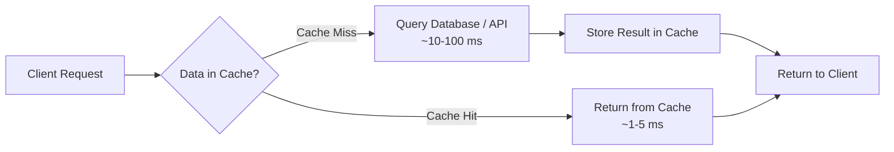

#### What is Caching?: Real-Life Use Case

A news website's homepage displays the "Top 10 Trending Articles". Thousands of users load this same list every second, but the underlying query (sorting millions of articles by view count) is expensive to compute. Instead of recomputing it per request, the backend computes the list once every 30 seconds and caches it. Every homepage load for those 30 seconds is served from cache in under a millisecond, while the expensive aggregation query runs at most twice a minute regardless of traffic volume.

#### What is Caching?: Java / Spring Boot Code Example

```java
// build.gradle / pom.xml: add spring-boot-starter-cache and spring-boot-starter-data-redis

@SpringBootApplication
@EnableCaching
public class CachingDemoApplication {
    public static void main(String[] args) {
        SpringApplication.run(CachingDemoApplication.class, args);
    }
}

@Service
public class TrendingArticlesService {

    private final ArticleRepository articleRepository;

    public TrendingArticlesService(ArticleRepository articleRepository) {
        this.articleRepository = articleRepository;
    }

    // Spring's declarative caching - transparently checks/populates the cache
    @Cacheable(value = "trendingArticles", key = "'top10'")
    public List<Article> getTrendingArticles() {
        System.out.println("Computing trending articles from DB (cache miss)");
        return articleRepository.findTop10ByOrderByViewCountDesc();
    }
}

@Configuration
public class RedisCacheConfig {

    @Bean
    public RedisCacheManager cacheManager(RedisConnectionFactory connectionFactory) {
        RedisCacheConfiguration config = RedisCacheConfiguration.defaultCacheConfig()
                .entryTtl(Duration.ofSeconds(30))
                .disableCachingNullValues();

        return RedisCacheManager.builder(connectionFactory)
                .cacheDefaults(config)
                .build();
    }
}
```

#### What is Caching?: Interview Questions and Answers

**Q1: What is caching and why is it used?**
A: Caching stores frequently accessed data in a fast-access layer to avoid repeatedly paying the cost of a slower operation (database query, external API call, expensive computation). It is used to reduce latency, lower load on the source of truth, improve scalability, and reduce cost.

**Q2: What is a cache hit ratio and why does it matter?**
A: The cache hit ratio is the percentage of requests served from the cache versus the total number of requests (hits + misses). It matters because it is the single clearest signal of whether a cache is actually effective - a low hit ratio (below ~70-80% for most workloads) suggests the caching strategy, TTL, or key design needs to be revisited.

**Q3: Why can't we just cache everything?**
A: Cache memory (RAM) is far more expensive and limited than disk-based storage, so caching indiscriminately wastes money and causes useful entries to be evicted prematurely. Additionally, some data (write-heavy, rarely-read, or must-be-real-time data) does not benefit from caching and can even be harmed by it (see Write-Around Cache for a concrete example).

**Q4: What is cache invalidation, and why is it considered a hard problem?**
A: Cache invalidation is the process of removing or refreshing cache entries when the underlying data changes, so the cache does not serve stale data. It is hard because it requires the system to reliably know exactly which cached entries are affected by a given write, across potentially many services and cache layers, without over-invalidating (killing hit ratio) or under-invalidating (serving stale data).

**Q5: What is the difference between temporal and spatial locality, and how does caching exploit them?**
A: Temporal locality means recently accessed data is likely to be accessed again soon; spatial locality means data near recently accessed data is likely to be accessed soon too. Caching exploits temporal locality by keeping recently used entries around (e.g., LRU eviction), and can exploit spatial locality by pre-fetching or caching related data together (e.g., caching an entire product record instead of just one field).

### Distributed Cache

A **distributed cache** is a caching system that spans multiple servers/nodes, allowing cached data to be shared across multiple application instances in a cluster.

#### Why Distributed Cache?

**Problem with Local Cache:**
```
┌─────────────┐       ┌─────────────┐       ┌─────────────┐
│  App Server │       │  App Server │       │  App Server │
│      1      │       │      2      │       │      3      │
├─────────────┤       ├─────────────┤       ├─────────────┤
│ Local Cache │       │ Local Cache │       │ Local Cache │
│ user:1=John │       │ user:1=John │       │ user:1=Jane │ ← Inconsistent!
└─────────────┘       └─────────────┘       └─────────────┘
       ↓                     ↓                     ↓
   ┌──────────────────────────────────────────────────┐
   │              Database                             │
   │              user:1 = Jane (updated)              │
   └──────────────────────────────────────────────────┘

Problem: After update, Server 1 and 2 have stale data!
```

**Solution with Distributed Cache:**
```
┌─────────────┐       ┌─────────────┐       ┌─────────────┐
│  App Server │       │  App Server │       │  App Server │
│      1      │       │      2      │       │      3      │
└──────┬──────┘       └──────┬──────┘       └──────┬──────┘
       │                     │                     │
       └─────────────────────┼─────────────────────┘
                             ↓
              ┌──────────────────────────┐
              │  Distributed Cache       │
              │  (Redis / Memcached)     │
              │  user:1 = Jane           │ ← Single source of truth
              └────────────┬─────────────┘
                           ↓
                  ┌─────────────────┐
                  │    Database     │
                  │  user:1 = Jane  │
                  └─────────────────┘

All servers read from same cache - Always consistent!
```

#### Distributed Cache: Characteristics

1. **Shared**: All application instances access the same cache, so a value written by server 1 is immediately visible to servers 2 and 3 - this is precisely what eliminates the stale-data problem shown above.
2. **Scalable**: Additional cache nodes can be added to a cluster to increase total memory capacity and throughput, typically without downtime when using consistent hashing to redistribute keys (see [Consistent hashing](consistent-hashing.md)).
3. **Highly Available**: Data is replicated across multiple nodes (primary/replica pairs), so the failure of a single node does not make cached data unavailable or force every request back to the database simultaneously.
4. **Fast**: Because the entire dataset (or working set) lives in RAM across the cluster, lookups complete in microseconds to low single-digit milliseconds, even though the data now lives on a separate network hop compared to an in-process cache.
5. **Consistent**: Every application server observes the same view of a given key at (approximately) the same time, since there is exactly one logical cache cluster rather than N independent local caches.
6. **Partitioned**: The full keyspace is split (sharded) across multiple nodes using a partitioning scheme (hash-based, range-based, or consistent hashing), so no single node needs to hold the entire dataset in memory.

#### Popular Distributed Cache Systems

**1. Redis**
- In-memory data structure store
- Supports strings, hashes, lists, sets, sorted sets
- Persistence options (RDB, AOF)
- Pub/Sub messaging
- Lua scripting
- Clustering and replication built-in
- **Use case**: Session store, real-time analytics, leaderboards

**2. Memcached**
- Simple key-value store
- Multi-threaded (better CPU utilization)
- No persistence
- LRU eviction
- Very fast for simple caching
- **Use case**: Pure caching layer, session storage

**3. Amazon ElastiCache**
- Managed Redis or Memcached
- Auto-scaling, backup, monitoring
- **Use case**: AWS cloud deployments

**4. Hazelcast**
- In-memory data grid (IMDG)
- Distributed Java data structures
- Compute grid capabilities
- **Use case**: Java applications, distributed computing

**5. Apache Ignite**
- Distributed database and cache
- SQL support
- ACID transactions
- **Use case**: Hybrid transactional/analytical processing

#### Distributed Cache: Components

- **Cache nodes**: Individual server instances that each hold a shard (and possibly replicas) of the total cached dataset.
- **Cluster coordinator / gossip protocol**: The mechanism nodes use to discover each other, detect failures, and agree on cluster membership (e.g., Redis Cluster's gossip protocol, Hazelcast's cluster membership service).
- **Partitioning/hashing layer**: The logic that maps a given key to the specific node responsible for it, typically consistent hashing or hash-slot based (Redis Cluster uses 16,384 hash slots).
- **Replication layer**: Primary-replica (or multi-primary) replication that copies data to additional nodes for durability and read scaling.
- **Client library / smart client**: A client-side driver (Lettuce, Jedis, Hazelcast client) that knows the cluster topology and routes each request directly to the owning node instead of relying on a single entry point.

#### Distributed Cache: Patterns

- **Client-side sharding**: The client library itself computes which node owns a key (e.g., via consistent hashing) and talks directly to that node, avoiding an extra network hop through a proxy.
- **Proxy-based sharding**: A middle-tier proxy (e.g., Twemproxy) receives all requests and forwards them to the correct shard, simplifying clients at the cost of an extra hop.
- **Primary-replica replication**: Writes go to a primary node and are asynchronously (or synchronously) replicated to one or more replicas, which can also serve reads to scale read throughput.
- **Multi-region / active-active caching**: Running independent cache clusters per region with asynchronous cross-region replication, trading strict consistency for lower latency to geographically distributed users.

#### Distributed Cache: Pros / Benefits

- **Solves the multi-instance consistency problem**: A single shared cache means every application instance sees the same cached value, eliminating the "Server 1 vs Server 2 disagree" problem inherent to local caches.
- **Scales horizontally**: Capacity grows by adding nodes rather than being capped by a single machine's RAM, which matters once the working set outgrows what any one server can hold.
- **Survives application restarts/deploys**: Because the cache lives outside the application process, a rolling deployment or restart of application servers does not cold-start the cache (unlike an in-process cache, which is wiped every time its host process restarts).
- **Enables cross-service sharing**: Multiple different services (not just multiple instances of the same service) can share the same cached data, avoiding duplicate caching logic and duplicate cache memory for the same values.

#### Distributed Cache: Cons / Challenges

- **Network latency overhead**: Every cache access now involves a network round trip (even if fast, typically 0.5-2ms), which is inherently slower than an in-process memory lookup (nanoseconds).
- **Operational complexity**: Running a distributed cache cluster means monitoring node health, planning capacity, handling failover, and managing upgrades - none of which exist with a simple in-process cache.
- **Partial failure modes**: A single node going down can affect only the keys it owned (with good partitioning) or the whole cluster (with poor design), and clients must handle timeouts/retries gracefully.
- **Serialization cost**: Because data crosses a network boundary, values must be serialized/deserialized (JSON, Protobuf, etc.), adding CPU overhead that an in-process cache does not pay.

#### Distributed Cache: Best Practices

- Choose a partitioning scheme (consistent hashing, hash slots) that minimizes data movement when nodes are added or removed.
- Enable replication for any data whose loss would cause a large "thundering herd" of requests hitting the database simultaneously.
- Monitor node-level and cluster-level metrics (memory usage, eviction rate, replication lag, connection count) separately, since a single healthy-looking cluster average can hide an overloaded individual node.
- Use a client library that is cluster-aware (understands hash slots/topology) rather than pointing at a single node and hoping for the best.
- Set `maxmemory-policy` (or equivalent) explicitly rather than relying on defaults, so eviction behavior under memory pressure is intentional.

#### Distributed Cache: When to Use

- Use a distributed cache whenever more than one application instance needs to read/write the same cached data (which is the default case for any horizontally scaled service).
- Use a distributed cache when the cached working set exceeds what a single server's RAM can comfortably hold.
- A simple in-process cache may still be preferable for single-instance applications, or as an additional fast L1 layer in front of a distributed L2 cache for extremely hot keys.

#### Distributed Cache: Diagram

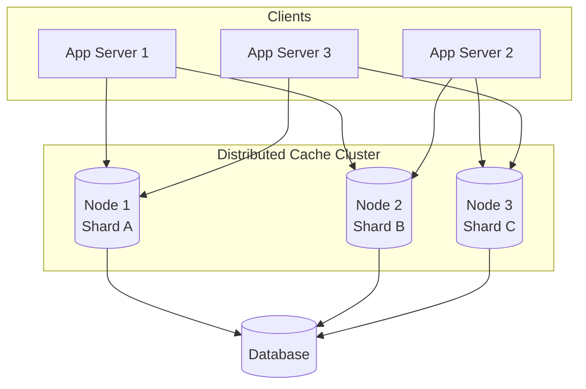

#### Distributed Cache: Real-Life Use Case

An e-commerce platform runs 50 stateless application instances behind a load balancer, auto-scaling between 20 and 100 instances based on traffic. Product catalog data (name, price, description) is cached in a 6-node Redis Cluster shared by every instance. When an instance is added during a traffic spike, it immediately benefits from the already-warm cache instead of starting with an empty local cache; when an admin updates a product's price, every instance sees the update within milliseconds because there is only one cache to invalidate, not 100 separate local caches.

#### Distributed Cache: Java / Spring Boot Code Example

```java
// application.yml
// spring:
//   redis:
//     cluster:
//       nodes: redis-node1:6379,redis-node2:6379,redis-node3:6379

@Configuration
public class RedisClusterConfig {

    @Bean
    public LettuceConnectionFactory redisConnectionFactory(
            @Value("${spring.redis.cluster.nodes}") String[] clusterNodes) {

        RedisClusterConfiguration clusterConfig =
                new RedisClusterConfiguration(Arrays.asList(clusterNodes));
        clusterConfig.setMaxRedirects(3);

        return new LettuceConnectionFactory(clusterConfig);
    }

    @Bean
    public RedisTemplate<String, Object> redisTemplate(RedisConnectionFactory factory) {
        RedisTemplate<String, Object> template = new RedisTemplate<>();
        template.setConnectionFactory(factory);
        template.setKeySerializer(new StringRedisSerializer());
        template.setValueSerializer(new GenericJackson2JsonRedisSerializer());
        return template;
    }
}

@Service
public class ProductService {

    private final RedisTemplate<String, Object> redisTemplate;
    private final ProductRepository productRepository;

    public ProductService(RedisTemplate<String, Object> redisTemplate,
                           ProductRepository productRepository) {
        this.redisTemplate = redisTemplate;
        this.productRepository = productRepository;
    }

    public Product getProduct(Long productId) {
        String key = "product:" + productId;

        // Every app instance hits the SAME shared cluster - no local inconsistency
        Product cached = (Product) redisTemplate.opsForValue().get(key);
        if (cached != null) {
            return cached;
        }

        Product product = productRepository.findById(productId)
                .orElseThrow(() -> new ProductNotFoundException(productId));

        redisTemplate.opsForValue().set(key, product, Duration.ofHours(1));
        return product;
    }
}
```

#### Distributed Cache: Interview Questions and Answers

**Q1: Why do we need a distributed cache instead of just using an in-process (local) cache on each server?**
A: With multiple application instances, each maintaining its own local cache, an update on one instance does not propagate to the local caches of the others - so different servers can return different (stale) answers for the same key. A distributed cache is a single shared store that every instance reads from and writes to, guaranteeing all instances see the same data.

**Q2: How does a distributed cache achieve high availability?**
A: Through replication - each shard's data is copied to one or more replica nodes. If the primary node for a shard fails, a replica is promoted to take over, so the data for that shard remains available with minimal (or zero) data loss depending on the replication mode (sync vs. async).

**Q3: What is the difference between client-side sharding and proxy-based sharding?**
A: In client-side sharding, the client library itself knows the cluster topology and computes which node owns a given key, then talks to that node directly (e.g., Redis Cluster with a cluster-aware client). In proxy-based sharding, clients talk to a proxy layer (e.g., Twemproxy) that routes each request to the correct backend node, which simplifies the client at the cost of an additional network hop.

**Q4: What happens when you add a new node to a distributed cache cluster?**
A: The cluster needs to rebalance - some portion of the existing keyspace is reassigned to the new node, and that data must be migrated to it. Systems using consistent hashing minimize the fraction of keys that need to move (typically ~1/N of the data, where N is the number of nodes), whereas naive modulo-based hashing would require remapping nearly all keys.

**Q5: What are the trade-offs of using a distributed cache versus a local cache?**
A: A distributed cache provides consistency across instances, larger effective capacity (bounded by the whole cluster's RAM, not one server's), and survives individual application restarts, but it introduces network latency per request, serialization overhead, and additional operational complexity (cluster management, failover, monitoring) that a local cache does not have.

### Cache Architecture Patterns

#### 1. Single-Node Cache

```
┌──────────────┐
│ Application  │
├──────────────┤
│ Local Cache  │  ← In-process (e.g., dict, LRU cache)
└──────────────┘
```

**Pros**: Fastest access, no network latency
**Cons**: Not shared, limited by single server memory

#### 2. Centralized Cache

```
┌─────────┐    ┌─────────┐    ┌─────────┐
│  App 1  │    │  App 2  │    │  App 3  │
└────┬────┘    └────┬────┘    └────┬────┘
     │              │              │
     └──────────────┼──────────────┘
                    ↓
            ┌───────────────┐
            │  Cache Server │  ← Single Redis/Memcached
            └───────────────┘
```

**Pros**: Shared cache, consistency
**Cons**: Single point of failure, limited capacity

#### 3. Distributed Cache Cluster (Recommended)

```
┌─────────┐    ┌─────────┐    ┌─────────┐
│  App 1  │    │  App 2  │    │  App 3  │
└────┬────┘    └────┬────┘    └────┬────┘
     │              │              │
     └──────────────┼──────────────┘
                    ↓
     ┌──────────────────────────────────┐
     │      Cache Cluster               │
     │  ┌────────┐  ┌────────┐  ┌────┐ │
     │  │ Node 1 │  │ Node 2 │  │ N3 │ │
     │  │Shard A │  │Shard B │  │... │ │
     │  └────────┘  └────────┘  └────┘ │
     └──────────────────────────────────┘
```

**Pros**: High availability, scalable, fault-tolerant
**Cons**: Complex setup, network overhead

#### Cache Architecture Patterns: Characteristics

- **Increasing shareability, decreasing raw speed**: Moving from single-node to centralized to distributed cluster trades a small amount of per-request latency (an extra network hop) for progressively wider data sharing and availability guarantees.
- **Topology determines failure blast radius**: A single-node cache's failure affects only its one host; a centralized cache's failure affects every consumer at once; a well-sharded distributed cluster's failure typically affects only the fraction of keys owned by the failed node.
- **Deployment model dictates operational ownership**: A single-node (in-process) cache is owned entirely by the application team, whereas a distributed cluster is usually a separate piece of infrastructure with its own on-call and capacity planning.

#### Cache Architecture Patterns: Components

- **Single-Node Cache**: An in-process data structure (e.g., a `HashMap`, Guava/Caffeine cache) living inside the application's own memory space, with zero network involvement.
- **Centralized Cache**: One standalone cache server (a single Redis or Memcached instance) that all application instances connect to over the network.
- **Distributed Cache Cluster**: Multiple cache nodes that jointly own the keyspace (via sharding) and typically replicate data for availability, fronted by a cluster-aware client or proxy.

#### Cache Architecture Patterns: Patterns

- **Start single-node, graduate to centralized, graduate to cluster**: Many systems evolve through these three architectures in order as traffic and instance count grow - starting with an in-process cache is often the right choice for a monolith with a single instance, moving to a shared Redis instance once there are multiple instances, and only adopting a full cluster once a single node's memory or throughput becomes the bottleneck.
- **Hybrid L1/L2 caching**: Combining a small, very fast single-node cache (L1) in front of a shared distributed cluster (L2) to absorb the hottest keys locally while still benefiting from cross-instance consistency for everything else.
- **Read replicas within a centralized/clustered cache**: Adding read-only replicas to a centralized cache node (or to each shard of a cluster) to scale read throughput independently of write throughput.

#### Cache Architecture Patterns: Pros / Benefits

- **Single-Node Cache**: Zero network latency, no additional infrastructure to run, and the simplest possible mental model - ideal when there is exactly one application instance.
- **Centralized Cache**: A single, consistent view of cached data shared by every application instance, without the operational overhead of managing a multi-node cluster.
- **Distributed Cache Cluster**: Combines shared/consistent caching with horizontal scalability and fault tolerance, avoiding both the memory ceiling of a centralized cache and the single point of failure it represents.

#### Cache Architecture Patterns: Cons / Challenges

- **Single-Node Cache**: Cannot be shared across instances, so a horizontally scaled application immediately reintroduces the stale-data problem that a shared cache is meant to solve, and is capped by the memory of one server.
- **Centralized Cache**: Represents a single point of failure - if that one server goes down or runs out of memory, every application instance loses its cache simultaneously, and it cannot scale capacity beyond one machine.
- **Distributed Cache Cluster**: Requires the most operational investment (cluster provisioning, monitoring, upgrades, rebalancing on scale events) and adds a small amount of latency/complexity compared to talking to a single node.

#### Cache Architecture Patterns: Best Practices

- Choose the simplest architecture that satisfies current requirements; do not adopt a distributed cluster before a single centralized instance becomes a genuine bottleneck.
- If using a centralized cache, still plan for its failure mode (i.e., ensure the application degrades gracefully to the database rather than throwing errors) even though it is not the recommended long-term architecture for multi-instance production systems.
- When you do move to a cluster, size the number of shards for future growth, since repartitioning later (though supported by consistent hashing) still has an operational cost.

#### Cache Architecture Patterns: When to Use

- **Single-Node Cache**: Single-instance applications, local development, or as a fast L1 layer in front of a shared L2 distributed cache.
- **Centralized Cache**: Early-stage multi-instance applications where simplicity is valued over maximum availability, and the dataset comfortably fits on one cache server.
- **Distributed Cache Cluster**: Production systems at scale, where high availability, horizontal capacity, and fault tolerance are required.

#### Cache Architecture Patterns: Diagram

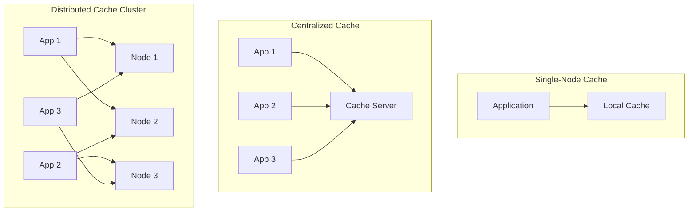

#### Cache Architecture Patterns: Real-Life Use Case

A startup begins with a single monolithic server and an in-process LRU cache (single-node). As traffic grows, they scale to 3 application instances behind a load balancer and move to a single shared Redis instance (centralized) so all instances see consistent data. Once traffic grows further and the dataset outgrows one Redis instance's memory, they migrate to a 6-node Redis Cluster (distributed cluster) with replication, matching the classic architectural progression described above.

#### Cache Architecture Patterns: Java / Spring Boot Code Example

```java
// Single-Node Cache: Caffeine, in-process
@Configuration
public class LocalCacheConfig {
    @Bean
    public CacheManager cacheManager() {
        CaffeineCacheManager manager = new CaffeineCacheManager("products");
        manager.setCaffeine(Caffeine.newBuilder()
                .maximumSize(10_000)
                .expireAfterWrite(Duration.ofMinutes(10)));
        return manager;
    }
}

// Centralized Cache: single Redis instance
@Configuration
public class CentralizedRedisConfig {
    @Bean
    public LettuceConnectionFactory redisConnectionFactory() {
        return new LettuceConnectionFactory(
                new RedisStandaloneConfiguration("cache-server", 6379));
    }
}

// Distributed Cache Cluster: multi-node Redis Cluster
@Configuration
public class ClusterRedisConfig {
    @Bean
    public LettuceConnectionFactory redisConnectionFactory() {
        RedisClusterConfiguration clusterConfig = new RedisClusterConfiguration(
                List.of("redis-node1:6379", "redis-node2:6379", "redis-node3:6379"));
        return new LettuceConnectionFactory(clusterConfig);
    }
}
```

#### Cache Architecture Patterns: Interview Questions and Answers

**Q1: Why would a team start with a single-node cache instead of going straight to a distributed cluster?**
A: A single-node (in-process) cache has zero network latency, no extra infrastructure, and is trivial to operate. For a single application instance (or early-stage systems), the consistency and scalability benefits of a distributed cluster are unnecessary, so the simpler architecture is the right engineering trade-off until traffic or instance count actually requires more.

**Q2: What is the main risk of a centralized (single-instance) cache architecture in production?**
A: It is a single point of failure - if that one cache server crashes, runs out of memory, or is redeployed, every application instance simultaneously loses its cache, causing a "thundering herd" of requests to hit the database at once.

**Q3: When should a team migrate from a centralized cache to a distributed cache cluster?**
A: When the working set outgrows the memory of a single cache server, when read/write throughput exceeds what one node can handle, or when the single point of failure of a centralized cache becomes an unacceptable availability risk for the business.

**Q4: Can single-node and distributed caches be combined?**
A: Yes - a common pattern is a two-tier cache: a small, very fast in-process (single-node) L1 cache for the hottest keys, backed by a shared distributed cluster (L2) for everything else, giving the speed of local caching with the consistency of a shared cache for the majority of data.

### Caching Strategies (Cache Patterns)

Caching strategies determine **when** and **how** data is written to and read from the cache.

---

### Cache-Aside (Lazy Loading)

**Description**: 

Cache-Aside, also known as **Lazy Loading**, is the most common and straightforward caching pattern where the application code is responsible for managing both the cache and the database. The cache sits "aside" the main data flow, and the application explicitly checks the cache before querying the database.

**Key Concept**: The cache is only populated **on-demand** when data is actually requested (lazy), not during write operations. This means data is loaded into the cache only when it's needed, avoiding unnecessary caching of data that may never be accessed.

**How the pattern works conceptually**:
- The **application owns the caching logic** - it must explicitly check cache, handle misses, and update cache
- On **reads**: Application tries cache first → if miss, query database → store in cache → return data
- On **writes**: Application updates database → invalidates (or updates) relevant cache entries
- The cache is **passive** - it doesn't know about the database; only the application knows both

**When cache is empty (cold start)**: Every request is a cache miss initially, gradually warming up as requests come in. This "lazy" approach means you only cache what's actually used, which is memory-efficient but has initial performance cost.

**Flow Diagram:**
```
Read Request:
┌─────────────┐
│ Application │
└──────┬──────┘
       │ 1. Read(key)
       ↓
┌─────────────┐
│    Cache    │
└──────┬──────┘
       │
       ├─ 2a. CACHE HIT? → Return value to app
       │
       └─ 2b. CACHE MISS?
           │
           ↓
       ┌─────────────┐
       │  Database   │
       └──────┬──────┘
              │
              └─ 3. App reads from DB
                 4. App writes to cache
                 5. Return to user

Write Request:
┌─────────────┐
│ Application │
└──────┬──────┘
       │ 1. Write(key, value)
       ↓
┌─────────────┐
│  Database   │  ← Write to DB first
└──────┬──────┘
       │
       └─ 2. Invalidate cache (or update)
          3. Next read will fetch fresh data
```

**Python Implementation:**
```python
import redis
import psycopg2

class CacheAside:
    def __init__(self):
        self.cache = redis.Redis(host='localhost', port=6379, decode_responses=True)
        self.db = psycopg2.connect("dbname=mydb user=postgres")
    
    def get_user(self, user_id):
        """Cache-Aside Read"""
        cache_key = f"user:{user_id}"
        
        # 1. Try to get from cache
        cached_value = self.cache.get(cache_key)
        
        if cached_value:
            print(f"CACHE HIT for user {user_id}")
            return cached_value
        
        # 2. Cache miss - fetch from database
        print(f"CACHE MISS for user {user_id}")
        cursor = self.db.cursor()
        cursor.execute("SELECT name FROM users WHERE id = %s", (user_id,))
        result = cursor.fetchone()
        
        if result:
            user_name = result[0]
            
            # 3. Populate cache (with TTL of 1 hour)
            self.cache.setex(cache_key, 3600, user_name)
            
            return user_name
        
        return None
    
    def update_user(self, user_id, new_name):
        """Cache-Aside Write"""
        cache_key = f"user:{user_id}"
        
        # 1. Write to database
        cursor = self.db.cursor()
        cursor.execute("UPDATE users SET name = %s WHERE id = %s", (new_name, user_id))
        self.db.commit()
        
        # 2. Invalidate cache (cache will be repopulated on next read)
        self.cache.delete(cache_key)
        
        print(f"Updated user {user_id} and invalidated cache")

# Usage
cache_aside = CacheAside()
print(cache_aside.get_user(1))  # CACHE MISS - loads from DB
print(cache_aside.get_user(1))  # CACHE HIT - from cache
cache_aside.update_user(1, "Jane")  # Invalidates cache
print(cache_aside.get_user(1))  # CACHE MISS - loads fresh data
```

#### Cache-Aside (Lazy Loading): Characteristics

- **Application-driven**: The application code, not the cache or database, contains all of the logic for checking, populating, and invalidating the cache - there is no framework or middleware doing this automatically.
- **Demand-driven population**: Entries only enter the cache as a side effect of a read that missed, so the cache naturally reflects exactly the subset of data that is actually being requested.
- **Database remains authoritative**: The database is always the source of truth; the cache is a disposable, rebuildable projection of it, so a completely empty cache never causes incorrect behavior, only slower behavior.
- **Independent read and write paths**: The read path (check cache, fall back to DB, populate cache) and the write path (write DB, invalidate cache) are separate pieces of logic that must both be implemented correctly for every entity that is cached.

#### Cache-Aside (Lazy Loading): Components

- **Cache client**: The Redis/Memcached client used by the application to perform `GET`, `SET`, and `DEL` operations against the cache.
- **Cache-check logic**: The `if cached then return; else fetch` branch that every read path must implement.
- **Invalidation hook**: Code triggered on every write path (update, delete) that removes (or updates) the corresponding cache entry.
- **TTL configuration**: A per-key or per-entity expiry value used as a safety net in case an invalidation hook is missed or fails.

#### Cache-Aside (Lazy Loading): Patterns

- **Lazy loading**: Populate the cache only in response to an actual read miss, rather than pre-warming it, which is the defining pattern of Cache-Aside.
- **Invalidate-on-write**: Delete (rather than update) the cache entry on a write, letting the next read lazily repopulate it with fresh data - simpler and less error-prone than trying to keep the cache entry updated in place.
- **Negative caching**: Cache a sentinel "not found" value for keys that do not exist in the database, with a short TTL, to prevent repeated database lookups for missing keys.
- **Stampede protection via locking**: Use a short-lived distributed lock so that only one request repopulates a hot key after it expires, while other concurrent requests wait or serve slightly stale data (see Common Pitfalls below).

#### Cache-Aside (Lazy Loading): Pros / Benefits

- **Cache only what's needed (lazy loading)**: Because entries are populated only on a read miss, the cache never wastes memory on data that is never actually requested, which keeps the hit ratio high relative to cache size.
- **Cache misses don't break the application (DB is source of truth)**: If the cache is completely unavailable, cleared, or cold, the application simply falls back to the database for every request - functionally correct, just slower.
- **Application has full control over caching logic**: Developers can implement custom TTLs, custom invalidation rules, and custom serialization per entity type, since nothing is hidden behind a framework.
- **Works well for read-heavy workloads**: The pattern is optimized for the common case where the same data is read many more times than it is written, maximizing the number of requests served from the fast cache path.

#### Cache-Aside (Lazy Loading): Cons / Challenges

- **First request always misses cache (cold start)**: Every unique key's very first access pays the full database latency, and after any TTL expiry or eviction, the next access pays it again.
- **Cache miss penalty (3 round trips: check cache → read DB → write cache)**: A miss is strictly slower than having no cache at all for that single request, because it does the cache lookup in addition to the database query.
- **Potential for stale data if cache isn't invalidated**: If a developer forgets to add the invalidation call on some write path, that entity's cached value can silently diverge from the database until its TTL expires.
- **Application code manages cache explicitly (more complex)**: Every new read/write path for a cached entity requires the developer to remember to add the correct cache-check and cache-invalidation logic, which is easy to miss during code changes.

#### Cache-Aside (Lazy Loading): Best Practices

- Always pair Cache-Aside with a TTL, even when you also invalidate explicitly on write, as a safety net against missed invalidation paths.
- Centralize the cache-check/invalidate logic in a repository or service layer (or use an annotation-based abstraction like Spring's `@Cacheable`/`@CacheEvict`) rather than duplicating the pattern inline in every controller.
- Protect hot keys from cache stampede using a lock or a probabilistic early expiration technique (see below).
- Prefer deleting the cache entry over updating it in place on writes - it is simpler to reason about and avoids a whole class of read-modify-write race conditions.

#### Cache-Aside (Lazy Loading): When to Use

- Read-heavy applications where the same records are requested repeatedly but written to relatively rarely.
- Unpredictable or long-tail data access patterns, since Cache-Aside only ever caches what is actually requested.
- When the team wants full application-level control over caching behavior rather than relying on a caching framework's default behavior.
- General-purpose caching for most CRUD-style services - this is the default choice when no other strategy's specific trade-offs (strong consistency, extreme write throughput, write-once data) apply.

**Common Pitfalls & Solutions:**

1. **Cache Stampede (Thundering Herd)**
   - **Problem**: When cache expires, multiple requests hit DB simultaneously
   - **Solution**: Use cache locking or probabilistic early expiration

```python
def get_user_with_lock(self, user_id):
    """Prevent cache stampede with distributed lock"""
    cache_key = f"user:{user_id}"
    lock_key = f"lock:{cache_key}"
    
    cached_value = self.cache.get(cache_key)
    if cached_value:
        return cached_value
    
    # Try to acquire lock
    lock_acquired = self.cache.set(lock_key, "1", nx=True, ex=10)
    
    if lock_acquired:
        # This thread loads from DB
        try:
            cursor = self.db.cursor()
            cursor.execute("SELECT name FROM users WHERE id = %s", (user_id,))
            result = cursor.fetchone()
            
            if result:
                user_name = result[0]
                self.cache.setex(cache_key, 3600, user_name)
                return user_name
        finally:
            self.cache.delete(lock_key)
    else:
        # Other threads wait and retry
        time.sleep(0.1)
        return self.get_user_with_lock(user_id)
```

2. **Stale Data After Update**
   - **Problem**: Cache not invalidated after DB update
   - **Solution**: Always invalidate or update cache after DB write

```python
def update_user_safe(self, user_id, new_name):
    """Ensure cache consistency with DB transaction"""
    cache_key = f"user:{user_id}"
    
    try:
        # Start DB transaction
        cursor = self.db.cursor()
        cursor.execute("UPDATE users SET name = %s WHERE id = %s", (new_name, user_id))
        self.db.commit()
        
        # Only invalidate cache if DB write succeeds
        self.cache.delete(cache_key)
        print(f"Updated user {user_id} - cache invalidated")
    except Exception as e:
        self.db.rollback()
        print(f"Update failed: {e}. Cache unchanged.")
        raise
```

**Real-World Example: E-commerce Product Details**

```python
import json
from typing import Optional, Dict

class ProductCacheAside:
    def __init__(self):
        self.cache = redis.Redis(host='localhost', port=6379, decode_responses=True)
        self.db = psycopg2.connect("dbname=ecommerce user=postgres")
    
    def get_product_details(self, product_id: int) -> Optional[Dict]:
        """Get product with reviews, inventory, and pricing"""
        cache_key = f"product:details:{product_id}"
        
        # Try cache first
        cached_data = self.cache.get(cache_key)
        if cached_data:
            print(f"✓ Cache HIT: Product {product_id}")
            return json.loads(cached_data)
        
        # Cache miss - fetch from multiple tables
        print(f"✗ Cache MISS: Product {product_id} - querying database")
        
        cursor = self.db.cursor()
        
        # Complex query joining multiple tables
        cursor.execute("""
            SELECT p.id, p.name, p.price, p.description,
                   i.stock_count, i.warehouse_location,
                   AVG(r.rating) as avg_rating, COUNT(r.id) as review_count
            FROM products p
            LEFT JOIN inventory i ON p.id = i.product_id
            LEFT JOIN reviews r ON p.id = r.product_id
            WHERE p.id = %s
            GROUP BY p.id, i.stock_count, i.warehouse_location
        """, (product_id,))
        
        result = cursor.fetchone()
        if not result:
            return None
        
        product_data = {
            'id': result[0],
            'name': result[1],
            'price': float(result[2]),
            'description': result[3],
            'stock': result[4],
            'warehouse': result[5],
            'avg_rating': float(result[6]) if result[6] else 0,
            'review_count': result[7]
        }
        
        # Cache for 1 hour (product details don't change often)
        self.cache.setex(cache_key, 3600, json.dumps(product_data))
        
        return product_data
    
    def update_product_price(self, product_id: int, new_price: float):
        """Update price and invalidate all related cache entries"""
        try:
            cursor = self.db.cursor()
            cursor.execute(
                "UPDATE products SET price = %s WHERE id = %s",
                (new_price, product_id)
            )
            self.db.commit()
            
            # Invalidate multiple related cache keys
            keys_to_invalidate = [
                f"product:details:{product_id}",
                f"product:price:{product_id}",
                "products:featured",  # May include this product
                "products:on_sale"    # Price change may affect this list
            ]
            
            for key in keys_to_invalidate:
                self.cache.delete(key)
            
            print(f"Updated product {product_id} price to ${new_price}")
            print(f"Invalidated {len(keys_to_invalidate)} cache entries")
            
        except Exception as e:
            self.db.rollback()
            raise

# Usage Example
product_cache = ProductCacheAside()

# First request - queries DB (expensive join)
product = product_cache.get_product_details(123)
print(f"Product: {product['name']}, Stock: {product['stock']}")

# Subsequent requests - served from cache (< 1ms)
product = product_cache.get_product_details(123)

# Update price - invalidates cache
product_cache.update_product_price(123, 99.99)

# Next read - cache miss, fresh data loaded
product = product_cache.get_product_details(123)
```

**Performance Metrics:**
```
Without Cache:
- Database query time: 50-100ms (complex joins)
- Requests per second: ~20-50

With Cache-Aside:
- Cache hit time: <1ms
- Cache miss time: 50-100ms (same as DB)
- Cache hit ratio: 85-95% (typical)
- Requests per second: 1000+ (mostly cache hits)
- Database load reduction: 90%+
```

#### Cache-Aside (Lazy Loading): Diagram

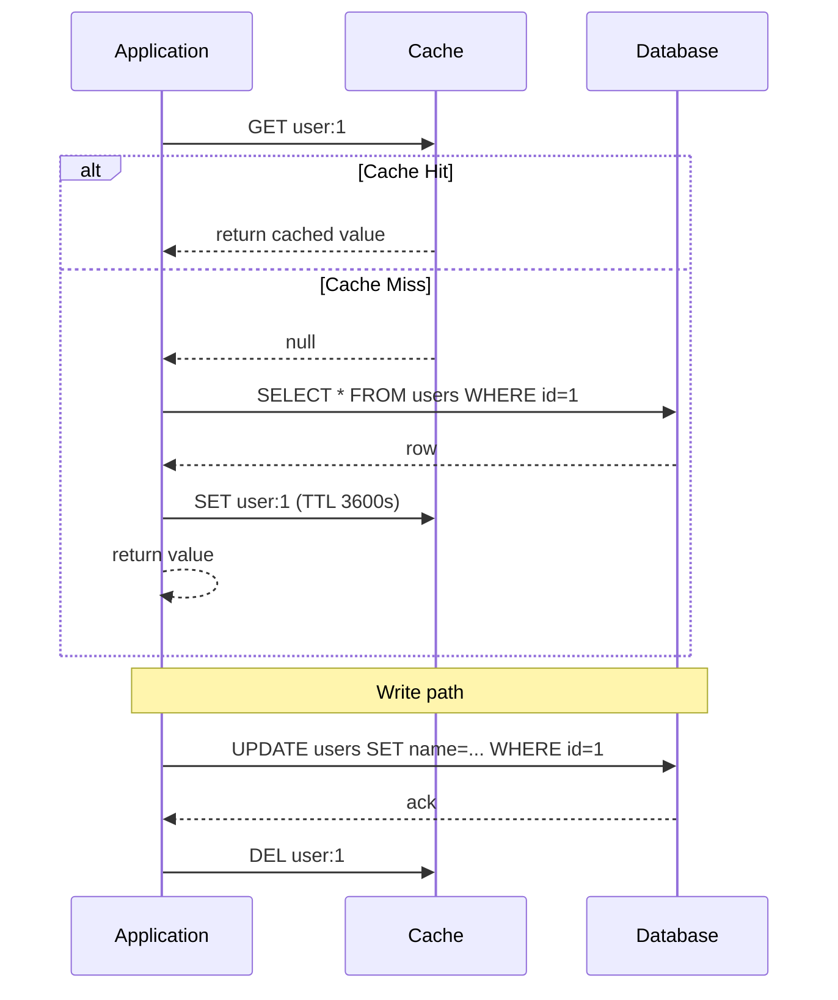

#### Cache-Aside (Lazy Loading): Java / Spring Boot Code Example

```java
@Service
public class UserService {

    private final StringRedisTemplate redisTemplate;
    private final UserRepository userRepository;

    public UserService(StringRedisTemplate redisTemplate, UserRepository userRepository) {
        this.redisTemplate = redisTemplate;
        this.userRepository = userRepository;
    }

    public String getUserName(Long userId) {
        String cacheKey = "user:" + userId;

        // 1. Try cache first
        String cached = redisTemplate.opsForValue().get(cacheKey);
        if (cached != null) {
            System.out.println("CACHE HIT for user " + userId);
            return cached;
        }

        // 2. Cache miss - fetch from database
        System.out.println("CACHE MISS for user " + userId);
        User user = userRepository.findById(userId)
                .orElseThrow(() -> new UserNotFoundException(userId));

        // 3. Populate cache with TTL
        redisTemplate.opsForValue().set(cacheKey, user.getName(), Duration.ofHours(1));

        return user.getName();
    }

    @Transactional
    public void updateUserName(Long userId, String newName) {
        // 1. Write to database
        User user = userRepository.findById(userId)
                .orElseThrow(() -> new UserNotFoundException(userId));
        user.setName(newName);
        userRepository.save(user);

        // 2. Invalidate cache (repopulated lazily on next read)
        redisTemplate.delete("user:" + userId);
    }
}

// Equivalent using Spring's declarative caching abstraction
@Service
public class UserCacheableService {

    private final UserRepository userRepository;

    public UserCacheableService(UserRepository userRepository) {
        this.userRepository = userRepository;
    }

    @Cacheable(value = "users", key = "#userId")
    public User getUser(Long userId) {
        return userRepository.findById(userId)
                .orElseThrow(() -> new UserNotFoundException(userId));
    }

    @CacheEvict(value = "users", key = "#userId")
    @Transactional
    public void updateUser(Long userId, String newName) {
        User user = userRepository.findById(userId)
                .orElseThrow(() -> new UserNotFoundException(userId));
        user.setName(newName);
        userRepository.save(user);
    }
}
```

#### Cache-Aside (Lazy Loading): Interview Questions and Answers

**Q1: How does Cache-Aside handle a cache miss?**
A: On a miss, the application queries the database directly, stores the result in the cache (usually with a TTL), and returns the value to the caller. The next request for the same key will then be a cache hit.

**Q2: Why does Cache-Aside typically invalidate (delete) the cache entry on write instead of updating it?**
A: Deleting is simpler and safer - it avoids race conditions where two concurrent writes could update the cache in the wrong order and leave a stale value in place. The next read lazily repopulates the cache with fresh data at negligible extra cost, since reads are far more frequent than writes in the workloads Cache-Aside targets.

**Q3: What is cache stampede (thundering herd) in the context of Cache-Aside, and how do you prevent it?**
A: When a very popular key expires, many concurrent requests can all miss the cache simultaneously and hit the database at once, potentially overwhelming it. It is prevented using a short-lived distributed lock (only one request repopulates the cache while others wait) or probabilistic early expiration (refreshing slightly before actual expiry based on a random probability that increases as TTL approaches zero).

**Q4: What happens if the database write succeeds but the cache invalidation fails in Cache-Aside?**
A: The cache will continue serving the old (stale) value until its TTL expires, which is why a TTL should always be set even when explicit invalidation is used - it acts as an upper bound on how long staleness can persist.

**Q5: Is Cache-Aside suitable for write-heavy workloads?**
A: Not ideally - every write still incurs the cost of invalidating the cache, and if data is written more often than it's read, the cache does little good and mostly adds a small amount of overhead (and cache churn) without much benefit. Write-Through, Write-Behind, or Write-Around are usually better fits depending on the specific write/read pattern.

---

### Write-Through Cache

**Description**: 

Write-Through is a caching pattern where every write operation goes through the cache to the database **synchronously**. The cache acts as the primary interface for writes, ensuring the cache and database are always perfectly synchronized.

**Key Concept**: **Write operations are never completed until both cache and database are updated**. This guarantees that the cache is always a reliable, up-to-date representation of the database state - no stale data exists in the cache.

**How the pattern works conceptually**:
- On **writes**: Application → Cache (update) → Cache synchronously writes to Database → Confirm to application
- On **reads**: Application → Cache (always returns fresh data, rarely needs to touch database)
- The cache is **active/smart** - it knows about the database and handles persistence
- **Strong consistency**: At any given moment, cache exactly mirrors the database

**Trade-off**: Write latency increases because every write waits for both cache and database operations to complete. However, this cost is often acceptable because reads (which are typically more frequent) become extremely fast since data is guaranteed to be in cache.

**Difference from Cache-Aside**: In Cache-Aside, writes go to DB first and cache may be invalidated. In Write-Through, cache is the write interface and it propagates to DB. This means Write-Through guarantees cache population on write, while Cache-Aside may leave cache empty after a write.

**Flow Diagram:**
```
Write Request:
┌─────────────┐
│ Application │
└──────┬──────┘
       │ 1. Write(key, value)
       ↓
┌─────────────┐
│    Cache    │  ← Write to cache first
└──────┬──────┘
       │ 2. Cache writes to DB synchronously
       ↓
┌─────────────┐
│  Database   │
└─────────────┘
       │
       └─ 3. Confirm write to app

Read Request:
┌─────────────┐
│ Application │
└──────┬──────┘
       │ 1. Read(key)
       ↓
┌─────────────┐
│    Cache    │  ← Always returns fresh data (no DB query)
└─────────────┘
```

**Python Implementation:**
```python
class WriteThrough:
    def __init__(self):
        self.cache = redis.Redis(host='localhost', port=6379, decode_responses=True)
        self.db = psycopg2.connect("dbname=mydb user=postgres")
    
    def get_user(self, user_id):
        """Read from cache (always up-to-date)"""
        cache_key = f"user:{user_id}"
        
        # Try cache first
        cached_value = self.cache.get(cache_key)
        if cached_value:
            print(f"CACHE HIT for user {user_id}")
            return cached_value
        
        # If not in cache, load from DB and cache it
        print(f"CACHE MISS for user {user_id}")
        cursor = self.db.cursor()
        cursor.execute("SELECT name FROM users WHERE id = %s", (user_id,))
        result = cursor.fetchone()
        
        if result:
            user_name = result[0]
            self.cache.set(cache_key, user_name)
            return user_name
        
        return None
    
    def create_user(self, user_id, name):
        """Write-Through: Write to cache AND database"""
        cache_key = f"user:{user_id}"
        
        # 1. Write to cache
        self.cache.set(cache_key, name)
        
        # 2. Write to database synchronously
        cursor = self.db.cursor()
        cursor.execute("INSERT INTO users (id, name) VALUES (%s, %s)", (user_id, name))
        self.db.commit()
        
        print(f"Created user {user_id} in both cache and database")
    
    def update_user(self, user_id, new_name):
        """Write-Through: Update cache AND database"""
        cache_key = f"user:{user_id}"
        
        # 1. Update cache
        self.cache.set(cache_key, new_name)
        
        # 2. Update database synchronously
        cursor = self.db.cursor()
        cursor.execute("UPDATE users SET name = %s WHERE id = %s", (new_name, user_id))
        self.db.commit()
        
        print(f"Updated user {user_id} in both cache and database")

# Usage
write_through = WriteThrough()
write_through.create_user(1, "John")
print(write_through.get_user(1))  # CACHE HIT - always in cache
write_through.update_user(1, "Jane")
print(write_through.get_user(1))  # CACHE HIT - updated data
```

#### Write-Through Cache: Characteristics

- **Cache is the write gateway**: The application never writes to the database directly; it writes to the cache, and the cache (or a thin service wrapping both) propagates the write to the database before acknowledging success.
- **Synchronous durability**: A write is not considered complete until the database confirms it, so there is no window where the cache holds data the database does not also have.
- **Cache always warm for written data**: Because every write also populates the cache, there is no "first read after write is a miss" scenario the way there sometimes is with Cache-Aside or Write-Around.
- **Strong read/write consistency**: At any instant, reading from the cache returns exactly what the database holds for that key (assuming no direct writes bypass the cache).

#### Write-Through Cache: Components

- **Write interceptor / write path**: The code path (service method, ORM hook, or cache library feature) that ensures every write request touches the cache before or alongside the database.
- **Cache client**: Same as other strategies - a Redis/Memcached/Ehcache client, but here it is invoked on the write path as well as the read path.
- **Transactional wrapper**: Logic that ties the cache write and database write together so that a failure in either step can be detected and handled (e.g., rolling back the cache write if the database write fails).
- **Connection pool**: Because every write now touches two systems, a well-tuned connection pool to both cache and database is important to avoid write latency becoming a bottleneck.

#### Write-Through Cache: Patterns

- **Write-then-persist**: Update the cache first (fast), then synchronously persist to the database, rolling back the cache entry if the database write fails.
- **Persist-then-cache**: Write to the database first, then update the cache - slightly safer against showing data that was never actually durable, at the cost of being logically closer to Cache-Aside's write path (the difference being the cache is proactively updated rather than invalidated).
- **Read-through fallback**: Combine Write-Through for writes with Read-Through (or a simple cache-check) for the rare case for a key that is in the database but not yet in cache (e.g., after a cache flush), so reads remain simple.

#### Write-Through Cache: Pros / Benefits

- **Cache and database always consistent**: Since every write updates both simultaneously (and the write is not considered done until both succeed), there is no time window where the cache is stale relative to the database.
- **No stale data**: Readers never see an outdated value for something that has already been written, which matters for data where read-your-own-write consistency is important (e.g., session state, user preferences).
- **Read performance is excellent (always hits cache)**: Because every write pre-populates the cache, reads for that data essentially never miss (barring eviction or TTL expiry), giving consistently low read latency.
- **Simplifies read logic (cache is source of truth for reads)**: Application read paths do not need complex miss-handling logic, since the cache is expected to already contain the data.

#### Write-Through Cache: Cons / Challenges

- **Write latency increases (writes to cache AND DB)**: Every write now pays the cost of two operations instead of one, which can noticeably slow down write-heavy paths compared to writing to the database alone.
- **Every write goes to both cache and DB (even if data never read)**: Unlike Write-Around, Write-Through caches data unconditionally on write, which can waste cache memory on entities that are written once and never subsequently read.
- **Wasted cache space for rarely accessed data**: Combined with the point above, a workload with many "write-once, rarely-read" records will fill the cache with low-value entries, potentially evicting genuinely hot data.
- **Higher write load on cache**: The cache server itself now needs to handle write traffic proportional to the database's write traffic, which is additional load it would not see under Cache-Aside or Write-Around.

#### Write-Through Cache: Best Practices

- Use Write-Through only for entities with a meaningfully high read-to-write ratio; if writes and reads are roughly equal, the doubled write cost may not be worth the read benefit.
- Make the cache-then-database (or database-then-cache) sequence transactional in intent: on failure of either step, either roll back the other or clearly log/alert so the two stores do not silently diverge.
- Still set a TTL on Write-Through entries as a defensive measure against any code path that might write directly to the database and bypass the cache.
- Monitor write latency explicitly after adopting Write-Through, since the added cache round trip is easy to overlook until it shows up as a regression in p99 latency.

#### Write-Through Cache: When to Use

- Applications requiring strong consistency between cache and database, such as authentication/session state or user preference settings.
- Read-heavy workloads with predictable, moderate write patterns, where the extra write cost is amortized over many subsequent cache-hit reads.
- When data must always be cached immediately after write, e.g., a "read your own write" requirement right after a user submits a form.

**Implementation Considerations:**

1. **Write Latency Impact**
   - Every write waits for both cache AND database
   - Use connection pooling to minimize latency
   - Consider async replication for non-critical data

2. **Transaction Handling**
   - Ensure atomicity between cache and DB writes
   - Rollback cache if DB write fails

```python
def create_user_with_transaction(self, user_id, name, email):
    """Write-Through with proper transaction handling"""
    cache_key = f"user:{user_id}"
    user_data = json.dumps({'name': name, 'email': email})
    
    try:
        # Write to cache first (faster)
        self.cache.set(cache_key, user_data)
        
        # Write to database
        cursor = self.db.cursor()
        cursor.execute(
            "INSERT INTO users (id, name, email) VALUES (%s, %s, %s)",
            (user_id, name, email)
        )
        self.db.commit()
        
        print(f"✓ User {user_id} created in cache and DB")
        
    except Exception as e:
        # Rollback: Remove from cache if DB write failed
        self.cache.delete(cache_key)
        self.db.rollback()
        print(f"✗ Write failed: {e}. Cache rolled back.")
        raise
```

**Real-World Example: Session Management**

```python
import json
import uuid
from datetime import datetime, timedelta

class SessionStore:
    """Write-Through cache for user sessions - always consistent"""
    
    def __init__(self):
        self.cache = redis.Redis(host='localhost', port=6379, decode_responses=True)
        self.db = psycopg2.connect("dbname=sessions user=postgres")
    
    def create_session(self, user_id: int, ip_address: str) -> str:
        """Create new session - Write-Through ensures immediate consistency"""
        session_id = str(uuid.uuid4())
        session_data = {
            'user_id': user_id,
            'ip_address': ip_address,
            'created_at': datetime.now().isoformat(),
            'last_accessed': datetime.now().isoformat()
        }
        
        cache_key = f"session:{session_id}"
        
        try:
            # 1. Write to cache (fast access for all requests)
            self.cache.setex(
                cache_key,
                86400,  # 24 hour expiry
                json.dumps(session_data)
            )
            
            # 2. Write to database (persistence, analytics)
            cursor = self.db.cursor()
            cursor.execute("""
                INSERT INTO sessions (id, user_id, ip_address, created_at, last_accessed)
                VALUES (%s, %s, %s, %s, %s)
            """, (
                session_id,
                user_id,
                ip_address,
                session_data['created_at'],
                session_data['last_accessed']
            ))
            self.db.commit()
            
            print(f"✓ Session {session_id} created for user {user_id}")
            return session_id
            
        except Exception as e:
            # Cleanup on failure
            self.cache.delete(cache_key)
            self.db.rollback()
            raise
    
    def get_session(self, session_id: str) -> Optional[Dict]:
        """Get session - always from cache (guaranteed to be there)"""
        cache_key = f"session:{session_id}"
        
        cached_data = self.cache.get(cache_key)
        if cached_data:
            print(f"✓ Session {session_id[:8]}... found in cache")
            return json.loads(cached_data)
        
        # Should rarely happen (only if cache was cleared)
        print(f"⚠ Session {session_id[:8]}... not in cache, checking DB")
        
        cursor = self.db.cursor()
        cursor.execute(
            "SELECT user_id, ip_address, created_at, last_accessed FROM sessions WHERE id = %s",
            (session_id,)
        )
        result = cursor.fetchone()
        
        if result:
            # Re-populate cache
            session_data = {
                'user_id': result[0],
                'ip_address': result[1],
                'created_at': result[2].isoformat(),
                'last_accessed': result[3].isoformat()
            }
            self.cache.setex(cache_key, 86400, json.dumps(session_data))
            return session_data
        
        return None
    
    def update_session_activity(self, session_id: str):
        """Update last accessed time - Write-Through keeps everything in sync"""
        cache_key = f"session:{session_id}"
        
        # Get current session data
        cached_data = self.cache.get(cache_key)
        if not cached_data:
            return False
        
        session_data = json.loads(cached_data)
        session_data['last_accessed'] = datetime.now().isoformat()
        
        try:
            # Update cache
            self.cache.setex(cache_key, 86400, json.dumps(session_data))
            
            # Update database
            cursor = self.db.cursor()
            cursor.execute(
                "UPDATE sessions SET last_accessed = %s WHERE id = %s",
                (session_data['last_accessed'], session_id)
            )
            self.db.commit()
            
            return True
            
        except Exception as e:
            # If DB update fails, revert cache to old value
            self.cache.setex(cache_key, 86400, cached_data)
            self.db.rollback()
            raise

# Usage Example
session_store = SessionStore()

# Create session - written to both cache and DB
session_id = session_store.create_session(user_id=42, ip_address="192.168.1.1")

# Get session - always from cache (fast)
session = session_store.get_session(session_id)
print(f"User: {session['user_id']}, IP: {session['ip_address']}")

# Update activity - both cache and DB updated
session_store.update_session_activity(session_id)
```

**Why Write-Through for Sessions?**
- ✅ **Consistency**: Cache and DB always in sync
- ✅ **Read Performance**: Every session read is a cache hit (< 1ms)
- ✅ **Reliability**: Sessions persisted to DB (survive cache restart)
- ✅ **Analytics**: DB has all session data for reporting
- ⚠️ **Write Cost**: Acceptable because session creates/updates are infrequent compared to reads

**Performance Comparison:**
```
Session Reads (per request):
- Without cache: 10-20ms (DB query)
- With Write-Through cache: <1ms (cache hit)
- Improvement: 10-20x faster

Session Writes:
- Write-Through: 15-25ms (cache + DB)
- Cache-Aside: 10-20ms (DB only)
- Trade-off: Slightly slower writes for much faster reads
```

#### Write-Through Cache: Diagram

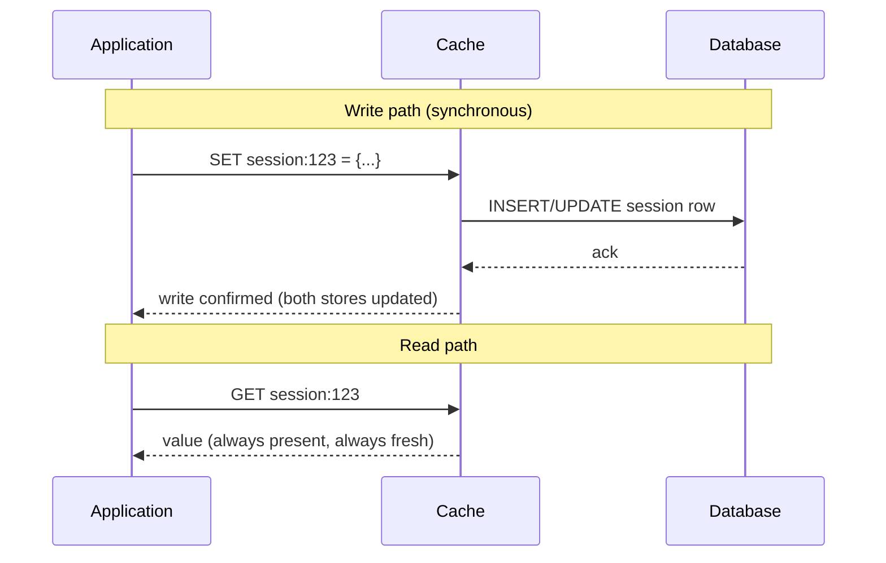

#### Write-Through Cache: Java / Spring Boot Code Example

```java
@Service
public class SessionService {

    private final RedisTemplate<String, Object> redisTemplate;
    private final SessionRepository sessionRepository;

    public SessionService(RedisTemplate<String, Object> redisTemplate,
                           SessionRepository sessionRepository) {
        this.redisTemplate = redisTemplate;
        this.sessionRepository = sessionRepository;
    }

    @Transactional
    public String createSession(Long userId, String ipAddress) {
        String sessionId = UUID.randomUUID().toString();
        SessionData sessionData = new SessionData(sessionId, userId, ipAddress, Instant.now());

        String cacheKey = "session:" + sessionId;

        try {
            // 1. Write to cache first (fast path for subsequent reads)
            redisTemplate.opsForValue().set(cacheKey, sessionData, Duration.ofHours(24));

            // 2. Synchronously persist to the database
            sessionRepository.save(sessionData);

        } catch (Exception ex) {
            // Roll back the cache write if the DB write fails - keep both stores in sync
            redisTemplate.delete(cacheKey);
            throw new SessionCreationException("Failed to create session", ex);
        }

        return sessionId;
    }

    public SessionData getSession(String sessionId) {
        String cacheKey = "session:" + sessionId;

        // With Write-Through, this should almost always be a hit
        SessionData cached = (SessionData) redisTemplate.opsForValue().get(cacheKey);
        if (cached != null) {
            return cached;
        }

        // Rare fallback (e.g., cache was flushed)
        SessionData fromDb = sessionRepository.findById(sessionId)
                .orElseThrow(() -> new SessionNotFoundException(sessionId));
        redisTemplate.opsForValue().set(cacheKey, fromDb, Duration.ofHours(24));
        return fromDb;
    }
}
```

#### Write-Through Cache: Interview Questions and Answers

**Q1: How does Write-Through differ from Cache-Aside on the write path?**
A: In Cache-Aside, a write goes to the database and the corresponding cache entry is invalidated (deleted), so the cache is repopulated lazily on the next read. In Write-Through, a write goes through the cache, which synchronously propagates it to the database, so the cache entry is immediately updated (not deleted) and remains populated.

**Q2: Why is read performance better with Write-Through than with Cache-Aside?**
A: Because every write also updates the cache, virtually every read is guaranteed to be a cache hit (barring eviction or TTL expiry). Cache-Aside, by contrast, always has at least one miss per key after a write, since the entry was invalidated rather than refreshed.

**Q3: What is the main cost of using Write-Through, and when is that cost acceptable?**
A: Every write now takes as long as the slower of (cache write, database write) combined, roughly doubling the number of I/O operations needed per write. This cost is acceptable when reads vastly outnumber writes, so the aggregate benefit of near-100% cache hit rate on reads outweighs the added latency on the comparatively rare writes.

**Q4: Would you use Write-Through for a high-volume logging system? Why or why not?**
A: No - logging systems are write-heavy and rarely read, so Write-Through would pay the write-amplification cost on every single log entry while providing almost no benefit, since most log entries are never read back. Write-Around (or no caching at all) is the better fit.

**Q5: How should a Write-Through implementation handle a failure in the database write after the cache has already been updated?**
A: The implementation must roll back (delete or restore the previous value of) the cache entry if the database write fails, otherwise the cache would hold data that was never actually durable in the database - violating the strong-consistency guarantee that is the entire point of Write-Through.

---

### Write-Behind (Write-Back) Cache

**Description**: 

Write-Behind, also called **Write-Back**, is a high-performance caching pattern where write operations complete as soon as data is written to cache, and the database write happens **asynchronously** in the background. This decouples the application from database write latency.

**Key Concept**: The cache becomes the **primary data store** from the application's perspective, and the database is updated "eventually" through background processes. This provides blazing-fast write performance but introduces eventual consistency and potential data loss risks.

**How the pattern works conceptually**:
- On **writes**: Application → Cache (immediate update) → Return success immediately → Background process writes to DB later
- The database write happens in a **separate thread/process** - often batched with other writes
- **Write coalescing**: Multiple writes to same key can be collapsed into single DB operation
- **Eventual consistency**: Cache has latest data, but database lags behind temporarily (milliseconds to seconds)

**Asynchronous mechanisms**:
- **Time-based batching**: Flush to DB every N seconds (e.g., every 5 seconds)
- **Size-based batching**: Flush when N writes accumulate (e.g., every 100 writes)
- **Hybrid**: Flush based on time OR size, whichever comes first

**Critical consideration**: If cache fails before background write completes, data in the queue is lost. This makes it unsuitable for critical data (financial transactions, user accounts) but perfect for high-volume, less-critical data (analytics, logs, game scores).

**Performance benefit**: Can handle 10-100x more writes than Write-Through because application isn't blocked by slow database operations. Database load is also reduced through batching and coalescing.

**Flow Diagram:**
```
Write Request:
┌─────────────┐
│ Application │
└──────┬──────┘
       │ 1. Write(key, value)
       ↓
┌─────────────┐
│    Cache    │  ← Write to cache (fast response)
└──────┬──────┘
       │ 2. Return immediately to app
       │
       └─ 3. Asynchronously write to DB later
          (batched or delayed)
          ↓
┌─────────────┐
│  Database   │
└─────────────┘

Read Request:
┌─────────────┐
│ Application │
└──────┬──────┘
       │ 1. Read(key)
       ↓
┌─────────────┐
│    Cache    │  ← Always returns data (may not be in DB yet)
└─────────────┘
```

**Python Implementation:**
```python
import threading
import time
from queue import Queue

class WriteBehind:
    def __init__(self):
        self.cache = redis.Redis(host='localhost', port=6379, decode_responses=True)
        self.db = psycopg2.connect("dbname=mydb user=postgres")
        self.write_queue = Queue()
        
        # Background thread for async DB writes
        self.writer_thread = threading.Thread(target=self._background_writer, daemon=True)
        self.writer_thread.start()
    
    def _background_writer(self):
        """Background thread that writes to DB asynchronously"""
        while True:
            # Batch writes every 5 seconds or when queue has 100 items
            time.sleep(5)
            
            writes = []
            while not self.write_queue.empty() and len(writes) < 100:
                writes.append(self.write_queue.get())
            
            if writes:
                # Batch write to database
                cursor = self.db.cursor()
                for user_id, name in writes:
                    cursor.execute(
                        "INSERT INTO users (id, name) VALUES (%s, %s) "
                        "ON CONFLICT (id) DO UPDATE SET name = %s",
                        (user_id, name, name)
                    )
                self.db.commit()
                print(f"Batch wrote {len(writes)} records to database")
    
    def get_user(self, user_id):
        """Read from cache"""
        cache_key = f"user:{user_id}"
        cached_value = self.cache.get(cache_key)
        
        if cached_value:
            print(f"CACHE HIT for user {user_id}")
            return cached_value
        
        # Fallback to DB if not in cache
        print(f"CACHE MISS for user {user_id}")
        cursor = self.db.cursor()
        cursor.execute("SELECT name FROM users WHERE id = %s", (user_id,))
        result = cursor.fetchone()
        
        if result:
            return result[0]
        return None
    
    def update_user(self, user_id, new_name):
        """Write-Behind: Update cache immediately, DB later"""
        cache_key = f"user:{user_id}"
        
        # 1. Write to cache immediately (fast!)
        self.cache.set(cache_key, new_name)
        
        # 2. Queue DB write for later (async)
        self.write_queue.put((user_id, new_name))
        
        print(f"Updated user {user_id} in cache (DB write queued)")
        # Return immediately without waiting for DB write!

# Usage
write_behind = WriteBehind()
write_behind.update_user(1, "John")  # Returns immediately
print(write_behind.get_user(1))  # CACHE HIT - instant
time.sleep(6)  # Wait for background writer
# Check DB - data should be there now
```

**Advantages:**
- ✅ Extremely fast writes (cache-only latency)
- ✅ Reduced database load (batched writes)
- ✅ Better performance for write-heavy workloads
- ✅ Can consolidate multiple writes (write coalescing)

**Disadvantages:**
- ❌ Risk of data loss if cache fails before DB write
- ❌ Complex implementation (background writers, queues)
- ❌ Eventual consistency (DB lags behind cache)
- ❌ Difficult to debug (async writes)

**When to Use:**
- Write-heavy applications (logging, analytics, gaming leaderboards)
- When write latency is critical
- Systems that can tolerate some data loss
- High-throughput data ingestion

#### Write-Behind (Write-Back) Cache: Characteristics

- **Cache is the immediate write target**: The application's write call returns as soon as the cache is updated, before the database has been touched at all.
- **Asynchronous durability**: Database persistence happens later, on a separate thread/process, decoupled from the request/response cycle of the original write.
- **Batching and coalescing by default**: Multiple writes to the same key within a batching window are naturally collapsed into a single database write, since only the latest value is kept in the write queue/buffer.
- **Cache as (temporarily) the most up-to-date source**: For a short window, the cache holds data that the database does not yet have, which is the defining and riskiest characteristic of this pattern.

#### Write-Behind (Write-Back) Cache: Components

- **Write queue/buffer**: An in-memory (or persistent) queue holding pending writes waiting to be flushed to the database.
- **Background writer thread/process**: A separate worker that periodically drains the queue and performs the actual database writes, often in batches.
- **Batching trigger**: The condition that decides when to flush - time-based (every N seconds), size-based (every N writes), or a hybrid of both.
- **Coalescing map**: A dictionary/map keyed by entity ID used to collapse multiple pending writes for the same key into a single latest-value write.
- **Persistence layer of the cache itself**: Because the cache is briefly the only copy of the latest data, the cache's own persistence (Redis AOF/RDB) becomes an important durability safeguard.

#### Write-Behind (Write-Back) Cache: Patterns

- **Time-based batching**: Flush the write queue to the database every fixed interval (e.g., every 5-10 seconds), trading a bounded window of risk for predictable database load.
- **Size-based batching**: Flush once the queue reaches N pending writes, useful when write volume is bursty and a fixed time window could let the queue grow unbounded.
- **Write coalescing**: Collapse multiple writes to the same key that occur within the same batching window into a single final write, since only the latest value matters to the database.
- **Dual-write safety net**: Some implementations additionally write a lightweight append-only log (or rely on the cache's own AOF) so that pending writes are not fully lost if the cache process crashes before flushing.

#### Write-Behind (Write-Back) Cache: Best Practices

- Reserve Write-Behind for data where losing the last few seconds of updates on a crash is an acceptable business risk (leaderboards, view counters, analytics) - never for money movement or inventory counts.
- Enable cache persistence (Redis AOF with `appendfsync everysec`, or equivalent) to bound the maximum possible data loss window to roughly one second instead of potentially minutes.
- Keep the batching window small enough that the database does not fall unacceptably far behind the cache, but large enough to get meaningful write coalescing and batch efficiency.
- Log or alert on background writer failures explicitly - because writes are asynchronous, a silently failing background writer can go unnoticed far longer than a synchronous write failure would.

#### Write-Behind (Write-Back) Cache: When to Use (Expanded)

- Write-heavy applications where write latency directly affects user experience (gaming leaderboards, real-time counters, activity feeds).
- Systems that can tolerate eventual consistency and a small, bounded risk of data loss in exchange for dramatically higher write throughput.
- High-throughput ingestion pipelines (analytics events, telemetry, IoT sensor data) where the database would otherwise be overwhelmed by the raw write rate.
- Avoid it entirely for financial transactions, inventory management, or any data where every single write must be immediately durable.

**Critical Considerations:**

1. **Data Loss Risk**
   - Cache can fail before DB write completes
   - Use persistence (Redis AOF/RDB) to minimize loss
   - Not suitable for financial transactions or critical data

2. **Write Coalescing**
   - Multiple writes to same key can be collapsed into one DB write
   - Dramatically reduces database load

```python
def background_writer_with_coalescing(self):
    """Batch writer that coalesces duplicate writes"""
    while True:
        time.sleep(5)
        
        # Use dict to coalesce - last write wins
        writes_dict = {}
        
        while not self.write_queue.empty():
            user_id, name = self.write_queue.get()
            writes_dict[user_id] = name  # Overwrites previous value
        
        if writes_dict:
            cursor = self.db.cursor()
            
            # Batch insert/update
            for user_id, name in writes_dict.items():
                cursor.execute(
                    "INSERT INTO users (id, name) VALUES (%s, %s) "
                    "ON CONFLICT (id) DO UPDATE SET name = %s",
                    (user_id, name, name)
                )
            
            self.db.commit()
            print(f"Batch wrote {len(writes_dict)} records (coalesced from queue)")
```

**Real-World Example: Gaming Leaderboard**

```python
import time
import threading
from queue import Queue
from typing import List, Tuple
import json

class LeaderboardCache:
    """Write-Behind for high-frequency score updates in gaming"""
    
    def __init__(self):
        self.cache = redis.Redis(host='localhost', port=6379, decode_responses=True)
        self.db = psycopg2.connect("dbname=gaming user=postgres")
        self.write_queue = Queue()
        self.running = True
        
        # Start background writer
        self.writer_thread = threading.Thread(
            target=self._batch_writer,
            daemon=True
        )
        self.writer_thread.start()
    
    def update_score(self, player_id: int, score: int, game_id: str):
        """Update player score - Write-Behind for ultra-fast response"""
        leaderboard_key = f"leaderboard:{game_id}"
        player_key = f"player:{player_id}:score"
        
        # 1. Update cache immediately (FAST!)
        # Use Redis sorted set for automatic ranking
        self.cache.zadd(leaderboard_key, {player_id: score})
        self.cache.set(player_key, score)
        
        # 2. Queue for async DB write
        self.write_queue.put(('score_update', player_id, score, game_id))
        
        print(f"⚡ Player {player_id} score updated to {score} (instant response)")
        # Returns immediately - player sees instant feedback!
    
    def record_game_event(self, player_id: int, event_type: str, data: dict):
        """Record game events - high volume, write-behind"""
        event_key = f"events:{player_id}:latest"
        
        # Cache latest event for quick access
        self.cache.setex(event_key, 300, json.dumps(data))
        
        # Queue for DB persistence
        self.write_queue.put(('event', player_id, event_type, json.dumps(data)))
    
    def get_leaderboard(self, game_id: str, top_n: int = 10) -> List[Tuple[int, int]]:
        """Get top players - always from cache (real-time)"""
        leaderboard_key = f"leaderboard:{game_id}"
        
        # Get top N players with scores (descending order)
        top_players = self.cache.zrevrange(
            leaderboard_key,
            0,
            top_n - 1,
            withscores=True
        )
        
        leaderboard = [(int(player_id), int(score)) for player_id, score in top_players]
        
        print(f"✓ Leaderboard for {game_id}: {len(leaderboard)} players")
        return leaderboard
    
    def get_player_rank(self, player_id: int, game_id: str) -> Tuple[int, int]:
        """Get player's rank and score - instant from cache"""
        leaderboard_key = f"leaderboard:{game_id}"
        
        # Get rank (0-based, so add 1)
        rank = self.cache.zrevrank(leaderboard_key, player_id)
        score = self.cache.zscore(leaderboard_key, player_id)
        
        if rank is not None and score is not None:
            return (rank + 1, int(score))
        
        return (None, None)
    
    def _batch_writer(self):
        """Background thread - writes to DB in batches every 10 seconds"""
        while self.running:
            time.sleep(10)  # Batch every 10 seconds
            
            # Collect writes with coalescing
            score_updates = {}  # player_id -> (score, game_id)
            events = []
            
            batch_size = 0
            while not self.write_queue.empty() and batch_size < 1000:
                item = self.write_queue.get()
                
                if item[0] == 'score_update':
                    _, player_id, score, game_id = item
                    # Coalesce: keep only latest score per player
                    score_updates[player_id] = (score, game_id)
                    
                elif item[0] == 'event':
                    _, player_id, event_type, data = item
                    events.append((player_id, event_type, data))
                
                batch_size += 1
            
            if score_updates or events:
                try:
                    cursor = self.db.cursor()
                    
                    # Batch update scores
                    if score_updates:
                        for player_id, (score, game_id) in score_updates.items():
                            cursor.execute("""
                                INSERT INTO player_scores (player_id, game_id, score, updated_at)
                                VALUES (%s, %s, %s, NOW())
                                ON CONFLICT (player_id, game_id)
                                DO UPDATE SET score = %s, updated_at = NOW()
                            """, (player_id, game_id, score, score))
                    
                    # Batch insert events
                    if events:
                        for player_id, event_type, data in events:
                            cursor.execute("""
                                INSERT INTO game_events (player_id, event_type, data, created_at)
                                VALUES (%s, %s, %s, NOW())
                            """, (player_id, event_type, data))
                    
                    self.db.commit()
                    
                    print(f"💾 Batch wrote to DB: {len(score_updates)} scores, {len(events)} events")
                    
                except Exception as e:
                    self.db.rollback()
                    print(f"❌ Batch write failed: {e}")
                    # Could re-queue failed writes or log to error queue

# Usage Example
leaderboard = LeaderboardCache()

# High-frequency score updates (1000s per second)
for i in range(1000):
    player_id = i % 100  # 100 players
    score = 1000 + i
    leaderboard.update_score(player_id, score, "fortnite_match_123")
    # Each update returns in < 1ms!

# Real-time leaderboard access
top_10 = leaderboard.get_leaderboard("fortnite_match_123", top_n=10)
for rank, (player_id, score) in enumerate(top_10, 1):
    print(f"Rank {rank}: Player {player_id} - {score} points")

# Check player rank instantly
rank, score = leaderboard.get_player_rank(42, "fortnite_match_123")
print(f"Player 42: Rank #{rank}, Score: {score}")

# Wait for background writer
time.sleep(11)
print("Scores now persisted to database!")
```

**Performance Benefits:**

```
Without Write-Behind:
- Score update latency: 10-20ms (DB write)
- Max updates/second: ~50-100 per DB connection
- Database CPU: 80-100% under load

With Write-Behind:
- Score update latency: <1ms (cache only)
- Max updates/second: 10,000+ (cache limited)
- Database CPU: 10-20% (batched writes)
- Write coalescing: 1000 cache writes → 100 DB writes (10x reduction)
```

**Data Loss Mitigation:**

```python
class LeaderboardWithPersistence:
    """Write-Behind with Redis persistence for safety"""
    
    def __init__(self):
        # Configure Redis with AOF (Append-Only File) persistence
        self.cache = redis.Redis(
            host='localhost',
            port=6379,
            decode_responses=True
        )
        
        # Enable AOF persistence via redis.conf:
        # appendonly yes
        # appendfsync everysec  # Flush to disk every second
        
        # Maximum data loss: 1-2 seconds of writes (vs minutes without persistence)
```

**When NOT to Use Write-Behind:**
- ❌ Financial transactions (require immediate persistence)
- ❌ Critical user data (passwords, personal info)
- ❌ Inventory management (risk of overselling)
- ❌ Regulatory compliance data (must be immediately persisted)

#### Write-Behind (Write-Back) Cache: Diagram

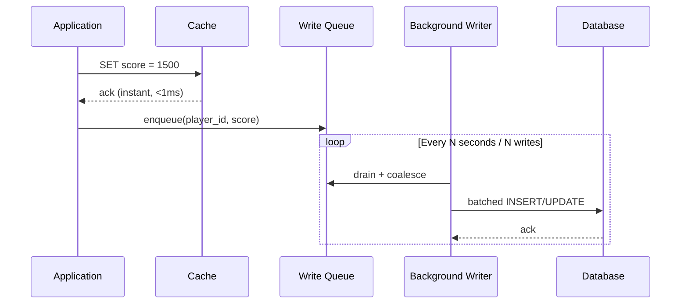

#### Write-Behind (Write-Back) Cache: Interview Questions and Answers

**Q1: What is the key difference between Write-Behind and Write-Through?**
A: Write-Through writes to the cache and database synchronously, so a write is not complete until both are updated. Write-Behind writes to the cache only, returns immediately, and persists to the database asynchronously in the background, trading immediate durability for much lower write latency.

**Q2: What is write coalescing, and why does it matter for Write-Behind?**
A: Write coalescing collapses multiple pending writes to the same key within a batching window into a single final write (keeping only the latest value), which can dramatically reduce database load - e.g., 1,000 rapid score updates for the same player might result in just one database write per batch instead of 1,000.

**Q3: What is the biggest risk of Write-Behind, and how can it be mitigated?**
A: The biggest risk is data loss - if the cache crashes before queued writes are flushed to the database, those updates are lost permanently. This is mitigated by enabling cache persistence (e.g., Redis AOF with a short fsync interval), which bounds the maximum possible loss window to roughly a second instead of losing everything since the last flush.

**Q4: Why is Write-Behind unsuitable for financial transactions?**
A: Financial transactions require immediate, guaranteed durability - a lost update (e.g., a balance debit) after a cache crash would cause real monetary and legal consequences. Write-Behind intentionally defers durability for performance, which conflicts directly with that requirement.

**Q5: How would you decide the batching interval for a Write-Behind background writer?**
A: Balance two competing concerns - a shorter interval reduces the data-loss window and keeps the database more up to date, but produces less write coalescing and higher database load; a longer interval maximizes coalescing and reduces database load, but increases the staleness/risk window. The right value depends on acceptable data-loss tolerance and the write volume of the specific use case.

---

### Read-Through Cache

**Description**: 

Read-Through is a caching pattern where the cache itself is responsible for loading data from the database on cache misses, making the database completely **transparent** to the application. The application only ever talks to the cache, never directly to the database.

**Key Concept**: The cache acts as an **intelligent proxy** that abstracts away the database layer. When data isn't in cache, the cache automatically retrieves it from the database, stores it, and returns it to the application - all without application involvement.

**How the pattern works conceptually**:
- On **reads**: Application → Cache → (if miss) Cache internally queries Database → Cache stores data → Cache returns to application
- The application is **database-agnostic** - it only knows about the cache interface
- The cache has **built-in data loading logic** - knows how to fetch from database on misses
- Similar to Cache-Aside but with **inverted responsibility**: cache manages DB interaction, not application

**Implementation approaches**:
- **Cache framework/library**: Tools like Spring Cache, Guava Cache provide read-through support
- **Custom cache layer**: Build a service that wraps both cache and database
- **Cache proxy pattern**: Cache implements same interface as data layer

**Difference from Cache-Aside**:
- **Cache-Aside**: Application checks cache → if miss, app reads DB → app writes to cache
- **Read-Through**: Application reads from cache → cache handles everything (transparent to app)

**Advantages**: Cleaner application code (no cache management logic), centralized caching behavior, easier to change cache strategy without touching application code.

**Limitation**: Requires cache system or framework that supports automatic data loading, or custom implementation of the proxy pattern. Not all caching systems provide this out-of-the-box.

**Flow Diagram:**
```
Read Request:
┌─────────────┐
│ Application │
└──────┬──────┘
       │ 1. Read(key) - only talks to cache
       ↓
┌─────────────┐
│    Cache    │  ← Smart cache
└──────┬──────┘
       │
       ├─ 2a. CACHE HIT? → Return value
       │
       └─ 2b. CACHE MISS?
           │ Cache automatically loads from DB
           ↓
       ┌─────────────┐
       │  Database   │
       └──────┬──────┘
              │
              └─ 3. Cache populates itself
                 4. Cache returns value to app

Application doesn't know about DB!
```

**Python Implementation (with Proxy Pattern):**
```python
class ReadThroughCache:
    def __init__(self):
        self.cache = redis.Redis(host='localhost', port=6379, decode_responses=True)
        self.db = psycopg2.connect("dbname=mydb user=postgres")
    
    def get(self, key):
        """Read-Through: Cache handles DB loading automatically"""
        # 1. Check cache
        cached_value = self.cache.get(key)
        
        if cached_value:
            print(f"CACHE HIT for {key}")
            return cached_value
        
        # 2. Cache miss - load from DB (cache does this, not app)
        print(f"CACHE MISS for {key} - loading from DB")
        value = self._load_from_db(key)
        
        if value:
            # 3. Populate cache
            self.cache.setex(key, 3600, value)
            return value
        
        return None
    
    def _load_from_db(self, key):
        """Internal method - cache loads from DB"""
        # Parse key (e.g., "user:1" -> table=user, id=1)
        parts = key.split(":")
        if parts[0] == "user":
            user_id = int(parts[1])
            cursor = self.db.cursor()
            cursor.execute("SELECT name FROM users WHERE id = %s", (user_id,))
            result = cursor.fetchone()
            return result[0] if result else None
        return None

# Usage - Application only interacts with cache
cache = ReadThroughCache()
print(cache.get("user:1"))  # Cache loads from DB automatically
print(cache.get("user:1"))  # Cache hit
```

**Advantages:**
- ✅ Application code simplified (only talks to cache)
- ✅ Automatic cache population
- ✅ Cache misses are transparent to application
- ✅ Centralized caching logic

**Disadvantages:**
- ❌ Requires cache library/framework support
- ❌ Cold start penalty still exists
- ❌ Less flexible than cache-aside

**When to Use:**
- When using caching frameworks (Spring Cache, etc.)
- Want to abstract database from application
- Microservices with data access layer

#### Read-Through Cache: Characteristics

- **Cache-owned data loading**: Unlike Cache-Aside, where the application contains the "if miss, query DB" logic, in Read-Through that logic lives inside the cache abstraction itself (or a thin wrapper presented to the application as "the cache").
- **Single access point**: The application code has exactly one thing to call - the cache's `get()` - and never directly queries the database for cached entities.
- **Framework-dependent**: True Read-Through typically requires a caching library or framework (Spring Cache with a custom `CacheLoader`, Guava/Caffeine's `LoadingCache`, Hazelcast's `MapLoader`) that supports pluggable loader functions.
- **Symmetrical to Write-Through**: Read-Through is often paired with Write-Through in caching frameworks that support both - together they make the cache the single interface for both reads and writes.

#### Read-Through Cache: Components

- **Cache loader function**: The pluggable piece of logic (e.g., a `CacheLoader<K, V>` in Guava/Caffeine, or a `MapLoader` in Hazelcast) that the cache invokes internally on a miss.
- **Cache abstraction layer**: The interface the application actually calls (e.g., `cache.get(key)`), which hides whether the answer came from memory or from a just-completed database query.
- **Underlying data store adapter**: The piece that knows how to translate a cache key into an actual database query - this is effectively the same "translate key to query" logic Cache-Aside has, just moved inside the cache's loader.

#### Read-Through Cache: Patterns

- **Loading cache pattern**: Configure the cache with a loader function once at startup, so every subsequent `get()` call automatically handles the miss path without the caller needing to know it happened.
- **Synchronous load on miss**: The calling thread blocks while the loader fetches from the database (as shown in the example below); some frameworks also support asynchronous loading (`AsyncLoadingCache` in Caffeine) to avoid blocking the caller.
- **Refresh-after-write pairing**: Combining a `LoadingCache` with a manual `put()`/`invalidate()` call on write paths, since Read-Through alone only defines the read/miss behavior, not what happens on writes.

#### Read-Through Cache: Best Practices

- Use a well-tested caching library's built-in loader support (Caffeine's `LoadingCache`, Spring's custom `CacheLoader` integration) instead of hand-rolling the proxy pattern, to avoid subtle bugs in concurrent miss handling.
- Ensure the loader function itself has proper error handling and timeouts, since a hanging loader call will block every caller waiting on that key.
- Combine with an explicit invalidation strategy for writes (Read-Through only defines the read path) - it does not, by itself, solve cache consistency after an update.
- Prefer an asynchronous loading cache (where supported) for high-concurrency services, so a slow database call on one key does not block unrelated threads.

#### Read-Through Cache: When to Use (Expanded)

- When the application/team is already using a caching framework (Spring Cache, Guava/Caffeine, Hazelcast) that provides first-class loader support, making Read-Through nearly free to adopt.
- When the goal is to fully decouple application code from the database, e.g., in a microservice where the data-access layer should be an implementation detail hidden behind the cache.
- Less suitable when fine-grained, custom control over caching behavior (per-call TTL overrides, conditional caching) is required, since Cache-Aside offers more flexibility at the cost of more application-level code.

#### Read-Through Cache: Diagram

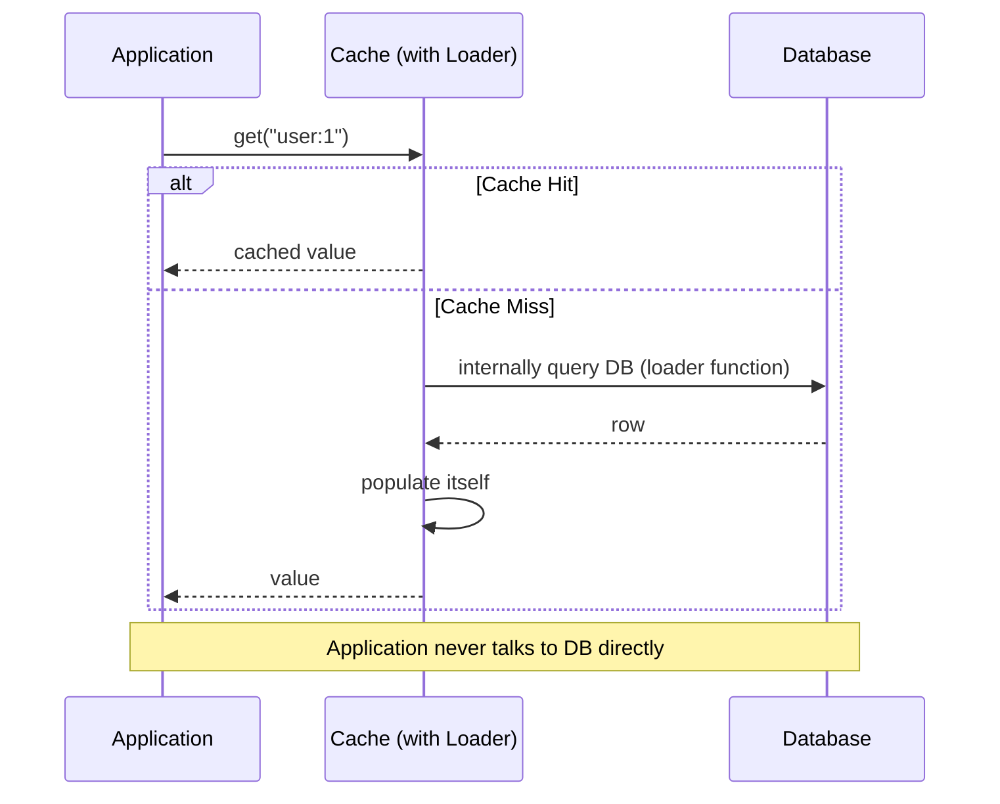

#### Read-Through Cache: Java / Spring Boot Code Example

```java
// Using Caffeine's LoadingCache - the cache itself owns the DB-loading logic
@Configuration
public class ReadThroughCacheConfig {

    @Bean
    public LoadingCache<Long, User> userCache(UserRepository userRepository) {
        return Caffeine.newBuilder()
                .maximumSize(10_000)
                .expireAfterWrite(Duration.ofHours(1))
                .build(userId -> {
                    // This loader runs automatically on a cache miss
                    System.out.println("CACHE MISS - loading user " + userId + " from DB");
                    return userRepository.findById(userId)
                            .orElseThrow(() -> new UserNotFoundException(userId));
                });
    }
}

@Service
public class UserService {

    private final LoadingCache<Long, User> userCache;

    public UserService(LoadingCache<Long, User> userCache) {
        this.userCache = userCache;
    }

    public User getUser(Long userId) {
        // Application only ever talks to the cache - loader handles the miss internally
        return userCache.get(userId);
    }
}
```

#### Read-Through Cache: Interview Questions and Answers

**Q1: What is the fundamental difference between Cache-Aside and Read-Through?**
A: In Cache-Aside, the application contains the cache-miss handling logic - it explicitly checks the cache, queries the database on a miss, and writes the result back to the cache. In Read-Through, that same logic is moved inside the cache abstraction itself (via a loader function), so the application only ever calls the cache and is unaware of the database entirely.

**Q2: Why does Read-Through require framework or library support?**
A: Because the "load from database on miss" behavior needs to be registered with the cache ahead of time as a pluggable loader function (e.g., Caffeine's `LoadingCache`, Hazelcast's `MapLoader`) - without that framework feature, the cache has no way to know how to fetch data it doesn't have, and you are effectively back to writing that logic in the application (which is Cache-Aside).

**Q3: Does Read-Through solve the cold-start / cache-miss-penalty problem?**
A: No - Read-Through changes who writes the miss-handling code (the cache/framework instead of the application), but the very first request for any given key is still a miss and still pays the full database latency. The cold-start cost is inherent to lazy loading generally, regardless of where the loading logic lives.

**Q4: When would you prefer Cache-Aside over Read-Through even if your framework supports Read-Through?**
A: When you need fine-grained, per-call control over caching behavior - custom TTLs per request, conditional caching based on business logic, or special handling for specific error cases - which is easier to express directly in application code than through a generic loader function interface.

**Q5: Can Read-Through and Write-Through be combined?**
A: Yes, and they often are - many caching frameworks support both a `CacheLoader` (for Read-Through misses) and a `CacheWriter` (for Write-Through writes) on the same cache, making the cache the single, symmetric interface for both reads and writes, with the framework handling the database interaction transparently on both sides.

---

### Refresh-Ahead Cache

**Description**: 

Refresh-Ahead is an advanced, **proactive** caching pattern where the cache automatically refreshes data in the background **before** it expires, ensuring frequently accessed data is always fresh and never requires a cache miss. This is the opposite of lazy loading.

**Key Concept**: Instead of waiting for data to expire and serving a cache miss, the cache **predicts** which data will be needed soon (based on access patterns or TTL thresholds) and refreshes it in advance. This creates a "perpetually warm" cache for hot data.

**How the pattern works conceptually**:
- Cache tracks **TTL (Time-To-Live)** and access frequency for each entry
- When TTL falls below a threshold (e.g., 50% remaining) AND data is frequently accessed: trigger background refresh
- **Background process** asynchronously fetches fresh data from database and updates cache
- User requests **always hit cache** with fresh data - no waiting for DB queries

**Refresh strategies**:
1. **TTL-based**: Refresh when TTL < threshold (e.g., less than 30 minutes remaining on 1-hour TTL)
2. **Access-based**: Refresh only if data accessed recently (prevents wasting refreshes on stale data)
3. **Predictive**: Use machine learning to predict which data will be accessed soon
4. **Periodic**: Refresh hot data at fixed intervals (every 10 minutes for homepage data)

**Smart refresh logic**:
```
if (data_accessed_recently AND ttl_remaining < threshold):
    return cached_data  # Fast response to user
    trigger_async_refresh()  # Update cache in background
```

**Benefits over Cache-Aside/Read-Through**:
- **No cache miss penalty** for popular data - always served from cache
- **Predictable latency** - no occasional slow requests due to cache misses
- **Reduced database load** during traffic spikes (cache is pre-warmed)

**Drawbacks**:
- **Wasted refreshes**: May refresh data that won't be accessed again
- **Implementation complexity**: Needs access tracking, TTL monitoring, background workers
- **Requires good access pattern prediction**: Works best when you can identify "hot" data

**Perfect for**: E-commerce homepages, trending content, game leaderboards, stock prices, sports scores - any scenario where specific data is accessed very frequently and staleness is unacceptable.

**Flow Diagram:**
```
┌─────────────┐
│ Application │
└──────┬──────┘
       │ Read(key)
       ↓
┌─────────────┐
│    Cache    │
└──────┬──────┘
       │ Check TTL
       │
       ├─ If TTL > 50% remaining → Return value
       │
       └─ If TTL < 50% remaining → 
          1. Return cached value (fast)
          2. Trigger async refresh from DB
          ↓
       ┌─────────────┐
       │  Database   │  ← Refresh happens in background
       └─────────────┘
```

**Python Implementation:**
```python
import time
import threading

class RefreshAhead:
    def __init__(self):
        self.cache = redis.Redis(host='localhost', port=6379, decode_responses=True)
        self.db = psycopg2.connect("dbname=mydb user=postgres")
        self.ttl = 3600  # 1 hour
        self.refresh_threshold = 0.5  # Refresh when 50% of TTL remains
    
    def get_user(self, user_id):
        """Refresh-Ahead Read"""
        cache_key = f"user:{user_id}"
        
        # Get value and TTL
        cached_value = self.cache.get(cache_key)
        
        if cached_value:
            # Check remaining TTL
            ttl_remaining = self.cache.ttl(cache_key)
            
            if ttl_remaining < self.ttl * self.refresh_threshold:
                # TTL below threshold - trigger async refresh
                print(f"CACHE HIT for user {user_id} - triggering refresh")
                threading.Thread(target=self._refresh_cache, args=(cache_key, user_id)).start()
            else:
                print(f"CACHE HIT for user {user_id}")
            
            return cached_value
        
        # Cache miss - load and cache
        print(f"CACHE MISS for user {user_id}")
        return self._load_and_cache(user_id)
    
    def _refresh_cache(self, cache_key, user_id):
        """Background refresh"""
        print(f"Refreshing cache for user {user_id}")
        cursor = self.db.cursor()
        cursor.execute("SELECT name FROM users WHERE id = %s", (user_id,))
        result = cursor.fetchone()
        
        if result:
            self.cache.setex(cache_key, self.ttl, result[0])
    
    def _load_and_cache(self, user_id):
        """Load from DB and cache"""
        cursor = self.db.cursor()
        cursor.execute("SELECT name FROM users WHERE id = %s", (user_id,))
        result = cursor.fetchone()
        
        if result:
            cache_key = f"user:{user_id}"
            self.cache.setex(cache_key, self.ttl, result[0])
            return result[0]
        return None

# Usage
refresh_ahead = RefreshAhead()
print(refresh_ahead.get_user(1))  # CACHE MISS - loads from DB
time.sleep(1900)  # Wait ~30 minutes (> 50% of 1 hour TTL)
print(refresh_ahead.get_user(1))  # CACHE HIT - triggers background refresh
```

**Advantages:**
- ✅ Popular data never expires (always fresh)
- ✅ No cache miss penalty for frequently accessed data
- ✅ Predictable low latency
- ✅ Reduced database load during peak times

**Disadvantages:**
- ❌ Complex implementation
- ❌ Wasted refreshes for data that won't be accessed again
- ❌ Requires prediction of popular data
- ❌ Additional database load for refreshes

**When to Use:**
- High-traffic applications with hot data
- When cache misses are unacceptable (gaming, real-time apps)
- Predictable access patterns

#### Refresh-Ahead Cache: Characteristics

- **Proactive rather than reactive**: Unlike every other strategy on this page, which reacts to a read or write, Refresh-Ahead proactively refreshes data before it is even requested again, based on TTL and access-frequency signals.
- **Hot-key aware**: The pattern is only worth its complexity for data accessed frequently enough that a background refresh will almost certainly be used before it would have expired anyway.
- **TTL-threshold driven**: A refresh is triggered once the remaining TTL drops below a configured fraction (commonly 50%) of the original TTL, not at a fixed absolute time.
- **Non-blocking for the requesting caller**: The request that happens to trigger the threshold check still gets an immediate response from the (still valid) cached value; the refresh itself runs asynchronously afterward.

#### Refresh-Ahead Cache: Components

- **TTL tracker**: Logic (often provided natively by the cache, e.g., Redis `TTL` command) to check how much time remains before an entry expires.
- **Access frequency tracker**: An optional counter or recency tracker used to decide whether a key is "hot" enough to justify a refresh (to avoid wasting refreshes on rarely accessed keys nearing expiry).
- **Refresh trigger/threshold**: The configured fraction of TTL (e.g., 50%) that, once crossed, schedules a background refresh.
- **Background refresh worker**: The asynchronous task (thread pool, scheduled job, or reactive pipeline) that performs the actual database fetch and re-populates the cache with a fresh TTL.

#### Refresh-Ahead Cache: Patterns

- **Threshold-based refresh**: The simplest and most common implementation - refresh once remaining TTL falls below a percentage of the original TTL, as shown in the Python/Java examples.
- **Sliding TTL renewal combined with periodic re-fetch**: Some systems combine sliding expiration (extend TTL on every access) with a separate periodic re-fetch to guarantee data does not silently go stale purely because it's popular.
- **Scheduled/periodic refresh for known-hot keys**: For a small, well-known set of extremely hot keys (e.g., homepage data), a simpler fixed-interval scheduled job (every N minutes) can replace per-key TTL tracking entirely.

#### Refresh-Ahead Cache: Best Practices

- Only apply Refresh-Ahead to a deliberately identified "hot set" of keys - applying it universally wastes resources refreshing data nobody is actually requesting.
- Make the background refresh idempotent and safe to run concurrently (e.g., guard with a short lock) so that a burst of requests near the threshold does not trigger many redundant simultaneous refreshes for the same key.
- Monitor the ratio of "refreshes performed" to "refreshes that were actually used before the next expiry", to catch a refresh threshold that is too aggressive (too many wasted refreshes) or too conservative (still hitting misses).
- Combine with a fallback cache-miss path (Cache-Aside style) for keys that are hot enough to warrant refresh-ahead protection but happen to expire before a refresh completes.

#### Refresh-Ahead Cache: When to Use (Expanded)

- High-traffic applications with a well-defined hot set of keys where a cache miss is unacceptable from a latency or user-experience standpoint (e.g., gaming leaderboards, trending content, stock tickers).
- When traffic patterns are predictable enough that the system can reliably identify which keys deserve proactive refresh, avoiding wasted background work on cold data.
- Not recommended for large, long-tail keyspaces where most keys are accessed rarely, since the overhead of tracking and potentially refreshing every key would far outweigh the benefit.

#### Refresh-Ahead Cache: Diagram

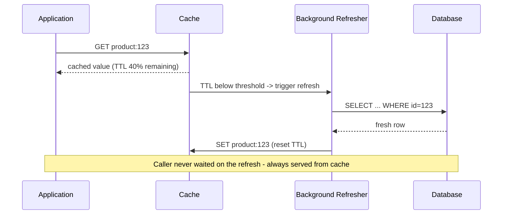

#### Refresh-Ahead Cache: Java / Spring Boot Code Example

```java
@Service
public class RefreshAheadProductService {

    private final StringRedisTemplate redisTemplate;
    private final ProductRepository productRepository;
    private final Executor refreshExecutor = Executors.newFixedThreadPool(4);

    private static final long TTL_SECONDS = 3600;
    private static final double REFRESH_THRESHOLD = 0.5; // refresh once 50% of TTL remains

    public RefreshAheadProductService(StringRedisTemplate redisTemplate,
                                       ProductRepository productRepository) {
        this.redisTemplate = redisTemplate;
        this.productRepository = productRepository;
    }

    public String getProductName(Long productId) {
        String cacheKey = "product:" + productId;

        String cachedValue = redisTemplate.opsForValue().get(cacheKey);

        if (cachedValue != null) {
            Long ttlRemaining = redisTemplate.getExpire(cacheKey, TimeUnit.SECONDS);

            if (ttlRemaining != null && ttlRemaining < TTL_SECONDS * REFRESH_THRESHOLD) {
                // Trigger async refresh - caller still gets the current value instantly
                refreshExecutor.execute(() -> refreshCache(cacheKey, productId));
            }
            return cachedValue;
        }

        // Cache miss - fall back to a normal load
        return loadAndCache(cacheKey, productId);
    }

    private void refreshCache(String cacheKey, Long productId) {
        productRepository.findById(productId).ifPresent(product ->
                redisTemplate.opsForValue().set(cacheKey, product.getName(), Duration.ofSeconds(TTL_SECONDS)));
    }

    private String loadAndCache(String cacheKey, Long productId) {
        Product product = productRepository.findById(productId)
                .orElseThrow(() -> new ProductNotFoundException(productId));
        redisTemplate.opsForValue().set(cacheKey, product.getName(), Duration.ofSeconds(TTL_SECONDS));
        return product.getName();
    }
}
```

#### Refresh-Ahead Cache: Interview Questions and Answers

**Q1: How does Refresh-Ahead differ from a simple TTL-based cache?**
A: A simple TTL-based cache lets data expire and then serves a cache miss on the next request, paying the full database latency for that unlucky caller. Refresh-Ahead proactively refreshes the data in the background before it fully expires, so the next caller always gets a cache hit with only slightly older (but still valid) data in the worst case.

**Q2: What signals determine when to trigger a Refresh-Ahead refresh?**
A: Typically the remaining TTL relative to a configured threshold (e.g., trigger when less than 50% of the original TTL remains), often combined with an access-frequency check so refreshes are only performed for keys that are actually still being requested, avoiding wasted work on data no one cares about anymore.

**Q3: What is the main risk of over-applying Refresh-Ahead?**
A: Wasted background refreshes - if applied indiscriminately to a large, long-tail keyspace, the system ends up refreshing many entries that will never be requested again before they would have naturally expired, adding unnecessary load to the database for no benefit.

**Q4: Why doesn't Refresh-Ahead add latency to the request that triggers the refresh?**
A: Because the refresh happens asynchronously in the background after the still-valid cached value has already been returned to the caller - the triggering request never waits for the database fetch; only the eventual next requests benefit from the freshly refreshed value.

**Q5: Give an example of a good and a bad use case for Refresh-Ahead.**
A: Good: a stock ticker's top-10 most-traded symbols, accessed by thousands of users per second, where staleness beyond a few seconds is unacceptable and the hot set is small and predictable. Bad: user profile pages for a long tail of infrequently visited users, where most cached entries would be refreshed unnecessarily since they are rarely re-requested before natural expiry.

---

### Write-Around Cache

**Description**: 

Write-Around is an optimization of the Cache-Aside pattern specifically designed to prevent **cache pollution** from write-heavy workloads. Write operations completely bypass the cache and go directly to the database, ensuring cache space is reserved only for data that's actually being read.

**Key Concept**: Writes are **excluded from caching** because many write operations are for data that will rarely or never be read (logs, audit trails, bulk imports). By skipping cache on writes, you avoid wasting precious cache memory on data that doesn't benefit from caching.

**How the pattern works conceptually**:
- On **writes**: Application → Database directly (cache is never touched or is invalidated)
- On **reads**: Application → Cache → (if miss) load from Database → store in Cache
- The pattern assumes: **Write-once, read-rarely (or never)** access pattern
- Cache is populated **only by reads**, ensuring only accessed data uses cache space

**Cache pollution scenario (that Write-Around solves)**:
```
Scenario: Logging system writing 10,000 log entries per second

With Write-Through:
- All 10,000 logs/sec written to cache (using 100MB+ cache space)
- Only 10 logs/sec are ever read (for debugging)
- Result: 99.9% of cache space wasted on unread data

With Write-Around:
- 10,000 logs/sec written to DB only (cache bypassed)
- Only the 10 logs/sec that are read get cached
- Result: Cache space used efficiently for actually-read data
```

**Pattern variations**:
1. **Write-Around with Invalidation**: Write to DB, invalidate cache entry if exists
2. **Write-Around Pure**: Write to DB, don't touch cache at all (read will populate if needed)

**Difference from Cache-Aside**: Cache-Aside may optionally cache on write; Write-Around explicitly never caches on write.

**Perfect for**:
- **Bulk data imports**: Loading millions of records (most never accessed)
- **Logging/Audit systems**: High write volume, rare reads
- **Archive systems**: Write-once, read-rarely patterns
- **ETL pipelines**: Writing processed data that's queried infrequently

**Trade-off**: First read after write always misses cache (cold read), which is acceptable when reads are rare or happen much later than writes.

**Flow Diagram:**
```
Write Request:
┌─────────────┐
│ Application │
└──────┬──────┘
       │ 1. Write(key, value)
       ↓
┌─────────────┐
│  Database   │  ← Write directly to DB, skip cache
└─────────────┘
       │
       └─ Cache is NOT updated
          (Data will be cached on first read)

Read Request:
┌─────────────┐
│ Application │
└──────┬──────┘
       │ 1. Read(key)
       ↓
┌─────────────┐
│    Cache    │
└──────┬──────┘
       │
       ├─ 2a. CACHE HIT? → Return value
       │
       └─ 2b. CACHE MISS?
           │ Load from DB and cache it
           ↓
       ┌─────────────┐
       │  Database   │
       └──────┬──────┘
              │
              └─ 3. Cache the value
                 4. Return to app
```

**Python Implementation:**
```python
class WriteAround:
    def __init__(self):
        self.cache = redis.Redis(host='localhost', port=6379, decode_responses=True)
        self.db = psycopg2.connect("dbname=mydb user=postgres")
    
    def get_user(self, user_id):
        """Read with cache-aside logic"""
        cache_key = f"user:{user_id}"
        
        # 1. Try cache first
        cached_value = self.cache.get(cache_key)
        
        if cached_value:
            print(f"CACHE HIT for user {user_id}")
            return cached_value
        
        # 2. Cache miss - load from database
        print(f"CACHE MISS for user {user_id}")
        cursor = self.db.cursor()
        cursor.execute("SELECT name FROM users WHERE id = %s", (user_id,))
        result = cursor.fetchone()
        
        if result:
            user_name = result[0]
            
            # 3. Cache the value for future reads
            self.cache.setex(cache_key, 3600, user_name)
            
            return user_name
        
        return None
    
    def create_user(self, user_id, name):
        """Write-Around: Write to DB only, bypass cache"""
        # Write directly to database (NO cache write)
        cursor = self.db.cursor()
        cursor.execute("INSERT INTO users (id, name) VALUES (%s, %s)", (user_id, name))
        self.db.commit()
        
        print(f"Created user {user_id} in database (cache bypassed)")
        # Cache is NOT populated - will be cached on first read
    
    def update_user(self, user_id, new_name):
        """Write-Around: Update DB and invalidate cache"""
        cache_key = f"user:{user_id}"
        
        # 1. Write to database only
        cursor = self.db.cursor()
        cursor.execute("UPDATE users SET name = %s WHERE id = %s", (new_name, user_id))
        self.db.commit()
        
        # 2. Invalidate cache (if exists)
        # Data will be cached on next read
        self.cache.delete(cache_key)
        
        print(f"Updated user {user_id} in database and invalidated cache")

# Usage
write_around = WriteAround()

# Write - goes to DB, not cached
write_around.create_user(1, "John")

# First read - cache miss, loads from DB
print(write_around.get_user(1))  # CACHE MISS

# Second read - cache hit
print(write_around.get_user(1))  # CACHE HIT

# Update - writes to DB, invalidates cache
write_around.update_user(1, "Jane")

# Next read - cache miss (loads fresh data)
print(write_around.get_user(1))  # CACHE MISS
```

**Comparison with Cache-Aside:**
```python
# Cache-Aside: Can optionally cache on write
def update_user_cache_aside(user_id, new_name):
    db.update(user_id, new_name)
    cache.set(f"user:{user_id}", new_name)  # ← Cache updated

# Write-Around: Never cache on write
def update_user_write_around(user_id, new_name):
    db.update(user_id, new_name)
    cache.delete(f"user:{user_id}")  # ← Cache invalidated only
```

#### Write-Around Cache: Characteristics

- **Writes bypass the cache entirely**: The cache is never populated as a direct result of a write - it is only ever populated as a side effect of a subsequent read, exactly like Cache-Aside's read path.
- **Deliberately trades read-after-write latency for cache efficiency**: The pattern explicitly accepts a guaranteed cache miss on the first read after a write, in exchange for never wasting cache memory on data that might never be read.
- **Identical read path to Cache-Aside**: Write-Around is really "Cache-Aside, but the write path never touches the cache" - the read-side logic (check cache, on miss load from DB and populate cache) is unchanged.
- **Best matched to skewed write/read ratios**: The pattern's benefit scales with how lopsided the write-to-read ratio is; the more writes vastly outnumber reads for a given dataset, the more cache pollution it prevents.

#### Write-Around Cache: Components

- **Direct database write path**: A write path that talks only to the database, with no cache client call at all (the "pure" variant) or only a cache invalidation call (the "with invalidation" variant).
- **Cache-Aside-style read path**: The same check-cache/fall-back-to-DB/populate-cache logic used by Cache-Aside, reused unchanged for reads.
- **Optional invalidation hook**: For the "Write-Around with Invalidation" variant, a hook on the write path that deletes any existing cache entry for the key being written, in case it happened to be cached from an earlier read.

#### Write-Around Cache: Patterns

- **Pure write-around**: Write to the database only, never touch the cache at all, relying entirely on the read path to populate the cache later if the data turns out to be read.
- **Write-around with invalidation**: Write to the database, then explicitly delete any existing cache entry for that key - protects against a rare case where the key was already cached (e.g., from an earlier read) and would otherwise be left stale.
- **Selective caching after bulk writes**: After a large batch import, deliberately warm the cache only for the subset of records expected to be read soon (e.g., the most recent batch), rather than caching everything or nothing.

**Advantages:**
- ✅ Prevents cache pollution from write-heavy operations
- ✅ No wasted cache space for data that's rarely/never read
- ✅ Fast writes (only DB write, no cache overhead)
- ✅ Good for write-once-read-rarely scenarios
- ✅ Simple to implement

**Disadvantages:**
- ❌ First read after write always misses cache
- ❌ Higher read latency immediately after writes
- ❌ Not suitable for read-after-write patterns
- ❌ Poor cache hit rate for recently written data

**When to Use:**
- **Write-heavy workloads with infrequent reads**
  - Example: Logging, audit trails, archival data
- **Large data writes that won't be read immediately**
  - Example: Batch data imports, bulk uploads
- **When cache space is limited**
  - Avoid caching data that may never be read
- **Preventing cache pollution**
  - One-time writes, temporary data

**Real-World Use Cases:**

1. **Log Aggregation System:**
```python
class LogStorage:
    def write_log(self, log_id, log_data):
        """Logs are written but rarely read - use write-around"""
        # Write to database (no cache)
        self.db.insert_log(log_id, log_data)
        # Don't cache - logs are rarely queried
    
    def read_log(self, log_id):
        """Only cache if actually read"""
        cached = self.cache.get(f"log:{log_id}")
        if cached:
            return cached
        
        # Load from DB and cache
        log_data = self.db.get_log(log_id)
        self.cache.setex(f"log:{log_id}", 300, log_data)
        return log_data
```

2. **Batch Data Import:**
```python
class DataImporter:
    def import_bulk_data(self, data_list):
        """Bulk writes bypass cache - use write-around"""
        # Write thousands of records to DB
        for record in data_list:
            self.db.insert(record)
        
        # DON'T cache - most records won't be read
        # Only frequently accessed records will be cached on read
```

3. **User Activity Tracking:**
```python
class ActivityTracker:
    def track_event(self, user_id, event_type):
        """Write-around: Track events without caching"""
        # Store event in database
        self.db.insert_event(user_id, event_type, timestamp=now())
        
        # Don't cache individual events
        # Analytics queries will access DB directly
```

**Write-Around vs Other Strategies:**

| Aspect | Write-Around | Cache-Aside | Write-Through |
|--------|-------------|-------------|---------------|
| **Write to Cache** | ❌ No | Optional | ✅ Yes |
| **Write to DB** | ✅ Yes | ✅ Yes | ✅ Yes |
| **Read After Write** | Cache miss | Cache hit (if cached) | Cache hit |
| **Cache Pollution** | Low | Medium | High |
| **Best For** | Rare reads | Frequent reads | Frequent reads |

#### Write-Around Cache: Best Practices (Expanded)

- Reserve Write-Around specifically for entities with a clearly write-heavy, read-rarely access pattern; applying it to data that is actually read soon after being written just guarantees an avoidable cache miss.
- Prefer the "with invalidation" variant over the "pure" variant whenever there is any chance the key could already be cached from an earlier read, to avoid serving stale data.
- Pair Write-Around with a short TTL on the read path, the same as Cache-Aside, since the caching behavior on reads is otherwise identical.
- Consider selectively pre-warming the cache after a bulk write for the specific subset of records you know will be read immediately afterward (e.g., the record the user just submitted), rather than either caching everything or nothing.

#### Write-Around Cache: Diagram

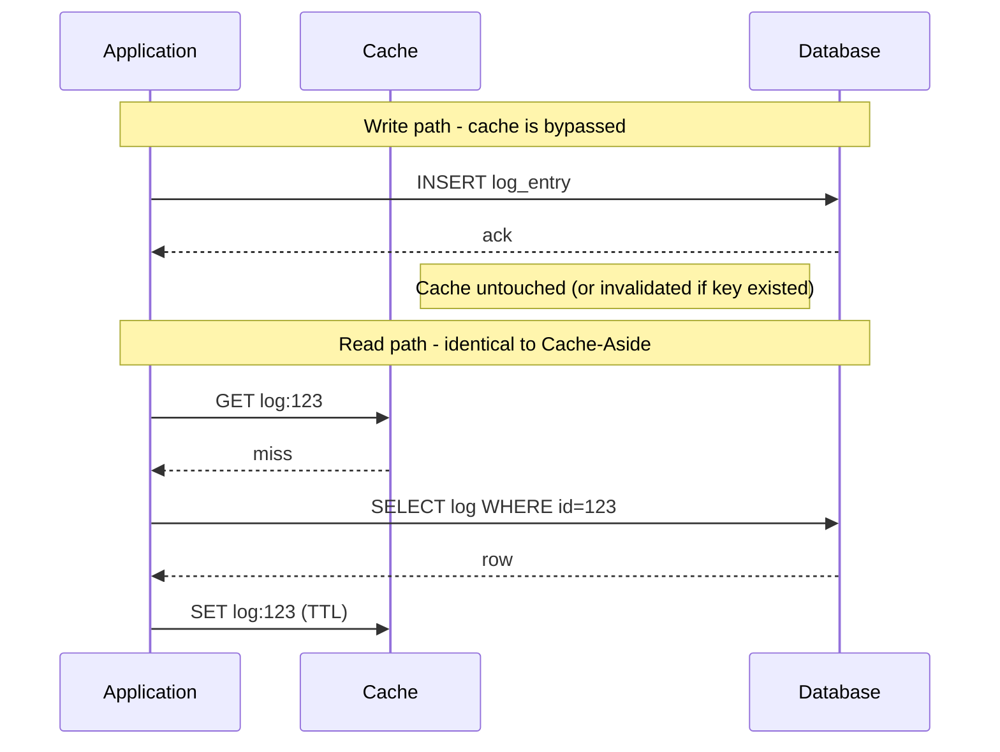

#### Write-Around Cache: Java / Spring Boot Code Example

```java
@Service
public class LogService {

    private final StringRedisTemplate redisTemplate;
    private final LogRepository logRepository;

    public LogService(StringRedisTemplate redisTemplate, LogRepository logRepository) {
        this.redisTemplate = redisTemplate;
        this.logRepository = logRepository;
    }

    public void writeLog(String logId, String logData) {
        // Write-Around: write directly to the database, cache is never touched
        logRepository.save(new LogEntry(logId, logData));
    }

    public String readLog(String logId) {
        String cacheKey = "log:" + logId;

        // Read path is identical to Cache-Aside - cache is populated only on read
        String cached = redisTemplate.opsForValue().get(cacheKey);
        if (cached != null) {
            return cached;
        }

        LogEntry entry = logRepository.findById(logId)
                .orElseThrow(() -> new LogNotFoundException(logId));

        // Short TTL - most logs are read at most once or twice, if ever
        redisTemplate.opsForValue().set(cacheKey, entry.getData(), Duration.ofMinutes(5));
        return entry.getData();
    }
}
```

#### Write-Around Cache: Interview Questions and Answers

**Q1: How does Write-Around differ from Cache-Aside?**
A: Both strategies share the same read path (check cache, on miss load from DB and populate cache), but they differ on writes: Cache-Aside may optionally populate or update the cache on write, whereas Write-Around always bypasses the cache entirely on write, writing only to the database.

**Q2: What problem does Write-Around specifically solve that plain Cache-Aside does not?**
A: Cache pollution from write-heavy, rarely-read data. If a write-heavy workload (e.g., high-volume logging) used a strategy that caches on every write (like Write-Through, or Cache-Aside with optional write-caching), the cache would quickly fill up with entries that are almost never subsequently read, evicting genuinely hot data. Write-Around avoids this by never caching on write.

**Q3: What is the main downside of Write-Around, and why is it usually acceptable?**
A: The first read immediately after a write is always a cache miss, since the cache was never populated on write. This is acceptable specifically because Write-Around is chosen for data where reads are rare or happen much later than the write, so the extra miss has negligible impact on overall system performance.

**Q4: Give a concrete real-world scenario where Write-Around is clearly the right choice.**
A: A high-volume application log/audit trail system writing thousands of entries per second, where only a tiny fraction (e.g., during debugging or a support investigation) are ever read back. Caching every write would waste nearly all cache capacity on entries that are never read, so Write-Around (cache only on the rare read) is far more efficient.

**Q5: Would you use Write-Around for a user's shopping cart, where the user adds an item and immediately views their cart? Why or why not?**
A: No - this is a read-after-write pattern (the user writes, then immediately reads), which is exactly the scenario Write-Around performs poorly on, since it always misses on the first read after a write. Cache-Aside (with optional write-side caching) or Write-Through would be a better fit here.

---

### Caching Strategy Comparison

| Strategy | Read Performance | Write Performance | Consistency | Complexity | Best For |
|----------|-----------------|-------------------|-------------|------------|----------|
| **Cache-Aside** | Good (miss penalty) | Fast | Eventual | Low | General purpose, read-heavy |
| **Write-Through** | Excellent | Slow | Strong | Medium | Read-heavy, need consistency |
| **Write-Behind** | Excellent | Excellent | Eventual | High | Write-heavy, can tolerate loss |
| **Write-Around** | Good (miss after write) | Fast | Eventual | Low | Write-heavy, rare reads |
| **Read-Through** | Good (miss penalty) | N/A | Eventual | Medium | Abstraction, frameworks |
| **Refresh-Ahead** | Excellent | N/A | Eventual | High | Hot data, predictable patterns |

Choosing between these strategies is fundamentally a question of understanding your workload's **read/write ratio**, **consistency requirements**, and **tolerance for data loss**. No single strategy is universally "best" - each one makes a deliberate trade-off, and production systems frequently combine more than one (e.g., Cache-Aside for most entities, Write-Behind for a specific high-throughput counter, Write-Around for an audit log).

#### Caching Strategy Comparison: Characteristics

- **Orthogonal axes of comparison**: Read performance, write performance, consistency, and implementation complexity are largely independent axes - improving one (e.g., write performance via Write-Behind) does not automatically improve or worsen another (e.g., consistency, which gets worse).
- **No universally dominant strategy**: Every strategy that improves on one axis pays for it on another (Write-Through's strong consistency costs write latency; Write-Behind's write speed costs consistency and durability), which is why the "right" choice is workload-dependent, not a fixed rule.
- **Strategies are composable per-entity, not per-application**: A single application commonly uses a different strategy for each type of data it caches, rather than picking one strategy application-wide.

#### Caching Strategy Comparison: Best Practices

- Profile the actual read/write ratio for each entity before choosing a strategy - do not guess; measure with real production or representative traffic.
- Start with Cache-Aside as the default for new caching needs, since it is the lowest-complexity, most broadly applicable strategy, then move to a more specialized strategy only when a specific requirement (strict consistency, extreme write throughput, write-once data) demands it.
- Document, per cached entity, which strategy is used and why - this saves significant time during incident response, when engineers need to reason about why a piece of data might be stale or inconsistent.
- Revisit the choice of strategy as traffic patterns evolve; a strategy that was correct at launch (e.g., Cache-Aside for a lightly used feature) may need to change (e.g., to Refresh-Ahead) once that feature becomes a high-traffic hot path.

#### Caching Strategy Comparison: When to Use (Decision Guide)

- Use **Cache-Aside** as the default choice for general-purpose, read-heavy entities with no unusual consistency or throughput requirements.
- Use **Write-Through** when reads must always reflect the latest write immediately (strong consistency) and the write volume is moderate.
- Use **Write-Behind** when write throughput is the primary bottleneck and some risk of data loss on failure is acceptable.
- Use **Write-Around** when writes vastly outnumber reads and most written data is rarely or never read back.
- Use **Read-Through** when a caching framework's built-in loader support is available and the team wants to keep application code free of cache-management logic.
- Use **Refresh-Ahead** when a small, well-identified set of extremely hot keys must never experience a cache-miss penalty.

#### Caching Strategy Comparison: Diagram

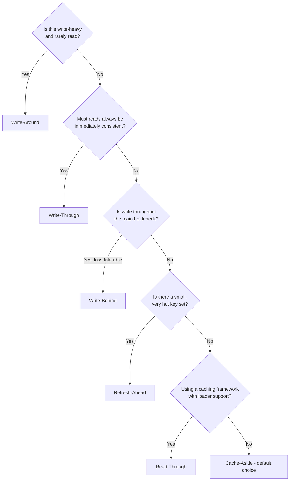

#### Caching Strategy Comparison: Java / Spring Boot Code Example

```java
// A simple strategy-selection illustration - in practice each strategy
// is implemented as shown in its own section above, chosen per entity type.
public enum CachingStrategy {
    CACHE_ASIDE, WRITE_THROUGH, WRITE_BEHIND, WRITE_AROUND, READ_THROUGH, REFRESH_AHEAD
}

@Component
public class CachingStrategySelector {

    public CachingStrategy selectFor(EntityProfile profile) {
        if (profile.getWriteToReadRatio() > 100 && !profile.isReadAfterWriteRequired()) {
            return CachingStrategy.WRITE_AROUND;
        }
        if (profile.requiresStrongConsistency()) {
            return CachingStrategy.WRITE_THROUGH;
        }
        if (profile.isWriteThroughputBottleneck() && profile.canTolerateDataLoss()) {
            return CachingStrategy.WRITE_BEHIND;
        }
        if (profile.isSmallHotKeySet()) {
            return CachingStrategy.REFRESH_AHEAD;
        }
        return CachingStrategy.CACHE_ASIDE; // sensible general-purpose default
    }
}
```

#### Caching Strategy Comparison: Interview Questions and Answers

**Q1: If you had to pick one default caching strategy for a new service with no special requirements, which would you choose and why?**
A: Cache-Aside, because it has the lowest implementation complexity, does not require special framework support, keeps the database as the unambiguous source of truth, and works well for the common case of read-heavy, unpredictable access patterns.

**Q2: A system needs both extremely fast writes and strong consistency. Is there a single strategy that provides both?**
A: No - this is precisely the trade-off these strategies encode. Write-Behind provides extremely fast writes but only eventual consistency; Write-Through provides strong consistency but slower writes. In practice, you must decide which property is more critical for that specific data, or consider architectural changes (e.g., synchronous replication tuning) outside the caching layer itself.

**Q3: Can a single application use more than one caching strategy at the same time?**
A: Yes, and this is common in practice - for example, using Cache-Aside for general entity lookups, Write-Behind for a high-frequency view counter, and Write-Around for an audit log, all within the same application, each chosen based on that specific data's access pattern.

**Q4: How would you decide between Write-Around and Cache-Aside for a given entity?**
A: Look at whether the entity is typically read shortly after being written. If yes (read-after-write is common), Cache-Aside (or Write-Through) is better since Write-Around guarantees a miss on that first read. If writes vastly outnumber reads and reads (if they happen at all) occur long after the write, Write-Around avoids polluting the cache with data that will likely never be read.

**Q5: What is the danger of choosing a caching strategy based on theory alone without measuring actual traffic?**
A: You risk optimizing for the wrong bottleneck - e.g., adopting the complexity of Write-Behind for "write-heavy" data that, in reality, has a modest write rate the database could easily handle, or using Cache-Aside for data that is actually written far more than it's read, quietly polluting the cache. Real traffic measurement (read/write ratios, hit rates) should always validate the theoretical choice.

### Cache Eviction Policies

When cache is full, eviction policies determine which data to remove:

**1. LRU (Least Recently Used)**
- Evicts data not accessed for longest time
- Good for most use cases
- Commonly used default

**2. LFU (Least Frequently Used)**
- Evicts data accessed least often
- Good for long-term popular data
- Requires frequency tracking

**3. FIFO (First In, First Out)**
- Evicts oldest data first
- Simple but not optimal
- Ignores access patterns

**4. TTL (Time To Live)**
- Data expires after fixed time
- Prevents stale data
- Requires setting appropriate TTL values

**5. Random**
- Evicts random entry
- Very simple, unpredictable
- Rarely used in practice

#### Cache Eviction Policies: Characteristics

- **Only matter once the cache is full**: Eviction policies are irrelevant while there is spare capacity; they only activate once a new entry needs to be inserted and the cache is at its configured memory/entry limit.
- **Trade-off between accuracy and overhead**: More "intelligent" policies (LFU) better predict what should be kept, but require more bookkeeping (access counters, frequency decay) than simpler policies (FIFO, Random).
- **Workload-dependent effectiveness**: LRU excels when recent access predicts future access (common); LFU excels when a stable set of items is popular over a long period regardless of recent activity; neither is universally superior.
- **Often combined with TTL**: Most production caches use an eviction policy (for capacity pressure) together with TTL (for correctness/freshness) simultaneously - they solve different problems and are not mutually exclusive.

#### Cache Eviction Policies: Components

- **Access tracker**: Metadata recording when (LRU) or how often (LFU) each entry was accessed, typically implemented via a linked list (LRU) or frequency counters/sketches (LFU, e.g., Redis's approximated LFU using an 8-bit counter with probabilistic increment).
- **Eviction trigger**: The condition that fires eviction - reaching `maxmemory` (Redis), a configured maximum entry count (Caffeine's `maximumSize`), or a maximum byte size.
- **Victim selection algorithm**: The logic that picks which entry (or entries) to remove, based on the chosen policy.
- **Sampling mechanism (for approximated policies)**: Many real-world caches (Redis) do not track exact LRU/LFU order for performance reasons, and instead sample a small random subset of keys and evict the best candidate from that sample - an approximation that trades perfect accuracy for speed.

#### Cache Eviction Policies: Patterns

- **Exact LRU via linked list + hash map**: The classic textbook LRU cache implementation - an `O(1)` get/put using a doubly linked list for order and a hash map for lookup (this is exactly what Java's `LinkedHashMap` with access order, or Caffeine, implements).
- **Approximated LRU/LFU via sampling**: Redis's default eviction (`allkeys-lru`, `allkeys-lfu`) samples a small number of random keys and evicts the least-recently/frequently-used among the sample, avoiding the cost of maintaining a perfectly ordered global structure.
- **Segmented LRU (SLRU)**: Splits the cache into a "probationary" segment (newly added entries) and a "protected" segment (entries accessed more than once), so a single scan of one-time-access data cannot evict genuinely hot data - used by Caffeine's Window-TinyLFU algorithm.
- **TTL-plus-eviction-policy combination**: Apply a TTL for correctness (data must not be served stale beyond a certain age) and a separate eviction policy (LRU/LFU) for capacity management (data must be removed if the cache is full, even before its TTL expires).

#### Cache Eviction Policies: Pros / Benefits

- **LRU**: Simple to reason about, cheap to implement well ( `O(1)` per operation), and matches the common case where recently used data is likely to be used again (temporal locality).
- **LFU**: Better than LRU for data whose popularity is stable over a long period, since it won't evict a very popular item just because it hasn't been touched in the last few seconds.
- **FIFO**: Extremely simple to implement, with minimal per-access bookkeeping overhead (no need to track access recency or frequency at all).
- **TTL**: Directly enforces a maximum staleness bound, which is valuable for correctness independent of any capacity pressure.
- **Random**: Effectively zero bookkeeping overhead, and surprisingly not much worse than other policies for some uniformly-distributed access patterns.

#### Cache Eviction Policies: Cons / Challenges

- **LRU**: Vulnerable to "cache scanning" - a one-time bulk scan through many keys (e.g., a backup job) can evict a large amount of genuinely hot data, since every scanned key becomes "most recently used" even though it will never be accessed again.
- **LFU**: Slow to adapt to changing popularity - an item that was extremely popular last month but is now cold can still resist eviction if its historical frequency count is not decayed over time; also requires more memory/CPU for frequency tracking.
- **FIFO**: Ignores actual usage entirely, so it can evict a very frequently accessed item purely because it happened to be inserted first.
- **TTL**: Does not account for memory pressure at all by itself - a TTL alone does not stop the cache from running out of memory if too much data is inserted before entries expire.
- **Random**: Provides no accuracy guarantees whatsoever and can occasionally evict very hot data purely by chance.

#### Cache Eviction Policies: Best Practices

- Default to LRU (or an LRU/LFU hybrid like Window-TinyLFU, used by Caffeine) unless you have measured evidence that your workload's popularity is stable enough for pure LFU to be worth its extra bookkeeping cost.
- Always combine an eviction policy with a TTL for any data that has a correctness-driven maximum staleness requirement - the two are complementary, not redundant.
- Watch out for "scan pollution" with pure LRU (a large one-off scan evicting hot data) - use a segmented or frequency-aware policy if this is a realistic risk for your access patterns.
- Monitor the eviction rate as a signal: a consistently high eviction rate often indicates the cache is undersized for the current working set, not just that the eviction policy needs tuning.

#### Cache Eviction Policies: When to Use

- **LRU**: The default choice for most general-purpose caches, especially when recent access is a good predictor of future access.
- **LFU**: Long-lived caches with a stable set of consistently popular items (e.g., a fixed catalog of frequently viewed reference data).
- **FIFO**: Extremely simple caches or embedded systems where implementation simplicity outweighs eviction accuracy.
- **TTL**: Any data with a business-driven maximum staleness requirement, used alongside (not instead of) a capacity-based eviction policy.
- **Random**: Rarely the first choice, but can be acceptable for very large caches with uniformly random access patterns where the overhead of tracking recency/frequency isn't worth the marginal accuracy gain.

#### Cache Eviction Policies: Diagram

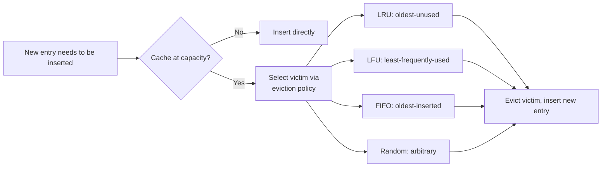

#### Cache Eviction Policies: Real-Life Use Case

A CDN edge cache node has a fixed 50GB of disk/memory capacity for cached video segments but the total catalog is several petabytes. Using an LRU-based eviction policy, the node naturally keeps whichever titles were most recently requested by nearby users and evicts stale/rarely watched titles, so a new episode airing today displaces month-old, rarely-watched content, without any explicit business logic being needed to decide what to remove.

#### Cache Eviction Policies: Java / Spring Boot Code Example

```java
// LRU eviction using Caffeine (maximumSize triggers LRU-like Window-TinyLFU eviction)
@Bean
public Cache<String, Product> lruProductCache() {
    return Caffeine.newBuilder()
            .maximumSize(10_000)   // capacity-based eviction trigger
            .expireAfterAccess(Duration.ofMinutes(30)) // recency-based expiry
            .build();
}

// A minimal hand-rolled LRU cache using LinkedHashMap, for illustration
public class SimpleLruCache<K, V> extends LinkedHashMap<K, V> {
    private final int maxEntries;

    public SimpleLruCache(int maxEntries) {
        super(16, 0.75f, true); // accessOrder = true enables LRU ordering
        this.maxEntries = maxEntries;
    }

    @Override
    protected boolean removeEldestEntry(Map.Entry<K, V> eldest) {
        return size() > maxEntries; // evict the least-recently-used entry
    }
}
```

#### Cache Eviction Policies: Interview Questions and Answers

**Q1: What is the difference between LRU and LFU eviction?**
A: LRU evicts the entry that has gone the longest without being accessed, regardless of how often it was accessed historically. LFU evicts the entry that has been accessed the fewest number of times overall, regardless of how recently. LRU favors recency; LFU favors overall popularity.

**Q2: What is "cache scanning" and which eviction policy is most vulnerable to it?**
A: Cache scanning occurs when a one-time bulk operation (e.g., a backup or batch job) touches a huge number of keys sequentially, marking all of them as "most recently used." Pure LRU is most vulnerable to this, because it can evict genuinely hot, frequently-accessed data purely because the scan touched more recent keys, even though the scanned keys will likely never be accessed again.

**Q3: Why do production caches like Redis use approximated LRU instead of exact LRU?**
A: Maintaining a perfectly ordered global list of every key by access recency requires additional bookkeeping (list pointers, updates on every access) that adds CPU and memory overhead at scale. Redis instead samples a small random subset of keys and evicts the least-recently-used among just that sample, which is far cheaper and, in practice, gives eviction quality close to exact LRU.

**Q4: How does TTL-based expiration differ from an eviction policy like LRU?**
A: TTL is a per-entry, time-based correctness mechanism - an entry disappears after a fixed duration regardless of memory pressure. An eviction policy like LRU is a capacity-management mechanism - it only kicks in when the cache is full and needs to make room for a new entry, based on access patterns rather than elapsed time. Production systems typically use both together.

**Q5: When might Random eviction actually be a reasonable choice?**
A: In very large caches with effectively uniform, unpredictable access patterns, where the overhead of tracking recency (LRU) or frequency (LFU) provides negligible benefit because no subset of keys is meaningfully "hotter" than others. In that scenario, Random achieves nearly the same hit rate as LRU/LFU with substantially less bookkeeping.

### Cache Invalidation Strategies

Keeping cache in sync with database:

**1. Time-Based (TTL)**
```python
# Set TTL of 1 hour
cache.setex("user:1", 3600, "John")
```

**2. Event-Based (Active Invalidation)**
```python
# On update, delete cache
def update_user(user_id, new_name):
    db.update(user_id, new_name)
    cache.delete(f"user:{user_id}")  # Invalidate
```

**3. Cache Versioning**
```python
# Include version in key
cache.set("user:1:v2", "John")  # Version 2
```

**4. Publisher-Subscriber**
```python
# Use Redis pub/sub to invalidate across servers
def update_user(user_id, new_name):
    db.update(user_id, new_name)
    redis.publish("invalidate", f"user:{user_id}")

# Subscribers delete from their local cache
```

#### Cache Invalidation Strategies: Characteristics

- **Correctness mechanism, not a performance mechanism**: Unlike eviction policies (which exist to manage capacity), invalidation strategies exist purely to prevent the cache from serving data that is known to be outdated.
- **Varying propagation speed**: TTL-based invalidation is "eventually correct" (bounded by the TTL duration), while event-based invalidation aims to be immediate, and pub/sub invalidation aims to be immediate across an entire fleet of servers, not just one.
- **Different granularity**: Some strategies invalidate a single key (event-based delete), while others invalidate implicitly by making old keys permanently unreachable (cache versioning, since old-version keys are simply never looked up again and eventually expire or get evicted).
- **Reliability varies by mechanism**: A TTL will always eventually expire data no matter what else fails; an event-based delete call can itself fail or be skipped by a bug, which is why TTL is usually kept as a backstop even when active invalidation is used.

#### Cache Invalidation Strategies: Components

- **TTL configuration**: Per-key or per-namespace expiry duration set at write time.
- **Invalidation hook**: Code on the write path that explicitly deletes or updates the relevant cache entr(y/ies) after a database write succeeds.
- **Version/namespace key component**: An extra segment embedded in the cache key (e.g., `user:1:v2`) that changes whenever the underlying schema or computation logic changes, effectively invalidating all old-version entries at once without needing to enumerate and delete them.
- **Pub/Sub channel**: A message bus (Redis Pub/Sub, Kafka topic) used to broadcast invalidation events to every application instance's local cache, needed specifically when there are multiple independent local caches (not needed for a single shared distributed cache, which only has one copy of the data to invalidate).

#### Cache Invalidation Strategies: Patterns

- **TTL as a safety net**: Always set a TTL even when using active invalidation, so any missed or failed invalidation call is bounded in its impact rather than causing indefinite staleness.
- **Delete-on-write, not update-on-write**: Prefer deleting the cache entry over updating it in place on a write, avoiding a class of race conditions where two concurrent writes could update the cache out of order.
- **Cache versioning for schema/logic changes**: When the shape or computation of cached data changes (e.g., adding a new field, changing a formula), bump a version number embedded in the key rather than trying to migrate or invalidate every existing entry individually.
- **Fan-out invalidation via pub/sub**: In multi-instance deployments using local (per-instance) caches, broadcast invalidation events over pub/sub so every instance's local cache removes the affected key, not just the instance that performed the write.

#### Cache Invalidation Strategies: Pros / Benefits

- **Time-Based (TTL)**: Trivial to implement, guarantees a maximum staleness bound with zero additional invalidation logic, and degrades gracefully even if other invalidation mechanisms fail.
- **Event-Based**: Provides near-immediate consistency after a write, since the stale entry is removed as soon as the write completes, rather than waiting for a TTL to elapse.
- **Cache Versioning**: Enables safe, zero-downtime changes to the shape or computation of cached values, since old and new versions can coexist without collisions, and old versions simply age out.
- **Publisher-Subscriber**: The only reliable way to keep multiple independent local (in-process) caches consistent with each other, since a single-instance delete call cannot reach caches on other servers by itself.

#### Cache Invalidation Strategies: Cons / Challenges

- **Time-Based (TTL)**: Data can be stale for up to the full TTL duration after being written, which may be unacceptable for some use cases; choosing the right TTL is itself a balancing act between freshness and cache efficiency.
- **Event-Based**: Requires developers to remember to add an invalidation call on every write path for every affected key - easy to miss, especially as the codebase grows and cached derived data spans multiple entities.
- **Cache Versioning**: Old-version entries remain in the cache consuming memory until they are evicted or expire, and every reader needs to know the current version to construct the correct key.
- **Publisher-Subscriber**: Adds an additional messaging infrastructure dependency, and message delivery is not always guaranteed (depending on the pub/sub system), so a missed message can leave a local cache stale until its TTL expires.

#### Cache Invalidation Strategies: Best Practices

- Never rely on event-based invalidation alone - always pair it with a TTL as a backstop against missed or failed invalidation calls.
- Prefer deleting over updating cache entries on write, to sidestep race conditions between concurrent writers.
- Use cache versioning whenever you change what a cached value represents (not just its underlying data), to avoid serving old-shape data to code expecting the new shape.
- For any architecture with multiple independent local caches, invest in a reliable pub/sub (or equivalent) invalidation broadcast mechanism early - retrofitting it later, once many services depend on locally-cached data, is significantly more disruptive.

#### Cache Invalidation Strategies: When to Use

- **Time-Based (TTL)**: Always - use it as a baseline safety net for every cached entry, regardless of whether other invalidation mechanisms are also in place.
- **Event-Based**: Whenever near-immediate consistency after a write matters more than the added implementation complexity of remembering to invalidate on every write path.
- **Cache Versioning**: When the structure or computation of cached data changes, especially during rolling deployments where old and new application versions may run simultaneously.
- **Publisher-Subscriber**: Multi-instance architectures using independent local (in-process) caches rather than a single shared distributed cache.

#### Cache Invalidation Strategies: Diagram

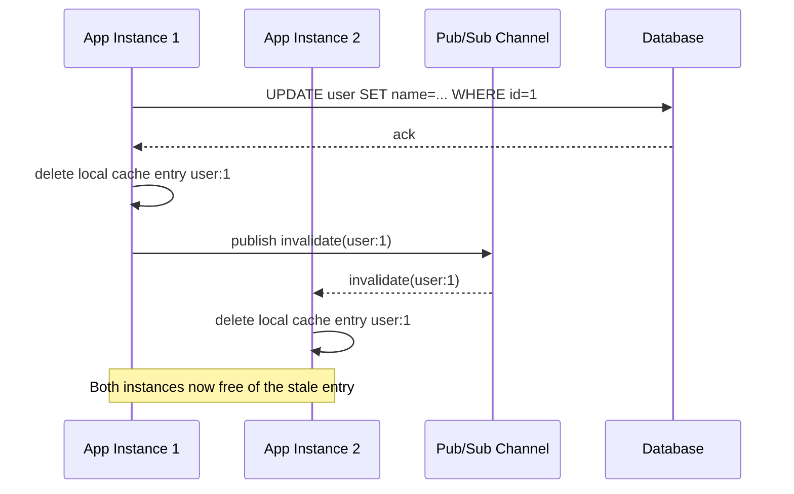

#### Cache Invalidation Strategies: Java / Spring Boot Code Example

```java
@Service
public class UserInvalidationService {

    private final UserRepository userRepository;
    private final RedisTemplate<String, Object> redisTemplate;
    private static final String INVALIDATION_CHANNEL = "cache-invalidate";

    public UserInvalidationService(UserRepository userRepository,
                                    RedisTemplate<String, Object> redisTemplate) {
        this.userRepository = userRepository;
        this.redisTemplate = redisTemplate;
    }

    @Transactional
    public void updateUser(Long userId, String newName) {
        User user = userRepository.findById(userId)
                .orElseThrow(() -> new UserNotFoundException(userId));
        user.setName(newName);
        userRepository.save(user);

        String cacheKey = "user:" + userId;

        // Event-based invalidation for the shared distributed cache
        redisTemplate.delete(cacheKey);

        // Fan out to any independent local (in-process) caches on other instances
        redisTemplate.convertAndSend(INVALIDATION_CHANNEL, cacheKey);
    }
}

@Component
public class LocalCacheInvalidationListener implements MessageListener {

    private final CacheManager localCacheManager;

    public LocalCacheInvalidationListener(CacheManager localCacheManager) {
        this.localCacheManager = localCacheManager;
    }

    @Override
    public void onMessage(Message message, byte[] pattern) {
        String cacheKey = new String(message.getBody());
        Objects.requireNonNull(localCacheManager.getCache("users")).evict(cacheKey);
    }
}
```

#### Cache Invalidation Strategies: Interview Questions and Answers

**Q1: Why is TTL-based expiration recommended even when active (event-based) invalidation is already implemented?**
A: Event-based invalidation depends on application code correctly calling the invalidation logic on every relevant write path, which can be missed due to bugs, new code paths added later, or partial failures. A TTL acts as an upper bound on staleness regardless of whether the active invalidation succeeded, providing a safety net.

**Q2: Why is Pub/Sub-based invalidation needed in some architectures but not others?**
A: It's needed when each application instance maintains its own independent local (in-process) cache - deleting the entry on the instance that performed the write does nothing for the other instances' local caches, so a broadcast mechanism (pub/sub) is required to reach them all. With a single shared distributed cache (e.g., one Redis cluster used by all instances), a single delete call already updates the one copy of the data every instance reads from, so pub/sub fan-out is unnecessary.

**Q3: What problem does cache versioning solve that a simple delete-and-reload cannot?**
A: Cache versioning solves the problem of changing what data means or how it's shaped (e.g., adding a field, changing a calculation), especially during a rolling deployment where old and new code may be running simultaneously and would otherwise disagree on what a cached value should look like. Bumping the version embedded in the key lets both old and new code read/write their own compatible version without conflicting.

**Q4: What is the risk of deleting a cache entry versus updating it in place on a write?**
A: Updating in place risks a race condition: if two writes happen close together, a slower write's result could overwrite a faster write's more recent result in the cache, even if the database ends up with the correct final value, temporarily showing wrong data. Deleting avoids this because the next read simply reloads the current (correct) value from the database.

**Q5: A user updates their profile, but a few seconds later, a different browser tab shows old data. What are two possible causes and how would you diagnose them?**
A: Possible causes: (1) TTL-based caching without active invalidation, where the old tab's request hit a cache entry that hasn't expired yet, or (2) a multi-instance deployment with independent local caches where the invalidation event failed to propagate (e.g., missed pub/sub message) to the instance serving the second tab. Diagnosis: check whether the entity uses event-based invalidation at all, check pub/sub delivery logs/metrics for missed messages, and compare the cache's remaining TTL against how long ago the update occurred.

### Best Practices

1. **Set Appropriate TTLs**
   - Short TTL for frequently changing data (minutes)
   - Long TTL for static data (hours/days)
   - No TTL for permanent data

2. **Monitor Cache Performance**
   - Track hit rate (hits / total requests)
   - Target: 80%+ hit rate
   - Monitor latency (p50, p95, p99)

3. **Handle Cache Failures**
   - Always have database fallback
   - Use circuit breakers
   - Degrade gracefully

4. **Avoid Thundering Herd**
   - When cache expires, many requests hit DB
   - Solution: Refresh before expiry, use locks

5. **Cache Compression**
   - Compress large objects to save memory
   - Trade CPU for memory

6. **Security**
   - Don't cache sensitive data (passwords, credit cards)
   - Encrypt cached data if needed
   - Use authentication for cache access

#### Best Practices: Detailed Explanation of Each Point

1. **Set Appropriate TTLs** - The right TTL depends entirely on how often the underlying data changes and how costly staleness is: a stock ticker might need a TTL of seconds, a user's display name might tolerate minutes to hours, and a country's list of currencies might never need to expire at all. Setting TTLs too short defeats the purpose of caching (constant re-fetching); setting them too long risks serving noticeably stale data. A common practical approach is to start conservative (shorter TTL) and lengthen it once monitoring confirms the hit rate and staleness tolerance both allow it.

2. **Monitor Cache Performance** - Hit rate (cache hits divided by total requests) is the single most important cache health metric: a healthy cache for a read-heavy workload typically sees 80%+ hit rates, and a sudden drop usually signals either a cold cache (recent restart/flush), a TTL that's too short, or a change in access patterns (e.g., a new feature generating unpredictable keys). Latency percentiles matter more than averages because a cache that is fast on average but has a long tail of slow requests (p99) can still cause a poor user experience for a meaningful fraction of users.

3. **Handle Cache Failures** - A cache should never be a single point of total failure for the application; if the cache is unreachable, the application should fall back to querying the database directly (possibly at reduced capacity) rather than returning errors to users. Circuit breakers (e.g., Resilience4j) prevent an already-struggling cache from being hammered with retries that make its recovery harder, and they let the application detect quickly when to stop trying the cache and rely on the fallback path instead.

4. **Avoid Thundering Herd** - When a very popular cache key expires, many concurrent requests can miss simultaneously and all hit the database at the same instant, potentially causing a load spike large enough to degrade or crash the database. Mitigations include a short-lived distributed lock (only one request repopulates the cache while others wait briefly or serve a slightly stale value), and probabilistic early expiration (each read has a small, increasing chance of proactively refreshing the value slightly before the TTL actually expires, spreading refreshes out over time instead of all at once).

5. **Cache Compression** - Large cached objects (big JSON blobs, serialized collections) consume proportionally more of the limited and expensive cache memory; compressing them (e.g., gzip, Snappy, LZ4) before storing and decompressing on read trades a small amount of CPU time for a often much larger reduction in memory footprint, which can meaningfully increase how much useful data fits in a fixed-size cache.

6. **Security** - Caches are frequently overlooked from a security review perspective, but they store real application data, sometimes including sensitive fields, in a system that may have different access controls, encryption-at-rest, and audit logging than the primary database. Sensitive data (passwords, full payment card numbers, government IDs) should never be cached in plaintext (and ideally not at all); where sensitive data must be cached, encrypt it and ensure the cache itself requires authentication (Redis `requirepass`/ACLs, network isolation via VPC/security groups) so it cannot be trivially read by anyone with network access.

#### Best Practices: When to Use / Apply

- Apply TTL tuning and hit-rate monitoring to every cached entity from day one - these are cheap to set up and provide the earliest warning signs of a misbehaving cache.
- Apply circuit breakers and fallback-to-database logic specifically for any cache that sits in a critical request path, where an outage of the cache itself must not become an outage of the entire feature.
- Apply thundering-herd protection specifically to high-traffic, high-value keys (homepage data, trending content, popular product pages) where a coordinated mass cache-miss would meaningfully impact the database.
- Apply compression when cached objects are large (multi-KB JSON blobs) and cache memory is a binding constraint; skip it for small objects where compression overhead outweighs the memory savings.
- Apply cache encryption and access controls whenever any sensitive or regulated data (even indirectly, e.g., a cached response that includes a partial account number) might end up in the cache.

#### Best Practices: Diagram

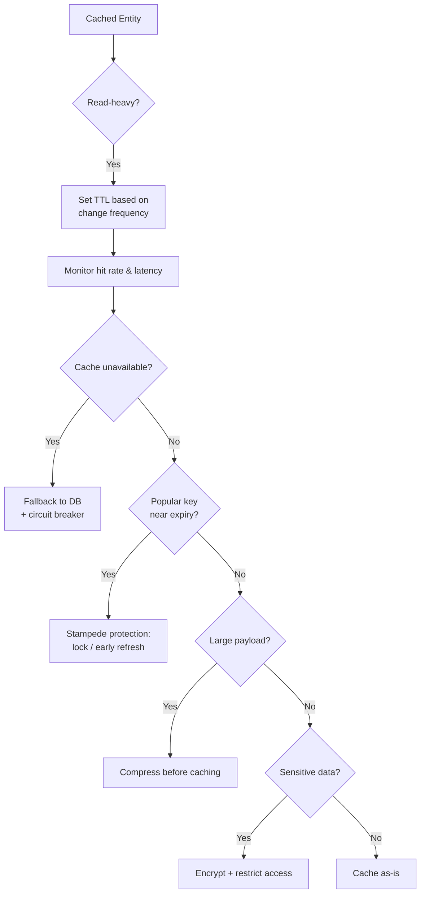

#### Best Practices: Java / Spring Boot Code Example

```java
@Configuration
public class ResilientCacheConfig {

    // Circuit breaker around cache access - fall back to DB if cache is unhealthy
    @Bean
    public CircuitBreaker cacheCircuitBreaker() {
        CircuitBreakerConfig config = CircuitBreakerConfig.custom()
                .failureRateThreshold(50)
                .waitDurationInOpenState(Duration.ofSeconds(10))
                .slidingWindowSize(20)
                .build();
        return CircuitBreaker.of("cacheCircuitBreaker", config);
    }
}

@Service
public class ResilientProductService {

    private final StringRedisTemplate redisTemplate;
    private final ProductRepository productRepository;
    private final CircuitBreaker circuitBreaker;

    public ResilientProductService(StringRedisTemplate redisTemplate,
                                    ProductRepository productRepository,
                                    CircuitBreaker circuitBreaker) {
        this.redisTemplate = redisTemplate;
        this.productRepository = productRepository;
        this.circuitBreaker = circuitBreaker;
    }

    public String getProductName(Long productId) {
        String cacheKey = "product:" + productId;

        Supplier<String> cacheRead = () -> redisTemplate.opsForValue().get(cacheKey);
        Supplier<String> decoratedCacheRead = CircuitBreaker.decorateSupplier(circuitBreaker, cacheRead);

        try {
            String cached = decoratedCacheRead.get();
            if (cached != null) {
                return cached;
            }
        } catch (Exception cacheUnavailable) {
            // Cache circuit is open or the call failed - degrade gracefully to the database
            System.out.println("Cache unavailable, falling back to DB for product " + productId);
        }

        Product product = productRepository.findById(productId)
                .orElseThrow(() -> new ProductNotFoundException(productId));

        try {
            redisTemplate.opsForValue().set(cacheKey, product.getName(), Duration.ofHours(1));
        } catch (Exception ignored) {
            // Best-effort cache write - don't fail the request if only the cache write fails
        }

        return product.getName();
    }
}
```

#### Best Practices: Interview Questions and Answers

**Q1: What is a reasonable target cache hit rate, and what does a sudden drop usually indicate?**
A: 80%+ is a commonly cited healthy target for read-heavy workloads, though the "right" number depends on the specific access pattern. A sudden drop usually indicates a cold cache (recent restart, flush, or deployment), a TTL that's too short relative to access frequency, or a shift in traffic patterns (e.g., a new feature generating many unique, rarely-repeated keys).

**Q2: Why should an application never treat the cache as a hard dependency?**
A: Because a cache is, by design, a disposable optimization layer - the database remains the source of truth. If the application throws errors whenever the cache is unavailable, it has effectively turned a performance optimization into a new single point of failure. A resilient design falls back to querying the database directly (ideally protected by a circuit breaker) whenever the cache cannot be reached.

**Q3: Explain two different techniques to prevent thundering herd / cache stampede.**
A: (1) Distributed locking - when a key expires, only one request acquires a short-lived lock and repopulates the cache, while other concurrent requests wait briefly or serve a slightly stale value instead of all querying the database simultaneously. (2) Probabilistic early expiration - each read has a small, TTL-proportional chance of proactively refreshing the value slightly before actual expiry, spreading refresh load out over time instead of concentrating it at the exact expiry moment.

**Q4: Why is caching sensitive data like raw credit card numbers generally discouraged?**
A: Caches often have different (frequently weaker) access controls, encryption-at-rest, and audit logging than the primary database, and are sometimes accessible from a broader set of application servers. Storing sensitive data there in plaintext expands the attack surface; if it must be cached at all, it should be encrypted, and the cache itself should require authentication and be network-isolated.

**Q5: When is compressing cached values worth the added CPU cost?**
A: When cached objects are large enough (typically multi-kilobyte JSON, HTML fragments, or serialized collections) that the memory savings from compression meaningfully increase how much data fits in the cache, and when the cache server's CPU has headroom to spare. For small objects (a few dozen bytes), compression overhead and metadata often outweigh any real memory benefit.

### Complete Example: E-commerce Product Cache

```python
import redis
import psycopg2
import json
import hashlib
from datetime import datetime, timedelta

class ProductCache:
    def __init__(self):
        self.cache = redis.Redis(host='localhost', port=6379, decode_responses=True)
        self.db = psycopg2.connect("dbname=ecommerce user=postgres")
    
    def get_product(self, product_id):
        """Cache-Aside pattern for product retrieval"""
        cache_key = f"product:{product_id}"
        
        # Try cache first
        cached_data = self.cache.get(cache_key)
        if cached_data:
            print(f"✓ Cache HIT: product {product_id}")
            return json.loads(cached_data)
        
        # Cache miss - fetch from database
        print(f"✗ Cache MISS: product {product_id}")
        cursor = self.db.cursor()
        cursor.execute("""
            SELECT id, name, price, stock, description 
            FROM products 
            WHERE id = %s
        """, (product_id,))
        
        result = cursor.fetchone()
        if not result:
            return None
        
        product = {
            'id': result[0],
            'name': result[1],
            'price': float(result[2]),
            'stock': result[3],
            'description': result[4]
        }
        
        # Cache for 1 hour
        self.cache.setex(cache_key, 3600, json.dumps(product))
        
        return product
    
    def update_product_price(self, product_id, new_price):
        """Write-Through pattern for price update"""
        cache_key = f"product:{product_id}"
        
        # Update database
        cursor = self.db.cursor()
        cursor.execute(
            "UPDATE products SET price = %s WHERE id = %s",
            (new_price, product_id)
        )
        self.db.commit()
        
        # Invalidate cache (next read will refresh)
        self.cache.delete(cache_key)
        
        print(f"Updated product {product_id} price to ${new_price}")
    
    def get_popular_products(self, category, limit=10):
        """Cache popular products with shorter TTL"""
        cache_key = f"popular:{category}:{limit}"
        
        cached_data = self.cache.get(cache_key)
        if cached_data:
            print(f"✓ Cache HIT: popular products in {category}")
            return json.loads(cached_data)
        
        print(f"✗ Cache MISS: popular products in {category}")
        cursor = self.db.cursor()
        cursor.execute("""
            SELECT id, name, price 
            FROM products 
            WHERE category = %s 
            ORDER BY sales_count DESC 
            LIMIT %s
        """, (category, limit))
        
        products = [
            {'id': row[0], 'name': row[1], 'price': float(row[2])}
            for row in cursor.fetchall()
        ]
        
        # Cache for only 5 minutes (popular products change frequently)
        self.cache.setex(cache_key, 300, json.dumps(products))
        
        return products
    
    def record_view(self, product_id):
        """Write-Behind pattern for analytics (async)"""
        # Increment view count in cache immediately
        cache_key = f"views:{product_id}"
        new_count = self.cache.incr(cache_key)
        
        # Batch update to DB every 100 views
        if new_count % 100 == 0:
            cursor = self.db.cursor()
            cursor.execute(
                "UPDATE products SET view_count = view_count + 100 WHERE id = %s",
                (product_id,)
            )
            self.db.commit()
            print(f"Flushed 100 views for product {product_id} to database")
    
    def get_cache_stats(self):
        """Monitor cache performance"""
        info = self.cache.info('stats')
        hits = int(info.get('keyspace_hits', 0))
        misses = int(info.get('keyspace_misses', 0))
        total = hits + misses
        
        if total > 0:
            hit_rate = (hits / total) * 100
            print(f"Cache Hit Rate: {hit_rate:.2f}% ({hits} hits, {misses} misses)")
        else:
            print("No cache statistics available yet")

# Usage Example
product_cache = ProductCache()

# First access - cache miss
product = product_cache.get_product(123)
print(product)

# Second access - cache hit
product = product_cache.get_product(123)

# Update price - invalidates cache
product_cache.update_product_price(123, 29.99)

# Next access - cache miss (refreshed)
product = product_cache.get_product(123)

# Popular products
popular = product_cache.get_popular_products("electronics", 5)

# Track views (write-behind)
for i in range(150):
    product_cache.record_view(123)  # Flushes to DB at 100 and 200

# Check performance
product_cache.get_cache_stats()
```

### Summary

**Distributed Cache** solves the problem of sharing cached data across multiple application instances, ensuring consistency and scalability.

**Caching Strategies:**
- **Cache-Aside**: Application controls caching, best for general use
- **Write-Through**: Strong consistency, good for reads
- **Write-Behind**: High performance writes, eventual consistency
- **Write-Around**: Bypass cache on writes, prevents pollution, good for rare reads
- **Read-Through**: Abstraction, cache handles DB
- **Refresh-Ahead**: Proactive refresh, best for hot data

**Choose based on:**
- Read vs write ratio
- Consistency requirements
- Performance needs
- Complexity tolerance

### Distributed Cache and Caching Strategies: Characteristics, Pros, Cons, Use Cases, Components, Patterns, Benefits, Challenges, Best Practices and When to Use

This section summarizes distributed caching and its strategies as a single topic (as opposed to the individual patterns detailed above: what caching is, distributed cache architecture, and each of the six caching strategies), with a detailed explanation for every point.

#### Characteristics

- **A shared, fast-access layer sitting between the application and its slower data sources**: Whether implemented as a single distributed cluster (Redis, Memcached) or an in-process cache, its defining trait is offering microsecond-to-low-millisecond access in exchange for finite capacity and eventual (or, with Write-Through, strong) consistency with the source of truth.
- **A family of strategies rather than one algorithm**: "Distributed caching" is really an umbrella over six distinct read/write patterns (Cache-Aside, Write-Through, Write-Behind, Read-Through, Refresh-Ahead, Write-Around), each optimizing a different combination of read speed, write speed, consistency, and complexity.
- **Consistency is a spectrum, not a binary**: From the strong, synchronous guarantees of Write-Through, through the eventual consistency of Cache-Aside and Write-Around, to the deliberately-relaxed, asynchronous consistency of Write-Behind, every strategy occupies a specific, well-defined point on that spectrum.
- **Capacity management (eviction) and correctness (invalidation) are separate concerns**: Eviction policies (LRU, LFU, FIFO, TTL, Random) decide what to remove under memory pressure; invalidation strategies (TTL, event-based, versioning, pub/sub) decide when data becomes incorrect and must be removed or refreshed - production systems need both, addressing different failure modes.
- **Composable per entity, not application-wide**: Real systems typically apply different strategies to different pieces of data within the same application, based on each entity's specific read/write ratio and consistency needs, rather than picking one strategy globally.

#### Pros / Benefits

- **Dramatically reduces read latency and backend load**: Cache hits are typically 10-100x faster than the underlying database or API call they replace, and every hit is one request the source of truth never has to serve, freeing its capacity for the requests that truly need it.
- **Enables horizontal scalability of the application tier**: A shared distributed cache lets any number of stateless application instances serve the same hot data consistently, without each instance needing its own copy or the database becoming the bottleneck as instance count grows.
- **Flexible enough to match nearly any read/write profile**: Because six distinct strategies exist, teams can pick (or combine) the specific pattern that matches a given entity's actual access pattern, from write-once-read-rarely logs (Write-Around) to extremely hot, must-never-miss data (Refresh-Ahead).
- **Improves resilience to traffic spikes**: A well-warmed, appropriately-sized cache absorbs sudden surges in read traffic that would otherwise overwhelm the database, and techniques like stampede protection and refresh-ahead further smooth out load even at the boundary of cache expiry.
- **Proven at massive scale across the industry**: Redis, Memcached, and their managed equivalents (ElastiCache) underpin caching layers at nearly every major internet-scale system, providing a deep well of operational knowledge, tooling, and battle-tested client libraries.

#### Cons / Challenges

- **Cache invalidation is a genuinely hard problem**: Deciding exactly when and which cached entries to remove or refresh, across potentially many services and cache layers, is famously difficult to get perfectly right, and getting it wrong means either serving stale data or destroying the cache's hit rate through over-invalidation.
- **Adds operational and architectural complexity**: A distributed cache is another stateful system to provision, monitor, secure, and fail over, with its own failure modes (network partitions, memory pressure, eviction storms) that the team must plan for.
- **Every strategy makes a real trade-off, none is free**: Strong consistency (Write-Through) costs write latency; extreme write speed (Write-Behind) costs durability and consistency; avoiding cache pollution (Write-Around) costs a guaranteed miss on read-after-write - there is no strategy that improves every axis simultaneously.
- **Cold start and cache-miss penalties are unavoidable for lazy strategies**: Cache-Aside, Read-Through, and Write-Around all pay a first-access (or first-access-after-write) penalty, which is a genuine, if usually acceptable, cost of their memory efficiency.
- **Introduces new security surface area**: A cache stores real application data, sometimes derived from sensitive sources, in a system whose access controls, encryption, and audit logging must be deliberately configured, since it is easy to overlook the cache during a security review that is focused on the primary database.

#### Use Cases

- **Session and authentication state**: Storing user sessions or auth tokens in a shared distributed cache (often via Write-Through) so any application instance can validate a session immediately and consistently.
- **Product catalogs and e-commerce data**: Caching product details, prices, and inventory counts (typically via Cache-Aside) to serve the overwhelming majority of read traffic without hitting the database on every page view.
- **Real-time leaderboards and counters**: Gaming leaderboards, view counters, and like counts, where Write-Behind's near-instant write latency and write coalescing dramatically outperform writing directly to a database on every update.
- **Trending/homepage content and hot reference data**: Refresh-Ahead keeps a small set of extremely popular keys (trending articles, homepage widgets, stock tickers) perpetually warm, avoiding any cache-miss penalty for the most-viewed data in the system.
- **Logging, audit trails, and bulk-imported data**: Write-Around prevents high-volume, rarely-read writes (application logs, audit events, bulk data imports) from polluting the cache with entries that will likely never be read back.
- **CDN edge caching and DNS resolution caching**: Distributed, geographically-local caches that serve static or semi-static content close to end users, dramatically reducing latency and origin server load.

#### Components

- **Cache store/cluster**: The actual fast-storage system, whether a single in-process map, a standalone Redis/Memcached instance, or a multi-node, sharded, and replicated cluster.
- **Cache client/SDK**: The library the application uses to talk to the cache (Jedis, Lettuce, Spymemcached, or a framework abstraction like Spring Cache), including cluster-aware routing where applicable.
- **Cache key and value design**: The namespacing, key structure (e.g., `entity:id`, `entity:id:version`), and serialization format (JSON, Protobuf) used to store and retrieve entries unambiguously.
- **TTL and eviction configuration**: Per-key or per-namespace expiry values, plus the cluster/instance-level eviction policy (LRU, LFU, etc.) that governs behavior under memory pressure.
- **Invalidation mechanism**: The event-based delete hooks, versioning scheme, and/or pub/sub broadcast infrastructure that keeps the cache from serving data known to be stale.
- **Monitoring and alerting**: Hit rate, latency percentiles, eviction rate, and replication lag metrics, plus circuit breakers and fallback logic for graceful degradation when the cache is unhealthy.

#### Patterns

- **Cache-Aside as the general-purpose default**: The lowest-complexity, most broadly applicable pattern, used unless a specific requirement pushes toward one of the more specialized strategies.
- **Write-Through/Read-Through pairing for framework-managed caches**: Using a caching framework's symmetric loader/writer support to make the cache the single, transparent interface for both reads and writes.
- **Write-Behind with coalescing for extreme write throughput**: Batching and collapsing rapid writes to the same key into fewer, larger database writes, trading a bounded risk window for order-of-magnitude write throughput gains.
- **Write-Around for skewed write-heavy, read-rare workloads**: Keeping the cache free of low-value entries by bypassing it entirely on write, populating it only via the (rare) read path.
- **Refresh-Ahead for a small, well-identified hot set**: Proactively refreshing the handful of keys where a cache miss would be unacceptable, layered on top of whichever base strategy handles the rest of the keyspace.
- **Layered L1 (local) + L2 (distributed) caching**: Combining a small, ultra-fast in-process cache in front of a shared distributed cluster, to absorb the hottest keys locally while still benefiting from cross-instance consistency for everything else.
- **TTL as a universal safety net**: Applying a TTL underneath every other invalidation or refresh mechanism, so any bug or missed invalidation call is bounded in its impact rather than causing indefinite staleness.

#### Best Practices

- Measure actual read/write ratios and access patterns before choosing a strategy per entity; do not guess or apply one strategy application-wide by default.
- Start with Cache-Aside for new caching needs and graduate to a more specialized strategy (Write-Through, Write-Behind, Write-Around, Refresh-Ahead) only when a specific, measured requirement demands it.
- Always pair whichever invalidation approach you use with a TTL as a backstop, and prefer deleting stale cache entries over updating them in place to avoid write-ordering race conditions.
- Protect popular keys from cache stampede (via locking or probabilistic early refresh) and monitor hit rate, latency percentiles, and eviction rate as first-class operational metrics.
- Design for cache failure from day one: always have a database fallback path, and use circuit breakers so a struggling cache degrades gracefully instead of taking down the whole feature.
- Never cache sensitive data in plaintext; encrypt it if it must be cached, and secure the cache itself with authentication and network isolation.
- Choose the cache architecture (single-node, centralized, distributed cluster) that matches current scale, and evolve it as traffic and instance count grow rather than over-engineering for scale you don't yet have.

#### When to Use

- Use a distributed cache whenever the same data is read far more often than it changes, and more than one application instance needs consistent access to that data.
- Use **Cache-Aside** as the default for general-purpose, unpredictable-access-pattern entities.
- Use **Write-Through** when reads must always immediately reflect the latest write (strong consistency) and write volume is moderate.
- Use **Write-Behind** when write throughput is the primary bottleneck and a small, bounded risk of data loss on failure is acceptable (never for financial or critical data).
- Use **Write-Around** when writes vastly outnumber reads and most written data is rarely or never subsequently read.
- Use **Read-Through** when a caching framework's built-in loader support is available and the team wants the database fully abstracted from application code.
- Use **Refresh-Ahead** when a small, well-identified set of extremely hot keys must never experience a cache-miss penalty.
- Avoid caching entirely (or cache very conservatively) for data that changes on every request, must always be perfectly fresh at the instant of read (e.g., a balance check immediately before executing a trade), or is accessed so rarely that a cache would almost never be hit.
