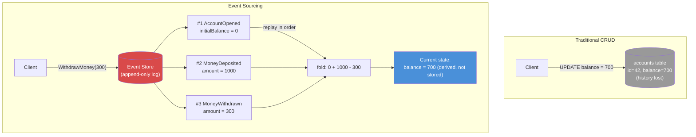
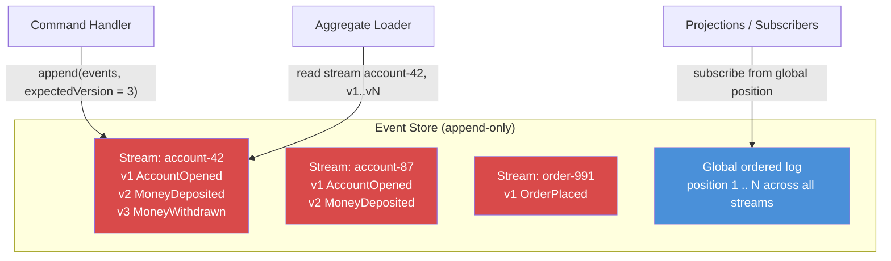
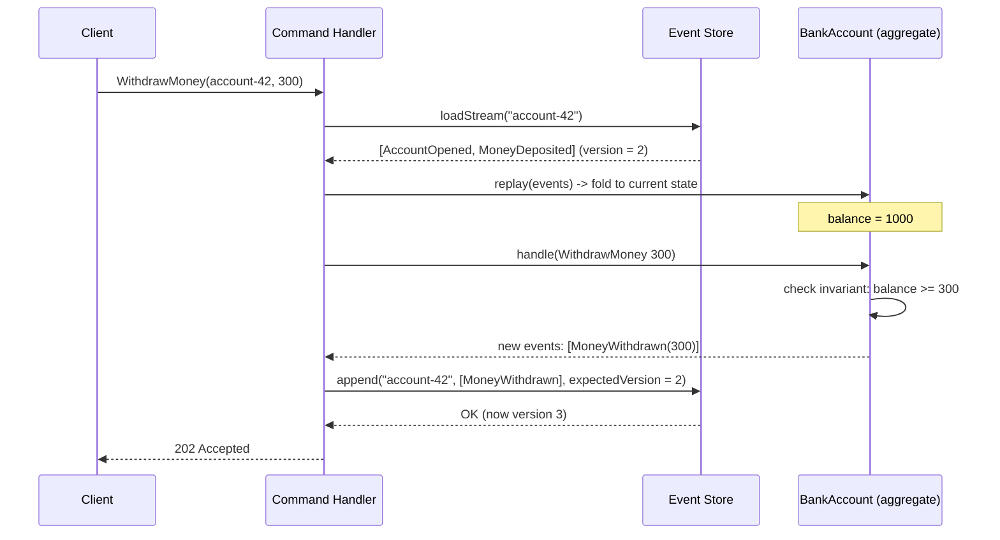
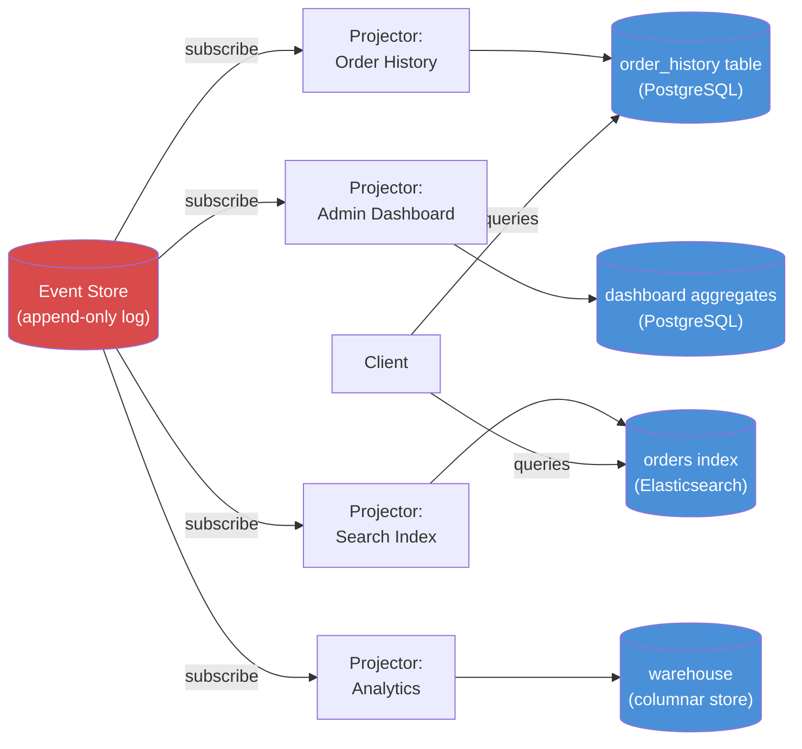
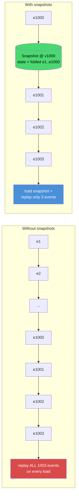
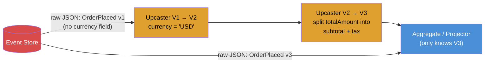
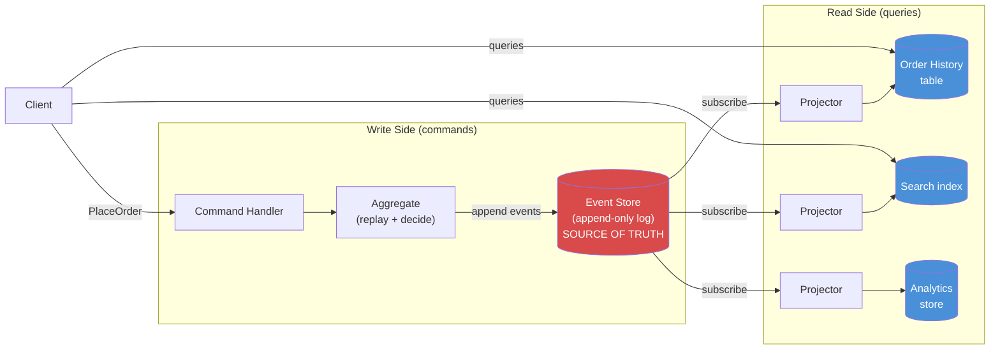
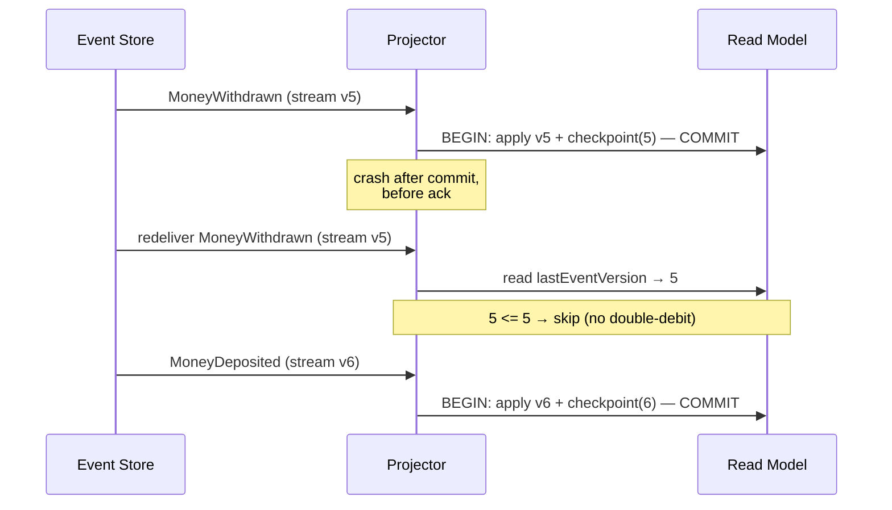
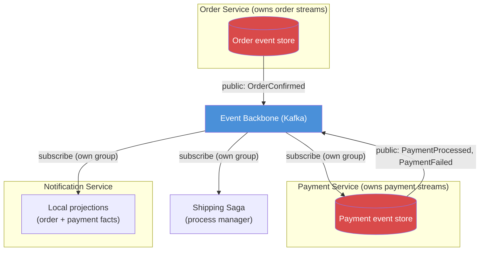

# Event Sourcing

## Blogs and websites


## Medium

- [Event Driven Design: The Dual Write Problem](https://medium.com/@the_nick_morgan/event-driven-design-the-dual-write-problem-07bbef584376)
- [Why is Event Sourcing so useful in Domain Driven Design?](https://levelup.gitconnected.com/why-is-event-sourcing-so-useful-in-domain-driven-design-e961dd090228)

## Youtube

- [System Design - Event Sourcing](https://www.youtube.com/watch?v=JTmgi0vO5Ug)

## Theory

Event Sourcing is an architectural pattern in which the current state of a business entity is **never stored directly**. Instead, every change to that state is recorded as an immutable, append-only **event**, and the current state is derived by replaying those events in order. In short: **store state changes as a sequence of events**, rather than storing only the latest snapshot of the data.

**Benefits:**
- **Complete audit trail** — every change that ever happened is preserved as a first-class, immutable fact, so you can always answer "what happened, when, and why", not just "what is the current value".
- **Replay events** — the full event history can be replayed to rebuild current state, regenerate read models, or feed brand-new projections that did not exist when the events were first written.
- **Temporal queries** — because history is never overwritten, you can reconstruct the exact state of any entity *as of any point in time* (e.g., "what was this account's balance on March 3rd?").
- **Debugging** — production issues can be reproduced locally by replaying the exact same sequence of events, turning "it worked on my machine" into a deterministic investigation.

**Challenges:**
- **Storage growth** — nothing is ever updated or deleted, so the event log grows forever and must be managed (snapshots, archiving, retention policies).
- **Schema evolution** — events live forever, but their shape must evolve with the business; old events need versioning and upcasting strategies instead of simple `ALTER TABLE` migrations.
- **Complexity** — the mental model (events, folding, projections, eventual consistency) is significantly harder to learn, debug, and operate than plain CRUD persistence.

### Topics Covered

This page is organized into the following topics. Each topic includes a detailed explanation, a diagram, a real-life use case, a Java/Spring Boot code example, and interview questions with answers.

1. [Introduction: What Is Event Sourcing](#introduction-what-is-event-sourcing)
2. [The Event Store and Event Streams](#the-event-store-and-event-streams)
3. [Rebuilding State: Aggregates and Event Folding](#rebuilding-state-aggregates-and-event-folding)
4. [Projections and Read Models](#projections-and-read-models)
5. [Snapshots: Optimizing State Reconstruction](#snapshots-optimizing-state-reconstruction)
6. [Event Versioning and Schema Evolution](#event-versioning-and-schema-evolution)
7. [Event Sourcing with CQRS](#event-sourcing-with-cqrs)
8. [The Dual Write Problem and the Transactional Outbox](#the-dual-write-problem-and-the-transactional-outbox)
9. [Idempotency, Ordering, and Delivery Guarantees](#idempotency-ordering-and-delivery-guarantees)
10. [Event Sourcing in a Microservices Architecture](#event-sourcing-in-a-microservices-architecture)
11. [Event Sourcing: Characteristics, Pros, Cons, Use Cases, Components, Patterns, Benefits, Challenges, Best Practices and When to Use](#event-sourcing-characteristics-pros-cons-use-cases-components-patterns-benefits-challenges-best-practices-and-when-to-use)

### Introduction: What Is Event Sourcing

Event Sourcing is a persistence pattern in which the state of an entity is stored as the **complete, ordered history of everything that ever happened to it**, rather than as a single row representing only its current state. Every state change is captured as an **event**: an immutable fact, named in the past tense, such as `AccountOpened`, `MoneyDeposited`, or `MoneyWithdrawn`. These events are appended to a durable, append-only log (the *event store*), and are never updated or deleted.

To see the contrast clearly, consider a bank account:

- **Traditional (CRUD) persistence** stores one row: `account 42, balance = 700`. When 300 is withdrawn, an `UPDATE` overwrites the old balance of 1000 with 700. The fact that 1000 was ever the balance, when it changed, and why, is gone forever (unless a separate audit mechanism was built).
- **Event-sourced persistence** stores three immutable facts: `AccountOpened(initialBalance=0)`, `MoneyDeposited(amount=1000)`, `MoneyWithdrawn(amount=300)`. The current balance of 700 is not stored anywhere; it is *derived* by replaying (folding) these events in order.

This inversion has far-reaching consequences:

- **The event log is the single source of truth.** Any "current state" representation — an in-memory aggregate, a database row, a search index — is a *derived projection* that can be thrown away and rebuilt from the log at any time.
- **Events are facts, not commands.** A command (`WithdrawMoney`) expresses intent and can be rejected; an event (`MoneyWithdrawn`) records something that definitively happened and can never be "un-happened", only compensated by a later event (e.g., `WithdrawalReversed`).
- **Immutability gives you history for free.** Because nothing is overwritten, the system inherently records the full audit trail, enables time travel (state as of any past moment), and makes debugging deterministic — you can replay the exact production event sequence locally.
- **It changes how you think about the domain.** Instead of modeling *things* (nouns and their attributes), you model *what happens* (business-meaningful occurrences), which aligns naturally with Domain-Driven Design and with how domain experts actually describe their business.

#### Diagram: CRUD vs Event Sourcing



On the left, the `UPDATE` destroys information; on the right, every fact is preserved and the balance of 700 is just one of infinitely many views that can be derived from the same facts.

#### Real-Life Use Case: A Bank Account Statement

The most intuitive real-world example of Event Sourcing is the one banks have used for centuries: **the ledger**. Your bank account does not store "balance = 700" as its primary record; it stores the full, ordered list of transactions (deposits, withdrawals, fees, interest). The balance shown in your app is computed from that list. This gives the bank exactly the properties event sourcing provides:

- a complete audit trail for regulators and dispute resolution,
- the ability to reconstruct the balance as of any historical date,
- the ability to correct mistakes by appending a compensating transaction (a reversal) rather than erasing history,
- and the ability to derive new views later (e.g., "spending by category") from the same transactions, even for data recorded years before the feature existed.

#### Java/Spring Boot Code Example: Events as the Only Thing Ever Persisted

```java
// Domain events: immutable facts, named in the past tense.
// These are the ONLY things ever written to the store.
public abstract class AccountEvent {
    private final String accountId;
    private final Instant occurredAt;

    protected AccountEvent(String accountId, Instant occurredAt) {
        this.accountId = accountId;
        this.occurredAt = occurredAt;
    }

    public String getAccountId() { return accountId; }
    public Instant getOccurredAt() { return occurredAt; }
}

public class AccountOpened extends AccountEvent {
    private final BigDecimal initialBalance;

    public AccountOpened(String accountId, BigDecimal initialBalance, Instant occurredAt) {
        super(accountId, occurredAt);
        this.initialBalance = initialBalance;
    }

    public BigDecimal getInitialBalance() { return initialBalance; }
}

public class MoneyDeposited extends AccountEvent {
    private final BigDecimal amount;

    public MoneyDeposited(String accountId, BigDecimal amount, Instant occurredAt) {
        super(accountId, occurredAt);
        this.amount = amount;
    }

    public BigDecimal getAmount() { return amount; }
}

public class MoneyWithdrawn extends AccountEvent {
    private final BigDecimal amount;

    public MoneyWithdrawn(String accountId, BigDecimal amount, Instant occurredAt) {
        super(accountId, occurredAt);
        this.amount = amount;
    }

    public BigDecimal getAmount() { return amount; }
}

// The "current state" is computed by folding the event history; it is never stored.
public class BankAccount {
    private String id;
    private BigDecimal balance = BigDecimal.ZERO;

    public static BankAccount replay(List<AccountEvent> history) {
        BankAccount account = new BankAccount();
        history.forEach(account::apply);
        return account;
    }

    private void apply(AccountEvent event) {
        if (event instanceof AccountOpened opened) {
            this.id = opened.getAccountId();
            this.balance = opened.getInitialBalance();
        } else if (event instanceof MoneyDeposited deposited) {
            this.balance = this.balance.add(deposited.getAmount());
        } else if (event instanceof MoneyWithdrawn withdrawn) {
            this.balance = this.balance.subtract(withdrawn.getAmount());
        }
    }

    public BigDecimal getBalance() { return balance; }
}
```

Note the essential shape: events are plain, immutable data carriers; `BankAccount.replay` derives current state by folding them in order; and there is no `accounts` table being updated — only events being appended.

#### Interview Questions and Answers

**Q1: What is Event Sourcing, and how does it differ from traditional CRUD persistence?**
A: Event Sourcing persists every state change as an immutable, append-only event (e.g., `MoneyWithdrawn(300)`), and derives current state by replaying those events in order. CRUD persistence stores only the latest state in place (e.g., `UPDATE balance = 700`), permanently discarding how that state was reached. Event Sourcing trades storage and simplicity for a complete history, auditability, and the ability to rebuild or re-derive any view of the data.

**Q2: What exactly is an "event" in Event Sourcing?**
A: An event is an immutable record of a business-meaningful fact that already happened, named in the past tense (`OrderPlaced`, `PaymentReceived`). It carries the data describing the change, plus metadata such as the entity ID, a timestamp, and usually a sequence number/version. Events are never modified or deleted; corrections are expressed as new compensating events.

**Q3: If you never store current state, how do you know an entity's current state?**
A: By replaying (folding) the entity's event stream in order: start from an empty/initial state and apply each event's state transition one by one until the end of the stream. For performance, this is usually combined with snapshots (cached intermediate states) and with read-model projections that keep a continuously updated current-state view for queries.

**Q4: Is Event Sourcing a database, a message queue, or a design pattern?**
A: It is a design pattern about *how state is persisted* — as an event log rather than as current-state rows. It can be implemented on many technologies: purpose-built event stores (EventStoreDB, Axon Server), relational tables used as an append-only log, or append-only log systems such as Apache Kafka (with caveats). A message queue alone is not an event store, because a queue is transient transport, not a durable, queryable source of truth.

**Q5: What does "append-only" mean, and why is it so important?**
A: Append-only means events can only be added to the end of the log, never updated or deleted. This is what guarantees the history is complete and tamper-evident: the log becomes a reliable audit trail, replay produces deterministic results, and derived projections can always be regenerated from an unchanging source of truth. Allowing edits or deletes would silently destroy exactly the properties the pattern exists to provide.

---

### The Event Store and Event Streams

The **event store** is the persistence engine at the heart of an event-sourced system: a durable, append-only log optimized for exactly two operations — *appending* new events and *reading* an entity's events back in order. Events in the store are organized into **streams**, one stream per entity (aggregate), typically named by the entity's ID (e.g., `account-42`, `order-991`). Each event within a stream carries a strictly increasing **version number** (its position in that stream), and the store as a whole maintains a global position across all streams, which projections use to track how far they have processed.

Key design properties of a good event store:

- **Append-only writes.** Events are only ever added to the end of a stream; there is no update or delete. This makes writes extremely cheap (no in-place mutation, no locking of existing rows) and keeps the history intact.
- **Optimistic concurrency via expected version.** When appending, the caller declares "I read this stream at version 3, and my new events are valid only if it is still at version 3." If another writer appended in the meantime, the store rejects the append with a concurrency conflict, and the caller reloads the stream and retries. This is how event sourcing prevents lost updates and double-writes without holding locks.
- **Reads are by stream, in order.** The store's primary read is "give me all events for stream `account-42`, from version N onward." It is deliberately *not* a general-purpose query engine — arbitrary queries are the job of projections (covered in a later topic).
- **Subscriptions over the global log.** Projections and downstream consumers subscribe to the global, ordered log ("give me every event from global position 1,000,000 onward"), which is what makes the store double as a reliable event-distribution mechanism.
- **Common implementations.** Purpose-built stores such as **EventStoreDB** and **Axon Server**; frameworks such as **Axon Framework** on top of a relational database; a hand-rolled append-only table in PostgreSQL; or **Apache Kafka** used as a log (viable, but with caveats: reading "all events for one aggregate" is awkward, and retention/compaction settings must be chosen carefully).

#### Diagram: Streams Inside an Event Store



Writes always target exactly one stream and are guarded by the stream's expected version; reads for decision-making load a single stream; everything else (read models, integrations, analytics) hangs off the global log subscription.

#### Real-Life Use Case: Preventing Double-Booked Concert Seats

A ticketing platform models each seat reservation as a stream (`seat-A12`). Two users click "buy" on seat A12 at nearly the same moment. Both command handlers read the stream `seat-A12` (currently at version 1, `SeatListed`), both decide the seat is available, and both attempt to append `SeatReserved` with `expectedVersion = 1`. The event store accepts the first append (moving the stream to version 2) and **rejects the second with a version conflict**. The second handler reloads the stream, now sees `SeatReserved`, and correctly refuses the booking. No database locks, no distributed locks — the expected-version check on a single stream is the entire concurrency control mechanism.

#### Java/Spring Boot Code Example: Event Store Contract and Optimistic Concurrency

```java
// One stored event: payload + its position inside its stream
public record StoredEvent(String streamId, long version, String eventType,
                          String payloadJson, Instant occurredAt) {}

// Thrown when expectedVersion does not match the stream's current version
public class ConcurrencyException extends RuntimeException {
    public ConcurrencyException(String streamId, long expected, long actual) {
        super("Stream %s expected version %d but was %d".formatted(streamId, expected, actual));
    }
}

public interface EventStore {
    // Load one stream's history (used to rebuild the aggregate)
    List<StoredEvent> loadStream(String streamId);

    // Atomic: succeeds only if the stream is still at expectedVersion
    void append(String streamId, List<AccountEvent> newEvents, long expectedVersion);
}

@Repository
public class JdbcEventStore implements EventStore {

    private final JdbcTemplate jdbc;
    private final ObjectMapper objectMapper;

    public JdbcEventStore(JdbcTemplate jdbc, ObjectMapper objectMapper) {
        this.jdbc = jdbc;
        this.objectMapper = objectMapper;
    }

    @Override
    public List<StoredEvent> loadStream(String streamId) {
        return jdbc.query(
                "SELECT stream_id, version, event_type, payload, occurred_at " +
                "FROM events WHERE stream_id = ? ORDER BY version",
                (rs, i) -> new StoredEvent(rs.getString("stream_id"), rs.getLong("version"),
                        rs.getString("event_type"), rs.getString("payload"),
                        rs.getTimestamp("occurred_at").toInstant()),
                streamId);
    }

    @Override
    @Transactional
    public void append(String streamId, List<AccountEvent> newEvents, long expectedVersion) {
        Long current = jdbc.queryForObject(
                "SELECT COALESCE(MAX(version), 0) FROM events WHERE stream_id = ?",
                Long.class, streamId);

        if (current != expectedVersion) {
            throw new ConcurrencyException(streamId, expectedVersion, current);
        }

        long version = expectedVersion;
        for (AccountEvent event : newEvents) {
            jdbc.update(
                    "INSERT INTO events (stream_id, version, event_type, payload, occurred_at) " +
                    "VALUES (?, ?, ?, ?::jsonb, ?)",
                    streamId, ++version, event.getClass().getSimpleName(),
                    toJson(event), event.getOccurredAt());
        }
    }

    private String toJson(Object event) {
        try {
            return objectMapper.writeValueAsString(event);
        } catch (JsonProcessingException e) {
            throw new EventSerializationException(e);
        }
    }
}
```

The table has a `UNIQUE(stream_id, version)` constraint as the final safety net: even if two appends race past the version check, the database itself rejects the second insert at the same version.

#### Interview Questions and Answers

**Q1: What is an event store?**
A: A durable, append-only log that is the single source of truth in an event-sourced system. It is optimized for two operations: appending events to the end of a stream (with optimistic concurrency checks) and reading a stream's events back in order. It also exposes a global, ordered subscription that projections and other consumers use to follow all changes.

**Q2: What is an event stream?**
A: The ordered sequence of events belonging to one entity (aggregate), identified by that entity's ID (e.g., `account-42`). All events for one entity live in exactly one stream; the stream's version numbers give the events a strict order and provide the concurrency token used for optimistic locking.

**Q3: How do you handle two processes writing to the same aggregate concurrently?**
A: With optimistic concurrency at append time: the writer appends with the stream version it based its decision on (`expectedVersion`), and the store atomically rejects the append if the stream has moved on. The loser reloads the stream, re-evaluates the business rules against the new state, and either retries with a fresh append or fails the command with a meaningful business error.

**Q4: Can Apache Kafka be used as an event store?**
A: It can be, and often is, but with caveats. Kafka is a superb durable, ordered, replayable log with high throughput; however, its read model is "consume a partition", not "load all events for aggregate X", so loading one entity's history typically requires an extra index or a compacted per-aggregate topic design. Retention and compaction settings must also be chosen so history is never silently discarded. Purpose-built stores (EventStoreDB) or a relational append-only table make per-stream reads and expected-version appends simpler.

**Q5: How is an event store different from a message queue?**
A: A queue is transient transport: messages are delivered and then gone. An event store is the permanent, authoritative record of everything that happened — it supports reading any stream's full history at any time, replaying from any position, and rebuilding derived state years later. You can put a queue/bus *in front of* an event store to distribute events, but the queue is never the source of truth.

---

### Rebuilding State: Aggregates and Event Folding

In an event-sourced domain model, an **aggregate** (the DDD term for a consistency boundary, e.g., `BankAccount`, `Order`) is never loaded from a row of current state. Instead, it is **rebuilt by folding its event stream**: start from an empty object, then apply each event in order, letting each event mutate the in-memory state. This fold (a left fold in functional terms) is the only way current state comes into existence on the write side.

This leads to a crucial design discipline — the split between **deciding** and **applying**:

- **Command handling (decide):** given the current state and a command, the aggregate runs business rules and either rejects the command or produces one or more new events. This logic may throw exceptions, check invariants, and must only ever run *once per command*.
- **Event application (apply):** given an event, mutate the state. This logic must be pure and total — no validation, no exceptions, no side effects — because the same `apply` methods are used both for new events *and* for replaying history. If `apply` could fail or send emails, replaying a three-year-old history would re-fail and re-send.

The write-side lifecycle of every command is therefore always the same:

1. Load the aggregate's stream and fold it into current state (replay).
2. Ask the aggregate to handle the command; it validates and returns new events (state not yet changed).
3. Apply the new events to the aggregate (so further logic sees updated state).
4. Append the new events to the stream with `expectedVersion` equal to the version read in step 1.

#### Diagram: The Command Handling Lifecycle



The aggregate is the only place invariants are checked; the store is the only place events are persisted; and the version check on append guarantees the decision was made against the latest state.

#### Real-Life Use Case: The Shopping Cart

An e-commerce shopping cart is a classic aggregate for teaching event folding. Its event stream might be `CartCreated → ItemAdded(SKU-1, qty 2) → ItemAdded(SKU-9, qty 1) → ItemRemoved(SKU-1) → CouponApplied("SAVE10")`. Rebuilding the cart means folding these into `{ items: {SKU-9: 1}, coupon: "SAVE10" }`. The split between decide and apply matters here: handling `AddItem` checks stock and cart limits before emitting `ItemAdded`, but `apply(ItemAdded)` merely updates the items map — so replaying the stream never re-triggers stock checks or reservation calls.

#### Java/Spring Boot Code Example: An Event-Sourced Aggregate

```java
public class ShoppingCart {
    private String id;
    private final Map<String, Integer> items = new HashMap<>();
    private String appliedCoupon;

    // ---- Event application: pure state mutation, no rules, no side effects ----

    private void apply(CartEvent event) {
        if (event instanceof CartCreated created) {
            this.id = created.getCartId();
        } else if (event instanceof ItemAdded added) {
            items.merge(added.getSku(), added.getQuantity(), Integer::sum);
        } else if (event instanceof ItemRemoved removed) {
            items.remove(removed.getSku());
        } else if (event instanceof CouponApplied coupon) {
            this.appliedCoupon = coupon.getCode();
        }
    }

    public static ShoppingCart replay(List<CartEvent> history) {
        ShoppingCart cart = new ShoppingCart();
        history.forEach(cart::apply);
        return cart;
    }

    // ---- Command handling: business rules, produces events, changes nothing ----

    public List<CartEvent> handle(AddItem command) {
        if (items.getOrDefault(command.getSku(), 0) + command.getQuantity() > 10) {
            throw new CartLimitExceededException(command.getSku());
        }
        return List.of(new ItemAdded(id, command.getSku(), command.getQuantity(), Instant.now()));
    }

    public List<CartEvent> handle(ApplyCoupon command) {
        if (appliedCoupon != null) {
            throw new CouponAlreadyAppliedException(id);
        }
        return List.of(new CouponApplied(id, command.getCode(), Instant.now()));
    }
}

// The application service wires the lifecycle together.
@Service
public class CartCommandService {

    private final CartEventStore eventStore;

    public CartCommandService(CartEventStore eventStore) {
        this.eventStore = eventStore;
    }

    @Transactional
    public void addItem(String cartId, String sku, int quantity) {
        List<CartEvent> history = eventStore.loadStream("cart-" + cartId);
        ShoppingCart cart = ShoppingCart.replay(history);          // 1. fold

        List<CartEvent> newEvents = cart.handle(                   // 2. decide
                new AddItem(cartId, sku, quantity));

        eventStore.append("cart-" + cartId, newEvents,             // 4. append
                history.size());                                   //    (expectedVersion)
    }
}
```

Note how `handle` returns events without mutating state, and `apply` mutates state without rules. That separation is what makes replay safe and the whole model trivially testable: given a history, assert on the state; given a state and a command, assert on the produced events.

#### Interview Questions and Answers

**Q1: How do you reconstruct the current state of an event-sourced aggregate?**
A: Load the aggregate's event stream in order and fold it: start from an empty instance and apply each event's state transition one after another. The result is the current state, identical to what any previous replay of the same events would produce (replay is deterministic).

**Q2: Why must command handling (decide) be separated from event application (apply)?**
A: Because `apply` is also used during replay of historical events. If `apply` contained validation, exceptions, or side effects (sending emails, calling APIs), replaying old history would re-run them — rejecting long-ago-valid events or re-sending years-old emails. Keeping `apply` a pure state transition makes replay safe, and keeping rules in `handle` keeps invariants enforced exactly once per command.

**Q3: What is a "fold" (or left fold) in this context?**
A: The functional reduction of the event list into a single state value: `state = events.foldLeft(initialState, (s, e) -> apply(s, e))`. Each event transforms the accumulated state in order, so the final value is the current state.

**Q4: What is the performance problem with folding, and how is it addressed?**
A: Replaying a stream is O(number of events), so aggregates with very long histories (an account with a million transactions) become slow to load. The standard fix is snapshotting: periodically persist the folded state at version N, then rebuild by loading the latest snapshot and replaying only events after version N.

**Q5: Does event order matter during replay? What guarantees it?**
A: Order is critical — `MoneyWithdrawn` before `MoneyDeposited` can produce a negative balance that never actually occurred. The event store guarantees order within a stream via strictly increasing per-stream version numbers, and replay must apply events in exactly that stored order.

---

### Projections and Read Models

The event log is an excellent *write* model but a terrible *query* model. "Give me all orders over $500 placed last week" cannot be answered efficiently by replaying millions of streams. The solution is **projections**: event handlers that subscribe to the event log and continuously build **read models** — denormalized, query-optimized representations (tables, documents, search indexes, caches) shaped exactly for specific queries.

Essential properties of projections:

- **A projection is derived data, never a source of truth.** The event log is the truth; every projection is a disposable, rebuildable interpretation of it. A projection can be dropped and regenerated by replaying the log from position zero — which means a projection bug or schema change is an operational inconvenience, not a data-loss incident.
- **One event stream feeds many projections.** The same `OrderPlaced` event can simultaneously update a customer-facing order-history table, an admin dashboard aggregation, a search index, and an analytics warehouse — each projection independent, each shaped for its own consumer.
- **Projections are eventually consistent.** They update asynchronously after the event is committed, so reads may lag writes by (typically) milliseconds to seconds. The UI and API contracts must be designed with that staleness window in mind (see [Event Sourcing with CQRS](#event-sourcing-with-cqrs)).
- **Projections track their position.** Each projection records how far into the global log it has processed. This position drives catch-up after restarts, powers lag monitoring, and is what makes "rebuild from scratch" simply "reset position to 0".
- **New projections over old data.** One of event sourcing's killer features: a read model for a feature that did not exist when the events were written can be created today and backfilled by replaying history — the new view includes data from day one.

#### Diagram: One Log, Many Projections



Every projector consumes the same authoritative log at its own pace; each read store is optimized for its own query pattern and can be rebuilt independently without touching the others.

#### Real-Life Use Case: Bank Account Balance and Statements

A digital bank's event store holds the full transaction streams for every account. From that single log it maintains several projections: a **current-balance table** powering the app home screen (updated within milliseconds of each transaction), a **monthly-statement projection** grouping transactions by billing cycle, a **fraud-detection projection** streaming events into a rules engine, and a **spending-insights projection** categorizing historical transactions. When the bank later launches a "cash-flow forecast" feature, it creates a brand-new projection, replays three years of events, and the feature launches with complete historical data — no migration, no backfill scripts against production tables.

#### Java/Spring Boot Code Example: A Rebuildable Projection

```java
// Read model: a plain, denormalized, query-optimized table
@Entity
@Table(name = "account_balance_view")
public class AccountBalanceView {
    @Id
    private String accountId;
    private BigDecimal balance;
    private long lastEventVersion;   // per-stream position, for idempotency
    private Instant updatedAt;
    // getters and setters omitted for brevity
}

@Component
public class AccountBalanceProjector {

    private final AccountBalanceViewRepository repository;

    public AccountBalanceProjector(AccountBalanceViewRepository repository) {
        this.repository = repository;
    }

    // Invoked by the event-store subscription for every new event, in order
    @Transactional
    public void on(AccountEvent event, long streamVersion) {
        AccountBalanceView view = repository.findById(event.getAccountId())
                .orElseGet(() -> newView(event.getAccountId()));

        // Idempotency: skip events already applied (at-least-once delivery)
        if (view.getLastEventVersion() >= streamVersion) {
            return;
        }

        if (event instanceof AccountOpened opened) {
            view.setBalance(opened.getInitialBalance());
        } else if (event instanceof MoneyDeposited deposited) {
            view.setBalance(view.getBalance().add(deposited.getAmount()));
        } else if (event instanceof MoneyWithdrawn withdrawn) {
            view.setBalance(view.getBalance().subtract(withdrawn.getAmount()));
        }

        view.setLastEventVersion(streamVersion);
        view.setUpdatedAt(event.getOccurredAt());
        repository.save(view);
    }

    private AccountBalanceView newView(String accountId) {
        AccountBalanceView view = new AccountBalanceView();
        view.setAccountId(accountId);
        view.setBalance(BigDecimal.ZERO);
        view.setLastEventVersion(0);
        return view;
    }
}

// Rebuilding the projection = wipe it and replay the log from position 0
@RestController
@RequestMapping("/admin/projections")
public class ProjectionAdminController {

    private final AccountBalanceViewRepository repository;
    private final EventStoreSubscription subscription;

    @PostMapping("/account-balances/rebuild")
    public ResponseEntity<Void> rebuildBalances() {
        repository.deleteAll();
        subscription.resetToBeginning("account-balance-projector"); // replay from position 0
        return ResponseEntity.accepted().build();
    }
}
```

Because the projector is idempotent (`lastEventVersion` check) and the read model is disposable, reprocessing the same events — during a rebuild, a redelivery, or a consumer restart — always converges to the same correct result.

#### Interview Questions and Answers

**Q1: What is a projection in Event Sourcing?**
A: An event handler that subscribes to the event log and maintains a read model — a denormalized, query-optimized representation of the data (table, document, search index, cache). Projections translate the write-side event history into shapes that are efficient to query.

**Q2: Why can't you just run queries against the event store directly?**
A: Because the event store's access pattern is "load one stream in order", not arbitrary filtering, joining, and aggregation. Answering "all orders over $500 last week" would require replaying every order stream. Projections exist precisely to pre-compute query-friendly shapes so reads are fast and the event store stays focused on appends and stream reads.

**Q3: What do you do when a projection contains a bug or needs a schema change?**
A: Fix the projector code (or change the read schema), wipe the read model, reset the projection's position to zero, and replay the entire event log to rebuild it. Since the log is the source of truth, this is a safe, routine operation — often done as a blue/green rebuild into a new table while the old projection keeps serving reads.

**Q4: Are projections strongly or eventually consistent with the write side?**
A: Eventually consistent. Events are committed to the store first and projected asynchronously, so a read model can lag behind by milliseconds to seconds (longer under load or failure). Systems using projections must handle the staleness window — for example with read-your-writes techniques or UI "processing" states.

**Q5: You launch a new feature needing a data view that was never captured before. What does Event Sourcing give you here?**
A: The ability to build the new read model *with full historical data*: write a new projector, replay the log from the beginning, and the new view is backfilled from day one. In a CRUD system the historical information would simply not exist, because only the latest state was ever kept.

---

### Snapshots: Optimizing State Reconstruction

Rebuilding an aggregate means folding its entire stream, which is O(number of events). For short-lived entities this is fine; for long-lived, high-traffic ones — a bank account with a decade of transactions, a game player with millions of actions — replaying the full history on every command becomes a real latency and cost problem. **Snapshots** are the standard optimization: periodically persist the aggregate's folded state at a specific stream version, so rebuilding means *load the latest snapshot, then replay only the events appended after it*.

Key points about snapshots:

- **A snapshot is a cache, not a source of truth.** It stores `(aggregateId, state, version)` — the folded state as of that version. Snapshots can be deleted wholesale without losing any information, because they can always be regenerated from the events.
- **Rebuild cost drops from O(all events) to O(events since last snapshot).** With a snapshot every 500 events, no load ever replays more than 500 events, regardless of stream length.
- **Snapshot frequency is a trade-off.** Too frequent: extra writes and storage on every command path. Too rare: long replay tails. Common strategies are every N events per stream, or snapshots only for streams observed to be long.
- **Snapshots complicate schema evolution.** Unlike events (which are immutable and upcast on read), a stored snapshot has a fixed shape. When the aggregate's state structure changes, old snapshots must be versioned, upcast on load, or simply invalidated and rebuilt — a common operational pitfall.
- **Rolling snapshots and retention.** Some systems keep only the latest snapshot per stream; others keep several to speed up "state as of version X" queries. Either way, snapshot retention is a policy decision, never a correctness concern.

#### Diagram: Replay With and Without Snapshots



The snapshot collapses the first 1000 events into a single stored state; loading the aggregate then requires one snapshot read plus folding just the three newer events.

#### Real-Life Use Case: A Decade-Old Bank Account

A retail bank's event-sourced ledger holds checking accounts that customers keep for 10+ years, generating tens of thousands of transactions per account. Without snapshots, every debit-card authorization would require replaying the account's entire history — an obvious non-starter for a sub-100ms authorization path. The bank snapshots each account every 500 events, so worst-case replay is 499 events plus one snapshot read, keeping load time effectively constant no matter how old or busy the account is. Snapshot generation runs asynchronously so it never sits on the hot path of a command.

#### Java/Spring Boot Code Example: Snapshot-Aware Aggregate Loading

```java
public record AccountSnapshot(String accountId, BigDecimal balance, long version) {}

@Repository
public class SnapshotRepository {

    private final JdbcTemplate jdbc;

    public Optional<AccountSnapshot> loadLatest(String accountId) {
        List<AccountSnapshot> results = jdbc.query(
                "SELECT account_id, balance, version FROM snapshots " +
                "WHERE account_id = ? ORDER BY version DESC LIMIT 1",
                (rs, i) -> new AccountSnapshot(rs.getString("account_id"),
                        rs.getBigDecimal("balance"), rs.getLong("version")),
                accountId);
        return results.stream().findFirst();
    }

    public void save(AccountSnapshot snapshot) {
        jdbc.update("INSERT INTO snapshots (account_id, balance, version) VALUES (?, ?, ?)",
                snapshot.accountId(), snapshot.balance(), snapshot.version());
    }
}

@Service
public class AccountCommandService {

    private static final int SNAPSHOT_EVERY = 500;

    private final EventStore eventStore;
    private final SnapshotRepository snapshots;

    @Transactional
    public void withdraw(String accountId, BigDecimal amount) {
        // 1. Start from the latest snapshot instead of an empty state
        Optional<AccountSnapshot> snapshot = snapshots.loadLatest(accountId);
        long fromVersion = snapshot.map(AccountSnapshot::version).orElse(0L);

        // 2. Replay only events after the snapshot
        List<AccountEvent> tail = eventStore.loadStreamSince("account-" + accountId, fromVersion);
        BankAccount account = snapshot
                .map(s -> BankAccount.fromSnapshot(s.accountId(), s.balance()))
                .orElseGet(BankAccount::new);
        tail.forEach(account::apply);

        // 3. Decide and append as usual
        List<AccountEvent> newEvents = account.withdraw(amount);
        long newVersion = fromVersion + tail.size() + newEvents.size();
        eventStore.append("account-" + accountId, newEvents, fromVersion + tail.size());

        // 4. Snapshot periodically, off the decision path
        if (newVersion / SNAPSHOT_EVERY > fromVersion / SNAPSHOT_EVERY) {
            snapshots.save(new AccountSnapshot(accountId, account.getBalance(), newVersion));
        }
    }
}
```

The snapshot is purely an accelerator: step 1-2 produce exactly the same aggregate state as a full replay would, just faster; if the `snapshots` table were dropped tonight, the system would keep working correctly (only slower) until snapshots were regenerated.

#### Interview Questions and Answers

**Q1: What is a snapshot in Event Sourcing?**
A: A persisted copy of an aggregate's folded state at a specific stream version, used as a replay starting point. Loading an aggregate becomes "read latest snapshot + apply events after its version" instead of replaying the whole stream from the beginning.

**Q2: When should you create snapshots, and how often?**
A: When aggregate streams grow long enough that full replay latency is measurable on the command path — commonly every N events (e.g., every 100–1000) per stream, or only for streams that cross a length threshold. The frequency trades snapshot write/storage cost against worst-case replay length; it has no effect on correctness.

**Q3: Are snapshots part of the source of truth?**
A: No. The event log remains the sole source of truth. A snapshot is derived, disposable data — it can be deleted entirely and the system remains correct (just slower to load aggregates), because any snapshot can be regenerated by folding events.

**Q4: What happens to existing snapshots when the aggregate's state structure changes?**
A: Unlike events, snapshots are not typically run through upcasters, so a changed state schema can make old snapshots unloadable. Common strategies: version the snapshot format and upcast on load, or simply invalidate (delete) old snapshots after a deployment and let them regenerate from events — safe precisely because snapshots are derived data.

**Q5: Do snapshots break temporal queries or auditability?**
A: No. Temporal queries replay *events* up to a point in time, and the full event history is untouched by snapshotting. A snapshot only changes where a replay *starts* for current-state loading; the events themselves remain available for any as-of reconstruction.

---

### Event Versioning and Schema Evolution

In a CRUD system, changing the shape of your data is an `ALTER TABLE`: migrate the column, and every row instantly has the new shape. In an event-sourced system this luxury does not exist — **old events are immutable and remain in the log forever**, but the business keeps evolving: fields are added, renamed, split, removed, and meanings change. Three years from now, the same stream will contain events written against several different schema versions, and *every one of them must still load correctly*. Schema evolution is therefore one of the core engineering disciplines of Event Sourcing.

The standard strategies, roughly in order of preference:

- **Tolerant reader (weak schema).** Store events as JSON and make deserialization forgiving: unknown fields are ignored, missing fields get defaults. Adding an optional field then requires *no migration at all* — old events simply deserialize with the default. This handles the majority of real-world evolution and should be the default stance.
- **Explicit event versions.** When a change is genuinely breaking (a field's meaning changes, a required field is added), introduce a new event type or version (`OrderPlacedV2`) alongside the old one. New code writes the new version; the aggregate and projectors understand *both* versions forever.
- **Upcasting.** Instead of teaching every consumer about every historical version, transform old events into their current shape *on read*, at the boundary of the store. An `OrderPlacedV1` (no `currency`) is upcast to `OrderPlacedV2` by filling in `"USD"`; everything downstream only ever sees the current version. Upcasters are chained, so V1 → V2 → V3 composes.
- **Copy-and-transform (the last resort).** For truly radical restructuring (splitting one event into two, merging streams), build a *new* event store by replaying and transforming the old one, then cut over. The old store is retained for audit. In-place rewriting of historical events is essentially never acceptable — it destroys the audit trail that justified Event Sourcing in the first place.

Two rules of thumb tie these together: **never change the meaning of an existing field silently** (add a new field or version instead), and **prefer additive changes** — they are the only changes that require zero machinery.

#### Diagram: Upcasting on Read



The stored bytes never change; the upcaster chain upgrades old payloads at read time so the domain code has exactly one version to reason about.

#### Real-Life Use Case: Adding Currency to a Global Ordering Platform

An e-commerce company launches in the US with an `OrderPlaced` event containing `totalAmount` — implicitly USD. Three years and 200 million orders later, the company expands to Europe and the event gains a required `currency` field. The historical events cannot be edited. The team adds `OrderPlacedV2` with `currency`, registers an upcaster that converts any V1 payload by setting `currency: "USD"` (correct for all historical orders, since they were all US), and the aggregates and projectors continue to work with a single current shape. Rebuilding every projection over the full three-year history works unchanged — the upcasters make 200 million old events indistinguishable from new ones.

#### Java/Spring Boot Code Example: A Jackson-Based Upcaster Chain

```java
// An upcaster transforms a raw stored payload from version N to version N+1
public interface Upcaster {
    String eventType();       // which event this upgrades
    int fromVersion();        // upgrades from this version to fromVersion + 1
    ObjectNode upcast(ObjectNode payload);
}

@Component
public class OrderPlacedV1ToV2Upcaster implements Upcaster {

    public String eventType() { return "OrderPlaced"; }
    public int fromVersion() { return 1; }

    public ObjectNode upcast(ObjectNode payload) {
        // All V1 orders were USD-only, so filling the default is historically correct
        payload.put("currency", "USD");
        return payload;
    }
}

// Applied to every event as it leaves the store, before deserialization
@Component
public class UpcasterChain {

    private final Map<String, Map<Integer, Upcaster>> upcasters; // eventType -> fromVersion -> upcaster
    private final ObjectMapper objectMapper;

    public UpcasterChain(List<Upcaster> all, ObjectMapper objectMapper) {
        this.objectMapper = objectMapper;
        this.upcasters = all.stream().collect(groupingBy(Upcaster::eventType,
                toMap(Upcaster::fromVersion, Function.identity())));
    }

    public <T> T toCurrentVersion(StoredEvent stored, int currentVersion, Class<T> targetType) {
        try {
            ObjectNode payload = (ObjectNode) objectMapper.readTree(stored.payloadJson());
            int version = stored.schemaVersion();
            while (version < currentVersion) {
                Upcaster upcaster = upcasters
                        .getOrDefault(stored.eventType(), Map.of())
                        .get(version);
                if (upcaster == null) {
                    throw new MissingUpcasterException(stored.eventType(), version);
                }
                payload = upcaster.upcast(payload);
                version++;
            }
            return objectMapper.treeToValue(payload, targetType);
        } catch (JsonProcessingException e) {
            throw new EventDeserializationException(e);
        }
    }
}
```

With this in place, adding a breaking change to an event is a routine, reviewable act: write the new event class, register one upcaster, and the entire history becomes readable by the new code — no downtime migration, no edits to stored data.

#### Interview Questions and Answers

**Q1: Why is schema evolution harder in Event Sourcing than in a CRUD system?**
A: Because in CRUD you migrate the current rows once and the old shape disappears; in Event Sourcing the log is immutable and permanent, so events written in the old shape remain in the store forever. Code must be able to interpret *every historical version* of every event, indefinitely — through tolerant readers, explicit versions, or upcasters — rather than relying on a one-time migration.

**Q2: What is upcasting?**
A: Transforming an old-version event payload into the current version's shape at read time, as the event leaves the store, so aggregates and projectors only ever deal with one (current) version. Upcasters are chained (V1 → V2 → V3) and never modify the stored bytes — the original event remains untouched for audit.

**Q3: What are your options when an event's schema must change in a breaking way?**
A: (1) Introduce a new event version/type and keep supporting the old one everywhere; (2) write an upcaster so old events are upgraded on read and consumers only see the new shape; (3) for radical restructuring, copy-and-transform into a new event store while retaining the old one for audit. In-place rewriting of history is not considered an acceptable option.

**Q4: How should you handle simply adding a new optional field to an event?**
A: With a tolerant reader: store events as JSON, ignore unknown fields, and default missing ones on deserialization. Adding an optional field then needs no version bump, no upcaster, and no migration — old events just deserialize with the default value.

**Q5: Why is silently changing the meaning of an existing field so dangerous in an event-sourced system?**
A: Because historical events were written with the old meaning. If `amount` quietly changes from "cents" to "dollars", replaying old events with the new interpretation silently corrupts every rebuilt state and projection. The correct move is a new field name or a new event version, keeping the old semantics forever interpretable.

---

### Event Sourcing with CQRS

Event Sourcing and [CQRS](cqrs.md) are independent patterns that combine exceptionally well — so well that they are often (incorrectly) treated as one. **CQRS** splits a system into a command (write) model and a query (read) model; **Event Sourcing** changes how the write side persists state, as an append-only event log. The synergy is direct: the event log that Event Sourcing produces is *exactly* the synchronization mechanism CQRS needs to feed its read models.

How they fit together:

- **Command side = event-sourced aggregates.** A command handler loads an aggregate by replaying its stream, validates the command against business invariants, and appends the resulting events to the event store. The store is the only write-side persistence and the single source of truth.
- **The event log = the read-side feed.** Every projection subscribes to the log and builds its own query-optimized read model (tables, search indexes, caches). No separate change-data-capture or dual-write plumbing is needed to keep read models current — the events already exist as first-class stored data.
- **"Current state" is itself a projection.** In this world, even the aggregate's in-memory state is just a fold of the event stream. This unifies the mental model: everything you can query is a replayable, rebuildable view over the same authoritative log.
- **Eventual consistency is inherited.** Read models update asynchronously from the log, so event-sourced CQRS is eventually consistent between write and read sides; the staleness window must be handled in UX (optimistic updates, read-your-writes, "processing" states).
- **Each pattern is usable without the other.** CQRS works fine over a conventional current-state database (with CDC or domain events for sync); Event Sourcing can technically serve a single unified model. They are combined because Event Sourcing makes CQRS's hardest part (synchronization) nearly free, and CQRS answers Event Sourcing's hardest question ("how do I query this thing?").

#### Diagram: The Full Event-Sourced CQRS Pipeline



Commands only ever append to the log; queries only ever read from projections; the log itself is the bridge, so no write ever has to be performed twice.

#### Real-Life Use Case: E-Commerce Order Management

An online retailer runs checkout on an event-sourced write side: `OrderPlaced`, `PaymentAuthorized`, `StockReserved`, `OrderShipped` events are appended per order stream, with invariants (no shipping before payment, no reserving out-of-stock items) enforced during command handling. The same event log feeds a family of read models: the customer's "My Orders" page, a warehouse picking queue, a finance reconciliation table, and a full-text order search for support agents. When the support team asks for a new filter ("orders delayed more than 3 days"), the team ships a new projection and replays history — the new screen launches with complete data from day one, and the checkout write path is never touched.

#### Java/Spring Boot Code Example: Command Side Writes Events, Query Side Reads Projections

```java
// WRITE SIDE: command handling appends events; no current-state tables anywhere
@Service
public class OrderCommandService {

    private final EventStore eventStore;

    public OrderCommandService(EventStore eventStore) {
        this.eventStore = eventStore;
    }

    @Transactional
    public String handle(PlaceOrderCommand command) {
        String streamId = "order-" + command.getOrderId();
        OrderAggregate order = OrderAggregate.replay(eventStore.loadStream(streamId));

        List<OrderEvent> newEvents = order.place(command); // invariants enforced here
        eventStore.append(streamId, newEvents, order.getVersion());
        return command.getOrderId(); // commands return an identifier, never data
    }
}

// READ SIDE: projections consume the same log and maintain query tables
@Component
public class OrderHistoryProjector {

    private final OrderHistoryRepository repository;

    public OrderHistoryProjector(OrderHistoryRepository repository) {
        this.repository = repository;
    }

    public void on(OrderPlaced event, long streamVersion) {
        repository.insertRow(event.getOrderId(), event.getCustomerId(),
                event.getTotalAmount(), "PLACED", event.getOccurredAt(), streamVersion);
    }

    public void on(OrderShipped event, long streamVersion) {
        repository.updateStatus(event.getOrderId(), "SHIPPED", streamVersion);
    }
}

// Queries hit only the projection — the event store is never queried by shape
@Service
public class OrderQueryService {

    private final OrderHistoryRepository repository;

    @Transactional(readOnly = true)
    public List<OrderHistoryView> historyFor(String customerId) {
        return repository.findByCustomerIdOrderByPlacedAtDesc(customerId);
    }
}
```

The write side knows nothing about query shapes; the read side knows nothing about business rules; and the event store is the only coupling between them — which is precisely the separation CQRS exists to achieve.

#### Interview Questions and Answers

**Q1: Are Event Sourcing and CQRS the same thing?**
A: No. CQRS separates command (write) responsibility from query (read) responsibility; Event Sourcing persists state as an append-only event log instead of current-state rows. They are independent decisions that combine well: the event log becomes the natural feed for CQRS's read models.

**Q2: Why do Event Sourcing and CQRS pair so well together?**
A: Because each solves the other's hardest problem. CQRS needs a reliable way to propagate writes into read models — Event Sourcing already stores those changes as a durable, ordered, subscribable event log. Event Sourcing needs a way to answer arbitrary queries without replaying streams — CQRS's projections provide exactly that.

**Q3: Can you use Event Sourcing without CQRS?**
A: Yes, but it is awkward for anything beyond trivial queries, since the event store only supports "load one stream in order". Without projections (i.e., without at least a lightweight read side), any "find all X where Y" query requires replaying many streams. In practice, serious event-sourced systems almost always grow a CQRS-style read side.

**Q4: Which side of CQRS does Event Sourcing replace?**
A: The write side's persistence mechanism. Instead of storing current-state rows, the command side appends events to the event store and rebuilds aggregates by replay. The read side is unaffected in structure — it still consists of projections/read models — it simply consumes the event log directly as its source.

**Q5: What is the consistency relationship between the event store and the read models?**
A: Eventual consistency. Events are committed to the store first; projections process them asynchronously, so read models lag the write side by a (usually small) window. The system must be designed for that window — idempotent projectors, lag monitoring, and UX patterns like read-your-writes or explicit "processing" states.

---

### The Dual Write Problem and the Transactional Outbox

The **dual write problem** appears whenever a single logical operation must be written to two different systems that share no atomic transaction — classically, "save the state change to the database" **and** "publish the corresponding event to a message broker". The two writes are not atomic: if the process crashes, the network fails, or the broker is unavailable *between* them, you get one of two corruption modes — the database commit succeeded but the event was never published (downstream systems never learn about the change), or the event was published but the database rolled back (downstream systems act on something that never officially happened). Both silently diverge the system's state from what the world believes it to be.

Why the naive fixes do not work:

- **"Just publish after committing"** fails when the process dies in the gap — the event is lost.
- **"Just publish before committing"** fails when the transaction then rolls back — a phantom event is emitted.
- **Distributed transactions (2PC/XA)** across a database and a broker are slow, operationally fragile, not supported by many brokers (Kafka has no XA with a relational DB), and couple the availability of both systems.

The standard solution is the **transactional outbox pattern**: instead of publishing to the broker directly, the application inserts the event into an `outbox` table **inside the same local database transaction** as the state change. Since it is one transaction, either both writes commit or neither does — the dual write becomes a single atomic write. A separate **relay** process (or a CDC tool such as Debezium reading the transaction log) then reads unpublished outbox rows and publishes them to the broker, marking them published. The relay can retry forever without ever losing an event, and consumers tolerate the rare duplicate via idempotency.

In a *pure* event-sourced architecture the dual write problem largely disappears: the event store **is** both the database and the event log, and projections subscribe directly to it — there is only one write. The outbox pattern remains relevant whenever you must *also* publish events to an external broker for other services or systems to consume.

#### Diagram: The Failure and the Fix

```mermaid
sequenceDiagram
    participant H as Command Handler
    participant DB as Database
    participant OB as Outbox Table
    participant R as Outbox Relay
    participant B as Message Broker
    participant C as Consumers

    rect rgb(80, 30, 30)
        Note over H,C: Naive approach: crash between the two writes = lost event
        H->>DB: COMMIT state change
        H--xB: publish event (CRASH — event lost forever)
    end

    Note over H,C: Outbox approach: one atomic local transaction
    H->>DB: BEGIN
    H->>DB: save state change
    H->>OB: insert event row (same transaction)
    H->>DB: COMMIT (both or neither)
    R->>OB: poll unpublished rows
    R->>B: publish event (retries until success)
    B->>C: deliver (at-least-once)
    R->>OB: mark published
```



With the outbox, a crash at any point leaves the system recoverable: if the transaction did not commit, nothing happened; if it committed, the event row is durably queued for the relay to publish.

#### Real-Life Use Case: Payment Processing

A payments service must record a `PaymentProcessed` result in PostgreSQL *and* notify Kafka so that the invoice service, the notification service, and the risk engine can react. Publishing to Kafka right after the database commit works 99.9% of the time — but under a deploy or a broker hiccup, payments get recorded while their events vanish, and invoices silently never go out. With a transactional outbox, the payment row and the `PaymentProcessed` outbox row commit atomically; a relay publishes to Kafka a few hundred milliseconds later, retrying as long as necessary. Reconciliation auditors find zero divergence between "payments recorded" and "payment events published", because divergence has become impossible by construction.

#### Java/Spring Boot Code Example: Transactional Outbox with Spring and Kafka

```java
@Entity
@Table(name = "outbox_events")
public class OutboxEvent {
    @Id @GeneratedValue
    private Long id;
    private String aggregateId;
    private String eventType;
    @Lob
    private String payload;      // JSON-serialized event
    private boolean published = false;
    // getters and setters omitted for brevity
}

@Service
public class PaymentCommandService {

    private final PaymentRepository paymentRepository;
    private final OutboxEventRepository outboxRepository;
    private final ObjectMapper objectMapper;

    @Transactional  // ONE local transaction: payment row + outbox row, atomic
    public void processPayment(ProcessPaymentCommand command) {
        Payment payment = Payment.process(command.getPaymentId(), command.getAmount());
        paymentRepository.save(payment);

        OutboxEvent outbox = new OutboxEvent();
        outbox.setAggregateId(payment.getId());
        outbox.setEventType("PaymentProcessed");
        outbox.setPayload(toJson(new PaymentProcessedEvent(payment.getId(),
                payment.getAmount(), Instant.now())));
        outboxRepository.save(outbox); // commits atomically with the payment
    }

    private String toJson(Object event) {
        try {
            return objectMapper.writeValueAsString(event);
        } catch (JsonProcessingException e) {
            throw new EventSerializationException(e);
        }
    }
}

// Separate relay: retries independently until the broker accepts every event
@Component
public class OutboxRelay {

    private final OutboxEventRepository outboxRepository;
    private final KafkaTemplate<String, String> kafkaTemplate;

    @Scheduled(fixedDelay = 500)
    @Transactional
    public void relayPendingEvents() {
        for (OutboxEvent event : outboxRepository.findTop100ByPublishedFalseOrderById()) {
            kafkaTemplate.send("payment-events", event.getAggregateId(), event.getPayload());
            event.setPublished(true);
            outboxRepository.save(event);
        }
    }
}
```

A crash before commit loses nothing (nothing was saved); a crash after commit loses nothing (the row is in the outbox and the relay will get to it); a broker outage merely delays delivery while the relay keeps retrying.

#### Interview Questions and Answers

**Q1: What is the dual write problem?**
A: The problem of needing to write to two systems (typically a database and a message broker) that cannot share an atomic transaction. If the process fails between the two writes, exactly one of them takes effect, leaving the database and the broker's consumers permanently inconsistent — either a committed change no one hears about, or a published event for a change that rolled back.

**Q2: Why not solve it with a distributed transaction (2PC/XA)?**
A: Two-phase commit across a database and a broker is slow, brittle under partial failure, requires both systems to support XA (Kafka, for example, cannot participate in an XA transaction with a relational database), and couples the availability of both systems — the write fails unless both are healthy. The outbox achieves the same atomicity guarantee using only a local transaction.

**Q3: How does the transactional outbox pattern work?**
A: The event is inserted into an `outbox` table in the same local database transaction as the state change, so both commit or both roll back atomically. A separate relay process (or a CDC tool reading the database's transaction log) then publishes unpublished outbox rows to the broker with retries, marking them published — turning an unreliable two-system write into a reliable one-system write plus guaranteed eventual delivery.

**Q4: How does Change Data Capture (CDC) relate to the outbox pattern?**
A: CDC is an alternative relay mechanism: instead of application code polling the outbox table, a tool like Debezium tails the database's transaction log (WAL/binlog) and streams new outbox rows to the broker. This removes polling load and reduces latency, and it cannot miss committed rows because it reads the very log the database uses for durability.

**Q5: Does Event Sourcing eliminate the dual write problem?**
A: Largely, yes — when projections subscribe directly to the event store, the store is simultaneously the database of record and the event log, so there is only one write and nothing to diverge. The problem returns when you must additionally publish events to an external broker for other services; there the outbox (or publishing from the event store's own subscription mechanism) is still required.

---

### Idempotency, Ordering, and Delivery Guarantees

Once events leave the store and flow to projections and other services, three distributed-systems realities determine whether the system stays correct: **delivery guarantees**, **idempotency**, and **ordering**. Event Sourcing does not exempt you from them — it gives you better tools to handle them.

- **At-least-once is the realistic guarantee.** Subscriptions, relays, and brokers can all redeliver: a consumer processes an event, crashes before checkpointing its position, and on restart receives the same event again. "Exactly-once delivery" does not exist end-to-end; what you build instead is **effectively-once processing** via idempotent consumers.
- **Idempotent projectors.** Applying the same event twice must produce the same result as applying it once. Standard techniques: store the last processed per-stream version in the read model and skip events at or below it; maintain a `processed_events` dedup table keyed by event ID; or make the update naturally idempotent (upserts keyed by aggregate ID). Non-idempotent handling of duplicates is the single most common way event-sourced read models get corrupted.
- **Ordering is per-stream, not global.** The store guarantees order *within* an aggregate's stream (versions 1, 2, 3…), which is what replay correctness depends on. Across streams there is no meaningful business order (an `OrderPlaced` for order A and one for order B are independent). When events travel through a broker, preserve per-stream order by partitioning on the aggregate ID (e.g., Kafka key = `orderId`, since Kafka guarantees order only within a partition).
- **Checkpointing (position tracking) must be transactional with the projection update.** If a projector updates its read model but fails to record its new position, it will reprocess events on restart; if it records the position but fails to update the read model, those events are silently skipped. Storing the position in the same transaction as the read-model write keeps the two atomic.
- **Detect gaps; reconcile.** Even well-built pipelines drift: poison-pill events, dead-lettered messages, paused consumers. Mature systems monitor consumer lag, alert on stalled projectors, and periodically reconcile projections against a replay or against aggregate state.

#### Diagram: Duplicate Delivery, Handled Idempotently



The redelivered event is detected via the stored version and skipped; correctness comes from the idempotency check, not from hoping delivery happens exactly once.

#### Real-Life Use Case: Inventory Stock Levels

A warehouse system maintains a `stock_level` projection from `StockReceived` and `StockReserved` events. During a Kafka consumer rebalance, several events are redelivered. Without idempotency, a duplicated `StockReserved(10)` would decrement stock twice — showing 8 fewer units than exist, blocking sales of real inventory. The projection stores `lastEventVersion` per SKU stream in the same transaction as the stock update, so redelivered events are detected and skipped, and the rebalance passes harmlessly. A nightly reconciliation job additionally replays the day’s events for a sample of SKUs and alerts on any mismatch.

#### Java/Spring Boot Code Example: Idempotent Projector with Transactional Checkpoint

```java
@Entity
@Table(name = "stock_level_view")
public class StockLevelView {
    @Id
    private String sku;
    private int quantity;
    private long lastEventVersion;   // doubles as the per-stream checkpoint
    // getters and setters omitted for brevity
}

@Component
public class StockLevelProjector {

    private final StockLevelRepository repository;

    public StockLevelProjector(StockLevelRepository repository) {
        this.repository = repository;
    }

    @KafkaListener(topics = "inventory-events", groupId = "stock-level-projector")
    @Transactional  // read-model update + checkpoint commit together, or neither
    public void on(InventoryEvent event, @Header(KafkaHeaders.RECEIVED_KEY) String sku) {
        StockLevelView view = repository.findById(sku)
                .orElseGet(() -> newView(sku));

        // Idempotency: at-least-once delivery makes duplicates routine
        if (view.getLastEventVersion() >= event.getStreamVersion()) {
            return; // already applied — safe to skip
        }

        if (event instanceof StockReceived received) {
            view.setQuantity(view.getQuantity() + received.getQuantity());
        } else if (event instanceof StockReserved reserved) {
            view.setQuantity(view.getQuantity() - reserved.getQuantity());
        }

        view.setLastEventVersion(event.getStreamVersion());
        repository.save(view);
    }

    private StockLevelView newView(String sku) {
        StockLevelView view = new StockLevelView();
        view.setSku(sku);
        view.setQuantity(0);
        view.setLastEventVersion(0);
        return view;
    }
}
```

Three properties work together here: the `lastEventVersion` check makes reprocessing harmless, the `@Transactional` boundary keeps the update and its checkpoint atomic, and keying the Kafka records by SKU keeps each stream's events in order on one partition.

#### Interview Questions and Answers

**Q1: Why must event consumers and projectors be idempotent?**
A: Because the realistic delivery guarantee of brokers and subscriptions is at-least-once: retries, rebalances, and crash recovery all cause the same event to be delivered more than once. If applying an event twice changes the result (e.g., decrementing stock twice), the read model silently corrupts. Idempotent handling — same result whether applied once or many times — is what makes at-least-once delivery safe.

**Q2: How do you implement idempotency in practice?**
A: Common approaches: store the last processed per-stream version in the read model and skip events at or below it; keep a `processed_events` table of seen event IDs (insert fails on duplicate); or design updates as naturally idempotent upserts keyed by aggregate ID. The version-check approach is usually cheapest when per-stream ordering is guaranteed.

**Q3: How do you guarantee events are processed in the right order?**
A: Order is guaranteed per stream by the event store (monotonic stream versions) and replay must follow it. Through a broker, route all events for one aggregate to one partition — in Kafka, key records by aggregate ID, since order is only guaranteed within a partition — and ensure one consumer instance processes a partition at a time. Consumers should also defensively drop out-of-order deliveries via the version check.

**Q4: Is exactly-once event delivery achievable?**
A: Not end-to-end. Network retries and crash windows make duplicate delivery unavoidable at the transport level; even "exactly-once" broker features (Kafka transactional semantics) cover only broker-internal hops, not the consumer's own side effects. The engineering goal is effectively-once processing: at-least-once delivery plus idempotent, transactionally checkpointed consumers.

**Q5: What happens if a projector updates its read model but crashes before saving its position?**
A: On restart it redelivers and reprocesses events it already applied — harmless if the projector is idempotent, corrupting if not. This is why the position/checkpoint should be written in the same transaction as the read-model update: then both commit or neither does, and redelivery after a crash is always safe.

---

### Event Sourcing in a Microservices Architecture

Event Sourcing fits microservices naturally because both are built around the same idea — **facts that have happened, owned by exactly one place**. Each service event-sources its own aggregates into streams it exclusively owns, and selected events become the integration mechanism between services: instead of synchronous RPC calls asking "what is the customer's status?", services subscribe to each other's event streams and keep local, queryable copies of what they need.

The patterns and pitfalls that matter at the architecture level:

- **Private vs. public (integration) events.** An aggregate's internal domain events (`ItemAdded`, with fine-grained, rapidly evolving detail) are its own business — other services should never couple to them, or every internal refactor becomes a cross-team negotiation. Services publish a deliberately smaller, more stable set of **integration events** (`OrderConfirmed`) under an explicit public contract, often translated from the internal events by an anti-corruption layer.
- **Event-carried state transfer.** Integration events carry enough data for consumers to maintain their own local projection (e.g., the shipping service keeps a local copy of customer addresses from `CustomerAddressChanged` events). Consumers then never need synchronous calls to the owning service at query time — a major availability and latency win.
- **The event backbone.** Kafka (or an equivalent log) commonly serves as the cross-service event backbone: each owning service publishes its integration events, keyed by aggregate ID for ordering, and every consumer service processes them in its own consumer group at its own pace. Within a service, the event store remains the source of truth; the backbone carries the public contract.
- **Sagas and process managers.** Cross-service business transactions (order → payment → shipment) are coordinated as [sagas](saga-pattern.md): each service reacts to events, appends its own events, and emits compensating events on failure. Event sourcing makes this auditable end-to-end, since every step — including every compensation — is a recorded fact.
- **Event storming for service boundaries.** The domain-discovery workshop technique of mapping business events, commands, and aggregates is the standard way to *find* the bounded contexts and event contracts before writing code, which is why event sourcing teams and DDD teams overlap so heavily.
- **Java/Spring ecosystem.** Common building blocks: **Axon Framework** (aggregates, event store, sagas, projections in one framework, with Axon Server as the store), **EventStoreDB** with its Java client, or a hand-rolled approach with Spring + JPA (append-only table) + Kafka for the backbone, as sketched throughout this page.

#### Diagram: Services Sharing an Event Backbone



Each service's event store is authoritative for its own streams; the backbone carries only the public integration events; every consumer keeps its own local, independently rebuildable view.

#### Real-Life Use Case: Ride-Sharing Trip Lifecycle

A ride-sharing platform event-sources its `Trip` aggregate: `TripRequested → DriverAssigned → TripStarted → TripCompleted → FareCharged`. The pricing service consumes trip events to maintain its own demand-heat projection; the notification service consumes `DriverAssigned` and `TripStarted` to message riders; the driver-payouts service consumes `TripCompleted` and `FareCharged` to accumulate earnings; and a trust-and-safety service replays full trip streams when investigating disputes — reconstructing exactly what happened, in order, months later. None of these services call the trip service synchronously, so a pricing outage never blocks trip completion, and each new consumer is added without any change to the trip service at all.

#### Java/Spring Boot Code Example: Translating Internal Events into a Public Contract

```java
// Order Service: internal domain events stay private; an anti-corruption
// translator publishes the stable public contract to the backbone.
@Component
public class OrderIntegrationEventPublisher {

    private final KafkaTemplate<String, Object> kafkaTemplate;

    public OrderIntegrationEventPublisher(KafkaTemplate<String, Object> kafkaTemplate) {
        this.kafkaTemplate = kafkaTemplate;
    }

    // Subscribed to the service's own event store, NOT called by the aggregate
    public void on(OrderConfirmed internal) {
        // Map the rich internal event to a small, stable public contract
        OrderConfirmedIntegrationEvent publicEvent = new OrderConfirmedIntegrationEvent(
                internal.getOrderId(),
                internal.getCustomerId(),
                internal.getTotalAmount(),
                internal.getCurrency(),
                internal.getOccurredAt());

        // Key = orderId -> all events for one order stay ordered on one partition
        kafkaTemplate.send("orders.public", internal.getOrderId(), publicEvent);
    }
}

// Notification Service: maintains its own local projection; never calls Order Service
@Component
public class CustomerNotificationProjector {

    private final NotificationReadModelRepository repository;

    public CustomerNotificationProjector(NotificationReadModelRepository repository) {
        this.repository = repository;
    }

    @KafkaListener(topics = "orders.public", groupId = "notification-service")
    @Transactional
    public void on(OrderConfirmedIntegrationEvent event) {
        repository.upsertOrderFact(event.getOrderId(), event.getCustomerId(),
                event.getTotalAmount(), event.getOccurredAt());
    }
}
```

The public event is a deliberate, versioned contract; the internal `OrderConfirmed` can evolve freely (new fields, new upcasters) without any consumer ever noticing, because only the translator touches both worlds.

#### Interview Questions and Answers

**Q1: How does Event Sourcing fit into a microservices architecture?**
A: Each service event-sources its own aggregates into streams it exclusively owns, and services integrate by subscribing to each other's published events rather than making synchronous calls. This preserves service autonomy (each store is the authority for its own data), enables consumers to build local read models, and removes runtime availability coupling between services.

**Q2: What is the difference between private (domain) events and public (integration) events?**
A: Domain events are fine-grained, evolve quickly, and are an internal implementation detail of one aggregate — other services must never consume them directly. Integration events are a deliberately smaller, stable, versioned public contract, often produced by translating internal events. This separation lets a service refactor its internals without breaking any consumer.

**Q3: What is event-carried state transfer?**
A: The pattern of including enough data in integration events for consumers to maintain their own local copies of foreign-owned data (e.g., the shipping service storing customer addresses from `CustomerAddressChanged` events). Consumers answer queries from local projections, eliminating synchronous cross-service calls and the availability coupling they create.

**Q4: How do sagas relate to event sourcing?**
A: A saga coordinates a multi-service business transaction as a chain of event-triggered steps, where each step appends its own events and failures trigger compensating events (e.g., `PaymentRefunded` to compensate `PaymentProcessed`). Event sourcing is a natural fit because every step and every compensation is already a persisted, auditable fact, and the saga's progress can itself be event-sourced.

**Q5: What is event storming, and why does it pair with event sourcing?**
A: Event storming is a collaborative workshop technique where domain experts and engineers map a business domain as domain events (orange sticky notes, past tense), the commands that cause them, and the aggregates that own them. It pairs with event sourcing because the workshop's output *is* the event-sourced design: the discovered events become the event schemas, and the discovered aggregates become the streams and service boundaries.

---

### Event Sourcing: Characteristics, Pros, Cons, Use Cases, Components, Patterns, Benefits, Challenges, Best Practices and When to Use

This section consolidates everything above into a complete reference profile of the pattern, with a detailed explanation for every point.

#### Characteristics

- **State is stored as facts, not as current values.** The database of record is an ordered sequence of immutable events; any "current state" is derived by folding them. This single inversion is the source of every other property — auditability, time travel, replayability — and of every complexity cost the pattern carries.
- **Append-only and immutable.** Events are never updated or deleted; mistakes are corrected by appending compensating events (e.g., `WithdrawalReversed`), exactly like accounting ledgers. The history is therefore complete and tamper-evident by construction.
- **Events are named in the past tense and carry business meaning.** `PaymentAuthorizationExpired` records something the business recognizes, not a row diff. This makes the stored data self-describing to domain experts and keeps the model aligned with the business language.
- **Optimistic concurrency through stream versions.** Concurrent writes to the same aggregate are resolved by the expected-version check at append time, not by locks — a natural fit for horizontally scaled command handlers.
- **Write model and query model are fundamentally asymmetric.** The log is superb for appends and per-stream reads, and poor for arbitrary queries — which is why event-sourced systems almost always pair with projections/CQRS and accept eventual consistency on the read side.
- **Deterministic replay.** Folding the same events always produces the same state, because event application is pure (no validation, no side effects in `apply`). This determinism underpins debugging, testing, projection rebuilds, and temporal queries alike.

#### Pros / Benefits

- **Complete audit trail.** Every change that ever happened is preserved with its data, timestamp, and order — not as a bolt-on audit table that can drift from the real data, but as the data itself. For regulated domains (finance, healthcare, gaming), this turns compliance and dispute resolution from a logging discipline into a structural guarantee.
- **Replay events.** The full history can be reprocessed at will: rebuild a corrupted read model, regenerate state after a bug fix, seed a new analytics pipeline, or re-run last Tuesday's exact production sequence in a test environment. Replayability converts many classes of data incidents from disasters into routine operations.
- **Temporal queries.** Because nothing is overwritten, you can reconstruct any entity's state as of any point in time — "the balance on March 3rd", "the cart contents before checkout" — without having planned those queries in advance. Point-in-time reconstruction falls out of the log for free.
- **Debugging and root-cause analysis.** A production anomaly is no longer "the row says 42, we don't know why" — it is an explicit, ordered list of the facts that produced 42. Copy the stream locally, replay it, and the bug reproduces deterministically.
- **New views over old data.** Read models for features that did not exist when the events were written can be created later and backfilled with full history by replay — in CRUD systems the historical information simply does not exist.
- **Natural fit with event-driven architecture.** The persistence mechanism already produces the ordered, durable event stream that integrations, notifications, analytics, and sagas consume; there is no second "event layer" to keep in sync with the database (and no dual write when consumers subscribe to the store directly).
- **Cheap, lock-free writes.** Appends avoid in-place updates and their locking/latching costs; the write path of an event store is a simple, extremely fast sequential append.

#### Cons / Challenges

- **Storage growth.** Nothing is ever deleted or overwritten, so the log grows monotonically and forever. Long-lived, high-churn aggregates accumulate huge streams; this is managed operationally (snapshots to cap replay length, archiving cold history, compression, retention policies for non-authoritative copies) but it is a permanent cost, not a one-time one.
- **Schema evolution.** Events are immutable yet the business keeps changing, so the same stream ends up containing many historical versions of each event, all of which must remain readable indefinitely. There is no `ALTER TABLE` equivalent; evolution requires tolerant readers, explicit event versions, upcaster chains, and (rarely) copy-and-transform migrations — an ongoing engineering discipline that CRUD systems largely get for free.
- **Complexity and learning curve.** Developers must internalize folding, the decide/apply split, projections, idempotency, eventual consistency, and upcasting before they can be productive. Code reviews, onboarding, and debugging all cost more than in a CRUD system, and misuse (side effects in `apply`, non-idempotent projectors) corrupts data in non-obvious ways.
- **Eventual consistency on reads.** Queries are served from projections that lag the write side. Product and UX must be designed around the staleness window (read-your-writes, optimistic UI, "processing" states), which is real design work that CRUD systems never force on you.
- **No ad hoc queries against the source of truth.** "Which orders exceeded $500 last week?" cannot be answered by the event store; every new query shape needs a projection. Reporting workflows that CRUD handles with a SQL console require engineering effort here.
- **Operational overhead.** You now operate an event store (or Kafka), subscriptions, projection infrastructure, lag monitoring, snapshot jobs, and possibly upcaster registries — significantly more moving parts than one database and an ORM.
- **Harder data privacy compliance.** "Right to be forgotten" (GDPR) collides with immutable history: personal data in old events must be crypto-shredded (per-subject encryption keys that are destroyed) or pseudonymized, which requires planning from day one.
- **Testing discipline is different.** Aggregates test well (given-events-when-command-then-events), but end-to-end correctness depends on projector idempotency, ordering, and upcaster correctness — integration concerns that unit tests do not catch.

#### Use Cases

- **Financial systems and ledgers.** Accounts, payments, trading, billing — domains where the transaction history *is* the product, audit is legally mandated, and compensating transactions are already the business's native error-handling model.
- **Compliance-heavy and audit-critical domains.** Healthcare records, insurance claims, regulated gaming — anywhere "prove exactly what happened, in order, years ago" is a hard requirement rather than a nice-to-have.
- **Systems needing temporal reconstruction.** Dispute resolution, fraud investigation, "what did the customer see at the moment they clicked buy" — replay to any point in time answers questions no one anticipated when the data was written.
- **High-contention collaborative domains.** Inventory, booking, ticketing — per-stream optimistic concurrency (expected version) handles concurrent commands cleanly without locks, and every contested decision is recorded.
- **Event-driven microservices.** Services that integrate through events anyway get a durable, replayable backbone for free; new consumers and projections attach to history without changing the owning service.
- **Analytics-hungry products.** The full-fidelity event history is exactly what data teams want; streaming it to a warehouse is a projection like any other, with complete history rather than whatever the CRUD tables happened to retain.
- **Domain-Driven Design codebases.** Rich aggregates, ubiquitous language, and business-meaningful events are DDD's native vocabulary; event sourcing makes the persistence layer speak it too.

#### Components

- **Event.** The immutable, past-tense record of one business fact (`MoneyDeposited`), carrying the change's data plus metadata (aggregate ID, timestamp). The atom of the whole pattern.
- **Command.** The intent that may produce events (`WithdrawMoney`) — validated against current state, rejectable, and never stored as state itself.
- **Aggregate.** The consistency boundary that owns invariants: rebuilt by folding its stream, decides commands into new events, and is the unit of concurrency control.
- **Event stream.** The ordered sequence of events for one aggregate (e.g., `account-42`), with monotonic versions providing order and the concurrency token.
- **Event store.** The append-only, durable log that is the single source of truth: appends with expected-version checks, reads streams in order, and offers global subscriptions (EventStoreDB, Axon Server, an append-only relational table, or Kafka with caveats).
- **Command handler.** The application-layer component orchestrating the lifecycle: load stream → replay aggregate → decide → append new events.
- **Projection / projector.** The subscriber that folds events into a denormalized read model; disposable, rebuildable, and tracked by its position in the log.
- **Read model.** The query-optimized store (table, document, index, cache) a projection maintains; the only thing queries ever touch.
- **Snapshot.** A persisted fold of an aggregate at a stream version, capping replay length; derived data, never the source of truth.
- **Upcaster.** The read-time transformer upgrading old event payloads to the current schema version, so domain code sees exactly one shape.
- **Outbox and relay (when publishing externally).** The table written atomically with state changes, plus the publisher that moves its rows to a broker, eliminating the dual write problem.

#### Patterns

- **Append-only log as source of truth.** The foundational pattern: persist facts, derive everything else. Every other pattern here exists to make this practical.
- **Fold / left-fold state reconstruction.** `state = fold(apply, initial, events)` — deterministic rebuild of current state, with `apply` kept pure and side-effect-free so replay is always safe.
- **Decide/apply separation.** Command methods validate and *return* events without mutating; `apply` methods mutate without validating. This split is what makes replay, testing (given/when/then), and temporal queries sound.
- **Optimistic concurrency with expected version.** Append succeeds only if the stream is still at the version the decision was based on; conflicts trigger reload-and-retry — lock-free concurrency control per aggregate.
- **Snapshotting (memento).** Periodically persist folded state at version N so replay cost stays bounded regardless of stream length; snapshots are versioned or invalidated on schema change.
- **Projection / materialized view.** Continuously fold the log into query-shaped read models; rebuild by resetting the projection's position to zero and replaying.
- **Upcasting and explicit event versioning.** Handle schema change by versioning events and upgrading old payloads on read, never by editing stored history.
- **Transactional outbox (+ CDC relay).** Write integration events to an outbox row in the same transaction as the state change, then relay to the broker with retries — atomicity without distributed transactions.
- **Idempotent consumer with transactional checkpoint.** Version-check or dedup-table projectors whose read-model update and position save commit atomically, making at-least-once delivery effectively-once.
- **Saga / process manager.** Coordinate multi-aggregate, multi-service flows via event-triggered steps and compensating events, with the saga's own progress event-sourced for auditability.
- **Event-carried state transfer.** Publish integration events rich enough for consumers to keep local projections, removing synchronous inter-service reads.
- **Crypto-shredding for privacy.** Encrypt per-user personal data in events with per-user keys; "delete" the user by destroying the key, preserving immutability while honoring erasure requests.

#### Best Practices

- **Keep events small, business-meaningful, and past-tense.** Model what happened (`PaymentAuthorizationExpired`), not field diffs (`status=3`) — the log is read by humans, auditors, and future projections for years, so clarity compounds.
- **Never put side effects or validation in `apply`.** Event application must be a pure state transition; replay of years-old history will re-execute anything you hide there. Rules live in `handle`, facts live in `apply`.
- **Design for idempotency from day one.** Every projector and consumer: version checks or dedup tables, with the checkpoint committed in the same transaction as the read-model update. Retrofitting idempotency after corruption is painful.
- **Adopt a tolerant reader stance for event schemas.** JSON payloads, ignore unknown fields, default missing ones; reserve explicit versions and upcasters for genuinely breaking changes, and never silently change a field's meaning.
- **One aggregate, one stream, one transaction.** Keep the consistency boundary small: a command modifies one aggregate and appends to one stream. Cross-aggregate flows go through events and sagas, not multi-stream transactions.
- **Snapshot long-lived streams.** Bound replay cost (e.g., every N events) once streams grow; treat snapshots as versioned, disposable accelerators.
- **Use the outbox (or store subscriptions) for every external publish.** Never "save then publish" as two steps — make the dual write structurally impossible, and partition published events by aggregate ID to preserve per-stream order.
- **Monitor projection lag as a first-class metric.** Alert on stalled consumers, dead-letter poison events, and run periodic reconciliation; "eventual" consistency must be engineered to truly mean eventual.
- **Plan GDPR/privacy before the first event is written.** Crypto-shredding or pseudonymization must be designed in; you cannot retrofit erasure onto an immutable log full of plaintext personal data.
- **Do not event-source everything.** Apply the pattern per bounded context where audit, temporal, or concurrency needs justify it; simple reference data and CRUD subsystems stay CRUD. Hybrid systems are the norm, not the failure.

#### When to Use

- **Use Event Sourcing** when the history itself is a business requirement: audit/regulatory mandates, dispute resolution, temporal queries, or a ledger-like domain where the transaction log *is* the data model.
- **Use it** when you need to rebuild state or derive new views from full history — debugging by replay, backfilling new projections, feeding analytics with complete fidelity.
- **Use it** when high write contention on specific entities benefits from per-stream optimistic concurrency, or when the architecture is already event-driven and the log doubles as the integration backbone.
- **Use it** when the domain is complex enough that modeling *what happens* (events) clarifies the business rules — typically DDD-style core domains, not supporting subsystems.
- **Avoid it** for simple CRUD applications, internal tools, and early-stage products where current-state storage answers every question the business asks; the storage, evolution, and cognitive costs buy nothing there.
- **Avoid it** when the team cannot staff the operational discipline (upcasters, projection monitoring, snapshot jobs) or when strongly consistent, ad hoc relational queries are the dominant access pattern — a conventional model with CDC or an audit table will serve better.
- **Adopt it incrementally:** event-source the one bounded context that needs it (billing, orders, inventory), keep the rest CRUD, and let projections — not rewrites — bridge the two worlds.

---

